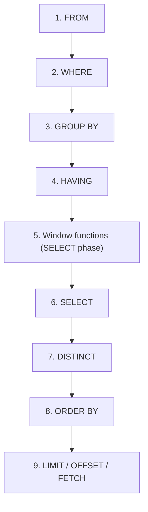
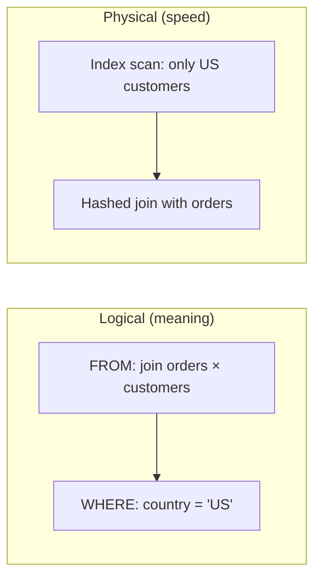

# 06 — Logical Query Processing Order

## Table of Contents

1. [What Is Logical Query Processing Order?]Section generated at `sql-handbook/1-Fundamentals/06-Logical-Query-Processing-Order.md` (1001 lines).

Coverage: full 9-step logical order with Mermaid diagram, worked step-by-step walkthrough on the shared schema, consequences (aliases, LEFT→INNER trap, WHERE/HAVING split), NULL behavior per step, 7 common mistakes, 7 production pitfalls, plan-verification-based performance guidance, 5 BAD vs BETTER scenarios, PostgreSQL/MySQL/SQL Server/Oracle comparison table, best practices, and 45 interview questions across all 8 requested categories.
ep 5: Window Functions (SELECT phase)](#step-5-window-functions-select-phase)

- [Step 6: SELECT](#step-6-select)
- [Step 7: DISTINCT](#step-7-distinct)
- [Step 8: ORDER BY](#step-8-order-by)
- [Step 9: LIMIT / OFFSET / FETCH](#step-9-limit--offset--fetch)

8. [Consequences of the Order — The "Why" Behind Famous Rules](#consequences-of-the-order--the-why-behind-famous-rules)
9. [NULL Behavior](#null-behavior)
10. [Common Mistakes](#common-mistakes)
11. [Production Pitfalls](#production-pitfalls)
12. [Performance Implications](#performance-implications)
13. [BAD Approach vs BETTER Approach](#bad-approach-vs-better-approach)
14. [Database-Specific Differences](#database-specific-differences)
15. [Best Practices](#best-practices)
16. [Interview Questions](#interview-questions)

---

## What Is Logical Query Processing Order?

SQL is a **declarative** language. You tell the database **what** you want, not **how** to compute it. The engine's optimizer is free to rearrange operations internally to find a fast plan.

But there is one thing the database cannot rearrange: **the meaning of your query.** The logical query processing order is the conceptual sequence of steps the database engine uses to _interpret_ your `SELECT` statement so that every query with the same clauses yields the same meaning.

> **Key idea:** The order in which you _write_ clauses and the order in which the database _logically evaluates_ them are **opposites**.

```sql
-- You write clauses in this order:
SELECT     ...   -- 5th logically
FROM       ...   -- 1st logically
WHERE      ...   -- 2nd logically
GROUP BY   ...   -- 3rd logically
HAVING     ...   -- 4th logically
ORDER BY   ...   -- 8th logically
LIMIT      ...   -- 9th logically
```

> **Common misconception**
> "The database reads rows top to bottom through my clauses like a pipeline." — It does not. The logical order is a _conceptual_ contract. The optimizer may physically process rows in a very different sequence (e.g. `WHERE` filters during an index scan, before any "FROM join" fully materializes). Both are true: the **logical order defines the result**, the **physical plan determines the speed**.

> **Interview trap**
> "SELECT is written first, so it is evaluated first." — Wrong. `FROM` is always evaluated first. `SELECT` is near the end.

---

## The Eight Steps

Here is the standard logical order, per the ANSI SQL standard:



| #   | Step                         | What logica happens                                                                                                                                          |
| --- | ---------------------------- | ------------------------------------------------------------------------------------------------------------------------------------------------------------ |
| 1   | `FROM`                       | Build the working set. Include `JOIN`s, subqueries, CTEs, table functions. The cartesian product of the sources is formed, then join conditions are applied. |
| 2   | `WHERE`                      | Filter **rows**. Row-level predicates only. Aggregate functions and aliases are **not** available yet.                                                       |
| 3   | `GROUP BY`                   | Collapse rows into groups. One output row per group.                                                                                                         |
| 4   | `HAVING`                     | Filter **groups** (after grouping). Can reference aggregated values.                                                                                         |
| 5   | Window functions             | Compute window functions over the rows that survived steps 1–4. One output row is **kept per input row**, and the window value is attached.                  |
| 6   | `SELECT`                     | Compute expressions, assign aliases.                                                                                                                         |
| 7   | `DISTINCT`                   | Remove duplicate result rows.                                                                                                                                |
| 8   | `ORDER BY`                   | Sort the result. Can reference `SELECT` aliases (and even columns not in the `SELECT` list, in most engines).                                                |
| 9   | `LIMIT` / `OFFSET` / `FETCH` | Truncate the result set to the requested number of rows.                                                                                                     |

Optimization note: a real optimizer may push a `WHERE` predicate down into a table scan (predicate pushdown) or reorder joins. But the **result set** must always be identical to what the logical order produces.

> Protected by ANSI SQL, this order is what makes SQL **set-based** rather than **procedural**: each step consumes a set (or multiset) of rows and produces another set.

---

## Why the Order Matters

The order is not trivia. It explains a long list of rules that confuse beginners:

| Famous rule                                       | Explanation rooted in the order                                                                                                        |
| ------------------------------------------------- | -------------------------------------------------------------------------------------------------------------------------------------- |
| You cannot use a `SELECT` alias in `WHERE`        | `WHERE` runs at step 2; aliases do not exist until step 6.                                                                             |
| You **can** use a `SELECT` alias in `ORDER BY`    | `ORDER BY` runs at step 8, after aliases exist.                                                                                        |
| Aggregate functions cannot appear in `WHERE`      | Aggregation happens in `GROUP BY`/`HAVING` (steps 3–4), after `WHERE` filtering.                                                       |
| `WHERE` filters rows _before_ `GROUP BY`          | Rows that fail `WHERE` never enter a group.                                                                                            |
| `HAVING` filters _after_ grouping                 | It sees the aggregates produced by `GROUP BY`.                                                                                         |
| `COUNT(*)` after a join counts the _joined_ rows  | `FROM` (step 1) materializes every join combination before any counting.                                                               |
| `DISTINCT` + `ORDER BY` restrictions              | `DISTINCT` (step 7) removes duplicates _before_ `ORDER BY` sorts (step 8), so `ORDER BY` can only use columns that survive `DISTINCT`. |
| `LIMIT` returns arbitrary rows without `ORDER BY` | `LIMIT` is literally the last step; without an explicit sort there is no defined winner.                                               |

Every one of these follows directly from the numbered steps. This is the deepest payoff of the section: **memorize the order, and the rules stop being facts to memorize — they become consequences.**

---

## Logical Order vs Physical Execution

> **Production pitfall**
> Never confuse "logical order" with "what the query plan actually does." A query is not a program that runs these steps on a CPU. It is a contract about _meaning_, and the optimizer chooses a plan that satisfies that contract as fast as possible.

Example: `SELECT * FROM orders o JOIN customers c ON o.customer_id = c.customer_id WHERE c.country = 'US'`.

Logically: join everything first, then filter by country.
Physically: the engine will almost certainly read only US customers from an index first (filtering at the index scan), then join the tiny result to orders. This is called **predicate pushdown** or **filter during scan**. The physical plan is the reverse of the logical order.



Both produce the same rows. The logical order defines _what_ — the planner decides _how_.

> This is why this section belongs in _Fundamentals_: it is the bridge between "writing SQL that compiles" and "writing SQL that means what you intend."

---

## Sample Tables and Data

For every example in this section we use the standard handbook schema.

> **Grain:**
>
> - `departments`: one row = one department
> - `employees`: one row = one employee; each employee belongs to exactly one department
> - `customers`: one row = one customer
> - `orders`: one row = one order; each order belongs to exactly one customer

```sql
CREATE TABLE departments (
    dept_id     INT         PRIMARY KEY,
    dept_name   VARCHAR(50) NOT NULL,
    budget      DECIMAL(12,2)
);

CREATE TABLE employees (
    emp_id          INT         PRIMARY KEY,
    first_name      VARCHAR(50) NOT NULL,
    last_name       VARCHAR(50) NOT NULL,
    salary          DECIMAL(10,2),
    dept_id         INT         REFERENCES departments(dept_id),
    hire_date       DATE
);

CREATE TABLE customers (
    customer_id INT         PRIMARY KEY,
    full_name   VARCHAR(100) NOT NULL,
    country     VARCHAR(50)
);

CREATE TABLE orders (
    order_id    INT  PRIMARY KEY,
    customer_id INT  REFERENCES customers(customer_id),
    order_date  DATE NOT NULL,
    amount      DECIMAL(10,2) NOT NULL
);
```

Seed data:

```sql
INSERT INTO departments VALUES
  (1, 'Engineering',  500000),
  (2, 'Sales',        300000),
  (3, 'Marketing',    250000);

INSERT INTO employees VALUES
  (101, 'Alice',  'Adams', 95000.00, 1, '2020-03-01'),
  (102, 'Bob',    'Barker', 82000.00, 1, '2021-06-15'),
  (103, 'Carla',  'Chen',   NULL,     2, '2019-01-10'),
  (104, 'David',  'Diaz',   64000.00, NULL, '2022-09-01'),
  (105, 'Emma',   'Evans',  98000.00, 3, '2018-11-20'),
  (106, 'Frank',  'Fox',    70000.00, 2, '2023-02-01');

INSERT INTO customers VALUES
  (1, 'Global Goods Inc', 'US'),
  (2, 'Mini Mart GmbH',   'DE'),
  (3, 'Piko spol. s r.o.', 'CZ');

INSERT INTO orders VALUES
  (501, 1, '2025-01-05',  250.00),
  (502, 1, '2025-02-11', 1200.00),
  (503, 2, '2025-01-20',  80.00),
  (504, 3, '2025-03-02',  999.99);
```

---

## Step-by-Step Walkthrough

Let's trace one query through every logical step. This is the single most important exercise in this section.

```sql
SELECT d.dept_name, COUNT(*) AS emp_count, AVG(e.salary) AS avg_salary
FROM employees e
JOIN departments d ON e.dept_id = d.dept_id
WHERE e.salary IS NOT NULL
GROUP BY d.dept_name
HAVING COUNT(*) >= 2
ORDER BY avg_salary DESC;
```

### Step 1 — FROM

Input: the tables `employees` (`e`) and `departments` (`d`) from the catalog.

Conceptually, the engine joins every `employees` row to every possible `departments` row (the Cartesian product), then applies the `ON` condition `e.dept_id = d.dept_id`. What survives:

| emp_id | first_name | salary   | dept_id | dept_id | dept_name   | budget    |
| ------ | ---------- | -------- | ------- | ------- | ----------- | --------- |
| 101    | Alice      | 95000.00 | 1       | 1       | Engineering | 500000.00 |
| 102    | Bob        | 82000.00 | 1       | 1       | Engineering | 500000.00 |
| 103    | Carla      | NULL     | 2       | 2       | Sales       | 300000.00 |
| 105    | Emma       | 98000.00 | 3       | 3       | Marketing   | 250000.00 |
| 106    | Frank      | 70000.00 | 2       | 2       | Sales       | 300000.00 |

David (104) has `dept_id = NULL`; `NULL = d.dept_id` is UNKNOWN for every department, so he drops out at the join. No `departments` row matches. That is a correct example of an **inner join**: unmatched rows disappear right here, at **step 1**, before any filtering.

### Step 2 — WHERE

Apply `e.salary IS NOT NULL`.

| Rows: | emp_id | first_name | salary      | dept_name |
| ----- | ------ | ---------- | ----------- | --------- |
| 101   | Alice  | 95000.00   | Engineering |
| 102   | Bob    | 82000.00   | Engineering |
| 105   | Emma   | 98000.00   | Marketing   |
| 106   | Frank  | 70000.00   | Sales       |

Carla (103) has a NULL salary and is removed here — **before grouping**, so she will never be counted in `COUNT(*)`.

### Step 3 — GROUP BY

Group by `dept_name`. Conceptually four input rows collapse into three groups:

| dept_name   | members    |
| ----------- | ---------- |
| Engineering | Alice, Bob |
| Sales       | Frank      |
| Marketing   | Emma       |

### Step 4 — HAVING

Filter groups where `COUNT(*) >= 2`. Only **Engineering** survives (2 members). Sales and Marketing are dropped.

> Note: `HAVING COUNT(*) >= 2` counts _surviving rows of the group_. Since Carla was removed in step 2, Sales has only 1 row here — this is why **the order of WHERE before GROUP BY changes your HAVING result**.

### Step 5 — Window functions

Our query has none; this step is a no-op.

### Step 6 — SELECT

Compute expressions for the surviving groups:

| dept_name   | emp_count | avg_salary |
| ----------- | --------- | ---------- |
| Engineering | 2         | 88500.00   |

### Step 7 — DISTINCT

Not used.

### Step 8 — ORDER BY

Sort by `avg_salary DESC`. One group, so order is trivial here. `avg_salary` is a _`SELECT` alias_ — legal only because `ORDER BY` runs after `SELECT`.

### Step 9 — LIMIT

Not used.

**Final output:**

| dept_name   | emp_count | avg_salary |
| ----------- | --------- | ---------- |
| Engineering | 2         | 88500.00   |

> **Interview trap**
> Ask yourself: "What happens if I move `e.salary IS NOT NULL` from `WHERE` into `HAVING`?" Answer: Carla would be _counted_ in Sales (3 groups) and then _dropped_ when measuring its average. The result differs — because `WHERE` filters input rows and `HAVING` filters groups. Same predicate, different step, different answer.

---

## Close Examination of Each Step

### Step 1: FROM

The `FROM` step builds the base working relation. Elements it can contribute:

- Base tables (`FROM employees e`)
- Derived tables (`FROM (SELECT ...) t`)
- CTEs (`WITH t AS (SELECT ...) SELECT ... FROM t`)
- `JOIN`s (`INNER`, `LEFT`, `RIGHT`, `FULL`, `CROSS`)
- Table functions (`FROM generate_series(1,10)`, `xmltable`, `json_table`, etc.)

Join semantics matter here because everything downstream sees the **joined** result:

```sql
SELECT c.full_name, o.order_id
FROM customers c
LEFT JOIN orders o ON o.customer_id = c.customer_id;
```

| full_name         | order_id |
| ----------------- | -------- |
| Global Goods Inc  | 501      |
| Global Goods Inc  | 502      |
| Mini Mart GmbH    | 503      |
| Piko spol. s r.o. | 504      |

A customer with zero orders would appear once with a `NULL` order (LEFT JOIN keeps all `customers` rows). Because `FROM` runs first, a `LEFT JOIN` cannot be "rescued" by a `WHERE` on the right-hand table — see [Step 2](#step-2-where) and the [consequences](#consequences-of-the-order--the-why-behind-famous-rules).

### Step 2: WHERE

`WHERE` consumes the step-1 relation and eliminates rows where the predicate is not TRUE. Because SQL uses **three-valued logic**, a predicate evaluating to `UNKNOWN` (any comparison with NULL) also eliminates the row.

Available in `WHERE`:

- Columns from any table in `FROM`
- Column aliases from `FROM`-level definitions (e.g. a subquery alias referenced outer)
- Scalar subqueries, `EXISTS`, `IN`, `LIKE`, `BETWEEN`, etc.

Not available in `WHERE`:

- `SELECT` aliases (created in step 6)
- Aggregate results like `AVG(salary)` or `COUNT(*)`

```sql
-- ERROR in standard SQL:
-- "no such column: avg_salary" / invalid column reference
SELECT emp_id, salary * 1.1 AS raised, (salary * 1.1) - salary AS delta
FROM employees
WHERE delta > 1000;
```

The alias `delta` does not exist yet. Corrected:

```sql
SELECT emp_id, salary * 1.1 AS raised, (salary * 1.1) - salary AS delta
FROM employees
WHERE salary * 1.1 - salary > 1000;
```

> MySQL is lax here: it lets you (in some modes) reuse `SELECT` aliases inside `WHERE`/`GROUP BY`/`HAVING`. It is a non-standard extension and notoriously surprising — do not rely on it. See [Database-Specific Differences](#database-specific-differences).

### Step 3: GROUP BY

`GROUP BY` collects all rows that have the same values in the listed columns (per NULL grouping behavior — NULLs group together) and emits **one row per group**. After this step, the only columns you may safely reference are:

- the grouping columns,
- aggregates over the group (`COUNT`, `SUM`, `AVG`, `MIN`, `MAX`, ...).

```sql
SELECT dept_id, COUNT(*) AS n
FROM employees
GROUP BY dept_id;
```

| dept_id | n   |
| ------- | --- |
| 1       | 2   |
| 2       | 2   |
| 3       | 1   |
| NULL    | 1   |

David's `dept_id IS NULL` forms its own **NULL group**. NULLs group together; the group is _not_ skipped.

> **Common misconception**
> "GROUP BY sorts the output." — It may, for convenience, but there is **no ordering guarantee** unless you write `ORDER BY`. Do not rely on group-by ordering in production.

> **Production pitfall**
> `GROUP BY` on a high-cardinality column over many rows is memory-hungry. The engine builds a hash or sort for grouping. Verify with an execution plan whether a sort-based group is avoidable (e.g. with an index matching the `GROUP BY` columns).

### Step 4: HAVING

`HAVING` filters **groups** produced in step 3. It can reference:

- grouping columns
- aggregates (`COUNT(*)`, `SUM(amount)`, ...)
- combinations of the two

It cannot reference:

- non-grouped, non-aggregated columns (meaningless at group level)
- `SELECT` aliases in most engines (a few allow it)

```sql
SELECT dept_id, AVG(salary) AS avg_salary
FROM employees
GROUP BY dept_id
HAVING AVG(salary) > 80000;
```

| dept_id | avg_salary |
| ------- | ---------- |
| 1       | 88500.00   |
| 3       | 98000.00   |

Sales (dept 2) is dropped because its average — computed over salaries that are not NULL — is 70000.00.

> **Key distinction to teach:**
>
> - `WHERE` filters **rows** (step 2).
> - `HAVING` filters **groups** (step 4).
> - You can **always** express a `HAVING` predicate over grouping columns as a `WHERE`, but you can **only** express aggregate predicates in `HAVING`.

```sql
-- redundant but legal: dept_id is a grouping column
WHERE dept_id <> 3
...
HAVING COUNT(*) > 0   -- equivalent to "any group"
```

### Step 5: Window Functions (SELECT phase)

Window functions are computed **after** `WHERE`, `GROUP BY`, and `HAVING`, and they operate on the surviving rows **without collapsing them**. They belong to the `SELECT` phase and are evaluated just before the `SELECT` expressions themselves.

```sql
SELECT
    e.first_name,
    d.dept_name,
    e.salary,
    AVG(e.salary) OVER (PARTITION BY e.dept_id) AS dept_avg
FROM employees e
JOIN departments d ON e.dept_id = d.dept_id
WHERE e.salary IS NOT NULL;
```

| first_name | dept_name   | salary   | dept_avg |
| ---------- | ----------- | -------- | -------- |
| Alice      | Engineering | 95000.00 | 88500.00 |
| Bob        | Engineering | 82000.00 | 88500.00 |
| Frank      | Sales       | 70000.00 | 70000.00 |
| Emma       | Marketing   | 98000.00 | 98000.00 |

Every input row produces exactly one output row; the window `AVG` is attached to each row of its partition. Because window functions run after `WHERE`, the partition averages exclude any rows already filtered out — exactly what makes the result above differ from an aggregate over the whole table.

> **Cross-reference:** See the Window Functions section (1-Fundamentals/07 or wherever it lands) for `ROW_NUMBER`, `RANK`, and `DENSE_RANK` semantics. For the logical-order story, the one thing to remember here is the timing: **window functions see rows only after HAVING has removed groups' members.**

### Step 6: SELECT

`SELECT` builds the final column list, computes expressions, assigns aliases, and decides which columns survive. `SELECT` is where scalar expressions, string concatenation, arithmetic, casts, and CASE are evaluated.

```sql
SELECT
    UPPER(first_name)          AS name,
    salary * 12                AS annual,
    COALESCE(salary, 0)/12     AS monthly_or_zero
FROM employees;
```

Aliases created here become visible from step 7 onward.

### Step 7: DISTINCT

`DISTINCT` removes duplicate **whole rows** from the result of step 6. Duplicates are judged on the _output_ row — the columns that remain after `SELECT`.

```sql
SELECT DISTINCT dept_id FROM employees;
```

| dept_id |
| ------- |
| 1       |
| 2       |
| 3       |
| NULL    |

`DISTINCT` also interacts with `ORDER BY`: because `ORDER BY` runs **after** `DISTINCT`, an `ORDER BY` column must either be in the `SELECT` list or be functionally determined by it.

```sql
-- ERROR in most engines: ORDER BY expression must appear in select list
SELECT DISTINCT dept_id
FROM employees
ORDER BY salary DESC;
```

Once duplicates are removed, the result no longer contains `salary` to sort by.

### Step 8: ORDER BY

Sort the results. This is the _only_ step whose output is explicitly ordered. Two consequences:

1. **`ORDER BY` can use `SELECT` aliases** — aliases exist since step 6.
2. **Without `ORDER BY`, output order is undefined.** `LIMIT` without `ORDER BY` does not return "the first N" — it returns _your server's chosen N_, which can vary run-to-run.

```sql
SELECT first_name, salary AS pay
FROM employees
ORDER BY pay DESC;   -- alias is fine here
```

| first_name | pay      |
| ---------- | -------- |
| Emma       | 98000.00 |
| Alice      | 95000.00 |
| Bob        | 82000.00 |
| Frank      | 70000.00 |
| Carla      | NULL     |

Note Carla sorts **last** in PostgreSQL and many engines (NULLs last by default there); SQL Server historically sorts NULLs **first** for ascending order, and SQL Server 2022+ introduces `NULLS FIRST`/`NULLS LAST`. Use explicit `NULLS FIRST` / `NULLS LAST` to be unambiguous.

### Step 9: LIMIT / OFFSET / FETCH

The final step trims rows. `LIMIT 2` in PostgreSQL/MySQL/SQLite; `TOP (2)` in SQL Server; `FETCH FIRST 2 ROWS ONLY` in standard SQL (and only supported in Oracle 12c+; Oracle pre-12c used `ROWNUM`).

```sql
SELECT emp_id, first_name
FROM employees
ORDER BY hire_date
LIMIT 2;
```

| emp_id | first_name |
| ------ | ---------- |
| 105    | Emma       |
| 103    | Carla      |

> **Production pitfall**
> `OFFSET` must first _materialize and skip_ that many rows. On deep pages (`LIMIT 10 OFFSET 100000`) the engine still reads and discards 100 000 rows. This is why keyset pagination (`WHERE id > ? ORDER BY id LIMIT 10`) is preferred for large pagination. See the Pagination section in the handbook.

---

## Consequences of the Order — The "Why" Behind Famous Rules

### 1. Aliases: why `WHERE` rejects them but `ORDER BY` accepts them

Positions: `WHERE` = step 2, `SELECT` (alias creation) = step 6, `ORDER BY` = step 8.

```sql
SELECT amount * 1.2 AS discounted
FROM orders
WHERE discounted > 100;          -- ERROR: alias not visible at step 2
ORDER BY discounted DESC;        -- OK: alias visible at step 8
```

### 2. Aggregates vs `WHERE`

`WHERE` cannot contain aggregate functions because no grouping has happened yet.

```sql
SELECT AVG(amount)
FROM orders
WHERE AVG(amount) > 100;   -- ERROR: aggregate not valid in WHERE
```

### 3. `LEFT JOIN` + `WHERE` on the right table = `INNER JOIN`

This is one of the most common logic bugs in production SQL:

```sql
SELECT c.full_name, o.order_id
FROM customers c
LEFT JOIN orders o ON o.customer_id = c.customer_id
WHERE o.order_date >= '2025-02-01';
```

Logically: `FROM` produces outer-joined rows (every customer; unmatched → `NULL` on the right). Then `WHERE` runs and **removes every row where `o.order_date` is NULL**. The `LEFT JOIN` has been silently converted to an `INNER JOIN` — the very result a developer chose LEFT to avoid.

The fix is to move the condition into the `ON` clause:

```sql
SELECT c.full_name, o.order_id
FROM customers c
LEFT JOIN orders o
    ON o.customer_id = c.customer_id
   AND o.order_date >= '2025-02-01';   -- preserved in step 1, keeps NULL rows
```

| full_name         | order_id |
| ----------------- | -------- |
| Global Goods Inc  | 502      |
| Mini Mart GmbH    | NULL     |
| Piko spol. s r.o. | NULL     |

> **Interview trap**
> "What's the difference between putting a condition in `ON` vs `WHERE` of a `LEFT JOIN`?" Answer in two parts: for `INNER JOIN` the result is **identical** (optimizer may even do the same). For outer joins, `ON` controls which rows are _matched during step 1_ (extra predicate evaluated during the join), while `WHERE` unconditionally **discards** rows after the join, NULLs included.

### 4. `WHERE` before `GROUP BY` changes `HAVING` counts

Already shown in the walkthrough: rows filtered in step 2 never reach step 4. Use this whenever you want aggregates over a filtered population versus over the full population.

### 5. `DISTINCT` before `ORDER BY` restricts sort columns

Already shown in Step 7: a `DISTINCT` result cannot sort by a column that no longer exists.

### 6. `LIMIT` is last — so `ORDER BY` + `LIMIT` matters

`ORDER BY` (step 8) runs before `LIMIT` (step 9), which is why top-N queries are correct: the sort determines _which_ N rows are returned.

---

## NULL Behavior

Logical processing interacts with NULL at almost every step:

| Step      | NULL behavior                                                                                                                                                                 |
| --------- | ----------------------------------------------------------------------------------------------------------------------------------------------------------------------------- |
| FROM (ON) | Join condition `a = b` with NULL on either side evaluates UNKNOWN → row not matched (INNER) / kept with NULLs (LEFT).                                                         |
| WHERE     | Predicate must be TRUE; `salary = NULL` is UNKNOWN → row discarded. Use `IS NULL` / `IS NOT NULL`.                                                                            |
| GROUP BY  | NULLs form their own group together (`GROUP BY dept_id` yields a NULL group). Not skipped, not split.                                                                         |
| HAVING    | `COUNT(*)` counts NULL-bearing rows; `COUNT(salary)` counts only non-NULL. Aggregate input NULLs are excluded by aggregates themselves (`AVG(salary)` ignores NULL salaries). |
| SELECT    | Expressions propagate NULL: `NULL + 5` is NULL; `CONCAT(NULL,...)` depends on engine.                                                                                         |
| ORDER BY  | NULLs sort first or last depending on engine and `NULLS FIRST`/`NULLS LAST`.                                                                                                  |
| DISTINCT  | All NULLs compare equal to each other → one NULL in the distinct output.                                                                                                      |
| LIMIT     | `ORDER BY` + NULL ordering decides which rows the limit keeps.                                                                                                                |

The single most important rule:

> `WHERE` discards rows where the predicate is **UNKNOWN**, not only where it is FALSE. `ON` treats UNKNOWN the same way (for `INNER`); for outer joins UNKNOWN keeps the outer row with NULLs.

Null-safe comparison `IS NOT DISTINCT FROM` treats NULL = NULL as true and is handy in join/anti-join scenarios — see the NULL section (1-Fundamentals/02 or 08) for the details.

---

## Common Mistakes

1. **Using a `SELECT` alias in `WHERE`.**

   ```sql
   -- ERROR
   SELECT amount * 1.21 AS brutto FROM orders WHERE brutto > 100;
   -- FIX
   SELECT amount * 1.21 AS brutto FROM orders WHERE amount * 1.21 > 100;
   ```

2. **Nesting `SELECT`/`ORDER BY` inside the logical pipeline by intuition.**
   Write `SELECT` last in your head. A common symptom: "I did `WHERE ... ORDER BY ... LIMIT` but I got rows I expected to be filtered" — usually the filter was on a window/aggregate that logically happens later.

3. **Treating `GROUP BY` output as ordered.** It is not; add `ORDER BY`.

4. **Counting joined rows by mistake.** `COUNT(*)` counts step-1 rows. One customer with two orders makes `COUNT(*)` return 2 even if "customer" was intended.

   ```sql
   -- counts order_rows, NOT customers
   SELECT COUNT(*) FROM customers c JOIN orders o ON o.customer_id = c.customer_id;
   -- count customers instead:
   SELECT COUNT(DISTINCT c.customer_id) FROM customers c JOIN orders o ON o.customer_id = c.customer_id;
   ```

5. **Putting a `LEFT JOIN` guard condition in `WHERE`.**
   Reinforces the silent inner-join conversion ([Consequence 3](#3-left-join--where-on-the-right-table--inner-join)).

6. **Expecting `LIMIT` to take "the first" rows without `ORDER BY`.** There is no first.

7. **Forgetting that `HAVING` runs after grouping**, so a `WHERE`-eligible predicate placed in `HAVING` still shifts semantics and can cost a group build of rows that could have been filtered earlier.

---

## Production Pitfalls

1. **Non-deterministic `LIMIT` batches without `ORDER BY`.** With parallel plans, the chosen rows can change between runs → duplicate/missing rows in batched jobs.

2. **Deep `OFFSET` pagination** forces the engine to sort + skip everything before the page. Use keyset pagination: `WHERE (id) > (last_seen) ORDER BY id LIMIT 100`.

3. **Appending `DISTINCT` as a "dedupe patch" on a broken JOIN.** Duplicates usually come from fan-out in `FROM` (step 1). Fix the provenance instead; `DISTINCT` hides the cause and inflates the plan cost (sort/hash of whole result).

4. **Using `WHERE` on an outer-joined table** silently changes semantics. Set up a code-review rule: _predicates on the nullable side of a LEFT JOIN belong in `ON`._

5. **Relying on execution order assumptions for performance.** The optimizer reorders physical operations; logical ordering is a correctness contract, not a speed plan. Validate with `EXPLAIN ANALYZE`.

6. **`GROUP BY` on wide/high-cardinality sets** can spill to disk. Prefer filtering in `WHERE` (step 2) before grouping (step 3).

7. **Overloading `HAVING` with row-level predicates.** `HAVING dept_id = 2` over a big table groups everything before deciding it only wanted one department — move it to `WHERE`.

---

## Performance Implications

Logical order is a _correctness_ model. Performance follows the **physical plan**, which the optimizer derives from:

- available indexes
- table statistics / cardinality
- data distribution
- join shapes (nested loop, hash join, merge join)
- whether predicates are sargable
- query shape (views, CTEs, subqueries are generally inlined by the planner)
- engine-specific cost models

Two concrete, verifiable optimizations that relate directly to logical order:

**Predicate pushdown.** The planner proves it can evaluate a `WHERE` predicate _during_ the scan and discards rows earlier than the "textbook" step-2 position. Result is unchanged; speed improves. This is exactly why people say "put filters early" — it's an _optimizer heuristic_ expressed in physical terms, not a logical-order rule.

**Grouping strategy.** `GROUP BY` may be executed as a hash aggregate or a sort aggregate. A query whose `WHERE` filters most rows benefits from the filter running before the group build — verified via `EXPLAIN` as a low-cardinality scan feeding the aggregation node.

> **What to verify in the plan:**
>
> - Which node feeds the aggregate (what row count enters it)?
> - Is the join ordered (nested loop with index) or hashed?
> - Did the planner push the `WHERE` predicate into the base-table scan or index condition?
> - Is a `SORT` node present for `ORDER BY`/`GROUP BY`/`DISTINCT`, and can it be avoided via an index?

> Never claim "X makes it faster." Compare plans. `EXPLAIN ANALYZE` (PostgreSQL), `EXPLAIN (ANALYZE, BUFFERS)` (PostgreSQL), `SET STATISTICS IO, TIME ON` (SQL Server), `EXPLAIN ANALYZE TABLE` / `DBMS_XPLAN.DISPLAY_CURSOR` (Oracle), `EXPLAIN ANALYZE` with `FORMAT=TREE` (MySQL 8+).

---

## BAD Approach vs BETTER Approach

### Scenario 1: Top-N per group (window functions)

Task: find the highest-paid employee in each department.

BAD — a self-join with a correlated max must scan groups repeatedly and duplicates appear when salaries tie:

```sql
SELECT e.dept_id, e.first_name, e.salary
FROM employees e
WHERE e.salary = (SELECT MAX(e2.salary)
                  FROM employees e2
                  WHERE e2.dept_id = e.dept_id);
```

Why it is bad: correlated subquery re-scans per row; ties return _all_ matching rows (maybe intended, maybe not); NULL dept_id rows match nobody.

BETTER — window function, and the logical order is on our side (windowing after grouping preserves per-row identity):

```sql
SELECT dept_id, first_name, salary
FROM (
    SELECT e.dept_id, e.first_name, e.salary,
           ROW_NUMBER() OVER (PARTITION BY e.dept_id ORDER BY e.salary DESC) AS rn
    FROM employees e
    WHERE e.salary IS NOT NULL
) ranked
WHERE rn = 1;
```

### Scenario 2: Filter before aggregate

Task: average salary of Engineering employees.

BAD — groups everything, then filters in `HAVING`:

```sql
SELECT dept_id, AVG(salary) AS avg_sal
FROM employees
GROUP BY dept_id
HAVING dept_id = 1;
```

BETTER — filter rows before grouping:

```sql
SELECT dept_id, AVG(salary) AS avg_sal
FROM employees
WHERE dept_id = 1
GROUP BY dept_id;
```

Same result, physically cheaper: only department-1 rows feed the aggregation. Verify the plan; on big tables this matters.

### Scenario 3: LEFT JOIN preservability

Task: all customers and their orders placed in February 2025, keeping customers with none.

BAD — `WHERE` strips NULLs (silently becomes INNER JOIN):

```sql
SELECT c.full_name, o.order_id
FROM customers c
LEFT JOIN orders o ON o.customer_id = c.customer_id
WHERE o.order_date >= '2025-02-01';
```

BETTER — condition in `ON`, preserved through step 1:

```sql
SELECT c.full_name, o.order_id
FROM customers c
LEFT JOIN orders o
    ON o.customer_id = c.customer_id
   AND o.order_date >= '2025-02-01';
```

### Scenario 4: Count distinct before fan-out

Task: count customers who have orders.

BAD — `COUNT(*)` after the join counts order rows (fan-out from step 1):

```sql
SELECT COUNT(*) FROM customers c JOIN orders o ON o.customer_id = c.customer_id;
```

BETTER — explicit distinct at the right level:

```sql
SELECT COUNT(DISTINCT c.customer_id)
FROM customers c JOIN orders o ON o.customer_id = c.customer_id;
-- or cleaner, existence-driven:
SELECT COUNT(*) FROM customers c WHERE EXISTS (SELECT 1 FROM orders o WHERE o.customer_id = c.customer_id);
```

### Scenario 5: Avoid sort, use index to satisfy ORDER BY

Task: 10 latest orders.

BAD — full re-sort in step 8 is avoidable:

```sql
SELECT * FROM orders ORDER BY order_date DESC, order_id DESC LIMIT 10;
```

BETTER — an index on `(order_date DESC, order_id DESC)` lets the planner return rows already sorted, skipping the explicit SORT node:

```sql
CREATE INDEX idx_orders_date ON orders (order_date DESC, order_id DESC);

SELECT * FROM orders ORDER BY order_date DESC, order_id DESC LIMIT 10;
```

Verify with `EXPLAIN` that the SORT node disappeared and scans stopped after 10 rows.

---

## Database-Specific Differences

> PostgreSQL
>
> - Strictly standard: `SELECT` aliases are **not** allowed in `WHERE`; they are allowed in `ORDER BY` **and** in `GROUP BY` (as output-column names, only if unambiguous). Window functions are well supported. `LIMIT`/`OFFSET` and SQL `FETCH FIRST ... ROWS` both exist. NULLs sort `last` ascending by default; supports `NULLS FIRST/LAST` explicitly.

> MySQL
>
> - Historically very lax: in non-strict/`ONLY_FULL_GROUP_BY`-off modes, `SELECT` aliases may be reused inside `WHERE`/`GROUP BY`/`HAVING`, and `SELECT` can reference non-grouped columns. That freedom is a high-risk pitfall: the same SQL can change meaning across mode changes. Prefer standard, portable SQL. `LIMIT`/`OFFSET`. MySQL 8.0.2+ supports `FETCH FIRST` and window functions; MySQL does **not** support `FULL OUTER JOIN` until 8.0.22+ (then it does). `GROUP BY` implicitly sorted rows before 8.0 — matching "GROUP BY orders" folklore; 8.0 removed that.

> SQL Server
>
> - `SELECT` alias allowed in `ORDER BY`, not in `WHERE`/`GROUP BY`/`HAVING`. Top-N via `SELECT TOP (N) ...`, `OFFSET ... FETCH` supported for pagination. Window functions since SQL Server 2005/2012 (FULL support). NULLs sort lowest (first) ascending historically; `NULLS FIRST/LAST` only since SQL Server 2022 (16.x). `GROUP BY` output has no guaranteed order.

> Oracle
>
> - `SELECT` alias allowed in `ORDER BY` only (not `WHERE`, `GROUP BY`, `HAVING`). No `LIMIT`; use `FETCH FIRST n ROWS ONLY` (Oracle 12c+) or historic `ROWNUM`. NULLs sort last ascending by default, with `NULLS FIRST/LAST`. `GROUP BY` result order is not guaranteed. Oracle's `EXPLAIN PLAN`/`DBMS_XPLAN` shows the physical operations corresponding to each logical phase.

| Behavior                | PostgreSQL                     | MySQL                | SQL Server                            | Oracle                                              |
| ----------------------- | ------------------------------ | -------------------- | ------------------------------------- | --------------------------------------------------- |
| Alias in WHERE          | No                             | Lax (mode-dependent) | No                                    | No                                                  |
| Alias in GROUP BY       | Yes (standard name resolution) | Yes                  | No                                    | No                                                  |
| Alias in HAVING         | No                             | Lax (mode-dependent) | No                                    | No                                                  |
| Alias in ORDER BY       | Yes                            | Yes                  | Yes                                   | Yes                                                 |
| Top-N syntax            | `LIMIT n`, `FETCH FIRST`       | `LIMIT n`            | `SELECT TOP (n)`; also `OFFSET/FETCH` | `FETCH FIRST` (12c+), `ROWNUM` (older)              |
| DEFAULT NULL sort (ASC) | last (NULLS LAST)              | first                | first                                 | last (implementation-defined), use NULLS FIRST/LAST |
| Window functions        | Yes                            | 8.0+                 | Yes                                   | Yes                                                 |

---

## Best Practices

1. **Write the query in logical order in your head.** If you can narrate each step (rows in → group → filter → project → sort → limit), you can predict the result.
2. **Put row-level filters in `WHERE`, group-level filters in `HAVING`.** Ask: does the predicate apply to a row or to a group?
3. **Never use `SELECT` aliases before their step.** If an alias is needed in `WHERE`, restructure — e.g. a derived table:
   ```sql
   SELECT * FROM (SELECT amount * 1.21 AS brutto FROM orders) t WHERE brutto > 100;
   ```
4. **Pin every outer join.** Put right-side predicates in `ON`. Verbally state the grain before writing the query.
5. **Always pair `LIMIT` with `ORDER BY`** when the "which rows" matters.
6. **Count the grain, not the rows.** Before `COUNT(*)` after a join, ask: "one output row should represent what?" (See the SQL Reasoning checklist in the handbook introduction.)
7. **Use `DISTINCT` as a last resort, not a fix.** Investigate the fan-out in `FROM` first.
8. **Validate with `EXPLAIN`.** Confirm predicate pushdown, join order, sort elimination, and the row count feeding each operator, especially on multi-million-row tables.
9. **Prefer explicit `NULLS FIRST` / `NULLS LAST`** in `ORDER BY` to make intent portable.
10. **Keep `GROUP BY`/`HAVING` amounts matching `WHERE`-filterable predicates** so the optimizer can filter early.

---

# Interview Questions

## Beginner

1. What is the difference between _logical_ query processing order and _physical_ execution?
2. Which clause is logically evaluated first: `SELECT` or `FROM`? Why does the answer matter?
3. Why can't you use a column alias created in `SELECT` inside a `WHERE` clause?
4. Why _can_ you use that same alias inside `ORDER BY`?
5. What is the logical order (steps) of a plain `SELECT ... FROM ... WHERE ... ORDER BY ... LIMIT` query?
6. `WHERE` filters rows. `HAVING` filters what — and where does each sit in the logical order?
7. In `GROUP BY`, where does a `NULL` value go?
8. Does `GROUP BY` guarantee sorted output? What is the only step that guarantees order?

## Intermediate

9. Explain, using the logical order, why `SELECT DISTINCT dept_id FROM employees ORDER BY salary DESC` is invalid in most engines.
10. A `LEFT JOIN` with a condition on the right-hand table in `WHERE` silently becomes an `INNER JOIN`. Walk through the logical steps to explain why.
11. When can you move a `HAVING` predicate into `WHERE`, and when can you not?
12. Where do window functions fit in the logical order, and what does that mean for which rows they can see?
13. Write a query that averages salary per department for employees hired after 2020, and explain where each filter lives in the pipeline.
14. What does "predicate pushdown" mean, and how does it relate to logical vs physical order?
15. For `COUNT(*)` vs `COUNT(salary)` after a `GROUP BY`, explain the difference from the HAVING step's point of view.

## Advanced

16. Prove that `ON`-clause predicates and `WHERE`-clause predicates are equivalent for `INNER JOIN` but not for outer joins, using the logical pipeline.
17. Design a query where moving a predicate from `HAVING` to `WHERE` changes _the numeric result of an aggregate_ — explain the mechanism.
18. Explain three-valued logic in `WHERE`: why a predicate that evaluates to UNKNOWN removes the row.
19. How does the optimizer realize the logical order without executing the clauses literally? Describe the role of relational algebra and equivalence rules.
20. A query uses both `DISTINCT` and a window function. Where does each step run, and what restriction follows?

## Scenario Based

21. A developer writes a Feb-2025 report and loses every customer without a Feb order despite using `LEFT JOIN`. Adjust the query and explain the pipeline.
22. Pagination: at page 50 000 of `OFFSET`, response time explodes. Using the logical order and physical plan, explain why and propose a keyset fix.
23. You must return "the 3 most recent orders per customer." Which step of the logical order permits a per-partition top-N? Write both an `IN`-subquery version and a `ROW_NUMBER` version.
24. A billing report is suddenly double-counting revenue. You suspect fan-out in step 1. What do you check, and how do you fix `SUM` across a one-to-many join?
25. Your `EXPLAIN ANALYZE` shows the aggregate receiving 40 million rows. Where in the logical order could you have reduced that input?

## Tricky

26. `SELECT * FROM employees WHERE salary + 1000 > 2000` vs `... WHERE salary > 1000` — same meaning? Where would each predicate be evaluated physically?
27. Your `GROUP BY dept_id` produces a group for NULL dept_id. Is that a bug? On which engine (if any) would you see it dropped, and why?
28. `ORDER BY` can reference a column not in the `SELECT` list. Can `DISTINCT` coexist? Explain the constraint using steps 7 and 8.
29. Does `WHERE` run "before" a `LEFT JOIN`'s `ON`? Answer precisely for inner vs outer match semantics.
30. A query returns the same rows with `WHERE amount > 5` placed in a subquery _and_ applied at the outer level. Are they guaranteed to be identical under all optimizations? Why?

## Output Prediction

Given the seed data above, predict the output.

31.

```sql
SELECT COUNT(*)                                 AS all_rows,
       COUNT(dept_id)                            AS with_dept,
       COUNT(salary)                             AS with_salary
FROM employees;
```

32.

```sql
SELECT dept_id, COUNT(*) AS n
FROM employees
GROUP BY dept_id
ORDER BY dept_id;
```

33.

```sql
SELECT dept_id, COUNT(*) AS n, AVG(salary) AS avg_sal
FROM employees
WHERE salary IS NOT NULL
GROUP BY dept_id
HAVING COUNT(*) >= 2;
```

34.

```sql
SELECT c.full_name, COUNT(o.order_id) AS orders
FROM customers c
LEFT JOIN orders o ON o.customer_id = c.customer_id
GROUP BY c.customer_id, c.full_name
ORDER BY orders DESC;
```

35.

```sql
SELECT full_name, order_id
FROM customers c
LEFT JOIN orders o ON o.customer_id = c.customer_id
WHERE o.order_date >= '2025-02-01';
```

## Debugging

36. This query should return "one row per customer with their latest order" but returns extra rows. Apply the logical order to find the bug:

```sql
SELECT c.full_name, o.amount
FROM customers c
JOIN orders o ON o.customer_id = c.customer_id
WHERE o.order_date = (SELECT MAX(order_date) FROM orders);
```

37. A co-worker's alias filter fails:

```sql
SELECT amount * 1.21 AS brutto
FROM orders
WHERE brutto > 200;
```

Explain from which logical step the error arises and how to fix it.

38. The report says department counts are inflated after a person suddenly appears in two departments. Which step produced the duplicates and which clause 'fixed' it incorrectly?

```sql
SELECT d.dept_name, COUNT(*)
FROM departments d
JOIN employees e ON e.dept_id = d.dept_id
WHERE e.dept_id = 1
GROUP BY d.dept_name;
```

39. "I added ORDER BY hire_date and LIMIT 2, but the two rows changed when I ran it after a data load." Diagnose against the pipeline.

40. A LEFT JOIN loses customers — but only when the query has a `WHERE` on the joined table. Show the minimal reproduction and the correct `ON` placement.

## Performance

41. Justify (from logical order) why `HAVING dept_id = 1` is worse than `WHERE dept_id = 1` on a huge table, and what the execution plan will show.
42. You have an index on `(dept_id, salary)`. Will the planner be able to satisfy `GROUP BY dept_id` without a sort? What does `EXPLAIN` tell you, and what assumption must hold for efficiency?
43. Same query, two versions — one links an aggregate in a correlated subquery, the other uses a window function. Which plan features are you comparing, and how do you measure on real data?
44. A 10-billion-row table: why is "filter as early as possible" (in physical terms) the single biggest lever, and how does that reconcile with "WHERE is step 2"?
45. Design a covering index for "EMP_PER_DEPT: employees with salary above 80k per department, ordered by salary desc" and sketch the `EXPLAIN` you'd want to see.
