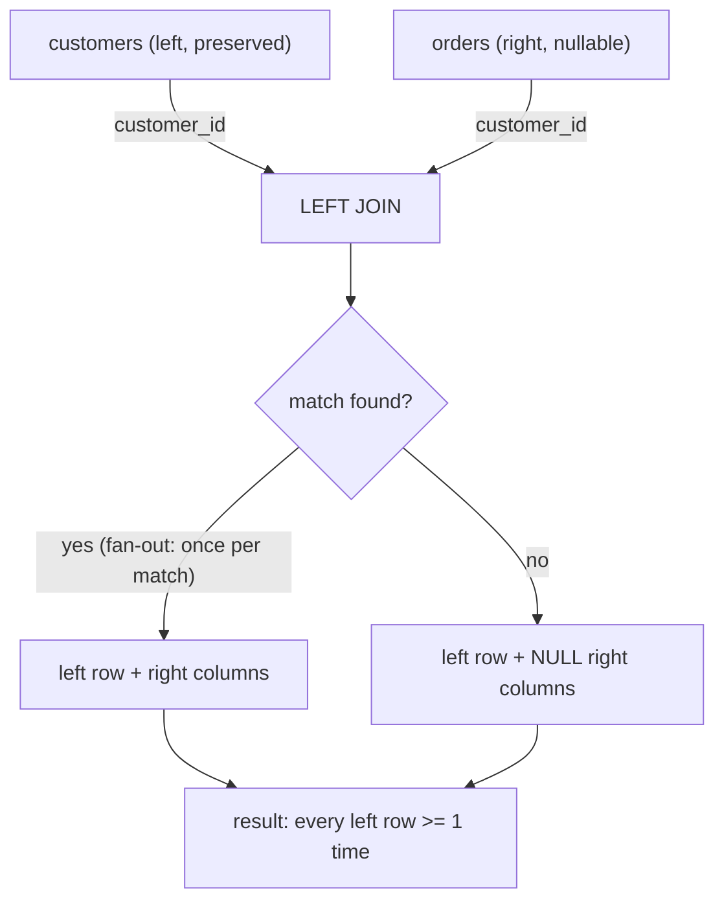
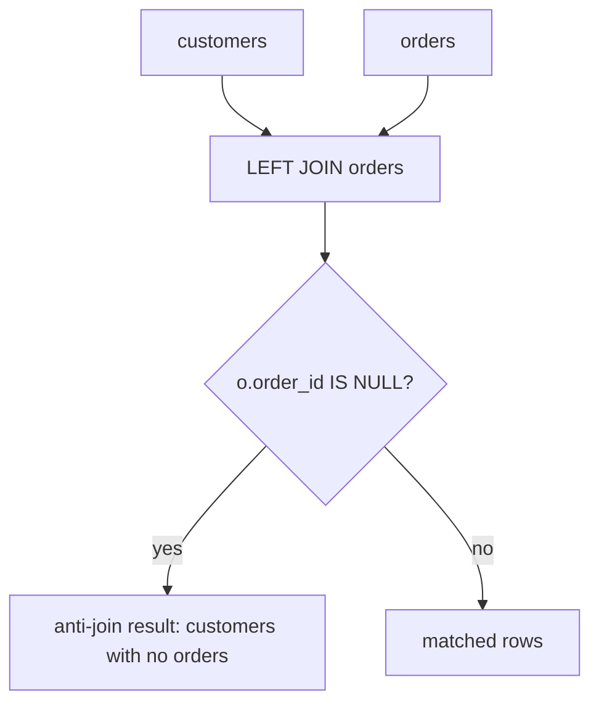

I'll check the current LEFT JOIN file, then write a comprehensive section consistent with the INNER JOIN section's style.
Wrote the complete LEFT JOIN section to `sql-handbook/3-Joins/16-LEFT-JOIN.md`.

Key teaching points covered:

- **Mental model** — left/preserved table survives; farmers-out on match, NULL-pads on no match
- **The trap that matters** — `ON` vs `WHERE`: a filter on the right table in `WHERE` silently converts LEFT JOIN into INNER JOIN (with optimizer flattening noted)
- **Grain & fan-out** — Alice appearing twice, payments double-counting, pre-aggregation fix
- **NULL behavior** — three distinct causes of NULLs (no match / NULL left key / stored NULL), `COUNT(*)` vs `COUNT(col)` vs `COUNT(table.*)`, anti-join false positives
- **Internal working** — Nested Loop/Hash/Merge Left Join with EXPLAIN guidance
- **Comparison tables** — LEFT vs INNER/RIGHT/FULL/CROSS/NOT EXISTS + ON vs WHERE placement
- **Chained LEFT JOINs**, degenerate `ON 1=1` Cartesian, COALESCE-for-display-only
- **Interview Questions** — Beginner → Performance (left unanswered for practice)
  ly an outer join provides.

### The mental model

Think in three steps:

1. Start from the **left** (also called the **preserved** or **driving**) table — every row here is guaranteed to survive into the result, at least once.
2. For each left row, look for matching rows on the right using the `ON` condition.
3. If zero matches: emit the left row once, with all right columns set to `NULL`. If _one or more_ matches: emit the left row **once per match** (fan-out — see [Fan-Out and Double Counting]).

```
LEFT(A, B)  =
   { (a, b) : a ∈ A, b ∈ B, condition(a,b) = TRUE }
   ∪
   { (a, NULL...) : a ∈ A, and no b ∈ B satisfies condition(a,b) }
```

> The "Venn diagram" intuition — a LEFT JOIN as "everything in A, plus the intersection" — is useful but incomplete: when a left row matches _multiple_ right rows, the left row is repeated, which no set diagram captures. A join produces combinations, not sets.

---

## Grain Check — The Sample Tables

Before any join, state the grain. We reuse the tables from the INNER JOIN section so the contrast is direct.

**customers** — _one row per customer._

| customer_id | name  | country |
| ----------- | ----- | ------- |
| 1           | Alice | USA     |
| 2           | Bob   | UK      |
| 3           | Carol | Germany |
| 4           | Dave  | NULL    |

**orders** — _one row per order._

| order_id | customer_id | order_date | amount |
| -------- | ----------- | ---------- | ------ |
| 101      | 1           | 2026-01-05 | 250.00 |
| 102      | 2           | 2026-01-07 | 120.50 |
| 103      | 1           | 2026-01-12 | 89.99  |
| 104      | 3           | 2026-01-20 | 450.00 |
| 105      | NULL        | 2026-02-01 | 30.00  |
| 106      | 5           | 2026-02-03 | 610.00 |

**payments** — _one row per payment._

| payment_id | order_id | amount | paid_at    |
| ---------- | -------- | ------ | ---------- |
| 1          | 101      | 100.00 | 2026-01-06 |
| 2          | 101      | 150.00 | 2026-01-08 |
| 3          | 102      | 120.50 | 2026-01-09 |

**employees** — _one row per employee._

| employee_id | name  | department_id |
| ----------- | ----- | ------------- |
| 1           | Alice | 10            |
| 2           | Bob   | 10            |
| 3           | Carol | 20            |
| 4           | Dave  | NULL          |

**departments** — _one row per department._

| department_id | dept_name   |
| ------------- | ----------- |
| 10            | Engineering |
| 20            | Sales       |
| 30            | Marketing   |

**Relationship/grain notes:**

- `customers` → `orders` is **one-to-many** (`orders.customer_id` → `customers.customer_id`).
- A customer can have zero, one, or many orders.
- Dave (customer 4) has **no** orders; order 105 has a NULL customer; order 106 references customer 5, who does not exist.
- `employees.department_id` can be NULL (Dave); a department can have zero employees (Marketing).
- `payments` is one-to-many from `orders`: order 101 has two payments.

> Internalize this: a LEFT JOIN never _removes_ rows from the left table, but it _can_ duplicate them. Only the right side can be NULL-padded.

---

## Syntax

### ANSI SQL

```sql
SELECT <columns from A and/or B>
FROM table_A A
LEFT JOIN table_B B
    ON A.key = B.key;
```

`LEFT OUTER JOIN` is a synonym — `OUTER` is optional and adds no behavior.

```sql
SELECT <columns>
FROM table_A A
LEFT OUTER JOIN table_B B
    ON A.key = B.key;
```

### Oracle legacy syntax

Oracle pre-ANSI used the `(+)` marker on the **nullable** side:

```sql
-- Oracle legacy style (still accepted, avoid in new code)
SELECT c.name, o.order_id
FROM customers c, orders o
WHERE c.customer_id = o.customer_id(+);   -- (+) on the right side -> LEFT JOIN
```

> Production pitfall: the `(+)`-style syntax is error-prone (mixing it with ANSI joins, or putting `(+)` on both sides, causes syntax errors or wrong results) and Oracle itself encourages ANSI joins. Use `LEFT JOIN` in new code.

### Simple example

```sql
SELECT c.customer_id, c.name, o.order_id, o.amount
FROM customers c
LEFT JOIN orders o
    ON o.customer_id = c.customer_id
ORDER BY c.customer_id, o.order_id;
```

### Expected result

| customer_id | name  | order_id | amount |
| ----------- | ----- | -------- | ------ |
| 1           | Alice | 101      | 250.00 |
| 1           | Alice | 103      | 89.99  |
| 2           | Bob   | 102      | 120.50 |
| 3           | Carol | 104      | 450.00 |
| 4           | Dave  | NULL     | NULL   |

**What happened:**

- Alice matched 2 orders → appears twice (fan-out).
- Bob and Carol each matched 1 order.
- **Dave** has no order → kept once, with `order_id` and `amount` as `NULL`.
- Orders 105 (NULL customer) and 106 (customer 5 does not exist) are **not reachable from the left side** — unless the left side is `orders` (see [Scenario E]).

Compare directly with the INNER JOIN section: the only difference from `INNER JOIN` is the extra **Dave / NULL / NULL** row.

---

## Internal Working

Like an INNER JOIN, the engine executes a LEFT JOIN with a physical algorithm chosen by the **optimizer** — but with one extra requirement: **the left table's rows must never be lost**, and each left row must be _null-extended_ for any unmatched right columns. Always confirm the actual algorithm with `EXPLAIN` / `EXPLAIN ANALYZE` (or the engine's plan tool).

### 1. Nested Loop Left Join

For each row of the left (driving) table, probe the right table for matches. If no match: emit the left row immediately with NULLs for the right side.

- Good when the left side is small and the right side is **indexed on the join column**.

### 2. Hash Left Join

Build a hash table on one side, probe with the other, and **retain the "left" hash key set** so that any left row with no probe hit is still emitted with NULLs.

- Common on large equi-joins with no useful index.

### 3. Merge Left Join

Both inputs sorted on the join key, walked in lockstep; unmatched left rows are emitted with NULLs as the walk passes them.

- Good when both sides are already sorted (e.g., by an index) or on moderate-to-large tables.

### What drives the choice

The optimizer weighs:

- indexes and statistics / cardinality estimates
- data distribution (skew)
- available memory (`work_mem` in PostgreSQL, `join_buffer_size` in MySQL, hash area in Oracle)
- parallel query settings
- query shape

### Reading the plan

```sql
EXPLAIN ANALYZE
SELECT c.name, o.amount
FROM customers c
LEFT JOIN orders o ON o.customer_id = c.customer_id;
```

> PostgreSQL / MySQL: `EXPLAIN ANALYZE` actually runs the query.
>
> SQL Server: "Include Actual Execution Plan" in SSMS, or `SET STATISTICS IO, TIME ON;`.
>
> Oracle: `EXPLAIN PLAN FOR ...` then `SELECT * FROM TABLE(DBMS_XPLAN.DISPLAY);`, or `DBMS_XPLAN.DISPLAY_CURSOR`.

In a PostgreSQL plan you will see a node literally named `Hash Left Join`, `Nested Loop Left Join`, or `Merge Left Join` — the word **Left** is the signal that unmatched left rows are preserved. In MySQL's `EXPLAIN`, look for the join type and how table order changed; in SQL Server, the operator shows `Left Outer Join`.

> Common misconception: "The engine always keeps the order of the two tables as written in the query." It does **not**. The optimizer may scan the right table _first_ and hash the left table, or reorder to a "right-first" strategy internally. Whatever the physical order, the _logical_ semantics (every left row preserved) stay the same — inspect the plan to see the physical reality.

> Interview trap: `EXPLAIN` order of tables does **not** tell you which table is "logically left." Only the plan's outer-join node, or the actual semantics, does.

---

## ON vs WHERE — The Difference That Matters (Left → Inner Join Trap)

For an INNER JOIN, moving a predicate between `ON` and `WHERE` usually yields the same _final_ result. **For a LEFT JOIN it decides whether the query is still an outer join at all.**

The logical processing order matters (see the [Logical Query Processing Order section]):

1. `FROM` (joins and `ON` conditions)
2. `WHERE`
3. `SELECT`
4. `ORDER BY`

The LEFT JOIN happens in step 1. Whatever doesn't match by then is NULL-padded. Then `WHERE` runs **after** the padding — and any condition on the padded columns will be tested against `NULL`.

### The classic bug

```sql
-- BAD APPROACH: is this really a LEFT JOIN?
SELECT c.name, o.order_id
FROM customers c
LEFT JOIN orders o ON o.customer_id = c.customer_id
WHERE o.amount > 100;
```

For Dave, the padded row is `('Dave', NULL)`. The `WHERE` evaluates `NULL > 100` → **UNKNOWN** → the row is filtered out (three-valued logic, see [NULL and Three-Valued Logic section]).

**Result: Dave is gone.** The query now behaves exactly like an INNER JOIN. This is the most common production LEFT JOIN bug.

### The fix: put the condition that must NOT drop left rows into ON

```sql
-- BETTER APPROACH: keep the filter on the right side inside ON
SELECT c.name, o.order_id, o.amount
FROM customers c
LEFT JOIN orders o
    ON o.customer_id = c.customer_id
   AND o.amount > 100
ORDER BY c.customer_id, o.order_id;
```

**Expected result:**

| name  | order_id | amount |
| ----- | -------- | ------ |
| Alice | 101      | 250.00 |
| Bob   | 102      | 120.50 |
| Carol | NULL     | NULL   |
| Dave  | NULL     | NULL   |

- Carol had one order (104, amount 450) — wait, that's `> 100`, so why NULL? It is not: Carol's order 104 is `450.00 > 100` → matches. Let's recheck.

Hold on — recompute carefully. `o.amount > 100`: order 101 (250) matches, 102 (120.50) matches, 103 (89.99) _does not_, 104 (450) matches.

**Correct expected result:**

| name  | order_id | amount |
| ----- | -------- | ------ |
| Alice | 101      | 250.00 |
| Bob   | 102      | 120.50 |
| Carol | 104      | 450.00 |
| Dave  | NULL     | NULL   |

- Alice's cheap order 103 is _not joined_ → Alice only shows order 101 (her left row is preserved either way).
- Dave still has no matching order at all → NULL-padded.
- Because the filter lives in `ON`, customers with only cheap orders are **kept** (with NULL padding) instead of disappearing.

> Rule of thumb: if you need a filter on the _right_ table but you do **not** want to lose the left rows, move that filter into `ON`. If you _want_ inner-join behavior, `WHERE` is fine — but then `LEFT JOIN` is the wrong tool.

> Interview trap: "Can `WHERE` on a NULL-padded column turn a LEFT JOIN into an INNER JOIN?" Yes — any condition that rejects `NULL` on the nullable side does. The optimizer may even formally rewrite the query to an inner join. This is not a bug in the database; it is the semantics of `WHERE` running after the padding.

### Optimizer flattening

Many engines recognize when a LEFT JOIN's `WHERE` filters make it semantically equal to an INNER JOIN, and **rewrite the plan** to a plain inner join (this is called outer-join elimination / flattening; MySQL explicitly documents this when using `EXPLAIN`).

> Production pitfall: if you _relied_ on a LEFT JOIN preventing the optimizer from reordering tables, the plan may not show an outer join at all. Rely on semantics, not on forcing the physical order.

---

## NULL Behavior

In a LEFT JOIN, three different cases produce NULLs — each with a _different cause_ and a _same-looking outcome_.

### Case 1 — No matching row on the right

Dave simply has no order. His right-side columns are padded with NULL.

### Case 2 — The left join key is NULL

An `orders LEFT JOIN customers` (left side is `orders`) includes order 105, whose `customer_id` is `NULL`. The condition `o.customer_id = c.customer_id` evaluates `NULL = anything` → UNKNOWN → no match → the customer columns are padded NULL. **A NULL never matches anything on the right, including a NULL on the right.**

### Case 3 — The right table contains NULL where a row did match

If a matched row actually _stores_ a NULL (e.g., `customers.country` is NULL for Dave's customer record — but Dave has no order, so the padding dominates). The general point: NULL can arrive in the result either because of a genuine NULL _value_ in the right table, or because of _padding_. **You cannot distinguish them with SQL** — use `COALESCE` for display, or split into two queries if the distinction matters for business logic.

### Matching NULLs explicitly

If you want NULL keys to pair up with NULLs in the ON condition, plain `=` will not do it (see [IS DISTINCT FROM section]):

```sql
-- Not standard everywhere; see notes in the INNER JOIN section
SELECT o.order_id, c.name
FROM orders o
LEFT JOIN customers c
    ON o.customer_id IS NOT DISTINCT FROM c.customer_id;
```

> PostgreSQL and SQLite 3.39+ support `IS NOT DISTINCT FROM`; MySQL uses `<=>`; Oracle added it in 23c.

### COUNT(_) vs COUNT(column) vs COUNT(table._)

Because the absence of a match produces NULLs, the counting functions diverge _only because of the LEFT JOIN_:

```sql
SELECT c.name,
       COUNT(*)            AS rows_returned,     -- counts padded row too!
       COUNT(o.order_id)   AS orders_with_id,    -- skips NULL -> correct count of orders
       COUNT(o.*)          AS orders_rows        -- behaves like COUNT(*) here
FROM customers c
LEFT JOIN orders o ON o.customer_id = c.customer_id
GROUP BY c.name;
```

| name  | rows_returned | orders_with_id | orders_rows |
| ----- | ------------- | -------------- | ----------- |
| Alice | 2             | 2              | 2           |
| Bob   | 1             | 1              | 1           |
| Carol | 1             | 1              | 1           |
| Dave  | 1             | 0              | 1           |

- `COUNT(*)` counts the NULL-padded row → Dave shows **1**, wrongly suggesting an order.
- `COUNT(o.order_id)` counts non-NULL values of that column → Dave shows **0**. Correct.
- `COUNT(o.*)` counts rows, so it behaves like `COUNT(*)` even though the columns are NULL.

> Interview trap: "What does `COUNT(o.*)` return inside a GROUP BY on a LEFT JOIN where a left row has no match?" It counts the padded row (1), unlike `COUNT(o.order_id)` (0). Qualifying the star does not make it count non-NULL values.

---

## Scenario-Based Examples

### Scenario A — Every customer with their orders, including zero-order customers

```sql
SELECT c.customer_id, c.name, o.order_id, o.amount
FROM customers c
LEFT JOIN orders o ON o.customer_id = c.customer_id
ORDER BY c.customer_id, o.order_id;
```

Result: the 5 rows shown in [Basic example] — Dave appears with NULLs.

### Scenario B — Order counts including zero (grain-safe aggregate)

```sql
SELECT c.name, COUNT(o.order_id) AS order_count
FROM customers c
LEFT JOIN orders o ON o.customer_id = c.customer_id
GROUP BY c.name
ORDER BY order_count DESC;
```

| name  | order_count |
| ----- | ----------- |
| Alice | 2           |
| Bob   | 1           |
| Carol | 1           |
| Dave  | 0           |

Elite pattern: keep the customer row (LEFT JOIN) **and** get the correct zero (COUNT on the nullable column). If someone "helpfully" changes it to `COUNT(*)`, Dave turns into 1 — a one-character bug.

### Scenario C — The anti-join: customers with NO orders

```sql
SELECT c.customer_id, c.name
FROM customers c
LEFT JOIN orders o ON o.customer_id = c.customer_id
WHERE o.order_id IS NULL;      -- NOT `o.customer_id = NULL` !
```

Result: `(4, Dave)`.

Why it works: in a LEFT JOIN, _unmatched_ rows have all-null `order_id`; `o.order_id IS NULL` singles them out. The pattern is called an **anti-join**.

Requirement: `order_id` (the column tested) must be `NOT NULL` for genuinely matched rows. If `order_id` could be NULL, matched rows would also pass the `IS NULL` test and produce false positives. Use a `NOT NULL` column like a primary key, or `NOT EXISTS`.

Equivalents — all logically the same here, evaluated differently:

```sql
SELECT customer_id, name FROM customers c
WHERE NOT EXISTS (SELECT 1 FROM orders o WHERE o.customer_id = c.customer_id);

SELECT customer_id, name FROM customers c
WHERE customer_id NOT IN (SELECT customer_id FROM orders WHERE customer_id IS NOT NULL);
```

> `NOT IN` silently drops rows if the subquery can contain NULL (see [NOT IN + NULL section]). Prefer `NOT EXISTS` or the LEFT JOIN anti-join unless you validate the subquery for NULLs.

> Interview trap: "Why is `= NULL` wrong here, and why must the anti-join test `IS NULL` rather than `IS NOT NULL`?" `= NULL` is UNKNOWN, so `WHERE o.order_id = NULL` returns nothing. `IS NOT NULL` would return the _matched_ orders instead.

### Scenario D — All orders and how much each has been paid (fan-out avoided by pre-aggregation)

One order can have many payments (order 101 has two). Joining `orders LEFT JOIN payments` directly fans out order 101 into two rows. If we then `GROUP BY`, aggregating `o.amount` would double-count.

**BAD APPROACH** (direct one-to-many join, then aggregate the "one" side):

```sql
SELECT o.order_id,
       SUM(o.amount) AS order_amount,   -- counted once per payment -> inflated
       SUM(p.amount) AS paid_amount
FROM orders o
LEFT JOIN payments p ON p.order_id = o.order_id
GROUP BY o.order_id;
```

Order 101 becomes two rows, so `SUM(o.amount)` = **500** instead of 250.

**BETTER APPROACH** (aggregate the "many" side first, then LEFT JOIN):

```sql
SELECT o.order_id,
       o.amount    AS order_amount,
       p.paid_amount
FROM orders o
LEFT JOIN (
    SELECT order_id, SUM(amount) AS paid_amount
    FROM payments
    GROUP BY order_id
) p ON p.order_id = o.order_id
ORDER BY o.order_id;
```

| order_id | order_amount | paid_amount |
| -------- | ------------ | ----------- |
| 101      | 250.00       | 250.00      |
| 102      | 120.50       | 120.50      |
| 103      | 89.99        | NULL        |
| 104      | 450.00       | NULL        |
| 105      | 30.00        | NULL        |
| 106      | 610.00       | NULL        |

All six orders survive (the LEFT JOIN). Unpaid orders show `NULL`, not a missing row. The pre-aggregated subquery keeps grain at one row per order.

> Production pitfall: this is the LEFT JOIN flavor of the **fan-out / double-counting** bug from the INNER JOIN section. `LEFT` protects the left table from _disappearing_, not from being _multiplied_.

### Scenario E — Orphan/anonymous orders: LEFT JOIN with `orders` as the left table

```sql
SELECT o.order_id, o.amount, c.name AS customer
FROM orders o
LEFT JOIN customers c ON c.customer_id = o.customer_id
ORDER BY o.order_id;
```

| order_id | amount | customer |
| -------- | ------ | -------- |
| 101      | 250.00 | Alice    |
| 102      | 120.50 | Bob      |
| 103      | 89.99  | Alice    |
| 104      | 450.00 | Carol    |
| 105      | 30.00  | NULL     |
| 106      | 610.00 | NULL     |

Order 105's `customer_id` is NULL (never matches — [Case 2]); order 106 references a customer that doesn't exist in the data (no match — [Case 1]). Both keep their rows and show `NULL` for the customer name. Every order is present: this is the outer join that the plain INNER JOIN example dropped two rows from.

### Scenario F — Departments with headcount including empty departments

```sql
SELECT d.dept_name, COUNT(e.employee_id) AS headcount
FROM departments d
LEFT JOIN employees e ON e.department_id = d.department_id
GROUP BY d.dept_name
ORDER BY d.dept_name;
```

| dept_name   | headcount |
| ----------- | --------- |
| Engineering | 2         |
| Marketing   | 0         |
| Sales       | 1         |

Marketing has no employees yet still appears with `0`. Note also that Dave (employee 4, NULL department) is dropped here because `departments` is the left table — to include _unassigned_ employees, flip the join (employees LEFT JOIN departments) or use a FULL OUTER JOIN (see [Comparison Table]).

### Scenario G — COALESCE for presentation (never to "fix" data)

```sql
SELECT o.order_id,
       COALESCE(c.name, 'Unknown customer') AS customer
FROM orders o
LEFT JOIN customers c ON c.customer_id = o.customer_id
ORDER BY o.order_id;
```

| order_id | customer |
| -------- | -------- |
| 101      | Alice    |

| ...
| 105 | Unknown customer |
| 106 | Unknown customer |

`COALESCE` only changes display. It does **not** tell you _why_ the name is missing (NULL key vs missing row) — treat reporting reasons with care (see [NULL Behavior]).

---

## Edge Cases

### 1. Empty right side

```sql
SELECT c.name, o.order_id
FROM customers c
LEFT JOIN (SELECT * FROM orders WHERE 1 = 0) o
    ON o.customer_id = c.customer_id;
```

Every customer is returned with `NULL` order columns. A LEFT JOIN against an empty table degrades gracefully — unlike an INNER JOIN, which would return nothing.

### 2. No matches at all

Identical outcome to the empty right side: all left rows survive, all NULL-padded. A LEFT JOIN's minimum output is one row per left row.

### 3. Duplicate keys on the right (fan-out)

If a left row matches _n_ right rows, it is emitted **n times** — the LEFT JOIN does not remove duplicates, and `COUNT(*)` after the join counts padded rows too:

```sql
-- If customers c1 had 3 matching orders, c1 appears 3 times.
SELECT c.name, o.order_id
FROM customers c
LEFT JOIN orders o ON o.customer_id = c.customer_id;
```

Alice appears twice here. The "guarantee" of a LEFT JOIN is _at least one row per left row_ — not _exactly one_.

### 4. Duplicate keys on the left

Duplicate left rows are each independently null-extended or fanned out. The result can exceed either table's size. This is how "1 row per left row" combined with "1 row per match" multiplies.

### 5. Chain of LEFT JOINs — a NULL key can break the next join

```sql
FROM customers c
LEFT JOIN orders o   ON o.customer_id = c.customer_id
LEFT JOIN payments p ON p.order_id = o.order_id;
```

Dave: `o` is all-NULL → `p.order_id = o.order_id` is `NULL = NULL` → UNKNOWN → `p` stays NULL. The second join cannot rescue the first. Also, order 101 has two payments → Alice appears for **order 101 twice** plus order 103 once → 3 rows total. The LEFT chain preserves rows but propagates fan-out multiplicatively.

### 6. Anti-join false positives

If the column tested in the anti-join (Scenario C) is nullable on the **right** table, legitimate matched rows with NULL in that column also pass `IS NULL`. Always test on a NOT NULL column (a PK) or use `NOT EXISTS`.

### 7. ON that references only one side, or a constant

```sql
SELECT c.name, o.order_id
FROM customers c
LEFT JOIN orders o ON 1 = 1;               -- Cartesian (all combos), left rows never lost
```

A degenerate ON condition produces every combination (a Cartesian product). The left rows are still preserved, so the result set is huge. Deliberate cross products belong in `CROSS JOIN` (see [Cross Join section]).

### 8. NULL join keys on both sides

Even if a left row and a right row both have `NULL` in the join key, plain `=` never pairs them (three-valued logic). Only `IS NOT DISTINCT FROM` / `<=>` joins NULLs to NULLs — which is almost always _not_ what you want with nullable FKs, because every NULL would pair with every NULL.

---

## Common Mistakes

1. **Filter on the right table in `WHERE`** → silently converts the LEFT JOIN into an INNER JOIN (see [ON vs WHERE]).
2. **Using `COUNT(*)` to count right-side matches** → counts NULL-padded "virtual" rows; use `COUNT(right_table.key)` or `COUNT(DISTINCT ...)`.
3. **Testing anti-joins with `= NULL`** → empty result; must use `IS NULL`.
4. **`NOT IN` for the "no match" pattern** → NULL-sensitivity drops rows; prefer `NOT EXISTS` / the LEFT JOIN anti-join.
5. **Forgetting that fan-out still happens** → a LEFT JOIN does not deduplicate; a one-to-many or many-to-many match repeats the left row.
6. **Double-counting the "one" side when aggregating after a one-to-many LEFT JOIN** → pre-aggregate the "many" side (Scenario D) or use window functions (see [GROUP BY vs window functions section]).
7. **Assuming "NULL" means "no match"** → a stored NULL in the right table and a padding NULL are indistinguishable from SQL.
8. **Thinking the planner preserves the written table order** → it does not; read the plan.
9. **Not qualifying columns** → ambiguous names; always qualify with table aliases.
10. **Joining on type/collation-mismatched columns** → silent non-matches; keep types and collations consistent (see [sargability]).
11. **Adding a second filter on a left-joined column in `WHERE` to "clean up" NULLs** → that is exactly the mistake in #1.

---

## Performance Implications

The same caveats as everywhere in this handbook apply — performance depends on optimizer, indexes, statistics, cardinality, data distribution, query shape, engine, and the execution plan. **Never claim "LEFT JOIN is faster/slower than X" in the abstract; verify with `EXPLAIN ANALYZE`.**

### What typically helps

- **Index on the right table's join column** → enables nested-loop left joins where each left row does an index probe. Without it, the engine may still choose a hash left join (which often scales better on large inputs) — check the plan rather than assuming.
- **Filter the left table early** (`WHERE` on left columns is safe and reduces work).
- **Fresh statistics** → outer-join row estimates are hard; stale stats produce bad algorithm choices.
- **Keep the ON condition as plain equality** when possible.

### Everything a LEFT JOIN does that an INNER JOIN doesn't

- It must produce **at least one output row per left row**, even when nothing matches → the engine tracks which left rows have/haven't been matched (in hash/merge left joins this is an explicit "return the unmatched" pass).
- NULL-padding work for every unmatched tuple.

So a LEFT JOIN is generally _more_ work than the equivalent inner join — but that difference is usually small compared with the cost of bad indexes.

> Common misconception: "A LEFT JOIN scans the whole left table because it has to keep everything." Yes, it visits every left row by definition — but on the right side it still uses whatever the optimizer picks: an index, a hash build, or a merge.

### LEFT JOIN ... IS NULL (anti-join) vs NOT EXISTS

Logically the same; _plans differ_. In most engines the optimizer can rewrite

```sql
SELECT c.customer_id, c.name
FROM customers c
LEFT JOIN orders o ON o.customer_id = c.customer_id
WHERE o.order_id IS NULL;
```

into an anti-join (e.g., an "Anti Join" node in SQL Server, an anti-hash/anti-nested-loop in PostgreSQL/MySQL). `NOT EXISTS` is a direct expression of the same anti-semantics.

Which is faster is data- and plan-dependent:

- If most customers have orders and few don't, an anti-join with early exit can win big.
- `NOT EXISTS` is off-the-shelf more obviously an anti-join, which many optimizers turn into a "stop at first match" strategy.

**Verify with the plan**; don't assume. The table sizes, index on `orders.customer_id`, and data distribution decide it.

### SARGability reminder

Wrapping the join column in a function (e.g., `ON TRIM(o.customer_id) = c.customer_id`) typically prevents index use on `o.customer_id`. Keep bare columns on one side of equality: `o.customer_id = c.customer_id`.

### Degenerate ON → Cartesian

`LEFT JOIN ... ON 1=1` (or any always-true condition) produces every left × right combination. On 10M orders × 1M customers that is 10 trillion rows. The plan shows a nested loop/cross-join-shaped node with no usable join key.

---

## Comparison Table

| Operation           | Result shape                                          | NULL handling                               | When to prefer                                                                               |
| ------------------- | ----------------------------------------------------- | ------------------------------------------- | -------------------------------------------------------------------------------------------- |
| `INNER JOIN`        | Only matching combinations                            | NULLs never match; unmatched dropped        | Only rows that _both_ tables agree on                                                        |
| `LEFT JOIN`         | All left rows + matched right; unmatched right → NULL | Left side preserved, right side NULL-padded | "All of A, with B if any"                                                                    |
| `RIGHT JOIN`        | Mirror image of LEFT                                  | Right side preserved                        | The rare case where logic reads better right-to-left; otherwise swap the tables and use LEFT |
| `FULL OUTER JOIN`   | Both sides preserved                                  | Both sides NULL-padded                      | Compare two sets, showing differences on **both** sides                                      |
| `NOT EXISTS`        | Rows of A with no match                               | Uses standard equality / index search       | Anti-join where you stop at the first match                                                  |
| `NOT IN (subquery)` | Rows of A not in subquery                             | **Dangerous with NULL** in subquery         | Only with a guaranteed-NOT-NULL subquery column                                              |
| `CROSS JOIN`        | Every combination                                     | All combinations                            | Deliberate Cartesian products                                                                |

| Placement                        | Behavior in LEFT JOIN                                                                                     |
| -------------------------------- | --------------------------------------------------------------------------------------------------------- |
| Filter on right table in `ON`    | Still a LEFT JOIN; unmatched right rows are excluded from matching but **left rows are preserved** (NULL) |
| Filter on right table in `WHERE` | LEFT JOIN effectively becomes an INNER JOIN (left rows dropped on no match)                               |
| Filter on left table in `WHERE`  | Safe: reduces left rows before/during the join; left rows that fail the filter are gone regardless        |

Key difference from the INNER JOIN section: for INNER JOIN the two placements are usually equivalent; **for LEFT JOIN they are not.**

---

## When to Use LEFT JOIN

- You need "every row from A, with data from B when available": customer lists, order lists, department headcounts including empties.
- You are building anti-joins ("A with no B") when the plan favors it.
- You want to see _and count_ absence explicitly (e.g., pending/unpaid orders with NULL payment amounts).
- You are assembling a report whose left table is the "subject" of the report (e.g., "each employee's last login," "each product's total sales").

## When NOT to Use LEFT JOIN

- You only want matching pairs → INNER JOIN (a LEFT JOIN achieves it only by accidentally filtering in WHERE).
- You want the symmetry of both sides shown → FULL OUTER JOIN.
- You are doing existence checks and don't want fan-out → use `EXISTS`.
- Your analysis will _aggregate_ a one-to-many right side → LEFT JOIN forces you into the double-counting minefield; prefer a pre-aggregated subquery/CTE joined with LEFT JOIN (Scenario D).
- The left table is huge and the "is there a match?" question can be answered with an index-favorable `EXISTS` → compare plans.

---

## Best Practices

1. **State the grain** of both tables and decide _which table is the subject of the output_. Make that the left table.
2. **Decide the semantics first**: "do I need to preserve every left row?" If yes → LEFT JOIN; if no → INNER JOIN.
3. **Keep filters on the right table in `ON`** when left-row survival matters; keep global row filters in `WHERE` when you intend inner semantics.
4. **Count with `COUNT(right.key)`** — never `COUNT(*)` — when counting right-side matches, and prefer a `NOT NULL` key.
5. **Write anti-joins with `IS NULL`** on a `NOT NULL` key (or `NOT EXISTS`).
6. **Pre-aggregate the "many" side before a LEFT JOIN** when aggregating to keep grain at one row.
7. **Qualify every column** with a table alias.
8. **Use `COALESCE` for display only**; don't treat padded NULL as real data.
9. **Sanity-check row counts**: left rows preserved (at least once) + fan-out expected for known one-to-many matches.
10. **Inspect `EXPLAIN ANALYZE`** — confirm it really is an outer join and that the index/algorithm is the expected one.
11. **Prefer ANSI `LEFT JOIN`** over Oracle's `(+)` legacy syntax.

---

## Mermaid Diagram — LEFT JOIN Flow





---

# Interview Questions

Use the sample tables above (`customers`, `orders`, `payments`, `employees`, `departments`, with their stated grains).

## Beginner

1. Write a query that returns **all** customers with their orders, _including_ customers who never ordered.
2. What does the word "preserved" mean for the left table of a LEFT JOIN?
3. In the sample data, `customers LEFT JOIN orders`: what do Dave's `order_id` and `amount` columns show, and why?
4. What is the difference between `LEFT JOIN` and `LEFT OUTER JOIN`?
5. In `customers LEFT JOIN orders`, will the orders for customer 5 (who doesn't exist) appear? Why or why not?

## Intermediate

6. `COUNT(*)` vs `COUNT(o.order_id)` vs `COUNT(o.*)` in a `GROUP BY c.name` over `customers LEFT JOIN orders` — what does each give for Dave, and why?
7. Write the query for "all customers with the number of orders they placed, including zero."
8. Why does putting `WHERE o.amount > 100` after a LEFT JOIN remove Dave, even though he is on the left?
9. Write an anti-join (customers with no orders) three ways: LEFT JOIN + IS NULL, NOT EXISTS, NOT IN. What NULL hazards does the `NOT IN` version have?
10. `orders LEFT JOIN payments`: order 101 has two payments. How many rows does it appear as, and how would you avoid double-counting `orders.amount`?

## Advanced

11. Explain how a "Hash Left Join" preserves unmatched left rows, mechanically.
12. A LEFT JOIN followed by `WHERE right_table.nullable_col IS NULL` can produce false positives. Why, and what is the correct fix?
13. Describe how the optimizer can _flatten_ a LEFT JOIN into an INNER JOIN, and how you would detect that in `EXPLAIN`.
14. When would you choose `NOT EXISTS` over `LEFT JOIN ... WHERE ... IS NULL` for an anti-join? Design a test to decide, and state what you would read in the plan.
15. Can a LEFT JOIN output more rows than the left table, fewer, or exactly as many? Give concrete conditions for each.

## Scenario Based

16. A report must show **every** order with total paid amount; unpaid orders should appear with a zero or NULL. Write it correctly (watch the one-to-many payments).
17. Your manager wants "each department with its headcount, empty ones included" plus a flag for employees with no department. Show the queries.
18. GDPR-style cleanup: find all customers who have never logged in, given a `logins` table (one row per login). Compare the three anti-join formulations.
19. A marketing query accidentally returns zero customers because someone added `WHERE o.amount > 100` to a LEFT JOIN. Reconstruct the original query's intent and produce the corrected version.
20. Explain why order 105 (NULL `customer_id`) shows a NULL customer name in `orders LEFT JOIN customers` even though it represents a real order.

## Tricky

21. True or false: "A LEFT JOIN always returns at least one row per left row." Justify, including the case where a `WHERE` filter exists.
22. What does this return for the sample data?

    ```sql
    SELECT c.name, COUNT(o.order_id)
    FROM customers c
    LEFT JOIN orders o ON o.customer_id = c.customer_id
       AND o.amount > 100
    GROUP BY c.name;
    ```

23. What is the row count of `customers LEFT JOIN orders o1 ON ... LEFT JOIN orders o2 ON ...` (self-left-join)? Work it out for Alice.
24. Two employees both have `NULL` department_id. Do they match when joining `employees` to `departments` with plain `=`? What about with `IS NOT DISTINCT FROM`?
25. Predict the output of a LEFT JOIN where the right table is a subquery that returns zero rows, versus an INNER JOIN with the same subquery.

## Output Prediction

26. Given the sample data, give the **exact rows** for:

    ```sql
    SELECT c.name, o.order_id
    FROM customers c
    LEFT JOIN orders o ON o.customer_id = c.customer_id
    WHERE c.country = 'USA';
    ```

27. Exact result for:

    ```sql
    SELECT o.order_id,
           COALESCE(p.paid, 0) AS paid
    FROM orders o
    LEFT JOIN (SELECT order_id, SUM(amount) AS paid FROM payments GROUP BY order_id) p
        ON p.order_id = o.order_id
    ORDER BY o.order_id;
    ```

28. Bob has one order (102). What does `COUNT(*)` vs `COUNT(o.order_id)` give for Bob after `customers LEFT JOIN orders` with no GROUP BY? Why do they differ?

## Debugging

29. A team reports the LEFT JOIN "doesn't preserve left rows" because Dave disappeared. Walk through the fix you would apply and why it works.
30. A dashboard shows revenue for 90 days using a LEFT JOIN and suddenly the numbers drop to matches-only. What single line likely changed, and what's the correct placement?
31. Report shows every customer, but paying customers appear multiple times. Confirm whether this is fan-out and show the pre-aggregation fix.
32. `SELECT ... FROM a LEFT JOIN b ... JOIN c ...` — the outer join "leak" makes `c` inner-join the padded rows. Explain the chain and how to keep every `a` row.

## Performance

33. A `customers LEFT JOIN orders` is slow; `orders.customer_id` is not indexed. Predict the likely algorithm and decide what to add, then describe what `EXPLAIN ANALYZE` should show before/after.
34. Two equivalent anti-joins (`LEFT JOIN ... IS NULL` vs `NOT EXISTS`) — design a fair benchmark: what tables/data/config would make them diverge, and what would you measure?
35. Explain why an anti-join converting "almost all customers have orders" vs "almost none do" changes the optimal strategy, and what work the engine saves in each case.
36. A `LEFT JOIN ... ON 1=1` was found in production. What does it produce on 1M × 3M tables, and what plan signature would you look for?
