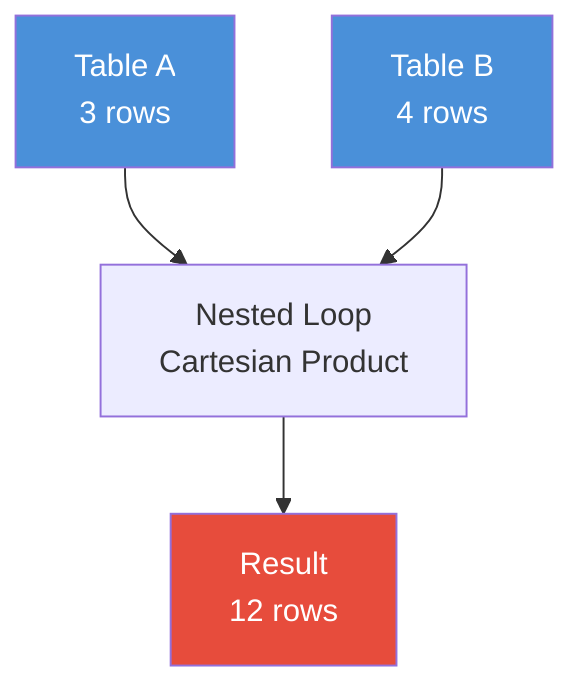

# CROSS JOIN

## Table of Contents

1. [What Is a CROSS JOIN?](#what-is-a-cross-join)
2. [Why Does CROSS JOIN Exist?](#why-does-cross-join-exist)
3. [Syntax](#syntax)
4. [Internal Working](#internal-working)
5. [Sample Tables](#sample-tables)
6. [Basic Examples](#basic-examples)
7. [Scenario-Based Examples](#scenario-based-examples)
8. [CROSS JOIN vs Explicit Cartesian Product](#cross-join-vs-explicit-cartesian-product)
9. [CROSS JOIN with Other Clauses](#cross-join-with-other-clauses)
10. [Edge Cases](#edge-cases)
11. [NULL Behavior](#null-behavior)
12. [Common Mistakes](#common-mistakes)
13. [Production Pitfalls](#production-pitfalls)
14. [Performance Implications](#performance-implications)
15. [Comparison Tables](#comparison-tables)
16. [Best Practices](#best-practices)
17. [Interview Questions](#interview-questions)

---

## What Is a CROSS JOIN?

A **CROSS JOIN** returns the **Cartesian product** of two tables. It combines every row from the first table with every row from the second table. There is **no join condition** — every possible pairing is produced.

If table A has **M** rows and table B has **N** rows, the result has **M × N** rows.

### Why Does CROSS JOIN Exist?

It exists because some problems genuinely require every combination. For example:

- Generating all possible pairings (schedules, assignments, test cases)
- Building a calendar grid from years and months
- Creating every size-color combination for a product catalog
- Generating seed data for testing

It is also the **unintended consequence** of forgetting a join condition — which is why understanding it is critical even when you never use it on purpose.

---

## Syntax

```sql
-- ANSI SQL syntax
SELECT columns
FROM table_a
CROSS JOIN table_b;

-- Comma syntax (equivalent — no ON clause possible)
SELECT columns
FROM table_a, table_b;
```

Both forms produce the same result. The comma syntax is older and **cannot** use `ON`, making it easier to forget the `WHERE` filter and accidentally produce a Cartesian product.

> **Interview trap:** The comma syntax (`FROM a, b`) is technically a cross join. Many accidental Cartesian products come from this syntax when a developer forgets the `WHERE` clause.

---

## Internal Working

A CROSS JOIN does **not** use a hash table, merge, or nested loop with an index lookup in the traditional sense. The database engine simply iterates over every row in the first table and pairs it with every row in the second table.



In practice, most databases implement this as a **nested loop** where:

1. The engine scans every row in Table A (outer loop).
2. For each row in Table A, it scans every row in Table B (inner loop).
3. Each pair is emitted as a result row.

> **PostgreSQL / MySQL / SQL Server / Oracle:** All four engines use a nested-loop strategy for CROSS JOIN. The optimizer may choose which table is the outer loop based on cost estimates and statistics, but the result is always the full Cartesian product.

---

## Sample Tables

### `colors`

| color_id | color_name |
| -------- | ---------- |
| 1        | Red        |
| 2        | Blue       |
| 3        | Green      |

**Grain:** One row = one color. 3 rows.

### `sizes`

| size_id | size_name |
| ------- | --------- |
| 1       | Small     |
| 2       | Medium    |
| 3       | Large     |
| 4       | X-Large   |

**Grain:** One row = one size. 4 rows.

### `employees`

| emp_id | emp_name | dept_id |
| ------ | -------- | ------- |
| 101    | Alice    | 1       |
| 102    | Bob      | 1       |
| 103    | Carol    | 2       |
| 104    | Dave     | 3       |
| 105    | Eve      | NULL    |

**Grain:** One row = one employee. 5 rows.

### `departments`

| dept_id | dept_name   |
| ------- | ----------- |
| 1       | Engineering |
| 2       | Marketing   |
| 3       | Sales       |
| 4       | HR          |

**Grain:** One row = one department. 4 rows.

---

## Basic Examples

### Example 1: Colors × Sizes

Generate every possible color-size combination for a product catalog.

```sql
SELECT c.color_name, s.size_name
FROM colors c
CROSS JOIN sizes s;
```

**Expected Result (12 rows):**

| color_name | size_name |
| ---------- | --------- |
| Red        | Small     |
| Red        | Medium    |
| Red        | Large     |
| Red        | X-Large   |
| Blue       | Small     |
| Blue       | Medium    |
| Blue       | Large     |
| Blue       | X-Large   |
| Green      | Small     |
| Green      | Medium    |
| Green      | Large     |
| Green      | X-Large   |

> **3 rows × 4 rows = 12 rows.** This is the fundamental behavior of CROSS JOIN.

---

### Example 2: Using the Comma Syntax

```sql
SELECT c.color_name, s.size_name
FROM colors c, sizes s;
```

Produces the **identical** result as the `CROSS JOIN` version. The comma syntax is an implicit cross join.

---

### Example 3: Employees × Departments

```sql
SELECT e.emp_name, d.dept_name
FROM employees e
CROSS JOIN departments d;
```

**Expected Result (20 rows):**

| emp_name | dept_name   |
| -------- | ----------- |
| Alice    | Engineering |
| Alice    | Marketing   |
| Alice    | Sales       |
| Alice    | HR          |
| Bob      | Engineering |
| Bob      | Marketing   |
| Bob      | Sales       |
| Bob      | HR          |
| Carol    | Engineering |
| Carol    | Marketing   |
| Carol    | Sales       |
| Carol    | HR          |
| Dave     | Engineering |
| Dave     | Marketing   |
| Dave     | Sales       |
| Dave     | HR          |
| Eve      | Engineering |
| Eve      | Marketing   |
| Eve      | Sales       |
| Eve      | HR          |

> **5 rows × 4 rows = 20 rows.** Notice that Eve (dept_id = NULL) is still paired with every department. CROSS JOIN does not care about relationships — it produces every combination.

---

## Scenario-Based Examples

### Scenario 1: Generate a Date Series with CROSS JOIN

Create a calendar grid of months for a given year.

```sql
SELECT y.year_val, m.month_name
FROM (SELECT 2026 AS year_val) y
CROSS JOIN (
    SELECT 'January'   AS month_name, 1 AS month_num UNION ALL
    SELECT 'February',               2 UNION ALL
    SELECT 'March',                  3 UNION ALL
    SELECT 'April',                  4 UNION ALL
    SELECT 'May',                    5 UNION ALL
    SELECT 'June',                   6 UNION ALL
    SELECT 'July',                   7 UNION ALL
    SELECT 'August',                 8 UNION ALL
    SELECT 'September',              9 UNION ALL
    SELECT 'October',               10 UNION ALL
    SELECT 'November',              11 UNION ALL
    SELECT 'December',              12
) m
ORDER BY m.month_num;
```

**Expected Result (12 rows):**

| year_val | month_name |
| -------- | ---------- |
| 2026     | January    |
| 2026     | February   |
| 2026     | March      |
| 2026     | April      |
| 2026     | May        |
| 2026     | June       |
| 2026     | July       |
| 2026     | August     |
| 2026     | September  |
| 2026     | October    |
| 2026     | November   |
| 2026     | December   |

**When to use:** Generating reference data, test data, or calendar grids where you need every combination.

---

### Scenario 2: Pair Every Employee with Every Project for Scheduling

```sql
SELECT
    e.emp_name,
    p.project_name
FROM employees e
CROSS JOIN (
    SELECT 'Project Alpha' AS project_name UNION ALL
    SELECT 'Project Beta'  UNION ALL
    SELECT 'Project Gamma'
) p
ORDER BY e.emp_name, p.project_name;
```

**Expected Result (15 rows):**

| emp_name | project_name  |
| -------- | ------------- |
| Alice    | Project Alpha |
| Alice    | Project Beta  |
| Alice    | Project Gamma |
| Bob      | Project Alpha |
| Bob      | Project Beta  |
| Bob      | Project Gamma |
| Carol    | Project Alpha |
| Carol    | Project Beta  |
| Carol    | Project Gamma |
| Dave     | Project Alpha |
| Dave     | Project Beta  |
| Dave     | Project Gamma |
| Eve      | Project Alpha |
| Eve      | Project Beta  |
| Eve      | Project Gamma |

> **Real-world use:** This might represent a "pre-assignment matrix" that is then filtered or joined with an `assignments` table to show only actual assignments.

---

### Scenario 3: Generate Test Data

```sql
SELECT
    c.color_name || '-' || s.size_name AS sku
FROM colors c
CROSS JOIN sizes s
ORDER BY c.color_name, s.size_name;
```

**Expected Result:**

| sku           |
| ------------- |
| Blue-Large    |
| Blue-Medium   |
| Blue-Small    |
| Blue-X-Large  |
| Green-Large   |
| Green-Medium  |
| Green-Small   |
| Green-X-Large |
| Red-Large     |
| Red-Medium    |
| Red-Small     |
| Red-X-Large   |

> **PostgreSQL:** `||` is the string concatenation operator.
> **MySQL:** Use `CONCAT(c.color_name, '-', s.size_name)`.
> **SQL Server:** Use `CONCAT(c.color_name, '-', s.size_name)` or `+`.
> **Oracle:** Use `||`.

---

## CROSS JOIN vs Explicit Cartesian Product

| Feature                                | `CROSS JOIN` | Comma syntax   | `WHERE 1=1` |
| -------------------------------------- | ------------ | -------------- | ----------- |
| ANSI standard                          | ✅ Yes       | ✅ Yes (older) | No          |
| Clarity of intent                      | High         | Low            | Low         |
| Can use `ON`                           | No           | No             | N/A         |
| Prone to accidental omission of filter | Low          | **High**       | Medium      |
| Execution plan difference              | None         | None           | None        |

All three produce the same Cartesian product. The execution plan is identical across all three syntaxes.

> **Common misconception:** There is no performance difference between `CROSS JOIN`, comma syntax, or any other way of expressing a Cartesian product. The optimizer treats them identically.

---

## CROSS JOIN with Other Clauses

### CROSS JOIN + WHERE (Filter the Cartesian Product)

```sql
SELECT e.emp_name, d.dept_name
FROM employees e
CROSS JOIN departments d
WHERE e.dept_id = d.dept_id;
```

**Expected Result:**

| emp_name | dept_name   |
| -------- | ----------- |
| Alice    | Engineering |
| Bob      | Engineering |
| Carol    | Marketing   |
| Dave     | Sales       |

This is **functionally equivalent** to an `INNER JOIN`:

```sql
SELECT e.emp_name, d.dept_name
FROM employees e
INNER JOIN departments d ON e.dept_id = d.dept_id;
```

> **Common misconception:** Writing `CROSS JOIN` + `WHERE` is not the same as `INNER JOIN` in terms of readability, even though the execution plan is typically identical. Use `INNER JOIN` with `ON` to express intent clearly.

---

### CROSS JOIN + GROUP BY

```sql
SELECT
    c.color_name,
    COUNT(*) AS combination_count
FROM colors c
CROSS JOIN sizes s
GROUP BY c.color_name;
```

**Expected Result:**

| color_name | combination_count |
| ---------- | ----------------- |
| Red        | 4                 |
| Blue       | 4                 |
| Green      | 4                 |

This shows how many size options exist per color (after the cross join expands all combinations).

---

### CROSS JOIN + Window Functions

```sql
SELECT
    c.color_name,
    s.size_name,
    ROW_NUMBER() OVER (ORDER BY c.color_name, s.size_name) AS rn
FROM colors c
CROSS JOIN sizes s;
```

**Expected Result:**

| color_name | size_name | rn  |
| ---------- | --------- | --- |
| Blue       | Large     | 1   |
| Blue       | Medium    | 2   |
| Blue       | Small     | 3   |
| Blue       | X-Large   | 4   |
| Green      | Large     | 5   |
| Green      | Medium    | 6   |
| Green      | Small     | 7   |
| Green      | X-Large   | 8   |
| Red        | Large     | 9   |
| Red        | Medium    | 10  |
| Red        | Small     | 11  |
| Red        | X-Large   | 12  |

---

## Edge Cases

### Edge Case 1: One Table Is Empty

```sql
SELECT *
FROM colors c
CROSS JOIN (SELECT * FROM sizes WHERE 1=0) s;
```

**Result: 0 rows.**

If **either** table has zero rows, the Cartesian product is empty. M × 0 = 0.

---

### Edge Case 2: Self CROSS JOIN

```sql
SELECT
    a.color_name AS color_a,
    b.color_name AS color_b
FROM colors a
CROSS JOIN colors b;
```

**Expected Result (9 rows):**

| color_a | color_b |
| ------- | ------- |
| Red     | Red     |
| Red     | Blue    |
| Red     | Green   |
| Blue    | Red     |
| Blue    | Blue    |
| Blue    | Green   |
| Green   | Red     |
| Green   | Blue    |
| Green   | Green   |

**3 rows × 3 rows = 9 rows.** Self cross joins are useful for generating all pairings within a single table (e.g., round-robin matchups, comparison matrices).

> **Interview trap:** A self cross join where `a.id = b.id` filters down to only self-matches. Use `a.id <> b.id` to get all non-self pairings (and avoid duplicates, since `(Red, Blue)` and `(Blue, Red)` are both included).

---

### Edge Case 3: CROSS JOIN with a Single-Row Table

```sql
SELECT *
FROM colors c
CROSS JOIN (SELECT 'Default' AS size_name) s;
```

**Result:** 3 rows — each color paired with "Default". A single-row table acts as a constant addition to every row.

---

### Edge Case 4: CROSS JOIN with CTEs

```sql
WITH color_list AS (
    SELECT color_name FROM colors
),
size_list AS (
    SELECT size_name FROM sizes
)
SELECT cl.color_name, sl.size_name
FROM color_list cl
CROSS JOIN size_list sl;
```

Produces the same 12-row result. CTEs do not change CROSS JOIN behavior.

---

## NULL Behavior

CROSS JOIN is **unaffected** by NULLs in the joined columns because **there is no join condition**. Every row is paired regardless of NULL values.

```sql
-- Eve has dept_id = NULL, but she still appears in every pairing
SELECT e.emp_name, d.dept_name
FROM employees e
CROSS JOIN departments d
WHERE e.emp_name = 'Eve';
```

**Expected Result:**

| emp_name | dept_name   |
| -------- | ----------- |
| Eve      | Engineering |
| Eve      | Marketing   |
| Eve      | Sales       |
| Eve      | HR          |

> **Key insight:** NULLs only cause surprises when there is a **join condition** or **filter** that involves NULLs (e.g., `WHERE e.dept_id = d.dept_id` would exclude Eve). CROSS JOIN has no such condition, so NULLs are irrelevant.

This is a critical distinction from `INNER JOIN` and `LEFT JOIN`, where NULL behavior matters significantly. See the **NULL** and **JOIN** sections for deeper discussion.

---

## Common Mistakes

### Mistake 1: Forgetting the Join Condition (Accidental Cartesian Product)

**BAD APPROACH:**

```sql
SELECT e.emp_name, d.dept_name
FROM employees e, departments d;
```

This silently produces 20 rows (5 × 4) instead of the intended 4 rows (only employees matching their department). The comma syntax makes it easy to forget the `WHERE` clause.

**BETTER APPROACH:**

```sql
SELECT e.emp_name, d.dept_name
FROM employees e
INNER JOIN departments d ON e.dept_id = d.dept_id;
```

Using `INNER JOIN` with `ON` makes the join condition **mandatory** and the intent **explicit**.

> **Production pitfall:** In large tables, an accidental Cartesian product can produce billions of rows and crash your database session or exhaust memory. Always double-check queries that use comma syntax.

---

### Mistake 2: Using CROSS JOIN When You Need INNER JOIN

**BAD APPROACH:**

```sql
-- Intent: get each employee's department name
SELECT e.emp_name, d.dept_name
FROM employees e
CROSS JOIN departments d
WHERE e.dept_id = d.dept_id;
```

While this works, it is misleading. The `CROSS JOIN` creates 20 rows first, then the `WHERE` filters to 4. The optimizer _may_ convert this to an `INNER JOIN` internally, but you should not rely on that.

**BETTER APPROACH:**

```sql
SELECT e.emp_name, d.dept_name
FROM employees e
INNER JOIN departments d ON e.dept_id = d.dept_id;
```

> **Interview trap:** Some optimizers (PostgreSQL, SQL Server, MySQL) will convert `CROSS JOIN + WHERE` into an `INNER JOIN` during optimization. However, this is an optimization detail, not a guarantee. Always express your intent clearly.

---

### Mistake 3: Using CROSS JOIN for Related Tables Without Realizing

**BAD APPROACH:**

```sql
-- "Why is my report showing duplicate rows?"
SELECT
    o.order_id,
    p.product_name,
    SUM(oi.quantity) AS total_qty
FROM orders o
CROSS JOIN products p          -- ❌ should be a JOIN through order_items
JOIN order_items oi ON o.order_id = oi.order_id
WHERE o.customer_id = 1;
```

This creates a massive intermediate result before the `JOIN` with `order_items` filters it down. Even if the final result looks correct, the intermediate Cartesian product can be enormous.

**BETTER APPROACH:**

```sql
SELECT
    o.order_id,
    p.product_name,
    SUM(oi.quantity) AS total_qty
FROM orders o
JOIN order_items oi ON o.order_id = oi.order_id
JOIN products p ON oi.product_id = p.product_id
WHERE o.customer_id = 1
GROUP BY o.order_id, p.product_name;
```

---

### Mistake 4: Assuming CROSS JOIN Is Always Expensive

**BAD THINKING:** "CROSS JOIN is always bad."

**BETTER THINKING:** "CROSS JOIN is expensive when both tables are large. It is perfectly fine — and sometimes necessary — when one or both tables are small, or when the Cartesian product is the intended result."

---

## Production Pitfalls

### Pitfall 1: Accidental Cartesian Product on Large Tables

If `orders` has 10 million rows and `customers` has 1 million rows, an accidental cross join produces **10 trillion rows**. This will:

- Exhaust session memory
- Cause the query to be killed by the database
- Potentially lock resources and affect other users

**Prevention:**

- Always use `INNER JOIN ... ON` instead of comma syntax
- Run `EXPLAIN` or `EXPLAIN ANALYZE` before executing unfamiliar queries
- Set query timeouts in production

---

### Pitfall 2: CROSS JOIN in Views

A view defined with a cross join inherits its Cartesian product. Anyone querying the view gets multiplied rows without understanding why.

**Prevention:**

- Document views that intentionally use CROSS JOIN
- Avoid accidental cross joins in view definitions
- Use `LIMIT` or `COUNT(*)` during development to check row counts

---

### Pitfall 3: ORM-Generated Queries

Some ORMs generate comma-separated JOINs that can accidentally produce cross joins if join conditions are not configured correctly.

**Prevention:**

- Review generated SQL in development
- Use `EXPLAIN` on generated queries
- Configure ORM relationships with explicit foreign keys

---

## Performance Implications

### Row Count Explosion

| Table A rows | Table B rows | Result rows    |
| ------------ | ------------ | -------------- |
| 100          | 100          | 10,000         |
| 1,000        | 1,000        | 1,000,000      |
| 10,000       | 10,000       | 100,000,000    |
| 100,000      | 100,000      | 10,000,000,000 |

The growth is **quadratic** (M × N). This is the most important performance fact about CROSS JOIN.

### When CROSS JOIN Is Acceptable

- Both tables are **small** (e.g., a list of 12 months × 5 status values = 60 rows)
- The result is **intentionally** a Cartesian product
- You **filter immediately** after the cross join (though `INNER JOIN` is preferred)

### When CROSS JOIN Is Dangerous

- Both tables are **large** (thousands or more)
- The cross join is **unintentional**
- There is **no immediate filter** reducing the result

### Execution Plan

To verify whether a CROSS JOIN is happening:

```sql
-- PostgreSQL / MySQL
EXPLAIN ANALYZE
SELECT e.emp_name, d.dept_name
FROM employees e
CROSS JOIN departments d;
```

```sql
-- SQL Server
SET STATISTICS IO ON;
SET STATISTICS TIME ON;
SELECT e.emp_name, d.dept_name
FROM employees e
CROSS JOIN departments d;
```

```sql
-- Oracle
EXPLAIN PLAN FOR
SELECT e.emp_name, d.dept_name
FROM employees e
CROSS JOIN departments d;
SELECT * FROM TABLE(DBMS_XPLAN.DISPLAY);
```

Look for:

- **Nested Loop** with no filter — confirms Cartesian product
- **Row estimate** matching actual — confirms statistics are accurate
- **High cost** — confirms the engine recognizes the expense

> **Performance depends on:** optimizer decisions, table statistics, cardinality estimates, available memory, and whether the database can push predicates into the scan. Always verify with `EXPLAIN ANALYZE`.

---

## Comparison Tables

### CROSS JOIN vs Other JOIN Types

| Feature                 | CROSS JOIN            | INNER JOIN                  | LEFT JOIN                   | FULL JOIN                    |
| ----------------------- | --------------------- | --------------------------- | --------------------------- | ---------------------------- |
| Join condition required | No                    | Yes (ON)                    | Yes (ON)                    | Yes (ON)                     |
| Rows produced           | M × N (before filter) | Matching rows only          | All left + matching right   | All rows from both           |
| NULL handling in join   | N/A                   | Rows without match excluded | Unmatched right = NULL      | Unmatched from either = NULL |
| Use case                | Cartesian products    | Relational lookups          | Preserve all from one table | Preserve all from both       |
| Risk of row explosion   | **High**              | Low (with proper indexes)   | Low                         | Low                          |

### CROSS JOIN vs Subquery Approach

| Approach            | Syntax                        | Performance                 | Readability |
| ------------------- | ----------------------------- | --------------------------- | ----------- |
| CROSS JOIN          | `FROM a CROSS JOIN b`         | Same (optimizer equivalent) | High        |
| Correlated subquery | `FROM a, (SELECT ... FROM b)` | Depends on optimizer        | Medium      |
| Comma syntax        | `FROM a, b`                   | Same                        | Low         |

In most databases, these produce identical execution plans.

---

## Best Practices

1. **Use `CROSS JOIN` explicitly** — never use comma syntax for Cartesian products. The explicit syntax makes intent clear.

2. **Use `INNER JOIN ... ON`** when you have a join condition. Do not use `CROSS JOIN + WHERE` as a substitute.

3. **Verify row counts** — after writing a query with CROSS JOIN, check `SELECT COUNT(*)` or use `EXPLAIN` to confirm the result size matches expectations.

4. **Keep cross-joined tables small** — if you need a Cartesian product of large tables, consider whether you can filter one or both tables first using subqueries or CTEs.

5. **Filter early** — if you must cross join large tables, apply `WHERE` filters before the cross join using subqueries:

```sql
-- BETTER: filter before cross join
SELECT a.val, b.val
FROM (SELECT val FROM big_table_a WHERE condition) a
CROSS JOIN (SELECT val FROM big_table_b WHERE condition) b;
```

6. **Document intentional cross joins** — add a comment explaining why the Cartesian product is needed.

7. **Always use `EXPLAIN`** when a query returns more rows than expected — accidental cross joins are one of the most common causes of unexpectedly large result sets.

8. **Use `CROSS JOIN LATERAL`** (PostgreSQL) or **`CROSS APPLY`** (SQL Server) when you need to cross join with a table-valued function that depends on the outer table's values. See the **LATERAL / CROSS APPLY** section.

---

# Interview Questions

## Beginner

1. What is a CROSS JOIN, and how many rows does it produce for a 5-row table and a 4-row table?

2. Write a CROSS JOIN query to pair every row in `colors` with every row in `sizes`.

3. Is there a difference in the result between `FROM a CROSS JOIN b` and `FROM a, b`?

4. What happens to the result of a CROSS JOIN if one of the tables has zero rows?

5. Does CROSS JOIN require a join condition?

## Intermediate

6. Write a query that generates every combination of `day` (Monday–Friday) and `hour` (9–17) for a weekly schedule grid.

7. Explain why `CROSS JOIN ... WHERE a.id = b.id` is functionally equivalent to `INNER JOIN ... ON a.id = b.id`.

8. How does CROSS JOIN behave when one of the tables contains NULL values in a column?

9. Write a self CROSS JOIN on the `employees` table to generate every possible pair of employees (including self-pairs).

10. Why might a developer accidentally create a Cartesian product, and how can it be prevented?

## Advanced

11. In what scenario would you intentionally use a CROSS JOIN in a production query?

12. Write a query using CROSS JOIN and a window function to assign a sequential number to every color-size combination, ordered by color then size.

13. Explain how the PostgreSQL optimizer handles `CROSS JOIN ... WHERE` vs `INNER JOIN ... ON`. Does it always produce the same execution plan?

14. You have a `customers` table (1M rows) and an `orders` table (10M rows). A query accidentally uses CROSS JOIN instead of INNER JOIN. What happens? How do you diagnose it?

15. Write a query using CROSS JOIN to generate all 12 months × 4 quarters mappings for a fiscal year.

## Scenario Based

16. A product manager wants a report showing every product × every store combination, including stores where the product is not sold. Which JOIN type should you use, and why might CROSS JOIN be appropriate here?

17. A scheduling system needs to generate empty time slots for every employee × every 30-minute interval in a workday. Write the query using CROSS JOIN. How would you optimize it for 500 employees?

18. Your team lead asks you to "pair every customer with every product for a survey." The `customers` table has 50,000 rows and `products` has 5,000 rows. What concerns should you raise?

19. A developer writes:

```sql
SELECT *
FROM orders, customers
WHERE orders.customer_id = customers.id;
```

What is wrong with this query? How would you rewrite it?

20. You need to generate a grid of all possible two-letter codes where the first letter is A–D and the second letter is 1–5. Write the query.

## Tricky

21. Does `SELECT * FROM a CROSS JOIN b WHERE 1=0` produce any rows? What about `SELECT * FROM a CROSS JOIN b WHERE 1=1`?

22. Can a CROSS JOIN ever return fewer rows than M × N? Under what conditions?

23. Write a query that uses CROSS JOIN to create a "rotation schedule" where every employee works with every other employee exactly once (no duplicates, no self-pairs).

24. What is the result of:

```sql
SELECT COUNT(*)
FROM (SELECT 1 UNION SELECT 2 UNION SELECT 3) a
CROSS JOIN (SELECT 1 UNION SELECT 2) b;
```

25. Two tables each have a column with NULL values. A CROSS JOIN is performed. How many rows are produced? Does NULL affect the row count?

## Output Prediction

26. Given:

```sql
CREATE TABLE x (val INT);
INSERT INTO x VALUES (1), (2), (3);

CREATE TABLE y (val INT);
INSERT INTO y VALUES (10), (20);
```

What is the output of:

```sql
SELECT x.val + y.val AS total
FROM x
CROSS JOIN y
ORDER BY x.val, y.val;
```

27. What is the output of:

```sql
SELECT COUNT(*) AS cnt
FROM (SELECT * FROM x) a
CROSS JOIN (SELECT * FROM y) b
CROSS JOIN (SELECT * FROM x) c;
```

28. Predict the number of rows:

```sql
SELECT *
FROM (SELECT 1 UNION ALL SELECT 2 UNION ALL SELECT 3) a
CROSS JOIN (SELECT 1 UNION ALL SELECT 1) b;
```

29. Given tables with 0, 1, and 5 rows respectively, what is the result of chaining two CROSS JOINs?

30. What does this query return?

```sql
SELECT a.id, b.id
FROM (SELECT NULL AS id) a
CROSS JOIN (SELECT NULL AS id) b;
```

## Debugging

31. A query returns 4,000,000 rows but the developer expected 4,000. Which types of mistakes could cause this? How would you investigate?

32. You see a CROSS JOIN in a production query that appears intentional. How would you verify it is correct?

33. A query uses:

```sql
FROM table_a a, table_b b
WHERE a.col1 = b.col1
AND a.col2 = b.col2
```

What problems might this cause? Rewrite it properly.

34. A LEFT JOIN query was accidentally written as a CROSS JOIN. The result shows more rows than expected but no errors. How would you identify and fix this?

35. A developer claims their query is "fast enough" without EXPLAIN. The query uses CROSS JOIN on two 10,000-row tables. Should you be concerned? Why or why not?

## Performance

36. What is the maximum number of rows a CROSS JOIN can produce for tables with N and M rows? Express this as a formula and calculate for N = 50,000 and M = 50,000.

37. If you must generate a Cartesian product of two large tables, what strategies can you use to make it manageable?

38. Compare the performance of these three queries:

```sql
-- Query 1
SELECT * FROM a CROSS JOIN b WHERE a.id = b.id;

-- Query 2
SELECT * FROM a INNER JOIN b ON a.id = b.id;

-- Query 3
SELECT * FROM a, b WHERE a.id = b.id;
```

Will they have the same execution plan? Under what circumstances might they differ?

39. You have a CROSS JOIN that produces 100 million rows. You only need rows where `a.category = 'premium'`. Should you filter before or after the CROSS JOIN? Write the optimized query.

40. How does table statistics affect the optimizer's decision when it encounters a query that could be interpreted as either a CROSS JOIN or an INNER JOIN?
