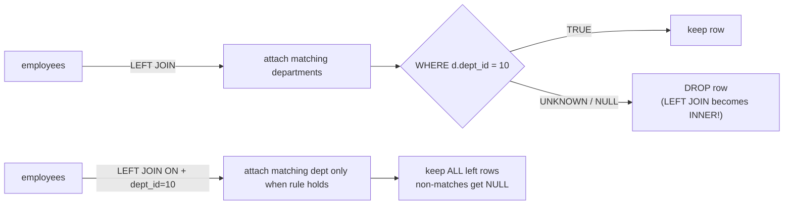
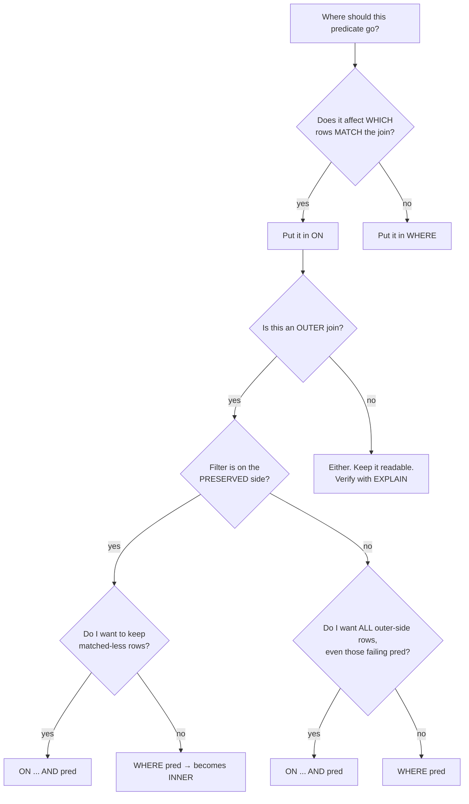

# 20 — JOIN: ON vs WHERE

> Category: 3-Joins
> Cross-references: [15-JOIN types], [21-LEFT-JOIN-becoming-INNER], [9-NULL], [10-threvalued-logic], [24-cartesian-products], [05-filtering], [13-GROUP-BY-HAVING]

---

## Fundamentals

`ON` and `WHERE` are the two places where you write conditions in a query that joins tables:

```sql
SELECT e.emp_name, d.dept_name
FROM employees e
JOIN departments d ON e.dept_id = d.dept_id   -- join condition lives here
WHERE d.dept_name = 'Engineering';            -- row filter lives here
```

The single most important idea in this section:

> `ON` decides **how the join matches rows**.
> `WHERE` decides **which rows survive in the final result**.

For an `INNER JOIN`, the two are **functionally equivalent** — the same condition in either place produces the same result set. This equivalence is _exactly_ what causes the number-one JOIN bug:

> **Production pitfall**
> For a `LEFT JOIN`, a condition written in `WHERE` that references the **right** (nullable) table **silently turns the `LEFT JOIN` into an `INNER JOIN`**. Rows you expected to keep disappear with no error and no warning.

Why? Because a `LEFT JOIN` preserves left-table rows that have no match — but the fill-in right side for those rows is `NULL`. And in SQL, **no `WHERE` condition involving `NULL` can ever be true** (three-valued logic). The unmatched rows have `NULL` right columns, so the `WHERE` rejects them. See [10-threvalued-logic].

---

## The mental model (one sentence)

Think of `LEFT JOIN ... ON ...` as "keep everything from the left table, attach a matching right row **if the `ON` condition succeeds**."

- `ON` = the matching rule → controls _attachment_.
- `WHERE` = a filter applied _after_ that attachment → controls _survival_.

Once you internalize that, every example below is predictable.

---

## Logical order of operations

A query is evaluated (logically, not physically) in this order:

```
FROM        -- build tables, apply JOIN ... ON
WHERE       -- filter rows
GROUP BY    -- form groups
HAVING      -- filter groups
SELECT      -- compute output expressions
DISTINCT    -- remove duplicates
ORDER BY    -- sort
LIMIT/OFFSET-- page
```

Because `ON` runs during the `FROM` phase and `WHERE` runs after the join is assembled, a `WHERE` predicate can see the _fully joined row_ (including `NULL` fill-ins), while `ON` only sees the two tables being joined.

> **Interview trap**
> "For a `LEFT JOIN`, which is applied first, `ON` or `WHERE`?"
> Answer: `ON` (during `FROM`), then `WHERE`. That ordering is the entire reason the results differ.

---

## Sample tables

State the grain up front — this is required to reason about JOINs:

- One row in `employees` = one employee.
- One row in `departments` = one department.

```sql
CREATE TABLE departments (
    dept_id   INT PRIMARY KEY,
    dept_name VARCHAR(50) NOT NULL
);

INSERT INTO departments (dept_id, dept_name) VALUES
(10, 'Engineering'),
(20, 'Marketing'),
(30, 'Human Resources');

CREATE TABLE employees (
    emp_id   INT PRIMARY KEY,
    emp_name VARCHAR(50) NOT NULL,
    dept_id  INT,                -- nullable: an employee may have no department
    salary   INT
);

INSERT INTO employees (emp_id, emp_name, dept_id, salary) VALUES
(1, 'Alice', 10, 80000),
(2, 'Bob',   10, 90000),
(3, 'Carol', 20, 70000),
(4, 'Dave',  NULL, 65000);
```

**employees**

| emp_id | emp_name | dept_id | salary |
| -----: | :------- | ------: | -----: |
|      1 | Alice    |      10 |  80000 |
|      2 | Bob      |      10 |  90000 |
|      3 | Carol    |      20 |  70000 |
|      4 | Dave     |    NULL |  65000 |

**departments**

| dept_id | dept_name       |
| ------: | :-------------- |
|      10 | Engineering     |
|      20 | Marketing       |
|      30 | Human Resources |

---

## INNER JOIN: ON and WHERE are equivalent

```sql
-- BOTH of these return the same result
SELECT e.emp_name, d.dept_name
FROM employees e
JOIN departments d ON e.dept_id = d.dept_id
ORDER BY e.emp_id;

SELECT e.emp_name, d.dept_name
FROM employees e
JOIN departments d ON e.dept_id = d.dept_id
WHERE d.dept_id = 10
ORDER BY e.emp_id;
```

```
emp_name | dept_name
Alice    | Engineering
Bob      | Engineering
Carol    | Marketing
```

Dave (`dept_id IS NULL`) does not match anything and is dropped — the `ON` predicate `e.dept_id = d.dept_id` evaluates to `UNKNOWN` for him, and an `INNER JOIN` only keeps rows where the `ON` condition is `TRUE`.

Wait — for the base inner join, without the WHERE. Let me show base inner join output first:

```
emp_name | dept_name
Alice    | Engineering
Bob      | Engineering
Carol    | Marketing
```

Both queries give that. Dave is dropped in both. So for `INNER JOIN`, it does not matter whether the `dept_id = 10` condition is in `ON` or `WHERE`.

> Common misconception
> "Putting conditions in `ON` is always faster than putting them in `WHERE`."
> Not true. For an `INNER JOIN` the result is identical, and optimizers freely move predicates between the join node and the table scan. Whether one is faster than the other depends entirely on the execution plan.

---

## LEFT JOIN: the two clauses behave differently

This is the heart of the section. Take the exact same predicate `d.dept_id = 10` and place it in `ON` versus `WHERE`.

### Put it in WHERE (BAD for "keep everything")

```sql
SELECT e.emp_name, d.dept_name
FROM employees e
LEFT JOIN departments d ON e.dept_id = d.dept_id
WHERE d.dept_id = 10
ORDER BY e.emp_id;
```

Result:

| emp_name | dept_name   |
| :------- | :---------- |
| Alice    | Engineering |
| Bob      | Engineering |

Carol (Marketing) is filtered out, **and so is Dave** — even though "all employees" was clearly the intent. Dave's joined `dept_id` is `NULL`, and `NULL = 10` is `UNKNOWN`, so the `WHERE` drops him. This `LEFT JOIN` now behaves exactly like an `INNER JOIN`.

### Put it in ON (keeps the LEFT semantics)

```sql
SELECT e.emp_name, d.dept_name
FROM employees e
LEFT JOIN departments d
       ON e.dept_id = d.dept_id AND d.dept_id = 10
ORDER BY e.emp_id;
```

Result:

| emp_name | dept_name   |
| :------- | :---------- |
| Alice    | Engineering |
| Bob      | Engineering |
| Carol    | NULL        |
| Dave     | NULL        |

Now "all employees" is preserved. Carol and Dave simply get a `NULL` department, because the `ON` rule ("is the department id 10 _and_ does it match?") failed, and `LEFT JOIN` keeps the left row anyway.

This is the difference in one picture:



### Decision matrix

| Condition references…             | Join type  | In `ON`                                     | In `WHERE`                                     |
| --------------------------------- | ---------- | ------------------------------------------- | ---------------------------------------------- |
| right table, equality for joining | INNER      | matches rows                                | same result                                    |
| right table, filter predicate     | INNER      | same result                                 | same result                                    |
| right table, filter predicate     | LEFT/RIGHT | **keeps unmatched outer rows**              | **drops unmatched outer rows (becomes INNER)** |
| left table, filter predicate      | LEFT       | affects _matching_, but keeps all left rows | removes left rows that fail                    |
| either table                      | FULL OUTER | preserves failed rows on both sides         | drops failed rows on both sides                |
| aggregate/group level             | any        | not applicable                              | use `HAVING`, not `WHERE` (see below)          |

---

## The `ON` clause is not "just a faster WHERE"

A very common but wrong mental model is:

> "The `ON` is WHERE that runs before the table is scanned."

The `ON` clause is the **join condition**: it directly determines pairings and, for outer joins, whether a row of the preserved table is emitted with `NULL`s on the other side. It is not merely a filter relocated.

For the inner side of an **outer** join, a `WHERE` predicate can only run _after_ the join has produced the `NULL`-padded rows, and it can never re-introduce a row — so orphaned outer rows die. The `ON` predicate participates in the join itself.

> **Interview trap**
> "Write a query returning all customers and the number of orders they placed in 2024 — including customers with zero orders."
>
> BAD:
>
> ```sql
> SELECT c.customer_id, COUNT(o.order_id)
> FROM customers c
> LEFT JOIN orders o ON o.customer_id = c.customer_id
> WHERE o.order_date >= '2024-01-01'        -- filters out zero-order customers!
> GROUP BY c.customer_id;
> ```
>
> BETTER:
>
> ```sql
> SELECT c.customer_id, COUNT(o.order_id)
> FROM customers c
> LEFT JOIN orders o
>        ON o.customer_id = c.customer_id
>       AND o.order_date >= '2024-01-01'
> GROUP BY c.customer_id;
> ```
>
> In the good version, customers with no 2024 orders match nothing and are counted as `0`. In the bad version they vanish entirely, because the `WHERE` condition is false/unknown for their `NULL` order columns. The result silently lies to you.

---

## Filtering on the LEFT (driving) table also differs

Even a predicate on the **left** side of a `LEFT JOIN` changes meaning between `ON` and `WHERE`:

```sql
-- ON version
SELECT e.emp_name, d.dept_name
FROM employees e
LEFT JOIN departments d
       ON e.dept_id = d.dept_id AND e.salary > 85000
ORDER BY e.emp_id;
```

| emp_name | dept_name   |
| :------- | :---------- |
| Alice    | NULL        |
| Bob      | Engineering |
| Carol    | NULL        |
| Dave     | NULL        |

```sql
-- WHERE version
SELECT e.emp_name, d.dept_name
FROM employees e
LEFT JOIN departments d ON e.dept_id = d.dept_id
WHERE e.salary > 85000
ORDER BY e.emp_id;
```

| emp_name | dept_name   |
| :------- | :---------- |
| Bob      | Engineering |

The `ON` version keeps _all_ employees but only attaches a department when the salary rule holds. The `WHERE` version removes Alice, Carol, and Dave entirely. If you want "all employees, with departments attached only for high earners", `ON` is required; if you want "only high earners and their departments", `WHERE` (or an inner join) is correct.

> Best practice: predicate belongs to the table being _filtered for the final result_ → `WHERE`; predicate belongs to the matching rule → `ON`.

---

## The anti-join pattern: `LEFT JOIN ... WHERE inner_col IS NULL`

There is one extremely common case where a `WHERE` predicate on the nullable side is **exactly what you want**: finding outer rows that have _no_ match.

```sql
-- departments with NO employees
SELECT d.dept_name
FROM departments d
LEFT JOIN employees e ON e.dept_id = d.dept_id
WHERE e.emp_id IS NULL;
```

Result:

| dept_name       |
| :-------------- |
| Human Resources |

How it works:

1. The `LEFT JOIN` keeps every department.
2. `Human Resources` has no employee → the employee columns are `NULL`, including `e.emp_id`.
3. `WHERE e.emp_id IS NULL` is `TRUE` only for exactly those orphaned rows.

> Do not “fix” this by moving `e.emp_id IS NULL` into the `ON` clause — that breaks the query completely:
> `LEFT JOIN employees e ON e.dept_id = d.dept_id AND e.emp_id IS NULL` returns **all** departments (the intent is anti-join, not match-on-null).

For pure existence checks, prefer `NOT EXISTS` over this pattern; it is usually clearer and often cheaper. Cross-reference: [17-EXISTS-vs-IN], [18-NOT-IN-vs-NOT-EXISTS].

---

## NULL behavior in ON vs WHERE

| Situation                                      | `ON`                                                                | `WHERE`                                             |
| ---------------------------------------------- | ------------------------------------------------------------------- | --------------------------------------------------- |
| `NULL = something`                             | `UNKNOWN` → no match (inner: dropped; outer: preserved with `NULL`) | `UNKNOWN` → row dropped                             |
| `ON ... AND x = 1` with `NULL` in `x`          | outer row preserved as unmatched                                    | row dropped                                         |
| `WHERE col IS NULL`                            | n/a (existence test after join)                                     | keeps only null (anti-join works here)              |
| `WHERE col <> 10` with NULLs                   | n/a                                                                 | `NULL <> 10` is `UNKNOWN` → null rows dropped too   |
| `WHERE col NOT IN (10,20)` with NULLs anywhere | n/a                                                                 | can drop everything — see [18-NOT-IN-vs-NOT-EXISTS] |

> **Interview trap**
> In an outer join, if you want "everything _except_ value X" you cannot write:
>
> ```sql
> WHERE d.dept_name <> 'Human Resources'
> ```
>
> because unmatched employees (Dave) have `d.dept_name = NULL`, and `NULL <> 'Human Resources'` is `UNKNOWN`, so Dave disappears. Fix by pushing the exclusion into `ON`, or by adding the null escape hatch:
>
> ```sql
> WHERE d.dept_name <> 'Human Resources' OR d.dept_name IS NULL
> ```
>
> Better: express intent as an inner join when you truly don't need unmatched rows.

---

## ON can reference tables joined earlier

In a chain like `a JOIN b ON ... JOIN c ON ...`, the `ON` of the later join may reference columns from **any** table joined before it (and in most engines, including `a`):

```sql
SELECT ...
FROM orders o
JOIN order_items oi ON oi.order_id = o.order_id
JOIN products p ON p.product_id = oi.product_id
                AND p.status = 'active'          -- refs only p: safe
                AND p.price > o.min_budget       -- refs earlier table 'o': legal
WHERE o.status = 'paid';
```

`WHERE`, by contrast, sees the entire joined row. This makes `ON` the natural place to express _matching business rules_ across tables — such as temporal or territory-membership conditions — while `WHERE` stays the "final answer" filter.

---

## Multi-table chains and accidental re-inlining

Watch the interaction of join order with `WHERE`. Once any later join requires the nullable side, the preservation is lost even without a `WHERE`:

```sql
FROM employees e
LEFT JOIN departments d ON e.dept_id = d.dept_id
JOIN locations l ON l.location_id = d.location_id   -- inner join
WHERE l.country = 'US'
```

The `JOIN locations` only matches rows where `d` is not null, so Dave (no department) never survives anyway; the earlier `LEFT JOIN` effectively became inner. If the requirement is "all employees, with location only when both exist", the locations join must also be a `LEFT JOIN`.

> **Interview trap**
> "Why does adding one simple inner join undo my `LEFT JOIN`?"
> Because every subsequent operation in the logical pipeline may re-filter what the `LEFT JOIN` preserved. Outer joins only survive until a later `WHERE`/`JOIN`/`GROUP BY`/`HAVING` removes the `NULL`-padded rows.

---

## Internal working & filter pushdown

### Conceptual evaluation

Logically:

1. `FROM a LEFT JOIN b ON pred` produces all `a` rows, attaching a `b` row when `pred` is true, else `NULL`s.
2. `WHERE X` then removes any of those rows where `X` is not `TRUE`.

So a `WHERE` predicate on `b` executes _after_ step 1 and _cannot restore_ a dropped attachment.

### What the optimizer actually does

- **INNER JOIN**: join and filter can be reordered freely. A `WHERE` equality on a table column is often _pushed_ into that table's scan as an `IndexCond`/`Filter`, so it runs before the join in the physical plan — making `ON` and `WHERE` both cheap and equivalent.
- **LEFT JOIN, predicate on the inner side in `WHERE`**: the engine cannot push this predicate below the join without changing the result (it would remove rows the join was supposed to preserve). It typically appears as a filter above the join node — the full inner table may need to be scanned/hashed first.
- **LEFT JOIN, same predicate in `ON`**: it is part of the join clause, so the engine can often **filter the inner input during the scan/build phase** (and may use an index on that column) — less data flows through the join. This is why `ON` _tends_ to be cheaper here.

> Directly and carefully — do **not** assume it is faster:
>
> ```sql
> EXPLAIN (ANALYZE, BUFFERS)
> SELECT ... FROM employees e
> LEFT JOIN departments d ON e.dept_id = d.dept_id AND d.dept_name = 'Engineering';
>
> EXPLAIN (ANALYZE, BUFFERS)
> SELECT ... FROM employees e
> LEFT JOIN departments d ON e.dept_id = d.dept_id
> WHERE d.dept_name = 'Engineering';
> ```
>
> Compare rows scanned, join algorithm (Hash/Nested Loop/Merge), and actual rows vs rows removed. `PostgreSQL`, `MySQL`, `SQL Server` (Actual execution plan), and `Oracle` (EXPLAIN PLAN + statistics) each expose this differently.

The same `EXPLAIN` discipline applies to the "pre-filter the right side with a subquery" alternative, which is semantically equivalent to `ON` for inner-side predicates:

```sql
SELECT e.emp_id
FROM employees e
LEFT JOIN (SELECT dept_id FROM departments WHERE dept_name = 'Engineering') d
       ON d.dept_id = e.dept_id;
```

For `LEFT JOIN`, `ON`-with-predicate and `LEFT JOIN`-to-pre-filtered-subquery give equivalent results; both preserve unmatched left rows.

> Common misconception
> "WHERE always runs after the entire join, so it is always slower."
> Not a rule. For inner joins the planner commonly pushes the predicate into the scan. Only check with `EXPLAIN` whether the predicate lands before or after the join in the physical plan.

### Sargability side note

Whether a predicate can use an index is decided by its _function form_ (e.g. `d.dept_name = 'Engineering'` is sargable; `LOWER(d.dept_name) = 'engineering'` is not) — not by whether it sits in `ON` or `WHERE`. Cross-reference: [33-sargability].

---

## When to use what — decision guide



Rule of thumb:

| Goal                                                         | Clause                                                    |
| ------------------------------------------------------------ | --------------------------------------------------------- |
| Define the join / matching rule                              | `ON`                                                      |
| Choose which matched-but-wrong rows to drop in a pure filter | `WHERE`                                                   |
| Keep all left/right rows, conditionally attach               | `ON`                                                      |
| Anti-join (find rows with no match)                          | `LEFT JOIN ... WHERE inner_col IS NULL` (or `NOT EXISTS`) |
| Filter rows _before_ grouping                                | `WHERE`                                                   |
| Filter groups _after_ grouping                               | `HAVING`                                                  |

---

## Common mistakes

1. **Left join → inner join by accident.** Any `WHERE` predicate on the nullable (right) table does this. Search your query for `LEFT JOIN` and immediately audit every `WHERE` condition that touches columns of the right side.
2. **Putting a "final result" condition in `ON`** expecting it to filter. It only changes matching; preserved rows stay with `NULL`s.
3. **Duplicating the same predicate in `ON` and `WHERE`** — redundant, and on the right side of an outer join it contradicts itself (one clause preserves, the other kills).
4. **Using `WHERE` for group-level conditions** — must be `HAVING`.
5. **Assuming perf equivalence in outer joins** — predicate placement changes the physical plan (scan pushdown possible in `ON`, not in `WHERE`). Verify.
6. **Using `WHERE col <> x` in outer join** and forgetting `NULL` participates → unmatched rows silently gone.

---

## Production pitfalls

- **Dashboards / reports**: a "total engagements" report built on `LEFT JOIN ... WHERE activity_date >= ...` silently under-counts rows that have no activity. The JOIN-shape mistake becomes a business-report lie.
- **Counts after join**: whenever you add `LEFT JOIN` + `WHERE` on the inner side, cross-check `COUNT(*)` before/after. If the count dropped, you've re-inlined the join. Cross-reference: [07-join-duplication], [23-fan-out].
- **One-to-many fan-out**: moving a filter into `ON` doesn't remove duplication from a one-to-many join; dedup the grain or aggregate first. Cross-reference: [23-fan-out], [13-GROUP-BY-HAVING].
- **Code review checklist**: for every outer join, list every `WHERE` column belonging to the nullable side and decide, column by column, whether the filter belongs in `ON`.

---

## Edge cases

- **Full outer join** with a `WHERE` predicate on either side: unmatched rows of the _other_ side are dropped (they're `NULL` on the filtered side).
- **`ON 1=1`** (always true) is a cross join with join syntax — MySQL and several engines accept it; results can be a Cartesian product. Cross-reference: [24-cartesian-products].
- **Correlated condition in `ON`** referencing an earlier table (temporal joins like `ON o.order_date BETWEEN p.start_date AND p.end_date`) is only expressible in `ON`, not `WHERE`.
- **`USING (dept_id)` vs `ON e.dept_id = d.dept_id`**: with `USING`, the join column is coalesced into a single column in `SELECT *` and cannot be double-qualified; with `ON`, both columns remain. Semantic of outer-join preservation is otherwise identical.
- **Non-equi conditions** (`ON e.salary BETWEEN d.min_salary AND d.max_salary`) often need an outer join so that a person with no matching salary band still appears.

---

## Database-specific notes

> PostgreSQL
> Uses outer-join pushdown where safe; predicates on the inner side in `WHERE` typically appear as filters above the join node, whereas `ON`-clause predicates can act on the inner scan. Verify with `EXPLAIN (ANALYZE)`.

> MySQL
> Same logical semantics. The MySQL optimizer documents that for an outer join, a condition only in `WHERE` is applied after the join and can eliminate preserved rows; referencing a pre-join condition in `ON` preserves them. `JOIN ... ON` without condition is allowed and behaves as a cross join.

> SQL Server
> Standard semantics. In legacy sessions with `ANSI_NULLS OFF`, `col = NULL` comparisons could be `TRUE`, changing `WHERE` NULL filtering behavior — always run with `ANSI_NULLS ON` (the default).

> Oracle
> Legacy `WHERE a.dept_id = b.dept_id(+)` syntax marks outer join with `(+)`. In that old syntax, extra filter conditions on the `(+)` table commonly had to be embedded with the `(+)` join clause to avoid the same “becomes inner” behavior. Prefer ANSI `LEFT JOIN ... ON` in new code.

---

## Best practices

1. State the grain of your driving table before writing the query ([section 1]).
2. Ask: _do I want rows kept even when the other side is missing?_
   - Yes → outer join, and **every predicate on the other side goes in `ON`**.
   - No → inner join (or `EXISTS`/`IN`), predicate may go in `WHERE`.
3. Keep `ON` purely about matching; keep `WHERE` purely about what survives.
4. For existence checks prefer `EXISTS` / `NOT EXISTS` over outer-join + `IS NULL` / `IS NOT NULL` ([17-EXISTS-vs-IN]).
5. After writing an outer join, mentally run the "NULL fill-in" case: substitute `NULL` in the right columns and confirm the `WHERE` still keeps the row.
6. Always sanity-check counts for one-to-many and outer joins; duplicate rows and dropped rows are the two most common silent failures.
7. When performance matters, compare the `ON`-vs-`WHERE` variants with the engine's plan tool before choosing.

---

# Interview Questions

## Beginner

1. In an `INNER JOIN`, do `ON` and `WHERE` ever produce different results for the same predicate? Explain.
2. In query-plan _logical order_ of operations, which runs first — `ON` or `WHERE`?
3. Which clause is used to filter rows _before_ grouping, and which filters _after_ grouping?

## Intermediate

4. Given a `LEFT JOIN` of `employees` to `departments`, why does `WHERE d.dept_name = 'Engineering'` delete employees with no department, while the same condition in `ON` keeps them with a `NULL` department?
5. Write a query returning all customers and their order count for 2024, including customers with zero orders. Now write the version that drops customers with zero orders and explain the difference in clause placement.
6. Does `WHERE d.dept_id IS NULL` in a `LEFT JOIN` restore or destroy preservation? When is it useful?

## Advanced

7. In `FROM a LEFT JOIN b ON ... JOIN c ON ...`, explain how an inner join to `c` can retroactively convert the earlier `LEFT JOIN` to an inner join.
8. Describe how filter pushdown behaves differently for (a) an inner join predicate in `WHERE`, and (b) an outer join predicate on the inner side in `WHERE` vs `ON`.
9. A temporal join matches each order to a valid price window (`ON o.order_date BETWEEN p.start_date AND p.end_date`). Why is this condition impossible to express as a `WHERE` clause and preserve all orders?

## Scenario Based

10. Requirement: "List every product, along with how many units sold in January, including products with zero sales." Write both the broken and the correct query.
11. Requirement: "Show departments with no employees, using `LEFT JOIN` and `IS NULL`." Then rewrite with `NOT EXISTS`. Which is clearer and why?
12. You have `users` and `sessions`, one-to-many. "Show all users with their latest session time, including users who never logged in." Where should the `sessions`-related conditions go?

## Tricky

13. What does `LEFT JOIN departments d ON e.dept_id = d.dept_id AND d.dept_name = 'Engineering'` return vs the same predicate in `WHERE`? Predict both outputs for the sample data above.
14. Why does `WHERE d.dept_name <> 'Engineering'` also silently remove employees without departments? What is the `NULL`-safe fix and what does it reveal about author intent?
15. `WHERE x NOT IN (1,2)` drops every row when `x` is nullable and one value is `NULL`. How is this related to `ON` vs `WHERE` placement in an outer join?

## Output Prediction

Given the sample `employees`/`departments` data above, predict the exact output (including `NULL`s and row order) for:

16. `SELECT e.emp_name, d.dept_name FROM employees e LEFT JOIN departments d ON e.dept_id = d.dept_id WHERE e.salary > 75000 ORDER BY e.emp_id;`

17. `SELECT e.emp_name, d.dept_name FROM employees e LEFT JOIN departments d ON e.dept_id = d.dept_id AND e.salary > 75000 ORDER BY e.emp_id;`

18. `SELECT d.dept_name FROM departments d LEFT JOIN employees e ON e.dept_id = d.dept_id WHERE e.emp_id IS NULL;`

## Debugging

19. A report "orders per customer (left join)" suddenly drops customers once a `WHERE o.status = 'paid'` is added. What is the root cause and the two possible fixes?
20. Someone "optimizes" a query by moving every `WHERE` predicate into the `ON` clause. The output rows change. Identify which predicates caused the change and why.

## Performance

21. Under what circumstances can a `WHERE` predicate on the inner table of an `INNER JOIN` be evaluated before the join? When must it be evaluated after?
22. In a `LEFT JOIN`, why might the inner-side predicate be cheaper in `ON` than in `WHERE`, and how would you verify this claim instead of assuming it?
23. Does predicate placement (`ON` vs `WHERE`) affect index usage and sargability? Explain the relationship and outline the `EXPLAIN` comparisons you would run.
