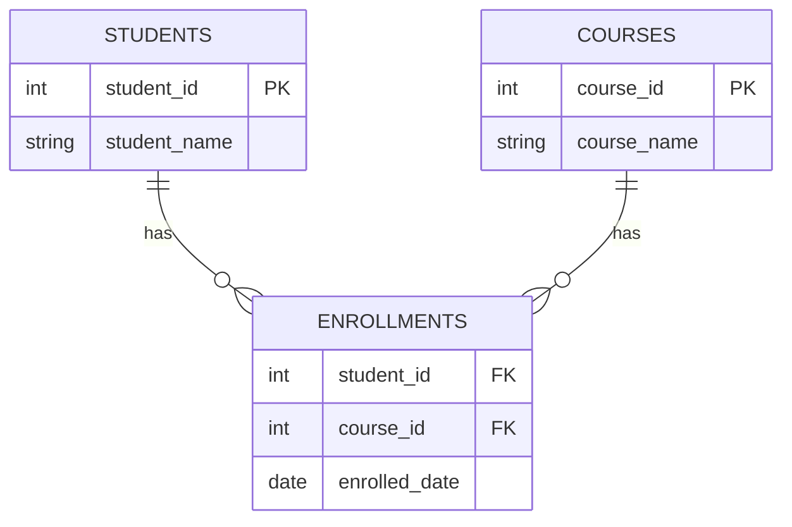
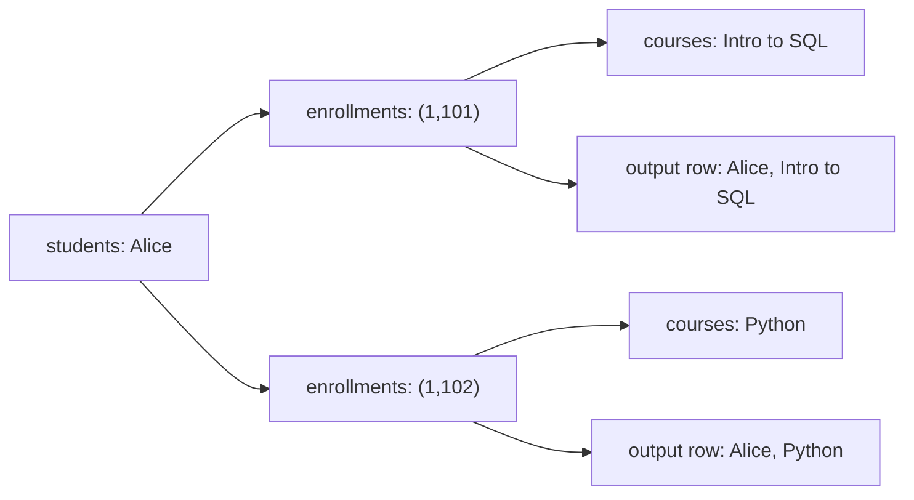

# 22. Many-to-Many Joins

## Fundamentals

A **many-to-many relationship** means that **one row in table A can relate to many rows in table B, and one row in table B can relate to many rows in table A**, at the same time.

Relational databases have no direct way to store "a list of IDs" inside a column (in a normalized design), so many-to-many is modeled with a third table called the **junction table** (also: linking table, bridge table, join table, associative table, mapping table).

Each row in the junction table represents **one pair**: `(left_id, right_id)`.

> The grain of a junction table is always: **one row = one relationship between exactly one row of A and exactly one row of B.**

Real-world examples:

| Left table | Right table    | Junction table | One junction row is...             |
| ---------- | -------------- | -------------- | ---------------------------------- |
| `students` | `courses`      | `enrollments`  | one student enrolled in one course |
| `orders`   | `products`     | `order_items`  | one product line on one order      |
| `authors`  | `books`        | `book_authors` | one author credited on one book    |
| `users`    | `roles`        | `user_roles`   | one user assigned one role         |
| `posts`    | `tags`         | `post_tags`    | one tag applied to one post        |
| `users`    | `users` (self) | `follows`      | one user following another user    |

A many-to-many relationship is really **two one-to-many relationships that share the junction table as the "many" side of both**.



## Why the junction table exists

- A column cannot hold a variable-length list of foreign keys without violating first normal form.
- A junction table enforces the **pair uniqueness** — a student is enrolled in a course at most once (if the composite primary key is defined).
- It can carry **attributes of the relationship itself** — e.g., `enrolled_date`, `grade`, `amount` in `order_items`. Those attributes belong to the pair, not to either participant.

**When to use a junction table:** the relationship is genuinely pairwise and both sides are "many".

**When NOT to use a many-to-many design:**

- The relationship is really one-to-many (e.g., every `order` belongs to exactly one `customer`) — a plain foreign key column is correct.
- One side is always limited (e.g., a user has one role) — store it as a column or a small lookup key.
- You could get away with a comma-separated list, but that sacrifices queryability, integrity, and normalization. Prefer the junction table unless the constraint is trivial and read-only.

---

## Sample Tables

**One row in `students` represents one student.**
**One row in `courses` represents one course.**
**One row in `enrollments` represents one (student, course) enrollment pair.**

```sql
CREATE TABLE students (
    student_id   INT PRIMARY KEY,
    student_name VARCHAR(50)
);

CREATE TABLE courses (
    course_id   INT PRIMARY KEY,
    course_name VARCHAR(50)
);

CREATE TABLE enrollments (
    student_id    INT NOT NULL REFERENCES students(student_id),
    course_id     INT NOT NULL REFERENCES courses(course_id),
    enrolled_date DATE NOT NULL,
    PRIMARY KEY (student_id, course_id)
);
```

```sql
INSERT INTO students VALUES
    (1, 'Alice'),
    (2, 'Bob'),
    (3, 'Carol'),
    (4, 'Dana');

INSERT INTO courses VALUES
    (101, 'Intro to SQL'),
    (102, 'Python'),
    (103, 'REST APIs'),
    (104, 'Machine Learning');

INSERT INTO enrollments VALUES
    (1, 101, '2026-01-10'),
    (1, 102, '2026-01-12'),
    (2, 101, '2026-01-15'),
    (4, 103, '2026-01-22');
```

Facts to remember:

- Alice → 2 courses, Bob → 1, Carol → 0, Dana → 1
- Course 101 → 2 students, 102 → 0, 103 → 1, 104 → 0

---

## Syntax

A many-to-many query almost always touches **three tables**, joined sequentially:

```sql
SELECT <columns>
FROM left_table        AS l
JOIN junction_table    AS j ON l.<id>      = j.<left_id>
JOIN right_table       AS r ON j.<right_id> = r.<id>
[WHERE ...]
[GROUP BY ...]
[HAVING ...]
[ORDER BY ...];
```

The three-table INNER JOIN is **associative**: `(A JOIN J) JOIN R` produces the same result as `A JOIN (J JOIN R)`. Which physical order the engine executes depends on the **optimizer**, statistics, and indexes — never write code assuming one join order is "correct" for performance. Verify with `EXPLAIN ANALYZE`.

---

## How It Works (internal mechanics)

For each matched pair of join conditions, the engine emits **one output row per matching tri</mark>ple `(left, junction, right)`**.

Visually:



This row multiplication is called **fan-out**: one `students` row produced **two** output rows. The total row count of a three-table INNER JOIN (before filtering/dedup) equals the **number of junction rows that survive** — not the size of either parent table.

> **Interview trap:** "How many rows does joining `students ⋈ enrollments ⋈ courses` return?" Not the number of students, not the number of courses — it is the number of **enrollment pairs** (5 in our sample). `SELECT COUNT(*)` after a triple join counts junctions, and beginners routinely mistake it for a count of either parent.

---

## Basic Query + Expected Output

List every (student, course) pair:

```sql
SELECT s.student_name, c.course_name
FROM students s
JOIN enrollments e
  ON s.student_id = e.student_id
JOIN courses c
  ON e.course_id = c.course_id
ORDER BY s.student_name, c.course_name;
```

Expected result:

| student_name | course_name  |
| ------------ | ------------ |
| Alice        | Intro to SQL |
| Alice        | Python       |
| Bob          | Intro to SQL |
| Dana         | REST APIs    |

5 rows. Carroll appears nowhere (no enrollments), and Machine Learning appears nowhere (no students). Alice appears twice because of fan-out.

---

## LEFT JOIN: keeping "zero-match" rows + NULLs

```sql
SELECT s.student_name, c.course_name
FROM students s
LEFT JOIN enrollments e
  ON s.student_id = e.student_id
LEFT JOIN courses c
  ON e.course_id = c.course_id
ORDER BY s.student_name, c.course_name;
```

| student_name | course_name  |
| ------------ | ------------ |
| Alice        | Intro to SQL |
| Alice        | Python       |
| Bob          | Intro to SQL |
| Carol        | **NULL**     |
| Dana         | REST APIs    |

Carol is kept, and the missing `course_name` is `NULL`. Her enrollment count is 0 — the row survives because of the **LEFT** join on the first edge.

Flip the driving side to find courses with **no students**:

```sql
SELECT c.course_name, s.student_name
FROM courses c
LEFT JOIN enrollments e
  ON e.course_id = c.course_id
LEFT JOIN students s
  ON e.student_id = s.student_id
ORDER BY c.course_name;
```

| course_name      | student_name |
| ---------------- | ------------ |
| Intro to SQL     | Alice        |
| Intro to SQL     | Bob          |
| Machine Learning | **NULL**     |
| Python           | **NULL**     |
| REST APIs        | Dana         |

> **Production pitfall:** a condition on the _right_ table in the `WHERE` clause (e.g., `WHERE c.course_name <> 'Python'`) converts the LEFT JOIN back into an INNER JOIN, silently dropping the zero-match rows again. Conditions that should preserve unmatched rows must live in the `ON` clause. See section **LEFT JOIN becoming INNER JOIN**.

---

## Existence Checks: "Courses that have at least one student"

Three common ways to answer "give me courses with ≥ 1 enrollment":

**BAD APPROACH — join + DISTINCT**

```sql
SELECT DISTINCT c.course_id, c.course_name
FROM courses c
JOIN enrollments e ON e.course_id = c.course_id;
```

This works, but it first **materializes the fan-out** (one row per enrollment) and then de-duplicates. If you only care about _whether_ a match exists, you built full rows and threw most away.

**BETTER APPROACH — semi-join via EXISTS**

```sql
SELECT c.course_id, c.course_name
FROM courses c
WHERE EXISTS (
    SELECT 1
    FROM enrollments e
    WHERE e.course_id = c.course_id
);
```

**ALSO VALID — IN with a non-correlated subquery**

```sql
SELECT c.course_id, c.course_name
FROM courses c
WHERE c.course_id IN (
    SELECT e.course_id FROM enrollments e
);
```

All three return:

| course_id | course_name  |
| --------- | ------------ |
| 101       | Intro to SQL |
| 103       | REST APIs    |

Machine Learning is excluded.

> Do **not** claim without evidence that `EXISTS` "is always faster than `DISTINCT`". The optimizer may turn the join+DISTINCT into a semi-join anyway. The honest guidance: `EXISTS`/`IN` express the intent (existence, not row building) directly and don't force materialized fan-out on the plan, but **confirm with `EXPLAIN ANALYZE`** and check which operator actually appears (Semi Join vs. Join + Unique).

---

## Aggregation Without Double Counting

**Goal: number of students per course.**

If you need course _names_, join courses → enrollments:

```sql
SELECT c.course_name,
       COUNT(e.student_id) AS num_students
FROM courses c
LEFT JOIN enrollments e
  ON e.course_id = c.course_id
GROUP BY c.course_id, c.course_name
ORDER BY c.course_name;
```

| course_name      | num_students |
| ---------------- | ------------ |
| Intro to SQL     | 2            |
| Machine Learning | 0            |
| Python           | 0            |
| REST APIs        | 1            |

**Goal: number of courses per student.**

```sql
SELECT s.student_name,
       COUNT(e.course_id) AS num_courses
FROM students s
LEFT JOIN enrollments e
  ON e.student_id = s.student_id
GROUP BY s.student_id, s.student_name
ORDER BY s.student_name;
```

| student_name | num_courses |
| ------------ | ----------- |
| Alice        | 2           |
| Bob          | 1           |
| Carol        | 0           |
| Dana         | 1           |

> **Best practice:** join the **fewest tables you need**. Counting a student's courses requires `students` and `enrollments` only — the `courses` table contributes nothing to this count and only adds fan-out risk and work. Grains and question phrases matter:
>
> - "How many courses is Alice in?" → count `enrollments` rows.
> - "Which courses exist?" → read `courses` alone.

---

## The Double-Counting Pitfall (fan-out distortion)

Classic demonstration with authors ↔ books.

**One row in `authors` = one author; one row in `books` = one book; one row in `book_authors` = one book-credit pair. A book can have multiple authors.**

```sql
CREATE TABLE authors (author_id INT PRIMARY KEY, author_name VARCHAR(50));
CREATE TABLE books (book_id INT PRIMARY KEY, title VARCHAR(50));
CREATE TABLE book_authors (
    author_id INT NOT NULL REFERENCES authors(author_id),
    book_id   INT NOT NULL REFERENCES books(book_id),
    PRIMARY KEY (author_id, book_id)
);
```

Data: Jane wrote books 10 and 11; Mark co-wrote book 10 (with Jane); Ada wrote book 12.

```sql
-- book_authors pairs:
-- (1,10) Jane / SQL Deep Dive
-- (2,10) Mark / SQL Deep Dive
-- (1,11) Jane / Python Essentials
-- (3,12) Ada  / Limits of Inference
```

**BAD APPROACH — "how many books do we have?"**

```sql
SELECT COUNT(*)
FROM authors a
JOIN book_authors ba ON ba.author_id = a.author_id
JOIN books b ON b.book_id = ba.book_id;
```

Result: **4**.

But there are only **3 books**. The answer 4 came from counting _credit pairs_, because _SQL Deep Dive_ is fan-out to two output rows (one per author).

**BETTER APPROACH — match the grain of the question**

```sql
SELECT COUNT(DISTINCT b.book_id) FROM books b;  -- 3
-- or simply
SELECT COUNT(*) FROM books;                       -- 3
```

And "books per author" (only needs `authors` + `book_authors`):

```sql
SELECT a.author_name, COUNT(ba.book_id) AS book_count
FROM authors a
LEFT JOIN book_authors ba ON ba.author_id = a.author_id
GROUP BY a.author_id, a.author_name
ORDER BY a.author_name;
```

| author_name | book_count |
| ----------- | ---------- |
| Ada         | 1          |
| Jane        | 2          |
| Mark        | 1          |

Every author appears exactly once — the LEFT JOIN kept Ada (well, kept her; she has 1) and any author with zero books would appear as `0`.

### The subtler version: aggregates on the parent column

Products can belong to several categories.

```sql
-- products: (1,'Keyboard',50), (2,'Mouse',30), (3,'Monitor',200)
-- categories: (1,'Peripherals'), (2,'Electronics'), (3,'Home Office')
-- product_categories: (1,1), (1,2), (2,1), (3,2)
```

**BAD APPROACH — "average product price" over the join**

```sql
SELECT AVG(p.price) AS avg_price
FROM products p
JOIN product_categories pc ON pc.product_id = p.product_id;
```

Joined rows carry prices `[50, 50, 30, 200]` → `AVG = 82.5`.

**BETTER APPROACH — average at the product grain**

```sql
SELECT AVG(price) FROM products;  -- (50+30+200)/3 = 93.33
```

The keyboard's price of 50 was counted **twice**, once per category, so the naive join average is wrong for "average price per product."

> **Interview trap:** just because a query _runs_ and _looks plausible_, it can still be wrong at the grain level. The mental model: **what does one output row represent, and which rows will be repeated by fan-out?**

Rules of thumb for fan-out + aggregation:

- Always ask: **do I want the aggregate over junction rows, or over distinct entities?**
- If you want per-parent aggregates _and_ the parents multiply rows, **aggregate before joining** (derived table or CTE), or use a window function (`COUNT(*) OVER (...)`).
- If you need `SUM`/`AVG` over a parent-side column _after_ fan-out, confirm the repetition is semantically intended.

---

## Self-Referential Many-to-Many (advanced)

The junction table may reference the **same** table twice — classic for `follows`/friendships.

**One row in `users` = one user. One row in `follows` = one follow relationship (follower → followee).**

```sql
CREATE TABLE follows (
    follower_id INT NOT NULL REFERENCES users(user_id),
    followee_id INT NOT NULL REFERENCES users(user_id),
    PRIMARY KEY (follower_id, followee_id)
);
```

Data: Anna follows Ben; Ben follows Dan; Cat follows Ben and Dan.

```sql
-- follows: (1,2), (2,4), (3,2), (3,4)
-- Anna=1, Ben=2, Cat=3, Dan=4
```

**Recommendation query: "who does Anna follow that she doesn't already follow?"** Followers of the people Anna follows, excluding Anna herself, excluding people she already follows.

```sql
SELECT DISTINCT u.user_id, u.user_name
FROM follows f1                  -- who Anna follows
JOIN follows f2
  ON f2.follower_id = f1.followee_id   -- their followees
JOIN users u
  ON u.user_id = f2.followee_id
WHERE f1.follower_id = 1
  AND u.user_id <> 1
  AND u.user_id NOT IN (
      SELECT followee_id FROM follows WHERE follower_id = 1
  );
```

Result: **Dan (4)** — because Anna → Ben → Dan.

Notice:

- The `follows` table is joined **twice** with different aliases: one join looks up "who Anna follows", the other "whom those people follow".
- `DISTINCT` is needed because multiple paths could suggest the same user (here, Anna → Ben → Dan is the only path; a larger graph could produce duplication).
- Self-referential joins are where **missing indexes on both FK columns** hurt most, because every step probes the same table again.

---

## Edge Cases

1. **Left side with zero matches** — Carol (no courses). INNER JOIN drops her; LEFT JOIN keeps her with `NULL`s on the right side.
2. **Right side with zero matches** — Machine Learning (no students). Left-driven queries never show it; it appears only if you drive from `courses`.
3. **Duplicate junction rows** — if the junction table has no composite PK (or is corrupted), the same pair twice produces duplicate output rows and inflated counts.
4. **Orphan junction rows** — `enrollments` pointing at a missing `course_id` (possible only if FK is missing). INNER JOIN silently drops the whole student/enrollment; LEFT JOIN keeps the pair with a `NULL` course.
5. **Legitimate repeated pairs** — e.g., "Alice retakes Intro to SQL in a later term" handled via a `term`/`start_date` column. Now the pair `(student, course)` may legitimately repeat, and composite PK must become `(student, course, term)` or a surrogate key. `COUNT(DISTINCT ...)` semantics change — the pair is no longer unique.
6. **Self cycles** — users following themselves, or A→B→A mutual follows. The recommendation query needs explicit `<>` guards.
7. **Fan-out identity** — one student in two courses and a course with two students do not multiply against each other; the output rows are governed by the **junction rows**, which is the whole point of the model.

---

## NULL Behavior

- **`NULL` FK in the junction row:** the join condition `e.course_id = c.course_id` with a `NULL` course_id evaluates to `UNKNOWN`, so the row is excluded by INNER JOIN. In a LEFT JOIN (junction driven from the left), the row survives with `NULL` right-hand columns.
- **Prevention:** the junction's FK columns should be `NOT NULL` — a relationship that doesn't identify both sides isn't a relationship.
- **`COUNT(junction.column)`** skips `NULL`s automatically; `COUNT(*)` does not. If orphan rows can exist, the two may disagree.
- **`NOT IN` + `NULL` resurrects itself here too:** `WHERE x NOT IN (SELECT course_id FROM enrollments)` misbehaves if `course_id` can be `NULL` on that subquery path — prefer `NOT EXISTS`. See section **NOT IN + NULL**.

> **Interview trap:** "a many-to-many query that uses `LEFT JOIN` never drops rows" — false. A `NULL`-laden join key and `WHERE` filtering on the right side both break that assumption.

---

## Common Mistakes

| #   | Mistake                                                             | Consequence                                                                                 |
| --- | ------------------------------------------------------------------- | ------------------------------------------------------------------------------------------- |
| 1   | Joining the two parents directly, forgetting the junction           | Either a Cartesian product or random false matches if a coincidentally-shared column exists |
| 2   | `SELECT COUNT(*)` after a triple join and calling it a parent count | Double counting (4 ≠ 3 books)                                                               |
| 3   | Joining tables that contribute no columns or predicates             | Extra fan-out, wasted I/O                                                                   |
| 4   | `DISTINCT` everywhere to mask duplication                           | Hides the real fix (grain) and forces extra work                                            |
| 5   | Filtering right-side columns in `WHERE`                             | LEFT JOIN silently becomes INNER JOIN                                                       |
| 6   | Assuming an execution order from the written `FROM` order           | The optimizer is free to reorder; read `EXPLAIN`                                            |
| 7   | No composite PK on the junction                                     | Duplicate relationship rows pass silently                                                   |
| 8   | Aggregating parent columns after fan-out                            | Statistics skewed (the 82.5 vs 93.33 problem)                                               |

---

## Production Pitfalls

> **Production pitfall — inflated analytics:** a monthly report sums `sales.amount` after joining `orders → order_items → products` and then groups by product category. If an order line legitimately belongs to several campaigns (a second junction for campaigns was left-joined), every `amount` can be counted twice. Before trusting any total, **count the raw facts vs. the joined-row count**, and prefer aggregating the fact table at its own grain (a derived table or CTE) and joining summaries upward.

> **Production pitfall — the missing reverse index:** the junction table gets its composite PK on `(left_id, right_id)`, and the hot query looks up by `right_id`. Every lookup turns into a full scan of the junction. Add an index on `(right_id)` (or make it a covering pair) — and verify with `EXPLAIN ANALYZE` that the plan actually uses it on production data sizes, not just toy volumes.

> **Production pitfall — join explosion:** joining two independent one-to-many chains under one parent (orders → order_lines and orders → shipments) multiplies rows **line × shipment**. On many-to-many data with large fan-out this can blow memory and skew aggregation. Catch out-of-control cardinality with `EXPLAIN (ANALYZE)`, and neutral("Estimated rows") vs. actual returned rows.

---

## Performance Implications

Never assert a universal "fastest" pattern. What matters and what to verify:

- **Rowcount after fan-out is the real cost:** the engine produces `matched_junction_rows` result rows before aggregation. On huge junctions this dominates.
- **Indexes on the junction FKs:**
  - Composite PK `(student_id, course_id)` gives an ordered index ideal for "finish the student's enrollments quickly" (probing from `students`).
  - Reverse lookups ("which students take course 101") need an index leading with `course_id` — often `(course_id, student_id)` as a covering index so the engine never fetches the junction row itself.
  - **However**, small tables skirt this: the optimizer may choose a **hash join** and ignore indexes entirely. An index is only useful if the plan uses it.
- **Join operators:** nested loop shines when the driving side is small and probes are indexed; hash join shines for bulk equi-joins; merge join for sorted input. Which one appears depends on **optimizer, statistics, cardinality, and data distribution** — read the plan.
- **`EXPLAIN ANALYZE` (PostgreSQL/MySQL/SQL Server) / `SET STATISTICS TIME ON` (SQL Server) / `DBMS_XPLAN.DISPLAY` (Oracle):** check (1) join operator choices, (2) indexes actually used per table, (3) estimated vs. actual rows — a big mismatch means stale statistics, and (4) whether `DISTINCT` was folded into a semi-join.
- **Sorting after fan-out** (`ORDER BY` on both parents' columns) may require a Sort operator on a large intermediate set. Filter as early as possible.
- **Column selection matters:** `SELECT *` forces the engine to keep full rows through fan-out. Select only what the result needs.

---

## Comparison Tables

**Relationship cardinalities:**

| Relationship | Model                    | One parent produces...       | Example                     |
| ------------ | ------------------------ | ---------------------------- | --------------------------- |
| One-to-one   | FK + UNIQUE on the child | at most 1 child row          | `users` ↔ `user_profiles`   |
| One-to-many  | FK column on the child   | many child rows              | `departments` ↔ `employees` |
| Many-to-many | junction table (2 FKs)   | many children × many parents | `students` ↔ `courses`      |

**Existence-check patterns:**

| Pattern               | Semantics                            | Fan-out materialized?         | Notes                             |
| --------------------- | ------------------------------------ | ----------------------------- | --------------------------------- |
| `JOIN` + `DISTINCT`   | return distinct parents with a match | Yes (rows built then deduped) | optimizer may rewrite             |
| `EXISTS` (correlated) | stop at first match per parent       | No                            | often cleanest to read            |
| `IN` (uncorrelated)   | set membership on subquery result    | No                            | NULL trap if subquery yields NULL |

> These are _tendencies, not guarantees_. Validate with `EXPLAIN ANALYZE`.

---

## Database-Specific Notes

> **MySQL** does not support `FULL OUTER JOIN` (still true through MySQL 8.x). If you need "students with no courses AND courses with no students," combine two `LEFT JOIN`s with `UNION`.

> **Oracle** legacy outer-join syntax `WHERE s.student_id = e.student_id(+)` is still found in old codebases; prefer the ANSI `LEFT JOIN`. Oracle also returns `''` and `NULL` as equivalent in some contexts — do not compare outer-joined character columns for the empty string.

> **PostgreSQL** fully implements `NOT NULL`/composite PKs/FKs on junction tables; `NULLS NOT DISTINCT` unique indexes (used to allow duplicates except nulls) are a 15+ feature you may see in link tables. See section **IS DISTINCT FROM**.

> **SQL Server** `COUNT(DISTINCT ...)` and heavy junction scans benefit from included columns / columnstore in analytics scenarios; the same `EXPLAIN`-style discipline applies via the actual/estimated execution plan.

> **All engines:** if anything differs (e.g., in MySQL `DROP TABLE` vs Oracle behavior), always confirm against the actual engine version.

---

## Best Practices

1. **Always state the grain** of the junction table in comments/docs: "one row = one enrollment pair."
2. **Enforce a composite PRIMARY KEY `(left_id, right_id)`** — prevention beats cleanups.
3. **Make both FK columns `NOT NULL`** — a link that doesn't link both sides is data rot.
4. **Name the junction for the pair** (`enrollments`, `follows`, `product_categories`), not `student_course_relation` unless the team agrees.
5. **Join only the tables you need.** A count over `enrollments` doesn't need `courses`.
6. **Prefer `EXISTS`/`IN` over `JOIN`+`DISTINCT` for existence questions** — clearer semantics; verify plan.
7. **Aggregate before joining** when fan-out would distort parent-side sums/averages.
8. **Index both directions** (composite PK for one side, a second index for the reverse), then confirm via `EXPLAIN ANALYZE`.
9. **Drive the join from the smaller, more selective side** — but only as a guidance; the optimizer decides.
10. **Test on production-like cardinality**; tiny toy tables hide missing indexes.

---

## Cross-References

- JOIN fundamentals and **JOIN duplication / fan-out** — see sections on JOINs and one-to-many joins.
- **LEFT JOIN becoming INNER JOIN / ON vs WHERE** — see section **JOIN pitfalls**.
- **COUNT(\*), COUNT(col), COUNT(DISTINCT col)** and **GROUP BY vs window functions** — see aggregation sections.
- **EXISTS / IN / NOT IN + NULL / NOT EXISTS** — see the subquery and NULL-safety sections.
- **COALESCE / NULLIF, IS NULL / IS DISTINCT FROM** — see the NULL sections.
- **Composite indexes, covering indexes, sargability, execution plans** — see the Indexing and Optimization sections.

---

# Interview Questions

Answers are intentionally not provided so you can attempt them first.

### Beginner

1. What is a many-to-many relationship, and why can't you model it with just two tables?
2. Given `students`, `courses`, `enrollments`, write the query that lists every (student, course) pair.
3. What does "one row in `enrollments`" represent? Why does that matter when you write a `COUNT(*)`?
4. What is a junction table, and what is its composite primary key normally?
5. When listing residents of `students` and `enrollments`, why does Alice appear on multiple output rows? What is that effect called?

### Intermediate

6. Explain the difference between counting a student's courses with `students ⋈ enrollments` vs. with `students ⋈ enrollments ⋈ courses`. Is the result the same? Why join fewer tables?
7. Given `products`, `categories`, `product_categories`, write a query to find categories that have **no** products, using `LEFT JOIN`. Now write the same with `NOT EXISTS`. Which reads better?
8. Why does `SELECT COUNT(*) FROM authors JOIN book_authors JOIN books` return more than the number of books? How do you fix the query when you want the count of distinct books?
9. What is the difference between `JOIN` + `DISTINCT` and `EXISTS` for the question "which courses have students"? In what cases might each be preferable?

### Advanced

10. Write a "people you may know" (friends-of-friends) query against a self-referential `follows` table. How do you prevent recommending people the user already follows, and avoid duplicates?
11. When you need both per-student aggregates _and_ the full student↔course list in one result, why might you aggregate in a derived table/CTE before joining? Provide a scenario.
12. Explain the potential double counting when you `AVG(price)` after joining products to categories. What is the correct grain for the "average product price" question, and how does fan-out change the result?
13. How could you decide between nested-loop and hash join for a large junction query, and what specific numbers from `EXPLAIN ANALYZE` would you read?
14. A junction table must support fast lookups in both directions but can only have one PK. How do you index it, and what must you check afterward?

### Scenario Based

15. A tutoring platform: `students`, `tutors`, and `sessions` (junction with `hours` and `date`). Write a query giving each tutor their total and average hours, then one giving each student theirs. State the grain of every intermediate set.
16. A social app has `follows(follower_id, followee_id)`. Write a single query that reports each user's follower count and followee count. Where could a naive `COUNT` double count, and how do you avoid it?
17. Reporting "revenue per category" from `orders ⋈ order_items ⋈ products ⋈ product_categories`. A product in two categories is expected to appear in both rows — but what goes wrong if the same order is then joined to another many-to-many table? How would you redesign the query?

### Tricky

18. Can `NULL` appear in the composite key of a junction table's output rows? What happens to the joins when a junction FK is `NULL`, and what protects against it?
19. If a junction row references a course that was deleted (no FK constraint), what is the difference in output between INNER and LEFT JOIN for that enrollment?
20. Two students both retake the same course in different terms using a `term` column. The pair `(student, course)` is no longer unique. What changes in your schema, and how do your `COUNT(DISTINCT ...)` queries change meaning?
21. Your recommendation query over `follows` returned users the requester already follows. Why, and what guard fixes it?

### Output Prediction

For each, state the exact number of output rows and the distinguished rows BEFORE running the DB:

22. Our sample data (`enrollments` has 5 rows): `SELECT * FROM students JOIN enrollments JOIN courses` — how many rows?
23. Same data, but start with the `LEFT JOIN` from `students`, and Carol has no courses — how many rows, and what do Carol's course columns contain?
24. Products/categories data with keyboard in two categories: `SELECT category_name, AVG(price)` grouped by category — what values, and can you explain them?
25. `SELECT COUNT(DISTINCT book_id)` vs. `SELECT COUNT(*)` over the books triple join — give both numbers.

### Debugging

26. A report "number of students per course" returns course counts that sum higher than the number of students. What inquiries do you run to decide whether the query or the data is wrong?
27. A page listing "Alice's courses" shows duplicates of "Intro to SQL". The `enrollments` PK is missing. What is the origin of the duplicate, and how do you resolve it correctly versus masking it?
28. `EXPLAIN ANALYZE` shows "estimated rows = 10, actual rows = 1,000,000" on an enrollment join. What does that gap mean, and what is the immediate next step?
29. Your `LEFT JOIN` "users with no roles" query returns zero rows despite orphan users existing. Which clause is nearly always the culprit?

### Performance

30. How would you verify whether the reverse-direction index on a junction table is actually being used? Show the steps and the plan artifacts you would check.
31. Compare the likely plan shapes of `JOIN + DISTINCT` vs `EXISTS` for "courses with students" and explain what you'd look for in the plan to call one better than the other on a specific dataset.
32. Someone claims "nested-loop join is always better for many-to-many." What is wrong with that claim, and what factors decide the join operator in practice?
33. What statistics, cardinality, and data-distribution information would you collect to choose between aggregating `enrollments` first versus joining-and-grouping, and how do you measure the difference on production data?
