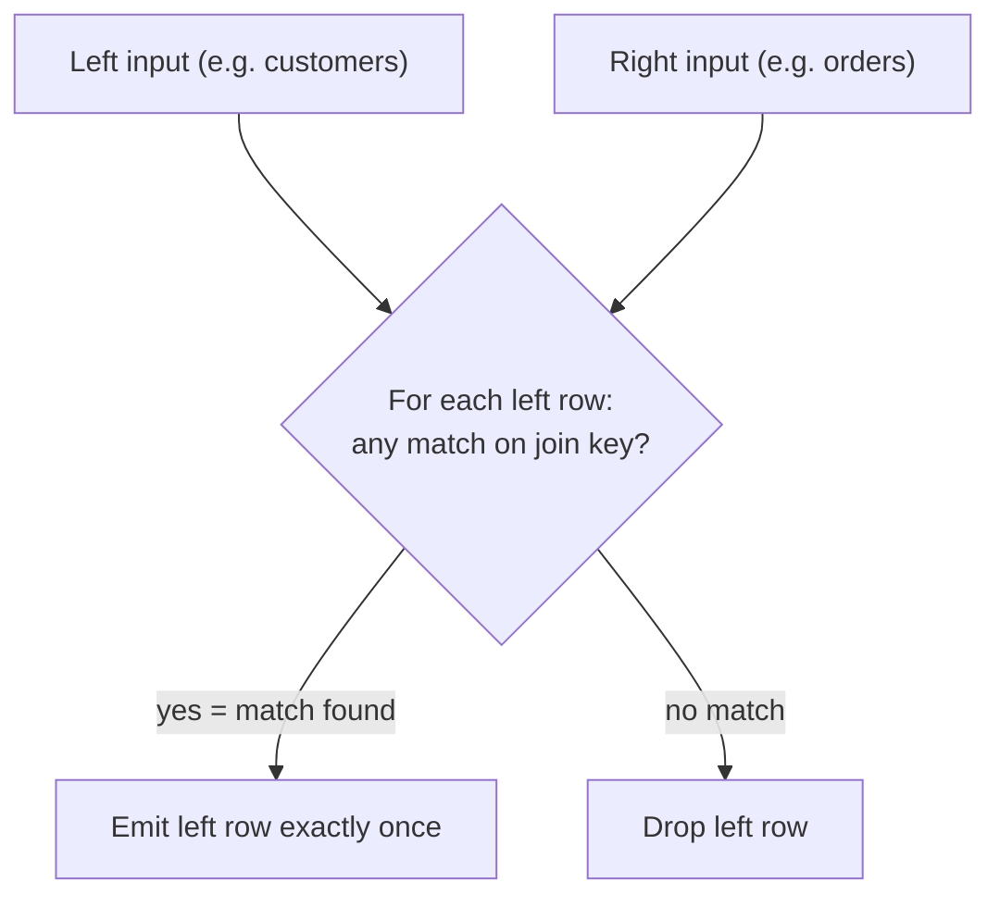

# 24. Semi-Joins

## What Is a Semi-Join?

A **semi-join** is a relational algebra operation. Given two tables `R` and `S`, the semi-join `R ⋉ S` returns **every row of `R` that has at least one matching row in `S`**.

```text
R ⋉ S  =  { rows of R that match at least one row of S }
```

Two properties make a semi-join distinct from everything else in SQL:

1. **The output schema is the schema of the left table only.** You never get columns from `S`.
2. **A left row is returned at most once**, no matter how many rows of `S` it matches.

The number of output rows is always `<=` the number of rows in `R`.

> **Important:** SQL has **no literal `SEMI JOIN` keyword** (in standard SQL, PostgreSQL, MySQL, SQL Server, or Oracle). You write semi-joins using `EXISTS` or `IN`. The words "semi-join" first appear when the **query optimizer** rewrites your query into a **semi-join operator** in the execution plan.

## Why Does It Exist?

Most of the time when a developer "joins" two tables, they do **not** actually want columns from the second table. They want to ask a **yes/no existence question**:

- "Does this customer have at least one order?"
- "Has this product ever been sold?"
- "Is this employee in a department that has a budget?"

If you answer that question with an ordinary `JOIN`, you get the row-multiplication (fan-out) problem: a customer with three orders appears three times. You then "fix" it with `DISTINCT`, which forces the database to do extra sorting or hashing.

The semi-join exists so you can ask existence questions **without multiplying rows** and **without projecting unwanted columns**. It is also the natural building block for its twin, the **anti-join** (return rows that match _nothing_), which Section 25 covers.

## The Grain of Each Table

Every query below uses these tables. State the grain first, always.

```sql
CREATE TABLE customers (
    customer_id  INTEGER PRIMARY KEY,
    name         TEXT NOT NULL
);

CREATE TABLE orders (
    order_id     INTEGER PRIMARY KEY,
    customer_id  INTEGER NOT NULL REFERENCES customers(customer_id),
    ordered_at   DATE NOT NULL,
    total        NUMERIC(10,2) NOT NULL
);

CREATE TABLE payments (
    payment_id   INTEGER PRIMARY KEY,
    order_id     INTEGER NOT NULL REFERENCES orders(order_id),
    amount       NUMERIC(10,2) NOT NULL,
    paid_at      DATE NOT NULL
);
```

| Table       | Grain                                                   |
| ----------- | ------------------------------------------------------- |
| `customers` | one row = one customer                                  |
| `orders`    | one row = one order (a customer can have many orders)   |
| `payments`  | one row = one payment (an order can have many payments) |

Sample data:

```sql
INSERT INTO customers VALUES
    (1, 'Alice'), (2, 'Bob'), (3, 'Carol'), (4, 'Dan');

INSERT INTO orders VALUES
    (101, 1, '2026-09-01', 120.00),
    (102, 1, '2026-09-05',  80.00),
    (103, 3, '2026-09-10', 250.00);

INSERT INTO payments VALUES
    (501, 101, 120.00, '2026-09-02'),
    (502, 101,  60.00, '2026-09-08'),   -- order 101 has TWO payments
    (503, 103, 250.00, '2026-09-12');
```

## The Three Ways to Write a Semi-Join

| Form                         | Query shape                                      | Notes                                                            |
| ---------------------------- | ------------------------------------------------ | ---------------------------------------------------------------- |
| `EXISTS` correlated subquery | `WHERE EXISTS (SELECT 1 FROM s WHERE s.k = r.k)` | Most explicit; naturally correlated; robust with NULL            |
| `IN` subquery                | `WHERE r.k IN (SELECT s.k FROM s)`               | Concise; uncorrelated by default                                 |
| `JOIN` + `DISTINCT`          | `SELECT DISTINCT r.* FROM r JOIN s ON ...`       | Syntactically correct but the worst implementation; see pitfalls |

### 1) Using `EXISTS`

```sql
SELECT c.customer_id, c.name
FROM customers AS c
WHERE EXISTS (
    SELECT 1
    FROM orders AS o
    WHERE o.customer_id = c.customer_id
);
```

**What does one output row represent?** One customer who has placed at least one order.

**Expected output:**

| customer_id | name  |
| ----------- | ----- |
| 1           | Alice |
| 3           | Carol |

Alice is returned **once**, even though she has two orders. Bob and Dan never ordered, so they are excluded.

### 2) Using `IN`

```sql
SELECT c.customer_id, c.name
FROM customers AS c
WHERE c.customer_id IN (SELECT o.customer_id FROM orders AS o);
```

Same result:

| customer_id | name  |
| ----------- | ----- |
| 1           | Alice |
| 3           | Carol |

### 3) The `JOIN` + `DISTINCT` lookalike (avoid it)

```sql
SELECT DISTINCT c.customer_id, c.name
FROM customers AS c
JOIN orders AS o ON o.customer_id = c.customer_id;
```

Also gives the same result — but for the wrong reasons and with unnecessary work (see Performance).

## How a Semi-Join Works Internally

When you write `EXISTS` or `IN`, the optimizer usually rewrites the query into a dedicated **semi-join operator**. You never type `SEMI JOIN`, but you will see it in execution plans:

| Database   | What EXPLAIN shows                                                                                                                                      |
| ---------- | ------------------------------------------------------------------------------------------------------------------------------------------------------- |
| PostgreSQL | `Hash Semi Join`, `Nested Loop Semi Join`, `Merge Semi Join`                                                                                            |
| SQL Server | a `Left Semi Join` operator in the plan                                                                                                                 |
| Oracle     | semi-join shown in the join/access path of the plan                                                                                                     |
| MySQL      | `EXPLAIN FORMAT=TREE` shows a `SEMIJOIN`; older plans show the `semijoin` strategy hints (`FirstMatch`, `Loosescan`, `DuplicateWeedout`, `Materialize`) |

There are three classic algorithms, chosen by the optimizer based on sizes, indexes, and statistics:

- **Nested-loop semi-join** — for each left row, scan the right table (typically via an index) and **stop after the first match**. This is the famous "short-circuit" and it is the reason a semi-join can be far cheaper than a join + dedupe.
- **Hash semi-join** — build a hash table of the right table's join keys; probe per left row; emit on first hit.
- **Merge semi-join** — both sides sorted on the join key; walk them together; emit a left row when the keys line up, advancing past all its duplicates.



> **Verify, don't guess.** The optimizer is free to flatten `EXISTS`/`IN` into a semi-join, to keep a correlated plan, or to rewrite the shape entirely. Run `EXPLAIN` (PostgreSQL / MySQL: `EXPLAIN (ANALYZE)`), SQL Server's estimated/actual plan, or Oracle's `EXPLAIN PLAN` and look for a `Semi Join` node before judging performance.

## SQL Reasoning Walkthrough

Using the checklist, here is how you should reason about the query "list customers who ordered at least once":

1. **What does one output row represent?** One customer (not one customer-order pair). So the output grain = the `customers` grain.
2. **Do I need columns from another table?** No — just `customers.name`.
3. **Do I only need to know whether a row exists?** Yes, that's the whole question.
4. **Can the JOIN create duplicates?** Yes — Alice has two orders. Therefore a plain `JOIN` is the wrong tool.
5. **Do I need aggregation?** No — window functions/`GROUP BY` would be overkill.
6. **Could NULL affect the result?** Yes (see NULL behavior below).
7. **Do I need WHERE or HAVING?** `WHERE` on the semi-join condition.

A semi-join is exactly the "existence without fan-out" answer.

## NULL Behavior

### `EXISTS` and NULL

`EXISTS` is a **boolean test**: it checks whether a subquery produces at least one row. NULL values inside the subquery are irrelevant — the subquery is not "comparing" anything unless you write an equality in its `WHERE`. A `NULL` join column simply never matches another `NULL` (because `NULL = NULL` is not `TRUE`), so the row is excluded. The predicate `WHERE o.customer_id = c.customer_id` evaluates to `NULL` for NULL keys, which filters the row — correct.

### `IN` and NULL

`IN (subquery)` behaves differently beneath the surface. `x IN (1, 2, NULL)` is actually `x = 1 OR x = 2 OR x = NULL`, which always evaluates to `NULL` (not `FALSE`) for any `x` not equal to 1 or 2. In a `WHERE`, `NULL` behaves like `FALSE`, so the row is dropped.

Within a **positive semi-join**, that just produces the correct result: a value that genuinely matches nothing is excluded whether the subquery list contains a NULL or not. So `IN` is _usually_ fine for semi-joins.

> **Common misconception:** "IN is broken when the subquery returns NULL."
> For the **positive** form (`r.k IN (SELECT ...)`), `IN` still returns exactly the rows with a real match, so it is a faithful semi-join. The famous NULL disaster happens with the **negated** form: `NOT IN` returns **zero rows** whenever the subquery produces a single NULL. That is the anti-join trap (Section 25), not a semi-join problem.

### The one real divergence: the negation

Because of the `NULL` behavior above:

- `EXISTS` and `IN` agree with each other for the positive semi-join (in the uncorrelated case).
- `NOT EXISTS` and `NOT IN` **diverge**: `NOT IN` collapses to "no rows" when the subquery contains any NULL, while `NOT EXISTS` behaves correctly.

That single difference is why many coding standards say: _use `NOT EXISTS` for anti-joins, not `NOT IN`._

## Edge Cases

| Scenario                           | `EXISTS`                                  | `IN`                             |
| ---------------------------------- | ----------------------------------------- | -------------------------------- |
| Right table is empty               | returns nothing                           | returns nothing                  |
| Row matches many right rows        | emitted once                              | emitted once                     |
| Row matches zero right rows        | excluded                                  | excluded                         |
| Join key is `NULL` on the left     | excluded (no equality)                    | excluded (`NULL IN ...` is NULL) |
| Subquery result contains `NULL`    | irrelevant (no comparison unless written) | still correct for positive `IN`  |
| Uncorrelated, never-false subquery | **bug**: every left row passes            | not applicable (no outer ref)    |

### The "always-true `EXISTS`" bug

```sql
SELECT c.customer_id, c.name
FROM customers AS c
WHERE EXISTS (SELECT 1 FROM orders);
```

> **Interview trap:** this subquery is **not correlated** — it never references `c`. The optimizer evaluates it once; because `orders` is non-empty, it is `TRUE` for every row. Result: **all four customers**, not just Alice and Carol. This is one of the most common `EXISTS` mistakes.

## Common Mistakes

1. **Reaching for `JOIN` when only existence matters**, then adding `DISTINCT` to undo the damage. Result: correct output, expensive plan.
2. **Believing `LEFT JOIN ... WHERE right.id IS NOT NULL` is a semi-join.** It is just an inner join in disguise and still fans out.
3. **Making `EXISTS` uncorrelated by accident** (the always-true bug above).
4. **`NOT IN` with a NULL-producing subquery** — returns nothing (anti-join trap, Section 25).
5. **Writing `EXISTS (SELECT o.customer_id ...)`** — harmless, but the convention `SELECT 1` (or `SELECT NULL`) makes clear you only care about existence. The optimizer ignores the select list anyway.
6. **Selecting extra columns through `DISTINCT`.** `SELECT DISTINCT *` deduplicates on every projected column, which is wider than necessary and can break the "one row per left row" expectation if someone adds a column later.
7. **Null-aware OR in the subquery**: `WHERE EXISTS (SELECT 1 FROM o WHERE o.region = c.region OR o.special = 1)` — if `c.region` is NULL, no `o.region` equals it, so the query silently returns nothing in that branch. Verify the intended NULL semantics.
8. **MySQL legacy limit**: older MySQL versions rejected `LIMIT` inside a subquery used with `IN` ("This version of MySQL doesn't yet support 'LIMIT & IN/ALL/ANY/SOME subquery'"). `EXISTS` avoids that; newer versions handle it.

## BAD ACCESS vs BETTER APPROACH

### Fan-out fix: `JOIN` + `DISTINCT`

**BAD APPROACH** — existence question answered with a join, then patched with `DISTINCT`:

```sql
SELECT DISTINCT c.customer_id, c.name
FROM customers AS c
JOIN orders AS o ON o.customer_id = c.customer_id;
```

**BETTER APPROACH** — a real semi-join:

```sql
SELECT c.customer_id, c.name
FROM customers AS c
WHERE EXISTS (
    SELECT 1
    FROM orders AS o
    WHERE o.customer_id = c.customer_id
);
```

Why: the `JOIN` version materializes the full intersection (Alice twice), processes all matched pairs, then runs a distinct-sort/hash over the result. The `EXISTS` version can stop scanning `orders` after the first match for each customer and never has to deduplicate anything.

### Orders that have at least one payment (one-to-many on the right)

Order 101 has two payments, so the plain join produces 101 twice:

```sql
SELECT o.order_id
FROM orders AS o
JOIN payments AS p ON p.order_id = o.order_id;
```

| order_id |
| -------- |
| 101      |
| 101      |
| 103      |

**BAD APPROACH** — "fix" with `DISTINCT`:

```sql
SELECT DISTINCT o.order_id
FROM orders AS o
JOIN payments AS p ON p.order_id = o.order_id;
```

**BETTER APPROACH**:

```sql
SELECT o.order_id
FROM orders AS o
WHERE EXISTS (
    SELECT 1
    FROM payments AS p
    WHERE p.order_id = o.order_id
);
```

| order_id |
| -------- |
| 101      |
| 103      |

The better version expresses the intent directly, avoids the fan-out entirely, and gives the optimizer the same semi-join rewriting freedom.

## Scenario-Based Examples

### Scenario 1 — Recently active customers (time window)

_Dashboards question: which customers ordered in the last 30 days?_

```sql
SELECT c.customer_id, c.name
FROM customers AS c
WHERE EXISTS (
    SELECT 1
    FROM orders AS o
    WHERE o.customer_id = c.customer_id
      AND o.ordered_at >= CURRENT_DATE - INTERVAL '30 days'
);
```

> `PostgreSQL` / `MySQL`/`SQL Server`: `INTERVAL` syntax differs slightly (`DATEADD` in SQL Server, `DATE_ADD`/`CURDATE()` in MySQL). The semi-join shape is identical.

### Scenario 2 — Products that ever sold

```sql
CREATE TABLE products (
    product_id   INTEGER PRIMARY KEY,
    product_name TEXT NOT NULL
);

CREATE TABLE order_items (      -- one row = one line item on an order
    item_id     INTEGER PRIMARY KEY,
    order_id    INTEGER NOT NULL REFERENCES orders(order_id),
    product_id  INTEGER NOT NULL REFERENCES products(product_id),
    quantity    INTEGER NOT NULL
);

SELECT p.product_id, p.product_name
FROM products AS p
WHERE EXISTS (
    SELECT 1
    FROM order_items AS oi
    WHERE oi.product_id = p.product_id
);
```

### Scenario 3 — The mirror image: anti-join (customers who never ordered)

```sql
SELECT c.customer_id, c.name
FROM customers AS c
WHERE NOT EXISTS (
    SELECT 1
    FROM orders AS o
    WHERE o.customer_id = c.customer_id
);
```

| customer_id | name |
| ----------- | ---- |
| 2           | Bob  |
| 4           | Dan  |

This is the **anti-join** (semi-join's complement). Full treatment in Section 25 — the short version: prefer `NOT EXISTS` over `NOT IN` here because of the NULL trap.

## Comparison Tables

### `EXISTS` vs `IN` vs `JOIN + DISTINCT`

| Criterion                                                | `EXISTS`            | `IN`                                                                                  | `JOIN` + `DISTINCT`                     |
| -------------------------------------------------------- | ------------------- | ------------------------------------------------------------------------------------- | --------------------------------------- |
| Output = left schema only                                | Yes                 | Yes                                                                                   | Yes (after dedupe)                      |
| Fan-out / duplicates                                     | None                | None                                                                                  | Present, then removed                   |
| Naturally correlated                                     | Yes                 | Usually uncorrelated (but can be)                                                     | N/A                                     |
| Arbitrary subquery conditions (ranges, OR, inequalities) | Yes                 | Only equality to subquery columns                                                     | Yes, but with fan-out                   |
| Multiple-column comparison                               | Yes (any predicate) | `(a,b) IN (SELECT ...)` — supported in PostgreSQL/MySQL/SQL Server, **not** in Oracle | Yes (ON clause)                         |
| NULL-safe for the negated form                           | Yes (`NOT EXISTS`)  | No (`NOT IN` → empty result with NULLs)                                               | N/A                                     |
| Optimizer usually rewrites to                            | Semi-join           | Semi-join                                                                             | Not a semi-join; dedupe is a real stage |
| Symmetry (rows appear once)                              | Yes                 | Yes                                                                                   | Only via DISTINCT                       |

### Semi-join vs the alternatives

| Operation                         | Returns                          | Row duplication?                | Right columns?            |
| --------------------------------- | -------------------------------- | ------------------------------- | ------------------------- |
| INNER JOIN                        | rows only where both sides match | Yes, one per (left,right) match | Yes                       |
| LEFT JOIN                         | all left rows                    | Yes                             | Yes (NULLs when no match) |
| SEMI-JOIN (`EXISTS`/`IN`)         | left rows with ≥1 match          | Never                           | Never                     |
| ANTI-JOIN (`NOT EXISTS`/`NOT IN`) | left rows with 0 matches         | Never                           | Never                     |

## Performance Implications

- **Don't claim a universal winner.** Whether `EXISTS` or `IN` is faster depends on optimizer version, indexes, statistics, data distribution, cardinality, and query shape. Both are routinely flattened into the same semi-join operator. There is no law that "EXISTS beats IN" — verify per query.
- **Semi-joins beat `JOIN` + `DISTINCT` structurally.** The join+distinct pipeline must produce and sort/hash _every_ matched pair; the nested-loop semi-join stops after the **first** match per left row. This advantage grows when each left row matches many right rows.
- **Index the right-side join column.** For a nested-loop semi-join, an index on the subquery/right table's join column (e.g., `orders(customer_id)`) lets the database seek and stop immediately. For a hash semi-join, the optimizer builds a hash on the smaller input — check the plan to confirm which side it chose.
- **Statistics matter for the choice.** A semi-join's estimated cardinality depends on the number of distinct values / frequencies of the join column. Poor or stale statistics → wrong algorithm choice. `ANALYZE` / update stats and re-check.
- **MySQL specifics.** Since 5.6, MySQL has optimizer strategies specifically for semi-joins (`FirstMatch`, `Loosescan`, `DuplicateWeedout`, `Materialize`). On MySQL, `EXISTS` and `IN` can produce noticeably different plans depending on version — again, read `EXPLAIN`.
- **The empty-subquery case.** `r.k IN (SELECT ...)` where the subquery is empty forces some optimizers to materialize the empty set to guarantee semantics; under a known-empty condition, a `WHERE 1 = 0` guard can short-circuit whole query plans.

> **Verify with the execution plan.** Always confirm with `EXPLAIN` / `EXPLAIN ANALYZE` (PostgreSQL, MySQL), the actual plan (SQL Server), or `EXPLAIN PLAN` (Oracle) whether you actually get a `Semi Join` node, which side is the build/probe or outer/inner input, whether an index is used, and where any sort or hash occurs.

## Production Pitfalls

> **Production pitfall — invisible fan-out.** If you answer an existence question with a plain `JOIN` and forget `DISTINCT`, metrics silently double-count. Example: "total sales by customer" computed by joining customers to payments would count order 101's revenue twice (it has two payments). Semi-joins eliminate the fan-out from the start, but always state the output grain before writing the query.

> **Production pitfall — the `LEFT JOIN ... IS NOT NULL` habit.** Developers often "convert" a join to a semi-join like `LEFT JOIN orders o ON ... WHERE o.order_id IS NOT NULL`. This still performs a full join and still duplicates — it is an inner join in disguise, not a semi-join.

> **Production pitfall — `DISTINCT` over wide rows.** `SELECT DISTINCT c.*` sorts/hashes every projected column. If `customers` has many wide text columns, this is pure waste compared with an actual semi-join.

> **Production pitfall — correlated subqueries in ORMs.** ORM-generated `IN` lists with thousands of literal values can be slower to parse and lose the semi-join shape versus a correlated `EXISTS`. If you are hand-tuning, rewrite and compare plans.

## Best Practices

1. Ask the existence question out loud first. If the answer is "I just need to know whether at least one row exists," use a semi-join, not a join.
2. Prefer `EXISTS` when the subquery is correlated or needs extra conditions (ranges, `OR`, inequalities). It's the most readable and the least fragile.
3. Prefer `IN` for simple, uncorrelated equality checks where you're sure the subquery column isn't a pathological NULL source.
4. Never use `JOIN` + `DISTINCT` (or `LEFT JOIN` + `IS NOT NULL`) to fake a semi-join.
5. Never negate an `IN` that may contain NULL — reach for `NOT EXISTS` (see Section 25).
6. Write `SELECT 1` (or `SELECT NULL`/`SELECT 1 WHERE ...`) in `EXISTS` subqueries; the select list is irrelevant.
7. Keep the output grain fixed: one output row = one row of the driving (left) table.
8. Check the execution plan for a `Semi Join` node and verify index usage on the right side.

# Interview Questions

## Beginner

1. What is a semi-join, and how does it differ from an inner join?
2. Which two SQL keywords let you write a semi-join without a `SEMI JOIN` keyword existing in SQL?
3. Given a `customers` and an `orders` table, write a query to find customers who have placed at least one order.
4. How many times can a left-hand row appear in the result of a semi-join — and why?
5. What is the grain difference between returning _customers_ and returning _customer-order pairs_?

## Intermediate

6. Semantically, when do `EXISTS` and `IN` agree for a positive (non-negated) existence check, and when do they disagree?
7. Explain what `x IN (1, 2, NULL)` actually evaluates to and why it matters for `NOT IN`.
8. When would you choose `EXISTS` over `IN`?
9. Why does `LEFT JOIN ... WHERE right.key IS NOT NULL` not behave like a semi-join?
10. What is wrong with this query, and what does it return?

```sql
SELECT c.customer_id
FROM customers c
WHERE NOT IN (
    SELECT order_id
    FROM orders
);
```

## Advanced

11. Describe how the optimizer changes a `WHERE EXISTS` query into a nested-loop semi-join, and where the short-circuit happens.
12. Under what conditions might a hash semi-join beat a nested-loop semi-join?
13. Why can `JOIN` + `DISTINCT` never be as cheap as a true semi-join in the worst case?
14. How does semi-join cardinality estimation depend on column statistics, and what happens with stale statistics?
15. Explain the difference between `FirstMatch` and `DuplicateWeedout` MySQL semi-join strategies.

## Scenario Based

16. Write a query to find customers who have ordered at least once **in the last 90 days**, using an index-friendly shape.
17. Products that have never been sold — write both the semi-join-based and anti-join-based solution, and explain when each applies.
18. Given `payments` with multiple payments per order, count distinct active customers without double counting — compare the join-based and semi-join-based approaches.
19. Find employees in departments that have at least one employee with a salary above the department average (a correlated semi-join).

## Tricky

20. What does this query return and why?

```sql
SELECT c.customer_id
FROM customers c
WHERE EXISTS (SELECT 1 FROM orders);
```

21. When is it safe to assume `IN (subquery)` behaves identically to `EXISTS`, and when is that assumption dangerous?
22. `customer_id IN (SELECT customer_id FROM orders)` — if `orders.customer_id` can be NULL, is the result still a faithful semi-join? What changes if you flip it to `NOT IN`?
23. What does `(a, b) IN (SELECT x, y FROM t)` do in PostgreSQL/MySQL/SQL Server, and what should you write instead in Oracle?

## Output Prediction

24. Predict the output:

```sql
SELECT c.name
FROM customers c
WHERE customer_id IN (SELECT customer_id FROM orders);
```

Data: customers = 1 Alice, 2 Bob, 3 Carol, 4 Dan; orders = (101, 1), (102, 1), (103, 3).

25. Predict the output of this fan-out query:

```sql
SELECT o.order_id
FROM orders o
JOIN payments p ON p.order_id = o.order_id;
```

Given order 101 has two payments and order 103 has one.

## Debugging

26. A query that is "supposed" to list customers once returns Alice three times. Walk through how you would diagnose whether it is a duplicate-fan-out or a real data condition, and how you'd confirm with `EXPLAIN`.
27. `NOT IN` returns 0 rows even though the expected answer is `(2, 4)`. What do you inspect first?
28. Someone replaced an `EXISTS` with an inner join and the dashboard double-counts revenue. Where does the number come from, and how do you fix it?

## Performance

29. How would you verify whether your `EXISTS` query is actually executed as a semi-join? Which EXPLAIN output do you look for in PostgreSQL, MySQL, SQL Server, and Oracle?
30. Which index would you add to make the nested-loop semi-join `WHERE EXISTS (SELECT 1 FROM orders o WHERE o.customer_id = c.customer_id)` fast, and on which table?
31. On MySQL, name the optimizer strategies for semi-joins and the conditions under which one might be chosen over another.
32. From an execution-plan perspective, is the optimizer guaranteed to flatten `IN` into a semi-join? Justify your answer with the factors that can change the outcome.
