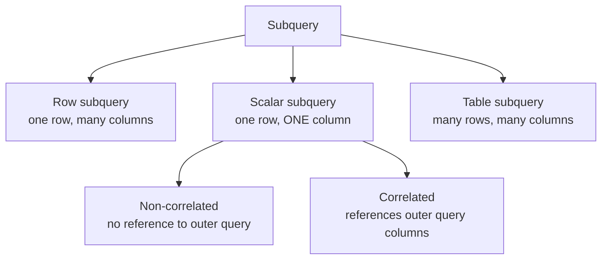

# Scalar Subqueries

**Section 26 · Category 4: Subqueries**

---

## Fundamentals

A **scalar subquery** is a subquery that returns exactly **one row with exactly one column** — a single value. It is used anywhere in SQL where a single value is expected: a `SELECT` list item, a `WHERE` comparison operand, a `HAVING` condition, an `ORDER BY` expression, a `CASE` branch, an `UPDATE ... SET` expression, or an `INSERT ... VALUES` expression.

The word _scalar_ does not describe the SQL you write; it describes the **result contract**. You can write any valid `SELECT` inside the parentheses — what matters is what it returns.

```sql
(SELECT MAX(salary) FROM employees)
```

No keywords mark a subquery as "scalar". A subquery _becomes_ scalar by context: it is placed where SQL demands a single value.



Related concept that is _not_ a scalar subquery: a **row subquery** (a tuple comparison such as `(a, b) = (SELECT x, y FROM t)`), which returns one row with multiple columns. PostgreSQL and MySQL allow it in row-constructor contexts; see the **Row Subqueries** section.

---

## The Scalar Contract

A scalar subquery is bound by three rules:

| Rule           | Constraint                            | What happens if violated                 |
| -------------- | ------------------------------------- | ---------------------------------------- |
| Column rule    | Must select **exactly one column**    | Compile-time error in most contexts      |
| Zero-row rule  | May return **zero rows**              | Produces the value `NULL` (not an error) |
| Multi-row rule | Must not return **more than one row** | **Runtime error** — the statement fails  |

> Interview trap

> The multi-row violation is a **runtime** error, not a syntax error. The statement compiles and starts executing fine. The database only rejects it _if and when_ more than one row is actually produced. This is why the bug can live in production for months and explode the day data grows.

One more subtlety: an **aggregate without `GROUP BY`** (e.g. `(SELECT MAX(salary) FROM employees)`) is _always_ safe. An aggregate over zero rows still returns one row (`NULL`, or `0` for `COUNT`). So aggregates give you the zero-row rule and the multi-row rule for free.

---

## Why It Exists

Scalar subqueries exist so that a query can use the result of another query as a **value**, without forcing you to restructure the outer query. This solves problems like:

- Compare each row against a global measure (`company average salary`).
- Compare each row against a measure of its own group (correlated).
- Pull a single side-column (`dept_name`) without joining.
- Reuse one computed value in several places: `WHERE salary > ms AND salary < ms * 1.5`.
- Use a value computed from live data inside `INSERT`, `UPDATE`, or `ORDER BY`.

Before scalar subqueries existed, expressing "employees paid more than the company average" required either two query steps (compute average, then compare) or a self-join with aggregation.

---

## Syntax

A scalar subquery is a normal subquery used where a scalar value belongs:

```sql
-- Shape (generic)
expression = ( SELECT single_column
               FROM ...
               [ WHERE ... ]
               [ GROUP BY ... ] )

-- Arithmetic / comparison use
WHERE salary > (SELECT AVG(salary) FROM employees)
```

### Valid positions

| Position                   | Example                                                                      | Notes                                              |
| -------------------------- | ---------------------------------------------------------------------------- | -------------------------------------------------- | ----------------------- | -------------------------------------- |
| `SELECT` list              | `SELECT emp_name, (SELECT MAX(salary) FROM employees)`                       | Evaluated per output row for correlated subqueries |
| `WHERE`                    | `WHERE salary = (SELECT MAX(salary) FROM employees)`                         | Comparison uses three-valued logic                 |
| `HAVING`                   | `HAVING AVG(salary) > (SELECT AVG(salary) FROM employees)`                   | Like `WHERE`, but over groups                      |
| `ORDER BY`                 | `ORDER BY (SELECT dept_name FROM departments d WHERE d.dept_id = e.dept_id)` | Sorting key need not appear in `SELECT`            |
| `CASE`                     | `CASE WHEN salary > (SELECT AVG(salary) FROM employees) THEN ...`            | Any expression branch                              |
| `UPDATE ... SET`           | `SET salary = salary * 1.03 WHERE salary < (SELECT AVG(salary) ...)`         | Evaluated per affected row if correlated           |
| `INSERT ... VALUES`        | `VALUES ('x', (SELECT MAX(emp_id) FROM employees))`                          | Insert current database value                      |
| Arithmetic / concatenation | `(SELECT total) * 1.1`, `'Dept: '                                            |                                                    | (SELECT dept_name ...)` | Subquery is just an expression operand |

---

## Sample Data

All examples use the following tables unless stated otherwise. Grains are stated explicitly because wrong grain assumptions are the #1 cause of wrong join and aggregation results.

> `departments` — one row per department.

| dept_id | dept_name   |
| ------: | ----------- |
|       1 | Engineering |
|       2 | Sales       |
|       3 | Marketing   |
|       4 | Research    |

> `employees` — one row per employee. `dept_id` is a foreign key to `departments`; it is nullable (an employee can be unassigned). `salary` is nullable (data-entry gap).

| emp_id | emp_name | dept_id | salary |
| -----: | -------- | ------: | -----: |
|      1 | Alice    |       1 | 120000 |
|      2 | Bob      |       1 |  95000 |
|      3 | Carol    |       2 |  80000 |
|      4 | Dave     |       2 |  60000 |
|      5 | Eve      |       3 |  85000 |
|      6 | Frank    |       4 |   NULL |
|      7 | Grace    |    NULL |  70000 |

> `orders` — one row per order. `total` is the monetary value of the order.

| order_id | customer_id | total |
| -------: | ----------: | ----: |
|      501 |           1 |   320 |
|      502 |           2 |   150 |
|      503 |           1 |    90 |
|      504 |           3 |   240 |

Company average salary (NULLs are ignored by `AVG`):

```
(120000 + 95000 + 80000 + 60000 + 85000 + 70000) / 6 = 85000
```

---

## Example 1 — Scalar subquery in the `SELECT` list (non-correlated)

**Task:** list all employees with their salary and the company-wide maximum salary in the same row.

```sql
SELECT
  emp_name,
  salary,
  (SELECT MAX(salary) FROM employees) AS company_max
FROM employees;
```

**Expected output:**

| emp_name | salary | company_max |
| -------- | -----: | ----------: |
| Alice    | 120000 |      120000 |
| Bob      |  95000 |      120000 |
| Carol    |  80000 |      120000 |
| Dave     |  60000 |      120000 |
| Eve      |  85000 |      120000 |
| Frank    |   NULL |      120000 |
| Grace    |  70000 |      120000 |

The subquery does not reference any column of the outer query — it is **non-correlated**. The optimizer generally evaluates it **once** and reuses the value for every row.

---

## Example 2 — Scalar subquery in `WHERE`

**Task:** find employees paid more than the company average.

```sql
SELECT emp_name, salary
FROM employees
WHERE salary > (SELECT AVG(salary) FROM employees);
```

**Expected output:**

| emp_name | salary |
| -------- | -----: |
| Alice    | 120000 |
| Bob      |  95000 |

Eve's `85000` is _not more than_ `85000`, so she is excluded. The outer predicate (`salary >`) is applied against a value-that-was-once-computed; because the inner value is materialized first, the outer column can still use an index — the predicate is sargable.

---

## Example 3 — Correlated scalar subquery in the `SELECT` list

**Task:** alongside each employee, show the highest salary inside **their own** department.

```sql
SELECT
  e.emp_name,
  e.salary,
  (SELECT MAX(e2.salary)
   FROM employees e2
   WHERE e2.dept_id = e.dept_id) AS dept_max
FROM employees e;
```

The inner query references `e.dept_id` from the **outer** query → **correlated**. Conceptually it is re-evaluated once per outer row (actual behavior depends on the optimizer — see Internal Working).

**Expected output:**

| emp_name | salary | dept_max |
| -------- | -----: | -------: |
| Alice    | 120000 |   120000 |
| Bob      |  95000 |   120000 |
| Carol    |  80000 |    80000 |
| Dave     |  60000 |    80000 |
| Eve      |  85000 |    85000 |
| Frank    |   NULL |     NULL |
| Grace    |  70000 |     NULL |

Two NULL rows to explain:

- **Frank** is in dept 4; the only employee there has `salary = NULL`, so `MAX` over that group is `NULL`.
- **Grace** has `dept_id = NULL`. The inner predicate `e2.dept_id = e.dept_id` is not matchable — `NULL = NULL` is never true — so the subquery returns **zero rows**, producing `NULL`. This is the classic illustration that `NULL = NULL` is `UNKNOWN` even when both sides are the same variable.

---

## Example 4 — Correlated scalar subquery in `WHERE`

**Task:** employees who earn more than the average salary of _their own_ department.

```sql
SELECT e.emp_name, e.salary
FROM employees e
WHERE e.salary > (
  SELECT AVG(e2.salary)
  FROM employees e2
  WHERE e2.dept_id = e.dept_id
);
```

**Expected output:**

| emp_name | salary |
| -------- | -----: |
| Alice    | 120000 |
| Carol    |  80000 |

Footwork: dept 1 average is 107500 (Alice only); dept 2 average is 70000 (Carol only); dept 3 average is 85000, and Eve's `85000 > 85000` is false; dept 4 yields `NULL` for both sides; Grace's correlated subquery returns `NULL`. All the excluded comparisons evaluate to `UNKNOWN`, which `WHERE` treats as false.

---

## Example 5 — Scalar subquery in `HAVING`

**Task:** departments whose average salary exceeds the company average.

```sql
SELECT dept_id, AVG(salary) AS dept_avg
FROM employees
GROUP BY dept_id
HAVING AVG(salary) > (SELECT AVG(salary) FROM employees);
```

**Expected output:**

| dept_id | dept_avg |
| ------: | -------: |
|       1 |   107500 |

Why others are skipped: dept 2 → 70000 < 85000; dept 3 → 85000 is not `>` 85000; dept 4 → average resolves to `NULL`, and alike `NULL > 85000` is `UNKNOWN`; Grace's `NULL`-keyed group also fails. Note the distinction between `WHERE` (rows) and `HAVING` (groups) — this is covered deeply in the GROUP BY/HAVING section.

---

## Example 6 — Scalar subquery in `ORDER BY`

**Task:** list employees sorted by their department's name, even though `dept_name` is in another table.

```sql
SELECT emp_name, dept_id
FROM employees e
ORDER BY (
  SELECT d.dept_name
  FROM departments d
  WHERE d.dept_id = e.dept_id
);
```

**Expected output (typical default NULL ordering):**

| emp_name | dept_id |
| -------- | ------: |
| Alice    |       1 |
| Bob      |       1 |
| Eve      |       3 |
| Frank    |       4 |
| Carol    |       2 |
| Dave     |       2 |
| Grace    |    NULL |

Grace's `dept_name` is `NULL`. Where NULLs sort depends on the engine (PostgreSQL/Oracle: last by default on ASC; SQL Server/MySQL: first). Frank's `Research` < `Sales`, hence ordering above.

---

## Example 7 — Scalar subquery in `UPDATE`

**Task:** give a 3% raise to every employee currently paid below the company average.

```sql
UPDATE employees
SET salary = salary * 1.03
WHERE salary < (SELECT AVG(salary) FROM employees);
```

The non-correlated subquery is evaluated once, and `salary * 1.03` is applied to Carol, Dave, and Grace (`60000`, `80000`, `70000` — minus Bob? Bob is 95000 > 85000, so no). If the subquery returned `NULL`, the `WHERE` predicate would be `UNKNOWN` for every row and the `UPDATE` would silently affect **zero** rows — a classic production foot-gun.

---

## Example 8 — Zero rows → NULL

A scalar subquery that finds no rows does **not** error; it yields `NULL`.

```sql
SELECT (SELECT MIN(salary) FROM employees WHERE dept_id = 999) AS x;
```

**Result:** `NULL`.

Same mechanism with a single-row subquery (no aggregate):

```sql
SELECT (SELECT salary FROM employees WHERE emp_id = 9999) AS x;
```

**Result:** `NULL`.

> Common misconception

> A zero-row scalar subquery is not empty — it is `NULL`. `COALESCE((SELECT ...), 0)` is therefore a standard way to convert "no value found" into a safe default.

---

## Example 9 — More than one row → runtime error

Anything that lets the subquery produce two or more rows kills the whole statement.

```sql
SELECT (SELECT salary FROM employees) AS x;
```

`employees` has 7 rows → **error**. Typical messages per engine:

| Engine     | Error text                                                                                                                                                |
| ---------- | --------------------------------------------------------------------------------------------------------------------------------------------------------- |
| PostgreSQL | `ERROR: more than one row returned by a subquery used as an expression`                                                                                   |
| MySQL      | `ERROR 1242 (21000): Subquery returns more than 1 row`                                                                                                    |
| SQL Server | `Subquery returned more than 1 value. This is not permitted when the subquery follows =, !=, <, <=, >, >= or when the subquery is used as an expression.` |
| Oracle     | `ORA-01427: single-row subquery returns more than one row`                                                                                                |

Common multi-row triggers:

- `GROUP BY` inside the subquery with more than one group;
- a `WHERE` that loses its uniqueness guarantee as data grows;
- `ORDER BY ... LIMIT 1` removed or ignored by rewrites.

> Interview trap

> `(SELECT salary ... ORDER BY salary DESC LIMIT 1)` is single-row **because** of a robust guarantee. `(SELECT DISTINCT salary ...)` is **not** — it errors even though it looks "deduplicated", as long as at least two distinct values exist.

---

## NULL Behavior and Three-Valued Logic

A scalar subquery participates in comparisons under **three-valued logic**. Its `NULL` enters the predicate exactly like any literal `NULL` would:

```sql
SELECT emp_name
FROM employees
WHERE salary > (SELECT AVG(salary) FROM employees WHERE dept_id = 999);
```

The subquery returns `NULL` → for every row the predicate is `salary > NULL` → `UNKNOWN` → `WHERE` drops every row → **empty result, no error**.

You must ask the reader's own five questions here:

1. Can the subquery return zero rows? (→ produces `NULL`)
2. Can the subquery return `NULL` in its selected column? (→ `AVG`/`MAX` over an all-NULL group)
3. Is the outer operand `NULL`? (→ even a clean subquery value compares `UNKNOWN`)
4. Are you comparing with `=`? (→ same trap: `NULL = value` is `UNKNOWN`)
5. Do you want `IS NULL` / `IS NOT DISTINCT FROM` semantics instead?

The safe patterns are `COALESCE((SELECT ...), default)` and, where comparison against `NULL` should match, `IS NOT DISTINCT FROM` (see the NULL section).

One more subtle case: if the **selected column itself is NULL** for a matched row, you get a single-row result carrying `NULL` — same value as the zero-row case, different mechanism. Both are indistinguishable to the outer query.

---

## Internal Working

### Non-correlated scalar subqueries

The inner query references nothing from the outer query. Optimizers typically evaluate it once, stash the value, and reuse it. Execution-plan artefacts to look for:

> PostgreSQL

> An independent scalar subquery typically appears as an `InitPlan` node that runs before the main join, feeding a parameter down the tree.

> SQL Server

> Look for a `Constant Scan` near a top operator; the value is produced once.

> MySQL

> `EXPLAIN` may show materialization or `Select tables optimized away` when the optimizer can fold the aggregate to a constant.

> Oracle

> Subqueries that only feed constants can be folded at compile time; otherwise expect a temporary value produced once before the statement runs.

### Correlated scalar subqueries

The inner query depends on outer-row column(s). The naive model is _one execution per outer row_ (a nested-loop shape). Optimizers mitigate this:

> Oracle

> Oracle performs **scalar subquery caching** — the execution plan shows `SCALAR SUBQUERY` with a `CACHE` option, and repeated identical bind values are served from cache instead of re-executing.

> PostgreSQL

> A correlated scalar subquery shows as a `SubPlan` evaluated per outer row (or at least re-evaluated when inputs change).

> SQL Server

> Expect a `Nested Loop` style with the subquery as the inner input, sometimes assisted by an index `Seek`/`Spool`.

**These are guidelines, not guarantees.** The only reliable way to see what your engine does is to read its plan. See Performance.

---

## Scalar Subquery vs. Alternatives

### Correlated scalar subquery vs. `LEFT JOIN`

**Task:** fetch each employee's department name.

> BAD APPROACH — correlated scalar subquery in `SELECT` list on a table without an index.

```sql
SELECT
  e.emp_name,
  (SELECT d.dept_name FROM departments d WHERE d.dept_id = e.dept_id) AS dept_name
FROM employees e;
```

Without an index on `departments.dept_id`, every outer row triggers a per-row scan of `departments` → effectively an N×M nested loop.

> BETTER APPROACH — `LEFT JOIN`, single pass over both tables, zero per-row evaluation.

```sql
SELECT e.emp_name, d.dept_name
FROM employees e
LEFT JOIN departments d ON d.dept_id = e.dept_id;
```

The `LEFT JOIN` also preserves Grace (unassigned) with `dept_name = NULL`, matching the scalar subquery's zero-row → `NULL` behavior.

**Why BETTER:** it gives the optimizer full freedom over join order, index selection, and access methods, and it is far easier to reason about. The correlated scalar _may_ still perform acceptably when a good index exists — the claim must be verified, not assumed:

```sql
-- Verify: does the plan show a per-row lookup (seek) or a repeated scan?
EXPLAIN ANALYZE
SELECT /* case A */ ...;
```

### Scalar subquery vs. window function

**Task:** running maximum of salary over employees ordered by `emp_id`.

> BAD APPROACH — correlated scalar subquery that re-scans all earlier rows per row.

```sql
SELECT e1.emp_name,
  (SELECT MAX(e2.salary)
   FROM employees e2
   WHERE e2.emp_id <= e1.emp_id) AS running_max
FROM employees e1;
```

> BETTER APPROACH — window function, one pass.

```sql
SELECT
  emp_name,
  MAX(salary) OVER (ORDER BY emp_id) AS running_max
FROM employees;
```

Window functions are usually the right tool for "value relative to a moving frame" (see the Window Functions section). The scalar version exists here mostly to illustrate the per-row trap.

### Non-correlated scalar subquery vs. plain join

When the subquery is a fixed aggregate (`company average`, `company max`), there is no join partner — every input row should get the same constant. A scalar subquery is often the cleanest expression, and it beats dragging a join that multiplies rows (fan-out risk). Example 1 is a good use.

### Scalar subquery vs. `LATERAL`/`OUTER APPLY`

PostgreSQL `LEFT JOIN LATERAL` and SQL Server `OUTER APPLY` express correlated computations with full control over joins and indexes. For a single value, the scalar form is shorter; the lateral/apply form is more flexible (multi-column, multi-row) and often easier to index-tune. Prefer `LEFT JOIN LATERAL` when the correlated side is non-trivial.

### When NOT to use a scalar subquery

- When you need **zero or many** matching rows on a side — use `LEFT JOIN`, `EXISTS`, or `LATERAL`.
- When the same subquery expression repeats across many `WHERE`/`SELECT` slots — a `CTE` computes it once and reads clearly.
- When the intent is "fetch whole related row(s)" — that is a join's job.
- When a window frame better describes the relationship.

---

## Performance

> Production guidance — do not guess. Every claim below is a starting hypothesis. Confirm with `EXPLAIN ANALYZE` (PostgreSQL/MySQL 8+/SQL Server with `SET STATISTICS ...`/Actual Execution Plan, Oracle `EXPLAIN PLAN` + `DBMS_XPLAN`).

Factors that decide whether a scalar subquery is cheap or catastrophic:

- **Indexes**: is there an index supporting the outer → inner correlation (`employees.dept_id` → `departments.dept_id` PK)? If yes, each inner execution can be an index seek; if no, per-row full scans.
- **Cardinality / data distribution**: a correlated scalar over a huge outer set amplifies per-row cost; a non-correlated aggregate over a small table is near-free.
- **Optimizer transforms**: engines happily rewrite some scalar subqueries into joins, semi-joins, or materialized one-time scans. What you write is not necessarily what runs.
- **Caching**: Oracle's scalar-subquery cache and engines' parameterized execution reuse can turn "one per row" into "once per distinct value".
- **Plan shape**: for correlated cases, expect/adopt `Nested Loop` (with index seek) — not `Hash Join` with a rescan of the inner table per row.

Diagnosis checklist:

1. Read the plan. Is the scalar a one-time node (`InitPlan`, `Constant Scan`, materialization) or a per-row `SubPlan`/nested-loop rescan?
2. Is the inner table being **scanned** per outer row? Add an index and re-check the plan.
3. Does a rewrite (join/lateral/CTE) change the plan shape and the cost? Measure a realistic workload, not a toy.
4. Mind statistics staleness — a plan chosen for a 7-row table may catastrophically misbehave on 7 million rows.

**The right mental model:** a scalar subquery is _not inherently slow or fast_. It is slow when it forces per-row work without an index, and fast when the optimizer collapses it to a constant or a seek. The optimizer, indexes, statistics, and execution plan decide — not the syntax.

---

## Common Mistakes

| Mistake                                                         | Why it is wrong                                                           | Fix                                                             |
| --------------------------------------------------------------- | ------------------------------------------------------------------------- | --------------------------------------------------------------- |
| Selecting more than one column                                  | Violates the contract; compile error                                      | Use exactly one column (or a row subquery where supported)      |
| Forgetting the multi-row rule                                   | `GROUP BY` inside the subquery → runtime error as soon as >1 group exists | Aggregate without `GROUP BY`, or `LIMIT 1` with ordering        |
| Comparing against a potentially NULL subquery result in `WHERE` | Three-valued logic silently filters everything                            | Use `COALESCE` inside or add `IS NOT NULL` guards               |
| Correlated subquery with no supporting index                    | Per-row scans become quadratic                                            | Add an index on the inner join column, or restructure to a join |
| Replacing `EXISTS`/`NOT EXISTS` with scalar comparisons         | Changes semantics, especially with NULLs                                  | Use `EXISTS` for existence semantics (see that section)         |
| Assuming zero-row means empty                                   | Zero rows → `NULL`, which misbehaves in arithmetic                        | `COALESCE((SELECT ...), 0)`                                     |
| `DISTINCT` to "fix" the multi-row error                         | Still errors with 2+ distinct values                                      | Use `MAX`/`MIN`/`LIMIT 1`                                       |

---

## Production Pitfalls

> Production pitfall

> **The multi-row explosion.** A subquery that is single-row today (unique `emp_id`, one active rate per deal) can return two rows after a data backfill, a duplicate insert, or a uniqueness constraint drop. Every statement using it then fails at runtime. Defense: make the single-row property a _database-enforced guarantee_ (primary/unique key) or make the subquery structurally single-row (`MAX`, `LIMIT 1`). Test with `EXPLAIN`/data-volume simulations.

> Production pitfall

> **Silent empty writes.** `UPDATE ... SET col = val WHERE col = (SELECT ...)` — if the subquery returns `NULL`, the predicate is `UNKNOWN` for all rows and the `UPDATE` touches zero rows with no error. Verify row counts before and after (`ROW_COUNT()` / `GET DIAGNOSTICS` / `sql%ROWCOUNT`).

> Production pitfall

> **Correlated scalar in a hot SELECT list** on a large driving table can become a per-row nested loop. Confirm with the actual plan and an index, or rewrite to a join. Do not trust blind "avoid subqueries" folklore; also do not trust blind "subqueries are fine".

> Production pitfall

> **Subquery in `ORDER BY` on a big set** forces sorting by a value that itself needs recomputation per row — the sort can't spill cleanly. Prefer `JOIN` + column ordering (with the join cost measured separately).

---

## Edge Cases

1. **Empty aggregate is one row, not zero.** `(SELECT AVG(salary) FROM employees WHERE 1=0)` returns `NULL` in one row — satisfies the contract.
2. **`COUNT` on empty input** returns `0`, not `NULL`: `(SELECT COUNT(*) FROM employees WHERE dept_id = 999)` → `0`. This single fact catches many people.
3. **Subquery returns one row whose value is `NULL`** — indistinguishable from zero rows from outside. Diagnose by running the subquery alone.
4. **Correlated subquery matching `NULL` outer keys** finds nothing (`NULL = NULL` is `UNKNOWN`) → `NULL` result. Use `IS NOT DISTINCT FROM` if you need NULL-to-NULL matching.
5. **Aggregate + correlated comparison over an all-NULL group** gives `NULL` on both sides → row excluded from `WHERE` and `HAVING`.
6. **Scalar subquery inside `CASE`** is lazy in some engines — a branch not evaluated may never trigger the multi-row error; do not rely on this.
7. **Row subquery lookalikes** (`(SELECT x, y FROM t)`) compile only in tuple-comparison contexts (PostgreSQL/MySQL), not in ordinary expressions.
8. **Nested scalar subqueries** — a scalar subquery may contain another scalar subquery; each obeys its own contract independently.
9. **Volatility**: subqueries reading volatile tables/views can yield different values between rows if the optimizer re-evaluates — visible in `WHERE` comparisons across a statement.
10. **`LIMIT` robustness** depends on ordering. `LIMIT 1` without `ORDER BY` is not predictably single-row-by-value; it is _arbitrarily_ one row.

---

## Best Practices

- **Make the single-row guarantee structural.** Prefer `MAX`/`MIN`, aggregates, or `LIMIT 1` with explicit ordering over "this happens to be unique".
- **Keep the subquery's final column count = 1.**
- **Use `COALESCE` for defaulting** instead of letting `NULL` leak into arithmetic and comparisons.
- **Prefer joins for "fetch the related row/column";** reserve scalar subqueries for "compute a value I need inline".
- **Prefer window functions** for frame-relative and running computations.
- **Prefer CTEs** when the same value is used in multiple places (clarity + single computation).
- **Index the correlation column(s)** and verify the plan actually uses them.
- **State the grain** of every table and every output row before writing a query — it tells you which subquery/join form is correct.
- **Treat scalar subqueries as expressions**, not as hidden query machinery: a value that participates in three-valued logic like any other operand.
- **Run `EXPLAIN ANALYZE`** on both the scalar form and candidate rewrites; compare real plan shapes, not folklore.

---

## Database Differences

| Engine     | Notes                                                                                                                                                                                           |
| ---------- | ----------------------------------------------------------------------------------------------------------------------------------------------------------------------------------------------- |
| PostgreSQL | Zero rows → `NULL`; supports row-subquery tuple comparisons; `LATERAL` as correlated alternative; message `more than one row returned by a subquery used as an expression`.                     |
| MySQL      | Error 1242; modern optimizer materializes/rewrites many scalar subqueries into joins; nullable-outer-key correlated matching follows `NULL = NULL → UNKNOWN`; `LIMIT` also works in subqueries. |
| SQL Server | Error text demands scalar/single-row; plan shows `Constant Scan` for init values; `OUTER APPLY` is the correlated workhorse.                                                                    |
| Oracle     | `ORA-01427`; scalar subquery caching (`CACHE`) often makes correlated versions cheap; row subqueries appear in `IN`-pair contexts.                                                              |

Return to the main **Subqueries** index for: Non-correlated vs Correlated Subqueries, Row Subqueries, Subqueries in `FROM`, `EXISTS`, `IN`, Comparison Operators (`ANY`/`ALL`/`SOME`), and CTEs.

---

# Interview Questions

> Practice set — answers are intentionally withheld. Work them out, then verify each with a live query and `EXPLAIN ANALYZE`.

### Beginner

1. What is a scalar subquery? State the three rules it must satisfy.
2. What happens when a scalar subquery returns zero rows? What happens when it returns two rows?
3. Where in a statement can a scalar subquery legally appear? Give one example for each position.
4. What does `(SELECT COUNT(*) FROM employees)` return when `employees` is empty? What does `(SELECT MAX(salary) FROM employees)` return when it is empty, and why the difference?

### Intermediate

5. Contrast correlated vs non-correlated scalar subqueries. How often is each conceptually evaluated?
6. Explain why `WHERE salary > (SELECT AVG(salary) ...)` returns zero rows when the subquery yields `NULL`. Which row calls it out incorrectly?
7. Rewrite "list every employee with their department name" using both a scalar subquery and a `LEFT JOIN`. Which would you ship and why? What must you verify before judging the scalar version slow?

### Advanced

8. In PostgreSQL's `EXPLAIN`, what is the difference between `InitPlan` and `SubPlan`? What does that difference imply about evaluation count?
9. Describe Oracle's scalar subquery caching. In what plan node/option does it appear, and why does it change the performance story?
10. Under what conditions can the optimizer rewrite a scalar subquery into a join/semi-join or constant? Which engine-specific plan artefacts would you look for to confirm?

### Scenario Based

11. Using the sample data, write a query returning each department's name together with the highest-paid employee's name in it — with one output row per department.
12. A report needs `emp_name`, `salary`, `company_avg`, and the distance `salary - company_avg`. Write it two ways: scalar subquery, then a CTE. Which is more readable when `company_avg` is referenced twice?
13. Given `orders`, write a single query that returns, for each order, the order total and the running average order total up to that order (ordered by `order_date`). Would you use a scalar subquery or a window function? Justify.

### Tricky

14. `SELECT (SELECT DISTINCT salary FROM employees)` — predict the outcome with the sample data, or any data having two equal salaries? Is `DISTINCT` a sound fix for the multi-row error? Why?
15. Grace has `dept_id = NULL`. The correlated subquery `(SELECT MAX(salary) FROM employees e2 WHERE e2.dept_id = e.dept_id)` returns `NULL` for her. Explain the exact relational reason.
16. What is the difference in result between `WHERE salary = (SELECT MAX(salary) FROM employees)` and `WHERE salary >= ALL (SELECT salary FROM employees)` when multiple employees share the maximum? When does each row-set differ?

### Output Prediction

17. Given the sample data, predict the exact output of Example 4 (correlated `WHERE` variant) — which employee rows appear, and why does Frank's row vanish even though his department average is `NULL`?
18. Predict the output of `SELECT emp_name FROM employees WHERE salary > (SELECT AVG(salary) FROM employees WHERE dept_id = 999);` before you run it. Then run it and explain the empty result.
19. Under `EXPLAIN`, when would you expect an `InitPlan` vs a `SubPlan` for `SELECT (SELECT MAX(salary) FROM employees), emp_name FROM employees;`? Predict the shape, then confirm.

### Debugging

20. A query that has been fine for a year now fails with the multi-row subquery error. List the investigation steps and the three most likely data-level root causes, and the structural fix that would prevent recurrence.
21. An `UPDATE` silently affects 0 rows. The set clause references a scalar subquery. Walk through the diagnosis: what to check first, what the plan shows, and the safe guard.
22. A correlated scalar subquery makes a 100-row query fine but a 10-million-row query hang. Which plan shape are you looking for? What two concrete fixes would you try first, and how do you prove one worked?

### Performance

23. "Scalar subqueries are always slower than joins." True or false? Give a case where a non-correlated scalar aggregate is the _better_ design, and a case where a correlated scalar is dangerous.
24. What do indexes, statistics, cardinality, and plan-shape have to do with whether a correlated scalar subquery is cheap? Run `EXPLAIN ANALYZE` on Examples 3 and 4 with and without an index on `employees(dept_id)` and compare node costs.
25. When each outer row triggers a _different_ correlated lookup, why might Oracle's scalar caching still help? When does caching _not_ help?

Return to the **Subqueries** index when ready.
