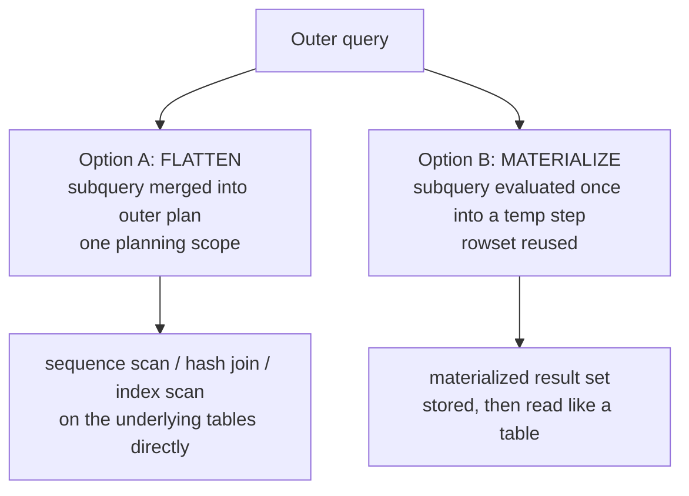

# Subqueries in FROM

**Section 28 · Category 4: Subqueries**

---

## Fundamentals

A **subquery in the `FROM` clause** — variously called a **derived table**, **subquery in `FROM`**, **inline view** (Oracle), or **`JOIN`-table subquery** — is a subquery that appears where a *table* belongs: in a `FROM` clause, where it is treated by the outer query as a table.

```sql
SELECT ...
FROM ( SELECT ... ) AS derived_table_alias;
```

The outer query sees the subquery **firstFront matter repaired. Verifying overall file integrity:
Section complete: `sql-handbook/4-Subqueries/28-Subqueries-FROM.md` (667 lines) — covers derived tables/inline views end-to-end: fundamentals, alias rules, flattening vs materialization with a Mermaid diagram, 8 worked examples with corrected sample-data outputs, LATERAL/APPLY, derived-table vs CTE vs temp vs view comparison, NULL behavior, edge cases, common mistakes, production pitfalls, performance (EXPLAIN-verified, no absolute claims, per-engine plan nodes), best practices, database differences, and a 39-question interview set across Beginner → Performance with answers withheld.
*rows and columns** | acts as a table | none — any number of rows; alias required |

### Naming

Every database has its own word for it: **derived table** (SQL Server), **inline view** (Oracle), **derived table / table subquery** (PostgreSQL), **derived table / subquery in FROM** (MySQL). Behavior is identical; only the name and a few syntax rules differ.

### The alias requirement — the most infamous rule

Almost every database **requires an alias** on a subquery in `FROM`. `FROM (SELECT ...) ` with no alias is a syntax error in PostgreSQL, MySQL, SQL Server, Oracle, and SQLite.

> Interview trap

> Rule of thumb: **every `FROM` subquery needs an alias.** Interviewers love to ask what is wrong with `SELECT * FROM (SELECT id FROM users);` — the missing alias. There is no such requirement on subqueries in `WHERE`.

```sql
-- Wrong
SELECT * FROM (SELECT customer_id, order_id FROM orders);
--                 ^^^^^^^^^^^^ syntax error in most engines

-- Right
SELECT * FROM (SELECT customer_id, order_id FROM orders) AS o;
```

In **Oracle**, `AS` is optional (`(SELECT ...) o` is fine) — but the alias itself is still required. The outer query normally chooses column aliases inside the subquery; column-level aliases on the derived table itself (`AS o(customer_id, order_id)`) are supported by PostgreSQL, SQLite, and some engines, but not by MySQL/SQL Server in the same way — use inner aliasing for portability.

### Internal working: what "acts as a table" actually means

Do not assume the database *physically materializes* the subquery. With a modern optimizer, a `FROM` subquery is usually **flattened / inlined** into the outer query, and the two are optimized together:



- **Flattening / merging (common).** The optimizer pushes the subquery's predicates up and the outer query's predicates down, and plans the whole thing as one unit. What you wrote as two levels may execute as one `GROUP BY` on the base table.
- **Materialization (sometimes).** When flattening is not viable — the subquery contains `LIMIT`/`OFFSET` (PostgreSQL), `DISTINCT ON`, `ORDER BY` without a window/join (MySQL), or other constructs that make merging unsafe — the engine evaluates it once and stores the rows (a temp table or memory rowset), then reads it like a base table.
- **`LATERAL` (correlated FROM subquery).** Evaluated per outer row. See the LATERAL section below.

The practical consequence: **you cannot assume the source tables are queried twice.** Whether a derived table is flattened or materialized is a **plan decision**, not a guarantee of the syntax — verify with the execution plan, never by assumption.

---

## Why It Exists

A subquery in `FROM` exists to let you query **a computed rowset as if it were a table**, which solves problems that cannot be solved in the other two positions:

1. **Reuse intermediate results inside one statement.** "Join against the *aggregate* of orders for each customer" — the outer query treats that aggregate as an input table.
2. **Aggregate, then filter on the aggregate (a `WHERE` that needs an aggregate).** The `WHERE` clause cannot hold aggregates directly, and `HAVING` only works over `GROUP BY` output. A derived table computes the aggregate, and the outer query filters the result.
3. **Two-level (or N-level) aggregation.** "Top 3 departments by *average customer spend per department*."
4. **Use window functions computed on one rowset as an input to further filtering.** `WHERE` cannot directly reference a window function; a derived table (or CTE) can.
5. **Break a hard query into digestible steps.** An alternative to CTEs (see comparison below).
6. **Apply `LIMIT`/`TOP` at an inner level of a larger query** — e.g. "latest order per customer, then summarize across those".
7. **Overcome engine limitations**, such as MySQL's "can't modify a table and select from the same table in a subquery" error, by wrapping the subquery in a derived table.

Every one of these is: *compute something first, then treat the result as a table in the rest of the query.*

---

## Syntax

```sql
SELECT
    outer_columns
FROM ( <subquery> ) AS derived_alias         -- one derived table
    [JOIN ( <subquery> ) AS other_alias ON ...]  -- another derived table
    [CROSS JOIN ( <subquery> ) AS cross_alias]
    [, LATERAL ( <subquery> ) ]              -- correlated FROM form (PG/MySQL 8+/Oracle/SQL Server APPLY)
WHERE ...
GROUP BY ...
HAVING ...
ORDER BY ...
```

Rules:

- The subquery can be **any valid `SELECT`** — with `GROUP BY`, `HAVING`, `LIMIT`, window functions, its own subqueries, even its own `FROM` derived tables (nesting is unbounded).
- The alias is **mandatory** in all four big engines.
- The outer query may reference **any column the subquery outputs**.
- If the subquery outputs duplicate column names, the outer query sees two identical names — ambiguous and, in most engines, an error when unqualified. (This is especially nasty with `SELECT *`.)
- There is **no visibility into the outer query** from a plain (non-`LATERAL`) derived table: it cannot reference outer columns. That is exactly what separates it from a correlated subquery in `WHERE` or a `LATERAL` join.

---

## Sample Data

Grain is stated explicitly — this is what makes aggregation and join reasoning safe.

> **`customers`** — one row per customer. Columns: `customer_id` (PK, NOT NULL), `customer_name`.

| customer_id | customer_name |
|---|---|
| 1 | Alice |
| 2 | Bob |
| 3 | Charlie |
| 4 | David |
| 5 | Erin |

> **`orders`** — one row per order. Columns: `order_id` (PK), `customer_id` (FK, nullable), `order_date`, `total`, `status`.

| order_id | customer_id | order_date | total | status |
|---|---|---|---|---|
| 100 | 1 | 2026-01-05 | 250.00 | shipped |
| 101 | 1 | 2026-02-10 | 99.50 | shipped |
| 102 | 2 | 2026-03-01 | 150.00 | pending |
| 103 | 3 | 2026-03-15 | 420.00 | shipped |
| 104 | 3 | 2026-04-02 | 60.00 | cancelled |
| 105 | 4 | 2026-04-20 | 310.00 | shipped |
| 106 | NULL | 2026-05-01 | 800.00 | shipped |
| 107 | 2 | 2026-05-12 | 75.00 | shipped |
| 108 | 4 | 2026-05-20 | 200.00 | pending |
| 109 | NULL | 2026-06-01 | 500.00 | pending |

> **`employees`** — one row per employee. Columns: `emp_id`, `emp_name`, `dept_id`, `salary`, `manager_id`.

| emp_id | emp_name | dept_id | salary | manager_id |
|---|---|---|---|---|
| 10 | Alice Chen | 1 | 90000 | NULL |
| 11 | Bob Smith | 1 | 75000 | 10 |
| 12 | Carol Jones | 1 | 82000 | 10 |
| 13 | David Lee | 2 | 70000 | 10 |
| 14 | Erin Patel | 2 | 65000 | 13 |

---

## Examples

### Example 1 — aggregate first, filter after (the classic `WHERE`-can't-aggregate problem)

**Problem.** Which customers have ordered more than $500 in total?

You cannot write `WHERE SUM(total) > 500` in the outer `WHERE`, because `WHERE` cannot use aggregates. `HAVING` works only with `GROUP BY`.

**Approach 1 — derived table (reusable, clean):**

```sql
SELECT c.customer_name, agg.total_spent
FROM customers AS c
JOIN (
    SELECT customer_id, SUM(total) AS total_spent
    FROM orders
    WHERE status <> 'cancelled'
    GROUP BY customer_id
) AS agg
    ON agg.customer_id = c.customer_id
WHERE agg.total_spent > 500;
```

| customer_name | total_spent |
|---|---|
| David | 510.00 |

Only David clears the bar: Alice `349.50` and Charlie `420.00` do not (order 104 is cancelled and excluded before the sum). The `WHERE` on the outer query filters **after aggregation**, so it compares each customer's `SUM(total)` against 500 — a `WHERE` clause can never do this directly.

**Approach 2 — `HAVING` (equivalent where applicable):**

```sql
SELECT o.customer_id, SUM(o.total) AS total_spent
FROM orders AS o
WHERE o.status <> 'cancelled'
GROUP BY o.customer_id
HAVING SUM(o.total) > 500;
```

Both are valid; the engine may even flatten the derived-table version into the same plan as the `HAVING` version. Why prefer the derived table over `HAVING`? Because the derived table **keeps a named, reusable intermediate rowset** — you can join it to `customers`, reuse it twice, or apply further transforms — while `HAVING` ends at the aggregate. In this particular query the two are equivalent in result; *measure the plan* if you care, don't assume one is faster.

### Example 2 — compute against a per-group measure built by the same aggregation

**Problem.** For each employee, show their salary and the average of their department — expressed via a derived table containing department averages.

```sql
SELECT e.emp_name, e.salary, d.avg_salary
FROM employees AS e
JOIN (
    SELECT dept_id, AVG(salary)::numeric(10,2) AS avg_salary
    FROM employees
    GROUP BY dept_id
) AS d
    ON d.dept_id = e.dept_id;
```

| emp_name | salary | avg_salary |
|---|---|---|
| Alice Chen | 90000 | 82333.33 |
| Bob Smith | 75000 | 82333.33 |
| Carol Jones | 82000 | 82333.33 |
| David Lee | 70000 | 67500.00 |
| Erin Patel | 65000 | 67500.00 |

(Note: `::numeric` cast is PostgreSQL-style; MySQL would use `CAST(... AS DECIMAL(10,2))`, SQL Server `CAST(... AS DECIMAL(10,2))`, Oracle `ROUND(AVG(salary), 2)`.)

### Example 3 — two-level aggregation

**Problem.** What is the *average total spent per customer* among customers who have shipped orders? That is: first sum per customer, then average those sums.

```sql
SELECT ROUND(AVG(spend_total), 2) AS avg_customer_spend
FROM (
    SELECT customer_id,
           SUM(total) AS spend_total
    FROM orders
    WHERE status = 'shipped' AND customer_id IS NOT NULL
    GROUP BY customer_id
) AS per_customer;
```

| avg_customer_spend |
|---|
| 244.83 |

(Alice `349.50` + Bob `75.00` + David `310.00` = `734.50` across 3 shipped customers → `734.50 / 3 = 244.83`. The two NULL-customer orders are excluded with `IS NOT NULL`; the inner query's rows where the SUM is **what feeds the outer `AVG`** — the outer `AVG` operates on grouped rows, not on individual orders.)

### Example 4 — two derived tables joined together

**Problem.** Show shipped-total and pending-total side by side per customer, including customers who have none of either. Two different aggregations of the same table cannot live in one `GROUP BY` — so compute them as two derived tables and join them.

```sql
SELECT
    COALESCE(c.customer_name, 'No customer') AS customer_name,
    COALESCE(sh.shipped_total, 0) AS shipped_total,
    COALESCE(pd.pending_total, 0) AS pending_total
FROM customers AS c
LEFT JOIN (
    SELECT customer_id, SUM(total) AS shipped_total
    FROM orders
    WHERE status = 'shipped'
    GROUP BY customer_id
) AS sh ON sh.customer_id = c.customer_id
LEFT JOIN (
    SELECT customer_id, SUM(total) AS pending_total
    FROM orders
    WHERE status = 'pending'
    GROUP BY customer_id
) AS pd ON pd.customer_id = c.customer_id;
```

| customer_name | shipped_total | pending_total |
|---|---|---|
| Alice | 349.50 | 0 |
| Bob | 75.00 | 150.00 |
| Charlie | 420.00 | 0 |
| David | 310.00 | 200.00 |
| Erin | 0 | 0 |

This is the classic "sum by category into columns" problem. Alternatives exist (conditional aggregation — `SUM(CASE WHEN status='shipped' THEN total END)`) and are usually more compact; the derived-table version shines when the two sides come from *different* tables or have different granularity.

### Example 5 — derived table with `LIMIT` (server-dependent flattening)

**Problem.** For each of the top 2 orders by total, return the order plus customer name.

```sql
SELECT o.order_id, o.total, c.customer_name
FROM (
    SELECT order_id, customer_id, total
    FROM orders
    ORDER BY total DESC
    LIMIT 2
) AS top_o
LEFT JOIN customers AS c ON c.customer_id = top_o.customer_id;
```

| order_id | total | customer_name |
|---|---|---|
| 106 | 800.00 | NULL |
| 109 | 500.00 | NULL |

(The `LIMIT` in the derived table constrains the subquery's output to two rows before the join — that is the entire point. Both top orders belong to NULL customers, so `customer_name` is NULL and the `LEFT JOIN` preserves the rows.)

> Common misconception

> "The derived table is always executed first and produces a temporary table, then the outer query runs on it." With most optimizers, a `LIMIT`-free derived table is *flattened into* the outer query and may not be executed separately at all. `LIMIT` subqueries are more likely to be materialized (PostgreSQL materializes them with a collapsible subquery barrier). Rely on `EXPLAIN`, not the intuition that writing a subquery forces two physical steps.

### Example 6 — window function inside a derived table

**Problem.** Rank orders by total within each customer, keep rank 1 per customer, then join names.

`WHERE` cannot reference a window function (window functions are evaluated in the `SELECT` step, after `WHERE`). Wrapping in a derived table lets the outer `WHERE` filter on the window result.

```sql
SELECT c.customer_name, ro.order_id, ro.total
FROM (
    SELECT
        order_id,
        customer_id,
        total,
        ROW_NUMBER() OVER (PARTITION BY customer_id ORDER BY total DESC) AS rn
    FROM orders
    WHERE customer_id IS NOT NULL
) AS ro
JOIN customers AS c ON c.customer_id = ro.customer_id
WHERE ro.rn = 1;
```

| customer_name | order_id | total |
|---|---|---|
| Alice | 100 | 250.00 |
| Bob | 102 | 150.00 |
| Charlie | 103 | 420.00 |
| David | 105 | 310.00 |

Without the derived table you could not write `WHERE rn = 1` at all — `rn` does not exist yet when `WHERE` runs (see [Logical Query Processing Order](../1-Fundamentals/06-Logical-Query-Processing-Order.md)).

### Example 7 — `CROSS JOIN` with a scalar-ish derived table

A derived table returning exactly one row can act as a constant table you combine with everything else (handy for a report header or a company-wide metric):

```sql
SELECT
    e.emp_name,
    e.salary,
    co.company_avg_pct
FROM employees AS e
CROSS JOIN (
    SELECT ROUND(100.0 * AVG(salary) / MAX(salary), 1) AS company_avg_pct
    FROM employees
) AS co;
```

| emp_name | salary | company_avg_pct |
|---|---|---|
| Alice Chen | 90000 | 84.9 |
| Bob Smith | 75000 | 84.9 |
| Carol Jones | 82000 | 84.9 |
| David Lee | 70000 | 84.9 |
| Erin Patel | 65000 | 84.9 |

(Average salary `76400 / max 90000 = 84.89` → rounded to `84.9`.)

Every employee row gets the same single computed column — a scalar cross join. Neither the derived table nor the employees table is large, but verify with the plan how the one-row result is computed (a `Result` node / separate aggregate) — nothing about this shape is "always faster" than a scalar subquery in the `SELECT` list; both express different intent.

### Example 8 — `DISTINCT` inside a derived table (dedupe before joining)

**Problem.** Which customers placed at least one shipped order — implement with a derived table of distinct customer ids.

```sql
SELECT c.customer_name
FROM customers AS c
JOIN (
    SELECT DISTINCT customer_id
    FROM orders
    WHERE status = 'shipped' AND customer_id IS NOT NULL
) AS ship_cust
    ON ship_cust.customer_id = c.customer_id;
```

| customer_name |
|---|
| Alice |
| Bob |
| Charlie |
| David |

Why does this return names, not orders? Because the derived table outputs **distinct customers**, not orders. This addresses the [JOIN fan-out / double counting](../../3-Joins/XX-Joins-Overview.md) problem at the source: duplicate line items never inflate the outer result.

> Production pitfall

> Joining `customers` to *raw* `orders` (no dedupe) multiplies rows and appears to double-count aggregates. Wrapping the "one side" of a one-to-many join in a derived table that collapses it to per-customer rows is a standard fix. But it changes the **grain of the output** — decide deliberately which output row you want, per the grain discipline elsewhere in this handbook.

---

## `LATERAL` / `APPLY` — correlated subqueries in FROM

A plain derived table cannot reference outer columns. Correlating a `FROM` subquery requires the **`LATERAL` keyword** in PostgreSQL (and MySQL 8.0.14+, Oracle, standard SQL), or `CROSS APPLY` / `OUTER APPLY` in SQL Server.

```sql
SELECT e.emp_name, recent.total
FROM employees AS e
CROSS JOIN LATERAL (
    SELECT order_id, total
    FROM orders AS o
    WHERE o.customer_id = e.emp_id        -- reference to outer table
    ORDER BY o.order_date DESC
    LIMIT 1
) AS recent;
```

Stress the concept: the derived table is evaluated **for each outer row** using that row's values, and because it appears in `FROM`, its columns are available to the outer `SELECT`. This is the FROM-side cousin of a correlated subquery in `WHERE` — but it can return **multiple rows and columns per outer row**, which a scalar correlated subquery cannot.

| Engine | Syntax |
|---|---|
| PostgreSQL | `JOIN LATERAL (...) AS alias` / `CROSS JOIN LATERAL (...) AS alias` |
| MySQL (8.0.14+) | same, `LATERAL` |
| Oracle | `JOIN LATERAL (...) alias` or `CROSS APPLY` (12c+) |
| SQL Server | `CROSS APPLY (...) AS alias` (inner) / `OUTER APPLY` (left) |

Existing coverage: Scalar subqueries (26) and WHERE subqueries (27) treat *correlation* for value/set positions; this section's `LATERAL` is the *table* position equivalent. Direction: prefer a `LATERAL`/`APPLY` whenever the derived table needs an outer value and you want it per row.

---

## Derived Table vs CTE vs Temp Table vs View

| Feature | Derived table (FROM) | Common table expression (`WITH`) | Temp table | View |
|---|---|---|---|---|
| Scope | single statement | single statement | session / transaction | stored, reusable |
| Syntax position | `FROM (SELECT ...) a` | `WITH x AS (SELECT ...) SELECT ...` | `CREATE TEMP TABLE` + `SELECT ... INTO` | `CREATE VIEW` |
| Reuse within the same statement | must repeat the subquery (or nest/join it again) | **by name**, multiple times | **by name** | by name |
| Query-time reason for each | inline, one-shot step | readable, one-shot, reusable-name step | multiple statements, huge results, indexable temp | permanent abstraction, permissions |
| Indexable | no | no (may be materialized by engine single time) | **yes** (create indexes) | depends on definition |
| Recursion | no | **yes** (recursive CTE) | manual | no |
| The optimizer | may flatten into outer | usually also flattens (PG) / inlines (SQL Server, MySQL 8+ CTEREs) | a real storage step | treated like a macro/expansion in many engines |

Nothing here says "derived tables are always slower than CTEs." Both are usually flattened; the *difference* the CTE buys you is **name reuse** within one statement — if you need the same intermediate twice (self-join), repeat the derived table (SQL Server/MySQL) or use a CTE. CTEs can also act as a **materialization barrier** in PostgreSQL (`MATERIALIZED`) — which *you* have to opt into and then verify with `EXPLAIN`.

> Common misconception

> "CTEs are always faster than derived tables" and "derived tables are always materialized." Neither is a guarantee. PostgreSQL defaults CTEs to inlining and materializes them only when `MATERIALIZED` or heuristically necessary; MySQL 8.0+ inlines many CTEs (`CTEREF` no-op in plans); SQL Server does the same. Performance is plan-dependent — *always* verify with `EXPLAIN`.

---

## Internal Working, Detailed

What the planner actually does with `FROM (SELECT ...) a`:

1. **Parse** — the derived table is a full `SELECT` whose result is a named relation in the outer scope.
2. **Flatten / inline (the common case)** — the optimizer "pulls up" the subquery: its `WHERE`, `GROUP BY`, and `JOIN`s are merged into the outer query's plan. This is why outer predicates can often be pushed *down* through the derived table and applied earlier (earlier filtering = less data flowing up), and why inner `LIMIT`s are usually **not** pushed up or flattened in PostgreSQL (the subquery barrier).
3. **Materialize (selective)** — when flattening is not valid (e.g. a PostgreSQL `LIMIT`, or features the engine can't reorder), the engine computes the subquery into a temp rowset, then scans it. This produces a `Materialize`/`Function Scan`/`Subquery Scan` node (see per-engine node names below).
4. **For `LATERAL`** — the subquery becomes the *inner* input of a nested-loop-style join, executed once per outer row; SQL Server renders equivalent as `Nested Loops` with the `APPLY`.

Which path happens is decided by the **optimizer**, statistics, and query shape — not by your syntax. That is why every performance discussion here ends with "check the plan."

---

## SQL Reasoning Checklist Applied to FROM Subqueries

1. **What does one output row represent?** Define it *before* writing: one customer, one order, one customer-day, one line item? The derived table controls this.
2. **What is the grain of each table?** If the derived table aggregates orders per customer, its output grain is "one row per (customer_id, ... aggregate)." The outer query must respect that grain or re-aggregate.
3. **Which is the driving table?** For an inner join, the outer table is not automatically the driver — the planner picks. Put the derived table where its cardinality is known (e.g. on the "many" side).
4. **Do I need columns from another table?** Yes → join the derived table; no → maybe a `WHERE` subquery or `EXISTS` was simpler (see [Subqueries in WHERE](27-Subqueries-WHERE.md)).
5. **Can a JOIN create duplicates / double count?** If the derived table is per-customer while the outer is per-order, joining multiplies. Keep grain discipline.
6. **Is the intermediate needed only once, in one statement?** Then a derived table (or CTE) works; a temp/view is overkill. Twice or across statements → temp table or view.
7. **Do I need an aggregate-level filter?** That's `HAVING` on the inner query, or a `WHERE` on the outer over the derived table's aggregate column.
8. **Do I need window functions side-by-side with further filters?** Wrap the window in a derived table; then filter in the outer `WHERE`.
9. **NULL handling** — does the derived table's join key contain NULLs? On an inner join they drop out silently; on a left join they become NULLs to `COALESCE`.
10. **Is the subquery correlated to the outer query?** Then it belongs in `LATERAL`/`APPLY`, not a plain derived table.
11. **Duplicate column names inside the derived table?** Ambiguous `SELECT *` output — alias them inside.
12. **What does the execution plan say?** Look for whether the derived table is flattened, materialized, or executed per row (`SubPlan`/`Lateral`/`Nested Loops`).

---

## NULL Behavior

| Position of NULL | Behavior |
|---|---|
| Derived table's join-key column is NULL | Inner join drops the row; LEFT/RIGHT join keeps it and exposes the NULL for `COALESCE` (see Example 5: `customer_name` NULL) |
| Derived table output is all NULLs / empty set | Not an error — the outer join sees an empty left/right side; an inner join to an empty derived table returns zero rows |
| Aggregates over NULLs inside the derived table | Standard rules — `SUM`/`AVG` ignore NULLs, `COUNT(*)` counts rows, `COUNT(col)` counts non-NULLs (see [Aggregation](../../1-Fundamentals/XX-Aggregation.md) sections) |
| Derived table column used in the outer `WHERE` with NULLs | Three-valued logic applies exactly as for a base table column |
| `LATERAL` returning zero rows | `OUTER APPLY`/`LEFT JOIN LATERAL` keeps the outer row with NULLs; `CROSS APPLY`/`JOIN LATERAL` drops it |

> Interview trap

> The `OUTER APPLY` / `LEFT JOIN LATERAL` distinction is the LEFT JOIN becoming INNER JOIN trap in derived-table clothing: use `CROSS APPLY` and your per-row subquery returns nothing → row disappears. Use `OUTER APPLY` and you keep the row with NULLs. Same trap, new face.

---

## Edge Cases

| Scenario | Behavior |
|----------|----------|
| Missing alias on a FROM subquery | Syntax error in PostgreSQL, MySQL, SQL Server, Oracle, SQLite |
| Duplicate column names in the derived table | Ambiguous references; `SELECT *` may expose both — error on unqualified use in some engines |
| Derived table returns zero rows | Outer join keeps rows with NULLs / cross join yields empty; inner join yields empty — decide deliberately |
| `LIMIT` inside derived table (PostgreSQL) | Materialized; the planner subquery-barriers it — outer filters cannot generally push through |
| `ORDER BY` in derived table sans LIMIT / outermost | Optimizer typically ignores it (only the outer ordering matters) except where `DISTINCT`/`LIMIT` make it meaningful |
| Nested derived tables (FROM inside FROM) | Allowed to arbitrary depth; each level needs its own alias |
| Same column name in two joined derived tables | Ambiguity again — name aggressively |
| `GROUP BY` column in outer query referencing a derived-table aggregate constant | Allowed only if functionally dependent; otherwise must add to `GROUP BY` |
| Derived table inside a `VIEW` | Legal; the view expansion re-inlines the derived table each use |
| Outer `WHERE` filtering on the derived table's group key | Pushed down below the aggregation, enabling early aggregation (plan-dependent benefit) |
| Derived table containing a scalar subquery / another derived table | Fine — the depth of nesting is what you manage |

---

## Common Mistakes

| Mistake | Why it is wrong | Fix |
|---------|-----------------|-----|
| `FROM (SELECT ...)` without alias | Syntax error | Add `AS alias` |
| Duplicate-derived-table column names | Ambiguity / error | Alias columns inside the derived table |
| Believing the derived table is *always* materialized first | It is usually flattened — outer predicates can be pushed in | Read the plan |
| Using an unaggregated column in the outer query | Wrong results (arbitrary row within a group) | Either add it to the inner `GROUP BY`, aggregate it, or wrap in a window |
| Filtering on an aggregate in the outer `WHERE` with `WHERE` placed on the inner rows (fan-out) | Applying filters at the wrong layer | Filter inside the derived table; filter the aggregate in the outer `WHERE` |
| `JOIN customer → orders → order_items` then summing without dedupe | Double counting (fan-out) | Dedupe via derived table or change grain |
| Trying to correlate a plain derived table | Column doesn't exist in that scope | Use `LATERAL` / `CROSS APPLY` |
| Using `CROSS APPLY` where `OUTER APPLY` was meant | Rows vanish when the subquery is empty | Use the right join flavor |
| Naming the derived table then reusing a same-named base column | Readability collapses; alias collisions | Qualify all column references |
| `SELECT *` from a derived table with widows | Unexpected columns leak through | Enumerate columns in the subquery |

---

## Production Pitfalls

> Production pitfall — **grain explosion inside large reports.**

> A "one row per product" report that joins orders through a derived table aggregating per customer can silently multiply output when the derived table grain is finer than intended. Always restate the grain of the derived table in the docs and assert cardinality (e.g. count distinct rows inside vs outside) before trusting line counts.

> Production pitfall — **MySQL error 1093 on self-modification.**

> `UPDATE orders o JOIN (SELECT ... FROM orders ...) d ON ...` can raise *Error 1093: You can't specify target table for update in FROM clause* on some MySQL versions. Wrapping the subquery in another derived-table level (or a CTE in 8.0+) is the standard workaround. This is the same mitigation as the WHERE-section's self-modify note, just for FROM.

> Production pitfall — **subquery in FROM with volatile expressions.**

> A derived table containing volatile functions (`RAND()`, `NOW()`, `generate_series`) may be re-evaluated or materialized depending on the plan, so two references can see different values; if you need a stable snapshot, materialize once (CTE with PG `MATERIALIZED`, or temp table) — and verify with the plan.

> Production pitfall — **`ORDER BY` inside the derived table silently ignored (except with `LIMIT`/`DISTINCT`).** PostgreSQL requires `ORDER BY` to correspond exactly to `UNIQUE`/`DISTINCT` columns or an aggregate — otherwise it is discarded. If your "sorted" outer result appears unsorted, the inner `ORDER BY` was dropped; put ordering on the outer query.

> Production pitfall — **recursive explosions.**

> Nested derived tables are unbounded, and each level can multiply rows again. Watch for accidental Cartesian products between a derived table and itself (see Example 4-adjacent cross joins), and always put a `WHERE`/`LIMIT` gate before large materializations.

---

## Performance

> Do not guess. Every claim is a hypothesis to confirm with `EXPLAIN (ANALYZE)` (PostgreSQL), `EXPLAIN ANALYZE` / `EXPLAIN FORMAT=TREE` (MySQL 8+), `SET STATISTICS IO, TIME ON` + `SET SHOWPLAN_XML ON` (SQL Server), or `EXPLAIN PLAN` / `DBMS_XPLAN` (Oracle).

### Where the real work lives

- **Flattening vs materialization.** If the plan shows the derived table's base tables scanned directly (flattened), the "subquery" costs nothing extra — you are paying for one scan of the base data. If it shows `Materialize`/`Subquery Scan`/`Temp Table`, you pay to build the intermediate plus its rows. Neither is "bad"; the plan decides.
- **Pushdown of predicates.** The optimizer pushes the outer `WHERE` *into* a flattenable derived table — early filtering can be the single biggest lever. A PostgreSQL `LIMIT` blocks this; measure when the subquery pattern looks hot.
- **Indexes that matter.** A derived table whose inner query has `WHERE customer_id = X` benefits from `order_items(customer_id)`; an aggregation benefits from the same index for the hash sort; a `LATERAL` per-row inner scan *requires* an index on the correlation column (`orders(customer_id)`), or the per-row cost becomes N×full-scan.
- **Cardinality and statistics.** Whether the planner materializes or flattens, and which join order it picks, is driven by row estimates. Keep `ANALYZE`/stats fresh; a stale estimate ("this derived table returns 5 rows") will derail join order.

### Diagnosis checklist

1. Run `EXPLAIN (ANALYZE, BUFFERS)`. Does the plan contain a `Subquery Scan on`/`Materialize`/`CTEREF`/`Temp Table`, or did the subquery flatten into a direct join on the base tables?
2. If you see a `Lateral`/`Nested Loops` output, confirm the inner child uses an `Index Scan`/`Seek`, not a full `Seq Scan` per outer row.
3. Compare the same logical query written as derived table vs CTE vs `HAVING` vs temp table on the real data — measure wall-clock and plan cost; don't debate syntax.
4. Add the indexes the plan's scan nodes ask for and re-explain before concluding anything about speed.

> PostgreSQL
> Derived tables usually expand into normal rellist members (no visible node) or appear as `Subquery Scan`; `LIMIT` produces a `Subquery Scan` with no pushdown possible (there is a subquery **barrier** on `LIMIT`); `LATERAL` shows as nested-loop with a `SubPlan`/`InitPlan` inner. Use `EXPLAIN (ANALYZE, BUFFERS)` to see temp file spills on materialization.

> MySQL
> 8.0 `EXPLAIN FORMAT=TREE` shows `Materialize` + derived table refs; a derived table frequently becomes a **mergeable view** in 5.7+/8.0 (`merge_derived`), letting predicates push through. `EXPLAIN` will show `derived table` scans under `Never materialize` / temp tables. Watch for `Using temporary` on the aggregates.

> SQL Server
> Derived tables are expanded/inlined into the joining plan by default (`!` no node). If you'd like to *force* materialization you can use a CTE with `OPTION (USE HINT('FORCE_ORDER'))` or a temp table; for `APPLY`, expect a `Nested Loops` operator with an inner seek. Analyze with `SET STATISTICS IO ON` plus `SET STATISTICS TIME ON`.

> Oracle
> An inline view usually becomes a part of the merged statement (`MERGED` in plan) unless `NO_MERGE` hint or constructs like `ROWNUM`/`ROWNUM()` force view-materialization (`VIEW` node). `SQL_ID` at the top of the plan; watch for `FAST DUAL` and scalar cache nodes.

---

## Best Practices

- **Always alias** the derived table (`AS x`); alias every column you plan to use from it.
- **Use derived tables for one-ish intermediate steps** inside a single statement; use **CTEs** when you reference the intermediate *by name more than once*, and **temp tables / views** when reuse escapes the statement.
- **Keep the grain explicit** in comments — write *why* one output row is what it is (per customer, per order).
- **Prefer `HAVING` over `WHERE`-on-derived-aggregates** when the query is a straightforward group filter, because it is shorter; prefer the derived table when you *need* to reuse the aggregated intermediate (join it again, add columns).
- **Move predicates to the earliest layer**: inner `WHERE` before outer `WHERE` when they apply to inner rows; outer `WHERE` for aggregate-level filters.
- **Never write `ORDER BY` in a derived table except with `LIMIT`/`DISTINCT`** — it is dropped, or misleading.
- **Name duplicate columns distinctly** inside the subquery.
- **Respect the `CROSS APPLY` vs `OUTER APPLY` / `JOIN LATERAL` vs `LEFT JOIN LATERAL` distinction** — the left-join-becomes-inner-join trap.
- **Verify materialization/flattening with the plan**, especially before attacking a "slow subquery" — the syntax you blame may already be flattened.
- **State whether you mean dedupe or meaningfully distinct rows** when a `DISTINCT` derived table duplicates a real semantic (see Example 8).

---

## Database Differences

| Engine | FROM subquery name | Alias requirement | `LATERAL` / APPLY support | Flattening default |
|--------|--------------------|-------------------|---------------------------|--------------------|
| PostgreSQL | derived table | required (`AS` optional but usual) | `CROSS JOIN LATERAL` / `LEFT JOIN LATERAL` | yes; `LIMIT` blocks pushdown (subquery barrier) |
| MySQL | derived table | required | `LATERAL` (8.0.14+), no `APPLY` | mergeable derived tables in 5.7+/8.0; `LIMIT`-bearing ones materialize |
| SQL Server | derived table | required | `CROSS APPLY` / `OUTER APPLY` (preferred; `LATERAL`-style hints only in some syntax) | inlined by default |
| Oracle | inline view | required (`AS` optional) | `LATERAL`/`CROSS APPLY` 12c+ | merged by default; `NO_MERGE`, `ROWNUM` or `ROWNUM()` force view materialization |

Also: `AS alias(col_name)` on a derived table — supported by PostgreSQL and SQLite; not MySQL/SQL Server/Oracle in the same syntax — use inner aliases for portability. MySQL 8.0.16+ additionally supports `WITH ... AS` CTEs and even `WITH` inside `FROM` subqueries.

**Cross-references** — derived tables are one of the three subquery positions; compare with [Scalar Subqueries](26-Scalar-Subqueries.md) (value position) and [Subqueries in WHERE](27-Subqueries-WHERE.md) (set/predicate position). Their close relative is the **Common Table Expression** (`WITH`) — same scoping, name-reuse, recursion. The LEFT-JOIN-becomes-INNER-JOIN and cartesian-product chapters live in the **Joins** category (see [Semi-Joins](../../3-Joins/24-Semi-Joins.md), [Anti-Joins](../../3-Joins/23-Anti-Joins.md)) and feed directly into derived-table grain discipline. **Fan-out / double counting** is covered in the Joins category and applies verbatim to derived-table joins.

---

# Interview Questions

> Practice set — answers are intentionally withheld. Work each through, then verify with a live query and `EXPLAIN (ANALYZE)`, or any execution-plan tool for your engine.

### Beginner

1. What is required on every subquery in `FROM` that most engines enforce, but not on subqueries in `WHERE` or `SELECT`?
2. Write a query that returns the top 3 orders by total, then joins `customers` to show the customer name, using a derived table with `LIMIT`.
3. Can a derived table reference columns of the outer table without `LATERAL`? What happens if you try?
4. What is the grain of this derived table: `SELECT customer_id, COUNT(*) AS n FROM orders GROUP BY customer_id`?
5. Does `FROM (SELECT ...) AS x` require a subquery to return exactly one column? One row? Explain why not.

### Intermediate

6. Compare a derived table that filters an aggregate (`WHERE agg > 500` in the outer) with a single `HAVING` version. When do you prefer each?
7. Why can an optimizer *flatten* a derived table, and what constructs tend to prevent flattening (e.g. `LIMIT` in PostgreSQL)? What would you look for in the plan to tell flattening from materialization?
8. In the two-derived-table example (shipped vs pending totals), why can't one `GROUP BY` produce both columns directly, and what alternative syntax produces the same two columns without two subqueries?
9. What is the difference between `CROSS APPLY` and `OUTER APPLY` in SQL Server, and between `CROSS JOIN LATERAL` and `LEFT JOIN LATERAL` in PostgreSQL? When does the row disappear?
10. What happens when a derived table returns duplicate column names, e.g. two `customer_id`s? How do you fix it?

### Advanced

11. Explain the PostgreSQL subquery **barrier** on `LIMIT`: why can't the outer query push predicates into a `LIMIT` subquery, and how does that affect plan cost?
12. Under what conditions will Oracle *merge* an inline view into the outer statement, and what forces `NO_MERGE` / view materialization (`ROWNUM`, `ROWNUM()`)? What are the plan-signature differences?
13. Describe a two-level aggregation you cannot write without a derived table or CTE (aggregate of an aggregate), and write it. Predict whether the inner `GROUP BY` could be pushed/flattened.
14. Why might a planner run an inner `LATERAL` subquery per outer row rather than once, and what index turns that from O(N×M) into O(N×log M)? Show the suspected plan shape.
15. Compare implementing a "top N per group" report with (a) a derived table + `ROW_NUMBER()` + outer `WHERE rn = 1`, and (b) `CROSS APPLY ... ORDER BY ... LIMIT 1`. What circumstances favor each, and how would you verify with plans?

### Scenario Based

16. Using the sample data, produce a per-customer report with columns `customer_name`, `shipped_total`, `pending_total`, `cancelled_total` — customers with no orders must still appear. Write it with two/three derived tables, then with conditional aggregation. Which is more compact, which is more explicit?
17. "Average customer spend computed from shipped orders only, then show customers above that average." Build the derived table for the average, join or cross-reference it, and state what one output row means.
18. Write the "top order per customer" query (Example 6) — then the same with `CROSS APPLY`/`LATERAL`. Which form expresses the per-row loop most directly? Predict plan shape for each.
19. Design a query using the sample data to find the median total of shipped orders, using a derived table (and optionally a window function). What is the grain of the derived table's output?
20. A `LEFT JOIN` on a derived table containing `LIMIT 1` per customer **still duplicates** outer rows — why, and what grain does that derived table actually have? Fix it.

### Tricky

21. `FROM (SELECT customer_id, COUNT(*) FROM orders GROUP BY customer_id) AS x` — does the outer `SELECT *`? Is that valid, and what is the column name for the count in each engine?
22. Given the NULL-`customer_id` orders (106, 109): in a query joining `customers` left to a derived table of per-customer shipped totals, where do those orders' rows go? Inner join version?
23. A derived table uses `DISTINCT customer_id` from `orders WHERE status='pending'`. Customer 6 does not exist in `customers`. What does the join to `customers` output? What if it were a `RIGHT JOIN` from the derived table?
24. Write `SELECT * FROM (SELECT 1 AS x, 2 AS x) AS t;` — predict: does PostgreSQL, MySQL, SQL Server, Oracle accept it? If not, what is the error and the fix? (Verify each if you can.)
25. Does `FROM (SELECT ... ORDER BY total) AS x` guarantee the outer output is sorted? When is the inner `ORDER BY` dropped, and when does it stick?

### Output Prediction

26. Predict the output of Example 8 (distinct shipped customers) then Example 2 (dept averages). Which rows of Example 2 share `avg_salary` and why?
27. Predict the output of `SELECT AVG(spend) FROM (SELECT customer_id, SUM(total) AS spend FROM orders GROUP BY customer_id) AS x;` including NULL customer handling. State whether the NULL-customer groups are counted in the inner or outer aggregate.
28. Predict the output of the two-level aggregation (Example 3). Show your arithmetic, then run it. Where does the NULL customer's ship total go?
29. `SELECT c.customer_name, n.n FROM customers c LEFT JOIN (SELECT customer_id, COUNT(*) AS n FROM orders GROUP BY customer_id) n ON n.customer_id = c.customer_id;` — predict all five rows; then change to `JOIN` and predict again.

### Debugging

30. A report "returns no rows" after switching a `JOIN` to a derived table that computes aggregate totals. Name the top three causes (grain, NULLs, alias) you'd check first, in order.
31. A derived-table query is correct on 10k rows and far slower on 100M. `EXPLAIN` shows a `Materialize` node and a `Seq Scan` inside the derived table. Which indexes would you add or analyze, and how do you prove the improvement?
32. Two developers insist "derived tables are materialized" vs "always flattened." Design the experiment with `EXPLAIN` on PostgreSQL/MySQL that settles which is true for *their* query shape.
33. A query using `ROW_NUMBER() ... OVER(...)` inside a derived table returns rows 1,2,3 even after `WHERE rn = 1` existed in the same scope. What went wrong with the scoping, and how does wrapping fix it?
34. After a midnight backfill, a derived-table join that previously showed one row per customer shows five. Which column would you expect to be non-unique, and how do you assert cardinality?

### Performance

35. "A derived table is always slower than the `HAVING` form." Evaluate this against what the plan actually shows, and describe one shape where each beats the other.
36. When would you *want* PostgreSQL to materialize a CTE over a used-twice derived table, and when would you prefer inlining? How do you force/verify with `MATERIALIZED` and `EXPLAIN ANALYZE`?
37. Design a benchmark: same logical query as derived table, CTE, `HAVING`, and temp table, on a 10M-row `orders`. List what you measure (plan nodes, sort spills, wall time, IO) and how you normalize for cache effects.
38. A `LATERAL` query is slow: what three plan signs tell you the inner subquery is running per row without an effective index, and what is the least invasive fix?
39. Explain how predicate pushdown into a flattenable derived table can make an outer `WHERE` "free," and why a `LIMIT`ed derived table forfeits that — with the plan nodes to prove it on PostgreSQL.