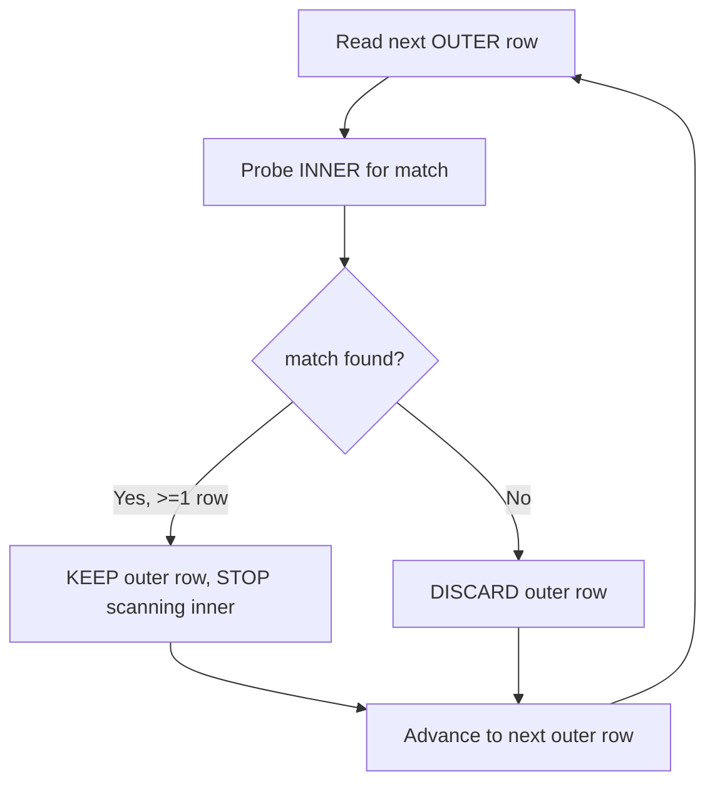
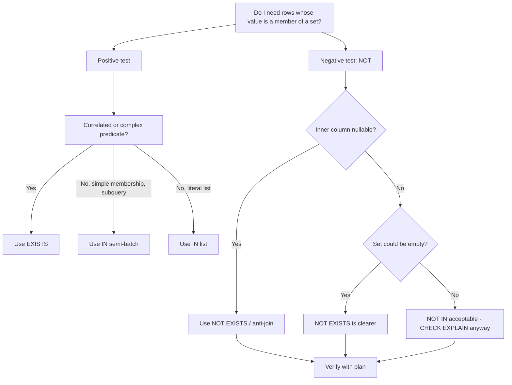

# 30. IN vs EXISTS (Subqueries)

> Category: 4-Subqueries
> Cross-references: `IN` is one of the most misused constructs in SQL because of how the optimizer treats it and — far more importantly — because of **NULL**. This section deep-dives into `IN` vs `EXISTS` (and `NOT IN` vs `NOT EXISTS`). For the foundation of subqueries generally, see _Section 29: Subquery Fundamentals_; for the machinery behind `IN`, see _Section 8: NULL & Three-Valued Logic_; for the join alternative, see _Section 22: SQL JOINs Deep Dive_; for the anti-join style using `LEFT JOIN`, see _Section 24: Anti-Joins and the ON-vs-WHERE Trap_.

---

## 1. TL;DR — memorize this first

| Construct               | Really asks                                   | Returns one row when                           | Safe with NULLs?                                   |
| ----------------------- | --------------------------------------------- | ---------------------------------------------- | -------------------------------------------------- |
| `x IN (subquery)`       | "Is `x` one of the values this set returns?"  | `x` equals **some** returned value             | Mostly (except `x` itself being NULL)              |
| `NOT IN (subquery)`     | "Is `x` none of the values?"                  | `x` is different from **every** returned value | **NO — dangerous if the subquery can return NULL** |
| `EXISTS (subquery)`     | "Does this subquery return at least one row?" | subquery returns ≥ 1 row                       | Yes                                                |
| `NOT EXISTS (subquery)` | "Does this subquery return zero rows?"        | subquery returns 0 rows                        | Yes                                                |

> Interview trap: the single most tested fact in this entire section is: **`NOT IN` returns zero rows if the subquery returns even one `NULL`.** `NOT EXISTS` never has this problem.

---

## 2. Fundamentals

### 2.1 What `IN` is

`IN` is a **membership test**. It takes a value on the left, and a _set of values_ on the right:

- a literal list: `WHERE status IN ('active', 'pending')`
- a subquery result: `WHERE department_id IN (SELECT department_id FROM departments)`

Semantically both are the same thing: `x IN (a, b, c)` is just sugar for `x = a OR x = b OR x = c`. The right-hand side is always conceptually a _set_.

### 2.2 What `EXISTS` is

`EXISTS` is an **existence test**. It only checks _whether_ the subquery produces at least one row. It does not return data, does not read the SELECT list, and has no "membership" semantics:

```sql
WHERE EXISTS (SELECT 1 FROM orders o WHERE o.customer_id = c.customer_id)
```

The outer row survives **if the subquery found a match**, and nothing else about that match matters — not how many matches, not their values.

### 2.3 The question each one answers

- `IN`: "Is my value an element of that set of values?"
- `EXISTS`: "Is that set of rows non-empty (given my current outer row)?"

These sound nearly identical. In practice, for the common case, **they return the same rows**. The differences live in:

1. NULL handling (mainly in the `NOT` variants) — a _correctness_ difference.
2. Expressiveness — `EXISTS` can express correlated conditions that are not simple equality.
3. Execution plans — a _performance_ difference, but only a real one in specific shapes (see §11).

### 2.4 The key sentence

> `IN` compares **values**; `EXISTS` checks **row existence**. When comparing values, `NULL` breaks the comparison. When checking existence, `NULL` is irrelevant.

---

## 3. Syntax (ANSI SQL)

```sql
-- IN with a literal list
SELECT ... FROM t1 WHERE col IN (1, 2, 3, 4);

-- IN with a subquery (the subquery MUST return exactly one column)
SELECT ... FROM t1
WHERE col IN (SELECT some_column FROM t2 WHERE <filter>);

-- EXISTS (the subquery can reference outer columns — "correlated")
SELECT ... FROM t1
WHERE EXISTS (SELECT 1 FROM t2 WHERE t2.col = t1.col);

-- NOT versions
SELECT ... FROM t1 WHERE col NOT IN (SELECT c FROM t2 WHERE ...);
SELECT ... FROM t1 WHERE NOT EXISTS (SELECT 1 FROM t2 WHERE t2.col = t1.col);
```

Rules you must not break:

- `IN (subquery)` subquery must return **exactly one column** (unless you use a row-value / multi-column form, which is not portable — see §14).
- The `EXISTS` subquery's SELECT list is **ignored**. Convention is `SELECT 1` (some write `SELECT *`; both are fine — many engines never even evaluate it).
- `IN` also works without a subquery (literal list); `EXISTS` **requires** a subquery. There is no `WHERE EXISTS (1,2,3)`.

> PostgreSQL note: `x IN (SELECT ...)` is exactly `x = ANY (SELECT ...)` in Postgres syntax.

---

## 4. Realistic sample data

We will use one realistic mini-schema for all examples. Always establish **grain** first — it prevents every join/aggregation mistake in this handbook.

> One row in `departments` = one department.
> One row in `employees` = one employee.
> One row in `customers` = one customer.
> One row in `orders` = one order.
> One row in `order_items` = one line item of an order.
> One row in `products` = one product.

```sql
CREATE TABLE departments (
  department_id   INT PRIMARY KEY,
  department_name VARCHAR(50)
);

CREATE TABLE employees (
  employee_id   INT PRIMARY KEY,
  name          VARCHAR(100),
  department_id INT,   -- may be NULL: employee not yet assigned
  manager_id    INT    -- may be NULL: top of the reporting chain
);

CREATE TABLE customers (
  customer_id   INT PRIMARY KEY,
  customer_name VARCHAR(50)
);

CREATE TABLE orders (
  order_id    INT PRIMARY KEY,
  customer_id INT,
  order_date  DATE
);

CREATE TABLE products (
  product_id   INT PRIMARY KEY,
  product_name VARCHAR(50)
);

CREATE TABLE order_items (
  order_item_id INT PRIMARY KEY,
  order_id      INT,
  product_id    INT,
  quantity      INT,
  unit_price    DECIMAL(10, 2)
);

INSERT INTO departments VALUES
  (1, 'Engineering'),
  (2, 'Sales'),
  (3, 'HR'),
  (4, 'Finance');          -- note: Finance has NO employees

INSERT INTO employees VALUES
  (101, 'Alice',  1,    NULL),
  (102, 'Bob',    1,    101),
  (103, 'Carol',  2,    101),
  (104, 'Dave',   NULL, 103),   -- Dave: department unknown (NULL)
  (105, 'Eve',    2,    103),
  (106, 'Frank',  3,    104);

INSERT INTO customers VALUES
  (1, 'Alpha'),
  (2, 'Beta'),
  (3, 'Gamma'),
  (4, 'Delta');

INSERT INTO orders VALUES
  (100, 1, '2026-01-05'),
  (101, 1, '2026-02-10'),
  (102, 2, '2026-03-01'),
  (103, 3, '2026-03-15');

INSERT INTO products VALUES
  (11, 'Laptop'),
  (12, 'Mouse'),
  (13, 'Monitor');

INSERT INTO order_items VALUES
  (1, 100, 11, 1, 1200.00),
  (2, 101, 12, 3,  25.00),
  (3, 102, 12, 2,  25.00),
  (4, 103, 11, 1, 1200.00);
```

---

## 5. Warm-up: `IN` with a literal list (context)

Before subqueries, `IN` on a literal list:

```sql
-- All departments that could plausibly be in Engineering or HR
SELECT department_name
FROM departments
WHERE department_id IN (1, 3);
```

| department_name |
| --------------- |
| Engineering     |
| HR              |

If the literal list contains NULL, it is simply **never matched**:

```sql
SELECT department_name
FROM departments
WHERE department_id IN (1, NULL);   -- '1' OR 'NULL' -> TRUE OR UNKNOWN -> TRUE
```

→ Returns only `Engineering`. Because `department_id = NULL` is _UNKNOWN_, never `TRUE`, the `NULL` in the list is inert. This is the simplest example of three-valued logic leaking through `IN`.

---

## 6. `IN` with a subquery

### 6.1 What it does

```sql
-- Customers who have placed at least one order
SELECT customer_id, customer_name
FROM customers
WHERE customer_id IN (SELECT customer_id FROM orders);
```

Expected result:

| customer_id | customer_name |
| ----------- | ------------- |
| 1           | Alpha         |
| 2           | Beta          |
| 3           | Gamma         |

How to read it: for each customer, take its `customer_id`, and ask _"is it a member of the set of all `customer_id`s in orders?"_ Customers with a matching id survive; `Delta` (4) does not.

Notice: this `IN` subquery is **non-correlated / uncorrelated** — it does not reference the outer table. It is evaluated once (conceptually) as a set of values.

### 6.2 What `IN` silently ignores

- **Duplicates in the subquery result don't matter.** `IN (1,1,1)` behaves like `IN (1)`. It's set membership, not counting.
- **If the subquery returns a NULL**, it does _not_ break simple `IN` — because of the `OR` short-circuit: `5 IN (5, NULL)` → `(5=5) OR (5=NULL)` → `TRUE OR UNKNOWN` → `TRUE`. The NULL only matters when the value matches _nothing_ — or in `NOT IN`. (See §8.)

---

## 7. `EXISTS` — the correlated mindset

### 7.1 The classic correlated example: "who is someone's manager?"

```sql
SELECT employee_id, name
FROM employees e                -- alias 'e' for OUTER table
WHERE EXISTS (
  SELECT 1
  FROM employees m              -- alias 'm' for INNER table
  WHERE m.manager_id = e.employee_id
);
```

Expected result:

| employee_id | name  |
| ----------- | ----- |
| 101         | Alice |
| 103         | Carol |
| 104         | Dave  |

This query is **correlated**: for _each_ employee `e`, the engine runs the inner query "does any employee `m` point their `manager_id` at `e.employee_id`?" The outer alias `e` is visible inside the subquery. That's the defining trait of a correlated subquery.

> Remember the grain: `manager_id` is a _self_-reference to `employees`. So `EXISTS` "is there at least one row that treats this employee as its manager" — which means "is this employee a manager?"

The `IN` equivalent is possible but less natural:

```sql
SELECT employee_id, name
FROM employees
WHERE employee_id IN (SELECT DISTINCT manager_id FROM employees);
```

Both return the same 3 rows. Note the `DISTINCT` isn't required for correctness (duplicates don't matter to `IN`), but it makes the _intent_ clearer: "my id is in the set of people who are someone's manager."

### 7.2 `EXISTS` is more expressive than `IN`

`IN` only tests membership by value. `EXISTS` can hold **any predicate that references the outer row** — inequalities, ranges, date arithmetic, string functions:

```sql
-- Departments that have at least two employees
SELECT department_id, department_name
FROM departments d
WHERE EXISTS (
  SELECT 1
  FROM employees e
  WHERE e.department_id = d.department_id
  GROUP BY e.department_id
  HAVING COUNT(*) >= 2
);
```

| department_id | department_name |
| ------------- | --------------- |
| 1             | Engineering     |
| 2             | Sales           |

You cannot write ">= 2" as an `IN`. Whenever your condition is anything other than simple value equality, `EXISTS` is the natural tool.

> Edge case: if you write `EXISTS` with a `GROUP BY` subquery and _no_ `HAVING`, the subquery always contains at least one group per correlated department as soon as that department has ≥1 employee — so it degenerates to "at least one row". That's fine as long as you understand it; `GROUP BY` inside `EXISTS` is usually just noise unless you add `HAVING`.

### 7.3 `EXISTS` never returns data — it only returns TRUE/FALSE

```sql
-- Does ANY department have at least one employee?
SELECT EXISTS (SELECT 1 FROM employees WHERE department_id = 1);  -- -> TRUE (boolean)
```

Some engines let you `SELECT EXISTS(...)` and get a boolean. But `EXISTS` produces no columns you can reference. If you write `WHERE EXISTS(...) = 1` or join on `EXISTS`, you are using it wrong.

---

## 8. `NOT IN` vs `NOT EXISTS` — the correctness story

This is where 95% of real-world bugs live.

### 8.1 The NULL trap

Consider: "list the departments that currently have no employees." `Department 4 (Finance)` is the only honest answer — but watch what happens.

**BAD APPROACH:**

```sql
SELECT department_id, department_name
FROM departments d
WHERE d.department_id NOT IN (SELECT department_id FROM employees);
```

Expected result **intuitively**: `Finance`.

**Actual result:** _no rows at all._

Why? Because `employees.department_id` contains a **NULL** (Dave, employee 104, is unassigned).

Decompose with three-valued logic. `NOT IN` is shorthand for "not equal to any of these":

```sql
d.department_id <> 1
AND d.department_id <> 2
AND d.department_id <> 3
AND d.department_id <> NULL      -- <-- this term is UNKNOWN
```

- `department_id <> 1/2/3` evaluates to TRUE for department 4.
- `department_id <> NULL` evaluates to **UNKNOWN** for _every_ value, because comparing anything with `<>` against NULL is never TRUE.
- So the chain becomes `TRUE AND TRUE AND TRUE AND UNKNOWN` = **UNKNOWN** = filtered out.

Even worse: if Dave had been assigned to a real department and only one _other_ employee was unassigned, **every department** would vanish — including ones that legitimately had employees.

> **Interview trap:** `NOT IN` returns the empty result set whenever the subquery returns a **non-empty** set that contains at least one NULL.

**BETTER APPROACH:**

```sql
SELECT department_id, department_name
FROM departments d
WHERE NOT EXISTS (
  SELECT 1
  FROM employees e
  WHERE e.department_id = d.department_id
);
```

| department_id | department_name |
| ------------- | --------------- |
| 4             | Finance         |

Why is this safe? `NOT EXISTS` never compares values. It runs the subquery and checks the _count of returned rows_: if zero rows come back, that department survives. A NULL in `e.department_id` makes the `=` comparison UNKNOWN, so that particular row contributes no match — and Dave simply doesn't prevent Finance from being returned.

There is also a NULL-safe alternative that doesn't use subqueries (anti-join), see Section 24:

```sql
SELECT d.department_id, d.department_name
FROM departments d
LEFT JOIN employees e ON e.department_id = d.department_id
WHERE e.employee_id IS NULL;
```

### 8.2 The empty-set edge cases

| Situation                                       | `NOT IN (subquery)`                                                                 | `NOT EXISTS (subquery)`                           |
| ----------------------------------------------- | ----------------------------------------------------------------------------------- | ------------------------------------------------- |
| Subquery returns **no rows**                    | Returns **all** outer rows (nothing to contradict; even NULL outer values survive!) | Returns all rows whose inner lookup finds nothing |
| Subquery returns only NULLs                     | Returns **nothing** (every comparison is UNKNOWN)                                   | Returns all rows (no inner row exists)            |
| Subquery returns values _and_ at least one NULL | Returns **nothing**                                                                 | Returns the correct anti-answer                   |
| Subquery values are NOT NULL                    | Correct anti-answer                                                                 | Same                                              |

> The subtle "empty subquery" quirk: `3 NOT IN (SELECT c FROM t WHERE 1=2)` is **TRUE**, because with zero elements the condition "not equal to none" is vacuously satisfied.

### 8.3 `NOT IN` with a non-empty but all-NULL set

```sql
-- pretend: order_items had a product with NULL product_id
SELECT product_name FROM products
WHERE product_id NOT IN (SELECT product_id FROM order_items);  -- -> NO ROWS, WRONG
```

The moment the inner set contains one NULL, `NOT IN` collapses to empty. This isn't a bug in the engine — it is the **correct, standard three-valued logic** doing exactly what the SQL standard says. The developer must simply not use `NOT IN` on columns that may be NULL.

---

## 9. Do `IN` and `EXISTS` return the same rows?

**For the positive (non-NOT) forms, when the correlation is a simple equality — yes, usually identical.**

```sql
-- IN
SELECT * FROM customers WHERE customer_id IN (SELECT customer_id FROM orders);
-- EXISTS
SELECT * FROM customers c WHERE EXISTS (SELECT 1 FROM orders o WHERE o.customer_id = c.customer_id);
```

Both give Alpha/Beta/Gamma. Why is the NULL never a problem here? Because:

- `customer_id IN (set containing NULL)` → TRUE if the value matches a real member (the NULL term is just `UNKNOWN`, ignored in an `OR`).
- `EXISTS` with `o.customer_id = c.customer_id` where `c.customer_id = NULL` → comparison UNKNOWN → no inner match → row excluded. Same as `IN`.

**They can produce different results only when:**

1. You use the `NOT` variants and the inner set can contain NULL (Section 8) — the big one.
2. The outer column itself is NULL _and_ you want `NULL` to match `NULL`. Neither `x IN (...)` nor `x = x` does this, because `NULL = NULL` is UNKNOWN, not TRUE.

For case 2, on PostgreSQL you can use `IS NOT DISTINCT FROM`:

```sql
-- Match outer rows to inner rows even when both sides are NULL
SELECT ...
FROM t1
WHERE EXISTS (
  SELECT 1 FROM t2
  WHERE t2.key IS NOT DISTINCT FROM t1.key
);
```

> PostgreSQL: `IS NOT DISTINCT FROM` exists.
> SQL Server: no direct equivalent before SQL Server 2022; classic workarounds are `ISNULL(t2.key, -1) = ISNULL(t1.key, -1)` (fragile) or `INTERSECT`. SQL Server 2022 added `IS [NOT] DISTINCT FROM`.
> MySQL / Oracle: use `(t2.key = t1.key OR (t2.key IS NULL AND t1.key IS NULL))`.

---

## 10. Internal working — what the engine actually does

Do not memorize "IN is slower/faster." Instead, learn the three physical shapes these queries can take, because every real plan is one of them.

### 10.1 Nested Loop with early exit (typical for correlated `EXISTS`)

For every outer row, the engine probes the inner table repeatedly. The moment the first inner row satisfies the predicate, it **stops** — this is the famous "EXISTS short-circuits" property.



This probing is cheap **only if the inner side is indexed** on the join column. Otherwise it degenerates into scanning the inner table once per outer row.

### 10.2 Semi Join (typical for uncorrelated `IN`)

Because `IN (subquery)` is a _set operation_, the optimizer can:

- build the inner set once (materialize bucket / hash table), and
- **hash-probe** or **merge-probe** the outer rows against it, keeping an outer row only on membership.

This is called a **semi join** (deduplicated — outer rows are never quadrupled even if the inner set matches many rows). Many engines literally log `Semi Hash Join`, `Nested Loop Semi Join`, or `Semi Join` in the plan.

### 10.3 Anti Join (for `NOT IN` / `NOT EXISTS`)

Both `NOT` variants can be executed as an **anti join**: keep an outer row only when _no_ inner row joins.

- Safe anti-join (NOT EXISTS, or NOT IN on a NOT NULL column) → correct.
- One huge caveat: many engines **cannot** automatically use an anti-join for `NOT IN` unless they can prove the inner column is non-null. If they cannot, they fall back to a per-row UNKNOWN evaluation — which is why `NOT IN` with NULLs returns nothing, _and_ why it can be slower.

### 10.4 The rewrite that makes IN and EXISTS identical

Modern optimizers are smart:

- **PostgreSQL** rewrites correlated `IN` to semi-join and can turn an uncorrelated `IN` into a hash semi join; it may also convert between `IN` and `EXISTS` forms internally.
- **SQL Server** since 2005 frequently produces the _same_ plan for `IN` and `EXISTS`.
- **MySQL** transforms `IN (subquery)` into a semi-join (MySQL 5.6+/8); older versions executed it as `EXISTS` per row, which caused the famous "IN is slow on large lists" folklore.

> **Production pitfall:** "IN vs EXISTS speed" folklore is engine-version-specific. Always confirm with the execution plan on _your_ engine and data. A claim like "EXISTS is always faster" is a myth in every engine.

---

## 11. Performance implications

### 11.1 The myths (do not repeat these as rules)

> Common misconception: "EXISTS is always faster than IN."

> Common misconception: "IN is always faster when the list is small."

> Common misconception: "NOT EXISTS is always faster than NOT IN."

None are universal. Performance depends on the optimizer, indexes, statistics, cardinality, data distribution, query shape, and engine. The plan is the only arbiter.

### 11.2 When `IN (subquery)` legitimately wins

- The subquery is **uncorrelated** and returns a set you re-use: built once, probed many times → one hash build + N probes.
- The inner set is huge; a correlated `EXISTS` run once per outer row would multiply the work.

### 11.3 When `EXISTS` legitimately wins

- Correlation lets the executor **short-circuit** on the first inner match (early exit), especially with an index supporting the probe.
- The predicate is complex and cannot be expressed as membership.
- The `NOT` variant where inner NULLs exist — here the choice isn't about speed, it's about **correctness** (§8).

### 11.4 The real danger: correlated subqueries without indexes

```sql
-- N outer rows, each triggering a scan of the inner table when no index exists:
-- roughly N * M comparisons.
SELECT * FROM big_outer o
WHERE EXISTS (SELECT 1 FROM big_inner i WHERE i.key = o.key);
```

If `big_inner.key` has no index, the plan typically shows a nested loop with a full scan per outer row. The fix is not to switch from `EXISTS` to `IN` blindly — it's to **add an index** on the inner join column (`CREATE INDEX idx_inner_key ON big_inner(key);`) or to restructure so the optimizer can choose a hash semi join.

### 11.5 What to verify, per engine

| Engine     | Tool                                                                                                        |
| ---------- | ----------------------------------------------------------------------------------------------------------- |
| PostgreSQL | `EXPLAIN (ANALYZE, BUFFERS) SELECT ...`                                                                     |
| MySQL      | `EXPLAIN ANALYZE SELECT ...` (8.0.18+) or `EXPLAIN FORMAT=JSON ...`                                         |
| SQL Server | `SET STATISTICS IO, TIME ON;` + include actual execution plan                                               |
| Oracle     | `EXPLAIN PLAN` + `SELECT * FROM TABLE(DBMS_XPLAN.DISPLAY_CURSOR(...))` with `/*+ GATHER_PLAN_STATISTICS */` |

Look for: **semi join** vs **anti join** vs **nested loop with early exit** vs **hash build**; the number of executions of the subplan (should be 1 for uncorrelated); and index usage.

---

## 12. Common mistakes

1. **`NOT IN` with a nullable inner column** → silently empty result. Use `NOT EXISTS` (or `LEFT JOIN ... IS NULL`).
2. **Believing `EXISTS` returns a value.** It returns TRUE/FALSE. `WHERE e.employee_id = EXISTS(...)` is nonsense.
3. **Subquery in `IN` returning more than one column.** `IN (SELECT customer_id, order_date FROM orders)` errors in ANSI SQL (row-value `IN` is limited/engine-specific).
4. **Complaining that `EXISTS` "ignores" the `SELECT` list.** `SELECT *` vs `SELECT 1` in `EXISTS` — the list is not used for comparison in compliant engines. Writing `SELECT 1` is a convention, not a speed trick, except in engines that materialize the subquery result anyway (then `SELECT *` wastes space).
5. **Type mismatch with `IN`.** `WHERE numeric_col IN ('5', '6')` may force a conversion that blocks index use. Cast deliberately on both sides.
6. **`EXISTS` with equality when you want NULLs to match** (§9.2) and forgetting `IS NOT DISTINCT FROM` / its portability.
7. **Treating `IN` duplicates as meaningful.** `IN` is set-membership; if you need counting, you need a join + aggregation, not `IN`.
8. **Writing `NOT IN` "cleverly" to a list containing NULL** — `WHERE status NOT IN ('a', NULL)` returns nothing, including rows with other values.

---

## 13. Production pitfalls

> **Production pitfall (silent data loss):** a `NOT IN` over a nullable column does not raise an error — it quietly returns fewer rows. The pipeline keeps running; reports silently shrink. This is the worst kind of bug: no crash, no warning.

> **Production pitfall (plan blow-up):** a correlated `EXISTS` (or `NOT EXISTS`) on two large tables without an index on the inner join column produces `N outer rows × scan of inner` work. It can take hours instead of milliseconds and isn't obvious without reading the plan.

> **Production pitfall (huge literal `IN` lists):** thousands of literals can blow operator parameters, memory, and plan compile time. Historically Oracle capped an `IN` list at **1000 elements** (older versions; newer ones still recommend below it); drivers (e.g., JDBC/ODBC) have parameter-count limits in every engine. Batch the list or rewrite with a temp table / `VALUES` / `UNNEST`.

> **Production pitfall (migration across engine versions):** MySQL < 5.6 executed `IN (subquery)` by _rewriting it to `EXISTS`_ per row, which randomly hit inner rows differently (two executions guaranteed). If you upgraded from such a version, re-EXPLAIN your `IN` queries — plans change across versions.

---

## 14. Database-specific behavior

> **PostgreSQL**
>
> - `IN (subquery)` → semi join; `NOT IN` on NOT NULL columns → anti join.
> - Supports `IS NOT DISTINCT FROM` for NULL-safe correlation inside `EXISTS`.
> - `x = ANY (SELECT ...)` is equivalent to `x IN (SELECT ...)`.
> - Uncorrelated `EXISTS` of a constant is evaluated once.

> **MySQL**
>
> - Modern `IN (subquery)` is rewritten to a semi join (8.0); historically it emulated `EXISTS` per row (a known optimizer quirk in 5.5 and earlier).
> - Materialized temp-tables involved in non-correlated `IN` may persist in plan as `Materialize` nodes.
> - Correlated subqueries can't be executed with hash semantics in older optimizers — always use `EXPLAIN` on 5.7.

> **SQL Server**
>
> - Since ~2005 the optimizer often trivially derives **the same plan** for `IN` and `EXISTS` (self-joins and the `Merge Join` transformation). Performance folklore here is the least reliable.
> - `NOT IN` is safe to an anti-join only when the inner column is provably NOT NULL; with a NULLable column the engine cannot simplify.
> - No `IS DISTINCT FROM` until 2022.

> **Oracle**
>
> - Historically the optimizer itself rewrites: uncorrelated `IN` may be transformed into an anti/semi join; correlated `EXISTS` and `IN` both become hash/lookup joins depending on stats. `DBMS_XPLAN` is your friend.
> - `IN` literal lists: 1000-element cap in classic engines (documented); multi-column `IN` has been supported for row-value comparisons.

---

## 15. Comparison tables & decision guide

### 15.1 Feature matrix: `IN (subquery)` vs `EXISTS`

| Aspect                           | `IN (subquery)`                                  | `EXISTS (subquery)`                                        |
| -------------------------------- | ------------------------------------------------ | ---------------------------------------------------------- |
| Conceptual model                 | value membership in a set                        | set-of-rows non-empty                                      |
| Subquery correlation             | optional (usually non-correlated)                | usually correlated                                         |
| Subquery columns                 | must return exactly 1 column                     | SELECT list ignored                                        |
| Matches NULL values              | `x = NULL` never TRUE                            | `=` against NULL never TRUE (needs `IS NOT DISTINCT FROM`) |
| `NOT` + NULL in inner set        | **returns nothing**                              | safe                                                       |
| Expressiveness                   | value equality only (or row-value, non-portable) | any predicate, referencing outer columns                   |
| Duplicates in inner set          | irrelevant                                       | irrelevant                                                 |
| Typical plan node                | Semi Join (hash/merge)                           | Nested Loop Semi Join w/ early exit                        |
| Can be written without subquery? | yes (literal list)                               | no                                                         |

### 15.2 NULL behavior matrix (all four forms)

| Condition                  | Value involved       | Result kept?                  |
| -------------------------- | -------------------- | ----------------------------- |
| `x IN (1,2)`               | x = 1                | ✔ kept                        |
| `x IN (1,2,NULL)`          | x = 1                | ✔ kept (TRUE OR ...)          |
| `x IN (1,2)`               | x = NULL             | ✘ dropped                     |
| `x IN (empty set)`         | anything             | ✘ none                        |
| `x IN (set of only NULLs)` | anything             | ✘ none                        |
| `x NOT IN (1,2)`           | x = 3                | ✔ kept                        |
| `x NOT IN (1,2)`           | x = NULL             | ✘ dropped (UNKNOWN)           |
| `x NOT IN (1,2,NULL)`      | **any** x            | **✘ none — the classic trap** |
| `x NOT IN (empty set)`     | anything (even NULL) | ✔ kept (vacuous truth)        |
| `EXISTS(subquery)`         | any row              | ✔ if ≥ 1 inner row            |
| `NOT EXISTS(subquery)`     | any row              | ✔ if 0 inner rows             |

### 15.3 Decision flowchart



### 15.4 SQL reasoning checklist (applies to IN vs EXISTS)

1. What does one output row represent?
2. Does the subquery depend on the outer row (correlated) or not?
3. Do I only need to know _whether_ a match exists? → `EXISTS`.
4. Does the inner column I'm membership-testing contain NULL? → avoid `NOT IN`.
5. Do I want NULLs to match NULLs? → `IS NOT DISTINCT FROM` inside `EXISTS`.
6. Can my empty-set edge case change the answer? (§8.2)
7. What does the plan actually choose: semi join, anti join, or per-row nested loop?

---

## 16. Best practices

1. **Default to `NOT EXISTS` over `NOT IN` whenever the inner column might be NULL.** Correctness beats style.
2. To prove NULL-free inner columns, put `NOT NULL` constraints on FKs — then `NOT IN` becomes as safe as `NOT EXISTS` and the optimizer can use anti-joins.
3. Use `IN` when the semantics are literally "member of a value set" — especially uncorrelated subqueries and literal lists.
4. Use `EXISTS` when the predicate is richer than equality (ranges, sub-selects on outer columns, aggregation with `HAVING`).
5. In correlated queries, make sure the inner join column is indexed; then check the plan for the number of executions of the subplan.
6. Never let a NULL literalk into a `NOT IN` list: `NOT IN ('a', NULL)`.
7. Keep literal `IN` lists reasonably short; for big known sets use a temp table, `VALUES`, or `UNNEST` and the engine will build a proper hash set.
8. Write `SELECT 1` (or a constant) in `EXISTS` subqueries as a convention; it communicates "I don't use these values."
9. Document the grain at the top of queries that mix `IN`/`EXISTS` with joins, to avoid fan-out/double-counting surprises (§ Section 25: one-to-many fan-out).

---

## 17. Interview Questions

### Beginner

1. Write two queries that return the customers who placed at least one order — one with `IN`, one with `EXISTS` — against the §4 tables. Predict the output rows.
2. What does `EXISTS (SELECT ...)` return — a column, a row count, or a boolean? What does the SELECT list actually do inside an exists subquery?
3. A colleague wrote `SELECT * FROM employees WHERE manager_id IN (SELECT manager_id FROM departments);` — what is wrong, and what is the error message going to be?

### Intermediate

4. With the §4 `employees` table, `SELECT department_id FROM employees` returns `{1, 1, 2, NULL, 2, 3}`. Explain, step by step, using three-valued logic, why `SELECT * FROM departments WHERE department_id NOT IN (...)` returns nothing.
5. Now replace `NOT IN` with `NOT EXISTS` and predict the output. Why did the answer improve?
6. Predict the output of `SELECT COUNT(*) FROM employees WHERE name NOT IN ('Alice', NULL);` and explain what you observe.

### Advanced

7. Explain how a hash semi-join executes `SELECT * FROM customers WHERE customer_id IN (SELECT customer_id FROM orders)` — what is built, what is probed, and why outer rows are not duplicated when an inner set has many matches.
8. When can `IN (subquery)` outperform a correlated `EXISTS` for the same logical question, even though "EXISTS short-circuits"? Give a concrete data shape.
9. You need `NULL = NULL` to _match_ inside an `EXISTS` predicate. Write the three engine-specific answers (PostgreSQL / SQL Server / MySQL or Oracle).

### Scenario Based

10. You're about to ship a report: "departments with zero employees." The `employees.department_id` column is nullable. Choose between `NOT IN`, `NOT EXISTS`, and `LEFT JOIN ... IS NULL`, and justify with correctness AND explainability.
11. List orders that contain a product whose unit price is below the product's running average — express with `EXISTS` (you may use a subquery inside). Why is this impossible with plain `IN`?

### Tricky

12. Predict: `SELECT 'yes' WHERE 1 IN (2, 3, NULL);` — how many rows?
13. Predict: `SELECT 'yes' WHERE 1 NOT IN (2, 3);` and then _with_ a NULL: `WHERE 1 NOT IN (2, 3, NULL);`
14. Predict: `SELECT 'yes' WHERE NULL NOT IN (SELECT c FROM t WHERE 1=0);` (empty subquery, NULL on the left).
15. What is the difference between `x IN (SELECT y FROM t)` and `x IN (1, 2, ..., 100000)` when the literal list is generated at build time vs `EXISTS`?

### Output Prediction

Using the §4 data exactly as inserted, predict the result sets of:

```sql
-- Q16
SELECT name FROM employees
WHERE employee_id IN (SELECT manager_id FROM employees);

-- Q17
SELECT product_name FROM products
WHERE NOT EXISTS (
  SELECT 1 FROM order_items oi
  WHERE oi.product_id = products.product_id
);

-- Q18
SELECT customer_name FROM customers
WHERE customer_id NOT IN (SELECT customer_id FROM orders);
```

(State the grain of each table you rely on.)

### Debugging

19. Query: `SELECT department_name FROM departments WHERE department_id NOT IN (SELECT department_id FROM employees);` — the business asks "why is Finance missing?" Explain in 2 sentences and give the fix.
20. A dev replaced a working `EXISTS` with `NOT IN` to "make it faster", and the report lost 84% of its rows overnight. What three things do you check first (schema, data, plan)?
21. Error: `"Subquery returned more than one value"` (SQL Server) or `"more than one row returned by a subquery"` (PostgreSQL) appears on a query that uses `IN`. Reconstruct what the developer probably wrote.

### Performance

22. Two identical-result queries differ: `IN` shows a `Hash Semi Join` with 1 execution of the inner build; correlated `EXISTS` shows a `Nested Loop` executed 900,000 times. Which wins and why? What index would change the verdict?
23. Your team believes "EXISTS is always faster." Give the counter-example (uncorrelated big set, correlated no-index loop) and state what must be verified with `EXPLAIN ANALYZE` in each engine before choosing.
24. Why does moving from MySQL 5.5 to MySQL 8 change the recommended choice between `IN` and `EXISTS`? (Hint: subquery-to-semi-join rewrite.)

<details>
<summary>Answers (try the questions first!)</summary>

1. `Alpha, Beta, Gamma` — see §6.1 and §7.1.
2. A boolean: TRUE if ≥1 row. The SELECT list is ignored in compliant engines.
3. The `IN` subquery must return exactly one column, but `departments` has two — engine error: "subquery must return only one column."
4. §8.1 — the chain of `<>` ends in `... AND (<> NULL)` = UNKNOWN per row → filtered.
5. `Finance` only — `NOT EXISTS` counts rows, not values.
6. 0 — the `('Alice', NULL)` list turns every comparison UNKNOWN.
7. §10.2 — build a hash set of inner values once; probe each outer row; dedupe by semi-join semantics.
8. §11.2 — uncorrelated big inner set: build once and probe N<sup>1</sup> vs correlated probe N×M.
9. §9.2 — PostgreSQL: `IS NOT DISTINCT FROM`; SQL Server 2022: `IS DISTINCT FROM` (older: `ISNULL`/`INTERSECT` tricks); MySQL/Oracle: explicit `(a=b OR (a IS NULL AND b IS NULL))`.
10. §8.1 — `NOT EXISTS` (or anti-join) because `department_id` is nullable.
11. §7.2 — `EXISTS` accepts arbitrary predicates; `IN` cannot express a correlated comparison.
12. 0 rows — `FALSE OR FALSE OR UNKNOWN` = UNKNOWN.
13. `yes` for the first (TRUE), and **0 rows** once NULL is added.
14. `yes` — vacuous truth: nothing to compare against, evaluation is TRUE even with NULL.
15. Literal lists are tuneable (plan uses filter/hash depending on size); `EXISTS` runs on rows — the questions are about plan shape and row cardinality, not about "faster".
16. Alice (101), Carol (103), Dave (104) — the manager-id set is `{101,103,104,NULL}`.
17. Monitor — the only product with no order_items row (Laptop and Mouse both appear).
18. Delta — `orders.customer_id` contains no NULLs so the anti-answer is correct.
19. `employees.department_id` contains NULL → three-valued logic collapse. Fix: `NOT EXISTS` or anti-join.
20. Check: (a) does the inner column allow NULL, (b) does the plan show a per-row anti filter instead of an anti-join, (c) did results drop because NULLs existed all along? The rewrite was a logic change, not a perf change.
21. They likely wrote `WHERE x = (SELECT ...)` (scalar context) or a correlated equality that returns many rows. `IN` never throws "more than one value".
22. The hash semi join — one 900k-row loop loses to one build + N hash probes. An index on the inner key turns N×M into N lookups and can flip the verdict.
23. Counter-example: uncorrelated `IN (SELECT huge_set)` vs correlated `EXISTS` with no inner index. Always verify with the §11.5 plan tools.
24. MySQL 5.5 rewrote `IN (subquery)` as `EXISTS` per row (a known performance cliff); 5.6+/8 use true semi-joins, so `IN` often plans better.

</details>

---

_End of Section 30. Next up in the category: `NOT IN` vs `NOT EXISTS` beyond this section's scope — see the Anti-Join deep dive (Section 24 in Section 3-JOINs) and NULL & Three-Valued Logic (Section 8)._
