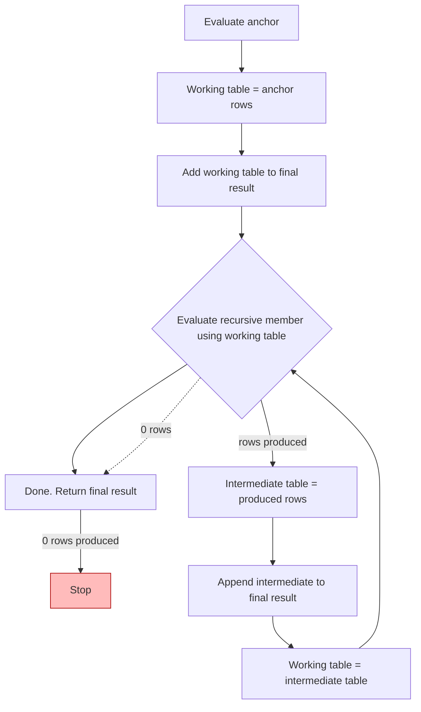
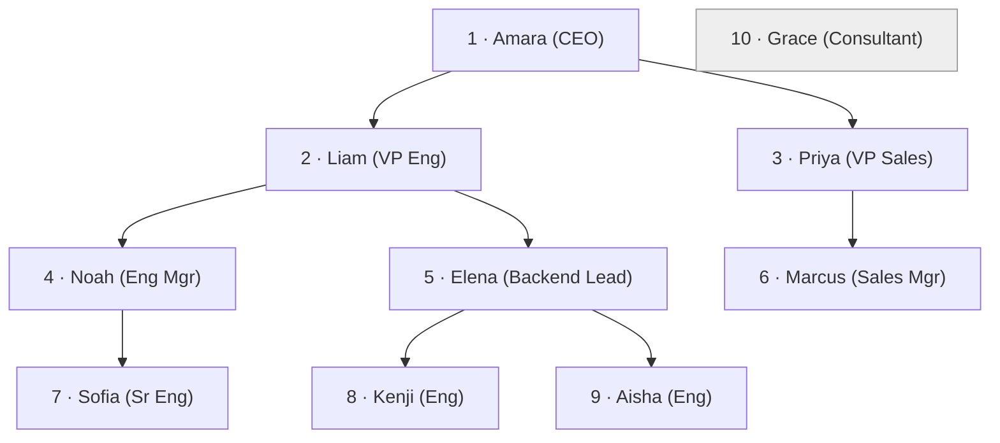

# 34. Recursive CTEs

> Cross-references: [33-CTEs] — [Window Functions] — [Hierarchical Data / Normalization] — [Indexes & Sargability]

---

## What is a Recursive CTE

A **recursive CTE** (also called a **recursive common table expression**) is a `WITH` query whose result set is built by repeating a step: it starts from a set of **seed rows**, then repeatedly expands those rows to produce _new_ rows, feeding those new rows back into itself, until it can no longer produce anything new.

It is SQL's way of expressing **"walk this tree, graph, or chain until it runs out."**

In plain English: `WITH RECURSIVE` gives you a **loop** inside a single SQL statement.

---

## Why it exists

Relational databases store hierarchies as plain flat rows. An employee row has a `manager_id` that points to another employee row. A category row has a `parent_id`. A flight has an `origin` and a `destination`.

Before recursive CTEs were standardized (SQL:1999), walking such structures required one of:

1. **N+1 app-level loops** — a query per level, run from an application.
2. **`CONNECT BY`** — Oracle's proprietary syntax (still popular).
3. **Denormalized designs** — materialized path, nested set, or closure tables.
4. **Stored procedures** with cursors.

Recursive CTEs give you a **single, set-based, standard-SQL** way to answer questions like:

- "Show me the entire reporting chain of every employee."
- "Which parts go into this product, at every level?"
- "Generate a row for every day in January."
- "Which airports can I reach from here in 3 hops or fewer?"

---

## Syntax

```sql
WITH RECURSIVE cte_name (column_list) AS (
    -- anchor member (non-recursive seed)
    SELECT ...
    UNION ALL
    -- recursive member
    SELECT ...
)
SELECT * FROM cte_name;
```

Two mandatory parts:

| Part                 | Role                                                                     | Runs                                    |
| -------------------- | ------------------------------------------------------------------------ | --------------------------------------- |
| **Anchor member**    | Produces the seed rows                                                   | Exactly once, before any recursion      |
| **Recursive member** | Produces the next "generation" of rows by referencing the CTE's own name | Repeatedly, until it produces zero rows |

The recursive member **must** reference the CTE name itself. If it does not, the query is _not_ recursive at all — it's just a normal joined query.

---

## How it works internally

The SQL standard defines a precise, repeatable algorithm (this is how engines actually implement it, and the exact model used by PostgreSQL's implementation):

```
1. Evaluate the anchor, store result in a WORKING TABLE.
   Add those rows to the FINAL RESULT.

2. LOOP:
   a. Evaluate the recursive member,
      substituting the current WORKING TABLE
      in place of the CTE's own name.
   b. Store the output rows in an INTERMEDIATE TABLE.
   c. Append the intermediate rows to the FINAL RESULT.
   d. Replace the WORKING TABLE with the INTERMEDIATE TABLE.

3. STOP when the working table is empty.
```



> **Crucial, and widely misunderstood:** inside the recursive member, the CTE name refers **only to the previous iteration's output (the working table)** — _not_ to the whole accumulated result set.

That is why `SUM(x)` over the recursive reference would only sum the current generation, not the entire tree. Aggregates over the full result must be done **outside** the recursion, in the final `SELECT`.

Two engine-specific consequences of this model:

> **PostgreSQL**
> Does **not** impose a recursion limit by default. An improperly guarded recursive CTE can loop forever. Use the `CYCLE`/`SEARCH` clauses (v14+) or a manual depth guard.

> **MySQL**
> Has a default limit of **1000** iterations, configurable via `SET SESSION cte_max_recursion_depth = 1000000;`.

> **SQL Server**
> Default limit of **100** recursions; maximum allowed **32767**. Control with `OPTION (MAXRECURSION N)`. Exceeding the limit raises _`The statement terminated. The maximum recursion 100 has been exhausted before statement completion.`_

> **Oracle**
> Supports both `CONNECT BY` (older, proprietary) and recursive CTEs (standards-compliant). Without cycle handling, a cyclic structure raises `ORA-32044: cycle detected while executing recursive WITH query` — or keeps going, depending on the version and configuration.

---

## Running example: the employee org chart

Let's walk a realistic tree. **Grain: one row in `employees` = one employee. One employee has at most one manager.**

```sql
CREATE TABLE employees (
    employee_id INTEGER PRIMARY KEY,
    manager_id  INTEGER REFERENCES employees(employee_id), -- NULL = top of tree
    name        TEXT NOT NULL,
    job_title   TEXT NOT NULL,
    salary      NUMERIC(10,2) NOT NULL
);

INSERT INTO employees VALUES
(1, NULL, 'Amara Okafor', 'CEO',              250000.00),
(2, 1,    'Liam Chen',    'VP Engineering',   180000.00),
(3, 1,    'Priya Sharma', 'VP Sales',         170000.00),
(4, 2,    'Noah Williams','Engineering Mgr',  140000.00),
(5, 2,    'Elena Petrova', 'Backend Lead',    135000.00),
(6, 3,    'Marcus Reed',  'Sales Manager',    120000.00),
(7, 4,    'Sofia Garcia', 'Senior Engineer',  110000.00),
(8, 5,    'Kenji Tanaka', 'Engineer',          95000.00),
(9, 5,    'Aisha Khan',   'Engineer',          90000.00),
(10, NULL, 'Grace Liu',   'Consultant',       130000.00);
```



Note the data deliberately has **two roots** (`1`, `10`) and **two levels of depth beyond `Elena`** — plenty of edge cases to play with.

---

## Example 1 — full org chart with depth level

```sql
WITH RECURSIVE org_tree AS (
    -- Anchor: everyone at the top
    SELECT employee_id, manager_id, name, 1 AS level
    FROM employees
    WHERE manager_id IS NULL

    UNION ALL

    -- Recursive: children of the current working generation
    SELECT e.employee_id, e.manager_id, e.name, t.level + 1
    FROM employees e
    JOIN org_tree t ON e.manager_id = t.employee_id
)
SELECT level, name, job_title
FROM org_tree
ORDER BY level, name;
```

### Expected result

| level | name          | job_title       |
| ----: | ------------- | --------------- |
|     1 | Amara Okafor  | CEO             |
|     1 | Grace Liu     | Consultant      |
|     2 | Liam Chen     | VP Engineering  |
|     2 | Priya Sharma  | VP Sales        |
|     3 | Marcus Reed   | Sales Manager   |
|     3 | Noah Williams | Engineering Mgr |
|     3 | Elena Petrova | Backend Lead    |
|     4 | Sofia Garcia  | Senior Engineer |
|     4 | Kenji Tanaka  | Engineer        |
|     4 | Aisha Khan    | Engineer        |

**Walk through the algorithm:**

- **Iteration 0 (anchor):** `{1, 10}` → level 1. Working table = `{1, 10}`.
- **Iteration 1:** join `employees` to `{1, 10}` → `{2, 3}` (children of 1). `10` has no children. Level 2.
- **Iteration 2:** join to `{2, 3}` → `{4, 5, 6}`. Level 3.
- **Iteration 3:** join to `{4, 5, 6}` → `{7, 8, 9}`. Level 4.
- **Iteration 4:** join to `{7, 8, 9}` → no children, empty. **Stop.**

Four recursive passes, exactly matching the tree's depth. **Number of iterations = depth of the tree.** This is the single most important performance fact about recursive CTEs.

---

## Example 2 — root-to-node path (breadth-first vs depth-first ordering)

```sql
WITH RECURSIVE org_tree AS (
    SELECT employee_id, manager_id, name, 1 AS level,
           name::TEXT AS path
    FROM employees
    WHERE manager_id IS NULL

    UNION ALL

    SELECT e.employee_id, e.manager_id, e.name,
           t.level + 1,
           t.path || ' -> ' || e.name
    FROM employees e
    JOIN org_tree t ON e.manager_id = t.employee_id
)
SELECT level, name, path
FROM org_tree
ORDER BY level, name;          -- breadth-first style
```

Result (excerpt):

| level | name          | path                                                       |
| ----: | ------------- | ---------------------------------------------------------- |
|     1 | Amara Okafor  | `Amara Okafor`                                             |
|     1 | Grace Liu     | `Grace Liu`                                                |
|     2 | Liam Chen     | `Amara Okafor -> Liam Chen`                                |
|     3 | Elena Petrova | `Amara Okafor -> Liam Chen -> Elena Petrova`               |
|     4 | Aisha Khan    | `Amara Okafor -> Liam Chen -> Elena Petrova -> Aisha Khan` |

**Ordering caveat.** The SQL standard does _not_ guarantee the ordering of recursive output, and a final `ORDER BY` sorts the _whole_ result, destroying any natural tree order. If you need a well-defined traversal order:

> **PostgreSQL (14+)**
> Use the `SEARCH` clause — either `SEARCH DEPTH FIRST` or `SEARCH BREADTH FIRST`:

```sql
WITH RECURSIVE org_tree AS (
    ...
)
SEARCH DEPTH FIRST BY employee_id SET ord
SELECT * FROM org_tree ORDER BY ord;
```

> **SQL Server / Oracle**
> Provide similar traversal ordering via `ORDER BY` of the anchor plus a level/path column, or (Oracle) `CONNECT BY ... ORDER SIBLINGS BY`.

The practical point: **if traversal order matters, store a path string (or a `level` column, or use `SEARCH`) and order on it explicitly.** Don't silently rely on engine-dependent default order.

---

## Example 3 — what is the deepest chain under each manager?

Something non-recursive SQL cannot express cleanly: for every manager, the maximum reporting depth below them.

```sql
WITH RECURSIVE depths AS (
    SELECT employee_id, manager_id, 1 AS level
    FROM employees
    WHERE manager_id IS NULL

    UNION ALL

    SELECT e.employee_id, e.manager_id, d.level + 1
    FROM employees e
    JOIN depths d ON e.manager_id = d.employee_id
)
SELECT root_id, MAX(level) AS max_depth
FROM (
    SELECT d.*,
           (SELECT employee_id          -- walk back up to the root
            FROM (SELECT employee_id, manager_id FROM employees) r
            WHERE r.employee_id = ...) AS root_id
    FROM depths d
) x
GROUP BY root_id;
```

A cleaner pattern for "walk back up": materialize the **root** inside the recursion itself by carrying it forward.

```sql
WITH RECURSIVE depths AS (
    SELECT employee_id, employee_id AS root_id, manager_id, 1 AS level
    FROM employees
    WHERE manager_id IS NULL

    UNION ALL

    SELECT e.employee_id, d.root_id, e.manager_id, d.level + 1
    FROM employees e
    JOIN depths d ON e.manager_id = d.employee_id
)
SELECT root_id, MAX(level) AS max_depth
FROM depths
GROUP BY root_id
ORDER BY max_depth DESC;
```

### Expected result

| root_id | max_depth |
| ------: | --------: |
|       1 |         4 |
|      10 |         1 |

**Pattern:** if you need information from the _origin_ of the tree (root, top-level category, source part), **carry it down as a column** during recursion rather than trying to compute it afterward.

---

## Example 4 — generating a calendar (date spine)

A very common production use: fill up a contiguous sequence one day at a time.

```sql
WITH RECURSIVE dates AS (
    SELECT DATE '2026-01-01' AS d
    UNION ALL
    SELECT d + INTERVAL '1 day'
    FROM dates
    WHERE d + INTERVAL '1 day' <= DATE '2026-01-31'
)
SELECT d FROM dates;
```

| d          |
| ---------- |
| 2026-01-01 |
| 2026-01-02 |
| ...        |
| 2026-01-31 |

This is the cleaner, portable alternative to generating a row per day with a numbers table or `generate_series` (though `generate_series` is faster in PostgreSQL when available). Recursive date spines are commonly joined as the **driving table** to fill gaps in daily metrics:

```sql
WITH RECURSIVE dates AS (...)           -- every day in January
SELECT d.d, COUNT(o.order_id) AS orders
FROM dates d
LEFT JOIN orders o ON o.order_date = d.d
GROUP BY d.d;
```

Now days with zero orders still appear — a plain `GROUP BY orders` would drop them.

---

## Example 5 — parts explosion (bill of materials)

**Grains:** one row in `parts` = one part. One row in `assembly` = one direct "parent uses child" relationship, with a quantity.

```sql
CREATE TABLE parts (
    part_id   INTEGER PRIMARY KEY,
    part_name TEXT NOT NULL
);

CREATE TABLE assembly (
    parent_part_id INTEGER REFERENCES parts(part_id),
    child_part_id  INTEGER REFERENCES parts(part_id),
    quantity       INTEGER NOT NULL,
    PRIMARY KEY (parent_part_id, child_part_id)
);
```

Image a product tree: a **Bike** is made of 2 **Wheels**, each **Wheel** is made of 1 **Rim** + 20 **Spokes**.

```sql
WITH RECURSIVE bom AS (
    SELECT part_id, part_id AS top_part_id, part_name, 1 AS qty_multiplier
    FROM parts
    WHERE part_id = 100                      -- anchor: the product we explode

    UNION ALL

    SELECT a.child_part_id, b.top_part_id, p.part_name,
           b.qty_multiplier * a.quantity
    FROM assembly a
    JOIN bom b ON a.parent_part_id = b.part_id
    JOIN parts p ON p.part_id = a.child_part_id
)
SELECT part_name, SUM(qty_multiplier) AS total_needed
FROM bom
GROUP BY part_name
ORDER BY total_needed DESC;
```

| part_name | total_needed |
| --------- | -----------: |
| Spoke     |           40 |
| Rim       |            2 |
| Wheel     |            2 |

**Why the structure matters:** quantities are **multiplied** level by level inside recursion (`1 * 2 = 2` at wheel level, `2 * 20 = 40` at spoke level), but the **aggregation happens outside** in the final `SELECT`. You cannot `SUM()` over the recursive reference — it would only see the current working table, and many engines forbid aggregate references over the recursive CTE entirely.

---

## Cycle detection and infinite recursion

Up until now the data was a clean tree. Real data is rarely clean.

Consider these two corrupt rows:

```sql
-- Row 1 is its own manager:
UPDATE employees SET manager_id = 1 WHERE employee_id = 1;

-- Row 2 and 3 manage each other:
UPDATE employees SET manager_id = 3 WHERE employee_id = 2;
UPDATE employees SET manager_id = 2 WHERE employee_id = 3;
```

Now the org-chart query **never terminates** — it generates the same two rows forever. In MySQL and SQL Server it dies at the iteration limit; in PostgreSQL (no default limit) it runs until memory/disk is exhausted and the statement is killed.

> **Production pitfall**
> Never run an unbounded recursive query in production without cycle protection or a depth cap. One bad row can take down an OLTP instance.

### Defense 1 — hard depth cap

```sql
WHERE t.level < 20
```

Simple and always available, but it silently _truncates_ the tree — you must also alert the right people.

### Defense 2 — PostgreSQL `CYCLE` clause (v14+)

```sql
WITH RECURSIVE org_tree AS (
    SELECT employee_id, manager_id, name, 1 AS level
    FROM employees
    WHERE manager_id IS NULL
    UNION ALL
    SELECT e.employee_id, e.manager_id, e.name, t.level + 1
    FROM employees e
    JOIN org_tree t ON e.manager_id = t.employee_id
)
CYCLE employee_id SET is_cycle USING path
SELECT * FROM org_tree;
```

Rows encountered twice are marked `is_cycle = true` instead of recursing forever. This is **far more reliable** than `path LIKE` string checks.

### Defense 3 — SQL Server

```sql
... ) SELECT * FROM org_tree OPTION (MAXRECURSION 500);
```

### Defense 4 — Oracle

```sql
SELECT employee_id, manager_id, LEVEL
FROM employees
START WITH manager_id IS NULL
CONNECT BY NOCYCLE PRIOR employee_id = manager_id;
```

Plus `CONNECT_BY_ISCYCLE` to see _which_ rows formed the cycle. Oracle's proprietary `CONNECT BY` remains idiomatic there.

### Manual path-string check (portable, older-engine friendly)

```sql
... UNION ALL
SELECT e.employee_id, e.manager_id, e.name, t.level + 1,
       t.path || ' -> ' || e.name
FROM employees e
JOIN org_tree t ON e.manager_id = t.employee_id
WHERE position(e.name::TEXT IN t.path) = 0   -- stop if we've seen this node
```

Works everywhere, but string scans get expensive on deep trees. Prefer engine-native cycle support where available.

---

## NULL behavior

| NULL situation                                 | What happens                                                                                                   |
| ---------------------------------------------- | -------------------------------------------------------------------------------------------------------------- | --------------------- | ---------------------------------------------------------- | --- | ----------------------------------------------------------------- |
| `manager_id IS NULL` in anchor                 | Correctly seeds the roots — this is primarically why the anchor lists roots explicitly.                        |
| NULL in the **middle** of a chain (orphan row) | The orphan row never appears in the result: nothing points to it as a child, and no parent chain can reach it. |
| NULL path string in `                          |                                                                                                                | `-style concatenation | In SQL Server, `'abc' + NULL = NULL`; in PostgreSQL `'abc' |     | NULL = 'abc'`. Concatenate defensively with `COALESCE(path, '')`. |
| NULL join key                                  | Rows whose key column is NULL simply never join → counted as "not matching."                                   |
| Anchor returns zero rows                       | The whole query returns zero rows — recursion never starts.                                                    |

---

## Common mistakes

1. **Forgetting `UNION ALL` / using `UNION`.** With `UNION`, duplicates are pruned at every generation. That changes row counts and — worse — combined with a cycle can accidentally _terminate_ a query that should keep going. Use `UNION ALL` unless you specifically want dedup.
2. **The recursive member doesn't reference the CTE.** Then it isn't recursive — it just runs once.
3. **Column count/type mismatch** between anchor and recursive member. Recursive terms do **implicit type coercion** in most engines, but `NULL` literals and `INT` vs `BIGINT` or numeric precisions cause errors or silent truncation. **Cast in the anchor** (`1::BIGINT`).
4. **Aggregating or applying window functions over the recursive reference.** It only holds the current working table, and many engines reject it outright.
5. **No termination condition, no depth cap, no cycle detection.** See the pitfall above.
6. **Missing join between the recursive member and the working table.** `FROM employees e JOIN org_tree t ON ...` — without the join you get a Cartesian product that grows the working set every iteration (exponential blowup).
7. **Mistaking the anchor for "the root of one subtree."** If your anchor is _all_ roots, you get all subtrees at once. Filter the anchor when you want a single subtree (as in the BOM example with `WHERE part_id = 100`).
8. **Assuming the final result is ordered depth-first.** It isn't guaranteed; order explicitly.
9. **Recursive CTE inside a subquery or LATERAL with further recursion** — referencing the recursive name twice, or nested recursion (a recursive CTE referencing another recursive CTE) is **mutual recursion** and is disallowed in every major engine.

---

## Recursive CTE vs the alternatives

| Concern                     | Recursive CTE                            | `CONNECT BY` (Oracle)  | Nested set   | Materialized path | App-side loop |
| --------------------------- | ---------------------------------------- | ---------------------- | ------------ | ----------------- | ------------- |
| Engine support              | PostgreSQL, MySQL 8+, SQL Server, Oracle | Oracle only            | Any          | Any               | Any           |
| Standard SQL                | ✅                                       | ❌ proprietary         | n/a (design) | n/a (design)      | —             |
| Set-based, single statement | ✅                                       | ✅                     | ✅ reads     | ✅ reads          | ❌ N+1        |
| Cycle detection             | Manual / `CYCLE`                         | `NOCYCLE` + `IS_CYCLE` | n/a          | `LIKE` check      | Manual        |
| Level tracking              | Manual column                            | `LEVEL` pseudo-column  | Depth col    | Path arithmetic   | Manual        |
| Writes / deletes            | Awkward                                  | Awkward                | Horrific     | Good              | Easy          |
| Read-heavy tree             | Good                                     | Good                   | **Best**     | Good              | Poor          |
| Deep trees (1000+)          | Watch limits                             | Watch `MAX`            | Good         | Good              | Good          |

**Rules of thumb**

- **Deep, read-heavy, stable trees** (e.g., a menu, taxonomy, org chart) → consider **nested set / closure table**; they answer "all descendants" with a single `WHERE` instead of N iterations.
- **Recursive CTE** is the right tool when the tree is written frequently, is a _graph_ (shared nodes, many parents), or the recursion is genuinely unbounded/on-the-fly (flights, reachability, BOM).
- **Recursive CTE is not a substitute for a proper graph database** for very large graphs.

---

## Performance implications

Optimization claims here are engine- and plan-dependent — **verify with `EXPLAIN ANALYZE`** (or equivalent) on your real data and cardinality before trusting any of the following:

- **Number of iterations = tree depth.** Depth drives the "loop count"; width drives the working-table size. A deep, narrow tree is _iteration_-bound; a wide tree is _working-set_-bound.
- **Each iteration is essentially a self-join** of `employees` to the working table. It scans the working table once per pass.
- **The FK/child column needs an index.** `JOIN ... ON e.manager_id = t.employee_id` wants an index on `employees(manager_id)`; make it a composite index if you also filter other columns. Without it, each iteration does a full scan.
- **Plans show the recursion.** PostgreSQL shows `CTE Scan` / `WorkTable Scan` nodes; SQL Server shows a recursive `Clustered Index Scan` with a "spool." Reading the plan node names tells you the engine recognizes recursion. Check actual vs estimated row counts per iteration — a wildly wrong estimate on the working table is the most common optimizer failure mode here.
- **Materialization.** The `WITH` result may be materialized (PostgreSQL materializes CTEs up to a threshold; a `NOT MATERIALIZED` hint is available on PG 12+). This matters when the recursive result is referenced multiple times — read the plan to confirm whether the engine spools it once and scans it multiple times.
- **Path strings.** Building and comparing `path` strings per row is memory-heavy on large/deep trees; prefer numeric `level` columns + engine-native `SEARCH`/`CYCLE` where possible.
- **Recursive member limitations are engine-specific.** PostgreSQL forbids the recursive reference inside a subquery, `LATERAL`, or being used more than once; SQL Server disallows it in aggregates, window functions, or scalar subqueries. These aren't cosmetic — they're what keeps the iteration model well-defined.

**Bad habit to avoid:**

> **BAD APPROACH**
> Walk the tree from an application with one `SELECT` per level. For a depth-50 tree that's 51 round trips and 51 separate queries.

> **BETTER APPROACH**
> One recursive CTE over the same data, leaving the engine to optimize the joins per iteration — but with a depth cap or cycle guard, and an index on the child/reference column.

---

## Best practices

1. **Prefix the anchor by filtering:** restrict the anchor to the exact subset you want (likely your single root).
2. **Uses `UNION ALL`** as the default; reach for `UNION` only when deduplication across generations is genuinely required.
3. **Always carry a `level` column** — it is cheap and immensely useful for filtering and ordered presentation.
4. **Always have a guard:** depth cap, `CYCLE` clause (PG 14+), or `MAXRECURSION` (SQL Server). No exception, not even in tutorials.
5. **Aggregate outside the recursion.** Compute totals in the final `SELECT`, not inside the recursive member.
6. **Cast types explicitly in the anchor** to avoid implicit-coercion surprises in the recursive member.
7. **Index the child/parent reference columns** (e.g., `employees(manager_id)`).
8. **Verify with `EXPLAIN ANALYZE`**, especially actual-vs-estimated row counts on the working table scan.
9. **Order explicitly** with `SEARCH DEPTH FIRST` / `SEARCH BREADTH FIRST` (PG 14+), or a path/level column — never rely on default ordering.
10. **Know your engine's limit** (SQL Server default 100 / max 32767; MySQL default 1000; PostgreSQL unbounded).

---

## Interview traps

> **Interview trap**
> "How many times will this recursive query run for a tree of depth 4 and 1,000 nodes?" The right answer is about **iterations = depth = 4**, not 1,000. Each iteration processes the _current working generation_, not the whole tree — though the number of _rows scanned_ tends to grow with width.

> **Interview trap**
> "What does the CTE name refer to inside the recursive member?" The **previous generation only** — not the accumulated result. Anyone who answers "the whole result set" has missed the working-table semantics.

> **Interview trap**
> "Can I put a `DISTINCT` or `GROUP BY` in the recursive member?" In most engines the recursive reference cannot appear in an aggregate, a window function, or inside a subquery. The standard requires the recursion to stay "pure" so the iteration model holds.

> **Interview trap**
> "Does `WITH RECURSIVE` get faster than a loop?" It's set-based and avoids N round trips, but each iteration is still a self-join with its own cost. "Always faster" is wrong. Verify with an execution plan.

> **Interview trap**
> "Default limits." Remember SQL Server 100 / max 32767 and MySQL 1000 (`cte_max_recursion_depth`). These trip people up constantly: a legitimate 150-level tree "mysteriously" stops at 100.

---

# Interview Questions

## Beginner

1. What are the two mandatory parts of a recursive CTE, and what does each do?
2. What operator joins the anchor to the recursive member, and what is the difference between `UNION` and `UNION ALL` here?
3. Write a recursive CTE that prints the numbers 1 through 10.
4. When does a recursive CTE stop recursing?
5. What does the recursive member's reference to the CTE name actually contain during each step?

## Intermediate

6. For the `employees` table above, write a query showing every employee's name, level, and immediate manager.
7. Given a new `departments` table where `department_id` is self-referencing, write a query that returns each department with its full root-to-leaf path.
8. What happens to rows whose parent points to a non-existent parent (orphans)? Do they appear in the result?
9. Write a recursive CTE that generates every day between two dates, then LEFT JOIN its daily metrics so days with no data still appear.
10. How would you find a cycle in the manager chain without relying on a recursion limit tripping first?

## Advanced

11. For the BOM tables above, compute the **total** quantity of every leaf part needed to build one root product, and explain why the `SUM` must live outside the recursive member.
12. Explain the PostgreSQL `SEARCH DEPTH FIRST` vs `SEARCH BREADTH FIRST` clauses and what problem they solve.
13. What does the PostgreSQL `CYCLE ... SET is_cycle USING path` clause do, and how is it better than a depth cap?
14. Compare recursive CTEs, Oracle `CONNECT BY`, nested sets, and materialized path for a read-heavy 50,000-node taxonomy. Which would you pick, and why?
15. How many iterations does a recursive CTE perform on a tree of depth D, independent of node count? Justify.

## Scenario Based

16. A `logins` table stores `user_id`, `login_at`. Build a 30-day calendar spine with recursive CTEs and produce a per-user, per-day login count including zero-days. What grain is each output row?
17. You have an `events` table where events reference a parent event. Which events are "long-running ancestor chains" of > 10 levels? Write it.
18. A `flights` table has `origin`, `destination`. How many distinct airports are reachable from `JFK` in at most 3 hops, and how do you stop the query from looping on routes like `JFK-EWR-JFK`?
19. A category tree is used for reporting, but one category is its own parent. Your recursive report now hangs. Which engine-level tools stop it, and what does your final report show for the cyclic category?
20. Give the SQL that lists, for every manager, how many of their indirect reports exist at each level below them (their descendant histogram).

## Tricky

21. Explain why a recursive CTE that produces 1,000 rows per generation takes far more iterations than a tree of depth 3 with 500 nodes when the data actually has multiple roots — what is the real iteration count in each case?
22. What produces a row explosion in the recursive member, and how do you recognize a Cartesian product sneaking into the recursion?
23. The anchor uses `WHERE manager_id IS NULL`, but you recently changed the schema so each row has a `manager_level`. What subtle behavior change does that cause for roots?
24. Why might a recursive query that worked on PostgreSQL fail on SQL Server, even though the data is identical?
25. Can a recursive CTE reference itself from within a `CASE` expression or subquery? Why or why not?

## Output Prediction

26. Given the `employees` table as seeded above, what does the org-tree query return if you accidentally use `UNION` instead of `UNION ALL` — identical rows, fewer rows, or an infinite loop?
27. `employee_id` 10 (`Grace Liu`) has `manager_id NULL`. Predict every output line of the org-chart query. Now flip her manager to `1` (still reporting to no one above her). What changes, and why does her `level` become 2?
28. Preview the result of the date-spine CTE if the WHERE clause is `WHERE d < '2026-01-31'` for a start date of `'2026-01-28'`. Is the output a full month at the standard granularity? What subtle off-by-one is happening?
29. What rows does the BOM explosion produce if `assembly` contains the single pair `(parent=100, child=100)` with quantity 1? Trace the iterations.
30. In the non-recursive final `SELECT org_tree` of the org chart, what does `COUNT(*)` over the CTE equal: number of employees, or number of rows across all recursion levels? Show your reasoning.

## Debugging

31. Your org-chart query "works on Monday, hangs on Tuesday." What query finds the corrupt row set (self-referencing manager or mutual management) before rerunning the recursion?
32. The BOM report undercounts total quantities at every level past the second. Given the recursion, where is the bug most likely — the multiplier, the anchor filter, or the aggregation location?
33. The output shows every employee correctly except one department is entirely absent from the tree. What data condition explains it?
34. A query repeatedly errors with `the maximum recursion 100 has been exhausted` on SQL Server, but the tree is only 5 levels deep. Which data pattern makes the iteration count bigger than the depth?
35. You add a depth cap of 20 and the report is correct for 2 months, then silently truncates. What is missing from your monitoring, and what engine features should you have used instead of a magic cap number?

## Performance

36. Explain how `EXPLAIN ANALYZE` would reveal whether the recursion is doing a table scan per iteration. What does a `WorkTable Scan` node (PostgreSQL) or the spool (SQL Server) indicate?
37. You're told to optimize a recursive BOM on a 100k-part catalog. Which two indexes actually help, and which ones are dead weight? How would you confirm with a plan?
38. A recursive airport-reachability query on 1M flight rows explodes memory 3 hops in. Is the fix a deeper index, a smaller working set via anchor filtering, cycle detection, or a different algorithm? Defend the choice using plan output.
39. Compare the execution-time behavior of a recursive CTE vs an application loop on the same 40-level tree. What dominates runtime in each case and why does "set-based is always faster" not hold?
40. Your recursive CTE's plan shows the recursive member re-scanning `employees` fully in each iteration (no index). Given a tree depth of 30 and 500k employees, estimate the scan cost growth and describe the index that moves it to logarithmic lookup per iteration. Verify claim with an actual plan on real data before trusting it.
