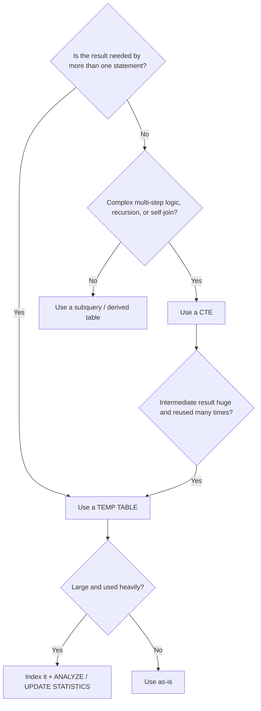

# 35 — CTE vs Subquery vs Temp Table

## TL;DR

| Tool                         | Scope                    | Persists after the statement? | Can be reused in a later statement? | Can you index it? | Has real statistics?   |
| ---------------------------- | ------------------------ | ----------------------------- | ----------------------------------- | ----------------- | ---------------------- |
| **Subquery / derived table** | Current statement only   | No                            | No                                  | No                | No (optimizer guesses) |
| **CTE (`WITH`)**             | Current statement only   | No                            | No                                  | No                | No (optimizer guesses) |
| **Temp table**               | Session (or transaction) | Yes                           | Yes                                 | Yes               | Yes (if analyzed)      |

The three tools can often produce **identical results**. What differs is _scope_, _readability_, _how many statements can see the result_, and — crucially — _how the optimizer treats them_.

> Common misconception
> "A CTE is stored somewhere in memory; it's a faster temp table."
> False. A CTE is a **named** subquery scoped to one statement. In many engines the CTE is _inlined_ into the outer query and never materialized at all. A temp table is a real schema object with disk storage, statistics, and indexability.

---

## Fundamentals

### What each thing is

- **Subquery** — any `SELECT` nested inside another statement. Depending on _where_ it appears it has a different name:
  - inside `SELECT` list → **scalar subquery** (must return 1 column, at most 1 row)
  - inside `FROM` → **derived table** (SQL Server / MySQL / ANSI) or **inline view** (Oracle) — must have an alias
  - inside `WHERE` / `HAVING` → comparison source, `IN`, `EXISTS`, etc.
  - **correlated** = references a column from the outer query
  - **non-correlated** = can run independently

- **CTE (Common Table Expression)** — a subquery given a _name_ using `WITH ... AS (...)`, scoped to the statement that follows it. It is the SQL-way to "declare a variable" for one query. Supports **recursion**.

- **Temp table** — an actual table created as a session/transaction-scoped object. You can insert into it, read it, update it, delete from it, index it, and reference it from _multiple_ statements.

### The mental model

Everything you can do with a CTE, you can also do with a subquery, and vice versa. The CTE is mostly **syntactic sugar** (though engines add special behavior, see Internal Working). The temp table is a genuinely _different_ creature: it outlives the statement.

Ask yourself: **"Do the intermediate results need to live past the current SQL statement?"**
If no → subquery or CTE. If yes → temp table.

### SQL Reasoning checklist that drives the choice

1. Is the intermediate result used only inside **one** statement?
2. Is it used **multiple times inside** that same statement?
3. Does it need to be **shared with other statements** (a script, a reporting job)?
4. Do later steps need to **index or re-aggregate** the result?
5. Is the logic **deeply nested** (hard to read as subqueries)?
6. Do I need **recursion** (self-referencing hierarchy)?
7. Could the **engine materialize or inline** this, and does my choice change the execution plan?

---

## Sample Data Used in This Section

```sql
-- Grain: one row per department
CREATE TABLE departments (
    department_id   INT PRIMARY KEY,
    department_name VARCHAR(100) NOT NULL
);

-- Grain: one row per employee
CREATE TABLE employees (
    employee_id   INT PRIMARY KEY,
    name          VARCHAR(100) NOT NULL,
    department_id INT REFERENCES departments(department_id), -- nullable!
    salary        NUMERIC(10, 2) NOT NULL
);

-- Grain: one row per order
CREATE TABLE orders (
    order_id    INT PRIMARY KEY,
    customer_id INT NOT NULL,
    order_date  DATE NOT NULL,
    amount      NUMERIC(10, 2) NOT NULL,
    status      VARCHAR(20) NOT NULL
);
```

```sql
INSERT INTO departments VALUES
(1, 'Engineering'),
(2, 'Sales'),
(3, 'HR'),
(4, 'Marketing');

INSERT INTO employees (employee_id, name, department_id, salary) VALUES
(101, 'Alice', 1, 12000),
(102, 'Bob',   1, 11000),
(103, 'Carol', 2,  9000),
(104, 'Dave',  2,  8500),
(105, 'Eve',   3,  7000),
(106, 'Frank', NULL, 6000);          -- department not yet assigned

INSERT INTO orders (order_id, customer_id, order_date, amount, status) VALUES
(1001, 501, '2026-01-05', 250.00, 'shipped'),
(1002, 502, '2026-01-12', 480.00, 'pending'),
(1003, 501, '2026-02-01', 130.75, 'shipped'),
(1004, 503, '2026-02-15', 999.99, 'cancelled'),
(1005, 502, '2026-03-02',  75.50, 'pending');
```

**Why the grain declaration matters** (see SQL Reasoning): whenever you join, aggregate, or nest, always re-clarify to yourself what one row of each source means — most "double counting" bugs come from forgetting this.

---

# 1. Subqueries

## What and why

A subquery exists to answer a question **inline**, without creating any object. Examples:

- "Which employees earn more than the _average_?" → the average is the subquery.
- "Which departments have _no_ employees?" → the emptiness check is the subquery.
- "What is the _latest_ order per customer?" → a derived table.

Why: it keeps related logic close together and lets one statement express ideas the basic `JOIN` syntax cannot (e.g., comparing each row against a computed constant).

## Syntax

```sql
-- Non-correlated, used as a constant in WHERE
SELECT columns
FROM table
WHERE column > (SELECT AVG(col) FROM other_table);          -- scalar

-- Correlated: the subquery references the outer alias
SELECT e.name
FROM employees e
WHERE e.salary > (SELECT AVG(salary)
                  FROM employees x
                  WHERE x.department_id = e.department_id);  -- correlated

-- Derived table in FROM (must have an alias!)
SELECT *
FROM (SELECT department_id, AVG(salary) AS avg_salary
      FROM employees
      GROUP BY department_id) AS stats
WHERE stats.avg_salary > 8000;

-- Existence check
SELECT name
FROM employees e
WHERE EXISTS (SELECT 1 FROM orders o WHERE o.amount > e.salary);
```

Rules:

- A **scalar subquery** must return exactly **1 column** at runtime (SQL compilers reject 2+ columns) and at most **1 row** (multi-row → runtime error).
- A **derived table** must have an **alias** in all engines.
- Correlated subqueries can only reference tables visible to the outer block — always prefix with the outer alias to avoid confusion.

## Example 1 — scalar subquery (non-correlated, runs once)

```sql
-- Employees earning more than the company average salary
SELECT name, salary
FROM employees
WHERE salary > (SELECT AVG(salary) FROM employees);
```

Expected output:

| name  | salary   |
| ----- | -------- |
| Alice | 12000.00 |
| Bob   | 11000.00 |
| Carol | 9000.00  |

`AVG(salary)` across all 6 employees = 53500 / 6 = 8916.67, so all three above it match.

## Example 2 — correlated subquery (runs per outer row)

```sql
-- Employees who earn more than the average of their OWN department
SELECT e.name, e.department_id, e.salary
FROM employees e
WHERE e.salary > (
    SELECT AVG(x.salary)
    FROM employees x
    WHERE x.department_id = e.department_id
);
```

Expected output:

| name  | department_id | salary   |
| ----- | ------------- | -------- |
| Alice | 1             | 12000.00 |
| Carol | 2             | 9000.00  |

Explanation of every row:

- Alice: dept 1 avg = 11500, 12000 > 11500 ✔
- Bob: dept 1 avg = 11500, 11000 ✘
- Carol: dept 2 avg = 8750, 9000 > 8750 ✔
- Dave: dept 2 avg = 8750, 8500 ✘
- Eve: dept 3 avg = 7000, 7000 ✘ (equal is NOT greater)
- Frank: dept NULL → inner query finds nothing → `AVG(...)` over zero rows is **NULL** → `6000 > NULL` is **UNKNOWN** → row filtered out.

Between the lines: a **correlated** subquery depends on each outer row, so semantically it must be re-evaluated — the optimizer _usually_ turns it into a `Nested Loop` + `Index/Index-only scan` on the inner side. If the inner column has no index, that is a per-row scan. See Performance.

## Example 3 — derived table in FROM

```sql
SELECT dep.department_name, stats.avg_salary
FROM departments AS dep
JOIN (
    SELECT department_id, AVG(salary) AS avg_salary
    FROM employees
    GROUP BY department_id
) AS stats
  ON stats.department_id = dep.department_id;
```

Expected output:

| department_name | avg_salary |
| --------------- | ---------- |
| Engineering     | 11500.00   |
| Sales           | 8750.00    |
| HR              | 7000.00    |

Note Marketing disappears: it has no employees, so the `JOIN` (inner) drops it. If you wanted Marketing with `NULL`, use `LEFT JOIN` and move semantics accordingly.

## Correlated vs non-correlated — comparison

| Property             | Non-correlated                        | Correlated                      |
| -------------------- | ------------------------------------- | ------------------------------- |
| Depends on outer row | No                                    | Yes                             |
| Could run standalone | Yes                                   | No                              |
| Typically executed   | Once (constant) or joined             | Per outer row (semantically)    |
| Typical plan shape   | Index scan, hash join, aggregate once | Nested loop with lookup per row |
| Risk                 | Double evaluation if poorly factored  | N+1-style work if no index      |

> Common misconception
> "A correlated subquery always runs the inner SELECT once per row, so it's always slow."
> Not necessarily. Engines may convert it to a join or reuse an aggregate. Conversely, a _non-correlated_ aggregate can be re-computed if you repeat it carelessly. Verify with the execution plan — never assume.

## Nested subqueries

Subqueries nest arbitrarily deep, but each level costs readability:

```sql
SELECT name
FROM employees
WHERE department_id IN (
    SELECT department_id
    FROM employees
    WHERE salary > (
        SELECT AVG(salary) FROM employees
    )
);
```

That returns everyone whose department contains at least one above-average earner (so Alice, Bob, Carol, Dave — anyone in dept 1 or 2). Concise, but as nesting grows, a **CTE** is almost always easier to read and re-factor.

---

# 2. Common Table Expressions (CTEs)

## What and why

A CTE gives a named, temporary result set **within a single statement**:

```sql
WITH name AS (
    SELECT ...            -- this SELECT runs conceptually first
)
SELECT ... FROM name ...;
```

Why they exist:

- **Readability** — name each logical step ("raw_data", "deduplicated", "aggregated").
- **Reusability within one statement** — reference the CTE multiple times (joins, unions, comparisons).
- **Recursion** — the only supported way across all major engines (see the Recursive CTE section).
- **Separation of concerns** — turn 4 levels of nested subqueries into 4 named blocks.

## Syntax

```sql
WITH
cte1 AS (
    SELECT department_id, AVG(salary) AS avg_salary
    FROM employees
    GROUP BY department_id
),
cte2 AS (
    SELECT department_id, COUNT(*) AS how_many
    FROM employees
    GROUP BY department_id
)
SELECT e.name, c1.avg_salary, c2.how_many
FROM employees e
LEFT JOIN cte1 c1 ON c1.department_id = e.department_id
LEFT JOIN cte2 c2 ON c2.department_id = e.department_id;
```

Rules and gotchas:

- Multiple CTEs are comma-separated. Only the last CTE is directly followed by the main statement.
- A CTE name may shadow a real table _inside the same statement_ in some engines (e.g., `WITH employees AS ...`). Qualify with schema name (`public.employees`) when you truly need the physical table.
- A CTE must be **immediately followed** by the statement that consumes it. There is no way to say "SELECT a FROM cte" in a _later_ statement — the name is dead after the statement ends.

## Example — the "top N per group" pattern (with a window function)

This is the CTE's poster child — it is painful without `WITH`:

```sql
-- Top 2 salary earners per department
WITH ranked AS (
    SELECT e.*,
           ROW_NUMBER() OVER (
               PARTITION BY e.department_id
               ORDER BY e.salary DESC
           ) AS rn
    FROM employees e
)
SELECT name, department_id, salary
FROM ranked
WHERE rn <= 2
ORDER BY department_id, rn;
```

Expected output:

| name  | department_id | salary   |
| ----- | ------------- | -------- |
| Alice | 1             | 12000.00 |
| Bob   | 1             | 11000.00 |
| Carol | 2             | 9000.00  |
| Dave  | 2             | 8500.00  |
| Eve   | 3             | 7000.00  |
| Frank | NULL          | 6000.00  |

Three notes:

- **Frank appears** because `PARTITION BY NULL department_id` makes its own single-row partition. If you do not want unassigned employees, add `WHERE department_id IS NOT NULL`.
- Ties: `ROW_NUMBER()` picks arbitrarily among ties — use `RANK()` / `DENSE_RANK()` when ties must all survive.
- Compare this against the same problem written with correlated subqueries: far more code and, depending on the plan, far more work. Cross-reference the **Window Functions** section.

## BAD vs BETTER — repeated correlated logic

**BAD APPROACH** — the same aggregate is re-declared three times; a real query with 5 ever-growing copies is common in hand-written reporting:

```sql
SELECT e.name,
       e.salary - (SELECT AVG(x.salary) FROM employees x
                   WHERE x.department_id = e.department_id) AS diff,
       CASE WHEN e.salary >= (SELECT AVG(x.salary) FROM employees x
                              WHERE x.department_id = e.department_id)
            THEN 'above' ELSE 'below' END AS bucket
FROM employees e
WHERE e.salary > (SELECT AVG(x.salary) FROM employees x
                  WHERE x.department_id = e.department_id);
```

**BETTER APPROACH** — compute the aggregate once (conceptually) and name it:

```sql
WITH dept_avg AS (
    SELECT department_id, AVG(salary) AS avg_salary
    FROM employees
    GROUP BY department_id
)
SELECT e.name,
       e.salary - d.avg_salary AS diff,
       CASE WHEN e.salary >= d.avg_salary THEN 'above' ELSE 'below' END AS bucket
FROM employees e
JOIN dept_avg d USING (department_id)
WHERE e.salary > d.avg_salary;
```

Expected output:

| name  | diff   | bucket |
| ----- | ------ | ------ |
| Alice | 500.00 | above  |
| Carol | 250.00 | above  |

Why better:

- **Maintenance**: change the aggregate logic in one place, not three or five.
- **Correctness by construction**: the `JOIN` naturally excludes employees with no department, so Frank is gone without any special-casing.
- **Plans usually improve**: a single grouped access path feeding the join is normally cheaper than three separate per-row aggregate rescans — _but confirm with the plan_, see Analysis.

> Common misconception
> "A CTE always runs exactly once, so it always saves work."
> In several engines a CTE referenced once is **inlined** (treated like a mask over the same query). Only some engines materialize multi-referenced CTEs, and PostgreSQL 16 changed that behavior too. "Runs once" is a _symptom to be checked_, not a guarantee.

## CTEs with data-modifying statements

A CTE is allowed to wrap `INSERT` / `UPDATE` / `DELETE` in many engines:

```sql
-- PostgreSQL
WITH old_orders AS (
    SELECT order_id FROM orders WHERE order_date < '2026-01-01'
)
DELETE FROM orders o
USING old_orders x
WHERE o.order_id = x.order_id;

-- SQL Server
WITH cte AS (
    SELECT order_id FROM orders WHERE order_date < '2026-01-01'
)
DELETE FROM cte;                 -- deletes through the CTE view
```

> Interview trap
> "Write the top-5 corrupt rows." — Many people reach for `SELECT TOP 5` twice. The clean answer uses a CTE for both the selection **and** the modification. Testers love this.

> MySQL
> MySQL 8.0 supports `WITH ... SELECT`. Support of CTEs with `UPDATE`/`DELETE` arrived in later 8.0 releases — check your version (`SELECT @@version`). Pre-8.0 has **no CTE support at all**.

## Recursive CTE (cross-reference)

`WITH RECURSIVE ... UNION ALL ...` is the standard way to walk trees and graphs (organizational charts, BOM explosion, comment threads). It terminates only when the recursive step produces zero rows in a cycle — you must design your own cycle guard (e.g., `WHERE depth < :max` or path-tracking). Full treatment is in the **Recursive CTE** section; here, just remember:

- `WITH RECURSIVE` (PostgreSQL, MySQL) vs plain `WITH` (SQL Server and Oracle accept `WITH` for recursion too — Oracle even offers `CONNECT BY`).
- Oracle also has `WITH ... ( ... )` recursion support and `CONNECT BY`; prefer the ANSI form for portability.

---

# 3. Temp Tables

## What and why

A temp table is a **real table** created in a special per-session space (e.g., `tempdb` in SQL Server, `pg_temp` schema in PostgreSQL). It lives in your session (or transaction), holds real rows on disk, can be **indexed**, and can be read/modified by **multiple sequential statements**.

Why they exist:

- **Cross-statement reuse** — one pipeline: create → load → index → run query 1 → query 2 → query 3, all against the same materialized result.
- **Real statistics** — the optimizer collects/estimates stats on a temp table, so join order and choices for a _large_ intermediate result are usually more accurate.
- **Explicit materialization control** — you force the physical write; no optimizer guessing about inlining.
- **Break very large/complex queries** into debuggable steps.

## Syntax per engine

```sql
-- SQL Server: SELECT ... INTO #temp
SELECT department_id, AVG(salary) AS avg_salary, COUNT(*) AS cnt
INTO #dept_stats
FROM employees
GROUP BY department_id;

-- PostgreSQL: CREATE TEMP TABLE ... AS (or SELECT ... INTO, deprecated for this)
CREATE TEMP TABLE dept_stats_temp AS
SELECT department_id, AVG(salary) AS avg_salary, COUNT(*) AS cnt
FROM employees
GROUP BY department_id;

-- MySQL: CREATE TEMPORARY TABLE
CREATE TEMPORARY TABLE dept_stats_temp AS
SELECT department_id, AVG(salary) AS avg_salary, COUNT(*) AS cnt
FROM employees
GROUP BY department_id;

-- Oracle: definition persists, DATA is per-session
CREATE GLOBAL TEMPORARY TABLE dept_stats_temp (
    department_id NUMBER,
    avg_salary    NUMBER,
    cnt           NUMBER
) ON COMMIT PRESERVE ROWS;   -- or ON COMMIT DELETE ROWS

INSERT INTO dept_stats_temp SELECT department_id, AVG(salary), COUNT(*)
FROM employees GROUP BY department_id;
```

Engine naming/scoping summary:

| Engine     | Syntax                                                   | Scope                                                                 | Auto-cleaned                                        |
| ---------- | -------------------------------------------------------- | --------------------------------------------------------------------- | --------------------------------------------------- |
| SQL Server | `#name` (local), `##name` (global)                       | Local: connection. Global: shared across sessions while creator alive | Local: on disconnect. Global: on last session close |
| PostgreSQL | `CREATE TEMP TABLE`                                      | Session (or transaction with `ON COMMIT DROP`)                        | End of session                                      |
| MySQL      | `CREATE TEMPORARY TABLE`                                 | Session; can shadow a table with the same name                        | On connection close                                 |
| Oracle     | `GLOBAL TEMPORARY TABLE` (definition in data dictionary) | Data per session/transaction                                          | On commit (DELETE ROWS mode) / session end          |

## Example — a reporting pipeline that needs the aggregate 3 times

**BAD APPROACH** — the same big join+aggregate is copy-pasted into three separate queries. If the source data changes mid-job, the three queries can even disagree.

```sql
-- Query 1
SELECT o.status, SUM(o.amount)
FROM orders o
WHERE o.order_date >= '2026-01-01'
GROUP BY o.status;

-- Query 2 (duplicated logic)
SELECT COUNT(*), COUNT(DISTINCT o.customer_id)
FROM orders o
WHERE o.order_date >= '2026-01-01'
GROUP BY o.status;

-- Query 3 (duplicated logic again)
SELECT MAX(o.amount)
FROM orders o
WHERE o.order_date >= '2026-01-01'
GROUP BY o.status;
```

**BETTER APPROACH** — Materialize the slice once; every downstream statement reuses it:

```sql
-- SQL Server
SELECT status, customer_id, amount
INTO #orders_2026
FROM orders
WHERE order_date >= '2026-01-01';

CREATE INDEX ix_orders_2026_status ON #orders_2026(status);

SELECT status, SUM(amount)                            FROM #orders_2026 GROUP BY status;
SELECT status, COUNT(*), COUNT(DISTINCT customer_id)  FROM #orders_2026 GROUP BY status;
SELECT status, MAX(amount)                            FROM #orders_2026 GROUP BY status;
```

Why better:

- The filter + extraction runs **once**, not three times.
- You get a guaranteed consistent snapshot (all queries see the same rows).
- The index lets the three aggregations re-scan efficiently.
- Each statement is small and individually debuggable.

> Production pitfall (SQL Server)
> `SELECT ... INTO #t` sets `IDENTITY`/collation types automatically, but it **does not copy indexes** and it **does not create statistics beyond the built-in ones**. After loading a large `#temp`, run `UPDATE STATISTICS #t;` (or `DROP TABLE #t` dependencies allowing) before heavy joins. Same idea: `ANALYZE` a PostgreSQL temp table, `ANALYZE TABLE` a MySQL one.

## Temp tables are still tables

Everything you know about tables applies: `INDEX`, constraints, `UPDATE`, `DELETE`, joins with other temp or regular tables, and — if in use — **transactions roll back their contents**.

> Production pitfall (SQL Server)
> `##global` temp tables are visible to _other sessions_. Two copies of your job running concurrently can collide on the same `##name` and step on each other's schema or data. Prefer `#local` unless you truly need cross-session sharing (and clean up in a `TRY/FINALLY`-style pattern).

---

# 4. Internal Working — what the engine can actually do

The single biggest difference is **materialization vs inlining**:

- **Inline**: the engine _rewrites_ the subquery/CTE into the outer query, as if you pasted its SQL there. Cheap, no temp storage, filter pushdown possible, statistics come from the underlying tables.
- **Materialize**: the engine physically computes the intermediate result (memory, or spilled to temp space) and reads it like a table.

You (almost always) do not control this for subqueries. You partially control it for CTEs. You always force it for temp tables.

| Engine         | Subquery / derived table                                                                                                             | CTE                                                                                                                                                                                                                                         | Temp table                                          |
| -------------- | ------------------------------------------------------------------------------------------------------------------------------------ | ------------------------------------------------------------------------------------------------------------------------------------------------------------------------------------------------------------------------------------------- | --------------------------------------------------- |
| **PostgreSQL** | Optimizer merges/flattens where possible                                                                                             | v11 and earlier: **always materialized** (a "fence"). v12+: non-recursive single-reference CTEs may be **inlined**. v16+: even multi-reference CTEs may be inlined per reference. Control with `MATERIALIZED` / `NOT MATERIALIZED` keywords | Always real relation (in `pg_temp`)                 |
| **MySQL**      | May merge into the outer query, or materialize (e.g., when the derived table uses `LIMIT`, `DISTINCT`, `GROUP BY`, window functions) | Same optimizer logic as derived tables; no keyword to force either way                                                                                                                                                                      | Always real relation                                |
| **SQL Server** | Optimizer may flatten a simple subquery (e.g., turn an `IN` into a join/semi-join, `NOT EXISTS` into an anti-join)                   | Treated like an inline view per reference; the CTE is generally _expanded_, not stored. No `MATERIALIZE` hint. May spool as an execution-plan choice                                                                                        | Real table in `tempdb` with statistics/indexes      |
| **Oracle**     | Optimizer flattens/merges aggressively; `NO_UNNEST` hint forces a nested-loop subquery evaluation                                    | Subquery factoring: when referenced more than once, Oracle usually **materializes** it (see it in the plan); hints `MATERIALIZE` / `INLINE` force either way                                                                                | `GTT` is a real table with per-session data segment |

Key consequence to remember:

> Interview trap
> "Name three reasons a temp table _can_ (not must) beat a subquery for a big intermediate result."
>
> 1. **Statistics** exist (cardinality estimates are accurate, so join order improves).
> 2. **Indexability** — you can add exactly the index the later queries need.
> 3. **One-time computation** — a heavy filter/aggregate is executed once and reused across many statements.
>    The liability is real disk/temp write + the fact that you must _build_ it first. None of this is guaranteed to be faster in a given query — check the plan.

### Cardinality estimation

- For inlined subqueries/CTEs, the optimizer estimates rows using the real base-table statistics _after pushing predicates down_ — usually good.
- For materialized CTEs without stats, engines fall back to **heuristics/guesses** for fan-out of a table expression.
- For temp tables, statistics exist (or are `UPDATE STATISTICS`-able), which is what makes join order for _large_ intermediates more trustworthy — at the cost of having to write + analyze the rows first.

### What to look for in the execution plan

- `EXPLAIN (ANALYZE, BUFFERS)` (PostgreSQL), `EXPLAIN ANALYZE` (MySQL), SQL Server _Estimated/Actual Execution Plan_ (+ `SET STATISTICS IO, TIME ON`), Oracle `EXPLAIN PLAN FOR` + `DBMS_XPLAN` / `AUTOTRACE`.
- Look for nodes labelled: `CTE Scan`, `Subquery Scan`, `Materialize`, `Spool`, `Derived`, `Inline View` — these tell you whether your CTE/subquery was inlined or materialized.
- Check **estimated vs actual rows** at every node. A huge mismatch = a statistics problem, which is the classic temp-table justification.
- Check **loops** in `Nested Loop` nodes: loops = "how many times this subquery was executed." A correlated subquery with a large loops count is your smoking gun.

To make the point concrete on the earlier correlated-subquery example:

```sql
-- PostgreSQL
EXPLAIN (ANALYZE, BUFFERS)
SELECT e.name, e.salary
FROM employees e
WHERE e.salary > (
    SELECT AVG(x.salary) FROM employees x
    WHERE x.department_id = e.department_id
);
```

You would typically see a `Nested Loop` node with `loops=6` (once per outer employee). With millions of employees, whether that is fast depends on the index/plan shape — not on the text "correlated subquery."

> Never assume a subquery is slow, a CTE is fast, or a temp table is a silver bullet. **Measure with the execution plan for YOUR data, engine, and version.**

---

# 5. Comparison Tables

## Feature comparison

| Feature                                   | Subquery / derived     | CTE                                         | Temp table            |
| ----------------------------------------- | ---------------------- | ------------------------------------------- | --------------------- |
| Named result                              | No                     | Yes                                         | Yes                   |
| Scope                                     | One statement          | One statement                               | Session / transaction |
| Reference multiple times in one statement | Only by duplicate SQL  | Yes (by name)                               | Yes                   |
| Reference in later statements             | No                     | No                                          | Yes                   |
| Recursion support                         | No                     | Yes (recursive CTE)                         | No (write a loop)     |
| Indexable                                 | No                     | No                                          | Yes                   |
| Real statistics                           | Usually no             | Usually no                                  | Yes                   |
| Physical storage                          | Usually none (inlined) | Maybe (materialized)                        | Always                |
| Optimizer materialization control         | No                     | PG: `MATERIALIZED`; Oracle: hints           | Forced                |
| Modifiable (DML/DDL)                      | No                     | Only via the wrapping statement             | Yes, full             |
| Debuggable step in a pipeline             | No                     | Sort of                                     | Yes                   |
| Readability when deeply nested            | Poor                   | Good                                        | Good                  |
| Overhead                                  | Lowest (usually none)  | None if inlined, temp write if materialized | Temp write always     |

## When to use which — decision guide



Common real-world guidance (with the "optimizers vary" disclaimer baked in):

- One-liner condition → **subquery** (`WHERE x > (SELECT AVG ...)`), `EXISTS`, `IN`.
- Single statement with 3+ logical steps → **CTE** for readability.
- The same heavy intermediate value is needed by several queries / a batch → **temp table**, once, indexed.
- A hierarchy needs walking → **recursive CTE** (or hierarchical query in Oracle).
- You are building a big reporting pipeline and want to debug step-by-step → **temp table** steps.

---

# 6. NULL Behavior

NULL is the number-one place these three tools silently change results. Cross-reference the **NULL and Three-Valued Logic** section for the theory; here are the live traps in this topic.

## 6.1 Scalar subquery returns NULL when there are no rows

```sql
SELECT e.name,
       COALESCE(
           (SELECT d.department_name
            FROM departments d
            WHERE d.department_id = e.department_id),
           'Unassigned'
       ) AS dept
FROM employees e;
```

Expected output:

| name  | dept        |
| ----- | ----------- |
| Alice | Engineering |
| Bob   | Engineering |
| Carol | Sales       |
| Dave  | Sales       |
| Eve   | HR          |
| Frank | Unassigned  |

Because Frank's `department_id` is NULL, the scalar subquery returns NULL, and any comparison with NULL becomes **UNKNOWN** (e.g., `WHERE ... = (subquery)` would drop Frank silently). Use `IS NOT DISTINCT FROM` (PostgreSQL), `COALESCE`, or a `LEFT JOIN` when you need nullable matches to survive.

## 6.2 The killer: `NOT IN` with a NULL in the list returns _nothing_

Find employees who are **not** in a given list, e.g. "who is NOT in sales (dept 2) and also NOT in the group of unreviewed departments"?

```sql
-- BAD: the list contains a NULL
SELECT name
FROM employees
WHERE department_id NOT IN (2, NULL);
```

Expected output: **zero rows** — even though dept 1, 3, and NULL-department employees exist.

Why: `x NOT IN (2, NULL)` expands to `x <> 2 AND x <> NULL`. Any `x <> NULL` is UNKNOWN, so `TRUE AND UNKNOWN = UNKNOWN`, and every row is filtered. This is the three-valued-logic trap.

```sql
-- BETTER: NOT EXISTS does not suffer from the NULL in the list
SELECT e.name
FROM employees e
WHERE NOT EXISTS (
    SELECT 1
    FROM (VALUES (2), (NULL)) AS v(x)
    WHERE e.department_id = v.x
);
```

Expected output:

| name  |
| ----- |
| Alice |
| Bob   |
| Eve   |
| Frank |

Note the subtle difference: `NOT EXISTS` **includes Frank** (dept NULL — he simply never matches any list value), which is usually what people actually want.

> Interview trap
> This exact pair (`NOT IN` with NULL vs `NOT EXISTS`) is a legendary interview question. The fix-grained version is: if the subquery column is guaranteed `NOT NULL`, `NOT IN` is fine; otherwise use `NOT EXISTS` (or filter `WHERE col IS NOT NULL` inside the subquery).

## 6.3 Aggregates ignore NULL — but the empty-set result is NULL

Inside subqueries/CTEs, `AVG/SUM/MAX` skip NULLs but return **NULL** over zero rows:

```sql
-- avg_salary comes out NULL for Marketing (no employees)
SELECT d.department_name, a.avg_salary
FROM departments d
LEFT JOIN (
    SELECT department_id, AVG(salary) AS avg_salary
    FROM employees
    GROUP BY department_id
) a ON a.department_id = d.department_id;
```

| department_name | avg_salary |
| --------------- | ---------- |
| Engineering     | 11500.00   |
| Sales           | 8750.00    |
| HR              | 7000.00    |
| Marketing       | NULL       |

Wrapping with `COALESCE(AVG(salary), 0)` changes the semantics — pick deliberately.

## 6.4 EXISTS vs IN on NULLable columns

- `IN` = `=` over the list → NULL comparisons become UNKNOWN → rows dropped unpredictably.
- `EXISTS` = standard boolean over rows → NULLs only make a row not match, they don't poison the whole list.
- `NOT EXISTS` = anti-join semantics → keeps rows whose join key is NULL (as shown above).

---

# 7. Edge Cases

1. **Empty source tables.** Every variant returns empty (or a single NULL row for an aggregate). `AVG`, `SUM`, `MAX` → NULL; `COUNT(*)` → 0. A sequence of CTEs over empty data cascades empty results — usually fine, but watch `COALESCE` calls downstream.

2. **Scalar subquery returns more than one row** → runtime error, e.g. SQL Server: _"Subquery returned more than 1 value."_ Everything that returns multiple rows must go through `FROM`/derived table or an aggregate.

3. **Derived table with no alias** → syntax error in every engine. Always `AS alias`.

4. **Column-name collision on a null-literal derived table.** Wrap literals in a small CTE/derived table to give them a name and explicit type when comparing against typed columns:

```sql
WITH allowed_ids AS (
    SELECT o.customer_id
    FROM orders o
    WHERE o.amount > 200
)
SELECT e.name
FROM employees e
WHERE 1 = 1 -- placebo; real queries join or check exists below
  AND 2 IN (SELECT 2);
```

5. **CTE name shadows a table.** Inside the statement, unqualified references go to the CTE. Qualify (`schema.table`) to reach the physical table.

6. **`ORDER BY` inside a derived table is meaningless** unless combined with `LIMIT`/`OFFSET` in most engines (MySQL historically fails or ignores it without `LIMIT`). Put ordering in the outermost query, or rely on window function order.

7. **Recursive CTE infinite recursion.** If the recursion step never reaches a fixpoint (cycles in the data, no row-count/level limit), the query never terminates. Add `WHERE depth < :max` or track visited nodes.

8. **Temp table re-creation** (`CREATE TEMPORARY TABLE` twice in one session) → error unless you `DROP` first; MySQL additionally lets a temp table **shadow** a real one with the same name for the session — a great source of "why is my data wrong?" debugging sessions.

9. **Temp tables and transactions.** Rollback rolls back temp-table rows. PostgreSQL `ON COMMIT DROP` clears the table at the end of the transaction — handy for wrapping per-transaction scratch.

---

# 8. Common Mistakes

1. **`NOT IN (...)` with a NULL-producing subquery** — silent zero rows. Use `NOT EXISTS`. (Section 6.2)
2. **Uncorrelated subquery gaslighted into correlated** — or worse, forgetting the alias: `WHERE x.department_id = department_id` matches the _inner_ table twice and behaves like a Cartesian product inside the subquery.
3. **Assuming a CTE is a stored table** — then trying to use it in the _next_ statement and getting _"relation ... does not exist"_. Scope = one statement.
4. **Counting on "runs once".** Materialization is engine- and version-dependent. Never ship an optimization claim on it without an execution plan.
5. **Masking fan-out with `DISTINCT`.** If a subquery returns extra rows because of a one-to-many join, skipping `DISTINCT` hides the real bug. Cross-reference **Join Duplication / fan-out**.
6. **Derived tables without aliases** — trivial but frequent syntax error.
7. **Left join silently becoming inner** in the outer query because you wrote `WHERE stats.department_name IS NOT NULL` or a wrong predicate — the classic "LEFT JOIN became INNER JOIN" trap.
8. **Not indexing temp tables, and not updating statistics after a big load** — a large `#temp` without stats will be badly mis-estimated.
9. **Forgetting `ON COMMIT ...` on Oracle GTTs** — rows persist across commits (`PRESERVE ROWS`) and linger for the session, contaminating the next run.
10. **Giant recursive CTE without a cycle guard** — see Edge Case 7.

---

# 9. Performance Implications

Everything here is _potential_ and must be verified with the execution plan for your engine/version/data. The recurring theme:

> Query text ≠ execution strategy. `WITH`, `IN`, `EXISTS`, and temp tables are all touchpoints into the optimizer — the plan decides what actually happens.

## The three things that change performance

1. **Materialization vs inlining** — inlined = no storage, predicates can be pushed down; materialized = recompute-if-dirty not an issue but physical I/O and no pushdown.
2. **Statistics** — subqueries/CTEs typically lack their own stats; a scalable, reused intermediate result usually gets better plans as a temp table with stats.
3. **Per-row (re)execution** — correlated subqueries can become nested-loop rescans. If the inner column has an index, per-row lookups are cheap; if not, that's an N+1-style sequential scan.

## BAD vs BETTER — filter placement

**BAD APPROACH** — materialize everything, filter too late:

```sql
WITH everything AS (
    SELECT * FROM orders
)
SELECT status, SUM(amount)
FROM everything
WHERE order_date >= '2026-02-01'
GROUP BY status;
```

If the engine materializes `everything`, it has already scanned all of `orders` before your WHERE ever runs.

**BETTER APPROACH** — push the predicate as early as possible:

```sql
WITH sliced AS (
    SELECT * FROM orders
    WHERE order_date >= '2026-02-01'
)
SELECT status, SUM(amount)
FROM sliced
GROUP BY status;
```

**Honest caveat**: in engines that _inline_, both versions produce nearly identical plans (the predicate gets pushed down automatically). In engines/versions that _materialize_, the difference can be enormous. Check `EXPLAIN`. The rule of thumb — _write the filter where the semantic intent lives_ — is harmless in both worlds.

Expected output (both):

| status    | sum(amount) |
| --------- | ----------- |
| pending   | 555.50      |
| shipped   | 130.75      |
| cancelled | 999.99      |

## BAD vs BETTER — reuse across many checks

**BAD** — same giant slice computed five times in five statements:

```sql
-- repeated subquery in a batch of 5 ad-hoc reports, each re-scanning orders
SELECT ... FROM orders WHERE order_date >= '2026-01-01' ...;  -- x5
```

**BETTER** — do the extraction once:

```sql
-- build once, index, reuse
SELECT order_id, customer_id, order_date, amount, status
INTO   #orders_2026
FROM   orders
WHERE  order_date >= '2026-01-01';

CREATE INDEX ix_orders_2026 ON #orders_2026(status);

-- five reports read #orders_2026
```

This _can_ be dramatically faster when:

- the slice is expensive (big filters, joins, dedup) and reused;
- you add indexes purpose-built for the downstream queries.

It _can_ be a wash or slower when:

- the slice is trivially cheap and the base table is already indexed;
- you read it once and pay the temp write for nothing;
- the optimizer would have pushed predicates out of an inlined CTE anyway.

**Verify by measuring**, not by dogma.

## Cardinality and join order in practice

- Small result sets: any tool is fine; choose for readability.
- Medium: the optimizer is usually happy with estimates derived from base stats.
- Large, reused intermediates: missing stats on a materialized CTE/subquery can send the planner down a terrible join order; a temp table with `ANALYZE`/`UPDATE STATISTICS` + a targeted index is the standard rescue — then re-check the plan.

## Numeric traps worth remembering in the same breath

- **Integer division**: `AVG(salary)` where `salary` is `INTEGER` may truncate (`5/2 = 2`). Use `NUMERIC` (as in our schema) or cast. Cross-reference **Integer Division** section.
- **`COUNT(*)` vs `COUNT(column)` vs `COUNT(DISTINCT column)`** behave very differently with NULLs inside your subqueries.

---

# 10. Production Pitfalls

1. **Volatile functions inside CTEs and materialization.** A CTE capturing `now()`, `random()`, `nextval()`, or `getdate()` may be evaluated _once_ (materialized) or _per reference_ (inlined) → the same named CTE can return different values depending on the plan. In PostgreSQL after v16, a multi-referenced CTE can be inlined per reference, so a "snapshot" built inside a CTE is **not** guaranteed to be a snapshot. Materialize deliberately or pass the value as a bound parameter.

2. **Temp-table sprawl in `tempdb`.** SQL Server temp tables are stored in `tempdb`; creating thousands of them in high-concurrency OLTP code causes DDL and allocation contention. Use them for _reporting/batch_ work, not hot request paths. Don't `SELECT INTO` inside inner loops.

3. **Global temp tables (`##`).** Shared across sessions → collision risk. See earlier pitfall.

4. **Oracle GTT and commit semantics.** `ON COMMIT PRESERVE ROWS` keeps rows for your whole session; a miswritten job sees yesterday's leftovers. Prefer `ON COMMIT DELETE ROWS` for per-request scratch.

5. **Stale stats on temp tables.** The plan decides _before_ you might expect; a multi-million-row `#temp` created 3 lines ago has essentially no statistics. `UPDATE STATISTICS` (SQL Server) / `ANALYZE` (PG/others) after the load if the table is then joined heavily.

6. **Recursive CTEs as growing bombs.** Deep hierarchies + no max-depth guard → runaway CPU. Always bound recursion in production.

7. **Not dropping temp tables you outlive in procedural code.** SQL Server local `#temp` drop at connection close, but long-lived connections accumulate them; Oracle GTTs and `##` tables survive deliberately. Clean up to avoid memory/segment bloat.

---

# 11. Interview Traps

1. **"Which is faster: CTE, subquery, or temp table?"** — There is no universal answer; it depends on optimizer, indexes, statistics, cardinality, and the specific plan. The safe answer demonstrates knowledge of _inlining vs materialization_ and says "explain/measure."
2. **"A CTE is stored in memory"** → false; it may be inlined or materialized depending on engine and version.
3. **`NOT IN` with NULL returns empty set** — the classic silent-failure quiz. Expected answer: use `NOT EXISTS` or guarantee no NULLs.
4. **Scalar subquery returning multiple rows throws** — "Subquery returned more than 1 value." Answers are binary: aggregates or row-limiting guaranteed single row, or move to derived table.
5. **Derived tables need aliases** — trivial but the most common exam deduction.
6. **`ORDER BY` in a derived table / CTE is ignored** unless there's a `LIMIT` — final ordering belongs to the outermost query.
7. **Recursive CTEs must use `UNION ALL`** (or identical column counts), and terminating is your responsibility.
8. **"Temp-table = statistics = always faster"** → also false; the extra write must be paid. Give a balanced answer: stats + indexable + once-computed, at the price of materializing.
9. **"CTEs are available to other statements"** → false; scoped to one statement.

---

# 12. Best Practices (checklist)

- [ ] Say the grain of every table before writing a join/nest ("one row per order ...").
- [ ] Simple single-use condition → **subquery**. Multi-step logic in one statement → **CTE**. Cross-statement reuse → **temp table**.
- [ ] Give CTEs short, meaningful names; one concept per CTE.
- [ ] Put predicates as early as you semantically can (pushdown-friendly).
- [ ] Prefer `NOT EXISTS` over `NOT IN` whenever NULLs are possible (Section 6.2).
- [ ] For scalar subqueries in expressions, `COALESCE` the result and decide what NULL should mean.
- [ ] When materializing to a temp table, **index the join/filter columns** and refresh/analyze statistics on large loads.
- [ ] After every performance-sensitive change, read the execution plan and compare **estimated vs actual rows** and **loops** counts.
- [ ] Keep volatile functions (`now()`, `random()`) out of CTEs when repeated references matter, or force materialization and document it.
- [ ] Drop temp tables in code paths that outlive casual sessions (server-side job loops).
- [ ] Store "latest snapshot" semantics explicitly (a temp table), never implicitly in a CTE, if the result must be identical across multiple statements.

---

# Interview Questions

## Beginner

1. What is a subquery? Name the four places a subquery is allowed to appear in a `SELECT` statement.
2. What is a CTE, and what problem does it solve compared to a nested subquery?
3. What is a temp table, and how does its lifetime differ from a CTE?
4. Why must a derived table have an alias?
5. What is the difference between a correlated and a non-correlated subquery?
6. Write a query using a subquery to find employees who earn more than the company's average salary.
7. Rewrite that same query using a CTE.
8. True or false: "A CTE can be referenced in the next statement after the one that defined it." Explain.
9. What happens if a scalar subquery returns zero rows? What if it returns three rows?
10. Write SQL to find departments that currently have no employees (using `NOT EXISTS`).

## Intermediate

1. Explain the difference between `IN` and `EXISTS` with reference to NULL values.
2. Why does `WHERE department_id NOT IN (SELECT ...)` return zero rows when the subquery has a NULL? Write the fix.
3. Show the "top N per group" problem solved with a CTE + window function, and explain why you can't easily solve it with a derived table.
4. When would you prefer a temp table over a CTE for a single-statement query? Over a subquery?
5. Under what conditions might an engine **inline** a CTE, and under what conditions might it **materialize** one?
6. What is the difference between `COUNT(*)`, `COUNT(col)`, and `COUNT(DISTINCT col)` in a subquery that feeds a later calculation?
7. Write a query using two CTEs where the second CTE references the first, and explain the column visibility rules.
8. Can a CTE be used in an `INSERT`, `UPDATE`, or `DELETE`? Show one example and name any engine limitation.

## Advanced

1. Compare how PostgreSQL (v12+ and v16+), SQL Server, MySQL 8.0, and Oracle treat CTE materialization. What keyword/hint exists in each?
2. A materialized CTE with no statistics can cause bad join order. Explain why, and describe the temp-table workaround including the statistics refresh step.
3. What does "estimated vs actual rows" tell you, and how would you use it to explain a query that is slower as a CTE than as a temp table?
4. Design a reporting batch where the same heavy slice is used by five queries. Compare the CTE approach vs the temp-table approach in terms of correctness (consistent snapshot) and performance.
5. Explain the v16 PostgreSQL change around multi-referenced CTEs and the implication for a "snapshot" taken inside a CTE with `now()`.
6. When is it legitimate to prefer an **inlined** single-reference CTE over a temp table, and when is the temp table justified?
7. Recursive CTE: how do you guarantee termination with cycles in your data?

## Scenario Based

1. **HR dashboard**: You must compute (a) headcount per department, (b) average salary per department, (c) employees above their department average — for a single report run from one query. Which tool(s) do you choose and why?
2. **Daily ETL**: A scheduled job runs 20 queries, each starting with the same 3-table join filtered to today's date. Would you use a CTE, subquery, or temp table? Justify with statistics and consistency arguments.
3. **Org chart**: Users can drill into a manager→employee hierarchy of arbitrary depth. Which tool is designed for this?
4. **Anti-report**: Marketing wants all customers with _no_ orders in the last 90 days. Contrast `NOT IN`, `NOT EXISTS`, and left-join approaches given a nullable `orders.customer_id`.
5. **Top per group**: Management wants the top 3 orders by amount per month. Show the CTE solution and explain how ties (`RANK` vs `ROW_NUMBER`) change output.
6. **Bug report**: A dashboard shows double-counted revenue after a developer changed an `IN` to a correlated subquery inside a one-to-many join. Walk through how you would debug it (hint: fan-out, then `DISTINCT` masking it).

## Tricky

1. Consider: `SELECT name FROM employees WHERE department_id NOT IN (2, NULL);` — employees are in depts 1, 2, 3 and one employee has NULL. What is the output and why?
2. You wrote a CTE that returns hundreds of millions of rows and then filtered it with `WHERE ... LIMIT 10` inside the statement. Depending on the engine, this is either free or catastrophic. Which engine behavior makes it catastrophic, and what does the plan show?
3. A derived table contains `ORDER BY salary DESC LIMIT 5`; someone comments it out. What changes in the outer query's result — and in MySQL specifically, what did the optimizer do?
4. Compare the semantics of your "top 2 earners per department" when implemented with (a) `ROW_NUMBER()`, (b) `RANK()`, (c) `DENSE_RANK()` when there is a salary tie.
5. Same named CTE referenced twice: does "defined once" guarantee "executed once" in PostgreSQL v15, v16, SQL Server, and Oracle? Answer per engine.
6. A scalar subquery is added to the `SELECT` list for every row. The plan shows `Nested Loop` with `loops = 2,000,000`. What does that number mean, and what two changes (one SQL-level, one index-level) would you propose?

## Output Prediction

Predict the exact output (rows) of each query, using the sample tables above.

```sql
-- Q1
SELECT name FROM employees
WHERE salary = (SELECT MAX(salary) FROM employees);
```

```sql
-- Q2
SELECT name FROM employees
WHERE department_id NOT IN (SELECT department_id FROM departments);
```

```sql
-- Q3
SELECT name FROM employees
WHERE NOT EXISTS (
    SELECT 1 FROM departments d
    WHERE d.department_id = e.department_id
);
```

```sql
-- Q4 (note: no alias on the derived table — find the error)
SELECT department_id, AVG(salary)
FROM (SELECT department_id, salary FROM employees);
```

```sql
-- Q5
SELECT (SELECT COUNT(*) FROM orders);
```

```sql
-- Q6
WITH dept_avg AS (
    SELECT department_id, AVG(salary) AS avg_salary
    FROM employees
    GROUP BY department_id
)
SELECT d.department_name
FROM departments d
LEFT JOIN dept_avg a ON a.department_id = d.department_id
WHERE a.avg_salary IS NULL;
```

## Debugging

1. A query worked on the dev server but returns **zero rows** in production. The only difference: the production lookup table contains rows with NULL key values. What changed, and which construct (`NOT IN`, `NOT EXISTS`, `LEFT JOIN`) should you standardize on?
2. Query gets slower after migrating from a CTE to an equivalent temp table. Name three things to check in the plan (statistics, index usage, temp write cost) and how you would measure each.
3. A CTE returns the same value on both references for `now()`, but after a PostgreSQL upgrade both references return _different_ values. Explain what changed and how to force the old behavior deliberately.
4. "The report double-counts revenue when I switch from independent `IN`-subqueries to a multi-CTE rewrite." List the debugging steps, from checking grain and fan-out to examining the execution plan for the duplicate scan.
5. `CREATE TEMPORARY TABLE` fails with "already exists" in a long-lived connection that re-runs your batch. How do you make the batch idempotent?

## Performance

1. Explain why "CTEs are always faster" is false, and name the exact plan nodes you would look for to prove it in your engine.
2. When would a **stats-less** materialized CTE produce a catastrophically different join order than a temp table with freshly analyzed statistics? Give the cardinality-estimation reasoning.
3. Contrast filter pushdown for a single-reference inlined CTE vs a forced materialization in one specific engine of your choice.
4. Your correlated subquery does an unindexed inner lookup. Show the plan shape (per-row scan) and propose the fix, then explain why the optimizer _could_ also have chosen a hash join.
5. Design an A/B test to compare subquery vs temp table for a 5-statement reporting pipeline on real data. Which metrics do you capture (`SET STATISTICS IO, TIME ON`, `EXPLAIN (ANALYZE, BUFFERS)`, wall time), and what confounds would you control (caching, statistics state, concurrency)?
6. Is a large `SELECT * FROM t WHERE ... LIMIT 10` inside a CTE free, cheap, or expensive — and does the answer change depending on whether the engine materializes the CTE (MySQL) or can push the limit down (PostgreSQL inlining)?
