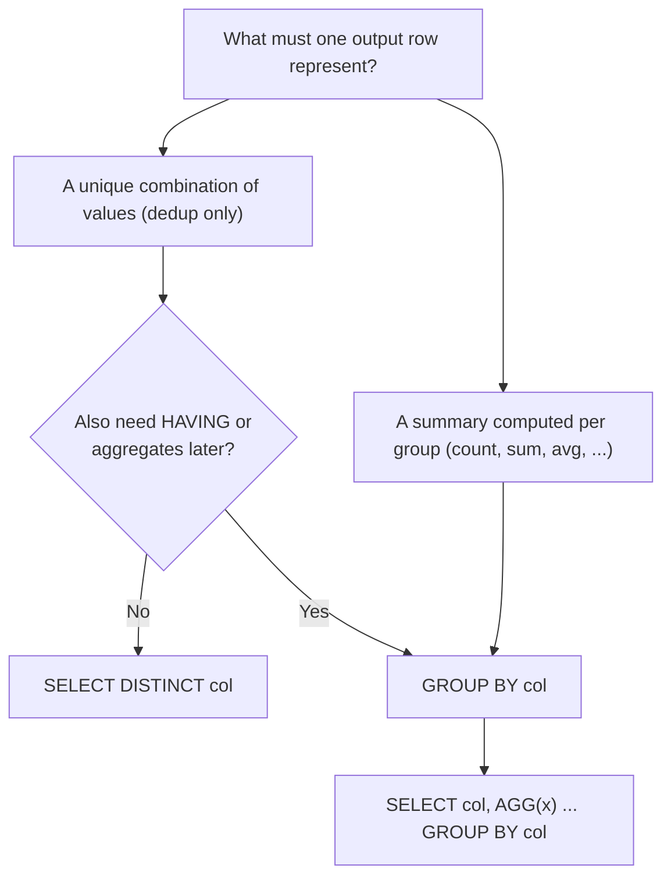

# 41 — GROUP BY vs DISTINCT

> Category: 5-Aggregation — Section: 41-GROUP-BY-vs-DISTINCT

---

## Fundamentals

### The one-paragraph answer

`GROUP BY` collapses rows into \*\*groSection 41 written to `sql-handbook/5-Aggregation/41-GROUP-BY-vs-DISTINCT.md`.

Covered: equivalence rule (`GROUP BY` == `DISTINCT` only when SELECT = GROUP BY list, no aggregates), sample tables with stated grain, NULL bucket and the `COUNT(DISTINCT)` vs grouped-`COUNT(*)` trap, execution-order internals, fan-out/double-counting via JOIN, engine-specific divergences (PostgreSQL functional dependency, MySQL `ONLY_FULL_GROUP_BY`, `DISTINCT ON`, multi-column `COUNT(DISTINCT)`), performance guidance framed around `EXPLAIN` (no absolute claims), comparison tables, a Mermaid decision diagram, BAD vs BETTER approaches, and unanswered practice questions across all 8 levels.
regate is used. The moment you add `SUM(...)`, `HAVING`, or any column outside the group key, the tools diverge completely: `GROUP BY` aggregates, `DISTINCT` cannot.

---

### The precise rule of equivalence

> `SELECT col_1, col_2, ... FROM t GROUP BY col_1, col_2, ...` produces the **same output rows** as `SELECT DISTINCT col_1, col_2, ... FROM t` — but only when the `SELECT` list is exactly the `GROUP BY` list (plus expressions of those columns) and there are no aggregates and no `HAVING`.

Every other use is different by construction:

| What you need                                                | Tool                                                                            |
| ------------------------------------------------------------ | ------------------------------------------------------------------------------- |
| Remove duplicate rows                                        | `DISTINCT`                                                                      |
| One summary per group key                                    | `GROUP BY` + aggregate                                                          |
| Filter on group-level facts (e.g. "groups with more than 3") | `GROUP BY` + `HAVING`                                                           |
| Count distinct values                                        | `COUNT(DISTINCT col)` (the one aggregate the `DISTINCT` word is allowed inside) |

---

## Syntax

### `DISTINCT`

```sql
SELECT DISTINCT column_1, column_2 [, ...]
FROM table
[WHERE ...]
[ORDER BY ...];
```

### `GROUP BY` — the "distinct-equivalent" form (no aggregate)

```sql
SELECT column_1, column_2 [, ...]
FROM table
WHERE ...
GROUP BY column_1, column_2 [, ...];
```

### `GROUP BY` — the aggregate form

```sql
SELECT group_col, AGG(other_col) AS alias
FROM table
[WHERE ...]
GROUP BY group_col
[HAVING group_condition]
[ORDER BY ...];
```

### The key grammar constraint

- `DISTINCT` appears **immediately after `SELECT`** and opens a dedup over the final projected rows.
- `GROUP BY` is a **clause at the tail** of the statement and operates on input rows _before_ the `SELECT` list is computed.
- You can combine them: `SELECT DISTINCT ... GROUP BY ...` is legal, but `DISTINCT` then only re-dedups the already-grouped rows — almost always redundant (see _Common mistakes_).

One more grammar fact: `DISTINCT` as a row-level keyword and `DISTINCT` inside `COUNT(DISTINCT x)` are **different features**. `COUNT(DISTINCT x)` is a distinct _aggregate_; it belongs to the `GROUP BY` world even though it uses the word "DISTINCT". It can appear alongside `GROUP BY`, which `SELECT DISTINCT` redundancy cannot usefully do.

---

## Sample tables (grain stated for each)

These are the same tables used in the GROUP BY section (36).

```sql
CREATE TABLE departments (
    department_id   INT PRIMARY KEY,
    department_name VARCHAR(100) NOT NULL
);

-- One row = one department
INSERT INTO departments VALUES
 (1, 'Engineering'),
 (2, 'Sales'),
 (3, 'HR');

CREATE TABLE employees (
    employee_id   INT PRIMARY KEY,
    employee_name VARCHAR(100) NOT NULL,
    department_id INT REFERENCES departments(department_id),
    salary        NUMERIC(10,2),
    is_active     BOOLEAN
);

-- One row = one employee
INSERT INTO employees VALUES
 (101, 'Alice',  1,    9000.00, TRUE),
 (102, 'Bob',    1,    8000.00, TRUE),
 (103, 'Carol',  2,    6000.00, TRUE),
 (104, 'Dave',   2,    6500.00, FALSE),
 (105, 'Eve',    3,    5000.00, TRUE),
 (106, 'Frank',  3,    NULL,    TRUE),
 (107, 'Grace',  NULL, 7000.00, TRUE);   -- no department assigned

CREATE TABLE orders (
    order_id    INT PRIMARY KEY,
    customer_id INT NOT NULL,
    order_date  DATE NOT NULL,
    status      VARCHAR(20) NOT NULL,
    total       NUMERIC(12,2) NOT NULL
);

-- One row = one order
INSERT INTO orders VALUES
 (1, 1, '2025-01-05', 'shipped',   250.00),
 (2, 1, '2025-01-20', 'cancelled',  99.00),
 (3, 2, '2025-01-12', 'shipped',   480.00),
 (4, 2, '2025-02-01', 'shipped',   120.00),
 (5, 3, '2025-02-10', 'pending',   300.00),
 (6, 3, '2025-02-15', 'shipped',    40.00);

CREATE TABLE order_items (
    order_item_id INT PRIMARY KEY,
    order_id      INT NOT NULL REFERENCES orders(order_id),
    product_id    INT NOT NULL,
    quantity      INT NOT NULL,
    unit_price    NUMERIC(10,2) NOT NULL
);

-- One row = one line item of an order. Orders appear many times here.
INSERT INTO order_items VALUES
 (1, 1, 10, 2,  50.00),
 (2, 1, 11, 3,  50.00),
 (3, 3, 12, 1, 480.00),
 (4, 4, 10, 4,  30.00),
 (5, 5, 13, 5,  60.00),
 (6, 6, 14, 2,  20.00);
```

---

## The two tools by example

### Example 1 — identical output (dedup only)

```sql
SELECT DISTINCT department_id
FROM employees
ORDER BY department_id;
```

| department_id |
| ------------- |
| 1             |
| 2             |
| 3             |
| NULL          |

```sql
SELECT department_id
FROM employees
GROUP BY department_id
ORDER BY department_id;
```

Same result — the four buckets `{1}, {2}, {3}, {NULL}`. `Grace`'s NULL forms its own bucket in **both** tools.

### Example 2 — identical with a composite key

```sql
SELECT DISTINCT department_id, is_active
FROM employees
ORDER BY department_id, is_active;

SELECT department_id, is_active
FROM employees
GROUP BY department_id, is_active
ORDER BY department_id, is_active;
```

Employees yield the value pairs `(1,T),(1,T),(2,T),(2,F),(3,T),(3,T),(NULL,T)`, so **both** return:

| department_id | is_active |
| ------------- | --------- |
| 1             | TRUE      |
| 2             | FALSE     |
| 2             | TRUE      |
| 3             | TRUE      |
| NULL          | TRUE      |

5 rows. Note how the _composite_ key keeps `(2,FALSE)` and `(2,TRUE)` as separate rows — neither tool collapses across the pair.

### Example 3 — where they diverge: aggregation

```sql
-- DISTINCT cannot answer this:
SELECT DISTINCT department_id, COUNT(*)
FROM employees;
-- ERROR: column "employees.department_id" must appear in the GROUP BY clause

-- GROUP BY answers it:
SELECT department_id, COUNT(*) AS headcount
FROM employees
GROUP BY department_id
ORDER BY department_id;
```

| department_id | headcount |
| ------------- | --------- |
| 1             | 2         |
| 2             | 2         |
| 3             | 2         |
| NULL          | 1         |

This is the crux: `DISTINCT` removes duplicate rows; it has no way to compute a summary **within** a bucket.

### Example 4 — the redundant combination

```sql
-- BAD APPROACH: DISTINCT after GROUP BY is pure noise
SELECT DISTINCT department_id, COUNT(*) AS headcount
FROM employees
GROUP BY department_id;

-- BETTER APPROACH: identical output, no wasted dedup pass
SELECT department_id, COUNT(*) AS headcount
FROM employees
GROUP BY department_id;
```

The grouped result already has one row per `department_id`, so `DISTINCT` has nothing to remove. The optimizer may or may not elide it — don't rely on that; just don't write it.

---

## Where the results genuinely differ

| Situation                                                                       | `DISTINCT`            | `GROUP BY`                                                       |
| ------------------------------------------------------------------------------- | --------------------- | ---------------------------------------------------------------- |
| `SUM`/`AVG`/`MIN`/`MAX`/`COUNT(*)` per group                                    | Impossible            | The whole point                                                  |
| Filtering groups (`HAVING COUNT(*) > 1`)                                        | Impossible            | Native                                                           |
| Selecting a column **not** in the dedup key (`SELECT b FROM t` deduping by `a`) | Impossible standardly | Error in strict engines; MySQL may allow arbitrarily (see below) |
| `SELECT DISTINCT a, b` vs `SELECT a, b GROUP BY a, b`                           | Same rows             | Same rows                                                        |
| `SELECT a GROUP BY a` vs `SELECT DISTINCT a`                                    | Same rows             | Same rows                                                        |

The two _only_ overlap on the bottom rows of that table — pure dedup.

---

## NULL behavior

NULL under `DISTINCT` and `GROUP BY` follows the same general rule: **all NULLs are one bucket.**

1. `SELECT DISTINCT department_id` returns exactly one NULL row (all-NULL collapses to one).
2. `GROUP BY department_id` forms exactly one NULL group.

The divergence is hiding where you'd never expect it: **counting**.

### The `COUNT(DISTINCT ...)` NULL trap

```sql
SELECT COUNT(DISTINCT department_id) AS depts_that_exist FROM employees;
-- 3  (NULL excluded: NULL is "unknown", not a value)

SELECT COUNT(*) AS group_buckets
FROM (
    SELECT department_id
    FROM employees
    GROUP BY department_id
) t;
-- 4  (the GROUP BY subquery includes the NULL bucket)
```

> Interview trap: "`COUNT(DISTINCT col)` and `COUNT(*)` over `GROUP BY col` are the same, right?" No. `COUNT(DISTINCT col)` **ignores NULL** (see section 39), while a `GROUP BY` _does_ create a NULL group. So they differ exactly by whether the NULL bucket counts.

If you need "distinct values _including_ NULL": use the subquery form. If you need "distinct known values": `COUNT(DISTINCT col)`.

### NULL as a group key vs distinct key

| Query form                     | NULL handling      |
| ------------------------------ | ------------------ |
| `SELECT DISTINCT col`          | one NULL row       |
| `SELECT col ... GROUP BY col`  | one NULL group     |
| `COUNT(DISTINCT col)`          | NULLs ignored      |
| `COUNT(*)` over `GROUP BY col` | NULL group counted |

> PostgreSQL / MySQL / SQL Server / Oracle
>
> All four engines treat all NULLs as a single bucket for both `DISTINCT` and `GROUP BY`. Behavior only differs for `COUNT(DISTINCT ...)` (all ignore NULLs) and for sorting NULLs (PostgreSQL: NULLS LAST by default on ASC; Oracle: NULLS LAST on ASC... actually Oracle treats NULL as largest so NULLS LAST on ASC; SQL Server/MySQL: NULL sorts first in ASC). If you want deterministic ordering of the NULL row, add `ORDER BY col NULLS LAST` (PostgreSQL/Oracle) or `ORDER BY ISNULL(col), col` patterns elsewhere.

### Normalizing NULL before dedup

```sql
-- Both forms now return the same normalized values (no NULL row):
SELECT DISTINCT COALESCE(department_id, -1) AS dept_id FROM employees;
SELECT COALESCE(department_id, -1) AS dept_id FROM employees
GROUP BY COALESCE(department_id, -1);
```

Note the `GROUP BY` must repeat the same expression you select.

---

## Internal working

### Where each sits in the logical execution order

```
FROM  →  WHERE  →  GROUP BY  →  HAVING  →  SELECT (incl. DISTINCT)  →  ORDER BY
```

- `GROUP BY` collapses **input rows** into groups, then aggregates run per group.
- `DISTINCT` dedups the **final projected rows** — i.e., _after_ `GROUP BY`, _after_ aggregates, at the same level as `SELECT`.

This ordering is why `SELECT DISTINCT a, COUNT(*) ... GROUP BY a` is legal but pointless, and why `DISTINCT` can _never_ hide double counting that lives inside the aggregate computation — the aggregate is finished before `DISTINCT` runs.

### How the engine does the work (conceptually)

Both effects are implemented with the same two families of algorithms:

| Algorithm      | What it does                                          | Typical node names in plans                                                                      |
| -------------- | ----------------------------------------------------- | ------------------------------------------------------------------------------------------------ |
| **Hash-based** | Build a hash table keyed by the distinct/group values | `HashAggregate` (PostgreSQL), `HASH GROUP BY` / `HASH UNIQUE` (Oracle)                           |
| **Sort-based** | Sort by the key, then collapse adjacent equal rows    | `Sort + Unique`, `GroupAggregate` (PostgreSQL), `Distinct Sort`, `Stream Aggregate` (SQL Server) |

Because both tools reduce a set of rows down to one row per **key value**, the database often reuses the _same_ operator for both:

- PostgreSQL may plan `SELECT DISTINCT col` and `SELECT col ... GROUP BY col` as the same `HashAggregate` node.
- SQL Server often plans both through an `Aggregate`/`Distinct` stream node.

> Common misconception: "The engine always treats DISTINCT and GROUP BY differently." Modern optimizers frequently rewrite plain `DISTINCT` into a `GROUP BY`-shaped plan, and `GROUP BY` without aggregates into a distinct-style plan. Whether it happens depends on version, statistics, indexes, and cost model — verify with `EXPLAIN`, don't assume.



---

## Scenario-based examples

### Scenario 1 — "Which products have ever been ordered?" (dedup intent)

Grain of output: one row per distinct product id.

```sql
SELECT DISTINCT product_id
FROM order_items
ORDER BY product_id;
```

Using `GROUP BY` instead is legal but communicates the wrong intent:

```sql
-- Works, but implies aggregation where none is planned
SELECT product_id
FROM order_items
GROUP BY product_id;
```

Both return `10, 11, 12, 13, 14`.

> Best practice: when the answer is genuinely "the set of unique values", `DISTINCT` is the more honest statement. When there is any chance the analyst will need counts/sums in the same query, `GROUP BY` grows naturally.

### Scenario 2 — "Revenue per customer" (aggregation intent — DISTINCT is impossible)

```sql
SELECT customer_id, SUM(total) AS revenue
FROM orders
WHERE status = 'shipped'
GROUP BY customer_id
ORDER BY customer_id;
```

| customer_id | revenue |
| ----------- | ------- |
| 1           | 250.00  |
| 2           | 600.00  |
| 3           | 40.00   |

There is no `DISTINCT`-only formulation for this. Anyone who tries to "make it distinct" has already lost the plot.

### Scenario 3 — "How many customers have shipped orders?" two correct spellings

```sql
-- Spelling A: distinct aggregate
SELECT COUNT(DISTINCT customer_id) AS customers
FROM orders
WHERE status = 'shipped';
-- 3

-- Spelling B: count the groups
SELECT COUNT(*) AS customers
FROM (
    SELECT customer_id
    FROM orders
    WHERE status = 'shipped'
    GROUP BY customer_id
) t;
-- 3
```

Same answer here (no NULL `customer_id` in `orders`). The two spellings diverge only if NULLs are present — see the NULL trap above.

### Scenario 4 — daily active users, distinct vs grouped per day

```sql
-- "Which day had the most distinct users?"
SELECT DATE(occurred_at::DATE) AS day,
       COUNT(DISTINCT user_id) AS active_users
FROM events
WHERE event_type = 'login'
GROUP BY DATE(occurred_at::DATE);
```

The outer `GROUP BY` slices rows **per day**; the inner `COUNT(DISTINCT user_id)` dedups **within the day**. This is the canonical example of `DISTINCT` and `GROUP BY` working together — not competing. See also section 36 scenario for the two-step `GROUP BY (day, user_id)` form:

```sql
SELECT day, COUNT(*) AS active_users
FROM (
    SELECT DATE(occurred_at) AS day, user_id
    FROM events
    WHERE event_type = 'login'
    GROUP BY DATE(occurred_at), user_id
) t
GROUP BY day;
```

Both spellings answer the same question; the `COUNT(DISTINCT ...)` form is usually clearer.

### Scenario 5 — "Departments with more than one employee" (GROUP BY + HAVING; DISTINCT cannot)

```sql
SELECT department_id, COUNT(*) AS headcount
FROM employees
WHERE department_id IS NOT NULL
GROUP BY department_id
HAVING COUNT(*) > 1;
```

| department_id | headcount |
| ------------- | --------- |
| 1             | 2         |
| 2             | 2         |

`DISTINCT` cannot filter groups by their size. Full `HAVING` details: section 37.

### Scenario 6 — customer × status pairs (composite dedup)

```sql
SELECT DISTINCT customer_id, status
FROM orders
ORDER BY customer_id, status;
```

| customer_id | status    |
| ----------- | --------- |
| 1           | cancelled |
| 1           | shipped   |
| 2           | shipped   |
| 3           | pending   |
| 3           | shipped   |

Same output via `SELECT customer_id, status ... GROUP BY customer_id, status`. Note `customer 2` has only `shipped` (two such orders collapse into one row) — the dedup is on the _pair_.

---

## GROUP BY vs DISTINCT across a JOIN — fan-out and double counting

This is where interview questions and production bugs live. Both tools **silently dedup** the rows a join produces, but neither fixes an aggregation.

### Dedup across a fan-out

`order_items` has 6 line items; join to `orders`:

```sql
SELECT DISTINCT o.customer_id
FROM orders o
JOIN order_items oi ON oi.order_id = o.order_id
WHERE o.status = 'shipped';
```

Order 1 belongs to customer 1 and has **2** line items, so customer 1 appears twice in the join result; `DISTINCT` collapses it. Both `DISTINCT` and `GROUP BY o.customer_id` return `{1, 2, 3}`.

> Production pitfall: this "works" and hides the fan-out. `DISTINCT` (or a no-aggregate `GROUP BY`) masks a join that duplicated rows. If the row count was _supposed_ to be one per customer, the join is defective — de-duplicating at the end is treating the symptom. Prefer `EXISTS` when you only need existence (see sections 24 and 30).

### Aggregation across a fan-out — the danger of "just make it distinct"

```sql
-- BAD APPROACH: fan-out double-counts o.total, and DISTINCT cannot help
SELECT o.customer_id, SUM(o.total) AS revenue
FROM orders o
JOIN order_items oi ON oi.order_id = o.order_id
WHERE o.status = 'shipped'
GROUP BY o.customer_id;
```

| customer_id | revenue                                                 |
| ----------- | ------------------------------------------------------- |
| 1           | 500.00 ← WRONG (order total counted once per line item) |
| 2           | 600.00                                                  |
| 3           | 40.00                                                   |

Customer 1's single order of 250.00 is added twice because order 1 has two line items. The value **should be 250.00**.

```sql
-- BETTER APPROACH: don't pull order_items at all; total lives at order grain
SELECT customer_id, SUM(total) AS revenue
FROM orders
WHERE status = 'shipped'
GROUP BY customer_id;
```

| customer_id | revenue |
| ----------- | ------- |
| 1           | 250.00  |
| 2           | 600.00  |
| 3           | 40.00   |

If you really need line-item columns too, aggregate the child table to the parent grain _first_ (CTE/subquery), then join — the fix from sections 21 and 36.

> Interview trap: "Fix this with `DISTINCT`." You can't. `DISTINCT` removes duplicate rows; the aggregate was already computed on the duplicated rows, so the wrong number is already burned in. The fix is the grain, not a dedup.

---

## Common mistakes

| Mistake                                             | Why it bites                                                                                                 |
| --------------------------------------------------- | ------------------------------------------------------------------------------------------------------------ |
| Believing `GROUP BY` removes duplicates             | No — it groups; without aggregates it overlaps with `DISTINCT`, but that's a coincidence of the SELECT shape |
| Using `SELECT DISTINCT` to "fix" an aggregate query | Aggregates run before `DISTINCT`; wrong totals stay wrong                                                    |
| `SELECT DISTINCT dept, COUNT(*)` without `GROUP BY` | Syntax error                                                                                                 |
| `SELECT DISTINCT dept, COUNT(*) ... GROUP BY dept`  | Legal but the `DISTINCT` is dead weight                                                                      |
| `COUNT(DISTINCT col)` vs `COUNT(*)` over the groups | Differ by one exactly when NULLs exist                                                                       |
| Grouping by fewer columns than you dedup by         | `GROUP BY a` and `DISTINCT a` are equivalent, but `GROUP BY a, b` ≠ `DISTINCT a` — different grains          |
| Assuming either tool orders output                  | Neither orders anything; add `ORDER BY`                                                                      |
| Using `DISTINCT` to hide a fan-out join             | Masks the bug, keeps the cost, and only "works" in no-aggregate queries                                      |
| `SELECT DISTINCT *` on a table with a unique key    | No-op that still spends a distinct pass                                                                      |

---

## Edge cases

### 1. Empty input

```sql
SELECT DISTINCT department_id FROM employees WHERE 1 = 0;      -- 0 rows
SELECT department_id FROM employees WHERE 1 = 0 GROUP BY department_id;  -- 0 rows
```

Both return zero rows — no groups, no distinct values. But note:

```sql
SELECT COUNT(*) FROM employees WHERE 1 = 0;   -- 1 row: 0
```

A bare aggregate _without_ `GROUP BY` is one conceptual group even over zero rows. With `GROUP BY`, zero groups → zero output rows. This is a classic "why is my dashboard empty for January?" gotcha (forces of sparse calendars: section 36).

### 2. Grouping/dedup on an expression

Both support expressions:

```sql
SELECT DISTINCT DATE(order_date) FROM orders;
SELECT DATE(order_date) FROM orders GROUP BY DATE(order_date);
```

Identical output. Keep the `SELECT` and `GROUP BY` expressions byte-identical to avoid engine-specific mismatches.

### 3. `GROUP BY` ordinals vs `DISTINCT`

```sql
SELECT department_id, is_active FROM employees GROUP BY 1, 2;   -- valid in most engines
```

Ordinals (`GROUP BY 1,2`) have no `DISTINCT` analogue. They're fragile if the SELECT list changes — prefer named columns.

### 4. Selected columns that are not the group key

> PostgreSQL
>
> Functional dependency: grouping by a table's primary key lets you also select other columns of that table, because they're functionally dependent on the key.

```sql
SELECT o.order_id, o.customer_id, COUNT(*) AS line_count
FROM orders o
JOIN order_items oi ON oi.order_id = o.order_id
GROUP BY o.order_id;      -- valid in PostgreSQL: customer_id depends on order_id
```

`DISTINCT` has no such concept. Other strict engines (SQL Server, MySQL with `ONLY_FULL_GROUP_BY`) reject this.

> MySQL
>
> Without `ONLY_FULL_GROUP_BY`, `SELECT employee_name, department_id ... GROUP BY department_id` is allowed and returns an **arbitrary** `employee_name` per department — non-deterministic. `DISTINCT` can never do this. Set `ONLY_FULL_GROUP_BY`.

### 5. `DISTINCT` and expression order in `ORDER BY`

`SELECT DISTINCT department_id FROM employees ORDER BY salary;` — engines differ: MySQL historically allows it; PostgreSQL/SQL Server/Oracle reject it (multiple salaries map to one department — no single sort value). `GROUP BY` with a non-grouped `ORDER BY` expression has equivalent restrictions. See section 40 for the full treatment.

### 6. `DISTINCT ON` — a PostgreSQL-only cousin

> PostgreSQL
>
> `SELECT DISTINCT ON (a) ... ORDER BY a, b` returns one row per **a**, keeping the whole chosen row (the first per sort order). Standard `DISTINCT` and `GROUP BY` cannot do this without a window function (`ROW_NUMBER()` pattern — sections 53/54). `DISTINCT ON` needs a matching `ORDER BY`, so it behaves like a per-group pick, not a dedup.

### 7. Collation and whitespace

Both `DISTINCT` and `GROUP BY` key on the column's collation. `'Widget'` and `'widget'` may collapse together in a case-insensitive collation (typical MySQL default) or stay separate in a case-sensitive one (typical PostgreSQL default). Identical behavior in both tools — that's never the point of divergence. Normalize with `LOWER()`/`TRIM()`.

### 8. Multi-column `COUNT(DISTINCT ...)` — the engines disagree

> PostgreSQL / Oracle: `COUNT(DISTINCT a, b)` supported.
> SQL Server: use `SELECT COUNT(*) FROM (SELECT DISTINCT a, b FROM t) s;`
> MySQL: `COUNT(DISTINCT a, b)` supported in recent versions.

See section 40 for the full matrix.

---

## Performance implications

Do not trust folklore here. The honest position:

1. **For pure dedup**, `SELECT DISTINCT cols` and `SELECT cols ... GROUP BY cols` usually reduce to the same operator and can have **near-identical plans**. Some engines actively rewrite one into the other. Neither is "always faster".

2. **When you need aggregation**, `GROUP BY` is mandatory — there is no performance _choice_, so oracle debates only matter for the no-aggregate case.

3. Both cost centers are the same: a **hash table** (memory) or a **sort** (CPU + I/O) over the whole intermediate result. The decisive factors are key width, cardinality, memory settings (`work_mem` / `sort_buffer_size`), statistics, and whether an index can supply pre-sorted or compact key streams.

### What to verify with an execution plan

```sql
EXPLAIN ANALYZE
SELECT DISTINCT customer_id FROM orders;

EXPLAIN ANALYZE
SELECT customer_id FROM orders GROUP BY customer_id;
```

Compare the plan node shapes:

- Same node type (e.g., `HashAggregate` for both in PostgreSQL) → they are the same query, stop optimizing.
- Different nodes (e.g., `Unique` after an index scan vs a guessed `GroupAggregate`) → let actual rows/cost decide, and check which respects the index.
- Watch for `Sort` nodes: an index already ordered by the key can remove them; a `GROUP BY DATE(col)` or `GROUP BY` an expression usually cannot use a plain index on `col` directly (non-sargable for grouping order) — see the index and sargability sections (72–77).

> PostgreSQL example (what to look for): `Unique` + `Index Only Scan` on `(customer_id)` is a cheap distinct; a `Sort` + `Unique` on an unindexed column is the expensive one. A `HashAggregate` may beat the sort despite wider memory use. Size of "actual rows" vs "estimated rows" exposes stale statistics (`ANALYZE`).

### When plans diverge — a few engine-specific examples (verify, don't assume)

- **PostgreSQL**: `DISTINCT` is commonly planned as `HashAggregate`; `GROUP BY` as `HashAggregate` or `GroupAggregate` (the latter prefers pre-sorted input). For no-aggregate queries both usually look the same.
- **SQL Server**: `DISTINCT` may produce a `Distinct Sort`; `GROUP BY` a `Stream Aggregate`. A pre-sorted index can remove the sort.
- **MySQL**: both typically build a temp table; with a suitable index and low-cardinality leading columns, a **Loose Index Scan** may answer `GROUP BY`/`DISTINCT` without visiting every row (an optimization PostgreSQL lacks without an index skip-scan strategy).
- **Oracle**: `SORT UNIQUE` / `HASH UNIQUE` for `DISTINCT`; `SORT GROUP BY` / `HASH GROUP BY` for `GROUP BY`.

### Distinct counts are the expensive special case

`COUNT(DISTINCT col)` (especially `COUNT(DISTINCT a, b)`) forces the engine to build a per-item distinct set before counting. It is typically far heavier than `COUNT(*)` or `GROUP BY` + `COUNT(*)`, and exact distinct counts over huge tables can spill to disk. Approximate alternatives exist but trade exactness (e.g., SQL Server 2019+ `APPROX_COUNT_DISTINCT`, BigQuery `APPROX_COUNT_DISTINCT`). Check the plan; forcing exactness on a 100M-row table is a real cost, not a style choice. See sections 38/39.

---

## Comparison table

| Aspect           | `DISTINCT`                                | `GROUP BY` (no aggregate)                                      | `GROUP BY` (with aggregate)   |
| ---------------- | ----------------------------------------- | -------------------------------------------------------------- | ----------------------------- |
| Purpose          | remove duplicate rows                     | group rows; (accidentally) dedups when SELECT = GROUP BY       | compute one summary per group |
| Aggregates       | not allowed (`COUNT(DISTINCT ...)` aside) | not used                                                       | core feature                  |
| `HAVING` filter  | impossible                                | possible but pointless without aggregates                      | the intended partner          |
| Output grain     | distinct projected row                    | distinct grouping key (must cover all selected non-aggregates) | one row per group key         |
| SELECT-list rule | whole list is the key                     | every non-aggregate must be in `GROUP BY`                      | same                          |
| Reads as intent  | "unique values"                           | ambiguous                                                      | "summarize per key"           |
| Redundancy risk  | `DISTINCT` on grouped rows is no-op       | no-aggregate `GROUP BY` is often a `DISTINCT` in disguise      | none                          |

---

## Best practices

1. **Decide the output grain first.** "One row per distinct product" → `DISTINCT`. "One row per department with its total salary" → `GROUP BY`.
2. **Pick by intent, then by plan.** Prefer `DISTINCT` for pure dedup (clearer), `GROUP BY` when aggregation/`HAVING` is on the roadmap. Then `EXPLAIN` the hot ones.
3. **Never use `DISTINCT` to mask a junction/join fan-out.** Fix the grain instead (`EXISTS`, pre-aggregate, correct join key).
4. **Remember `COUNT(DISTINCT col)` drops NULLs** while a `GROUP BY` keeps the NULL bucket. Choose with intent.
5. **When grouping, mirror the `SELECT` expression in `GROUP BY`** byte-for-byte.
6. **Drop redundant `DISTINCT`** sitting on top of a `GROUP BY`.
7. **Watch aggregation order across grains:** aggregate the child table first, then join — ahead of any DISTINCT/GROUP BY question.
8. **Check `EXPLAIN`** before believing anyone's "always faster" claim about either keyword.

---

## Cross-references

- `GROUP BY` deep dive — section 36
- `HAVING` — section 37
- `COUNT(*)` vs `COUNT(col)` vs `COUNT(DISTINCT col)` — sections 38 and 39
- `DISTINCT` deep dive (JOIN masking, `DISTINCT ON`, windows) — section 40
- Fan-out and double counting on joins — section 21
- `EXISTS` when you only need existence — sections 24 and 30
- Window functions vs GROUP BY ("summary next to detail rows") — section 56
- `UNION` (the set operator that dedups) vs `UNION ALL` — section 65
- `EXPLAIN` / execution plans — section 78
- Indexes, composite, covering, sargability — sections 72–77

---

# Interview Questions

## Beginner

1. When does `SELECT DISTINCT a FROM t` return exactly the same rows as `SELECT a FROM t GROUP BY a`?
2. Can `DISTINCT` compute a `COUNT` or `SUM` per group? What would you use instead?
3. Write both a `DISTINCT` and `GROUP BY` query that produce one row per distinct `status` in the orders table.
4. Does `SELECT DISTINCT department_id` include a NULL row? Why?
5. What is wrong with `SELECT DISTINCT department_id, COUNT(*) FROM employees;` and how do you fix it?

## Intermediate

6. `SELECT DISTINCT customer_id, status` vs `SELECT customer_id, status ... GROUP BY customer_id, status` — same output? Explain the grain of each result.
7. Compare `SELECT COUNT(DISTINCT department_id)` and `SELECT COUNT(*) FROM (SELECT department_id FROM employees GROUP BY department_id) t;` using the sample data. What do they return and why do they differ?
8. When is `SELECT DISTINCT a, COUNT(*) ... GROUP BY a` redundant? Prove the two forms return identical rows.
9. Someone dedups a join with `DISTINCT` and the numbers "look right". Why is that dangerous for an aggregate report?
10. Convert a `GROUP BY` query that needs a `HAVING COUNT(*) > 1` filter into a form using a subquery, so the final result needs no `HAVING`. Compare the two.

## Advanced

11. In PostgreSQL, why can `SELECT o.customer_id ... GROUP BY o.order_id` be valid while the same shape fails in SQL Server?
12. Explain how the optimizer could answer `SELECT DISTINCT col` with a `HashAggregate`, and `SELECT col ... GROUP BY col` with a `GroupAggregate`. What decides which node appears?
13. When would `GROUP BY` with no aggregate be a deliberate, justified choice rather than a `DISTINCT` in disguise?
14. `COUNT(DISTINCT a, b)` is supported in PostgreSQL/Oracle but not in SQL Server. Write the portable equivalent and explain when the two formulations give different estimates.
15. How do cardinality and memory settings change whether a `Sort + Unique` or a `HashAggregate` wins for a dedup query — and what do you check in the plan?

## Scenario Based

16. `events(event_id, user_id, event_type, ts)` — grain = one event. Write one query returning the top 5 days by distinct active users, and a second that uses only `GROUP BY` (no `COUNT(DISTINCT)`) to compute the same numbers. Do they match?
17. Orders plus `order_items`: report revenue and distinct product count per customer without double counting order totals.
18. A support dashboard needs "all distinct customers that placed a shipped order, plus their total shipped spend". Show why you need both `DISTINCT`-style logic and `GROUP BY` — can one tool do both?

## Tricky

19. `SELECT DISTINCT NULL;` returns how many rows? Contrast with `SELECT COUNT(DISTINCT NULL);`. Then explain what `GROUP BY NULL` would produce.
20. `SELECT DISTINCT department_id FROM employees ORDER BY salary;` — predict behavior in PostgreSQL and MySQL, and explain the reasoning difference.
21. The sample data: `SELECT DISTINCT department_id, is_active` against `GROUP BY department_id, is_active` — walk through every employee row and show how buckets form, including the NULL department.
22. After a group-by query, an analyst adds `DISTINCT` "to be safe". It changes nothing. Explain precisely why at the execution-order level.

## Output Prediction

23. Given the sample `employees`, write down the exact output (rows and columns) of:

```sql
SELECT department_id, COUNT(*) AS n
FROM employees
GROUP BY department_id
ORDER BY department_id;
```

24. Predict the output (row count and values) of:

```sql
SELECT COUNT(DISTINCT department_id)          AS a,
       COUNT(*)                               AS b
FROM employees;
```

25. Predict the output of:

```sql
SELECT DISTINCT o.customer_id
FROM orders o
JOIN order_items oi ON oi.order_id = o.order_id
WHERE o.status = 'shipped'
ORDER BY o.customer_id;
```

Then predict what happens if you delete the `DISTINCT`.

26. What does this return, and is the `DISTINCT` doing anything?

```sql
SELECT DISTINCT status, COUNT(*) AS cnt
FROM orders
GROUP BY status;
```

## Debugging

27. A query joins `orders` to `order_items`, groups by `customer_id`, and reports `SUM(o.total)` doubled for customer 1. Someone adds `SELECT DISTINCT`. Walk through why the number is still wrong and give the correct fix.
28. A report shows "3 distinct departments" but the raw table clearly has 4 including unassigned employees. Both `SELECT DISTINCT department_id` and the grouped count are used somewhere. Find the discrepancy.
29. Two analysts run `SELECT DISTINCT category FROM products;` and get different row counts in a case-insensitive vs case-sensitive environment. Explain, and show the normalization fix.

## Performance

30. A colleague claims "`DISTINCT` is always faster than `GROUP BY`." Design the `EXPLAIN` comparison that would settle it on your engine, and state what plan differences would be decisive.
31. `SELECT DISTINCT col` on a 50M-row table spills to disk. List the things you would check (index, statistics, memory settings, cardinality, alternate `GROUP BY` form) before changing the query.
32. Why is `GROUP BY` kind of a natural fit for an index on the grouping columns, while `GROUP BY DATE(created_at)` almost never is? What schema change could fix the latter, and how would you verify?
33. `COUNT(DISTINCT department_id)` in PostgreSQL may produce a single `HashAggregate` — but `COUNT(DISTINCT a, b)` over a large table is regularly much slower. Explain the extra work and what approximation options trade correctness for cost.

_(Questions 23–33 are practice — reason them out against the sample tables and an actual `EXPLAIN` before peeking at results.)_
