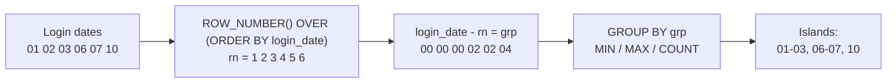

# 55 — Gaps and Islands

## What It Is

"Gaps and Islands" is a family of problems about \*\*consecuThe file exists but is empty, and I've reviewed the conventions of the sibling section. Now I'll write the comprehensive Gaps and Islands section.
Let me verify the file integrity — balanced code fences and structure.
Section `55-Gaps-and-Islands.md` is complete (904 lines). Coverage:

- **Fundamentals** — gap/island vocabulary, the "two counters, constant difference" core insight, grain rules, decision flowchart
- **4 techniques** — ROW_NUMBER subtraction, LAG neighbor check, running-SUM flag for categorical/state islands, and gap detection (numbers table + `generate_series`/`EXCEPT`)
- **Sample tables** — `user_logins`, `seq_numbers`, `team_games` with stated grain, plus duplicates and NULLs baked in deliberately
- **Scenarios** — streaks, price validity merging, hotel availability, churn recapture; BAD vs BETTER pairs throughout
- **NULL behavior, 8 edge cases, 8 mistakes, 6 production pitfalls**
- **Dialect table** — `DATEADD`/`DATE_SUB`/`-rn`/interval arithmetic for PG/MySQL/SQL Server/Oracle; DST and month-end warnings
- **Performance** — plan-sign tables, sort-elimination index, no absolute claims, `EXPLAIN ANALYZE` guidance
- **34 interview questions** across Beginner → Performance, answers withheld; cross-references to sections 44, 46, 48, 49, 73, 78, and NULL/aggregation sections.
  cutive rows together" sounds like it should need procedural code — a cursor, a loop, or application-side processing. SQL is set-based, so early attempts were either:

- **Barely correct:** self-joins that explode combinatorially.
- **Fragile:** relying on `IDENTITY`/`AUTO_INCREMENT` gaps being absent.
- **Non-portable:** engine-specific tricks.

Window functions (Section 44) make gaps-and-islands **clean, set-based, and fast** because they let each row "peek" at its neighbors (`LAG`/`LEAD`, Section 48) or carry a running counter (`SUM(...) OVER`, Section 49) — the two ingredients every technique here needs.

---

## Vocabulary and Mental Model

| Term                      | Meaning                                                                                 | Example (dates)                        |
| ------------------------- | --------------------------------------------------------------------------------------- | -------------------------------------- |
| **Island**                | A maximal consecutive sequence with no missing member                                   | `2024-01-06` → `2024-01-07`            |
| **Gap**                   | The missing stretch between two islands                                                 | `2024-01-04` → `2024-01-05`            |
| **Island key / group id** | A value that is identical for all rows of one island and different for any other island | `grp` in the queries below             |
| **Neighbor test**         | Whether the previous (or next) element is exactly one unit away                         | `login_date - LAG(login_date) = 1 day` |

> **Critical framing:** "Consecutive" is relative to an **ordering column with a defined step** — dates step in days; integers step in `1`; months step in months. If your data has no natural step (e.g., unordered events with timestamps), you must decide what "one unit" means _before_ writing any query.

**Ground rule for every gaps-and-islands query:**

1. State the grain of the source table.
2. State the ordering column and its step unit.
3. Decide whether you want islands, gaps, or both.
4. Choose a technique (below) and verify with the execution plan.

---

## The Core Insight — Why "subtract ROW_NUMBER" Works

Number the rows in order of the sequence. Inside an island, **both** the value and the row number increase by exactly one per row, so their difference is constant.

```
value:   1  2  3  5  6  7  9
rn:      1  2  3  4  5  6  7
diff:    0  0  0  1  1  1  2      <- islands share the same diff
```

Group by the difference, and you have your islands.

The same logic applies to dates using date arithmetic:

```
login_date:  01  02  03  06  07  10
rn:           1   2   3   4   5   6
date - rn:  00  00  00  02  02  04   <- island id per user
```

> **Why this is elegant:** one window function + one `GROUP BY` replaces dozens of lines of procedural logic. It is the default answer to most island questions.

---

## Sample Tables

We use three tables throughout this section. Always state the grain first.

### user_logins

Grain: **one row = one user logging in on one day.** A user can appear on many days, but not twice on the same day.

| login_id | user_id | login_date |
| -------- | ------- | ---------- | --------------------------------- |
| 1        | 100     | 2024-01-01 |
| 2        | 100     | 2024-01-02 |
| 3        | 100     | 2024-01-03 |
| 4        | 100     | 2024-01-06 |
| 5        | 100     | 2024-01-07 |
| 6        | 100     | 2024-01-10 |
| 7        | 101     | 2024-01-01 |
| 8        | 101     | 2024-01-02 |
| 9        | 101     | 2024-01-05 |
| 10       | 102     | 2024-01-03 |
| 11       | 100     | 2024-01-03 | (duplicate — see Common Mistakes) |
| 12       | 100     | NULL       | (NULL — see NULL Behavior)        |

### seq_numbers

Grain: **one row = one positive integer.**

| n   |
| --- |
| 1   |
| 2   |
| 3   |
| 5   |
| 6   |
| 7   |
| 9   |

### team_games

Grain: **one row = one game for one team, in chronological order.**

| game_id | team   | opponent | result | played_on  |
| ------- | ------ | -------- | ------ | ---------- |
| 1       | Wolves | Lions    | W      | 2024-03-01 |
| 2       | Wolves | Bears    | W      | 2024-03-05 |
| 3       | Wolves | Cats     | L      | 2024-03-10 |
| 4       | Wolves | Owls     | W      | 2024-03-15 |
| 5       | Wolves | Seals    | W      | 2024-03-20 |
| 6       | Wolves | Foxes    | W      | 2024-03-25 |
| 7       | Lions  | Rams     | L      | 2024-03-02 |
| 8       | Lions  | Hawks    | L      | 2024-03-08 |

---

## Technique 1 — ROW_NUMBER Subtraction (Classic, Default)

### Syntax

```sql
WITH numbered AS (
    SELECT
        login_date,
        login_date - ROW_NUMBER() OVER (ORDER BY login_date) AS grp
    FROM user_logins
    WHERE user_id = 100
      AND login_date IS NOT NULL
)
SELECT
    MIN(login_date) AS island_start,
    MAX(login_date) AS island_end,
    COUNT(*)        AS days_in_island
FROM numbered
GROUP BY grp
ORDER BY island_start;
```

### Expected Output

| island_start | island_end | days_in_island |
| ------------ | ---------- | -------------- |
| 2024-01-01   | 2024-01-03 | 3              |
| 2024-01-06   | 2024-01-07 | 2              |
| 2024-01-10   | 2024-01-10 | 1              |

### How It Works Step by Step



1. Sort the rows by the sequence column and number them.
2. For each row compute `sequence_value - rn`.
3. Inside an island the difference is constant; at every gap it changes.
4. `GROUP BY grp` collapses each island into one summary row.

### BAD vs BETTER — The Naive Self-Join

**BAD APPROACH — "pair every row with every later row" explodes:**

```sql
-- For each row, find the last row in its island by joining to all rows after it.
-- O(n²) rows produced by the join; wrong on tied values; deeply confusing.
SELECT a.login_date AS island_start, MIN(b.login_date) AS island_end
FROM user_logins a
JOIN user_logins b
  ON b.login_date >= a.login_date
 AND NOT EXISTS (
     SELECT 1 FROM user_logins c
     WHERE c.login_date = b.login_date + 1
 )
GROUP BY a.login_date;
```

**BETTER APPROACH — the window-function technique above.** One pass to number, one `GROUP BY`. No quadratic join, no tie hazards, portable.

> **Common misconception:** "I need a recursive query to find islands." For the _vast majority_ of island problems a single window function replaces recursion entirely. Recursive CTEs (Section-generic topic) are only needed when rows aren't pre-sorted by a step-able column, or you must generate missing rows themselves.

---

## Technique 2 — LAG Neighbor Check (Alternative)

Instead of subtracting the row number, ask per row: _"is my previous date exactly one day earlier?"_ If yes, I belong to the previous island; if not, I start a new one. Then turn "new island" flags into island ids with a running `SUM`.

### Syntax

```sql
WITH flagged AS (
    SELECT
        login_date,
        CASE WHEN login_date - LAG(login_date) OVER (ORDER BY login_date) = 1
             THEN 0 ELSE 1 END AS new_island
    FROM user_logins
    WHERE user_id = 100
      AND login_date IS NOT NULL
),
grouped AS (
    SELECT
        login_date,
        SUM(new_island) OVER (ORDER BY login_date ROWS UNBOUNDED PRECEDING) AS grp
    FROM flagged
)
SELECT
    MIN(login_date) AS island_start,
    MAX(login_date) AS island_end,
    COUNT(*)        AS days_in_island
FROM grouped
GROUP BY grp
ORDER BY island_start;
```

### How the Intermediate Values Look

| login_date | LAG(login_date) | diff | new_island | running SUM | grp island |
| ---------- | --------------- | ---- | ---------- | ----------- | ---------- |
| 2024-01-01 | NULL            | NULL | 1          | 1           | island 1   |
| 2024-01-02 | 2024-01-01      | 1    | 0          | 1           | island 1   |
| 2024-01-03 | 2024-01-02      | 1    | 0          | 1           | island 1   |
| 2024-01-06 | 2024-01-03      | 3    | 1          | 2           | island 2   |
| 2024-01-07 | 2024-01-06      | 1    | 0          | 2           | island 2   |
| 2024-01-10 | 2024-01-07      | 3    | 1          | 3           | island 3   |

### When to Prefer LAG Over ROW_NUMBER

| Situation                                                      | Prefer                                                                   |
| -------------------------------------------------------------- | ------------------------------------------------------------------------ |
| Sequence is numeric/date with a clean step of 1                | Either (see below)                                                       |
| Islands are defined by _state changes_ (win/lose, on/off, A/B) | **LAG/SUM** — there is no arithmetic value to subtract a row number from |
| Date step must handle calendar months (see dialect table)      | **LAG/SUM** — interval arithmetic stays local to one comparison          |
| You need to keep individual rows and just tag their island     | Either — wrap either technique in a CTE                                  |

> **Common misconception:** "ROW_NUMBER subtraction is always better." For **state-based** islands (strings, booleans, categories) subtraction is impossible — there is no number to subtract. The LAG/SUM technique generalizes to any ordered domain.

---

## Technique 3 — Running Sum of a Conditional Flag (State / Category Islands)

This is the general form of Technique 2 and the one for streaks like "consecutive wins."

**Goal:** group consecutive `W` results into streaks, and give each streak a length.

### Syntax

```sql
WITH marked AS (
    SELECT
        game_id,
        result,
        CASE WHEN result = LAG(result) OVER (
                     PARTITION BY team ORDER BY game_id
                 )
             THEN 0 ELSE 1 END AS streak_change
    FROM team_games
    WHERE result IS NOT NULL
),
grouped AS (
    SELECT
        game_id,
        result,
        SUM(streak_change) OVER (
            PARTITION BY team
            ORDER BY game_id
            ROWS UNBOUNDED PRECEDING
        ) AS grp
    FROM marked
)
SELECT
    team,
    COUNT(*)            AS streak_length,
    MIN(game_id)        AS starts_at_game,
    MAX(game_id)        AS ends_at_game
FROM grouped
WHERE result = 'W'
GROUP BY team, grp
ORDER BY team, starts_at_game;
```

### Expected Output

| team   | streak_length | starts_at_game | ends_at_game |
| ------ | ------------- | -------------- | ------------ |
| Wolves | 2             | 1              | 2            |
| Wolves | 3             | 4              | 6            |
| Lions  | 0             | —              | —            |

(No `W` rows for Lions, so no win-streak rows; their `L` streak would appear if we selected `result = 'L'`.)

### Why This Works

- `LAG` detects the **moment the state changes**: first row of a new streak → `1`, continuation → `0`.
- A running `SUM` (Section 49) turns those 1/0 flags into a monotonically increasing **island id**.
- Filter to the state you care about and `GROUP BY` the island id.

This pattern handles **any categorical state**, not just numbers. It is also why `INSERT` with "give me a fresh counter at each change" collapses to one windowed sum.

---

## Technique 4 — Finding the Gaps Themselves

Sometimes the _missing_ rows are the payoff (missing invoice numbers, stock-out days, unattended shifts).

### 4a. Gaps in a Range — Numbers Table (Most Portable)

```sql
WITH recorder AS (
    SELECT n FROM seq_numbers
    UNION
    SELECT 0
),
numbered AS (
    SELECT
        n,
        n - ROW_NUMBER() OVER (ORDER BY n) AS grp
    FROM recorder
),
islands AS (
    SELECT MIN(n) AS start_n, MAX(n) AS end_n
    FROM numbered
    GROUP BY grp
)
SELECT
    start_n + 1 AS gap_start,
    end_n   - 1 AS gap_end
FROM islands
WHERE start_n + 1 <= end_n - 1
ORDER BY gap_start;
```

### Expected Output

| gap_start | gap_end |
| --------- | ------- |
| 4         | 4       |
| 8         | 8       |

(Sequence is `0,1,2,3,5,6,7,9` → missing `4` and `8`.)

### 4b. Gaps Between Dates — generate_series (PostgreSQL)

```sql
SELECT generate_series(d.start_date, d.end_date, INTERVAL '1 day')::date AS missing_day
FROM (SELECT DATE '2024-01-01' AS start_date, DATE '2024-01-10' AS end_date) d
EXCEPT
SELECT login_date FROM user_logins WHERE user_id = 100;
```

### How It Works

1. Build the **complete** reference sequence (`UNION` a sentinel, or `generate_series`).
2. Compute islands on the reference.
3. A gap is whatever lies strictly **between** one island's end and the next island's start.

> **`EXCEPT` vs `NOT IN`:** `EXCEPT` (subtract) is safe with NULLs; `NOT IN` with a subquery that can produce NULL silently drops all rows (see section 2). Prefer `EXCEPT`/`EXCEPT ALL` or `NOT EXISTS`.

> **PostgreSQL:** `generate_series` is the clean reference-sequence builder. **SQL Server / Oracle:** use a recursive CTE or a permanent `numbers`/`calendar` table; **MySQL:** best with a precomputed `calendar` table or a recursive CTE (8.0+).

---

## Dialect Differences — Date and Interval Arithmetic

The `login_date - rn` expression and `LAG` difference checks are written differently per engine:

| Operation                                             | PostgreSQL                           | MySQL                                                                           | SQL Server                                | Oracle                                       |
| ----------------------------------------------------- | ------------------------------------ | ------------------------------------------------------------------------------- | ----------------------------------------- | -------------------------------------------- |
| Date minus row number                                 | `login_date - rn`                    | `DATE_SUB(login_date, INTERVAL rn DAY)` or `login_date - INTERVAL rn DAY` (8.0) | `DATEADD(day, -rn, login_date)`           | `login_date - rn` (date minus number = date) |
| "Previous date minus 1 day"                           | `login_date - LAG(...) = 1`          | `DATEDIFF(login_date, LAG(...)) = 1`                                            | `DATEDIFF(day, LAG(...), login_date) = 1` | `login_date - LAG(...) = 1`                  |
| NULL ordering default in `ORDER BY` on the iso column | NULLS LAST                           | NULLs first (ASC)                                                               | NULLs first (ASC)                         | NULLs last (ASC)                             |
| Robust "n days / n months" subtraction                | `login_date - INTERVAL '1 day' * rn` | `login_date - INTERVAL rn DAY`                                                  | `DATEADD(day, -rn, login_date)`           | `login_date - rn`                            |

> **PostgreSQL gotcha:** `login_date - rn` returns a **date** only when `rn` is an integer; multiplying an interval instead of subtracting integer days is the safer habit for month steps: `login_date - INTERVAL '1 month' * rn`.

> **Production pitfall — DST and daylight saving:** "consecutive calendar days" and `timestamptz` values differ around DST transitions by 23 or 25 hours. If your sequence column is `timestamptz`, compare `::date` values or use calendar-aware functions (`DATE_TRUNC`, `DATEDIFF`), or the island boundaries will silently shift near the transition.

---

## Scenario-Based Examples

### Scenario 1 — Longest Consecutive Login Streak Per User

Grain: `user_logins` = one row per user-day.

```sql
WITH numbered AS (
    SELECT
        user_id,
        login_date,
        login_date - ROW_NUMBER() OVER (
            PARTITION BY user_id ORDER BY login_date
        ) AS grp
    FROM user_logins
    WHERE login_date IS NOT NULL
),
islands AS (
    SELECT
        user_id,
        MIN(login_date) AS island_start,
        MAX(login_date) AS island_end,
        COUNT(*)        AS streak_days
    FROM numbered
    GROUP BY user_id, grp
)
SELECT *
FROM (
    SELECT
        user_id,
        MAX(streak_days) AS longest_streak,
        ROW_NUMBER() OVER (PARTITION BY user_id ORDER BY MAX(streak_days) DESC) AS rn
    FROM islands
    GROUP BY user_id
) ranked
WHERE rn = 1;
```

**Expected:** user 100 → 3 days (`01–03`); user 101 → 2 days (`01–02`); user 102 → 1 day.

### Scenario 2 — Contiguous Price Validity Periods (Merge Overlapping Ranges)

**BAD APPROACH — expecting sorted, gap-free history:**

```sql
-- Assumes every price change has a perfect from/to chain. Breaks silently
-- when a period is missing or overlapping.
SELECT product_id, price, from_date, to_date FROM price_history;
```

**BETTER APPROACH — re-derive validity from islands:**

```sql
WITH ordered AS (
    SELECT
        product_id,
        price,
        from_date,
        COALESCE(to_date, DATE '9999-12-31') AS to_date,
        CASE WHEN LAG(price) OVER (PARTITION BY product_id ORDER BY from_date) = price
             THEN 0 ELSE 1 END AS price_change
    FROM price_history
),
grouped AS (
    SELECT
        product_id,
        price,
        from_date,
        to_date,
        SUM(price_change) OVER (PARTITION BY product_id ORDER BY from_date
            ROWS UNBOUNDED PRECEDING) AS grp
    FROM ordered
)
SELECT
    product_id,
    price,
    MIN(from_date) AS valid_from,
    MAX(to_date)   AS valid_to
FROM grouped
GROUP BY product_id, price, grp
ORDER BY product_id, valid_from;
```

Adjacent rows with the **same price** merge into one validity island; price changes break islands.

> Use `LAG`/running-`SUM` here instead of ROW_NUMBER subtraction because the "step" between rows is **not uniform** — consecutive price records can be months apart. Neighbor comparison is step-agnostic; number subtraction is not.

### Scenario 3 — Consecutive Availability per Hotel Room

Given bookings that _exclude_ dates:

```sql
WITH occupied AS (
    SELECT room_id, day
    FROM bookings
    CROSS JOIN LATERAL generate_series(checkin_date, checkout_date - 1, '1 day') AS day
)
SELECT room_id,
       day - ROW_NUMBER() OVER (PARTITION BY room_id ORDER BY day) AS grp,
       MIN(day), MAX(day)
FROM occupied
GROUP BY room_id, grp;
```

Complement the reference range with `generate_series` + `EXCEPT` (Technique 4b) to obtain the _available_ stretches.

### Scenario 4 — Find the First Login After a Break (Churn Recapture)

Combine islands with `LAG` over islands:

```sql
WITH islands AS (
    SELECT
        user_id,
        MIN(login_date) AS island_start,
        MAX(login_date) AS island_end
    FROM (
        SELECT user_id, login_date,
               login_date - ROW_NUMBER() OVER (
                   PARTITION BY user_id ORDER BY login_date
               ) AS grp
        FROM user_logins
        WHERE login_date IS NOT NULL
    ) numbered
    GROUP BY user_id, grp
)
SELECT
    user_id,
    island_start,
    island_end,
    island_start - LAG(island_end) OVER (PARTITION BY user_id ORDER BY island_start)
        AS days_since_last_island
FROM islands
ORDER BY user_id, island_start;
```

Negative or `NULL` values = still inside/beginning of an account's history; positive values quantify the churn window.

---

## NULL Behavior

### NULL in the Sequence Column (login_date)

The sequence column must be ordered, and window ordering decides where NULLs sit (see dialect table above). But regardless of position, **a NULL sequence value breaks the arithmetic** — `NULL - rn` is NULL, and `NULL - LAG(date) = 1` is NULL (not true) in almost every engine:

- PostgreSQL: `NULL - rn` → `NULL`; `CASE` treats it as a _new island_ → **every NULL row becomes its own bogus island**.
- Oracle: `NULL - rn` → `NULL` (same hazard).
- SQL Server: `DATEADD(day, -rn, NULL)` → `NULL` (same hazard).
- MySQL: `DATE_SUB(NULL, INTERVAL rn DAY)` → `NULL` (same hazard).

**Recommended:** exclude NULLs up front (`WHERE login_date IS NOT NULL`), or assign them an explicit bucket with `COALESCE`. Do NOT rely on the engine's NULL position to do something meaningful — it doesn't.

> **Interview trap:** "Where are NULL logins placed in island numbering?" The honest answer: they break the arithmetic, produce a run of single-row islands, and you must explicitly decide (filter vs. bucket) — there is no "correct default."

### NULL Result in the Streak Column (result IS NULL)

For state islands (wins/losses), includes or excludes raw NULL results _before_ computing `LAG`, otherwise the flag logic sees an unknown state and treats it as a change. Use a `WHERE result IS NOT NULL` guard, or `COALESCE` the flag to a sentinel value first, and state your intent explicitly in a comment-equivalent (a named CTE).

### NULL in the Reference (EXCEPT) Set

For gap detection, `EXCEPT` semantics ignore NULLs correctly (a `NULL` in the right set can never "remove" a reference row). This is **why `EXCEPT` beats `NOT IN`** here — see the earlier note.

---

## Edge Cases

### Edge Case 1 — Duplicate Sequence Values

`ROW_NUMBER` is **not** `DENSE_RANK`: duplicate dates get distinct row numbers, which corrupts island grouping (`date - rn` no longer stays constant inside the island).

**BAD — duplicates break the classic technique silently:**

```sql
-- Duplicate login 2024-01-03 exists.
-- date - rn is no longer constant inside the island.
SELECT login_date, ROW_NUMBER() OVER (ORDER BY login_date) AS rn,
       login_date - ROW_NUMBER() OVER (ORDER BY login_date) AS grp
FROM user_logins;
```

| login_date | rn  | grp        |
| ---------- | --- | ---------- |
| 2024-01-01 | 1   | 2023-12-31 |
| 2024-01-02 | 2   | 2023-12-31 |
| 2024-01-03 | 3   | 2023-12-31 |
| 2024-01-03 | 4   | 2023-12-30 |
| 2024-01-06 | 5   | 2024-01-01 |

The island of `01–03` now splits, producing a wrong extra island.

**BETTER APPROACH — de-duplicate first:**

```sql
SELECT user_id, login_date
FROM user_logins
GROUP BY user_id, login_date
```

then run the island query on the clean grain; or apply `SELECT DISTINCT` before windowing. State the grain of `user_logins` as **one row per user-day** (as our sample table claims) and enforce it with a `UNIQUE(user_id, login_date)` constraint to prevent the hazard at the source.

> **Interview trap:** "Write the island query" — interviewers almost always check whether you catch duplicates, ties, and NULLs. A solution that ignores all three is usually the wrong answer on their rubric.

### Edge Case 2 — Duplicate Rows with RANK Instead of ROW_NUMBER

If duplicates are allowed and you use `RANK()` instead of `ROW_NUMBER()`, tied dates get the **same rank**, which also breaks the subtraction contract. Use `DENSE_RANK` only after you understand exactly how it renumbers and verify `value - rank` stays constant for your data.

### Edge Case 3 — Single-Element Islands

An island of length 1 is legitimate (e.g., the `2024-01-10` login, the `9` in `seq_numbers`). The island queries above all handle it; the gap-detection query explicitly guards with `start_n + 1 <= end_n - 1` to avoid empty gap ranges.

### Edge Case 4 — Empty Input

Zero rows → zero islands → zero gaps. No error. The `generate_series`-based approaches still return the full reference range, which may be _correct_ (everything is a gap) or surprising — decide which you want.

### Edge Case 5 — The First Row Has No LAG

`LAG` returns `NULL` for the first row; the `CASE` must map it to `1` (new island), which the standard pattern does (`CASE WHEN ... = 1 THEN 0 ELSE 1 END` sends `NULL` to the `ELSE` branch). If you wrote `CASE WHEN diff = 1 THEN 0 END` the first row would get a `NULL` flag and your running `SUM` would silently skip it.

### Edge Case 6 — Perfectly Consecutive Data (No Gaps)

Every run is one single island. The pattern still works; output is one island covering the entire range. Your `generate_series`-minus-data gap query returns **zero rows** — which is exactly the answer "no gaps."

### Edge Case 7 — Months / Years as the Step

The "minus one day" comparisons become "minus one month". Use `login_date - INTERVAL '1 month' * rn` (PostgreSQL), `DATEADD(month, -rn, ...)` (SQL Server), `ADD_MONTHS(login_date, -rn)` (Oracle), `DATE_SUB(..., INTERVAL rn MONTH)` (MySQL). Calendar weirdness (month-end rollover) is where the `LAG`/running-`SUM` technique becomes noticeably safer than the subtraction technique, because you only ever compare two adjacent rows.

### Edge Case 8 — Ties in the ORDER BY of LAG

If `LAG(...) OVER (PARTITION BY team ORDER BY game_id)` ties on `game_id`, the window's tie handling is engine-dependent and the neighbor check can silently compare the wrong row. Break ties explicitly in the `ORDER BY` (add a unique column, e.g., a game dt, or a surrogate key).

---

## Common Mistakes

### Mistake 1 — Filtering Window Results in the Same SELECT

```sql
-- WRONG: grp doesn't exist yet when WHERE runs
SELECT login_date, login_date - ROW_NUMBER() OVER (ORDER BY login_date) AS grp
FROM user_logins
WHERE grp = 0;
```

**Fix:** always compute islands in a CTE or subquery, filter afterward (`WHERE` in an outer query, or `HAVING` if it's an aggregate, per Section 5).

### Mistake 2 — Forgetting PARTITION BY for Per-User Islands

```sql
-- WRONG: islands mix users together
ROW_NUMBER() OVER (ORDER BY login_date) AS rn

-- CORRECT: islands per user
ROW_NUMBER() OVER (PARTITION BY user_id ORDER BY login_date) AS rn
```

### Mistake 3 — Not De-duplicating Before Windowing

Shown in Edge Case 1: duplicate (user, date) pairs split one island into several.

### Mistake 4 — Comparing Dates Without Casting to the Step Unit

Comparing `timestamptz` values against day-based logic near DST or with midnight-offset timestamps silently produces off-by-one islands.

### Mistake 5 — Using `NOT IN` for Gap Detection

```sql
-- WRONG: NOT IN with a NULL-producing subquery returns NO rows at all
SELECT day FROM calendar
WHERE day NOT IN (SELECT login_date FROM user_logins);
```

**Fix:** use `EXCEPT`/`EXCEPT ALL` or `NOT EXISTS` (see Section 2 / Section 4b).

### Mistake 6 — Confusing Island Grain with Row Grain

After `GROUP BY grp`, one row = one island, not one input row. If a later JOIN assumes the old grain, counts silently fan out.

### Mistake 7 — Overflow in Subtraction: `rn` vs `DENSE_RANK` on Ties

Already covered in Edge Cases 1–2. The subtraction contract _requires_ unique sequential numbering across the island's rows.

### Mistake 8 — Sorting on a Non-Unique Column Without Tiebreaker

Breaks both the `ROW_NUMBER` contract and the `LAG` neighbor contract, and makes results nondeterministic run-to-run.

---

## Production Pitfalls

### Pitfall 1 — Silent Island Merging From Dirty Duplicates

A nightly island report used for "streak" rewards; one duplicated login row splits or merges streaks and changes payouts. **Mitigation:** enforce `UNIQUE(user_id, login_date)` and de-dup in the CTE; alert when `COUNT(*) != COUNT(DISTINCT (user_id, login_date))`.

### Pitfall 2 — Interval Arithmetic Around Month End

Islands over months computed with `ADD_MONTHS`/`DATEADD(month,...)` misalign when a month lacks a corresponding day (`Feb 30`). Prefer comparing **month keys** (`DATE_TRUNC('month', ...)`, `FORMAT(date,'yyyy-MM')`) instead of subtracting intervals from the raw date.

### Pitfall 3 — Timestamps With Time Zones

`timestamptz` sequences drift across DST and UTC shifts. Decide whether an island is a **wall-clock day** (`login_date::date`) or an **absolute-24h window**, and cast consistently before windowing.

### Pitfall 4 — Explosive Cross Joins When Generating References

`generate_series` over a wide range inside a `LATERAL` join on a large table can materialize millions of synthetic rows. Check the execution plan (Section 78) before letting a reference range loose in production.

### Pitfall 5 — Partition Drift

Multi-node systems assign row numbers in distributed order; a `ROW_NUMBER() OVER (ORDER BY login_date)` without `PARTITION BY` boundaries can produce different island ids on subsequent runs. Make ordering deterministic (add unique tiebreakers) and pin partition semantics.

### Pitfall 6 — Unicode / Collation Ordering in State Columns

String states with case-insensitive or locale collation may treat `'W'` and `'w'` as equal (or not) inconsistently across environments. Normalize the flag column before the neighbor check.

---

## Performance Implications

> The universal rule again: **never guess.** Every claim below is a hypothesis to verify with `EXPLAIN` / `EXPLAIN ANALYZE` (Section 78) on your data, your indexes, and your engine.

### Cost of Each Technique

| Technique                | Dominant cost                                  | Primary index that helps              | Best when                                  |
| ------------------------ | ---------------------------------------------- | ------------------------------------- | ------------------------------------------ |
| ROW_NUMBER subtraction   | One sort per partition (or index-ordered scan) | `(user_id, login_date)`               | Sequence is numeric/date with uniform step |
| LAG/SUM flag             | One sort per partition + a running-sum pass    | `(team, game_id)` (plus tiebreaker)   | State/category islands, uneven steps       |
| Numbers-table gaps       | One sort over the reference                    | covering index on the sequence column | Missing-value detection                    |
| generate_series / EXCEPT | Any full scans + `EXCEPT` anti-join            | index on the reference column         | PostgreSQL gap synthesis                   |

### What to Look For in the Execution Plan

| Good signs                                                                | Bad signs                                                               |
| ------------------------------------------------------------------------- | ----------------------------------------------------------------------- |
| Index scan ordered on `(partition_cols, order_cols)` — no explicit `Sort` | A `Sort`/`Filesort`/`SORT ORDER BY` over a large partition (disk spill) |
| `HashAggregate`/`GroupAggregate` directly on the numbered CTE             | Materializing the entire numbered CTE to a temp then grouping           |
| `EXCEPT` implemented as a hash anti-join on an index scan                 | `EXCEPT` implemented as a nested-loop full scan per reference row       |
| Pushdown of the partition filter                                          | Full-table scan before any `WHERE` reaches the index                    |

### Making the Sort Vanish

An index whose leading columns match the `PARTITION BY` and the next columns match the `ORDER BY` lets the engine avoid the sort entirely:

```sql
CREATE INDEX idx_logins_user_date ON user_logins (user_id, login_date);
```

Verify the plan drops the `Sort` node. Adding such an index is the highest-leverage optimization for the ROW_NUMBER subtraction technique; a covering index that includes every selected column lets the engine use an Index-Only scan.

### Cardinality and Skew

- **Skewed partitions** (one user logs in daily, a million do once): the hot user's island is one huge island; the sort per _partition_ stays cheap only if the index pre-orders rows — otherwise one giant group dominates the sort budget.
- **Small, many islands:** the window techniques shine; both sorts are tiny.
- **Reference generation** (`generate_series`): cost scales with the _range length_, which is independent of table size. For a 10-year daily range you synthesize ~3,650 rows per `LATERAL` — fine; for minute-granularity it is ~5M, which changes the story entirely.

---

## Comparison Table — Techniques at a Glance

| Aspect                                    | ROW_NUMBER subtraction      | LAG + running SUM               | Numbers table / generate_series |
| ----------------------------------------- | --------------------------- | ------------------------------- | ------------------------------- |
| Readability                               | Excellent                   | Good                            | Moderate                        |
| Works on numbers                          | Yes                         | Yes (if step known)             | Yes                             |
| Works on dates, uniform day steps         | Yes                         | Yes                             | Yes                             |
| Works on dates, uneven/month steps        | Hard (interval-gymnastics)  | **Yes — neighbor compare only** | Yes                             |
| Works on categorical states (W/L, on/off) | **No**                      | **Yes**                         | No                              |
| Detects gaps (missing rows)               | Needs an external reference | Needs an external reference     | **Yes — by construction**       |
| Needs de-dup first                        | Yes                         | Yes                             | Yes                             |
| Sensitivity to NULLs in sequence          | High (breaks arithmetic)    | High (flag misreads)            | Handled by `EXCEPT`             |

**Quick decision flowchart:**

```
Do I need to find MISSING rows?  ──>  Numbers/calendar table (Technique 4)
        │
        No
        │
Is the "unit" uniform (days / +1)?  ──>  ROW_NUMBER subtraction (Technique 1)  [default]
        │
        No  (months, uneven steps)
        │
Does the island depend on a category/state?  ──>  LAG + running SUM (Technique 3)
        │
        Yes
        └─────────────▶  LAG + running SUM (Technique 2/3)
```

---

## Interview Traps

### Trap 1 — "Just subtract ROW_NUMBER" Without Handling Duplicates

Submitting the raw classic query on data that (as so often) contains a stray duplicate, then claiming a broken island count. Say "assuming the grain is one row per user-day" out loud, and show the de-dup guard.

### Trap 2 — Forgetting the Step Unit

Islands only mean something when the reader agrees on the step. The interviewer asking for "consecutive months" expects `DATE_TRUNC('month', ...)` / month-key logic, not day subtraction.

### Trap 3 — Window Function in WHERE

Presenting `WHERE grp = 0` in the same query as the window function that defines `grp` (Mistake 1). You must wrap in a CTE/subquery.

### Trap 4 — NOT IN for gaps

Using `NOT IN` instead of `EXCEPT` and agreeing to a result set that disappears entirely when the subquery has a NULL.

### Trap 5 — "Which is always faster?"

The correct interview posture: "It depends on the plan, stats, indexes, cardinality, and engine — I'd verify with EXPLAIN ANALYZE." Never commit to "LAG is always faster than ROW_NUMBER subtraction" as an absolute.

### Trap 6 — Confusing island id with streak length

After `GROUP BY grp`, `COUNT(*)` is **the streak length**, while `grp` is only an identifier. Interviewees sometimes report `grp` values as lengths.

### Trap 7 — NULL placement of the first `LAG`

Forgetting that `LAG` is NULL on the first row and relying on `CASE WHEN diff = 1 THEN 0 END` (which NULLs the first flag) instead of `ELSE 1`.

---

## Best Practices

1. **State the grain** of every input and of the result (one row = one island) before writing SQL. Enforce the unique grain with a constraint where possible.
2. **Be explicit about the step unit:** days, months, `+1`, or "any unequal neighbor means a break."
3. **Prefer ROW_NUMBER subtraction** for uniform numeric/date steps (simplest, portable); **prefer LAG + running SUM** for categorical states and non-uniform steps.
4. **Filter or bucket NULLs first** — never let NULLs silently forge islands.
5. **De-duplicate before windowing.** Verify `COUNT(*) = COUNT(DISTINCT ...)`.
6. **Always add a unique tiebreaker** to every window `ORDER BY`.
7. **Write the query in two stages**: number/flag rows (CTE), then group. Keep it reviewable.
8. **Use `EXCEPT` rather than `NOT IN`** for gap detection.
9. **Put a matching index** on `(partition_cols, order_cols)` and confirm the `Sort` disappears with `EXPLAIN ANALYZE`.
10. **Surround calendar logic with tests** that include a month-end boundary, a DST boundary, and a duplicate so regressions surface immediately.

---

# Interview Questions

Use these as practice. Answers intentionally withheld.

## Beginner

1. What is the difference between a "gap" and an "island" in SQL? Give a five-element example and sketch both.
2. Using `user_logins` for `user_id = 100`, write the query that returns each island's start date, end date, and length.
3. Why can you not write `WHERE grp = 0` in the same query that defines `grp` with a window function?
4. In the query `login_date - ROW_NUMBER() OVER (ORDER BY login_date)`, why is the difference constant for a consecutive run but different at a break?
5. What is the grain of the result after `GROUP BY grp`? How is it different from the grain of `user_logins`?

## Intermediate

6. Adapt the island query to work per user (include `user_id` in the `PARTITION BY`) and explain why forgetting `PARTITION BY` mixes users together.
7. Write the LAG-based version of island detection for `user_logins`. Show the intermediate table (dates, `LAG`, flag, running sum, grp).
8. Using `seq_numbers` (`1,2,3,5,6,7,9`), write a query that returns the missing numbers.
9. Which engines require which date arithmetic (`DATEADD`, `DATE_SUB`, `-rn`, intervals) for `date - rn`? Write each one.
10. Add a unique `UNIQUE(user_id, login_date)` constraint discussion: what problem does this prevent, and how would you de-duplicate legacy data before building islands?

## Advanced

11. Rework the island pattern to detect **consecutive months**, handling the month-end edge (`Jan 31` vs `Feb`). Compare the subtraction technique vs the LAG/SUM technique and argue which is safer and why.
12. Using `team_games`, compute **all** streak islands (win and loss), each with length, start game, and end game. Then return only the longest win streak.
13. Merge the classic technique with a `numbers`/`calendar` table to report _both_ islands _and_ gaps in one result set, with island ids that stay consistent across a partitioned execution.
14. Write a query that tags every row of `user_logins` with its island id **without collapsing rows**, so individual login rows can still be filtered by island afterward.
15. At DST transition, one day is 23 hours long. Explain how a `timestamptz` column would break day-based islands and how you'd correct for it.

## Scenario Based

16. Product owners ask: "Which users have logged in **every** day for the last 7 days?" Express that in island terms and write the query.
17. A pricing table has `from_date`/`to_date` per price with occasional overlapping or missing rows. Rewrite it as contiguous validity islands using the LAG/SUM technique.
18. Support says a user "was active for 30 consecutive days" — but the report counts duplicates. Walk through how duplicates split the island and how to guard against it.
19. A hotel wants consecutive-night availability per room given bookings. Outline the `generate_series`/`EXCEPT` approach and what you'd check in the execution plan.
20. A nightly job computes streaks feeding a rewards pipeline. What failures might you detect if you added a `COUNT(*) <> COUNT(DISTINCT (user_id, login_date))` check every night before the island step.

## Tricky

21. The classic subtraction query returns an extra island for `user 100` after a dirty duplicate insert. Predict the exact `grp` values before and after the duplicate, and reconstruct the row-number table.
22. Contrast `ROW_NUMBER() OVER (PARTITION BY user_id ORDER BY login_date)` with `DENSE_RANK() OVER (...)`. Why does `RANK`/`DENSE_RANK` break the subtraction technique on ties, while `ROW_NUMBER` breaks it on duplicates? What contract does the arithmetic actually require?
23. If `LAG(login_date)` returns NULL on the first row, why does `CASE WHEN login_date - LAG(login_date) = 1 THEN 0 ELSE 1 END` still produce the correct first flag? What would `CASE WHEN login_date - LAG(login_date) = 1 THEN 0 END` (no ELSE) do instead?

## Output Prediction

24. Predict the intermediate output (date, rn, grp) of the ROW_NUMBER subtraction applied to user 100's rows `01, 02, 03, 06, 07, 10`, and then the final islands table.
25. After adding the duplicate `2024-01-03` row, predict the new `grp` values and the number of islands. Which island is infected and why?
26. Predict the running-`SUM` island ids for `team_games` wolves streak `W W L W W W` and confirm the final streak table for `result = 'W'`.

## Debugging

27. A colleague's island query returns 6 islands where you expect 3. The table has one duplicate per user-day. Point to the exact broken line and fix it.
28. `WHERE login_date NOT IN (SELECT ...)` suddenly returns **zero** rows for every user. Explain the NULL mechanism and rewrite with `EXCEPT` / `NOT EXISTS`.
29. A plan shows a `Sort` remaining _after_ you created `(user_id, login_date)`. List three reasons this happens (column order, expression mismatch, casting, statistics) and how each would appear in `EXPLAIN ANALYZE`.
30. Islands for months misalign right after February. Identify the interval-arithmetic bug and rewrite using month keys.

## Performance

31. For a 50M-row `user_logins`, compare the expected cost of ROW_NUMBER-subtraction (with and without the composite index) and what plan nodes you'd compare in `EXPLAIN ANALYZE`.
32. Under what data shapes would LAG/SUM _outperform_ subtraction, and why might the reverse be true on perfectly uniform daily data? Give no absolute claims — describe the decision procedure.
33. A `generate_series` reference over 10 years of minutes produces ~5.2M rows per user in a `LATERAL`. Design the cheaper alternative for gap detection at this granularity.
34. Is it better to push the de-dup (`SELECT DISTINCT`) _inside_ the CTE or at the source table for a job that re-runs nightly on the same data? Justify with plan-level reasoning and start/end thresholds.

---

> **Cross-references:** [44-Window-Functions-Basics](44-Window-Functions-Basics.md) covers `OVER` fundamentals. [48-LAG-LEAD](48-LAG-LEAD.md) is the neighbor-check primitive used in Techniques 2 and 3. [49-Running-Totals](49-Running-Totals.md) explains the running `SUM` that turns flags into island ids. [46-ROW-NUMBER](46-ROW-NUMBER.md) is the core of Technique 1. [5-Aggregation](../5-Aggregation/21-GROUP-BY.md) governs the `GROUP BY` collapse, and [2-NULL-and-Logic](../2-NULL-and-Logic/02-Three-Valued-Logic.md) clarifies the `NOT IN` vs `EXCEPT` NULL traps. For verifying every plan-level claim, see [78-EXPLAIN-Execution-Plans](../9-Optimization/78-EXPLAIN-Execution-Plans.md) and [73-Composite-Indexes](../9-Optimization/73-Composite-Indexes.md).
