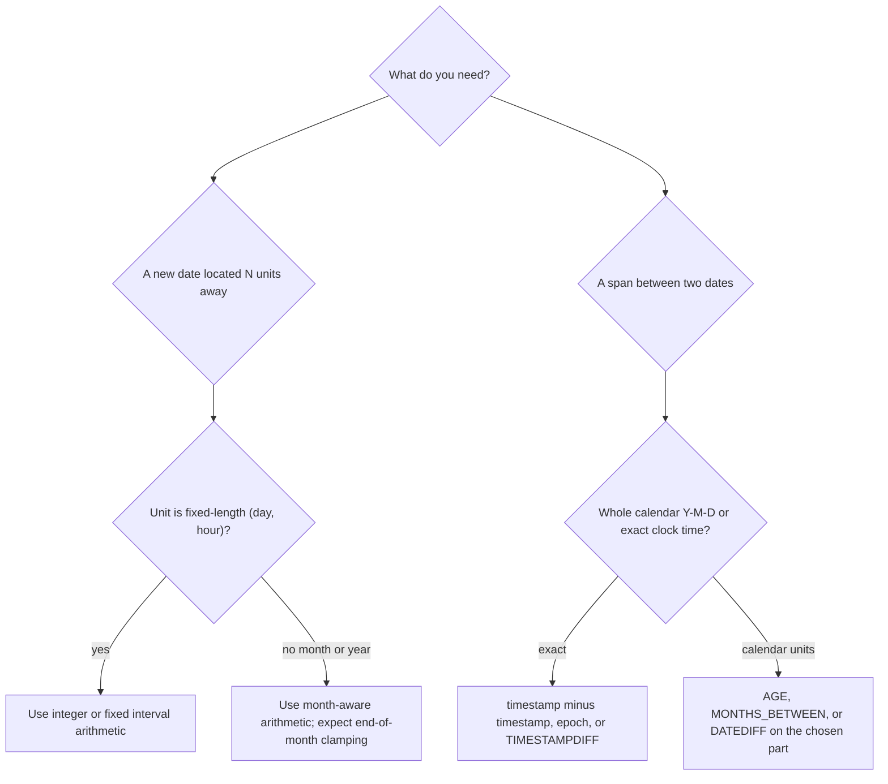

# 58 · Date Arithmetic

> Category: 7-Dates-and-Strings · Section 58
> Prerequisites: know how each engine stores dates (see _Date and Time Types_).
> Related sections: _Current Date and Time_, _Extracting Date Parts_, _Formatting and Parsing Dates_, _Indexes_, _Execution Plans_.

---

## 1. Fundamentals

**What it is**

Date arithmetic covers two families of operations:

1. **Travel** — produce a _new_ date/time by adding or subtracting a duration, e.g. "what is 30 days after `2024-01-14`?"
2. **Measure** — compute the _span_ between two dates/times, e.g. "how many days between `2024-01-14` and `2024-01-16`?"

The two families are not symmetric. Travel is a forward map `date → date`. Measuring is a relation between two values that changes meaning depending on whether you want **calendar units**, **fixed-duration units**, or **elapsed time**.

**Why it exists**

Almost every business system needs it:

- SLA / shipping deadlines: `shipped_ts` vs `order_ts`
- Subscription renewals, free-trial expirations, contract end dates
- Aging reports (AR buckets: 30/60/90 days)
- Cohort and retention analysis ("users active in week N")
- Sliding-window reporting ("last 7 days", "this month")
- Interest accrual, proration, dunning

**The grain rule (repeat this before writing any date query)**

Always state the grain of each table and what _one output row_ must represent:

> One row in `orders` represents **one order**.
> One row in `subscriptions` represents **one subscription** (0 or 1 `end_date`).
> One row in `employees` represents **one person**.

If you start measuring "days since order" per row, the output row is still one order — the arithmetic happens _within_ the row. It becomes dangerous the moment the arithmetic spans rows (aggregations over intervals, joins over date ranges), because then fan-out and double-counting appear.

---

## 2. The Three Kinds of Date Arithmetic

| Kind                                    | Example                | Meaning                                              | What engines do when the end of the month is missing | Result type                  |
| --------------------------------------- | ---------------------- | ---------------------------------------------------- | ---------------------------------------------------- | ---------------------------- |
| **Calendar** (months, years)            | `2025-01-31 + 1 month` | Move on the calendar; lengths vary, ends are clamped | `2025-02-28`                                         | date/timestamp               |
| **Fixed-duration** (days, hours, weeks) | `ts + 7 days`          | Elapse a constant number of clock ticks              | —                                                    | date/timestamp               |
| **Difference / elapsed**                | `ts1 - ts2`            | Distance between two points                          | —                                                    | integer, interval, or number |

The trap hidden in the first row: **a month is not a fixed duration**. `1 month` can be 28, 29, 30, or 31 days. A day is a calendar day or 24 hours depending on the type and engine (see DST section).



---

## 3. Internal Working (Why the Details Matter)

How a database physically stores a date explains _why_ some arithmetic is trivial and some is not:

| Engine     | Internal representation                                                                                    | Consequence                                                                                   |
| ---------- | ---------------------------------------------------------------------------------------------------------- | --------------------------------------------------------------------------------------------- |
| PostgreSQL | `date` = integer **days since 2000-01-01**; `timestamp` = integer **microseconds since 2000-01-01**        | `date + 5` is plain integer math. `date - date` returns an integer number of days.            |
| MySQL      | `DATE`/`TIMESTAMP` stored packed (3–4 bytes), converted by the engine                                      | You mostly use the `INTERVAL`-keyword functions, which handle conversion for you.             |
| SQL Server | `datetime2` = integer count of **100 ns ticks since 0001-01-01**                                           | `DATEDIFF`/`DATEADD` wrap this; counting is done in the chosen `datepart`.                    |
| Oracle     | `DATE` = 7 bytes (century, year, month, day, hour, minute, second), summary = number of days since 4712 BC | `date + 1` literally adds one day; `date1 - date2` is a (possibly fractional) number of days. |

Key insight: **adding whole days is cheap**: it is integer or tick arithmetic. **Adding months is expensive and lossy**: the engine must consult a calendar and decide what happens to end-of-month values. That decision — clamping — is one of the main sources of wrong answers in production queries.

**Typical month-addition algorithm** (conceptually, most engines):

1. Split the value into `(year, month, day)`.
2. Add the month offset: `year += n/12`, `month += n%12`.
3. If the resulting `day` exceeds the last day of the target month, clamp it: `(2025, 1, 31) + 1 month → (2025, 2, 28)`.

This is why `'2025-01-31' + 1 month` is `2025-02-28`, not `2025-03-03`.

---

## 4. Syntax Cheat Sheet (by operation × engine)

Assume `dᵢ` is a date and `tᵢ` a timestamp, `n` an integer.

| Operation                             | PostgreSQL                                                    | MySQL                                    | SQL Server                                                                 | Oracle                                                                          |
| ------------------------------------- | ------------------------------------------------------------- | ---------------------------------------- | -------------------------------------------------------------------------- | ------------------------------------------------------------------------------- |
| Today (date only)                     | `CURRENT_DATE`                                                | `CURDATE()`                              | `CAST(GETDATE() AS DATE)`                                                  | `TRUNC(SYSDATE)`                                                                |
| Now (timestamp)                       | `NOW()` / `CURRENT_TIMESTAMP`                                 | `NOW()`                                  | `GETDATE()` / `SYSDATETIME()`                                              | `SYSDATE` / `SYSTIMESTAMP`                                                      |
| Add `n` days to a **date**            | `d + n`                                                       | `DATE_ADD(d, INTERVAL n DAY)`            | `DATEADD(DAY, n, d)`                                                       | `d + n`                                                                         |
| Add `n` days to a **timestamp**       | `t + INTERVAL 'n days'`                                       | `DATE_ADD(t, INTERVAL n DAY)`            | `DATEADD(DAY, n, t)`                                                       | `t + INTERVAL 'n' DAY`                                                          |
| Add `n` months                        | `d + INTERVAL 'n months'`                                     | `DATE_ADD(d, INTERVAL n MONTH)`          | `DATEADD(MONTH, n, d)`                                                     | `ADD_MONTHS(d, n)` or `d + INTERVAL 'n' MONTH`                                  |
| Subtract one date from another (days) | `d1 - d2` (date types ⇒ integer)                              | `DATEDIFF(d1, d2)`                       | `DATEDIFF(DAY, d2, d1)`                                                    | `d1 - d2` (fractional)                                                          |
| Difference of timestamps              | `t1 - t2` (⇒ interval), divide for numbers                    | `TIMESTAMPDIFF(UNIT, t2, t1)`            | `DATEDIFF(UNIT, t2, t1)`                                                   | `t1 - t2` (interval or number by type)                                          |
| Whole years between dates             | `EXTRACT(YEAR FROM AGE(d1, d2))`                              | `TIMESTAMPDIFF(YEAR, d2, d1)`            | `DATEDIFF(YEAR, d2, d1)` ⚠ boundaries                                      | `FLOOR(MONTHS_BETWEEN(d1, d2)/12)`                                              |
| Strip time → date                     | `t::date` or `DATE_TRUNC('day', t)`                           | `DATE(t)`                                | `CONVERT(date, t)`                                                         | `TRUNC(t)`                                                                      |
| Start of month                        | `DATE_TRUNC('month', d)::date`                                | `d - INTERVAL (DAYOFMONTH(d)-1) DAY`     | `DATEFROMPARTS(YEAR(d), MONTH(d), 1)`                                      | `TRUNC(d, 'MM')`                                                                |
| End of month                          | `(DATE_TRUNC('month', d) + INTERVAL '1 month - 1 day')::date` | `LAST_DAY(d)`                            | `EOMONTH(d)`                                                               | `LAST_DAY(d)`                                                                   |
| Number of seconds since epoch         | `EXTRACT(EPOCH FROM t)` → `TO_TIMESTAMP(x)`                   | `UNIX_TIMESTAMP(t)` → `FROM_UNIXTIME(x)` | `DATEDIFF_BIG(SECOND, '1970-01-01', t)` → `DATEADD(SECOND, x, '19700101')` | `(CAST(t AS DATE) - DATE '1970-01-01') * 86400` → `DATE '1970-01-01' + x/86400` |

> MySQL gotcha with `INTERVAL` precedence:
>
> ```sql
> -- BAD: parsed as (d - INTERVAL DAYOFMONTH(d)) - 1 DAY
> d - INTERVAL DAYOFMONTH(d) - 1 DAY
> -- BETTER
> d - INTERVAL (DAYOFMONTH(d) - 1) DAY
> ```
>
> The `INTERVAL` expression grabs `DAYOFMONTH(d)` first.

> PostgreSQL gotcha: `timestamp + 5` does **not** work (no operator). You must write `t + INTERVAL '5 days'`. Only the `date` type accepts an integer operand. Conversely, `t1 - t2` returns an `interval`, while `d1 - d2` (both `date`) returns an **integer**.

---

## 5. Sample Data

```sql
-- PostgreSQL-flavored; see per-engine notes next to each example.
CREATE TABLE orders (
  order_id    INTEGER PRIMARY KEY,
  customer_id INTEGER NOT NULL,
  order_ts    TIMESTAMP NOT NULL,      -- when the order was placed
  shipped_ts  TIMESTAMP                -- NULL = not yet shipped
);
-- One row represents ONE order.

INSERT INTO orders VALUES
  (1, 101, '2024-01-14 09:30:00', '2024-01-16 11:05:00'),
  (2, 102, '2024-01-31 22:15:00', NULL),
  (3, 103, '2024-02-29 08:00:00', '2024-03-02 09:47:00'),
  (4, 101, '2024-03-10 12:00:00', '2024-03-13 09:12:00'),
  (5, 104, '2024-01-31 18:00:00', '2024-02-12 09:15:00'),
  (6, 105, '2024-02-10 21:05:00', NULL),
  (7, 106, '2024-02-20 16:40:00', NULL);

CREATE TABLE subscriptions (
  sub_id        INTEGER PRIMARY KEY,
  customer_id   INTEGER NOT NULL,
  start_date    DATE NOT NULL,
  end_date      DATE,                  -- NULL = ongoing
  monthly_price NUMERIC(8,2) NOT NULL
);
-- One row represents ONE subscription.

INSERT INTO subscriptions VALUES
  (1, 101, '2023-11-15', '2024-11-15', 19.99),
  (2, 102, '2024-12-01', NULL,         9.99),
  (3, 103, '2024-01-31', '2025-01-31', 29.99),
  (4, 104, '2024-01-01', '2024-03-01', 14.99),
  (5, 105, '2023-04-01', '2024-04-01', 39.99);

CREATE TABLE employees (
  emp_id     INTEGER PRIMARY KEY,
  name       TEXT NOT NULL,
  birth_date DATE NOT NULL,
  hired_on   DATE NOT NULL
);
-- One row represents ONE person.

INSERT INTO employees VALUES
  (1, 'Ada',   '1990-05-17', '2015-03-01'),
  (2, 'Grace', '1956-12-09', '1985-10-01'),
  (3, 'Alan',  '1962-06-23', '2018-01-15');
```

> Where an example depends on "today", the reference date used is **2024-03-15** so results are reproducible.

---

## 6. Core Operations — Worked Examples

### 6.1 Adding a fixed duration (travel)

**Problem**: an order must ship within 7 days, and trials last 1 month. Add to `order_ts`.

PostgreSQL:

```sql
SELECT order_id,
       order_ts,
       order_ts + INTERVAL '7 days'  AS ship_deadline,
       order_ts + INTERVAL '1 month' AS trial_end
FROM orders
ORDER BY order_id;
```

**Expected result** (PostgreSQL):

| order_id | order_ts            | ship_deadline       | trial_end           |
| -------- | ------------------- | ------------------- | ------------------- |
| 1        | 2024-01-14 09:30:00 | 2024-01-21 09:30:00 | 2024-02-14 09:30:00 |
| 2        | 2024-01-31 22:15:00 | 2024-02-07 22:15:00 | 2024-02-29 22:15:00 |
| 3        | 2024-02-29 08:00:00 | 2024-03-07 08:00:00 | 2024-03-29 08:00:00 |
| 5        | 2024-01-31 18:00:00 | 2024-02-07 18:00:00 | 2024-02-29 18:00:00 |

Notice order 2: `2024-01-31 + 1 month` = **2024-02-29**, the **last day of February 2024** (leap year). In a non-leap year it would be `2024-02-28`. The engine clamped to the last valid day.

Equivalent forms:

```sql
-- MySQL
SELECT order_id,
       DATE_ADD(order_ts, INTERVAL 7 DAY)   AS ship_deadline,
       DATE_ADD(order_ts, INTERVAL 1 MONTH) AS trial_end
FROM orders;

-- SQL Server
SELECT order_id,
       DATEADD(DAY, 7, order_ts),
       DATEADD(MONTH, 1, order_ts)
FROM orders;

-- Oracle
SELECT order_id,
       order_ts + INTERVAL '7' DAY,
       order_ts + INTERVAL '1' MONTH
FROM orders;
```

**When to use**: deadlines, expiry dates, reminders, schedule generation.

**When NOT to use**: when you need _business days_ (skip weekends/holidays) — engines have no built-in "add 5 business days" (see 6.12). Do not use `+ 1 month` thinking it equals a fixed number of days.

---

### 6.2 Exact elapsed time between two timestamps (measure)

**Problem**: how long did fulfillment take for each shipped order?

```sql
-- PostgreSQL
SELECT order_id,
       shipped_ts - order_ts                                    AS elapsed_interval,
       ROUND(EXTRACT(EPOCH FROM (shipped_ts - order_ts)) / 86400, 2) AS elapsed_days,
       shipped_ts::date - order_ts::date                        AS calendar_days
FROM orders
WHERE shipped_ts IS NOT NULL
ORDER BY order_id;
```

**Expected result**:

| order_id | elapsed_interval | elapsed_days | calendar_days |
| -------- | ---------------- | ------------ | ------------- |
| 1        | 2 days 01:35:00  | 2.07         | 2             |
| 3        | 2 days 01:47:00  | 2.07         | 2             |
| 4        | 2 days 21:12:00  | 2.88         | 3             |
| 5        | 11 days 15:15:00 | 11.64        | 12            |

Two different numbers for the same pair of rows! `elapsed_days` measures **clock time; `calendar_days` counts midnight-crossings**. Order 5 was placed at `22:15`-ish\*) and arrived after lunch — clock-wise ~11.6 days, but eleven **calendar dates** apart (Feb 12 − Jan 31 = 12 using date parts).

\*) in the sample `Jan 31 18:00 → Feb 12 09:15`, 11 days 15:15.

MySQL version — note it returns **whole units** and `DATEDIFF` ignores time-of-day:

```sql
SELECT order_id,
       TIMESTAMPDIFF(HOUR, order_ts, shipped_ts) AS elapsed_hours,
       DATEDIFF(shipped_ts, order_ts)            AS cal_days
FROM orders
WHERE shipped_ts IS NOT NULL;
```

| order_id | elapsed_hours | cal_days |
| -------- | ------------- | -------- |
| 1        | 49            | 2        |
| 3        | 49            | 2        |
| 4        | 69            | 3        |
| 5        | 279           | 12       |

`TIMESTAMPDIFF(HOUR, …)` returns the number of **completed hour-boundary crossings**, equivalent to an integer count. `DATEDIFF` truncates to date parts first.

**Interview trap**: `DATEDIFF` (MySQL/SQL Server) and `TIMESTAMPDIFF` are **boundary counters**, not elapsed-time calculators.

```sql
-- SQL Server / MySQL alike
DATEDIFF(DAY, '2024-01-01 23:59:59.999', '2024-01-02 00:00:00.001')  -- = 1, though ~2 ms apart
```

**When to use**: throughput / latency metrics, time-to-value, any "how long did it take".

**When NOT to use**: for SLA rules that are calendar-based ("shipped next business day"), use calendar-days logic, not elapsed hours.

---

### 6.3 Calendar differences: whole years, months, days (measure)

"I am 33 years old" is a calendar statement, not "I am 12 000 days old".

```sql
-- PostgreSQL
SELECT name,
       AGE(DATE '2024-03-15', birth_date)                    AS exact_age_inter,
       EXTRACT(YEAR FROM AGE(DATE '2024-03-15', birth_date)) AS age_years
FROM employees
ORDER BY emp_id;
```

**Expected result** (as of 2024-03-15):

| name  | exact_age_inter         | age_years |
| ----- | ----------------------- | --------- |
| Ada   | 33 years 9 mons 27 days | 33        |
| Grace | 67 years 3 mons 6 days  | 67        |
| Alan  | 61 years 8 mons 21 days | 61        |

> Note: `AGE` breaks the span into calendar pieces (years → months → days). On a leap day the decomposition order can produce surprising rema iners — see Edge Cases.

Equivalents:

```sql
-- MySQL
SELECT name,
       TIMESTAMPDIFF(DAY,   birth_date, '2024-03-15') AS days_old,
       TIMESTAMPDIFF(YEAR,  birth_date, '2024-03-15') AS age_years
FROM employees;

-- SQL Server (correct whole-age, not DATEDIFF alone)
SELECT name,
       DATEDIFF(YEAR, birth_date, '2024-03-15')
       - CASE WHEN DATEADD(YEAR, DATEDIFF(YEAR, birth_date, '2024-03-15'), birth_date) > '2024-03-15'
              THEN 1 ELSE 0 END AS age_years
FROM employees;

-- Oracle
SELECT name,
       FLOOR(MONTHS_BETWEEN(DATE '2024-03-15', birth_date) / 12) AS age_years
FROM employees;
```

**Why the SQL Server version is what it is**: `DATEDIFF(YEAR, …)` counts the number of **January 1st boundary crossings**, so someone born Dec 31, 2020 gets `1` whole year on January 1, 2021 — one day later. The `CASE` correction subtracts a year when the un-corrected anniversary is still in the future.

**Expected result (SQL Server)**: Ada 33, Grace 67, Alan 61.

**Interview trap — the same query, three different storylines**:

For `birth_date = '2024-01-31'` and `ref = '2024-06-15'`:

| Engine / approach                                  | Result           | Meaning                  |
| -------------------------------------------------- | ---------------- | ------------------------ |
| PostgreSQL `AGE`                                   | `4 mons 15 days` | calendar decomposition   |
| MySQL `DATEDIFF`                                   | `136`            | days (date parts only)   |
| SQL Server `DATEDIFF(MONTH, …)`                    | `5`              | month boundaries crossed |
| Oracle `MONTHS_BETWEEN('2024-06-15','2024-01-31')` | ≈ `4.5`          | fractional months        |

All "correct", all describing different things. Ask "which unit and which semantics does my business rule actually need?"

**When to use** `AGE`/`MONTHS_BETWEEN`: ages, tenures, anniversaries, "months worked".
**When NOT to use**: exact hours/days, billing that accrues by the day.

---

### 6.4 Filtering a sliding window — timestamp boundaries (travel + comparison)

**Problem**: orders placed in the last 7 days, as of `2024-03-15`.

```sql
-- PostgreSQL
SELECT COUNT(*) AS orders_last_7_days
FROM orders
WHERE order_ts >= CURRENT_TIMESTAMP - INTERVAL '7 days';
```

Now think about _what one output row means_: here the output is one aggregate row (`COUNT`), so there is no per-row arithmetic to double-check — but the **boundary** is everything.

**Production pitfall — the `.999` antipattern**:

```sql
-- BAD
WHERE order_ts <= '2024-03-14 23:59:59.999'
-- 1) The datetime literal resolution may round up to 2024-03-15 00:00:00 (SQL Server rounding of datetime)
-- 2) You now exclude events in the last millisecond
-- 3) Microsecond / nanosecond precision will silently include or exclude rows across engines

-- BETTER: half-open interval [start, end)
WHERE order_ts >= '2024-03-10 00:00:00'
  AND order_ts <  '2024-03-11 00:00:00'
```

**Explanation**: a half-open interval `>= start AND < end` is unambiguous under every timestamp precision, works on timezone columns, and can use an index range scan.

Also decide _what "last 7 days" means_:

- rolling clock-time window: `order_ts >= NOW() - INTERVAL '7 days'`
- aligned calendar window (last 7 _completed dates_): `order_ts >= DATE_TRUNC('day', NOW()) - INTERVAL '6 days'` (PostgreSQL)

This is **not** just cosmetic — a daily batch report run at 08:00 with a rolling window will gradually include "today" data and produce non-reproducible numbers.

**When to use**: dashboards, batch pull windows, "X since Y" filters.
**When NOT to use `>= literal_date` on a `timestamptz` column** without understanding the session timezone: see 6.8.

---

### 6.5 Truncation for grouping — monthly order counts (travel to a boundary)

**Problem**: how many orders per calendar month?

```sql
-- PostgreSQL
SELECT DATE_TRUNC('month', order_ts)::date AS month,
       COUNT(*)                            AS order_count
FROM orders
GROUP BY DATE_TRUNC('month', order_ts)
ORDER BY month;
```

**Expected result**:

| month      | order_count |
| ---------- | ----------- |
| 2024-01-01 | 3           |
| 2024-02-01 | 1           |
| 2024-03-01 | 1           |

Now `group by` works because every timestamp in the same month maps to the same truncated value. Equivalent expressions:

```sql
-- MySQL
SELECT DATE_FORMAT(order_ts, '%Y-%m-01') AS month_str, COUNT(*)
FROM orders GROUP BY DATE_FORMAT(order_ts, '%Y-%m-01');
-- (returns a string — compare/cast accordingly; or)
SELECT order_ts - INTERVAL (DAYOFMONTH(order_ts)-1) DAY AS month_start, COUNT(*)
FROM orders GROUP BY order_ts - INTERVAL (DAYOFMONTH(order_ts)-1) DAY;

-- SQL Server
SELECT DATEFROMPARTS(YEAR(order_ts), MONTH(order_ts), 1) AS month_start, COUNT(*)
FROM orders GROUP BY DATEFROMPARTS(YEAR(order_ts), MONTH(order_ts), 1);

-- Oracle
SELECT TRUNC(order_ts, 'MM') AS month_start, COUNT(*)
FROM orders GROUP BY TRUNC(order_ts, 'MM');
```

**Interview trap**: never `GROUP BY` on a _formatted string_ (`TO_CHAR(...,'YYYY-MM')`) when you also do comparisons or joins — it returns text, sorts lexically, loses an index. Keep the arithmetic numeric/date and format only for display.

**When to use**: monthly/weekly/quarterly/custom-year reports, cohort buckets.
**When NOT to use**: when you need per-row granularity preserved — that's a window function (see _Window Functions_ section) or a plain row query, not truncation in `GROUP BY`.

---

### 6.6 Start / end of month and month-end dates

**Problem**: for each order, find the last day of its month, and the number of days in that month.

```sql
-- PostgreSQL
SELECT order_id,
       order_ts::date,
       (DATE_TRUNC('month', order_ts) + INTERVAL '1 month - 1 day')::date AS month_end,
       DATE_PART('days', DATE_TRUNC('month', order_ts) + INTERVAL '1 month' - INTERVAL '1 day') AS days_in_month
FROM orders
ORDER BY order_id;
```

**Expected result** (selected rows):

| order_id | order_ts::date | month_end  | days_in_month |
| -------- | -------------- | ---------- | ------------- |
| 1        | 2024-01-14     | 2024-01-31 | 31            |
| 2        | 2024-01-31     | 2024-01-31 | 31            |
| 3        | 2024-02-29     | 2024-02-29 | 29            |
| 4        | 2024-03-10     | 2024-03-31 | 31            |

One-liners elsewhere:

```sql
-- MySQL     SELECT LAST_DAY(order_ts) FROM orders;
-- SQL Server SELECT EOMONTH(order_ts)  FROM orders;
-- Oracle    SELECT LAST_DAY(order_ts)  FROM orders;
```

The `+ INTERVAL '1 month'` then subtract `1 day` trick exists because there is no "last day" primitive in PostgreSQL's operator set; prefer an explicit `month_end` for readability.

**When to use**: month-end processing, proration, fiscal closes, "last day of next month".

---

### 6.7 Expiry / renewal window (comparison + travel)

**Problem**: subscriptions expiring within the next 30 days (as of `2024-03-15`).

```sql
-- PostgreSQL
SELECT sub_id, customer_id, end_date,
       end_date - CURRENT_DATE AS days_remaining
FROM subscriptions
WHERE end_date IS NOT NULL
  AND end_date >= DATE '2024-03-15'
  AND end_date <  DATE '2024-03-15' + INTERVAL '30 days';
```

**Expected result**:

| sub_id | customer_id | end_date   | days_remaining |
| ------ | ----------- | ---------- | -------------- |
| 5      | 105         | 2024-04-01 | 17             |

Note: subscription 4 (`end_date = 2024-03-01`) is _already expired_ — excluded, correctly; use `end_date < NOW` for dunning lists. Using `BETWEEN '2024-03-15' AND '2024-04-14 23:59:59'` here reintroduces the `.999` boundary problem from 6.4.

**When to use**: renewal funnels, churn alerts, certificate/expiry monitors.

---

### 6.8 Time zones, DST, and "1 day" vs "24 hours"

The single most consequential difference in date arithmetic.

**The setup**: session timezone = `America/New_York`, spring-forward happened **2024-03-10 02:00 EST → 03:00 EDT**.

```sql
-- PostgreSQL
SET TIME ZONE 'America/New_York';
SELECT '2024-03-09 12:00:00-05'::timestamptz + INTERVAL '1 day'   AS plus_one_day,
       '2024-03-09 12:00:00-05'::timestamptz + INTERVAL '24 hours' AS plus_24_hours;
```

**Expected result**:

| plus_one_day               | plus_24_hours              |
| -------------------------- | -------------------------- |
| 2024-03-10 **12:00:00**-04 | 2024-03-10 **13:00:00**-04 |

Both start from the same instant. `+ INTERVAL '1 day'` shifts the **wall clock** to "noon tomorrow" (23 real hours later). `+ INTERVAL '24 hours'` shifts the **elapsed clock** and lands at 13:00 EDT.

Fall-back (2024-11-03, 02:00 EDT → 01:00 EST):

```sql
SELECT '2024-11-02 12:00:00-04'::timestamptz + INTERVAL '1 day'   AS plus_one_day,
       '2024-11-02 12:00:00-04'::timestamptz + INTERVAL '24 hours' AS plus_24_hours;
```

| plus_one_day               | plus_24_hours              |
| -------------------------- | -------------------------- |
| 2024-11-03 **12:00:00**-05 | 2024-11-03 **11:00:00**-05 |

**Engine behavior matrix**:

| Engine     | `timestamptz`/tz-aware type                       | DST-aware interval?                                                                         |
| ---------- | ------------------------------------------------- | ------------------------------------------------------------------------------------------- |
| PostgreSQL | `timestamptz`                                     | Yes — `INTERVAL '1 day'` = calendar day wall-clock; `INTERVAL '24 hours'` = elapsed         |
| MySQL      | `TIMESTAMP` (stored UTC, displayed in session tz) | No true interval semantics; `INTERVAL 1 DAY` behaves as 24 hours                            |
| SQL Server | `datetimeoffset`                                  | `DATEADD(day, …)` adds a naive day; DST gaps/overlaps are not resolved — you supply offsets |
| Oracle     | `TIMESTAMP WITH TIME ZONE`                        | DST-aware for interval arithmetic on tz types                                               |

**Production pitfall**: a scheduler that fires `NOW() + INTERVAL '1 day'` across a spring-forward boundary will run at 13:00 wall-clock unless you intended elapsed. A batch that stores `local_date = ts AT TIME ZONE 'America/New_York'` and then does arithmetic on the _zoned_ value keeps calendar intent — but only if all reads agree on the zone.

**Also** compare a `timestamptz` column to a date literal:

```sql
-- PostgreSQL: the literal is parsed in the SESSION timezone!
WHERE event_ts >= '2024-03-15'          -- 2024-03-15 00:00:00 in the session zone
WHERE event_ts >= DATE '2024-03-15'     -- same
WHERE event_ts >= TIMESTAMPTZ '2024-03-15 00:00:00+00'   -- explicit UTC instant
```

Two offices in different zones will execute the _same SQL text_ and see **different row sets and different month buckets**. Decide: report in **UTC instants** at the boundary, or convert with an explicit zone.

**When to use `AT TIME ZONE`**: cohort day boundaries, "midnight in the user's zone", ETL date-partitioning.
**When NOT to use it**: when all analysis should be UTC; converting to a local zone for _filtering_ when grouping is already done live.

---

### 6.9 Sargability — BAD vs BETTER (performance)

**Problem**: count orders on `2024-03-10`.

```sql
-- BAD (MySQL): the column is wrapped in a function
SELECT COUNT(*) FROM orders
WHERE DATE(order_ts) = '2024-03-10';

-- BAD (PostgreSQL): same idea, cast on the column
SELECT COUNT(*) FROM orders
WHERE order_ts::date = '2024-03-10';

-- BAD (Oracle) SELECT COUNT(*) FROM orders WHERE TRUNC(order_ts) = DATE '2024-03-10';
-- BAD (SQL Server) SELECT COUNT(*) FROM orders WHERE CONVERT(date, order_ts) = '2024-03-10';

-- BETTER: keep the column bare, compute the range on the literal side
SELECT COUNT(*) FROM orders
WHERE order_ts >= '2024-03-10 00:00:00'
  AND order_ts <  '2024-03-11 00:00:00';
```

**Why it matters**: an index on `order_ts` can serve a range scan. Wrapping the column in `DATE()`/`TRUNC`/`CONVERT` often forces the optimizer to evaluate the function on every row before comparing — a scan instead of a seek. This is called **sargability** (Search ARGument-ABle).

**What to verify, not assume**: run the plan.

| Engine     | Command                                                                 |
| ---------- | ----------------------------------------------------------------------- |
| PostgreSQL | `EXPLAIN (ANALYZE, BUFFERS) …`                                          |
| MySQL      | `EXPLAIN ANALYZE…` (8.0.18+) or `EXPLAIN FORMAT=TREE …`                 |
| SQL Server | `SET STATISTICS IO ON; SET STATISTICS TIME ON;` + actual execution plan |
| Oracle     | `EXPLAIN PLAN FOR …` / `DBMS_XPLAN`                                     |

Observe whether the plan shows `Seq Scan … (rows=N)` vs an index range scan, on real data, with realistic selectivity. Do **not** assume a rule of thumb holds everywhere: sometimes the optimizer _can_ push the predicate through, and sometimes a full scan on a small table is the right plan anyway.

**If the range form is unpalatable, alternatives**:

```sql
-- PostgreSQL functional index
CREATE INDEX orders_order_date_idx ON orders ((order_ts::date));
-- Oracle function-based index
CREATE INDEX orders_order_date_idx ON orders (TRUNC(order_ts));
-- MySQL 8.0.13+ functional index
CREATE INDEX orders_order_date_idx ON orders ((CAST(order_ts AS DATE)));
-- SQL Server PERSISTED computed column (and index it)
ALTER TABLE orders ADD order_date AS CAST(order_ts AS DATE) PERSISTED;
```

Then re-check the plan — that's always the verification step.

---

### 6.10 Anniversaries — the "next 30 days" birthday problem (modular arithmetic)

**Problem**: which employees turn a year older within the next 30 days? Birthdays recur every year, so this is **mod-365 arithmetic with month/day tuples** — not naive subtraction.

The naive tuple-comparison version has a year-boundary bug:

```sql
-- NAIVE (fails across New Year and on leap years)
SELECT emp_id, name
FROM employees
WHERE (EXTRACT(MONTH FROM birth_date), EXTRACT(DAY FROM birth_date))
      BETWEEN (EXTRACT(MONTH FROM DATE '2024-03-15'), EXTRACT(DAY FROM DATE '2024-03-15'))
      AND   (EXTRACT(MONTH FROM DATE '2024-04-14'), EXTRACT(DAY FROM DATE '2024-04-14'));
-- If "today" is December 20, the interval spans into January, and this returns nothing.
```

Robust approach: project each birthday into "this year", falling back to "next year" if already passed, then compare to the window.

```sql
-- PostgreSQL
WITH bdays AS (
  SELECT emp_id, name, birth_date,
         birth_date
           + ((EXTRACT(YEAR FROM DATE '2024-03-15') - EXTRACT(YEAR FROM birth_date))
              * INTERVAL '1 year')                                      AS bday_this_year
  FROM employees
)
SELECT emp_id, name,
       CASE
         WHEN bday_this_year::date >= DATE '2024-03-15' THEN bday_this_year::date
         ELSE (bday_this_year + INTERVAL '1 year')::date
       END AS next_birthday
FROM bdays
WHERE CASE
        WHEN bday_this_year::date >= DATE '2024-03-15' THEN bday_this_year::date
        ELSE (bday_this_year + INTERVAL '1 year')::date
      END
      BETWEEN DATE '2024-03-15' AND DATE '2024-03-15' + INTERVAL '30 days';
```

**Output** on the sample (all three are out of the March 15–April 14 window) — add a person born `2024`/`1985-04-02` to see them included. The _idea_ to take away:

1. Compute "this year's occurrence".
2. If it is in the past, slide to next year (handles month-end and leap-day births via the engine's clamp).
3. Compare to the half-open window.

**Interview trap**: "date + N for recurring anniversaries" is rarely direct subtraction; it is a _modulo of the calendar_, and engines have no native operator for it.

---

### 6.11 Epoch round-trips and unit conversion (with an integer-division trap)

**Problem**: export `order_ts` as a Unix epoch, and count seconds between two instants.

```sql
-- PostgreSQL
SELECT order_id,
       EXTRACT(EPOCH FROM order_ts) AS epoch_seconds
FROM orders
WHERE order_id = 1;
```

**Expected result** (for `2024-01-14 09:30:00 UTC`):

| order_id | epoch_seconds |
| -------- | ------------- |
| 1        | 1705224600    |

Round-trip: `to_timestamp(1705224600)` → `2024-01-14 09:30:00+00`.

Equivalents: MySQL `UNIX_TIMESTAMP(t)`/`FROM_UNIXTIME(x)` (interpreted in the **session time_zone**), SQL Server `DATEDIFF_BIG(SECOND, '1970-01-01', t)` / `DATEADD(SECOND, x, '19700101')`, Oracle `(CAST(t AS DATE) - DATE '1970-01-01') * 86400` (truncates fractional seconds unless you use interval math).

**Integer division trap** — converting seconds to minutes:

```sql
-- PostgreSQL:  integer / integer = integer
SELECT 151 / 60;          -- → 2

-- MySQL: / always returns decimal
SELECT 151 / 60;          -- → 2.5167

-- SQL Server:  int / int = int  (truncation)
SELECT 151 / 60;          -- → 2

-- Oracle:
SELECT 151 / 60 FROM dual;   -- → 2.5167 (numeric)
```

So `DATEDIFF(SECOND, t1, t2) / 60` in SQL Server and PostgreSQL silently truncates partial minutes. Prefer explicit casts: `* 1.0 / 60`, `CAST(x AS NUMERIC)/60`, or use the engine's decimal division candidates.

**When to use epoch**: feeding external systems, sorting/storing a single scalar, dedupe keys.
**When NOT to use**: any human-facing calendar problem — epochs are timezone-free timestamps and mislead when wall-clock matters.

---

### 6.12 Business days (weekdays only) — a helper, not a primitive

Engines have **no** "add 5 business days" routine. Two approaches:

**Approach 1 — generate then filter** (PostgreSQL):

```sql
WITH days AS (
  SELECT gs::date AS d
  FROM generate_series(DATE '2024-03-15', DATE '2024-03-28', INTERVAL '1 day') gs
)
SELECT COUNT(*) AS next_14_business_days
FROM days
WHERE EXTRACT(ISODOW FROM d) BETWEEN 1 AND 5;
```

**Expected result**: `10` (two full weekends are filtered out of 14 calendar days).

**Approach 2 — calendar table** (recommended for anything serious):

```sql
CREATE TABLE business_days (d DATE PRIMARY KEY, is_holiday BOOLEAN NOT NULL);
```

Join against it; the main table gives you **holidays**, which no `EXTRACT`-based version can. This is a _real-world scenario_: shipping SLAs, payment settlement days, "net 30 business days" invoicing.

**When NOT to use**: don't hand-roll loop logic for the general case; a tiny `calendar` table is simpler, index-friendly, and auditable.

---

## 7. NULL Behavior

- Any arithmetic with a `NULL` operand yields `NULL`: `shipped_ts - order_ts` on an unshipped order is `NULL`, not 0.
- `WHERE` on a NULL-producing predicate silently excludes the row (three-valued logic).
- Aggregates skip `NULL`s (`AVG`, `COUNT`) — so "average time to ship" automatically ignores unshipped orders, which may bias the metric.

```sql
-- PostgreSQL
SELECT COUNT(*)                                                      AS orders,
       COUNT(shipped_ts)                                            AS shipped,
       ROUND(AVG(EXTRACT(EPOCH FROM (shipped_ts - order_ts))/86400),2) AS avg_ship_days
FROM orders;
```

**Expected result**:

| orders | shipped | avg_ship_days |
| ------ | ------- | ------------- |
| 7      | 4       | 4.67          |

(The mean is dragged up by order 5 at 11.6 days; a median or a "within 72h" rate would answer the business question better — that is a _statistics_ decision, not SQL.)

If a NULL must become a concrete value, use `COALESCE`/`NULLIF`:

```sql
COALESCE(shipped_ts - order_ts, INTERVAL '0 seconds')  -- a shipped-vs-not decision, not a real elapsed time
```

**Interview trap**: `WHERE shipped_ts - order_ts > 2` silently drops unshipped orders; someone glances at the report and concludes "everything ships within 2 days".

---

## 8. Edge Cases

**8.1 End-of-month clamping** — adding months to a 29/30/31:

| Operation                    | PostgreSQL                  | MySQL      | SQL Server | Oracle     |
| ---------------------------- | --------------------------- | ---------- | ---------- | ---------- |
| `2025-01-31 + 1 month`       | 2025-02-28                  | 2025-02-28 | 2025-02-28 | 2025-02-28 |
| `2024-01-31 + 1 month`       | 2024-02-29                  | 2024-02-29 | 2024-02-29 | 2024-02-29 |
| `2025-01-31 + 1 month 1 day` | 2025-03-01 (clamp then add) | —          | —          | —          |
| `2025-01-31 + 2 months`      | 2025-03-31                  | 2025-03-31 | 2025-03-31 | 2025-03-31 |

**8.2 Leap-day births** — `1988-02-29` "birthday" on a non-leap year: engines differ on whether `Feb 28` or `Mar 1` is "the" anniversary. Test on your engine before computing age or renewals.

**8.3 Negative results** — `d1 - d2` with `d1 < d2` returns a negative number in PostgreSQL/MySQL (`DATEDIFF`), negative in SQL Server `DATEDIFF`, negative fractional in Oracle. Valid, but guards like `GREATEST(0, end - CURRENT_DATE)` are usually desired.

**8.4 Midnight crossing** — "yesterday at 23:59" vs "today at 00:01" are two calendar days but ~2 minutes apart. This is exactly the elapsed-vs-calendar split of 6.2.

**8.5 `date + time`** — PostgreSQL `date + time = timestamp`; MySQL can cast; not a universal operator. Prefer explicit casts.

**8.6 Week numbering is a rabbit hole**:

| Engine     | Day-of-week                                       | ISO week helpers                                      |
| ---------- | ------------------------------------------------- | ----------------------------------------------------- |
| PostgreSQL | `EXTRACT(DOW)` Sun=0…6; `EXTRACT(ISODOW)` Mon=1…7 | `EXTRACT(WEEK)`, `DATE_TRUNC('week', d)` → Monday     |
| MySQL      | `DAYOFWEEK` Sun=1; `WEEKDAY` Mon=0                | `WEEK(d, mode)` — modes change week start & numbering |
| SQL Server | `DATEPART(weekday)` depends on `@@DATEFIRST`      | `DATEPART(ISO_WEEK, …)`                               |
| Oracle     | `TO_CHAR(d,'D')` depends on NLS territory         | `TRUNC(d,'IW’)`                                       |

`2024-06-05` (a Wednesday) is DOW `3` (PG, Sun-based), ISODOW `3`, `DAYOFWEEK` `4`, `WEEKDAY` `2`. Never assume a constant "day number" mapping across engines.

**8.7 Text vs date** — `'2024-01-02' + 1` in MySQL yields the number `20240103`; in PostgreSQL it errors ambiguously; in Oracle/SQL Server it depends on `NLS`/`DATEFORMAT` settings. **Always annotate types**: `DATE '2024-01-02'`, `'2024-01-02'::date`, `CAST(... AS DATE)`.

---

## 9. Common Mistakes (BAD → BETTER)

**9.1 In this-year anniversary vs current date — use a fixed reference in tests**

```sql
-- BAD, non-reproducible tests
WHERE order_ts >= NOW() - INTERVAL '7 days'

-- BETTER for batch runs pinned to a run date
WHERE order_ts >= ':run_date'::date - 6   -- cross-reference: parameterize batch dates
```

**9.2 `GROUP BY` on a formatted string**

```sql
-- BAD
GROUP BY TO_CHAR(order_ts, 'YYYY-MM')
-- BETTER
GROUP BY DATE_TRUNC('month', order_ts)
```

**9.3 Wrong polarity in `DATEDIFF` argument order**

```sql
-- MySQL/SQL Server compute (end - start):  positive = end after start
DATEDIFF(shipped_ts, order_ts)          -- days: shipped − ordered
DATEDIFF(CURDATE(), end_date)           -- days until expiry (positive)
```

**9.4 Reintroducing fan-out via date-range joins**

```sql
-- BAD: joining orders to a daily-report table on a range can duplicate rows
FROM orders o JOIN calendar c ON c.d BETWEEN o.order_ts::date AND o.ship_deadline
-- The output grain is no longer "one row per order"
```

Cross-reference the _JOIN duplication_, _fan-out_, and _double counting_ sections before writing range joins.

---

## 10. Production Pitfalls

- **`.999` BETWEEN antipattern** — always use half-open `[start, end)`.
- **Storage as strings** (`varchar` dates) — lexicographic compare is correct _only_ for ISO strings, and only if every value is normalized; you lose all index range arithmetic robustness anyway. Store real date/timestamp types.
- **Session timezone dependence** — `timestamptz` literals and `NOW()` render/parse per session; month buckets on `order_ts` will differ between regions. Pin one zone or store UTC.
- **DST batch drift** — recurring jobs using `+INTERVAL '1 day'` with wall-clock intent (or elapsed intent) shift across transitions; decide and document which you mean.
- **Doing date math on a `COUNT`-driven resize decision** — sanity-check cardinality first; see Performance.
- **Reusing "shipped" logic vs "paid" vs "created"** — three different timestamps, three different grains; mixing them produces nonsense averages.

---

## 11. Performance Implications

- **Sargable predicates** (6.9) directly affect whether an index is usable. Verify with `EXPLAIN`.
- **Truncation/formatting functions on the column** are the classic killers: `DATE(col) = …`, `TRUNC(col) = …`, `TO_CHAR(col, …) LIKE …`.
- **Range scans beat per-row functions on wide tables**; on tiny tables a scan is fine. Selectivity and statistics decide — never reason without the plan.
- **Indexes that can help**: plain index on the timestamp; composite `(customer_id, order_ts)` for per-customer windows; functional/computed-column indexes when you must frequently truncate (6.9).
- **Keyset pagination** over dates (`WHERE (order_ts, order_id) > ($1, $2) ORDER BY order_ts, order_id LIMIT 100`) avoids `OFFSET` scans — cross-reference the _pagination / keyset pagination_ section.
- **Avoid timezone conversion functions in the `WHERE` on the column**; convert the _literal side_ instead, or index the converted value. Always check the actual plan with realistic data distribution — optimizer, indexes, statistics, and cardinality decide, not blanket statements.

---

## 12. Interview Traps (quick-fire)

1. `DATEDIFF` / `TIMESTAMPDIFF` count **boundary crossings**, not elapsed whole units.
2. `2020-12-31` to `2021-01-01` is `DATEDIFF(YEAR, …) = 1`.
3. `'2025-01-31' + 1 month` → `2025-02-28` (clamping), not `2025-03-03`.
4. PostgreSQL `date - date` is an **integer**; `timestamp - timestamp` is an **interval**.
5. `timestamp + 5` fails in PostgreSQL; `date + 5` works.
6. In MySQL, `DATE('…')` vs `DATEDIFF` — one wraps a column (non-sargable), the other ignores clock time.
7. `d + INTERVAL '1 day'` vs `+ INTERVAL '24 hours'` differ across DST for `timestamptz` (PG), are the same for naive types.
8. `'2024-01-02' + 1` in MySQL → `20240103` (string → number).
9. `MONTHS_BETWEEN` is fractional; `DATEDIFF(MONTH)` is boundary; `AGE` is calendar; `DATEDIFF` (MySQL) is whole days — four numbers, one question.
10. SQL Server `DATEDIFF(DAY, t1, t2)` between adjacent-second inputs gives `1`.

---

## 13. Comparison Tables (consolidated)

**Day-of-week / week index per engine** (assume `2024-06-05`, a Wednesday):

| Engine / function                              | Value                                        | Basis      |
| ---------------------------------------------- | -------------------------------------------- | ---------- |
| PG `EXTRACT(DOW …)`                            | 3                                            | Sunday = 0 |
| PG `EXTRACT(ISODOW …)`                         | 3                                            | Monday = 1 |
| PG `EXTRACT(WEEK …)` + `DATE_TRUNC('week', …)` | ISO week / Monday start                      | ISO        |
| MySQL `DAYOFWEEK()`                            | 4                                            | Sunday = 1 |
| MySQL `WEEKDAY()`                              | 2                                            | Monday = 0 |
| SQL Server `DATEPART(weekday, …)`              | depends on `@@DATEFIRST` (4 if Sunday start) | session    |
| Oracle `TO_CHAR(d, 'D')`                       | depends on NLS territory                     | session    |

**"Days between" semantics**:

| Query form                             | Result for `2024-01-01 23:59` → `2024-01-02 00:01` | Notes           |
| -------------------------------------- | -------------------------------------------------- | --------------- |
| PG `d2::date - d1::date`               | 1                                                  | date parts only |
| PG `EXTRACT(EPOCH FROM (t2-t1))/86400` | ~0.0014                                            | exact clock     |
| MySQL `DATEDIFF(t2, t1)`               | 1                                                  | time ignored    |
| MySQL `TIMESTAMPDIFF(DAY,…)`           | 1                                                  | boundary count  |
| SQL Server `DATEDIFF(DAY, t1, t2)`     | 1                                                  | boundary count  |
| SQL Server `DATEDIFF_BIG(SECOND,…)`    | 120                                                | exact seconds   |
| Oracle `t2 - t1` (dates)               | ≈ 0.0014                                           | fractional days |

---

## 14. Best Practices

1. State each table's grain before writing arithmetic.
2. Choose _calendar vs fixed vs boundary_ semantics first; say which one out loud.
3. Filter with half-open `[start, end)` ranges; never `.999`.
4. Keep timezone boundaries explicit: UTC in storage, converted only at the edge.
5. Use `INTERVAL`-keyword syntax or the engine's dedicated function (`DATEADD`, `DATE_ADD`, `ADD_MONTHS`) — never bare string+number arithmetic.
6. Annotate literals (`DATE '…'`, `::date`) so implicit conversions can't change meaning.
7. Truncate (`DATE_TRUNC`/`DATE()`) only in projections and `GROUP BY`, not in indexed predicates.
8. Index the predicate side: either the bare column in a range, or a functional index on the truncated value.
9. `EXPLAIN` any query that will run hot — don't guess.
10. Handle `NULL` explicitly: `COALESCE`, `COUNT(shipped_ts)` vs `COUNT(*)`, and define what "unshipped" means to the metric.
11. For ages/whole-units, don't divide by 365.25; use `AGE`/`MONTHS_BETWEEN`/boundary-corrected `DATEDIFF`.
12. Prefer a prebuilt calendar table for business-day logic over ad-hoc week math.

---

## 15. Cross-References

- _Date and Time Types_, _Current Date and Time_ — what `NOW()` vs `CURRENT_DATE` return and how the values are stored.
- _Extracting Date Parts_ — `EXTRACT`/`DATEPART`/`DATE_FORMAT` complement the arithmetic here.
- _Formatting and Parsing Dates_ — the other half of the string↔date bridge; never `GROUP BY` formatted strings.
- _Indexes_, _Composite Indexes_, _Execution Plans_, _Cardinality_ — verify every performance claim (`EXPLAIN ANALYZE`).
- _JOIN duplication / fan-out / double counting_ — date-range joins multiply rows.
- _Pagination / Keyset Pagination_ — `(order_ts, order_id)` keysets for date-ordered paging.

---

# Interview Questions

### Beginner

1. Write the query that returns the date 10 days from today, and 10 days ago, in your engine. Show the SQL for two different engines.
2. What is the difference between `CURRENT_DATE` and `NOW()`/`GETDATE()`? When would a date-only value be preferable?
3. What does `2025-01-31 + 1 month` produce in PostgreSQL, MySQL, SQL Server, and Oracle? Explain the rule behind the answer.
4. `orders` has `order_ts` and `shipped_ts`. Which table is the _driving_ table if the requirement is "one output row per shipped order"? What happens to unshipped orders?
5. Filter orders from "last 7 complete calendar days" vs "last 168 hours". Write both. Which is a half-open range?

### Intermediate

6. Compute the age (whole years) of an employee on a fixed date, correctly, in SQL Server — and explain why `DATEDIFF(YEAR, …)` alone is wrong.
7. Why is `DATE(order_ts) = '2024-03-10'` potentially slow on a big table? Rewrite it. What will you check in the execution plan to confirm?
8. Give the monthly order count per engine: PostgreSQL, MySQL, SQL Server. Keep the result a date, not a formatted string.
9. NULL hazards: write an "average days to ship" and explain what your `COUNT`/`AVG` do with unshipped orders.
10. `DATEDIFF(DAY, '2024-01-01 23:59:59.999', '2024-01-02 00:00:00.001')` — what does it return and why?

### Advanced

11. Explain the difference between `+ INTERVAL '1 day'` and `+ INTERVAL '24 hours'` on a `timestamptz` column across a spring-forward. Give the resulting wall-clock times.
12. Design the query for "employees whose birthday falls in the next 30 days", handling the year boundary and leap-day births. Where does naive month/day tuple comparison fail?
13. "Net 30 business days" on an invoice due date. Compare a `generate_series`-based approach vs a prebuilt calendar table. Which do you ship and why?
14. Compare `AGE()` (PG), `DATEDIFF(MONTH,…)` (SQL Server), and `MONTHS_BETWEEN` (Oracle) on `2024-01-31 → 2024-06-15`. What does each number mean?

### Scenario Based

15. SLA report: orders must ship within 3 business days. Write the check that flags violations, and state the grain of the result rows.
16. Dunning: subscriptions with `end_date` within 30 days or already expired. Write it with a half-open window. Include actions: "renew", "dunning", "expired".
17. Hourly pricing where a customer joined at `2024-03-09 12:00:00` in New York (EST). At `2024-03-10 12:02` local time, how many _billed hours_ elapsed in your engine? (Explain any DST involvement.)
18. Cohort table: users (user_id, first_login_at), logins (login_id, user_id, login_at). How many users logged in "this week" (ISO week) — watch-row grain carefully.

### Tricky

19. Write "start of this ISO week (Monday)" for PostgreSQL, MySQL, and Oracle. Why is SQL Server's answer non-deterministic?
20. `SELECT DATE '2025-03-31' + INTERVAL '1 month' - INTERVAL '1 day'` — compute in your head; then `+ INTERVAL '1 month - 1 day'`. Different? Why?
21. Convert `1743000000` seconds since epoch back to a readable timestamp in PostgreSQL, MySQL, and SQL Server.
22. `2025-02-28` + 1 month — every engine says `2025-03-28`. Now `2025-02-28 23:59:59` + 1 month in MySQL. Does the year/leap intent survive with a time attached?

### Output Prediction

23. Predict PostgreSQL output (timezone `America/New_York`):

```sql
SELECT '2024-11-02 12:00:00-04'::timestamptz + INTERVAL '1 day'   AS a,
       '2024-11-02 12:00:00-04'::timestamptz + INTERVAL '24 hours' AS b;
```

24. Predict:

```sql
SELECT EXTRACT(YEAR   FROM AGE(DATE '2024-03-15', DATE '1990-05-17')) AS y,
       AGE(DATE '2024-06-15', DATE '2024-01-31');
```

25. MySQL: `SELECT DATEDIFF('2024-01-02 00:00:01', '2024-01-01 23:59:59');` — and explain the "boundary" reasoning.

### Debugging

26. A report shows negative "days until expiry". Two candidate bugs: datetime→date conversion loss, or reversed `DATEDIFF` arguments. How would you confirm which, with a single row?
27. "Orders in last 7 days" returns extra rows every morning, and fewer on Sundays. Identify the most likely cause (rolling vs calendar window, time of day, timezone).
28. `GROUP BY DATE_FORMAT(order_ts,'%Y-%m')` produces months sorted as `[2024-01, 2024-02, … , 2024-10, 2024-11, … 2025-01]`? (string sorting.)
29. A month-end job computes `month_end = to_char(last_day(...))` then filters `WHERE d <= :month_end`. It misses orders with timestamps `23:59:59.999`. Explain the fix using half-open ranges.

### Performance

30. Two equivalent-looking queries: `WHERE DATE(created_at) = '2024-03-10'` vs `WHERE created_at >= '2024-03-10 00:00:00' AND created_at < '2024-03-11 00:00:00'`. Which index scan do you expect, and how will you verify with the execution plan?
31. You have an index on `order_ts`. Explain why `order_ts + INTERVAL '1 day' > NOW()` uses it but `NOW() < order_ts + INTERVAL '1 day'` might not — and how to rewrite.
32. A monthly aggregate over a 500 M-row `events` table runs in 40 s. Propose (a) a schema-level fix (partitions/date-based), (b) a predicate-level fix, (c) what `EXPLAIN (ANALYZE, BUFFERS)` would tell you.

---

<details>
<summary><strong>Answers (try the questions first)</strong></summary>

1. PG: `CURRENT_DATE + 10`, `CURRENT_DATE - 10`; SQL Server: `DATEADD(DAY,10,CAST(GETDATE() AS DATE))`. MySQL: `DATE_ADD(CURDATE(), INTERVAL 10 DAY)`. Oracle: `TRUNC(SYSDATE) + 10`.
2. `CURRENT_DATE`/`CURDATE()` = date-only, `NOW()`/`GETDATE()` = timestamp with time. Use dates for day-boundary logic and reproducible batch keys.
3. `2025-02-28` everywhere (clamping to the last day of the target month; 2024 would be `02-29`).
4. Driving table `orders`; unshipped rows are naturally dropped by `WHERE shipped_ts IS NOT NULL` — but then `COUNT(*)/AVG` auto-skip them, which is a metric decision, not an accident.
5. Calendar-window: `order_ts >= CAST(CURRENT_DATE AS TIMESTAMP) - INTERVAL '6 days'` (PG). "Last 168h": `order_ts >= NOW() - INTERVAL '168 hours'`. Both half-open on the lower bound only.
6. `DATEDIFF(YEAR, ...)` counts Jan-1 crossings; the `CASE` correction subtracting a year when `DATEADD(YEAR, DATEDIFF(...), birth) > ref` is the standard fix.
7. Non-sargable → possible Seq Scan. Fix with a range; confirm with `EXPLAIN` that an index seek now appears.
8. See 6.5: `DATE_TRUNC`, `d - INTERVAL (DAYOFMONTH(d)-1) DAY` / `DATE_FORMAT`, `DATEFROMPARTS`.
9. `AVG`/`COUNT` skip NULL; unshipped orders vanish from the mean. Decide explicitly.
10. `1` — a boundary crossing, even though the timestamps are milliseconds apart.
11. Spring 2024 NYC: `+1 day` → 12:00 EDT, `+24 hours` → 13:00 EDT. Same instant, different wall clocks.
12. Naive tuple compare breaks across December→January; project each birthday into the current year, slide to next year if in the past, then compare to the window (6.10).
13. `generate_series` is one-off-friendly; a calendar table adds holidays and is the production choice.
14. `AGE` → `4 mons 15 days` (calendar); `DATEDIFF(MONTH)` → `5` (boundary count); `MONTHS_BETWEEN` → ≈4.5 (fractional). All correct, different meanings.
15. Flag violations: `WHERE shipped_ts > order_ts + (3 business days)` using a calendar join; one output row per order violating the SLA.
16. `end_date >= :today AND end_date < :today + 30` for renew; `end_date < :today` for dunning; NULL means perpetual.
17. Depends on engine; in PG with `timestamptz` the "billed hours" should be elapsed (Epoch-based), not wall-clock, else DST shifts billing by an hour.
18. Group logins by ISO week via `DATE_TRUNC('week', login_at)`; count distinct users per truncated key. Watch that one user-day maps to one week bucket (dedupe by `(user_id, week)`).
19. PG `DATE_TRUNC('week', d)::date`; MySQL `d - INTERVAL WEEKDAY(d) DAY`; Oracle `TRUNC(d,'IW')`. SQL Server depends on `@@DATEFIRST`.
20. First: March 31 + 1 month → April 30, then −1 day → April 29. Second: `+ INTERVAL '1 month - 1 day'` applies months _then_ days → May 30 (clamp Jan-Apr… verify on engine). Ordering of interval components matters.
21. PG `to_timestamp(1743000000)`; MySQL `FROM_UNIXTIME(1743000000)`; SQL Server `DATEADD(SECOND, 1743000000, '19700101')`.
22. Month-end clamping doesn't care about time of day; `2025-02-28 23:59:59 + 1 month` → `2025-03-28 23:59:59`.
23. `a = 2024-11-03 12:00:00-05`, `b = 2024-11-03 11:00:00-05`.
24. `y = 33`; interval `4 mons 15 days`.
25. `1` — MySQL `DATEDIFF` ignores time-of-day; only date parts are compared.
26. Print one row of raw `end_date`, raw `CURRENT_DATE`, and both argument orders of `DATEDIFF`. Signedness reveals the order bug; a date-cast reveals the conversion bug.
27. Rolling `NOW()-based` window mixed with hourly batch runs and no pinned zone. Fix: aligned calendar day and one timezone.
28. Lexicographic string ordering (`...09` < `...10`). Stop grouping by strings.
29. The `.999`/inclusive end drops late-second rows; switch to `d >= :month_start AND d < (:month_end + 1 day)` (half-open).
30. `EXPLAIN` should move from `Seq Scan` to an index range scan on `created_at`; verify row estimates vs actuals and statistics freshness.
31. Predicates are evaluated on the clean column side; both forms become a range on `order_ts` algebraically, but many optimizers only transform the simple form. Prefer the explicit range and confirm on the plan.
32. (a) Partition by month / cluster on date; (b) restrict the `WHERE` to an indexable range; (c) plan shows where the 40 s go — scans per partition, buffer reads, filter selectivity.

</details>
