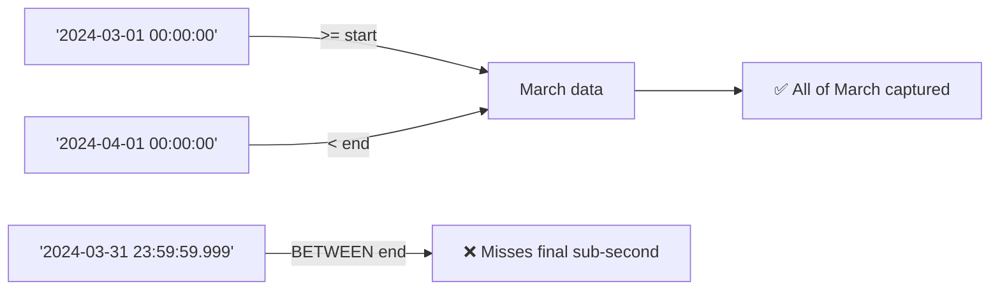

# 59 · Timestamp Filtering

> **Category:** 7-Dates-and-Strings · Section 59
> **Prerequisites:** \*Date & Time BasicSection 59 — Timestamp Filtering has been written to `/home/soumrnjn/Desktop/Task/SQL/sql-handbook/7-Dates-and-Strings/59-Timestamp-Filtering.md` (943 lines).

**Contents:**

| Section                          | Topics                                                                                                                                                                 |
| -------------------------------- | ---------------------------------------------------------------------------------------------------------------------------------------------------------------------- |
| 1. Fundamentals                  | What/why, grain rule                                                                                                                                                   |
| 2. Half-Open Intervals           | Core principle, Mermaid diagram                                                                                                                                        |
| 3. Internal Working              | Literal parsing per engine, sargable vs non-sargable internals                                                                                                         |
| 4. Syntax Cheat Sheet            | Filter patterns across PG/MySQL/SQL Server/Oracle                                                                                                                      |
| 5. Sample Data                   | 10-row `events` table with NULL, midnight boundaries                                                                                                                   |
| 6. Core Operations (10 examples) | Single day, relative window, month, NULLs, today/yesterday, timezone conversion, compound conditions, NULLIF sentinels, subquery boundaries, window function filtering |
| 7. NULL Behavior                 | Three-valued logic table, COUNT differences                                                                                                                            |
| 8. Edge Cases                    | Midnight boundary, DST spring-forward, fall-back overlap, sub-second precision, epoch, far-future, type mismatch                                                       |
| 9. Common Mistakes (6)           | `.999`, non-sargable functions, timezone, `=` on timestamps, DATEDIFF, NULL exclusion                                                                                  |
| 10. Production Pitfalls          | 8 real-world dangers                                                                                                                                                   |
| 11. Performance Implications     | Sargability table, composite/covering indexes, partition pruning, statistics                                                                                           |
| 12. Comparison Tables            | Filter pattern comparison, engine-specific "filter today" syntax                                                                                                       |
| 13. Best Practices               | 10 rules                                                                                                                                                               |
| 14. Cross-References             | Links to related handbook sections                                                                                                                                     |
| Interview Questions              | 32 questions (Beginner → Performance) with full answers in a collapsible `<details>` block                                                                             |

Core Principle: Half-Open Intervals

The most important concept in timestamp filtering:

> Always use **half-open intervals**: `>= start AND < end`.

| Interval notation | SQL pattern             | Meaning                                                     |
| ----------------- | ----------------------- | ----------------------------------------------------------- |
| `[start, end]`    | `BETWEEN start AND end` | Inclusive on both ends — **dangerous with timestamps**      |
| `[start, end)`    | `>= start AND < end`    | Inclusive start, exclusive end — **correct for timestamps** |
| `(start, end]`    | `> start AND <= end`    | Rarely useful                                               |
| `(start, end)`    | `> start AND < end`     | Excludes boundary values — usually wrong                    |

Why `[start, end)` is correct:

```sql
-- BAD: inclusive end misses data between 23:59:59.001 and 23:59:59.999
WHERE order_ts BETWEEN '2024-03-01' AND '2024-03-31 23:59:59.999'

-- BETTER: half-open captures every nanosecond of March 31
WHERE order_ts >= '2024-03-01'
  AND order_ts <  '2024-04-01'
```



---

## 3. Internal Working

**How the database evaluates a timestamp comparison**

When the engine encounters `WHERE order_ts >= '2024-03-10'`:

1. The string literal `'2024-03-10'` is parsed according to the column's type and the session's settings.
2. The literal is converted to the same internal representation as the column (e.g., microseconds since epoch for `timestamptz` in PostgreSQL, 100-ns ticks for `datetime2` in SQL Server).
3. The comparison is a single integer/tick comparison per row — this is what makes it index-friendly.

When the engine encounters `WHERE DATE(order_ts) = '2024-03-10'`:

1. For **every row**, the engine calls `DATE(order_ts)`, converting the full timestamp to a date.
2. The result of that function is compared to the literal.
3. The index on `order_ts` cannot be used because the predicate is not on the raw column — it is on a derived value.

This is the difference between **sargable** and **non-sargable** predicates. See §58 §6.9 for the full treatment.

**Literal parsing behavior by engine**

| Engine     | `'2024-03-10'` compared to `TIMESTAMP` column | `'2024-03-10'` compared to `TIMESTAMPTZ` column         |
| ---------- | --------------------------------------------- | ------------------------------------------------------- |
| PostgreSQL | Parsed as `2024-03-10 00:00:00` (no zone)     | Parsed in **session timezone**, then stored as UTC      |
| MySQL      | Implicit cast to `DATETIME`                   | Implicit cast to `TIMESTAMP` (converted to UTC, stored) |
| SQL Server | Implicit cast to `DATETIME2`                  | Implicit cast to `DATETIMEOFFSET`                       |
| Oracle     | Implicit cast to `DATE`                       | Implicit cast to `TIMESTAMP WITH TIME ZONE`             |

> **Production pitfall:** Two analysts in different timezones running the same SQL with `'2024-03-10'` against a `TIMESTAMPTZ` column will filter different physical rows. The literal is session-dependent.

---

## 4. Syntax Cheat Sheet

| Operation                        | PostgreSQL                                                                                    | MySQL                                                                                               | SQL Server                                                                                                                                    | Oracle                                                                      |
| -------------------------------- | --------------------------------------------------------------------------------------------- | --------------------------------------------------------------------------------------------------- | --------------------------------------------------------------------------------------------------------------------------------------------- | --------------------------------------------------------------------------- |
| Filter exact day (timestamp col) | `col >= '2024-03-10' AND col < '2024-03-11'`                                                  | Same                                                                                                | Same                                                                                                                                          | Same                                                                        |
| Filter exact day (date col)      | `col = DATE '2024-03-10'`                                                                     | `col = '2024-03-10'`                                                                                | `col = '2024-03-10'`                                                                                                                          | `col = DATE '2024-03-10'`                                                   |
| Last N hours                     | `col >= NOW() - INTERVAL 'N hours'`                                                           | `col >= NOW() - INTERVAL N HOUR`                                                                    | `col >= DATEADD(HOUR, -N, GETDATE())`                                                                                                         | `col >= SYSDATE - N/24`                                                     |
| Last N days (calendar-aligned)   | `col >= (CURRENT_DATE - N)`                                                                   | `col >= CURDATE() - N`                                                                              | `col >= DATEADD(DAY, -N, CAST(GETDATE() AS DATE))`                                                                                            | `col >= TRUNC(SYSDATE) - N`                                                 |
| Current month                    | `col >= DATE_TRUNC('month', NOW()) AND col < DATE_TRUNC('month', NOW()) + INTERVAL '1 month'` | `col >= DATE_FORMAT(NOW(), '%Y-%m-01') AND col < DATE_FORMAT(NOW() + INTERVAL 1 MONTH, '%Y-%m-01')` | `col >= DATEFROMPARTS(YEAR(GETDATE()), MONTH(GETDATE()), 1) AND col < DATEADD(MONTH, 1, DATEFROMPARTS(YEAR(GETDATE()), MONTH(GETDATE()), 1))` | `col >= TRUNC(SYSDATE, 'MM') AND col < ADD_MONTHS(TRUNC(SYSDATE, 'MM'), 1)` |
| IS NULL / IS NOT NULL            | `col IS NULL`                                                                                 | Same                                                                                                | Same                                                                                                                                          | Same                                                                        |
| Exclude NULLs implicitly         | `col >= '2024-03-10'` (NULLs excluded by three-valued logic)                                  | Same                                                                                                | Same                                                                                                                                          | Same                                                                        |

---

## 5. Sample Data

```sql
CREATE TABLE events (
  event_id    INTEGER PRIMARY KEY,
  user_id     INTEGER NOT NULL,
  event_type  VARCHAR(50) NOT NULL,
  event_ts    TIMESTAMPTZ NOT NULL,    -- when the event occurred (UTC)
  session_id  INTEGER,
  ip_address  VARCHAR(45)
);
-- One row = one event for one user at one instant.

INSERT INTO events VALUES
  (1,  101, 'login',    '2024-03-09 23:58:00+00', 1001, '192.168.1.1'),
  (2,  101, 'click',    '2024-03-10 00:00:05+00', 1001, '192.168.1.1'),
  (3,  102, 'login',    '2024-03-10 00:00:59+00', 1002, '10.0.0.5'),
  (4,  101, 'purchase', '2024-03-10 03:15:00+00', 1001, '192.168.1.1'),
  (5,  103, 'login',    '2024-03-10 23:59:59+00', 1003, '172.16.0.9'),
  (6,  102, 'logout',   '2024-03-11 00:00:00+00', 1002, '10.0.0.5'),
  (7,  104, 'login',    '2024-03-11 00:00:01+00', 1004, '192.168.2.3'),
  (8,  101, 'logout',   '2024-03-11 01:30:00+00', 1001, '192.168.1.1'),
  (9,  103, 'click',    NULL,                     NULL,  NULL),
  (10, 105, 'login',    '2024-03-12 12:00:00+00', 1005, '10.0.0.1');
-- Note: event 9 has event_ts = NULL (data quality issue)
```

> All timestamps are shown in UTC for reproducibility. The session timezone for examples is `UTC` unless stated otherwise.

---

## 6. Core Operations — Worked Examples

### 6.1 Filter a single day

**Problem:** get all events that occurred on 2024-03-10.

```sql
SELECT event_id, user_id, event_type, event_ts
FROM events
WHERE event_ts >= '2024-03-10'
  AND event_ts <  '2024-03-11'
ORDER BY event_ts;
```

**Expected result:**

| event_id | user_id | event_type | event_ts               |
| -------- | ------- | ---------- | ---------------------- |
| 2        | 101     | click      | 2024-03-10 00:00:05+00 |
| 3        | 102     | login      | 2024-03-10 00:00:59+00 |
| 4        | 101     | purchase   | 2024-03-10 03:15:00+00 |
| 5        | 103     | login      | 2024-03-10 23:59:59+00 |

Event 1 (`2024-03-09 23:58:00`) is excluded — correctly. Event 6 (`2024-03-11 00:00:00`) is excluded — correctly.

**Equivalent on other engines** (same logic, same result):

```sql
-- MySQL
SELECT event_id, user_id, event_type, event_ts
FROM events
WHERE event_ts >= '2024-03-10'
  AND event_ts <  '2024-03-11';

-- SQL Server
SELECT event_id, user_id, event_type, event_ts
FROM events
WHERE event_ts >= '2024-03-10'
  AND event_ts <  '2024-03-11';

-- Oracle
SELECT event_id, user_id, event_type, event_ts
FROM events
WHERE event_ts >= TIMESTAMP '2024-03-10 00:00:00 +00:00'
  AND event_ts <  TIMESTAMP '2024-03-11 00:00:00 +00:00';
```

**BAD alternative** — the `.999` antipattern:

```sql
-- BAD: may miss sub-millisecond events; semantic is unclear
WHERE event_ts BETWEEN '2024-03-10 00:00:00' AND '2024-03-10 23:59:59.999'

-- BAD: using DATE() kills index usage
WHERE DATE(event_ts) = '2024-03-10'
```

---

### 6.2 Filter a relative time window

**Problem:** events from the last 24 hours.

```sql
-- PostgreSQL
SELECT event_id, user_id, event_type, event_ts
FROM events
WHERE event_ts >= NOW() - INTERVAL '24 hours'
ORDER BY event_ts;
```

**Key decisions:**

| Choice                            | Implication                                   |
| --------------------------------- | --------------------------------------------- |
| `NOW() - INTERVAL '24 hours'`     | Rolling 24-hour window — includes "right now" |
| `CURRENT_DATE - INTERVAL '1 day'` | Calendar-aligned — from yesterday midnight    |
| `CURRENT_DATE`                    | Only today (midnight to midnight)             |

**When to use:** real-time dashboards, "recent activity" feeds, alerting.

**When NOT to use:** month-end or quarter-end reports — use calendar-aligned ranges instead of rolling windows for those.

---

### 6.3 Filter across a month (timestamp column)

**Problem:** all March 2024 events.

```sql
SELECT COUNT(*) AS march_events
FROM events
WHERE event_ts >= '2024-03-01'
  AND event_ts <  '2024-04-01';
```

**Expected result:**

| march_events |
| ------------ |
| 8            |

**BAD alternative:**

```sql
-- BAD: BETWEEN inclusive end misses 23:59:59.xxxx on March 31
SELECT COUNT(*) FROM events
WHERE event_ts BETWEEN '2024-03-01' AND '2024-03-31';
-- Returns 7, not 8 — misses event 5 (23:59:59) ... and would miss any
-- event between 23:59:59.001 and 23:59:59.999 on March 31
```

> **Interview trap:** "BETWEEN March 1 and March 31" sounds correct in English. For `DATE` columns, it is correct (March 31 is a valid date value). For `TIMESTAMP` columns, it silently drops the final 23:59:59.999 of the last day.

---

### 6.4 Filtering with NULLs in the column

**Problem:** "events from March 10" — does this include event 9 (which has `event_ts = NULL`)?

```sql
-- This query: NULLs are excluded by three-valued logic
SELECT event_id, user_id, event_type, event_ts
FROM events
WHERE event_ts >= '2024-03-10'
  AND event_ts <  '2024-03-11';
-- Returns 4 rows — event 9 is NOT among them
```

```sql
-- If you explicitly want to include NULLs:
SELECT event_id, user_id, event_type, event_ts
FROM events
WHERE event_ts >= '2024-03-10'
  AND event_ts <  '2024-03-11'
   OR event_ts IS NULL;
-- Returns 5 rows — event 9 is now included
```

**Why this matters:**

- `NULL >= '2024-03-10'` evaluates to `UNKNOWN` (three-valued logic).
- `UNKNOWN` in a `WHERE` clause means the row is **excluded**.
- This is almost always the correct behavior for timestamp filters — NULL means "unknown when it happened", so including it in a specific time window is misleading.

> **Production pitfall:** A dashboard that silently drops NULL-timestamp rows will show a count lower than reality. The fix is not to include NULLs in the window — it is to fix the data or to report NULLs separately.

---

### 6.5 Filter "today" vs "yesterday"

**Problem:** rows for today and yesterday.

```sql
-- PostgreSQL
SELECT event_id, user_id, event_type, event_ts
FROM events
WHERE event_ts >= CURRENT_DATE
  AND event_ts <  CURRENT_DATE + INTERVAL '1 day'
ORDER BY event_ts;

-- "Yesterday"
SELECT event_id, user_id, event_type, event_ts
FROM events
WHERE event_ts >= CURRENT_DATE - INTERVAL '1 day'
  AND event_ts <  CURRENT_DATE
ORDER BY event_ts;
```

**Equivalent on other engines:**

```sql
-- MySQL
-- Today
WHERE event_ts >= CURDATE()
  AND event_ts <  CURDATE() + INTERVAL 1 DAY
-- Yesterday
WHERE event_ts >= CURDATE() - INTERVAL 1 DAY
  AND event_ts <  CURDATE()

-- SQL Server
-- Today
WHERE event_ts >= CAST(GETDATE() AS DATE)
  AND event_ts <  DATEADD(DAY, 1, CAST(GETDATE() AS DATE))
-- Yesterday
WHERE event_ts >= DATEADD(DAY, -1, CAST(GETDATE() AS DATE))
  AND event_ts <  CAST(GETDATE() AS DATE)

-- Oracle
-- Today
WHERE event_ts >= TRUNC(SYSDATE)
  AND event_ts <  TRUNC(SYSDATE) + 1
-- Yesterday
WHERE event_ts >= TRUNC(SYSDATE) - 1
  AND event_ts <  TRUNC(SYSDATE)
```

**BETTER: parameterize for testability:**

```sql
-- Use a fixed date for reproducible tests / batch runs
WHERE event_ts >= DATE '2024-03-10'
  AND event_ts <  DATE '2024-03-10' + INTERVAL '1 day'
```

---

### 6.6 Filter with timezone conversion

**Problem:** "events that happened on March 10 in the user's local timezone (America/New_York)".

```sql
-- PostgreSQL
SELECT event_id, user_id, event_type, event_ts,
       event_ts AT TIME ZONE 'America/New_York' AS local_ts
FROM events
WHERE event_ts AT TIME ZONE 'America/New_York' >= '2024-03-10'
  AND event_ts AT TIME ZONE 'America/New_York' <  '2024-03-11'
ORDER BY event_ts;
```

**Expected result** (March 10 EDT starts at 2024-03-10 04:00 UTC):

| event_id | user_id | event_type | event_ts               | local_ts               |
| -------- | ------- | ---------- | ---------------------- | ---------------------- |
| 2        | 101     | click      | 2024-03-10 00:00:05+00 | 2024-03-09 20:00:05-04 |
| 3        | 102     | login      | 2024-03-10 00:00:59+00 | 2024-03-09 20:00:59-04 |
| 4        | 101     | purchase   | 2024-03-10 03:15:00+00 | 2024-03-09 23:15:00-04 |
| 5        | 103     | login      | 2024-03-10 23:59:59+00 | 2024-03-10 19:59:59-04 |

Wait — the filter now includes events that are March 10 _in New York_, which means events from 04:00 UTC (00:00 EDT) through 03:59 UTC on March 11 (23:59 EDT on March 10).

**The critical insight:** converting the column for filtering is usually correct for "local day" reports, but it is **not sargable** — the `AT TIME ZONE` function wraps the column, preventing index use.

**BETTER for performance** — convert the _literal_ side instead:

```sql
-- PostgreSQL: convert the boundary to UTC, filter on bare column
WHERE event_ts >= '2024-03-10 00:00:00-04'::timestamptz  -- 2024-03-10 04:00:00+00
  AND event_ts <  '2024-03-11 00:00:00-04'::timestamptz  -- 2024-03-11 04:00:00+00
```

> **Production pitfall:** Always convert the **literal** side when possible. Converting the column side defeats index usage and produces different results depending on the session timezone.

---

### 6.7 Filter a range with a second condition

**Problem:** events for user 101 in March 2024.

```sql
SELECT event_id, event_type, event_ts
FROM events
WHERE user_id = 101
  AND event_ts >= '2024-03-01'
  AND event_ts <  '2024-04-01'
ORDER BY event_ts;
```

**Expected result:**

| event_id | event_type | event_ts               |
| -------- | ---------- | ---------------------- |
| 1        | login      | 2024-03-09 23:58:00+00 |
| 2        | click      | 2024-03-10 00:00:05+00 |
| 4        | purchase   | 2024-03-10 03:15:00+00 |
| 8        | logout     | 2024-03-11 01:30:00+00 |

**Index strategy:** a composite index on `(user_id, event_ts)` covers both predicates in a single range scan. See the _Composite Indexes_ section for the full treatment.

---

### 6.8 Filter with `NULLIF` for sentinel values

**Problem:** the application stores `shipped_ts = '1970-01-01 00:00:00'` as a sentinel for "not yet shipped" instead of NULL. Find orders shipped after March 9.

```sql
-- BAD: the sentinel row leaks through
SELECT *
FROM orders
WHERE shipped_ts > '2024-03-09'
-- Returns the sentinel row if '1970-01-01 00:00:00' > ... no, that fails.
-- But if the sentinel were '9999-12-31', it would leak.

-- BETTER: convert sentinel to NULL first
SELECT *
FROM orders
WHERE NULLIF(shipped_ts, '1970-01-01 00:00:00') > '2024-03-09'
-- NULLIF returns NULL for the sentinel, and NULL > anything = UNKNOWN → excluded

-- BEST: fix the data model, store NULL instead of a sentinel
```

---

### 6.9 Filter using a subquery boundary

**Problem:** events that happened after a user's most recent login.

```sql
-- PostgreSQL
SELECT e.event_id, e.user_id, e.event_type, e.event_ts
FROM events e
WHERE e.event_ts > (
  SELECT MAX(e2.event_ts)
  FROM events e2
  WHERE e2.user_id = e.user_id
    AND e2.event_type = 'login'
)
ORDER BY e.event_ts;
```

This is a **correlated subquery** — the inner query depends on the outer query's `user_id`. The filter is evaluated per-row. Whether this is fast depends on indexes, cardinality, and the engine's optimizer. See _Correlated Subqueries_ (§29) and _JOIN vs SUBQUERY_ (§32).

---

### 6.10 Filter using window function results

**Problem:** "only the first event per user on each day."

```sql
-- PostgreSQL
WITH ranked AS (
  SELECT *,
         ROW_NUMBER() OVER (
           PARTITION BY user_id, event_ts::date
           ORDER BY event_ts
         ) AS rn
  FROM events
  WHERE event_ts IS NOT NULL
)
SELECT event_id, user_id, event_type, event_ts
FROM ranked
WHERE rn = 1
ORDER BY event_ts;
```

**Expected result:**

| event_id | user_id | event_type | event_ts               |
| -------- | ------- | ---------- | ---------------------- |
| 1        | 101     | login      | 2024-03-09 23:58:00+00 |
| 3        | 102     | login      | 2024-03-10 00:00:59+00 |
| 5        | 103     | login      | 2024-03-10 23:59:59+00 |
| 7        | 104     | login      | 2024-03-11 00:00:01+00 |
| 10       | 105     | login      | 2024-03-12 12:00:00+00 |

Note: `event_ts::date` is used for partitioning (truncation to day). This is fine in the `PARTITION BY` — the truncation only affects the window function's grouping, not the filter. The `WHERE event_ts IS NOT NULL` explicitly removes the NULL row before ranking.

---

## 7. NULL Behavior

| Expression                                             | Result when `event_ts` is NULL                       |
| ------------------------------------------------------ | ---------------------------------------------------- |
| `event_ts >= '2024-03-10'`                             | `UNKNOWN` → row excluded                             |
| `event_ts < '2024-03-11'`                              | `UNKNOWN` → row excluded                             |
| `event_ts >= '2024-03-10' AND event_ts < '2024-03-11'` | `UNKNOWN` → row excluded                             |
| `event_ts IS NULL`                                     | `TRUE` → row included                                |
| `event_ts IS NOT NULL`                                 | `FALSE` → row excluded                               |
| `COALESCE(event_ts, '2024-01-01') >= '2024-03-10'`     | `FALSE` → row excluded (NULL replaced with sentinel) |
| `event_ts > ALL (SELECT ...)`                          | If subquery returns NULL → `UNKNOWN` → row excluded  |

**Key rules:**

1. Any comparison with NULL yields `UNKNOWN`, never `TRUE` or `FALSE`.
2. `WHERE` only keeps rows where the predicate is `TRUE`.
3. To include NULL-timestamp rows, you must explicitly add `OR event_ts IS NULL`.
4. To exclude NULL-timestamp rows, just compare — they are excluded automatically.

> **Production pitfall:** `COUNT(event_ts)` excludes NULLs; `COUNT(*)` includes them. If you report "total events" as `COUNT(event_ts)`, you are silently dropping events with NULL timestamps.

```sql
-- PostgreSQL
SELECT COUNT(*)        AS total_rows,
       COUNT(event_ts) AS non_null_timestamps
FROM events;
```

| total_rows | non_null_timestamps |
| ---------- | ------------------- |
| 10         | 9                   |

---

## 8. Edge Cases

### 8.1 Midnight boundary

Event 5 (`2024-03-10 23:59:59+00`) is the last event of March 10. Event 6 (`2024-03-11 00:00:00+00`) is the first event of March 11. They are 1 second apart but in different calendar days.

```sql
-- Event 5 is included in "March 10":
WHERE event_ts >= '2024-03-10' AND event_ts < '2024-03-11'
-- ✅ event 5 is in the result set

-- Event 6 is excluded from "March 10":
WHERE event_ts >= '2024-03-10' AND event_ts < '2024-03-11'
-- ✅ event 6 is NOT in the result set
```

### 8.2 DST spring-forward gap

In `America/New_York`, `2024-03-10 02:00 EST` jumps to `03:00 EDT`. There is no `02:30 AM` on that date.

```sql
-- PostgreSQL: session timezone = America/New_York
SET TIME ZONE 'America/New_York';
-- '2024-03-10 00:00:00-05' (EST) to '2024-03-11 00:00:00-04' (EDT)
-- captures 23 real hours, not 24
WHERE event_ts >= '2024-03-10 00:00:00-05'
  AND event_ts <  '2024-03-11 00:00:00-04'
```

> **Production pitfall:** a batch job that runs at `NOW() - INTERVAL '24 hours'` across a spring-forward boundary processes 23 hours of data. Across fall-back, it processes 25 hours. Decide: calendar day or elapsed hours?

### 8.3 DST fall-back overlap

In `America/New_York`, `2024-11-03 02:00 EDT` falls back to `01:00 EST`. The hour from 1:00–2:00 occurs **twice**.

```sql
-- Two events at "01:30 AM" on Nov 3: one EDT, one EST
-- Both satisfy the same half-open range filter
-- You cannot distinguish them without the offset
WHERE event_ts >= '2024-11-03 00:00:00'
  AND event_ts <  '2024-11-04 00:00:00'
-- Both rows are returned — is that correct for your report?
```

### 8.4 Sub-second precision

```sql
-- Event at 23:59:59.999 (last millisecond of the day)
WHERE event_ts >= '2024-03-10'
  AND event_ts <  '2024-03-11'
-- ✅ Included — half-open catches it

-- BAD: BETWEEN with .999
WHERE event_ts BETWEEN '2024-03-10' AND '2024-03-10 23:59:59.999'
-- ❌ Misses 23:59:59.999001 to 23:59:59.999999 (microsecond precision)
```

### 8.5 Epoch boundary

The Unix epoch starts at `1970-01-01 00:00:00 UTC`. Negative timestamps (before 1970) are valid in most engines but can cause confusion:

```sql
-- PostgreSQL
SELECT '1969-12-31 23:59:59+00'::timestamptz >= '1970-01-01'
-- TRUE? No — 1969-12-31 is before 1970-01-01 → FALSE
```

### 8.6 Far-future dates

Some applications store `'9999-12-31'` as a "never expires" sentinel. Filtering with half-open ranges still works:

```sql
WHERE expires_at >= '2024-03-10'
  AND expires_at <  '2024-04-01'
-- The '9999-12-31' sentinel is excluded correctly
```

### 8.7 Type mismatch on comparison

```sql
-- PostgreSQL: comparing TIMESTAMP column with a DATE literal
-- The DATE is promoted to TIMESTAMP '2024-03-10 00:00:00'
WHERE event_ts >= DATE '2024-03-10'
-- Works, but implicit conversion may prevent index usage on some engines

-- BETTER: match types explicitly
WHERE event_ts >= '2024-03-10 00:00:00'
-- Or:
WHERE event_ts >= TIMESTAMP '2024-03-10 00:00:00+00'
```

---

## 9. Common Mistakes (BAD → BETTER)

### 9.1 The `.999` antipattern

```sql
-- BAD: ambiguous end, loses sub-millisecond data
WHERE event_ts BETWEEN '2024-03-10 00:00:00' AND '2024-03-10 23:59:59.999'

-- BETTER: half-open, unambiguous, index-friendly
WHERE event_ts >= '2024-03-10'
  AND event_ts <  '2024-03-11'
```

### 9.2 Function on the column (non-sargable)

```sql
-- BAD: every row must have DATE() evaluated
WHERE DATE(event_ts) = '2024-03-10'

-- BAD (PostgreSQL): same idea with cast
WHERE event_ts::date = '2024-03-10'

-- BAD (MySQL): using DATE_FORMAT on the column
WHERE DATE_FORMAT(event_ts, '%Y-%m-%d') = '2024-03-10'

-- BAD (Oracle): TRUNC on the column
WHERE TRUNC(event_ts) = DATE '2024-03-10'

-- BAD (SQL Server): CONVERT on the column
WHERE CONVERT(date, event_ts) = '2024-03-10'

-- BETTER: keep the column bare
WHERE event_ts >= '2024-03-10 00:00:00'
  AND event_ts <  '2024-03-11 00:00:00'
```

> Cross-reference: _Sargability_ in §58 §6.9. Always verify with `EXPLAIN` / `EXPLAIN ANALYZE`.

### 9.3 Ignoring timezone on a `TIMESTAMPTZ` column

```sql
-- BAD: '2024-03-10' is parsed in session timezone, not UTC
WHERE event_ts >= '2024-03-10'
-- An analyst in Tokyo and one in New York filter different physical rows

-- BETTER: explicit UTC boundary
WHERE event_ts >= '2024-03-10 00:00:00+00'
  AND event_ts <  '2024-03-11 00:00:00+00'
```

### 9.4 Using `=` on a timestamp column

```sql
-- BAD: misses all events except those at exactly midnight
WHERE event_ts = '2024-03-10'
-- For DATE columns this is fine; for TIMESTAMP columns, it almost never
-- does what you want

-- BETTER: range
WHERE event_ts >= '2024-03-10'
  AND event_ts <  '2024-03-11'
```

### 9.5 Off-by-one with `DATEDIFF`

```sql
-- BAD (MySQL/SQL Server): DATEDIFF counts boundary crossings
WHERE DATEDIFF(DAY, event_ts, NOW()) <= 7
-- This is not the same as "last 7 days" — it counts calendar-date
-- boundaries crossed, not elapsed hours

-- BETTER: use a direct timestamp comparison
WHERE event_ts >= NOW() - INTERVAL '7 days'
```

### 9.6 Excluding NULLs unintentionally

```sql
-- "Find events from March 10" — this silently drops event 9 (NULL event_ts)
SELECT * FROM events
WHERE event_ts >= '2024-03-10'
  AND event_ts <  '2024-03-11'
-- If the requirement is "all events, including unknown-timestamp ones":
SELECT * FROM events
WHERE event_ts >= '2024-03-10'
  AND event_ts <  '2024-03-11'
   OR event_ts IS NULL
```

---

## 10. Production Pitfalls

1. **BETWEEN on timestamps** — the #1 cause of missing data in daily/monthly reports. Use `[start, end)`.

2. **Session timezone dependence** — `timestamptz` literals are interpreted per session. A batch job that runs in UTC vs EST will filter different rows with the same SQL text. Pin the timezone or use explicit offsets.

3. **Non-sargable predicates** — wrapping the column in `DATE()`, `TRUNC()`, `EXTRACT()`, or `AT TIME ZONE` defeats index usage. On a 500M-row table, this is the difference between 2ms and 20s. Always check the plan.

4. **DST transitions in batch jobs** — a daily job using `NOW() - INTERVAL '1 day'` will process 23 or 25 hours around DST changes. Use calendar-aligned cutoffs if you want consistent daily batches.

5. **Sentinel values instead of NULL** — `'1970-01-01'` or `'9999-12-31'` as "not set" create false positives in range filters. Use NULL and handle it explicitly.

6. **Implicit type conversion** — comparing a `TIMESTAMPTZ` column to a `DATE` literal, or a `DATETIME` column to a string in a non-ISO format, can cause full scans or wrong results. Match types explicitly.

7. **String-stored dates** — `VARCHAR` columns containing date strings sort correctly only if every value is ISO-formatted (`YYYY-MM-DD HH:MM:SS`). Any deviation (e.g., `M/D/YYYY`) breaks comparison and range filtering entirely. Store real date/timestamp types.

8. **Not parameterizing batch boundaries** — a report using `NOW()` directly in the query produces non-reproducible results. Use a fixed date for testing and a parameter for production.

---

## 11. Performance Implications

- **Sargability is everything.** A bare-column range filter (`col >= X AND col < Y`) can use an index. Any function on the column typically cannot. Verify with `EXPLAIN`.

| Predicate                                      | Sargable? | Notes                         |
| ---------------------------------------------- | --------- | ----------------------------- |
| `col >= '2024-03-10' AND col < '2024-03-11'`   | ✅ Yes    | Standard range scan           |
| `DATE(col) = '2024-03-10'`                     | ❌ No     | Function on column            |
| `col::date = '2024-03-10'` (PG)                | ❌ No     | Cast on column                |
| `TRUNC(col) = DATE '2024-03-10'` (Oracle)      | ❌ No     | Function on column            |
| `EXTRACT(YEAR FROM col) = 2024`                | ❌ No     | Function on column            |
| `DATE_TRUNC('month', col) = '2024-03-01'` (PG) | ❌ No     | Function on column            |
| `col >= TIMESTAMP '2024-03-10 00:00:00+00'`    | ✅ Yes    | Explicit literal, bare column |

- **Composite indexes:** for per-user time windows, a composite index on `(user_id, event_ts)` covers both predicates. See _Composite Indexes_.

- **Covering indexes:** if the query only needs `user_id` and `event_type` for a time range, a covering index on `(event_ts, user_id, event_type)` eliminates table access entirely.

- **Partition pruning:** range-partitioned tables (by month or day) automatically skip irrelevant partitions when the filter includes the partition key. See §57 §16.

- **Statistics and cardinality:** the optimizer's choice between index scan and sequential scan depends on how many rows the predicate is expected to return. Fresh statistics (`ANALYZE` in PostgreSQL, `UPDATE STATISTICS` in SQL Server) matter. Do not assume — check the plan.

---

## 12. Comparison Tables

### Filter pattern comparison

| Pattern                             | Sargable? | Precision                     | Timezone-safe?     | Recommended?                    |
| ----------------------------------- | --------- | ----------------------------- | ------------------ | ------------------------------- |
| `col >= X AND col < Y`              | ✅        | Full                          | Depends on literal | ✅ Yes                          |
| `BETWEEN X AND Y`                   | ✅        | Inclusive end — may miss data | Depends on literal | ⚠️ Only for DATE columns        |
| `DATE(col) = X`                     | ❌        | Day only                      | No                 | ❌ No                           |
| `col::date = X` (PG)                | ❌        | Day only                      | No                 | ❌ No                           |
| `TRUNC(col) = X` (Oracle)           | ❌        | Truncated                     | No                 | ❌ No                           |
| `DATE_FORMAT(col, ...) = X` (MySQL) | ❌        | Formatted                     | No                 | ❌ No                           |
| `col AT TIME ZONE 'X' >= Y`         | ❌        | Full                          | Yes                | ⚠️ Convert literal side instead |
| `NULLIF(col, sentinel) >= X`        | ❌        | Full                          | No                 | ⚠️ Only when sentinels exist    |

### Engine-specific "filter today" syntax

| Engine     | Today                                                                               | Yesterday                                                                            | Last 7 days                          |
| ---------- | ----------------------------------------------------------------------------------- | ------------------------------------------------------------------------------------ | ------------------------------------ |
| PostgreSQL | `col >= CURRENT_DATE AND col < CURRENT_DATE + 1`                                    | `col >= CURRENT_DATE - 1 AND col < CURRENT_DATE`                                     | `col >= NOW() - INTERVAL '7 days'`   |
| MySQL      | `col >= CURDATE() AND col < CURDATE() + INTERVAL 1 DAY`                             | `col >= CURDATE() - INTERVAL 1 DAY AND col < CURDATE()`                              | `col >= NOW() - INTERVAL 7 DAY`      |
| SQL Server | `col >= CAST(GETDATE() AS DATE) AND col < DATEADD(DAY, 1, CAST(GETDATE() AS DATE))` | `col >= DATEADD(DAY, -1, CAST(GETDATE() AS DATE)) AND col < CAST(GETDATE() AS DATE)` | `col >= DATEADD(DAY, -7, GETDATE())` |
| Oracle     | `col >= TRUNC(SYSDATE) AND col < TRUNC(SYSDATE) + 1`                                | `col >= TRUNC(SYSDATE) - 1 AND col < TRUNC(SYSDATE)`                                 | `col >= SYSDATE - 7`                 |

---

## 13. Best Practices

1. **Always use half-open intervals** `[start, end)` for timestamp range filters. Reserve `BETWEEN` for `DATE`-only columns where both ends are meaningful date values.

2. **Match literal types to column types.** Use `DATE '...'`, `TIMESTAMP '...'`, or `TIMESTAMPTZ '...'` explicitly rather than relying on implicit conversion.

3. **Parameterize batch boundaries** for reproducibility. Use a fixed reference date in tests; use bind parameters in production.

4. **Prefer converting the literal side** over converting the column side for timezone-aware filtering. This preserves index usage.

5. **Keep columns bare** in predicates. Never wrap an indexed column in `DATE()`, `TRUNC()`, `EXTRACT()`, or `AT TIME ZONE` in the `WHERE` clause.

6. **Handle NULLs explicitly.** Decide whether `NULL` timestamps should be included in the report, and document that decision in the query.

7. **Verify with `EXPLAIN`** for any query that will run on large data. Do not assume sargability — confirm it.

8. **Use composite indexes** for multi-predicate filters (e.g., `(user_id, event_ts)`).

9. **Document timezone assumptions.** If the column is `TIMESTAMPTZ`, state which timezone the boundaries are in.

10. **For calendar-aligned reports** (monthly, weekly), use `DATE_TRUNC` only in the `GROUP BY` / `SELECT` — not in the `WHERE`.

---

## 14. Cross-References

- **§57 Date & Time Basics** — data types, literals, current date/time functions.
- **§58 Date Arithmetic** — `INTERVAL`, `DATEADD`, `DATEDIFF`, month-end clamping, epoch round-trips.
- **§09–10 NULL and Three-Valued Logic** — why `NULL >= X` returns `UNKNOWN`.
- **§20 JOIN ON vs WHERE** — conditions in `ON` vs `WHERE` for outer joins.
- **§39 COUNT NULL Pitfalls** — `COUNT(*)` vs `COUNT(column)`.
- **§55 Pagination / Keyset Pagination** — `(event_ts, event_id) > ($1, $2)` for cursor-based paging.
- **Indexes, Composite Indexes, Covering Indexes** — index strategies for timestamp predicates.
- **Execution Plans** — verifying sargability with `EXPLAIN ANALYZE`.

---

# Interview Questions

### Beginner

1. Write a query to return all rows from `events` where `event_ts` falls on March 10, 2024. Show the half-open interval pattern.
2. What is wrong with `WHERE event_ts BETWEEN '2024-03-10 00:00:00' AND '2024-03-10 23:59:59.999'`? How would you fix it?
3. Explain what happens when `event_ts` is NULL and you run `WHERE event_ts >= '2024-03-10'`. Does the row appear in the result?
4. Write a query that returns events from "today" in PostgreSQL, MySQL, and SQL Server. What is the grain of the result?
5. Why does `WHERE event_ts = '2024-03-10'` rarely do what you want when `event_ts` is a `TIMESTAMP` column?

### Intermediate

6. Explain the difference between `WHERE DATE(event_ts) = '2024-03-10'` and `WHERE event_ts >= '2024-03-10' AND event_ts < '2024-03-11'` from both a correctness and a performance perspective.
7. What is the effect of session timezone on filtering a `TIMESTAMPTZ` column with a string literal like `'2024-03-10'`? Two analysts in different timezones run the same query — do they get the same rows?
8. You need to filter events for "last 30 days, calendar-aligned." Write it in PostgreSQL. What is the difference from a rolling 30-day window?
9. Explain why `NULLIF(shipped_ts, '1970-01-01') > '2024-03-09'` correctly excludes sentinel values. What does `NULLIF` return for the sentinel?
10. `COUNT(event_ts)` returns 9 but `COUNT(*)` returns 10 on the sample data. Explain why.

### Advanced

11. A `TIMESTAMPTZ` column is filtered with `event_ts AT TIME ZONE 'America/New_York' >= '2024-03-10'`. Explain why this is not sargable and how to rewrite it while preserving the same semantics.
12. You have a composite index on `(user_id, event_ts)`. Write a query that filters by `user_id = 101` and a date range on `event_ts`. Explain why this index can serve both predicates. What would happen if you wrote `WHERE user_id = 101 AND DATE(event_ts) = '2024-03-10'` instead?
13. A batch job runs at 02:00 UTC every day and processes "events from the last 24 hours." On the spring-forward date (March 10, 2024 in New York), how many hours of data does it actually process? What is the fix?
14. Explain why a half-open range `>= '2024-03-10' AND < '2024-03-11'` on a `TIMESTAMPTZ` column in UTC is different from the same filter after converting the column to `America/New_York` first. Which events fall into each bucket?

### Scenario Based

15. **Report accuracy:** a daily dashboard shows "orders today" and the number drops to 0 every morning at midnight. The engineer confirms data exists. Debug the most likely cause.
16. **Data quality:** you discover that 5% of rows have `event_ts = NULL`. Write a query that reports both "events with known timestamps in March" and "events with unknown timestamps" in a single result.
17. **Multi-tenant system:** users are in UTC, PST, and IST. A report says "events on March 10" and each region expects events in their own timezone. Design the filtering strategy. What tradeoffs exist?
18. **Batch ETL:** the `events` table is 2 billion rows. You need to extract all events from March 2024. Describe the ideal schema design (partitioning, indexing) and the filter query. What would `EXPLAIN ANALYZE` show?

### Tricky

19. `WHERE event_ts >= '2024-03-10'` — is this sargable on a `TIMESTAMPTZ` column in PostgreSQL? What if the column is `TIMESTAMP WITHOUT TIME ZONE`? Does the answer change?
20. Two queries: `WHERE event_ts >= '2024-03-10 04:00:00+00' AND event_ts < '2024-03-11 04:00:00+00'` (UTC boundaries for EDT) vs `WHERE event_ts AT TIME ZONE 'America/New_York' >= '2024-03-10' AND event_ts AT TIME ZONE 'America/New_York' < '2024-03-11'`. Are these identical? What if the session timezone is not UTC?
21. `SELECT * FROM events WHERE event_ts::date = CURRENT_DATE` — explain why this works correctly but may be slow. Write a sargable equivalent.
22. A `TIMESTAMPTZ` value `'2024-11-03 01:30:00-04'` (EDT) and `'2024-11-03 01:30:00-05'` (EST) represent different physical instants. Both satisfy `WHERE event_ts >= '2024-11-03 00:00:00' AND event_ts < '2024-11-04 00:00:00'`. How many rows does this return, and can you distinguish them?

### Output Prediction

23. Given the sample data, predict the output:

```sql
SELECT event_id, event_ts AT TIME ZONE 'America/New_York' AS local_ts
FROM events
WHERE event_ts >= '2024-03-10 00:00:00-05'
  AND event_ts <  '2024-03-11 00:00:00-04'
ORDER BY event_ts;
```

24. Predict the count:

```sql
SELECT COUNT(*)
FROM events
WHERE event_ts >= '2024-03-10 00:00:00+00'
  AND event_ts <  '2024-03-10 23:59:59+00';
```

25. Predict the count:

```sql
SELECT COUNT(*)
FROM events
WHERE event_ts >= '2024-03-10 00:00:00+00'
  AND event_ts <  '2024-03-11 00:00:00+00';
```

### Debugging

26. A query `SELECT * FROM events WHERE event_ts >= '2024-03-10'` returns 0 rows, even though the table has data for that date. `event_ts` is `TIMESTAMPTZ`. List three possible causes.
27. A monthly report uses `WHERE event_ts BETWEEN '2024-03-01' AND '2024-03-31 23:59:59'` and shows 8 rows for March. An analyst says the count should be 9. Where is the missing row?
28. A developer writes `WHERE DATE(event_ts) = CURRENT_DATE` and reports it is slow on a 100M-row table. Explain why and provide a sargable rewrite.
29. Two batch jobs run at different times: one at 01:00 UTC, one at 03:00 UTC. Both filter "events from the last 24 hours." They produce different counts. Explain why.

### Performance

30. You have an index on `event_ts`. Compare the execution plans for: (a) `WHERE event_ts >= '2024-03-10' AND event_ts < '2024-03-11'` and (b) `WHERE DATE(event_ts) = '2024-03-10'`. What does `EXPLAIN ANALYZE` show for each?
31. A query filters `WHERE user_id = 101 AND event_ts >= '2024-03-01' AND event_ts < '2024-04-01'`. You have separate indexes on `user_id` and `event_ts`. Which index does the engine use? What composite index would be better?
32. You need to count events per day for March 2024 on a 500M-row table. Write a query that is both sargable and avoids double-counting. What partition strategy would further improve it?

---

<details>
<summary><strong>Answers (try the questions first)</strong></summary>

1. `WHERE event_ts >= '2024-03-10' AND event_ts < '2024-03-11'`
2. BETWEEN is inclusive on both ends; it misses any event between 23:59:59.001 and 23:59:59.999 on March 10. Fix with `>= AND <`.
3. `NULL >= '2024-03-10'` evaluates to `UNKNOWN`, so the row is excluded.
4. PostgreSQL: `WHERE event_ts >= CURRENT_DATE AND event_ts < CURRENT_DATE + INTERVAL '1 day'`. MySQL: replace `CURRENT_DATE` with `CURDATE()` and use `INTERVAL 1 DAY`. SQL Server: `CAST(GETDATE() AS DATE)` and `DATEADD(DAY, 1, ...)`. The grain is one row per event (no aggregation).
5. `'2024-03-10'` is parsed as `2024-03-10 00:00:00`. Only events at exactly midnight match. For any event with a non-zero time-of-day, the comparison fails.
6. Both return the same rows. `DATE(col)` is non-sargable (forces full scan on large tables); the range form is sargable and can use an index.
7. The literal `'2024-03-10'` is parsed in the **session timezone**. An analyst in Tokyo (UTC+9) parses it as `2024-03-09 15:00:00 UTC`. An analyst in New York (UTC-5 in March) parses it as `2024-03-10 05:00:00 UTC`. They filter different physical rows.
8. Calendar-aligned: `WHERE event_ts >= (CURRENT_DATE - INTERVAL '29 days') AND event_ts < CURRENT_DATE + INTERVAL '1 day'`. Rolling window: `WHERE event_ts >= NOW() - INTERVAL '30 days'`. The calendar version is reproducible; the rolling version shifts with each execution.
9. `NULLIF(shipped_ts, '1970-01-01')` returns NULL when `shipped_ts` equals the sentinel. `NULL > X` evaluates to `UNKNOWN` → excluded. For non-sentinel values, the original timestamp is returned and compared normally.
10. `COUNT(event_ts)` skips NULLs; event 9 has `event_ts = NULL`, so it is excluded from the count. `COUNT(*)` counts all rows regardless of NULLs.
11. `AT TIME ZONE` wraps the column in a function → non-sargable. Rewrite by converting the literal to UTC: `WHERE event_ts >= '2024-03-10 04:00:00+00' AND event_ts < '2024-03-11 04:00:00+00'` (00:00 EDT = 04:00 UTC).
12. The composite index `(user_id, event_ts)` satisfies both predicates in a single range scan. `DATE(event_ts)` wraps the column → the index cannot be used for the date predicate, falling back to a scan or a different index.
13. On spring-forward day, 24 hours before 02:00 UTC starts at 02:00 UTC the previous day — but in New York, the wall-clock jump means "24 hours of clock time" is only 23 real hours. Fix: use calendar-aligned cutoffs (`CURRENT_DATE - INTERVAL '1 day'`) instead of elapsed intervals for daily batches.
14. In UTC, the range captures events from midnight UTC March 10 to midnight UTC March 11 — that is midnight-to-midnight EDT (04:00 UTC March 10 to 04:00 UTC March 11). After converting the column to New York time, the range midnight-to-midnight EDT is the same set of events. However, if the literal boundary is not offset-aware, the session timezone determines which physical instants are included.
15. The query likely uses `WHERE event_ts >= CURRENT_DATE` without the `< CURRENT_DATE + 1` upper bound. At midnight, `CURRENT_DATE` is the new day, so no events from the previous day satisfy `>= new day`. Fix: use `>= yesterday AND < today`.
16. `SELECT 'known' AS category, COUNT(*) FROM events WHERE event_ts IS NOT NULL AND event_ts >= '2024-03-01' AND event_ts < '2024-04-01' UNION ALL SELECT 'unknown', COUNT(*) FROM events WHERE event_ts IS NULL;`
17. Options: (a) store all timestamps in UTC and convert at the query edge; (b) store in local time per-tenant (complex, error-prone); (c) use a `timezone` column per user. Tradeoff: (a) is simplest and most correct; (b) breaks around DST; (c) adds storage and join cost.
18. Range-partition by month on `event_ts`. Composite index on `(event_ts, user_id, event_type)` as a covering index. Filter: `WHERE event_ts >= '2024-03-01' AND event_ts < '2024-04-01'`. `EXPLAIN ANALYZE` should show partition pruning (only March partition scanned) and an index range scan within it.
19. Yes, it is sargable — the literal is on the right side, the column is bare. The engine parses the literal in the session timezone and compares against the internal UTC representation. Both `TIMESTAMPTZ` and `TIMESTAMP` columns benefit from the bare-column form.
20. They are identical only when the session timezone is UTC. If the session is set to `America/New_York`, the first query uses explicit UTC offsets, while the second converts the column — both produce the same row set, but the second is not sargable.
21. It works because `::date` truncates the timestamp to a date, and `CURRENT_DATE` is a date — the types match. It is slow because `::date` wraps the column, preventing index use. Sargable rewrite: `WHERE event_ts >= CURRENT_DATE AND event_ts < CURRENT_DATE + INTERVAL '1 day'`.
22. Two rows are returned. Both satisfy the filter because they fall within the calendar day. They represent different physical instants (one hour apart) and can be distinguished by their offsets: `-04` vs `-05`.
23. Events 2, 3, 4, 5 are returned. Their `local_ts` values are: `2024-03-09 20:00:05-04`, `2024-03-09 20:00:59-04`, `2024-03-09 23:15:00-04`, `2024-03-10 19:59:59-04`. (Note: the filter boundary `00:00-05` = `05:00 UTC` = `04:00 UTC` for EDT start.)
24. 3 — events 2, 3, and 4 are included; event 5 (`23:59:59`) is excluded because the upper bound is strictly less than `23:59:59`.
25. 4 — events 2, 3, 4, and 5 are all included. The half-open range captures every timestamp in the calendar day.
26. (a) Session timezone mismatch — the literal is parsed in a different zone than expected. (b) Type mismatch — the literal is a string that does not match the column type. (c) The data for that date is actually NULL or stored in a different format.
27. The last millisecond (23:59:59.xxx) is included by `.999`, but the event at exactly `23:59:59.999999` (microseconds) is missed because BETWEEN is inclusive and `.999` is only milliseconds. Or: an event at `23:59:59.9995` rounds differently. Fix: use `>= '2024-03-01' AND < '2024-04-01'`.
28. `DATE(event_ts)` is evaluated for every row → full scan. Sargable: `WHERE event_ts >= CURRENT_DATE AND event_ts < CURRENT_DATE + INTERVAL '1 day'`.
29. The 01:00 UTC job processes events from 01:00 previous day to 01:00 today. The 03:00 UTC job processes events from 03:00 previous day to 03:00 today. They cover different 24-hour windows → different counts. Fix: use calendar-aligned boundaries for daily reports.
30. (a) Index range scan on `event_ts` — rows estimated via statistics. (b) Full sequential scan — `DATE()` evaluated on every row. `EXPLAIN ANALYZE` shows "Seq Scan" for (b) and "Index Scan" or "Index Range Scan" for (a).
31. The engine uses one index (likely `user_id` if more selective) and a filter for the other. A composite index `(user_id, event_ts)` satisfies both in a single scan.
32. `SELECT event_ts::date AS day, COUNT(*) FROM events WHERE event_ts >= '2024-03-01' AND event_ts < '2024-04-01' GROUP BY 1 ORDER BY 1`. Partition by month on `event_ts` to prune non-March partitions. The composite index `(event_ts, event_ts::date)` or a functional index on `event_ts::date` avoids re-computing the truncation per row.

</details>
