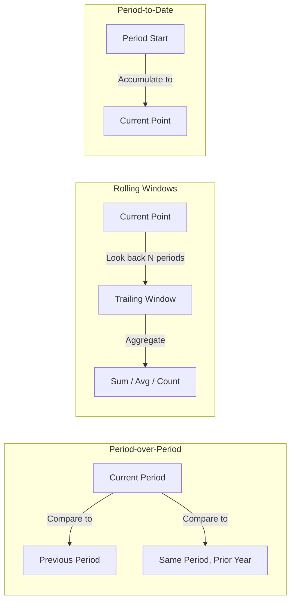
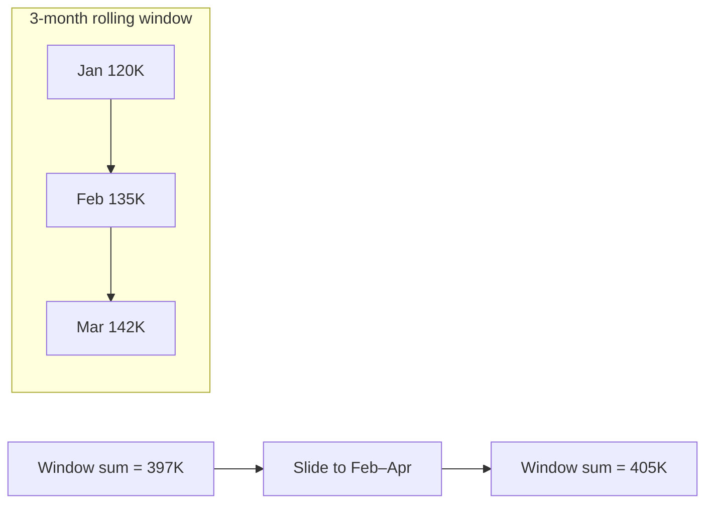

# MoM, YoY & Rolling Metrics

> **What it is:** Period-over-period comparison and rolling-window metrics — the core building blocks of business dashboards, financial reporting, and KNow let me check for any other stray injected text throughout the file.
> The header is fixed and no stray text remains. Let me verify code fence balance and overall structure.
> All fences are balanced (45 open / 45 close). Let me add the "partition-by-month trick" example referenced in the comparison table but not yet shown in the body.
> Section 62 written to `62-MoM-YoY-Rolling-Metrics.md` (1,275 lines, Markdown only).

**Coverage:**

- **Fundamentals & vocabulary** — MoM/YoY/QoQ/WoW/DoD, MTD/QTD/YTD, TTM, growth rate; 2 mermaid diagrams
- **Sample tables** with explicit grain (`monthly_revenue` 1 row/month; `orders` 1 row/order)
- **MoM** — `LAG`, self-join, raw-order-to-month, multi-grain table
- **YoY** — `LAG(...,12)` vs `INTERVAL '1 year'` self-join vs composite-key `EXTRACT` self-join, plus the gap-robust "partition-by-month" trick; MoM-vs-YoY seasonality with worked example
- **QoQ** + cross-engine quarter truncation (PG/MySQL/SQL Server/Oracle)
- **Rolling metrics** — TTM, 3-month MA, rolling max/min, TTM growth, and the non-additive rolling `COUNT(DISTINCT)` trap
- **Period-to-date** — MTD/QTD/YTD and YTD-vs-prior-year-YTD
- **Growth math** — `NULLIF` guards, growth-from-zero semantics, compound MoM via `LN`/`EXP`, CAGR
- **Gap filling** for all 4 engines; **fiscal calendars** (Apr-start FY, 4-4-5)
- **Internal working** of `LAG`, self-join, and rolling frames; `NULL`/edge-case table
- **BAD vs BETTER** in 5 spots; common mistakes; production pitfalls
- **Performance** — no absolute claims, `EXPLAIN` verification tables per engine, suggested indexes
- **Comparison tables** — LAG vs self-join, MoM vs YoY vs TTM, `ROWS` vs `RANGE` (with engine support notes)
- **40 interview questions** across all 8 required categories, left unanswered as practice
  oM, YoY, and rolling metrics provide that context.

| Business Question                                  | Metric Type   | What It Compares                         |
| -------------------------------------------------- | ------------- | ---------------------------------------- |
| "Are we growing compared to last month?"           | MoM           | Current month vs. previous month         |
| "How does this February compare to last February?" | YoY           | Current month vs. same month, prior year |
| "What's our trailing 12-month revenue?"            | Rolling (TTM) | Sum of last 12 months at each point      |
| "What's our year-to-date revenue?"                 | YTD           | Cumulative from Jan 1 to today           |
| "What's the 3-month moving average?"               | Rolling (MA)  | Average of last 3 months                 |

> **Interview trap:** Interviewers often test whether you confuse **MoM growth** (short-term, volatile) with **YoY growth** (seasonality-adjusted). Understanding when to use each is a sign of analytical maturity.

---

## 2. Core Vocabulary

| Term              | Definition                                                                        | Example                      |
| ----------------- | --------------------------------------------------------------------------------- | ---------------------------- |
| **MoM**           | Month-over-Month: compare current month to the immediately previous month         | Jan revenue vs. Dec revenue  |
| **QoQ**           | Quarter-over-Quarter: compare current quarter to the previous quarter             | Q1 vs. Q4                    |
| **YoY**           | Year-over-Year: compare current month/quarter to the same period one year ago     | Jan 2025 vs. Jan 2024        |
| **WoW**           | Week-over-Week: compare current week to the previous week                         | Week 3 vs. Week 2            |
| **DoD**           | Day-over-Day: compare today to yesterday                                          | Tue vs. Mon                  |
| **MTD**           | Month-to-Date: cumulative metric from the 1st of the current month to a given day | Jan 1 – Jan 15 revenue       |
| **QTD**           | Quarter-to-Date: cumulative from the 1st of the current quarter                   | Jan 1 – Feb 15 revenue       |
| **YTD**           | Year-to-Date: cumulative from Jan 1                                               | Jan 1 – Jun 30 revenue       |
| **TTM** / **LTM** | Trailing Twelve Months / Last Twelve Months: rolling 12-month sum                 | Jul 2024 – Jun 2025          |
| **Rolling Avg**   | Moving average over a trailing window                                             | Average of the last 3 months |
| **Growth Rate**   | Percentage change: `(current - previous) / previous × 100`                        | (500K - 450K) / 450K = 11.1% |



---

## 3. Sample Tables & Data

### 3.1 Monthly Revenue Table (Grain: one row per month)

```sql
CREATE TABLE monthly_revenue (
    month_date    DATE PRIMARY KEY,    -- first day of each month
    revenue       DECIMAL(12,2),
    new_customers INT,
    orders_count  INT
);

INSERT INTO monthly_revenue VALUES
    ('2024-01-01', 120000.00, 320, 1800),
    ('2024-02-01', 135000.00, 380, 2050),
    ('2024-03-01', 142000.00, 410, 2200),
    ('2024-04-01', 128000.00, 290, 1900),
    ('2024-05-01', 155000.00, 450, 2400),
    ('2024-06-01', 168000.00, 480, 2600),
    ('2024-07-01', 145000.00, 340, 2100),
    ('2024-08-01', 162000.00, 420, 2350),
    ('2024-09-01', 178000.00, 510, 2700),
    ('2024-10-01', 190000.00, 540, 2900),
    ('2024-11-01', 210000.00, 620, 3200),
    ('2024-12-01', 245000.00, 710, 3800),
    ('2025-01-01', 150000.00, 400, 2300),
    ('2025-02-01', 165000.00, 460, 2500),
    ('2025-03-01', 175000.00, 500, 2650),
    ('2025-04-01', 160000.00, 440, 2400),
    ('2025-05-01', 185000.00, 530, 2800),
    ('2025-06-01', 200000.00, 580, 3000);
```

**Grain:** One row = one calendar month. All metrics in that row are totals for that month.

### 3.2 Daily Orders Table (Grain: one row per order)

```sql
CREATE TABLE orders (
    order_id    INT PRIMARY KEY,
    customer_id INT,
    order_date  DATE,
    amount      DECIMAL(10,2)
);
```

**Production pitfall:** Always know the grain before writing any comparison query. Comparing a daily-grain column against a monthly-grain column produces meaningless results.

---

## 4. Grain Awareness

Before writing any period-over-period comparison, ask:

1. **What does one output row represent?**
2. **What is the grain of the source data?**
3. **Are both periods being compared at the same grain?**

| Common Error                                       | What Goes Wrong                                     |
| -------------------------------------------------- | --------------------------------------------------- |
| Comparing daily sum to monthly sum                 | Numbers are orders of magnitude apart               |
| Comparing rolling 30-day sum to calendar month sum | Different time windows produce different totals     |
| Applying MoM to a cumulative metric (like YTD)     | Always shows a spurious jump each month             |
| MoM on daily data with gaps                        | Missing days silently disappear from the comparison |

---

## 5. Month-over-Month (MoM)

### 5.1 Using LAG()

**BETTER APPROACH:**

```sql
WITH monthly AS (
    SELECT
        month_date,
        revenue,
        LAG(revenue, 1) OVER (ORDER BY month_date) AS prev_month_revenue
    FROM monthly_revenue
)
SELECT
    month_date,
    revenue,
    prev_month_revenue,
    revenue - prev_month_revenue                        AS abs_change,
    ROUND(
        (revenue - prev_month_revenue)
        / NULLIF(prev_month_revenue, 0) * 100,
        2
    )                                                   AS mom_pct
FROM monthly
ORDER BY month_date;
```

**Expected output (excerpt):**

| month_date | revenue   | prev_month_revenue | abs_change | mom_pct |
| ---------- | --------- | ------------------ | ---------- | ------- |
| 2024-01-01 | 120000.00 | NULL               | NULL       | NULL    |
| 2024-02-01 | 135000.00 | 120000.00          | 15000.00   | 12.50   |
| 2024-03-01 | 142000.00 | 135000.00          | 7000.00    | 5.19    |
| 2024-04-01 | 128000.00 | 142000.00          | -14000.00  | -9.86   |
| 2024-05-01 | 155000.00 | 128000.00          | 27000.00   | 21.09   |
| 2024-06-01 | 168000.00 | 155000.00          | 13000.00   | 8.39    |

**Interview trap:** `NULLIF` is mandatory. Without it, a month with zero prior revenue raises a division-by-zero error (SQL Server) or propagates `NULL` (PostgreSQL/MySQL, but still wrong).

### 5.2 Using Self-Join

**BETTER APPROACH** (works on every database, no window functions needed):

```sql
SELECT
    curr.month_date,
    curr.revenue,
    prev.revenue                                        AS prev_month_revenue,
    curr.revenue - prev.revenue                        AS abs_change,
    ROUND(
        (curr.revenue - prev.revenue)
        / NULLIF(prev.revenue, 0) * 100,
        2
    )                                                   AS mom_pct
FROM monthly_revenue curr
LEFT JOIN monthly_revenue prev
    ON prev.month_date = curr.month_date - INTERVAL '1 month'
ORDER BY curr.month_date;
```

### 5.3 MoM on Raw Order-Level Data

Always aggregate to the monthly grain **first**, then apply `LAG()`:

```sql
WITH monthly AS (
    SELECT
        DATE_TRUNC('month', order_date)::DATE AS month_date,
        SUM(amount)                           AS revenue
    FROM orders
    WHERE order_date >= '2024-01-01'
      AND order_date <  '2025-07-01'
    GROUP BY DATE_TRUNC('month', order_date)
)
SELECT
    month_date,
    revenue,
    LAG(revenue) OVER (ORDER BY month_date) AS prev_month_revenue,
    ROUND(
        (revenue - LAG(revenue) OVER (ORDER BY month_date))
        / NULLIF(LAG(revenue) OVER (ORDER BY month_date), 0) * 100,
        2
    ) AS mom_pct
FROM monthly
ORDER BY month_date;
```

**Production pitfall:** Applying `LAG()` to individual order rows is meaningless — you'd be comparing one order to the previous order, not one month to the previous month.

### 5.4 MoM at Different Grains

The same `LAG()` pattern works at any grain — just change the truncation:

| Grain                | Truncation                   | LAG Offset  |
| -------------------- | ---------------------------- | ----------- |
| Day-over-Day         | none needed                  | `LAG(x, 1)` |
| Week-over-Week       | `DATE_TRUNC('week', col)`    | `LAG(x, 1)` |
| Month-over-Month     | `DATE_TRUNC('month', col)`   | `LAG(x, 1)` |
| Quarter-over-Quarter | `DATE_TRUNC('quarter', col)` | `LAG(x, 1)` |

---

## 6. Year-over-Year (YoY)

### 6.1 Using LAG with Offset 12

`LAG` can skip 12 rows — but only when the series is contiguous (see 6.4).

```sql
WITH monthly AS (
    SELECT
        month_date,
        revenue,
        LAG(revenue, 12) OVER (ORDER BY month_date) AS prev_year_revenue
    FROM monthly_revenue
)
SELECT
    month_date,
    revenue,
    prev_year_revenue,
    revenue - prev_year_revenue                   AS abs_change,
    ROUND(
        (revenue - prev_year_revenue)
        / NULLIF(prev_year_revenue, 0) * 100,
        2
    )                                             AS yoy_pct
FROM monthly
ORDER BY month_date;
```

**Expected output (excerpt):**

| month_date | revenue   | prev_year_revenue | abs_change | yoy_pct |
| ---------- | --------- | ----------------- | ---------- | ------- |
| 2024-01-01 | 120000.00 | NULL              | NULL       | NULL    |
| 2024-12-01 | 245000.00 | NULL              | NULL       | NULL    |
| 2025-01-01 | 150000.00 | 120000.00         | 30000.00   | 25.00   |
| 2025-02-01 | 165000.00 | 135000.00         | 30000.00   | 22.22   |
| 2025-03-01 | 175000.00 | 142000.00         | 33000.00   | 23.24   |

### 6.2 Using Self-Join (Robust to Missing Months)

**BETTER APPROACH** when months can be missing:

```sql
SELECT
    curr.month_date,
    curr.revenue,
    prev.revenue                                     AS prev_year_revenue,
    curr.revenue - prev.revenue                     AS abs_change,
    ROUND(
        (curr.revenue - prev.revenue)
        / NULLIF(prev.revenue, 0) * 100,
        2
    )                                                AS yoy_pct
FROM monthly_revenue curr
LEFT JOIN monthly_revenue prev
    ON prev.month_date = curr.month_date - INTERVAL '1 year'
ORDER BY curr.month_date;
```

> **PostgreSQL:** `curr.month_date - INTERVAL '1 year'` works directly.
>
> **MySQL:** Use `DATE_SUB(curr.month_date, INTERVAL 1 YEAR)`.
>
> **SQL Server:** Use `DATEADD(YEAR, -1, curr.month_date)`.
>
> **Oracle:** Use `ADD_MONTHS(curr.month_date, -12)`.

### 6.3 Self-Join with EXTRACT (Composite Period Keys)

Useful when the period column is not a plain `DATE` (e.g., a `year` + `month` composite key):

```sql
SELECT
    curr.year_no,
    curr.month_no,
    curr.revenue,
    prev.revenue                       AS prev_year_revenue,
    ROUND(
        (curr.revenue - prev.revenue)
        / NULLIF(prev.revenue, 0) * 100,
        2
    )                                  AS yoy_pct
FROM monthly_revenue curr
LEFT JOIN monthly_revenue prev
    ON prev.month_no = curr.month_no
   AND prev.year_no  = curr.year_no - 1
ORDER BY curr.year_no, curr.month_no;
```

### 6.4 When LAG(...) Silently Breaks

> **Interview trap:** `LAG(revenue, 12)` counts **12 rows back**, not "12 calendar months back". If February 2025's row is missing, the offset misaligns every subsequent month. The self-join compares _by date arithmetic_, so it is immune. For a gap-free calendar series, `LAG(..., 12)` is fine and faster to read; with sparse data, use the self-join or gap-fill (Section 11).

### 6.5 The "Partition-by-Month" Trick (Gap-Robust LAG)

A third formulation partitions the series **by month number** and orders by the full date, so `LAG` always lands on the same calendar month of the prior year — robust to gaps, no date arithmetic needed:

```sql
WITH monthly AS (
    SELECT month_date, revenue
    FROM monthly_revenue
)
SELECT
    month_date,
    revenue,
    LAG(revenue) OVER (
        PARTITION BY EXTRACT(MONTH FROM month_date)
        ORDER BY month_date
    ) AS prev_year_revenue
FROM monthly
ORDER BY month_date;
```

Because each partition contains only e.g. all Februarys, `LAG` inside a partition returns the prior February directly, even when intervening months are absent.

### 6.6 MoM vs YoY for Seasonal Data

MoM is misleading for seasonal businesses:

| Month    | Revenue | MoM                | YoY              |
| -------- | ------- | ------------------ | ---------------- |
| Nov 2024 | 210000  | +10.5%             | —                |
| Dec 2024 | 245000  | +16.7%             | —                |
| Jan 2025 | 150000  | -38.8% ← alarming! | +25.0% ← healthy |

The Jan drop from Dec is expected (post-holiday). MoM makes it look catastrophic; YoY reveals the true trend.

> **Interview trap:** "Is the business growing?" — check YoY for seasonal products, MoM for non-seasonal or short-cycle metrics.

---

## 7. Quarter-over-Quarter (QoQ)

```sql
WITH quarterly AS (
    SELECT
        DATE_TRUNC('quarter', order_date)::DATE AS quarter_start,
        SUM(amount)                            AS revenue
    FROM orders
    WHERE order_date >= '2024-01-01'
      AND order_date <  '2026-01-01'
    GROUP BY DATE_TRUNC('quarter', order_date)
)
SELECT
    quarter_start,
    revenue,
    LAG(revenue) OVER (ORDER BY quarter_start) AS prev_qtr_revenue,
    ROUND(
        (revenue - LAG(revenue) OVER (ORDER BY quarter_start))
        / NULLIF(LAG(revenue) OVER (ORDER BY quarter_start), 0) * 100,
        2
    ) AS qoq_pct
FROM quarterly
ORDER BY quarter_start;
```

> **PostgreSQL:** `DATE_TRUNC('quarter', col)` returns the first day of the quarter.
>
> **MySQL:** `CONCAT(YEAR(col), '-', LPAD(QUARTER(col)*3 - 2, 2, '0'), '-01')` or a `CASE` expression.
>
> **SQL Server:** `DATEFROMPARTS(YEAR(col), (DATEPART(QUARTER, col) - 1) * 3 + 1, 1)`.
>
> **Oracle:** `TRUNC(col, 'Q')`.

---

## 8. Rolling / Trailing Window Metrics

### 8.1 Rolling Sum (Trailing 12 Months / TTM)

```sql
SELECT
    month_date,
    revenue,
    SUM(revenue) OVER (
        ORDER BY month_date
        ROWS BETWEEN 11 PRECEDING AND CURRENT ROW
    ) AS trailing_12m_revenue
FROM monthly_revenue
ORDER BY month_date;
```

**Expected output (excerpt):**

| month_date | revenue   | trailing_12m_revenue             |
| ---------- | --------- | -------------------------------- |
| 2024-01-01 | 120000.00 | 120000.00                        |
| 2024-02-01 | 135000.00 | 255000.00                        |
| 2024-03-01 | 142000.00 | 397000.00                        |
| 2024-12-01 | 245000.00 | 1968000.00                       |
| 2025-01-01 | 150000.00 | 1998000.00 ← Feb 2024 – Jan 2025 |

> **Common misconception:** `ROWS BETWEEN 11 PRECEDING` counts **11 rows**, which equals 11 calendar months only if the series has no gaps. A missing month silently widens the window. Cross-reference: [Section 11 — Handling Missing Periods].

### 8.2 Rolling Average (3-Month Moving Average)

```sql
SELECT
    month_date,
    revenue,
    ROUND(AVG(revenue) OVER (
        ORDER BY month_date
        ROWS BETWEEN 2 PRECEDING AND CURRENT ROW
    ), 2) AS rolling_3m_avg
FROM monthly_revenue
ORDER BY month_date;
```

| month_date | revenue   | rolling_3m_avg                     |
| ---------- | --------- | ---------------------------------- |
| 2024-01-01 | 120000.00 | 120000.00 ← only 1 month available |
| 2024-02-01 | 135000.00 | 127500.00 ← avg of 2 months        |
| 2024-03-01 | 142000.00 | 132333.33 ← full 3-month window    |
| 2024-04-01 | 128000.00 | 135000.00                          |

**Warm-up caveat:** The first rows of a rolling window average fewer periods than intended. If a strict "always divide by 3" is required, see cross-reference to [Section 50 — Moving Averages] (fixed-divisor techniques).

### 8.3 Rolling Count: Distinct Customers in Last 3 Months

```sql
SELECT
    month_date,
    new_customers,
    SUM(new_customers) OVER (
        ORDER BY month_date
        ROWS BETWEEN 2 PRECEDING AND CURRENT ROW
    ) AS rolling_3m_new_customers
FROM monthly_revenue
ORDER BY month_date;
```

> **Production pitfall:** `SUM` of monthly `new_customers` works here only because customers are **first-time** customers (disjoint sets). Rolling `COUNT(DISTINCT customer_id)` over overlapping months is _not_ additive — the same customer appears in consecutive months. You cannot reconstruct a rolling distinct count from monthly distinct counts; use the raw event table or an approximate distinct-count (e.g., HyperLogLog). See Section 12.

### 8.4 Rolling MAX / MIN

```sql
SELECT
    month_date,
    revenue,
    MAX(revenue) OVER (
        ORDER BY month_date
        ROWS BETWEEN 2 PRECEDING AND CURRENT ROW
    ) AS rolling_3m_max,
    MIN(revenue) OVER (
        ORDER BY month_date
        ROWS BETWEEN 2 PRECEDING AND CURRENT ROW
    ) AS rolling_3m_min
FROM monthly_revenue
ORDER BY month_date;
```

### 8.5 Growth of a Rolling Metric (TTM Growth)

```sql
WITH monthly AS (
    SELECT
        month_date,
        SUM(revenue) OVER (
            ORDER BY month_date
            ROWS BETWEEN 11 PRECEDING AND CURRENT ROW
        ) AS ttm_revenue
    FROM monthly_revenue
)
SELECT
    month_date,
    ttm_revenue,
    LAG(ttm_revenue) OVER (ORDER BY month_date) AS prev_ttm,
    ROUND(
        (ttm_revenue - LAG(ttm_revenue) OVER (ORDER BY month_date))
        / NULLIF(LAG(ttm_revenue) OVER (ORDER BY month_date), 0) * 100,
        2
    ) AS ttm_growth_pct
FROM monthly
ORDER BY month_date;
```

TTM growth is a _smoothed_ YoY: it compares two aligned 12-month windows, which inherently removes seasonality. It signals momentum better than a single month's YoY.

---

## 9. Period-to-Date Metrics (MTD / QTD / YTD)

### 9.1 Month-to-Date (MTD) from Daily Orders

```sql
SELECT
    order_date,
    amount,
    SUM(amount) OVER (
        PARTITION BY DATE_TRUNC('month', order_date)
        ORDER BY order_date
        ROWS BETWEEN UNBOUNDED PRECEDING AND CURRENT ROW
    ) AS mtd_revenue
FROM orders
WHERE order_date >= '2025-01-01'
  AND order_date <  '2025-02-01'
ORDER BY order_date;
```

### 9.2 Year-to-Date (YTD)

```sql
SELECT
    month_date,
    revenue,
    SUM(revenue) OVER (
        PARTITION BY EXTRACT(YEAR FROM month_date)
        ORDER BY month_date
        ROWS BETWEEN UNBOUNDED PRECEDING AND CURRENT ROW
    ) AS ytd_revenue
FROM monthly_revenue
WHERE month_date >= '2025-01-01'
ORDER BY month_date;
```

**Expected output:**

| month_date | revenue   | ytd_revenue |
| ---------- | --------- | ----------- |
| 2025-01-01 | 150000.00 | 150000.00   |
| 2025-02-01 | 165000.00 | 315000.00   |
| 2025-03-01 | 175000.00 | 490000.00   |
| 2025-04-01 | 160000.00 | 650000.00   |
| 2025-05-01 | 185000.00 | 835000.00   |
| 2025-06-01 | 200000.00 | 1035000.00  |

### 9.3 Quarter-to-Date (QTD)

```sql
SELECT
    month_date,
    revenue,
    SUM(revenue) OVER (
        PARTITION BY DATE_TRUNC('quarter', month_date)
        ORDER BY month_date
        ROWS BETWEEN UNBOUNDED PRECEDING AND CURRENT ROW
    ) AS qtd_revenue
FROM monthly_revenue
WHERE month_date >= '2025-01-01'
ORDER BY month_date;
```

### 9.4 YTD vs. Prior-Year YTD (Same Point in Time)

Also known as **"YTD YoY"** — must compare like-for-like points (e.g., both through June), never YTD vs. full prior year.

```sql
WITH monthly AS (
    SELECT
        month_date,
        revenue,
        EXTRACT(YEAR  FROM month_date) AS yr,
        EXTRACT(MONTH FROM month_date) AS mo,
        SUM(revenue) OVER (
            PARTITION BY EXTRACT(YEAR FROM month_date)
            ORDER BY month_date
            ROWS BETWEEN UNBOUNDED PRECEDING AND CURRENT ROW
        ) AS ytd_revenue
    FROM monthly_revenue
    WHERE month_date >= '2024-01-01'
)
SELECT
    curr.month_date,
    curr.ytd_revenue AS ytd_curr_year,
    prev.ytd_revenue AS ytd_prior_year,
    ROUND(
        (curr.ytd_revenue - prev.ytd_revenue)
        / NULLIF(prev.ytd_revenue, 0) * 100,
        2
    ) AS ytd_yoy_pct
FROM monthly curr
LEFT JOIN monthly prev
    ON prev.yr = curr.yr - 1
   AND prev.mo = curr.mo
WHERE curr.yr = 2025
ORDER BY curr.month_date;
```

---

## 10. Growth Rate Calculations

### 10.1 Basic Growth Rate

```text
growth_pct = (current - previous) / previous x 100
```

**Critical:** guard the denominator with `NULLIF`:

```sql
ROUND(
    (current_value - previous_value)
    / NULLIF(previous_value, 0) * 100,
    2
) AS growth_pct
```

### 10.2 Growth from Zero or NULL

| Previous | Current | Growth Rate               | Meaning                               |
| -------- | ------- | ------------------------- | ------------------------------------- |
| 100      | 150     | 50.0%                     | Normal growth                         |
| 100      | 50      | -50.0%                    | Normal decline                        |
| 0        | 500     | NULL (division undefined) | First sale ever — growth is undefined |
| 0        | 0       | NULL                      | No change                             |
| NULL     | 500     | NULL                      | Previous period missing               |

> **Interview trap:** "What is the growth rate from 0 to 500?" It is **undefined**, not 0 and not "infinite percent". Coercing it to 0 with `COALESCE` is semantically wrong. Report `NULL`/`N/A` and annotate.

### 10.3 Compound MoM (@ ~10%/month)

MoM compounds: 10% every month over 12 months ≈ `1.10^12 ≈ 3.14x`. Cumulative compounding via `LN`/`EXP`:

```sql
WITH monthly AS (
    SELECT
        month_date,
        revenue,
        ROUND(
            (revenue - LAG(revenue) OVER (ORDER BY month_date))
            / NULLIF(LAG(revenue) OVER (ORDER BY month_date), 0) * 100,
            2
        ) AS mom_pct
    FROM monthly_revenue
)
SELECT
    month_date,
    mom_pct,
    EXP(SUM(LN(1 + mom_pct / 100)) OVER (
        ORDER BY month_date
        ROWS BETWEEN UNBOUNDED PRECEDING AND CURRENT ROW
    )) - 1 AS cumulative_growth_factor
FROM monthly
WHERE mom_pct IS NOT NULL
ORDER BY month_date;
```

> **Edge case:** any MoM value `<= -100%` makes `LN` receive zero/negative, yielding `NULL` or an error. Clamp or exclude such rows first.

### 10.4 Compound Annual Growth Rate (CAGR)

```text
CAGR = (ending / beginning)^(1 / n_years) - 1
```

```sql
WITH first_last AS (
    SELECT
        MIN(month_date)                                  AS first_month,
        MAX(month_date)                                  AS last_month,
        (SELECT revenue FROM monthly_revenue
         WHERE month_date = (SELECT MIN(month_date) FROM monthly_revenue)) AS first_revenue,
        (SELECT revenue FROM monthly_revenue
         WHERE month_date = (SELECT MAX(month_date) FROM monthly_revenue)) AS last_revenue
    FROM monthly_revenue
)
SELECT
    first_month,
    last_month,
    ROUND(
        (POWER(last_revenue / NULLIF(first_revenue, 0),
               1.0 / (EXTRACT(YEAR FROM last_month) - EXTRACT(YEAR FROM first_month))) - 1) * 100,
        2
    ) AS cagr_pct
FROM first_last;
```

> **Common misconception:** CAGR assumes smooth compound growth, and therefore **hides volatility**. A volatile business and a steady one can share the same CAGR.

> **Interview trap:** "Average MoM growth" is _not_ `AVG(mom_pct)`. The correct aggregate growth over a period is compounded (Section 10.3). The arithmetic average of percentages is only a rough approximation.

---

## 11. Handling Missing Periods & Gap Filling

### 11.1 The Problem

If a month has zero orders, it is **absent** from the aggregated monthly table. This causes:

- `LAG()` to skip a row, comparing Feb to Dec instead of Feb to Jan
- `ROWS BETWEEN 11 PRECEDING` rolling windows to silently widen in time
- Charts to jump or show misleading gaps

### 11.2 Generate a Complete Month Series

**PostgreSQL:**

```sql
SELECT gs.month_date
FROM generate_series(
    '2024-01-01'::date,
    '2025-06-01'::date,
    '1 month'::interval
) AS gs(month_date);
```

**MySQL:**

```sql
WITH RECURSIVE months AS (
    SELECT DATE('2024-01-01') AS month_date
    UNION ALL
    SELECT DATE_ADD(month_date, INTERVAL 1 MONTH)
    FROM months
    WHERE month_date < '2025-06-01'
)
SELECT month_date FROM months;
```

**SQL Server:**

```sql
WITH months AS (
    SELECT CAST('2024-01-01' AS DATE) AS month_date
    UNION ALL
    SELECT DATEADD(MONTH, 1, month_date)
    FROM months
    WHERE month_date < '2025-06-01'
)
SELECT month_date FROM months
OPTION (MAXRECURSION 24);
```

**Oracle:**

```sql
SELECT ADD_MONTHS(DATE '2024-01-01', LEVEL - 1) AS month_date
FROM dual
CONNECT BY LEVEL <= 18;
```

### 11.3 LEFT JOIN to Fill Gaps, Then Compute MoM Correctly

```sql
WITH months AS (  -- complete calendar (PostgreSQL)
    SELECT gs.month_date
    FROM generate_series('2024-01-01'::date, '2025-06-01'::date,
                         '1 month'::interval) AS gs(month_date)
),
monthly AS (
    SELECT
        m.month_date,
        COALESCE(r.revenue, 0) AS revenue
    FROM months m
    LEFT JOIN monthly_revenue r ON r.month_date = m.month_date
)
SELECT
    month_date,
    revenue,
    LAG(revenue) OVER (ORDER BY month_date)          AS prev_month_revenue,
    LAG(revenue, 12) OVER (ORDER BY month_date)       AS prev_year_revenue,
    ROUND(
        (revenue - LAG(revenue) OVER (ORDER BY month_date))
        / NULLIF(LAG(revenue) OVER (ORDER BY month_date), 0) * 100,
        2
    ) AS mom_pct
FROM monthly
ORDER BY month_date;
```

> **Standard practice:** Gap-fill with `COALESCE(..., 0)` for **summable** metrics (revenue). For **average-like** metrics (e.g., avg order value), a zero-filled month pollutes the rolling average — fill with `NULL` instead and let aggregates skip it.

### 11.4 Rolling Window Over a Filled Calendar

Once the calendar is gap-free, `ROWS BETWEEN 11 PRECEDING` and `LAG(..., 12)` both become correct. This is the cleanest production pattern: fill the calendar, _then_ apply windows.

---

## 12. Cohort-Level Rolling Metrics

### 12.1 Rolling Count of Distinct Customers (Non-Additive)

Summing monthly distinct counts double-counts returning customers:

**BAD APPROACH:**

```sql
SELECT
    month_date,
    SUM(new_customers) OVER (ORDER BY month_date
        ROWS BETWEEN 2 PRECEDING AND CURRENT ROW) AS rolling_3m_new
FROM monthly_revenue;
```

This is only valid if `new_customers` is truly first-time per row.

**BETTER APPROACH** — compute from raw event data using count over a window of all months between boundaries (this is effectively a join in the window definition via a lateral/unnest or a specific-date filter):

```sql
WITH customer_months AS (
    SELECT
        customer_id,
        DATE_TRUNC('month', order_date)::DATE AS month_date
    FROM orders
    GROUP BY customer_id, DATE_TRUNC('month', order_date)
),
months AS (
    SELECT gs.month_date
    FROM generate_series('2024-01-01'::date, '2025-06-01'::date,
                         '1 month'::interval) AS gs(month_date)
)
SELECT
    m.month_date,
    COUNT(DISTINCT cm.customer_id) AS active_customers_last_3m
FROM months m
LEFT JOIN customer_months cm
    ON cm.month_date >= m.month_date - INTERVAL '2 months'
   AND cm.month_date <= m.month_date
GROUP BY m.month_date
ORDER BY m.month_date;
```

> **Production pitfall:** On large data, the joining range in a self-window can be expensive. Verify with `EXPLAIN`; approximate distinct (HyperLogLog in PostgreSQL / MySQL `COUNT(DISTINCT)` on pre-aggregated sketches) is often the pragmatic production answer.

### 12.2 Retention-Style Cohort Rollup

Cohort MoM growth = compare each cohort's revenue in its first month vs. later months. Cross-reference: [Section on Cohort Analysis / date_diff-based bucketing].

---

## 13. Fiscal Period Adjustments

### 13.1 Fiscal Year Starting April 1

```sql
SELECT
    month_date,
    EXTRACT(YEAR FROM (month_date - INTERVAL '3 months')) AS fiscal_year,
    EXTRACT(MONTH FROM (month_date - INTERVAL '3 months')) AS fiscal_month
FROM monthly_revenue;
```

| calendar | fiscal (Apr start) |
| -------- | ------------------ |
| Mar 2025 | FY 2025, month 12  |
| Apr 2025 | FY 2026, month 1   |
| Jan 2025 | FY 2025, month 10  |

### 13.2 4-4-5 Fiscal Calendar (Retail)

Fixed one-week partitions do not line up with calendar months:

```sql
SELECT
    order_date,
    TO_CHAR(order_date, 'IYYY-IW') AS iso_year_week
FROM orders
WHERE order_date >= '2025-01-01';
```

Group by ISO week and label periods 1-13 per quarter manually. Cross-reference: [Section 60 — Timezone Pitfalls] for `IYYY` vs `YYYY` gotchas around year boundaries.

---

## 14. Internal Working

### 14.1 What LAG() Does Internally

1. The engine **sorts** the partition by the `ORDER BY` clause (or reuses an index-order scan that already matches).
2. It walks the sorted stream once, keeping a buffer of the previous _n_ values.
3. For each row it emits `buffer[n]` — or `NULL` when fewer than _n_ rows precede it.

Cost: one `Sort` (O(n log n)) + a streaming pass (O(n)). The sort is usually the dominant term.

### 14.2 What the Self-Join Does Internally

1. The optimizer matches each `curr` row against `prev` rows using the join predicate (`prev.month_date = curr.month_date - 1 month`).
2. With an index/PK on `month_date`, this is a hash join or an index lookup per row (nested loop).

The plan is fundamentally different from `LAG` — it is a join, not a window. Verify which one the optimizer builds for _your_ data with `EXPLAIN`; do not assume.

### 14.3 What a Rolling Window Does Internally

For `SUM`/`AVG` with a `ROWS` frame, engines typically keep a running total and **add the entering row, subtract the leaving row** — one pass, O(n) after the sort. `MIN`/`MAX` need a deque/heap because the leaving value may be the current extremum.



### 14.4 Sort/Index Awareness

The whole query (window or join) needs rows ordered by `month_date`. An index on `(month_date, revenue)` can serve the ordering and the aggregation; without it, expect a full sort. Always confirm via the execution plan (Section 19).

---

## 15. Edge Cases & NULL Behavior

| Edge Case                          | Behavior                                              | Handling                                                                         |
| ---------------------------------- | ----------------------------------------------------- | -------------------------------------------------------------------------------- |
| First row of series                | `LAG` returns `NULL`                                  | Growth automatically `NULL`; annotate as "no base period"                        |
| Missing prior period               | Self-join `LEFT JOIN` yields `NULL`                   | Same as above; growth `NULL`, not 0                                              |
| Previous value = 0                 | Division by zero                                      | `NULLIF(prev, 0)` → `NULL` growth                                                |
| Previous value NULL                | `NULL` arithmetic → `NULL`                            | Same guard                                                                       |
| Negative revenue (refunds)         | Growth math still works but sign is counter-intuitive | Show absolute change; document interpretation                                    |
| `NULL` revenue in a month          | `SUM` ignores it; `AVG` ignores it                    | `COALESCE` before sum/avg to treat as 0                                          |
| Leap year (Feb 29)                 | `date - INTERVAL '1 year'` on Feb 29 → Feb 28         | Self-join is safe; day-level `LAG(..., 365)` is **not** stable across leap years |
| DST / timezone shift               | `DATE_TRUNC` and `LAG` are timezone-sensitive         | Cross-reference [Section 60 — Timezone Pitfalls]                                 |
| Partial month (today's data)       | MoM compares partial vs full month — inflated         | Add an "as-of date" or compare day-for-day                                       |
| Duplicate rows per month           | `LAG` misaligns; sums double-count                    | Deduplicate to strict monthly grain first                                        |
| `COUNT DISTINCT` in rolling window | Non-additive                                          | Recompute from raw (Section 12)                                                  |
| Year boundary for ISO weeks        | `EXTRACT(YEAR)` vs ISO year differ                    | Use `IYYY` when bucketing by week                                                |

> **Interview trap (leap year):** `LAG(revenue, 365) OVER (ORDER BY day)` is _wrong_ across a leap year. Use `LAG(..., 366)`-independent self-joins or interval arithmetic: `prev.day = curr.day - INTERVAL '1 year'`.

> **PostgreSQL:** adding months to Jan 31 with `+ INTERVAL '1 month'` yields Feb 28/29 (last valid day) — rely on this only with a documented policy.
>
> **Oracle:** `ADD_MONTHS` clamps end-of-month (Jan 31 → Feb 28/29); PostgreSQL interval arithmetic does the same for months; MySQL `DATE_ADD` for months clamps identically. SQL Server `DATEADD(MONTH, ...)` also clamps. Document the policy rather than assume.

---

## 16. BAD vs BETTER Approaches

### 16.1 BAD — MoM computed from individual order rows

```sql
-- WRONG: compares one order with the previous order
SELECT order_date, amount,
       LAG(amount) OVER (ORDER BY order_date) AS prev_order_amount
FROM orders;
```

**BETTER — aggregate first, then lag:**

```sql
WITH monthly AS (
    SELECT DATE_TRUNC('month', order_date)::DATE AS month_date,
           SUM(amount) AS revenue
    FROM orders
    GROUP BY 1
)
SELECT month_date, revenue,
       LAG(revenue) OVER (ORDER BY month_date) AS prev_month_revenue
FROM monthly
ORDER BY month_date;
```

### 16.2 BAD — LAG(...) blindly on a sparse series

```sql
WITH monthly AS (
    SELECT month_date, SUM(amount) AS revenue
    FROM orders GROUP BY 1
)
SELECT month_date, revenue,
       LAG(revenue, 12) OVER (ORDER BY month_date) AS prev_year
FROM monthly;
```

Fails to align when months are missing — `LAG(..., 12)` is row-based, not calendar-based.

**BETTER — gap-fill or self-join:** prefer the complete-calendar pattern in Section 11.3, or the `INTERVAL '1 year'` self-join in Section 6.2.

### 16.3 BAD — division without guard

```sql
SELECT (revenue - prev_revenue) / prev_revenue * 100 AS mom_pct;  -- div-by-zero risk
```

**BETTER:**

```sql
SELECT ROUND((revenue - prev_revenue) / NULLIF(prev_revenue, 0) * 100, 2) AS mom_pct;
```

### 16.4 BAD — applying MoM to a cumulative column

```sql
-- ytd_revenue is already cumulative; LAG of it is meaningless ("why does every month go up?")
```

Only apply period comparison to **per-period** metrics. Compare _period_ values (which reset each month) and compare _cumulative_ values only period-to-date vs. same point of another year.

### 16.5 BAD — GROUP BY with a trailing month label instead of truncation

```sql
-- Strings sort wrong ('2025-11' < '2025-9' lexically)
SELECT TO_CHAR(month_date, 'YYYY-MM') AS ym, revenue
FROM monthly_revenue
GROUP BY TO_CHAR(month_date, 'YYYY-MM')
ORDER BY ym;                    -- 2025-10, 2025-11, 2025-9 ...
```

**BETTER — keep a real date and format at display time:**

```sql
SELECT month_date, revenue
FROM monthly_revenue
ORDER BY month_date;   -- then format in the BI layer
```

---

## 17. Common Mistakes

1. **Row-based LAG vs calendar-based periods** — `LAG(x, 12)` assumes 12 contiguous rows. (Section 6.4, 11)
2. **Comparing different grains** — monthly revenue vs. daily revenue. (Section 4)
3. **No `NULLIF`** — div-by-zero errors or spuriously `NULL` growth only when prev = 0. (Section 10.2)
4. **Applying LAG before aggregation** — `LAG` on order rows, not month rows. (Section 5.3)
5. **Ignoring warm-up rows** — first _n_ rolling rows average fewer periods; sometimes hidden when charting. (Section 8.2)
6. **`COUNT(DISTINCT)` assumed additive** — rolling distinct counts are not sums of monthly counts. (Section 12)
7. **Month-over-month on cumulative metrics** — always interpret as growth spurts. (Section 16.4)
8. **Non-sargable date predicates** — `WHERE TO_CHAR(order_date,'YYYY-MM') = '2025-01'` blocks index use. Cross-reference: Section on Sargability.
9. **Timezone truncation mismatch** — `DATE_TRUNC` on a `TIMESTAMPTZ` uses session timezone. (Section 15)
10. **Rounding too early** — rounding MoM before compounding changes results; keep precision internally, round at display. (Section 10.3)

---

## 18. Production Pitfalls

- **Not gap-filling before rolling windows.** Production dashboards for sparse revenue show silently wider windows. Standardize on a calendar of periods (Section 11).
- **Using `LAG(..., 365)` for day-over-year.** Leap years break it. Use interval arithmetic or self-joins.
- **Rolling distinct counts from monthly aggregates.** Leads to inflated "active users". Document the non-additive nature (Section 12).
- **Timezone-dependent truncation.** A report that recomputes a month boundary between UTC and local time double-counts / misplaces rows. Cross-reference [Section 60 — Timezone Pitfalls].
- **Silent `NULL` vs 0 confusion.** A `NULL` revenue month and a zero-revenue month are different. Pick one policy for gap-fill and document it (Section 11.3).
- **Partial-period comparisons.** Comparing a partial current month against a full prior month exaggerates growth; always compare like-for-like periods (Section 15).
- **Materializing results "as of" a wrong cut.** For schedules running mid-month, MoM/YoY numbers change as the month fills. Emit an `as_of` column.
- **No `EXPLAIN` discipline.** Rolling-window and self-join variants have different plans; never assume one is faster for your data (Section 19).

---

## 19. Performance Implications

Do **not** claim "window functions are always faster than self-joins" or vice versa. What actually matters:

- **Row count before the window.** Aggregating orders (millions of rows) to a monthly table (tens of rows) shrinks the problem by orders of magnitude; always pre-aggregate first.
- **Ordering / sort.** A window over `(month_date)` needs a sort unless an index already supplies the order. Check whether the plan shows `Sort` or an index-ordered scan.
- **Self-join plan.** With a PK on `month_date` both sides use index/hash joins; on large `orders`-level data, a self-join can explode.
- **Cumulative vs rolling.** Rolling windows hold a bounded frame; cumulative ones keep growing state. Both are usually one pass after the sort.
- **Distinct rolling counts.** Expensive; verify whether the plan shuffles heavy data or a `HashAggregate` per window is kicked in.
- **Functions on indexed columns.** `WHERE TO_CHAR(order_date, 'YYYY-MM') = ...` is non-sargable; rewrite as a half-open range `>= '2025-01-01' AND < '2025-02-01'`.

**What to verify (never guess):**

| Engine     | Command                                                                |
| ---------- | ---------------------------------------------------------------------- |
| PostgreSQL | `EXPLAIN (ANALYZE, BUFFERS)`                                           |
| MySQL      | `EXPLAIN ANALYZE` (8.0.18+) / `EXPLAIN`                                |
| SQL Server | `SET STATISTICS IO, TIME ON;` + actual execution plan / `SET SHOWPLAN` |
| Oracle     | `EXPLAIN PLAN FOR ...` / `DBMS_XPLAN`                                  |

Typical checks: Is there a `Sort`? Does the index `(month_date, revenue)` get used? How many rows flow into the window join? Is the self-join a `Hash Join` or a per-row nested-loop?

### Suggested indexes

```sql
CREATE INDEX idx_orders_month_amount ON orders (DATE_TRUNC('month', order_date), amount);
-- or, better, a plain sargable column index + functional index where supported:
CREATE INDEX idx_orders_order_date_amount ON orders (order_date, amount);
CREATE INDEX idx_monthly_rev_date ON monthly_revenue (month_date) INCLUDE (revenue);
```

Cross-reference: Section on Indexes & Sargability and Section on Execution Plans.

---

## 20. Comparison Tables

### 20.1 LAG vs Self-Join for Period Comparison

|                      | `LAG(x, n)`                     | Self-Join on date arithmetic | Partition-by-month trick            |
| -------------------- | ------------------------------- | ---------------------------- | ----------------------------------- |
| Reads like           | "previous row"                  | "previous calendar month"    | "previous occurrence of this month" |
| Robust to gaps       | No (row-based)                  | **Yes**                      | Yes                                 |
| Needs window support | Yes                             | No                           | Yes                                 |
| Leap-year safe       | No for 365-day                  | **Yes** (interval)           | Yes                                 |
| Readability          | Very high                       | Medium                       | Medium                              |
| Common use           | Contiguous daily/monthly series | Sparse production data       | YoY over sparse monthly data        |

### 20.2 MoM vs YoY vs TTM

|             | MoM                                 | YoY                                | TTM growth                   |
| ----------- | ----------------------------------- | ---------------------------------- | ---------------------------- |
| Window      | 1 month                             | 12 months ago (month)              | two aligned 12-month windows |
| Seasonality | Not adjusted                        | Adjusted                           | Adjusted                     |
| Volatility  | High                                | Medium                             | Low                          |
| Best for    | short-cycle metrics / trend changes | seasonal businesses                | momentum reports             |
| Trap        | holiday jumps                       | weak for new products (<12mo data) | lags turning points          |

### 20.3 ROWS vs RANGE for Rolling Windows

|                | ROWS                                        | RANGE                                             |
| -------------- | ------------------------------------------- | ------------------------------------------------- |
| Frame by       | physical row count                          | value (e.g., interval)                            |
| Missing months | widens calendar window                      | **stays calendar-accurate**                       |
| Example        | `ROWS BETWEEN 11 PRECEDING`                 | `RANGE BETWEEN INTERVAL '11 months' PRECEDING`    |
| Support        | PostgreSQL / MySQL 8+ / SQL Server / Oracle | PostgreSQL / MySQL 8+ / SQL Server 2022+ / Oracle |

```sql
-- Calendar-accurate TTM with RANGE (PostgreSQL)
SELECT
    month_date,
    revenue,
    SUM(revenue) OVER (
        ORDER BY month_date
        RANGE BETWEEN INTERVAL '11 months' PRECEDING AND CURRENT ROW
    ) AS ttm_revenue
FROM monthly_revenue;
```

> **MySQL:** supports `RANGE ... INTERVAL n DAY/MONTH`, but only on `DATE`/`DATETIME`/`TIMESTAMP` ordering columns.
>
> **SQL Server:** windowed `RANGE` with `INTERVAL` is supported from 2022 onward.
>
> **Oracle:** supports `INTERVAL` in `RANGE` frames since 12c.

### 20.4 DoD / WoW / MoM / QoQ / YoY at a Glance

| Metric | Base      | N period before | Use case            | Seasonality    |
| ------ | --------- | --------------- | ------------------- | -------------- |
| DoD    | 1 day     | 1 day           | ops monitoring      | none           |
| WoW    | 1 week    | 1 week          | consumer apps       | weekday effect |
| MoM    | 1 month   | 1 month         | growth, MRR         | partial        |
| QoQ    | 1 quarter | 1 quarter       | financial reporting | medium         |
| YoY    | 1 year    | 1 year          | seasonal businesses | strong         |

---

## 21. Best Practices

1. **Declare the grain** of every result set: "one row = one calendar month per region."
2. **Aggregate to the period grain first**, then apply `LAG`/rolling windows.
3. **Fill the calendar** when months can be missing; then `ROWS`/`LAG` offsets become trustworthy.
4. **Guard every division** with `NULLIF(prev, 0)`.
5. **Prefer calendar-accurate self-joins or `RANGE` frames** over blind row-count offsets on sparse data.
6. **Compare like-for-like** (same number of days/points) — partial months are a classic bug.
7. **Use interval arithmetic for leap-safe** year-skips instead of `LAG(..., 365)`.
8. **Don't round early.** Compute in full precision; `ROUND` only in the final projection.
9. **Document reporting timezone** and use the same across all period buckets.
10. **Emit an `as_of` column** for any rolling/report queries that run mid-period.
11. **Verify claims with the execution plan** — the window vs join vs `RANGE` choice depends on optimizer, indexes, statistics, and data distribution (Section 19).
12. **Cross-check with a second formulation** in QA (e.g., self-join vs `LAG`) to catch misalignment silently introduced by gaps.

---

## 22. Cross-References

| Related Section                                 | Why It's Relevant                                     |
| ----------------------------------------------- | ----------------------------------------------------- |
| Section 61 — Monthly & Daily Reporting          | Month/date truncation, gap filling, day-level reports |
| Section 48 — LAG & LEAD                         | Core function for MoM/YoY/rolling lags                |
| Section 50 — Moving Averages                    | Fixed-divisor vs dynamic frame, warm-up handling      |
| Section 51 — Window Frames                      | `ROWS` vs `RANGE` vs `GROUPS` semantics               |
| Section 44/45 — Window Basics / PARTITION BY    | Partitioning rolling metrics by group                 |
| Section 57 — Date & Time Basics                 | Date types, literals                                  |
| Section 58 — Date Arithmetic                    | Interval math, add_months, leap behavior              |
| Section 59/60 — Timestamp Filtering / Timezones | Half-open ranges, truncation, DST                     |
| Section 10/11 — NULL Logic                      | Three-valued logic behind `NULL` growth               |
| Section on Indexes & Sargability                | Index design for `(month_date, revenue)`              |
| Section on Execution Plans / EXPLAIN            | Verifying any performance claim                       |

---

# Interview Questions

## Beginner

1. What is the difference between MoM and YoY? When would you use each?
2. Write a query to compute the month-over-month growth rate using `LAG()`.
3. Why does `LAG(revenue)` return `NULL` on the first row of the series?
4. What is a trailing 12-month (TTM) sum, and how is it different from a year-to-date sum?
5. Why do you use `NULLIF(prev, 0)` in the growth-rate calculation?

## Intermediate

6. Write a query that computes both MoM and YoY growth for every month in one result set.
7. Your monthly table is missing February. Explain how that breaks `LAG(revenue, 12)` and how you would fix it.
8. Compute a 3-month rolling average of revenue and explain the values you get for the first two rows.
9. Write a YTD revenue query from a daily orders table using a window function.
10. Explain why `COALESCE(prev_revenue, 0)` is dangerous in growth-rate math even though the query runs.

## Advanced

11. Write a query computing a calendar-accurate trailing-12-month revenue using `RANGE`, and discuss when this is preferable to `ROWS`.
12. Compare `LAG(..., 12)` vs a self-join on `month_date - INTERVAL '1 year'`. Which is safer given sparse data, and why?
13. Write a query that computes rolling `COUNT(DISTINCT customer_id)` over a 3-month window from a raw `orders` table.
14. Compute cumulative compound growth from a series of MoM percentages using `LN`/`EXP`, and identify why negative months `<= -100%` break it.
15. Write a query that compares each month's YTD revenue to the prior year's YTD **at the same calendar point**, for a fiscal year starting April 1.

## Scenario Based

16. Your dashboard shows Jan 2025 revenue falling 39% vs Dec 2024, but YoY is +25%. Management asks if the business is shrinking. What do you report, and why?
17. A product launched in March. Analysts request a "YoY chart" for it. What is the problem and how do you advise them?
18. A retailer uses a 4-4-5 fiscal calendar. Explain what breaks and how you adapt MoM/YoY queries.
19. An orders table spans two timezones. What happens to the monthly MoM report if you truncate a `TIMESTAMPTZ` column in a mixed-session setup, and how do you standardize it?
20. Your SP reports "TTM revenue" that changes mid-month. Someone asks why the latest month's TTM jumped. What did the materialization do wrong?

## Tricky

21. What does `LAG(x, 12)` compare if the series is `Jan, Feb, Mar, Apr, May, Jun, Jul, Aug, Sep, Oct, Nov, Dec (2024)` and then only `Jan–Mar (2025)`? Walk through the misalignment.
22. Your growth query returns `NULL` for every month because the previous value is `NULL`. The table looks complete. What is likely wrong, and how do you verify?
23. Why is "average of MoM percentages" wrong as an annual growth measure? Show the correct compound approach.
24. `SUM(new_customers) OVER (ORDER BY month ROWS BETWEEN 2 PRECEDING AND CURRENT ROW)` claims "last-3-month new customers". When is this actually correct, and when is it misleading?
25. Compare `WHERE DATE_TRUNC('month', created_at) = '2025-01-01'` vs `WHERE created_at >= '2025-01-01' AND created_at < '2025-02-01'` — one is non-sargable. Which, and what does that do to the plan?

## Output Prediction

Given `monthly_revenue` values: Jan 100, Feb 120, Mar 90, Apr 130 (thousands):

26. Predict the output of `LAG(revenue, 2) OVER (ORDER BY month_date)` for all four rows.
27. Predict `ROUND((revenue - LAG(revenue))/NULLIF(LAG(revenue),0)*100, 2)` for Feb and Mar.
28. Predict the `ROWS BETWEEN 2 PRECEDING AND CURRENT ROW` rolling SUM for each of the four months.
29. With the same data, what does `RANGE BETWEEN INTERVAL '2 months' PRECEDING AND CURRENT ROW` give for April if March is missing from the table?
30. Predict `LAG(revenue, 12)` for a series with only 6 rows. What value appears?

## Debugging

31. A consultant's MoM report shows correct YTD but nonsense MoM. The query joins `monthly_revenue` against `orders` on `DATE_TRUNC('month', order_date)`. What's the grain mismatch and the fix?
32. Your rolling-3-month average is too low. The metric is "avg order value" and the monthly gap-fill used `COALESCE(...,0)`. Explain the bug and the fix.
33. This query returns one row per order with a `LAG`, not one row per month. Rewrite it correctly:

```sql
SELECT order_date, amount,
       LAG(amount) OVER (ORDER BY order_date) AS prev
FROM orders
GROUP BY order_date;
```

34. YoY `pct_change` is `NULL` for every row even though 12 months of data exist. List the three suspect columns/joins you'd check first (e.g., `month_date` type, `LAG` offset, `NULLIF`).
35. A self-join YoY query never matches, so `prev_year_revenue` is NULL everywhere. The join is `ON prev.month_date = curr.month_date - INTERVAL '1 year'`. What datatype mismatch could cause this in each engine?

## Performance

36. Your MoM query runs over 50M orders and takes minutes. The table has no indexes. What index would help, and what would `EXPLAIN` show?
37. Compare the likely execution plans of `LAG()`-based MoM vs a self-join MoM on a 50M-row `orders` table. Which parts of the plan would you inspect before choosing one?
38. `RANGE BETWEEN INTERVAL '11 months' PRECEDING` over 100M daily rows may be slower than expected; what plan features would you look for, and what alternative formulation would you test?
39. Why would pre-aggregating a daily table into monthly rows, then running MoM, beat computing MoM directly on the daily table — and how would you prove it with an execution plan?
40. You add a covering index `(month_date) INCLUDE (revenue)`. What plan change should occur for the TTM query, and why might the optimizer still choose a full scan? (Think stats/cardinality.)

---

_Questions above are left unanswered as practice. Cross-reference [Section 61 — Monthly & Daily Reporting], [Section 48 — LAG & LEAD], [Section 50 — Moving Averages], [Section 51 — Window Frames], and the Execution-Plans section while working through them._
