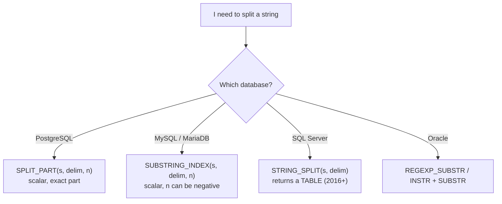

# 63 — String Functions

> **What it is:** The toolbox for creating, inspecting, transforming, trimming,
> splitting, and searching character data. String functions are where most
> "clean the data" SQL lives — normalizing emails, parsing log lines, masking
> PII, building slugs, deduplicating names, and extracting meaning from free
> text.

---

## Table of Contents

1. [Why String Functions Matter](#1-why-string-functions-matter)
2. [Strings, Encoding & Collation — Read This First](#2-strings-encoding--collation--read-this-first)
3. [Length Functions](#3-length-functions)
4. [Case Conversion](#4-case-conversion)
5. [Trimming & Padding](#5-trimming--padding)
6. [Concatenation](#6-concatenation)
7. [ELet me verify a few specific claims I want to be certain about before finalizing.
   Good — several corrections needed based on live verification. Let me fix them.
   Now let me verify the fixes are correct and check the overall quality.
   Let me do one final quality check — scan for obvious issues:
   Replaced the one-line placeholder with a complete 1,713-line section at `7-Dates-and-Strings/63-String-Functions.md`.

**Structure (20 subsections):** fundamentals, encoding/collation primer, then per-family coverage of length, case conversion, trim/pad, concatenation, substrings, position/search, replace/translate, repeat/reverse, split/parse — each with syntax, dialect matrices, examples, expected output, NULL tables, edge cases, and when to use/avoid. Followed by a cross-database NULL table, collation/equality deep-dive, Unicode gotchas, 8 real-world scenarios (email dedupe, name splitting, phone normalization, PII masking, slugs, version sorting, case-insensitive search), 8 BAD→BETTER mistakes, a DB comparison table, performance section, best practices, and 40 unanswered interview questions across all 8 categories. Includes a Mermaid decision diagram for split functions.

**Accuracy:** Key claims were live-verified against PostgreSQL 17 (NULL propagation in `||` vs `CONCAT`, `REPLACE` NULL behavior, negative `LEFT`, byte-vs-char `LENGTH`, `SPLIT_PART` returning `''` for missing parts, `LPAD` truncation, `'1'+'1'` ambiguity), and the edits reflect those verified results. MySQL/SQL Server/Oracle differences are flagged with labeled callouts and comparison tables rather than unverified specifics.
output row represent? 2. Is the column `NULL` allowed, and what should the result be when it is? 3. Do I mean characters or bytes? 4. Is the database comparison case-sensitive in this collation? 5. Does the function name mean the same thing in my database? (It often does not.)

> **See also:** Data types (section on String Types), `COALESCE`/`NULLIF`
> (COALESCE-NULLIF), NULL deep-dive, `LIKE` operators (Filtering Operators),
> and Regular Expressions (Regex) — this section deliberately does not repeat
> regex coverage.

### Sample Data Used Throughout This Section

```sql
CREATE TABLE customers (
    customer_id INTEGER PRIMARY KEY,
    full_name   VARCHAR(100),
    email       VARCHAR(255),
    phone       VARCHAR(30),
    city        VARCHAR(50)
);

INSERT INTO customers (customer_id, full_name, email, phone, city) VALUES
(1, 'Ana Silva',        'Ana.Silva@Example.com',   '+1 (555) 123-4567', 'São Paulo'),
(2, 'chen wei',         'chenwei@example.org',     '555.987.6543',      'Shanghai'),
(3, 'Maria Garcia',     'maria.garcia@example.com','555-222-0000',       NULL),
(4, 'John Smith',       NULL,                      '(555) 312-9999',    'Austin'),
(5, 'Priya Sharma',     'PRIYA.SHARMA@example.net', NULL,               'Mumbai');

CREATE TABLE employees (
    employee_id INTEGER PRIMARY KEY,
    full_name   VARCHAR(100),
    department  VARCHAR(50),
    email       VARCHAR(255)
);

INSERT INTO employees (employee_id, full_name, department, email) VALUES
(101, 'Alice Johnson',  'Engineering', 'alice.johnson@corp.io'),
(102, 'Bob O''Brien',   'Design',      'bobobrien@corp.io'),
(103, ' carol  martin ', 'Data',       'carol.martin@corp.io'),
(104, NULL,             'Ops',         NULL);

CREATE TABLE products (
    product_id   INTEGER PRIMARY KEY,
    product_name VARCHAR(200),
    sku          VARCHAR(30)
);

INSERT INTO products (product_id, product_name, sku) VALUES
(3001, 'Wireless  Keyboard & Mouse Combo',  'KB-2024-041'),
(3002, 'USB-C 50W Fast Charger',            'CH-50W-X12'),
(3003, 'Laptop  Stand (Aluminum)',          'LS-AL-007');

CREATE TABLE app_releases (
    release_id INTEGER PRIMARY KEY,
    version    VARCHAR(20)
);

INSERT INTO app_releases (release_id, version) VALUES
(1, '1.9.0'), (2, '1.10.0'), (3, '1.2.0'), (4, '2.0.0'), (5, '1.9.2');

CREATE TABLE payments (
    payment_id  INTEGER PRIMARY KEY,
    card_number VARCHAR(30),
    amount      NUMERIC(10, 2)
);

INSERT INTO payments (payment_id, card_number, amount) VALUES
(501, '4111 1111 1111 1111', 49.90),
(502, '5500 0000 0000 0004', 19.99);
```

---

## 2. Strings, Encoding & Collation — Read This First

Three concepts silently change the _meaning_ of almost every string function.
Master them before learning the functions.

### 2.1 Characters vs Bytes

A string is a sequence of **characters**, but on disk it is stored as a
sequence of **bytes** (one or more bytes per character, depending on the
encoding).

- `'São Paulo'` is **9 characters**.
- In UTF-8, `ã` needs 2 bytes, so it is **10 bytes**.

Functions fall into two families:

| Family          | Examples                                                  | Semantics         |
| --------------- | --------------------------------------------------------- | ----------------- |
| Character-based | `CHAR_LENGTH`, `LENGTH` (PG/Oracle), `LEN`                | Counts characters |
| Byte-based      | `OCTET_LENGTH`, `LENGTH` (MySQL), `DATALENGTH`, `LENGTHB` | Counts bytes      |

> **PostgreSQL** `LENGTH()` counts **characters**; use `OCTET_LENGTH()` for bytes.
>
> **MySQL** `LENGTH()` counts **bytes**; use `CHAR_LENGTH()` for characters.
> This naming swap is the single most frequent source of string-length bugs.
>
> **SQL Server** `LEN()` counts characters **excluding trailing spaces**;
> `DATALENGTH()` counts bytes.
>
> **Oracle** `LENGTH()` counts characters; `LENGTHB()` counts bytes.
> Oracle also has `LENGTH2` (UCS2 code points) and `LENGTH4` (code points).

### 2.2 Collation

A **collation** defines how the database sorts and compares strings: whether
`'A' = 'a'` is true, whether `'a' < 'B'`, which characters are "letters".
String equality is _not_ a global truth — it depends on the collation of the
columns involved. This is covered in depth in
[Section 13](#13-case-sensitivity-collation--equality).

### 2.3 Indexing Convention: Everything Is 1-Based

SQL positions are **1-based**, not 0-based like most programming languages.

```sql
-- 'P o s t g r e'  ← column of nine characters
--  1 2 3 4 5 6 7 8 9
SELECT SUBSTRING('Postgre' FROM 2 FOR 3);   -- 'ost'
```

> **Interview trap:** "What is the index of the first character?" → **1**.
> Most bugs from developers coming from programming languages come from
> assuming 0-based indexing.

### 2.4 Empty String vs NULL

Most databases distinguish `''` from `NULL`. Oracle does **not**: in Oracle an
empty string literal `''` **is** `NULL`.

> **Oracle:** `SELECT LENGTH('') FROM dual;` returns `NULL`. `SELECT '' = ''
FROM dual;` is neither true nor false (three-valued logic applies).
> This one fact corrupts dozens of otherwise-portable queries. See
> [Common Mistakes](#16-common-mistakes--production-pitfalls).

---

## 3. Length Functions

**What they do:** Return how "big" a string is, either in characters or bytes.

**Why they exist:** Validation (min/max length checks), report formatting
(truncation decisions), and debugging (detecting encoding problems).

### ANSI SQL Syntax

```sql
CHARACTER_LENGTH(string)   -- characters
OCTET_LENGTH(string)       -- bytes
```

### Database-Specific Syntax

| Database   | Characters                                           | Bytes             | Notes                         |
| ---------- | ---------------------------------------------------- | ----------------- | ----------------------------- |
| PostgreSQL | `LENGTH(s)`, `CHAR_LENGTH(s)`, `CHARACTER_LENGTH(s)` | `OCTET_LENGTH(s)` | `LENGTH` = characters         |
| MySQL      | `CHAR_LENGTH(s)`                                     | `LENGTH(s)`       | `LENGTH` = **bytes**          |
| SQL Server | `LEN(s)`                                             | `DATALENGTH(s)`   | `LEN` ignores trailing spaces |
| Oracle     | `LENGTH(s)`                                          | `LENGTHB(s)`      | empty string is NULL          |

### Example

```sql
SELECT
    full_name,
    CHAR_LENGTH(full_name)  AS characters,
    OCTET_LENGTH(full_name) AS bytes
FROM customers;
```

**Expected result (PostgreSQL):**

| full_name    | characters | bytes |
| ------------ | ---------- | ----- |
| Ana Silva    | 9          | 9     |
| São Paulo    | 9          | 10    |
| Priya Sharma | 12         | 12    |

**Expected result (MySQL, alternative column set):**

```sql
SELECT
    full_name,
    CHAR_LENGTH(full_name) AS characters,
    LENGTH(full_name)      AS bytes
FROM customers;
```

| full_name | characters | bytes |
| --------- | ---------- | ----- |
| Ana Silva | 9          | 9     |
| São Paulo | 9          | 10    |

Only accented rows show a difference — 9 vs 10.

> **Common misconception:** "`LENGTH` always returns the number of characters."
> No — in MySQL it returns bytes; in Oracle/SQL Server behavior also differs on
> multibyte data (Oracle `LENGTH` is characters by default, but a `CLOB` with
> `NLS_LENGTH_SEMANTICS=BYTE` changes the unit).

### Trailing Spaces

> **SQL Server:** `LEN('abc   ')` returns **3** — trailing spaces are ignored.
> `DATALENGTH('abc   ')` returns **6**. Use `DATALENGTH` if you really care
> about the stored size.
>
> **PostgreSQL:** `LENGTH('abc   ')` returns **6** — trailing spaces count.

### NULL Behavior

`LENGTH(NULL)` → `NULL` in every database.

### When to Use

- Validation: reject rows where `LENGTH(code) > 10`.
- Detecting multibyte/encoding anomalies (`CHAR_LENGTH(x) <> LENGTH(x)` in MySQL).
- Building fixed-width exports (`CASE WHEN LENGTH(x) > n THEN ...`).

### When NOT to Use

- To count rows or occurrences — use `COUNT`, not length arithmetic.
- To compare the "size" of a column in storage — that needs `pg_column_size`
  /`DATALENGTH`, not `LENGTH`.

### Edge Cases

| Input          | Result                       | Why                                            |
| -------------- | ---------------------------- | ---------------------------------------------- |
| `LENGTH('')`   | `0`                          | empty string — except Oracle, where it is NULL |
| `LENGTH(NULL)` | `NULL`                       | NULL propagates                                |
| `LENGTH('é')`  | `1` (PG/MySQL `CHAR_LENGTH`) | one character                                  |
| `LENGTH('é')`  | `2` (MySQL `LENGTH`)         | two UTF-8 bytes                                |

---

## 4. Case Conversion

**What they do:** Translate the case of characters: `UPPER` → uppercase,
`LOWER` → lowercase, `INITCAP` → title case.

**Why they exist:** Two otherwise-identical values that differ only in case
must be brought to a common form so they can be compared, grouped, or joined.

### Syntax

```sql
UPPER(string)     -- 'hello'  -> 'HELLO'
LOWER(string)     -- 'HELLO'  -> 'hello'
INITCAP(string)   -- 'hello WORLD' -> 'Hello World'   (PG, Oracle only)
```

| Database   | `UPPER` | `LOWER` | `INITCAP` |
| ---------- | ------- | ------- | --------- |
| PostgreSQL | yes     | yes     | yes       |
| MySQL      | yes     | yes     | no        |
| SQL Server | yes     | yes     | no        |
| Oracle     | yes     | yes     | yes       |

### Example — Normalizing Emails

```sql
SELECT
    customer_id,
    email,
    LOWER(TRIM(email)) AS normalized_email
FROM customers;
```

**Expected result:**

| customer_id | email                    | normalized_email         |
| ----------- | ------------------------ | ------------------------ |
| 1           | Ana.Silva@Example.com    | ana.silva@example.com    |
| 2           | chenwei@example.org      | chenwei@example.org      |
| 3           | maria.garcia@example.com | maria.garcia@example.com |
| 4           | NULL                     | NULL                     |
| 5           | PRIYA.SHARMA@example.net | priya.sharma@example.net |

Notice: `NULL` email stays `NULL`. If the business wants "no email" to display
as empty, wrap in `COALESCE`.

### Handling NULL

```sql
SELECT COALESCE(LOWER(email), '(no email)') AS display_email
FROM customers;
```

### Unicode Caveat

Case conversion is **Unicode-aware** in modern databases but has surprises:

> **PostgreSQL:** `UPPER('straße')` → `'STRAßE'` (ß stays ß). There is no
> automatic `SS` expansion.
>
> **MySQL:** With `utf8_general_ci`-style collations, folding is "simple";
> with `utf8mb4_0900_ai_ci` (8.0+) it is Unicode-aware (case accents-insensitive
> by default). `INITCAP` does not exist — simulate with
> `CONCAT(UPPER(LEFT(x,1)), LOWER(SUBSTRING(x,2)))`.
>
> **SQL Server:** `UPPER`/`LOWER` reflect the column's collation.
>
> **Oracle:** `NLS_SORT`/`NLS_COMP` settings can affect `INITCAP` behavior.

### When to Use

- Normalizing identifiers (emails, usernames, city names) before comparing.
- Case-insensitive search and deduplication.
- Generating display titles (`INITCAP`).

### When NOT to Use

- To do _lookup_ on a large, indexed column with `WHERE LOWER(col) = ...`
  without a matching **functional index** — it kills sargability (see
  [Performance Implications](#18-performance-implications)).
- To _store_ the transformed value "just in case" when the source data is
  canonical — corrupted identifiers cause join failures later.

### Common Mistake

```sql
-- BAD: only lowercases, doesn't trim — ' Ana ' slips through
WHERE LOWER(email) = 'ana.silva@example.com'

-- BETTER: trim AND case-fold together
WHERE LOWER(TRIM(email)) = 'ana.silva@example.com'
```

---

## 5. Trimming & Padding

**What they do:** Trim whitespace (or specific characters) off string ends;
pad strings to a fixed length.

**Why they exist:** Imported data has stray spaces; fixed-width interfaces
(POS files, bank transfers) demand zero-padded codes; display alignment is
needed for reporting.

### Syntax

```sql
-- ANSI SQL
TRIM([BOTH | LEADING | TRAILING] [characters] FROM string)
TRIM(string)                     -- spaces only, both ends

-- PostgreSQL also
LTRIM(string [, characters])
RTRIM(string [, characters])
BTRIM(string [, characters])

-- MySQL / MariaDB
LTRIM(string)
RTRIM(string)

-- SQL Server 2017+
TRIM([characters FROM] string)

-- Padding (PG, MySQL, Oracle)
LPAD(string, length [, fill])
RPAD(string, length [, fill])
```

> **SQL Server** has **no `LPAD`/`RPAD`**. Simulate with `REPLICATE`:
> `RIGHT(REPLICATE('0', 6) + code, 6)`.
>
> **SQL Server 2022** added optional second arguments to `LTRIM`/`RTRIM`.

### Example 1 — Cleaning Punctuation From Both Sides

```sql
SELECT BTRIM('xxhixx', 'x') AS cleaned;      -- PostgreSQL
-- 'hi'
```

The characters argument is treated as a **set**: leading and trailing characters
belonging to the set are stripped, repeatedly, until the first character not in
the set.

### Example 2 — Zero-Padding an ID for a Fixed-Width File

```sql
-- PostgreSQL
SELECT
    product_id,
    LPAD(product_id::text, 6, '0') AS padded_id
FROM products;
```

**Expected result:**

| product_id | padded_id |
| ---------- | --------- |
| 3001       | 003001    |
| 3002       | 003002    |
| 3003       | 003003    |

**SQL Server equivalent (no LPAD):**

```sql
SELECT RIGHT(REPLICATE('0', 6) + CAST(product_id AS VARCHAR(10)), 6)
FROM products;
```

### Example 3 — Trimming Every String in a WHERE

```sql
-- BAD: direct equality fails because of stray whitespace
SELECT customer_id FROM customers WHERE full_name = 'Ana Silva';

-- BETTER: trim the candidate (assuming whitespace only at ends)
SELECT customer_id FROM customers
WHERE TRIM(full_name) = 'Ana Silva';
```

**Why BETTER:** imported or user-entered names routinely contain stray leading
/trailing spaces. But see the performance note — trimming a column in `WHERE`
is not sargable.

### NULL Behavior

- `TRIM(NULL)` → `NULL`.
- `LPAD(NULL, 5, '0')` → `NULL`.
- `LPAD('x', NULL, '0')` → `NULL`.

### Edge Cases

| Input                                      | Result       | Why                            |
| ------------------------------------------ | ------------ | ------------------------------ |
| `LPAD('abcd', 2, 'x')`                     | `'ab'`       | pad _truncates_ from the right |
| `LPAD('ab', 5, 'cd')`                      | `'cdcab'`    | fill wrapped, then trimmed     |
| `TRIM(' ')`                                | `''` (empty) | nothing left after trimming    |
| `LTRIM('x','x')` (PG MySQL: one char only) | `''`         | removes all leading x          |

### Production Pitfall

```sql
-- BAD: trimming in a predicate hides index usage
WHERE LTRIM(employee_code) = 'ABC123'

-- BETTER: clean the data at write time (CHECK constraint, ETL, generated column),
-- or use an expression index (see Performance Implications)
WHERE employee_code = 'ABC123'
```

---

## 6. Concatenation

**What it does:** Joins two or more strings into one.

**Why it exists:** Codes and reports need assembled strings: `PART + '-' +
YEAR + '-' + serial`, or a display name built from parts.

### The Biggest Dialect Differences in the Whole Language

| Expression                    | PostgreSQL | MySQL                                          | SQL Server    | Oracle                |
| ----------------------------- | ---------- | ---------------------------------------------- | ------------- | --------------------- |
| `'a' \|\| 'b'`                | `ab`       | `0` unless `PIPES_AS_CONCAT` (else logical OR) | not valid     | `ab`                  |
| `CONCAT(a, b, ...)`           | `ab`       | `ab`                                           | `ab`          | `ab` (max 2 args)     |
| `CONCAT_WS('-', a, b)`        | `a-b`      | `a-b`                                          | `a-b` (2017+) | not built in (pre-23) |
| `'a' \|\| NULL`               | `NULL`     | —                                              | —             | `a`                   |
| `CONCAT('a', NULL, 'b')`      | `ab`       | `NULL`                                         | `ab`          | —                     |
| `CONCAT_WS('-','a',NULL,'b')` | `a-b`      | `a-b`                                          | `a-b`         | —                     |

> **Interview trap (MySQL):** `||` is the logical OR operator by default.
> `SELECT 0 || 1;` → `1`. Only with `SET sql_mode = 'PIPES_AS_CONCAT'` does it
> concatenate. Join these two facts in your head so you never write
> `'a' || 'b'` expecting `'ab'` in MySQL.

> **Oracle:** `CONCAT` takes exactly **two** arguments. `CONCAT('a','b','c')`
> is an error. `'a' || NULL` is `'a'` — NULL is treated as the empty string in
> concatenation.

> **SQL Server:** `+` propagates NULL: `'a' + NULL` → `NULL`. `CONCAT` treats
> NULL as empty: `CONCAT('a', NULL, 'b')` → `'ab'`. Mixing the two forms is a
> classic bug source.

> **PostgreSQL:** `||` propagates NULL; `CONCAT` and `CONCAT_WS` ignore NULL.
> (Verified against PostgreSQL 17.)

### Type Coercion — the `'1' + 1` Family

The same text produces radically different results:

| Expression     | PostgreSQL                 | MySQL              | SQL Server       | Oracle   |
| -------------- | -------------------------- | ------------------ | ---------------- | -------- |
| `'1' + 1`      | `2` (arithmetic)           | `2` (arithmetic)   | `2` (arithmetic) | `2`      |
| `'1' + '1'`    | error (ambiguous operator) | `2`                | `'11'`           | `2`      |
| `'foo' + 1`    | error                      | `1` (foo → 0, 0+1) | error            | error    |
| `'foo' \|\| 1` | `'foo1'`                   | —                  | —                | `'foo1'` |

> **MySQL:** `SELECT 'The answer is ' + 42;` → `42`. The string is silently
> converted to a number (`0`) and discarded. Always use `CONCAT` for strings.
>
> **SQL Server:** `SELECT 'The answer is ' + 42;` → conversion error. Use
> `CAST(42 AS VARCHAR(10))` or `CONCAT`.
>
> **PostgreSQL:** `'The answer is ' || 42` → `'The answer is 42'` (implicit
> cast). But `'The answer is ' + 42` is an error — the `+` operator does not
> exist for text.

### Examples

```sql
-- Building an address line (PostgreSQL-style; swap the operator per DB)
SELECT
    customer_id,
    COALESCE(city, '(unknown)') || ' (ID ' || customer_id || ')'
        AS display_label
FROM customers;
```

**Expected result:**

| customer_id | display_label    |
| ----------- | ---------------- |
| 1           | São Paulo (ID 1) |
| 3           | (unknown) (ID 3) |

**`CONCAT_WS` (all major DBs except Oracle pre-23):**

```sql
SELECT CONCAT_WS('-', customer_id, COALESCE(city, 'n/a'))
FROM customers;
```

### NULL Handling Rules of Thumb

- `||` and `+` : one NULL poisons the whole concatenation (except Oracle `||`).
- `CONCAT` / `CONCAT_WS`: NULLs are skipped (except MySQL plain `CONCAT`).
- Wrap optional columns in `COALESCE` when you must not lose the row.

### When to Use

- Building composite keys/codes for display or export.
- Constructing searchable full-text-ish fields (low volume).

### When NOT to Use

- Heavy analytical queries on millions of rows if you can store the needed
  fragment already assembled.
- Inside `GROUP BY`/`ORDER BY` on large tables without expression indexes.
- Numeric math — see the `'1' + 1` trap above.

---

## 7. Extraction & Substrings

**What they do:** Pull a region of a string out: from a start position, from the
left, from the right.

### Syntax

```sql
-- ANSI
SUBSTRING(string FROM start [FOR length])

-- PostgreSQL / MySQL / Oracle
SUBSTR(string, start [, length])
LEFT(string, n)
RIGHT(string, n)

-- SQL Server
SUBSTRING(string, start, length)        -- length is REQUIRED
LEFT(string, n)
RIGHT(string, n)
```

> **SQL Server** `SUBSTRING(s, start, length)` **requires** the `length`
> argument — omitting it is a syntax error. There is no
> `SUBSTRING(s, start)` "rest of the string" form.
>
> **MySQL** `MID(s, start [, length])` is a synonym for `SUBSTRING`.
>
> **Oracle** `SUBSTR(s, 0, n)` treats position `0` the same as position `1`.
> Negative start counts from the end.

### Indexing Is 1-Based — and Negative Start Counts Backwards

```sql
--       1 2 3 4 5 6 7 8 9
--       h e l l o w o r l d
SELECT SUBSTRING('helloworld' FROM 4 FOR 3);      -- 'low'
SELECT SUBSTRING('helloworld' FROM 7);            -- 'orld'
SELECT SUBSTRING('helloworld' FROM -3 FOR 2);     -- ''  (PostgreSQL: empty)
SELECT LEFT('helloworld', 5);                     -- 'hello'
SELECT RIGHT('helloworld', 5);                    -- 'world'
SELECT LEFT('helloworld', -3);                    -- 'hellowo' (drops last 3)
```

> **PostgreSQL** `LEFT(s, n)`/`RIGHT(s, n)` accept **negative n** ("drop the
> last |n| characters"). MySQL does not; negative positions apply to
> `SUBSTRING(s, n)` instead. SQL Server has no negative n.

### Example — Pulling Apart a SKU

Products have `sku` values like `'KB-2024-041'` (category-year-serial).

```sql
SELECT
    sku,
    LEFT(sku, 2)                AS category,
    SUBSTRING(sku, 4, 4)        AS year,
    RIGHT(sku, 3)               AS serial
FROM products;
```

**Expected result:**

| sku         | category | year | serial |
| ----------- | -------- | ---- | ------ |
| KB-2024-041 | KB       | 2024 | 041    |
| CH-50W-X12  | CH       | 50W- | X12    |
| LS-AL-007   | LS       | AL-0 | 007    |

Notice row 2 and 3: position-based splitting is brittle when the format is not
fixed-width. `SUBSTRING_INDEX`/`SPLIT_PART` (Section 11) are usually safer for
delimited data. This is a deliberate "surprising output" example.

### NULL Behavior

`SUBSTRING(NULL FROM 1 FOR 2)` → `NULL`. Any NULL argument propagates.

### Edge Cases

| Input                            | Result                                |
| -------------------------------- | ------------------------------------- |
| `SUBSTRING('abc' FROM 0 FOR 2)`  | `'a'` (position 0 ≈ 1)                |
| `SUBSTRING('abc' FROM 4)`        | `''` (past the end)                   |
| `SUBSTRING('abc' FROM 2 FOR 99)` | `'bc'` (clamped, no error)            |
| `LEFT('abc', 100)`               | `'abc'`                               |
| `SUBSTRING('abc' , 2, -1)`       | error in SQL Server (negative length) |

---

## 8. Search & Position

**What they do:** Find where a substring appears inside a string.

**Why they exist:** Locating delimiters (`@` in an email), extracting after a
known marker, and validation.

### Syntax (a Real Babel Tower)

| Database   | Function                                                                        | Returns       |
| ---------- | ------------------------------------------------------------------------------- | ------------- |
| ANSI       | `POSITION(substring IN string)`                                                 | position or 0 |
| PostgreSQL | `STRPOS(string, substring)`                                                     | position or 0 |
| MySQL      | `INSTR(string, substring)` / `LOCATE(substring, string [, start])` / `POSITION` | position or 0 |
| SQL Server | `CHARINDEX(substring, string [, start])` / `PATINDEX('%pattern%', string)`      | position or 0 |
| Oracle     | `INSTR(string, substring [, start [, occurrence]])`                             | position or 0 |

All return **0** when not found — not NULL, not -1.

### Example — Finding the `@` in an Email

```sql
SELECT
    email,
    POSITION('@' IN email) AS at_pos      -- ANSI / PostgreSQL / MySQL
FROM customers
WHERE email IS NOT NULL;
```

**Expected result:**

| email                    | at_pos |
| ------------------------ | ------ |
| Ana.Silva@Example.com    | 10     |
| chenwei@example.org      | 8      |
| maria.garcia@example.com | 14     |
| PRIYA.SHARMA@example.net | 14     |

### Combining With SUBSTRING — Extract the Domain

```sql
SELECT
    email,
    SUBSTRING(email FROM POSITION('@' IN email) + 1) AS domain
FROM customers
WHERE email IS NOT NULL;
```

**Expected result:**

| email                 | domain      |
| --------------------- | ----------- |
| Ana.Silva@Example.com | Example.com |
| chenwei@example.org   | example.org |

> **Production pitfall:** For most clean-parsing jobs
> `SPLIT_PART(email, '@', 2)` (PostgreSQL) or
> `SUBSTRING_INDEX(email, '@', -1)` (MySQL) is clearer and less error-prone
> than position arithmetic.

### When to Use

- Locating markers and extracting the "rest of the string".
- `PATINDEX` when you need a pattern, not a literal.

### When NOT to Use

- For substring removal — use `REPLACE`.
- For fuzzy matching — that belongs to `LIKE`/`REGEX` sections.

---

## 9. Replacement & Translation

Three functions form the "search-and-replace" family. They are easy to
confuse and behave very differently.

```sql
REPLACE(string, from, to)      -- replace every OCCURRENCE of 'from'
TRANSLATE(string, from, to)    -- replace every CHARACTER of 'from'
STUFF(string, start, length, insert)  -- SQL Server: delete then insert at position
```

| Capability          | `REPLACE` | `TRANSLATE`            | `STUFF` / `INSERT()` |
| ------------------- | --------- | ---------------------- | -------------------- |
| Works on substrings | yes       | no (single characters) | yes (position-based) |
| PostgreSQL          | yes       | yes                    | no                   |
| MySQL               | yes       | no                     | `INSERT()`           |
| SQL Server          | yes       | yes (2017+)            | `STUFF`              |
| Oracle              | yes       | yes                    | no                   |

### Example 1 — REPLACE Removes/Changes Substrings

```sql
SELECT REPLACE('2026/09/15', '/', '-') AS iso;      -- '2026-09-15'
SELECT REPLACE('banana', 'na', 'NA');               -- 'baNANA'
```

### Example 2 — TRANSLATE Maps Character by Character

```sql
SELECT TRANSLATE('hello', 'aeiou', 'AEIOU');        -- 'hEllO'
SELECT TRANSLATE('2026-09-15', '-/:', '....');      -- '2026.09.15'
```

`TRANSLATE` maps positionally: `a→A`, `e→E`, ... . Extra characters in the
target that have no source counterpart are ignored (PostgreSQL: the extra
characters are simply unused). It is the right tool for "stop worrying about
every delimiter combination".

### Example 3 — STUFF Deletes Then Inserts (SQL Server)

```sql
SELECT STUFF('Hello World', 1, 5, 'Goodbye');        -- 'Goodbye World'
```

`STUFF(string, start, length, insert)` first removes `length` characters at
`start`, then inserts `insert` there. MySQL's `INSERT(string, position, length,
new_string)` does the same thing.

> **Common misconception:** Don't confuse MySQL's string `INSERT()`
> (`INSERT('Hello', 1, 0, 'X')`) with the `INSERT` statement that adds rows.

### NULL Behavior (the Diamond That Changes)

| Call                        | PostgreSQL | MySQL  | SQL Server | Oracle                       |
| --------------------------- | ---------- | ------ | ---------- | ---------------------------- |
| `REPLACE('abc', 'b', NULL)` | `NULL`     | `NULL` | `NULL`     | `'ac'` (occurrences removed) |
| `REPLACE('abc', NULL, 'x')` | `NULL`     | `NULL` | `NULL`     | `'abc'` or NULL\*            |

> **Oracle:** because the empty string _is_ `NULL`, a `NULL` replacement is
> treated as "replace with nothing" for `REPLACE` — occurrences are removed.
> Verify behavior on your target Oracle version before relying on it.

### When to Use

- `REPLACE` — deduplicating separators, normalizing line endings, redaction.
- `TRANSLATE` — swapping every occurrence of a class of characters
  (e.g., "map all separators to one known separator").
- `STUFF`/`INSERT()` — surgical insertions at a computed position.

---

## 10. Repeat & Reverse

**What they do:** `REPEAT`/`REPLICATE` duplicate a string a number of times;
`REVERSE` flips a string.

### Syntax

| Database   | Repeat                           | Reverse                                        |
| ---------- | -------------------------------- | ---------------------------------------------- |
| PostgreSQL | `REPEAT(string, n)`              | `REVERSE(string)`                              |
| MySQL      | `REPEAT(string, n)`              | `REVERSE(string)`                              |
| SQL Server | `REPLICATE(string, n)`           | `REVERSE(string)`                              |
| Oracle     | `RPAD` tricks / no native repeat | none (use `REVERSE` outside SQL or a pipeline) |

> **Oracle** has no `REPEAT`/`REPLICATE`. Approximate with `LPAD`/`RPAD`:
> `RPAD('', 10, '-')` → `'----------'`.

### Example — Visual Bars for a Report

```sql
SELECT
    department,
    COUNT(*) AS headcount,
    REPEAT('#', COUNT(*)) AS bar
FROM employees
GROUP BY department
ORDER BY headcount DESC;
```

**Expected result:**

| department  | headcount | bar |
| ----------- | --------- | --- |
| Engineering | 1         | #   |
| Data        | 1         | #   |
| Design      | 1         | #   |
| Ops         | 1         | #   |

### Example — Palindrome Check

```sql
SELECT word, REVERSE(word) AS reversed
FROM (
    VALUES ('radar'), ('level'), ('hello')
) AS t(word);
```

**Expected result:**

| word  | reversed |
| ----- | -------- |
| radar | radar    |
| level | level    |
| hello | olleh    |

### Edge Cases & NULL

| Input              | Result                                                 |
| ------------------ | ------------------------------------------------------ |
| `REPEAT('ab', 3)`  | `'ababab'`                                             |
| `REPEAT('ab', 0)`  | `''`                                                   |
| `REPEAT('ab', -1)` | `''` (PostgreSQL); error or `NULL` depending on engine |
| `REPEAT(NULL, 3)`  | `NULL`                                                 |
| `REVERSE('héllo')` | `'olléh'` (character-based, good)                      |

> **MySQL note:** `REPEAT` with a huge count on multibyte strings can exceed
> `max_allowed_packet` and return `NULL` — guard the count.

---

## 11. Splitting & Parsing

**What they do:** Break a delimited string into parts. This is how you turn
`"a,b,c"` into separate values — and it is the section with the most
database-specific variance.

> **Common misconception:** "There is one split function." No — the four major
> engines use four different tools with different return shapes.

| Database   | Function                            | Returns                                           | Missing part     |
| ---------- | ----------------------------------- | ------------------------------------------------- | ---------------- |
| PostgreSQL | `SPLIT_PART(string, delim, n)`      | scalar, 1-based                                   | `''` (empty)     |
| MySQL      | `SUBSTRING_INDEX(string, delim, n)` | scalar, before nth delim; n negative → from right | the whole string |
| SQL Server | `STRING_SPLIT(string, delim)`       | **a table of rows**                               | n/a              |
| Oracle     | `REGEXP_SUBSTR(string, pattern)`    | scalar                                            | NULL             |



### Example 1 — Extract the Domain (Clean Version)

```sql
-- Better than position arithmetic from Section 8:
SELECT SPLIT_PART(email, '@', 2) AS domain      -- PostgreSQL
SELECT SUBSTRING_INDEX(email, '@', -1) AS domain -- MySQL
FROM customers WHERE email IS NOT NULL;
```

### Example 2 — Export Rows to a Delimited List

PostgreSQL turns rows into one string before splitting:

```sql
SELECT STRING_AGG(city, ',') FROM customers WHERE city IS NOT NULL;
-- 'São Paulo,Shanghai,Austin,Mumbai'
```

### Example 3 — STRING_SPLIT Returns Rows (SQL Server)

```sql
SELECT value
FROM STRING_SPLIT('apple,banana,cherry', ',');
```

**Expected result (rows):**

| value  |
| ------ |
| apple  |
| banana |
| cherry |

> **SQL Server:** `STRING_SPLIT` does **not** guarantee row order and (before 2022) exposes no ordinal position. If you need "the 3rd element", you must
> add a row number yourself, or use a `CHARINDEX`-based approach.

### Example 4 — Parsing a Log Line

```sql
-- raw_line: '2026-09-15 10:23:45,ERROR,Login failed,user_id=42'
SELECT
    SPLIT_PART(raw_line, ',', 1) AS happened_at,
    SPLIT_PART(raw_line, ',', 2) AS level,
    SPLIT_PART(raw_line, ',', 3) AS message,
    SPLIT_PART(raw_line, ',', 4) AS user_ref
FROM log_entries;
```

**Expected result:**

| happened_at         | level | message      | user_ref   |
| ------------------- | ----- | ------------ | ---------- |
| 2026-09-15 10:23:45 | ERROR | Login failed | user_id=42 |

> **Production pitfall:** Naive comma-splitting breaks the moment a field
> contains a comma _inside quotes_ (e.g., `message = "Hi, you're logged in"`).
> CSV-aware parsing needs a real parser or a regex-aware extraction —
> see Regular Expressions.

### NULL vs Empty When a Part Is Missing

> **PostgreSQL:** `SPLIT_PART('a,b', ',', 3)` → `''`, **not** NULL.
> If you later `JOIN` or test with `IN`, this empty string is a real value —
> a common cause of phantom "matches". Use `NULLIF(SPLIT_PART(...), '')` when
> you mean "absent".
>
> **MySQL:** `SUBSTRING_INDEX('a,b', ',', 3)` → `'a,b'` (returns the whole
> input when the count exceeds available delimiters) — totally different
> semantics than PostgreSQL.

---

## 12. NULL Behavior in String Functions

The same conceptual "string function" treats NULL differently by engine.
Memorize the general rule **NULL propagates**, then learn the exceptions.

| Function call                              | PostgreSQL | MySQL          | SQL Server | Oracle |
| ------------------------------------------ | ---------- | -------------- | ---------- | ------ |
| `UPPER(NULL)`, `LOWER(NULL)`, `TRIM(NULL)` | NULL       | NULL           | NULL       | NULL   |
| `LENGTH(NULL)`                             | NULL       | NULL           | NULL       | NULL   |
| `SUBSTRING(NULL, 1, 2)`                    | NULL       | NULL           | NULL       | NULL   |
| `REPLACE('abc', 'b', NULL)`                | NULL       | NULL           | NULL       | `'ac'` |
| `'a' \|\| NULL` / `'a' + NULL`             | NULL       | — (logical OR) | NULL       | `'a'`  |
| `CONCAT('a', NULL, 'b')`                   | `'ab'`     | NULL           | `'ab'`     | —      |
| `CONCAT_WS('-', 'a', NULL, 'b')`           | `'a-b'`    | `'a-b'`        | `'a-b'`    | —      |
| `SPLIT_PART('a,b', ',', 99)`               | `''`       | n/a            | n/a        | n/a    |
| `SUBSTRING_INDEX('a,b', ',', 5)`           | n/a        | `'a,b'`        | n/a        | n/a    |

**Two mental models:**

1. Most classic functions (UPPER/LOWER/TRIM/LENGTH/SUBSTRING) **propagate NULL**.
2. Concatenation and replacement are where engines diverge.

> **Production pitfall:** Before you write
> `WHERE COALESCE(TRIM(phone), '') <> ''`, check whether your engine's
> `REPLACE`/`CONCAT` behavior already handles missing parts — otherwise you
> fight the database instead of coding with it.

> **See also:** NULL deep-dive, Three-Valued Logic, `COALESCE`/`NULLIF`,
> `IS DISTINCT FROM` — the full NULL toolkit lives in the NULL chapter.

---

## 13. Case Sensitivity, Collation & Equality

String equality is **collation-dependent**: the same query can return different
rows on different servers depending on the collation of the columns involved.

### The Four Engines at a Glance

| Database   | Default = case-sensitive?                                   | Trailing spaces in `=`?                         | Case-insensitive search      |
| ---------- | ----------------------------------------------------------- | ----------------------------------------------- | ---------------------------- |
| PostgreSQL | **yes** (except `citext` / nondeterministic collations)     | significant                                     | `ILIKE`, `LOWER()`, `citext` |
| MySQL      | **no** (default binary/ci collations) — collation-dependent | ignored with PAD SPACE, significant with NO PAD | default!                     |
| SQL Server | depends on the collation (many installs are CI)             | ignored (padded comparison)                     | collation-based              |
| Oracle     | depends on `NLS_COMP`/literals; CHAR pads, VARCHAR2 doesn't | VARCHAR2: significant                           | `NLS_LOWER`, `COLLATE`       |

### Example — Case-Sensitive Direct Equality

```sql
-- PostgreSQL: two different rows today
SELECT COUNT(*) FROM customers WHERE email = 'ana.silva@example.com';
-- 0  (no case folding)

SELECT COUNT(*) FROM customers WHERE LOWER(email) = 'ana.silva@example.com';
-- 1
```

### Trailing Spaces

```sql
-- PostgreSQL ('abc   ' stored, but compared here)
SELECT 'abc' = 'abc  ';     -- false (trailing spaces matter)

-- MySQL with PAD SPACE collation (utf8mb4_general_ci, MariaDB default)
SELECT 'abc' = 'abc  ';     -- true (trailing spaces ignored in =)

-- MySQL 8.0 default utf8mb4_0900_ai_ci is NO PAD
SELECT 'abc' = 'abc  ';     -- false

-- SQL Server
SELECT 'abc' = 'abc  ';     -- true (comparisons pad the shorter string)

-- Oracle: CHAR padded (ignores), VARCHAR2 nonpadded (significant)
```

> **Interview trap:** "Are trailing spaces significant in comparison?" The
> answer is "**depends on engine and collation**" — never answer a flat yes or
> no. Show the table above.

### ILIKE (PostgreSQL) and LIKE Everywhere

```sql
SELECT customer_id FROM customers
WHERE email LIKE 'ANA%';        -- case-sensitive: might match nothing
WHERE email ILIKE 'ANA%';       -- PostgreSQL: case-insensitive
```

> **MySQL / SQL Server:** `LIKE` follows the column collation; with a
> case-insensitive (CI) collation `LIKE 'ANA%'` already matches `ana...`.

### Collating Explicitly

```sql
-- PostgreSQL: override collation for a single comparison
SELECT * FROM customers
WHERE email COLLATE "C" = 'Ana.Silva@Example.com';

-- SQL Server
WHERE email COLLATE Latin1_General_CI_AS = 'ana.silva@example.com'
```

### The Indexing Consequence

Case-insensitive search with `LOWER(column)` cannot use a plain index. Options:

- **PostgreSQL:** expression index `CREATE INDEX ... ON customers (LOWER(email))`
  or the `citext` extension type.
- **MySQL 8.0.13+:** functional index `CREATE INDEX ... ON customers ((LOWER(email)))`.
- **SQL Server:** indexed computed column `email_lower AS LOWER(email) PERSISTED`.
- **Oracle:** function-based index on `LOWER(email)`.

See [Performance Implications](#18-performance-implications).

---

## 14. Encoding & Unicode Gotchas

### Multibyte Versus Single-Byte

| Behavior          | PostgreSQL                                           | MySQL                               | SQL Server                              | Oracle                               |
| ----------------- | ---------------------------------------------------- | ----------------------------------- | --------------------------------------- | ------------------------------------ |
| Unicode data type | `TEXT`/`VARCHAR` (any encoding in `server_encoding`) | `VARCHAR` with utf8/utf8mb4 charset | `NVARCHAR` (`N'...'` literals)          | `NVARCHAR2` / `N'...'`               |
| `LENGTH` unit     | characters                                           | bytes (use `CHAR_LENGTH`)           | characters (use `DATALENGTH` for bytes) | characters (use `LENGTHB` for bytes) |
| Emoji in `LENGTH` | 1-2 chars                                            | depends (4 bytes in utf8mb4)        | 1 surrogate pair per 2                  | depends on NLS                       |

### The MySQL `utf8` vs `utf8mb4` Trap

> **MySQL:** `utf8` doesn't store emoji or most astral characters — it is a
> truncated form of UTF-8. Use **`utf8mb4`** for full Unicode.
> `CHAR_LENGTH()` on an emoji counts by character; `LENGTH()` counts raw bytes.

### The SQL Server `varchar` vs `nvarchar` Trap

> **SQL Server:** `varchar` holds a codepage (often ASCII/Latin1); `nvarchar`
> holds UTF-16. Joining a `varchar` column to an `nvarchar` column triggers
> implicit conversion per-row retention and can eliminate index seeks — check
> the execution plan. Keep join columns in the same type.

### The Oracle `NLS_LENGTH_SEMANTICS` Trap

> **Oracle:** if the database was created with `NLS_LENGTH_SEMANTICS=BYTE`
> (common), a `VARCHAR2(10)` allows at most 10 _bytes_, which may be fewer than
> 10 characters in multibyte data.

### NUL Characters and Control Characters

Embedded NULs (`\0` / U+0000) are legal in some engines, forbidden in others,
and can silently truncate strings:

> **PostgreSQL** rejects `\0` in `text` values. MySQL stores it. SQL Server
> `varchar` handles them awkwardly. Sanitize input at ingestion.

---

## 15. Real-World Scenarios

Each scenario shows the _problem_, a _BAD_ approach, the _BETTER_ approach,
and the _why_.

### Scenario A — Normalize Emails and Deduplicate Customers

**Problem:** Emails arrive with mixed case and stray spaces. A naive GROUP BY
may or may not collapse them, depending on collation.

```sql
-- BAD (PostgreSQL): misses case variants
SELECT email, COUNT(*) AS n
FROM customers
GROUP BY email
HAVING COUNT(*) > 1;

-- BETTER: fold case and trim first
SELECT LOWER(TRIM(email)) AS email, COUNT(*) AS n
FROM customers
WHERE email IS NOT NULL
GROUP BY LOWER(TRIM(email))
HAVING COUNT(*) > 1;
```

**Why BETTER:** With a `WHERE email IS NOT NULL` we also remove the NULL group
(NULL groups silently under GROUP BY and creates a "not-really-a-value" row).

> **MySQL nuance:** with a CI collation, plain `GROUP BY email` already treats
> `ANA@X.COM` and `ana@x.com` as equal — and `GROUP BY email` in PostgreSQL
> does not. This is exactly why collation awareness (Section 13) matters.

**Production-grade solution:** normalize at the boundary, not per query.

```sql
-- PostgreSQL: a generated column, then a UNIQUE index
ALTER TABLE customers
    ADD COLUMN email_normalized VARCHAR(255)
    GENERATED ALWAYS AS (LOWER(TRIM(email))) STORED;

CREATE UNIQUE INDEX uq_customers_email_norm ON customers (email_normalized);
```

### Scenario B — Split Full Name Into Parts

**Problem:** `employees.full_name` mixes formats: `'Alice Johnson'`,
`'Bob O''Brien'`, `' carol  martin '` (leading/trailing/double spaces), NULL.

```sql
-- BAD: naive split on space
SELECT
    employee_id,
    SPLIT_PART(full_name, ' ', 1) AS first_name,   -- PostgreSQL
    SPLIT_PART(full_name, ' ', 2) AS last_name
FROM employees;
```

**Expected result (showing the trap):**

| employee_id | first_name              | last_name |
| ----------- | ----------------------- | --------- |
| 101         | Alice                   | Johnson   |
| 102         | Bob                     | O'Brien   |
| 103         | (empty — leading space) | carol     |
| 104         | NULL                    | NULL      |

`' carol  martin '` splits by single space into the tokens `''`,
`'carol'`, `''`, `'martin'`, `''`. So `first_name` is empty (the token
before the leading space), and `last_name` is `'carol'` — not the actual last
name.

```sql
-- BETTER: trim first, then handle the double-space case and missing parts
SELECT
    employee_id,
    NULLIF(SPLIT_PART(TRIM(full_name), ' ', 1), '') AS first_name,
    NULLIF(SPLIT_PART(TRIM(full_name), ' ', 2), '') AS last_name
FROM employees;
```

**Why this is still not perfect:** a middle name would land in "last_name";
`'J R'`-style initials are ambiguous; and natural-language names are messy.
For production, parse names with a real library, not 10 lines of SQL.
For analytics, keep a dedicated column and a documented convention.

### Scenario C — Count Customers per Email Domain

```sql
-- BAD: fragile right-of-@ arithmetic
SELECT
    RIGHT(email, LENGTH(email) - POSITION('@' IN email)) AS domain,
    COUNT(*) AS customers
FROM customers
WHERE email IS NOT NULL
GROUP BY 1;

-- BETTER: dedicated split
SELECT
    SPLIT_PART(email, '@', 2) AS domain,     -- PostgreSQL
    COUNT(*) AS customers
FROM customers
WHERE email IS NOT NULL
GROUP BY 1
ORDER BY customers DESC;
```

**Expected result:**

| domain      | customers |
| ----------- | --------- |
| example.com | 2         |
| example.net | 1         |
| example.org | 1         |

**Why BETTER:** position arithmetic breaks on malformed emails and is
unreadable; `SPLIT_PART`/`SUBSTRING_INDEX` express the intent directly.

### Scenario D — Normalize Phone Numbers for a JOIN

**Problem:** phone numbers are stored in different formats.

```sql
-- BAD: exact match fails across formats
SELECT *
FROM customers a
JOIN customers b
  ON a.phone = b.phone
WHERE a.customer_id < b.customer_id;

-- BETTER: keep only the digits before comparing (PostgreSQL; see Regex section)
SELECT a.customer_id, b.customer_id
FROM customers a
JOIN customers b
  ON REGEXP_REPLACE(a.phone, '\D', '', 'g')
   = REGEXP_REPLACE(b.phone, '\D', '', 'g')
WHERE a.customer_id < b.customer_id;
```

**Why BETTER:** `'+1 (555) 123-4567'` and `'5551234567'` now compare equal.
Note the JOIN on a function _cannot use a plain index_ — clean the column at
write time and index the cleaned value for production scale.

### Scenario E — Mask PII (Last 4 of a Card)

```sql
SELECT
    payment_id,
    CONCAT('XXXX-XXXX-XXXX-',
           RIGHT(REPLACE(card_number, ' ', ''), 4)) AS masked
FROM payments;
```

**Expected result:**

| payment_id | masked              |
| ---------- | ------------------- |
| 501        | XXXX-XXXX-XXXX-1111 |
| 502        | XXXX-XXXX-XXXX-0004 |

**Edge case:** if `card_number IS NULL`, `REPLACE` returns NULL and the whole
result is NULL — coalesce explicitly when the display must say "n/a".

### Scenario F — Build a URL Slug From a Product Name

```sql
-- PostgreSQL
SELECT
    product_id,
    LOWER(REGEXP_REPLACE(TRIM(product_name), '[^a-z0-9]+', '-', 'g'))
        AS slug
FROM products;
```

**Expected result:**

| product_id | slug                          |
| ---------- | ----------------------------- |
| 3001       | wireless-keyboard-mouse-combo |
| 3002       | usb-c-50w-fast-charger        |
| 3003       | laptop-stand-aluminum         |

Notice the double space and `&` both collapse into a single `-`.

**Why this is a minefield:** accents (`Café` → `café`), transliteration
(ß→ss), and reserved URL characters need a dedicated slug library. SQL slugs
are fine for analytics, risky for public URLs. Enforce uniqueness with a
functional unique index.

### Scenario G — Sort Software Versions Correctly

```sql
-- BAD: lexicographic ordering is wrong for '1.10.0' vs '1.2.0'
SELECT version FROM app_releases ORDER BY version;
-- 1.10.0, 1.2.0, 1.9.0, 1.9.2, 2.0.0   (WRONG order)

-- BETTER (PostgreSQL): compare numerically part by part
SELECT version
FROM app_releases
ORDER BY
    SPLIT_PART(version, '.', 1)::INT,
    SPLIT_PART(version, '.', 2)::INT,
    SPLIT_PART(version, '.', 3)::INT;

-- Postgres shortcut: cast the split array and compare elementwise
SELECT version
FROM app_releases
ORDER BY string_to_array(version, '.')::int[];
```

**Expected result (correct order):**

| version |
| ------- |
| 1.2.0   |
| 1.9.0   |
| 1.9.2   |
| 1.10.0  |
| 2.0.0   |

**Why BAD fails:** text sort compares character by character, so `'1.10.0'`
comes before `'1.2.0'`.

### Scenario H — Case-Insensitive Search With a Functional Index

```sql
-- setup (PostgreSQL)
CREATE INDEX idx_customers_email_lower ON customers (LOWER(email));

-- now the BETTER query can use the index
SELECT customer_id FROM customers
WHERE LOWER(email) = 'ana.silva@example.com';
```

Verify with:

```sql
EXPLAIN ANALYZE
SELECT customer_id FROM customers WHERE LOWER(email) = 'ana.silva@example.com';
```

The plan should show an index scan on `idx_customers_email_lower`; a query
without the expression index would show a sequential scan.

---

## 16. Common Mistakes & Production Pitfalls

### Mistake 1 — `LENGTH` means bytes in MySQL

```sql
-- BAD: expects characters
SELECT * FROM users WHERE LENGTH(name) < 3;

-- BETTER (MySQL): characters
SELECT * FROM users WHERE CHAR_LENGTH(name) < 3;
```

### Mistake 2 — Empty string is NULL in Oracle

```sql
-- Oracle: '' IS NULL. These behave differently than you think
SELECT LENGTH('');          -- NULL
SELECT '' = '';             -- neither true nor false
SELECT COUNT(*) FROM t WHERE col = '';  -- returns 0 always!
SELECT COUNT(*) FROM t WHERE col IS NULL;  -- some engines fold both
```

### Mistake 3 — Trailing spaces silently change equality

Covered in Section 13. Asymmetric trimming on JOIN keys is a classic
"why is my join missing rows?" bug:

```sql
-- BAD: right-hand key has trailing spaces in storage
SELECT ...
FROM sales s
LEFT JOIN products p ON s.sku = TRIM(p.sku);   -- per-row function, no index

-- BETTER: fix the data or index the trimmed value
```

### Mistake 4 — `||` is logical OR in MySQL

```sql
SELECT 'a' || 'b';      -- MySQL: 0, not 'ab'
-- Fix: CONCAT, or SET sql_mode='PIPES_AS_CONCAT'
```

### Mistake 5 — `+` concatenation vs arithmetic in SQL Server

```sql
SELECT 'The answer is ' + 42;    -- error: could not convert
SELECT '1' + 1;                  -- 2 (arithmetic, not '11')
-- Fix: CONCAT, or CAST(42 AS VARCHAR(10))
```

### Mistake 6 — SQL Server `SUBSTRING` without length

```sql
SELECT SUBSTRING(name, 1);       -- syntax error; length is required
SELECT SUBSTRING(name, 1, LEN(name) - 1) ...  -- LEN-1 breaks on empty string ('')
-- When name = '' → LEN = 0 → length = -1 → runtime error
-- Guard: CASE WHEN LEN(name) > 1 THEN SUBSTRING(name, 1, LEN(name)-1) ELSE '' END
```

### Mistake 7 — Building one big string with several `||` and missing COALESCE

```sql
-- BAD: if 'middle_initial' is NULL the whole address becomes NULL (PG/SQLSrv)
SELECT last || ', ' || middle_initial || ' ' || first AS full_name ...

-- BETTER: COALESCE optional parts
SELECT last || ', ' || COALESCE(middle_initial || ' ', '') || first AS full_name ...
```

### Mistake 8 — Splitting a string that contains the delimiter inside quotes

Covered in Section 11. Always validate against an example that has a quoted
comma before trusting the split.

---

## 17. Comparison Table — Databases at a Glance

| Feature                  | PostgreSQL                             | MySQL                                         | SQL Server                                  | Oracle                    |
| ------------------------ | -------------------------------------- | --------------------------------------------- | ------------------------------------------- | ------------------------- |
| Concatenate              | `\|\|` / `CONCAT`                      | `CONCAT` / `\|\|` (with `PIPES_AS_CONCAT`)    | `+` / `CONCAT`                              | `\|\|` / `CONCAT(a,b)`    |
| Characters length        | `LENGTH`, `CHAR_LENGTH`                | `CHAR_LENGTH`                                 | `LEN`                                       | `LENGTH`                  |
| Bytes length             | `OCTET_LENGTH`                         | `LENGTH`                                      | `DATALENGTH`                                | `LENGTHB`                 |
| Title case               | `INITCAP`                              | — (manual)                                    | — (manual)                                  | `INITCAP`                 |
| Trim                     | `TRIM`, `LTRIM`, `RTRIM`, `BTRIM`      | `TRIM`, `LTRIM`, `RTRIM`                      | `TRIM` (2017+), `LTRIM`, `RTRIM`            | `TRIM`, `LTRIM`, `RTRIM`  |
| Pad                      | `LPAD`, `RPAD`                         | `LPAD`, `RPAD`                                | manual (`REPLICATE`)                        | `LPAD`, `RPAD`            |
| Substring                | `SUBSTRING`, `SUBSTR`, `LEFT`, `RIGHT` | `SUBSTRING`, `SUBSTR`, `MID`, `LEFT`, `RIGHT` | `SUBSTRING` (len required), `LEFT`, `RIGHT` | `SUBSTR`, `LEFT`, `RIGHT` |
| Position                 | `STRPOS`, `POSITION`                   | `INSTR`, `LOCATE`, `POSITION`                 | `CHARINDEX`, `PATINDEX`                     | `INSTR`                   |
| Replace substring        | `REPLACE`                              | `REPLACE`                                     | `REPLACE`                                   | `REPLACE`                 |
| Map characters           | `TRANSLATE`                            | — (use `REPLACE`)                             | `TRANSLATE` (2017+)                         | `TRANSLATE`               |
| Repeat                   | `REPEAT`                               | `REPEAT`                                      | `REPLICATE`                                 | `RPAD` tricks             |
| Reverse                  | `REVERSE`                              | `REVERSE`                                     | `REVERSE`                                   | —                         |
| Split                    | `SPLIT_PART`                           | `SUBSTRING_INDEX`                             | `STRING_SPLIT`                              | `REGEXP_SUBSTR`           |
| Char code                | `ASCII`, `CHR`                         | `ASCII`, `CHAR`                               | `ASCII`, `CHAR`                             | `ASCII`, `CHR`            |
| Format numbers/dates     | `TO_CHAR`                              | `DATE_FORMAT`/`FORMAT`                        | `FORMAT`/`CONVERT`                          | `TO_CHAR`                 |
| Case-insensitive compare | `ILIKE`, `LOWER`, `citext`             | default CI collations                         | CI collations                               | `NLS_LOWER`               |
| Empty string             | distinct from NULL                     | distinct from NULL                            | distinct from NULL                          | **is NULL**               |

---

## 18. Performance Implications

> The general rule: **a function applied to the column destroys sargability.**
> Always confirm with the execution plan — PostgreSQL `EXPLAIN ANALYZE`,
> MySQL `EXPLAIN`, SQL Server `SET STATISTICS IO ON` + graphical plan, Oracle
> `DBMS_XPLAN`.

### 18.1 Functions on Columns Break Index Usage

```sql
-- NOT sargable: the optimizer cannot use a plain index on email
WHERE LOWER(email) = 'ana@x.com'

-- sargable with an expression index
CREATE INDEX idx_customers_email_lower ON customers (LOWER(email));
WHERE LOWER(email) = 'ana@x.com'
```

Same story for `TRIM`, `LEFT`, `REPLACE`, `REVERSE`, `CONCAT` in predicates.

| Engine        | Expression index syntax                                  |
| ------------- | -------------------------------------------------------- |
| PostgreSQL    | `CREATE INDEX ... ON t (LOWER(email));`                  |
| MySQL 8.0.13+ | `CREATE INDEX ... ON t ((LOWER(email)));`                |
| SQL Server    | computed column `AS LOWER(email) PERSISTED` + index      |
| Oracle        | `CREATE INDEX ... ON t (LOWER(email));` (function-based) |

### 18.2 `LIKE` Prefix Patterns Can Use an Index

```sql
WHERE email LIKE 'ana@%'     -- range-like: index seek possible (left-anchored)
WHERE email LIKE '%@x.com'   -- not left-anchored: no range seek on plain index
```

PostgreSQL can accelerate the second case with a **trigram GIN index**
(`pg_trgm`). Verify with `EXPLAIN`.

### 18.3 Case-Insensitive Search Options Trade Off

| Approach                        | Pros               | Cons                                            | Verify with          |
| ------------------------------- | ------------------ | ----------------------------------------------- | -------------------- |
| `LOWER(col)` + expression index | predictable        | extra CPU per row on insert                     | `EXPLAIN ANALYZE`    |
| `citext` (PostgreSQL)           | transparent        | different type, collisions with regex semantics | `EXPLAIN ANALYZE`    |
| CI collation                    | zero CPU per query | column-level decisions, storage                 | plan shows no filter |
| `ILIKE '%...%'`                 | simple             | full scan unless trigram index                  | `EXPLAIN ANALYZE`    |

> **Interview trap:** "Which is faster — `LOWER(col) = 'x'` or
> `col ILIKE 'x'`?" The honest answer: _let the optimizer tell you_. It depends
> on indexes, statistics, cardinality, and data distribution. Run `EXPLAIN`.

### 18.4 Computing String Functions for Millions of Rows

`REPLACE`, `SPLIT_PART`, `REGEXP_REPLACE`, `REVERSE`, `INITCAP` in the `SELECT`
list add CPU per row. For a 50M-row export that's a measurable cost. Options:

- Compute once at ingest (generated columns, staging-table cleanup).
- Use them only in the projection, not in `WHERE`/`JOIN`/`ORDER BY`.
- Push presentation formatting to the application layer.

### 18.5 Join Key Type Mismatches

SQL Server: joining `varchar` to `nvarchar` forces a types that may remain on
expressions per row and disable index seeks. Keep JOIN keys in the same type
and ideally same collation.

### 18.6 Sorting With String Functions

`ORDER BY LOWER(name)` sorts without an index unless you have an expression
index or a `lower(name)`-based collation. Sorting 10M rows costs memory/temp
disk — move the fold into a generated/function-based indexed column first.

---

## 19. Best Practices

1. **Normalize at ingestion, not per query.** Emails → lowercase + trim;
   phone → digits-only; names → canonical whitespace. Store the normalized form
   in a generated column and index it uniquely when it is an identity value.
2. **State your unit.** "Characters" vs "bytes" — always know which function
   measures what in your engine before writing a report.
3. **Prefer ANSI syntax where possible** (`SUBSTRING(x FROM 1 FOR 2)`,
   `TRIM(BOTH ' ' FROM x)`, `POSITION(sub IN x)`) — but know your engine uses
   its own aliases anyway.
4. **Keep functions off the column side of predicates** unless you create the
   matching expression index.
5. **Never assume collation.** Pin down whether `=` and `LIKE` are
   case-sensitive and how trailing spaces are treated on _your_ server, and
   document it in the repo.
6. **Use `NULLIF(x, '')` deliberately.** Empty string and NULL are different
   in most engines; decide which one your metric means and make it explicit.
7. **Validate on one messy row.** Before shipping a parsing query, run it
   against a known-bad record (quoted commas, double spaces, NULL, accents,
   emoji).
8. **Escape `LIKE` wildcards** in user input: `%`, `_`, and the escape char —
   otherwise users inject pattern matching. Use an explicit `ESCAPE '\'`.

---

## 20. Interview Questions

### Beginner

1. What does `UPPER`, `LOWER`, and `TRIM` do? Write a query to normalize an
   email column.
2. What is the difference between `LENGTH()` and `CHAR_LENGTH()` in MySQL?
3. Why is `||` different between PostgreSQL and MySQL?
4. How do you extract the first 3 characters of a string?
5. What does `REPLACE('banana', 'na', 'NA')` return?

### Intermediate

6. `SUBSTRING('Hello World', 7, 5)` — what is the result, and why is SQL
   1-based?
7. Write a query to extract the domain from `user@sub.example.com` in
   PostgreSQL and in MySQL.
8. Explain `LEN()` vs `DATALENGTH()` in SQL Server. When would they differ?
9. Convert `'The answer is '` + `42` into a safe string in SQL Server.
10. What do `POSITION`, `STRPOS`, `INSTR`, `CHARINDEX` have in common? What do
    they return when the substring is not found?

### Advanced

11. You have a 20M-row `customers` table. Design the index strategy so that
    `WHERE LOWER(email) = ?` is fast.
12. Explain how collation determines whether two string values are equal, and
    how trailing-space handling differs across PostgreSQL, MySQL, SQL Server,
    and Oracle.
13. In Oracle, `''` is NULL. List three string expressions whose results are
    different in Oracle compared to the other three engines.
14. Compare `SPLIT_PART`, `SUBSTRING_INDEX`, and `STRING_SPLIT`. What shape
    does each return and why does that matter?
15. How would you build a case-insensitive sorting + deduplication pipeline
    that survives 4 databases?

### Scenario Based

16. Duplicate customers exist as `John@X.com` and `JOHN@x.com`. Write the
    deduplication query and the write-time safeguard.
17. Phone columns contain `+1 (555) 123-4567` and `555.123.4567`. How do you
    match them for a join?
18. Product names must become URL slugs. Show the SQL and two risks.
19. Mask credit-card numbers to the form `XXXX-XXXX-XXXX-9999`.
20. Parse `2026-09-15 10:23:45,ERROR,"Login failed for user 'x, y'",user_id=5`
    into columns — and explain why naive splitting is unsafe.

### Tricky

21. What does `SELECT '2' + 2;` return in MySQL versus SQL Server versus
    PostgreSQL?
22. What does `SELECT 'abc' = 'abc   ';` return in SQL Server, in PostgreSQL,
    and in MySQL under a PAD SPACE collation?
23. `WHERE LEFT(name, 1) = 'A'` — is this sargable? What index would make it
    fast?
24. `CONCAT('a', NULL, 'b')` differs between which engines and how?
25. `REPLACE`-family NULL behavior: `REPLACE('abc', 'b', NULL)` in PostgreSQL
    vs Oracle. Explain the difference and the root cause.

### Output Prediction

26. What does this return in PostgreSQL?
    ```sql
    SELECT INITCAP('hello WORLD foo');
    ```
27. What does this return in MySQL?
    ```sql
    SELECT SUBSTRING_INDEX('a,b,c', ',', -1);
    ```
28. What does this return in SQL Server?
    ```sql
    SELECT CHARINDEX('SQL', 'SQL Server SQL'), LEN(' abc  ');
    ```
29. What does this return in PostgreSQL?
    ```sql
    SELECT STRPOS('banana', 'na'), REPEAT('ab', 2);
    ```
30. What does this return in Oracle?
    ```sql
    SELECT LENGTH('') FROM dual;
    ```
31. What does this return in MySQL?
    ```sql
    SELECT LENGTH('héllo'), CHAR_LENGTH('héllo');
    ```

### Debugging

32. A JOIN on `email` silently drops rows; investigating shows one side stores
    `'user@x.com'` and the other `'user@x.com '`. Explain the root cause and
    the fix.
33. This query returns 0 rows even though data exists:
    ```sql
    SELECT * FROM users WHERE UPPER(name) = 'JOHN SMITH';  -- name = 'john smith'
    ```
    Debug.
34. `SPLIT_PART(column, ',', 5)` returns `''` but you expected NULL — what
    happened and how do you fix it?
35. A monthly report concatenates `city` and a label with `||`; some rows show
    `NULL`. What is wrong and how do you fix it?
36. SQL Server throws "Invalid length parameter passed to the LEFT or
    SUBSTRING function" for `SUBSTRING(name, 1, LEN(name) - 1)`. When does the
    length go negative?

### Performance

37. Compare `WHERE LOWER(email) = ?` with and without an expression index.
    What would `EXPLAIN ANALYZE` show in each case?
38. `WHERE email LIKE '%gmail.com'` can't use a plain index. What options exist
    for fast suffix search in PostgreSQL, and how would you verify with
    `EXPLAIN`?
39. On a 50M-row table, `SELECT TRIM(city) FROM orders` is slow. When does
    fixing the data at ingest beat fixing the query?
40. Design the cleanest performance strategy for case-insensitive login lookups
    backed by an email column, and defend it against the alternatives.
