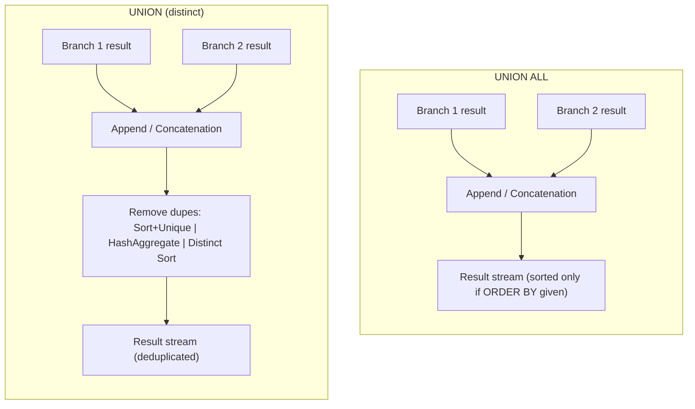
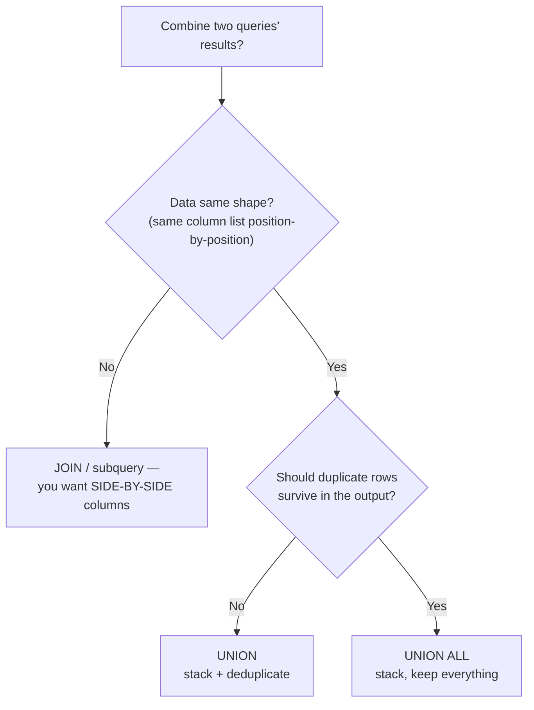

I have a clear picture of the handbook conventions and the target file is empty. Now I'll write the complete section.
Wrote the complete section to `sql-handbook/8-DML-and-Sets/65-UNION-UNION-ALL.md` (~1,490 lines), matching the handbook style.

**Covers:** fundamentals & mental model (stack vs stack+dedup), grain-checked sample tables, ANSI syntax, per-engine `DISTINCT` keywords and type coercion, whole-vs-branch `ORDER BY`/`LIMIT`/`TOP` rules, internal working (Append/Concatenation + deducting SORT UNIQUE/HashAggregate/Distinct-Sort plans, illustrative — always verify with EXPLAIN), NULL behavior (NULL=NULL during dedup, type inference, ORDER BY NULL placement), 8 scenarios with BAD→BETTER, edge cases, 8 mistakes, production pitfalls, performance with plan-verification emphasis, 4 comparison tables, best practices, 2 Mermaid diagrams, consolidated dialect notes, and 40 unanswered interview questions across all 8 categories.

All example outputs are computed against the shared dataset. I steered clear of absolute performance claims and flagged every dialect-specific behavior (PostgreSQL/MySQL/SQL Server/Oracle). 3. [Database-Specific Notes](#13-database-specific-notes) 14. [Interview Questions](#interview-questions)

> **See also:** [Section 40 — DISTINCT](#) for duplicate-removal semantics,
> [Section 33 — CTEs](#) and [Section 34 — Recursive CTEs](#) (recursion is
> literally built on `UNION ALL`), [Section 36 — GROUP BY](#) for
> aggregation that follows a `UNION`, and the Anti-Joins section where
> `EXCEPT` / `MINUS` (the sibling set operators) are covered in depth.

---

## 1. Fundamentals

### 1.1 What a set operator is

SQL is at its heart a **set language**: tables are sets (or more precisely,
_bags_ — duplicate rows are possible) of rows. Set operators combine whole
result sets, not individual rows:

| Operator                   | What it does                                       | Row count effect |
| -------------------------- | -------------------------------------------------- | ---------------- |
| `UNION`                    | Stacks results, removes duplicate rows             | ≤ sum of inputs  |
| `UNION ALL`                | Stacks results, keeps every row                    | = sum of inputs  |
| `INTERSECT`                | Rows present in _both_ sets                        | ≤ min of inputs  |
| `INTERSECT ALL`            | Intersection respecting multiplicity               | ≤ min of inputs  |
| `EXCEPT` / `MINUS`         | Rows in the first set that are _not_ in the second | ≤ first input    |
| `EXCEPT ALL` / `MINUS ALL` | Set difference respecting multiplicity             | ≤ first input    |

This section covers `UNION` and `UNION ALL`. `INTERSECT` and `EXCEPT` are
covered in the Anti-Joins section; a quick comparison table appears in
[Section 11](#11-comparison-tables).

### 1.2 Why they exist

Real systems produce **homogeneous data split across multiple places**:

- Sales happened on the website _and_ in stores — two tables, same columns.
- Historical data is partitioned across `orders_2025`, `orders_2026`, … —
  same schema, yearly tables.
- The people directory contains employees _and_ contractors — two sources,
  same logical shape.
- Two marketing feeds list the same email list with possible overlap.

There is no way to get one result set out of two `SELECT`s other than a set
operator. A `JOIN` cannot help here: a `JOIN` places columns **side by side**
(across), while `UNION` places the rows **one on top of another** (down).

```
JOIN  :  columns from A and B side by side   →  wider rows
        (1:m or m:1 pairing)

UNION :  rows from A, then rows from B below  →  taller result
        (same column list)
```

### 1.3 The mental model

> `UNION ALL` = **stack**. `UNION` = **stack then deduplicate**.

- `UNION ALL` is the _raw concatenation_ of two result sets. It never looks
  sideways, never compares rows, never removes anything. It is conceptually
  the simplest operation in SQL.
- `UNION` is `UNION ALL` followed by a `SELECT DISTINCT` over the combined
  result. That deduplication pass is **the entire difference** between the two
  operators, and it costs memory and CPU.

Neither operator gives you a guaranteed output order (see [4. Internal
Working](#4-internal-working)). If you need a specific order, add a trailing
`ORDER BY` inside a subquery or at the very end.

> **Common misconception:** "`UNION` is just like `UNION ALL` but with
> `DISTINCT`." That is accurate. The follow-up mistake is believing that the
> two are interchangeable. They return _different row counts_ whenever
> duplicates exist, and `UNION` pays a deduplication cost even when there are
> zero duplicates to remove.

> **Interview trap:** people memorize "`UNION` removes duplicates, `UNION ALL`
> doesn't" but forget the _equality rule_: during deduplication,
> `NULL = NULL` is treated as **TRUE** (see [Section 5](#5-null-behavior)).
> Set operators group all `NULL`s together, unlike the `=` operator in a
> `WHERE` clause, where `NULL = NULL` is `UNKNOWN`/`NULL` and matches nothing.

---

## 2. The Sample Tables (grain check)

Always state the grain before querying. All examples below reuse this dataset.

**employees** — _one row per currently active employee._

```sql
CREATE TABLE employees (
    employee_id INT PRIMARY KEY,
    full_name   VARCHAR(80),
    department  VARCHAR(40),
    base_salary NUMERIC(10,2),
    active      BOOLEAN
);

INSERT INTO employees VALUES
(1, 'Ana Silva',    'Engineering', 90000.00, TRUE),
(2, 'Chen Wei',     'Engineering', 85000.00, TRUE),
(3, 'Maria Garcia', 'Data',        89000.00, TRUE);
```

**former_employees** — _one row per employee who has left the company._

```sql
CREATE TABLE former_employees (
    employee_id INT PRIMARY KEY,
    full_name   VARCHAR(80),
    department  VARCHAR(40),
    base_salary NUMERIC(10,2),
    left_on     DATE
);

INSERT INTO former_employees VALUES
(2, 'Chen Wei',   'Engineering', 82000.00, '2025-03-31'),
(4, 'John Smith', 'Ops',         70000.00, '2024-12-15');
```

**contractors** — _one row per active contractor._

```sql
CREATE TABLE contractors (
    contractor_id INT PRIMARY KEY,
    full_name    VARCHAR(80),
    team         VARCHAR(40),
    daily_rate   NUMERIC(8,2)
);

INSERT INTO contractors VALUES
(101, 'Priya Sharma', 'Data',        950.00),
(102, 'Liam Brown',   'Engineering', 1100.00);
```

**web_sales** — _one row per single web transaction._

```sql
CREATE TABLE web_sales (
    sale_id   INT PRIMARY KEY,
    customer  VARCHAR(80),
    region    VARCHAR(20),
    sale_date DATE,
    amount    NUMERIC(10,2)
);

INSERT INTO web_sales VALUES
(501, 'Otto Hauser', 'EMEA',  '2026-09-01', 120.00),
(502, 'Ana Silva',   'LATAM', '2026-09-02',  75.50),
(503, 'Chen Wei',    'APAC',  '2026-09-02', 200.00);
```

**store_sales** — _one row per single in-store transaction._

```sql
CREATE TABLE store_sales (
    sale_id   INT PRIMARY KEY,
    customer  VARCHAR(80),
    region    VARCHAR(20),
    sale_date DATE,
    amount    NUMERIC(10,2)
);

INSERT INTO store_sales VALUES
(601, 'Maria Garcia', 'LATAM', '2026-09-02',  45.00),
(602, 'Otto Hauser',  'EMEA',  '2026-09-03',  88.25),
(603, 'Ana Silva',    'LATAM', '2026-09-03', 150.00);
```

**email_list** — _one row per email captured by the email campaign._

```sql
CREATE TABLE email_list (
    email  VARCHAR(100),
    source VARCHAR(20)
);

INSERT INTO email_list VALUES
('otto@example.com',  'campaign-a'),
('maria@example.org', 'campaign-a');
```

**web_signups** — _one row per user who signed up on the website._

```sql
CREATE TABLE web_signups (
    email  VARCHAR(100),
    source VARCHAR(20)
);

INSERT INTO web_signups VALUES
('maria@example.org', 'website'),
('chen@example.com',  'website');
```

**orders_2025 / orders_2026** — _one row per order per year (archived
partitions of the same logical table)._

```sql
CREATE TABLE orders_2025 (
    order_id   INT PRIMARY KEY,
    order_date DATE,
    total      NUMERIC(10,2)
);

INSERT INTO orders_2025 VALUES
(1, '2025-01-15', 150.00),
(2, '2025-06-20',  89.90);

CREATE TABLE orders_2026 (
    order_id   INT PRIMARY KEY,
    order_date DATE,
    total      NUMERIC(10,2)
);

INSERT INTO orders_2026 VALUES
(3, '2026-02-10', 210.00),
(4, '2026-07-04',  42.50);
```

**kpis** — _one row per KPI, one column per month (wide format — the format the
unpivot scenario needs to break back into narrow rows)._

```sql
CREATE TABLE kpis (
    kpi_name   VARCHAR(30),
    jan_amount NUMERIC(10,2),
    feb_amount NUMERIC(10,2),
    mar_amount NUMERIC(10,2)
);

INSERT INTO kpis VALUES
('revenue', 100.00, 150.00, 120.00),
('refunds',   5.00,   8.00,   3.00);
```

---

## 3. Syntax

### 3.1 The basic shape (ANSI SQL)

```
SELECT ... [ORDER BY ... LIMIT ...]
UNION [ALL | DISTINCT]
SELECT ...
[UNION [ALL | DISTINCT] SELECT ...]...
[ORDER BY ...] [LIMIT ...]
```

Every `SELECT` after the first is called a **branch**. Rules that apply
universally:

1. **Same number of columns.** Every branch must return exactly the same
   number of columns. Fewer or more = syntax/compile error in every engine.
2. **Positions must line up.** SQL compares columns _by position_ (1 ↔ 1,
   2 ↔ 2, …), **not by name**.
3. **Compatible data types.** Corresponding columns must be type-compatible so
   the engine can compute one common result type. Exact rules differ by
   dialect (see [3.3](#33-type-coercion-per-dialect)).
4. **Column headings come from the first `SELECT`.** The output column
   _names_ (and, for character types, the display characteristics) are taken
   from the first branch.
5. **A trailing `ORDER BY` applies to the whole result**, and may reference
   only columns that appear in (or are aliased by) the **first** `SELECT`.

### 3.2 Examples

The simplest demonstration:

```sql
SELECT full_name, department FROM employees
UNION ALL
SELECT full_name, department FROM former_employees;
```

Expected output (5 rows — everything from both sides, duplicates kept):

| full_name    | department  |
| ------------ | ----------- |
| Ana Silva    | Engineering |
| Chen Wei     | Engineering |
| Maria Garcia | Data        |
| Chen Wei     | Engineering |
| John Smith   | Ops         |

Now swap to `UNION`:

```sql
SELECT full_name, department FROM employees
UNION
SELECT full_name, department FROM former_employees;
```

Expected output (4 rows — the duplicated `Chen Wei` row is collapsed to one):

| full_name    | department  |
| ------------ | ----------- |
| Ana Silva    | Engineering |
| Chen Wei     | Engineering |
| Maria Garcia | Data        |
| John Smith   | Ops         |

> Note: the exact _order_ of these rows is NOT guaranteed by either query. The
> `UNION` example shows a tidy order here only because these small tables sort
> conveniently on some engines; never rely on it.

### 3.3 Explicit `DISTINCT` keyword

The SQL standard writes deduplicating union as `UNION DISTINCT`. Convention
varies:

| Engine     | `UNION`              | `UNION DISTINCT` | `UNION ALL` |
| ---------- | -------------------- | ---------------- | ----------- |
| PostgreSQL | ✔ (same as DISTINCT) | ✔                | ✔           |
| MySQL      | ✔ (same as DISTINCT) | ✔                | ✔           |
| SQL Server | ✔ (same as DISTINCT) | ✖                | ✔           |
| Oracle     | ✔ (same as DISTINCT) | ✖                | ✔           |
| SQLite     | ✔ (same as DISTINCT) | ✔                | ✔           |

`UNION` with no keyword is the ANSI default and works everywhere — prefer it
for portability.

### 3.4 Type coercion per dialect

The common result type for each column is derived from _all_ branches, not
just the first.

> **PostgreSQL:** chooses the type using its `UNION` type-resolution rules —
> effectively the "most general" compatible type. Unknown literals (plain
> strings, `NULL`) are coerced to the type of the matching column. Mixing
> truly incompatible types is a hard error: `SELECT 1 UNION SELECT 'a'`
> fails with `invalid input syntax for type integer: "a"` because the
> unknown literal `'a'` is assumed to be an integer.

> **SQL Server:** implicit conversions follow data type precedence; if no
> implicit conversion exists, the query errors (`Conversion failed when
converting the varchar value 'a' to data type int`).

> **MySQL:** is the most permissive. It picks a result column type that can
> represent the values of all branches (longest string length, widest numeric
> type, etc.). Mixing textures is allowed and _silently coerced_; whether a
> string that cannot convert to a number becomes `0` or an error depends on
> strict SQL mode. Verify before relying on it.

> **Oracle:** requires corresponding columns to be type-compatible and
> widens the result (e.g., the same numeric precision/scale rules as
> regular expressions). Character columns get the length of the longest
> branch.

### 3.5 `ORDER BY` and `LIMIT` / `TOP` with `UNION`

This is the classic trap area. Three distinct rules:

**A. Trailing `ORDER BY` — applies to the whole combined result.**

```sql
SELECT full_name, department FROM employees
UNION ALL
SELECT full_name, department FROM former_employees
ORDER BY full_name;
```

5 rows, sorted by full name.

> The trailing `ORDER BY` can only address **output columns of the first
> `SELECT`** (by name or alias) or positional ordinals. `ORDER BY base_salary`
> below fails because `base_salary` is not an output column:
>
> ```sql
> -- ERROR in every engine: "base_salary" is not in the output column list
> SELECT full_name FROM employees
> UNION ALL
> SELECT full_name FROM former_employees
> ORDER BY base_salary;
> ```

**B. Ordering one individual branch.**

Branches _cannot_ carry their own side-effects-free `ORDER BY`:

- **PostgreSQL / MySQL:** wrap the branch in parentheses, and the sub‑select
  requires a `LIMIT` (or other subquery-legal clause) to be meaningful:
  ```sql
  (SELECT full_name, department FROM employees ORDER BY full_name LIMIT 1)
  UNION ALL
  (SELECT full_name, department FROM former_employees ORDER BY full_name LIMIT 1);
  ```
- **SQL Server:** a branch needs `TOP` or `OFFSET`/`FETCH` before it will
  accept an inline `ORDER BY`:
  ```sql
  SELECT TOP (1) full_name, department FROM employees ORDER BY full_name
  UNION ALL
  SELECT TOP (1) full_name, department FROM former_employees ORDER BY full_name;
  ```
  Note SQL Server does not require parentheses here; the `ORDER BY` with
  `TOP` is inside the branch.
- **Oracle:** inline views with `ORDER BY` + `FETCH FIRST n ROWS ONLY`.

**C. Trailing `LIMIT` (PostgreSQL, MySQL, SQLite) — applies to the whole result.**

```sql
(SELECT full_name FROM employees ORDER BY full_name LIMIT 1)
UNION ALL
(SELECT full_name FROM former_employees ORDER BY full_name LIMIT 1)
ORDER BY full_name
LIMIT 2;
```

This means: take the first name from each table, stack them, sort, and cap at 2. The word `LIMIT` appears twice and does _two different jobs_ — branch
limit (`LIMIT 1`) and whole-result limit (`LIMIT 2`).

**D. Remember what `UNION` does to ordering.**

Because `UNION` (distinct) sorts or hashes to remove duplicates, many engines
_happen_ to return near-sorted output for small datasets. That is a side
effect, not a guarantee. Always finish with an explicit `ORDER BY`.

### 3.6 Aliasing

Only the **first** `SELECT`'s aliases survive into the output (driving the
column names of the result set and the addressable names for the trailing
`ORDER BY`).

```sql
SELECT full_name AS name, department AS dept FROM employees
UNION ALL
SELECT full_name, department FROM former_employees
ORDER BY name;
```

`ORDER BY name` works; `ORDER BY dept` also works (dept is from the first
branch). Adding `AS name` in the second branch is allowed but has no effect.

> **Interview trap:** "Why does `ORDER BY <alias from the second SELECT>` fail
> after a `UNION`?" Because SQL resolves the trailing `ORDER BY` against the
> _first_ branch's output column names only.

---

## 4. Internal Working

### 4.1 Set operators are physical operators

Every SQL query becomes an execution plan. A `UNION`/`UNION ALL` plan has two
distinct parts:

1. **Concatenation (the "append"):** each branch is executed on its own, and
   its rows are emitted one after another into a combined stream. In
   PostgreSQL this is an **`Append`** node; in SQL Server it's the
   **`Concatenation`** operator; in Oracle the **`UNION-ALL`** operator; in
   MySQL it's managed through the `UNION RESULT` step of its executor.

2. **Deduplication (only for `UNION`):** the combined stream must be checked
   for duplicates, which is a sort-based or hash-based pass (see below).

The dedup step is **the whole difference in cost** between `UNION` and
`UNION ALL`.



### 4.2 How deduplication is implemented — per engine (illustrative)

The exact mechanism varies by engine, version, and the query; always confirm
with an execution plan:

| Engine     | Typical `UNION` plan pieces                                                                                   | Typical `UNION ALL` plan pieces           |
| ---------- | ------------------------------------------------------------------------------------------------------------- | ----------------------------------------- |
| PostgreSQL | `Append` followed by **`HashAggregate`** or **`Sort` + `Unique`** (cost decides)                              | just `Append`                             |
| MySQL      | `UNION RESULT` step over the two `SELECT` steps; duplicates removed via a temporary table (often with a sort) | `UNION RESULT` step, no distinct-tracking |
| SQL Server | **`Concatenation`** → **`Sort` (Distinct Sort)** or **`Hash Match`** (aggregate) / **`Flow Distinct`**        | just `Concatenation`                      |
| Oracle     | **`UNION-ALL`** → **`SORT UNIQUE`**                                                                           | `UNION-ALL` (single operator)             |

The dedup pass must _compare entire rows_ (every output column), so
`UNION` cost scales with:

- the total number of combined rows, and
- the **width** (number and size of columns) of each output row.

### 4.3 Two null-behavior notes at the plan level

- During dedup, all `NULL`s compare equal (see [Section 5](#5-null-behavior)).
- `UNION ALL` never even asks the question — it passes every row through
  untouched.

### 4.4 What the optimizer can do across branches

Even though branches execute independently, the optimizer often gets a
"free" lunch:

- **Limit pushdown:** given `(...LIMIT 5) UNION ALL (...LIMIT 5) ORDER BY ... LIMIT 10`,
  PostgreSQL 12+ and some engines push the top-N limit into each append child.
- **Aggregation pushdown:** `SELECT ... FROM (branch1 UNION ALL branch2)
GROUP BY ...` can evaluate aggregates inside the `Append` rather than on a
  giant combined table.
- **Index use per branch:** every branch is planned separately, so each can
  use its own indexes; composite indexes, covering indexes, etc., apply
  per branch.

> Do not assume any of the above happens — that is exactly what
> `EXPLAIN` / `EXPLAIN ANALYZE` (and `SET STATISTICS PROFILE ON` in SQL
> Server, `EXPLAIN PLAN` in Oracle, `EXPLAIN` in MySQL) is for.

### 4.5 A representative plan (illustrative — always verify)

PostgreSQL shape:

```
EXPLAIN (ANALYZE)
SELECT sale_date, amount FROM web_sales
UNION ALL
SELECT sale_date, amount FROM store_sales;
```

```
Append  (rows=6 ...)
  ->  Seq Scan on web_sales   (rows=3 ...)
  ->  Seq Scan on store_sales (rows=3 ...)
```

With `UNION` instead, an extra distinct node appears:

```
HashAggregate  (rows=6 ...)
  ->  Append
        ->  Seq Scan on web_sales
        ->  Seq Scan on store_sales
```

(Use `EXPLAIN ANALYZE` on your real tables — the node choice, `HashAggregate`
vs `Sort + Unique`, changes with data volume and memory settings.)

---

## 5. NULL Behavior

NULL is where set operators diverge from ordinary `=` comparisons. Get this
right — it is a favorite interview trap.

### 5.1 During deduplication, NULLs are EQUAL to NULLs

In a `WHERE` clause, `NULL = NULL` is `UNKNOWN`, so nothing matches. In
`UNION` deduplication, the standard defines `NULL`s to be **equal to each
other** for the purpose of duplicate removal. Consequences:

```sql
SELECT NULL AS x
UNION
SELECT NULL;
```

**Expected result: one row** (not two).

```sql
SELECT NULL AS x
UNION ALL
SELECT NULL;
```

**Expected result: two rows.**

The same rule governs `SELECT DISTINCT`: `SELECT NULL UNION SELECT NULL` and
`SELECT DISTINCT NULL` both return exactly one row.

> **Interview trap:** "`UNION` treats NULL as equal to NULL" contradicts what
> the student learned in the NULL section, so it is frequently missed. The two
> contexts have different rules: equality _testing_ (three-valued logic) vs
> _grouping/dedup_ (NULLs collapse together).

### 5.2 NULL as a literal in a branch — type inference

A bare `SELECT NULL` branch works fine when the other branch supplies a type
for that column:

```sql
-- works everywhere: NULL picks up type from the sibling branch
SELECT 'web' AS channel, amount FROM web_sales
UNION ALL
SELECT NULL,              amount FROM web_sales;
```

The tricky cases:

- **PostgreSQL:** a column that is `NULL` in _every_ branch may stay type
  `unknown`, which is legal until you try to use it (e.g., in `ORDER BY` or a
  downstream view) — then you'll need `CAST(NULL AS text)`.
- **SQL Server:** NULL affects result type resolution — two branches of
  `NULL` against `1` and `'a'` will fail on the incompatible conversion.
- **MySQL:** permissive as always; `NULL` simply matches the wider result
  column type.
- **Oracle:** works; the NULL column adopts the datatype of the comparable
  column.

### 5.3 NULL and result-column names

A first-branch column `SELECT NULL AS note` produces a column named `note`
containing NULLs from all branches — no NULL-related naming surprises.
Only the _value_ behaves as above.

### 5.4 NULL with `ORDER BY`

After a `UNION`, a trailing `ORDER BY column ASC` places NULLs first in
MySQL/SQLite (NULLs sort as the smallest value) and last in PostgreSQL
(NULLs sort as the largest value by default); the SQL Server default
places NULLs first with `ASC`; Oracle treats NULLs as greatest (so `ASC`
puts them last, `DESC` puts them first). Behavior varies by engine and is
independent of the set operator itself — check your engine's `NULLS
FIRST`/`NULLS LAST` defaults rather than relying on memory.

---

## 6. Scenario-Based Examples

### 6.1 Scenario 1 — Total revenue per day across web + store (the workhorse)

**Question:** the finance team wants one daily revenue figure that includes
both channels.

**BAD APPROACH — join two pre-aggregated branches:**

```sql
SELECT COALESCE(w.sale_date, s.sale_date) AS sale_date,
       COALESCE(w.web_total, 0) + COALESCE(s.store_total, 0) AS total_revenue
FROM (SELECT sale_date, SUM(amount) AS web_total
      FROM web_sales GROUP BY sale_date) w
FULL OUTER JOIN
     (SELECT sale_date, SUM(amount) AS store_total
      FROM store_sales GROUP BY sale_date) s
  ON w.sale_date = s.sale_date
ORDER BY sale_date;
```

This _works_ but only because of the `FULL OUTER JOIN` plus `COALESCE`
plumbing; a naive `LEFT JOIN` would silently drop days with no web sales
(see the LEFT JOIN section). The shape is: "two same-shaped tables
→ combine" and that is exactly what a set operator is for.

**BETTER APPROACH — stack, then aggregate:**

```sql
SELECT sale_date, SUM(amount) AS total_revenue
FROM (
    SELECT sale_date, amount FROM web_sales
    UNION ALL
    SELECT sale_date, amount FROM store_sales
) AS combined
GROUP BY sale_date
ORDER BY sale_date;
```

Why `UNION ALL` and not `UNION`? A web transaction and a store transaction
are _distinct events_; they could never be full duplicates (different IDs,
channels), so distincting is wasted work. Also note the aggregation must wrap
the union — you cannot `GROUP BY` one branch and hope it applies to the
combined rows.

**Expected output:**

| sale_date  | total_revenue |
| ---------- | ------------- |
| 2026-09-01 | 120.00        |
| 2026-09-02 | 320.50        |
| 2026-09-03 | 238.25        |

Check: 09-02 = web 75.50 + 200.00 + store 45.00 = **320.50**. 09-03 =
store 88.25 + 150.00 = **238.25**.

### 6.2 Scenario 2 — A people directory (employees + former employees)

**Question:** HR wants one name/department list that includes ex-employees so
the phone book stays complete.

```sql
SELECT full_name, department FROM employees
UNION ALL
SELECT full_name, department FROM former_employees
ORDER BY full_name;
```

**Expected output:**

| full_name    | department  |
| ------------ | ----------- |
| Ana Silva    | Engineering |
| Chen Wei     | Engineering |
| Chen Wei     | Engineering |
| John Smith   | Ops         |
| Maria Garcia | Data        |

Why `UNION ALL`? A person _can_ be in both tables (Chen Wei still appears
somewhere). If the directory is "one contact row per person," dedup is
desired and `UNION` is right:

```sql
SELECT full_name, department FROM employees
UNION
SELECT full_name, department FROM former_employees
ORDER BY full_name;
```

**Expected output: 4 rows** — `Chen Wei` appears exactly once.

Here `Chen Wei` produces two rows from `UNION ALL` and a single row from
`UNION`. "Keep duplicates?" is exactly the `UNION ALL` vs `UNION` decision.

### 6.3 Scenario 3 — Cleaning an overlapping subscriber feed with `UNION`

**Question:** marketing merged two lists that may contain the same email twice;
build the master de-duplicated list.

```sql
SELECT email FROM email_list
UNION
SELECT email FROM web_signups;
```

**Expected output:**

| email             |
| ----------------- |
| chen@example.com  |
| maria@example.org |
| otto@example.com  |

`maria@example.org` exists in both tables → collapses to one row. With
`UNION ALL` you'd get 4 rows (the duplicate kept).

> Good rule of thumb: if the result is "a set of unique things" (one email per
> person), `UNION` is correct; if the result is "events, facts, or rows that
> carry distinct meaning," `UNION ALL` is correct.

### 6.4 Scenario 4 — Top 2 sales per channel, merged into one leaderboard

**Question:** "Return the 2 biggest transactions from web and the 2 biggest
from stores, as one ranked list."

The trick: the **per-branch** cap must happen _before_ the union, and the
**global sort** after it.

**PostgreSQL / MySQL:**

```sql
(SELECT 'web'   AS channel, sale_id, customer, amount
   FROM web_sales   ORDER BY amount DESC LIMIT 2)
UNION ALL
(SELECT 'store' AS channel, sale_id, customer, amount
   FROM store_sales ORDER BY amount DESC LIMIT 2)
ORDER BY amount DESC;
```

**SQL Server:**

```sql
SELECT 'web' AS channel, sale_id, customer, amount
FROM (SELECT TOP (2) sale_id, customer, amount
      FROM web_sales ORDER BY amount DESC) w
UNION ALL
SELECT 'store' AS channel, sale_id, customer, amount
FROM (SELECT TOP (2) sale_id, customer, amount
      FROM store_sales ORDER BY amount DESC) s
ORDER BY amount DESC;
```

**Expected output:**

| channel | sale_id | customer    | amount |
| ------- | ------- | ----------- | ------ |
| web     | 503     | Chen Wei    | 200.00 |
| store   | 603     | Ana Silva   | 150.00 |
| web     | 501     | Otto Hauser | 120.00 |
| store   | 602     | Otto Hauser | 88.25  |

Why `UNION ALL` here? Branch rows can't collide (channel differs).

> **Interview trap:** the branch `LIMIT`/`TOP` is _inside_ each branch and the
> final `ORDER BY` is _outside_, on the combined result. People routinely put
> one `LIMIT` after the union and wonder why only the first branch was limited.

### 6.5 Scenario 5 — Unpivot a wide table into narrow rows (a hidden gem)

`UNION ALL` is the portable way to turn columns into rows when your engine
lacks `UNPIVOT` or `LATERAL`. The buried `kpis` table is wide (one column per
month); analysts want narrow (one row per KPI per month).

```sql
SELECT kpi_name, 'jan' AS month, jan_amount AS amount FROM kpis
UNION ALL
SELECT kpi_name, 'feb', feb_amount FROM kpis
UNION ALL
SELECT kpi_name, 'mar', mar_amount FROM kpis
ORDER BY kpi_name, month;
```

**Expected output:**

| kpi_name | month | amount |
| -------- | ----- | ------ |
| refunds  | jan   | 5.00   |
| refunds  | feb   | 8.00   |
| refunds  | mar   | 3.00   |
| revenue  | jan   | 100.00 |
| revenue  | feb   | 150.00 |
| revenue  | mar   | 120.00 |

If a month value is `NULL`, the corresponding row still appears (with NULL
amount) — which is usually what a pivot consumer wants. Newer dialect
alternatives exist (`UNPIVOT` in SQL Server, `VALUES` in PostgreSQL/`LATERAL`
in many engines), but `UNION ALL` works in **every** engine.

### 6.6 Scenario 6 — `UNION` vs `JOIN`: same shape vs different shape

**Question:** "I have two tables; how do I combine them?"

Two fundamentally different questions:

- **Same rows, different columns** (side-by-side) → **`JOIN`.** Example: put
  `employees.base_salary` next to `contractors.daily_rate` for the same
  person. This is column concatenation.
- **Same columns, different rows** (one atop another) → **`UNION`.** Example:
  stack employees and former employees. This is row concatenation.

```sql
-- BAD: USING a UNION to "merge" two different-shaped sources
SELECT full_name, base_salary FROM employees
UNION ALL
SELECT full_name, daily_rate  FROM contractors;   -- meaningless: salary vs rate

-- BAD: USING a JOIN to stack same-shaped rows --- a cartesian explosion in disguise
-- (this pairs every employee with every contractor = 3 x 2 = 6 rows)
SELECT e.full_name AS employee_name, c.full_name AS contractor_name
FROM employees e
CROSS JOIN contractors c;
```

The first is a type-safety accident waiting to happen; the second is a
different (legitimate but unrelated) question. Ask yourself: do I want the
_result rows_ to be taller or wider? Taller → `UNION`; wider → `JOIN`.

**Decision diagram:**



### 6.7 Scenario 7 — Aggregating across archived yearly partitions

**Question:** total revenue across two archived order tables.

```sql
SELECT '2025' AS year, order_id, order_date, total FROM orders_2025
UNION ALL
SELECT '2026',         order_id, order_date, total FROM orders_2026
ORDER BY order_date;
```

**Expected output:**

| year | order_id | order_date | total  |
| ---- | -------- | ---------- | ------ |
| 2025 | 1        | 2025-01-15 | 150.00 |
| 2026 | 3        | 2026-02-10 | 210.00 |
| 2025 | 2        | 2025-06-20 | 89.90  |
| 2026 | 4        | 2026-07-04 | 42.50  |

By construction the two partitions are disjoint, so `UNION` would add a
pointless dedup pass; `UNION ALL` is what you want. (Note: if these tables are
really partitions of one logical table, a native partitioned table / `UNION
ALL` view — a "partitioned view" in SQL Server parlance — is the classic
pattern.)

### 6.8 Scenario 8 — Recursive CTEs are `UNION ALL` under the hood

Recursive CTEs (Section 34) are written with `UNION ALL` between the anchor
and recursive terms:

```sql
WITH RECURSIVE nums(n) AS (
    SELECT 1
    UNION ALL
    SELECT n + 1 FROM nums WHERE n < 5
)
SELECT n FROM nums;
```

**Expected output:**

| n   |
| --- |
| 1   |
| 2   |
| 3   |
| 4   |
| 5   |

Here `UNION ALL` repeats the _iterative_ semantics: each iteration feeds the
next. PostgreSQL also permits a recursive `UNION DISTINCT`, which stops
revisiting already-seen rows — but it can materially change convergence and
loop behavior; MySQL only supports the recursive `UNION [ALL]` form. If you
see "infinite recursion," the fix usually belongs to the `WHERE n < 5` guard,
not the union keyword.

---

## 7. Edge Cases

### 7.1 A branch returns zero rows

An empty branch contributes nothing; the operator still behaves normally for
the others. `SELECT * FROM web_sales WHERE region = 'none' UNION ALL SELECT *
FROM store_sales` yields exactly the store rows. With `UNION` and an empty
branch, dedup silently costs a pass over the non-empty side for no benefit.

### 7.2 Mismatched column counts

Failed at compile time in every engine:

```sql
SELECT order_id, order_date FROM orders_2025
UNION ALL
SELECT order_date FROM orders_2026;
-- ERROR: each SELECT in a UNION must have the same number of columns
```

### 7.3 Column order matters — alignment by position

`UNION` aligns columns **by position, not by name**. Two branches with
(coincidentally swapped) columns produce a silently wrong result set:

```sql
SELECT full_name, department FROM employees          -- name, dept
UNION ALL
SELECT department, full_name FROM former_employees;  -- dept, name -- WRONG
```

The output columns are `(full_name, department)` in the first branch — the
second branch's `department` value lands "in" the `full_name` column.
Always visually verify that branch column order matches.

### 7.4 Incompatible types

```sql
SELECT order_id, 'open' AS status FROM orders_2025
UNION ALL
SELECT order_id, 1 AS status FROM orders_2026;
```

- PostgreSQL / SQL Server / Oracle: error (text vs integer).
- MySQL: succeeds with coercion (the string and number both fit in a text
  column, or the number converts to text) — quietly.

Label the type expectation per branch; `CAST(1 AS TEXT)` removes the ambiguity
everywhere.

### 7.5 First branch literal / NULL columns stay untyped

As noted in [Section 5.2](#52-null-as-a-literal-in-a-branch--type-inference),
`SELECT 1 AS x UNION SELECT 2` is fine (both integers), but `SELECT NULL AS x
UNION SELECT 2` can leave the NULL column as type `unknown` in PostgreSQL,
which errors only later (in a view, an `ORDER BY`, etc.). Alias known-typed
columns in the first branch or `CAST` explicit.

### 7.6 Ordering is not guaranteed per branch

Even though each branch may internally sort (because of a dedup pass), the
_combined_ result is not guaranteed to interleave sensibly. Always finish with
final `ORDER BY` if ordering matters.

### 7.7 The trailing ORDER BY cannot see column names from later branches

Covered in [3.5](#35-order-by-and-limit--top-with-union): the output column
set is frozen by the first branch.

### 7.8 `UNION` inside a VIEW / CTE

A view ending in `UNION` has the same rules; you cannot have a `GROUP BY` or
filter _between_ branches "mid-chain." You can wrap the union in a subquery
and filter outside:

```sql
SELECT * FROM (
    SELECT order_id, order_date, total FROM orders_2025
    UNION ALL
    SELECT order_id, order_date, total FROM orders_2026
) o
WHERE o.total >= 100;
```

**Expected output:**

| order_id | order_date | total  |
| -------- | ---------- | ------ |
| 1        | 2025-01-15 | 150.00 |
| 3        | 2026-02-10 | 210.00 |

### 7.9 `ORDER BY` with branch-level parts in PostgreSQL requires parentheses + a cap

```sql
SELECT 1 AS n
UNION ALL
SELECT 2
ORDER BY n DESC LIMIT 1;
```

is a **whole-result** ORDER BY + LIMIT. To order just the first branch, you
must parenthesize it and give it a LIMIT (PostgreSQL) — otherwise a syntax
error (and MySQL same).

### 7.10 Wide-result dedup

`UNION` compares every output column. Two tables with a 40-column payload
deduplicating on all 40 columns is much more expensive than deduplicating a
narrow projection. If uniqueness is decided by a single key, prefer something
like:

```sql
SELECT order_id, order_date, total FROM orders_2025
UNION
SELECT order_id, order_date, total FROM orders_2026;
```

vs. the even narrower alternative of deduplicating the key column first in a
subquery and joining back. Measure with `EXPLAIN ANALYZE` before assuming one
is better in your engine (Section 10).

---

## 8. Common Mistakes

### 8.1 Using `UNION` (distinct) when branches are disjoint

```sql
-- BAD: forces a dedup pass that can never find a duplicate
SELECT order_id FROM orders_2025
UNION
SELECT order_id FROM orders_2026;
```

```sql
-- BETTER: disjoint data -> UNION ALL
SELECT order_id FROM orders_2025
UNION ALL
SELECT order_id FROM orders_2026;
```

Why: nearly all engines sort or hash to distinct; on disjoint data that is
pure waste. (Verify with your plan — for small tables it won't matter; for
hundreds of millions of rows it can.)

### 8.2 Mismatched column lists / order

Count columns, then verify positioning (see 7.3). A column-count error is
loud; a switched-columns union is _silent_ and poisonous.

### 8.3 Ordering "from the inside"

```sql
-- BAD (PostgreSQL/MySQL): free-floating branch ORDER BY is a syntax error
SELECT full_name FROM employees ORDER BY full_name
UNION ALL
SELECT full_name FROM former_employees;
```

Use branch parentheses + `LIMIT`, or move the sort after the union (3.5).

### 8.4 Aliasing only in late branches

```sql
-- BAD: the useful alias is in the second branch and gets ignored
SELECT full_name FROM employees
UNION ALL
SELECT full_name AS name FROM former_employees;

-- BETTER: alias in the FIRST branch
SELECT full_name AS name FROM employees
UNION ALL
SELECT full_name FROM former_employees;
```

### 8.5 Reaching for `UNION` to "merge" tables with different shapes

Same-shape stacking is a set operator; different-shape pairing is a `JOIN`
(Scenario 6). Crossing the wire ruins the result semantics.

### 8.6 Trusting `UNION` (or `UNION ALL`) output order

Both are unordered by spec. Only an explicit final `ORDER BY` promises order.

### 8.7 NULL equality surprise with `COUNT`

```sql
SELECT COUNT(*) FROM (
    SELECT NULL AS x
    UNION
    SELECT NULL
) u;
```

`COUNT(*)` = **1** (the two NULLs collapse). If you expected 2, you forgot the
set-operator NULL rule.

### 8.8 Applying `GROUP BY` to a single branch "of" a union

Aggregation must happen _outside_ the union (in a wrapping subquery), exactly
as in Scenario 1. You cannot say "group only the first half."

---

## 9. Production Pitfalls

> **Production pitfall:** A long-lived UNION view (e.g., across 12 monthly
> tables) silently breaks when someone adds a column to _one_ participating
> table. The error message ("different number of columns") surfaces, but the
> usual fix — adding a `NULL`/dummy in the other branch — is how column _order_
> drift sneaks in. Keep branches generated by the same schema template.

> **Production pitfall:** Recursive CTEs using `UNION ALL` can loop without
> bound if the recursive predicate never terminates. Production systems set a
> CTE iteration cap (`MAX_RECURSIVE_ITERATIONS`-style settings) and test with a
> `LIMIT`-guarded version first.

> **Production pitfall:** `UNION DISTINCT` on wide tables inside an ETL job can
> spill to temp space (a giant sort). If you only need distinct on a key, dedup
> the key first in a subquery, or use `GROUP BY key` and re-join the payload —
> then confirm with the execution plan.

> **Production pitfall:** `INSERT INTO big_table SELECT ... UNION ...` can be a
> multi-gigabyte sort inside one transaction. Prefer chunked `INSERT ... SELECT`
> / `UNION ALL` batch loads or bulk-load; in clustered systems chunking avoids
> lock/logger amplification.

> **Production pitfall:** MySQL silently coerces mismatching types across
> branches (a number column fed a string `'abc'` becomes `0` or errors
> depending on strict mode). Relying on the leniency produces wrong business
> numbers without a single warning surfacing in the app.

> **Production pitfall:** Ordering-only results at the very end of a `UNION`
> across 12 monthly partitions means a full sort of the combined set, no matter
> that each branch was sorted. If the target is strictly top-N, push the cut
> into branches (Scenario 4) and confirm with `EXPLAIN ANALYZE` that the
> engine didn't materialize everything.

> **Production pitfall:** Timezone-boundary bugs compound across branches:
> each branch may use a different `TIMESTAMP`/`DATE` interpretation, so the
> combined report double-counts a day. Align every branch to the same
> timezone/pivot rule _before_ the union (see Section 60 — Timezone Pitfalls).

---

## 10. Performance Implications

The only guaranteed cost difference between `UNION` and `UNION ALL` is the
**deduplication pass** (a sort/hash over the combined rows). That pass is
driven by:

- total rows after concatenation,
- output row width (columns you select + their types),
- whether memory is sufficient (hash-based dedup fits in memory vs spills to
  disk),
- plan choice of hash vs sort (which itself depends on statistics, both sides'
  cardinality, and cost model).

Everything else — index use, aggregate pushdown, limit pushdown — is perf
that varies by engine and version. **Verify, don't assume.**

> Rule: use `UNION ALL` when you do not need to remove duplicates; use `UNION`
> when you do. If the data is known-distinct or the semantics allow duplicates,
> `UNION` is wasted work regardless of the engine.

> Rule: never _choose_ between them on "which one is faster" without checking
> `EXPLAIN ANALYZE` on your data. What shows up in benchmarks with a million
> rows is not what happens with 10 or 10 billion.

What to look for in the plan:

- **PostgreSQL:** `EXPLAIN ANALYZE` — look for `HashAggregate` vs `Sort+Unique`
  after `Append`. If `UNION` shows a `Sort` you don't need, switch to `UNION ALL`.
- **MySQL:** `EXPLAIN` — `UNION RESULT` with `Using temporary`; `EXPLAIN
ANALYZE` (8.0.18+) shows actual timing including the temp-table phase.
- **SQL Server:** `SET STATISTICS PROFILE ON` / `SET STATISTICS IO,TIME ON` —
  look for `Distinct Sort` or `Hash Match (Flow Distinct)` after
  `Concatenation`.
- **Oracle:** `EXPLAIN PLAN` — `SORT UNIQUE` appears for `UNION` and is absent
  for `UNION ALL`.

Performance checklist for union-heavy queries:

1. Confirm you actually need dedup → `UNION ALL` if not.
2. Keep result rows narrow (project only needed columns) — dedup cost scales
   with row width.
3. Push `LIMIT`/`TOP`/`WHERE` into each branch.
4. Pre-aggregate per branch if the final report is an aggregate.
5. If you only need uniqueness on a key, dedup the narrow projection first,
   then re-join.
6. Respect per-branch indexes: an index on `(sale_date)`, `(department)`, etc.,
   never helps after the union — it only can help _inside_ each branch.

---

## 11. Comparison Tables

### 11.1 `UNION` vs `UNION ALL`

| Aspect              | `UNION`                                | `UNION ALL`                     |
| ------------------- | -------------------------------------- | ------------------------------- |
| Meaning             | stack + remove duplicate rows          | stack, keep every row           |
| Row count           | ≤ sum of branch rows                   | exactly the sum                 |
| NULLs               | all NULLs treated as equal → collapsed | preserved, each row kept        |
| Dedup cost          | yes (sort or hash — engine-dependent)  | no                              |
| Output order        | still unguaranteed                     | still unguaranteed              |
| Typical use         | "give me the distinct set"             | "concatenate events/facts"      |
| Known-disjoint data | unnecessary work                       | ideal                           |
| Overlapping data    | correct dedup                          | unsafe (may double-count)       |
| When in doubt       | when semantics require uniqueness      | when semantics allow duplicates |

### 11.2 The whole set-operator family (quick map)

| Operator    | Keeps                        | Wide-dialect notes                                             |
| ----------- | ---------------------------- | -------------------------------------------------------------- |
| `UNION`     | distinct union               | `UNION DISTINCT` accepted in PG/MySQL/SQLite                   |
| `UNION ALL` | union with multiplicities    | all dialects                                                   |
| `INTERSECT` | rows in both sets            | PG, SQL Server, Oracle, SQLite, MySQL 8.0.31+                  |
| `EXCEPT`    | rows in first, not in second | PG, SQL Server, SQLite, MySQL 8.0.31+; Oracle calls it `MINUS` |

(Full `EXCEPT`/`MINUS` coverage + NULLs and duplicates nuances live in the
Anti-Joins section.)

### 11.3 Deduplication mechanism by engine

| Engine     | Typical `UNION` mechanism                       | Notes                                         |
| ---------- | ----------------------------------------------- | --------------------------------------------- |
| PostgreSQL | `HashAggregate` or `Sort` + `Unique`            | cost-based; hash preferred when memory allows |
| MySQL      | `UNION RESULT` + temporary table (often sorted) | `Using temporary` in EXPLAIN                  |
| SQL Server | `Distinct Sort` or `Hash Match (Flow Distinct)` | plan shows which                              |
| Oracle     | `SORT UNIQUE`                                   | sort-based for distinct union                 |

> These are _illustrative_ — the engine decides per query. Confirm with your
> own `EXPLAIN`.

### 11.4 Branch-level ORDER BY syntax

| Engine     | Branch ORDER BY requires                  | Example                                          |
| ---------- | ----------------------------------------- | ------------------------------------------------ |
| PostgreSQL | parentheses + a subquery cap              | `(SELECT ... ORDER BY x LIMIT 1) UNION ALL ...`  |
| MySQL      | parentheses + LIMIT                       | `(SELECT ... ORDER BY x LIMIT 1) UNION ALL ...`  |
| SQL Server | `TOP` or `OFFSET/FETCH` in the branch     | `SELECT TOP (1) ... ORDER BY x UNION ALL ...`    |
| Oracle     | inline view + `FETCH FIRST ... ROWS ONLY` | `FROM (SELECT ... ORDER BY x) WHERE ROWNUM <= 1` |

---

## 12. Best Practices

1. **Decide intent first:** am I stacking same-shaped rows? → set operator.
   Am I pairing columns? → `JOIN`.
2. **Default to `UNION ALL`** unless uniqueness is part of the requirement.
3. **Put aliases in the first SELECT** — they become the output column names
   and the only names the trailing `ORDER BY` can see.
4. **Verify column order and types** branch-by-branch; position, not name,
   defines the alignment.
5. **Close every union with an explicit `ORDER BY`** when order matters.
6. **Push filters and limits into branches** when doing top-N-per-group work.
7. **Random sort the aggregate**, never group within a branch (wrap it).
8. **Keep dedup inputs narrow** if the payload is wide.
9. For **data that is genuinely the same logical table**, prefer native
   partitioning (`PARTITION BY`) or a partitioned view over hand-maintained
   `UNION ALL` chains.
10. **Test NULL safety**: a `NULL`-typed column in the first branch can break
    down the road in views/ORDER BY — `CAST` it when in doubt.
11. **Reuse the same DATETIME/TIMESTAMP semantics** in every branch.
12. **For recursive CTEs**, keep the `UNION ALL` form and always bound the
    recursion with a terminating predicate.

---

## 13. Database-Specific Notes

> **PostgreSQL**
>
> - `UNION` == `UNION DISTINCT`; `HashAggregate`/`Sort+Unique` dedup.
> - Branch `ORDER BY` forbidden without parentheses + cap; subquery (SELECT
>   with ORDER BY) requires a LIMIT.
> - `ORDER BY` after a union can only name first-branch output columns.
> - Recursive CTEs allow recursive `UNION` (stops re-visiting) or `UNION ALL`.

> **MySQL**
>
> - `UNION [DISTINCT | ALL]`; dedup via temporary table (`Using temporary`).
> - Same parenthesization rules for branch ORDER BY / LIMIT as PostgreSQL.
> - Very permissive type coercion across branches — beware silent conversion.
> - `INTERSECT`/`EXCEPT` arrived in 8.0.31; they share the temp-table machinery.

> **SQL Server**
>
> - No `UNION DISTINCT` spelling; dedup via `Distinct Sort` / `Hash Match`.
> - Branch `ORDER BY` allowed only with `TOP`/`OFFSET-FETCH`; no parentheses
>   needed.
> - Result column types follow data type precedence rules.
> - `UNION ALL` is the core of the classic "partitioned view" pattern.

> **Oracle**
>
> - `UNION` = sort-based distinct (`SORT UNIQUE`); `MINUS` is its EXCEPT.
> - `ORDER BY` allowed only at the end of the full statement; FETCH/ROWNUM is
>   the only per-branch cap.
> - Result columns widen (largest length / precision) across branches;
>   char-A comparisons during dedup are non-padded.

---

# Interview Questions

> These are practice questions — answers are intentionally not provided.
> Work them out by hand, then verify against [the dataset you set up above]
> and, ideally, against your own database. The output-prediction ones have
> exact answers you can derive from the sample tables.

### Beginner

1. What is the difference between `UNION` and `UNION ALL` in one sentence?
2. How many columns must each branch of a `UNION` return, and how does SQL
   decide which column of branch 2 pairs with which column of branch 1?
3. Where do the output column names of a `UNION` result come from?
4. Given `SELECT 1 AS x UNION ALL SELECT 2 AS x`, how many rows come back?
   What changes if you use `UNION`?
5. Does `UNION` guarantee the output is sorted?

### Intermediate

6. Explain why `SELECT full_name FROM employees ORDER BY department` as the
   first branch of a `UNION` is a problem, and how to fix it.
7. Write a query that returns the top 2 transactions from `web_sales` and the
   top 2 from `store_sales`, merged and sorted by amount. Show a PostgreSQL
   and a SQL Server version.
8. When would you prefer `UNION` over `UNION ALL` even though it costs more?
9. What does `SELECT NULL AS x UNION SELECT NULL` return? Why is this
   different from what `WHERE NULL = NULL` does?
10. How do you apply a `GROUP BY` to the result of a `UNION`? Can you `GROUP
BY` just one branch?

### Advanced

11. Write the unpivot query that turns the `kpis` table (monthly columns) into
    long (KPI, month, amount) rows using `UNION ALL`. What happens to a month
    whose value is `NULL`?
12. Explain how a recursive CTE is built on `UNION ALL`, and why a recursive
    `UNION DISTINCT` (PostgreSQL) stops revisiting rows.
13. Three queries stacked — `A UNION B UNION ALL C`. Show the grouping rules
    (`INTERSECT` binding tighter than `UNION`/`EXCEPT` where supported) and
    how parentheses change the result.
14. A view is a `UNION ALL` of 12 monthly tables. A developer adds a column
    to January's table only. What error appears, and why does "just add a
    dummy NULL" only hide the problem?
15. Why can `UNION` (dedup) on a 30-column result be orders of magnitude more
    expensive than `UNION ALL`, and how would you restructure the query if
    uniqueness is really about a single key column?

### Scenario Based

16. Web and store sales are two tables with identical columns. Finance wants
    one daily revenue number per region. Write the query and explain why the
    aggregate can't live inside a single branch.
17. Marketing gives you two overlapping email lists. Build the master
    de-duplicated list, and state whether you used `UNION` or `UNION ALL` and
    why it's business-safe.
18. You're asked for "the 3 most expensive orders from 2025 plus the 3 most
    expensive from 2026, in one list." Where do the `LIMIT`/`TOP` clauses go,
    and where does the final sort go?
19. The phone directory should list every current employee and every
    contractor, but a person who is both should appear once. Which operator,
    and on what columns does dedup actually happen?
20. A dashboard sums revenue across `web_sales` and `store_sales` but the
    numbers are 5% too high in July. List the union-related things you would
    check before touching the analytic query.

### Tricky

21. `SELECT '1' UNION SELECT 'a'` — what happens in PostgreSQL, SQL Server,
    and MySQL? Why the difference?
22. After `SELECT a, b FROM t1 UNION SELECT a, b FROM t2 ORDER BY b`, what
    columns can `ORDER BY` legally reference, and why can't it reference `b`
    of `t2` directly?
23. `SELECT NULL::integer AS x UNION SELECT 1.5 AS x` — the result column
    type is numeric, not integer. Explain type resolution across branches.
24. Two identical queries except one uses `UNION DISTINCT` and the other uses
    `(SELECT DISTINCT ...) UNION ...`. Are the results guaranteed equal? Are
    the plans?
25. `SELECT 1 AS n UNION SELECT 2 AS n UNION ALL SELECT 2` — how many rows?
    Trace the precedence.

### Output Prediction

26. `SELECT full_name FROM employees UNION ALL SELECT full_name FROM
former_employees;` — how many rows?
27. `SELECT full_name FROM employees UNION SELECT full_name FROM
former_employees;` — how many rows, and which name repeats?
28. `SELECT amount FROM web_sales WHERE region = 'LATAM' UNION SELECT amount
FROM store_sales WHERE region = 'LATAM';` — which amounts come back, in
    what order GUARANTEED?
29. `SELECT NULL AS x UNION SELECT NULL;` vs `SELECT NULL AS x UNION ALL
SELECT NULL;` — row counts?
30. Run this against the sample data:
    ```sql
    SELECT full_name, department FROM employees WHERE department = 'Engineering'
    UNION
    SELECT full_name, department FROM former_employees WHERE department = 'Engineering';
    ```
    Expected two rows — which two?

### Debugging

31. This query errors:
    ```sql
    SELECT order_id, order_date FROM orders_2025
    UNION
    SELECT order_date, total FROM orders_2026;
    ```
    Both branches "have two columns." Explain the real problem.
32. A dashboard shows Carl twice after adding a `former_employees` branch.
    The directory is supposed to show one row per person. Which operator is
    in the query, and what two-line change fixes it?
33. A colleague writes `SELECT full_name FROM employees UNION ALL SELECT
full_name FROM former_employees ORDER BY department;` and it breaks. Why
    — and what's the correct fix when the report must sort by department?
34. ETL inserts run with `INSERT INTO warehouse SELECT ... UNION ...;` and
    exceed the temp-disk quota at month-end. Name two structural fixes.
35. A recursive CTE with `UNION ALL` never terminates in test. Where do you
    look first, and what production guard would you add?

### Performance

36. `web_sales` and `store_sales` each have 50M rows, disjoint primary keys.
    You hear two kneejerk claims: "UNION is always better" and "UNION ALL is
    always better." Both are wrong — how would you actually measure, and what
    would you inspect in the plan?
37. `EXPLAIN ANALYZE` shows `Sort + Unique` for a `UNION` whose branches are
    known-disjoint. Which single keyword change spares the sort, and how would
    you prove the removal with a second `EXPLAIN ANALYZE`?
38. A top-10-per-channel report materializes the entire union before sorting.
    What per-branch change lets PostgreSQL/SQL Server cut work, and what plan
    node for the cut would you look for?
39. Compare `SELECT DISTINCT key FROM a UNION SELECT key FROM b` with
    `SELECT key FROM (SELECT key FROM a UNION SELECT key FROM b)` and with
    `SELECT DISTINCT key FROM a UNION ALL SELECT DISTINCT key FROM b`. When
    are the results equivalent, and where would the dedup cost land in each
    plan?
40. Design the performance strategy for a `UNION ALL` of 12 monthly
    partitions where the report only ever reads the last three months. How do
    predicate inlining and partition pruning interact with the branches?
