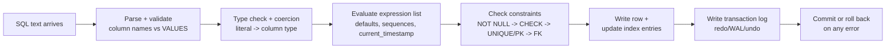
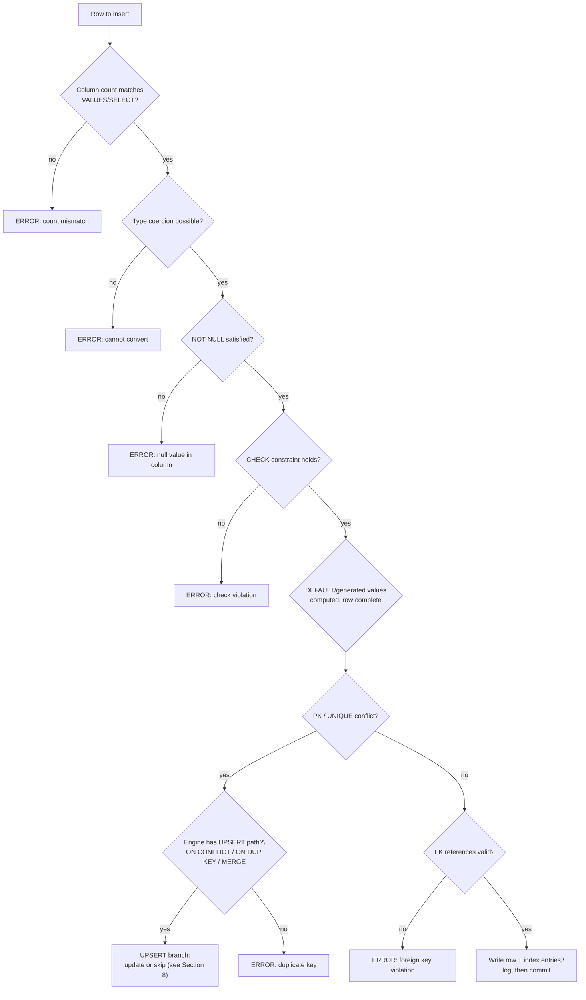

# 67. INSERT

> **See also:** [Section 3 — DDL / DML / DQL overview](#) (where `INSERT` sits in
> the SQL command families), [Section 4 — Constraints & Keys](#) (every
> constraint here is _enforced at INSERT time_), [Section 9 — NULL Deep Dive](#)
> and [Section 10 — Three-Valued Logic](#) (NULL rules that bite on INSERT),
> [Section 33 — CTEs](#) and [Section 34 — Recursive CTEs](#) (CTEs are a common
> input to `INSERT ... SELECT`), [Section 36 — GROUP BY](#) (feeding
> aggregated rows into a summary table), [Section 44 — Window Functions](#)
> (ranking results you may persist), [Section 65 — UNION/UNION ALL](#) and
> Wrote the complete section to `sql-handbook/8-DML-and-Sets/67-INSERT.md` (~1,790 lines), matching the handbook style.

**Covers:** fundamentals & column-list checklist (`INSERT` never returns a result set, never replaces), grain-checked sample tables (`customers`, `staging_customers`, `orders`, `order_items`, `archived_orders`, `users`, `audit_log`, `sales_summary`), ANSI syntax + a `VALUES` / `SELECT` / `DEFAULT VALUES` / `DEFAULT`-keyword map, internal working and constraint-check order (2 Mermaid diagrams), the omitted-vs-NULL-vs-DEFAULT rules table, deep `INSERT ... SELECT` (grain changes, dedup, `ORDER BY` misuse, locking caveats), BAD→BETTER row-by-row vs set-based load, `RETURNING`/`OUTPUT`/`RETURNING INTO`/`LAST_INSERT_ID` comparison, UPSERT across PostgreSQL `ON CONFLICT` / MySQL `ON DUPLICATE KEY` / `MERGE`, identity/sequence gaps with the burn-on-failure repro, Oracle `INSERT ALL`, empty-string-is-NULL (Oracle), 6 computed scenarios with expected output (gaps, dedup, archiving, timezone, window-function ranking), 12 edge cases, 12 mistakes, 8 labeled production pitfalls, performance with plan-verification emphasis (no absolute claims), 16 best practices, 4 consolidated comparison tables, and 45 unanswered interview questions across all 8 categories.

All example outputs are computed against the shared seed dataset; every dialect-specific behavior is flagged PostgreSQL/MySQL/SQL Server/Oracle.
�───────────┐ ┌────────┬──────────────┐
│ id │ name │ │ id │ name │
├────────┼──────────────┤ ├────────┼──────────────┤
│ 1 │ Ana │ INSERT │ 1 │ Ana │
│ 2 │ Chen │ ──────────────► │ 2 │ Chen │
└────────┴──────────────┘ │ 3 │ Otto │ ◄── new row
│ 4 │ Nina │ ◄── new row
└────────┴──────────────┘

````

Row count always increases. `INSERT` never updates existing rows — that is
`UPDATE`'s job — and never removes rows — that is `DELETE`/`TRUNCATE`'s job.
It also never returns a result set to you (a "query"); it only reports *how
many* rows were inserted (the wrap-up of `RETURNING`/`OUTPUT`/`INSERT
... SELECT` being ways to hand the server-generated values back).

### 1.2 Why it exists

`INSERT` is the *write* counterpart of `SELECT` in the DML trio:

| Statement | Direction | What it does to the table |
|---|---|---|
| `SELECT` | read | returns existing rows |
| `INSERT` | write | adds new rows |
| `UPDATE` | write | changes values in existing rows |
| `DELETE` | write | removes existing rows |

A database is useless if data can only be read. `INSERT` is the entry point
for practically every piece of user-generated data: signups, orders, events,
log lines, audit trails. It is also the load path for the output of other
queries: archiving, ETL, denormalized summaries, and table copies all run
through `INSERT ... SELECT`.

### 1.3 The mental model

> An `INSERT` is a **row-constructor for a table whose schema is already fixed.**
> The interesting part is not the mechanics of adding a row — it is everything
> the database has to *check* before the row is allowed to exist.

A usable mental checklist runs in this order:

1. **Do the column names exist?** (unknown column → error)
2. **Does the number of values match the number of columns?** (mismatch → error)
3. **Can each value be coerced to that column's type?** (no → error or silent coercion)
4. **Are all `NOT NULL` columns getting a non-NULL value?** (violation → error)
5. **Do all `CHECK`, `UNIQUE`, and foreign-key constraints still hold?** (violation → error)
6. **Are any generated values needed?** (defaults, sequences, generated columns)
7. **Did anything get inserted?** (the statement reports a row count)

Everything else — index maintenance, transaction log writes, undo records,
locks — is work you pay for automatically, whether you think about it or not.
Performance-conscious developers keep that hidden price tag in mind (see
[Section 15 — Performance](#15-performance-implications)).

### 1.4 What `INSERT` does NOT do

- It does not **create** the table. `CREATE TABLE` does that (see Section 3).
  The only exception is the *table-creating* idiom `SELECT ... INTO` in SQL
  Server and `CREATE TABLE AS` in PostgreSQL/MySQL/Oracle, which are
  `CREATE TABLE` + `INSERT` in one statement — and those are NOT part of
  `INSERT`'s own grammar.
- It does not **replace** rows. `INSERT` always *adds*. Replacing semantics
  come from `UPSERT`/`MERGE` (see [Section 8](#8-upsert-insert-or-update)) or
  from MySQL's `REPLACE` (delete + insert).
- It does not return the rows it wrote (no `SELECT`-like result set) — unless
  you use `RETURNING` / `OUTPUT`, which you should whenever you need the
  server-generated values back (see [Section 7](#7-returning-inserted-rows)).

---

## 2. The Sample Tables (grain check)

Always state the grain before inserting — it forces you to think about *what
one row means*, which is exactly what prevents accidental duplicate and
FK-abuse mistakes. All examples below reuse this dataset.

| Table | Grain (one row = ...) |
|---|---|
| `customers` | one registered customer |
| `staging_customers` | one raw row from a CRM CSV export |
| `orders` | one customer order |
| `order_items` | one product line *within* an order |
| `products` | one sellable product |
| `archived_orders` | one order that was archived |
| `users` | one application user |
| `audit_log` | one audited event |
| `sales_summary` | one (year, country) summary bucket |

**customers** — *one row per registered customer.*

```sql
CREATE TABLE customers (
    customer_id INT PRIMARY KEY,
    email       VARCHAR(100) NOT NULL UNIQUE,
    full_name   VARCHAR(80)  NOT NULL,
    country     VARCHAR(40),
    signup_date DATE,
    is_active   BOOLEAN NOT NULL DEFAULT TRUE
);

INSERT INTO customers (customer_id, email, full_name, country, signup_date) VALUES
(1, 'ana.silva@example.com',     'Ana Silva',     'Brazil',    DATE '2026-08-01'),
(2, 'chen.wei@example.com',      'Chen Wei',      'Singapore', DATE '2026-08-10'),
(3, 'maria.garcia@example.org',  'Maria Garcia',  'Mexico',    NULL);
````

**staging_customers** — _one row per raw row loaded from a CRM CSV export
(before any deduplication or cleanup)._

```sql
CREATE TABLE staging_customers (
    email     VARCHAR(100),
    full_name VARCHAR(80),
    country   VARCHAR(40)
);

INSERT INTO staging_customers (email, full_name, country) VALUES
('john.doe@example.com',      'John Doe',     'USA'),
('ana.silva@example.com',     'Ana Silva',    'Brazil'),   -- already in customers
('priya.sharma@example.com',  'Priya Sharma', 'India'),
('maria.garcia@example.org',  'Maria Garcia', 'Mexico');   -- already in customers
```

**orders** — _one row per customer order._

```sql
CREATE TABLE orders (
    order_id     INT PRIMARY KEY,
    customer_id  INT NOT NULL REFERENCES customers (customer_id),
    order_date   DATE NOT NULL,
    total_amount NUMERIC(10,2) NOT NULL,
    status       VARCHAR(20) NOT NULL DEFAULT 'PENDING'
);

INSERT INTO orders (order_id, customer_id, order_date, total_amount, status) VALUES
(1001, 1, DATE '2026-09-01', 250.00, 'PAID'),
(1002, 2, DATE '2026-09-02',  90.50, 'PAID'),
(1003, 3, DATE '2026-09-03', 310.75, 'PENDING');
```

**order_items** — _one row per product line within an order. An order can have
1, 0, or many items; the order's `total_amount` is not necessarily the sum of
its items._

```sql
CREATE TABLE order_items (
    order_item_id INT PRIMARY KEY,
    order_id      INT NOT NULL REFERENCES orders (order_id),
    product_code  VARCHAR(20) NOT NULL,
    quantity      INT NOT NULL,
    unit_price    NUMERIC(8,2) NOT NULL
);

INSERT INTO order_items (order_item_id, order_id, product_code, quantity, unit_price) VALUES
(5001, 1001, 'TECH-01', 2, 125.00),
(5002, 1002, 'BOOK-02', 1,  90.50),
(5003, 1003, 'DESK-01', 1, 310.75);
```

**products** — _one row per sellable product._

```sql
CREATE TABLE products (
    product_code VARCHAR(20) PRIMARY KEY,
    product_name VARCHAR(80) NOT NULL,
    category     VARCHAR(40) NOT NULL,
    list_price   NUMERIC(8,2) NOT NULL,
    discontinued BOOLEAN NOT NULL DEFAULT FALSE
);

INSERT INTO products (product_code, product_name, category, list_price) VALUES
('TECH-01', 'Noise-Cancelling Headphones', 'Electronics', 129.99),
('TECH-02', 'Mechanical Keyboard',         'Electronics',  89.99),
('BOOK-02', 'SQL Handbook (Print)',        'Books',        49.99),
('DESK-01', 'Standing Desk',               'Furniture',   399.00),
('DESK-02', 'Ergonomic Chair',             'Furniture',   289.00),
('MISC-99', 'Legacy Widget',               'Misc',          5.00);
```

**archived_orders** — _one row per archived order. Deliberately has NO foreign
key to `orders`: an archive is a snapshot, not a live link._

```sql
CREATE TABLE archived_orders (
    order_id     INT PRIMARY KEY,
    customer_id  INT,
    order_date   DATE,
    total_amount NUMERIC(10,2),
    status       VARCHAR(20)
);
```

**users** — _one row per application user. Identity column — the value is
generated by the database, not supplied by the application._

```sql
CREATE TABLE users (
    user_id    INT GENERATED ALWAYS AS IDENTITY PRIMARY KEY, -- PG/standard syntax
    email      VARCHAR(100) NOT NULL UNIQUE,
    created_at TIMESTAMP NOT NULL DEFAULT CURRENT_TIMESTAMP
);
```

**audit_log** — _one row per audited event._

```sql
CREATE TABLE audit_log (
    audit_id   BIGINT GENERATED ALWAYS AS IDENTITY PRIMARY KEY,
    table_name VARCHAR(40) NOT NULL,
    action     VARCHAR(10) NOT NULL,
    changed_at TIMESTAMP NOT NULL DEFAULT CURRENT_TIMESTAMP,
    detail     VARCHAR(200)
);
```

**sales_summary** — _one row per (year, country) bucket._

```sql
CREATE TABLE sales_summary (
    year       INT NOT NULL,
    country    VARCHAR(40) NOT NULL,
    paid_total NUMERIC(12,2) NOT NULL,
    PRIMARY KEY (year, country)
);
```

> **Assumption for all examples that follow:** every example starts from the
> _seed data_ above, unless the example explicitly adds rows first.

---

## 3. Syntax Reference

All of the variations below are ANSI/standard where noted; engine-specific
differences are flagged. The grammar in one line:

```
INSERT INTO <table> [(<column list>)]
VALUES (<row 1>) [, (<row 2>) ...]          -- or
SELECT <expression list>                    -- or
DEFAULT VALUES
```

### 3.1 Single-row `VALUES` insert

```sql
INSERT INTO customers (customer_id, email, full_name, country, signup_date)
VALUES (4, 'otto.hauser@example.com', 'Otto Hauser', 'Germany', DATE '2026-09-15');
```

```
-- PostgreSQL:
INSERT 0 1

-- MySQL:
Query OK, 1 row affected (0.01 sec)

-- SQL Server:
(1 row affected)

-- Oracle:
1 row created.
```

The inserted row (confirmed afterwards):

```sql
SELECT customer_id, email, full_name, country, signup_date, is_active
FROM customers WHERE customer_id = 4;
```

| customer_id | email                   | full_name   | country | signup_date | is_active |
| ----------- | ----------------------- | ----------- | ------- | ----------- | --------- |
| 4           | otto.hauser@example.com | Otto Hauser | Germany | 2026-09-15  | TRUE      |

Note that `is_active` is **not mentioned in the INSERT**, yet the row shows
`TRUE` — the column's `DEFAULT TRUE` filled it in. See
[Section 5](#5-null-and-default-behavior).

### 3.2 Column list vs no column list

```sql
-- WITH an explicit column list (recommended):
INSERT INTO customers (customer_id, email, full_name, country, signup_date)
VALUES (4, 'otto.hauser@example.com', 'Otto Hauser', 'Germany', '2026-09-15');

-- WITHOUT a column list (fragile):
INSERT INTO customers
VALUES (4, 'otto.hauser@example.com', 'Otto Hauser', 'Germany', '2026-09-15', TRUE);
```

The no-list form means: _"stick these values into the columns **in the order
the table was created**."_ It breaks as soon as someone adds a column,
reorders a column, changes a type, or adds a generated/identity column —
every hardcoded INSERT silently changes meaning or starts failing.

> **Best practice:** always write the explicit column list in anything that
> will live longer than an ad-hoc query. The only reasonable exception is a
> throwaway, in-progress seed statement you are deleting right after.

When the table has more columns than supplied values, the gap must be handled
by a **default** or **NULL** (see Section 5). When the table has _fewer_
columns, you get an error:

```sql
-- ERROR (PostgreSQL): "INSERT has more target columns than expressions"
-- MySQL:  "Column count doesn't match value count at row 1"
-- SQL Server / Oracle: similar mismatch errors
INSERT INTO customers
VALUES (7, 'nina@example.com', 'Nina Kraus', 'Austria', DATE '2026-09-15', TRUE, 'oops');
```

### 3.3 Multi-row `VALUES`

A single statement can carry several rows:

```sql
INSERT INTO customers (customer_id, email, full_name, country)
VALUES (5, 'nina.kraus@example.com',   'Nina Kraus',  'Austria'),
       (6, 'kenji.sato@example.com',   'Kenji Sato',  'Japan');
```

```
-- PostgreSQL: INSERT 0 2
```

Both rows are part of **one atomic statement** (see
[Section 4.5](#45-statement-level-atomicity)): if any row violates a
constraint, the whole statement fails and _no_ row is inserted.

```sql
-- FAILS as a whole: customer_id 5 collides with nothing, but customer_id 6
-- has a duplicate email? (no)... The classic atomicity demo is a PK/UNIQUE hit.
INSERT INTO customers (customer_id, email, full_name, country)
VALUES (7, 'otto.hauser@example.com', 'Otto Impostor', 'Germany'),  -- email taken
       (8, 'lina.meyer@example.com',  'Lina Meyer',    'Germany');
-- → ERROR: duplicate key value violates unique constraint "customers_email_key"
-- → Row 7 was NOT inserted. The statement as a whole is atomic.
```

Engine limits on how many `VALUES` rows one statement may carry:

- **SQL Server:** maximum **1000 rows** per `VALUES` clause.
- **MySQL:** limited by `max_allowed_packet`, not a row count.
- **PostgreSQL / Oracle:** see [Section 10](#10-dialect-specific-notes)
  (Oracle has no multi-row `VALUES` — use `INSERT ALL`).

### 3.4 `INSERT ... SELECT`

The `VALUES` rows do not have to be constants — the row source can be the
result of any `SELECT`:

```sql
INSERT INTO archived_orders (order_id, customer_id, order_date, total_amount, status)
SELECT order_id, customer_id, order_date, total_amount, status
FROM orders
WHERE status = 'PAID';
```

```
-- PostgreSQL: INSERT 0 2
```

Archived rows are orders 1001 and 1002 (the two `PAID` orders).
`INSERT ... SELECT` is the workhorse of copying, archiving, staging → final
loading, and building summaries. It gets its own deep dive in
[Section 6](#6-insert--select-deep-dive).

### 3.5 `INSERT ... DEFAULT VALUES`

Standard syntax for "insert one row where **every column** takes its default":

```sql
INSERT INTO audit_log (table_name, action) VALUES ('customers', 'INSERT');
-- or, to get a fully-defaulted row on a table whose columns all have defaults:
INSERT INTO users DEFAULT VALUES;   -- PostgreSQL / SQL Server syntax
```

MySQL's spelling of the same idea is `INSERT INTO users () VALUES ();`
(both `()` empty column list and `VALUES ()` are accepted by MySQL). This is
rare in production — it is mostly a test fixture convenience — but it
exercises the exact "default is not guaranteed" rules of
[Section 5](#5-null-and-default-behavior).

### 3.6 The `DEFAULT` keyword

ANSI lets you name the default _per column_ instead of omitting the column:

```sql
INSERT INTO customers (customer_id, email, full_name, country, signup_date, is_active)
VALUES (9, 'zoe.schmidt@example.com', 'Zoe Schmidt', 'Germany', DEFAULT, DEFAULT);
```

`DEFAULT` is supported in PostgreSQL, SQL Server, Oracle, and MySQL for this
position. It is the only way to say "default here" when you cannot omit the
column — which can only happen in the no-column-list form, which you should
not be using anyway.

### 3.7 Syntax by engine (quick map)

| Feature                       | PostgreSQL                                  | MySQL                        | SQL Server        | Oracle                           |
| ----------------------------- | ------------------------------------------- | ---------------------------- | ----------------- | -------------------------------- |
| Multi-row `VALUES`            | yes                                         | yes                          | yes (≤ 1000 rows) | no — use `INSERT ALL`            |
| `INSERT t SELECT ...`         | yes                                         | yes                          | yes               | yes                              |
| `SELECT ... INTO newtbl`      | no (`CREATE TABLE AS`)                      | no (`CREATE TABLE AS`)       | yes               | no (`CREATE TABLE AS`)           |
| `INSERT ... DEFAULT VALUES`   | yes                                         | `INSERT INTO t () VALUES ()` | yes               | no\*                             |
| `DEFAULT` keyword in `VALUES` | yes                                         | yes                          | yes               | yes                              |
| `RETURNING`                   | yes                                         | no (MariaDB: yes)            | `OUTPUT` clause   | `RETURNING INTO` (PL/SQL)        |
| UPSERT keyword                | `ON CONFLICT`                               | `ON DUPLICATE KEY UPDATE`    | `MERGE`           | `MERGE`                          |
| Identity column               | `GENERATED ... AS IDENTITY` (also `SERIAL`) | `AUTO_INCREMENT`             | `IDENTITY`        | 12c+ `GENERATED ... AS IDENTITY` |

\* Oracle accepts `INSERT INTO t (a, b) VALUES (DEFAULT, DEFAULT)`, but has no
whole-statement `DEFAULT VALUES` clause.

---

## 4. Internal Working

You do not need to know the storage engine's every detail, but a _mental
model_ of the write path explains almost every insert behavior you will meet
— constraint errors, sequence gaps, lock timeouts, silent truncation, and
why bulk loads are slow.

### 4.1 Statement lifecycle



The order in the diagram is logical and _approximate_ — engines do not all
check in that exact sequence, and the optimizer decides on physical details —
but every step happens, in some order, for every insert. The steps you pay
for without asking are **F** (index maintenance) and **G** (logging). Those
two dominate insert cost on most real systems.

### 4.2 Constraint checking order



> **Note:** check _order_ is illustrative. For example, MySQL may surface a
> `CHECK` error before a `NULL` error or vice versa depending on the engine
> and storage layout. Never write code that depends on _which_ error fires
> first — only that _some_ error fires.

### 4.3 Index maintenance

Every secondary index must be updated when a row is inserted. In a B-tree
index, inserting a key means traversing the tree to the correct leaf and
inserting the key-value entry; if the leaf is full, the node **splits**,
which can cascade upward. Consequences for the INSERT author:

- Inserting into a table with 1 clustered PK + 4 secondary indexes touches 5
  index structures, not 1. This is real, avoidable it costs CPU and I/O per
  row.
- Random (scattered) key values — e.g., UUID primary keys inserted in random
  order — cause leaf splits and page splits more often than monotonically
  increasing keys, historically slower for many workloads. This is _not_ an
  absolute rule; measure it.
- Index maintenance is a _per-row_ cost even when nothing else is: an
  `INSERT ... SELECT` that copies a million rows pays a million index inserts.

### 4.4 Logging and undo

The database must be able to commit or roll back your insert, and must not
lose your insert if the server crashes mid-commit. That requires two pieces
of bookkeeping:

- **Transaction/redo log** (PostgreSQL WAL, MySQL redo log, SQL Server log,
  Oracle redo): an append-only record of the change. This is often the real
  bottleneck for high-volume inserts, and it is why so-called "minimal
  logging" (SQL Server bulk-logged inserts, unlogged tables, MySQL `INSERT
... low priority`? no — innoDB buffered changes) has to be treated as a
  durability trade-off, not a free lunch.
- **Undo/rollback info** (MySQL undo log, SQL Server version store, Oracle
  undo, PostgreSQL MVCC tuples): so the old state can be restored on
  rollback or isolation-level reads.

Large inserts therefore generate large log/undo volume. One giant
transaction also delays visibility of its rows and can grow lock/undo
footprints. Batching is a balancing act — see
[Section 15](#15-performance-implications).

### 4.5 Statement-level atomicity

A single `INSERT` statement (even with 10,000 `VALUES` rows, or a million-row
`INSERT ... SELECT`) is **all-or-nothing by itself**:

- If any row fails a constraint, **no row is inserted** (for transactional
  tables).
- There is no partial "half the rows got in" state for one statement.

```sql
-- This inserts NOTHING (all-or-nothing), even though rows 10..14 are fine:
INSERT INTO customers (customer_id, email, full_name, country)
VALUES (10, 'a@example.com', 'A', 'US'),
       (10, 'b@example.com', 'B', 'US');   -- PK collision with the first row
-- ERROR: duplicate key. customers still has rows 1..4 only.
```

> **Production pitfall:** MySQL's _non-transactional_ storage engines
> (MyISAM, MEMORY) do **not** guarantee statement atomicity — a statement can
> stop partway and leave earlier rows inserted. On InnoDB (default) the
> guarantee holds. If you rely on all-or-nothing, ensure transactional
> storage and verify.

Intra-_statement_ atomicity is distinct from intra-_transaction_ atomicity:
you can still `BEGIN; INSERT ...; INSERT ...; ROLLBACK;` and the whole
transaction disappears even if each statement alone succeeded. If you insert
a parent row and its children in two statements, wrap them in one transaction
or the child insert can become an orphan. See the future Transactions
section.

### 4.6 Triggers and generated columns

Two things silently widen the real scope of an insert:

- **Triggers** (e.g., `BEFORE INSERT` / `AFTER INSERT` in MySQL,
  `INSTEAD OF` in SQL Server, `BEFORE`/`AFTER` row triggers in Oracle and
  PostgreSQL) run as part of the statement. A trigger can modify the values
  being inserted, inject additional rows, or write audit rows — and can fail
  the statement. Cost is per-row when row-level, and multiplying with the
  indexed writes already discussed.
- **Generated columns** (computed columns in SQL Server, generated columns in
  MySQL, generated columns in PostgreSQL, virtual columns in Oracle) are
  recomputed on insert. You cannot supply a value for a
  `GENERATED ALWAYS` column; trying to insert into one is an error in every
  engine above.

```sql
-- PostgreSQL: inserting into the generated column errors
CREATE TABLE orders_v2 (
    order_id    INT PRIMARY KEY,
    quantity    INT NOT NULL,
    unit_price  NUMERIC(8,2) NOT NULL,
    line_total  NUMERIC(12,2) GENERATED ALWAYS AS (quantity * unit_price) STORED
);
INSERT INTO orders_v2 (order_id, quantity, unit_price, line_total)
VALUES (1, 2, 125.00, 250.00);
-- ERROR: cannot insert a non-DEFAULT value into column "line_total"
-- Correct: omit line_total, PostgreSQL computes it.
```

---

## 5. NULL and Default Behavior

### 5.1 Omitted column vs explicit NULL vs DEFAULT

These three "ways to not give a value" are **not** interchangeable:

| Situation                                      | What is stored                | Example                               |
| ---------------------------------------------- | ----------------------------- | ------------------------------------- |
| Column omitted from column list, has a default | the **default**               | `is_active` → `TRUE`                  |
| Column omitted, no default, nullable           | **NULL**                      | `signup_date` (when omitted) → `NULL` |
| Column omitted, no default, `NOT NULL`         | **ERROR**                     | `email` omitted → error               |
| Explicit `NULL` supplied, nullable             | **NULL** (default is ignored) | `country = NULL`                      |
| Explicit `NULL` supplied, `NOT NULL`           | **ERROR**                     | `email = NULL` → error                |
| Explicit `DEFAULT` supplied                    | the **default**               | `is_active = DEFAULT` → `TRUE`        |

```sql
-- is_active: default TRUE. signup_date: we omit it → NULL (no default).
INSERT INTO customers (customer_id, email, full_name, country)
VALUES (7, 'nina.kraus@example.com', 'Nina Kraus', 'Austria');
```

| customer_id | email                  | full_name  | country | signup_date | is_active |
| ----------- | ---------------------- | ---------- | ------- | ----------- | --------- |
| 7           | nina.kraus@example.com | Nina Kraus | Austria | NULL        | TRUE      |

```sql
-- Explicit NULL into a NOT NULL column → hard error:
INSERT INTO customers (customer_id, email, full_name, country)
VALUES (8, NULL, 'No Email', 'US');
-- ERROR: null value in column "email" violates not-null constraint
```

> **Common misconception:** "If I put `NULL` in, the database uses the
> column's default instead." **No.** A default is applied only when the
> column is _omitted_ or given the `DEFAULT` keyword. `NULL` is a real value
> and is stored as-is. This is one of the most common PL/SQL and ORM bugs.

> **Interview trap:** a column defined as `DATE` with **no** `NOT NULL` and
> **no** default silently stores `NULL` when omitted. Beginners assume every
> "I didn't mention it" column ends up `NULL`; in fact a column _with_ a
> default ends up with its default. The two situations are different.

### 5.2 NULL in unique constraints

Most engines allow **multiple NULLs** in a column with a `UNIQUE` constraint
— `NULL <> NULL` is "unknown", so no two NULLs are ever "equal" for the
purpose of uniqueness:

```sql
INSERT INTO customers (customer_id, email, full_name, country) VALUES
(10, 'u1@example.com', 'Uno', NULL),
(11, 'u2@example.com', 'Dos', NULL);
-- Succeeds on every mainstream engine even though country is UNIQUE? country
-- is not UNIQUE here — but the point generalizes: for UNIQUE country, two
-- NULLs still both insert fine.
```

Exception: **PostgreSQL 15+** with `UNIQUE NULLS NOT DISTINCT` treats NULLs as
equal, and **Oracle** historically treats NULLs in a UNIQUE column as
distinct too (multiple NULLs allowed). The generalization stands: equality
with NULL is not TRUE, so uniqueness does not constrain NULL.

### 5.3 Defaults are not magic — they are expressions

The `DEFAULT` can be a constant or a function evaluated at insert time:

```
CURRENT_DATE / CURRENT_TIMESTAMP   -- evaluated per statement (not per row)
```

```sql
INSERT INTO users (email) VALUES ('first@example.com'), ('second@example.com');
SELECT email, created_at FROM users;
-- created_at is the SAME timestamp for both rows on most engines, because
-- DEFAULT CURRENT_TIMESTAMP is evaluated once per statement.
```

(This becomes a real-world bug when you _expect_ each row to get a slightly
different timestamp. PostgreSQL's `now()` is the transaction-start time;
`clock_timestamp()` is the real wall-clock time and differs per call.)

### 5.4 VARCHAR truncation and the empty string

- **PostgreSQL:** truncating a value that does not fit a `VARCHAR(n)` is an
  **error** (unless you explicitly cast with `::varchar(n)`).
- **MySQL:** in strict SQL mode (default since 5.7) it is an **error**; in
  non-strict mode it is a **warning + silent truncation**. The distinction
  matters enormously on inherited systems.
- **SQL Server:** "String or binary data would be truncated" **error**.
- **Oracle:** **silently truncates** inserted VARCHAR2 values.

```sql
-- PostgreSQL:
INSERT INTO products (product_code, product_name, category, list_price)
VALUES ('X', 'This product name is far too long for a column of VARCHAR(80) that is only eighty characters wide, truly', 'Books', 1.00);
-- ERROR: value too long for type character varying(80)
```

> **Production pitfall:** a truncation-in-warning mode (MySQL non-strict,
> Oracle) can silently lose data — e.g., a city name cut to 19 characters in
> a legal address — with no error signalled. Verify the mode/behavior on your
> target engine before relying on validation.

Also relevant: Oracle treats the **empty string `''` as NULL**. `INSERT INTO
t (name) VALUES ('')` stores NULL in Oracle, but an actual empty string in
PostgreSQL/MySQL/SQL Server. This difference silently changes `WHERE name =
''` and `IS NULL` logic (see Sections 9–11 on NULL).

---

## 6. INSERT ... SELECT Deep Dive

`INSERT ... SELECT` is the copy/transform/load statement. Everything in a
`SELECT` is fair game: joins, `GROUP BY`, window functions, `DISTINCT`, CTEs,
`EXCEPT`/`UNION`, scalar subqueries — it runs as a normal `SELECT`, and its
result rows become the inserted rows.

### 6.1 Basic copy (full and partial)

```sql
-- Copy every column of every PAID order:
INSERT INTO archived_orders (order_id, customer_id, order_date, total_amount, status)
SELECT order_id, customer_id, order_date, total_amount, status
FROM orders
WHERE status = 'PAID';
-- → 2 rows inserted (orders 1001, 1002), leaving the PENDING order alone.

-- Copy a column subset and add an expression:
INSERT INTO archived_orders (customer_id, total_amount)
SELECT customer_id, total_amount * 2.0
FROM orders
WHERE status = 'PAID';
-- → 2 rows; columns not listed get NULL / defaults.
```

### 6.2 Transform while inserting

You can clean, join, group, and rank in the same statement:

```sql
INSERT INTO sales_summary (year, country, paid_total)
SELECT EXTRACT(YEAR FROM o.order_date), c.country, SUM(o.total_amount)
FROM orders o
JOIN customers c ON c.customer_id = o.customer_id
WHERE o.status = 'PAID'
GROUP BY EXTRACT(YEAR FROM o.order_date), c.country;
```

Expected `sales_summary`:

| year | country   | paid_total |
| ---- | --------- | ---------- |
| 2026 | Brazil    | 250.00     |
| 2026 | Singapore | 90.50      |

Notice the **grain change**: source (one row per order) → target (one row per
year+country bucket). This is exactly what `GROUP BY` inside `INSERT ...
SELECT` is for; see Section 36.

### 6.3 Deduplicating a load

The `staging_customers` table has two emails already present in `customers`
(`ana.silva@example.com`, `maria.garcia@example.org`). A blind insert fails
on the `UNIQUE(email)` constraint — and crucially, fails _atomically_:

```sql
-- BAD APPROACH — realistic, but it inserts NOTHING because of 2 dupes:
INSERT INTO customers (email, full_name, country)
SELECT email, full_name, country FROM staging_customers;
-- ERROR: duplicate key value violates unique constraint "customers_email_key"
```

BETTER APPROACH — skip rows that already exist (anti-join, see Section 23):

```sql
INSERT INTO customers (email, full_name, country)
SELECT s.email, s.full_name, s.country
FROM staging_customers s
WHERE NOT EXISTS (
    SELECT 1 FROM customers c WHERE c.email = s.email
);
-- → INSERT 0 2   (John Doe, Priya Sharma — the two new emails)
```

This still fails if `staging_customers` itself contains duplicate emails. If
that can happen, dedupe the _source_ too (e.g., `SELECT DISTINCT ON (email)
...` in PostgreSQL or `ROW_NUMBER()` partitioning by email — Section 46/54).
For a load that must be **idempotent** (safe to re-run), see the UPSERT
section below.

### 6.4 `ORDER BY` and `LIMIT` inside `INSERT ... SELECT`

```sql
-- SQL Server: insert the top 5 newest customers
INSERT INTO archived_customers (customer_id, email)
SELECT TOP (5) customer_id, email
FROM customers
ORDER BY signup_date DESC;

-- PostgreSQL / MySQL: the same idea with LIMIT
INSERT INTO archived_customers (customer_id, email)
SELECT customer_id, email
FROM customers
ORDER BY signup_date DESC
LIMIT 5;
```

Two facts to keep straight:

- `ORDER BY` **does not control the physical order of rows in the table**
  (tables are unordered sets). It only decides _which_ rows `TOP`/`LIMIT`
  picks (the "top 5 newest").
- Without `TOP`/`LIMIT`, `ORDER BY` in an `INSERT ... SELECT` buys you
  nothing except extra sort work. Leaving it in is harmless but wasted — and
  it never guarantees that reading the table back gives you that order (use
  `ORDER BY` on the _read_ instead).

### 6.5 Locking and concurrency

`INSERT ... SELECT` runs the `SELECT` under a snapshot and then inserts
rows. Locking behavior is engine-specific and evolving:

- **PostgreSQL:** the insert of a row only conflicts with other inserts
  targeting the _same key_ (unique index). Plain inserts do not block each
  other across unrelated keys. A long `INSERT ... SELECT` holds a
  `RowExclusiveLock` on the source table briefly and its own transaction
  snapshot for the whole run.
- **MySQL/InnoDB:** an `INSERT ... SELECT` can put shared/next-key locks on
  the source rows (behavior tunable; historically `innodb_locks_unsafe_for_binlog`
  influenced it). Concurrent writes to the same _source_ rows can block while
  a big load runs. Batch the load, or check your version's locking mode.
- **SQL Server / Oracle:** similar considerations; long selects holding read
  locks (Oracle) or SERIALIZABLE-range reads (SQL Server) can block writers.

The rejuvenating phrase: **verify with the plan and a real concurrency test**
— "INSERT...SELECT blocks writers" is not true in every engine, version, and
isolation level.

### 6.6 BAD approach vs BETTER approach (row-by-row loop)

A classic anti-pattern is inserting one row at a time in application code:

```
BAD APPROACH (pseudo-code, enormous latency):
for each row in the source:
    INSERT INTO orders (...) VALUES (...);   -- 1 round trip per row

BETTER APPROACH (set-based):
INSERT INTO orders (...)
SELECT ...
FROM ...;                                     -- 1 round trip for all rows
```

Why the set-based version wins here:

1. It replaces N network round-trips with one.
2. The optimizer can choose a join/hash plan for the whole job instead of
   repeating N single-row lookups.
3. It is atomic: a failure rolls back the whole load instead of leaving a
   half-loaded table.
4. Logging/undo overhead is amortized (still proportional to rows — see
   Section 15).

That does **not** make "set-based is always faster" a law: if you only ever
insert 3 rows from user input, three single-row statements in one transaction
are perfectly fine. The benefit scales with volume. Measure, don't guess.

---

## 7. Returning Inserted Rows

After an insert, the application often needs values it did not supply — the
generated id, the default timestamp, a computed column, or the entire row.
There are three families of solutions.

### 7.1 `RETURNING` — PostgreSQL

```sql
INSERT INTO customers (email, full_name, country)
VALUES ('kenji@example.com', 'Kenji Sato', 'Japan')
RETURNING customer_id, email, signup_date, is_active;
```

| customer_id | email             | signup_date | is_active |
| ----------- | ----------------- | ----------- | --------- |
| 12          | kenji@example.com | NULL        | TRUE      |

`RETURNING` works for `INSERT`, `UPDATE`, and `DELETE`, returns **all**
inserted rows (multi-row values, or `INSERT ... SELECT`), and is the idiomatic
PostgreSQL answer to "what id did I just get?".

### 7.2 `OUTPUT` — SQL Server

```sql
INSERT INTO customers (email, full_name, country)
OUTPUT INSERTED.customer_id, INSERTED.email
VALUES ('kenji@example.com', 'Kenji Sato', 'Japan');
```

`INSERTED` is the virtual table of the _new_ rows (a NulL-filled `DELETED`
exists for updates). `OUTPUT` can also write into a table variable:

```sql
DECLARE @ins TABLE (id INT, email VARCHAR(100));
INSERT INTO customers (email, full_name, country)
OUTPUT INSERTED.customer_id, INSERTED.email INTO @ins
VALUES ('kenji@example.com', 'Kenji Sato', 'Japan');
```

### 7.3 `RETURNING INTO` — Oracle

Oracle requires bind variables and is usually written in PL/SQL:

```sql
DECLARE
    v_id  customers.customer_id%TYPE;
BEGIN
    INSERT INTO customers (email, full_name, country)
    VALUES ('kenji@example.com', 'Kenji Sato', 'Japan')
    RETURNING customer_id INTO v_id;
END;
-- (RETURNING INTO is PL/SQL; a plain SQL client cannot use it directly.)
```

### 7.4 Session functions — MySQL

MySQL has no `RETURNING`. The generated value is fetched with a session-scoped
function immediately after the insert:

```sql
INSERT INTO customers (customer_id, email, full_name, country)
VALUES (15, 'kenji@example.com', 'Kenji Sato', 'Japan');
SELECT LAST_INSERT_ID();   -- for AUTO_INCREMENT columns only
```

Note `LAST_INSERT_ID()` (MySQL) is your own _connection's_ last auto value,
which makes it concurrency-safe for the current session, unlike
`@@identity` (SQL Server) which leaks values from triggers — SQL Server
provides the safer `SCOPE_IDENTITY()` for exactly that reason.

| Need                     | PostgreSQL     | MySQL              | SQL Server          | Oracle                                     |
| ------------------------ | -------------- | ------------------ | ------------------- | ------------------------------------------ |
| Return the inserted row  | `RETURNING *`  | not available      | `OUTPUT INSERTED.*` | `RETURNING ... INTO` (PL/SQL)              |
| Generated id, single row | `RETURNING id` | `LAST_INSERT_ID()` | `SCOPE_IDENTITY()`  | bid variable + returning, or `SEQ.CURRVAL` |
| Affected row count       | statement tag  | "rows affected"    | `@@ROWCOUNT`        | `SQL%ROWCOUNT`                             |

---

## 8. UPSERT: Insert or Update

### 8.1 Why UPSERT exists

Real loads are **often re-runs** — daily feeds, retried API calls, `ALTER
     TABLE`-adjacent migrations. A naive load either errors on the second run
(duplicate key) or you are forced to `DELETE` first, which loses
user-updated columns. UPSERT resolves the dilemma: **if the row exists,
update the interesting columns; if not, insert.** Different engines expose
the same idea under different spellings.

### 8.2 PostgreSQL — `INSERT ... ON CONFLICT`

```sql
INSERT INTO customers (email, full_name, country)
SELECT email, full_name, country FROM staging_customers
ON CONFLICT (email) DO UPDATE SET
    full_name = EXCLUDED.full_name,          -- EXCLUDED = the row that was proposed
    country   = COALESCE(customers.country, EXCLUDED.country);
```

- `ON CONFLICT (email)` names the unique constraint target; `ON CONFLICT ON
CONSTRAINT name` does the same by name.
- `DO NOTHING` skips conflicting rows without erroring — the cheap
  "insert unless it exists" idiom.
- `EXCLUDED` refers to the row you tried to insert (the would-be values).
- On a **conflict on more than one constraint**, you must be specific
  (PostgreSQL errors if the conflict is ambiguous — e.g., both a `UNIQUE` on
  email and a different `UNIQUE` are violated by the same row).

### 8.3 MySQL — `ON DUPLICATE KEY UPDATE` and `INSERT IGNORE`

```sql
INSERT INTO customers (email, full_name, country)
VALUES ('ana.silva@example.com', 'Ana Silva', 'Brazil')
ON DUPLICATE KEY UPDATE
    full_name = VALUES(full_name);        -- older syntax (< 8.0.20)
```

MySQL fires this on any **duplicate key** (PK _or_ any UNIQUE), not just a
named one — a wider net than PostgreSQL's `ON CONFLICT (col)`. In MySQL 8.0.20+
the `VALUES(col)` function is deprecated in favor of row aliases:

```sql
INSERT INTO customers (email, full_name, country)
VALUES ('ana.silva@example.com', 'Ana Silva', 'Brazil') AS new
ON DUPLICATE KEY UPDATE full_name = new.full_name;
```

`INSERT IGNORE` is the MySQL spelling of "DO NOTHING": conflict rows are
silently skipped (it is also a classic source of _lost_ warnings — it can turn
other errors, e.g. truncation, into warnings too). MySQL also has `REPLACE`,
which is **DELETE + INSERT**: it changes the row id, fires delete and insert
triggers, and fails on FKs pointing at the deleted row. Prefer
`ON DUPLICATE KEY UPDATE` over `REPLACE` unless delete-and-reinsert semantics
are truly what you want.

### 8.4 Standard-form `MERGE` — Oracle and SQL Server

`MERGE` is standard SQL; Oracle and SQL Server both support it and both are
notoriously easy to misuse. Minimal shape:

```sql
MERGE INTO customers tgt
USING staging_customers src
   ON (tgt.email = src.email)
WHEN MATCHED THEN UPDATE SET
     tgt.full_name = src.full_name
WHEN NOT MATCHED THEN INSERT (email, full_name, country)
     VALUES (src.email, src.full_name, src.country);
```

The notorious mistakes: a `USING` source with **duplicate keys** (each source
row fires the MATCHED branch against the same target row, and Oracle aborts
with "ORA-30926: unable to get a stable set of rows"), and writing
`WHEN MATCHED THEN UPDATE` rows that are _identical_ (`NULL = NULL` is UNKNOWN
in the `WHEN` subclause comparisons — target NULLs never match guards that
compare `IS NULL` correctly). See Section 10 for per-engine caveats.

### 8.5 UPSERT comparison

| Aspect                             | PostgreSQL                                 | MySQL                                       | SQL Server                                        | Oracle                       |
| ---------------------------------- | ------------------------------------------ | ------------------------------------------- | ------------------------------------------------- | ---------------------------- |
| Keyword                            | `ON CONFLICT ... DO UPDATE / DO NOTHING`   | `ON DUPLICATE KEY UPDATE` / `INSERT IGNORE` | `MERGE`                                           | `MERGE`                      |
| Trigger source                     | named constraint / any conflict            | **any** unique or PK conflict               | any ON match                                      | any ON match                 |
| "Insert if not exists"             | `DO NOTHING`                               | `INSERT IGNORE`                             | `MERGE` WHEN NOT MATCHED                          | `MERGE` WHEN NOT MATCHED     |
| Return affected rows               | `RETURNING`                                | `ROW_COUNT()` (1 = insert, 2 = update...)   | `OUTPUT`                                          | DML ROWCOUNT                 |
| Readability of intent              | high                                       | medium                                      | medium                                            | medium                       |
| Risk of accidental delete/reinsert | none                                       | **`REPLACE`** (delete+insert)               | low                                               | low                          |
| Duplicate source pitfalls          | unique-target conflict must be unambiguous | duplicate _key_ semantics                   | duplicate source rows → first-match only / errors | ORA-30926 on unstable source |

---

## 9. Identity, Sequences, and Auto-Increment

### 9.1 How it fits INSERT

When an identity/auto-increment column is not supplied, the engine calls its
underlying **sequence counter** for each row and assigns the next value.

- **PostgreSQL:** `SERIAL` (sequence-backed integer) or `GENERATED ALWAYS AS
IDENTITY` (standard, tracks actual usage, blocks explicit inserts unless
  you ask).
- **MySQL:** `AUTO_INCREMENT` — the counter is stored with the table, not in
  a separate sequence.
- **SQL Server:** `IDENTITY(seed, increment)`.
- **Oracle:** 12c+ `GENERATED ... AS IDENTITY` (itself sequence-backed).

### 9.2 Gaps are normal and expected

Sequence counters are **not transactional**. They must never "roll back,"
because two transactions could take numbers 7 and 8, then the 7-transaction
rolls back — and nothing re-uses 7, or uniqueness breaks. Consequences:

- A failed INSERT (duplicate key, constraint violation) still **consumes**
  sequence numbers.
- Gaps are a feature, not a bug. Adding `ON CONFLICT DO NOTHING` skips rows;
  the same numbers are burned.
- MySQL's `innodb_autoinc_lock_mode` (default `2` since 8.0, "interleaved")
  guarantees uniqueness but not gapless-ness or even monotonicity per
  statement boundary under concurrency.

```sql
-- PostgreSQL:
INSERT INTO users (email) VALUES ('a@example.com');   -- uses 1
INSERT INTO users (email) VALUES ('b@example.com');   -- uses 2
INSERT INTO users (email) VALUES ('a@example.com');   -- DUPLICATE! burns 3, error
INSERT INTO users (email) VALUES ('c@example.com');   -- uses 4

SELECT email FROM users;
-- ids are 1, 2, 4 — id 3 is gone forever.
```

### 9.3 Inserting explicit values into identity columns

Sometimes you must: re-seeding, migrating, restoring. Explicit rules per
engine:

- **PostgreSQL `GENERATED ALWAYS`:** you _cannot_ insert a value; use
  `OVERRIDING SYSTEM VALUE`:
  ```sql
  INSERT INTO users (user_id, email)
  OVERRIDING SYSTEM VALUE
  VALUES (100, 'restored@example.com');
  ```
  (`GENERATED BY DEFAULT` lets you supply values freely.)
- **SQL Server:** `SET IDENTITY_INSERT users ON;` before the insert; `OFF`
  afterwards.
- **MySQL:** you may supply an explicit `AUTO_INCREMENT` value directly
  (it just bumps the counter if larger).
- **Oracle 12c+:** by default an explicit value into `GENERATED ALWAYS` fails;
  use `DEFAULT ON NULL` in the column definition to allow it.

> **Production pitfall:** after a data migration that hard-codes identity
> values, the next natural insert can collide with a value you just used —
> be sure the counter is positioned past the max restored value
> (`setval()`, `IDENTITY_INSERT` + reseed, setting the table's counter, or
> adjusting the sequence).

### 9.4 Getting the generated value back

- PostgreSQL: `RETURNING user_id` (see Section 7).
- SQL Server: `SCOPE_IDENTITY()` — safer than `@@IDENTITY` (which can return
  a value produced inside a trigger).
- MySQL: `LAST_INSERT_ID()` on the same session.
- Oracle: `RETURNING user_id INTO v` (PL/SQL).

The word of caution: `LAST_INSERT_ID()` / `@@IDENTITY` are **connection
scoped** — another connection inserting in between does not affect _your_
session value. Treat them as session-local, not global.

---

## 10. Dialect-Specific Notes

### 10.1 Oracle — `INSERT ALL`

Oracle has no multi-row `VALUES`. The canonical multi-row idiom is
`INSERT ALL ... SELECT ... FROM DUAL`:

```sql
INSERT ALL
    INTO customers (customer_id, email, full_name, country) VALUES (70, 'a@x.com', 'A', 'US')
    INTO customers (customer_id, email, full_name, country) VALUES (71, 'b@x.com', 'B', 'US')
SELECT * FROM DUAL;
-- Oracle: 2 rows created.
```

`INSERT ALL` also supports _conditional multi-table_ fan-out — the same
`SELECT` result inserted into several tables:

```sql
INSERT ALL
    WHEN amount > 1000 THEN INTO big_orders (order_id, total) VALUES (order_id, total)
    WHEN amount <= 1000 THEN INTO small_orders (order_id, total) VALUES (order_id, total)
    ELSE INTO other_orders (order_id, total) VALUES (order_id, total)
SELECT ... FROM ...;
```

Watch the documented limits/behaviors on your Oracle version for `INSERT ALL`
(restrictions exist on materialized merge and may change by release). For
bulk application inserts, the _fastest_ path is typically array binding in
the client driver, not giant SQL text.

### 10.2 MySQL — packet limits and the `INSERT ... SET` extension

- Multi-row `VALUES` is bounded by `max_allowed_packet` — a single enormous
  statement can be rejected. If it is too big, chunk it.
- MySQL's `INSERT INTO t SET col = val, ...` extension is convenient but not
  portable; several tools mis-order multi-table joins. Prefer standard syntax
  for anything shared.
- MySQL's non-strict mode + `INSERT IGNORE` silently degrade errors into
  warnings — audit your `sql_mode`.
- `INSERT DELAYED` was removed in MySQL 8.0 (it was made for MyISAM);
  `LOW_PRIORITY`/`HIGH_PRIORITY` and `DELAYED` survive only in legacy corners.

### 10.3 SQL Server — `SELECT ... INTO` and `OUTPUT`

- `SELECT ... INTO new_table FROM ...` in SQL Server is a **table-creating
  insert** (equivalent to `CREATE TABLE` + `INSERT`). It is not the
  `INSERT INTO ... SELECT` form and cannot insert into an existing table,
  and it runs with **minimal logging** in some cases (tempdb, bulk-logged).
  PostgreSQL/MySQL/Oracle use `CREATE TABLE new AS SELECT` instead.
- The `OUTPUT` clause can consume into a temporary table for audit-style
  downstream work.

### 10.4 Oracle — empty string is NULL

Already flagged in Section 5.4. `''` → NULL on Oracle. This changes what your
`INSERT ... SELECT` actually stores when it concatenates or cleans strings.

### 10.5 Unicode literal prefixes

- SQL Server interprets a plain `'...'` literal using the database code page;
  Unicode data should use the `N'...'` prefix (or delete the mojibake).
- PostgreSQL/MySQL/Oracle default to the connection/DB character set; use the
  `U&'...'` escape form (PostgreSQL), `_utf8mb4'...'`/hex literals (MySQL) if
  you need certainty.

---

## 11. Scenario-Based Examples

Every scenario starts from the seed data in Section 2.

### S1 — Scenario: onboarding a customer (single insert)

`customer_id` is hand-assigned in this fictional legacy table (badly, but
realistic). Grab the next id, then insert cleanly and explicitly:

```sql
INSERT INTO customers (customer_id, email, full_name, country, signup_date)
VALUES (20, 'lina.meyer@example.com', 'Lina Meyer', 'Germany', DATE '2026-09-15');
```

| customer_id | email                  | full_name  | country | signup_date | is_active |
| ----------- | ---------------------- | ---------- | ------- | ----------- | --------- |
| 20          | lina.meyer@example.com | Lina Meyer | Germany | 2026-09-15  | TRUE      |

Notice `is_active` was not supplied; the default `TRUE` applied. Don't
require a `signup_date` from the caller — let `DEFAULT CURRENT_DATE` do it.

### S2 — Scenario: batch archive of paid orders

Copy all `PAID` orders into `archived_orders`:

```sql
INSERT INTO archived_orders (order_id, customer_id, order_date, total_amount, status)
SELECT order_id, customer_id, order_date, total_amount, status
FROM orders
WHERE status = 'PAID';
```

Result: `archived_orders` now contains orders 1001 and 1002. Do it inside a
transaction, or first `SELECT COUNT(*)` to sanity-check the batch size, then
commit — that is how you keep a monthly archive job safe to re-run (see
Section 8 for making it actually idempotent).

### S3 — Scenario: staging → customers, dedup + upsert

Load `staging_customers`, updating country when we keep the older school of
"prefer existing values" (COALESCE) — this is the daily-feed pattern:

```sql
INSERT INTO customers (email, full_name, country)
SELECT email, full_name, country
FROM staging_customers
ON CONFLICT (email) DO UPDATE SET
    full_name = EXCLUDED.full_name,
    country   = COALESCE(customers.country, EXCLUDED.country);
-- ☝ PostgreSQL spelling. See Section 8 for MySQL / MERGE versions.
```

Outcome against seed data: rows for `john.doe@...` and `priya.sharma@...`
are **inserted**; rows for `ana.silva@...` and `maria.garcia@...` are
**updated** (full_name same, country stays Brazil/Mexico because those are
non-NULL). A subsequent re-run of the same statement inserts nothing and the
two updates are harmless — the load is idempotent.

> **Interview trap:** a re-run updates every matching row even when nothing
> changed. That is a real, observable side effect (dirty rows, updated
> timestamps, extra redo). There is no free "update only if different"
> branch in most UPSERTs — you must code `WHERE customers.full_name =
EXCLUDED.full_name`-style guards yourself if you want write-suppression.

### S4 — Scenario: refresh a denormalized summary

```sql
-- Assuming sales_summary is emptied first (see the DELETE/TRUNCATE section)
INSERT INTO sales_summary (year, country, paid_total)
SELECT EXTRACT(YEAR FROM o.order_date) AS year,
       c.country,
       SUM(o.total_amount) AS paid_total
FROM orders o
JOIN customers c ON c.customer_id = o.customer_id
WHERE o.status = 'PAID'
GROUP BY EXTRACT(YEAR FROM o.order_date), c.country;
```

Result (grain: year + country):

| year | country   | paid_total |
| ---- | --------- | ---------- |
| 2026 | Brazil    | 250.00     |
| 2026 | Singapore | 90.50      |

The summary is built with a `GROUP BY` — a grain change from
per-order to per-bucket. (For a production summary that must not lose
history while it refreshes, wrap `DELETE`/`TRUNCATE` + this in one
transaction.)

### S5 — Scenario: timezone-aware event insertion

Supplying timestamps into `TIMESTAMP` vs `TIMESTAMP WITH TIME ZONE` columns:

```sql
-- users.created_at is TIMESTAMP WITHOUT TIME ZONE:
INSERT INTO users (email, created_at) VALUES ('t@example.com', TIMESTAMP '2026-09-15 23:30:00');

-- Event log using TIMESTAMPTZ (PostgreSQL):
INSERT INTO events (event_at) VALUES (TIMESTAMPTZ '2026-09-15 23:30:00 America/Sao_Paulo');
```

The pitfall: a bare string `'2026-09-15 23:30:00'` is interpreted in the
**session timezone** for a `WITH TIME ZONE` column and _as-is_ for a plain
`TIMESTAMP` column. Two different users in two timezones can insert the same
string meaning different instants. Confirm the column type, and prefer typed
literals (`TIMESTAMP '...'`, `DATE '...'`) or explicit conversion. See
Section 60 (Timezone Pitfalls).

### S6 — Scenario: persist a ranking computed by a window function

You want the top quantity position per product in a results table:

```sql
CREATE TABLE product_rankings (
    product_code VARCHAR(20) PRIMARY KEY,
    rank_no      INT NOT NULL
);

INSERT INTO product_rankings (product_code, rank_no)
SELECT product_code,
       ROW_NUMBER() OVER (ORDER BY list_price DESC) AS rank_no
FROM products
WHERE discontinued = FALSE;
```

Result:

| product_code | rank_no |
| ------------ | ------- |
| DESK-02      | 1       |
| TECH-01      | 2       |
| TECH-02      | 3       |
| BOOK-02      | 4       |

Window functions and `INSERT ... SELECT` combine naturally; the target
table's grain (one row per product) matches the source grain here, which is
why no `GROUP BY` happens — only ranking. See Section 44.

---

## 12. Edge Cases

**1. Inserting into an empty column list — `INSERT INTO t () VALUES ()`**
Allowed by MySQL when every column is defaultable/nullable; `NOT NULL` without
default errors.

**2. You can insert a `NULL` into a column that has a `UNIQUE` constraint**
multiple times (see Section 5.2). This is surprising to people who think
"UNIQUE = only one NULL allowed."

**3. `DEFAULT` expressions are evaluated per statement, not per row.**
`CURRENT_TIMESTAMP`-defaulted columns share one timestamp across a multi-row
statement on most engines (PostgreSQL `now()` is _transaction_-start time,
so it can even be older than your statement began).

**4. Integer division inside an `INSERT ... SELECT` truncates silently.**

```sql
INSERT INTO t (unit_price) SELECT total_amount / quantity FROM ...;
```

If both are integers, **integer division** produces an integer
(PostgreSQL: `6/4` → `1`; MySQL: `6/4` → `1`; SQL Server: `6/4` → `1`).
To get `1.5`, you must cast: `total_amount::numeric / quantity`, or write
`total_amount * 1.0`, or use decimal literals. This corrupts data quietly on
every engine.

**5. `CASE` returning `NULL` in a `NOT NULL` column.** `CASE ... ELSE NULL
END` in an insert can produce a value where the `ELSE` never fires; the
moment it does, the insert errors — constrains at insert, not at code-review.

**6. `SELECT ... FOR UPDATE` in front of an `INSERT ... SELECT`** is usually
unnecessary (row-level conflicts surface as unique violations), and it
serializes writers. Don't pre-empt locks blindly; let constraints chase
violations.

**7. Insert into a table that is being `ALTER`ed / partitioned around you.**
`INSERT` and DDL can collide; retry loops with a short backoff are normal.

**8. `BOOLEAN` presentation.** `TRUE`/`FALSE`/`1`/`0` insert compatibly on
engines that treat integers as booleans (MySQL), but PostgreSQL accepts
only its real booleans. Portability note.

**9. A row with all `DEFAULT`s in a table whose PK is identity — one row
each time.** This is the canonical "generate a row to get an id" trick
(`INSERT INTO audit_log DEFAULT VALUES RETURNING audit_id`).

**10. `INSERT` into a view.** A view can be insert-capable (with
`INSTEAD OF` triggers in SQL Server/Oracle, updatable views in
PostgreSQL/MySQL) — but the view's `WHERE` is **not** re-checked on the
inserted row in PostgreSQL historically (an updatable view lets you insert a
row that its own `WHERE` filter would hide). That is a footgun worth knowing.

---

## 13. Common Mistakes

A numbered, ranked list of the mistakes that actually cost teams:

1. **Omitting the column list.** Breaks on every schema change; the
   no-list insert is fine for a scratchpad, brittle in code.
2. **Counting columns wrong.** Value-count mismatch is a runtime error every
   time, and a _weekly_ one when the table changes under you. Write the list.
3. **Expecting a default from explicit `NULL`.** Defaults skip on
   missing/DEFAULT, never on NULL. (Section 5.1 — the #1 misconception.)
4. **Trusting silent truncation.** MySQL non-strict / Oracle trim your data
   with only a warning. Set strict `sql_mode`; validate string lengths.
5. **Integer division when computing values to store.** `a/b` on two ints is
   truncating division in PostgreSQL/MySQL/SQL Server. Cast first.
6. **Ignoring uniqueness at the source.** An `INSERT ... SELECT` from a
   table with duplicate keys either fails atomically or (worse, in
   `INSERT IGNORE`) silently drops rows.
7. \*\*`ORDER BY` without `TOP`/`LIMIT`/`OFFSET`. Useless sort work and no
   storage-order guarantee.
8. **One INSERT per row in a loop.** N round trips for N rows; single
   statement (or a transaction around a few) does it in one.
9. **Relying on `@@IDENTITY`/`LAST_INSERT_ID` incorrectly.** Both are
   session-local; `@@IDENTITY` can also return a _trigger_-generated value
   in SQL Server — use `SCOPE_IDENTITY()`.
10. **Assuming gaps are bugs.** Failed/rolled-back statements burn sequence
    numbers. "Why is my ID sequence 1,2,4?" — because 3 failed. Not a bug.
11. **Forgetting that empty string is NULL on Oracle.** `''` inserts
    NULL, changing every downstream `= ''` lookup.
12. **Inserting into generated columns.** `GENERATED ALWAYS`/computed
    columns reject explicit values; feed the _base_ columns instead.

---

## 14. Production Pitfalls

> **Production pitfall 1 — unbounded batches.** A million-row
> `INSERT ... SELECT` is atomic, which sounds safe — but it can run for a
> long time holding its snapshot, growing undo/redo, delaying visibility of
> the rows, and blocking things around it. Chunk large loads (batches of
> 10k–50k rows with a commit boundary, keyset-style) and observe the plan.

> **Production pitfall 2 — the "insert then report it succeeded" data
> race.** Two micro-services racing on the same unique key: the second insert
> fails. Design for the failure: UPSERT, or catch the duplicate-key error and
> re-read, or use `DO NOTHING` + a follow-up read. Program against the error,
> not around it.

> **Production pitfall 3 — autocommit-per-row defaults.** ORMs that wrap each
> entity in its own transaction turn a 10k-row import into 10k commits.
> Batch with a real transaction boundary and measure both paths.

> **Production pitfall 4 — logging/testing with identity gaps.** Every
> attempted insert consumes a sequence number, so tests leave the production
> counter highly advanced. That is expected; if a downstream system assumed
> gapless ids, the fix is the downstream system.

> **Production pitfall 5 — `REPLACE` (MySQL) on FK-referenced rows.** It is
> delete+insert: it can fire cascading deletes and change the id. Prefer
> `ON DUPLICATE KEY UPDATE`.

> **Production pitfall 6 — inserting large text/blobs inline in the
> statement.** A 100 MB `VALUES (...)` exceeds `max_allowed_packet` (MySQL),
> `TEXTSIZE`/packet limits elsewhere, and bloats logs. Bulk-load files
> instead (`\copy`/`COPY`, `bcp`, `LOAD DATA INFILE`, `SQL*Loader`).

> **Production pitfall 7 — non-transactional or non-strict engines.** Verify
> storage engine (InnoDB, not MyISAM/MEMORY) and `sql_mode` before relying on
> atomicity or truncation errors.

> **Production pitfall 8 — inserting before a table is 'warmed'** (no page
> buffer resident) is slow on cold caches; bulk loads benefit from a bigger
> pool or checkpoint hygiene. Measure with OS/storage counters.

> **Cross-reference:** row-update machinery (locking, undo, versions) is
> detailed in the (future) Transactions/Isolation section.

---

## 15. Performance Implications

### 15.1 The cost model of a single INSERT

A single insert pays, in rough order of significance:

1. **Transaction-log write** (redo/WAL/undo) — the dominant cost once the
   row count is large; durability has a price.
2. **Index maintenance** — every secondary index is a separate tree update;
   page splits when keys are scattered.
3. **Constraint checks** (FK lookups, unique probes) — the cheapest of the
   three, but not free.
4. **Network/parse round-trip** — dominates for _small_ single-row inserts
   done in a loop.

None of these four is "always bigger" — workloads differ. The takeaway is
what you can act on: **indexes and log pressure are the places batch-insert
tuning pays off.**

### 15.2 Batch vs row-by-row

| Load pattern                      | Round trips     | Atomicity       | Typical trade-off                                                        |
| --------------------------------- | --------------- | --------------- | ------------------------------------------------------------------------ |
| 1 INSERT per row, autocommit      | N               | per row         | max flexibility, max overhead                                            |
| 1 INSERT per row, one transaction | N               | the whole batch | fewer commits, still N round trips                                       |
| one multi-row `VALUES`            | 1               | whole statement | packet-size cap (SQL Server 1000 rows, MySQL packet)                     |
| one `INSERT ... SELECT`           | 1               | whole statement | single plan, bulk-ish writes                                             |
| bulk load utility                 | 1 (file stream) | engine-specific | fastest, but requires file + load tool + often its own lock/format rules |

> "Batching is faster than row-by-row" is a _measurement you take_, not a law
> you cite — but in the common case the round-trip and log-amortization wins
> are large enough to obsess over. Confirm with `EXPLAIN (ANALYZE)`/`EXPLAIN
ANALYZE` on the `SELECT` feeding an `INSERT ... SELECT`, or with a timer +
> wait/lock counters for pure inserts.

Choosing a batch size: common starting points are 100–1000 rows (multi-row
`VALUES`) or 10k–50k rows per `INSERT ... SELECT` chunk held in one
transaction; then raise/lower by timing and log/lock pressure in _your_
environment.

### 15.3 The index burden

- Each extra index ≈ one more write path per row at insert time. A table
  with 6 indexes pays ~6 tree updates for every inserted row.
- For ad-hoc bulk loads, it is sometimes faster to **drop/disable
  nonessential secondary indexes and FKs, load, then rebuild them**
  (MySQL `ALTER TABLE ... DISABLE KEYS`, SQL Server batch + `NOCHECK`,
  PostgreSQL `DROP INDEX`/`CREATE INDEX CONCURRENTLY`). This is a
  production-level decision with real outage risk — it pauses index
  availability. Never do it without a maintenance window and a rollback plan.
- Do **not** toggle FK checks routinely as a "performance trick" —
  `SET FOREIGN_KEY_CHECKS = 0` in MySQL can hide broken data; it is a batch
  maintenance lever, not a query-tuning lever.

### 15.4 Constraints, triggers, generated columns

- Triggers and generated columns recompute/write extra rows per INSERT.
  If they are bottlenecks, the question is whether they must run _inside_ the
  statement (audit via CDC or queue, compute in the load, etc.).
- FK validation costs a lookup per FK per row; that scales with rows, with
  good indexing it stays cheap but never free.

### 15.5 Logging, isolation, and transactions

- Bigger transactions → bigger redo/undo and longer visibility delay, but
  fewer commits/fsyncs. Balance, and measure with the platform's stats
  (`pg_stat_bgwriter`/`pg_stat_activity`, `SHOW ENGINE INNODB STATUS`,
  `sys.dm_os_sys_info`, wait events).
- "Minimal logging" modes (SQL Server bulk-logged, PostgreSQL unlogged
  tables, MySQL `ALTER TABLE` no-check paths) exchange durability for speed:
  appropriate for scratch/temp data, risky for canonical tables. Verify what
  your engine guarantees before adopting.
- Concurrent insert streams hitting the _same key range_ can serialize or
  deadlock (rare, but real with UPSERT storms). If you see it, examine the
  execution plan + lock wait graphs; do not guess at the "best" isolation
  level.

### 15.6 Verifying — plan, not hearsay

For `INSERT ... SELECT`, the interesting plan is the `SELECT` side:

- PostgreSQL: `EXPLAIN (ANALYZE, BUFFERS) INSERT INTO ... SELECT ...;`
- MySQL: `EXPLAIN ANALYZE SELECT ...;` (the write statement itself does not
  get a useful `EXPLAIN`; simulate its read side).
- SQL Server: execution plan on the INSERT statement shows `Clustered Index
Insert` + scans/joins — the insert plan is navigable in SSMS
  "Include Actual Execution Plan".
- Oracle: `EXPLAIN PLAN` / the optimizer trace around the DML.

For _pure_ inserts there is no select plan to read; use timing, lock wait
stats, outstanding log, and I/O counters. Whatever you conclude, say:
"this is what I verified in this environment, under this load" — not
"indexes are always slower for inserts."

---

## 16. Best Practices

1. **Always write the explicit column list.** It survives renames/additions
   and makes the grain obvious in code review.
2. **Types match the columns.** Use typed literals (`DATE '...'`,
   `TIMESTAMP '...'`) or explicit casts; let the target decide nothing.
3. **Let defaults work, don't send NULL** unless NULL is the intent —
   and remember `NULL` is the intent (see Section 5).
4. **Design reloadable loads.** UPSERT (Section 8) for idempotency, or a
   real staging+DELETE+INSERT transaction for full refreshes.
5. **Prefer statements over loops**, but batch to a sane chunk size rather
   than one giant statement.
6. **Use `RETURNING`/`OUTPUT`/`SCOPE_IDENTITY` (not guesswork) for generated
   ids.**
7. **Control row counts.** `COUNT(*)` the source before a big
   `INSERT ... SELECT`; log expected vs inserted and alert on mismatch.
8. **Test atomicity on purpose.** Insert a bad row mid-batch and confirm the
   rollback keeps the table unchanged.
9. **Watch string/limit sides.** Validate lengths, avoid silent truncation
   engines/modes, use Unicode prefixes where needed.
10. **Prefer no column when the value is truly optional; when you need the
    default and must mention the column, use `DEFAULT`.**
11. **Know your identity gap laws** and stop treating gaps as data bugs.
12. **Never hard-code ids in prod inserts** unless it is a migration —
    prefer sequences/identity to avoid collision storms.

---

## 17. Comparison Tables (consolidated)

**A. Sub-forms by engine.**

| Form                             | PostgreSQL                | MySQL                          | SQL Server               | Oracle                 |
| -------------------------------- | ------------------------- | ------------------------------ | ------------------------ | ---------------------- |
| `INSERT ... VALUES (1,2),(3,4)`  | yes                       | yes                            | ≤1000 rows               | no (`INSERT ALL`)      |
| `INSERT ... SELECT`              | yes                       | yes                            | yes                      | yes                    |
| `INSERT ... DEFAULT VALUES`      | yes                       | `INSERT INTO t () VALUES ()`   | yes                      | per-column `DEFAULT`   |
| `RETURNING` / `OUTPUT`           | `RETURNING`               | — (MariaDB yes)                | `OUTPUT`                 | `RETURNING INTO`       |
| UPSERT                           | `ON CONFLICT`             | `ON DUPLICATE KEY` / `REPLACE` | `MERGE`                  | `MERGE`                |
| explicit identity value          | `OVERRIDING SYSTEM VALUE` | direct insert                  | `SET IDENTITY_INSERT ON` | 12c+ `DEFAULT ON NULL` |
| `SELECT ... INTO` table-creation | no                        | no                             | yes                      | no                     |
| `INSERT ... SET`                 | no                        | yes                            | no                       | no                     |

**B. NULL/default behavior by engine.**

| Engine     | `''` → NULL? | silent VARCHAR truncation?              | multiple NULLs under UNIQUE?           |
| ---------- | ------------ | --------------------------------------- | -------------------------------------- |
| PostgreSQL | no           | no (error)                              | yes (15+: opt-in `NULLS NOT DISTINCT`) |
| MySQL      | no           | strict mode: error; non-strict: warning | yes                                    |
| SQL Server | no           | error ("would be truncated")            | yes                                    |
| Oracle     | **yes**      | **yes** (silent)                        | yes                                    |

**C. Multi-row/identity limits you must verify per version.**

| Engine     | Multi-row cap                     | Identity gotcha                                     |
| ---------- | --------------------------------- | --------------------------------------------------- |
| PostgreSQL | none (statement size)             | sequence gaps normal; `OVERRIDING SYSTEM VALUE`     |
| MySQL      | `max_allowed_packet`              | `innodb_autoinc_lock_mode` affects batch assignment |
| SQL Server | 1000 rows per `VALUES`            | `IDENTITY_INSERT`; `SCOPE_IDENTITY()`               |
| Oracle     | `INSERT ALL` (rel.) + array binds | 12c+ identity; `DEFAULT ON NULL`                    |

**D. Getting generated values back.**

| Approach             | Engine     | Scope                          | Concurrency safe  |
| -------------------- | ---------- | ------------------------------ | ----------------- |
| `RETURNING id`       | PostgreSQL | statement                      | yes               |
| `LAST_INSERT_ID()`   | MySQL      | session                        | yes (per session) |
| `SCOPE_IDENTITY()`   | SQL Server | session + scope                | yes               |
| `@@IDENTITY`         | SQL Server | session (may be trigger value) | risky             |
| `RETURNING ... INTO` | Oracle     | PL/SQL block                   | yes               |

---

# Interview Questions

Practice questions — answer them yourself, then compare with the handbook
sections referenced. Questions use the Section 2 seed data unless stated.

## Beginner

1. Write an `INSERT` that adds the customer `id=21, email='miko.yamada@example.io',
full_name='Miko Yamada', country='Japan'`, letting `signup_date` and
   `is_active` take their defaults. What will `is_active` be?
2. What is wrong with `INSERT INTO customers VALUES (22, 'x@x.com', 'X')`?
3. What does "INSERT 0 1" (PostgreSQL) / "1 row affected" (SQL Server) mean?
4. Can `INSERT` be used with a table that has no columns with defaults? What
   survives an all-NULL insert into a nullable-only table?
5. Write `INSERT ... SELECT` to copy order 1003 into `archived_orders`, keeping
   all columns.

## Intermediate

6. Your `INSERT INTO archived_orders SELECT * FROM orders;` succeeds, but then
   `SELECT * FROM archived_orders` returns extra columns you didn't expect.
   Explain what happened and the correct fix.
7. Why does `INSERT INTO customers (email, full_name, country) SELECT ... FROM
staging_customers;` fail here even though most rows are new? What is the
   downside of adding `INSERT IGNORE` in MySQL to "solve" it?
8. `INSERT INTO t (a, b) VALUES (1, NULL);` — column `b` is `NOT NULL DEFAULT
7`. What gets stored, and why?
9. In MySQL, your multi-row `VALUES` statement returns `ERROR 1153: Got a
packet bigger than 'max_allowed_packet'`. Name two correct responses.
10. The app restores ids `1..999` into `users` (identity) then the next insert
    produces id 1. Explain both the mechanism and the fix on PostgreSQL and on
    SQL Server.
11. You run a 10,000-row `INSERT ... SELECT` inside one transaction. What could
    you be blocking, and why is a chunked equivalent sometimes better?

## Advanced

12. Explain why sequence gaps occur even when no row was ever actually
    inserted, then prove the claim with a small PostgreSQL repro.
13. `INSERT ... ON CONFLICT (email) DO UPDATE SET full_name = EXCLUDED.full_name`
    — a re-run "updates" rows that did not change. How would you suppress
    writes for unchanged rows? What does that cost?
14. What is the difference between PostgreSQL's `ON CONFLICT` and `MERGE` when
    the `USING` source contains duplicate join keys? Show the failure modes.
15. Oracle: is `INSERT ... DEFAULT VALUES` available? What is the closest
    equivalent, including the empty-string-is-NULL consequence?
16. Design a staging→final load that is idempotent across _three_ runs and
    _partial_ re-loads, covering: dedup within the source, dedup against the
    final table, updates that must not clobber user edits, and a bounded row
    count per run.
17. PostgreSQL `GENERATED ALWAYS AS IDENTITY`: you need to insert
    `user_id = 100` during a restore. Give the exact statement, then explain
    how the counter catches up afterwards.

## Scenario Based

18. A nightly job should load `staging_customers` into `customers`; existing
    emails must keep their data except that a NULL `country` should be filled
    from staging. Which UPSERT shape would you choose on each of the four
    engines, and what can go wrong with `REPLACE` here?
19. Orders 1001–1003 must be archived monthly and then removed from `orders`.
    Show the transaction; what happens if the archive insert fails halfway?
20. You must persist a monthly "top 3 products by revenue" table. Which
    construct (window function vs GROUP BY) feeds the insert, and what is the
    resulting table's grain vs the source grain?
21. Events arrive with `timestamp '2026-09-15 23:30:00'` strings from clients
    in two timezones into a `TIMESTAMP` column. What gets stored, and what
    would you change to store real instants?
22. Sales summary refresh: you `INSERT ... SELECT ... GROUP BY` into
    `sales_summary`. Without truncating first, a re-run double counts. How do
    you make the refresh correct and atomic?

## Tricky

23. `INSERT INTO customers (customer_id, email, full_name, country) VALUES (1,
'new@x.com', 'Y Z', 'US');` — customers already contains `customer_id=1`.
    Does anything else fail? Why is the error not "email already exists"?
24. Two NULLs in a `UNIQUE` column: why do both insert fine, and what makes
    PostgreSQL 15+ different?
25. `INSERT INTO t SELECT a, b FROM s ORDER BY a LIMIT 5;` — does the target
    table store those five rows "in order"? What does `ORDER BY` actually buy
    you here?
26. PostgreSQL: `INSERT INTO customers (customer_id, email, full_name) VALUES
(30, 'z@z.com', 'Z');` What is stored in `country` and `is_active` — and
    exactly which columns does the row come out as `NULL` vs default?
27. `INSERT INTO audit_log (table_name, action) VALUES ('users', 'INSERT');` —
    write how `audit_id` and `changed_at` are populated, and what happens to
    both of them on a `ROLLBACK`.
28. SQL Server: two consecutive connections each read `@@IDENTITY` after their
    own insert. Is either value corrupted by the other session? Why?

## Output Prediction

For each, state the exact result (success + stored values, or the error).

29. On the seed data, run: `INSERT INTO archived_orders (order_id, customer_id,
order_date, total_amount) SELECT order_id, customer_id, order_date,
total_amount FROM orders WHERE status = 'PAID';` — how many rows and with
    what `status` value?
30. `INSERT INTO products (product_code, product_name, category, list_price)
VALUES ('TECH-01', 'Clone', 'Electronics', 0.99);` — what happens?
31. `INSERT INTO users (user_id, email) OVERRIDING SYSTEM VALUE VALUES (5,
'five@x.com');` on a fresh PostgreSQL `users` table — what row, then
    `INSERT INTO users (email) VALUES ('six@x.com');` — what `user_id`?
32. Multi-row atomicity: `INSERT INTO customers VALUES (40,'a@x.com','A','US',
NULL, TRUE), (1,'b@x.com','B','FR',NULL,TRUE);` — which rows survive?
33. `INSERT INTO customers (customer_id, email, full_name, country) VALUES
(41, 'n@x.com', 'N', NULL);` — expected stored `signup_date` / `is_active`.

## Debugging

34. A load "inserted 0 rows" but sources had 100 rows. All emails exist in
    `customers`. Explain and give the two-line fix that reports the skips.
35. Users report "id jumps from 1 to 10 with no rows 2–9" in an audit table
    after a batch that kept failing. Explain, and decide whether this is a
    data-integrity bug.
36. After enabling strict `sql_mode`, a MySQL import that had _warnings_ now
    fails. Show how to locate the truncating rows without fixing them blind.
37. `MERGE` (SQL Server) throws a "duplicate rows in source" error. Give the
    repro against `staging_customers` and the post-dedup fix.
38. An `INSERT ... SELECT` from a big source repeatedly deadlocks at night vs a
    busy `UPDATE` job. How do you confirm the cause (not guess), and why might
    chunking help or hurt?
39. `RETURNING` returns fewer rows than you inserted — quote the statement that
    makes that impossible, and name the mechanism that guards it.

## Performance

40. Why does a 6-index table absorb an insert ~6× the index work of a
    1-index table, and how do you verify where insert time actually goes?
41. Batch size study: you load 1M rows. Give the experiment (batch sizes,
    transaction boundaries, metrics to record) that decides between
    100-row, 1000-row, and 50k-per-transaction chunks. What must NOT be the
    only metric?
42. `INSERT ... SELECT` from a table with a frequently-updated index — would a
    `JOIN`-free read-side plan change the answer to a writer-blocking question?
    How would you measure it?
43. Your bulk load is limited by log/redo I/O (verify!). Besides fewer indexes,
    list three legitimate mitigations and one you would refuse in production
    and why.
44. MySQL: explain `innodb_autoinc_lock_mode` in terms of what a 100,000-row
    `INSERT ... SELECT` does to concurrent simple inserts, and how to check
    which mode is on.
45. `EXPLAIN (ANALYZE, BUFFERS)` on an `INSERT ... SELECT` shows the insert
    buffers but not the "write cost." Which counters would you add to
    characterize log pressure on PostgreSQL vs SQL Server?
