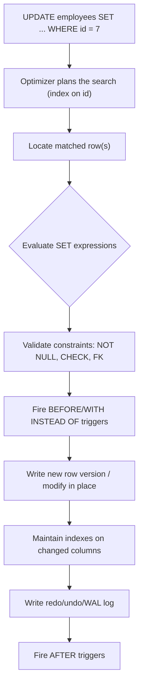

# 68 — UPDATE

> Category: 8-DML-and-Sets

## Fundamentals

`UPDATE` is the DML statement that **modifies existing rows** in a table. It changes the _data_ already stored; it does not insert new rows, and it does not remove rows.

**One UPDATE statement operates against one table** (the target table), even when its values are computed from other tables.

For every row matched by the `WHERE` condition, the database:

1. Locates the row (ideally using an index on the `WHERE` columns).
2. Reads the current column values.
3. Computes the new values from the `SET` expressions.
4. Applies constraints and fires triggers.
5. Writes the change (new row version, or in-place modification, depending on engine and concurrency model).
6. Maintains every index on the updated columns.

> One row in `employees` represents one employee. One row in `orders` represents one order. Always state the grain before writing an `UPDATE`, because JOIN-based updates quietly break the grain.

### The mental model for UPDATE

Ask before writing any UPDATE:

1. **What does one row in this table represent?** (the grain)
2. **Which rows should change?** (the `WHERE`)
3. **What are the new values?** (the `SET`)
4. **Can the new values ever be computed incorrectly** (divide by zero, NULL, fan-out)?
5. **Did I write a `WHERE` at all?**

---

## Internal working

`UPDATE` is not a single atomic primitive internally. It is effectively:

1. **Find** — run a read query equivalent to `SELECT ... WHERE <condition>`, which the optimizer plans using indexes and statistics.
2. **Evaluate** — compute the new expressions per matched row.
3. **Validate** — check `NOT NULL`, `CHECK`, FK, and other constraints.
4. **Write** — mutate the heap page (and every index that touches the changed columns).
5. **Log** — write redo/undo/WAL entries so the change survives a crash and is durable.

How the _write_ happens depends on the engine's concurrency model:

| Mechanism                      | Applies to                           | What happens                                                                                                                                      |
| ------------------------------ | ------------------------------------ | ------------------------------------------------------------------------------------------------------------------------------------------------- |
| **New row version (MVCC)**     | PostgreSQL, Oracle (undo/versioning) | The UPDATE creates a new version of the row. Old versions remain visible to concurrent readers until cleaned up (vacuum / undo).                  |
| **In-place update + undo log** | MySQL / InnoDB, SQL Server           | The row is modified in place; a copy of the old value is recorded in the undo log rollback segment so aborts and old snapshot readers still work. |

In PostgreSQL, a large UPDATE produces **dead tuples** (old row versions) that autovacuum must clean up — the table does not shrink until vacuum runs. This is why "UPDATE did nothing to the disk" is a lie; even a log/no-op update creates work.



### Important semantics

- **The WHERE test and SET evaluation are based on the same (pre-UPDATE) snapshot.** In PostgreSQL, MySQL (InnoDB), SQL Server, and Oracle, the `SET` expressions see the row _before_ the update. The exceptions to "all expressions see the old row" are noted in the MySQL section below.
- **A single UPDATE statement is atomic.** If one row violates a constraint or errors mid-way, the entire statement is rolled back (MySQL MyISAM is the legacy exception).
- **An UPDATE that matches zero rows "succeeds"** — it returns 0 affected rows, no error.

---

## Syntax

### ANSI / standard syntax

```sql
UPDATE table_name
SET  column1 = expression1,
     column2 = expression2,
     ...
WHERE condition;
```

- The `WHERE` is optional. **Omitting it updates every row in the table.**
- You may update multiple columns in one statement.
- The `SET` expressions may reference:
  - other columns of the same row (`salary * 1.1`)
  - constants and functions (`current_date`, `COALESCE(...)`)
  - scalar subqueries, often correlated (`(SELECT ... FROM other WHERE other.id = table.id)`)
  - columns from other tables, depending on dialect (see below)

---

## Database-specific syntax for updating from another table

UPDATE's ability to reference columns from a _different_ table is where dialects diverge:

### PostgreSQL — `UPDATE ... FROM`

```sql
UPDATE employees e
SET salary = d.budget * 1.02
FROM departments d
WHERE e.department_id = d.department_id;
```

- If you alias the target table, you must use that alias consistently.
- If the join yields multiple matching rows from `FROM`, **only one (arbitrary/non-deterministic) value wins.**

### MySQL — multi-table UPDATE with JOIN

```sql
UPDATE employees e
JOIN departments d ON e.department_id = d.department_id
SET e.salary = d.budget * 1.02;
```

- Multi-table updates require the join in the `UPDATE ... JOIN ... SET ...` form.
- In a multi-table UPDATE you cannot use `ORDER BY` or `LIMIT`.

### SQL Server — `UPDATE ... FROM`

```sql
UPDATE e
SET salary = d.budget * 1.02
FROM employees e
JOIN departments d ON e.department_id = d.department_id;
```

- SQL Server also supports `FROM` with `TOP (n)`.

### Oracle (and standard SQL) — correlated subquery

Oracle has no `UPDATE ... FROM` (until 23c). Use a correlated subquery, `UPDATE` on an updatable view/subquery, or `MERGE`:

```sql
UPDATE employees e
SET salary = (SELECT d.budget * 1.02 FROM departments d WHERE d.department_id = e.department_id)
WHERE EXISTS (SELECT 1 FROM departments d WHERE d.department_id = e.department_id);
```

> The `WHERE EXISTS` clause is essential: without it, employees with no matching department would get `salary = NULL` (the scalar subquery returns NULL for no rows).

### Returning the affected rows

| Dialect    | Feature                                                                      |
| ---------- | ---------------------------------------------------------------------------- |
| PostgreSQL | `UPDATE ... SET ... WHERE ... RETURNING id, new_salary;`                     |
| SQL Server | `OUTPUT inserted.id, inserted.salary`                                        |
| DB2        | `SELECT FROM FINAL TABLE (UPDATE ...)`                                       |
| MySQL      | No native RETURNING for UPDATE (workarounds use triggers or a second query). |

Returning rows is useful for audit logs, cache invalidation, and avoiding a follow-up `SELECT`.

---

## Sample tables

```sql
CREATE TABLE departments (
    department_id   INTEGER PRIMARY KEY,
    department_name TEXT    NOT NULL,
    budget          NUMERIC(12,2)
);

CREATE TABLE employees (
    employee_id   INTEGER PRIMARY KEY,
    first_name    TEXT NOT NULL,
    last_name     TEXT NOT NULL,
    department_id INTEGER REFERENCES departments(department_id),
    job_title     TEXT,
    salary        NUMERIC(10,2),
    hire_date     DATE,
    active        BOOLEAN DEFAULT TRUE
);

CREATE TABLE orders (
    order_id   INTEGER PRIMARY KEY,
    order_date DATE   NOT NULL,
    status     TEXT   NOT NULL DEFAULT 'pending',  -- pending | shipped | archived
    customer_id INTEGER
);

CREATE TABLE order_items (
    order_item_id INTEGER PRIMARY KEY,
    order_id      INTEGER REFERENCES orders(order_id),
    product_id    INTEGER,
    quantity      INTEGER NOT NULL
);
```

```sql
INSERT INTO departments VALUES
(1, 'Engineering',  500000),
(2, 'Sales',        300000),
(3, 'Operations',   200000);

INSERT INTO employees (employee_id, first_name, last_name, department_id, job_title, salary, hire_date) VALUES
(1, 'Alice', 'Nguyen', 1, 'Software Engineer',    90000.00, '2019-03-11'),
(2, 'Bob',   'Khan',   1, 'Staff Engineer',      135000.00,'2015-07-01'),
(3, 'Cara',  'Lee',    2, 'Account Executive',    70000.00, '2021-09-20'),
(4, 'Dan',   'Osei',   2, 'Sales Analyst',        65000.00, '2022-01-17'),
(5, 'Eve',   'Silva',   3, 'Ops Coordinator',     50000.00, '2023-04-03'),
(6, 'Frank', 'Meyer',  NULL, 'Intern',            30000.00, '2025-06-01');
```

---

## Examples

### 1. Update a single row

```sql
UPDATE employees
SET salary = 95000.00
WHERE employee_id = 1;
```

Result: only Alice's row changes; 5 rows were examined, 1 affected.

### 2. Update with an expression (10% raise)

```sql
UPDATE employees
SET salary = salary * 1.10
WHERE job_title LIKE '%Engineer%';
```

### 3. Update multiple columns

```sql
UPDATE employees
SET job_title = 'Senior Software Engineer',
    salary    = salary * 1.15
WHERE employee_id = 1;
```

### 4. Update from another table (PostgreSQL `FROM`)

Give every employee a raise proportional to their department's budget:

```sql
UPDATE employees e
SET salary = salary * (1 + d.budget / 1000000.0)
FROM departments d
WHERE e.department_id = d.department_id;
```

### 5. Update from another table (standard SQL, correlated subquery)

Archive all products with zero remaining order items — the common `sync from aggregated detail` pattern:

```sql
UPDATE orders o
SET status = 'archived'
WHERE NOT EXISTS (
    SELECT 1
    FROM order_items i
    WHERE i.order_id = o.order_id
);
```

### 6. Scalar subquery with COALESCE (avoid NULL wipe)

Set each employee's salary to the average salary of their department; employees whose department has no other members should keep their salary.

```sql
UPDATE employees e
SET salary = COALESCE(
    (SELECT AVG(s.salary)
       FROM employees s
      WHERE s.department_id = e.department_id
        AND s.employee_id <> e.employee_id),
    e.salary)
WHERE active = TRUE;
```

### 7. Conditional multi-column update with CASE

```sql
UPDATE orders
SET status = CASE
    WHEN order_date < DATE '2020-01-01' THEN 'archived'
    WHEN status = 'pending'             THEN 'shipped'
    ELSE status
END
WHERE status <> 'archived';
```

---

## Edge cases

### Zero matching rows

```sql
UPDATE employees SET salary = 0 WHERE employee_id = 99999;  -- 0 rows affected, no error
```

Business-insensitive code often treats "0 rows affected" as success when it actually means **the row did not exist**. For critical updates, check existence first or use `RETURNING`.

### No WHERE clause (update everything)

```sql
UPDATE employees SET salary = 0;   -- every employee now earns 0
```

> Production pitfall: omitting `WHERE` updates the whole table. Enable a safety guard:
> MySQL: start the server with `--safe-updates` (requires `WHERE`/`LIMIT`).
> Any engine: wrap in a transaction, `SELECT` a count first, and verify the filtered count before committing.

### Updating a column to its own current value

```sql
UPDATE employees SET salary = salary WHERE employee_id = 1;
```

This matches the row, "breaks" nothing, but still:

- writes a log record,
- in PostgreSQL creates a dead tuple (table bloat).
  Avoid it with a guard: `WHERE salary <> <new value>`.

### Division by zero / arithmetic errors

```sql
UPDATE employees SET salary = salary / NULLIF(bonus_count, 0);
```

`NULLIF(x, 0)` returns NULL instead of erroring on division by zero. Usually you then want `COALESCE(...)` around the expression.

### String/type truncation (strict vs non-strict mode)

In MySQL with **non-strict** SQL mode (old default), an overflowing `VARCHAR(5)` or out-of-range numeric is _clipped with a warning_. In PostgreSQL, MySQL strict mode, SQL Server, and Oracle, it is a **hard error** that rolls back the whole statement.

> Production pitfall: lengths `VARCHAR(n)`, `DECIMAL(p,s)` and collations silently differ across environments. Test the UPDATE on sample data first.

### Integer division

If `salary` is an `INTEGER` column, `UPDATE ... SET salary = salary * 90 / 100` evaluates with integer arithmetic and truncates (e.g., 95000 → 8550, not 85500). Use numeric constants: `salary * 0.90`.

### Updating a primary key / FK column

```sql
UPDATE employees SET employee_id = 77 WHERE employee_id = 1;
```

Possible, but dangerous:

- violates nothing if no FK references it,
- cascades/triggers/audit logs break if FKs do exist,
- in MySQL, the FK `ON UPDATE CASCADE` must exist or the update raises an error.
  Prefer recreating the row (`INSERT` + `DELETE`) when PK identity is business-meaningful.

### Many-to-one fan-out in a join-based update

If the joined table has **multiple matching rows** for one target row, only one wins, and **which one is non-deterministic**:

> PostgreSQL / SQL Server

```sql
UPDATE employees e
SET salary = d.budget
FROM departments d
WHERE e.department_id = d.department_id;  -- unique here, but if join were 1:many...
```

> MySQL — bad: a join that produces two rows per target

```sql
UPDATE orders o
JOIN order_items i ON i.order_id = o.order_id
SET o.status = 'archived';   -- order 1 appears once per item; only one result "wins"
```

Rule: **the join from the target table to the source table must be unique (grain-faithful)** or you must aggregate the source first. Verify the fan-out with `SELECT count(*) ... GROUP BY`.

---

## NULL behavior

This is where most subtle UPDATE bugs live.

### 1. `WHERE` uses three-valued logic

```sql
UPDATE employees SET active = FALSE WHERE hire_date IS NULL;
-- Frank (hire_date = '2025-06-01') untouched
```

Neither `WHERE salary = NULL` nor `WHERE salary <> NULL` matches NULL rows — both evaluate to `UNKNOWN`. You must write `IS NULL` / `IS NOT NULL`.

Common bug:

```sql
-- BAD — never matches NULLs, so 'Sales' employees with NULL salary keep NULL
UPDATE employees
SET salary = 40000
WHERE salary <> 40000;
```

Fix: add the NULL branch explicitly:

```sql
UPDATE employees
SET salary = 40000
WHERE salary IS NULL OR salary <> 40000;
```

### 2. Setting a column to NULL is an assignment, not "no change"

```sql
UPDATE employees SET department_id = NULL WHERE employee_id = 1;
```

Intentional (Alice has left the department). But a _subquery returning NULL_ does exactly this silently:

```sql
-- BAD: every row with no matching department gets department_name wiped to NULL
UPDATE employees e
SET last_name = (SELECT 'x' FROM departments d WHERE d.department_id = e.department_id)
WHERE active = TRUE;
```

### 3. Scalar subquery returning no rows → NULL

```sql
UPDATE employees e
SET salary = (SELECT MAX(salary) FROM employees s WHERE s.department_id = e.department_id)
WHERE active = TRUE;
```

For max, DEPARTMENT-less employees (Frank) drop to NULL salary. Guard with `COALESCE((SELECT ...), e.salary)`.

### 4. NOT IN vs NOT EXISTS inside an UPDATE's WHERE

```sql
-- BAD: if values can be NULL
UPDATE orders SET status = 'archived'
WHERE customer_id NOT IN (SELECT customer_id FROM customers WHERE active = TRUE);

-- BETTER
UPDATE orders SET status = 'archived'
WHERE NOT EXISTS (
    SELECT 1 FROM customers c
    WHERE c.customer_id = orders.customer_id AND c.active = TRUE
);
```

While this affects the _WHERE_ rather than the SET, the teaching is the same as everywhere else: `NOT IN` with a subquery that can emit NULL matches nothing. `NOT EXISTS` is NULL-safe.

---

## ON vs WHERE in join-based updates

In dialect-style updates (`UPDATE ... FROM`, `UPDATE ... JOIN`, SQL Server `FROM`), the semantics differ:

- **Join conditions define which source rows are paired** with each target row.
- **The `WHERE` decides which target rows get updated.**

> Bad — condition in the wrong place

```sql
-- MySQL: fine here, but if you added "AND o.status='x'" to the ON, it silently
-- becomes a row-filtering condition for the SET too.
UPDATE orders o
JOIN customers c ON o.customer_id = c.customer_id AND c.active = TRUE
SET o.status = 'archived';

-- Better: keep the join purely about pairing, filter explicitly
UPDATE orders o
JOIN customers c ON o.customer_id = c.customer_id
SET o.status = 'archived'
WHERE c.active = TRUE;
```

> Interview trap: in a LEFT JOIN-style update, moving "no match" row filters between `ON` and `WHERE` produces **different semantics**, exactly like the classic `LEFT JOIN devenir INNER JOIN` problem in SELECTs.

---

## Common mistakes (summary)

| Mistake                                              | Why it hurts                                                |
| ---------------------------------------------------- | ----------------------------------------------------------- |
| Missing `WHERE`                                      | Updates the entire table.                                   |
| `WHERE col = NULL` / `col <> NULL`                   | Three-valued logic: matches nothing.                        |
| Forgetting the `EXISTS` guard with scalar subqueries | NULL values silently overwrite real data.                   |
| Integer division in `SET`                            | Silent truncation of numeric results.                       |
| Updating an indexed column frequently                | Heavy index-maintenance cost and bloat.                     |
| Join fan-out in `SET` source                         | Non-deterministic "one random row wins".                    |
| Aliasing the target incorrectly                      | MySQL: alias unusable in single-table `WHERE`.              |
| Assuming 0-affect rows = failure (or success)        | Signals usually mean "no match", not error.                 |
| Testing only column count, not row versions          | In MVCC engines the changed-rows count ≠ storage work done. |
| Relying on `UPDATE ... RETURNING` portability        | Only PostgreSQL/DB2/`OUTPUT` have it.                       |

---

## Performance implications

Performance depends on the execution plan (`EXPLAIN`/`EXPLAIN ANALYZE`); claims below are guidance, always verify.

1. **Finding rows.** The `WHERE` drives the cost. Ensure an index on `WHERE` columns (or PK). Without it → full table scan + row locks.

   ```sql
   EXPLAIN ANALYZE
   UPDATE employees SET active = FALSE WHERE department_id = 2;
   ```

   Check for `Seq Scan` vs `Index Scan` and `Rows Removed by Filter`.

2. **Updating indexed columns** causes index maintenance: the row that changed needs old/new index entries. Updating a PK, a UNIQUE key, or a heavily-indexed column can be far more expensive than updating a plain column.

3. **MVCC bloat.** In PostgreSQL, an UPDATE never "shrinks" — it adds a dead tuple. A 10-million-row UPDATE briefly doubles table size until VACUUM. Batch in chunks to give autovacuum a chance and to keep transactions short (holds read snapshots for concurrent readers).

4. **Locking.** Every matched row is locked until commit; row locks ordered by access pattern. Two long transactions that lock rows in different orders can deadlock:

   ```
   T1: UPDATE a(id=1), then UPDATE b(id=2)
   T2: UPDATE b(id=2), then UPDATE a(id=1)
   -> deadlock; engine kills one.
   ```

   Mitigation: consistent ordering, short transactions, `SKIP LOCKED` / `NOWAIT` where appropriate.

5. **Log amplification.** Each UPDATE writes redo/undo/WAL. On replicas, a giant UPDATE replays as one event, causing lag spikes. Chunk (e.g., `WHERE id BETWEEN ... AND ...`) to spread work.

6. **SQL Server** may escalate row locks to a table lock for large updates; chunking/blocksize (`UPDATE TOP (1000) ...`) prevents blocking.

7. **Avoid no-op updates.** `UPDATE ... WHERE col <> new` avoids dead tuple/undo in MVCC engines and log writes.

8. **Batch pattern (PostgreSQL example, reusable everywhere):**

```sql
DO $$
DECLARE
    batch INT;
BEGIN
    LOOP
        -- wait; this is the "chunked update" pattern
        EXIT WHEN NOT FOUND;
    END LOOP;
END $$;
```

Simpler portable chunking:

```sql
-- repeat with rising boundaries; each statement commits separately
UPDATE employees
SET salary = salary * 1.1
WHERE employee_id BETWEEN 1 AND 1000;
```

Each `WHERE`-bounded statement commits by itself — good for sizeable maintenance jobs, bad if you need atomicity of the whole update (then put everything in one transaction and accept the lock hold).

---

## Comparison

| Statement                            | What it does                                               | NULL behavior                                       | Rollback scope                                       | When to use                                                     | When NOT                                                                   |
| ------------------------------------ | ---------------------------------------------------------- | --------------------------------------------------- | ---------------------------------------------------- | --------------------------------------------------------------- | -------------------------------------------------------------------------- |
| `UPDATE`                             | Changes values of existing rows                            | Affected by 3-valued logic in WHERE; can set NULL   | The single statement (atomic)                        | Correct a value, apply calculation, sync from master table      | You need to add/remove rows                                                |
| `DELETE`                             | Removes rows                                               | Row matching uses same WHERE rules                  | The single statement                                 | Removal by condition                                            | You only need to flag/keep history                                         |
| `TRUNCATE`                           | Removes all rows instantly, resets storage                 | N/A                                                 | Not transactional in some engines; in PostgreSQL yes | Full table reset, non-partitioned                               | Partial deletes, need WHERE, per-row triggers                              |
| `ALTER TABLE`                        | Changes schema (columns, types, constraints)               | N/A                                                 | By definition, DDL                                   | Schema change, add column                                       | Data correction                                                            |
| `MERGE`                              | Insert/update/delete in one statement based on source rows | Uses full 3-valued logic on match keys              | Whole statement                                      | UPSERT-style syncs, SCD type 1 (Oracle/SQL Server/Postgres 15+) | Postgres prefers `INSERT .. ON CONFLICT`; MySQL prefers `ON DUPLICATE KEY` |
| `INSERT ... ON CONFLICT DO UPDATE`   | Upsert (Postgres)                                          | `WHERE` clause can target update                    | Row-level                                            | Primary-key-upserts                                             | Complex multi-table syncs better served by MERGE                           |
| `INSERT ... ON DUPLICATE KEY UPDATE` | Upsert (MySQL)                                             | `VALUES(col)` deprecated → `VALUES(col) AS new_...` | Row-level                                            | MySQL PK/unique upserts                                         | Logic-heavy updates; surprising default updates of any UNIQUE col          |

### UPDATE vs DELETE (production judgment)

| Aspect            | UPDATE                                                               | DELETE                                                                          |
| ----------------- | -------------------------------------------------------------------- | ------------------------------------------------------------------------------- |
| Space             | `UPDATE` can bloat in MVCC engines (dead tuples), but frees no space | `DELETE` frees space only after vacuum/compaction; MVCC also leaves dead tuples |
| History/audit     | Preserves the row; audit often via `RETURNING`/triggers              | Commonly replaced by soft-delete (`deleted_at`) for auditability                |
| Indexes           | All indexes on target table touched but row remains                  | Index entries removed                                                           |
| Trigger semantics | `BEFORE/AFTER UPDATE`                                                | `BEFORE/AFTER DELETE`                                                           |
| FKs               | FK referencing the updated keys may cascade                          | FK `ON DELETE CASCADE` fires                                                    |

---

## Production pitfalls (checklist)

- **No `WHERE`** → whole-table update. Always write the predicate; review it.
- **No test-data verification.** Run the `SELECT` version of the WHERE first:
  ```sql
  SELECT count(*), count(*) FILTER (...) FROM employees WHERE <new-where>;
  ```
- **Ignoring MVCC bloat / replication lag** on large updates → chunk.
- **Deadlock-prone lock ordering** → consistent ordering, short transactions.
- **Replaying without an audit trail** → log `RETURNING` rows / `OUTPUT` / an audit table with old and new values.
- **ALTER-TABLE-like changes done with UPDATE** → changing a column _type_ needs `ALTER`; UPDATE can only change values.
- **Naive UPSERT loops** (check-then-update) → race between check and update; use `ON CONFLICT`/`MERGE`.
- **MySQL alias not usable in single-table WHERE**; multi-table UPDATE has no `ORDER BY`/`LIMIT`.
- **Setting values from a subquery that can return NULL** → COALESCE defensive programming.
- **Timestamp-bounded updates** (see next) → use half-open intervals.
- **Timezone-naive comparisons** → `order_date < DATE '2024-01-01'`, unless the column stores timestamps _with time zone_ (then use a `timestamptz` boundary). Avoid `<= '2023-12-31 23:59:59.997'` hacks — they exclude valid rows and break across DST.

---

## BAD APPRAOCH → BETTER APPROACH

### BAD: one UPDATE per row in application loops

```sql
-- app pseudo-code (N+1 horror)
for each employee in employees:
    UPDATE employees SET salary = salary * 1.1 WHERE employee_id = ?;
```

**Problems:** N round trips, N transactions, N times the lock coverage, slow under load.

### BETTER: single set-based statement

```sql
UPDATE employees
SET salary = salary * 1.1
WHERE job_title = 'Software Engineer';
```

### BAD: updating from a table with a non-unique join

```sql
UPDATE orders o
JOIN order_items i ON i.order_id = o.order_id
SET o.status = 'archived';
```

**Problems:** fan-out — o appears once per item; which value wins is arbitrary.

### BETTER: check uniqueness first, aggregate before join, or use EXISTS

```sql
SELECT o.order_id, count(*)
FROM orders o JOIN order_items i ON i.order_id = o.order_id
GROUP BY o.order_id
HAVING count(*) > 1;   -- if non-empty, fix the model before updating

UPDATE orders o
SET status = 'archived'
WHERE NOT EXISTS (
   SELECT 1 FROM order_items i WHERE i.order_id = o.order_id
);
```

### BAD: raw timestamp "just before midnight"

```sql
UPDATE orders SET status = 'archived'
WHERE order_date <= '2023-12-31 23:59:59.999';
```

**Problems:** misses microseconds; uses literal format already timezone-ambiguous; DST breaks it.

### BETTER: half-open interval on a timezone-safe type

```sql
UPDATE orders SET status = 'archived'
WHERE order_date < DATE '2024-01-01';
```

### BAD: unconditional 0-row check treated as error

```sql
DELETE FROM ... ; -- then
if rows_affected == 0: return "failed";   -- wrong: 0 rows can be legitimate
```

This is a _business-logic_ bug: distinguish "no rows matched" from "error". Use `RETURNING`/`ROWCOUNT` and validate preconditions explicitly.

---

## Best practices

1. **Always write a `WHERE`.** A production DML tool forbidding `UPDATE ... WHERE`-less is table stakes.
2. **Test with the read version first.** `SELECT * ... WHERE ...` — confirm your filter count before UPDATE.
3. **State the grain** in your head before writing: what row is being changed, and does the join respect the grain?
4. **Bracket bulk changes in a transaction**, count affected rows, and commit deliberately.
5. **Use `RETURNING`/`OUTPUT` for audit and cache invalidation** where supported.
6. **Guard scalar subqueries with `COALESCE`** and subquery-WHEREs with `EXISTS` (NULL-safe).
7. **Chunk large updates** for MVCC/replication health.
8. **Safety rails to consider:**
   - MySQL `--safe-updates`
   - PostgreSQL: wrap in transaction + `EXPLAIN` before
   - SQL Server: `BEGIN TRAN` + `ROWCOUNT`
9. **Prefer set-based operations over procedural loops** — IN is your signal.
10. **Keep the WHERE and its target filters consistent with the join semantics** (affects LEFT JOINs becoming INNER JOINs in UPDATE too).

---

# Interview Questions

## Beginner

1. What does `UPDATE` do, and how is it different from `DELETE` and `TRUNCATE`?
2. Write an UPDATE that increases the salary of employee with `employee_id = 4` by 10%.
3. What happens if you run an UPDATE with no `WHERE`?
4. Why is `WHERE salary = NULL` wrong?
5. What is the difference between `UPDATE` and `ALTER TABLE`?

## Intermediate

6. Write an UPDATE that copies the product's name into the order_item's snapshot column only when the product name changed.
7. When would `NOT IN` with a subquery in an UPDATE's WHERE update fewer rows than expected, and why?
8. Explain LEFT JOIN becoming INNER JOIN if the `ON` filter is moved to `WHERE` in an `UPDATE ... FROM`.
9. In MySQL multi-table UPDATE, why is a 1:many JOIN dangerous for correctness?
10. What does `UPDATE ... RETURNING` do? Which databases support it?

## Advanced

11. Write the PostgreSQL `UPDATE ... FROM` and the standard-SQL correlated-subquery versions of "set order total = sum of items".
12. Why does a large UPDATE in PostgreSQL cause table bloat, and how would you mitigate it? (Autovacuum, chunking, no-op guard).
13. Explain lock-ordering deadlocks between two transactions updating overlapping rows.
14. How would you implement a batch "update the last 1000 unarchived orders, then loop" pattern without blocking the whole table, and how would you keep it atomic, if at all?
15. Compare `MERGE`, `INSERT ... ON CONFLICT DO UPDATE`, and `INSERT ... ON DUPLICATE KEY UPDATE` for a SCD1 upsert. When is each the right tool?

## Scenario Based

16. The `orders` table suddenly has 2 million rows with `status = 'draft'` that should be `archived`. What steps do you take before the UPDATE, during, and how do you verify?
17. An intern ran `UPDATE employees SET salary = salary * 1.1` on a 100-milion-row table in production and it's been running 3 hours. What are your options?
18. Your flag update must also stamp `archived_at` only for rows that _actually changed_. Write the safe statement.
19. A report shows employees who "left the company" still appear in a department's budget calculation because their `active` flag is still TRUE. Describe the UPDATE plus its verification.

## Tricky

20. In MySQL, does `UPDATE t SET a = b, b = a;` swap the values? What about PostgreSQL/SQL Server? Why?
21. `UPDATE employees SET manager_id = employee_id;` — is there a NULL/self-reference bug risk, and how do you guard it?
22. You ran an UPDATE that returned "0 rows affected". Does it guarantee the row was not modified? Defend your answer.
23. Write an UPDATE that doubles salary only for the 20 lowest-paid active employees, deterministically (no ties ambiguity).
24. What happens if the `WHERE` clause of an UPDATE references the column being SET, e.g., `SET salary = salary * 2 WHERE salary < 10000`? Is the WHHERE evaluated on old or new values?

## Output Prediction

25. Given the sample tables above, predict the result of:

```sql
UPDATE employees SET salary = 0 WHERE department_id = 1 AND active = TRUE;
-- then
SELECT count(*) FROM employees WHERE salary = 0;
```

26. Predict affected-row counts for `UPDATE employees SET last_name = last_name WHERE salary > 1e9;`.
27. `UPDATE employees SET salary = salary / NULLIF(salary,0) WHERE active = TRUE;` — what are the possible new salaries? Any NULLs?

## Debugging

28. Someone's UPDATE set `department_id` to NULL for 40% of employees. How do you determine which rows were touched and whether you can restore the values?
29. An UPDATE with a correlated subquery is slow; where do you look first (EXPLAIN, missing index on FK vs PK, outer scan) and why?
30. Which stylish query is wrong: "updated 500 rows but the report still shows old values" — snapshot isolation? A read-on-replica vs write-on-primary? Autocommit? Walk through the checklist.

## Performance

31. Write and explain the EXPLAIN ANALYZE for `UPDATE employees SET salary = salary * 1.1 WHERE department_id = 2;` — what decides Seq Scan vs Index Scan?
32. Which is more expensive: updating a non-indexed column vs an indexed column on the same table, and why?
33. Compare one big UPDATE vs N chunked UPDATEs for: MVCC bloat, replication lag, lock duration, atomicity. When does chunking give correctness problems?
34. How would you prove (not guess) that the `WHERE` predicate is the bottleneck vs the SET evaluation of a slow UPDATE?
