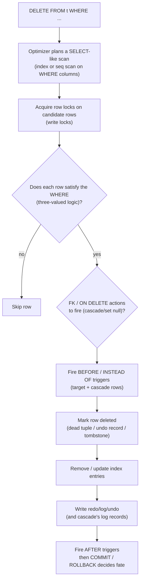

The file `sql-handbook/8-DML-and-Sets/69-DELETE.md` has been written (1,313 lines). Here is what it covers:

**Structure (15 sections + Interview Questions):**

| Section                           | Coverage                                                                                                                                           |
| --------------------------------- | -------------------------------------------------------------------------------------------------------------------------------------------------- |
| **1. Fundamentals**               | What/why, mental model, what DELETE does NOT do, hard vs soft delete                                                                               |
| **2. Sample Tables**              | 10 grain-stated tables with seed data (customers, orders, order_items, products, payments, users, logins, events, transactions, staging_customers) |
| **3. Syntax Reference**           | ANSI, RETURNING/OUTPUT/RETURNING INTO, dialect feature map                                                                                         |
| **4. Internal Working**           | Statement lifecycle Mermaid diagram, MVCC dead tuples, lock scope, constraint/trigger/cascade order                                                |
| **5. Deleted by another table**   | `EXISTS`, `NOT IN`, multi-table DELETE (PG/MySQL/SQL Server/Oracle)                                                                                |
| **6. CTE-driven deletes**         | `WITH ... DELETE` for chunked/ranked deletes (all 4 engines)                                                                                       |
| **7. NULL behavior**              | `= NULL`, `NOT IN + NULL`, orphan NULL FKs, `SET NULL`                                                                                             |
| **8. DELETE vs TRUNCATE vs DROP** | Comparison table with per-engine rollback/trigger/identity/space behavior                                                                          |
| **9. Bulk deletes and chunking**  | Keyset loop pattern (PG/MySQL/SQL Server/Oracle), identity gaps                                                                                    |
| **10. BAD vs BETTER**             | Non-atomic clear+reload, row-by-row loops, cascade audit, timestamp bounds                                                                         |
| **11. Edge cases**                | Zero rows, no WHERE, concurrent deletes, dedup with ROW_NUMBER, self-FK, stale statistics                                                          |
| **12. Common mistakes**           | Summary table of 12 pitfalls                                                                                                                       |
| **13. Performance**               | 8 factors + execution plan verification tools                                                                                                      |
| **14. Production pitfalls**       | Checklist with labeled pitfalls                                                                                                                    |
| **15. Best practices**            | 11 actionable rules                                                                                                                                |
| **Interview Questions**           | 35 questions across 8 categories (Beginner, Intermediate, Advanced, Scenario, Tricky, Output Prediction, Debugging, Performance)                   |

ps issuing
numbers even after all rows are deleted.

### 1.1 The mental model

> A `DELETE` is a **`SELECT` with a side effect.** The `WHERE` is a regular
> filter; the optimizer plans it exactly like a `SELECT`, finds matching rows,
> and instead of returning them, removes them.

Because of the "SELECT underneath" mental model, everything you know about
filtering transfers directly:

1. **No `WHERE` → every row matches → empty table.**
2. The `WHERE` predicate obeys **three-valued logic** (NULL is not equal to
   anything, including itself).
3. Which rows are _selected_ — and therefore _deleted_ — is decided by the
   execution plan, indexes, and statistics, exactly as in a `SELECT`.
4. The row count reported ("N rows deleted") is the number actually removed,
   which can be 0 — that is not an error.
5. Constraints are _validated_, not circumvented: foreign keys, triggers, and
   referential actions (`ON DELETE CASCADE`) all fire and can abort the whole
   statement.

### 1.2 Why it exists

Data has a life cycle: it is inserted, updated, archived, and eventually
removed. `DELETE` is the _removal_ operation in the DML quartet:

| Statement | Direction | What it does to the table       |
| --------- | --------- | ------------------------------- |
| `SELECT`  | read      | returns existing rows           |
| `INSERT`  | write     | adds new rows                   |
| `UPDATE`  | write     | changes values in existing rows |
| `DELETE`  | write     | removes existing rows           |

Real-world uses:

- Correcting bad data ("remove the test customers").
- Removing rows superseded elsewhere ("delete the staging row once promoted").
- Hard-removal to satisfy privacy laws / data-retention policies
  ("right to be forgotten").
- Cleaning datasets so a migration or re-load can run idempotently.

### 1.3 What `DELETE` does NOT do

- It does not **reset identity counters** (see Identity gaps in Section 9).
- It does not **drop tables or columns** (`DROP TABLE`, `ALTER TABLE`).
- It does not **remove every row fast** — that is `TRUNCATE` (Section 8).
- It does not **free disk space** immediately. After a big `DELETE` the table
  can still physically occupy the same size (MVCC/undo/compaction — Section 4).
- It does not **fire the ON DELETE actions of every table** automatically for
  you. `ON DELETE CASCADE` fires _only_ for directly referencing child
  tables via the foreign key that says so. Orphaned rows in tables with no
  FK (or FK without cascade) are your responsibility.
- It does not **return a result set** — like `INSERT`/`UPDATE` it only reports
  how many rows were removed, unless you use `RETURNING` (PostgreSQL) /
  `OUTPUT` (SQL Server).

### 1.4 `DELETE` vs soft-delete

"Delete" to a developer often means _logical_ or **soft delete**: set a
`deleted_at` timestamp (or `is_deleted` flag) so the row stays in the table
for audit, undo, or referential integrity, but is hidden from queries.

| Aspect                 | Hard DELETE                            | Soft delete                                                                        |
| ---------------------- | -------------------------------------- | ---------------------------------------------------------------------------------- |
| Row gone from storage? | Yes (eventually)                       | No                                                                                 |
| Queryability           | Depends on your queries                | Just `WHERE deleted_at IS NULL` in every query                                     |
| Space                  | Returns space (slowly)                 | Row stays, table grows                                                             |
| FK integrity           | Children must handle cascade/null/skip | FKs keep working                                                                   |
| Legal/data-retention   | True removal only way                  | Usually _insufficient_ for GDPR-style requests                                     |
| The trap               | Irreversible unless backed up          | **Every query must filter the flag** — forgetting it leaks deleted data everywhere |

> **Production pitfall:** the soft-delete flag has a _leakage_ cost that is
> worse than the space cost. Every future query, join, aggregate, and count
> silently includes deleted rows unless the developer remembers the flag.
> Maintain a _view_ that exposes `NOT deleted` rows and require code to read
> through it, or audit your usage — you have been warned.

The rest of this section is about the **hard DELETE** statement.

---

## 2. Sample Tables (grain check)

Always state the grain before deleting — it forces you to think about _what
one row means_, which is exactly what prevents deleting too many or too few.

| Table               | Grain (one row = ...)                           |
| ------------------- | ----------------------------------------------- |
| `customers`         | one registered customer                         |
| `orders`            | one customer order                              |
| `order_items`       | one product line _within_ an order              |
| `products`          | one sellable product                            |
| `payments`          | one payment attempt against an order            |
| `users`             | one application user                            |
| `logins`            | one successful login event                      |
| `events`            | one tracked event                               |
| `transactions`      | one ledger transaction                          |
| `staging_customers` | one raw row from a CRM CSV export (pre-cleanup) |

**customers** — _one row per registered customer._

```sql
CREATE TABLE customers (
    customer_id INT PRIMARY KEY,
    email       VARCHAR(100) NOT NULL UNIQUE,
    full_name   VARCHAR(80)  NOT NULL,
    country     VARCHAR(40),
    signup_date DATE,
    is_active   BOOLEAN NOT NULL DEFAULT TRUE,
    deleted_at  TIMESTAMP        -- soft-delete marker used in several examples
);
```

```sql
INSERT INTO customers (customer_id, email, full_name, country, signup_date) VALUES
(1, 'ana.silva@example.com',     'Ana Silva',     'Brazil',    DATE '2026-08-01'),
(2, 'chen.wei@example.com',      'Chen Wei',      'Singapore', DATE '2026-08-10'),
(3, 'maria.garcia@example.org',  'Maria Garcia',  'Mexico',    DATE '2026-08-20'),
(4, 'otto.hauser@example.com',   'Otto Hauser',   'Germany',   DATE '2026-09-01'),
(5, 'lina.meyer@example.com',    'Lina Meyer',    'Germany',   DATE '2026-09-05'),
(6, 'kenji.sato@example.com',    'Kenji Sato',    'Japan',     NULL);
```

**orders** — _one row per customer order. `customer_id` FK-set to `ON DELETE
CASCADE` for business purposes in some examples, but declare it plainly here._

```sql
CREATE TABLE orders (
    order_id     INT PRIMARY KEY,
    customer_id  INT NOT NULL REFERENCES customers (customer_id),
    order_date   DATE NOT NULL,
    total_amount NUMERIC(10,2) NOT NULL,
    status       VARCHAR(20) NOT NULL DEFAULT 'PENDING'
);
```

```sql
INSERT INTO orders (order_id, customer_id, order_date, total_amount, status) VALUES
(1001, 1, DATE '2026-09-01', 250.00, 'PAID'),
(1002, 2, DATE '2026-09-02',  90.50, 'PAID'),
(1003, 3, DATE '2026-09-03', 310.75, 'PENDING'),
(1004, 4, DATE '2026-09-06',  45.00, 'CANCELLED'),
(1005, 5, DATE '2026-09-07', 620.00, 'PAID');
```

**order_items** — _one row per product line within an order. An order can have
0, 1 or many items._

```sql
CREATE TABLE order_items (
    order_item_id INT PRIMARY KEY,
    order_id      INT NOT NULL REFERENCES orders (order_id) ON DELETE CASCADE,
    product_code  VARCHAR(20) NOT NULL,
    quantity      INT NOT NULL,
    unit_price    NUMERIC(8,2) NOT NULL
);
```

```sql
INSERT INTO order_items (order_item_id, order_id, product_code, quantity, unit_price) VALUES
(5001, 1001, 'TECH-01', 2, 125.00),
(5002, 1002, 'BOOK-02', 1,  90.50),
(5003, 1003, 'DESK-01', 1, 310.75),
(5004, 1004, 'TECH-02', 1,  45.00),
(5005, 1005, 'TECH-01', 4, 125.00),
(5006, 1005, 'BOOK-02', 2,  60.00);
```

**products** — _one row per sellable product._

```sql
CREATE TABLE products (
    product_code VARCHAR(20) PRIMARY KEY,
    product_name VARCHAR(80) NOT NULL,
    category     VARCHAR(40) NOT NULL,
    list_price   NUMERIC(8,2) NOT NULL,
    discontinued BOOLEAN NOT NULL DEFAULT FALSE
);
```

```sql
INSERT INTO products (product_code, product_name, category, list_price) VALUES
('TECH-01', 'Noise-Cancelling Headphones', 'Electronics', 129.99),
('TECH-02', 'Mechanical Keyboard',         'Electronics',  89.99),
('BOOK-02', 'SQL Handbook (Print)',        'Books',        49.99),
('DESK-01', 'Standing Desk',               'Furniture',   399.00),
('DESK-02', 'Ergonomic Chair',             'Furniture',   289.00);
```

**payments** — _one row per payment attempt against an order. Grain: a single
attempt, so one order can have 0 or many payments._

```sql
CREATE TABLE payments (
    payment_id   INT PRIMARY KEY,
    order_id     INT NOT NULL REFERENCES orders (order_id),
    amount       NUMERIC(10,2) NOT NULL,
    status       VARCHAR(20) NOT NULL,   -- SUCCESS | FAILED | REFUNDED
    attempted_at TIMESTAMP NOT NULL DEFAULT CURRENT_TIMESTAMP
);
```

```sql
INSERT INTO payments (payment_id, order_id, amount, status, attempted_at) VALUES
(7001, 1001, 250.00, 'SUCCESS',  TIMESTAMP '2026-09-01 10:00:00'),
(7002, 1002,  90.50, 'SUCCESS',  TIMESTAMP '2026-09-02 11:00:00'),
(7003, 1003, 310.75, 'FAILED',   TIMESTAMP '2026-09-03 12:00:00'),
(7004, 1003, 310.75, 'SUCCESS',  TIMESTAMP '2026-09-04 09:00:00'),
(7005, 1005, 620.00, 'SUCCESS',  TIMESTAMP '2026-09-07 13:00:00');
```

**users** — _one row per application user._

```sql
CREATE TABLE users (
    user_id    INT GENERATED ALWAYS AS IDENTITY PRIMARY KEY, -- PG/standard
    email      VARCHAR(100) NOT NULL UNIQUE,
    created_at TIMESTAMP NOT NULL DEFAULT CURRENT_TIMESTAMP
);
```

```sql
INSERT INTO users (email) VALUES
('dev@example.com'), ('qa@example.com'), ('admin@example.com');
```

**logins** — _one row per successful login event._

```sql
CREATE TABLE logins (
    login_id BIGINT GENERATED ALWAYS AS IDENTITY PRIMARY KEY,
    user_id  INT NOT NULL REFERENCES users (user_id),
    logged_in_at TIMESTAMP NOT NULL DEFAULT CURRENT_TIMESTAMP
);
```

**events** — _one row per tracked event, retained for 90 days then purged._

```sql
CREATE TABLE events (
    event_id   BIGINT GENERATED ALWAYS AS IDENTITY PRIMARY KEY,
    event_type VARCHAR(40) NOT NULL,
    payload    JSONB,               -- or JSON / NVARCHAR(MAX) in other engines
    occurred_at TIMESTAMP NOT NULL DEFAULT CURRENT_TIMESTAMP
);
```

**staging_customers** — _one row per raw row from a CRM CSV export, before it
is promoted into `customers`._

```sql
CREATE TABLE staging_customers (
    email     VARCHAR(100),
    full_name VARCHAR(80),
    country   VARCHAR(40)
);
```

```sql
INSERT INTO staging_customers (email, full_name, country) VALUES
('john.doe@example.com',      'John Doe',     'USA'),
('ana.silva@example.com',     'Ana Silva',    'Brazil'),   -- already in customers
('priya.sharma@example.com',  'Priya Sharma', 'India');
```

> **Assumption for all examples that follow:** every example starts from the
> seed data above unless the example explicitly adds/front-loads rows. After
> each example, mentally reset — or re-run the seeds — otherwise later counts
> will look wrong.

---

## 3. Syntax Reference

### 3.1 ANSI / standard syntax

```sql
DELETE FROM table_name
[WHERE condition];
```

- `DELETE * FROM` is **invalid** — you delete the whole _row_, not columns.
  There is no column list. (Some engines _accept_ `DELETE t.*` only in their
  multi-table forms; see Section 5.)
- The `WHERE` is optional. **Omitting it deletes every row in the table.**
- There is no standard `ORDER BY`/`LIMIT` for single-table `DELETE`; those are
  dialect extensions (Section 6.5).

The `WHERE` may reference:

- constants and functions (`WHERE status = 'PAID'`, `WHERE occurred_at < now() - interval '90 days'`),
- columns of the target table,
- subqueries (correlated or not), `EXISTS`, `IN`,
- in dialect extensions, columns of _other_ tables via `USING`/`JOIN`.

### 3.2 Returning deleted rows

PostgreSQL and SQL Server can hand you back **the rows that were deleted** —
invaluable for audit trails, cache eviction, and archiving:

```sql
-- PostgreSQL
DELETE FROM payments
WHERE status = 'FAILED'
RETURNING payment_id, order_id, amount, attempted_at;
```

```sql
-- SQL Server
DELETE FROM payments
OUTPUT DELETED.payment_id, DELETED.order_id, DELETED.amount, DELETED.attempted_at
WHERE status = 'FAILED';
```

In an `UPDATE`, the `OUTPUT` clause exposes both `INSERTED` (new) and
`DELETED` (old) virtual tables; in a `DELETE` there is only `DELETED`.
Oracle reaches the same goal with `RETURNING ... INTO` (PL/SQL); MySQL has no
native equivalent — see the table below.

| Dialect    | Feature                               | Notes                                          |
| ---------- | ------------------------------------- | ---------------------------------------------- |
| PostgreSQL | `DELETE ... RETURNING *`              | returns all / selected columns of removed rows |
| SQL Server | `DELETE ... OUTPUT DELETED.*`         | can write into a table variable too            |
| Oracle     | `DELETE ... RETURNING cols INTO vars` | PL/SQL only; not plain SQL                     |
| MySQL      | none                                  | use a trigger, or `SELECT` first, then delete  |

### 3.3 Syntax by engine (quick map)

| Feature              | PostgreSQL              | MySQL                     | SQL Server         | Oracle                          |
| -------------------- | ----------------------- | ------------------------- | ------------------ | ------------------------------- |
| Multi-table delete   | `USING`                 | `JOIN`/`FROM` multi-table | `FROM` multi-table | subquery / `DELETE (SELECT...)` |
| `RETURNING`          | yes                     | no                        | `OUTPUT`           | `RETURNING INTO` (PL/SQL)       |
| `LIMIT` on delete    | no (via CTE)            | `LIMIT` supported         | `TOP (n)`          | `WHERE ROWNUM` / `FETCH`        |
| `ORDER BY` on delete | no (via CTE)            | yes                       | `TOP` requires it  | `WHERE ROWNUM`                  |
| Partitions           | basic partition support | `PARTITION (p)` hint      | no                 | `PARTITION (p)`                 |

---

## 4. Internal Working

### 4.1 Statement lifecycle



The order is approximate and engine-dependent, but every step happens for
every deleted row. The steps you pay for without asking:

- **Index maintenance** — every index entry pointing at the row must be
  removed (or marked).
- **Logging** — each deletion is logged (row-level redo/WAL or a page-level
  change) so it can be rolled back and replicated. `DELETE` is rarely "free".

### 4.2 MVCC and "where does the space go?"

This is where most developers' mental models are wrong:

- **PostgreSQL (and all MVCC engines):** a `DELETE` does not physically erase
  the row. It creates a **dead tuple** — the space is marked reusable. Space
  returns only after `VACUUM` and is _reusable_ before it is _shrinkable_.
  `VACUUM FULL` / `CLUSTER` rewrite the table and actually shrink the file.
  A big `DELETE` briefly keeps the file at full size, and you have dead
  tuples until autovacuum sweeps them.
- **MySQL/InnoDB:** rows are marked deleted in place with undo-log records so
  old snapshots still read the pre-delete state. The space becomes reusable
  (via purge) but the index/pages are not immediately trimmed. `OPTIMIZE
TABLE` (recreate) actually compacts.
- **SQL Server:** deleted space is marked free inside pages; reuse is
  automatic. The table does not "shrink" unless `ALTER TABLE ... REBUILD` or
  `DBCC SHRINKFILE` is run.
- **Oracle:** same MVCC pattern; undo lets old readers see the pre-delete
  rows; free space is reused (high-water mark governs table scans).

> **Production pitfall:** "DELETE 2 million rows, but the table is still 20 GB
> on disk." That is normal. Space accounting is _not_ the same as row
> accounting. If you need the file smaller, plan a compaction step (vacuum
> full, `OPTIMIZE TABLE`, rebuild) — and expect a lock/blocking during it.

### 4.3 Transactionality and lock scope

- A single `DELETE` statement is **atomic**: either all matching rows are
  removed or none (transactional engines). MySQL's MyISAM/MEMORY engines are
  the legacy exception — no rollback support.
- **Row locks** are held on every matched row until commit (PostgreSQL,
  MySQL/InnoDB, SQL Server, Oracle). Under `SERIALIZABLE` / at certain
  isolation levels, engines may hold **range locks / gap locks** on the range
  scanned, which can block concurrent inserts of rows that would match.
- A huge `DELETE` blocks readers? Usually **no** in MVCC engines (readers see
  the old snapshot); but it _blocks writers_ to the same rows/pages, and on
  SQL Server it may **escalate** row locks into a table lock.

> **PostgreSQL / Oracle / MySQL (InnoDB):** `DELETE` inside one transaction is
> fully rollback-able; the price is that a long transaction holds an old
> snapshot open, delaying vacuum/purge and growing undo. **SQL Server:**
> watch lock escalation on big deletes — chunk the delete (Section 9).

### 4.4 Constraints and referential actions

When you delete a _parent_ row, three relationships can exist:

| FK action                          | What happens to the child row    | Result                                         |
| ---------------------------------- | -------------------------------- | ---------------------------------------------- |
| `ON DELETE CASCADE`                | child is deleted too             | both gone — silently, many rows                |
| `ON DELETE SET NULL`               | child's FK column becomes `NULL` | children survive, now parentless               |
| `ON DELETE RESTRICT` / `NO ACTION` | DELETE is **blocked**            | error (e.g. "violates foreign key constraint") |
| no FK                              | **nothing**                      | children become orphans                        |

Your `order_items.order_id` has `ON DELETE CASCADE` in the seed; `payments`
does not — it uses plain `REFERENCES orders`. Consequences you must internalize:

```sql
-- Deleting order 1005 cascades to order_items (5005, 5006 vanish),
-- but payments 7005 survives as an orphan because payments has no CASCADE:
DELETE FROM orders WHERE order_id = 1005;
-- order_items 5005, 5006 gone; payments 7005 still points at a dead order.
```

> **Production pitfall:** CASCADE deletes are _not_ visible in a plain
> `EXPLAIN` count of the target table. `DELETE FROM orders WHERE id = ...`
> can silently remove thousands of `order_items` rows in the same
> transaction. Always estimate the cascade fan-out first:
> `SELECT count(*) FROM order_items WHERE order_id = 1005;`

> **Interview trap:** "If `orders.order_id` is referenced by `order_items`
> with `ON DELETE CASCADE`, and I delete one order, how many statements ran?"
> One statement. Cascade deletes fire inside the same statement
> (statement/transaction scoped), not as separate visible `DELETE` commands.

### 4.5 Triggers

- **MySQL:** `BEFORE DELETE` / `AFTER DELETE` row triggers fire per deleted
  row (including rows deleted by a cascade). Cascaded deletes fire the child
  table's delete triggers too.
- **PostgreSQL:** `BEFORE DELETE` / `AFTER DELETE` (row or statement level).
- **SQL Server:** `AFTER DELETE` triggers (and `INSTEAD OF DELETE` on
  views).
- **Oracle:** `BEFORE DELETE`/`AFTER DELETE` row and statement triggers;
  cascaded deletes run the child's delete triggers.

Row-level triggers make a "delete 1M rows" into "run 1M trigger bodies" —
the real cost may be in the trigger, not the delete.

---

## 5. Deleting rows matched by another table

This is the most common real-world shape: "delete everything that _matches_ (or
_fails to match_) another table." Three idioms exist. Choose by _grain_ and by
*duplicate*safety, then verify with an execution plan.

### 5.1 `DELETE ... WHERE EXISTS (...)` — the standard, NULL-safe way

```sql
DELETE FROM payments p
WHERE EXISTS (
    SELECT 1 FROM orders o
    WHERE o.order_id = p.order_id
      AND o.status   = 'CANCELLED'
);
-- removes payments that belong to a CANCELLED order
```

- `EXISTS` stops at the _first_ match per outer row — ideal for the "is there
  a matching row?" question.
- If multiple payment rows match one cancelled order, **all** matching
  `payments` rows are deleted (correct here — grain of `payments` is one
  attempt per row).
- Correlated: the inner query runs once per candidate outer row (conceptually).

### 5.2 `DELETE ... WHERE col IN (SELECT col FROM other)` — watch NULL

```sql
DELETE FROM customers
WHERE customer_id IN (
    SELECT customer_id FROM orders WHERE status = 'CANCELLED'
);
```

- `IN` is fine when the subquery result can never contain `NULL` and has no
  duplicates.
- Duplicates in the subquery are harmless for `IN` (set semantics).
- A `NULL` in the subquery result **does not break** a 3-valued-logic-safe
  `IN` the way it breaks `NOT IN` (Section 7), but a `NOT IN (...)`
  subquery that _can_ produce `NULL` matches **nothing** — the classic bug:

```sql
-- BAD — if orders.customer_id were nullable and had a NULL, this deletes NOTHING:
DELETE FROM customers
WHERE customer_id NOT IN (
    SELECT customer_id FROM orders WHERE status = 'CANCELLED'
);
```

Use `NOT EXISTS` for the negative form (NULL-safe, and usually plan-neutral).

### 5.3 Multi-table `DELETE` (dialect extensions)

When the WHERE references _other_ tables directly, engines differ. Every form
below deletes only the rows named after `DELETE`:

**PostgreSQL**

```sql
DELETE FROM payments p
USING orders o
WHERE o.order_id = p.order_id
  AND o.status = 'CANCELLED';
```

**MySQL**

```sql
DELETE p
FROM payments AS p
JOIN orders  AS o ON o.order_id = p.order_id
WHERE o.status = 'CANCELLED';
```

**SQL Server**

```sql
DELETE p
FROM payments AS p
JOIN orders  AS o ON o.order_id = p.order_id
WHERE o.status = 'CANCELLED';
```

**Oracle** — no multi-table DELETE; use a subquery/correlated form or delete
through an updatable view:

```sql
DELETE FROM payments
WHERE order_id IN (
    SELECT order_id FROM orders WHERE status = 'CANCELLED'
);
```

You can also delete from _several_ tables in one statement in **MySQL**:

```sql
-- MySQL: delete rows from both tables in one statement
DELETE p, o
FROM payments p
JOIN orders o ON o.order_id = p.order_id
WHERE o.status = 'REFUNDED-AND-DELETE';   -- business rule of your choosing
```

> **Production pitfall:** the _multi-table delete's_ join-to-target should be
> **unique per deleted row** (the join from the deleted table to the filter
> table must not fan out). If `USING`/`JOIN` produces 2 rows for one target,
> the target is still deleted once (it's a `DELETE`, not an `UPDATE`) — the
> danger is opposite to `UPDATE`: the target disappears even if the join
> matched "wrongly" via a non-unique key. Always check the join's grain.

### 5.4 `DELETE FROM (SELECT ...)` — Oracle/standard shortcut

```sql
-- Oracle: acceptable in many shops
DELETE FROM (
    SELECT * FROM payments
    WHERE order_id IN (SELECT order_id FROM orders WHERE status = 'CANCELLED')
);
```

---

## 6. `WITH ... DELETE` (CTE-driven deletes)

When you must delete based on rank, row number, pagination, or the same
subquery twice, materialize the selection into a CTE first.

**PostgreSQL**

```sql
WITH to_delete AS (
    SELECT login_id
    FROM logins
    WHERE logged_in_at < CURRENT_TIMESTAMP - INTERVAL '2 years'
    ORDER BY logged_in_at
    LIMIT 1000
)
DELETE FROM logins
WHERE login_id IN (SELECT login_id FROM to_delete);
```

- This is the canonical **keyset / LIMIT chunked delete** (Section 9).
- The CTE's `ORDER BY ... LIMIT` cannot go directly on the `DELETE` in
  PostgreSQL; this is the idiomatic workaround.

**SQL Server**

```sql
WITH to_delete AS (
    SELECT TOP (1000) login_id
    FROM logins
    WHERE logged_in_at < GETDATE() - 730
    ORDER BY logged_in_at
)
DELETE FROM logins
WHERE login_id IN (SELECT login_id FROM to_delete);
```

**MySQL 8.0+** — the CTE is available; `DELETE ... LIMIT` also exists directly
so the CTE is optional for chunks but necessary if the selection is complex.

**Oracle** — `DELETE` has no direct `FETCH FIRST`; use `WHERE ROWNUM <= 1000`
inside a subquery, or `MERGE`-based row selection:

```sql
DELETE FROM logins
WHERE login_id IN (
    SELECT login_id FROM (
        SELECT login_id FROM logins
        WHERE logged_in_at < SYSTIMESTAMP - INTERVAL '2' YEAR
        ORDER BY logged_in_at
    ) WHERE ROWNUM <= 1000
);
```

---

## 7. NULL behavior — how three-valued logic sneaks into DELETE

A `DELETE`'s `WHERE` is a `SELECT`'s `WHERE`. It obeys the same three-valued
logic. Every `NULL` trap that filters out rows in `SELECT` also _protects_
rows in `DELETE` — which is usually the _safer_ direction, but it can leave
rows you intended to remove.

### 7.1 `WHERE status = NULL` deletes nothing

```sql
-- deletes nothing, no error, commits "successfully" with 0 rows affected:
DELETE FROM orders WHERE status = NULL;
```

`status = NULL` is `UNKNOWN` for every row; a predicate of UNKNOWN filters
the row out. Use `IS NULL`:

```sql
DELETE FROM orders WHERE status IS NULL;
```

### 7.2 The `NOT IN` + NULL trap deletes _not_ nothing — it deletes nothing extra, but leaves targets

This is the _scary_ inverse: it affects a `DELETE` that is supposed to remove
rows _not_ in a set:

```sql
-- customers.customer_id is PK (no NULL here), but orders.customer_id could be NULL in production:
DELETE FROM customers
WHERE customer_id NOT IN (
    SELECT customer_id FROM orders
);
-- If orders.customer_id contains even one NULL, the predicate is:
--   customer_id <> ALL( {1,2,3,...,NULL} )  ->  UNKNOWN for every row
-- → matches ZERO rows. The intended customers are NOT deleted.
```

> **Interview trap:** "I ran `DELETE ... WHERE id NOT IN (SELECT id FROM t)`
> and nothing was deleted, but the subquery returns 5 values." Answer: if the
> subquery's result can contain `NULL`, the whole `NOT IN` is never TRUE for
> any row. Fix with `NOT EXISTS`:

```sql
DELETE FROM customers c
WHERE NOT EXISTS (
    SELECT 1 FROM orders o WHERE o.customer_id = c.customer_id
);
```

### 7.3 NULL FK columns are orphans that survive

A `payments` row with `order_id = NULL` will never be matched by
`o.order_id = p.order_id`, so it survives every "delete payments of deleted
orders" query. Decide explicitly whether NULL-FK rows are "delete these too":

```sql
-- delete payments whose order is gone OR whose order_id is NULL:
DELETE FROM payments p
WHERE order_id IS NULL
   OR NOT EXISTS (SELECT 1 FROM orders o WHERE o.order_id = p.order_id);
```

### 7.4 `ON DELETE SET NULL` compared to `IS NULL`

`SET NULL` is an _engine-written_ NULL you did not choose. After such a
cascade, `IS NULL` queries that find the orphan rows are _expected_. NULL is a
first-class citizen in deletes: it can both _protect_ rows (`WHERE col =
NULL`) and _mark_ rows (FK `SET NULL`) — distinguish the two readings.

---

## 8. DELETE vs TRUNCATE vs DROP

The urgent question every interview asks. The difference is _scope, logging,
and rollback_.

| Aspect                   | `DELETE`                                                          | `TRUNCATE`                                                                                                                                | `DROP TABLE`                                                                             |
| ------------------------ | ----------------------------------------------------------------- | ----------------------------------------------------------------------------------------------------------------------------------------- | ---------------------------------------------------------------------------------------- |
| Removes                  | rows matching WHERE (or all)                                      | **all** rows, immediately                                                                                                                 | the table + its structure + indexes                                                      |
| `WHERE`                  | yes                                                               | **no**                                                                                                                                    | no                                                                                       |
| Row-by-row log?          | yes — row-level logging, slow for big data, replicable row-by-row | no — deallocates pages (minimal logging), near-instant; replicable as a DDL/meta op                                                       | DDL, removes catalog entries                                                             |
| Transactional / rollback | **yes** (all engines except legacy MyISAM)                        | PostgreSQL yes**; MySQL: implicit commit (not rollback-able)**; SQL Server: rollback-able but locks table\*\*; Oracle: commits implicitly | **implicit commit** in MySQL/Oracle SQL Server; PostgreSQL allows rollback of `DROP`\*\* |
| Resets identity/sequence | **no**                                                            | MySQL resets (default); PostgreSQL **no** unless `RESTART IDENTITY`; SQL Server resets; Oracle depends                                    | N/A — table gone                                                                         |
| Fires delete triggers    | **yes**                                                           | **no** (bypasses per-row triggers)                                                                                                        | **no**                                                                                   |
| FK constraints           | enforced (cascade/restrict)                                       | fails if FK references the table (PG/MySQL) unless cascade in some engines                                                                | fails if FK referenced unless `CASCADE`                                                  |
| Free space               | reuses, then reclaims via vacuum/compact                          | pages deallocated → space shrinks (quickly)                                                                                               | space returns to the tablespace                                                          |
| When to use              | pick rows by condition, audit, needs triggers, or must roll back  | **empty the table** fast, reset identity (usually), no per-row triggers, table not parent to FKs                                          | remove the object entirely                                                               |

> **PostgreSQL:** `TRUNCATE` _is_ transactional — it can be rolled back. It
> also gets an `ACCESS EXCLUSIVE` lock, and it fires **`ON DELETE` triggers
> only if `TRUNCATE`-specific triggers exist** (same trigger name, delete
> triggers do not fire on TRUNCATE).

> **MySQL:** `TRUNCATE` performs an implicit commit and in InnoDB
> **re-creates the table** — the auto-increment resets to 1. There is no
> rollback.

> **SQL Server:** `TRUNCATE` transactionally logs page deallocations; it is
> rollback-able inside a transaction, but requires `ALTER TABLE` permission,
> and the lock is a schema/table lock.

> **Oracle:** `TRUNCATE` is DDL — implicit commit, cannot be rolled back, and
> it does not fire `DELETE` triggers.

### When `DELETE` is the right call over `TRUNCATE`

- You need a `WHERE` (partial removal).
- You need per-row triggers or FK `ON DELETE` actions fired.
- You need to audit the removed rows (`RETURNING`/`OUTPUT`).
- You need the statement to be part of a larger transaction you may abort.

### When `TRUNCATE` wins

- The table must be _fully_ emptied.
- Speed matters and identity reset is acceptable/desired.
- You do not need row-level replay on replicas (replication implications vary
  by engine/kind).

---

## 9. Bulk deletes and chunking

### 9.1 Why "one giant DELETE" is dangerous

A `DELETE` of 50 million rows from a busy table:

- holds row locks (growing toward table-level in some engines) for a long time,
- generates huge transactions → long-lived snapshots, bloat, big undo/WAL,
- on SQL Server can escalate to a single table lock and block ALL writes,
- on MySQL can starve concurrent traffic,
- on PostgreSQL creates millions of dead tuples at once (autovacuum lag),
- delays replication (replica replays one giant change, or MySQL blows through
  the binary log);

The pattern that fixes all of it: **delete in small committed batches**, on a
bounded keyset.

### 9.2 Keyset / paginated chunk delete (loops)

**PostgreSQL function-style loop (or app loop):**

```sql
DO $$
DECLARE
    batch_size CONSTANT INT := 5000;
    deleted     INT;
BEGIN
    LOOP
        WITH candidate AS (
            SELECT login_id
            FROM logins
            WHERE logged_in_at < CURRENT_TIMESTAMP - INTERVAL '2 years'
            ORDER BY login_id
            LIMIT batch_size
        )
        DELETE FROM logins
        WHERE login_id IN (SELECT login_id FROM candidate);

        GET DIAGNOSTICS deleted = ROW_COUNT;
        EXIT WHEN deleted = 0;        -- nothing left → done
        COMMIT;                        -- per-batch commit
    END LOOP;
END $$;
```

**MySQL** (multi-statement / app loop):

```sql
-- app loop, each statement commits (autocommit) — change LIMIT size to taste
DELETE FROM logins
WHERE logged_in_at < CURRENT_TIMESTAMP - INTERVAL 2 YEAR
ORDER BY login_id
LIMIT 5000;
-- repeat until 0 rows affected
```

**SQL Server:**

```sql
-- app loop (or a WHILE in T-SQL)
WHILE 1 = 1
BEGIN
    DELETE FROM logins
    WHERE login_id IN (
        SELECT TOP (5000) login_id FROM logins
        WHERE logged_in_at < DATEADD(YEAR, -2, GETUTCDATE())
    );
    IF @@ROWCOUNT = 0 BREAK;
END;
```

**Oracle:**

```sql
-- app loop; ROWNUM variant:
DELETE FROM logins
WHERE login_id IN (
    SELECT login_id FROM (
        SELECT login_id FROM logins
        WHERE logged_in_at < SYSTIMESTAMP - INTERVAL '2' YEAR
        ORDER BY login_id
    ) WHERE ROWNUM <= 5000
);
```

> **Interview trap:** "Why chunk at all if the whole DELETE is one
> transaction anyway?" Because the _costs_ scale superlinearly with the
> uncommitted footprint — lock hold time, undo/redo volume, vacuum backlog,
> replica lag. Chunking trades a single atomic deletion for many small
> commits. Decide _atomicity vs operability_ deliberately: if the delete must
> be all-or-nothing (a migration), do NOT chunk; if it is a maintenance purge,
> chunk.

### 9.3 Identity gaps after DELETE

```sql
DELETE FROM users WHERE user_id = 2;
INSERT INTO users (email) VALUES ('newbie@example.com');
-- In the seed users table: ids were 1,2,3 → after deleting 2 and inserting,
-- the new row may be id 4 in MySQL (AUTO_INCREMENT does not reuse),
-- id 4 in PostgreSQL (sequence does not decrease),
-- id 4 in SQL Server (IDENTITY keeps counting).
```

Sequence/identity values are **not reused** after deletes — gaps are normal.
If you need to _reset_ after a full clear, that is `TRUNCATE` (resets in
MySQL/SQL Server) or `RESTART IDENTITY` (PostgreSQL), not `DELETE`.

---

## 10. BAD vs BETTER approach

### BAD: deleting then re-inserting to "refresh" a table

```sql
-- daily loader anti-pattern:
DELETE FROM sales_summary;
INSERT INTO sales_summary SELECT ...;
```

Problems: two separate statements, no atomicity, readers see an empty table in
between, and if the INSERT fails the data is **gone**. Use
`TRUNCATE`+`INSERT` (still two statements, empty window) or — far better —
**idempotent upsert** (`ON CONFLICT`/`ON DUPLICATE KEY`/`MERGE`), or
`INSERT ... SELECT ... ON CONFLICT DO NOTHING`.

### BETTER: idempotent load

```sql
INSERT INTO sales_summary (year, country, paid_total)
SELECT EXTRACT(YEAR FROM o.order_date), c.country, SUM(o.total_amount)
FROM orders o
JOIN customers c ON c.customer_id = o.customer_id
WHERE o.status = 'PAID'
GROUP BY 1, 2
ON CONFLICT (year, country) DO UPDATE SET paid_total = EXCLUDED.paid_total;
```

Safe to run many times, no empty window, no lost data on failure.

### BAD: row-by-row delete in a loop

```sql
-- app anti-pattern:
for each stale_login_id in SELECT id FROM logins WHERE old:
    DELETE FROM logins WHERE login_id = ?;   -- one round trip per row
```

### BETTER: single set-based statement (for moderate sizes)

```sql
DELETE FROM logins WHERE logged_in_at < CURRENT_TIMESTAMP - INTERVAL '2 years';
```

Or the chunked loop from Section 9 for huge tables. Batch first; chunk when the
single statement is impractical.

### BAD: deleting the key to fix "duplicate rows" without a plan

```sql
DELETE FROM customers WHERE customer_id = 1;   -- ORDER 1001 cascade, payments 7001 orphan
```

This is not _wrong_ — it is a _design decision_ you must make deliberately.
Check every child table and the FK actions first (Section 4.4).

### BETTER: deliberate cascade audit

```sql
-- before deleting, quantify the blast radius:
SELECT (SELECT count(*) FROM order_items oi WHERE oi.order_id = 1001)  AS items,
       (SELECT count(*) FROM payments   p WHERE p.order_id  = 1001)  AS payments;
-- then delete inside a transaction so a mistake is rollback-able
BEGIN;
DELETE FROM orders WHERE order_id = 1001;
COMMIT;
```

### BAD: `WHERE` with a date upper-bound that misses the last instant

```sql
DELETE FROM events
WHERE occurred_at <= '2026-08-31 23:59:59';
```

Loses any event at `23:59:59.5`, depends on type precision, and breaks across
DST.

### BETTER: half-open interval

```sql
DELETE FROM events
WHERE occurred_at < TIMESTAMP '2026-09-01 00:00:00';
```

---

## 11. Edge cases

### 11.1 Zero matching rows

```sql
DELETE FROM customers WHERE customer_id = 99999;   -- 0 rows affected, no error
```

0 rows affected is **not** a failure. Application code that treats it as
"nothing happened, normal" is fine; code that treats it as "the row was
missing, must alert" needs an explicit existence check first, or
`RETURNING`/`OUTPUT` to distinguish.

### 11.2 No `WHERE` at all

```sql
DELETE FROM customers;    -- all 6 customers gone
```

> **Production pitfall:** this deletes the entire table. Safety rails to
> consider: MySQL `--safe-updates` (requires WHERE or LIMIT); PostgreSQL/
> SQL Server: always `BEGIN` + `SELECT count(*)` first; Oracle: wrap in
> transaction or use a saved plan. In a migration, prefer staging it inside a
> transaction and reviewing the affected-row count before commit.

### 11.3 Deleting a row that is also being independently referenced

If two app processes delete the same row concurrently, one blocks then
succeeds; the second reports 0 rows affected (or waits and then 0). No error —
**idempotent deletes are cheap**; "delete if it exists" is naturally
concurrency-safe because a missing row is a no-op.

### 11.4 Deleting ALL rows: `DELETE FROM t` vs `TRUNCATE`

Covered thoroughly in Section 8. In short: `DELETE FROM t` is transactional,
logs every row, does not reset identity, and is slow on huge tables; for a
full clear, `TRUNCATE` is the tool.

### 11.5 `UNIQUE`/PK and duplicate rows while deleting

Deleting duplicates (keep the newest) is a classic "dedupe" task:

```sql
WITH ranked AS (
    SELECT login_id,
           ROW_NUMBER() OVER (PARTITION BY user_id ORDER BY logged_in_at DESC) AS rn
    FROM logins
)
DELETE FROM logins
WHERE login_id IN (SELECT login_id FROM ranked WHERE rn > 1);
```

- This needs `ROW_NUMBER()` (Section 46) and a CTE that the DELETE can see —
  supported in PostgreSQL, MySQL 8.0+, SQL Server.
- Verify `rn > 1` pick count _before_ deleting, with the SELECT alone, then
  wrap in a transaction.

### 11.6 Deleting the only child in the middle of a one-to-many

`DELETE FROM order_items WHERE order_id = 1004` leaves order 1004 alive with
zero items. Is an order with no items valid? That is a _grain_ decision. If
you also want the empty parent removed, delete parents whose item count drops
to zero (Section 5.1, `NOT EXISTS`).

### 11.7 `DELETE` on a table with a FK to itself (hierarchical data / trees)

```sql
-- departments.department_id references departments.manager_id (self-FK):
DELETE FROM departments WHERE department_id = 7;
```

Cascades through a self-referencing FK are supported, but an Employee/Manager
cycle (two rows pointing at each other) can produce surprising results or
require `WITH RECURSIVE` to gather the subtree first. Materials: compute the
descendant closure in a recursive CTE **before** touching any row.

### 11.8 Index/statistics staleness after a big DELETE

A massive `DELETE` leaves statistics stale and, on some engines, an index
that still _points at_ dead rows until rebuilt; query plans can go sideways
(or stay old) right after a bulk delete. `ANALYZE`/statistics update
(PostgreSQL autovacuum-analyze, MySQL `ANALYZE TABLE`, SQL Server auto-stats,
Oracle auto-stats) eventually fix it; for an immediate post-delete reporting
run, `ANALYZE`/`UPDATE STATISTICS` proactively.

---

## 12. Common mistakes (summary)

| Mistake                                                            | Why it hurts                                                   |
| ------------------------------------------------------------------ | -------------------------------------------------------------- |
| Missing `WHERE`                                                    | deletes the entire table — the classic disaster                |
| `WHERE status = NULL` / `<> NULL`                                  | three-valued logic: matches nothing, report "0 deleted"        |
| `NOT IN` subquery that can return `NULL`                           | deletes _nothing_ (protects too much)                          |
| Forgetting cascade fan-out                                         | order delete silently nukes `order_items` and orphans children |
| Deleting parent without checking children                          | orphans that break JOINs/aggregates later                      |
| `DELETE` then `INSERT` "refresh" (non-atomic)                      | empty window + data loss if INSERT fails                       |
| One giant delete on a busy table                                   | locks, bloat, undo/redo pileup, replica lag                    |
| Expecting space to shrink immediately                              | MVCC/undo: the file stays big until vacuum/compaction          |
| Assuming `TRUNCATE` roles: resetting identity, triggering rollback | engine-specific, see Section 8                                 |
| Relying on `RETURNING`/`OUTPUT` portability                        | PostgreSQL/SQL Server only (plus Oracle PL/SQL)                |
| Per-row loop deletes in app code                                   | N round trips, N transactions, unnecessary cost                |
| Treating "0 rows affected" as failure                              | 0 can be a legitimate "nothing matched"                        |

---

## 13. Performance implications

As everywhere, claims below are _guidance_ — verify with the execution plan and
your own measurements (see the `EXPLAIN` notes at the end).

1. **Finding rows to delete.** The `WHERE` drives the cost. Index on the
   `WHERE` columns → index scan (delete the 3 rows directly). Without it →
   full table scan + row locks/undo for each surviving _candidate_.
   ```sql
   EXPLAIN ANALYZE
   DELETE FROM payments WHERE order_id = 1001;
   -- check: Index Scan on payments (order_id) vs Seq Scan → Rows Removed by Filter
   ```
2. **Index maintenance.** Each indexed column on the target row must be
   unlinked. Delete from a table with 5 secondary indexes: 5 structures to
   update per row. It is _delete_, not "just remove from heap."
3. **MVCC dead tuples.** PostgreSQL: every delete leaves a dead tuple; a big
   DELETE leaves a pile that autovacuum must reap. Watch table bloat, tune
   autovacuum, chunk when you can.
4. **Locking.** Row locks hold until commit; a long DELETE holds them long
   and can deadlock with concurrent updates (lock-order differences). MySQL/
   InnoDB: range/gap locks at higher isolation can block inserts into the
   range. SQL Server: lock escalation → the whole table blocks.
5. **Logging/replication.** Each deleted row is logged for redo + replication.
   One giant DELETE becomes one giant log record/event → replica lag spike.
   Chunking spreads it out.
6. **Cascade width.** `ON DELETE CASCADE` multiplies work by the fan-out; a
   delete touching no such FKs is much cheaper. Always inspect the FK graph.
7. **TRUNCATE vs DELETE on big tables.** For full empties, `TRUNCATE`
   deallocates pages (minimal logging) — orders of magnitude faster and less
   logs, _but_ DDL-like semantics. Choose by the table in Section 8.
8. **Statistics.** After bulk delete, refresh statistics before serving
   reports or running the next big query against that table.

### 13.1 Execution-plan verification

Do not guess whether index-a, index-b, or a seq scan is used. Run
`EXPLAIN`/`EXPLAIN ANALYZE` (all engines have an equivalent):

| Engine     | Tool                                            |
| ---------- | ----------------------------------------------- |
| PostgreSQL | `EXPLAIN ANALYZE DELETE ...`                    |
| MySQL      | `EXPLAIN DELETE ...` (add `ANALYZE` in 8.0.18+) |
| SQL Server | `SET SHOWPLAN_ALL ON` / SSMS estimated plan     |
| Oracle     | `EXPLAIN PLAN FOR DELETE ...`                   |

---

## 14. Production pitfalls (checklist)

- **No `WHERE`** → whole-table delete. Write and review the predicate; a good
  habit is `SELECT count(*)` of the same predicate first.
- **No blast-radius estimate.** Run the `SELECT` version first to _see_ the
  rows (± a `RETURNING`/`OUTPUT` dry-run on a copy).
- **Forgetting FK graph.** CASCADE children / SET NULL orphans / RESTRICT
  errors are engine semantics. Map them before touching a parent.
- **One-shot giant delete on a live table.** Chunk (Section 9) or accept the
  lock/backlog; never "just run it."
- **Non-atomic "clear then reload."** Prefer MERGE/UPSERT or `TRUNCATE` +
  `INSERT` in one explicit transaction with review.
- **Replication lag.** A big delete replays as a huge change on replicas;
  chunk, or schedule it off-peak.
- **No audit trail.** If you must know _what_ you deleted, use
  `RETURNING`/`OUTPUT` or archive first. An irreversible hard delete without
  a backup is a support ticket in waiting.
- **Soft-delete leakage.** If the application uses `deleted_at`, every query
  must filter it — a view helps, a missing filter is a bug.
- **Relying on identity reuse.** After `DELETE`/`TRUNCATE`, sequences behave
  differently per engine; never assume a freed id is reusable (it is not —
  see Section 9.3).
- **Timezone/date boundaries.** Prefer half-open intervals; never
  `<= 'YYYY-12-31 23:59:59'` on a timestamp column (Section 10).

---

## 15. Best practices

1. **Always write a `WHERE`** — in production tooling, a `WHERE`-less
   `DELETE` should be impossible or require a separate flag.
2. **Preview with `SELECT` first.** Confirm _which_ rows match (count and
   sample) before you `DELETE`; then wrap in a transaction.
3. **State the grain.** What does one deleted row represent? (customer, one
   attempt, one login event). The grain decides fan-out and duplicates.
4. **Prefer `EXISTS`/`NOT EXISTS`** for "match another table" deletes —
   NULL-safe and usually plan-neutral. Use `IN` only when the subquery is
   NULL-free.
5. **Estimate the cascade blast radius** before deleting parents.
6. **Chunk large deletes** with keyset pagination + per-batch commit; keep
   short transactions so vacuum/purge/replication can keep up.
7. **Use `RETURNING`/`OUTPUT`** for audit and cache invalidation where the
   engine supports it.
8. **Prefer idempotent loads** (`INSERT ... ON CONFLICT`, `MERGE`,
   `ON DUPLICATE KEY`) over "DELETE then INSERT" refreshes.
9. **For full clears**, prefer `TRUNCATE` over `DELETE FROM t` — faster and
   resets identity where appropriate; know your engine's rollback semantics.
10. **Refresh statistics** after a bulk delete if reports run immediately.
11. **Test on a copy/staging** with the same data distribution whenever the
    delete is big or business-critical.

---

# Interview Questions

## Beginner

1. What does `DELETE` do, and how is it different from `UPDATE`, `TRUNCATE`,
   and `DROP`?
2. Write a DELETE that removes the customer with `customer_id = 6`.
3. What happens if you run `DELETE FROM orders;` with no WHERE?
4. Why does `WHERE status = NULL` delete nothing?
5. Does deleting rows reset an `AUTO_INCREMENT`/identity counter? Why?
6. What is the difference between hard delete and soft delete?

## Intermediate

7. Write a DELETE that removes all order_items for cancelled orders, using
   both `EXISTS` and `IN`. Which do you prefer and why?
8. Explain how `NOT IN` with a NULL-producing subquery can make your DELETE
   remove `0` rows. Give the fixed version.
9. What does `ON DELETE CASCADE` do? What does `ON DELETE SET NULL` do?
   What about `NO ACTION`/`RESTRICT`?
10. What does `DELETE ... RETURNING` (PostgreSQL) / `DELETE ... OUTPUT`
    (SQL Server) give you? Why would you use it?
11. Why does a big DELETE on PostgreSQL not shrink the file on disk? What
    actually must happen for space to be released?

## Advanced

12. Write a chunked/keyset delete loop that deletes stale `logins` rows in
    batches and commits per batch. (PostgreSQL `DO $$` or pseudo-code is fine.)
13. Compare `DELETE FROM t`, `TRUNCATE TABLE t`, and `DROP TABLE t` across
    rollback, identity reset, trigger firing, logging, and disk space — for
    PostgreSQL, MySQL, SQL Server, and Oracle.
14. Explain how MVCC makes a DELETE visible to other transactions but leaves
    read-only space allocated. How does autovacuum (PostgreSQL), the purge
    thread (InnoDB), and SQL Server's page-reuse model differ?
15. A 20-million-row delete on a 100M-row table is blocking writes. Diagnose
    and design a safe remediation in your engine of choice.
16. When would you use `DELETE FROM t WHERE pk IN (SELECT pk FROM t2 ...)`
    via a materialized CTE, and why? When is a correlated `EXISTS` better?

## Scenario Based

17. GDPR: you must remove user 3 _and every trace_ of them from `customers`,
    `orders`, `order_items`, and `payments`. Write the safe transaction,
    including the FK decisions you must make.
18. A night job loads `staging_customers`, then "cleans up" by
    `DELETE FROM staging_customers`. What could go wrong, and how would you
    make that load idempotent and self-healing?
19. Your `events` table grows 1M rows/day and must retain 90 days. Design the
    archival + delete job with batching, and explain what happens on a
    replica.
20. The boss wants "delete everything older than 2025" from `orders` but a
    child table has thousands of orphaned-looking children. Walk through the
    audit you'd run before touching anything.

## Tricky

21. `DELETE FROM t WHERE id NOT IN (SELECT id FROM t2)` deleted 0 rows, but
    you expected 5. Debunk the query and fix it.
22. In `DELETE o FROM orders o JOIN order_items i ON i.order_id = o.order_id
WHERE i.quantity > 2;` (MySQL) — how many order rows get deleted if order
    1005 has 2 items, both quantity > 2? Is the join's fan-out a problem for
    a DELETE the way it is for an UPDATE? Why?
23. An `INSTEAD OF DELETE` trigger changes the target rows. How does that
    change what "1 row affected" means?
24. Does `DELETE` fire `ON DELETE` triggers for rows deleted by
    `ON DELETE CASCADE`? Does `TRUNCATE` fire delete triggers? Explain the
    gap, engine by engine.
25. Two sessions delete the same row simultaneously. What does each report,
    and why is this not a race-condition bug?

## Output Prediction

26. Given the seed tables, predict the row counts after:
    ```sql
    DELETE FROM customers WHERE customer_id IN (1, 6);
    ```
    Then predict what `orders` and `order_items` look like (which FK actions
    fire).
27. Predict the result of:
    ```sql
    DELETE FROM payments WHERE status = NULL;
    SELECT count(*) FROM payments;
    ```
28. `DELETE FROM orders WHERE order_id NOT IN (SELECT DISTINCT order_id FROM
order_items);` — predict the survivors given the seed data (orders 1001-1005,
    all with ≥1 item). What if order 1004 had zero items?
29. After running `DELETE FROM customers WHERE customer_id = 5;`, what is
    `payment_id` 7005's state? What does `SELECT * FROM payments WHERE
order_id = 1005` return, and why?

## Debugging

30. "I deleted 500 rows but the disk usage didn't drop." Walk the user through
    MVCC/undo space accounting and what actually returns space.
31. A delete _performed by an `ON DELETE CASCADE`_ removed far more rows than
    expected. How do you find the missing rows and the FK chain that caused
    it? How would you have audited it before running?
32. Someone reports that "deleted customers still appear in reports." The
    table uses soft deletes. What is the checklist of places the filter was
    forgotten? How would you enforce it structurally (view, generated column,
    trigger)?

## Performance

33. Write `EXPLAIN ANALYZE DELETE FROM payments WHERE order_id = 1001;`
    (PostgreSQL). Which node is the bottleneck: the seq/index scan, the
    rows-removed filter, or the FK/cascade check? How do you prove it?
34. A delete of 10M rows takes 4 hours on an index-heavy table. List the
    candidate causes and how you would prove each (indexes, triggers, FK
    cascades, dead tuples, logging, disk) — then fix it.
35. Compare the lock/latency/atomicity profile of:
    (a) one giant DELETE; (b) chunked DELETE of 5,000 per commit;
    (c) `TRUNCATE` + reload — for a maintenance purge vs a business-critical
    transaction. Which trade-off is acceptable in which case?
