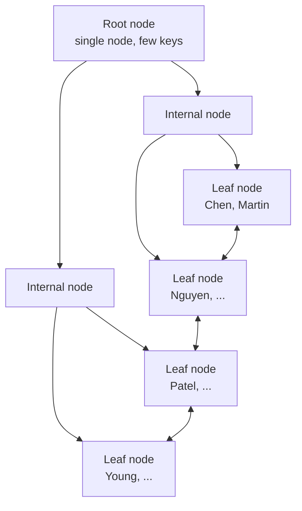

I have a clear picture of the handbook structure and conventions. Section 72 is the first (empty) file in the `9-Optimization` category. Now I'll write the comprehensive section.
Let me review the file for typos and clean up two artifacts.
The sample `orders` table lacks the `payment_reference` column used in later examples. Let me make the schema consistent.
The file's opening was corrupted — the first lines contain stray text and TOC items 1–5 are missing. Let me inspect the exact bytes and fix the file header.
The file has been corrupted by stray text. Let me read the full state and rebuild it properly.
The file's top is corrupted. Let me find where the real content starts and rewrite the file correctly.
(#b-tree-search--step-by-step) 12. [How the Optimizer Decides Whether to Use an Index](#how-the-optimizer-decides-whether-to-use-an-index) 13. [Do Indexes Always Make Queries Faster?](#do-indexes-always-make-queries-faster) 14. [When to Use an Index](#when-to-use-an-index) 15. [When NOT to Use an Index](#when-not-to-use-an-index) 16. [Types of Indexes at a Glance](#types-of-indexes-at-a-glance) 17. [NULL and Indexes](#null-and-indexes) 18. [Indexes and DML — The Write Cost](#indexes-and-dml--the-write-cost) 19. [Indexes and Constraints](#indexes-and-constraints) 20. [Edge Cases](#edge-cases) 21. [BAD vs BETTER Approaches](#bad-vs-better-approaches) 22. [Common Mistakes](#common-mistakes) 23. [Production Pitfalls](#production-pitfalls) 24. [Performance Implications](#performance-implications) 25. [Behavior Differences Across Engines](#behavior-differences-across-engines) 26. [Best Practices](#best-practices) 27. [Real-World Scenario](#real-world-scenario) 28. [Cross-References](#cross-references) 29. [Interview Questions](#interview-questions)

---

## In One Sentence

An **index** is an ordered, redundant data structure the database maintains on top of a table so that queries that filter, sort, or join on certain columns do not have to read the entire table.

---

## What Is an Index?

An index is a **separate structure stored on disk** that keeps a **sorted copy of a subset of a table's columns**, together with a way to locate the actual rows.

Think of a book:

- The **table** is the pages of the book, full of content.
- The **index** is the table of contents or the alphabetical back-of-book index: a small, sorted list that tells you which page to open instead of reading every page.

In database terms:

```text
Table  : stores the actual rows (the "data pages" / "heap").
Index  : stores sorted keys + pointers/references back to the rows.
```

The database can answer "find rows where `last_name = 'Patel'`" by:

1. Searching the sorted index in a few hops, and
2. Reading only the matching rows from the table.

Without an index it must look at **every single row** until it finds the matches.

### Key properties of a basic index

| Property                     | Explanation                                                                                                    |
| ---------------------------- | -------------------------------------------------------------------------------------------------------------- |
| **Sorted**                   | Keys are stored in order (by default ascending). This helps equality, range, `ORDER BY`, and `GROUP BY`.       |
| **Redundant**                | The index duplicates data that already exists in the table. It exists purely for speed.                        |
| **Maintained automatically** | The database updates all indexes on every `INSERT`, `UPDATE`, `DELETE`. No manual work — but you pay the cost. |
| **Not always used**          | The query optimizer decides whether an index is worth using. Existence of an index does not guarantee its use. |
| **Storage cost**             | An index consumes disk space, RAM, and cache.                                                                  |
| **Default type**             | The default in PostgreSQL, MySQL (InnoDB), SQL Server, and Oracle is a **B-tree** (balanced tree).             |

> Common misconception: "An index is a copy of the table." No — an index stores only the **indexed columns** (plus a pointer/row reference), not the whole row. It is deliberately small enough to scan quickly.

---

## Why Do Indexes Exist?

The core problem is **I/O**. Tables live on disk, and disk reads are orders of magnitude slower than CPU or memory access.

Without an index, a lookup is a **sequential scan**: read every page of the table and test every row. For a table with 10 million rows, finding one row means reading 10 million rows (well, all data pages). That is slow.

With an index, the database:

1. Reads only the small index pages (usually a handful), and
2. Then reads only the data pages that contain matching rows.

The fundamental goal of an index is therefore to **reduce the number of pages the database must read** — both index pages and data pages.

A second reason is **order**. Because indexes store keys in sorted order, the database can satisfy `ORDER BY`, `GROUP BY`, and range conditions without actually sorting the whole result set, which can be much cheaper.

A third reason is **unique enforcement**: a `UNIQUE` index guarantees that duplicate values are impossible. This is how primary key and unique constraints are physically enforced in every major engine.

> The index is a **space-for-time** trade-off: you trade disk space and write-time for read-time.

---

## What an Index Is NOT

- **NOT a random collection of references.** Indexes have a strict internal structure (typically a B-tree) that guarantees logarithmic lookups.
- **NOT required for a query to work.** Every query works without an index; it just may scan the whole table.
- **NOT always faster at the row level.** Getting one row out of a million-row table via an index is usually dramatically faster; getting 90% of the rows via an index is often slower than a plain scan.
- **NOT something you "put" on a query.** You create indexes on **tables and columns**, and the optimizer decides whether to use them.
- **NOT the same as a constraint.** An index is a physical structure; a constraint is a logical rule. But unique/PK constraints are _implemented_ with indexes.
- **NOT a materialized view.** A materialized view precomputes query results. An index stores only ordering/key information plus row locators.

---

## Sample Tables and Grain

Every indexing example below uses this schema. State the grain first, always.

```sql
CREATE TABLE employees (
    employee_id   INT PRIMARY KEY,
    first_name    VARCHAR(50) NOT NULL,
    last_name     VARCHAR(50) NOT NULL,
    email         VARCHAR(100) UNIQUE,
    hire_date     DATE NOT NULL,
    salary        DECIMAL(10,2),
    department_id INT,
    manager_id    INT
);

CREATE TABLE departments (
    department_id   INT PRIMARY KEY,
    department_name VARCHAR(100) NOT NULL,
    location        VARCHAR(100)
);

CREATE TABLE orders (
    order_id     INT PRIMARY KEY,
    customer_id  INT NOT NULL,
    employee_id  INT NOT NULL,
    order_date   DATE NOT NULL,
    status       VARCHAR(20) NOT NULL,
    payment_reference VARCHAR(50),
    total_amount DECIMAL(12,2) NOT NULL
);

CREATE TABLE order_items (
    order_id    INT NOT NULL,
    product_id  INT NOT NULL,
    quantity    INT NOT NULL,
    price       DECIMAL(10,2) NOT NULL,
    PRIMARY KEY (order_id, product_id)
);
```

| Table         | Grain                                                                |
| ------------- | -------------------------------------------------------------------- |
| `employees`   | One row = one employee.                                              |
| `departments` | One row = one department.                                            |
| `orders`      | One row = one order placed by one customer, handled by one employee. |
| `order_items` | One row = one line item (one product inside one order).              |

Sample data (small for reading; in real life these tables would have millions of rows):

```sql
INSERT INTO employees VALUES
(101, 'Alice',   'Chen',     'alice@co.com',    '2019-03-15', 95000.00,  1, NULL),
(102, 'Bob',     'Martinez', 'bob@co.com',      '2020-07-01', 72000.00,  1, 101),
(103, 'Charlie', 'Patel',    'charlie@co.com',  '2018-11-20', 110000.00, 2, 101),
(104, 'Diana',   'Kowalski', 'diana@co.com',    '2021-01-10', 68000.00,  2, 103),
(105, 'Eve',     'Nguyen',   NULL,               '2022-06-01', 85000.00,  1, 101),
(106, 'Frank',   'Singh',    'frank@co.com',    '2017-04-18', 125000.00, 3, NULL),
(107, 'Grace',   'Brown',    'grace@co.com',    '2023-09-05', 55000.00,  NULL, 106),
(108, 'Hank',    'Davis',    'hank@co.com',     '2020-02-28', NULL,       3, 106);

INSERT INTO departments VALUES
(1, 'Engineering',     'New York'),
(2, 'Marketing',       'San Francisco'),
(3, 'Human Resources', 'Chicago'),
(4, 'Finance',         'New York');

INSERT INTO orders VALUES
(5001, 9001, 101, '2025-01-05', 'completed', 1240.50),
(5002, 9001, 102, '2025-01-06', 'completed',   89.99),
(5003, 9002, 103, '2025-01-08', 'shipped',   4520.00),
(5004, 9003, 101, '2025-01-10', 'processing', 210.00),
(5005, 9004, 102, '2025-01-12', 'pending',     1500.00),
(5006, 9002, 101, '2025-01-15', 'cancelled',   120.00);

INSERT INTO order_items VALUES
(5001, 701, 2, 600.00),
(5001, 702, 1, 40.50),
(5002, 703, 3, 29.99),
(5003, 701, 4, 600.00),
(5003, 704, 2, 1060.00),
(5004, 705, 1, 210.00),
(5005, 706, 5, 300.00),
(5006, 702, 1, 40.50),
(5006, 703, 1, 29.99);
```

---

## How a Query Without an Index Works

Take this query:

```sql
SELECT employee_id, first_name, last_name, salary
FROM employees
WHERE last_name = 'Patel';
```

Without an index on `last_name`, the database performs a **full table scan**:

1. Read the first data page of the table.
2. For each row, compare `last_name = 'Patel'`.
3. If it matches, add it to the result.
4. Move to the next page. Repeat until the table ends.

```text
Read all N data pages  →  check M rows  →  return matches
```

Every row must be examined even if only one row matches. The cost is **O(N)** where N = number of rows (more precisely, number of data pages).

For small tables this is fine. For a 10-million-row table it is expensive.

---

## How an Index Works Internally

The default index type in all four major engines is a **B-tree** (technically a **_B+ tree_** in most implementations). It has these parts:



Properties of the B+ tree:

- **Balanced:** every leaf is at the same depth, so every lookup takes the same number of node visits.
- **Sorted:** leaf nodes contain keys in ascending order.
- **Leaf-to-leaf pointers:** leaves are linked, so a **range scan** walks sideways without jumping back to the root.
- **Fan-out:** each node holds many keys (typically hundreds), so the tree is very wide and shallow. A tree with millions of keys is usually only **3–4 levels deep**.

### What a leaf entry holds

A leaf entry contains:

1. The **indexed column value(s)** (the key), and
2. A **row locator** — the physical address of the row. In a heap-based engine (PostgreSQL, MySQL InnoDB) that is a pointer to the heap page; in a clustered index engine (InnoDB primary key, SQL Server clustered) the "leaf" _is_ the row.

> PostgreSQL / SQL Server: PostgreSQL tables are always heaps. SQL Server tables are either heaps (no clustered index) or a clustered index tree where the leaf _contains the whole row_.
>
> MySQL InnoDB: The primary key is a clustered index (row lives in its leaf). Secondary indexes store a copy of the primary key instead of a heap pointer. This matters for the "covering index" discussion (Section 74) and dual-primary-key locking (Sections 88–89).
>
> Oracle: Tables can be heaps or index-organized tables. B-tree indexes (including bitmaps — a different structure) store rowids in the leaves.

### Lookup cost

A point lookup in a B-tree is **O(log n)**: one node read per level, typically 3–4 page reads for a huge table, instead of scanning thousands of pages.

```
Query: last_name = 'Patel'

Index tree (3 levels):
  root    → contains a separator saying "Patel lives in branch 2"
  branch  → "Patel lives in leaf 3"
  leaf    → finds the key Patel → reads row pointer
  table   → reads only the row(s) that match
```

Compare:

| Strategy           | Pages read (approx, 10M-row table) |
| ------------------ | ---------------------------------- |
| Full table scan    | all data pages (say 100,000+)      |
| Index point lookup | ~3 index pages + 1 data page       |

---

## Syntax

Index creation is **not** part of ANSI SQL — it is an implementation feature, so each engine has its own syntax. The most common form is:

```sql
CREATE [UNIQUE] INDEX index_name
ON table_name (column_name [, column_name ...]);
```

### PostgreSQL

```sql
CREATE INDEX idx_employees_last_name
    ON employees (last_name);

CREATE UNIQUE INDEX idx_employees_email
    ON employees (email);

-- expression (functional) index
CREATE INDEX idx_employees_lower_email
    ON employees (LOWER(email));

-- partial index
CREATE INDEX idx_orders_open
    ON orders (order_date)
    WHERE status = 'pending';

DROP INDEX idx_employees_last_name;
```

### MySQL / MariaDB

```sql
CREATE INDEX idx_employees_last_name
    ON employees (last_name);

CREATE UNIQUE INDEX idx_employees_email
    ON employees (email);

-- or via ALTER TABLE
ALTER TABLE employees
    ADD INDEX idx_employees_last_name (last_name),
    ADD UNIQUE INDEX idx_employees_email (email);

DROP INDEX idx_employees_last_name ON employees;
```

### SQL Server

```sql
CREATE INDEX idx_employees_last_name
    ON employees (last_name);

CREATE UNIQUE INDEX idx_employees_email
    ON employees (email);

DROP INDEX idx_employees_last_name ON employees;
```

### Oracle

```sql
CREATE INDEX idx_employees_last_name
    ON employees (last_name);

CREATE UNIQUE INDEX idx_employees_email
    ON employees (email);

DROP INDEX idx_employees_last_name;
```

### Showing existing indexes

| Engine     | Statement                                                 | Details                     |
| ---------- | --------------------------------------------------------- | --------------------------- |
| PostgreSQL | `SELECT * FROM pg_indexes WHERE tablename = 'employees';` | Also `\d employees` in psql |
| MySQL      | `SHOW INDEX FROM employees;`                              |                             |
| SQL Server | `sys.indexes` / `sp_helpindex 'employees'`                |                             |
| Oracle     | `USER_INDEXES`, `USER_IND_COLUMNS`                        |                             |

### Automatic indexes from constraints

You do **not** need to create indexes for every primary key or unique constraint — the engine creates them automatically:

```sql
-- engine automatically creates a unique index on employee_id
ALTER TABLE employees ADD CONSTRAINT pk_employees PRIMARY KEY (employee_id);

-- engine automatically creates a unique index on email
ALTER TABLE employees ADD CONSTRAINT uq_employees_email UNIQUE (email);
```

> Common misconception: "The primary key is an index." More precisely, a primary key _constraint_ is enforced using a unique index that the engine creates for you. The two are linked but conceptually different — a primary key is a logical rule, the index is the physical mechanism.

You **do** usually want an index on foreign-key columns that appear in joins and filters:

```sql
CREATE INDEX idx_orders_customer_id  ON orders (customer_id);
CREATE INDEX idx_orders_employee_id  ON orders (employee_id);
CREATE INDEX idx_order_items_order_id  ON order_items (order_id);
```

> SQL Server automatically creates an index on FK columns unless one already exists. PostgreSQL, MySQL, and Oracle do not. This is a classic "my join is slow right after porting from SQL Server" trap.

---

## What an Index Can Speed Up

A single-column B-tree index can help with:

### 1. Equality filters

```sql
SELECT * FROM orders WHERE status = 'shipped';
```

### 2. Range filters

```sql
SELECT * FROM orders
WHERE order_date >= '2025-01-01'
  AND order_date <  '2025-02-01';
```

B-tree leaf ordering makes range scans cheap: find the start key, walk the leaf chain.

### 3. Sorted output (avoid a sort)

```sql
SELECT order_id, total_amount
FROM orders
ORDER BY order_date DESC;
```

If the index order matches the requested order, the engine reads leaves in order and skips the explicit `SORT` operation.

### 4. Grouping

```sql
SELECT status, COUNT(*) AS cnt
FROM orders
GROUP BY status;
```

Grouped rows can be pulled from the index already clustered by the grouping key (still needs an aggregate step, but avoids a sort/hash for grouping).

### 5. Join probes

```sql
SELECT o.order_id, e.last_name
FROM orders o
JOIN employees e ON e.employee_id = o.employee_id;
```

The inner side of a nested-loop join wants an index on the join column. For `orders JOIN employees ON employee_id`, an index (the PK index) on `employees.employee_id` lets the engine look each order's employee up directly.

### 6. Unique enforcement

```sql
CREATE UNIQUE INDEX uq_orders_payment_ref ON orders (payment_reference);
```

Every insert/update must check uniqueness — the index makes this check fast.

---

## Index Seek vs Index Scan vs Table Scan vs Heap Scan

These four terms are routinely confused. The distinction is crucial for reading execution plans.

| Term                       | What happens                                              | Typical trigger                                                                                      | Row volume touched |
| -------------------------- | --------------------------------------------------------- | ---------------------------------------------------------------------------------------------------- | ------------------ |
| **Table scan (heap)**      | Reads every data page of a heap table                     | no useful index, table without clustered index (PostgreSQL, InnoDB secondary-table, SQL Server heap) | all rows           |
| **Table scan (clustered)** | Reads every leaf page of the clustered index              | no useful nonclustered index (InnoDB PK, SQL Server clustered)                                       | all rows           |
| **Index scan**             | Reads the whole index (all leaf pages) in key order       | index exists but query wants many rows, or wants the sorted order, or is covering                    | all index entries  |
| **Index seek**             | Navigates the tree to a specific key, reads a small range | equality or selective range predicate                                                                | few entries        |

Thinking checklist:

- **Seek** = point/narrow lookup. Fast.
- **Scan over index** = read everything, but the index is small and maybe already sorted / covering.
- **Scan over table/heap** = read all rows. The baseline cost everything is compared against.

Example plans (PostgreSQL `EXPLAIN`):

```text
-- equality on a non-indexed column → sequential scan
Seq Scan on employees
  Filter: (last_name = 'Patel')

-- same query after creating an index → index seek + heap fetch
Index Scan using idx_employees_last_name on employees
  Index Cond: (last_name = 'Patel')
```

---

## B-Tree Search — Step by Step

Search for `last_name = 'Patel'` with a B-tree index. Say the tree has:

- Root: `['Chen', 'Nguyen', 'Young']`
- Branch pointers: `< Chen`, `Chen–Nguyen`, `Nguyen–Young`, `> Young`

Steps:

1. **Root:** is `Patel < Chen`? No. Between `Chen` and `Nguyen`? No — `Patel` is between `Nguyen` and `Young`? No wait, alphabetically `Patel` > `Nguyen` and < `Young`. Go to the branch "Nguyen–Young".
2. **Branch:** find the leaf that could hold `Patel`.
3. **Leaf:** scan forward until key ≥ `Patel`; read the row pointer.
4. **Table:** fetch the row.

Each node visit is one page read. Depth is roughly `log_fanout(number of keys)`. For 10 million keys with fan-out ~200, depth ≈ 4. So about **4 page reads** total, versus potentially **hundreds of thousands** for a scan.

---

## How the Optimizer Decides Whether to Use an Index

An index is **never guaranteed to be used**, even when it exists and matches the predicate. The cost-based optimizer (CBO) estimates the cost of candidate plans and picks the cheapest. It roughly evaluates:

1. **Selectivity:** what fraction of rows match? A `WHERE status = 'shipped'` where 80% of orders are shipped will probably be a scan — reading 80% of pages through a pointer is more work than reading them sequentially.
2. **Statistics:** histograms and distinct-count estimates per column. Stale statistics mislead the optimizer (Section 79).
3. **Table size:** a 100-row table is likely scanned even with an index — the scan fits in a few pages.
4. **Query needs:** if you `SELECT *`, the engine must visit the table for non-indexed columns; each fetch may be a separate page read. If the table is huge and the matches plentiful, scan wins.
5. **Ordering requirements:** if the query needs sorted output and the index provides it, the optimizer avoids a sort and may favor the index.
6. **Coverage:** if the index contains every column the query touches, the engine never visits the table at all (covering index — Section 74).

> Production pitfall: "I created an index and my query still scans." Create the index, then **look at the execution plan**. The optimizer may have decided the scan is cheaper given the row distribution, or the query may be written in a non-sargable way (Section 77) so the index can't be used, or statistics are stale (Section 79). Blindly adding more indexes is not a fix.

Key rule: index usefulness is a **continuum**, not a binary. The optimizer decides based on estimated page reads.

```text
Row matching fraction  →  roughly:
    < 5%  : index seek likely
    5-10% : borderline
    > 10% : scan likely
```

These numbers vary wildly by engine, table size, and storage; always verify with `EXPLAIN`.

---

## Do Indexes Always Make Queries Faster?

**No.** This is the single most important truth in this section.

An index is a _possible_ fast path, but it has real costs:

| Cost                    | Explanation                                                                                                                          |
| ----------------------- | ------------------------------------------------------------------------------------------------------------------------------------ |
| **Write amplification** | Every `INSERT`, `UPDATE`, `DELETE` must maintain each index on the table. More indexes = slower writes.                              |
| **Storage**             | Each index consumes disk and memory (and bloats the size of backups).                                                                |
| **Maintenance**         | Updates that change indexed columns cause index rewrites; heavy DML causes index bloat/fragmentation that needs `REINDEX`/`REBUILD`. |
| **Read overhead**       | If the optimizer picks the index for a low-selectivity query, the extra "row lookups by pointer" can be _slower_ than a plain scan.  |
| **Optimizer error**     | With stale statistics, the optimizer may pick a bad index plan.                                                                      |

> Common misconception: "Adding an index always improves performance." It improves **specific read queries**, at the expense of write performance, disk, and cache. A table used mainly for writes with 10 pointless indexes can be slower overall than one with zero indexes.

The honest statement is:

> An index makes some queries faster and makes all writes (and some reads) more expensive. Whether the trade-off is worth it depends on the workload. Verify with execution plans and realistic test data.

---

## When to Use an Index

1. **Column in `WHERE` with high selectivity** — e.g., `email`, `order_id`, `payment_reference`.
2. **Foreign-key columns** used in frequent joins — `orders.customer_id`, `order_items.order_id`.
3. **Columns used in `ORDER BY` / `GROUP BY`** where you want to avoid sorting.
4. **Columns used in range predicates** — dates, prices, IDs.
5. **Columns that enforce uniqueness** — primary keys and unique constraints (automatic).
6. **Small "stable" reference tables** that are frequently looked up — e.g., looking up a status by code.
7. **Hot paths measured in the execution plan** — an empirical signal that an index pays off.

---

## When NOT to Use an Index

1. **Very small tables.** Scanning 100 rows is cheaper than maintaining an index.
2. **Not low-selectivity columns** — `gender`, `status` with 3 possible values, boolean flags, country on a mostly single-country dataset. The optimizer will usually scan anyway.
3. **Write-heavy tables with many indexes already.** Each new index slows every insert/update.
4. **Columns frequently updated to new values.** Each update of an indexed column costs an index delete + insert.
5. **You haven't measured.** Index design without an execution plan is guesswork (Section 83).
6. **OLAP/analytical workload that always aggregates the entire table.** Warehouse tables that are always scanned (and rewritten in batch) rarely benefit from many indexes — they benefit from columnar layout, partitioning, or separate aggregate tables, none of which are "indexes."

---

## Types of Indexes at a Glance

This section is an overview. The deep dives come in later sections.

| Type                         | Idea                                                | Deep-dive section                                  |
| ---------------------------- | --------------------------------------------------- | -------------------------------------------------- |
| **B-tree (default)**         | sorted tree for equality + range + order            | this section                                       |
| **Unique**                   | enforces uniqueness                                 | this section                                       |
| **Composite (multi-column)** | index on several columns, leftmost-prefix rule      | Section 73                                         |
| **Covering (INCLUDE)**       | extra columns stored in leaf to avoid table lookups | Section 74                                         |
| **Clustered / nonclustered** | whether the table's row data lives inside the index | Section 75                                         |
| **Partial / filtered**       | index only on a subset of rows                      | Section 76                                         |
| **Expression / functional**  | index on a computed value                           | Section 77 (sargability)                           |
| **Hash**                     | ultra-fast equality, no order/range                 | PostgreSQL, MySQL 8+, SQL/Microsoft, Oracle hybrid |
| **Full-text**                | word/fuzzy text search                              | not covered in depth                               |
| **GIN / GiST (PostgreSQL)**  | array, JSONB, text-search, spatial                  | not covered in depth                               |
| **Bitmap (Oracle)**          | low-cardinality columns in warehouses               | not covered in depth                               |

Keep the B-tree default in mind through the whole handbook.

---

## NULL and Indexes

NULL handling in indexes is subtle and engine-dependent.

### NULLs are stored in B-tree indexes

A normal B-tree index **does** store rows where the indexed column is NULL. That means predicates like `WHERE email IS NULL` and `WHERE email IS NOT NULL` **can** use an index. This is a very common interview/real-world confusion because NULL comparisons in SQL evaluate to `UNKNOWN` — but that applies to _query predicates_, not to _index content_.

```sql
SELECT employee_id, first_name, last_name
FROM employees
WHERE email IS NULL;          -- Eve's row (email = NULL)
```

| employee_id | first_name | last_name |
| ----------- | ---------- | --------- |
| 105         | Eve        | Nguyen    |

This can use `idx_employees_email` just as `WHERE email = 'eve@co.com'` would.

### UNIQUE index and NULL

Standard SQL says NULL is not equal to NULL, so a unique index may contain **multiple NULLs**.

```sql
CREATE UNIQUE INDEX uq_orders_payment_ref ON orders (payment_reference);
```

| payment_reference   | Allowed?                                      |
| ------------------- | --------------------------------------------- |
| `NULL` (row 1)      | yes                                           |
| `NULL` (row 2)      | yes — two NULLs are not considered duplicates |
| `'PAY-001'`         | yes                                           |
| `'PAY-001'` (again) | **no** — duplicate rejected                   |

> PostgreSQL: correct — multiple NULLs allowed in a unique index. That is the standard behavior.
>
> SQL Server / MySQL: also allow multiple NULLs in a unique index by default.
>
> Oracle: B-tree unique indexes **also** allow multiple NULLs (NULLs are not indexed in older Oracle behavior for single-column unique indexes — an often-asked trick question). A historical quirk: Oracle explicitly treats rows with NULL in all indexed columns as non-duplicates; with a purely NULL-only key the row is typically not indexed at all, so `WHERE col IS NULL` may not use the index. Oracle 23c changed some NULL handling; verify on your version.

### The subtlest trap: a second nullable column

If you build a unique index on `(order_id, product_id)` and one column is NULL, the NULL-collision rule above applies to the _composite_ key. Two rows `(100, NULL)` and `(100, NULL)` are both allowed because the composite keys are not equal (NULL ≠ NULL). This has caused real data-quality bugs.

> Interview trap: "Does `CREATE UNIQUE INDEX ... (col)` allow two NULLs?" Standard answer: yes. Oracle-specific nuance: explain what happens with a _composite_ unique index, and that `IS NULL` may not be index-usable on Oracle B-trees in older versions.

### NULL and `COUNT(column)` / `COUNT(*)`

Indexes do not change the semantics of `COUNT`, but they can change the _speed_:

- A covering index lets `COUNT(column)` avoid reading the table (Section 74).
- `COUNT(*)` on PostgreSQL can use an index; MySQL InnoDB keeps a row count only for `WHERE ... =` clauses; system tables differ.

Remember the semantic rule: `COUNT(column)` only counts non-NULL values (Section 39).

---

## Indexes and DML — The Write Cost

Every modification to a table must keep its indexes consistent.

### INSERT

For each index on the table, the engine inserts a new key into the right position in the B-tree. If a leaf page is full, the tree **splits** — extra I/O. Many small inserts into a random key cause page splits and index fragmentation.

### UPDATE

If the updated column is indexed, the engine effectively **deletes the old key and inserts a new one** in the index. If only non-indexed columns change, the index is untouched.

### DELETE

Deleting a row removes its keys from every index. In MVCC engines (PostgreSQL, InnoDB) the entry is marked dead first and physically removed by `VACUUM`/purge later. That creates transient "index bloat" after large deletes.

### Big picture

| Operation                        | Cost without index   | Cost with one index                   |
| -------------------------------- | -------------------- | ------------------------------------- |
| `SELECT` by the column           | scan the whole table | seek (usually much cheaper)           |
| `INSERT`                         | write the table      | write the table + insert a sorted key |
| `DELETE`/`UPDATE` of indexed col | write the table      | write the table + delete/insert keys  |

So indexes shift work from **read time** to **write time**. That is the fundamental, inescapable trade-off.

> Production pitfall: After mass updates/deletes in PostgreSQL, run `VACUUM`/`REINDEX` or let autovacuum work; in SQL Server, `ALTER INDEX ... REBUILD`; in MySQL InnoDB, watch `OPTIMIZE TABLE`. Bloat silently makes index scans slower (Section 82).

---

## Indexes and Constraints

- **PRIMARY KEY** → implemented with a unique index (automatic).
- **UNIQUE** → implemented with a unique index (automatic).
- **FOREIGN KEY** → **no index created automatically** in PostgreSQL/MySQL/Oracle. SQL Server creates one automatically. Missing FK indexes cause slow child-side lookups when joining, and can cause **locks that lock the parent table** during child deletes/updates (because the engine must probe the child table for referencing rows).
- **CHECK** → no index involvement.

```sql
-- always useful after adding an FK
CREATE INDEX idx_orders_customer_id ON orders (customer_id);
CREATE INDEX idx_order_items_order_id ON order_items (order_id);
```

> Production pitfall: A missing index on an FK column can turn deletes against a parent row into a full child-table scan and escalate locking. Schema-makers usually ensure FK indexes exist on reference tables — even if the ORM "doesn't need them."

---

## Edge Cases

| Edge case                                             | What happens                                                                                                                                     |
| ----------------------------------------------------- | ------------------------------------------------------------------------------------------------------------------------------------------------ |
| **Index on empty table**                              | Works; no benefit until data arrives.                                                                                                            |
| **Index selectivity exactly 100%**                    | `WHERE unique_col = x` → one row found via seek.                                                                                                 |
| **Very selective but query returns all columns**      | Seek finds few row locators, then row lookups; still fast.                                                                                       |
| **Low selectivity + big table**                       | Optimizer scans; index unused.                                                                                                                   |
| **Leading wildcard `LIKE '%patel'`**                  | Cannot use a normal B-tree; `LIKE 'patel%'` can (Section 77).                                                                                    |
| **Function on column `WHERE UPPER(last_name) = ...`** | Index on `last_name` unusable without an expression index.                                                                                       |
| **Implicit type coercion**                            | `WHERE employee_id = '101'` may disable index use depending on engine/typed literal handling.                                                    |
| **NULL comparisons**                                  | `IS NULL` / `IS NOT NULL` usable; `NULL = NULL` returns UNKNOWN (nothing) at the SQL layer (Sections 09–10).                                     |
| **Case-insensitive collation**                        | Index is only directly usable for the collation it was built with; a different collation/`COLLATE` on a literal can block use.                   |
| **`ORDER BY` descending vs index ascending**          | Many engines scan a B-tree backwards for free, so an ascending index still serves `ORDER BY ... DESC`; a few optimizers prefer matching indexes. |
| **`SELECT *` + index**                                | Extra heap/row lookups; may push optimizer to a scan.                                                                                            |
| **Multiple indexes on one table, OR'ed predicates**   | Engine may do bitmap OR / index merge (MySQL) or pick one.                                                                                       |
| **Tiny table + index**                                | Optimizer ignores the index — scanning wins.                                                                                                     |
| **Table with high insert/delete churn**               | Index bloat causes slowdowns until maintenance.                                                                                                  |

---

## BAD vs BETTER Approaches

### Scenario A — Finding one employee by last name

**BAD APPROACH:** no index, and the query constantly filters by a non-key column.

```sql
-- Table has millions of rows. No index on last_name.
SELECT employee_id, first_name, last_name, email
FROM employees
WHERE last_name = 'Patel';
```

Result under the hood: full table scan — every row examined.

**BETTER APPROACH:** verify the predicate is used in production, then create a targeted index and confirm with `EXPLAIN`.

```sql
CREATE INDEX idx_employees_last_name ON employees (last_name);
```

```text
Index Scan using idx_employees_last_name on employees
  Index Cond: (last_name = 'Patel')
```

Why: the lookup now reads ~4 index pages plus one data page instead of the whole table.

### Scenario B — Wrapping a column in a function

**BAD APPROACH:**

```sql
SELECT * FROM employees
WHERE EXTRACT(YEAR FROM hire_date) = 2021;
```

The B-tree index on `hire_date` cannot be used because the predicate applies a function to the column — the stored keys are raw dates, not years. Full scan.

**BETTER APPROACH:** use a safe range against the column itself (also sargability, Section 77):

```sql
SELECT * FROM employees
WHERE hire_date >= DATE '2021-01-01'
  AND hire_date <  DATE '2022-01-01';
```

An index on `hire_date` can serve this with an index seek + range walk.

> PostgreSQL also supports expression indexes (`ON employees (EXTRACT(YEAR FROM hire_date))`) — but only when the expression in the query matches the index expression exactly.

### Scenario C — Low-selectivity filter

**BAD APPROACH** (in expectation):

```sql
SELECT * FROM orders WHERE status = 'completed';
```

If 70% of orders are `completed`, an index on `status` is useless here; the optimizer will scan. You can force it with hints in some engines — and it will usually be slower.

**BETTER APPROACH:**

```sql
SELECT * FROM orders WHERE status = 'pending';
```

`pending` is rare (say 2%). A `status` index, or a **partial index** covering only pending rows (Section 76), is now genuinely useful. Verify with `EXPLAIN`.

### Scenario D — Sorting without an index

**BAD APPROACH** (no index support):

```sql
SELECT order_id, total_amount, order_date
FROM orders
ORDER BY order_date DESC;
```

Result: total sort of all rows (in memory or temp file on disk).

**BETTER APPROACH:**

```sql
CREATE INDEX idx_orders_order_date ON orders (order_date);
```

```sql
SELECT order_id, total_amount, order_date
FROM orders
ORDER BY order_date DESC;
```

Plan may now read leaves in reverse order and **skip the sort**. Verify in the plan: look for the absence of a `Sort` node and the presence of an `Index Scan Backward` (PostgreSQL) / `Ordered` index access.

### Scenario E — `SELECT *` vs selective columns

An index on `(last_name)` cannot answer `SELECT first_name ...` without a table look-up. If a query is hot and only needs a handful of columns, a **covering index** (Section 74) avoids table access entirely — but it stores duplicated data, so it must earn its keep.

---

## Common Mistakes

1. **Indexing every column "just in case."** Each index taxes every write. Only index columns that matter, measured by real queries.
2. **Indexing low-cardinality columns** (gender, booleans, 3-value statuses) and expecting seeks. Usually the scan wins.
3. **Not indexing FK columns**, then wondering why joins crawl (and why parent deletes take locks).
4. **Writing non-sargable predicates** (`WHERE YEAR(hire_date) = 2021`, `WHERE col + 1 = 50`) and blaming the index.
5. **Leading-wildcard searches** on huge text columns without a proper solution (full-text, trigram index, etc.).
6. **`SELECT *` everywhere**, forcing row lookups even when a covering index would have sufficed.
7. **Duplicating the primary key in another index** or creating redundant overlapping indexes (`idx(a)`, `idx(a,b)` is partially redundant for leftmost prefix).
8. **Assuming the index is used because it exists** — never validating with `EXPLAIN`.
9. **Creating many indexes during a one-time load** — loading data into a fully-indexed table is far slower than load-then-create-index.
10. **Forgetting the write trade-off** on hot OLTP tables.

---

## Production Pitfalls

> Production pitfall: **Index bloat after heavy DML.** In PostgreSQL, updated/deleted rows leave dead index entries until `VACUUM`; in SQL Server, fragmented B-trees slow scans; in InnoDB, purge lags under load. Monitor and run `REINDEX` / `ALTER INDEX ... REORGANIZE/REBUILD` / `OPTIMIZE TABLE` during maintenance windows (Section 82).

> Production pitfall: **Adding an index locks the table.** In many engines a plain `CREATE INDEX` blocks writes (PostgreSQL gains an advisory lock briefly but builds online via `CONCURRENTLY`; MySQL `ALGORITHM=INPLACE` historically allowed DML; SQL Server online builds need `ONLINE=ON` on Enterprise; Oracle 12c+ defaults online). On large production tables, use the engine's online build option and test on a staging replica first.

> Production pitfall: **Indexing a hot write column.** An often-updated indexed column causes a delete+insert in the index on every update, amplifying write latency and index churn. Measure update frequency before indexing.

> Production pitfall: **Missing FK index → parent-table locks.** Deleting/updating a parent row makes the engine probe children; without an FK index that probe becomes a child scan, and under concurrency it escalates to locks that stall inserts. See Sections 15, 88–89.

> Production pitfall: **Statistics staleness.** The optimizer decides whether to use your index based on statistics. If stats are stale after big changes, the new index may be ignored or misused (Section 79).

---

## Performance Implications

### Always measure

Whether an index "helps" is decided by the query optimizer, which depends on:

- optimizer version and cost model
- indexes available
- statistics / histograms
- cardinality and data distribution
- query shape and predicates
- database engine and storage layout
- the execution plan it actually picks

Therefore never claim "index X makes query Y faster" without:

1. `EXPLAIN` (how it _plans_ to run), and
2. `EXPLAIN ANALYZE` / actual execution times (how it _actually_ runs), on realistic data.

### What to look for in a plan

| Plan signal                                            | Meaning                                               |
| ------------------------------------------------------ | ----------------------------------------------------- |
| `Seq Scan` / `Table Scan` on a big table               | full scan — possibly missing index or low selectivity |
| `Index Scan` / `Index Seek`                            | using the index for the predicate or range            |
| `Sort` node                                            | no index supported the `ORDER BY`                     |
| `Bitmap Heap Scan` (PostgreSQL) / `INDEX SKIP` (MySQL) | re-strengthening from multiple matches                |
| row-estimate wildly off                                | stale statistics                                      |

> PostgreSQL: `EXPLAIN ANALYZE SELECT ...` executes the query.
>
> MySQL/MariaDB: `EXPLAIN ANALYZE` (8.0.18+) or `EXPLAIN FORMAT=JSON` with `EXPLAIN ANALYZE`; `SHOW WARNINGS` can reveal rewrites.
>
> SQL Server: `SET STATISTICS IO ON; SET STATISTICS TIME ON;` plus the graphical plan / `SET SHOWPLAN_TEXT ON`; capture `logical reads` numbers.
>
> Oracle: `EXPLAIN PLAN FOR ...` combined with `DBMS_XPLAN.DISPLAY`, or `DBMS_SQLTUNE`.

### Real numbers, not vibes

A single full-table scan with no index movement might beat a bogus index plan on a 100-row table. Index decisions only matter at scale. Benchmark on realistic volume (millions of rows) — LeetCode-scale 100-row tables hide all index effects:

> Common misconception: "On my 98-row test table the index did nothing, so indexes don't matter." Indexes matter proportionally to table size. Test with production-scale volume or you are measuring nothing.

### Read amplification: the hidden cost

An "Index Scan" on `SELECT *` performs **one extra row fetch per matched row**. If 10,000 rows match, that's 10,000 pointer-fetches — each potentially a separate page read. A sequential scan reads pages once and streams. This is _why_ selectivity determines index usefulness, and _why_ covering indexes (Section 74) are a thing.

---

## Behavior Differences Across Engines

| Aspect                         | PostgreSQL                          | MySQL (InnoDB)                                               | SQL Server                                       | Oracle                                             |
| ------------------------------ | ----------------------------------- | ------------------------------------------------------------ | ------------------------------------------------ | -------------------------------------------------- |
| Default index                  | B-tree                              | B-tree (clustered PK)                                        | B-tree (clustered or heap)                       | B-tree, bitmap optional                            |
| Tables are                     | heap                                | clustered-by-PK (heap-like for secondary)                    | clustered or heap (you choose)                   | heap or index-organized                            |
| Auto index for FK              | no                                  | no                                                           | yes                                              | no                                                 |
| Online create                  | `CREATE INDEX CONCURRENTLY`         | `ALGORITHM=INPLACE, LOCK=NONE` (online DDL)                  | `CREATE INDEX ... WITH (ONLINE=ON)` (Enterprise) | 12c+ online by default if possible                 |
| Multiple NULLs in unique index | yes                                 | yes                                                          | yes                                              | yes (with historical single-column NULL quirk)     |
| Covering `INCLUDE`             | yes                                 | later versions (functional, invisible); `INCLUDE` unofficial | yes                                              | yes (12c+, as invisible column list)               |
| Partial/filtered index         | yes (WHERE)                         | no (until 8.0; "functional" partial not standard)            | yes (WHERE)                                      | no (function-based + virtual columns workarounds)  |
| Index maintenance command      | `REINDEX`, `VACUUM`                 | `OPTIMIZE TABLE`                                             | `ALTER INDEX ... REORGANIZE / REBUILD`           | `ALTER INDEX ... REBUILD`                          |
| Case sensitivity               | sensitive unless `citext`/`COLLATE` | per collation                                                | per collation                                    | per `NLS_SORT`                                     |
| `IS NULL` with index           | usable                              | usable                                                       | usable                                           | sometimes NOT usable on older B-tree single-column |

---

## Best Practices

1. **Start from real queries.** Collect slow queries, identify the predicates, and index those columns — not a speculative "every column" spree.
2. **State the grain and the driving table of each query** before diagnosing performance. A join's inner table benefits from the index; the outer table benefits less.
3. **Index FK columns** on every child of a reference relationship.
4. **Prefer equality columns leftmost, ranges later** (leftmost-prefix rule — Section 73).
5. **Match `ORDER BY`/`GROUP BY`** with index order to kill sorts.
6. **Make index names descriptive**: `idx_<table>_<columns>` or `idx_<table>_<purpose>`.
7. **Do not duplicate existing indexes** (`UNIQUE(col)`, `PRIMARY KEY (col)` already imply `col` is indexed — adding `idx(col)` is redundant).
8. **Measure before and after** with `EXPLAIN (ANALYZE, BUFFERS)` (PostgreSQL), `SHOW STATUS`/`EXPLAIN ANALYZE` (MySQL), `STATISTICS IO` (SQL Server), `DBMS_XPLAN` (Oracle).
9. **Use online builds** on live large tables and sheet-scope maintenance windows on write-heavy systems.
10. **Keep the index-to-write balance explicit:** the more writes and the more indexes, the more careful you must be.
11. **Retest after data-volume changes**; a query that loved the index at 1M rows may reject it at 100M (statistics, depth, memory).
12. **Remember partial and covering indexes exist** as targeted tools (Sections 74, 76) before accepting a full-column index.

---

## Real-World Scenario

**Problem.** An e-commerce app renders "my orders" on every login. The query:

```sql
SELECT order_id, order_date, status, total_amount
FROM orders
WHERE customer_id = 9002
ORDER BY order_date DESC;
```

`orders` has 20 million rows. `customer_id` is the FK to customers. There is **no index** on `customer_id`.

**Diagnosis (measure first).** `EXPLAIN ANALYZE` shows a full `Sequential Scan` over `orders` (~200k pages), with actual time in the hundreds of milliseconds each call. The `ORDER BY` adds a sort on top.

**Fix.**

```sql
CREATE INDEX idx_orders_customer_id_date
    ON orders (customer_id, order_date DESC);
```

Because the index key matches both the filter (equality on `customer_id`) and the order (descending `order_date`), the engine can:

- seek to `customer_id = 9002`,
- walk leaves in order (no sort),
- read the few matching rows.

Also add the FK index habit:

```sql
CREATE INDEX idx_order_items_order_id ON order_items (order_id);
```

**Verify.** `EXPLAIN ANALYZE` now shows `Index Scan using idx_orders_customer_id_date` with a narrow `Index Cond` and no `Sort`. Latency drops dramatically. If the page-fetch for `status`/`total_amount` still shows up, evaluate a covering `INCLUDE` (Section 74).

**Why it works.** The read was converted from "touch every data page" to "navigate a small tree and fetch a handful of rows." The trade-off: inserts into `orders` now maintain one extra B-tree. For a customer-facing OLTP table, that is usually an acceptable price — but it is a _trade-off_ you the engineer chose, not a free lunch.

---

## Cross-References

- **Composite indexes and the leftmost-prefix rule** — `73-Composite-Indexes`
- **Covering indexes (INCLUDE)** — `74-Covering-Indexes`
- **Clustered vs nonclustered storage** — `75-Clustered-vs-Nonclustered`
- **Partial/filtered indexes** — `76-Partial-Filtered-Indexes`
- **Sargability and expression indexes** — `77-SARGability`
- **Reading execution plans** — `78-EXPLAIN-Execution-Plans`
- **Cardinality, statistics, stale stats** — `79-Cardinality-and-Statistics`
- **Join algorithms and index probes** — `32-Join-vs-Subquery`, `80-Join-Algorithms`
- **Optimization pitfalls, bloat, fragmentation** — `82-Performance-Pitfalls`
- **Index design strategy end-to-end** — `83-Index-Design-Strategy`
- **Indexes + pagination/keyset** — `84-Pagination-and-Keyset-Pagination`
- **FK enforcement, ON DELETE behavior** — `04-Constraints-Keys`, `92-Keys-and-Relationships`
- **NULL semantics that indexes can clarify** — `09-NULL-Deep-Dive`, `10-Three-Valued-Logic`
- **Locks/deadlocks interacting with index choice** — `88-Locks-and-Blocking`, `89-Deadlocks`
- **Counting and index scans** — `38-COUNT-SUM-AVG-MIN-MAX`, `39-COUNT-NULL-Pitfalls`

---

# Interview Questions

## Beginner

1. What is an index, in plain language?
2. Why would a database not automatically index every column?
3. What is a "full table scan" and why is it slow on large tables?
4. Roughly how many page reads does a B-tree point lookup need on a 10-million-row table, and why so few?
5. Do primary keys and unique constraints need you to create indexes manually? Why or why not?
6. Does a `WHERE status = 'active'` predicate on a column where 90% of rows are 'active' typically use an index? Why?
7. What is the difference between an index **scan** and an index **seek**?
8. Can an index help with `ORDER BY`? How?
9. What does `CREATE UNIQUE INDEX` guarantee that `CREATE INDEX` does not?
10. Where would the schema above (employees with `email UNIQUE`) store the null email for employee Eve, and can `WHERE email IS NULL` use the index?

## Intermediate

11. Explain the read/write trade-off of adding an index. Give a concrete scenario where a new index makes the system slower overall.
12. What is selectivity, and how does it influence the optimizer's decision to use an index?
13. Why is an index on a foreign-key column recommended, even though it's "just a join column"?
14. `WHERE salary >= 5000 AND salary < 10000` — is a B-tree index on salary usable here? What about `WHERE salary > 10000`?
15. Your `CREATE INDEX` seems to do nothing for the query. List the first three things you would check in the execution plan.
16. What happens inside the B-tree when you insert a value into a full leaf page?
17. Why does `SELECT *` from a table with an index on `(customer_id)` still touch the table? When would it _not_?
18. Which of the following can use a B-tree index and which cannot: `LIKE 'pat%'`, `LIKE '%pat'`, `EXTRACT(YEAR FROM hire_date) = 2021`, `hire_date BETWEEN ... AND ...`?

## Advanced

19. Describe the internal structure of a B+ tree: root, internal nodes, leaves, and the leaf-to-leaf links, and why the leaves are linked.
20. Walk through how the cost-based optimizer estimates whether a scan or an index seek is cheaper for `WHERE col = x`. What inputs feed the estimate?
21. Why can a low-selectivity index plan be _slower_ than a scan even when the indexes exist? Explain "row lookup by pointer" and page reads.
22. How does index choice interact with MVCC bloat in PostgreSQL and InnoDB purge, and what maintenance is needed after mass deletes?
23. A `WHERE` clause on two columns `a AND b` — can a single-column index on `a` be useful, and what kind of plan (bitmap/merge) might the engine build to combine two separate indexes?
24. Explain why the optimizer may refuse to use an index when a _literal differs in collation/case_ from what the index was built with.

## Scenario Based

25. `orders` (20M rows) filters by `customer_id` and sorts by `order_date DESC`. Design the index, state the grain, and explain why one multi-column index can serve both.
26. An app's home page runs `WHERE status = 'shipped'`. Should you index `status`? What production signal would you collect before deciding?
27. A `SELECT *` on a hot write-heavy table is slow because of missing indexes. Propose a plan that respects the write trade-off, and say which queries you would _definitely_ index.
28. A delete job runs `DELETE FROM orders WHERE order_date < ...` nightly. What index helps and what maintenance follows the deletes?
29. An auditor query hits `WHERE customer_id IN (9001,9002,9003)` on a 100M-row table. Which index shape do you propose and what plan would you expect?

## Tricky

30. `CREATE UNIQUE INDEX uq ON t (a)` where `a` is nullable — two rows with `a = NULL` are allowed. Why?
31. On Oracle (older versions), why might `WHERE a IS NULL` not use a B-tree index on `a`, while `WHERE a = 5` does? How does PostgreSQL differ?
32. Query `WHERE col = '101'` on an integer column — can the index still be used, and what does “implicit type conversion” do to you in different engines?
33. You created `idx (last_name)` and the plan shows `Seq Scan`. List at least four independent legitimate reasons the optimizer might scan.
34. Explain the trap in indexing `(a, b)` when queries also use `WHERE b = ...` without `a`. When is the index usable, when not, and what does the leftmost-prefix rule have to do with it?

## Output Prediction

35. Predict which of these plans PostgreSQL would produce after `CREATE INDEX idx ON employees (last_name)`:

```sql
SELECT employee_id FROM employees WHERE last_name = 'Patel';
```

86 rows in `departments`; 8 employees; index exists and stats are fresh. Do you predict Index Scan or Seq Scan, and why?

36. For `SELECT employee_id, first_name FROM employees WHERE last_name = 'Patel'` with index on `(last_name)` only, the plan shows `Index Scan` — how many pages would you expect to read: 1, 2, ~4, or a full scan? Justify.

37. Given a unique index on `orders.payment_reference`, predict the outcome of these inserts and explain:

```sql
INSERT INTO orders (order_id, customer_id, employee_id, order_date, status, total_amount, payment_reference)
VALUES (6001, 9001, 101, '2025-02-01', 'pending', 10.00, NULL);

INSERT INTO orders (order_id, customer_id, employee_id, order_date, status, total_amount, payment_reference)
VALUES (6002, 9002, 102, '2025-02-02', 'pending', 20.00, NULL);

INSERT INTO orders (order_id, customer_id, employee_id, order_date, status, total_amount, payment_reference)
VALUES (6003, 9003, 103, '2025-02-03', 'pending', 30.00, 'PAY-900');
```

## Debugging

38. A query that "should" use an index keeps full-scanning. Walk through your debugging sequence: EXPLAIN, the predicate shape, stats, and selectivity — in that order.
39. After a big batch delete, index queries got _slower_, not faster. What happened and what do you do?
40. A developer "fixed" a slow query by creating an index, but the write path (INSERT latency) collapsed in production. What did they ignore, and how would you validate the change before merging?
41. The plan says `Index Scan` but the query is still slow. What is the next thing to check about the number of matched rows and row lookups? What plan node would reveal the problem?
42. Two identical-looking queries on the same column — one seeks, one scans. Candidates: data type mismatch on the literal, collation/case, stale stats, or `SELECT *`. How do you isolate which?

## Performance

43. You are told "indexes always speed up reads." Give the counterexample you would verify with an execution plan.
44. What exact EXPLAIN output would prove your index was used for the predicate, for the ORDER BY, and for avoiding a sort? Give an example plan snippet per case.
45. How do you benchmark whether an index helps, given a real production-sized table and a representative query set? Which engine-specific tools do you use (one per engine)?
46. Which page-level metric ties index usefulness to reality: how do “logical reads” (SQL Server) or “buffers” (PostgreSQL) change between scan and seek, and why is that the number to watch?
47. Design the _minimum_ index set for a table with a PK, an FK join column, a monthly range filter, and a status column with 2 values — justify each index and explicitly refuse redundant ones.
