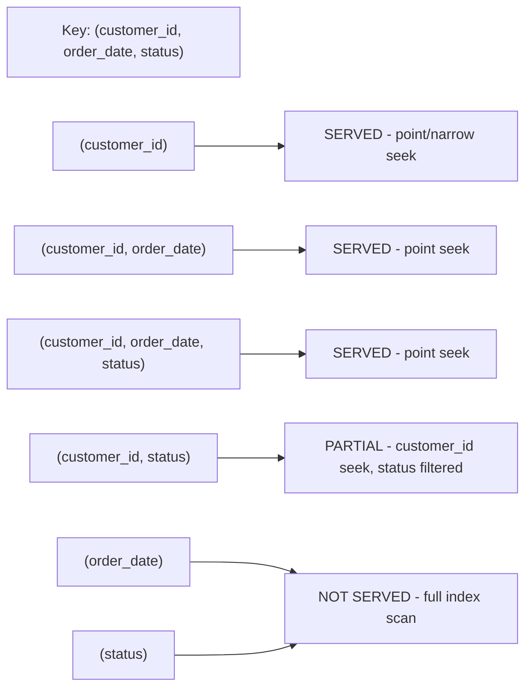

The file `73-Composite-Indexes.md` exists but is empty. I'll generate the section following the conventions established in `72-Indexes-Basics.md`.
Generated `73-Composite-Indexes.md` (940 lines) in `sql-handbook/9-Optimization/`, following the style of `72-Indexes-Basics.md`.

Covers:

- **Fundamentals** — what a composite index is, the dictionary analogy, leftmost-prefix rule, why it exists
- **Internals** — composite B-tree keys, comparison order, Mermaid tree and prefix-usage diagram
- **Column-ordering golden rules** — equality first, selectivity among equals, `ORDER BY` direction matching
- **Key-usage master table**, equality-vs-range worked example, sort-order matching
- **Unique composite + NULL** — the soft-delete tombstone pitfall, engine NULL quirks
- **Composite vs multiple single-column indexes** comparison table
- **Covering behavior**, NULL behavior, edge cases, BAD vs BETTER approaches
- **Common mistakes, production pitfalls, performance verification** (EXPLAIN signals incl. MySQL `key_len`, dialect differences table, best practices)
- **Real-world scenario** (50M-row orders page) and **cross-references**
- **Interview Questions** across Beginner/Intermediate/Advanced/Scenario/Tricky/Output Prediction/Debugging/Performance (no answers attached)
  5-01-12)

````

Once you reach a new `customer_id`, the `order_date` ordering **resets**. This is exactly like words in a dictionary: ordered by first letter, and *only within the same first letter* by second letter. It is *not* a separate index on each column.

> Common misconception: "A composite index `(a, b)` is two indexes: one on `a` and one on `b`." No. It is **one** index over the pair. That single index can serve queries on `a` alone (the leftmost prefix), but it **cannot** efficiently serve queries on `b` alone. Also note that two single-column indexes `(a)` and `(b)` are **not** the same as one composite `(a, b)` — a composite index keeps `a` rows physically adjacent to matching `b` values, and the tree only has to be searched once.

### One key difference to internalize

| Structure | Physically stores | Can efficiently serve `WHERE b = ...`? |
|---|---|---|
| Index `(a)` | sorted by `a` | no (`b` not present) |
| Index `(b)` | sorted by `b` | yes |
| Composite `(a, b)` | sorted by `(a, b)` | **no** — unless `a` is also constrained, the tree has to scan everything |
| Composite `(b, a)` | sorted by `(b, a)` | yes, because `b` is the leftmost prefix |
| Two indexes `(a)` + `(b)` | two separate trees | yes for each, but **no single tree sorts `a` within `b`** |

---

## Why Do Composite Indexes Exist?

Three practical needs push you from single-column indexes to composite ones:

### 1. Multi-column filters

```sql
SELECT * FROM orders
WHERE customer_id = 9002
  AND status = 'shipped';
````

Two separate single-column indexes (`(customer_id)` and `(status)`) force the optimizer to pick **one** and then filter the rest by scanning that result, or to use more complex index-merge/bitmap strategies. A composite `(customer_id, status)` lets the tree navigate directly to the exact slice that satisfies **both** conditions.

### 2. The join + filter pattern

```sql
SELECT ...
FROM orders o
JOIN customers c ON c.customer_id = o.customer_id
WHERE c.country = 'IN';
```

The child table (`orders`) is probed for each selected parent row. A composite `(customer_id, order_date)` on `orders` is a single structure the probe can use.

### 3. Removing duplicate work

A composite index can serve multiple query shapes at once (equality on the left columns, range/order on the right columns), which means **fewer total indexes** — and fewer indexes means cheaper writes. The leftmost-prefix rule (below) is precisely what makes one composite index cover several queries.

> A composite index is not simply a "speed thing". It is also a **storage and write-cost decision**: one composite index can replace several single-column indexes, at the cost of being more opinionated about query shape.

---

## What a Composite Index Is NOT

- **NOT a separate index per column** — it is one tree over a concatenated key.
- **NOT a covering index by default** — it still needs a table lookup for columns outside its key, though the _indexed_ columns come back without touching the table (pure covering / `INCLUDE` is Section 74).
- **NOT order-agnostic** — column order in the key changes which queries it can serve (leftmost-prefix rule).
- **NOT a replacement for a unique constraint** — unless you make it `UNIQUE`, duplicates are still allowed.
- **NOT useful for every predicate on any listed column** — a condition on the _trailing-only_ column usually cannot use it.
- **NOT automatically "covering" both listed columns for all queries** — it covers only the columns physically in the key (and its row locator).

---

## Sample Tables and Grain

Same schema as Section 72. State the grain first, always.

```sql
CREATE TABLE employees (
    employee_id   INT PRIMARY KEY,
    first_name    VARCHAR(50) NOT NULL,
    last_name     VARCHAR(50) NOT NULL,
    email         VARCHAR(100) UNIQUE,
    hire_date     DATE NOT NULL,
    salary        DECIMAL(10,2),
    department_id INT,
    manager_id    INT
);

CREATE TABLE departments (
    department_id   INT PRIMARY KEY,
    department_name VARCHAR(100) NOT NULL,
    location        VARCHAR(100)
);

CREATE TABLE orders (
    order_id      INT PRIMARY KEY,
    customer_id   INT NOT NULL,
    employee_id   INT NOT NULL,
    order_date    DATE NOT NULL,
    status        VARCHAR(20) NOT NULL,
    total_amount  DECIMAL(12,2) NOT NULL
);

CREATE TABLE order_items (
    order_id    INT NOT NULL,
    product_id  INT NOT NULL,
    quantity    INT NOT NULL,
    price       DECIMAL(10,2) NOT NULL,
    PRIMARY KEY (order_id, product_id)
);
```

| Table         | Grain                                                   |
| ------------- | ------------------------------------------------------- |
| `orders`      | One row = one order placed by one customer.             |
| `order_items` | One row = one line item (one product inside one order). |

Sample data:

```sql
INSERT INTO departments VALUES
(1, 'Engineering',     'New York'),
(2, 'Marketing',       'San Francisco'),
(3, 'Human Resources', 'Chicago'),
(4, 'Finance',         'New York');

INSERT INTO employees VALUES
(101, 'Alice',   'Chen',     'alice@co.com',   '2019-03-15', 95000.00,  1, NULL),
(102, 'Bob',     'Martinez', 'bob@co.com',     '2020-07-01', 72000.00,  1, 101),
(103, 'Charlie', 'Patel',    'charlie@co.com', '2018-11-20', 110000.00, 2, 101),
(104, 'Diana',   'Kowalski', 'diana@co.com',   '2021-01-10', 68000.00,  2, 103),
(105, 'Eve',     'Nguyen',   NULL,             '2022-06-01', 85000.00,  1, 101),
(106, 'Frank',   'Singh',    'frank@co.com',   '2017-04-18', 125000.00, 3, NULL),
(107, 'Grace',   'Brown',    'grace@co.com',   '2023-09-05', 55000.00,  NULL, 106),
(108, 'Hank',    'Davis',    'hank@co.com',    '2020-02-28', NULL,       3, 106);

INSERT INTO orders (order_id, customer_id, employee_id, order_date, status, total_amount) VALUES
(5001, 9001, 101, '2025-01-05', 'completed',  1240.50),
(5002, 9001, 102, '2025-01-06', 'completed',    89.99),
(5003, 9002, 103, '2025-01-08', 'shipped',    4520.00),
(5004, 9003, 101, '2025-01-10', 'processing',  210.00),
(5005, 9004, 102, '2025-01-12', 'pending',    1500.00),
(5006, 9002, 101, '2025-01-15', 'cancelled',   120.00);

INSERT INTO order_items VALUES
(5001, 701, 2, 600.00),
(5001, 702, 1, 40.50),
(5002, 703, 3, 29.99),
(5003, 701, 4, 600.00),
(5003, 704, 2, 1060.00),
(5004, 705, 1, 210.00),
(5005, 706, 5, 300.00),
(5006, 702, 1, 40.50),
(5006, 703, 1, 29.99);
```

---

## How a Composite Index Works Internally

A composite index is still a **B-tree** (B+ tree). What changes is the **key**: the key is the concatenation of the columns, compared column-by-column in declared order.

### Simple dictionary analogy

A phone book sorted by `(last_name, first_name)`:

```text
Chen,    Alice
Davis,   Hank
Kowalski, Diana
Martinez, Bob
Nguyen,  Eve
Patel,   Charlie
Singh,   Frank
```

Because the whole list is sorted by `last_name` _first_, finding "the Chen family" is a narrow range. Finding "anyone named Alice" is **impossible** without scanning the whole book — Alice is not the leading key.

Now apply that to SQL keys. Declare:

```sql
CREATE INDEX idx_orders_customer_date
    ON orders (customer_id, order_date);
```

The B-tree sorts the following composite keys:

```text
(9001, 2025-01-05)
(9001, 2025-01-06)
(9001, 2025-01-15)
(9002, 2025-01-08)
(9002, 2025-01-15)
(9003, 2025-01-10)
(9004, 2025-01-12)
```

Comparison rule, used at every tree node:

```text
compare col[0] first
  → if equal, compare col[1]
  → if still equal, compare col[2]
  → ... and so on
```

```mermaid
flowchart TD
    Root[Root node<br/>key = customer_id separators]
    B1[Branch: 9001...9002]
    B2[Branch: 9002...9004]
    L1[Leaf: (9001, 2025-01-05)<br/>(9001, 2025-01-06)<br/>(9001, 2025-01-15)]
    L2[Leaf: (9002, 2025-01-08)<br/>(9002, 2025-01-15)]
    L3[Leaf: (9003, ...) (9004, ...)]
    Root --> B1
    Root --> B2
    B1 --> L1
    B1 --> L2
    B2 --> L3
    L1 <--> L2
    L2 <--> L3
```

To serve `WHERE customer_id = 9002 AND order_date >= '2025-01-10'`:

1. Navigate the tree using the **first** key component `9002` (like a point lookup).
2. Within the `9002` slice, the second component `order_date` is still sorted → walk forward from `(9002, 2025-01-10)` along the leaf chain.

That is why the rule "equality columns first, range column last" works: after an equality on the leading columns, the remaining indexed columns form a **contiguous, sorted sub-range**.

### Where the "leftmost-prefix rule" comes from

A predicate can use the index only if it constrains a **prefix of the key columns in order**. Formally, with key `(a, b, c)`:

| Query                             | Uses index for      | How                                                                                                         |
| --------------------------------- | ------------------- | ----------------------------------------------------------------------------------------------------------- |
| `WHERE a = 1`                     | seek on `a`         | full index usable, range-scan the `a=1` slice                                                               |
| `WHERE a = 1 AND b = 2`           | seek on `(a, b)`    | narrower slice                                                                                              |
| `WHERE a = 1 AND b = 2 AND c = 3` | seek on `(a, b, c)` | narrowest slice (point lookup)                                                                              |
| `WHERE a = 1 AND c = 3`           | partially           | `a` used for seek; `c` filtered after — the `c` values are not contiguous (because `b` varies between them) |
| `WHERE b = 2`                     | **no seek**         | `b` is not a leftmost prefix → index scan across all `a` values                                             |
| `WHERE b = 2 AND c = 3`           | **no seek**         | neither is leftmost                                                                                         |



---

## Syntax

Index creation is not part of ANSI SQL — it is engine syntax, but the four major engines agree on the shape:

```sql
CREATE [UNIQUE] INDEX index_name
    ON table_name (column_1 [, column_2, ...]) [ (with options) ];
```

### PostgreSQL

```sql
CREATE INDEX idx_orders_customer_date
    ON orders (customer_id, order_date);

-- fixed column order, descending on the second key
CREATE INDEX idx_orders_customer_date_desc
    ON orders (customer_id, order_date DESC);

-- unique composite (used to enforce one-row-per-pair)
CREATE UNIQUE INDEX uq_order_items
    ON order_items (order_id, product_id);

-- INCLUDE (extra non-key columns) - Section 74
CREATE INDEX idx_orders_customer_inc
    ON orders (customer_id)
    INCLUDE (status, total_amount);
```

### MySQL / MariaDB

```sql
CREATE INDEX idx_orders_customer_date
    ON orders (customer_id, order_date);

-- via ALTER TABLE
ALTER TABLE orders
    ADD INDEX idx_orders_customer_date (customer_id, order_date);

-- column order within key is what matters; order in the list = key order
ALTER TABLE order_items
    ADD PRIMARY KEY (order_id, product_id);
```

MySQL does **not** support descending index key directions for B-tree columns until 8.0 (and ignored there to a degree historically); order by mixing `DESC` in the index key works from 8.0. Verify against your version.

> MySQL (InnoDB): the primary key is a clustered index. Secondary indexes store **a copy of the PRIMARY KEY columns** at the leaf instead of a row pointer. So `idx_orders_customer_date` on `orders` stores `(customer_id, order_date, order_id)` internally — the trailing PK columns are physically present, which can matter for covering behavior (Section 74) and for unique secondary-index locking (Section 88).

### SQL Server

```sql
CREATE INDEX idx_orders_customer_date
    ON orders (customer_id, order_date);

CREATE INDEX idx_orders_customer_date_desc
    ON orders (customer_id, order_date DESC);

-- INCLUDE (extra keyless columns)
CREATE INDEX idx_orders_customer_inc
    ON orders (customer_id)
    INCLUDE (status, total_amount);
```

### Oracle

```sql
CREATE INDEX idx_orders_customer_date
    ON orders (customer_id, order_date);

CREATE INDEX idx_orders_customer_date_desc
    ON orders (customer_id, order_date DESC);
```

Oracle also supports DESC in B-tree indexes and function-based indexes on composite expressions.

### The most important rules of the syntax

1. **Column order in the list = key order.** `(customer_id, order_date)` and `(order_date, customer_id)` are **different** indexes serving different query shapes.
2. **One index, many prefixes.** The same composite index serves queries on any _prefix_ of its key.
3. **A `UNIQUE` composite index** enforces "no two rows share the same combination" — not "each column is individually unique." `UNIQUE (order_id, product_id)` allows many rows for one `order_id` (they differ by `product_id`).

---

## The Golden Rules of Column Ordering

There are **three** competing goals, in priority order:

### 1. Equality columns first

```sql
-- GOOD for: WHERE customer_id = ? AND order_date BETWEEN ? AND ?
CREATE INDEX idx_orders_equality_first
    ON orders (customer_id, order_date);

-- LESS good for the same query:
-- the seek is also possible with (order_date, customer_id) for a *range*,
-- but the equality-first version narrows to a point first.
CREATE INDEX idx_orders_range_first
    ON orders (order_date, customer_id);
```

When a leading column is `=`, the optimizer knows exactly which slice of the next column to use — the next column remains a sorted range. When a leading column is a **range** (`>`, `<`, `BETWEEN`), the following columns cannot help narrow the seek; they are just filtered. So:

> Equality columns first, range columns last.

### 2. Most selective column first among equal-priority equaalities

Given `WHERE customer_id = ? AND status = ?`, which goes first, `customer_id` or `status`?

- Both can serve as an equality prefix — the _point_ is achieved either way (`status = 'shipped'` on 20% of rows vs `customer_id = 5` on 1% of rows).
- The practical benefit of putting the **more selective** column first: the `(customer_id, order_date)` prefix shape is preserved, and if you ever query **only** `customer_id` (without status), the leftmost prefix still works. If you put `status` first, a `WHERE customer_id = ?` query **cannot** use that index — a very common regret.

> Interview trap: "I created `(department, salary)`, now my `WHERE salary > 100000` query scans the full index." Correct — `salary` is a trailing key without the leftmost `department`. And `WHERE department = 'Eng' AND salary > 100000` works because the equality prefix `department` leads and `salary` is a sorted range within it.

### 3. Match `ORDER BY` / `GROUP BY` columns

If a hot query does `ORDER BY order_date`, include `order_date` as the **last component of the key after the equality columns**. Because the leading equality columns all collapse to a fixed value, the remaining columns are already sorted — the engine can walk the index and skip the `Sort` node.

```sql
-- serves: WHERE customer_id = ? ORDER BY order_date DESC
CREATE INDEX idx_orders_customer_date_desc
    ON orders (customer_id, order_date DESC);
```

The sort direction matters (Section on "Sort Order Matching" below).

---

## When Is Each Part of the Index Usable? A Master Table

Key: `(a, b, c)`. `=` = equality predicate; `R` = range/`BETWEEN`/`LIKE 'x%'`; `S` = `ORDER BY` component.

| Query                                         | Which key columns help seek/scan                                     | Result                             |
| --------------------------------------------- | -------------------------------------------------------------------- | ---------------------------------- |
| `WHERE a = 1`                                 | `a`                                                                  | narrow slice — highly efficient    |
| `WHERE a = 1 AND b = 2`                       | `a, b`                                                               | point                              |
| `WHERE a = 1 AND b = 2 AND c = 3`             | `a, b, c`                                                            | point (all three)                  |
| `WHERE a = 1 AND b BETWEEN 1 AND 3`           | `a` seek, `b` range                                                  | efficient                          |
| `WHERE a = 1 AND b BETWEEN 1 AND 3 AND c = 9` | `a` seek, `b` range → `c` filtered (not sorted after a range)        | partially                          |
| `WHERE a = 1 AND c = 9`                       | `a` seek → `c` filtered (gap in the middle: not contiguous)          | partially                          |
| `WHERE b = 2`                                 | none → full index scan                                               | bad                                |
| `WHERE c = 9`                                 | none → full index scan                                               | bad                                |
| `WHERE a = 1 ORDER BY b`                      | `a` seek, order by `b` from index                                    | sort eliminated                    |
| `WHERE a = 1 AND b = 2 ORDER BY c`            | `a, b` point, order by `c` from index                                | sort eliminated                    |
| `WHERE a = 1 ORDER BY c`                      | `a` seek, but `c` ordering is scrambled by varying `b` → sort needed | partial                            |
| `ORDER BY a, b`                               | full index scan in order                                             | sort eliminated (read whole index) |
| `ORDER BY a, c`                               | **cannot** be read in index order across varying `b`                 | sort needed                        |

Rule of thumb to memorize: **the seek stops at the first range column; everything after the first range column is "post-filtered" and can never be used for seeking or for ordered output.**

---

## Equality vs Range Columns — Worked Comparison

Goal: find orders for a specific customer placed in a date window.

```sql
SELECT order_id, total_amount
FROM orders
WHERE customer_id = 9002
  AND order_date BETWEEN '2025-01-01' AND '2025-01-31';
```

### BAD APPROACH — single-column index on `order_date` only

```sql
CREATE INDEX idx_orders_date ON orders (order_date);
```

Plan shape: range-scan the entire January `order_date` slice, then filter `customer_id = 9002` on the way out. Every January order across **all** customers is read.

### BAD APPROACH — the right columns, wrong order

```sql
CREATE INDEX idx_orders_date_customer ON orders (order_date, customer_id);
```

Plan shape: `order_date` range first → many rows, `customer_id` filtered afterward. Because the leading column is a range, the trailing `customer_id` values are **scrambled** across the range — the index cannot narrow the slice.

### BETTER APPROACH

```sql
CREATE INDEX idx_orders_customer_date ON orders (customer_id, order_date);
```

Plan shape:

- seek to `(9002, ...)` — the equality column comes first,
- `order_date` is now a sorted _range within customer 9002_ → engine walks the leaf chain from `(9002, 2025-01-01)` to `(9002, 2025-01-31)`.

The tree reads exactly the rows that match **both** predicates.

```
Key: (customer_id, order_date)
Seek: 9002
Range: order_date BETWEEN 2025-01-01 AND 2025-01-31
       → walk leaf chain only inside the 9002 slice
Rows read: (9002, 01-08), (9002, 01-15)  → 2 index entries
```

> Verify with `EXPLAIN` (Section 78). In PostgreSQL you should see `Index Scan using idx_orders_customer_date ... Index Cond: (customer_id = 9002) AND (order_date >= ...) AND (order_date <= ...)`. In MySQL, the `key_len` in `EXPLAIN` shows how many **bytes** of the composite key were used — a classic debugging signal: `key_len` smaller than the full key means the optimizer could only use part of it.

---

## Sort Order Matching — The Hidden Third Dimension

Indexes store keys in an order (typically ASC). A query's `ORDER BY` is satisfied **without a sort** only when the requested order matches the key order — including direction.

```sql
CREATE INDEX idx_orders_customer_date_asc
    ON orders (customer_id, order_date);

CREATE INDEX idx_orders_customer_date_desc
    ON orders (customer_id, order_date DESC);
```

| Query                                               | `idx_...(customer_id, order_date)` | `idx_...(customer_id, order_date DESC)`               |
| --------------------------------------------------- | ---------------------------------- | ----------------------------------------------------- |
| `WHERE customer_id = 9002 ORDER BY order_date ASC`  | sort-free                          | needs a sort (or backward scan if engine supports it) |
| `WHERE customer_id = 9002 ORDER BY order_date DESC` | engine may scan backward           | sort-free                                             |

> PostgreSQL scans B-trees backward, so direction often costs nothing — see in the plan whether `Sort` disappears. MySQL 8.0+ supports key directions (`DESC`) in the index. SQL Server and Oracle both support `DESC` keys. The safest rule: **match the index and the `ORDER BY` direction explicitly**, then verify the plan has no `Sort` node.

### Ascending with mixed direction collapses

If the leading equality columns fix the value, the _remaining_ columns can still be read in either direction:

```sql
-- serves: WHERE customer_id = 9002 ORDER BY order_date ASC  OR DESC
--         (the equal prefix means direction of remaining columns is free)
```

But for a plain `ORDER BY a DESC, b ASC` with no equality prefix, the index order `(a ASC, b ASC)` is **not** usable — engines can reverse the entire order but cannot mix directions per column.

---

## Composite Unique Indexes and NULL

### The uniqueness rule in `UNIQUE (a, b)`

Standard SQL: NULL is not equal to NULL. In a composite unique index, this applies to **the whole composite key**.

```sql
CREATE UNIQUE INDEX uq_items ON order_items (order_id, product_id);
```

Suppose `product_id` were nullable:

| Composite key         | Allowed? | Reason                                                                                           |
| --------------------- | -------- | ------------------------------------------------------------------------------------------------ |
| `(5001, 701)`         | yes      | unique combination                                                                               |
| `(5001, 702)`         | yes      | still unique                                                                                     |
| `(5002, NULL)`        | yes      | NULL not equal to any value                                                                      |
| `(5002, NULL)`        | **yes**  | the two composite keys are `(5002, NULL)` and `(5002, NULL)` — NULL ≠ NULL → treated as distinct |
| `(5001, 701)` (again) | **no**   | exact duplicate of an existing key                                                               |

> Production pitfall: A "logical" uniqueness intent like "one active row per customer" enforced with `UNIQUE (customer_id, deleted_at)` fails silently once `deleted_at` is NULL for several live rows: `(9001, NULL)` and `(9001, NULL)` are both allowed. This is a real data-corruption class of bug. If your logical key has a "soft-delete" gap, design with a non-NULL tombstone (e.g., a boolean or a generated value) instead of relying on NULL.

> PostgreSQL / SQL Server / MySQL / Oracle: multiple NULLs in a unique _composite_ index are all permitted under the standard rule. Oracle has a historical quirk for single-column unique indexes (rows whose entire key is NULL are not indexed at all in old versions); for composite keys, at least one non-NULL component still makes the row indexed, and two identical non-NULL sets collide.

### NULL and index _usability_

`WHERE customer_id IS NULL AND order_date BETWEEN ...` can still use a B-tree composite index — B-trees store NULLs as keys (order defined by engine: PostgreSQL sorts NULLs last by default, some engines first). The index just does not _help_ when the entire seek is on a NULL-only key, which can't target a contiguous slice in some engines.

---

## Composite Index vs Multiple Single-Column Indexes

This is the most common design debate.

```sql
-- Option A: one composite
CREATE INDEX idx_a_b ON t (a, b);

-- Option B: two singles
CREATE INDEX idx_a ON t (a);
CREATE INDEX idx_b ON t (b);
```

| Query                          | Option A `(a, b)`                     | Option B `(a)` + `(b)`                                                     |
| ------------------------------ | ------------------------------------- | -------------------------------------------------------------------------- |
| `WHERE a = 1`                  | served (leftmost prefix)              | served by `(a)`                                                            |
| `WHERE b = 1`                  | **full index scan**                   | served by `(b)`                                                            |
| `WHERE a = 1 AND b = 2`        | point seek — ideal                    | pick one index, filter the rest (or index merge in MySQL/bitmap in others) |
| `WHERE a = 1 ORDER BY b`       | sort-free                             | sort required (or the `(a)` rows fetched and re-sorted)                    |
| `WHERE a IN (1,2,3) AND b = 2` | needs a seek per `a` or a scan — fine | filter after `a`                                                           |
| Writes                         | **one** index to maintain             | **two** indexes to maintain, twice the write cost, twice the storage       |

> Common misconception: "Two single-column indexes must be strictly better because they cover both columns independently." The trap: (1) any query touching **both** columns gets a worse plan (it can only use one of the two trees, or an index-merge that is usually slower than a composite seek); (2) you pay **two** write amplifiers and **two** trees of storage, not one.

### When the singles are still right

- Query shapes really are single-column and **independent**: heavy `WHERE b = 1` _and_ heavy `WHERE a = 1` with nothing combining them.
- A 4+ column composite with lots of unused trailing columns is a liability — you may be better off with two smaller composites or singles.
- Search on `b` alone matters more than the write-cost saving.

**Decision principle:** combine into one composite when queries commonly filter/order by the columns **together**; keep separate when they are queried **independently**. Never decide without looking at the actual query mix and an execution plan.

---

## Composite Indexes and Covering Behavior

A composite index contains, at the leaf, **all the key columns** plus its row locator. That means a query that reads **only indexed columns** never touches the table — a _covering_ situation, also known as an "index-only scan."

```sql
-- Hot query: "how much did a customer spend, by status?"
SELECT status, total_amount
FROM orders
WHERE customer_id = 9002;

CREATE INDEX idx_orders_covering
    ON orders (customer_id, status, total_amount);
```

Because `customer_id`, `status`, `total_amount` are all **in the key**, the leaf holds everything the query needs. Plan shows `Index Only Scan` (PostgreSQL) / covering-index scan without lookup. Full dedicated coverage via `INCLUDE` is Section 74, but recognize that **a composite key is itself partially covering for its own columns.**

> InnoDB nuance: secondary index leaves include the primary key columns automatically, so a query reading `(order_id, customer_id, order_date)` through `idx_orders_customer_date` might already be fully covering without any `INCLUDE`.

---

## Real-World Scenario

**Problem.** An e-commerce order list page: "show this customer's latest 20 orders, with the running order date range." The OLTP load is 5,000 orders/sec.

```sql
SELECT order_id, order_date, status, total_amount
FROM orders
WHERE customer_id = 9002
ORDER BY order_date DESC
LIMIT 20;
```

`orders` has 50 million rows. `customer_id` is a high-cardinality FK (500k customers). Writes are heavy: 5,000 inserts/sec.

**Step 1 — Measure.** `EXPLAIN ANALYZE` shows `Seq Scan` over `orders` (all 50M rows) + a `Sort`. Answer: one request = one full table read.

**Step 2 — Design.** One composite index, equality column first, sort column last, direction matched:

```sql
CREATE INDEX idx_orders_customer_date_desc
    ON orders (customer_id, order_date DESC);
```

**Step 3 — Verify.** `EXPLAIN ANALYZE` now shows:

- `Index Scan using idx_orders_customer_date_desc`
- `Index Cond: (customer_id = 9002)`
- no `Sort` node
- it fetches just the 20 needed leaf entries + row lookups.

**Step 4 — Tune further.** The `status` and `total_amount` still come from the table (a row lookup per match). If this page is ultra-hot, extend coverage:

```sql
CREATE INDEX idx_orders_customer_date_inc
    ON orders (customer_id, order_date DESC)
    INCLUDE (status, total_amount);
```

Now the page reads only the index (Index Only Scan). The trade-off: one more column set duplicated per row.

**Write impact.** We replaced a full scan with one seek — but we added one B-tree to maintain on every insert/update/delete of `orders`. At 5,000 inserts/sec, index-maintenance cost is real but small compared with the read savings on a 50M-row table. This is the **space-for-time / read-for-write** trade chosen deliberately, verified by plan, and re-checked after each data-volume milestone.

---

## BAD vs BETTER Approaches

### Scenario A — Range column placed first

**BAD APPROACH:**

```sql
-- serves: WHERE order_date BETWEEN ...    (fine)
-- BUT:    WHERE customer_id = 9002 AND order_date BETWEEN ...  (poor)
CREATE INDEX idx_orders_date_customer ON orders (order_date, customer_id);
```

For the two-predicate query the optimizer can only range the date; it filters `customer_id` afterwards across the whole January slice.

**BETTER APPROACH:**

```sql
CREATE INDEX idx_orders_customer_date ON orders (customer_id, order_date);
```

Now `customer_id =` narrows to a point first and `order_date` is a sorted sub-range. Same two predicates, drastically fewer rows inspected. Verify with `EXPLAIN` and compare `key_len`/predicate columns.

### Scenario B — `ORDER BY` that re-sorts

**BAD APPROACH:**

```sql
CREATE INDEX idx_orders_customer_status ON orders (customer_id, status);
```

```sql
SELECT order_id, order_date, total_amount
FROM orders
WHERE customer_id = 9002
ORDER BY order_date DESC;
```

Index doesn't contain `order_date` → rows for customer 9002 come back in `status` order → engine must sort.

**BETTER APPROACH:**

```sql
CREATE INDEX idx_orders_customer_date_desc ON orders (customer_id, order_date DESC);
```

```sql
-- same SELECT; plan now reads leaves in the right order, Sort disappears
SELECT order_id, order_date, total_amount
FROM orders
WHERE customer_id = 9002
ORDER BY order_date DESC;
```

### Scenario C — A redundant column in the key that could have been `INCLUDE`

**BAD APPROACH:**

```sql
CREATE INDEX idx_orders_big
    ON orders (customer_id, status, total_amount);
```

Works, but `total_amount` participates in the _key_ — it is used for sorting/seek decisions it will never be used for, and it enlarges every internal node (fewer keys per page, deeper tree, broader range scans).

**BETTER APPROACH:**

```sql
CREATE INDEX idx_orders_covering
    ON orders (customer_id, status)
    INCLUDE (total_amount);
```

`total_amount` still appears in leaves (so it covers the query) but not in the tree's internal sort keys — smaller internal nodes. Only for engines supporting `INCLUDE` (PostgreSQL, SQL Server, SQLite; MySQL 8.0 via functional/invisible-approximation — verify per version; Oracle via `INVISIBLE` column tricks).

---

## Edge Cases

| Edge case                                          | What happens                                                                                                                 |
| -------------------------------------------------- | ---------------------------------------------------------------------------------------------------------------------------- |
| **`WHERE a = 1 OR a = 2` on key `(a, b)`**         | can be satisfied per-value; engines differ (`OR` inline in PostgreSQL via ArrayOps; index merge in MySQL).                   |
| **`WHERE a = 1 OR b = 2` on key `(a, b)`**         | not a prefix → usually not served by one index; container may scan or index-merge.                                           |
| **`WHERE a IN (1,2,3) AND b = 4` on `(a, b)`**     | `IN` on the leading column widens the seek but is still prefix-usable; often treated as several seeks.                       |
| **`LIKE` as a pseudo-range**                       | `LIKE 'ABC%'` behaves like a range on the trailing column (prefix). Leading-wildcard `LIKE '%ABC'` cannot seek (Section 77). |
| **Empty table + composite index**                  | fine; no benefit until rows exist.                                                                                           |
| **All leading columns filtered to a single value** | trailing sort direction is free — `ASC` vs `DESC` in the index becomes irrelevant.                                           |
| **Two identical composite keys**                   | allowed unless index is `UNIQUE`.                                                                                            |
| **Collation/case mismatch on one component**       | the seek can stall if the literal collation differs from the index collation.                                                |
| **`ORDER BY a, b` requires both directions match** | backward scans are free; mixed `ASC`+`DESC` per column usually forces a sort.                                                |

---

## NULL Behavior in Composite Indexes

- B-trees store rows with NULL components as normal keys. `IS NULL` / `IS NOT NULL` filters can use a composite index (typically) but a **NULL-only leading column** yields a broad slice, not a point.
- `UNIQUE (a, b)` permits duplicate rows where the composite key is not "equal" — and NULL components make two rows _not equal_. The most common silent bug: soft-delete tombstone columns.
- `WHERE a IS NULL AND b = 5` behaves like a ledger puzzle across engines because NULL sort placement differs (PostgreSQL: NULLs last by default; MySQL: NULLs first; SQL Server: NULLs first; Oracle: NULLs last). This rarely matters for equality-on-non-null but can break `ORDER BY` from index order. Verify with the plan and with explicit `ORDER BY ... NULLS FIRST/LAST` (ANSI SQL).

---

## Common Mistakes

1. **Key column order wrong**: range column first instead of last — every later component becomes unfilterable.
2. **Building `(a, b)` then querying `WHERE b = ?`** and wondering why the plan scans — `b` is not a prefix.
3. **Assuming `UNIQUE (a, b)` means "each column unique"** — the classic misunderstanding.
4. **Skipping the `ORDER BY` direction**: index `ASC`, query `DESC` → surprise `Sort` node.
5. **Redundant trailing columns** that should be `INCLUDE`.
6. **Adding a 4-column composite when 2 smaller composites would cover the query mix better** and cost less on writes.
7. **Forgetting that a composite key is part of the B-tree order**: an unrelated column inserted in the middle destroys ordering of the columns after it.
8. **Testing on a 50-row table** — composite-index gains only appear at scale and with realistic selectivity.
9. **Index `(a, b)` + index `(a)` together** — the single-column `(a)` is redundant for the prefix (the composite already covers it); keeping both doubles write cost for no read benefit.
10. **`IN` vs `=` on the leading column** — assuming `IN` with 10,000 values is still a "point"; at that width an index scan over the whole `a` slice may beat navigation.

---

## Production Pitfalls

> Production pitfall: **Supports two query shapes, breaks a third.** A composite `(a, b)` that replaces `(a)` and `(b)` silently regresses the `WHERE b = ?` query path. Before dropping an old index, replay the _full_ query mix in staging with the new schema and compare plans.

> Production pitfall: **Write amplification.** Each extra composite index costs full key maintenance on every `INSERT`/`UPDATE`/`DELETE`. On a 50M-row table doing 5k writes/sec, adding a second composite can add measurable latency — measure `UPDATE` path plans and latency, not just SELECT improvements.

> Production pitfall: **Locking/blocking during creation.** A plain `CREATE INDEX` can block writers during the build. Use `CREATE INDEX CONCURRENTLY` (PostgreSQL), online DDL `ALGORITHM=INPLACE, LOCK=NONE` (MySQL), `WITH (ONLINE=ON)` (SQL Server Enterprise), or Oracle 12c+ default online behavior — and test on a replica first (Sections 72, 88).

> Production pitfall: **Missing FK composite.** On MySQL/PostgreSQL/Oracle, foreign-key constraints do **not** create indexes — a composite FK needs a matching composite index or every child delete/join probes with a scan. SQL Server creates FK indexes automatically. (Section 72.)

> Production pitfall: **Stale stats.** The optimizer's decision to use (or refuse) the composite index is cost-based on statistics. After a large data change, `ANALYZE` / update stats, or the optimizer may keep building the old plan (Section 79).

> Production pitfall: **Index bloat.** Heavy updates to a key column both delete-and-insert index entries. Composite indexes on volatile columns churn; schedule maintenance per the engine (`VACUUM`/`REINDEX`/`ALTER INDEX ... REBUILD`/`OPTIMIZE TABLE`) (Section 72).

---

## Performance Implications

### Always verify with the plan

Whether `(a, b)` beats `(a)` + `(b)`, and whether it beats a scan, depends on:

- optimizer / cost model
- index definitions and their cardinality
- statistics and histograms
- data distribution and table size
- query shape (equals, ranges, IN, ORDER BY, GROUP BY)
- engine (heap vs clustered, key-in-expression ability, merge paths)
- what the actual execution plan does

Recommend a **measured, plan-driven** workflow:

1. `EXPLAIN` (or `EXPLAIN ANALYZE`) the query before touching the schema.
2. Look at plan _signals_:

| Plan signal                                                          | Meaning                                                                    |
| -------------------------------------------------------------------- | -------------------------------------------------------------------------- |
| `Seq Scan` on a large table with a multi-column predicate            | no usable prefix index                                                     |
| `Index Scan ... Index Cond: (a = ... ) AND (b = ...) AND (c >= ...)` | equality prefix + trailing range → the design is working                   |
| `Index Cond: (a = ...)`, then a `Filter: (b = ...)`                  | `b` could not be used for seeking (bad order, or a range stopped it)       |
| MySQL `key_len` substantially smaller than a full triple-key         | only the prefix was usable                                                 |
| a `Sort` node under `ORDER BY b` despite an `(a, b)` key             | `b` is not the trailing sorted component, or direction mismatched          |
| `Index Only Scan`                                                    | covering — zero table reads                                                |
| `Bitmap Heap Scan` combos (PostgreSQL) / index merge (MySQL)         | optimizer combining several single indexes — re-examine composite ordering |

3. `EXPLAIN ANALYZE` (PostgreSQL) / `EXPLAIN ANALYZE FORMAT=JSON` (MySQL 8.0.18+) / `STATISTICS IO, TIME` (SQL Server) / `DBMS_XPLAN` (Oracle) for actual timings at production-scale volume.

> Common misconception: "Composite indexes are always better than single-column indexes." They are better for _multi-column_ query shapes; worse for single-column independence. The optimizer and plan decide — never claim absolute superiority.

---

## Behavior Differences Across Engines

| Aspect                           | PostgreSQL                               | MySQL (InnoDB)                                                 | SQL Server                      | Oracle                                                       |
| -------------------------------- | ---------------------------------------- | -------------------------------------------------------------- | ------------------------------- | ------------------------------------------------------------ |
| Composite key order direction    | `ASC`/`DESC` per column                  | `ASC`/`DESC` supported in 8.0+; historically ASC-only          | `ASC`/`DESC` per column         | `ASC`/`DESC` per column                                      |
| `INCLUDE` extra columns          | yes                                      | 8.0+ via functional/`INVISIBLE` approximation—verify           | yes                             | no standard keyword; invisible-column/func-based workarounds |
| Multiple NULLs in `UNIQUE (a,b)` | yes                                      | yes                                                            | yes                             | yes (historical single-column NULL quirk)                    |
| Index-only/covering scans        | `Index Only Scan` (needs visibility map) | InnoDB secondary stores PK columns → often covering implicitly | yes, covering index             | yes                                                          |
| Partial composite index          | `WHERE` clause on creation (Section 76)  | not until 8.0 functional/partial variants                      | filtered index                  | virtual-column workarounds                                   |
| Concurrency-safe build           | `CREATE INDEX CONCURRENTLY`              | `ALGORITHM=INPLACE, LOCK=NONE`                                 | `WITH (ONLINE=ON)` (Enterprise) | default if possible                                          |
| Statistics                       | autovacuum + `ANALYZE`                   | `ANALYZE` per column                                           | auto/manual update stats        | default dynamic sampling                                     |

---

## Best Practices

1. **Equality columns first; most selective equality leftmost when query shapes allow; range/`ORDER BY` column last.**
2. **Match the `ORDER BY` direction** in the rightmost key column; verify no `Sort` node.
3. **Prefer one composite over two singles** when columns are queried together; keep singles when they are queried independently — then measure.
4. **Do not keep a redundant single-column index** over a composite's leftmost prefix.
5. **Push non-searchable/reporting columns into `INCLUDE`**, not the key (Section 74).
6. **Cover the FK + business columns together** for the hottest joins.
7. **Verify key usability** with `EXPLAIN`: check `Index Cond` vs `Filter`, MySQL `key_len`, absence of `Sort`, `Index Only Scan` appearance.
8. **Test at production-like volume**, update stats, and re-check after big data changes.
9. **Mind the write cost** — each composite is maintained on every DML.
10. **Build online** (concurrent keywords above), verify on a replica, and keep a rollback plan (drop the index).

---

## Cross-References

- **Single-column index fundamentals** — `72-Indexes-Basics`
- **Covering indexes and `INCLUDE`** — `74-Covering-Indexes`
- **Clustered vs nonclustered storage, PK-in-secondary nuance** — `75-Clustered-vs-Nonclustered`
- **Partial/filtered indexes (composite + WHERE)** — `76-Partial-Filtered-Indexes`
- **Sargability and how predicates block index use** — `77-SARGability`
- **Reading execution plans, `Index Cond` vs `Filter`** — `78-EXPLAIN-Execution-Plans`
- **Cardinality, selectivity, stale statistics** — `79-Cardinality-and-Statistics`
- **Join algorithms (nested loops probing composite keys)** — `80-Join-Algorithms`
- **End-to-end index design** — `83-Index-Design-Strategy`
- **Pagination leveraging composite keys / keyset** — `84-Pagination-and-Keyset-Pagination`
- **FK constraints and missing-index locking risk** — `04-Constraints-Keys`, `92-Keys-and-Relationships`, `88-Locks-and-Blocking`
- **NULL semantics behind the uniqueness quirks** — `09-NULL-Deep-Dive`, `10-Three-Valued-Logic`, `11-NULL-Comparisons`

---

# Interview Questions

## Beginner

1. What is a composite (multi-column) index, in plain language?
2. `CREATE INDEX idx ON t (a, b)` and `CREATE INDEX idx ON t (b, a)` — are these the same? Why not?
3. Which of these queries can use an index `(customer_id, order_date)`? `WHERE customer_id = 5` / `WHERE order_date = ...` / `WHERE customer_id = 5 AND order_date = ...` / `WHERE order_date = ... AND customer_id = 5` (note the predicate order).
4. State the leftmost-prefix rule in one sentence with `(a, b, c)`.
5. Why can `WHERE b = 1` NOT use an index declared on `(a, b)` as a seek?
6. What does `UNIQUE (order_id, product_id)` guarantee — that `order_id` is unique? That `product_id` is unique?
7. Can a composite index help with `ORDER BY`? Give the shape of a query where it does.
8. Compare `(a, b)` composite against two single indexes `(a)` and `(b)`: which query shapes does each serve well?

## Intermediate

9. Why do equality columns belong _before_ a range column in a composite key? Explain what happens to the trailing columns after a range.
10. `WHERE customer_id = ? AND order_date BETWEEN ... AND ...` — design the best index and say what plan you would expect in PostgreSQL. What `Index Cond` clauses would you look for?
11. In MySQL `EXPLAIN`, what does `key_len` tell you about composite-index usability, and how would you use it to debug a partially-used index?
12. Explain "seek stops at the first range column." Give a query where `(a, b, c)` uses `a` for seek, `b` for range, and `c` only as a filter.
13. Two single-column indexes vs one composite: which is better for a workload of `WHERE a = ?`, `WHERE b = ?`, and `WHERE a = ? AND b = ?`? Explain the trade-off in write cost and read speed.
14. When would you choose to keep two single-column indexes instead of merging into a composite? Give a concrete workload.
15. `WHERE customer_id IN (9001,9002,9003) AND order_date BETWEEN ...` on key `(customer_id, order_date)` — is this still efficient? Why or why not?

## Advanced

16. Walk through B-tree internals for key `(a, b, c)`: how is a composite entry compared, and how does the tree decide which leaf to go to for `WHERE a = 1 AND b = 2 AND c BETWEEN 3 AND 5`?
17. Explain why an index `(order_date, customer_id)` serves `WHERE customer_id = ? AND order_date BETWEEN ...` poorly, with the sorted-slice argument. Which predicate gets the seek, and where is the other filtered?
18. Under what conditions can a query `WHERE a = 1 ORDER BY c` be served without a sort from index `(a, b, c)`? Under what conditions can it not?
19. InnoDB secondary indexes carry the primary key columns in the leaf. How does this change the "is my composite index covering?" question?
20. A unique index `(customer_id, deleted_at)` is intended to allow one active soft-deleted row per customer. Two active rows both have `deleted_at = NULL`. Why does the constraint allow them, and how would you fix the schema?

## Scenario Based

21. `orders` (50M rows) runs `WHERE customer_id = ? ORDER BY order_date DESC LIMIT 20` on every login. Design the index, state the grain, and explain why only 20 rows get touched.
22. The same page also needs `status` and `total_amount`, and the table gets 5k inserts/sec. Would you add `INCLUDE (status, total_amount)`? Weigh read savings against write cost, and say what you would measure before committing.
23. A report runs `WHERE order_date BETWEEN ? AND ? AND status = 'shipped'`. Choose an index for range on `order_date` plus equality on `status`, and explain the ordering choice. Is there a second valid ordering?
24. You maintain a composite `(customer_id, order_date)` but a new dashboard queries `WHERE order_date >= ... AND status = 'shipped'` frequently. Propose the new index set and justify dropping keeping the old one.
25. A soft-delete pattern uses `UNIQUE (account_id, is_deleted)`. Show why a second "deleted" row for one account can fail the unique constraint, and a design that avoids it.

## Tricky

26. `CREATE INDEX idx ON t (a, b, c)`. Mark the following with "seek / partial / scan" and justify: `WHERE c = 1`, `WHERE a = 1 AND c = 1`, `WHERE a = 1 AND b = 2 AND c = 3`.
27. Two rows `(5001, NULL)` in a `UNIQUE (order_id, product_id)` index — legal or not? What about `(5001, 701)` twice?
28. Query: `WHERE customer_id = ? ORDER BY order_date DESC`. Index declared `(customer_id, order_date ASC)`. Will the plan show a `Sort`? How does PostgreSQL's backward scan change the answer vs MySQL 5.7 vs MySQL 8.0?
29. `WHERE a = 1 OR b = 2` — can index `(a, b)` serve it? What alternatives does the optimizer have (index merge, bitmap)?
30. `ORDER BY a ASC, b DESC` — which of these can it use: index `(a ASC, b ASC)`, `(a ASC, b DESC)`, `(a DESC, b ASC)`, `(a DESC, b DESC)`? Explain why the answer differs from the single-direction case.

## Output Prediction

31. Predict the PostgreSQL plan change before vs after:

```sql
-- before
SELECT order_id, total_amount
FROM orders
WHERE customer_id = 9002 AND order_date BETWEEN '2025-01-01' AND '2025-01-31';
```

after executing `CREATE INDEX idx_orders_customer_date ON orders (customer_id, order_date);`. Name the node types and what `Index Cond` you'd expect.

32. For key `(a, b, c)`, predict for each query whether the plan shows `Index Cond` including the column or a `Filter`:

```sql
WHERE a = 1 AND b = 2;
WHERE a = 1 AND c = 3;
WHERE a = 1 AND b = 2 AND c > 3;
WHERE a BETWEEN 1 AND 2 AND b = 5;
```

33. Given `UNIQUE (order_id, product_id)` with `product_id` nullable, predict which inserts run and which fail:

```sql
INSERT INTO order_items VALUES (5001, 701, 1, 1.00);   -- A
INSERT INTO order_items VALUES (5002, NULL, 1, 1.00);  -- B
INSERT INTO order_items VALUES (5002, NULL, 2, 2.00);  -- C
INSERT INTO order_items VALUES (5001, 701, 3, 3.00);   -- D
```

## Debugging

34. `WHERE customer_id = 9002 ORDER BY order_date DESC` shows a `Sort` node even though `(customer_id, order_date)` exists. List up to three causes and how you'd confirm each in the plan.
35. MySQL `EXPLAIN` shows `key_len = 4` on an `INT`-based `(customer_id, order_date)` composite for `WHERE customer_id = ? AND order_date BETWEEN ...`. What is 4 bytes telling you, and what should it be?
36. A previously-fast query now deselects the composite index. Order your debugging steps: plan, stats, selectivity change, index bloat, new competing index.

## Performance

37. `WHERE status = 'shipped' AND order_date > ...` on a table where 60% of rows are shipped — would you index `(status, order_date)`, `(order_date, status)`, or neither? Explain using selectivity, and how you'd confirm with `EXPLAIN ANALYZE`.
38. A composite `(a, b, c)` with `WHERE a = 1` served fine, but adding it slowed INSERTs by 30%. Explain the mechanism and list the conversations you'd have with the workload owner before dropping it.
39. Design a key for `WHERE tenant_id = ? AND created_at >= ? ORDER BY created_at` in a multi-tenant SaaS table with 200M rows where 2% of rows match per tenant. Justify equality-first, then verify steps.
