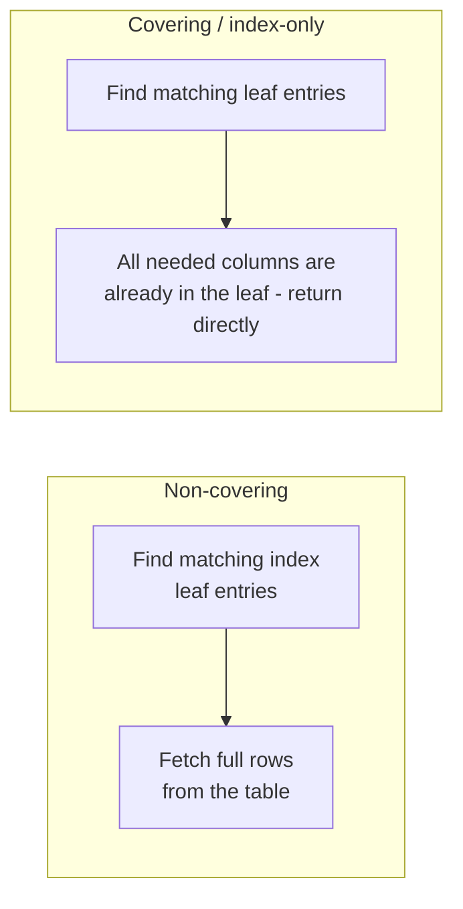
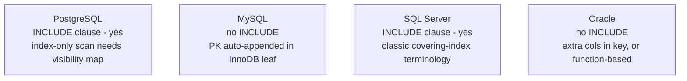

The target file `74-Covering-Indexes.md` exists but is empty. I'll generate the section following the conventions of `73-Composite-Indexes.md`.
Generated `sql-handbook/9-Optimization/74-Covering-Indexes.md` (~480 lines), following the style of `73-Composite-Indexes.md`.

Covers:

- **Fundamentals** — definition, why they exist, relationship to composite keys, what they are NOT
- **Internals** — B-tree leaf contents, key vs INCLUDE placement, row-locator table (heap/InnoDB/SQL Server/Oracle IOT), PostgreSQL visibility-map caveat, Mermaid diagrams
- **Syntax** — `INCLUDE` per engine (PostgreSQL v11+, SQL Server 2005+; MySQL/Oracle workarounds)
- **Sample tables + grain**, realistic data with expected output
- **Three scenarios** — row-lookup elimination, aggregation/`COUNT`, order-list page
- **Key-vs-INCLUDE decision rules**, BAD vs BETTER approaches, edge cases, NULL behavior
- **Common mistakes, production pitfalls** (write amplification, optimizer cold-shoulder, overlapping indexes, online build)
- **Performance verification** — plan-signal table, engine-equivalent EXPLAIN tools, no absolute performance claims
- **Engine comparison table**, best practices, cross-references
- **Interview Questions** — Beginner / Intermediate / Advanced / Scenario / Tricky / Output Prediction / Debugging / Performance (no answers, per the "return ONLY Markdown" spec)
  p cost is often the dominant cost.\*\* A B-tree seek is cheap; the surrounding row reads (heap fetches / RID lookups) are the expensive part at scale. A covering index removes the row-lookup phase entirely — the answer comes out of the index itself.

2. **The index is much narrower than the table.** An index holding key + INCLUDE columns is typically far smaller than the whole row, so scans of the index (for `COUNT(*)`, `COUNT(DISTINCT x)`, aggregations) read far fewer pages.
3. **It keeps hot columns together.** Frequently read, small columns can live in the index and spare the heap from most of the traffic.

The essential mental model:

```
Two-step query WITHOUT covering:
   Index aaStep 1) seek the B-tree  →  find leaf entries (row locators)
   Step 2) for each locator, fetch the row from the table (heap / clustered index)
   → IO = index reads + table reads

Covered query (index-only scan):
   Step 1) seek the B-tree → leaf already holds every column needed
   Step 2) nothing. Return leaf contents directly.
   → IO = index reads only
```



### Relationship to composite indexes

- A composite index is **partially covering for its own key columns**. `CREATE INDEX idx_orders_cd ON orders (customer_id, order_date)` covers any query that reads only `customer_id` and `order_date`.
- A **covering index** extends that idea to _non-key_ columns using the `INCLUDE` clause. Those extra columns live only in the leaf pages (not in the internal tree nodes), which is what makes them cheap in terms of tree size.
- You can have a covering index without `INCLUDE` (all needed columns happen to be key columns) and you can have `INCLUDE` columns without always achieving a covering scan (the optimizer may still choose another path).

### What a covering index is NOT

- **NOT a recipe for "SELECT \*".** If a query selects most columns of a wide table, no practical index can cover it — the index would be as wide as the table, duplicated.
- **NOT automatically faster.** It still has to be _used_ by the optimizer (cost-based), and its benefit is limited to skipping row lookups — it does not by itself make the seek narrower.
- **NOT free.** Every index consumes storage and must be maintained on every `INSERT` / `UPDATE` / `DELETE`. A covering index is a **space-for-time / write-for-read** trade.
- **NOT the same across engines.** Some engines append the primary key to every secondary index leaf (InnoDB), some need a visibility check before trusting the index (PostgreSQL), and some have no `INCLUDE` keyword at all (MySQL, Oracle).

---

## Internal Working

### B-tree leaf contents

A B-tree (B+ tree) stores, at the leaves:

- all **key columns** (used for seeking, ordering, uniqueness),
- the **row locator** — where the full row lives (a heap RowID, or the clustering-key values in clustered tables, or the PK in InnoDB),
- plus, if the engine supports it, **included columns** that are stored only here.

```mermaid
flowchart TD
    Root[Internal nodes:<br/>only key columns - (customer_id, order_date)]
    L[Leaf node:<br/>key cols (customer_id, order_date)<br/>+ INCLUDE cols (status, total_amount)<br/>+ row locator / PK]
    Root --> L
    L --> L2[Next leaf (leaf chain)]
    L2 --> L3[...]
```

Because internal nodes hold **only key columns**, adding non-key columns via `INCLUDE` does **not** widen the upper tree levels — that is the precise reason `INCLUDE` is cheaper than adding the column to the key. Adding a column to the _key_ forces every internal node to carry it (fewer keys per page → taller tree → wider range scans).

### Key columns vs Included columns

| Aspect                                        | Key column                         | INCLUDE column               |
| --------------------------------------------- | ---------------------------------- | ---------------------------- |
| Used for seek / seek-limiting                 | ✔ yes                              | ✘ no                         |
| Used to satisfy `ORDER BY` / `GROUP BY` order | ✔ yes (in key order)               | ✘ no                         |
| Used for uniqueness (`UNIQUE` index)          | ✔ yes                              | ✘ does not affect uniqueness |
| Stored in internal (non-leaf) nodes           | ✔ yes                              | ✘ no — leaf only             |
| Included in the "cover" for a query           | ✔ yes                              | ✔ yes                        |
| Affects wideness of upper tree                | ✔ yes                              | ✘ no                         |
| DML writes                                    | full key maintenance + positioning | value written in leaf only   |

### The row locator and clustered tables

The pointer stored in the leaf depends on the engine's storage model:

| Storage model                                        | Row locator in index leaf             |
| ---------------------------------------------------- | ------------------------------------- |
| Heap table (PostgreSQL, Oracle, MySQL `MyISAM`)      | physical RowID / TID                  |
| InnoDB (MySQL)                                       | a copy of the **primary key** columns |
| SQL Server clustered table                           | the **clustering key** values         |
| SQL Server heap                                      | physical RowID                        |
| Index-organized table (Oracle IOT, InnoDB PK itself) | none — the whole row _is_ the leaf    |

This has a big consequence for "is my index covering?":

> InnoDB nuance: every secondary index **implicitly ends with the primary key columns**. So on `orders` (PK `order_id`), `CREATE INDEX idx_cd ON orders (customer_id, order_date)` actually stores `(customer_id, order_date, order_id)` at the leaves. A query selecting `order_id` may already be fully covered even though you never listed `order_id` in the index.

### PostgreSQL: index-only scans are not unconditional

PostgreSQL's index-only scan has a subtlety: the index does **not** contain visibility information. When a heap page has been modified recently (or has un-frozen/aborted tuples), a tuple's _visibility_ to your transaction can only be determined by looking at the heap. So the engine consults a **visibility map** (VM):

- page marked all-visible → return the index entry directly (true index-only scan);
- page not all-visible → the engine does a heap check for the affected tuples.

Consequences:

- An index-only scan may still touch the heap for recently-updated pages. Its benefit grows as pages become all-visible (which `VACUUM` ages / freezes).
- A table with lots of heavy **HOT (heap-only tuple)** updates and unfrozen old tuples may show `Heap Fetches: N` in `EXPLAIN` even on an index-only scan — that is expected and normal, not a mistake.

```text
Index Only Scan using idx_orders_customer_date on orders
    Index Cond: (customer_id = 9002)
    Heap Fetches: 37        <- tuples on pages not yet all-visible
```

> MySQL: InnoDB keeps all column copies in the secondary-index leaf, so "covering" there is static and unconditional — no visibility map step. But the trade is that every secondary front index stores a full PK copy (space on every row).
> SQL Server: nonclustered covering indexes return the leaf columns directly; the row locator / clustered key lookup only happens for columns that are _not_ in the index or its INCLUDE set.

---

## Syntax

`INCLUDE` is **not ANSI SQL** — it is a per-engine extension. The four major engines disagree, as follows.

### PostgreSQL (since v11)

```sql
CREATE INDEX idx_orders_customer_inc
    ON orders (customer_id, order_date)
    INCLUDE (status, total_amount);

-- INCLUDE works on UNIQUE too: uniqueness only applies to the key columns
CREATE UNIQUE INDEX uq_orders_customer_inc
    ON orders (customer_id)
    INCLUDE (order_date, status);
```

Notes for PostgreSQL:

- `INCLUDE` columns must not be expression indexes inside the clause and cannot duplicate key columns.
- Included columns cannot be used for search (`WHERE`), sort, or grouping.
- Stats guidance: key columns only.

### SQL Server (since 2005)

```sql
CREATE NONCLUSTERED INDEX idx_orders_customer_inc
    ON orders (customer_id)
    INCLUDE (order_date, status, total_amount);
```

- `INCLUDE` is one of SQL Server's primary tuning tools; a "covering index" in SQL Server terminology is exactly this: `ON (keys) INCLUDE (nonkeys)`.
- You cannot include a column twice, cannot include a column also in the key, and the maximum of 32 key columns / 16 included columns / 900-byte key limit still applies (verify version limits).
- On clustered tables each nonclustered leaf also carries the clustered key implicitly.

### MySQL / MariaDB

MySQL has **no `INCLUDE` clause** (as of the 8.x series). The standard approach for extra columns:

1. Put the extra columns **in the key** — works, but widens internal tree nodes (the deficit vs `INCLUDE`), and
2. Rely on the **InnoDB PK extension** for the PK column.

```sql
-- "Covering (customer_id, status)" for the PK column order_id comes free in InnoDB:
CREATE INDEX idx_orders_customer_status
    ON orders (customer_id, status);
-- leaf actually stores (customer_id, status, order_id)

-- For non-PK columns you must put them explicitly into the key (wider tree):
CREATE INDEX idx_orders_customer_covering
    ON orders (customer_id, status, total_amount);
```

In `EXPLAIN`, MySQL marks a covered query with `Using index` in the `Extra` column — worth knowing because it reads like a pronouncement but only means "index-only".

### Oracle

Oracle has **no standard `INCLUDE` keyword** for B-tree indexes (verify against your version; trick keywords such as `INVISIBLE` do not give the same semantics). Practical workarounds:

```sql
-- Put extra columns directly into the key (wider tree, no leaf-only option):
CREATE INDEX idx_orders_customer_covering
    ON orders (customer_id, status, total_amount);

-- Function-based indexes can "hide" derived/expression values:
CREATE INDEX idx_orders_month
    ON orders (TRUNC(order_date, 'MM'));
```

Oracle reports a covering-ish path as `INDEX FULL SCAN` / `INDEX FAST FULL SCAN` / `INDEX RANGE SCAN` without a subsequent table access in the plan. For full-row-in-index behavior, Oracle has **index-organized tables (IOT)** where the whole row is stored in the index — a heavier structural choice, not a covering trick.



---

## Sample Tables and Grain

Reuse the handbook schema. **Always state the grain first.**

```sql
CREATE TABLE employees (
    employee_id   INT PRIMARY KEY,
    first_name    VARCHAR(50) NOT NULL,
    last_name     VARCHAR(50) NOT NULL,
    email         VARCHAR(100) UNIQUE,
    hire_date     DATE NOT NULL,
    salary        DECIMAL(10,2),
    department_id INT,
    manager_id    INT
);

CREATE TABLE orders (
    order_id      INT PRIMARY KEY,
    customer_id   INT NOT NULL,
    employee_id   INT NOT NULL,
    order_date    DATE NOT NULL,
    status        VARCHAR(20) NOT NULL,
    total_amount  DECIMAL(12,2) NOT NULL
);

CREATE TABLE order_items (
    order_id    INT NOT NULL,
    product_id  INT NOT NULL,
    quantity    INT NOT NULL,
    price       DECIMAL(10,2) NOT NULL,
    PRIMARY KEY (order_id, product_id)
);
```

| Table         | Grain                                                   |
| ------------- | ------------------------------------------------------- |
| `orders`      | One row = one order placed by one customer.             |
| `order_items` | One row = one line item (one product inside one order). |

```sql
INSERT INTO orders (order_id, customer_id, employee_id, order_date, status, total_amount) VALUES
(5001, 9001, 101, '2025-01-05', 'completed',  1240.50),
(5002, 9001, 102, '2025-01-06', 'completed',    89.99),
(5003, 9002, 103, '2025-01-08', 'shipped',    4520.00),
(5004, 9003, 101, '2025-01-10', 'processing',  210.00),
(5005, 9004, 102, '2025-01-12', 'pending',    1500.00),
(5006, 9002, 101, '2025-01-15', 'cancelled',   120.00);
```

---

## Scenario 1 — From row lookups to index-only

**Query** (hot page): the customer's order list shows only order date and status.

```sql
SELECT order_date, status
FROM orders
WHERE customer_id = 9001;
```

```text
Expected result:
 order_date  | status
-------------+-----------
 2025-01-05  | completed
 2025-01-06  | completed
```

Without a covering index, plan shape is roughly:

```text
Index Scan using idx_orders_customer_date on orders
    Index Cond: (customer_id = 9001)
    ... then a table/heap fetch per matched row
```

With `INCLUDE (status)`:

```sql
CREATE INDEX idx_orders_customer_date_inc
    ON orders (customer_id, order_date)
    INCLUDE (status);
```

Now the leaf contains `(customer_id, order_date, order_id?, status)`, so the query can be answered without heap fetches:

```text
Index Only Scan using idx_orders_customer_date_inc on orders
    Index Cond: (customer_id = 9001)
```

What actually improves? Not the _seek_ — the same leaf slice is found. What is removed is **every row lookup**, which is precisely where latency lives on large tables. On small tables (like the sample above) the plan difference is invisible; the win appears at production scale with deep tables, so **always verify with `EXPLAIN ANALYZE` at realistic volume**.

---

## Scenario 2 — Aggregations without touching the table

Tiny queries that scan big tables are prime covering-index candidates:

```sql
-- How many orders are in each status?
SELECT status, COUNT(*)
FROM orders
GROUP BY status;
```

`GROUP BY status` only needs `status` and a count of rows. A covering index on `(status)` alone (the leaf, plus InnoDB's implicit PK, is enough for counting rows) can serve it as an index-only scan, the engine reads only the _narrow_ index instead of the whole table.

```sql
CREATE INDEX idx_orders_status ON orders (status);
```

```text
Expected result:
 status      | count
-------------+-------
 cancelled   |     1
 completed   |     2
 pending     |     1
 processing  |     1
 shipped     |     1
```

Same for distinct counts:

```sql
SELECT COUNT(DISTINCT customer_id) FROM orders;
```

An index-only scan over `(customer_id)` answers this without table access.

> Core idea: aggregation over a column can be entirely satisfied by an index if the index contains that column (plus enough to count rows). This is the single largest "free" win of covering indexes. Verify with a plan — PostgreSQL `Index Only Scan`, MySQL `Using index`, SQL Server covering index.

---

## Scenario 3 — The order-list page with details

**Problem.** The customer order page needs `order_date`, `status`, and `total_amount` for the 20 latest orders.

```sql
SELECT order_date, status, total_amount
FROM orders
WHERE customer_id = 9002
ORDER BY order_date DESC
LIMIT 20;
```

### BAD APPROACH — seek index that doesn't cover

```sql
CREATE INDEX idx_orders_customer_date
    ON orders (customer_id, order_date);
```

The seek is fine, but `status` and `total_amount` force a table lookup per matched row.

### BETTER APPROACH — cover the read columns

```sql
CREATE INDEX idx_orders_customer_date_inc
    ON orders (customer_id, order_date DESC)
    INCLUDE (status, total_amount);
```

Plan: `Index Only Scan` + `Limit`, no `Sort`, no heap fetches. The optimizer reads the leaf chain in reverse order and stops after 20 entries.

Why this shape: `customer_id =` is the equality prefix, `order_date DESC` supplies the ordering, and the two report columns live in the leaf purely to avoid row lookups. They are _not_ in the key on purpose — nothing seeks or sorts on them.

---

## Key columns vs INCLUDE — decision rules

| Decision                                  | Choose key column                    | Choose INCLUDE                  |
| ----------------------------------------- | ------------------------------------ | ------------------------------- |
| Filtered / joined on                      | ✔ key                                | ✘                               |
| Sorted or grouped on                      | ✔ key                                | ✘                               |
| Uniqueness matters                        | ✔ key                                | ✘                               |
| Only needs to be _returned_ (SELECT list) | both work                            | ✔ prefer INCLUDE                |
| Frequently written (volatile value)       | careful — key update relocates entry | ✔ preferred (leaf-only write)   |
| Wide value (e.g. `VARCHAR(200)`)          | avoid                                | ✔ preferred (keeps tree narrow) |
| Wanted in `ORDER BY` direction            | ✔ key                                | ✘                               |

Rule of thumb:

> If a column only needs to be **read back** in the SELECT list, `INCLUDE` it. If it participates in `WHERE`, joins, `ORDER BY`, or `GROUP BY`, it belongs in the **key**. Putting read-only columns in the key only makes the whole tree fatter for no benefit.

---

## BAD vs BETTER Approaches

### Scenario A — report columns as key columns (wide tree)

The intention is covering; the mistake is the _placement_.

**BAD APPROACH (MySQL-style habit applied where INCLUDE exists):**

```sql
CREATE INDEX idx_orders_wide
    ON orders (customer_id, status, total_amount, order_date);
```

`total_amount` and `status` end up in every internal node as well as leaves. The tree holds fewer entries per page, gets taller, and range scans read more pages.

**BETTER APPROACH:**

```sql
CREATE INDEX idx_orders_covering
    ON orders (customer_id, order_date DESC)
    INCLUDE (status, total_amount);
```

Key columns drive the seek and order; read-only columns are added at the leaves only.

> MySQL note: since MySQL has no `INCLUDE`, forcing extra columns into the key is the only available route there — accept the wider tree, or redesign the query. Do not claim MySQL matches PostgreSQL/SQL Server semantics.

### Scenario B — covering a query that cannot be covered cheaply

**BAD APPROACH:** building a "covering index" for a `SELECT *` over a 30-column row. The duplicate index is nearly as wide as the table and doubles write cost for an almost-table-sized second copy.

**BETTER APPROACH:** restructure the request — page to a narrow projection first, then, only for the few rows the user actually opens, fetch the wide details from the table:

```sql
-- step 1: narrow list (covered)
SELECT order_id, order_date, status
FROM orders
WHERE customer_id = 9002
ORDER BY order_date DESC LIMIT 20;

-- step 2: detailed row fetched once the user clicks (not covered, and that's fine)
SELECT * FROM orders WHERE order_id = 5003;
```

Only the hot, narrow, repeated path deserves the covering treatment; the rare one-off read does not.

### Scenario C — adding a covering index without ever checking the plan

**BAD APPROACH:**

```sql
CREATE INDEX idx_orders_mega
    ON orders (customer_id, order_date, status, total_amount, quantity);
```

where `quantity` is not even a column of `orders` and `total_amount` is never read. Index bloat with no measured gain.

**BETTER APPROACH:** measure first:

1. `EXPLAIN ANALYZE` (or MySQL `EXPLAIN`, SQL Server actual plan, Oracle `DBMS_XPLAN`) the hot query;
2. confirm the pain is the **row lookup** (you see `Seq Scan`, or an index scan with heap fetches, not a seek problem);
3. add the narrow covering index;
4. re-run the plan and compare actual timing / page reads.

---

## Edge Cases

| Edge case                                                   | What happens                                                                                                                                             |
| ----------------------------------------------------------- | -------------------------------------------------------------------------------------------------------------------------------------------------------- |
| **`SELECT *`**                                              | Cannot be covered by a secondary index in practice (the whole row is not duplicated). Engine may still cover the WHERE via index, then fetch rows.       |
| **Cols needed for both filter and display**                 | Put in key (for filter) and it also covers display — no INCLUDE needed.                                                                                  |
| **Optimizer refuses the covering index**                    | Index-only scan chosen by cost; for wide covering indexes, a narrow-seek table fetch can be cheaper than scanning a big index. Verify with plan.         |
| **Covering + `LIMIT`**                                      | Works nicely — engine can stop reading leaf entries early only if the ORDER BY is index-satisfied; otherwise sort-then-limit still needs all candidates. |
| **Covering index on a heap that receives constant inserts** | Heap not all-visible (PostgreSQL) → `Heap Fetches` reappear; benefit degrades until `VACUUM` marks pages.                                                |
| **Mixed coverage (one column missing)**                     | The engine cannot partially cover — one missing column forces the row fetch for every match. Coverage is all-or-nothing per query.                       |
| **Expression in the SELECT but not in an expression index** | `SELECT UPPER(status) ...` is not covered by a plain index (no expression stored); needs a functional index.                                             |
| **`ORDER BY` column not in key**                            | Even if it is INCLUDE'd, ORDER BY cannot use index order → sort node. INCLUDE columns are un-orderable.                                                  |
| **Two covering indexes for one query**                      | Optimizer picks by cost; overlapping covering indexes are usually wasteful to keep both.                                                                 |
| **InnoDB PK auto-extension accidentally covering**          | A query reading PK columns may be covered by indexes you never designed for it — often a pleasant surprise; sometimes it masks a missing-key design.     |

---

## NULL Behavior

- **Covering is orthogonal to NULL.** Included columns can hold NULL freely; NULLs are stored as visible values in the leaf (with the engine's sort placement). `IS NULL` / `IS NOT NULL` on a _key_ column can still use the index for seeking.
- `COUNT(col)` counts **non-NULL** values. Because the index stores every leaf value, a covering index serves `COUNT(salary)` efficiently _and_ respects NULL exclusion — the engine counts only non-NULL entries.
- `COUNT(*)` needs only presence, so any index covering the filter suffices; NULLs in key columns still count (there is a row entry).
- `IS DISTINCT FROM` / `IS NOT DISTINCT FROM` on a covered key column remain index-usable in the same way equality is (Section 11).
- NULLs in an `INCLUDE` column of a `UNIQUE ... INCLUDE` index do nothing to uniqueness — uniqueness checks only key columns.
- Within a covered `GROUP BY`, NULLs group together (one group for NULL) exactly as they do in a table scan — covering does not change grouping semantics.

---

## Common Mistakes

1. **Putting read-only columns into the key** instead of `INCLUDE`, fattening the whole tree for nothing.
2. **Believing a covering index _narrows_ the seek.** It removes the table lookup; the slice it reads is the same. If the problem is a big slice, the fix is a better key, not INCLUDE.
3. **Covering `SELECT *`** — unachievable for wide rows; you end up with a near-table-sized duplicate.
4. **Using INCLUDE'd columns in WHERE/ORDER BY.** They aren't in the key; the engine can't seek or sort on them.
5. **Dropping the old index checklist.** A new cover adds write cost; verify by keeping the plan honest or by dropping the unused overlap.
6. **Testing at toy scale.** Covering shows in plans at realistic volume; a 6-row table will never demonstrate a heap-fetch difference.
7. **Ignoring PostgreSQL visibility.** Judging an index-only scan "broken" because you saw `Heap Fetches` shortly after a bulk update.
8. **Assuming MySQL reads "cover" for all columns.** No `INCLUDE` — non-PK extras must be explicit key columns; verify `Extra: Using index`.
9. **Forgetting the row locator itself is read** — on wide clustering keys (SQL Server long clustered key, or multi-column PK) the "covering" leaf still holds that locator, so "index size" is not just your listed columns.
10. **Indexing the low-usage path.** A dashboard that runs once a night does not justify a covering index that every INSERT pays for.

---

## Production Pitfalls

> Production pitfall: **Write amplification.** Every covering index is yet another full copy of the covered columns, kept in sync on every `INSERT`/`UPDATE`/`DELETE`. On high-INSERT tables, several covering indexes can add real latency to the write path — measured, not assumed. Think of covering as a hot-path investment, not a blanket policy.

> Production pitfall: **Wide keys on hot tables.** A covering index on frequently-updated columns causes leaf-page churn (updates rewrite the leaf values) and, in clustered designs, possible page splits. Keep covered sets small and stable.

> Production pitfall: **Optimizer cold shoulder.** The index exists, but a stale-statistics optimizer ignores it. After big data changes, run `ANALYZE` / update stats and re-check the plan (Section 79).

> Production pitfall: **Row-lookup masking.** An index that _almost_ covers still does a row fetch per match — and you may not notice the `Heap Fetches` / `Key Lookup` in the plan until latency spikes. Treat "one column away from covering" as "not covering."

> Production pitfall: **Overlapping covering indexes.** `(a, b) INCLUDE (c)` plus `(a) INCLUDE (b, c)` both come from one designer's afternoon; both get maintained forever. Periodically reconcile the index set that actually appears in production plans (Section 83).

> Production pitfall: **Creation locking.** A plain `CREATE INDEX` can block writers during the build on large tables. Use `CREATE INDEX CONCURRENTLY` (PostgreSQL), `ALGORITHM=INPLACE, LOCK=NONE` (MySQL), `WITH (ONLINE=ON)` (SQL Server Enterprise), or online builds in Oracle, and validate on a replica before production (Section 72).

---

## Performance Implications

### What a covering index actually changes

- Removes per-row lookups (heap / clustered-key fetches).
- Lets aggregation and `COUNT` queries scan a narrow structure instead of the whole table.
- Enables early termination in `LIMIT` paths when paired with a covered `ORDER BY`.

It does **not** by itself change the seek width or fix selectivity problems.

### The full cost model (so you never guess)

Whether a given covering index helps depends on:

- optimizer and cost model of the engine
- index width (key + INCLUDE size) and total index size
- table size and row width (how many heap pages an uncovered scan would read)
- cardinality / selectivity of the key columns
- data distribution (hot customers, skew, NULL density)
- write throughput and update frequency of covered columns
- whether query shapes actually read the covered projections
- the actual execution plan after statistics update

No claim of "covering is always faster" is valid — verify every time.

### How to verify with the plan

| Plan signal (engine-agnostic)                             | Meaning                                                    |
| --------------------------------------------------------- | ---------------------------------------------------------- |
| Index-only / covering scan node; no table access below it | covered — no row lookups                                   |
| Index scan + heap fetch / `Key Lookup` per row            | NOT covered — the missing column forces lookups            |
| PostgreSQL: index-only scan showing `Heap Fetches: N`     | pages not all-visible; lookups happening for those tuples  |
| MySQL `Extra` column shows `Using index`                  | covered access (index-only)                                |
| `Sort` node despite a supposedly covered ORDER BY         | the ORDER BY column isn't in the key                       |
| Index scan touching many more entries than matched        | key selectivity is the real problem — INCLUDE won't fix it |

Each engine's equivalents:

- PostgreSQL: `EXPLAIN ANALYZE` → look for `Index Only Scan` and the `Heap Fetches` counter.
- MySQL: `EXPLAIN` → `Extra: Using index` means the query is read entirely from an index; `key_len` shows how much of a composite key was usable.
- SQL Server: actual/estimated plan → `Index Seek` without `RID Lookup`/`Key Lookup`; `STATISTICS IO` counts logical reads.
- Oracle: `DBMS_XPLAN` → `INDEX ... SCAN` with no following `TABLE ACCESS BY INDEX ROWID`.

> Common misconception: "An INCLUDE column keeps the query from reading the table, so it's a straight win." Not necessarily — the index must be _used_; if the optimizer prefers another path, the INCLUDE columns still cost writes and storage with no read benefit. Confirm usage in production plans.

---

## Behavior Differences Across Engines

| Aspect                                | PostgreSQL                  | MySQL (InnoDB)                         | SQL Server                                        | Oracle                                |
| ------------------------------------- | --------------------------- | -------------------------------------- | ------------------------------------------------- | ------------------------------------- |
| `INCLUDE` clause                      | yes (v11+)                  | no (verify 8.x); extras must go in key | yes (2005+)                                       | no standard keyword                   |
| How covering shows in plan            | `Index Only Scan`           | `Extra: Using index`                   | covering nonclustered index (Seek, no Key Lookup) | `INDEX ... SCAN` with no table access |
| Row locator in leaf                   | heap TID                    | implicit PK columns appended           | clustered-key values / RID                        | RowID                                 |
| Visibility step before trusting index | yes — visibility map        | no                                     | no                                                | no (current-read semantics differ)    |
| Uniqueness with INCLUDE               | key columns only            | n/a (no INCLUDE)                       | key columns only                                  | n/a (no INCLUDE)                      |
| `INCLUDE`-ed ORDER BY usable?         | no                          | n/a                                    | no                                                | n/a                                   |
| Whole-row-in-index option             | none (standard)             | PK itself is clustered                 | clustered index holds all columns                 | index-organized table (IOT)           |
| Creation concurrency                  | `CREATE INDEX CONCURRENTLY` | `ALGORITHM=INPLACE, LOCK=NONE`         | `WITH (ONLINE=ON)` (Enterprise)                   | default if version allows             |

---

## Best Practices

1. **Cover the hot, narrow, read-mostly paths** — customer dashboards, list pagination, aggregation/counting — not every query.
2. **Key columns for WHERE/ORDER BY/GROUP BY; INCLUDE for values only returned.**
3. **Keep covered sets small and stable.** Volatile wide columns are the worst INCLUDE candidates.
4. **Check the plan before and after.** Confirm a row-lookup node actually disappears; check `Heap Fetches`, MySQL `Using index`, absence of `Key Lookup`.
5. **Don't cover `SELECT \*`.** Project narrow first; fetch wide rows lazily.
6. **Remember the row locator counts.** InnoDB PK-append and SQL Server clustered-key copies make "covering" cheaper or pricier than it looks.
7. **Reconcile overlapping indexes.** An INCLUDE index that never appears in production plans should be dropped (measure, then drop).
8. **Update statistics after large changes** and re-validate optimizer choice (Section 79).
9. **Build online and test on a replica**, keeping a drop-the-index rollback path.
10. **Weigh write cost honestly.** At high insert rates, the read saving of one covering index can be undone by the extra maintenance on the write side — benchmark the write path too.

---

## Real-World Scenario

**Problem.** An e-commerce backend: the order-history endpoint returns `order_date`, `status`, `total_amount` for a customer's latest 20 orders. `orders` holds 50M rows; ~100 req/s on this endpoint; inset rate 5k/s.

```sql
SELECT order_date, status, total_amount
FROM orders
WHERE customer_id = 9002
ORDER BY order_date DESC
LIMIT 20;
```

**Step 1 — Measure.** `EXPLAIN ANALYZE` shows `Seq Scan` over all 50M rows plus a `Sort`. That's one full table read per request — the headline problem.

**Step 2 — Design.** One index that (a) seeks on `customer_id`, (b) supplies `DESC` order, (c) carries the two display columns at the leaf:

```sql
CREATE INDEX idx_orders_cust_date_cover
    ON orders (customer_id, order_date DESC)
    INCLUDE (status, total_amount);
```

**Step 3 — Verify.** The plan now reads ~20 leaf entries via `Index Only Scan`, no `Sort`, no heap fetches (assuming all-visible pages):

```text
Limit
  ->  Index Only Scan using idx_orders_cust_date_cover on orders
        Index Cond: (customer_id = 9002)
```

**Step 4 — Weigh the write side.** This index duplicates two columns per row and is maintained on 5k inserts/s. The read saving is structural (no 50M-row scan, no per-row lookups), so on these numbers the trade is justified — but the decision was made from measured plans, not from a "covering is good" bias, and the index would be re-validated at each data-volume milestone.

---

## Cross-References

- **Index fundamentals, B-tree anatomy, online creation** — `72-Indexes-Basics`
- **Composite indexes, leftmost-prefix, key ordering** — `73-Composite-Indexes`
- **Clustered vs nonclustered storage and where rows really live** — `75-Clustered-vs-Nonclustered`
- **Sargability — why some predicates block index use** — `77-SARGability`
- **Reading execution plans, `Index Only Scan` vs `Index Scan`** — `78-EXPLAIN-Execution-Plans`
- **Cardinality, selectivity, stale statistics driving index choice** — `79-Cardinality-and-Statistics`
- **Nested-loop probes and when covering removes them** — `80-Join-Algorithms`
- **End-to-end index design and index-set reconciliation** — `83-Index-Design-Strategy`
- **Keyset pagination — covering's natural partner** — `84-Pagination-and-Keyset-Pagination`
- **Visibility of old tuples / VACUUM and HOT updates** — `88-Locks-and-Blocking`, `92-Keys-and-Relationships`
- **Grouping and COUNT semantics that covering must respect** — `05-Aggregation`, `09-NULL-Deep-Dive`, `11-NULL-Comparisons`

---

# Interview Questions

## Beginner

1. Define a covering index in your own words. What exactly does "covering" mean for a query?
2. What does it mean when a query can run an _index-only scan_? Which columns must a covering index contain for `SELECT a, b FROM t WHERE c = ?` to be covered?
3. `CREATE INDEX idx_orders_cd ON orders (customer_id, order_date)` — is the query `SELECT customer_id, order_date FROM orders WHERE customer_id = 9002` covered? What about `SELECT total_amount, customer_id ...`?
4. Why can a covering index usually answer a `COUNT(*)` query much faster than a full table scan?
5. What is the difference between an index key column and an `INCLUDE` column in terms of what the index can do with it?
6. Can a covering index help an `ORDER BY`? What condition must hold for it to remove a `Sort` node?
7. What happens to index maintenance costs when you keep adding covering indexes to a write-heavy table?

## Intermediate

8. Explain the storage difference between a column added to the **key** versus placed in **INCLUDE**: where does each live in the B-tree structure, and why does that matter for tree height and page width?
9. Describe a plan shape that tells you "this query is covered" vs "this query is NOT covered" in: PostgreSQL, MySQL, SQL Server. Name the exact node/flag to look for.
10. Why might a PostgreSQL index-only scan still show `Heap Fetches`? What is the visibility map, and when does a heap fetch appear?
11. `SELECT status, total_amount FROM orders WHERE customer_id = ? ORDER BY order_date DESC LIMIT 20` — design the index and explain which columns go in the key, which in INCLUDE, and why.
12. What is the trade-off of putting a reporting column into the key instead of `INCLUDE`, in an engine that supports INCLUDE?
13. InnoDB appends primary key columns to every secondary-index leaf. How does that change how you reason about whether an index is "covering" on MySQL?
14. Why is a covering index often _not_ the right tool when the query is `SELECT *`? When does it become acceptable?

## Advanced

15. Walk through the page-level mechanics of an index-only scan: what is read, what is verified, and in which engine is a visibility check involved before trusting the leaf value?
16. Explain why an INCLUDE column cannot be used for `WHERE` filtering or `ORDER BY`, even though it is physically present in every leaf.
17. A query needs columns `(a, b)` from `WHERE a = 1 AND c BETWEEN ...`. Key `(a, c, b)` vs `(a, c) INCLUDE (b)` — compare the tree widths, the seek usefulness of `b`, and the write cost. Which would you choose and why?
18. How does a clustered index change the "row locator inside the leaf" story compared to a heap? Give the concrete examples for InnoDB and a SQL Server clustered table.
19. `UNIQUE (customer_id) INCLUDE (order_date, status)` — what exactly is enforced unique, and what is not? Could two identical `(customer_id, 'shipped')` pairs exist?
20. Under a high-INSERT workload, propose how you would decide whether the covering index that made the SELECT fast is hurting the write path. What measurements would you collect?

## Scenario Based

21. `orders` (50M rows, 5k inserts/s) serves `SELECT order_date, status, total_amount FROM orders WHERE customer_id = ? ORDER BY order_date DESC LIMIT 20`. Design the covering index, state the grain, and explain what plan changes you expect.
22. A nightly dashboard computes `SELECT status, COUNT(*) FROM orders GROUP BY status`. Propose an index strategy and explain why a single narrow covering index may remove the full-table scan.
23. The same `orders` table also has a two-column search used by support staff: `WHERE status = 'processing' AND order_date BETWEEN ? AND ?`. Recommend key vs INCLUDE compositions, considering that support queries are infrequent but must not scan the table.
24. You discover an unused covering index in production plans. Walk through the process (plan analysis → dropping → measuring) for removing it without regressing the hot path.
25. A developer on your team wants a "covering index" for `SELECT * FROM orders WHERE customer_id = ?`. Explain why that is impractical for a wide table and propose the alternative design with a narrow list load followed by detail fetch.

## Tricky

26. Is a covering index that the optimizer refuses to use still "covering"? Does an index need to _scan_ more pages than a table fetch before it's counterproductive?
27. `CREATE INDEX idx ON t (a) INCLUDE (b, c)`. Can this index satisfy `ORDER BY b`? `ORDER BY a`? `WHERE b = 5`? Answer for each, with reasoning.
28. `SELECT COUNT(salary) FROM employees` on a covering index over `(salary)`. Where does the NULL-exclusion happen, and does the index at all help?
29. Two overlapping indexes: `(a, b) INCLUDE (c)` and `(a) INCLUDE (b, c)`. Which queries does each uniquely serve? Which one would you keep and why?
30. A table is 5 TB. Someone proposes a covering index with `INCLUDE` of a `VARCHAR(500)` description column. What are the concrete costs, and when, if ever, is this justified?

## Output Prediction

31. Predict the plan change:

```sql
-- before: this query runs an Index Scan with per-row heap fetches
SELECT order_date, status
FROM orders
WHERE customer_id = 9001;
```

after `CREATE INDEX idx_orders_cd_inc ON orders (customer_id, order_date) INCLUDE (status);`. Name the new node type and the step that disappears.

32. For each query below, predict whether the plan is index-only (covered) or performs row lookups:

```sql
-- index: (customer_id, order_date) INCLUDE (status, total_amount)
SELECT customer_id, order_date FROM orders WHERE customer_id = 9002;   -- A
SELECT order_date, status   FROM orders WHERE customer_id = 9002;      -- B
SELECT total_amount, status FROM orders WHERE customer_id = 9002;      -- C
SELECT status, total_amount FROM orders WHERE order_date >= '2025-01-10'; -- D (no customer filter)
```

33. Given the data in Sample Tables, predict the output and the access path for:

```sql
SELECT status, COUNT(*) FROM orders GROUP BY status;
```

after adding `CREATE INDEX idx_orders_status ON orders (status);`

## Debugging

34. A query conceptually covered by `(customer_id, order_date) INCLUDE (status)` still shows per-row heap fetches. List the possible causes (recent updates / visibility, optimizer path choice, a column not actually in the index) and how you'd confirm each in the plan.
35. MySQL `EXPLAIN` no longer shows `Using index` for a query you believed was covered by an InnoDB index. What might have changed (column slipped into the SELECT, composite key order, EXPLAIN output)? Walk through the debugging order.
36. A covering index makes the dashboard fast, but write latency on `orders` jumps 25%. Order your debugging steps for deciding whether the read win is worth the write price.

## Performance

37. `SELECT customer_id, COUNT(*) FROM orders GROUP BY customer_id` — is a covering index useful here, and what does it depend on? Give the plan signals you would verify before and after.
38. Explain why "covering indexes always make queries faster" is wrong, using optimizer choice, write amplification, and visibility as your three counter-examples.
39. Design a full covering strategy for a 200M-row `orders` table serving: per-customer order lists (`customer_id`, `order_date DESC`, `LIMIT 20`, with `status` + `total_amount`), a `GROUP BY status` dashboard, and a weekly `COUNT(DISTINCT customer_id)`. Justify each index and state what you would measure before deploying any of them.
