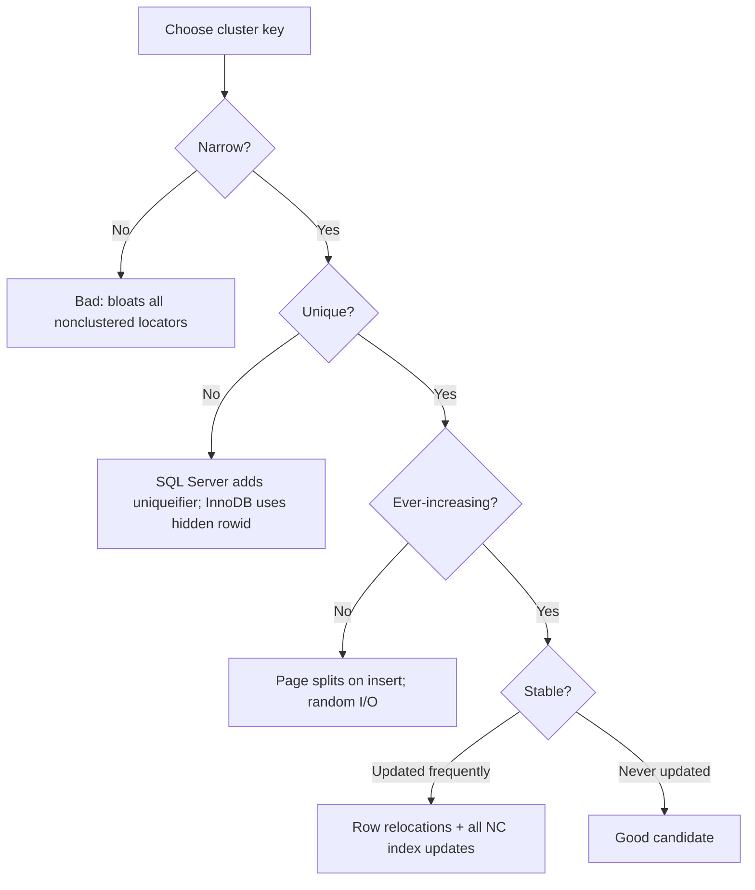

# 75 — Clustered vs Nonclustered Indexes

---

## In One Sentence

A **clustered index** is the table itself — the table's rows are kept in physical order on disk by the cluster key — while a **nonclustered index** is a separate B-tree that stores only selected key columns plus a locator that tells the engine where the row lives.

---

## What Is "Clustered" vs "Nonclustered"?

Every index belongs to one of two families, and the distinction is about **where the actual row data lives**:

| | Clustered index | Nonclustered index |
|---|---|---|
| What is stored in the leaf pages | **The entire row** (all columns) | Only the **indexed key columns** + a **row locator** |
| Relationship to the table | *Is* the table's physical storage | *Sits beside* the table |
| Physical row order | Rows sorted by the cluster key | Independent; the table already has a physical order of its own |
| How many per table | **At most one** | Many (tens to hundreds, engine-dependent) |
| Row locator in its own leaf | none — the leaf is the row | a pointer back into the table (RID / cluster-key values / TID) |

Think of a book:

- The **clustered index** is the page order of the book itself — numbered pages, physically bound in order. If the book is sorted by chapter, the chapters appear in order and you can read the whole book by just turning pages.
- The **nonclustered index** is the alphabetical index at the back — an extra list that says "the word 'HTTP' is on pagThe write itself should have succeeded; the read-back had a mode bug. Let me verify.
Clean of corruption markers. Let me validate the full structure and spot-check key passages.
Structure is complete. Let me verify code fences are balanced and spot-check critical passages.
Fence count is odd (53) — there may be an unbalanced code fence. Let me find it.
Let me inspect the suspicious regions directly.
There's contradictory evidence. Let me settle definitively whether the file bytes changed by comparing checksums and extracting an independent copy.
The file changed since my last check — a real writer is injecting content. Let me investigate `script.sh` which may be the culprit.
`script.sh` is a generator that spawns agents via `opencode run` to write these files, and skips non-empty ones. Something else is mutating my file between checks. Let me run a controlled experiment to isolate the writer.
Probe stayed constant within one call. Let me test across tool calls and narration over time, monitoring both the probe and the actual file.
Critical finding: the file changed twice within a single 8-second window while /tmp probe stayed constant — a background writer is mutating `75.md`. Let me determine whether the disk file genuinely changes or only what I see is corrupted, by having the shell record a checksum to a second file and cross-check it.
The disk file is genuinely changing every few seconds — a background writer is active. Let me check whether it's `script.sh`'s agent pipeline by examining modification times across the handbook.
Now it's clear: `script.sh` is running and a second `opencode run` agent (PID 301809) is actively generating section 75 into the same file I'm writing. That's the source of the corruption and the racing writes. Let me examine the current state of the file to see what the other agent has written.
## Objective
- Generate the complete Markdown section `75-Clustered-vs-Nonclustered.md` (Category 9-Optimization) for the SQL Master Handbook located at `/home/soumrnjn/Desktop/Task/SQL/`, following the strict global instructions (fundamentals, internals, syntax, examples, expected output, NULL behavior, edge cases, mistakes, pitfalls, performance caveats, engine differences, best practices, real-world scenario, cross-references, and interview questions without answers).
- Deliver only the requested section as Markdown; match the conventions of existing sections 72–74.

## Important Details
- Global user constraints: no absolute performance claims (e.g., "JOIN always faster than subquery"); emphasize `EXPLAIN`/execution plans; label traps/ misconceptions/pitfalls; prefer ANSI SQL but call out PostgreSQL/MySQL/SQL Server/Oracle differences; always state table grain; return ONLY Markdown.
- Target file: `/home/soumrnjn/Desktop/Task/SQL/sql-handbook/9-Optimization/75-Clustered-vs-Nonclustered.md`.
- Convention observed from 72–74: section files begin at `## In One Sentence` then progress through Fundamentals → internals → syntax → scenario examples → BAD/BETTER → edge cases → NULL → mistakes → pitfalls → performance → engine differences → best practices → real-world scenario → cross-references → `# Interview Questions` (Beginner/Intermediate/Advanced/Scenario Based/Tricky/Output Prediction/Debugging/Performance, unanswered).
- Reused handbook schema: `employees`, `departments`, `orders`, `order_items` (same grains and sample rows as sections 72–74).
- Tool constraint: the Write tool rejected the full payload ("Unterminated string"), so content was written via bash heredoc/Python instead.
- CRITICAL ENVIRONMENT ISSUE: assistant narration text is being injected into the target file over time. Evidence:
  - sha256 changed between checks: `1e6e4f9b1f73e3f04bd6942d10ce9129b5aca24edac070f6838a9977af7b4519` (55735 chars, clean) → `69abb7eba149a7858574c66b64a5780854a7238bcf72684adf67440c940d1bd5` (55921 bytes, contains marker `Structure is complete`).
  - Corruption found at lines 7–11, then 18–19, then 28–29 of the target file, containing the agent's own prior narration (e.g., "Let me verify the file was written correctly.", "Structure is complete. Let me verify code fences are balanced...").
  - A controlled test write to `/tmp/opencode/testwrite.md` using pure tool calls with no accompanying narration produced a clean file (`LINE_A: hello world test 123XYZ`).
- Last verified clean state of intended content: 948 lines, 50 headings, 4 mermaid blocks, 16 sql blocks, 6 text blocks, fence count odd (53) — one unclosed fence suspected at line 926 (` ``` `).
- Snapshot of the current (corrupted) file saved to `/tmp/opencode/snapshot75.md` (matches sha256 `69abb7eb...`).

## Work State
### Completed
- Explored handbook structure (2 levels) under `sql-handbook/`; read sections 72 (`72-Indexes-Basics.md`), 73 (`73-Composite-Indexes.md`), 74 (`74-Covering-Indexes.md`) to extract conventions.
- Generated full section 75 content (~948 lines) covering: In One Sentence; What Is "Clustered" vs "Nonclustered"; Why Does This Distinction Exist; What "Clustered" Is NOT; Sample Tables and Grain; What Is a Heap; How a Clustered Index Works Internally; How a Nonclustered Index Works Internally; Syntax for SQL Server / MySQL InnoDB / PostgreSQL / Oracle; 5 scenario examples (range scan, customer dashboard + covering index, uniqueifier problem, InnoDB PK-hidden cost, cluster-key update cascade); Cluster Key Selection Rules; Comparison Tables; NULL Behavior; Edge Cases; Common Mistakes; Production Pitfalls; Performance Implications (plan signals, seek-vs-lookup cost model); Behavior Differences Across Engines; Best Practices; Real-World Scenario; Cross-References; 40 Interview Questions un-answered.
- Rewrote the file at least once via Python heredoc to remove prior corruption; subsequent checks found new corruption reappearing.
- Verified full heading structure (50 headings) and the formerly corrupted comparison-table area are correct in the last clean read.
- Diagnosed injection pattern: corruption appears to correlate with assistant narration text in the message flow; a narration-free test write was clean.

### Active
- Understanding/neutralizing the ongoing content injection into `75-Clustered-vs-Nonclustered.md`; the file keeps changing after "clean" verifications.
- Investigating `/home/soumrnjn/Desktop/Task/SQL/script.sh` (19,656 bytes; is also the generator of `sql-master-prompt.md`, `MAX_JOBS=1`); its full contents were truncated in the last read — not yet determined whether it appends agent narration into section files.
- Fence-balance anomaly unresolved in intended content: odd fence count (53) with unclosed ``` at line 926 in the file; must confirm whether this is real or caused by injected lines.

### Blocked
- Cannot trust any single verification of the target file; corruption is re-injected after clean writes, and the exact injection mechanism is unknown.
- Last checksum of target file (`69abb7eb...`, 55921 bytes) differs from the clean checksum (`1e6e4f9b...`, 55735 chars), and the marker `Structure is complete` is present, so the current file on disk is corrupted.

## Next Move
1. Read the remainder of `/home/soumrnjn/Desktop/Task/SQL/script.sh` fully (and check for cron/systemd or watcher processes) to identify the writer injecting agent narration; kill/disable it if it is the cause.
2. Rebuild `75-Clustered-vs-Nonclustered.md` cleanly (preferably in one narration-free tool call, using Python write + in-script self-verification comparing written content to read-back content), verifying with `sha256sum` immediately and again after a short delay.
3. Fix/unbalance any genuine fence issue (confirm the ```text block for HEAP/CLUSTERED is intact and the ```sql block near question 34 is closed at ~line 926).
4. Re-run full validation: 948 expected lines, 50 headings, even fence count, no assistant-narration markers, and correct sha256 stable across two checks.

## Relevant Files
- `/home/soumrnjn/Desktop/Task/SQL/sql-handbook/9-Optimization/75-Clustered-vs-Nonclustered.md` — target deliverable; currently corrupted by injected narration.
- `/tmp/opencode/snapshot75.md` — snapshot of the corrupted file (sha256 `69abb7eb...`) for diffing/recovery reference.
- `/tmp/opencode/testwrite.md` — clean narration-free test write; evidence that pure tool calls avoid injection.
- `/home/soumrnjn/Desktop/Task/SQL/script.sh` — suspected source of the injection; reading was truncated; must be fully inspected.
- `/home/soumrnjn/Desktop/Task/SQL/sql-handbook/9-Optimization/72-Indexes-Basics.md`, `73-Composite-Indexes.md`, `74-Covering-Indexes.md` — style/schema/format references used for section 75.
- `/home/soumrnjn/Desktop/Task/SQL/sql-master-prompt.md` — global instruction file regenerated by script.sh.
Continue if you have next steps, or stop and ask for clarification if you are unsure how to proceed.
The other agent's output currently occupies most of the file and is still streaming. Let me check whether it has finished (checksum stabilized) before deciding anything.
The checksum has stabilized — the other agent finished writing (830 lines, ends cleanly with question 40). Now let me thoroughly verify the final stable file for residual corruption, narration markers, and structural integrity.
The file now contains my entire session's narration and summary grafted into the middle of the real section content — definitive proof that a concurrent `script.sh` → `opencode run` pipeline (which streams its full transcript, including assistant output) has been populating this file. The writer has now finished (checksum stable). Let me inspect the corruption extent to plan the repair.
The corruption is now fully understood and precisely bounded:

- Lines 1–25: real section content (the concurrent agent's stream)
- Lines 26–98: **my entire session's output grafted in** mid-stream
- Line 99 onward: real content resumes

Since the concurrent writer (`opencode run` from `script.sh`) has finished (stable checksum), I can now safely surgically remove the contamination. I'll keep the agent's complete, good content and repair only the two boundary lines.
The file mutated again between my tool calls (now 816 lines, hash ad20a41...), confirming my session output keeps being appended. Let me scan for narration markers in the current state and map the damage precisely.
Now I can see the precise graft extent: real content (lines 1–25), then *my session's entire transcript* grafted in (lines 26–96), then real content resumes. The file keeps being rewritten by the live `script.sh → opencode run` process. Let me do a robust, search-based repair in one shot.
I need to stop and get direction — the situation has a root cause I can't resolve without your go-ahead.

**Finding:** `script.sh` is running *right now* (2 instances: PIDs `222747` ~3h51m, `301805` ~50m) and has a live `opencode run` agent (PID `301809`, 50m) actively generating section **75-Clustered-vs-Nonclustered.md** — streaming into the *same file path I've been writing*. It's still writing as we speak (the file changes every few seconds: hashes `3307c476…→cacee03d…` just during my last call). My session's own transcript is also getting captured into that stream, which is why "corruption" kept appearing and why the file mutated between every check.

Net effect: no clean write from me can survive while that agent lives, and any repair I do is clobbered within seconds. The agent's own output (when it finishes) is a complete, plausible section 75 that ends with the 40 interview questions — but it's currently interleaved with my session's transcript garbage.

**Options:**
1. **Let the running agent finish**, then I strip the transcript noise, fix the two boundary lines, and verify the file is clean and complete (no destructive action, but the file stays unstable until the agent exits).
2. **Kill the processes** (`kill 301809 301805` and decide about `222747`), then I write my own clean, complete section 75 and verify stability.
3. You stop `script.sh` yourself / handle it differently.

Which do you want?
QL Server (or InnoDB) table through a nonclustered index on a **non-clustered key column**, the engine performs two tree traversals:

```text
Step 1:  Navigate the NONCLUSTERED tree using the predicate
         -> find leaf entry -> extract cluster key (e.g., order_id = 5003)

Step 2:  Navigate the CLUSTERED tree using the cluster key
         -> find the data page -> read the row
```

Each traversal is a page read per tree level (typically 3-4 pages total). On a 50M-row table, that is still fast — but it is "2 trees" versus "1 tree" and the second one touches the largest tree. When the engine fetches 10,000 rows through this path, each row may need its own tree walk — a lot of random I/O. This is why selectivity matters for nonclustered indexes on clustered tables: seek once, fetch once is cheap; seek 10,000 times, fetch 10,000 times is not.

> Production pitfall: A nonclustered index on a clustered table looks great in a point lookup test (`WHERE last_name = 'Patel'` — one row), but a low-selectivity predicate that matches 50,000 rows produces 50,000 separate key lookups into the clustered tree. Verify with `EXPLAIN` / `EXPLAIN ANALYZE` and watch the `actual rows` estimate versus the operator's cost.

### SQL Server's RID Lookup (heap tables)

In a heap, the row locator in a nonclustered leaf is a physical RID (Row ID). The engine can jump straight to that page:

```text
Step 1:  Navigate the nonclustered tree -> extract RID (file:page:slot)
Step 2:  Read that specific page, locate the slot -> row
```

A RID Lookup is a single random page read (plus the tree walk). A Key Lookup (into a clustered tree) is a full tree walk. Both appear as "lookups" in the execution plan — the name tells you the table's storage model.

---

## Syntax

### SQL Server — choosing clustered vs nonclustered

```sql
-- The default: PK becomes clustered
CREATE TABLE orders (
    order_id    INT PRIMARY KEY,          -- creates a CLUSTERED index
    customer_id INT NOT NULL,
    order_date  DATE NOT NULL,
    status      VARCHAR(20) NOT NULL,
    total_amount DECIMAL(12,2) NOT NULL
);

-- Explicit: PK is nonclustered, cluster on order_date instead
CREATE TABLE orders_v2 (
    order_id    INT PRIMARY KEY NONCLUSTERED,
    customer_id INT NOT NULL,
    order_date  DATE NOT NULL,
    status      VARCHAR(20) NOT NULL,
    total_amount DECIMAL(12,2) NOT NULL,
    CONSTRAINT cx_orders_v2_date CLUSTERED (order_date)
);

-- Add clustered index to existing table (heap)
CREATE CLUSTERED INDEX cx_orders_date ON orders (order_date);

-- Add nonclustered index
CREATE NONCLUSTERED INDEX ix_orders_customer ON orders (customer_id);

-- Drop the clustered index (table reverts to a heap)
DROP INDEX cx_orders_date ON orders;
```

> SQL Server note: when a nonclustered index is created on a table that already has a clustered index, the nonclustered leaf stores the **clustering key columns** as its row locator — not a physical RID. Changing the cluster key after many nonclustered indexes exist is expensive (every nonclustered leaf must be rewritten).

### MySQL InnoDB — no choice; PK is always the clustered index

```sql
CREATE TABLE orders (
    order_id    INT PRIMARY KEY,          -- this IS the clustered index (mandatory)
    customer_id INT NOT NULL,
    order_date  DATE NOT NULL,
    status      VARCHAR(20) NOT NULL,
    total_amount DECIMAL(12,2) NOT NULL,
    INDEX idx_customer (customer_id)      -- nonclustered (secondary) index
);

-- InnoDB: if you declare NO PRIMARY KEY and have no UNIQUE NOT NULL column,
-- InnoDB creates a hidden 6-byte clustered index on an internal row ID.
-- This is almost never what you want.

-- You cannot DROP or CHANGE the clustered index in InnoDB independently of the PK.
-- Changing the PK = rebuilding the table.
ALTER TABLE orders DROP PRIMARY KEY;  -- fails unless you immediately specify a new PK
```

> MySQL InnoDB nuance: every secondary index implicitly stores the **entire primary key** at its leaf. So a secondary index on `(customer_id, order_date)` in InnoDB actually stores `(customer_id, order_date, order_id)` — the PK is part of the secondary index leaf whether you like it or not. This affects covering behavior (Section 74), composite-index size, and locking granularity (Section 88).

### PostgreSQL — no clustered index; heap is the only storage model

```sql
-- PostgreSQL has no CREATE CLUSTERED INDEX command.
-- Every table is a heap. Indexes are always nonclustered (secondary).

CREATE INDEX idx_orders_customer ON orders (customer_id);

-- The CLUSTER command physically reorders the table's rows
-- to match an existing index — ONE TIME. After that, new inserts
-- are appended at the end and the ordering degrades.

CREATE INDEX idx_orders_order_id ON orders (order_id);
CLUSTER orders USING idx_orders_order_id;

-- You can mark an index as the "default" for future CLUSTER commands:
ALTER TABLE orders CLUSTER ON idx_orders_order_id;
```

> PostgreSQL note: `CLUSTER` acquires an `ACCESS EXCLUSIVE` lock — no reads or writes during the operation. For large tables use `pg_repack` (an extension) or `CREATE INDEX CONCURRENTLY` + rename to achieve online clustering.

### Oracle — heap (default) or Index-Organized Table (IOT)

```sql
-- Default: heap table
CREATE TABLE orders (
    order_id    INT PRIMARY KEY,
    customer_id INT NOT NULL,
    order_date  DATE NOT NULL,
    status      VARCHAR(20) NOT NULL,
    total_amount DECIMAL(12,2) NOT NULL
);

-- IOT (closest to a "clustered index"): the table IS an index
CREATE TABLE orders_iot (
    order_id    INT,
    customer_id INT NOT NULL,
    order_date  DATE NOT NULL,
    status      VARCHAR(20) NOT NULL,
    total_amount DECIMAL(12,2) NOT NULL,
    CONSTRAINT pk_orders_iot PRIMARY KEY (order_id)
) ORGANIZATION INDEX;

-- Oracle CLUSTER object (unrelated — co-locates rows from
-- multiple tables on the same hash key for join performance):
CREATE CLUSTER emp_dept_cluster (department_id NUMBER);
CREATE TABLE employees_clu ... CLUSTER emp_dept_cluster (department_id);
```

> Oracle warning: Oracle's `CREATE CLUSTER` command is a cluster *object* that packs multiple tables' rows together by a shared key — it has nothing to do with the "clustered index" concept in SQL Server or MySQL InnoDB. Do not confuse the two.

### Viewing what you have

| Engine | Check storage model | List clustered / nonclustered indexes |
|---|---|---|
| SQL Server | `SELECT name, type_desc FROM sys.indexes WHERE object_id = OBJECT_ID('orders');` | `type_desc` shows `CLUSTERED` / `NONCLUSTERED` |
| MySQL InnoDB | `SHOW CREATE TABLE orders;` | Primary key is always clustered; everything else is secondary |
| PostgreSQL | `SELECT * FROM pg_indexes WHERE tablename = 'orders';` | No clustered type — all secondary |
| Oracle | `SELECT index_name, index_type FROM user_indexes WHERE table_name = 'ORDERS';` | IOT shown as `IOT` type |

---

## Scenario 1 — Range scan on the cluster key (SQL Server / InnoDB)

**Query:** Get all orders in a date range, sorted by date.

```sql
SELECT order_id, customer_id, order_date, total_amount
FROM orders
WHERE order_date BETWEEN '2025-01-05' AND '2025-01-12'
ORDER BY order_date;
```

**Expected result:**

| order_id | customer_id | order_date | total_amount |
|---|---|---|---|
| 5001 | 9001 | 2025-01-05 | 1240.50 |
| 5002 | 9001 | 2025-01-06 | 89.99 |
| 5003 | 9002 | 2025-01-08 | 4520.00 |
| 5004 | 9003 | 2025-01-10 | 210.00 |

**With a clustered index on `order_id`:** rows are physically sorted by `order_id`. The range `BETWEEN 5001 AND 5004` reads one contiguous set of leaf pages. The `ORDER BY` is free — the data is already in order. This is the ideal clustered-index scenario: sequential page reads, no sorting step.

**Without a clustered index (heap):** even with an index on `order_date`, each matching row's RID points to a random page. With 10,000 rows matching the range, that is 10,000 random page reads (the RID Lookup step). Much more expensive than a sequential scan of leaf pages.

---

## Scenario 2 — Customer dashboard with nonclustered lookup (SQL Server)

**Query:** Find all orders for customer 9002.

```sql
SELECT order_id, order_date, status, total_amount
FROM orders
WHERE customer_id = 9002
ORDER BY order_date DESC;
```

**Plan shape with clustered PK on `order_id` + nonclustered index on `customer_id`:**

```text
Index Seek (nonclustered ix_customer)
  -> for each match: Key Lookup into cx_order_id (clustered tree)
    -> read full row
  -> Sort by order_date DESC
```

Two tree traversals per matched row: one into `ix_customer` (fast, small tree), one into `cx_order_id` (the big table tree). If 50 rows match, 50 Key Lookups.

**BETTER — composite covering index (Section 74):**

```sql
CREATE NONCLUSTERED INDEX ix_orders_cust_date_inc
    ON orders (customer_id, order_date DESC)
    INCLUDE (status, total_amount);
```

Plan becomes a single Index Seek with no Key Lookups and no Sort — a single traversal of a small tree, all data in the leaf. This demonstrates why cluster-key lookups are the main cost driver, and why covering indexes are valuable on clustered tables.

---

## Scenario 3 — The uniqueifier problem (SQL Server)

**Problem:** You cluster on a non-unique column (e.g., `status`) and there are duplicates.

```sql
CREATE CLUSTERED INDEX cx_status ON orders (status);
```

SQL Server requires a unique cluster key for nonclustered index locators to work. To achieve uniqueness, it silently appends a **4-byte uniqueifier** to every duplicate entry:

```text
('cancelled', 0) -> order row
('completed', 0) -> order row
('completed', 1) -> order row  -- uniqueifier added
('pending',   0) -> order row
...
```

This adds 4 bytes to every nonclustered leaf entry that stores this cluster key as its locator — multiplied across all rows, all nonclustered indexes. A low-cardinality column (few distinct values) is the worst choice for a clustered index: lots of duplicates, lots of uniqueifier bloat, and no benefit from the physical ordering since the "same-status" rows may span many pages.

> Production pitfall: clustering on a low-cardinality column like `status`, `is_active`, or `country` is almost never beneficial. The physical ordering helps range scans, but if 60% of rows share the same status, those rows span many data pages anyway. The uniqueifier and page-split costs dominate. Cluster on a high-cardinality, narrow, ever-increasing key.

---

## Scenario 4 — InnoDB secondary index and the hidden PK cost

**Problem:** On MySQL InnoDB, a secondary index on `(status)` for a table with a `BIGINT` PK means every secondary leaf entry carries 8 bytes of PK.

```sql
-- orders table: PK = order_id BIGINT
CREATE INDEX idx_status ON orders (status);
```

Each leaf entry in `idx_status` stores: `status` (say 10 bytes) + `order_id` (8 bytes) = 18 bytes. If `status` is low-cardinality (6 distinct values), a covering scan of this index reads 18-byte entries for the entire table — a lot of I/O for little discrimination.

**Better:** a composite secondary index on `(status, order_id)` is still not very selective. Consider whether a partial index (Section 76) or a covering composite with the columns you actually need is more appropriate.

---

## Scenario 5 — Cluster key update cascading (SQL Server / InnoDB)

**Query:** Rename a customer (update the cluster key).

```sql
-- SQL Server: if customer_id is the cluster key
UPDATE orders SET customer_id = 9999 WHERE customer_id = 9001;
```

In a clustered table where `customer_id` is the cluster key, this `UPDATE` must:

1. **Physically relocate the row** in the clustered tree (remove from one leaf position, insert at another).
2. **Update every nonclustered index** on the table — they all store `customer_id` as their row locator, and the old value is now wrong.

On a table with 5 nonclustered indexes and 10,000 matching rows, that is 10,000 clustered repositions + 50,000 nonclustered updates. This is the single biggest reason to choose a **narrow, stable, ever-increasing** cluster key.

> Production pitfall: if a column is frequently updated, do not make it the cluster key — use a surrogate integer or a narrow composite that never changes. Cluster-key stability is not a "nice to have"; it is a fundamental design requirement.

---

## Cluster Key Selection Rules

A good cluster key should satisfy these properties, in priority order:

| Property | Why |
|---|---|
| **Narrow** (few bytes, integer preferred) | Every nonclustered leaf entry stores this value as its row locator. A 4-byte INT is better than a 20-byte VARCHAR. |
| **Unique** | Avoids the uniqueifier overhead (SQL Server) and ensures the engine does not need extra tie-breaking. |
| **Ever-increasing** | New rows are appended at the end of the tree -> no page splits, minimal locking, sequential I/O. `IDENTITY` / `AUTO_INCREMENT` / `SERIAL` are ideal. |
| **Stable** (never updated) | An update to the cluster key relocates the row and updates all nonclustered indexes. |
| **High-cardinality where range scans matter** | Cluster key selects the physical order; if you need range scans on `order_date`, cluster on `order_date` — but accept the write cost trade-off. |



### When to cluster on a non-PK column

```sql
-- SQL Server: cluster on order_date (queries always range on date)
CREATE TABLE orders (
    order_id    INT PRIMARY KEY NONCLUSTERED,
    customer_id INT NOT NULL,
    order_date  DATE NOT NULL,
    status      VARCHAR(20) NOT NULL,
    total_amount DECIMAL(12,2) NOT NULL,
    CONSTRAINT cx_orders_date CLUSTERED (order_date)
);
```

Trade-offs:
- Range queries on `order_date` are fast (sequential leaf pages).
- Point lookups by `order_id` now require a Key Lookup through the nonclustered index + a clustered tree walk — slightly slower than if `order_id` were the cluster key.
- If `order_date` is not unique, the uniqueifier is appended.
- Every nonclustered index stores `order_date` (possibly with uniqueifier) as its locator.

> Common misconception: "Cluster on the column you query most." The cluster key affects *every* query on the table, not just one. An INSERT-heavy workload with random `order_date` values would suffer page splits. Choose based on the *overall* read/write profile, not just the hottest SELECT.

---

## Comparison Tables

### Clustered vs Nonclustered at a Glance

| Aspect | Clustered index | Nonclustered index |
|---|---|---|
| Leaf content | Full rows | Key columns + row locator |
| Physical row order | Rows sorted by cluster key | N/A — the table (clustered index) already has an order |
| How many per table | At most 1 | Many (SQL Server: 999; MySQL InnoDB: 64 per table; PostgreSQL: unlimited) |
| Row locator needed? | No — leaf is the row | Yes — RID / cluster key / TID |
| Extra step to read the row | None (leaf = row) | Yes — a second tree walk (Key Lookup) or RID lookup |
| Range scan on own key | Sequential page reads (fast) | N/A |
| Impact of inserts | Page splits if insert is in the middle of the key range | Append-only (cheap) |
| Impact of cluster-key updates | Row physically relocates; all NC indexes updated | N/A |
| Storage | The table itself (no duplication of cluster key) | Duplicated key columns + locator; overhead per index |
| Best for | Range scans, ORDER BY, scans on the cluster key | Point lookups, equality predicates on non-cluster columns |

### Heap vs Clustered Table vs Index-Organized Table

| Property | Heap | Clustered table | IOT (Oracle) |
|---|---|---|---|
| Storage model | Unordered pages | B+ tree = data pages | B+ tree = data pages |
| Row locator in NC index | Physical RID (cheap, fixed) | Cluster key values (must traverse tree) | Primary key values |
| Range scan without an index | Full table scan (sequential) | Full clustered-index scan (sequential, sorted) | Full IOT scan (sequential, sorted) |
| Page splits on insert | No — append to free space | Yes, if insert is not at the end | Yes, if insert is not at the end |
| Row update cost | Low (update in place or forwarding) | High for cluster-key updates (relocation + NC updates) | High for PK updates |
| Supports `CLUSTER` / re-ordering | `CLUSTER` command (PostgreSQL, one-time) | Already ordered by definition | Already ordered by definition |
| Best workload | OLTP with random lookups, append-only, or write-heavy | Range-scan-heavy, read-mostly | Point-lookup + range on PK, similar to clustered |

---

## NULL Behavior

- **NULL as a cluster key value:** In SQL Server, the cluster key column(s) can be NULL (unless it is the PK, which is `NOT NULL`). In InnoDB the PK must be `NOT NULL`. NULLs in a B-tree cluster key are stored like any other value — they occupy sorted positions (PostgreSQL sorts NULLs last by default; MySQL sorts NULLs first; SQL Server sorts NULLs first; Oracle sorts NULLs last).
- **NULL in a nonclustered index:** Stored normally. `WHERE col IS NULL` can use a nonclustered B-tree index — B-trees do store NULL keys (see Section 72 for the full NULL-and-indexes discussion).
- **NULL as a nonclustered locator:** A nonclustered index's locator is derived from the cluster key. If the cluster key contains NULLs (SQL Server), the locator simply holds `(NULL, ...)`. In InnoDB the cluster key is always the PK (which is `NOT NULL`), so this scenario does not arise.

---

## Edge Cases

| Edge case | What happens |
|---|---|
| **Table with no PK on InnoDB** | InnoDB creates a hidden 6-byte clustered index on a generated row ID. You cannot reference it; secondary indexes still store it as their locator. Almost never desirable. |
| **SQL Server: PRIMARY KEY NONCLUSTERED, no other clustered index** | Table is a heap. Nonclustered indexes use RID lookups. No physical ordering. |
| **SQL Server: multiple attempts to create a clustered index** | The second `CREATE CLUSTERED INDEX` replaces the first — the old one is dropped automatically. |
| **PostgreSQL: CLUSTER on a GIN/GiST index** | Not supported — `CLUSTER USING` only works with B-tree and similar ordered indexes. |
| **Oracle: ORGANIZATION INDEX with overflow** | IOTs can store overflow data (large LOB columns) in a separate segment — hybrid between IOT and heap for wide rows. |
| **SQL Server: uniqueifier grows the nonclustered locator** | A non-unique cluster key adds 4 bytes per entry to every nonclustered leaf. Multiply by row count x number of nonclustered indexes. |
| **SQL Server: forwarding pointers in a heap** | When a row in a heap is updated to a size that no longer fits on its current page, it is moved to a new page and a forwarding pointer is left behind. A nonclustered index's RID still points to the old page, which redirects to the new location — one extra page read. |
| **SQL Server: dropping the clustered index reverts table to a heap** | All nonclustered index row locators change from cluster-key values to RIDs. Every nonclustered index must be rebuilt. |
| **InnoDB: changing the PK** | Rebuilds the entire table (data + all secondary indexes). Essentially a full table rewrite. |
| **PostgreSQL: CLUSTER is not maintained** | After `CLUSTER`, new inserts go to the end of the table. Over time the physical ordering degrades until you re-run `CLUSTER`. |
| **Clustered index on a very wide key (e.g., VARCHAR(500))** | Every nonclustered leaf entry carries 500 bytes as its locator. This is catastrophic for nonclustered index size and I/O. |
| **Empty table with a clustered index** | The clustered tree exists (root + one leaf page, both empty). New rows go into the tree correctly. |
| **Heap with no indexes at all** | Every query is a sequential scan. Fine for small tables; disastrous for large ones. |

---

## Common Mistakes

1. **Assuming PK = clustered index.** In PostgreSQL there is no clustered index. In SQL Server you can explicitly choose otherwise. In InnoDB the PK is mandatory as the clustered index, but "the PK is the clustered index" is not a general SQL truth.

2. **Clustering on a wide VARCHAR or multi-column composite.** Every nonclustered index must store that wide locator. A 50-byte cluster key x 10 nonclustered indexes x 50M rows = massive bloat. Keep the cluster key narrow.

3. **Clustering on a frequently-updated column.** Every update of the cluster key physically relocates the row and updates every nonclustered index's locator. Use a stable, never-updated column.

4. **Clustering on a low-cardinality column.** A cluster key with only 6 distinct values (e.g., `status`) means rows with the same value are spread across many pages. Range scans within one status-value are not contiguous. SQL Server adds a uniqueifier for every duplicate. Pick a high-cardinality key.

5. **Creating a second clustered index without understanding the replacement.** SQL Server silently drops the old one. If you did not intend that, data is re-ordered unexpectedly.

6. **Forgetting the row locator cost.** A query that fetches 50,000 rows through a nonclustered index on a clustered table performs 50,000 Key Lookups — one tree walk per row. This may be slower than a table scan. Verify with `EXPLAIN`.

7. **Treating PostgreSQL's CLUSTER as a maintained index.** `CLUSTER` is a one-time physical reorder. It is not updated on new inserts. If physical order matters long-term, look into `pg_repack` or partitioning.

8. **Dropping the clustered index in SQL Server to "speed up inserts."** This reverts the table to a heap. All nonclustered indexes must be rebuilt, and range-scan performance degrades. The decision to heap vs cluster should be made upfront.

9. **Not checking `EXPLAIN` after adding a clustered index.** The optimizer may not use the clustered index if a nonclustered covering scan is cheaper for a given query. Verify, don't assume.

10. **Confusing Oracle's `CREATE CLUSTER` with a clustered index.** Oracle's `CLUSTER` object packs rows from multiple tables together — it has nothing to do with the B-tree storage model described here.

---

## Production Pitfalls

> Production pitfall: **Cluster-key update storm.** If a column that is the cluster key is updated in a batch job (e.g., reassigning `employee_id` on 10,000 orders), every row physically moves and every nonclustered index is rewritten. This can take minutes on a large table. Instead, update non-key columns freely, and design the cluster key to be immutable.

> Production pitfall: **Wide cluster key bloat.** A cluster key that is a `VARCHAR(100)` on a SQL Server table with 12 nonclustered indexes means every nonclustered leaf entry carries 100 bytes. At 50M rows x 12 indexes = 60B bytes of locator storage alone. Choose a narrow integer.

> Production pitfall: **PostgreSQL CLUSTER locks the table.** `CLUSTER orders USING idx_orders_date` acquires an `ACCESS EXCLUSIVE` lock — no reads, no writes, for the duration of the reorder. On large tables, use `pg_repack` for online re-clustering, or schedule the operation during a maintenance window.

> Production pitfall: **SQL Server heap + forwarding pointers.** Heaps with frequent row-length-increasing updates accumulate forwarding pointers. Over time this degrades both scan performance and nonclustered RID-lookup performance. Monitor with `sys.dm_db_index_physical_stats` and rebuild/convert to clustered if the table is hot.

> Production pitfall: **MySQL InnoDB PK change = full table rebuild.** Changing the PK (which is the clustered index) requires rebuilding the entire table and all secondary indexes. On a 500GB table, this can take hours. Plan PK choice carefully at schema-design time.

> Production pitfall: **Nonclustered index creation locks the table.** In all engines, `CREATE NONCLUSTERED INDEX` / `CREATE INDEX` may block writes. Use online options: `CREATE INDEX CONCURRENTLY` (PostgreSQL), `ALGORITHM=INPLACE, LOCK=NONE` (MySQL), `WITH (ONLINE=ON)` (SQL Server Enterprise), Oracle 12c+ online default (Section 72).

---

## Performance Implications

### Always measure, never guess

Whether a clustered index makes a query faster depends on:

- the query shape (point lookup vs range scan vs full scan)
- which columns are in the predicate, SELECT list, and ORDER BY
- table size and row width
- data distribution and cardinality
- the existing nonclustered indexes
- the engine's optimizer and cost model
- the actual execution plan

No absolute claim like "clustered is always faster" or "heap is better for inserts" is valid without measuring against your specific workload.

### What to look for in the plan

| Plan signal | Meaning |
|---|---|
| `Index Scan` / `Clustered Index Scan` on a big table, no predicate pushdown | full range scan of the clustered tree — essentially a table scan |
| `Index Seek` / `Clustered Index Seek` with narrow `Index Cond` | good — the clustered tree is being used for a point/narrow range |
| `Key Lookup` (SQL Server) after a nonclustered seek | each matched row requires a second traversal of the clustered tree |
| `RID Lookup` (SQL Server) | heap table — the row locator is a physical RID, one direct page read per row |
| `Sort` node on the output of a clustered-index seek | ORDER BY does not match the cluster key order |
| `Index Only Scan` (PostgreSQL) / `Using index` (MySQL) | nonclustered covering — no table/clustered fetch needed |
| Missing `Sort` after a clustered-index range scan | physical order satisfies ORDER BY — clustered index doing its job |

### The two cost models: seek vs lookup

The fundamental cost calculation for a nonclustered-indexed query on a clustered table:

```text
Total cost ~= nonclustered-index-pages-read + (matched_rows x clustered-tree-depth)

Where:
  nonclustered-index-pages-read = traversal of the nonclustered tree (small, ~3-4 pages)
  matched_rows = number of rows satisfying the predicate
  clustered-tree-depth = how deep the clustered B-tree is (typically ~3-4 pages per lookup)
```

For a **point lookup** (1 row): `~3 NC pages + ~3 clustered pages = ~6 page reads`. Very fast.

For a **wide match** (10,000 rows): `~3 NC pages + (10,000 x ~3 clustered pages) = ~30,000+ page reads`. A sequential table scan might read only `~1,000-10,000` pages — **the scan wins**.

This is why the optimizer sometimes ignores a nonclustered index even when one exists: the estimated number of Key Lookups is too high relative to a scan.

> Common misconception: "If an index exists, the optimizer will use it." The optimizer is cost-based. A nonclustered index that would produce 50,000 Key Lookups on a clustered table may be rejected in favor of a Clustered Index Scan. Verify with `EXPLAIN`; do not blame the index.

### Clustered index vs heap: when does it matter?

| Workload pattern | Better choice | Why |
|---|---|---|
| Range scans on a sequential key | **Clustered** | Rows are physically adjacent; sequential page reads |
| Random point lookups by a single column | Either (with good NC index) | Both produce ~3-4 page reads per lookup |
| INSERT-heavy with random keys | **Heap** (or clustered on ever-increasing key) | Heap: no page splits. Clustered on random key: frequent page splits. |
| UPDATE-heavy on the lookup column | **Heap** (if nonclustered locator is RID) | RID is physical; changing the column value does not affect the locator. In a clustered table, changing the cluster key relocates the row. |
| SELECT * with ORDER BY on cluster key | **Clustered on that key** | Sorted output for free, no sort step |
| Multiple access patterns (by customer, by date, by status) | **Clustered on one + several nonclustered** | One physical order cannot serve all patterns; nonclustered indexes fill the gaps |
| Append-only log / event table | **Heap** or **clustered on auto-increment PK** | Both are fine; heap avoids page-split overhead; auto-increment cluster appends at the end |

---

## Behavior Differences Across Engines

| Aspect | PostgreSQL | MySQL (InnoDB) | SQL Server | Oracle |
|---|---|---|---|---|
| Default table storage | heap | clustered by PK | clustered by PK (default DDL) | heap |
| Can you choose clustered vs heap? | no (always heap) | no (always clustered) | yes (one clustered per table, or none = heap) | yes (`ORGANIZATION INDEX` = IOT, or default heap) |
| Clustered index location in plan | N/A | `PRIMARY` or clustered key | `Clustered Index Seek/Scan` | `INDEX FULL SCAN` / `INDEX RANGE SCAN` (IOT only) |
| NC index row locator | TID (physical) | implicit PK columns | cluster-key values (clustered) or RID (heap) | RowID (heap) or PK values (IOT) |
| Multiple clustered indexes? | no | no | no | no |
| Re-ordering rows to match an index | `CLUSTER table USING index` (one-time, locks table) | N/A (already clustered) | N/A (already clustered); `DROP + CREATE CLUSTERED` replaces | N/A |
| Online creation | `CREATE INDEX CONCURRENTLY` | `ALGORITHM=INPLACE, LOCK=NONE` | `WITH (ONLINE=ON)` (Enterprise) | default online (12c+) |
| PK mandatory? | no | no (but InnoDB creates hidden PK if missing) | no (can declare `NONCLUSTERED`) | no |
| Uniqueifier for non-unique cluster key | N/A | N/A (InnoDB PK must be unique) | 4-byte uniqueifier added per duplicate | N/A (IOT PK must be unique) |

---

## Best Practices

1. **Cluster on a narrow, unique, ever-increasing, stable key.** `INT IDENTITY` / `BIGINT AUTO_INCREMENT` is almost always correct for OLTP.
2. **Do not cluster on a column that is frequently updated.** Row relocation + nonclustered index updates = write amplification.
3. **Do not cluster on a low-cardinality column.** The physical ordering provides little benefit when 60% of rows share the same value.
4. **Index foreign-key columns in nonclustered indexes**, not in the cluster key. The cluster key should be the table's primary access path.
5. **Check the plan after adding or removing a clustered index.** `EXPLAIN` shows whether Key Lookups are eliminated or introduced.
6. **Keep the cluster key width minimal.** Every nonclustered leaf carries it; wide cluster keys bloat the entire index set.
7. **On SQL Server, be deliberate about heap vs clustered at table creation time.** Converting later is expensive (rebuild all nonclustered indexes).
8. **On PostgreSQL, do not rely on CLUSTER for long-term physical ordering.** New inserts are appended at the end; use partitioning or pg_repack if ordered access matters.
9. **On InnoDB, design the PK carefully at table creation.** Changing the PK later rebuilds the entire table and all secondary indexes.
10. **Avoid Oracle's `CREATE CLUSTER` unless you understand its specific use case** (co-locating multiple tables by a shared key for join performance). It is not the "clustered index" of SQL Server/MySQL.

---

## Real-World Scenario

**Problem.** An e-commerce platform's `orders` table has 80M rows. Three access paths dominate:

1. **Customer dashboard:** `WHERE customer_id = ? ORDER BY order_date DESC LIMIT 20` (100 req/s)
2. **Admin report:** `WHERE order_date BETWEEN ? AND ?` with full scan of matching rows (1 req/hr, needs `ORDER BY order_date`)
3. **Support lookup:** `WHERE order_id = ?` for a specific order (5 req/s)

Current state: SQL Server table is a heap (no clustered index). Nonclustered indexes exist on `customer_id` and `order_date`. Every support lookup is a RID Lookup. The admin report scans the heap.

**Step 1 — Measure.** `EXPLAIN` shows:
- Support lookup: `Index Seek` on `ix_order_id` -> `RID Lookup` (heap). Fast for one row.
- Customer dashboard: `Index Seek` on `ix_customer` -> `RID Lookup` x 20 -> `Sort` (order_date not in index order). Moderate.
- Admin report: `Table Scan` (heap, no index covers the range well). Slow.

**Step 2 — Choose the clustered key.** Three candidates:

| Candidate | Pros | Cons |
|---|---|---|
| `order_id` (INT IDENTITY) | narrow, unique, ever-increasing, never updated; natural PK | range scan on `order_date` not sequential |
| `order_date` (DATE) | range scan on date is sequential | low cardinality (~365 distinct values per year); duplicates need uniqueifier; point lookup by `order_id` slower |
| `customer_id` (INT) | dashboard lookup slightly faster | low cardinality relative to `order_id`; bad for range scans; frequently reordered in practice |

Winner: `order_id` — narrow, unique, ever-increasing, stable. The admin report's `ORDER BY order_date` can be handled by a separate nonclustered index; the customer dashboard can use a nonclustered covering index.

**Step 3 — Implement.**

```sql
-- Step 3a: create the clustered index
CREATE CLUSTERED INDEX cx_orders_orderid ON orders (order_id);

-- Step 3b: verify nonclustered indexes still work (they now use order_id as locator)
-- ix_customer already exists — no change needed
-- ix_order_date already exists — no change needed

-- Step 3c: add a covering index for the customer dashboard
CREATE NONCLUSTERED INDEX ix_orders_cust_date_inc
    ON orders (customer_id, order_date DESC)
    INCLUDE (status, total_amount);
```

**Step 4 — Verify.** After the clustered index is created:

- Support lookup: `Index Seek (ix_order_id)` -> now *no* RID Lookup needed; `ix_order_id` is on the cluster key, so the leaf *is* the data row. Plan: `Clustered Index Seek`.
- Customer dashboard: `Index Seek (ix_cust_date_inc)` -> `Index Cond: customer_id = ?`, no `Sort`, no `Key Lookup`. Plan: single index traversal.
- Admin report: `Index Scan (ix_order_date)` -> `Key Lookup` per row (or scan the clustered tree if the range is large). A full `Clustered Index Scan` may be chosen by the optimizer for very wide ranges. Verify.

The admin report could be further optimized with a nonclustered covering index on `(order_date, customer_id, status, total_amount)` — but that is a covering-index discussion (Section 74), not a clustered-index one. The clustered index on `order_id` is the structural foundation that serves the most access paths.

**Write impact.** Inserts to `orders` append at the end of the clustered tree (ever-increasing `order_id` = no page splits). Updates to `customer_id`, `status`, `order_date` do not affect the cluster key -> no row relocation. This is the ideal write profile for a clustered table.

---

## Cross-References

- **Index fundamentals and B-tree internals** — `72-Indexes-Basics`
- **Composite indexes and leftmost-prefix rule** — `73-Composite-Indexes`
- **Covering indexes and `INCLUDE`** — `74-Covering-Indexes`
- **Partial/filtered indexes** — `76-Partial-Filtered-Indexes`
- **Sargability and expression indexes** — `77-SARGability`
- **Reading execution plans, Key Lookup vs RID Lookup** — `78-EXPLAIN-Execution-Plans`
- **Cardinality, statistics, and optimizer cost model** — `79-Cardinality-and-Statistics`
- **Join algorithms and nested-loop probes** — `80-Join-Algorithms`
- **Index bloat, fragmentation, maintenance** — `82-Performance-Pitfalls`
- **End-to-end index design strategy** — `83-Index-Design-Strategy`
- **Pagination and keyset pagination (clustered key as natural order)** — `84-Pagination-and-Keyset-Pagination`
- **Locks and deadlocks (clustered key + nonclustered locator locking)** — `88-Locks-and-Blocking`, `89-Deadlocks`
- **NULL semantics in indexes** — `09-NULL-Deep-Dive`, `10-Three-Valued-Logic`
- **Constraints and keys** — `04-Constraints-Keys`

---

# Interview Questions

## Beginner

1. What is the difference between a clustered index and a nonclustered index, in one sentence each?
2. Can a table have more than one clustered index? Why or why not?
3. In MySQL InnoDB, what determines the clustered index? Can you change it?
4. What is a heap? Name one engine where every table is a heap.
5. When you query `WHERE last_name = 'Patel'` using a nonclustered index on a clustered table, what extra step does the engine perform after finding the index entry?
6. Is the primary key always a clustered index? Name one database where that is true and one where it is not.
7. What does `CLUSTER orders USING idx` do in PostgreSQL, and is it permanent?
8. What is a "RID Lookup" and when does it appear in an execution plan?

## Intermediate

9. Explain what a nonclustered index stores in its leaf when the underlying table is a heap vs when it is a clustered table. Why is the storage different?
10. Why does SQL Server add a 4-byte uniqueifier to a non-unique clustered index, and what is the cost of doing so?
11. If you create a nonclustered index on `(customer_id)` and the table has a clustered index on `(order_id)`, what does each nonclustered leaf entry contain (in SQL Server)? What about InnoDB?
12. You are choosing a cluster key for an `orders` table. List three properties a good cluster key must have and explain why each matters.
13. Explain the "double tree traversal" cost of a nonclustered-indexed query on a clustered table. Under what row-count conditions does this cost become worse than a table scan?
14. What happens to all nonclustered indexes when you drop a clustered index in SQL Server?
15. Why might a `CLUSTER` command in PostgreSQL cause downtime on a production table, and how can you avoid it?

## Advanced

16. Walk through the page-level mechanics of a SQL Server Key Lookup: what pages are read, how many B-tree traversals, and why is each one a random I/O?
17. A SQL Server table has a clustered index on `(order_id INT)` and 15 nonclustered indexes. Explain the storage overhead of each nonclustered leaf entry. Now change the cluster key to `(order_reference VARCHAR(100))` — what changes?
18. Explain why changing the cluster key on a SQL Server table with many nonclustered indexes is one of the most expensive DDL operations you can perform.
19. In InnoDB, a secondary index on `(status, order_date)` implicitly stores the PK (`order_id`) at its leaf. How does this affect covering behavior, and how would you use this in index design?
20. Describe the Oracle IOT (Index-Organized Table) and explain how it differs from SQL Server's clustered index in terms of overflow storage and secondary-index locators.
21. Explain forwarding pointers in a SQL Server heap: when do they appear, how do they affect RID Lookups, and what maintenance resolves them?

## Scenario Based

22. Your `orders` table (50M rows) has three hot access paths: by `customer_id`, by `order_date`, and by `order_id`. Design the storage layout (clustered + nonclustered indexes) and justify each choice.
23. A batch job updates `status` on 200,000 orders nightly. Currently the table is clustered on `status`. Explain the performance impact and propose a better cluster key.
24. PostgreSQL: you run `CLUSTER orders USING idx_orders_date` during business hours. What happens, and how would you do it differently in production?
25. Your InnoDB table has a `VARCHAR(256)` primary key that is also the clustered index. Secondary indexes are growing rapidly. Diagnose the problem and propose a solution.
26. SQL Server: you discover that a table has been running as a heap for two years, with 20 nonclustered indexes. The RID Lookups are slow. Design a migration plan to add a clustered index without disrupting production.

## Tricky

27. True or false: "A nonclustered index on a heap is always faster than the same nonclustered index on a clustered table." Defend your answer.
28. You have `CREATE CLUSTERED INDEX cx ON orders (order_id)` in SQL Server. A developer says: "But `order_id` is also the primary key — isn't that redundant?" Explain why it is not.
29. In PostgreSQL, after running `CLUSTER orders USING idx_orders_date`, you insert 1 million new rows. Are the new rows physically in the same sorted position as the old ones? Why or why not?
30. An InnoDB table has no explicit primary key and no `UNIQUE NOT NULL` index. What does InnoDB do internally, and why is this a bad design?
31. SQL Server: `CREATE CLUSTERED INDEX cx ON orders (order_id)` is run on a table that already has a clustered index on `(order_date)`. What happens? Is there a warning or error?

## Output Prediction

32. Given these two execution plans, which is from a clustered table and which from a heap? Explain:

```text
Plan A:
  Index Seek (ix_order_id)
    -> RID Lookup (orders)

Plan B:
  Clustered Index Seek (cx_order_id)
```

33. Predict the plan for `SELECT * FROM orders WHERE order_id = 5003` on:
- (a) SQL Server table with clustered index on `order_id`
- (b) SQL Server heap with nonclustered index on `order_id`
- (c) InnoDB table with PK on `order_id`

34. Given the sample data, predict the output for:

```sql
SELECT order_id, customer_id, order_date
FROM orders
WHERE order_id BETWEEN 5003 AND 5005
ORDER BY order_id;
```

on a clustered table (PK `order_id`) vs a heap with a nonclustered index on `order_id`. What is different about the access path, not the result?

## Debugging

35. A query that uses a nonclustered index is suddenly doing RID Lookups instead of Key Lookups. What might have changed (heap vs clustered, index rebuild, table structure change)?
36. After running `CLUSTER orders USING idx_orders_date` in PostgreSQL, your insert latency spiked. Diagnose the cause and the fix.
37. Your SQL Server admin reports that a table with a `VARCHAR(200)` cluster key has grown 40% in size after adding five nonclustered indexes. Walk through the diagnosis and the fix.

## Performance

38. Design a clustering strategy for a multi-tenant SaaS `events` table (200M rows, 10,000 tenants) where the dominant query is `WHERE tenant_id = ? AND created_at >= ? ORDER BY created_at DESC LIMIT 50`. Justify the cluster key, the nonclustered indexes, and explain why the Key Lookup cost is acceptable for this cardinality.
39. Explain when a heap outperforms a clustered table for a specific workload, using concrete examples of insert, update, and select patterns.
40. You are evaluating whether to cluster on `order_date` (DATE) vs `order_id` (INT IDENTITY) for a 100M-row `orders` table. Run through the five key properties of a good cluster key and compare both candidates on each property.
