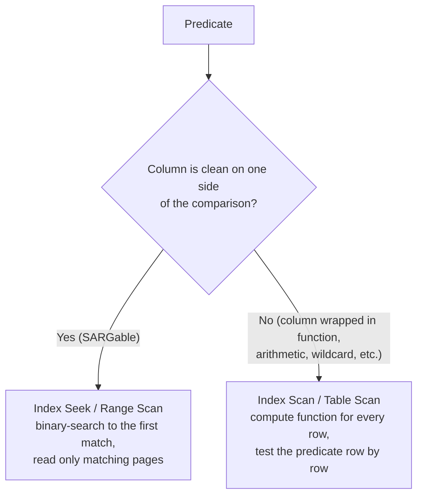

# 77. SARGability

## Fundamentals

**SARGable** is an acronym for **Search ARGument-able**.

A predicate (a condition inside `WHERE` or `ON`) is SARGable when the database engine can **seek into an index** to find matching rows, instead of reading every row and testing the condition on each one.

A predicate is SARGable if, to test it, the engine only needs to compare an **indexed column's stored value directly against a constant (or an expression that can be evaluated once)**.

> The single most important rule: **never apply a function or arithmetic to the indexed column**. Push the transformation to the _constant_ side of the comparison. The column must stand alone.

### Why it exists

Indexes (typically B-trees) store column values in **sorted order**. A sorted structure can be searched with binary search in `O(log n)` time — the engine walks the tree from root to leaf and stops at the region that satisfies the condition.

The engine can only do that if the value stored in the index is directly comparable to the search argument. If your predicate wraps the column in a function — for example `YEAR(order_date) = 2024` — the **raw** value in the index is `2024-07-22`, not `2024`. There is no place in the tree where `2024` lives, so the engine has no choice but to visit every row, evaluate `YEAR(...)`, and test.

> `WHERE function(column) = constant` → scan.
> `WHERE column = function(constant)` → seek.
>
> The difference is which side the function is on.

---

## Internal Working: Index Seek vs Index Scan

An index organizes values in order:

```
Root:        [2001 ... 5000]
              /            \
Branch:  [1001..2000]   [2001..3000] [5001..6000]
              |
Leaves: 1001 -> 1002 -> ... -> 2000   (each leaf = sorted values + row pointers)
```

- A **seek (range scan)** compares the constant against branch values, throws away large subtrees, and reads only the pages holding matches.
- A **scan** visits every leaf (or every heap row) and evaluates the predicate per row.



Even a SARGable predicate does **not** guarantee an index is used — the optimizer also considers small tables, low selectivity, and stale statistics. SARGability is **a prerequisite for seeking, not a guarantee that a seek happens**. Always confirm with `EXPLAIN` / the execution plan.

---

## Syntax (Canonical Shapes)

SARGability has no syntax of its own; it is a **property of a predicate**. These are the shapes that _can_ seek:

| Expression                                        | SARGable?        | Notes                                                        |
| ------------------------------------------------- | ---------------- | ------------------------------------------------------------ |
| `col = 5`                                         | Yes              | Equality point seek                                          |
| `col >= 5` / `col < 10` / `col > 5` / `col <= 10` | Yes              | Range seek                                                   |
| `col BETWEEN 5 AND 10`                            | Yes              | Translated to `>= 5 AND <= 10`                               |
| `col IN (1, 2, 3)`                                | Yes              | Multiple point seeks (index-merge / OR semantics per engine) |
| `col LIKE 'abc%'`                                 | Yes              | Prefix range seek (see engine notes below)                   |
| `col IS NULL` / `col IS NOT NULL`                 | Engine-dependent | See NULL behavior                                            |
| `function(col) = c`                               | No               | E.g. `UPPER(col)`, `YEAR(col)`                               |
| `col + 1 = 10`                                    | No               | Arithmetic on the column                                     |
| `col LIKE '%abc'` / `'%abc%'`                     | No               | Leading wildcard                                             |
| `col <> 5` / `col NOT IN (...)`, `NOT LIKE`       | Usually no       | Anti-conditions rarely seek                                  |
| `col = function(constant)`                        | Yes              | Function evaluated once, column clean                        |

---

## Sample Tables for This Section

Grain statements are essential before reasoning about any query.

> **Grain:** One row in `orders` represents one order placed by a customer. One row in `customers` represents one customer account.

```sql
CREATE TABLE customers (
    customer_id   INT PRIMARY KEY,
    first_name    VARCHAR(50),
    last_name     VARCHAR(50),
    created_at    TIMESTAMP
);

CREATE TABLE orders (
    order_id      INT PRIMARY KEY,
    customer_id   INT NOT NULL REFERENCES customers(customer_id),
    order_date    TIMESTAMP NOT NULL,
    total_amount  NUMERIC(10,2) NOT NULL,
    status        VARCHAR(20) NOT NULL
);

CREATE INDEX idx_orders_customer  ON orders (customer_id);
CREATE INDEX idx_orders_order_date ON orders (order_date);
```

```sql
INSERT INTO customers (customer_id, first_name, last_name, created_at) VALUES
( 55, 'Alice', 'Wilson', '2021-11-03 09:00:00'),
( 61, 'Bob',   'Johnson','2022-02-15 14:30:00'),
( 90, 'Carol', 'Miller', '2023-08-01 08:00:00');

INSERT INTO orders (order_id, customer_id, order_date, total_amount, status) VALUES
(1001, 55, '2023-01-05 10:15:00', 120.50, 'shipped'),
(1002, 55, '2024-07-19 08:45:00',  89.00, 'delivered'),
(1003, 61, '2024-07-22 14:30:00', 249.99, 'pending'),
(1004, 61, '2025-02-28 09:00:00',  15.75, 'shipped'),
(1005, 90, '2025-03-01 23:59:59', 399.00, 'refunded'),
(1006, 55, '2025-06-14 12:00:11',  64.20, 'delivered');
```

---

## The 9 Classic Non-SARGable Patterns

### Pattern 1 — Function on an indexed column

**BAD APPROACH** (always scan)

```sql
SELECT order_id, total_amount
FROM orders
WHERE YEAR(order_date) = 2024;
```

**BETTER APPROACH** (can seek)

```sql
SELECT order_id, total_amount
FROM orders
WHERE order_date  >= '2024-01-01 00:00:00'
  AND order_date  <  '2025-01-01 00:00:00';
```

**Why:** using an upper-inclusive / lower-exclusive half-open range `[2024-01-01, 2025-01-01)` is mathematically identical to "all of 2024", including the very last instant before midnight on December 31. It also handles fractional seconds and microsecond timestamps correctly.

**Expected output** (both queries):

| order_id | total_amount |
| -------- | ------------ |
| 1002     | 89.00        |
| 1003     | 249.99       |

**Verify** the plan difference:

```
-- PostgreSQL
EXPLAIN (ANALYZE, BUFFERS)
SELECT order_id, total_amount FROM orders WHERE YEAR(order_date) = 2024;
-- => Seq Scan on orders  (rows=2)  filter: (EXTRACT(year FROM order_date) = 2024)
--    each of the 6 rows read & function evaluated

EXPLAIN (ANALYZE, BUFFERS)
SELECT order_id, total_amount FROM orders
WHERE order_date >= '2024-01-01' AND order_date < '2025-01-01';
-- => Index Range Scan using idx_orders_order_date  (rows=2)
```

> Interview trap — "Rewrite `WHERE YEAR(order_date) = 2024` into a SARGable form." There is a correct reusable answer (`>= '2024-01-01' AND < '2025-01-01'`). Only accepting a function-based index is a half-answer — most databases cannot _reach_ into an index with a function unless that exact expression is indexed.

---

### Pattern 2 — Arithmetic on an indexed column

**BAD APPROACH**

```sql
SELECT order_id FROM orders
WHERE total_amount * 1.1 > 500;
```

**BETTER APPROACH** (move the math to the constant side)

```sql
SELECT order_id FROM orders
WHERE total_amount > 500 / 1.1;
```

**Why:** `total_amount * 1.1` has to be computed for every stored value. `500 / 1.1` is computed **once** by the optimizer and the result is compared to the raw column.

---

### Pattern 3 — Leading wildcard in `LIKE`

**BAD APPROACH** (suffix search — cannot seek)

```sql
SELECT * FROM customers WHERE last_name LIKE '%son';
```

**BETTER APPROACH** (prefix search — can seek)

```sql
SELECT * FROM customers WHERE last_name LIKE 'son%';
```

**Expected output:**

| customer_id | first_name | last_name |
| ----------- | ---------- | --------- |
| 61          | Bob        | Johnson   |

**Why:** a B-tree is sorted by the column's _first_ characters. `'son%'` maps to a range `['son', 'sot')`. `'%son'` has no known starting point, so every row must be checked.

**When you truly need infix `%abc%` search**, a B-tree cannot help. Use engine-specific facilities instead (see comparison table below).

> PostgreSQL — `pg_trgm` (trigram GIN index) makes `LIKE '%son'` / `%son%` index-accelerated. Also `ILIKE` is not SARGable with a plain B-tree; use a `lower(last_name)` expression index or `citext`.
> SQL Server — no built-in trigram index; a common workaround is a computed column `REVERSE(last_name)` + index to serve `'%son'` as `REVERSE(last_name) LIKE 'nos%'`. For word search, use Full-Text Search.
> Oracle — function-based index on `REVERSE(last_name)` for suffix search; Oracle Text for full-text.
> MySQL — no direct trigram index; the ngram Full-Text parser (5.7.6+) can serve substring word search with caveats; otherwise a scan.

---

### Pattern 4 — String concatenation / formatting on the column

**BAD APPROACH**

```sql
SELECT * FROM customers
WHERE first_name || ' ' || last_name = 'Bob Johnson';
```

**BETTER APPROACH** (search the columns separately, or prepare an indexed expression)

```sql
SELECT * FROM customers
WHERE first_name = 'Bob' AND last_name = 'Johnson';
```

**When you absolutely must search the concatenated value**, index the _expression_ rather than wrapping the column in the query:

```sql
-- PostgreSQL / Oracle
CREATE INDEX idx_full_name ON customers ((first_name || ' ' || last_name));

SELECT * FROM customers
WHERE (first_name || ' ' || last_name) = 'Bob Johnson';
```

> SQL Server — create a persisted computed column `full_name AS (first_name + ' ' + last_name)` and index it.
> MySQL — functional key parts (8.0.13+): `CREATE INDEX idx_full_name ON customers ((CONCAT(first_name, ' ', last_name)));`

---

### Pattern 5 — `<>`, `!=`, `NOT IN`, `NOT LIKE`

**BAD APPROACH** (typically a scan)

```sql
SELECT order_id FROM orders WHERE status <> 'shipped';
```

Most engines cannot "seek" a negative condition. They may convert it into a range scan when the domain is tiny (e.g., two or three distinct statuses), but they usually read the whole index anyway. Never _assume_ — check the plan.

**Expected result of the query above,** which follows SQL's three-valued logic:

| order_id | status    |
| -------- | --------- |
| 1003     | pending   |
| 1005     | refunded  |
| 1006     | delivered |

> Note what is missing: `status = 'shipped'` rows are correctly excluded, but also any row where `status IS NULL` would be excluded — `NOT` of an unknown is unknown. Cross-reference: NULL / three-valued logic, `NOT IN` + NULL.

---

### Pattern 6 — Implicit type conversion on the _column_ side

When you compare a string column to a number, or a timestamp column to a mismatched literal, the engine may silently cast the **column**, not the constant. That cast is a function on the column → non-SARGable.

**BAD APPROACH** (column cast)

```sql
WHERE phone_number = 2025550123;        -- phone_number is VARCHAR
WHERE order_date::text LIKE '2024%';    -- explicit cast on column
```

**BETTER APPROACH** (constant cast, or compare in the column's native type)

```sql
WHERE phone_number = '2025550123';
WHERE order_date >= '2024-01-01' AND order_date < '2025-01-01';
```

Engine-specific conversion direction (this bites people who switch databases):

> MySQL — `WHERE varchar_col = 5` converts the **string column to a number** (both operands become doubles) → non-SARGable.
> SQL Server — implicit conversion applies the **higher-precedence data type**: comparing `varchar_col` to an `int` converts the column to `int` → non-SARGable.
> PostgreSQL — strict typing: `varchar_col = 5` attempts to cast the **integer constant to text** → column stays clean (SARGable), but the query may error if the operator doesn't exist.
> Oracle — same direction issues exist; `varchar = number` converts the string to number → non-SARGable in practice.

A timestamp equality also hides a trap:

```sql
WHERE order_date = '2024-07-22';   -- matches ONLY 2024-07-22 00:00:00.000000
```

In most engines the string literal is cast to the column type, so the predicate is SARGable but **wrong logically** — it finds only the exact-midnight row, not the whole day.

---

### Pattern 7 — `OR` across different columns

**BAD APPROACH** (index seek on `idx_orders_status` and `idx_orders_order_id` separately is hard for one condition)

```sql
SELECT * FROM orders
WHERE status = 'shipped' OR order_id = 1005;
```

**BETTER APPROACH** — split into two independently SARGable branches:

```sql
SELECT * FROM orders WHERE status = 'shipped'
UNION -- or UNION ALL if you accept duplicates can't occur
SELECT * FROM orders WHERE order_id = 1005;
```

```sql
-- Alternatively, one seekable shape when both branches are on the same column:
SELECT * FROM orders WHERE status IN ('shipped', 'pending');
```

Engine behavior for `OR`:

> MySQL / MariaDB — `index_merge` ("index_merge_intersection / union") can combine two indexes for `OR`, but it is optimizer-subject to selectivity, so verify.
> PostgreSQL — since **PostgreSQL 18 (2025)** B-tree scans can handle some `OR` expressions against the same index; older versions fell back to `BitmapOr` or a scan.
> SQL Server — may use an index union / concatenation for `OR`, or a scan when selectivity is poor.

> Production pitfall — `IN (1, 2, 3)` is almost always _better_ than chained `OR` on the same column, but `OR` across _different_ columns is where people first discover non-SARGability.

---

### Pattern 8 — `LEFT()` / `SUBSTRING()` / `TRIM()` on the column

```sql
-- BAD
WHERE LEFT(order_date::text, 10) = '2024-07-22';
WHERE TRIM(city) = 'Berlin';
WHERE SUBSTRING(id::text, 1, 3) = 'ORD';

-- BETTER
WHERE order_date >= '2024-07-22' AND order_date < '2024-07-23';
```

If trailing/leading spaces are a real data quality problem, fix the **data** (`UPDATE ... SET city = TRIM(city)` + a unique constraint / CHECK), don't punish every query with a non-SARGable expression.

---

### Pattern 9 — `DATEADD` / `DATE_TRUNC` / `EXTRACT` on the column

**BAD APPROACH**

```sql
-- SQL Server
SELECT * FROM orders WHERE DATEADD(year, -1, order_date) >= '2024-01-01';
-- PostgreSQL / MySQL
SELECT * FROM orders WHERE DATE_TRUNC('month', order_date) = '2024-07-01';
```

**BETTER APPROACH** — move the transformation to the constant side:

```sql
SELECT * FROM orders WHERE order_date >= DATEADD(year, -1, '2024-01-01');
-- Wait — that is also wrong direction in a different way. See below.
```

Correction — the valid rewrite is a half-open range on the **column** with the _constant_ computed:

```sql
SELECT * FROM orders
WHERE order_date >= DATE_TRUNC('month', TIMESTAMP '2024-08-01')
  AND order_date <  DATE_TRUNC('month', TIMESTAMP '2024-08-01') + INTERVAL '1 month';
```

Here `DATE_TRUNC` runs **once on a constant**, so the column stays clean and the predicate remains SARGable.

---

## NULL Behavior

NULL interacts with SARGability in several important, engine-specific ways.

| Statement                                                   | Effect                                                                                                                                   |
| ----------------------------------------------------------- | ---------------------------------------------------------------------------------------------------------------------------------------- |
| `WHERE col = NULL`                                          | Matches **nothing** (unknown result) — it is a logic bug, not an optimization issue. Cross-reference: three-valued logic, `NULL = NULL`. |
| `WHERE col IS NULL`                                         | Correct null test. Whether it seeks depends on whether the engine stores NULLs in indexes.                                               |
| `WHERE col <> 'x'`                                          | Excludes NULL rows (unknown is not true).                                                                                                |
| `WHERE NOT (col = 'x')`                                     | Same as above — also excludes NULLs.                                                                                                     |
| `COALESCE(col, ...)` / `NULLIF(col, ...)` as column wrapper | Non-SARGable — the function sits on the column.                                                                                          |

**Where NULLs live in B-tree indexes (this determines `IS NULL` seekability):**

> PostgreSQL — B-tree indexes store NULLs by default (`NULLS LAST` for ascending order). `col IS NULL` can typically use an index seek. You can even add a partial index that only covers NULLs.
> MySQL (InnoDB) — NULLs are stored in (secondary) indexes; `col IS NULL` is ordinarily served from the index.
> SQL Server — NULLs are stored in indexes like ordinary values; `IS NULL` can in many cases be an index seek. This is optimizer-dependent — confirm with the actual plan.
> Oracle — B-tree indexes **omit rows where all indexed columns are NULL**. `col IS NULL` therefore cannot be answered by a B-tree seek (Oracle may do an index fast full scan or a table scan). Options: a bitmap index stores NULLs, or use a **function-based index**, e.g. `CREATE INDEX idx_o_null ON orders (CASE WHEN order_date IS NULL THEN NULL ELSE 1 END);` which allows seeking the `IS NULL` branch.

> Common misconception — "Indexes can't help with NULL." That was true for entire-row-NULL keys on classic Oracle B-trees, but the behavior is engine- and version-specific. Test with the plan.

---

## SARGability and Composite Indexes

For a composite index `(customer_id, order_date)`, the **leftmost-prefix rule** applies:

```sql
CREATE INDEX idx_orders_customer_date ON orders (customer_id, order_date);
```

| Predicate                                               | Can it use the composite index efficiently?                                                                                                                                                                                                                       |
| ------------------------------------------------------- | ----------------------------------------------------------------------------------------------------------------------------------------------------------------------------------------------------------------------------------------------------------------- |
| `WHERE customer_id = 55 AND order_date >= '2024-01-01'` | Yes — seek on `customer_id`, then a seek on `order_date` within that prefix.                                                                                                                                                                                      |
| `WHERE order_date >= '2024-01-01'` alone                | Weak — the leading column `customer_id` is unconstrained; the engine cannot skip columns in general (MySQL has a specialized _skip scan_ only under conditions). A separate single-column index on `order_date` (like `idx_orders_order_date`) is the better fit. |

The point: **SARGability is not just about functions — it is also about which column is the leading key.** Cross-reference: composite indexes, covering indexes.

---

## When To Use / When NOT To Use

**Use SARGable predicates** whenever:

- the column is indexed and selectivity is reasonable;
- the query will run against large tables repeatedly (hot production queries);
- you write date-range reports, pagination, or joins on indexed keys.

**SARGability is NOT the deciding factor when:**

- the table is tiny (a scan of 20 rows beats any index-traversal overhead);
- the predicate is non-selective (`WHERE gender = 'M'` on a balanced column);
- the condition applies only to a filter on an expression you already indexed;
- the engine has a purpose-built facility (full-text, trigram) that beats a B-tree anyway.

> Do not assume "SARGable ⇒ uses the index" or "non-SARGable ⇒ the plan is always bad." Query shape, statistics, cardinality, and the optimizer decide. Measure with `EXPLAIN` / execution plan.

---

## Performance Implications

- **Non-SARGable** predicate → full scan + the function evaluated on every row. Cost grows with table size even when only a few rows match.
- **SARGable** predicate → engine can bound the search within the index and skip irrelevant pages. Cost is proportional to the number of **matching** rows, not the whole table.
- Expression indexes / function-based indexes / computed columns **can make a `function(col) = c` expression seekable** — but the expression in the query must match the indexed expression **textually/type-exactly**, or the optimizer will not recognize it.
- Functions on a **partition key** can also disable partition pruning, in addition to blocking the seek (PostgreSQL, MySQL, Oracle).
- Each extra index adds write amplification and storage. Do not add an expression index for a query that is rare, or a function index when rewriting the predicate is simpler.

> Production pitfall — Keep `ANALYZE`/`UPDATE STATISTICS` current. An index the optimizer _forgets_ (stale statistics) behaves like a non-SARGable query at runtime: full scan returns, silently.

---

## Edge Cases

- **Implicit `LIKE` case handling**: under a case-insensitive collation (typical SQL Server, MySQL), `LIKE 'a%'` widens into a range covering case variants — still SARGable but fewer pages skipped than with a binary/case-sensitive collation. In PostgreSQL, `ILIKE` is **not** SARGable with a plain B-tree; use `lower(last_name)` expression index or `citext`.
- **Trailing wildcard only**: `LIKE 'abc%'` is SARGable; `LIKE '%abc'`, `LIKE '%abc%'`, and `LIKE 'a_bc%'` are not (the `_` in fact still allows a small range expansion — the _leading_ special character is what kills the seek; engines handle this differently, so verify).
- **`BETWEEN` is inclusive on both ends**: for timestamps, prefer `>= start AND < end` so the upper boundary is exclusive.
- **`IN (...)` with NULL**: `WHERE col IN (1, NULL)` still matches `col = 1` (NULL only participates in the "unknown" branch); `WHERE col NOT IN (1, NULL)` matches **zero rows**. Cross-reference: NOT IN + NULL.
- **Escaping user input**: interpolating raw user text into `LIKE '%' + input + '%'` both breaks SARGability and risks injection; parameterize, and reconsider the search strategy (trigram / full-text).
- **Trailing spaces in `CHAR(n)`**: comparison semantics for padded/short strings vary (MySQL ignores trailing spaces in comparisons); range boundaries can be broader than visually expected.

---

## Best Practices (Summary)

1. **Keep the indexed column clean**: `column <op> constant`, with any transformation on the constant side.
2. **Dates use half-open ranges**: `col >= start AND col < next_start`.
3. **Use `IN (...)` rather than chains of `OR`; avoid `OR` across different columns** unless you verified index-merge / PG-18-style OR scans.
4. **When you genuinely must search a transformed/concatenated/trigram value**, index the _expression_ (expression index, function-based index, computed column, functional key part, trigram index) — do not keep shooting a non-SARGable query at a raw column.
5. **Stay type-consistent**: compare timestamps to timestamps, strings to strings, and watch implicit conversion direction per engine.
6. **Fix dirty data instead of `TRIM()`-on-column patterns**.
7. **Verify every claim with the plan**: PostgreSQL `EXPLAIN (ANALYZE, BUFFERS)`, MySQL `EXPLAIN ANALYZE` / `EXPLAIN FORMAT=JSON`, SQL Server "Include Actual Execution Plan" / `SET STATISTICS IO, TIME ON`, Oracle `EXPLAIN PLAN` / `DBMS_XPLAN`.

> Production pitfall — Never add an index "because the query has a WHERE clause." The query first has to be SARGable for that index to matter; then the optimizer has to _choose_ it.

---

## Engine Cheat Sheet

| Capability               | PostgreSQL                                  | MySQL                                           | SQL Server                               | Oracle                           |
| ------------------------ | ------------------------------------------- | ----------------------------------------------- | ---------------------------------------- | -------------------------------- |
| Index on an expression   | Expression index (`ON t ((expr))`)          | Functional key parts (8.0.13+)                  | Computed/persisted column + index        | Function-based index             |
| NULLs stored in B-tree   | Yes (default)                               | Yes (InnoDB)                                    | Yes                                      | No — fully-NULL keys omitted     |
| `IS NULL` can seek       | Usually yes                                 | Usually yes                                     | Usually, verify plan                     | No (use bitmap / FBI workaround) |
| Substring / infix search | `pg_trgm` GIN index                         | Full-Text ngram parser (caveats)                | `REVERSE()` computed column or Full-Text | `REVERSE()` FBI or Oracle Text   |
| Case-insensitive `LIKE`  | Use `lower()` expr index / `citext`         | Collation-dependent (CI collations widen range) | Collation-dependent                      | Collation/NLS-dependent          |
| `OR` across columns      | PG 18+: B-tree OR scans; older → `BitmapOr` | `index_merge` (optimizer-dependent)             | Index union / concatenation              | Index merge / manual `UNION ALL` |

---

## Cross-References

Briefly related sections of the handbook (not expanded here): Indexes, Composite Indexes, Covering Indexes, Execution Plans, Query Optimization, EXPLAIN / `EXPLAIN ANALYZE`, NULL & Three-Valued Logic, `NOT IN` + NULL, Keyset Pagination (keyset pagination depends on SARGable range predicates), Timestamp Boundaries & Timezones, Partitioning.

---

# Interview Questions

## Beginner

1. What does SARGable mean, and what is the acronym short for?
2. For each predicate, say SARGable or not: `name = 'Alice'`, `name LIKE '%ice'`, `age + 1 > 30`, `age > 29`, `UPPER(name) = 'ALICE'`.
3. Why does wrapping an indexed column in a function prevent an index seek?
4. Is `LIKE 'abc%'` SARGable? What about `LIKE '%abc'`?
5. What is the difference between an index seek and an index scan?

## Intermediate

6. Rewrite `WHERE EXTRACT(YEAR FROM hire_date) = 2024` (PostgreSQL/Oracle) or `WHERE YEAR(hire_date) = 2024` (MySQL/SQL Server) into a SARGable range predicate.
7. `WHERE total_amount * 1.1 > 500` — rewrite it SARGably and explain why the rewrite is mathematically equivalent.
8. How does implicit type conversion affect SARGability? Give one MySQL and one SQL Server example that differ.
9. For a composite index `(customer_id, order_date)`, why is `WHERE order_date >= '2024-01-01'` alone weakly served? Explain the leftmost-prefix rule.
10. Does `WHERE col IS NULL` use an index in PostgreSQL? In Oracle? Why do they differ?

## Advanced

11. Compare expression indexes (PostgreSQL), function-based indexes (Oracle), computed columns (SQL Server), and functional key parts (MySQL) as remedies for non-SARGable queries. What exact conditions must hold for the optimizer to match a query expression to the indexed expression?
12. Explain how a half-open range `[start, end)` avoids the "last second of the day" bug, including microsecond timestamps.
13. How can stored/indexed `LOWER(last_name)` or a `citext` column make `ILIKE '%...%'` efficient, and what are the storage/collation trade-offs?

## Scenario Based

14. Your report query "all orders in 2024" is a full scan though `order_date` is indexed. Show the fix, the corrected plan you expect, and what you would check in `EXPLAIN` before trusting it.
15. A `%search%` user-search box is running scans over a 10M-row text table. Walk through three options (trigram, full-text, B-tree prefix) and how you'd decide using data distribution.
16. Orders table: `WHERE status = 'shipped' OR order_id = 1005` is scanning. What rewrite(s) would you propose, and when would the optimizer still choose a scan even after the rewrite?

## Tricky

17. `WHERE col = 10 - 1` — SARGable or not? What about `WHERE col = 10 / 2`?
18. `WHERE order_date = '2024-07-22'` on a `TIMESTAMP` column is SARGable — but is it _correct_? Explain.
19. After you add an index on `UPPER(last_name)`, the query `WHERE UPPER(last_name) = 'SMITH'` still scans in PostgreSQL. What could be wrong?
20. `WHERE NOT (status = 'shipped')` — how many rows does it return if some `status` values are NULL, and why?

## Output Prediction

21. Given the `orders` data above, what is the output of:

```sql
SELECT status FROM orders WHERE status <> 'shipped';
```

What is _not_ in the output, and why does NULL matter here? 22. Given the data above, predict the result and the _plan_ shape (seek vs scan) of:

```sql
SELECT order_id FROM orders WHERE order_date >= '2024-01-01' AND order_date < '2025-01-01';
```

## Debugging

23. A query that used an index yesterday is scanning today. List the investigation steps that are _not_ about the predicate text.
24. `LEFT(order_date::text, 10) = '2024-07-1' || '9'` — apart from the syntax, why is the whole predicate non-SARGable, and what's the correct rewrite?
25. User-entered `LIKE` text isn't escaped and comes in as `%abc%`. How does this interact with SARGability and with injection safety?

## Performance

26. "Non-SARGable predicates are always a disaster; SARGable ones are always fast." Is this claim correct? Justify with table size, selectivity, and statistics.
27. How would you prove to your team — using `EXPLAIN (ANALYZE, BUFFERS)` (PostgreSQL), an actual execution plan (SQL Server), or `EXPLAIN ANALYZE` (MySQL) — that the rewrite from Pattern 1 actually avoids the per-row function evaluation?
28. When is adding an expression index _more_ appropriate than rewriting the predicate, and when is rewriting the predicate the better engineering choice?

_Answers are intentionally omitted so these can be used as practice — the section above contains everything needed to verify them._
