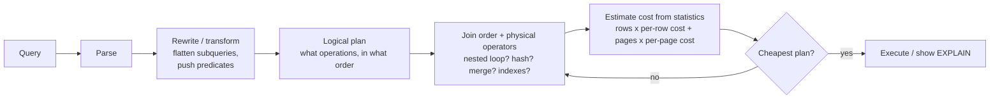

The file is empty and ready. I'll now write Section 78 in the handbook's established style, with verified, engine-accurate content.
I noticed two typos in the file. Let me fix them.
Section 78 written to `sql-handbook/9-Optimization/78-EXPLAIN-Execution-Plans.md`.

Covers:

- **Fundamentals** — what a plan is, estimated vs actual plans, why explain exists
- **Per-engine syntax** — PostgreSQL (`EXPLAIN (ANALYZE, BUFFERS, JSON...)`), MySQL (`EXPLAIN FORMAT=...`, `EXPLAIN ANALYZE`, `FOR CONNECTION`), SQL Server (`SHOWPLAN`/`STATISTICS IO, TIME`/Query Store), Oracle (`EXPLAIN PLAN` + `DBMS_XPLAN`, `DISPLAY_CURSOR ALLSTATS LAST`, AUTOTRACE)
- **Plan anatomy** — cost, rows, width, loops, buffers decoded line-by-line
- **Plan node zoo** — scan/access, join, sort/aggregate mapped across all four engines
- **Internal working** — optimizer pipeline, cardinality estimation, where estimates break
- **Scenario-based examples** — missing index, MySQL tabular reads, unnecessary sort, covering-index lookups, cardinality misestimate (E-Rows vs A-Rows), hash join judgment
- **NULL behavior, edge cases, BAD vs BETTER, mistakes, production pitfalls, best practices, engine comparison table**
- **40 interview questions** across all seven categories

Fixed two typos during review. FAQ-worthy notes: `cost` is dimensionless, `EXPLAIN ANALYZE` executes real writes (rollback wrapper shown), and no absolute performance claims are made — every optimization is tied back to verification via the plan.
join method, sort placement). 2. **See the optimizer's estimate** for how many rows each step will produce. 3. **Compare estimates to reality** (with `EXPLAIN ANALYZE` / actual plans), which is where 90% of real problems surface. 4. **Verify a fix** (an index, a rewritten predicate, a gathered statistic) actually changed the plan.

### The two kinds of plan

| Kind                                                                                                                              | Produces                                    | Executes the query? | Tells you                                                                   |
| --------------------------------------------------------------------------------------------------------------------------------- | ------------------------------------------- | ------------------- | --------------------------------------------------------------------------- |
| **Estimated plan** (`EXPLAIN` alone, `SET SHOWPLAN_TEXT ON`, `EXPLAIN PLAN FOR`)                                                  | Plan based on **statistics only**           | No                  | What the optimizer _thinks_ it will do and roughly how many rows it expects |
| **Actual plan** (`EXPLAIN ANALYZE`, `SET STATISTICS PROFILE ON`, `Live Query Statistics`, `DBMS_XPLAN.DISPLAY_CURSOR` with stats) | The real plan plus **runtime measurements** | Yes                 | What literally happened: real rows, real time, loops, buffers               |

The estimated plan is a _forecast_. The actual plan is the _reality_. The gap between the two is the single most important diagnostic signal in SQL optimization.

> Common misconception: "The plan is wrong." The plan is the optimizer's honest attempt given the statistics it has. If the estimate is absurd, you usually have stale or missing statistics — not a broken optimizer. Fix the statistics first, then re-examine the plan.

---

## Syntax

EXPLAIN is **not ANSI SQL** — every engine has its own variant and output. This is the first thing to accept before cross-database work.

### PostgreSQL

```sql
EXPLAIN [ ( option [, ...] ) ] statement;

option:
  ANALYZE [bool]   -- execute for real and show actual rows/time/loops
  VERBOSE [bool]
  COSTS  [bool]
  BUFFERS [bool]   -- page reads (shared hit/read/dirtied/written)  -- needs ANALYZE
  TIMING [bool]
  SUMMARY [bool]
  SETTINGS [bool]
  GENERIC_PLAN [bool]
  WAL [bool]       -- needs ANALYZE
  FORMAT {TEXT | XML | JSON | YAML}
```

The text form is the default and the one to start with:

```sql
EXPLAIN
SELECT order_id, total_amount
FROM orders
WHERE customer_id = 9001;
```

For a real run:

```sql
EXPLAIN (ANALYZE, BUFFERS)
SELECT order_id, total_amount
FROM orders
WHERE customer_id = 9001;
```

> `EXPLAIN` on `INSERT/UPDATE/DELETE` does not execute the statement, but `EXPLAIN ANALYZE` **does**. Wrap write statements in a transaction and roll back so the benchmark doesn't change data:
>
> ```sql
> BEGIN;
> EXPLAIN (ANALYZE, BUFFERS) DELETE FROM orders WHERE order_date < '2024-01-01';
> ROLLBACK;
> ```

### MySQL

```sql
EXPLAIN [FORMAT = {TRADITIONAL | JSON | TREE}] select_statement;
EXPLAIN ANALYZE [FORMAT = TREE] select_statement;        -- MySQL 8.0.18+
EXPLAIN FOR CONNECTION <connection_id>;                   -- plan of a query already running
```

- `TRADITIONAL` is the classic **tabular** output (one row per table + `type`, `key`, `rows`, `Extra`).
- `JSON` gives a machine-readable tree with cost numbers (`cost_info`, `query_cost`).
- `EXPLAIN ANALYZE` executes the statement and reports per-iterator time and rows.
- `DESCRIBE` / `DESC` are synonyms for `EXPLAIN`.

### SQL Server

No `EXPLAIN` keyword. Use:

```sql
-- estimated plans (do not execute)
SET SHOWPLAN_ALL ON;     -- or SET SHOWPLAN_TEXT ON / SET SHOWPLAN_XML ON
GO
<your query>
GO
SET SHOWPLAN_ALL OFF;

-- actual plans (execute + measure)
SET STATISTICS IO ON;    -- logical/physical reads per table
SET STATISTICS TIME ON;  -- CPU + elapsed ms
GO
<your query>
GO
SET STATISTICS IO OFF;
SET STATISTICS TIME OFF;
```

The **graphical plan** (SSMS / Azure Data Studio): Ctrl+L for estimated, Ctrl+M (or "Include Actual Execution Plan") for actual. The **Query Store** records per-query compiled plans and runtime aggregates so you can detect plan regressions over time.

### Oracle

`EXPLAIN PLAN` **writes rows into a plan table** (no useful screen output by itself) — you then format them:

```sql
EXPLAIN PLAN FOR
SELECT order_id, total_amount FROM orders WHERE customer_id = 9001;

SELECT * FROM TABLE(DBMS_XPLAN.DISPLAY);
```

`DBMS_XPLAN.DISPLAY` uses the default `TYPICAL` format. For **actual** runtime stats from the cursor cache:

```sql
SELECT * FROM TABLE(DBMS_XPLAN.DISPLAY_CURSOR(NULL, NULL, 'ALLSTATS LAST'));
-- needs GATHER_PLAN_STATISTICS hint (or STATISTICS_LEVEL=ALL) on the query
```

Or in SQL\*Plus / SQLcl:

```sql
SET AUTOTRACE TRACEONLY EXPLAIN   -- plan only, no execution
SET AUTOTRACE ON                  -- executes, prints plan + stats
```

---

## Sample Tables and Grain

Every example below uses this schema. **State the grain before reasoning about a plan** — a plan only makes sense relative to row volumes and what a row means.

```sql
CREATE TABLE customers (
    customer_id  INT PRIMARY KEY,
    first_name   VARCHAR(50) NOT NULL,
    last_name    VARCHAR(50) NOT NULL,
    created_at   TIMESTAMP
);

CREATE TABLE orders (
    order_id     INT PRIMARY KEY,
    customer_id  INT NOT NULL REFERENCES customers(customer_id),
    employee_id  INT NOT NULL,
    order_date   DATE NOT NULL,
    status       VARCHAR(20) NOT NULL,
    total_amount DECIMAL(12,2) NOT NULL
);

CREATE TABLE order_items (
    order_id    INT NOT NULL REFERENCES orders(order_id),
    product_id  INT NOT NULL,
    quantity    INT NOT NULL,
    price       DECIMAL(10,2) NOT NULL,
    PRIMARY KEY (order_id, product_id)
);

INSERT INTO customers (customer_id, first_name, last_name, created_at) VALUES
(9001, 'Alice', 'Wilson',  '2021-11-03 09:00:00'),
(9002, 'Bob',   'Johnson', '2022-02-15 14:30:00'),
(9003, 'Carol', 'Miller',  '2023-08-01 08:00:00'),
(9004, 'Dave',   'Smith',   '2024-01-19 11:45:00');

INSERT INTO orders (order_id, customer_id, employee_id, order_date, status, total_amount) VALUES
(5001, 9001, 101, '2025-01-05', 'completed', 1240.50),
(5002, 9001, 102, '2025-01-06', 'completed',   89.99),
(5003, 9002, 103, '2025-01-08', 'shipped',   4520.00),
(5004, 9003, 101, '2025-01-10', 'processing', 210.00),
(5005, 9004, 102, '2025-01-12', 'pending',    1500.00),
(5006, 9002, 101, '2025-01-15', 'cancelled',  120.00);

INSERT INTO order_items (order_id, product_id, quantity, price) VALUES
(5001, 701, 2, 600.00),
(5001, 702, 1,  40.50),
(5002, 703, 3,  29.99),
(5003, 701, 4, 600.00),
(5003, 704, 2, 1060.00),
(5004, 705, 1, 210.00),
(5005, 706, 5,  60.00),
(5006, 702, 1,  40.50);
```

| Table         | Grain                                                                |
| ------------- | -------------------------------------------------------------------- |
| `customers`   | One row = one customer account.                                      |
| `orders`      | One row = one order placed by one customer, handled by one employee. |
| `order_items` | One row = one line item (one product within one order).              |

> For the plan exercises below, imagine real production volumes — e.g., 5M `customers`, 50M `orders`, 200M `order_items`. The _data_ shown is the demo subset; the plan shapes you should expect are the large-volume shapes.

---

## Anatomy of an EXPLAIN Plan (PostgreSQL Walkthrough)

Take a tiny, deliberately simple query:

```sql
EXPLAIN (ANALYZE, BUFFERS)
SELECT order_id, total_amount
FROM orders
WHERE customer_id = 9001;
```

(No index on `customer_id` yet. Six demo rows.)

```text
Seq Scan on orders  (cost=0.00..1.09 rows=2 width=18) (actual time=0.012..0.016 rows=2 loops=1)
  Filter: (customer_id = 9001)
  Rows Removed by Filter: 4
  Buffers: shared read=1
Planning Time: 0.083 ms
Execution Time: 0.021 ms
```

Read it piece by piece:

| Token                                       | Meaning                                                                                                                                                          |
| ------------------------------------------- | ---------------------------------------------------------------------------------------------------------------------------------------------------------------- |
| `Seq Scan on orders`                        | Full scan of the table — read every row.                                                                                                                         |
| `cost=0.00..1.09`                           | **Estimated** cost. `0.00` = startup (work done before producing the first row); `1.09` = total cost. Unit is arbitrary — only usable for _relative_ comparison. |
| `rows=2`                                    | **Estimated** rows the optimizer thinks this step returns (from statistics + predicate selectivity).                                                             |
| `width=18`                                  | **Estimated** average output row width in bytes (drives how much memory the parent steps estimate).                                                              |
| `Filter: (customer_id = 9001)`              | The predicate is applied as a residual filter **after** reading each row — the hallmark of a scan, _not_ an index condition.                                     |
| `Rows Removed by Filter: 4`                 | Runtime fact: 4 of the 6 rows were read and discarded.                                                                                                           |
| `(actual time=0.012..0.016 rows=2 loops=1)` | **Actual** timing (ms) from start to first row and to completion; **actual rows** returned per loop; `loops` = how many times this node ran.                     |
| `Buffers: shared read=1`                    | One 8 KB page was read from disk — the whole table fits in a page.                                                                                               |
| `Planning Time` / `Execution Time`          | Wall-clock planning and execution for this execution.                                                                                                            |

### Reading `loops` correctly

If a node runs 100 times, `actual time` and `rows` are shown **per loop**, not cumulative. Total time ≈ `actual_time × loops`. When you see `rows=1`, `loops=50000` under a join, that node was re-executed 50,000 times — a nested-loop smell.

### cost is not seconds

The cost number is a fictional, weighted sum of estimated I/O and CPU work, tuned by settings like `seq_page_cost`, `random_page_cost`, `cpu_tuple_cost` (PostgreSQL), `io_capacity`/`concurrency` (MySQL), or cost model constants in SQL Server/Oracle. Use it to rank _plans for the same workload_, never as a latency number.

> Common misconception: "`cost=1000` means 1000 milliseconds." No. Cost is dimensionless and engine-internal. Actual elapsed time is what `EXPLAIN ANALYZE` shows.

---

## The Plan Node Zoo

Node names differ by engine, but every engine has the same family. When reading a foreign plan, convert names to these roles.

### Table/scan access nodes

| Role                                             | PostgreSQL                               | MySQL (`type` column)                      | SQL Server                             | Oracle                                             |
| ------------------------------------------------ | ---------------------------------------- | ------------------------------------------ | -------------------------------------- | -------------------------------------------------- |
| Full table read                                  | `Seq Scan`                               | `ALL` (+ `Using where`)                    | `Table Scan` / `Clustered Index Scan`  | `TABLE ACCESS FULL`                                |
| Index point/range lookup                         | `Index Scan`                             | `const`, `eq_ref`, `ref`, `range`          | `Index Seek`                           | `INDEX UNIQUE SCAN` / `INDEX RANGE SCAN`           |
| Read only the index (no table visit)             | `Index Only Scan`                        | `Using index` (Extra)                      | Nonclustered covering scan             | `INDEX FULL SCAN` / `INDEX FAST FULL SCAN`         |
| Match many rows via index, then fetch from table | `Bitmap Index Scan` + `Bitmap Heap Scan` | `Using index condition` (ICP), index_merge | `Key Lookup` / `RID Lookup` after seek | `INDEX RANGE SCAN` + `TABLE ACCESS BY INDEX ROWID` |
| Filter applied as residual predicate             | `Filter`                                 | `Using where`                              | Predicate/residual                     | `filter` predicates in plan notes                  |

### Join nodes

| Role                                  | PostgreSQL                                 | MySQL                              | SQL Server          | Oracle                                   |
| ------------------------------------- | ------------------------------------------ | ---------------------------------- | ------------------- | ---------------------------------------- |
| For each outer row, look up inner     | `Nested Loop`                              | `Nested loop`                      | `Nested Loops`      | `NESTED LOOPS`                           |
| Build hash of inner, probe with outer | `Hash Join` (+ `Hash`)                     | `InnerHashJoin` (8.0.18+)          | `Hash Match (Join)` | `HASH JOIN`                              |
| Merge two sorted inputs               | `Merge Join`                               | (rare; via index order)            | `Merge Join`        | `MERGE JOIN` (more commonly `HASH JOIN`) |
| "Exists"-style join                   | `Nested Loop Semi Join` / `Hash Semi Join` | `Exists`/`Not exists` optimization | semi join operator  | `NESTED LOOPS (SEMI)`                    |

### Sort and aggregation nodes

| Role                     | PostgreSQL                            | MySQL                    | SQL Server               | Oracle          |
| ------------------------ | ------------------------------------- | ------------------------ | ------------------------ | --------------- |
| Explicit sort            | `Sort` (+ `Sort Key`)                 | `Using filesort` (Extra) | `Sort`                   | `SORT ORDER BY` |
| Group with ordered input | `GroupAggregate` / `Incremental Sort` | filesort for `GROUP BY`  | `Stream Aggregate`       | `SORT GROUP BY` |
| Group with hashing       | `HashAggregate`                       | `Hash aggregation`       | `Hash Match (Aggregate)` | `HASH GROUP BY` |

> MySQL's traditional output is row-based (one row _per table_), not node-based. This is why "a MySQL plan" looks so different. `EXPLAIN FORMAT=TREE` and `EXPLAIN ANALYZE` produce the nested iterator tree that matches the other engines' mental model.

---

## Internal Working: How the Optimizer Builds a Plan

No engine enumerates _every_ possible plan; each uses heuristics plus a search. The general pipeline:



The optimizer's arithmetic, at heart:

```
estimated rows per step  ≈  input rows  ×  selectivity of each predicate
total cost              ≈  Σ( I/O cost + CPU cost ) over all nodes
```

Every node carries an **estimate** (`rows=`) that parents use to pick join methods and memory. Two facts follow:

1. **The plan is only as good as the statistics.** Stale or missing statistics poison every downstream decision. Cross-reference: `79-Cardinality-and-Statistics`.
2. **Estimated vs actual row mismatch is the #1 signal.** It means the optimizer built the plan on a wrong assumption, typically: correlated columns, skewed values, functions/variables it can't estimate, or a table that grew after the last `ANALYZE`.

> Oracle: the optimizer also maintains _extended statistics_ (column groups), _dynamic sampling_, and _SQL plan directives_ (auto-learned corrections when estimates were wrong). SQL Server's Query Store tracks plan regressions; PostgreSQL 18 adds memory/SERIALIZE reporting. The concepts stay the same — always check whether the engine has a "the optimizer admitted it guessed wrong" facility.

---

## How to Read a Plan Like a Detective

A repeatable sequence — always the same order:

1. **Read from the bottom (leaves) up.** Leaves touch tables/indexes first; the top node produces the final output.
2. **Start with the actual rows.** Find the biggest gap between `rows=` (estimate) and `(actual rows=)`.
3. **Find the widest/fattest nodes.** The join or scan that processes the most rows dominates cost.
4. **Look for the four classic smells**, each with a mechanical consequence:
   - a **scan with a filter** where a seek was expected → missing index or non-SARGable predicate (Section 77);
   - an **explicit `Sort`** → no index matched the `ORDER BY`/`GROUP BY`/`DISTINCT` order;
   - a **nested loop with a huge `loops=` count** → the inner side is being re-looked-up per outer row, and its inner `Index Cond` is missing or non-selective;
   - **the estimated/actual row delta** → statistics or selectivity assumption broken.
5. **Check the join node's condition**: is the predicate pushed into the access node (`Index Cond` / `Seek Predicates`) or left as a `Join Filter`/`Filter`? Late filtering means rows travelled further than necessary.
6. **Read the memory/IO signals**: `Buffers:\ read=`, spills to disk, `tempdb spill`, `Used-Mem` vs `1Mem`.

---

## Scenario-Based Examples

### Scenario 1 — Missing index: scanned when (PostgreSQL)

The "my orders" page query on a 50M-row `orders` table:

```sql
EXPLAIN (ANALYZE, BUFFERS)
SELECT order_id, order_date, total_amount
FROM orders
WHERE customer_id = 9002;
```

```text
Seq Scan on orders  (cost=0.00..959137.00 rows=5403238 width=18)
                    (actual time=0.043..2314.887 rows=2 loops=1)
  Filter: (customer_id = 9002)
  Rows Removed by Filter: 49999998
  Buffers: shared hit=1 read=312841
Execution Time: 2314.933 ms
```

**Symptoms:** `Seq Scan`, a `Filter`, every row read (`Rows Removed by Filter` ≈ all of them), ~313k page reads, 2.3 seconds.

**Fix** (create the index, then re-EXPLAIN):

```sql
CREATE INDEX idx_orders_customer_id ON orders (customer_id);
```

```text
Bitmap Heap Scan on orders  (cost=4.30..11249.43 rows=2 width=18)
                            (actual time=0.024..0.026 rows=2 loops=1)
  Recheck Cond: (customer_id = 9002)
  Heap Blocks: exact=2
  Buffers: shared hit=4
  ->  Bitmap Index Scan on idx_orders_customer_id  (cost=0.00..4.30 rows=2 width=0)
                    (actual time=0.013..0.013 rows=2 loops=1)
        Index Cond: (customer_id = 9002)
        Buffers: shared hit=2
Execution Time: 0.043 ms
```

**Explanation of the new plan:** the `Bitmap Index Scan` seeks the index for a tiny row-id list (`rows=2`), then `Bitmap Heap Scan` fetches exactly those two rows — 4 buffer hits instead of ~313k. bitmaps can be used for modifying the _same_ row only once per statement; that's why the engine may choose a `Bitmap Heap Recheck`.

> Estimate vs actual: notice `rows=5403238` **estimated** on the scan vs `actual rows=2`. The optimizer severely overestimated selectivity (because stats on `customer_id` were stale) and _still chose a scan_ — with only 2 actual matches that scan is catastrophic. Gather stats and re-test. This is the double lesson: run `ANALYZE`, and look at both numbers.

### Scenario 2 — Filter pushes into a seek (MySQL)

Same idea, MySQL shape. Before the index:

```sql
EXPLAIN SELECT order_id, order_date, total_amount
       FROM orders WHERE customer_id = 9002;
```

```text
+----+-------------+--------+------------+------+---------------+------+---------+------+----------+----------+----------+
| id | select_type | table  | partitions | type | possible_keys | key  | key_len | ref  | rows     | filtered | Extra |
+----+-------------+--------+------------+------+---------------+------+---------+------+----------+----------+----------+
|  1 | SIMPLE      | orders | NULL       | ALL  | NULL          | NULL | NULL    | NULL | 50000000 |    10.00 | Using where |
+----+-------------+--------+------------+------+---------------+------+---------+------+----------+----------+----------+
```

`type = ALL` is the scan signal; `rows=50000000` means it expects to read them all; `Extra: Using where` means the predicate is applied as a filter.

After the index:

```text
|  1 | SIMPLE | orders | NULL | ref | idx_orders_customer_id | idx_orders_customer_id | 4 | const | 2 | 100.00 | NULL |
```

`type = ref` (or `range`) = index seek on a non-unique key; `key = idx_orders_customer_id`, `rows = 2`, and `Extra` no longer shows `Using where` (the condition moved into the index access).

### Scenario 3 — Unnecessary Sort (SQL Server)

```sql
SET STATISTICS IO ON; SET STATISTICS TIME ON;

SELECT order_id, order_date, total_amount
FROM orders
WHERE customer_id = 9003
ORDER BY order_date DESC;
```

If `idx_orders_customer_id` exists but not on `(customer_id, order_date DESC)`, the plan has an `Index Seek` **plus** a `Sort` operator, and the Sort spills rows to tempdb if the matched set is large (a `Warning: operator used tempdb spill` on the Sort). Every matching row is sorted in a temp workfile.

**BETTER:** a composite index whose key order serves both the filter prefix _and_ the ordering:

```sql
CREATE INDEX idx_orders_customer_date_desc
    ON orders (customer_id, order_date DESC);
```

The optimizer can now satisfy `ORDER BY order_date DESC` by walking the index backwards/forward in order — the `Sort` operator disappears from the plan. Verification is the point: look for the absence of `Sort` and the new index name in the seek. This is exactly the composite-index design from `73-Composite-Indexes`.

### Scenario 4 — Covering index kills a "Key Lookup" (SQL Server) / extra heap fetches

Many engines scan an index and then **visit the table** for columns the index lacks. In SQL Server this appears as `Key Lookup (Clustered)` (clustered-index tables) or `RID Lookup` (heaps); in MySQL it's random heap reads after `idx` usage; in Oracle, `TABLE ACCESS BY INDEX ROWID`; in PostgreSQL, an `Index Scan` rather than `Index Only Scan`, and larger `Buffers: read`.

**BAD APPROACH:** the query selects `total_amount` but the index is only on `customer_id` — every matched row triggers a table fetch:

```text
Index Seek on idx_orders_customer_id  (rows=2)
  -> Key Lookup on orders  (Actual Number of Rows: 2, Actual Number of Executions: 2)
```

With a large matched set (say 100k rows), 100k random lookups dominate.

**BETTER APPROACH:** a covering index (Section 74):

```sql
CREATE INDEX idx_orders_customer_covering
    ON orders (customer_id) INCLUDE (order_date, total_amount);
```

The `Key Lookup` node disappears. In PostgreSQL the node becomes `Index Only Scan` when the query's columns are all in the index.

> Production pitfall: covering indexes are **bigger** (they duplicate data) and slower to maintain. They are a targeted trade — add them only for hot, column-limited queries proven by a plan showing many lookups. Cross-reference: `74-Covering-Indexes`.

### Scenario 5 — Cardinality misestimate (the big one)

Oracle `DBMS_XPLAN.DISPLAY_CURSOR(..., 'ALLSTATS LAST')` output, A-Rows vs E-Rows:

```text
----------------------------------------------------------------------------
| Id | Operation                    | Name    | Starts | E-Rows | A-Rows |
----------------------------------------------------------------------------
|  0 | SELECT STATEMENT             |         |      1 |        |      2 |
|  1 |  NESTED LOOPS                |         |      1 |      2 |      8 |
|  2 |   TABLE ACCESS FULL          | ORDERS  |      1 |      2 |      8 |
|  3 |   TABLE ACCESS BY INDEX ROWID| ORDER_ITEMS |  8 |      1 |      2 |
----------------------------------------------------------------------------
```

Reading it: the optimizer estimated **2** rows from `orders` (E-Rows=2) but reality (**A-Rows**) is **8**. The nested-loop estimate of 2 was wrong and drove a wrong plan shape. Fixes, in order of preference: gather statistics (`DBMS_STATS.GATHER_TABLE_STATS`), consider extended statistics for correlated predicates, or rewrite the predicate to something estimable. The fix is never "add a hint" as a first move.

### Scenario 6 — Hash join on huge, unindexed inputs

```sql
EXPLAIN (ANALYZE, BUFFERS)
SELECT c.customer_id, c.last_name, COUNT(o.order_id) AS order_count
FROM customers c
LEFT JOIN orders o ON o.customer_id = c.customer_id
GROUP BY c.customer_id, c.last_name;
```

With no index on `orders.customer_id`, PostgreSQL may choose:

```text
Hash Left Join  (cost=... rows=5000000) (actual rows=5000000)
   Hash Cond: (c.customer_id = o.customer_id)
   -> Seq Scan on customers c
   -> Hash  (rows=50000000)
      -> Seq Scan on orders o
```

A `Hash Left Join` is _sometimes correct_ — when every customer has many orders and neither side is selective, hashing is sensible. It is **not** automatically wrong. What must make you uncomfortable is a hash join to a _small, selective_ side — that's when the optimizer should have nested-looped into an index.

Production pitfall: do not react with "hash joins are bad." React with data: **let the plan show you which side has millions of rows and whether an index would shrink that side first.** Both engines will pick nested loop into an index when the outer side is small.

---

## BAD vs BETTER Approaches

### Case A — "EXPLAIN shows a scan, so the query is slow"

**BAD APPROACH:** Add an index by reflex because the plan shows `Seq Scan`.

**BETTER APPROACH:** ask first _why_ the scan. A scan with `rows=2` and a tiny table or a highly selective (but non-indexed) predicate wants an index; a scan with `rows=45000000` on a predicate matching half the table is **correct** — an index would make it slower (each matched row = a pointer jump). Verify with `EXPLAIN ANALYZE` after adding a candidate index; if the plan still scans, drop the index. Never leave an index "just in case."

### Case B — Comparing two query forms by guesswork

People debate `NOT IN` vs `NOT EXISTS`, `JOIN` vs `IN`, CTE materialization, etc., by intuition.

**BAD APPROACH:** `"NOT EXISTS is always faster."`

**BETTER APPROACH:** gather both plans against real data and compare _estimated cost_ AND _actual execution_:

```sql
-- form 1
EXPLAIN (ANALYZE, BUFFERS)
SELECT * FROM orders o
WHERE o.customer_id NOT IN (SELECT customer_id FROM customers WHERE created_at > '2024-01-01');

-- form 2
EXPLAIN (ANALYZE, BUFFERS)
SELECT * FROM orders o
WHERE NOT EXISTS (SELECT 1 FROM customers c
                  WHERE c.customer_id = o.customer_id
                    AND c.created_at > '2024-01-01');
```

The winner depends on optimizer version, indexes, and data distribution. The plan tells you: form 2 usually becomes an anti-join (nested-loop or hash semi/anti join); form 1's `NOT IN` treats NULLs specially (Section 31) and may become a different shape. The teaching point is not "which wins" but _that you measure_.

### Case C — Fixing stale statistics vs rewriting the query

**BAD APPROACH:** Reordering the query because "this predicate confuses the optimizer."

**BETTER APPROACH:** check statistics freshness first (PostgreSQL `ANALYZE`, MySQL `ANALYZE TABLE`, SQL Server `UPDATE STATISTICS`, Oracle `DBMS_STATS`). In the Scenario-1 example, `rows=` estimate said "5.4M match" while reality said "2." Gathered stats would fix the plan alone; the rewrite is only needed if misestimates persist with fresh stats (then: extended statistics, expression statistics, plan hints as a last resort).

---

## NULL Behavior in Plans

Execution plans don't change SQL's NULL semantics (Section 10), but NULL interacts with planning in two observable ways:

1. **Predicates and NULLs:** `WHERE status <> 'shipped'` excludes NULL rows; `NOT IN` with a NULL in the list returns zero rows. The plan's row estimates reflect the engine's selectivity model for NULL handling. If a column has many NULLs and your predicate _should_ match them (`IS NULL`), a plan that scans while an `IS NULL`-friendly index exists suggests checking how the engine treats NULLs in indexes (Oracle B-tree omits fully-NULL keys — Section 72).

2. **Estimates:** histograms usually treat NULLs as a separate bucket; severe NULL skew (say 90% NULL) can thrash estimates for equality filters. Fresh statistics and, in PostgreSQL, `ALTER TABLE ... ALTER COLUMN ... SET STATISTICS` help.

> Common misconception: "NULLs are the same as missing rows in statistics." They're not — they occupy a histogram bucket and affect selectivity. Cross-reference: `09-NULL-Deep-Dive`, `39-COUNT-NULL-Pitfalls`.

---

## Edge Cases

| Edge case                                          | Observable in the plan                                                                                                      |
| -------------------------------------------------- | --------------------------------------------------------------------------------------------------------------------------- |
| Empty table                                        | Plan shows a scan estimate of `rows=1` or `rows=0`; tune once data lands.                                                   |
| Table fits in one page                             | `Buffers: shared read=1`; a scan beats any index — the optimizer is right.                                                  |
| Filter applied late (`Where`/`Filter` on the read) | Condition is in the residual, not in `Index Cond`/`Seek`; non-SARGable or unconverted predicate.                            |
| `OR` across columns                                | BitmapOr (PostgreSQL), `index_merge` (MySQL), union/concatenation (SQL Server) — merge/scan trade-offs.                     |
| `IN` list large                                    | Planner may expand into a wide bitmap/hash rather than a seek loop; check `rows=` estimate.                                 |
| Parameterized/prepared statements                  | PostgreSQL generic vs custom plans; SQL Server parameter sniffing; the _cached_ plan may differ from a literal-driven plan. |
| Descending `ORDER BY`                              | Many engines walk a B-tree backwards for free; PostgreSQL shows `Index Scan Backward`.                                      |
| Small matched set + wide rows                      | `width=` large inflates scan cost; a covering index narrows leaf reads.                                                     |
| `COUNT(*)` on a huge table                         | Index-only/covering scan beats full table scan; the plan shows which index it walked.                                       |
| NULL-dominant column in predicate                  | Selectivity estimate shifts; verify with fresh stats.                                                                       |

---

## Common Mistakes

1. **Reading only the estimated plan.** Without `ANALYZE`/`SET STATISTICS PROFILE ON`/`DISPLAY_CURSOR ... ALLSTATS LAST`, you never see actual rows — and actual-vs-estimated is the whole diagnostic.
2. **Quoting `cost=` as milliseconds.** It's dimensionless.
3. **Adding an index because the plan shows a scan**, without checking whether the scan is the _correct_ choice (selectivity, table size).
4. **Benchmarking `EXPLAIN ANALYZE` against tiny toy data.** At 6 rows everything is fast; plan shapes at 6 vs 60M rows differ.
5. **Ignoring `loops=`.** A node can look cheap per loop but run 100k times.
6. **Forgetting to `ANALYZE`/gather stats after bulk changes**, then debugging a phantom plan.
7. **Only reading the graphical plan colors** (SQL Server percentage bars) without the row counts.
8. **Missing that `EXPLAIN ANALYZE` actually executes the query** — on a production table that is a side-effecting statement you've just run writes (see rollback pattern above).
9. **Comparing plans across engines.** `cost` units and node names are not interchangeable.

---

## Production Pitfalls

> Production pitfall: **`EXPLAIN ANALYZE` on a hot production server mutates data and consumes I/O.** For write statements, wrap in `BEGIN; ... ROLLBACK;`. For large reads scheduled during peak traffic, use the estimated plan or `EXPLAIN FOR CONNECTION` (MySQL) / `Live Query Statistics` (SQL Server) on a query that's already mid-flight.

> Production pitfall: **cached-plan regression.** SQL Server's parameter sniffing can cache one bad plan for a legitimately-typed parameter set; Oracle's adaptive cursor sharing handles this but still has pitfalls; MySQL's re-planning is cheap but `PREPARE` can pin a generic plan. Always cross-check the executing plan, not just today's EXPLAIN. Query Store (SQL Server) and SQL plan management (Oracle) exist to catch this.

> Production pitfall: **a hash spill to disk** (SQL Server tempdb spill warning, Oracle `Used-Mem > 1Mem`, PostgreSQL `Sort Method: external merge Disk` or `Batches: > 1`). Stats refresh or a modest memory setting change often removes it.

> Production pitfall: **cardinality regression after GO-LIVE.** Estimates were right at 1M rows; at 100M with a skewed `customer_id`, the old plan is garbage. Re-gather statistics as part of every release and monitor plans for queries whose estimated/actual row ratio drifts (Query Store; pg_stat_statements + auto_explain in PostgreSQL).

> Production pitfall: **`auto_explain`** (PostgreSQL) logs plans for slow queries automatically; turn it on in staging/production with a low threshold to _catch problems before users report them_. SQL Server: Query Store + retained query plan cache. MySQL: `performance_schema.events_statements_summary_by_digest`.

---

## Performance Implications

The one honest claim this section can make: **you cannot know whether a query is fast or slow for the right reason until you've read its execution plan on production-shaped data.** Everything else depends on:

- optimizer version and cost model
- available indexes and their statistics
- cardinality and data distribution (skew)
- query shape / predicate selectivity
- engine and storage layout
- memory settings during execution (work_mem, sort memory, hash memory)
- whether the numbers you're looking at are estimates or actuals

Two universal guidelines survive every engine:

1. **Biggest lever first:** fix the plan step with the largest _actual_ row volume. That's usually the scan/filter/sort/join dominating wall time.
2. **After every change: re-EXPLAIN and compare the before/after plans**, not the gut feeling.

> Common misconception: "Faster execution must mean a better plan." Sometimes — a hash spill or index look-up reduction explains it. Sometimes the "faster" plan is the optimizer choosing to scan because it _estimates_ fewer matching rows while reality is worse. Only actual-row data decides.

---

## Engine Comparison Table

| Aspect                 | PostgreSQL                                 | MySQL                                                | SQL Server                                                        | Oracle                                                             |
| ---------------------- | ------------------------------------------ | ---------------------------------------------------- | ----------------------------------------------------------------- | ------------------------------------------------------------------ |
| Estimated plan command | `EXPLAIN [ (options) ]`                    | `EXPLAIN [FORMAT=...]`                               | `SET SHOWPLAN_ALL/XML ON`                                         | `EXPLAIN PLAN FOR` + `DBMS_XPLAN.DISPLAY`                          |
| Actual plan command    | `EXPLAIN (ANALYZE, BUFFERS)`               | `EXPLAIN ANALYZE` (8.0.18+)                          | `SET STATISTICS PROFILE ON`, `SET STATISTICS XML ON`, actual plan | `DBMS_XPLAN.DISPLAY_CURSOR(..., 'ALLSTATS LAST')`, `SET AUTOTRACE` |
| Live plans             | `pg_stat_activity` + `pg_stat_statements`  | `EXPLAIN FOR CONNECTION <id>`                        | Live Query Statistics                                             | `V$SQL_PLAN_MONITOR`                                               |
| Text format            | rich tree                                  | tabular / tree                                       | tabular / XML                                                     | tree + predicates                                                  |
| JSON/XML formats       | JSON, XML, YAML                            | JSON, TREE                                           | XML (showplan)                                                    | — (AWR/SQLTUNE)                                                    |
| Buffer-level reads     | `BUFFERS`                                  | extra analysis                                       | `STATISTICS IO` (logical reads)                                   | `consistent gets`, `physical reads`                                |
| Per-node loops         | `loops=`                                   | `loops=` (EXPLAIN ANALYZE)                           | `Actual Number of Executions`                                     | `Starts`                                                           |
| Plan cache             | per-session/statement                      | per-query                                            | global + Query Store                                              | shared pool, plan management                                       |
| Default-format caveats | estimates stale without `ANALYZE`/`VACUUM` | `filtered`% shows selectivity; cheap but approximate | old CE vs new CE (2014+) differ                                   | `serial` vs parallel vs adaptive plans                             |

---

## Best Practices

1. **Always begin with `EXPLAIN ANALYZE` (or the true actual-plan equivalent)**, not the bare `EXPLAIN`. The estimate alone cannot prove anything.
2. **State the grain and expected row volumes** before interpreting any plan. A "scan" is not automatically bad at 100 rows.
3. **Look for the estimated-vs-actual row gap first.** It is the optimizer telling you its assumption broke.
4. **Fix statistics before rewriting queries or adding indexes.** Postgres: `ANALYZE`/`VACUUM ANALYZE`. MySQL: `ANALYZE TABLE`. SQL Server: `UPDATE STATISTICS`. Oracle: `DBMS_STATS.GATHER_TABLE_STATS`.
5. **Track `loops` and multiply.** Per-loop averages hide cumulative cost.
6. **Prefer diagnostics that are cheap on live systems:** estimated plans for dry checks, rollback-wrapped `EXPLAIN ANALYZE` for writes, monitoring views for active sessions.
7. **Verify every claimed fix** (new index, predicate rewrite, new stats) by re-running the plan and _comparing before/after_ — and, where possible, testing at production volume.
8. **Automate plan capture** for slow queries (`auto_explain`, Query Store, performance_schema) so regressions surface without humans watching.
9. **After schema/data-volume changes, re-verify hot plans.** A plan chosen at 1M rows is no promise at 100M.
10. **Read the predicates inside the plan.** `Index Cond`/`Seek` predicates (good) vs `Filter`/residual predicates (suspect) tell you whether a condition actually reached the index. Cross-reference: `77-SARGability`, `72-Indexes-Basics`, `79-Cardinality-and-Statistics`.

---

## Cross-References

- **Index basics / when an index is used** — `72-Indexes-Basics`
- **Composite indexes & leftmost prefix** — `73-Composite-Indexes`
- **Covering indexes (defeating lookups)** — `74-Covering-Indexes`
- **Clustered vs nonclustered storage** — `75-Clustered-vs-Nonclustered`
- **SARGability (filters that reach the index)** — `77-SARGability`
- **Cardinality, statistics, stale stats** — `79-Cardinality-and-Statistics`
- **JOIN vs subquery trade-offs** — `32-Join-vs-Subquery`
- **`IN` vs `EXISTS` plans** — `30-IN-vs-EXISTS`
- **`NOT IN` vs `NOT EXISTS` + NULL** — `31-NOT-IN-vs-NOT-EXISTS`
- **Join duplication/fan-out (why plans blow up)** — `21-Join-Duplicates-and-Fanout`
- **NULL & three-valued logic (NULL in plans)** — `09-NULL-Deep-Dive`, `10-Three-Valued-Logic`
- **Keyset pagination (a plan-friendly pattern)** — `84-Pagination-and-Keyset-Pagination`

---

# Interview Questions

## Beginner

1. What does `EXPLAIN` do, and what does it **not** do?
2. Difference between `EXPLAIN` and `EXPLAIN ANALYZE` (PostgreSQL) / between an estimated and an actual execution plan?
3. In the line `Seq Scan on orders (cost=0.00..959137.00 rows=5403238 width=18)`, what do `cost`, `rows`, and `width` mean?
4. Why does MySQL's `EXPLAIN` look like a table of rows rather than a tree?
5. What is `loops` in PostgreSQL/MySQL `EXPLAIN ANALYZE`, and why does it matter for a nested-loop join?
6. In the `type` column of MySQL EXPLAIN, what do `ALL`, `ref`, `eq_ref`, `const`, and `range` mean, roughly from worst to best?
7. What is the “estimated vs actual rows” gap, and why should it be the first thing you check?
8. What column of an index does a `Key Lookup`/`RID Lookup` (SQL Server) or `TABLE ACCESS BY INDEX ROWID` (Oracle) tell you is missing?

## Intermediate

9. Your query on a 100M-row table shows `Seq Scan`; is that proof of a problem? When is a full scan the _right_ choice?
10. How would you verify a newly created index actually changed the plan, and what exactly would you look for in the new output?
11. Explain the roles of `Index Cond` vs `Filter` (PostgreSQL), and why a predicate that stays in `Filter` is suspect.
12. What does a `Hash` node above a `Seq Scan` mean, and when is it a sensible plan? When is it a red flag?
13. How does `EXPLAIN ANALYZE` differ from `EXPLAIN` when the statement is a `DELETE`? What safety wrapper do you use?
14. `SET STATISTICS IO ON` (SQL Server) shows `logical reads` — what does it measure and how is it different from actual time?
15. Why do we use `DBMS_XPLAN.DISPLAY` and not just `EXPLAIN PLAN` (Oracle) to see a readable plan?

## Advanced

16. Walk through how the optimizer chooses between a Nested Loop, Hash, and Merge join for `A JOIN B ON A.id = B.a_id`. What statistics influence each choice?
17. A plan shows `rows=1` estimated but `actual rows=100000` on the inner side of a Nested Loop with `loops=100000`. Explain the consequences and three realistic remedies.
18. Explain _parameter sniffing_ (SQL Server) / generic vs custom plans (PostgreSQL) and how it can produce a cached plan that is wrong for most inputs.
19. What are extended statistics (Oracle column groups, PostgreSQL extended statistics) and what class of estimate error do they fix?
20. How does a covering index (PostgreSQL `Index Only Scan`) change the plan relative to an `Index Scan`, and what is the memory/storage trade-off you accept?
21. Why might the optimizer prefer `Bitmap Heap Scan` over a plain `Index Scan` (PostgreSQL) for a predicate expected to match many rows?

## Scenario Based

22. `SELECT order_id FROM orders WHERE customer_id = 9002;` on a 50M-row table is slow. You EXPLAIN and see a seq scan with `rows=5403238` estimated but `actual rows=2`. What two problems does this reveal, and in what order do you fix them?
23. A monthly report runs a 6-way join and a `ORDER BY`. The plan shows a big `Sort`. How would you decide between a composite index matching the sort order vs accepting the sort?
24. You're allowed to see one line of the plan before fixing a bug. Which number do you want — estimated rows or actual rows — and why?
25. A hash join to a huge, unindexed table is slower than you expected. Would you add an index to the inner table, rewrite the query, or gather stats? Justify using the plan's actual rows and `loops`.

## Tricky

26. `EXPLAIN` says `cost=100000`. Does that mean the query takes 100 seconds? Why or why not?
27. A plan shows an index but `Buffers: shared read=300000`. Where did the reads come from, and why didn't the index help?
28. Two engineers argue “Nested loop is faster” vs “Hash join is always faster.” Given what you know about plans, how do you settle it with _data_?
29. A query is fast on the dev box with 1,000 rows and slow in production with 100M. The dev EXPLAIN and production EXPLAIN show _different_ plans. Why, and what does that tell you about tuning on small data?
30. `EXPLAIN ANALYZE` on a `SELECT` inside a transaction, but you never ran a `COMMIT` — why is the plan still valid, and when would it _not_ be?

## Output Prediction

31. Given the `orders` table above (6 rows) with **no** index on `customer_id`, predict the PostgreSQL plan for:

```sql
EXPLAIN SELECT order_id, total_amount FROM orders WHERE customer_id = 9001;
```

Predict `Seq Scan` vs `Index Scan` and the `rows=` estimate. Then predict what changes after you create `idx_orders_customer_id` and index _only_ on `customer_id`.

32. For the orders data above, predict the output shape and the `rows=` estimate of:

```sql
EXPLAIN SELECT customer_id, COUNT(*) FROM orders GROUP BY customer_id;
```

Will it be a `Hash Aggregate` or `GroupAggregate`, and why?

33. Given a `LEFT JOIN` of `orders` to `order_items`, predict which node (`Nested Loop` vs `Hash Join` vs `Merge Join`) the optimizer is _likely_ to pick on the 6-row demo data — and state clearly what assumption about table size makes that answer change in production.

## Debugging

34. A query “should” use the index but keeps doing a `Seq Scan`. List all the checks you'd run — the first check is not “add another index”.
35. After a bulk load, a previously fast query regressed. The plan hasn't changed shape. What changed, and which signal in the new EXPLAIN reveals it?
36. `EXPLAIN ANALYZE` shows the same node's `actual time=0.02..0.03 rows=1` but the query itself takes 2 seconds and only returns a few rows. Where is the time hiding? What tool tells you?
37. Your `UNION` query runs two equal branches; the plan shows `Hash Aggregate` on one and `GroupAggregate` on the other. Which one is suspicious, and why?

## Performance

38. “A full table scan is always bad.” Defend or refute using selectivity, table size, and the page-read arithmetic from Scenario 1.
39. You have two candidate plans for the same query: plan A has `cost=5` but a `Sort` and estimated rows wildly off; plan B has `cost=8` but no sort and accurate rows. Which do you benchmark, and with what tool?
40. Describe how you'd set up continuous detection of plan regressions in production (name at least one facility per engine: PostgreSQL, MySQL, SQL Server, Oracle) and the metric you'd alert on.

_Answers are intentionally omitted so these can be used as practice — the section above contains everything needed to verify them._
