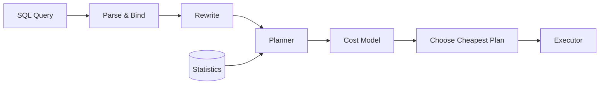
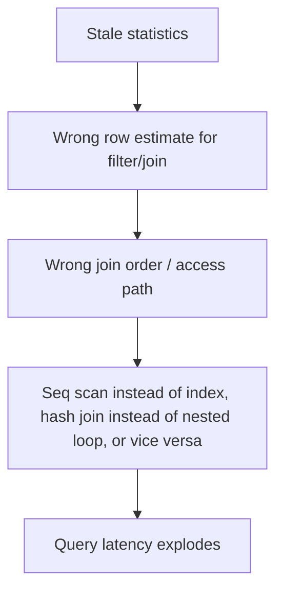

# 79. Cardinality and Statistics

> This section belongs to **Category 9 — Optimization**. It explains what _cardinality_ and _statistics_ mean to a SQL optimizer, why your queries' speed depends on them, and how to inspect, maintain, and improve them.
>
> Cross-references: **Execution Plans**, **Query Optimization**, **Indexes & Sargability**, **NULL**, **JOINs**, **GROUP BY**, and **EXPLAIN ANALYZE** sections of this handbook.

---

## 79.1 Fundamentals

### Three meanings of the word "cardinality"

Use of the word in the SQL world conflates three distinct ideas. Confusing them causes real mistakes.

| Meaning              | Definition                                                         | Example                             |
| -------------------- | ------------------------------------------------------------------ | ----------------------------------- |
| Table cardinality    | Number of rows in a table                                          | `orders` has 1,000,000 rows         |
| Column cardinality   | Number of **distinct** values in a column                          | `region` has 3 distinct values      |
| Estimate cardinality | Number of rows the optimizer **predicts** a plan step will produce | `Seq Scan on orders ... rows=20000` |

When you read a query plan, `rows=...` is the **estimate cardinality** of that operator. It is a _guess_, never a measurement.

### What "statistics" means

Databases store metadata about the data so the optimizer does not have to scan data to make decisions:

- Row count of the table (`reltuples` in PostgreSQL, `table_rows` in MySQL, `num_rows` in Oracle, `rows` in SQL Server DMVs)
- Page / block count of the table and each index
- Per column:
  - fraction of NULLs
  - number of distinct values (or a fraction/flag)
  - average width
  - **most-common-values (MCV)** list with frequencies
  - **histogram** (bucket boundaries) for non-MCV values
  - physical ordering correlation
- Per index:
  - number of pages/leaf blocks
  - depth
  - density of keys (average rows per distinct key, per prefix of a composite key)
- Multi-column statistics (extended statistics, density vectors, MCV across columns) where supported

### Why this matters: the optimizer is a cost model

SQL is _declarative_. The optimizer must decide **how** to run your query. It does this in roughly five steps:



Every alternative plan receives an estimated `cost`, derived mainly from:

1. estimated **number of rows** flowing through each operator (cardinality estimate)
2. estimated **cost per operation** (page reads, CPU, random vs sequential I/O)

Even a perfect cost model produces terrible decisions if the row estimates are wrong. **Garbage statistics → garbage cardinality → garbage plan.** Real-world SQL performance problems are, in many cases, statistics problems in disguise.

> Common misconception
> "The optimizer reads the truth from the table."
>
> No. The optimizer reads **sampled summaries** (statistics) that can be stale, biased, or missing. The rows are estimated, not counted.

---

## 79.2 Internal Working: How Statistics Are Collected

### Sampling, not scanning

Whole-table statistics are almost never a full scan (except on tiny tables). Engines sample rows or blocks:

| Engine         | Typical sampling strategy                                                                                                                                                                 |
| -------------- | ----------------------------------------------------------------------------------------------------------------------------------------------------------------------------------------- |
| PostgreSQL     | Random **block** sampling; default target collects about `300 × statistics_target` rows → default `30,000`. Raise `default_statistics_target` (or per column) for more samples.           |
| MySQL (InnoDB) | Sample a fixed number of index pages (`innodb_stats_persistent_sample_pages`, default 20 pages); 8.0+ optionally builds explicit **histograms** via `ANALYZE TABLE ... UPDATE HISTOGRAM`. |
| SQL Server     | `UPDATE STATISTICS` samples the table; sampling scale depends on table size and version (newer versions sample far fewer rows on huge tables).                                            |
| Oracle         | `DBMS_STATS` with `estimate_percent` — default `AUTO_SAMPLE_SIZE` chooses a percentage based on table size.                                                                               |

`sample_size` / `n_mod_since_analyze` columns in the catalog views below tell you _how many rows_ were inspected, which is a good honesty check.

### Sampling bias

```
Production pitfall
Block-level sampling biases estimates when rows are physically clustered.
```

If all rows for `region = 'US'` live in one set of blocks, a random block sample can drastically overcount or undercount `'US'`. This is why statistics that were collected _once_ can silently disagree with reality, and why re-`ANALYZE` after bulk loads is required (see §79.5).

### What actually gets stored, and how

Per column, PostgreSQL stores one row in `pg_statistic` (readable via `pg_stats`):

| Metric              | Meaning                                                                                                                         |
| ------------------- | ------------------------------------------------------------------------------------------------------------------------------- |
| `null_frac`         | Fraction of rows where the column is NULL                                                                                       |
| `avg_width`         | Average bytes per value                                                                                                         |
| `n_distinct`        | `> 0` = exact distinct count; `-1` = column is unique (all values distinct); negative fraction `-x` ≈ `x%` of rows are distinct |
| `most_common_vals`  | Values that appear unusually often (the skew)                                                                                   |
| `most_common_freqs` | Frequency of each MCV                                                                                                           |
| `histogram_bounds`  | Equi-height bucket boundaries for the _non-MCV_ values                                                                          |
| `correlation`       | Degree to which physical row order matches logical sort order of the column                                                     |

The MCV list captures **skew** (some values much more common than others). The histogram captures the **distribution of the remaining (non-MCV) values**. Together they beat the naive "all values equally likely" assumption (§79.6).

> PostgreSQL has no histogram when the column has very few distinct values — the MCV list plus `n_distinct` is already enough. It also **excludes NULLs from the histogram**; NULLs are handled by `null_frac` (§79.9).

---

## 79.3 Syntax and Catalog Views Per Engine

Here is how to look at statistics. Do this _before_ judging a plan.

### PostgreSQL

```sql
ANALYZE orders;                    -- collect statistics for whole table
ANALYZE orders (region, total);    -- specific columns only

-- per-column target (samples/histogram size)
ALTER TABLE orders ALTER COLUMN region SET STATISTICS 1000;

-- inspect
SELECT attname, null_frac, avg_width, n_distinct,
       most_common_vals, most_common_freqs, histogram_bounds, correlation
FROM pg_stats
WHERE tablename = 'orders' AND attname IN ('region', 'status', 'total');

-- sample row counts on disk (updated by ANALYZE / VACUUM)
SELECT relname, reltuples, relpages FROM pg_class WHERE relname = 'orders';
```

Read realistic output (illustrative):

```
 attname | null_frac | avg_width | n_distinct | most_common_vals | most_common_freqs | histogram_bounds | correlation
---------+-----------+-----------+------------+------------------+-------------------+------------------+-------------
 region  |         0 |         4 |          3 | {US}             | {0.95}            | [empty]          |     0.00342
 status  |     0.004 |         9 |          3 | {delivered}      | {0.78}            | [empty]          |     0.5012
 total   |         0 |         6 |        -1  | [empty]          | [empty]           | {25,180,309,...} |     0.0511
```

Interpretation:

- `region`: 3 distinct values; `US` is an MCV at 95%; the tracker re-computed... a clean, high-skew column.
- `status`: 4‰ of values are NULL (`null_frac 0.004`).
- `total`: `n_distinct = -1` means essentially **all values distinct** (like a near-numeric-continuous column). Only a histogram can describe it.

### MySQL (InnoDB)

```sql
ANALYZE TABLE orders;

-- explicit histogram (8.0+)
ANALYZE TABLE orders UPDATE HISTOGRAM ON status, total WITH 32 BUCKETS;

-- approximate row count
SELECT table_rows, data_length
FROM information_schema.TABLES WHERE table_name = 'orders';

-- per-index cardinality
SHOW INDEX FROM orders;

-- histogram data
SELECT COLUMN_NAME, DATA_TYPE, NUM_BUCKETS
FROM information_schema.COLUMN_STATISTICS WHERE TABLE_NAME = 'orders';
```

InnoDB stores **per-index** stats in `mysql.innodb_index_stats`:

```
stat_name       stat_value   description of what it counts
n_diff_pfx01    3            distinct leading prefix: region
n_diff_pfx02    3            distinct (region) with PK appended
n_leaf_pages    1324         pages in the leaf level of the region index
size            1432         total pages of the index
```

The prefix descriptions (`n_diff_pfxNN`) let you compute **composite-key distinctness**, which exposes correlation between columns (see §79.8).

> MySQL pitfall: `information_schema.TABLES.table_rows` is an **estimate** (±40%) for InnoDB, not a count. Never assert business correctness from it.

### SQL Server

```sql
UPDATE STATISTICS dbo.orders IX_orders_region;
DBCC SHOW_STATISTICS('dbo.orders', IX_orders_region);

-- modern alternative
SELECT s.name, sp.rows_sampled, sp.rows, sp.last_updated, sp.is_auto_created
FROM sys.stats s
CROSS APPLY sys.dm_db_stats_properties(s.object_id, s.stats_id) sp
WHERE s.object_id = OBJECT_ID('dbo.orders');
```

`DBCC SHOW_STATISTICS` returns three result sets:

1. **Header** — when last updated, rows sampled vs total rows (sampling bias visible here), density, average key length.
2. **Density vector** — average number of rows per distinct key prefix for each prefix of a composite key.
3. **Histogram** — up to 200 equi-depth steps: `RANGE_HI_KEY`, `RANGE_ROWS`, `EQ_ROWS`, `DISTINCT_RANGE_ROWS`, `AVG_RANGE_ROWS`.

```
RANGE_HI_KEY   RANGE_ROWS   EQ_ROWS   DISTINCT_RANGE_ROWS   AVG_RANGE_ROWS
US             0            950000    0                     1
EU             30000        30000     1                     1
APAC           0            20000     0                     1
```

(equi-depth: each step covers ~a similar share of rows; the boundary value `US` carries `EQ_ROWS`.)

### Oracle

```sql
BEGIN
  DBMS_STATS.GATHER_TABLE_STATS(
    ownname          => 'APP',
    tabname          => 'ORDERS',
    estimate_percent => DBMS_STATS.AUTO_SAMPLE_SIZE,
    method_opt       => 'FOR ALL COLUMNS SIZE AUTO',
    degree           => 4
  );
END;
/

SELECT column_name, num_distinct, num_nulls, density,
       avg_col_len, histogram, sample_size
FROM   all_tab_col_statistics
WHERE  table_name = 'ORDERS';

-- staleness indicator
SELECT table_name, stale_stats, last_analyzed
FROM   all_tab_statistics WHERE table_name = 'ORDERS';
```

Oracle histogram types appear in `all_tab_col_statistics.histogram`: `FREQUENCY`, `TOP-FREQUENCY`, `HYBRID`, `HEIGHT BALANCED`, or `NONE`.

---

## 79.4 Hypothetical sample data used below

These tables are used in the rest of the section.

```sql
CREATE TABLE customers (
  customer_id BIGINT PRIMARY KEY,
  country     TEXT        NOT NULL,   -- US 60%, DE 20%, IN 15%, BR 5%
  plan        TEXT        NOT NULL    -- free 90%, pro 9%, enterprise 1%
);

CREATE TABLE orders (
  order_id    BIGINT PRIMARY KEY,
  customer_id BIGINT NOT NULL REFERENCES customers(customer_id),
  status      TEXT,                   -- delivered 78%, processing 17%, cancelled 5%, NULL 0.4%
  region      TEXT,                   -- US 95%, EU 3%, APAC 2%
  total       NUMERIC(12,2) NOT NULL, -- mostly 10..1000
  ordered_at  TIMESTAMPTZ NOT NULL
);

CREATE INDEX ix_orders_region      ON orders (region);
CREATE INDEX ix_orders_customer_id ON orders (customer_id);
```

**Grain statements (always reason about these first):**

- One row in `customers` = one customer.
- One row in `orders` = one order.
- Expected fan-out: each customer that orders has ~10 orders on average, **but** a small number of "hot" customers have 1,000–4,000 orders (skew!).

Producer quantities: `customers` = 100,000 rows; `orders` = 1,000,000 rows.

---

## 79.5 Stale Stats: The Silent Killer

### Scenario

1. `orders` starts with 10,000 rows, roughly evenly split across 3 regions (≈3.3k per region).
2. You bulk-load 990,000 more rows, and now `region` is 95% `US`, 3% `EU`, 2% `APAC`.
3. **You never `ANALYZE`.**

Query:

```sql
SELECT order_id, total
FROM orders
WHERE region = 'APAC'
ORDER BY ordered_at DESC
LIMIT 50;
```

Real result: `APAC` = **20,000** rows (2%). The right plan should use the index on `region`. But the statistics still describe a world where each region is ~1/3 of the data, so the optimizer thinks the filter returns ~333,000 rows.

### BAD APPROACH: trust the old plan

```sql
EXPLAIN ANALYZE
SELECT order_id, total
FROM orders
WHERE region = 'APAC'
ORDER BY ordered_at DESC
LIMIT 50;
```

Illustrative plan:

```
Limit  (cost=0.00..2343.00 rows=50 width=24) (actual rows=50 time=... loops=1)
  ->  Sort  (cost=0.00..?q rows=333333 width=24)
  ->    Seq Scan on orders  (cost=0.00..23419.00 rows=333333 width=24)
          Filter: (region = 'APAC'::text)
          Rows Removed by Filter: 980000
Planning Time: 0.5 ms
Execution Time: 1304 ms
```

Every `Rows Removed by Filter: 980000` proves the estimate (`rows=333333`) was imaginary. The `Seq Scan` appeared "cheap" only because the cost model was working from a guess.

### BETTER APPROACH: refresh stats, then re-check

```sql
ANALYZE orders;

EXPLAIN ANALYZE
SELECT order_id, total
FROM orders
WHERE region = 'APAC'
ORDER BY ordered_at DESC
LIMIT 50;
```

Illustrative plan:

```
Limit  (cost=489.57..489.83 rows=50 width=24) (actual rows=50 time=... loops=1)
  ->  Sort  (cost=489.57..539.57 rows=20000 width=24)
        Sort Key: ordered_at DESC
  ->  Bitmap Heap Scan on orders  (cost=336.00..... rows=20000 width=24)
        Recheck Cond: (region = 'APAC'::text)
        ->  Bitmap Index Scan on ix_orders_region (cost=0.00..336.00 rows=20000 width=0)
             Index Cond: (region = 'APAC'::text)
Execution Time: 138 ms
```

Now the estimate matches reality (`rows=20000`), and the optimizer chooses the index.

> Production pitfall
> **The optimizer does not know something changed.** Autovacuum-style background jobs only fire after the _estimated_ change crosses a threshold. In PostgreSQL, default `autovacuum_analyze_scale_factor = 0.1` means a table regenerates stats only after roughly **10% of rows** change. For a 100M-row table that is ~10M rows of drift before anything auto-corrects. Same story in SQL Server (threshold is a shrinking _percentage_ in newer versions) and MySQL (`innodb_stats_auto_recalc` also has thresholds).

### Verifying staleness

```sql
-- PostgreSQL
SELECT relname, reltuples, relpages FROM pg_class WHERE relname = 'orders';

SELECT relname, last_analyze, last_autoanalyze
FROM pg_stat_user_tables WHERE relname = 'orders';

-- MySQL
SELECT table_rows FROM information_schema.TABLES
WHERE table_name = 'orders';

-- SQL Server  (header set of)
DBCC SHOW_STATISTICS('dbo.orders', ix_orders_region);

-- Oracle
SELECT table_name, stale_stats, last_analyzed FROM all_tab_statistics
WHERE table_name = 'ORDERS';
```

### The general rule



---

## 79.6 Selectivity: The Arithmetic of Estimates

**Selectivity** = the fraction of rows a condition is expected to keep.

```
estimated rows = selectivity × estimated input rows
```

Every filter gets its own estimated selectivity, and those estimates are what the cost model multiplies and adds through the plan.

### Worked examples (base: `orders` = 1,000,000 rows)

| Condition                                | Selectivity reasoning                                                                     | Estimated rows    |
| ---------------------------------------- | ----------------------------------------------------------------------------------------- | ----------------- |
| `region = 'US'`                          | `US` is an MCV with freq 0.95                                                             | ≈ 950,000         |
| `region = 'APAC'`                        | non-MCV, covered by n_distinct/histogram                                                  | ≈ 20,000          |
| `region IN ('EU','APAC')`                | sum of two equalities (each value evaluated separately)                                   | ≈ 50,000          |
| `total > 500`                            | area under the histogram buckets above 500                                                | ≈ 150,000         |
| `status IS NULL`                         | direct `null_frac` (0.004)                                                                | ≈ 4,000           |
| `status IS NOT NULL`                     | `1 - null_frac`                                                                           | ≈ 996,000         |
| `status NOT IN ('cancelled','refunded')` | `1 - (freq(cancelled) + freq(refunded))`, **but NULL rows are excluded by SQL semantics** | pitfalls in §79.9 |
| `customer_id = 12345`                    | n_distinct-based (near `1/n_distinct`), or MCV if present                                 | varies            |

### The uniformity assumption

```
Common misconception
"Every distinct value is equally common, so `WHERE col = x` returns `rows / distinct_count`."
```

This is the **uniformity assumption**, and it is wrong for skewed data. The whole point of MCV lists and histograms is to _escape_ it:

- equality to an **MCV** → nearly exact estimate = `freq × reltuples`
- equality to a value **outside the MCV list** → estimated from the remaining probability and the histogram; with **no** histogram, the planner falls back to `1 / n_distinct` for a known-distinct column.

An old uniform guess of `1/3` per region vs the truth `0.95 / 0.03 / 0.02` is exactly the §79.5 story.

### The `LIKE` trap

`WHERE lower(email) = 'x@y.com'` is **not sargable** — no index from `email`, and no statistics can help unless you build an expression index and collect stats on it:

```sql
CREATE INDEX ix_orders_lower_status ON orders (lower(status));
ANALYZE orders;      -- now stats exist for the expression too
```

Without expression stats, the planner uses a canned default guess. See **Indexes & Sargability**.

---

## 79.7 Joins and Cardinality Estimation

Join estimation: the optimizer must predict how many rows `orders ⋈ customers` produces, typically combining the distinct-count (ndistinct) / density of the join key on both sides.

### Scenario: the hot-customer fan-out

```sql
SELECT c.country, count(*)
FROM customers c
JOIN orders o ON o.customer_id = c.customer_id
GROUP BY c.country;
```

Truth: 1,000,000 matching rows; typical customer has 10 orders; a few have thousands.

**If statistics were collected before the skew existed** (or `o.customer_id` was sampled badly), the optimizer might model "≈10 orders per customer" uniformly. The plan could be:

```
Nested Loop  (cost=... rows=1000000) (actual rows=1000000)
  ->  Seq Scan on customers c  (cost=0.00..2400.00 rows=100000 width=...)
  ->  Index Scan using ix_orders_customer_id on orders o
        Index Cond: (o.customer_id = c.customer_id)
        (actual rows per outer: 10 avg, 4823 max)
```

The `actual ... max=4823` line is the warning: for hot customers the inner loop repeats 4,823 times. If estimates had reflected the skew (`density ≈ 16.7` avg because 60k distinct customers for 1M orders), the optimizer would more likely choose a **Hash Join**.

```
Interview trap
"When the plan shows a huge `actual rows` that is very different from `rows=`, does the index need fixing?"
Rather check: **is it the join-order, density, or histogram estimate that is wrong?** Often re-`ANALYZE`ing (or collecting better stats) is the fix, not an index change.
```

### Error propagation

Plan estimates **compound**. Replace a 10-row estimate with 4,823 rows and every operator above it recomputes:

- hash join sizes and memory grants
- sort/spool sizes
- loop iteration counts
- whether the outer or inner side is chosen

A single misestimated join key can turn a 50 ms query into a 50 s query.

> Production pitfall
> After any bulk `INSERT`, `MERGE`, or `DELETE` that changes cardinality or distribution materially, refresh statistics **and re-examine the plan**. The expensive query in production is often a plan that was chosen _yesterday_ against yesterday's data.

---

## 79.8 Multi-Column and Correlated Statistics

### The independence assumption

By default, filters and join clauses are treated as **statistically independent**. The selectivity of `region = 'US' AND status = 'delivered'` is estimated as:

```
selectivity(region='US') × selectivity(status='delivered')
= 0.95 × 0.78 ≈ 0.741  →  ~741,000 estimated rows
```

Correlated data breaks this. Example: `region` and `total` correlate — EU orders are expensive, US orders are cheap. The product-of-individual-estimates can be off by an order of magnitude.

### PostgreSQL extended statistics

```sql
CREATE STATISTICS orders_region_status (dependencies, ndistinct, mcv)
  ON region, status FROM orders;

ANALYZE orders;

SELECT stxname, stxkeys FROM pg_statistic_ext WHERE stxrelid = 'orders'::regclass;

-- the actual collected numbers
SELECT se.stxname, sad.stxdndistinct, sad.stxdependencies, sad.stxdmcv
FROM pg_statistic_ext_data sad
JOIN pg_statistic_ext se ON sad.stxoid = se.oid
WHERE se.stxname = 'orders_region_status';
```

Kinds:

- `(dependencies)` — captures that two (or more) columns are functionally dependent; used to refine _combined-filter_ selectivity.
- `(ndistinct)` — precise distinct counts for groups of columns (helps `GROUP BY` with multiple columns).
- `(mcv)` — most-common _combinations_, the most accurate for highly correlated planning.
- Expression statistics (`CREATE STATISTICS ... ON (expr1, expr2)`) exist since PostgreSQL 14; do the same for function-wrapped columns you filter on.

> PostgreSQL, cost note
> Extended stats cost planning time and storage (more per-column sorting during `ANALYZE`). Create them only for column _groups_ that actually appear together in `WHERE` / `GROUP BY` / `JOIN` clauses. Verify with `EXPLAIN` before/after.

### MySQL / SQL Server / Oracle equivalents

| Engine     | Mechanism                                                                                                                                                                                                                                                                         |
| ---------- | --------------------------------------------------------------------------------------------------------------------------------------------------------------------------------------------------------------------------------------------------------------------------------- |
| MySQL 8.0+ | `ANALYZE TABLE orders UPDATE HISTOGRAM ON region, total WITH 32 BUCKETS;` (histograms in `information_schema.COLUMN_STATISTICS`). Keep bucket count ≤ 1024; these represent top-N lists + cumulative frequency. Index stats also expose composite correlation via `n_diff_pfxNN`. |
| SQL Server | **Filtered statistics** for data-skewed subsets: `CREATE STATISTICS st_delivered ON dbo.orders(status) WHERE status = 'delivered';` Composite indexes automatically create density-vector entries for all key prefixes.                                                           |
| Oracle     | `DBMS_STATS.GATHER_TABLE_STATS(..., method_opt => 'FOR COLUMNS (REGION,TOTAL) SIZE AUTO')` or `DBMS_STATS.CREATE_EXTENDED_STATS('APP','ORDERS','(REGION,TOTAL)')` to register virtual "extended" columns.                                                                         |

All engines: correlated columns → **correlated estimates**.

> Interview trap
> "Why not just `CREATE STATISTICS` on every column pair?"
> Answer: explosion of storage and `ANALYZE` cost, and the optimizer burns more time computing better-but-still-approximate numbers. Extended stats are surgical tools for the _hot_ filter combinations you actually run.

### MySQL range estimation: index dives vs statistics

MySQL prefers to _dive_ into the index to count matching ranges directly (near-exact). Above `eq_range_index_dive_limit` (default **200**) members in an `IN` list, or when ranges can't be dived, it falls back to statistics-based estimates that include the histogram/`n_diff_pfx`. This is why `IN`-lists with 1,000+ values _still_ produce optimistic plans and why histograms were introduced in 8.0.

---

## 79.9 NULLs and Statistics

NULLs are handled **separately** from histograms in most engines:

- PostgreSQL: `null_frac` is its own metric; histogram and MCV contain **no NULLs**; `count(distinct)` also ignores NULLs.
- SQL Server/Oracle/MySQL: NULLs have similar treatment — they occupy a dedicated bucket/entry in histograms (SQL Server, Oracle) or are folded into the value counts in index stats (InnoDB).

### Operator-by-operator behavior

| Predicate                                | What the planner can know from stats        | Warning                                                                                                        |
| ---------------------------------------- | ------------------------------------------- | -------------------------------------------------------------------------------------------------------------- |
| `status IS NULL`                         | `null_frac × reltuples` — accurate          | —                                                                                                              |
| `status IS NOT NULL`                     | `(1 − null_frac) × reltuples`               | —                                                                                                              |
| `status = 'cancelled'`                   | MCV/histogram over **non-null** values      | Preserves `null_frac` rows in the scan — they never match `=`                                                  |
| `status NOT IN ('cancelled','refunded')` | estimate based on subtracting listed values | **SQL semantics**: rows with NULL `status` _also_ fail the `NOT IN` → result can be far smaller than estimated |

### The `NOT IN` + NULL estimator trap

With `null_frac = 0.004`, `NOT IN ('cancelled','refunded')` should return ~941k rows. But suppose 50% of `status` is NULL and the non-null values are all in the list. The estimator subtracts the two listed values from non-null rows and reports e.g. ≈500k, while the **actual result is 0** — because every NULL row also evaluates to NULL in a `NOT IN`.

```
Interview trap / Production pitfall
`WHERE col NOT IN (1,2,3)` and NULLs in `col` can return 0 rows while the optimizer
estimates 500,000. The plan's estimate says "rows to expect", not "answer".
```

Two robust fixes:

```sql
-- BAD: ambiguous semantics + estimator guesswork
SELECT ... FROM orders WHERE status NOT IN ('cancelled', 'refunded');

-- GOOD: make NULL handling explicit; estimate and semantics agree
SELECT ... FROM orders
WHERE status IS NOT NULL
  AND status NOT IN ('cancelled', 'refunded');
```

Make the intent explicit (exclude NULLs), and both the result _and_ the estimate become predictable. Verify with `EXPLAIN ANALYZE`.

### All-NULL column

A fully-NULL column gets `null_frac = 1`, `n_distinct = 0` (no non-null distinct). `WHERE col = 'x'` should estimate **0 rows** — and most optimizers can conclude it. Tables/columns like this appear after failed ETL. And whenever a "mystery" plan shows `Rows Removed by Filter: N` where `rows=N` estimate was 0, statistics no longer reflect data.

---

## 79.10 Index Statistics

Indexes have their own statistics (separate from column stats). The optimizer reads:

- index **size in pages/blocks** and **depth** (cost of a single probe)
- **density / average rows per key** (how many rows a probe returns)
- for composite keys: density vector per prefix (`n_diff_pfx` in MySQL, density vector in SQL Server, `n_distinct` in PostgreSQL planner info)
- **clustering** / correlation (whether index order matches heap order → affects random-vs-sequential I/O cost)

This is why a helpfully-indexed column can still lose to a Seq Scan: if the estimate says the probe returns 40% of rows, the optimizer prefers scanning. Conversely, if density is massively _underestimated_ (small sample), the optimizer may pick an index that repetitively sees thousands of rows per key — see §79.7.

---

## 79.11 Engine Comparison

|                     | PostgreSQL                                  | MySQL (InnoDB)                                   | SQL Server                                         | Oracle                                               |
| ------------------- | ------------------------------------------- | ------------------------------------------------ | -------------------------------------------------- | ---------------------------------------------------- |
| Collect command     | `ANALYZE`                                   | `ANALYZE TABLE`                                  | `UPDATE STATISTICS`                                | `DBMS_STATS.GATHER_*`                                |
| Auto-maintenance    | `autovacuum` / `autoanalyze`                | `innodb_stats_auto_recalc`                       | Auto create/update stats                           | Automatic maintenance window                         |
| Storage             | `pg_statistic` / `pg_stats`                 | `mysql.innodb_table_stats`, `innodb_index_stats` | `sys.stats*` (+ sysstats internal)                 | Data dictionary + `ALL_TAB_*` views                  |
| Skew capture        | MCV + histogram                             | Histogram (8.0+, `UPDATE HISTOGRAM`)             | Equi-depth histogram (≤200 steps) + density vector | Frequency / top-frequency / hybrid / height-balanced |
| Multi-column        | `CREATE STATISTICS (…)`                     | Index prefix stats, `n_diff_pfx`                 | Density vector per index prefix; filtered stats    | Extended stats                                       |
| Expression stats    | `CREATE STATISTICS ... ON (expr)`           | no                                               | on computed columns/indexed views                  | extended stats on expressions                        |
| NULLs               | `null_frac`, not in histogram               | counted in index stats                           | dedicated histogram entry                          | `num_nulls`, dedicated buckets                       |
| Row estimate caveat | `reltuples` refreshes on `ANALYZE`/`VACUUM` | `table_rows` is ±40% estimate                    | sampled header shows rows_sampled vs rows          | `num_rows` from last gather                          |
| Adaptive feedback   | no (fix stats manually)                     | no                                               | CE feedback (2022+) can auto-grow                  | Statistics/plan feedback (12c+)                      |

Verify anything cost- or plan-related on _your_ engine and version with the execution-plan tool (`EXPLAIN ANALYZE`, live query stats, `DBCC SHOW_STATISTICS`, etc.).

---

## 79.12 Common Mistakes

1. **Reading `n_distinct = -1` as "no stats".** In PostgreSQL `-1` means "column is unique"; `-0.05` means "≈5% of rows are distinct". Negative values other than `-1` are _fractions_, not error states.
2. **Treating plan `rows=` as measured truth.** `rows=` is an estimate; `actual rows=` is truth. Compare both, always.
3. **Skipping `ANALYZE` after bulk loads / deletes / `UPDATE` on the join/filter columns.**
4. **Believing an index fixes a statistics problem.** If the estimate says the filter returns 40% of rows, no index will be used — the optimizer _knows_ the cost.
5. **Confusing "cardinality" of a column with "cardinality" of a plan step.**
6. **Forgetting that histogram/`count(distinct)` ignore NULLs** and reasoning about estimates as if they didn't.
7. **Setting `default_statistics_target` / bucket counts to sky-high values globally** — planning time and `ANALYZE` time grow; do it per-column for the hot, skewed columns.
8. **Sampling misread:** MySQL `information_schema.tables.table_rows` is ±40%; treat it as a hint only.

---

## 79.13 Best Practices

1. **After every bulk change of order-of-magnitude, refresh stats (`ANALYZE` / `UPDATE STATISTICS` / `DBMS_STATS` / `ANALYZE TABLE`) at a maintenance checkpoint.**
2. **Get in the habit of `EXPLAIN ANALYZE` before AND after any plan-level change** (stat change, index change, query rewrite). Let the `rows=` vs `actual rows=` gap drive the next decision.
3. **Watch for estimate-vs-actual mismatch > 10×** — it usually means stale stats, missing extended stats, or a NULL-corner in the predicate.
4. **Raise the statistics target / bucket count only for columns that drive hot, skewed filters** (e.g., `default_statistics_target` → 1000 for `region`, `status`).
5. **Use extended/multi-column stats for correlated filter combinations that appear together** — dependencies (PostgreSQL), histograms (MySQL 8.0), density vectors (SQL Server), extended stats (Oracle).
6. **Monitor auto-maintenance:** `pg_stat_user_tables.last_analyze/last_autoanalyze`, `sys.dm_db_stats_properties.last_updated`, Oracle `stale_stats`, MySQL `innodb_stats_auto_recalc`.
7. **Prefer stable, persistent stats in MySQL** (`innodb_stats_persistent = ON`) so your plans don't drift between server restarts.
8. **Collect expression statistics** when filtering/window-partitioning on function-wrapped columns (`lower(...)`, date truncations). No expression stats → canned default guesses.
9. **Re-examine big-`IN`-list and range queries** — estimate-quality drops as they fall past dive limits (MySQL `eq_range_index_dive_limit`).
10. **Never claim a plan is faster/slower without the plan.** Verify with the engine's execution-plan tooling.

---

## 79.14 Summary

- `rows=` in a plan is an _estimate_ driven by **statistics**, not measurement.
- Statistics = row/page counts + per-column NULLs, distinct counts, MCV skew lists, histograms, correlation + per-index density.
- Statistics are **sampled**, can be **stale**, and **exclude/seg-ment NULLs** — all three cause misestimates.
- Optimizers start from **uniformity + independence**; MCV/histograms and extended stats exist to undo those assumptions.
- Bad cardinality estimates propagate through join order and access paths → dramatic latency swings.
- Fixes are almost always: refresh stats (post-change), targeted stats targets, extended stats, expression stats, and **verification with the execution plan**.

**Reference these sections:** Execution Plans (reading `rows=` vs `actual`), Query Optimization, Indexes & Sargability, NULL & Three-Valued Logic, JOINs (fan-out, one-to-many), GROUP BY, and `EXPLAIN ANALYZE`.

---

# Interview Questions

### Beginner

1. What does `rows=` mean in an `EXPLAIN` output? What does `actual rows` mean?
2. Define "cardinality" for (a) a table, (b) a column, (c) a plan operator.
3. What is selectivity? Write the formula.
4. What happens if statistics are missing or stale for a table?
5. In PostgreSQL `pg_stats`, what do `null_frac`, `n_distinct`, and `most_common_vals` represent?

### Intermediate

6. Why can a histogram be needed even if you know `COUNT(DISTINCT col)`?
7. Your query was fast yesterday with the same plan — what changed? (List three possibilities)
8. How do you check that statistics are fresh in your favourite engine?
9. What is the difference between the MCV list and histogram buckets?
10. Why might `WHERE status NOT IN ('a','b')` return 0 rows while the plan estimates 500,000, and how would you fix it?
11. Why does adding an index not always change a slow plan?

### Advanced

12. Explain the uniformity and independence assumptions. Give a query where each is violated.
13. What are extended statistics / filtered statistics / index density vectors, and when are they justified?
14. `pg_stats.n_distinct = -0.05` — what does it mean? `-1`?
15. How does block-level sampling bias statistics for clustered data?
16. You see `Rows Removed by Filter: 980,000` with `rows=333,333`. Walk through the diagnosis step by step.

### Scenario Based

17. A 10M-row `users` table has `feature_on` (99% `false`, 1% `true`). After a data reload, a filtered export query took 10× longer. What do you inspect first and why?
18. Sales table: `WHERE region = 'EMEA' AND plan = 'enterprise'`. The combined filter estimate is absurdly low. What is the mathematical reason, and what statistics would you collect?
19. You bulk-loaded 5M rows at 02:00. At 09:00, the dashboard query is slow. Describe the exact investigation and remediation steps (engines: pick one).
20. In a `nested loop` plan the inner index scan shows `actual rows=4823 max` per outer row while the estimate was 10. Where exactly is the misestimate, and what fixes it?

### Tricky

21. Is a freshly `ANALYZE`d column's `n_distinct` exact? Under what conditions is it most wrong?
22. A histogram has 100 equal-height buckets. Explain why the _edges_ of buckets matter more than the middle for a `total > 500` query.
23. Why can raising `default_statistics_target` globally make _planning_ slower without improving many queries?
24. `n_distinct` says 3, MCV says `{US: 0.95}`, and `histogram_bounds` is empty. Compute the estimated rows for `region='EU'` and justify your reasoning — what assumption did you make?
25. Between two equivalent predicates `NOT IN` and `NOT EXISTS`, when does a difference in _estimate_ — not result — change the chosen plan?

### Output Prediction

26. Given `reltuples = 1,000,000`, `n_distinct = 3`, MCV `{US} → 0.95`:
    - Predicted rows for `region = 'US'`?
    - Predicted rows for `region = 'APAC'`?
    - What changes if you instead get `null_frac = 0.5`?
27. Histogram for `total`: `... < 500 ... < 1000` with 150,000 rows estimated above 500. After loading 900,000 new high-value rows and **no** `ANALYZE`, what is wrong with the old estimate, and what do you expect in `EXPLAIN ANALYZE`?

### Debugging

28. `EXPLAIN ANALYZE` shows `Seq Scan ... rows=1000000 actual rows=900000` and `Filter: status='delivered'`. The plan ignores `ix_orders_status`. List the three most likely root causes and how each is confirmed.
29. A `Hash Join` gets 2GB of memory but only uses 20MB — is that a stats problem? How would you check?
30. After tuning, plan changed from `Nested Loop` to `Hash Join`, and the query got slower. What did you probably misjudge, and what tool settles it?

### Performance

31. Design a test that _proves_ whether rebuilding statistics improves (or worsens) a specific query — name the commands and the metric you compare.
32. Contrast per-column `SET STATISTICS 1000` in PostgreSQL vs `UPDATE HISTOGRAM ... WITH 1024 BUCKETS` in MySQL vs filtered statistics in SQL Server for a 99/1 skewed column. What do they cost?
33. Explain how a wrong join-cardinality estimate can flip `Nested Loop` to `Hash Join` (or vice versa) and what "estimate propagation" means further up the plan tree.

---

_All plan outputs in this section are illustrative and intended to teach shape, not to act as a substitute for your engine's own `EXPLAIN ANALYZE` output — always verify against your real execution plan._
