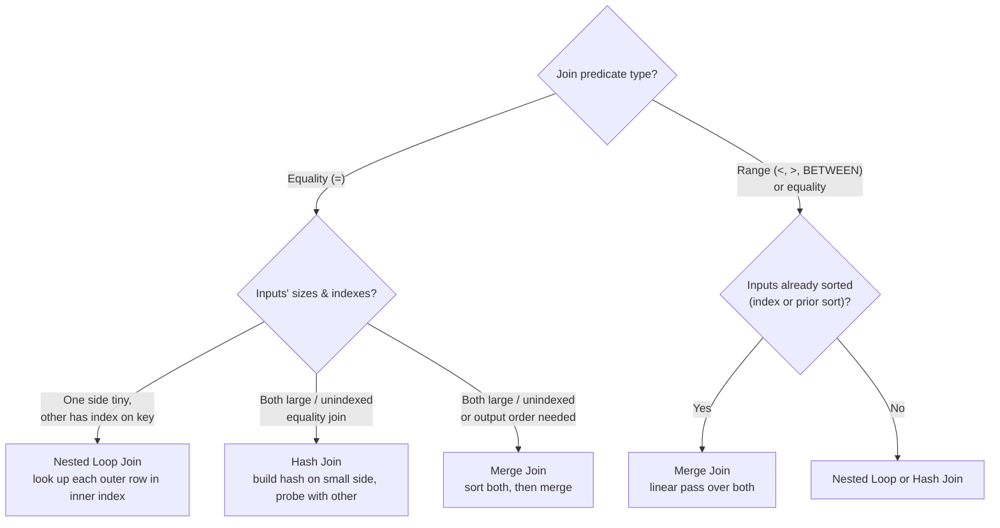
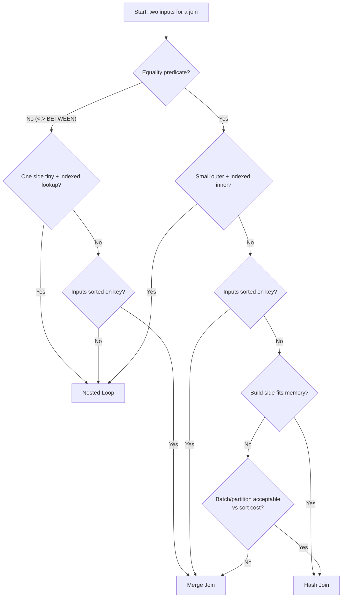

# 80. Join Algorithms

> This section belongs to **Category 9 — Optimization**. It explains the _physical_ algorithms a database enI have full context on the handbook conventions. Now I'll write the complete Section 80.
> I noticed a stray error line in the Mermaid diagram. Let me fix it.
> Let me verify the fixed diagram and scan the rest of the file for issues.
> Scenario 5's query is convoluted; let me make it cleaner and more idiomatic.
> Section 80 `80-Join-Algorithms.md` written (939 lines). It matches the handbook's established style from adjacent sections.

Covers:

- **Fundamentals** — logical vs physical joins, why algorithms exist, the cost model
- **The 3 classic algorithms** — nested loop, hash, merge, each with what/why/how it works, cost model, use/avoid tables, engine node names, and BAD vs BETTER examples (inner-index traps, hash spills, sort-merge waste, wrong driving side)
- **Semi/anti joins** — `EXISTS`/`IN`/`NOT EXISTS` physical forms and NULL caveats
- **Optimizer decision inputs** — estimates, indexes, sortedness, memory, predicate shape, plus a decision flowchart and a "what the EXPLAIN row tells you" table
- **Sample tables & grain** (`customers`/`orders`/`order_items`/`payments`, consistent with Sec 78)
- **7 scenario examples** — healthy NLJ, NLJ gone wrong, correct hash join, merge via indexes, EXISTS→semi join, NOT EXISTS→anti join, hash spill
- **NULL behavior** per algorithm + `IS NOT DISTINCT FROM` (PG16 note)
- **Edge cases** — skew, type/collation coercion, expression keys, full outer, `<>`, self-join
- **Engine comparison table**, common mistakes, production pitfalls (sniffing, skew, memory × concurrency, aggregate-before-join), performance verification via `EXPLAIN ANALYZE`, best practices, cross-references
- **33 interview questions** across all 8 categories (answers omitted for practice)

All illustrative plan outputs are flagged as such, and no absolute performance claims are made — every algorithm choice is tied back to execution-plan verification.
ompare every row of A against every row of B — costs `|A| × |B|` comparisons (a full Cartesian product). For 10 million × 10 million rows that is undoable. Join algorithms exist to get the same logical result with far less work:

- **Sorted or indexed data** → binary-search lookups instead of full scans (nested loop over an index).
- **Hashing** → probe a bucket in ~O(1) expectation instead of scanning (hash join).
- **Sorted order** → one linear pass over both inputs (merge join).

Each trades different resources — random I/O, memory, CPU, or a pre-existing sort order.

### The cost model in one line

The optimizer estimates:

```
number_of_matching_rows  =  estimated_rows(inner) × matching_fraction
cost                     =  some function of estimated I/O + CPU per node
```

These estimates come from statistics (Section `79-Cardinality-and-Statistics`). **Garbage estimates → garbage algorithm choice.** This is the single most important idea in this section: the join algorithm is a downstream consequence of how well the optimizer predicts row counts.

> Interview trap: interviewers ask "which join algorithm is fastest?" The correct answer is _"it depends on the estimates, the indexes, and the data — and you verify with an execution plan."_ Any absolute answer ("hash join is always faster") is wrong.

---

## 80.2 The Three Classic Algorithms at a Glance



A quick rubric for where each shines (each claim must be _verified_ in the plan — see §80.15):

| Criterion                         | Nested Loop                                                      | Hash Join                                                          | Merge Join                                                         |
| --------------------------------- | ---------------------------------------------------------------- | ------------------------------------------------------------------ | ------------------------------------------------------------------ |
| Best when                         | one input is **small**, the other is **indexed on the join key** | both inputs **large and unsorted**, equality join, no index needed | inputs **already sorted** (index) or a sort is cheap/needed anyway |
| Join predicate                    | **any** (equality, inequality, ranges)                           | **equality only** (and null-safe equality forms)                   | equality **or ranges**/inequality, never `<>`                      |
| Needs an index                    | looks for one on the **inner** side                              | no                                                                 | no (but an index can remove the sort)                              |
| Output order                      | follows the outer input                                          | **unordered** (never ordered)                                      | **ordered by join key** — can satisfy `ORDER BY` for free          |
| Memory/disk risk                  | low (usually index page reads)                                   | **memory-heavy**; spills to disk if the build side doesn't fit     | **sort-heavy**; sorts spill to disk                                |
| Sensitivity to skew (one hot key) | low                                                              | **high**                                                           | low                                                                |
| Cost floor                        | `outer_rows × inner_lookup_cost`                                 | `build(inner) + probe(outer)` in memory                            | sort cost + `(N1 + N2)` linear pass                                |

> The cardinal rule: **nested loop loves small × indexed; hash loves big × unindexed equality; merge loves sorted.** But these are heuristics, not laws. The plan decides.

---

## 80.3 Nested Loop Join

### What it is

**For every row of the outer (driving) input, find the matching rows in the inner input** — typically via an index on the inner input.

### Why it exists

When one side is small and the other has an efficient lookup path, there is no cheaper way to combine them. It scans the small input once and performs `outer_rows` (cheap) lookups — total near-linear once the inner lookup is constant-cost. It is also the **only** family that works for arbitrary join predicates, including non-equality.

### How it works

```
for each row r in OUTER:
    for each row s in INNER where predicate(r, s) = TRUE:
        emit (r, s)
```

With an index on the inner input, the inner loop becomes a **seek**: the engine never scans the whole inner table, only the pages holding matching keys.

If the inner input has **no index**, the engine must scan the entire inner table _for every outer row_ — cost explodes to `|OUTER| × |INNER|`. That is the worst-case shape and the source of most "why is my join so slow" incidents.

### Where it shows up (PostgreSQL shape)

```sql
EXPLAIN (ANALYZE, BUFFERS)
SELECT o.order_id, o.total_amount, c.last_name
FROM customers c
JOIN orders o ON o.customer_id = c.customer_id
WHERE c.customer_id = 9001;
```

```text
Nested Loop  (cost=4.44..8.50 rows=2 width=17) (actual time=0.021..0.031 rows=2 loops=1)
  ->  Index Scan using customers_pkey on customers c
        (cost=0.29..8.30 rows=1 width=6) (actual rows=1 loops=1)
        Index Cond: (customer_id = 9001)
  ->  Index Scan using idx_orders_customer_id on orders o
        (cost=0.29..4.00 rows=2 width=17) (actual time=0.009..0.011 rows=2 loops=1)
        Index Cond: (o.customer_id = c.customer_id)
```

Key readings:

- The **outer** input is the first child (`customers`, one row after the filter).
- The **inner** input (`orders`) executes **once per outer row** — note `loops=1` here because the outer produced 1 row. If the outer produced 100,000 rows, the inner child would show `loops=100000`.
- The inner lookup uses an **`Index Cond`** — that is the magic. Without `idx_orders_customer_id` the inner child would be a `Seq Scan` inside the loop.

> Production pitfall: a `Nested Loop` whose inner child is a **`Seq Scan` with large `loops=`**. Read the plan right-to-left: the inner node says `loops=500000` and each loop reads thousands of pages. That is `500000 × thousands` of page reads. Missing inner index is usually the cause.

### Best-case cost model

```
cost ≈ outer_rows × (startup_of_inner_lookup + matched_inner_per_row × per_row_cost)
```

If the inner lookup is a B-tree seek (≈2–3 page reads) and returns ~1 row per outer row, the join is practically linear in `outer_rows`. Ref: `72-Indexes-Basics`.

### When to use it / when not to

| Use nested loop                                                                | Avoid nested loop                                                        |
| ------------------------------------------------------------------------------ | ------------------------------------------------------------------------ |
| Outer side filters down to a few rows                                          | Outer side returns millions of rows _and_ the inner is unindexed         |
| Inner side has a selective index on the join key                               | Join is a large, unindexed equality join (hash/merge usually wins)       |
| Join predicate is **not** equality (`<`, `>`, `BETWEEN`, arbitrary expression) | Output must be sorted by the join key and inputs are big (merge may win) |
| You can't be sure two expressions are equal except by evaluating per pair      | Memory is scarce and inputs are huge (hash/merge spill anyway)           |

### BAD vs BETTER

**BAD APPROACH** — unindexed inner side:

```sql
-- orders.customer_id has NO index
SELECT o.order_id, o.total_amount, c.last_name
FROM customers c
JOIN orders o ON o.customer_id = c.customer_id;
```

```text
Nested Loop  (cost=0.00..238508924.00 rows=60000000 width=17)
  ->  Seq Scan on customers c                     (rows=4000000)
  ->  Seq Scan on orders o                        (rows=50000000 loops=4000000)
        Filter: (o.customer_id = c.customer_id)
```

`4,000,000 outer rows × 50,000,000 inner rows` — a de facto Cartesian product executed row by row. This plan is catastrophic.

**BETTER APPROACH** — let the optimizer use a hash join (or add the index so it can nested-loop into a seek):

```sql
CREATE INDEX idx_orders_customer_id ON orders (customer_id);
```

Re-running `EXPLAIN` usually changes the plan to `Hash Join` (both sides large) — or, if a filter makes the outer small, to `Nested Loop` with an `Index Scan` on the inner. **Hint-based** forcing: this exact situation is the textbook case where PostgreSQL's `SET enable_nestloop = off` was used to force `Hash Join` on stubborn plans — a debugging tool, not a production strategy. Always confirm the new plan with `EXPLAIN`.

> Common misconception: "The optimizer should have used the index, so it's broken."
>
> Without a way to _cost_ the inner index, a nested loop over 4M outer rows is expensive even with a perfect index: `4M × (index seek + heap fetch)`. For large unindexed equi-joins the optimizer correctly prefers a hash join. Look at **estimated vs actual rows** before blaming the optimizer. Ref: `79-Cardinality-and-Statistics`.

### MySQL's historical note

MySQL's classic `EXPLAIN` output (one row per table, top row = first/driving table) implements joins as loop variants. Before 8.0.18 the optimizer had no general hash join and used **Block Nested-Loop** (cache a batch of outer rows in the join buffer to reduce inner rescans) and **Batched Key Access**. From 8.0.18+ a real hash join exists; from 8.0.20 it replaced Block Nested-Loop entirely (the `snl/BNL` path for equi-joins is now hash-based, sized by `join_buffer_size`). This is why a nested-loop-shaped MySQL plan for a big unindexed join is often a sign of old versions or a non-equi predicate.

---

## 80.4 Hash Join

### What it is

**Build** a hash table on one input (usually the smaller one), then **probe** the table with every row of the other input using the same hash function on the join key.

### Why it exists

For large, unindexed, _equality_ joins there is no sorted data to exploit, so a hash is the cheapest general tool: build once, probe each row in ~O(1). Cost scales roughly as `build(inner) + probe(outer)` — near-linear even at enormous scale, as long as the hash table fits in memory.

### How it works

```mermaid
flowchart LR
    I[INNER input<br/>(usually small)] --> B[Build phase<br/>hash each join key<br/>store in memory]
    O[OUTER input] --> P[Probe phase<br/>hash each row's join key<br/>look up bucket]
    B --> T[(Hash table in memory)]
    P --> T
    T --> R{"Match found in bucket?"}
    R -- "Yes" --> E[Emit joined row]
    R -- "No" --> D[Drop OUTER row]
```

Two phases, two names in the plan (PostgreSQL shows a `Hash Join` node with a `Hash` child = the build):

```text
Hash Join  (cost=1151.82..2651089.42 rows=48000000 width=17)
  Hash Cond: (o.customer_id = c.customer_id)
  ->  Seq Scan on orders o                      -- probe side (OUTER)
  ->  Hash  (cost=76.00..76.00 rows=4000000)    -- build side (INNER)
        ->  Seq Scan on customers c
```

- The `Hash` child is the **build side** — produced _once_, before probing starts.
- The other child is the **probe side** — streamed row by row against the table.

### Constraints

- **Equality predicates only.** A hash function needs an exact key match; `o.amount > c.budget` cannot be hashed (optimizer falls back to nested loop or merge). PostgreSQL also supports **null-safe equality** (`IS NOT DISTINCT FROM`) as a join condition using a special hash treatment (§80.10). From PG 16, `IS NOT DISTINCT FROM` merge joins are also supported.
- **Join keys must be comparable.** PostgreSQL requires matching hash operators; SQL Server requires _compatible collations_ and may inject a `CONVERT` that disables the hash join.
- **Memory is the resource.** The build side must fit in memory:
  - PostgreSQL: `work_mem` (scaled by `hash_mem_multiplier`, default 1.0).
  - MySQL: stores the internal hash in the join buffer (`join_buffer_size`, default 256K — small builds only; the probe is disk-based with extra buffering cost).
  - SQL Server: a **memory grant** (`Min/Used/Max-Memory` in the operator); if exceeded → **spill to tempdb**.
  - Oracle: PGA work areas (`pga_aggregate_target`, `workarea_size_policy`); if exceeded → **multi-pass / multi-batch**.
- When it spills, the engine partitions the data into **batches** (PostgreSQL `Batches:` in the Hash node, SQL Server `Actual Rows for Batches`) and re-performs build/probe per batch on disk — usually 10×–100× slower than the in-memory version.

### Cost model

```
in-memory:  cost ≈ build(inner) + probe(outer)
spilled:    cost ≈ build(inner) + probe(outer) + <disk I/O per batch>
```

### When to use it / when not to

| Use hash join                                                    | Avoid hash join                                                        |
| ---------------------------------------------------------------- | ---------------------------------------------------------------------- |
| Large, **unindexed** equality join                               | Predicate is not equality (`>`, `<`, `BETWEEN`)                        |
| Neither side sorted                                              | One side is tiny and the other indexed (nested loop wins)              |
| Join on **expressions** (no btree usable, e.g. `UPPER(a.email)`) | You specifically need **sorted output** — hash can't produce it        |
| The build side fits in memory                                    | Memory grant is tiny and data huge (you'll spill; see penalties below) |

### BAD vs BETTER

**BAD APPROACH** — forcing a hash join on a tiny filtered outer side:

```sql
SELECT o.order_id, o.total_amount, c.last_name
FROM customers c
JOIN orders o ON o.customer_id = c.customer_id
WHERE c.customer_id = 9001;   -- outer side is ONE row!
```

If the optimizer chose `Hash Join`, it would build a hash over all 50M `orders` just to probe one row. That is backwards: with one outer row and an index on `orders.customer_id`, a nested loop into the index is strictly better.

Why might it still happen? **Stale statistics** that make the optimizer believe _every_ customer has millions of orders, or a join condition it can't estimate (ref 79). "The plan shows hash join, so hash join is best" is only true when the _estimates_ are true.

**BETTER APPROACH** — give the optimizer correct information, then verify:

```sql
ANALYZE orders;                     -- refresh stats first
CREATE INDEX idx_orders_customer_id ON orders (customer_id);
EXPLAIN (ANALYZE, BUFFERS)
SELECT ... ;                        -- usually now Nested Loop -> Index Scan
```

> Production pitfall: **hash spill.** In PostgreSQL the `Hash` node prints `Batches: 1` (fine) or `Batches: 17` (spilled ~16 batches to disk). SQL Server reports `Warnings: Operator used tempdb spill`. Oracle `Used-Mem > 1Mem → 2-pass`. Whenever you see that, either raise the relevant memory setting or reduce the build side with a filter — and confirm with a fresh plan. Do **not** blindly raise memory globally; per-query or per-operation tuning first.

> Production pitfall: **skewed hash join.** If one join key value appears in 40% of rows (a VIP customer, a `NULL`-heavy FK), every one of those probes lands in the same hash bucket, turning the "O(1)" probe into a bucket scan — and, for the NULL bucket, a definitive no-match scan every time. SQL Server (2016+) has an _adaptive skew-aware hash join_ that detects this and splits the hot key into a small nested-loop lookup; other engines rely on you noticing borderline row volumes. How to confirm: look at `actual rows` per bucket vs the flat estimate; and see §80.11.

---

## 80.5 Merge Join

### What it is

Combine two inputs that are both **sorted by the join key**, walking both in lockstep with a merge pointer on each — like merging two sorted lists.

### Why it exists

Two reasons:

1. **Given sorted inputs**, it is the cheapest possible join: one linear pass, no hash memory, no repeated lookups.
2. **When output order matters**, it produces rows already sorted by the join key, so a later `ORDER BY` (or `GROUP BY`/`DISTINCT`) sort can disappear — a double win compared to a hash join which never produces order.

### How it works

```
advance(i1, i2):
    compare key(a) vs key(b)
      <   -> advance the smaller side
      =   -> emit pair(s); advance while equal
      >   -> advance the other side
```

The manual version of a merge join is exactly the "merge two sorted arrays" algorithm from every CS course.

### Where the sort comes from — the two variants

| Variant              | Sort source                                               | Plan appearance                                            |
| -------------------- | --------------------------------------------------------- | ---------------------------------------------------------- |
| **Index merge join** | Both inputs _already_ in join-key order via an index scan | `Merge Join` with two `Index Scan` children, **no `Sort`** |
| **Sort-merge join**  | Engine sorts one or both inputs first                     | `Merge Join` with `Sort` (or `Sort -> ...`) children       |

A `Sort` above a big input is expensive and spills; that's why the optimizer prefers hash joins when it would have to sort both sides — _unless_ the sorted output saves a sort later or the inputs are already ordered.

PostgreSQL shape of an index-backed merge join:

```text
Merge Join  (cost=0.87..830015.02 rows=48000000 width=17)
  Merge Cond: (c.customer_id = o.customer_id)
  ->  Index Scan using customers_pkey on c    -- already sorted by customer_id
  ->  Index Scan using idx_orders_customer_id on o
```

Note: both children are index scans **in the same order** (ascending). That's the contract of a merge join. If one were descending, PostgreSQL would either scan backward or add a sort.

### Constraints

- **Sort compatibility:** both inputs must be sorted in the same direction (ascending/descending match).
- **Predicate support:** equality **and** inequality (`<`, `>`, `<=`, `>=`, ranges) are supported in many engines (PostgreSQL handles these; SQL Server requires equality; Oracle typically sorts for equi-joins too). `<>` (not equal) can never be merged — a "not equal" has no sorted scan to exploit.
- You cannot merge on an **expression** unless there's an index on that exact expression.

### When to use it / when not to

| Use merge join                                                  | Avoid merge join                                                       |
| --------------------------------------------------------------- | ---------------------------------------------------------------------- |
| Both inputs **already sorted by the join key** (indexes!)       | Sort would be needed and output order is irrelevant                    |
| You need ordered output anyway (`ORDER BY`, `GROUP BY` buckets) | Memory is fine but sorting 50M rows to merge beats a simple hash build |
| Window functions that partition by the join key                 | `<>`, `LIKE`, `IS NOT DISTINCT FROM` on older engines                  |

> Common misconception: "Merge join is the same as sorting."
>
> The _join_ doesn't sort — it consumes sorted inputs. Sorts in the _children_ are a separate, expensive operation. The value of merge is when the sort is already provided by an index, or when its output order is useful.

### BAD vs BETTER

**BAD APPROACH** — a merge join that materializes a sort of two huge tables:

```sql
EXPLAIN
SELECT c.customer_id, o.order_id
FROM customers c
JOIN orders o ON o.customer_id = c.customer_id
WHERE o.status IN ('completed','shipped');
```

```text
Merge Join  (cost=2496112.00..3550112.00 rows=46000000 width=8)
  Merge Cond: (c.customer_id = o.customer_id)
  ->  Sort  (cost=... rows=4000000)          -- 4M rows sorted to disk
        ->  Seq Scan on customers c
  ->  Sort  (cost=... rows=42000000)         -- 42M rows sorted to disk
        ->  Seq Scan on orders o (Filter: status IN ...)
```

Sorting 42M rows just to merge is wasteful when a hash join would do it in one pass. This plan shape (merge join + big sorts, no index, no ordered-output requirement) is usually a signal the optimizer's memory/intermediate costs misaligned — or a hint forced it.

**BETTER APPROACH** — build the order with indexes so the sorts vanish, **only if** you actually want ordered output or recurring use justifies the index:

```sql
CREATE INDEX ix_orders_customer_status ON orders (customer_id, status);  -- leftmost prefix customer_id
-- now: Sort disappears, orders side becomes index scan in order
```

If the requirement is only the join (no ordering, no reuse), the _truly_ better plan is usually to **drop the indexes and let hash join take over**, trading write overhead for a cheaper read path. Trading memory-grant-heavy hash vs sorted-reuse merge is exactly the kind of judgment call you settle by _measuring_, not guessing (§80.15).

---

## 80.6 Semi-Joins and Anti-Joins

`EXISTS`, `IN`, `NOT EXISTS`, `NOT IN` get dedicated physical forms. The optimizer rewrites them into semi-joins ("a exists in B") and anti-joins ("a not exists in B"), which are still executed by nested loop / hash / merge — but with an early-exit twist: **the engine stops after the first match per row instead of joining all matches.**

| SQL construct                 | Physical form                          | Plan node (PostgreSQL)                     | Early exit?                     |
| ----------------------------- | -------------------------------------- | ------------------------------------------ | ------------------------------- |
| `WHERE EXISTS (SELECT 1 ...)` | semi join                              | `Hash Semi Join` / `Nested Loop Semi Join` | Yes — probe once, emit once     |
| `WHERE x IN (SELECT ...)`     | semi join (or hash semi)               | same as above                              | Yes                             |
| `WHERE NOT EXISTS (...)`      | anti join                              | `Hash Anti Join` / `Nested Loop Anti Join` | Yes — first match kills the row |
| `WHERE x NOT IN (...)`        | anti join (+ NULL caveats, Section 31) | same as above                              | Yes                             |

Why this matters for _algorithms_: a semi/anti join avoids **fan-out** entirely — one customer with 40 orders still contributes exactly one (or zero) output rows, and the engines' loop/hash logic is specialized for "match or no match", making nested-loop semi joins much cheaper than the equivalent naive join. Ref: `21-JOIN-Duplicates-and-Fanout`, `24-Semi-Joins`, `23-Anti-Joins`, `31-NOT-IN-vs-NOT-EXISTS`.

> Interview trap: "`IN` and `EXISTS` are different SQL features, but a good optimizer may execute them with the **same** join algorithm." The differences that _do_ matter show up in the plan, not in folklore about which keyword is "faster" — and NULL handling is the biggest real behavioral difference (Section 31).

---

## 80.7 How the Optimizer Picks an Algorithm

### The decision inputs

The optimizer compares candidate plans using **estimated cost**, which depends on:

1. **Cardinality estimates per step** — from statistics: row counts, distinct values, histograms, MCV (Section 79).
2. **Available access paths** — which indexes exist, and whether a btree can seek the join key (and in which order — for merge/reverse-merges).
3. **Sortedness** — whether an index delivers join-key order without a sort.
4. **Memory budget** — `work_mem`/`hash_mem_multiplier` (PostgreSQL), `join_buffer_size` (MySQL), memory grant (SQL Server), PGA (Oracle). Too little memory → hash/sort spills.
5. **Join predicate shape** — equality → all three viable; non-equality → nested loop or merge only; `IS NOT DISTINCT FROM` → PG 16+ merge/hash.
6. **Cost-model constants** — random vs sequential page cost, CPU cost per tuple (all engines tune these; PostgreSQL exposes them as GUCs).

### Driving table / outer side choice

The optimizer also picks **which input is outer** (driving) and which is inner:

- **Nested loop:** wants the small/selective side outer and the _looked-up_ side inner (ideally indexed).
- **Hash join:** builds from the smaller/cheaper input (global "build" choice) — but probe/build can flip based on filter selectivities.
- **Merge join:** builds no side, but may choose which inputs to sort.

The optimizer is allowed to **reorder joins** and **consider more than two tables jointly** (join trees). So the order of tables in your `FROM` clause is _not_ a plan directive in modern optimizers — writing "driving table first" on the left and expecting the plan to obey is a common trap. Only hints (`LEADING`, `USE_NL`, `USE_HASH` in Oracle; `leading`/`set enable_...` in PostgreSQL; `OPTION(HASH JOIN)` in SQL Server; `/*+ JOIN_ORDER */` in MySQL 8+) force it, and they are a debugging instrument, not a first-line fix.

### A decision flowchart



Every edge here is a _heuristic_, and the optimizer may still surprise you — which is why each conclusion is verified in the plan.

### The EXPLAIN row that tells the story

| Signal in plan                                    | Meaning                                                   |
| ------------------------------------------------- | --------------------------------------------------------- |
| `Nested Loop` + inner `Index Cond`                | Healthy loop join                                         |
| `Nested Loop` + inner `Seq Scan` + large `loops=` | Missing/ignored inner index                               |
| `Hash Join` + `Hash` child with `Batches: > 1`    | Hash spilled to disk                                      |
| `Hash Join` over a tiny outer side                | Possibly stale stats / bad estimate                       |
| `Merge Join` with `Sort` children                 | Sorting just to merge — verify it's worth it              |
| Semi/Anti join node                               | `EXISTS`/`NOT EXISTS`/`IN`/`NOT IN` executed as semi/anti |

---

## 80.8 Sample Tables and Grain

Consistent with Sections `78`/`79` — state the grain _before_ reasoning about any join.

> **Grain:** One row in `customers` = one customer account. One row in `orders` = one order placed by one customer. One row in `order_items` = one line item (one product within one order). One row in `payments` = one payment attempt against an order.

```sql
CREATE TABLE customers (
    customer_id  INT PRIMARY KEY,
    first_name   VARCHAR(50) NOT NULL,
    last_name    VARCHAR(50) NOT NULL,
    created_at   TIMESTAMP
);

CREATE TABLE orders (
    order_id     INT PRIMARY KEY,
    customer_id  INT NOT NULL REFERENCES customers(customer_id),
    employee_id  INT NOT NULL,
    order_date   DATE NOT NULL,
    status       VARCHAR(20) NOT NULL,
    total_amount DECIMAL(12,2) NOT NULL
);

CREATE TABLE order_items (
    order_id    INT NOT NULL REFERENCES orders(order_id),
    product_id  INT NOT NULL,
    quantity    INT NOT NULL,
    price       DECIMAL(10,2) NOT NULL,
    PRIMARY KEY (order_id, product_id)
);

CREATE TABLE payments (
    payment_id   INT PRIMARY KEY,
    order_id     INT NOT NULL REFERENCES orders(order_id),
    pay_method   VARCHAR(10) NOT NULL,
    amount_paid  DECIMAL(12,2) NOT NULL,
    paid_at      TIMESTAMP NOT NULL
);

INSERT INTO customers (customer_id, first_name, last_name, created_at) VALUES
(9001, 'Alice', 'Wilson',  '2021-11-03 09:00:00'),
(9002, 'Bob',   'Johnson', '2022-02-15 14:30:00'),
(9003, 'Carol', 'Miller',  '2023-08-01 08:00:00'),
(9004, 'Dave',   'Smith',   '2024-01-19 11:45:00');

INSERT INTO orders (order_id, customer_id, employee_id, order_date, status, total_amount) VALUES
(5001, 9001, 101, '2025-01-05', 'completed', 1240.50),
(5002, 9001, 102, '2025-01-06', 'completed',   89.99),
(5003, 9002, 103, '2025-01-08', 'shipped',   4520.00),
(5004, 9003, 101, '2025-01-10', 'processing', 210.00),
(5005, 9004, 102, '2025-01-12', 'pending',    1500.00),
(5006, 9002, 101, '2025-01-15', 'cancelled',  120.00);

INSERT INTO order_items (order_id, product_id, quantity, price) VALUES
(5001, 701, 2, 600.00),
(5001, 702, 1,  40.50),
(5002, 703, 3,  29.99),
(5003, 701, 4, 600.00),
(5003, 704, 2, 1060.00),
(5004, 705, 1, 210.00),
(5005, 706, 5,  60.00),
(5006, 702, 1,  40.50);

INSERT INTO payments (payment_id, order_id, pay_method, amount_paid, paid_at) VALUES
(101, 5001, 'card', 1240.50, '2025-01-05 09:20:00'),
(102, 5003, 'card', 4520.00, '2025-01-08 10:10:00'),
(103, 5003, 'refund', NULL,  '2025-01-09 12:00:00'),
(104, 5005, 'card', 1500.00, '2025-01-12 18:30:00');
```

| Table         | Grain                                                                                     |
| ------------- | ----------------------------------------------------------------------------------------- |
| `customers`   | One row = one customer account.                                                           |
| `orders`      | One row = one order (customer × employee × date × status).                                |
| `order_items` | One row = one line item.                                                                  |
| `payments`    | One row = one payment _attempt_ (an order can have several; `amount_paid` can be `NULL`). |

For the plan shapes, imagine production volumes — e.g. 4M `customers`, 50M `orders`, 200M `order_items`, 70M `payments`. The rows shown are the demo subset; the _shapes_ are the large-volume ones.

---

## 80.9 Scenario-Based Examples

### Scenario 1 — Healthy nested loop (small outer × indexed inner)

A "my recent orders" screen for one customer:

```sql
EXPLAIN (ANALYZE, BUFFERS)
SELECT o.order_id, o.order_date, c.last_name
FROM customers c
JOIN orders o ON o.customer_id = c.customer_id
WHERE c.customer_id = 9001;
```

```text
Nested Loop  (cost=0.85..8.90 rows=2 width=22)
             (actual time=0.020..0.032 rows=2 loops=1)
  ->  Index Scan using customers_pkey on customers c
        (cost=0.29..8.30 rows=1 width=6) (actual rows=1 loops=1)
        Index Cond: (customer_id = 9001)
  ->  Index Scan using orders_idx_customer_id on orders o
        (cost=0.29..4.00 rows=2 width=17)
        (actual time=0.008..0.011 rows=2 loops=1)
        Index Cond: (o.customer_id = c.customer_id)
```

Why this is right: outer = 1 row; inner = 2-row index seek; `loops=1`. Nothing to fix.

### Scenario 2 — Nested loop gone wrong (inner unindexed, big outer)

```sql
-- no index on orders.customer_id; customers huge
SELECT c.last_name, o.total_amount
FROM customers c
JOIN orders o ON o.customer_id = c.customer_id;
```

```text
Nested Loop  (cost=0.00..281548392.12 rows=48000000 width=15)
  ->  Seq Scan on customers c                        (rows=4000000)
  ->  Seq Scan on orders o                           (rows=50000000 loops=4000000)
        Filter: (o.customer_id = c.customer_id)
```

**Diagnosis:** inner runs `loops=4000000`, each scanning all 50M rows → ~2×10^14 row-comparisons. **Production pitfall**: this is also how a friendly human joins — accidentally. The demo shape above is the same class of bug you get when a `WHERE` filter disappears or stats point the optimizer at the wrong driving side (both sides unfiltered).

**BETTER:** add the FK index or accept a hash join:

```sql
CREATE INDEX idx_orders_customer_id ON orders (customer_id);
```

Re-`EXPLAIN`; with a large unfiltered outer the engine will _still_ prefer `Hash Join` (loop over 4M outer rows with a seek per row = 4M random I/Os, which costs more than one build + 50M probes). That is correct behavior — see the "shopping cart ruling": small+indexed is the nested-loop world; big+big is the hash world.

### Scenario 3 — Hash join chosen correctly (large unindexed equi-join)

`per-customer lifetime spend` over all orders, no filter:

```sql
EXPLAIN (ANALYZE, BUFFERS)
SELECT c.customer_id, c.last_name, COALESCE(SUM(o.total_amount), 0) AS lifetime_spend
FROM customers c
LEFT JOIN orders o ON o.customer_id = c.customer_id
GROUP BY c.customer_id, c.last_name;
```

```text
Hash Left Join  (cost=1151.82..2653512.00 rows=48000000 width=17)
                (actual time=... rows=48000000 loops=1)
  Hash Cond: (c.customer_id = o.customer_id)
  ->  Seq Scan on customers c
  ->  Hash  (cost=958412.00..958412.00 rows=50000000)
        Batches: 1
        ->  Seq Scan on orders o
```

`Batches: 1` = the whole 50M-row build fit in memory — a single pass over each table, no sort, no index needed. This is the _normal, expected_ plan for a big unindexed equi-join. **Do not "fix" it with an index** unless profiling shows the build or probe dominating and an index would change row volumes on one side.

### Scenario 4 — Merge join because both sides are indexed & ordered

Joining on _both_ PRIMARY keys can give ordered inputs:

```sql
-- geolocation-free example: customers x orders where order also sorted by customer
EXPLAIN
SELECT c.customer_id, o.order_id
FROM customers c
JOIN orders o ON o.customer_id = c.customer_id
ORDER BY c.customer_id;
```

With `idx_orders_customer_id` on `(customer_id)` and the PK on `customers.customer_id`, PostgreSQL can merge in order and the final `ORDER BY` is free:

```text
Merge Join  (cost=0.87..123501.00 rows=48000000 width=8)
  Merge Cond: (c.customer_id = o.customer_id)
  ->  Index Scan using customers_pkey on customers c
  ->  Index Scan using idx_orders_customer_id on orders o
```

The output is already sorted by `customer_id` — no `Sort` node _after_ the join. A hash join would have added a final sort (or a `Sort` child). That tiny difference (removed sort) is the whole reason merge wins here. Verify by looking for the absence of `Sort`.

### Scenario 5 — EXISTS becomes a semi join

```sql
EXPLAIN (ANALYZE, BUFFERS)
SELECT c.first_name, c.last_name
FROM customers c
WHERE EXISTS (SELECT 1
              FROM payments p
              JOIN orders o ON o.order_id = p.order_id
              WHERE o.customer_id = c.customer_id
                AND p.amount_paid > 100);
```

Correlated as written, but optimizers flatten the `EXISTS` into a semi join and may even un-correlate the subquery into a hash-based build:

```text
Hash Semi Join  (cost=... rows=4000000)
  Hash Cond: (c.customer_id = o.customer_id)
  ->  Seq Scan on customers c
  ->  Hash  (actual rows=... Sort ...)
        ->  Nested Loop  (orders o joined to payments p, filtered)
```

Physical semi join = **one output row per outer row that has ≥ 1 match**, no permutation blow-up. If it were kept as a plain `INNER JOIN` with `DISTINCT`, the engine might still execute it as a semi-join (optimizers are allowed to transform), but the _logical_ fan-out risk is exactly Section `21`'s territory. The plan node literally named `Semi` is proof the engine used the specialized execution.

### Scenario 6 — Hash anti join for NOT EXISTS

```sql
EXPLAIN
SELECT c.customer_id
FROM customers c
WHERE NOT EXISTS (SELECT 1 FROM orders o WHERE o.customer_id = c.customer_id);
```

```text
Hash Anti Join  (cost=... rows=... )
  Hash Cond: (c.customer_id = o.customer_id)
  ->  Seq Scan on customers c
  ->  Hash  (rows=50000000)
        ->  Seq Scan on orders o
```

Anti join semantics: the probe _skips_ any row whose hash finds a match. Efficient at scale. Contrast with `NOT IN` — the NULL subtleties in `NOT IN` (Section 31, Section 14) can turn the same query into a _different_ plan and, worse, a `WHERE ... NOT IN` with a NULL subquery result returns **zero rows**. Always prefer `NOT EXISTS` for anti-join semantics.

### Scenario 7 — Hash spill (the production killer)

```sql
EXPLAIN (ANALYZE, BUFFERS, TIMING OFF)
SELECT o.status,
       COUNT(*) AS n
FROM payments p
JOIN orders o ON o.order_id = p.order_id
GROUP BY o.status;
```

If `pg` memory settings are sandboxed and the build side is huge:

```text
Hash Join  (cost=... rows=...) (actual ...)
  Hash Cond: (p.order_id = o.order_id)
  ->  Seq Scan on payments p
  ->  Hash  (cost=... rows=50000000)
        Batches: 75            -- spilled 74 batches to disk
        Memory Usage: 1024 kB  -- (tiny demo)
        ->  Seq Scan on orders o
```

**Diagnosis:** with `Batches: 75`, 74 in-memory batches failed and were re-probed from temp files → dozens of extra passes. Remedies, in order: raise `work_mem` for this query (`SET LOCAL work_mem = '512MB'` inside the transaction), filter the build side earlier, or reduce what's joined (e.g., aggregate first, then join — Section `36`/`37`). Re-`EXPLAIN` and watch `Batches` drop toward 1.

> Production pitfall: a hash join that repeatedly degrades _despite_ `Batches: 1` can still be slow due to **skew**: one ultra-hot key (Section 80.11). Same check — read actual rows vs estimate.

---

## 80.10 NULL and Join Algorithms

The logical rule never changes (three-valued logic, Section `10`): `NULL = NULL` is **UNKNOWN**, so a standard equality join **never** matches two NULL keys. What differs is _how each algorithm_ honors that:

| Algorithm       | NULL behavior on an equi-join                                                                                                                                                                  |
| --------------- | ---------------------------------------------------------------------------------------------------------------------------------------------------------------------------------------------- |
| **Nested loop** | Every `NULL`-keyed pair evaluates `NULL = NULL` → UNKNOWN → rejected per pair. Simple, no special knowledge.                                                                                   |
| **Hash join**   | NULL keys are hashed into a NULL bucket; probes against it always fail the equality test. The bucket is built but never matched — pay mild extra memory for the NULL bucket.                   |
| **Merge join**  | NULLs sort (typically first in ascending order). They are adjacent, so they pass the merge pointer correctly, then fail the equality check. No incorrect _join_, and no accidental _non_-join. |

### The special keyword: `IS NOT DISTINCT FROM`

`WHERE a.key IS NOT DISTINCT FROM b.key` treats `NULL` as equal (`TRUE` when both are `NULL`). Engines expose physical support:

- **PostgreSQL**: can execute `IS NOT DISTINCT FROM` with **hash join** (null-safe hash) and, from **PG 16**, with **merge join** (nulls ordered together).
- Elsewhere (MySQL, SQL Server, Oracle) `IS NOT DISTINCT FROM` (or `NULLS NOT DISTINCT` semantics on Oracle) typically becomes a nested loop or an expression-based join — check the plan. Section `13` covers the operator's semantics.

### Consequences for queries

1. **Designing it away:** if you want NULL FK keys joinable, `COALESCE(fk, 0)` introduces a fake sentinel — but then real key `0` collides with NULL. Better: a lookup table row representing "no customer", or explicit `IS NOT DISTINCT FROM` where the engine supports it.
2. **Count abuse:** after a left join that allows NULL match keys, `COUNT(p.amount_paid)` (column) counts only non-NULL amounts, while `COUNT(*)` counts the joined rows — Section `39`.
3. **Anti-join trap:** `NOT IN` with a `NULL` in the subquery result yields empty output (three-valued logic). The _plan_ may look like a normal anti join but the _result_ is what users depend on. Use `NOT EXISTS` / explicit `IS NULL` handling.

> Common misconception: "NULL keys never appear in join results, so NULL doesn't affect the algorithm."
>
> NULLs affect _which_ algorithm is affordable (e.g., PG 16 merge join for `IS NOT DISTINCT FROM`, hash bucket for NULLs, sort placement), and they dramatically affect **estimates** — a column that is 90% NULL has a very different histogram than a uniform one (Section 79). Always read selectivity with `null_frac` in mind.

---

## 80.11 Edge Cases

| Edge case                      | What can happen                                                                                                                                                     | Where to look in the plan                                               |
| ------------------------------ | ------------------------------------------------------------------------------------------------------------------------------------------------------------------- | ----------------------------------------------------------------------- |
| **Empty outer**                | Loop/output optimized out; hash still builds (wasted build).                                                                                                        | Left child returns 0 rows; check `loops`                                |
| **Skewed join key**            | One hot value dominates the inner bucket for hash joins; probe degenerates to a scan of one bucket.                                                                 | Hash join actual rows ≫ estimate per key (`actual rows = 5000000` flat) |
| **Join on expression**         | `UPPER(a) = b` has no btree unless there's an expression index → hash join likely.                                                                                  | `Hash Cond: (upper(...) = ...)`                                         |
| **Mismatched collations**      | SQL Server `CONVERT` before my hash join; hash/merge disabled.                                                                                                      | `Compute Scalar (CONVERT(...))` near join                               |
| **Non-equi join**              | `o.value >= c.min_wage` → nested loop or merge; never hash.                                                                                                         | `Join Filter: (o.value >= c.min_wage)`                                  |
| **`<>` join** (rare)           | Cannot hash or merge; nested loop over pairs it can't prune.                                                                                                        | `Nested Loop` + `Join Filter` with `<>`                                 |
| **Multi-key join**             | `ON a.x=b.x AND a.y=b.y` — hash uses composite hash; merge must match both keys' order.                                                                             | `Hash Cond: ((a.x)=b.x AND (a.y)=b.y)`                                  |
| **String vs numeric join key** | Type coercion injects a `CAST` which can disable index seek in same-rule engines.                                                                                   | `Filter: numeric_col = cast(varchar_col)`                               |
| **Full outer join**            | Global limit: a full-outer with no usable matching keys needs a full scan + merge/hash bookkeeping for unmatched rows.                                              | `Hash Full Join` / `Merge Full Join`                                    |
| **Self-join**                  | Same table twice → two independent scans; index on join key matters on the inner copy.                                                                              | Two nodes reading same table                                            |
| **Range + ordered output**     | Merge join gives sorted result for free.                                                                                                                            | `Merge Join` followed by no `Sort`                                      |
| **Sort needed anyway**         | If a sibling `ORDER BY` will sort the output, a hash join + sort can beat a merge join + no sort.                                                                   | Compare total cost of both plans                                        |
| **Parameter values**           | Nested-loop-vs-hash can flip between a literal (custom plan) and a bind (generic plan); SQL Server parameter sniffing caches one plan for all, big regression risk. | Compare plan for literal vs prepared statement                          |

> Interview trap: an interviewer says "this query `JOIN`s on `a.key = b.key` where `a.key` is `VARCHAR` and `b.key` is `INT`." The trap is _type coercion_: the optimizer may `CAST(b.key AS VARCHAR)` (or the reverse), and once the column is wrapped, direct index seeks may not fire — plan shows a `Filter` or a `Convert` node. Fix by aligning types at schema time.

---

## 80.12 Comparison Table (Per Engine)

|                       | PostgreSQL                                                                                 | MySQL                                                                                      | SQL Server                                                          | Oracle                                               |
| --------------------- | ------------------------------------------------------------------------------------------ | ------------------------------------------------------------------------------------------ | ------------------------------------------------------------------- | ---------------------------------------------------- |
| Nested loop node      | `Nested Loop` (+ `Semi`/`Anti` variants)                                                   | nested-loop join (row-per-table output); 8.0.18+ `EXPLAIN ANALYZE` shows iterator tree     | `Nested Loops` (+ `Left Semi Join`/`Left Anti Semi Join` operators) | `NESTED LOOPS` (+ `SEMI`/`ANTI`/`OUTER`)             |
| Hash join node        | `Hash Join` / `Hash Left Join` / `Hash Full Join` / `Hash Semi/Anti Join` (+ `Hash` build) | `InnerHashJoin` / `hash join` (8.0.18+); sized by `join_buffer_size`                       | `Hash Match (Join)`                                                 | `HASH JOIN`                                          |
| Merge join node       | `Merge Join` / `Merge Left/Right/Full Join`                                                | **not implemented** in the classic optimizer (may appear via index-ordering in rare cases) | `Merge Join`                                                        | `MERGE JOIN` (shows `SORT JOIN` when sorting inputs) |
| Build source decision | cheaper input global (record via planner)                                                  | build = inner table of `HashCond` operation                                                | optimizer picks; shows left/right input                             | unplugging explained by `USE_HASH`/`LEADING` hints   |
| Memory knobs          | `work_mem`, `hash_mem_multiplier`                                                          | `join_buffer_size`                                                                         | memory grant (min/max; `STATISTICS` shows `Used-Grant-Memory`)      | `pga_aggregate_target` / workareas                   |
| Spill signal          | `Batches: N` on `Hash`, `Sort Method: external merge Disk`                                 | disk-based probe; no prominent batch counter                                               | `Warnings: used tempdb spill`                                       | `Used-Mem > 1Mem` / multi-batch                      |
| Semi/anti forms       | `Hash Semi Join`, `Nested Loop Semi Join`, etc.                                            | semi-join materialization / `FirstMatch` / `LooseScan` / `NotExists` strategies            | `Nested Loops Semi`, `Hash Semi`, `Merge Semi`                      | `NESTED LOOPS (SEMI)`, `HASH JOIN (SEMI)`            |
| Forcing (last resort) | `SET enable_{nestloop,hashjoin,mergejoin}` and `/*+ SeqScan */`-style hints                | `optimizer_switch` flags, `/*+ JOIN_FIXED_ORDER/BNL/NO_BNL */` hints                       | `OPTION (NESTED LOOP/HASH JOIN, MERGE JOIN)`; `FORCE ORDER`         | `USE_NL`, `USE_HASH`, `USE_MERGE`, `LEADING` hints   |

All of these are visible via your engine's `EXPLAIN` / `EXPLAIN ANALYZE`. Never trust a blog claim about "the best" join algorithm without reading _your_ plan on _your_ data.

---

## 80.13 Common Mistakes

1. **Believing the algorithm nob-level answers everything.** "Hash join is faster" is data-dependent (build size, skew, memory, order-of-output costs). Verify with `EXPLAIN ANALYZE`.
2. **Confusing logical join with physical join.** `INNER JOIN` is logic; `Nested Loop`/`Hash`/`Merge` is physics. The SQL keyword alone predicts nothing.
3. **Forgetting the inner index for nested loops.** The whole point of nested loop is an indexed inner; without it you get the paid-by-the-hour Cartesian shape.
4. **Installing an index on a table that only ever sees hash joins** — you add maintenance cost for no read win. Let the plan (not the intuition) decide.
5. **Reading `loops=` as a mistake.** A nested loop with `loops=50` for one outer row is the healthy case; `loops=500000` for a 1-row filter is the smell. Context matters more than the raw number.
6. **Treating a hash spill (`Batches > 1`) as a schema problem.** It's a memory/resource problem. Fix memory settings or reduce the build side, then re-plan.
7. **Assuming `FROM` order forces the driving table.** Modern optimizers reorder joins freely; only hints force it (traditionally MySQL / legacy assumptions differ — check your engine's planner behavior).
8. **Ignoring the join-key type/collation mismatch.** A `CAST` can quietly downgrade a seek to a scan and kill a nested loop plan.
9. **Judging two algorithms from two different queries.** Costs scale with data; a merge join that wins at 1M rows can lose at 100M after stats shift. Compare on the _same_ workload at production scale.

---

## 80.14 Production Pitfalls

> Production pitfall: **parameterized-plan regressions.** Prepare the classic "page 1 search" query as a nested-loop plan on tiny input, then the same statement with a filter matching 30% of rows is re-executed with the _cached_ nested-loop plan → long response, maybe a time-out on the app. Engines handle this differently:
>
> - SQL Server: parameter sniffing caches one plan; mitigate with `OPTION (RECOMPILE)` or `OPTION (OPTIMIZE FOR ...)`.
> - PostgreSQL: generic vs custom plans — a prepared statement may get a generic plan that's stable but suboptimal for most inputs.
> - Oracle: adaptive cursor sharing / bind peeking behavior.
> - MySQL: re-planning is cheap per execution, but `PREPARE`/`SP` caching exists.
>
> The mitigation is never "force hash join always"; it's monitor plans over time (Query Store, `pg_stat_statements` + `auto_explain`, `V$SQL`) and keep stats fresh.

> Production pitfall: **skew that appears after a promotion.** A "top 1% customer" suddenly balloons to 40% of `orders.customer_id` values after a marketing push. The cached hash join that was `Batches: 1` and healthy now probes 20M rows into one bucket. Watch for it via **actual vs estimated rows on the probe side** and re-`ANALYZE` (Section 79) so the MCV captures the new frequency.

> Production pitfall: **hash-join memory + concurrency.** `work_mem = 2GB` is great until 50 concurrent hash joins each try to reserve 2GB. Total = 100GB of RAM. Tune per-operator or per-session (`SET LOCAL work_mem`) for the specific heavy statement instead of globally.

> Production pitfall: **aggregate-before-join is often the real fix** — joining at line-item grain then `SUM`-ing across groups fans out rows (Section `21`) and inflates both hash build and probe. Flatten to the needed grain _before_ the join (Section `36`).

---

## 80.15 Performance Implications — and How to Verify

The one honest claim in this handbook: **you cannot predict the winner without measuring.** Join-algorithm performance depends on:

- optimizer and version of your engine
- cardinality estimates / statistics freshness (Section 79)
- available indexes and their selectivity (Sections 72–77)
- data distribution (skew, correlation)
- query shape (equality vs range, expression keys, semi/anti)
- memory/disk resource settings at execution time
- whether output order matters

### How to decide with the plan, not by gut

1. **Run `EXPLAIN (ANALYZE, BUFFERS)` (or the actual-plan equivalent) on the real workload.** Ref: Section `78`.
2. **Identify the join node and read its children.** Who is build vs probe / outer vs inner; what `Index Cond`s exist; what `Batches`/`Memory Usage`/`loops` say.
3. **Compare estimated rows to actual rows per join input.** A 100× gap means the algorithm choice may be built on a lie — fix stats first (Section 79).
4. **If nested loop:** is the _inner_ children a seek (`Index Cond`) or a scan with `loops` huge? The latter wants an inner index (Section 73) — or a different algorithm.
5. **If hash join:** is `Batches: 1`? If not → memory tuning or smaller build. Is skew visible? (One bucket ≫ others.)
6. **If merge join:** did the children _need_ a `Sort`, or did the index supply order? Is ordered output actually required?
7. **Compare candidate plans only on the same data:** run `EXPLAIN ANALYZE` for both forms and compare _actual_ elapsed time + buffers, not `cost=` (cost is for relative comparison within one plan, not seconds — Section 78).
8. **After any change (index, stats, memory, query rewrite): re-`EXPLAIN` and diff.** The plan is the verdict; small-data dev plans are a poor proxy for production scale.

> Common misconception: "Rewriting the join as `LEFT JOIN` (or `EXISTS`, or a CTE) changes the algorithm to a faster one."
>
> Sometimes the optimizer transforms both forms into the _same_ physical plan. The grammar isn't the algorithm. Only the plan shows whether they differ.

---

## 80.16 Best Practices

1. **State the grain before analyzing a join** (Section 80.8) — fan-out questions are algorithm questions.
2. **Add an index on the inner join key when the plan shows a nested loop scanning the inner repeatedly** (and when the outer is small).
3. **For large unindexed equality joins, prefer **not** to hand-build an index "just because."** A hash join is the correct shape; index only if actual probes/builds dominate and the index is selective.
4. **Keep statistics fresh after bulk changes** before making join-algorithm judgments (Section 79).
5. **Watch the inner side of nested loops (`Index Cond` present?) and the build side of hash joins (`Batches: 1`?).**
6. **When output must be ordered, check whether merge join saves the final sort** — and whether the inputs' ordering comes from an index or a sort you'd pay for anyway.
7. **Use semi/anti join intents (`EXISTS`/`NOT EXISTS`) when you only need a "does it match" signal**, and let the optimizer's semi/anti nodes avoid fan-out.
8. **Force an algorithm with hints only as a diagnostic**, then remove the hint once the real cause (stats, index, memory) is fixed.
9. **Benchmark at production scale before declaring a winner.** Dev 1000-row joins prove nothing.
10. **Automate plan capture** (Query Store, `auto_explain`, `pg_stat_statements`) so regressions surface as data, not as user complaints.

---

## 80.17 Cross-References

- **Indexes decide whether nested loops can seek** — `72-Indexes-Basics`
- **Composite/leftmost prefix design for join keys** — `73-Composite-Indexes`
- **Covering indexes (defeat inner-side lookups)** — `74-Covering-Indexes`
- **SARGable predicates on join keys** — `77-SARGability`
- **Statistics drive algorithm choice** — `79-Cardinality-and-Statistics`
- **Reading plans: cost vs actual, loops, batches** — `78-EXPLAIN-Execution-Plans`
- **Fan-out and duplicate rows (why semi joins matter)** — `21-JOIN-Duplicates-and-Fanout`
- **Semi-join & anti-join SQL patterns** — `24-Semi-Joins`, `23-Anti-Joins`
- **`IN` vs `EXISTS` and `NOT IN` vs `NOT EXISTS`** — `30-IN-vs-EXISTS`, `31-NOT-IN-vs-NOT-EXISTS`
- **JOIN vs subquery (optimizer may merge subqueries into joins)** — `32-JOIN-vs-SUBQUERY`
- **Aggregate-before-join patterns** — `36-GROUP-BY`, `41-GROUP-BY-vs-DISTINCT`
- **NULL equality and `IS NOT DISTINCT FROM`** — `10-Three-Valued-Logic`, `13-IS-DISTINCT-FROM`

---

# Interview Questions

_Answers are intentionally omitted so these can be used as practice — the section above contains everything needed to verify them._

### Beginner

1. Name the three classic physical join algorithms and the kind of join condition each supports.
2. What is the "driving" (outer) table in a nested loop join, and which side should ideally have an index?
3. Why can a hash join only be used with equality predicates?
4. Roughly what is the worst-case number of row-comparisons for a nested loop join without an index on the inner side?
5. In `EXPLAIN` output, which node name means "hash join" in PostgreSQL, MySQL, SQL Server, and Oracle?
6. Why does a merge join need both inputs sorted?

### Intermediate

7. Explain build phase vs probe phase of a hash join, and which input the engine usually builds from.
8. You see `Nested Loop` with an inner `Seq Scan` and `loops=100000`. What is the problem and what is the usual fix?
9. When would you _prefer_ a merge join over a hash join even though both are legal?
10. What does `Batches: 1` vs `Batches: 17` tell you about a hash join in PostgreSQL, and what is the SQL Server / Oracle equivalent signal?
11. How can a join on `UPPER(email) = other_email` force a hash join, and what would make an index usable there?
12. What is a semi-join and why does `EXISTS` / `IN` often execute as one?

### Advanced

13. Walk through the cost arithmetic: why does a nested loop join scale with `outer_rows × inner_lookup_cost` while a hash join scales with `build + probe`?
14. Explain how a 100× cardinality misestimate on one input can silently flip the optimizer from hash join to nested loop (or vice versa), and what you'd fix first.
15. What does a skew-hot join key do to a hash join, and what mitigations exist in PostgreSQL, MySQL, SQL Server, and Oracle?
16. How does PostgreSQL execute `IS NOT DISTINCT FROM` as a join condition, and why does it differ from a plain `=` in algorithm terms (hash vs merge, version 16 note)?
17. When the optimizer sorts both inputs to perform a merge join, why might that still be cheaper than a hash join — and when is it _not_?
18. Why can a flood of `NULL` values in a join key waste hash table space, and how does `null_frac` (Section 79) change your plan-reading?

### Scenario Based

19. Query `A LEFT JOIN B ON A.id = B.a_id` where `A` filters to 5 rows and `B` has 20M rows. Which algorithm would you expect, and what index would you add?
20. A reporting query joins 3 tables of 10M rows each, unindexed, equality-only. You see `Merge Join` with a `Sort` on both inputs. Is this a problem? What would you check and what would you try?
21. A dashboard does `orders JOIN order_items` then `SUM(price * quantity)` per order. The plan shows a nested loop over 200M `order_items`. Customers report it is slow. What is the first thing you look at, and what rewrite would you consider?
22. You add an index and the plan switches from `Nested Loop` to `Hash Join`, and query time _increases_. What are the plausible causes, and how do you confirm with `EXPLAIN ANALYZE`?

### Tricky

23. "Hash joins need memory; nested loops don't." True or false? Clarify what nested loops actually consume.
24. Two equivalent queries — one with `IN`, one with `EXISTS` — produce the same result set but the plans differ: one is a hash semi join, the other a plain hash join + `DISTINCT`. Which is the "better" shape, and under what data condition does the other also become fine?
25. An equi-join on `customer_id` uses a hash join and returns 40M rows with `Batches: 1`. A colleague says "add an index to make it a nested loop." Why is that advice dangerous, and when would an index actually help this join?

### Output Prediction

26. For the section's `customers` (4 rows) and `orders` (6 rows), predict the algorithm for `customers JOIN orders ON customer_id` when **no index exists** on `orders.customer_id` and 50M-row volumes are assumed. Now predict it again for the 4-row demo data at actual size.
27. Given `EXPLAIN (ANALYZE, BUFFERS)` on the healthy one-customer query (Scenario 1), predict: (a) the `loops` value on the inner `Index Scan`; (b) the `Batches` value if each input were 50M rows and clean; (c) what changes if you add `ORDER BY o.total_amount DESC`.

### Debugging

28. A query `JOIN` is slow. The plan shows `Nested Loop` with inner `Seq Scan`. List the diagnostics in the order you'd run them, ending with concrete fixes (index, stats, or algorithm forcing).
29. A hash join report shows `actual rows = 48000000` on the probe side but the estimate claimed `rows=400000`. What do you check on the other side of the join, and which statistics would help?
30. Two identical-looking `EXPLAIN` runs give different algorithm choices (days apart). What changed? Name the statistics/plan-caching mechanisms per engine that explain the flip.

### Performance

31. Design a benchmark that _proves_ whether a merge join is better than a hash join for a specific `ORDER BY`-heavy query — name the comparison metric and the EXPLAIN/diagnostic flags you'd use in your engine.
32. You're allowed to choose between a nested-loop plan and a hash-join plan for a 100M-row unindexed equality join. What would you inspect before choosing, and what is the risk of guessing by name instead of by data?
33. Explain the memory model difference: PostgreSQL `work_mem` (per-operator/session), MySQL `join_buffer_size`, SQL Server memory grant, Oracle PGA workarea — and how each affects when a hash join starts spilling.

---

_All plan outputs in this section are illustrative and intended to teach algorithm shape, not to substitute for your engine's own `EXPLAIN ANALYZE`. Always verify against your real execution plan, statistics, and data distribution._
