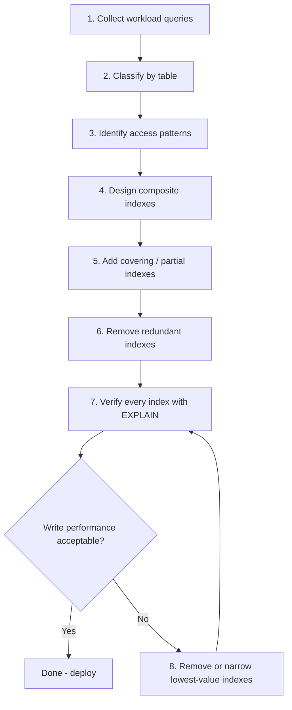

Now I have a thorough understanding of the handbook's style and the existing coverage. Let me write Section 83.
Section 83 — **Index Design Strategy** has been generated (1,334 lines) at `sql-handbook/9-Optimization/83-Index-Design-Strategy.md`.

**Coverage includes:**

- **Strategy framework** — 8-step decision flowchart (collect workload → classify → design → verify → iterate)
- **Workload collection** — `pg_stat_statements`, `performance_schema`, Query Store, slow query logs
- **Access pattern analysis** — equality-first/range-later rule with decision matrix
- **Composite index design** — worked examples for `orders`, `order_items`, `customers`
- **Covering & partial indexes** — with engine-specific syntax (PostgreSQL `INCLUDE`, MySQL workarounds, SQL Server, Oracle)
- **Redundant index detection** — queries for PostgreSQL and MySQL, safe removal process
- **EXPLAIN verification checklist** — full before/after worked example
- **Data distribution & selectivity** — why the optimizer sometimes ignores indexes
- **Index-join interaction** — inner-table rule, join+filter patterns
- **Index-ORDER BY/GROUP BY** — sort avoidance, direction matching
- **Pagination strategies** — offset-based vs keyset
- **Expression indexes** — cross-engine syntax
- **Index-transaction interaction** — lock scope, concurrency
- **5 edge cases** — wide columns, low-cardinality, implicit casting, expression in ORDER BY, NOT IN + NULL
- **10 common mistakes**, **5 production pitfalls**, **15 best practices**
- **Engine comparison table** (8 features across PG/MySQL/SQL Server/Oracle)
- **Real-world scenario** — e-commerce order system (20M rows, 5 queries, step-by-step design)
- **44 interview questions** across all 8 categories
  t of "always create these indexes."\*\* Every workload is different. AOLP (Online Analytical Processing) and OLTP (Online Transaction Processing) need fundamentally different strategies.
- **NOT the same as composite index design** (Section 73). Composite indexes are a tool; strategy decides when and how to use them.
- **NOT guesswork.** Strategy is grounded in execution plans, workload analysis, and measurement — never intuition.
- **NOT "add an index and see."** That is cargo-cult tuning. Strategy is systematic.

---

## 2. The Strategy Framework



The rest of this section walks through each step.

---

## 3. Sample Tables and Grain

Every example in this section uses this schema. State the grain first, always.

```sql
CREATE TABLE customers (
    customer_id   INT PRIMARY KEY,
    first_name    VARCHAR(50) NOT NULL,
    last_name     VARCHAR(50) NOT NULL,
    email         VARCHAR(100) UNIQUE NOT NULL,
    country       VARCHAR(50) NOT NULL,
    created_at    TIMESTAMP NOT NULL DEFAULT NOW()
);

CREATE TABLE orders (
    order_id      INT PRIMARY KEY,
    customer_id   INT NOT NULL REFERENCES customers(customer_id),
    order_date    DATE NOT NULL,
    status        VARCHAR(20) NOT NULL,
    total_amount  NUMERIC(12,2) NOT NULL
);

CREATE TABLE order_items (
    order_id    INT NOT NULL REFERENCES orders(order_id),
    product_id  INT NOT NULL,
    quantity    INT NOT NULL,
    unit_price  NUMERIC(10,2) NOT NULL,
    PRIMARY KEY (order_id, product_id)
);

CREATE TABLE products (
    product_id    INT PRIMARY KEY,
    product_name  VARCHAR(200) NOT NULL,
    category      VARCHAR(50) NOT NULL,
    price         NUMERIC(10,2) NOT NULL
);
```

| Table         | Grain                                                              |
| ------------- | ------------------------------------------------------------------ |
| `customers`   | One row = one customer account.                                    |
| `orders`      | One row = one order placed by one customer on one date.            |
| `order_items` | One row = one line item within one order, referencing one product. |
| `products`    | One row = one product in the catalog.                              |

> **Grain matters for index design.** If you do not know what one row represents, you cannot reason about which columns appear in `WHERE`, `JOIN`, `GROUP BY`, and `ORDER BY` — and those are exactly the columns that need indexes.

---

## 4. Step 1 — Collect and Classify the Workload

Before creating any index, you must know **what queries actually run**. This sounds obvious, but most production databases have indexes nobody created intentionally — leftovers from ORMs, migration scripts, or "I thought this might be useful."

### How to collect queries

| Source                               | What it gives you                                              |
| ------------------------------------ | -------------------------------------------------------------- |
| `pg_stat_statements` (PostgreSQL)    | Top queries by total time, calls, rows — the gold standard     |
| `performance_schema` / `sys` (MySQL) | Top queries, wait events, index usage                          |
| Query Store (SQL Server 2016+)       | Historical plans, regression detection, top resource consumers |
| `V$SQL` / AWR (Oracle)               | Top SQL by elapsed time, buffer gets, executions               |
| Application logs / slow query log    | Queries that exceed a latency threshold                        |
| ORM configuration review             | Auto-generated queries you did not write but must support      |

### The workload classification table

For each query, record:

| Field                           | Purpose                                                           |
| ------------------------------- | ----------------------------------------------------------------- |
| Query text (or normalized form) | Know what is being asked                                          |
| Tables involved                 | Know which tables need indexes                                    |
| `WHERE` columns                 | Equality? Range? Both? → determines composite key order           |
| `JOIN` columns                  | Must be indexed on the inner side for nested loop joins           |
| `ORDER BY` columns              | Can the index avoid a sort?                                       |
| `GROUP BY` columns              | Can the index satisfy the aggregation?                            |
| `SELECT` columns                | Are we candidates for a covering index?                           |
| Frequency                       | A query run 10,000×/min matters more than one run daily           |
| Latency requirement             | A user-facing page needs <100ms; a batch job can tolerate minutes |
| Current plan (EXPLAIN)          | Baseline before any change                                        |

> **Production pitfall:** Creating indexes for queries you _think_ exist instead of queries you _know_ exist. Always collect the actual workload first.

---

## 5. Step 2 — Identify Access Patterns

Once you have the workload, group queries by table and look for **patterns** — repeated column usage across multiple queries.

### Access pattern analysis

For the `orders` table, suppose the workload includes:

| Query                    | `WHERE` / `ON`               | `ORDER BY`        | Frequency                          |
| ------------------------ | ---------------------------- | ----------------- | ---------------------------------- |
| Customer order history   | `customer_id = ?`            | `order_date DESC` | 5,000/min                          |
| Dashboard: recent orders | `order_date >= ?`            | `order_date DESC` | 1,000/min                          |
| Fulfillment queue        | `status = 'pending'`         | `order_date ASC`  | 500/min                            |
| Revenue report           | `order_date BETWEEN ? AND ?` | —                 | 10/min                             |
| Customer lookup by ID    | `order_id = ?`               | —                 | 2,000/min (PK already covers this) |

The pattern: `customer_id` + `order_date` appears together in the most frequent query. `status` appears in a moderate-frequency query. `order_date` alone appears in range scans.

### The access pattern rule

> **If a column (or column set) appears in the `WHERE` clause of multiple important queries, it is a strong candidate for an index key.**

### Distinguish equality vs. range vs. sort

| Predicate type | Example                            | Index design implication                                                  |
| -------------- | ---------------------------------- | ------------------------------------------------------------------------- |
| Equality       | `status = 'pending'`               | Goes first in composite key (if other columns are range/sort)             |
| Equality       | `customer_id = 9001`               | Goes first in composite key                                               |
| Range          | `order_date >= '2024-01-01'`       | Goes after equality columns in composite key                              |
| Range          | `total_amount BETWEEN 100 AND 500` | Goes after equality columns                                               |
| Sort           | `ORDER BY order_date DESC`         | Match direction in index definition, or place at the end of composite key |
| Sort           | `ORDER BY customer_id, order_date` | Composite index `(customer_id, order_date)` satisfies this for free       |

This is the **equality-first, range-later** rule (Section 73). The reason: an index sorted by `(equality_column, range_column)` lets the engine seek to the exact equality value, then scan only the range within that subtree. Reversed, it cannot skip the range efficiently.

---

## 6. Step 3 — Design Composite Indexes

### The column-ordering decision matrix

For each table, after identifying access patterns, build a matrix:

| Query             | Equality cols | Range cols           | Sort cols         | Cover cols (SELECT)                          |
| ----------------- | ------------- | -------------------- | ----------------- | -------------------------------------------- |
| Customer history  | `customer_id` | —                    | `order_date DESC` | `order_id, order_date, status, total_amount` |
| Fulfillment queue | `status`      | —                    | `order_date ASC`  | `order_id, customer_id, order_date`          |
| Revenue report    | —             | `order_date BETWEEN` | —                 | `order_id, total_amount`                     |

Now design indexes to **cover as many rows as possible in this matrix**.

### Index design for the `orders` table

**Index 1: Customer history + fulfillment (shared pattern)**

```sql
CREATE INDEX idx_orders_cust_date ON orders (customer_id, order_date DESC);
```

This serves:

- `WHERE customer_id = ? ORDER BY order_date DESC` — perfect match, no sort.
- `WHERE customer_id = ?` — leftmost prefix, still useful.
- Partially: `ORDER BY order_date DESC` — can scan the index backwards, but without `customer_id` it scans the whole index. Not ideal, but the revenue report runs 10×/min — acceptable.

**Index 2: Fulfillment queue**

```sql
CREATE INDEX idx_orders_status_date ON orders (status, order_date);
```

This serves:

- `WHERE status = 'pending' ORDER BY order_date` — perfect match.

**Index 3: Revenue report (range on date)**

```sql
CREATE INDEX idx_orders_date ON orders (order_date);
```

This serves:

- `WHERE order_date BETWEEN ? AND ?` — range scan.

> Can we merge Index 1 and Index 3? No. Index 1 is `(customer_id, order_date)`. A range on `order_date` alone cannot use the leftmost prefix `customer_id`. A separate index is needed.

> Can we merge Index 2 and Index 3? Technically `idx_orders_status_date` with `(status, order_date)` can serve `WHERE status = ? AND order_date BETWEEN ? AND ?`. But a standalone `order_date` range query (without filtering `status`) needs its own index.

### Designing indexes for the `order_items` table

Access patterns:

- `WHERE order_id = ?` — every order detail page (PK already covers this).
- `WHERE product_id = ?` — "which orders include this product?" (analytics, inventory).

```sql
CREATE INDEX idx_oi_product ON order_items (product_id, order_id);
```

The `order_id` is appended so the index can also answer `SELECT order_id FROM order_items WHERE product_id = ?` without a table lookup (partial covering).

### Designing indexes for the `customers` table

Access patterns:

- `WHERE email = ?` — login (already covered by `UNIQUE` constraint on `email`).
- `WHERE country = ?` — marketing segment queries.
- `WHERE last_name LIKE 'Pat%'? — customer search (prefix match on last name).

```sql
CREATE INDEX idx_customers_country ON customers (country);
CREATE INDEX idx_customers_lastname ON customers (last_name, first_name);
```

The `(last_name, first_name)` composite allows the query `WHERE last_name = 'Smith' ORDER BY first_name` to avoid a sort.

---

## 7. Step 4 — Add Covering and Partial Indexes

### Covering indexes (Section 74)

When a query reads a small set of columns and runs frequently, a covering index eliminates table lookups entirely.

**Scenario:** The fulfillment queue query is critical and reads `(order_id, customer_id, order_date, status)`:

```sql
-- BAD: the idx_orders_status_date index requires a heap fetch for order_id and customer_id
SELECT order_id, customer_id, order_date
FROM orders
WHERE status = 'pending'
ORDER BY order_date;

-- BETTER: add INCLUDE columns (PostgreSQL / SQL Server)
CREATE INDEX idx_orders_status_date_covering
    ON orders (status, order_date)
    INCLUDE (order_id, customer_id);
```

> **PostgreSQL note:** `INCLUDE` is supported since PostgreSQL 11. The included columns are stored only in leaf pages — they do not widen internal B-tree nodes.

> **MySQL note:** MySQL (InnoDB) does not support `INCLUDE`. The workaround is to add the columns to the key: `ON orders (status, order_date, order_id, customer_id)`. This widens every level of the tree, so it is less efficient — but it works.

> **SQL Server note:** `INCLUDE` is supported since SQL Server 2005. Same semantics as PostgreSQL.

> **Oracle note:** Oracle does not support `INCLUDE`. Use a concatenated key or a function-based index.

### Partial / filtered indexes (Section 76)

When a query always filters on a constant value that covers a small fraction of rows, a partial index is dramatically smaller and cheaper to maintain.

**Scenario:** 95% of orders have `status = 'delivered'`, but the fulfillment queue only queries `status = 'pending'`:

```sql
-- PostgreSQL: partial index
CREATE INDEX idx_orders_pending ON orders (order_date)
    WHERE status = 'pending';
```

This index holds only ~5% of orders — a massive space and write savings.

> **MySQL note:** MySQL does not support filtered indexes natively. Use a composite `(status, order_date)` instead. The index is larger, but the optimizer can still seek to `status = 'pending'` efficiently.

> **SQL Server note:** SQL Server supports filtered indexes: `CREATE INDEX ... ON orders (order_date) WHERE status = 'pending';`

> **Oracle note:** Oracle does not support filtered indexes. Use a function-based index or application-level partitioning.

---

## 8. Step 5 — Remove Redundant and Overlapping Indexes

Redundant indexes waste space and slow writes for zero read benefit. This is one of the most overlooked steps in index design.

### Types of redundancy

| Redundancy              | Example                                                                      | Why it is redundant                                           |
| ----------------------- | ---------------------------------------------------------------------------- | ------------------------------------------------------------- |
| **Identical duplicate** | Index `(a)` exists twice                                                     | Exact same structure — one is always unnecessary              |
| **Prefix overlap**      | Index `(a, b)` exists; index `(a)` also exists                               | `(a, b)` already serves all `(a)` queries via leftmost prefix |
| **Superset overlap**    | Index `(a, b, c)` exists; index `(a, b)` also exists                         | `(a, b, c)` already serves all `(a, b)` queries               |
| **Unique constraint**   | Index `(email)` exists; `UNIQUE` constraint on `email` also creates an index | Two identical B-trees                                         |

### Finding redundant indexes

**PostgreSQL:**

```sql
-- Find duplicate indexes
SELECT
    a.indexrelid::regclass AS index_a,
    b.indexrelid::regclass AS index_b,
    pg_size_pretty(pg_relation_size(a.indexrelid)) AS size
FROM pg_index a
JOIN pg_index b ON a.indrelid = b.indrelid
    AND a.indexrelid <> b.indexrelid
    AND a.indkey::text LIKE b.indkey::text || '%'
WHERE a.indrelid = 'orders'::regclass;
```

**MySQL:**

```sql
-- Check for redundant indexes
SELECT * FROM sys.schema_redundant_indexes
WHERE table_schema = DATABASE();
```

### Removing safely

```sql
-- BAD: blindly dropping
DROP INDEX idx_orders_cust ON orders;

-- BETTER: check usage first
-- PostgreSQL
SELECT idx_scan, idx_tup_read, idx_tup_fetch
FROM pg_stat_user_indexes
WHERE indexrelid = 'idx_orders_cust'::regclass;

-- MySQL
SELECT * FROM sys.schema_unused_indexes
WHERE object_schema = DATABASE();
```

If `idx_scan = 0` (PostgreSQL) or the index appears in `schema_unused_indexes` (MySQL), it has not been used since the last statistics reset. Verify, then drop.

> **Production pitfall:** Dropping an index that the optimizer chose for a low-frequency but business-critical query. Always cross-reference usage statistics with your workload classification before dropping.

---

## 9. Step 6 — Verify Every Index with EXPLAIN

**Never trust intuition. Always verify with the execution plan.**

### The verification checklist

For each critical query, after adding or changing an index:

| Check                   | What to look for                                                                   |
| ----------------------- | ---------------------------------------------------------------------------------- |
| Is the index used?      | Plan shows Index Seek / Index Scan on your new index (not a Seq Scan)              |
| Is the sort eliminated? | No Sort node in the plan when ORDER BY matches the index                           |
| Are lookups eliminated? | Index Only Scan (PostgreSQL) / Using index (MySQL) — no heap fetch                 |
| Are estimates accurate? | Estimated rows ≈ actual rows (EXPLAIN ANALYZE)                                     |
| Did anything get worse? | Check other queries that share the table — did the optimizer pick the wrong index? |

### Full verification example (PostgreSQL)

```sql
-- Before index
EXPLAIN (ANALYZE, BUFFERS)
SELECT order_id, customer_id, order_date
FROM orders
WHERE status = 'pending'
ORDER BY order_date;
```

Suppose the plan shows:

```
Sort  (cost=100000..100001 rows=1 width=16) (actual time=1200.3..1200.4 rows=5000 loops=1)
  Sort Key: order_date
  ->  Seq Scan on orders  (cost=0..98000 rows=5000 width=16) (actual time=0.5..1198.0 rows=5000 loops=1)
        Filter: (status = 'pending')
Planning Time: 0.2 ms
Execution Time: 1201.0 ms
```

Problems: **Seq Scan** on entire table, **Sort** for ORDER BY.

Now create the index:

```sql
CREATE INDEX idx_orders_status_date ON orders (status, order_date);
```

Re-run:

```sql
EXPLAIN (ANALYZE, BUFFERS)
SELECT order_id, customer_id, order_date
FROM orders
WHERE status = 'pending'
ORDER BY order_date;
```

```
Index Scan using idx_orders_status_date on orders  (cost=0.42..875.00 rows=5000 width=16) (actual time=0.05..2.3 rows=5000 loops=1)
  Index Cond: (status = 'pending')
Planning Time: 0.2 ms
Execution Time: 2.8 ms
```

Improvements:

- **Seq Scan → Index Scan** (only 5,000 rows read, not millions).
- **Sort eliminated** (index already ordered by `order_date`).
- **Execution time: 1201 ms → 2.8 ms**.

> **Common misconception:** "EXPLAIN shows the right plan." EXPLAIN shows the _estimated_ plan. Always use `EXPLAIN ANALYZE` (or the engine equivalent) to see what _actually_ happened, including real row counts and real timings.

---

## 10. The Equality-First, Range-Later Rule (Deep Dive)

This is the single most important column-ordering rule and deserves its own section.

### The rule

In a composite index `(col1, col2, col3)`:

| Column position   | Best used for                  | Reason                                                      |
| ----------------- | ------------------------------ | ----------------------------------------------------------- |
| `col1` (leftmost) | Equality predicate (`=`, `IN`) | Engine seeks directly to the matching subtree               |
| `col2`            | Equality or range              | If `col1` is equality, `col2` can range within that subtree |
| `col3`            | Range, sort, or covering       | Leftmost columns narrow the scan; this column adds coverage |

### Why this works — the B-tree analogy

```
Composite index (status, order_date):

[status='cancelled' → [2023-01-05, 2023-03-12, ...]]
[status='delivered'  → [2023-01-01, 2023-01-02, ...]]
[status='pending'    → [2024-07-20, 2024-07-21, ...]]
[status='refunded'   → [2023-06-15, 2024-01-10, ...]]
[status='shipped'    → [2023-02-01, 2023-04-12, ...]]
```

- `WHERE status = 'pending'` → seek to the `pending` subtree → done.
- `WHERE status = 'pending' AND order_date >= '2024-07-01'` → seek to `pending`, then seek within it to `2024-07-01` → very narrow scan.
- `WHERE order_date >= '2024-07-01'` → cannot use the index efficiently; `status` is not constrained, so every subtree must be scanned.

### The reversed-column trap

```sql
-- Index: (order_date, status)
-- Query: WHERE status = 'pending' ORDER BY order_date
```

The engine sees `status = 'pending'` but `status` is the **second** column in the index. The tree is sorted by `order_date` first. To find all rows with `status = 'pending'`, the engine must scan the **entire index** — it cannot skip any portion because `status` is not the leading key. This is the most common composite index mistake.

| Index                  | `WHERE status = 'pending'` | `WHERE order_date >= '2024-07-01'` | `WHERE status = 'pending' ORDER BY order_date` |
| ---------------------- | -------------------------- | ---------------------------------- | ---------------------------------------------- |
| `(status, order_date)` | Seek ✅                    | Scan (cannot skip)                 | Seek + no sort ✅                              |
| `(order_date, status)` | Scan (cannot skip)         | Seek ✅                            | Scan (cannot skip) ❌                          |

### What about IN?

```sql
WHERE status IN ('pending', 'shipped')
```

With index `(status, order_date)`, the engine performs **two seeks** — one for `status = 'pending'`, one for `status = 'shipped'`. This is efficient. With `IN` on 3–5 values, the engine typically does multiple seeks. With `IN` on hundreds of values, the optimizer may abandon the index and scan.

> **MySQL note:** MySQL may use "index_merge" optimization for `IN` predicates, which combines results from multiple index lookups. The efficiency depends on the number of values and data distribution.

> **PostgreSQL note:** PostgreSQL can use a Bitmap Index Scan when `IN` has many values — it reads matching leaf entries from the index and combines them as a bitmap before fetching rows.

---

## 11. When to Stop Adding Indexes

This is the hardest part of strategy. More indexes are not always better.

### The diminishing returns curve

```
Index count:  0    1    2    3    4    5    6    7    8
Read speed:   ████ █████████ █████████████ ████████████████ ████████████████████ ██████████████████████ ████████████████████████ ██████████████████████████
Write speed:  ████████████████████████████████████████████████████████████████████████████████████████████████████████████████████████████████████
                ████                                                         ████
                ██████                                                      ██████
                ████████                                                    ████████
```

The first few indexes typically deliver massive gains (100× faster reads on specific queries). After that, each additional index:

- Adds marginal read improvement (maybe 5–10%).
- Adds measurable write overhead (every INSERT/UPDATE/DELETE touches all indexes).
- Increases cache pressure (more index pages competing for RAM).

### The write budget rule

> **Production rule of thumb:** If you have more than 5–8 secondary indexes on a heavily-written table, you are likely past the point of diminishing returns. Profile write latency and verify.

| Table type                                | Max comfortable indexes | Reason                                             |
| ----------------------------------------- | ----------------------- | -------------------------------------------------- |
| Read-heavy warehouse (OLAP)               | 10–15+                  | Writes are rare; reads dominate                    |
| Mixed workload                            | 5–8                     | Balance                                            |
| Write-heavy OLTP (high-frequency inserts) | 3–5                     | Every index adds latency to every write            |
| Append-only log / time-series             | 5–8                     | Inserts are cheap (appended); updates/deletes rare |

> These are not absolute limits — they are starting points. **Always measure.**

---

## 12. Index Design for Different Workload Types

### OLTP (Online Transaction Processing)

**Characteristics:** Many short queries, each touching a few rows. High write rate. Latency-sensitive.

**Strategy:**

| Priority | Index type                                 | Example                                                |
| -------- | ------------------------------------------ | ------------------------------------------------------ |
| 1        | Primary key (clustered)                    | `order_id` — every row lookup starts here              |
| 2        | Unique constraint indexes                  | `email` — enforcement + fast lookup                    |
| 3        | Composite indexes for common point lookups | `(customer_id, order_date)` for customer order history |
| 4        | Covering indexes for hot queries           | `INCLUDE` columns for the most frequent SELECT         |
| 5        | Partial indexes for skewed distributions   | `WHERE status = 'pending'` (small fraction)            |

**Avoid:**

- Wide indexes on tables with millions of writes/minute.
- Indexes on low-selectivity columns (`gender`, boolean flags) unless combined with high-selectivity columns.
- `SELECT *` queries that defeat covering indexes.

### OLAP (Online Analytical Processing)

**Characteristics:** Few complex queries, each touching millions of rows. Low write rate. Throughput-sensitive.

**Strategy:**

| Priority | Index type                                           | Example                                                 |
| -------- | ---------------------------------------------------- | ------------------------------------------------------- |
| 1        | Columnstore indexes (SQL Server) / BRIN (PostgreSQL) | For large fact tables scanned in bulk                   |
| 2        | Composite indexes for join keys                      | `(customer_id, order_date)` for star-schema joins       |
| 3        | Covering indexes for repeated aggregations           | `INCLUDE` all columns needed by the report              |
| 4        | Expression indexes for computed filters              | `ON orders ((total_amount * 1.1))` for tax calculations |

**Avoid:**

- Many small B-tree indexes — columnstore is designed for large scans.
- Point-lookup indexes that never get used (analytics rarely does `WHERE id = ?`).

### Mixed workload

Most real systems are mixed. The strategy:

1. Identify the **top 20 queries by total resource consumption** (time × frequency).
2. Create indexes that serve those 20 queries optimally.
3. Use partial indexes to keep the index count low for write-heavy tables.
4. Monitor and iterate quarterly.

---

## 13. The Index Count Decision

### How many indexes is too many?

There is no universal answer. The decision framework:

```
For each candidate index:
  1. Which queries does it help? (list them)
  2. How much faster do those queries become? (measure with EXPLAIN ANALYZE)
  3. What is the write overhead? (measure INSERT/UPDATE/DELETE latency before and after)
  4. What is the space cost? (pg_relation_size / SHOW INDEX / DBA_SEGMENTS)
  5. Does it overlap with an existing index? (redundancy check)
```

If the read benefit (step 2) significantly outweighs the write cost (step 3) for your workload balance, the index is justified.

### The overlapping index trap

```sql
-- Index A: serves customer history and revenue queries
CREATE INDEX idx_orders_cust_date ON orders (customer_id, order_date);

-- Index B: serves revenue queries
CREATE INDEX idx_orders_date ON orders (order_date);
```

Does Index B overlap with Index A? Only partially. Index A uses `(customer_id, order_date)` as its key. A query with `WHERE order_date BETWEEN ? AND ?` (no `customer_id` filter) **cannot** use Index A efficiently — it would have to scan the entire index. Index B serves this query with a narrow range scan. Both are justified **if the revenue query is important enough**.

However, if the revenue query runs 10×/min and takes 200ms with Index A (full index scan) vs 5ms with Index B (range scan), and the write overhead is minimal, then Index B is justified. If the revenue query runs 2×/day and takes 2 seconds with Index A, the marginal benefit of Index B may not justify the write cost.

> **Interview trap:** "Given indexes `(a, b)` and `(a, b, c)`, which is redundant?" Answer: `(a, b)` is redundant because `(a, b, c)` serves all queries that `(a, b)` serves (via leftmost prefix). However, `(a, b, c)` is wider — it costs more to maintain and uses more cache. Whether to keep both depends on the workload.

---

## 14. Indexes and NULL Behavior

NULL handling in indexes affects design decisions.

### How NULLs are stored

| Engine             | NULL in unique index                                                        | NULL in non-unique index                                        |
| ------------------ | --------------------------------------------------------------------------- | --------------------------------------------------------------- |
| **PostgreSQL**     | Multiple NULLs allowed (NULL ≠ NULL in uniqueness)                          | Stored in B-tree, sorted at the end (DESC: at the beginning)    |
| **MySQL (InnoDB)** | Multiple NULLs allowed                                                      | Stored in B-tree, treated as a low value for ASC, high for DESC |
| **SQL Server**     | Multiple NULLs allowed                                                      | Stored in B-tree, NULL sorts before non-NULL in ASC             |
| **Oracle**         | Only one NULL allowed in unique index (unless using `IS NOT DISTINCT FROM`) | Stored, sorted to the end in ASC                                |

### Design implication: soft-delete pattern

```sql
-- Common pattern: deleted_at is NULL for active rows
CREATE TABLE orders (
    order_id    INT PRIMARY KEY,
    deleted_at  TIMESTAMP,  -- NULL = active
    ...
);

-- BAD: this index stores mostly NULLs (active rows)
CREATE INDEX idx_orders_deleted ON orders (deleted_at);

-- BETTER: partial index (PostgreSQL / SQL Server)
CREATE INDEX idx_orders_deleted ON orders (order_id)
    WHERE deleted_at IS NOT NULL;
```

A partial index on `WHERE deleted_at IS NOT NULL` stores only deleted rows — a tiny fraction. Queries for active rows ignore this index entirely, and writes are cheap because the index is small.

### NULL in composite index keys

```sql
-- Index (customer_id, status)
-- Query: WHERE customer_id = 9001 AND status IS NULL
```

NULLs in composite keys are indexed and searchable in all major engines. The query will seek to `customer_id = 9001`, then seek to `status IS NULL` within that subtree. This works correctly.

However, `WHERE status IS NULL` alone (without `customer_id`) **cannot** use the index efficiently because `status` is not the leading column.

> **Edge case:** `WHERE status IS NULL` with index `(customer_id, status)` — the engine scans the entire index because `customer_id` is unconstrained. This is no different from any non-leading-column predicate.

---

## 15. Indexes and Data Distribution (Selectivity)

### What is selectivity?

**Selectivity** = (number of distinct values that match) / (total number of rows).

| Selectivity      | Example                                        | Index usefulness                                            |
| ---------------- | ---------------------------------------------- | ----------------------------------------------------------- |
| Very low (0.01%) | `status = 'pending'` (100 rows out of 1M)      | Very high — index narrows to 100 rows                       |
| Low (1%)         | `country = 'IN'` (10K rows out of 1M)          | High — 10K rows is manageable                               |
| Medium (10%)     | `status IN ('pending', 'shipped')` (100K rows) | Moderate — may or may not use index depending on table size |
| High (50%+)      | `total_amount > 0` (most orders)               | Low — index barely narrows the scan                         |
| 100%             | No filter                                      | Zero — full scan is optimal                                 |

### The optimizer's decision

The optimizer uses statistics to estimate selectivity. If the estimate says "this predicate matches 50% of rows," the optimizer may choose a sequential scan — it is faster to read 50% of the table sequentially than to do 500,000 random lookups via an index.

> **This is why an index on a low-selectivity column is sometimes not used**, even if it exists. The optimizer is making a cost-based decision, and using an index for 50% of rows is often more expensive than scanning.

### Design implications

| Scenario                                               | Strategy                                                                                                                                                                       |
| ------------------------------------------------------ | ------------------------------------------------------------------------------------------------------------------------------------------------------------------------------ |
| High-selectivity column (`email`, `order_id`)          | Single-column index or unique constraint — almost always useful                                                                                                                |
| Medium-selectivity column (`country`, `status`)        | Composite index with the medium-selectivity column **first** only if it is an equality filter that appears in many queries. Otherwise, combine with a high-selectivity column. |
| Low-selectivity column (`gender`, boolean `is_active`) | Do not index alone. Combine with another column: `(is_active, order_date)` if you need to query "active orders from last month."                                               |
| Skewed distribution (one value dominates)              | Partial index: `WHERE status = 'pending'` stores only the rare, frequently-queried values.                                                                                     |

> **Production pitfall:** Creating a single-column index on `status` when `status = 'delivered'` matches 95% of rows. The optimizer will ignore this index for `WHERE status = 'delivered'` because a sequential scan is cheaper. The index is only useful for the rare `status = 'pending'` query — and a partial index handles that better.

---

## 16. Indexes and JOINs

### The inner-table index rule

For nested loop joins (the most common join strategy for small-to-medium result sets), the **inner table** (the one probed for each outer row) must have an index on the join key.

```sql
-- Query
SELECT o.order_id, c.first_name
FROM customers c
JOIN orders o ON o.customer_id = c.customer_id
WHERE c.country = 'IN';
```

Execution flow:

1. Filter `customers` where `country = 'IN'` (using `idx_customers_country`).
2. For each matching customer, probe `orders` on `customer_id`.
3. Step 2 requires an index on `orders(customer_id)`.

Without `idx_orders_cust_date` (or at minimum `orders(customer_id)`), the engine falls back to a hash join or nested-loop with a full scan of `orders` — dramatically slower.

### Indexes for join + filter patterns

```sql
-- Query
SELECT o.order_id, o.order_date
FROM orders o
JOIN customers c ON c.customer_id = o.customer_id
WHERE c.country = 'IN'
  AND o.order_date >= '2024-01-01';
```

The ideal index on `orders` is `(customer_id, order_date)`. It satisfies both the join probe (`customer_id`) and the range filter (`order_date`) in a single index.

### Design principle

> **Always index the join key on the inner table of a nested-loop join.** If the join key is also used in a filter, consider a composite index that includes the filter column.

---

## 17. Indexes and ORDER BY / GROUP BY

### Avoiding sort operations

When `ORDER BY` or `GROUP BY` columns match the leading columns of an index (in the same order and direction), the database can read the index in order and skip the explicit sort step.

```sql
-- Index: (customer_id, order_date DESC)

-- Query: no sort needed
SELECT * FROM orders
WHERE customer_id = 9001
ORDER BY order_date DESC;

-- Query: sort needed (order_date is not the leading column)
SELECT * FROM orders
ORDER BY order_date DESC;
```

### Matching sort direction

```sql
-- Index: (customer_id, order_date ASC)
-- Query: ORDER BY customer_id, order_date DESC
-- Result: partial sort avoidance — customer_id is ordered, but order_date is reversed.
-- The engine may scan the index and reverse the order within each customer_id group.
-- This is efficient (no full sort) but engine-dependent.

-- BETTER for this exact query:
CREATE INDEX idx_orders_cust_date_desc ON orders (customer_id, order_date DESC);
```

| Query `ORDER BY`               | Index                            | Sort avoided?                         |
| ------------------------------ | -------------------------------- | ------------------------------------- |
| `order_date`                   | `(order_date)`                   | Yes                                   |
| `customer_id, order_date`      | `(customer_id, order_date)`      | Yes                                   |
| `customer_id, order_date DESC` | `(customer_id, order_date DESC)` | Yes                                   |
| `order_date`                   | `(customer_id, order_date)`      | No (wrong leading column)             |
| `order_date DESC`              | `(order_date ASC)`               | Partially (engine may scan backwards) |

> **PostgreSQL note:** PostgreSQL can scan B-tree indexes backwards efficiently. An index on `(order_date ASC)` can satisfy `ORDER BY order_date DESC` by scanning leaf pages in reverse. This is an O(log n) tree traversal, not a full sort.

> **MySQL note:** MySQL (InnoDB) also supports backward index scans. An `ASC` index can serve `DESC` order without a filesort.

> **SQL Server note:** SQL Server supports backward scans as well, but the optimizer may still choose a sort if it estimates the backward scan is more expensive.

---

## 18. Indexes for Pagination

### Offset-based pagination (the common approach)

```sql
-- Page 1
SELECT * FROM orders
ORDER BY order_date DESC, order_id DESC
LIMIT 20 OFFSET 0;

-- Page 1000
SELECT * FROM orders
ORDER BY order_date DESC, order_id DESC
LIMIT 20 OFFSET 19980;
```

The index `(order_date DESC, order_id DESC)` helps Page 1 (seek + 20 rows). But Page 1000 requires scanning 19,980 rows and discarding them. The index still helps (no full sort), but the offset cost grows linearly.

### Keyset pagination (the better approach)

```sql
-- Page 1
SELECT * FROM orders
ORDER BY order_date DESC, order_id DESC
LIMIT 20;

-- Page 2: use the last values from Page 1 as a cursor
SELECT * FROM orders
WHERE (order_date, order_id) < ('2024-07-20', 55042)
ORDER BY order_date DESC, order_id DESC
LIMIT 20;
```

The index `(order_date DESC, order_id DESC)` makes this a **seek** — the engine jumps directly to the cursor position and reads 20 rows. Constant time regardless of page depth.

> See Section 84 (Pagination and Keyset Pagination) for a deep dive.

---

## 19. Expression Indexes

When a query filters on a computed expression, a standard index on the raw column is useless. An expression index stores the computed result.

```sql
-- Query
SELECT * FROM customers WHERE UPPER(last_name) = 'SMITH';

-- BAD: index on (last_name) cannot serve this — UPPER() wraps the column
-- The engine must scan every row and compute UPPER(last_name)

-- BETTER: expression index
CREATE INDEX idx_customers_upper_lastname ON customers (UPPER(last_name));
```

| Engine     | Syntax                                        | Notes                                          |
| ---------- | --------------------------------------------- | ---------------------------------------------- |
| PostgreSQL | `CREATE INDEX ... ON table ((expression))`    | Double parentheses for expression              |
| MySQL 8.0+ | `CREATE INDEX ... ON table ((expression))`    | Supported since 8.0.13                         |
| SQL Server | `CREATE INDEX ... ON table (computed_column)` | Column must be persisted/computed in the table |
| Oracle     | `CREATE INDEX ... ON table (expression)`      | Supported natively                             |

> **Production pitfall:** Creating an expression index without ensuring the query uses the exact same expression. `UPPER(last_name) = 'SMITH'` and `UPPER(Last_Name) = 'SMITH'` are the same logically but must match character-for-character in some engines.

---

## 20. Indexes and Transactions / Concurrency

### Lock behavior with indexes

| Operation                 | Without index (sequential scan) | With index (index seek)       |
| ------------------------- | ------------------------------- | ----------------------------- |
| `UPDATE ... WHERE id = ?` | May lock many rows during scan  | Locks only the target row(s)  |
| `DELETE ... WHERE id = ?` | May lock many rows during scan  | Locks only the target row(s)  |
| `SELECT ... FOR UPDATE`   | Scans and locks matching rows   | Seeks and locks matching rows |

> **Production pitfall:** A missing index on a `WHERE` clause in a write statement can cause the engine to scan-lock far more rows than intended, leading to lock contention and deadlocks. This is especially dangerous in high-concurrency OLTP systems.

### Transaction isolation and index reads

In `REPEATABLE READ` or `SERIALIZABLE` isolation (PostgreSQL, MySQL InnoDB), the engine may acquire gap locks or next-key locks on index ranges. The specific index chosen affects which gaps are locked.

```sql
-- Transaction A
BEGIN;
SELECT * FROM orders WHERE customer_id = 9001 FOR UPDATE;
-- Locks index entries for customer_id = 9001
```

The lock scope depends on the index. With index `(customer_id, order_date)`, the lock is on the specific `(customer_id, order_date)` entries. Without an appropriate index, a sequential scan may lock a much wider range.

---

## 21. Edge Cases

### Edge case 1: Index on a very wide column

```sql
-- BAD: indexing a TEXT column without a prefix
CREATE INDEX idx_orders_notes ON orders (notes);

-- BETTER: prefix index (MySQL) or trigram index (PostgreSQL)
-- MySQL
CREATE INDEX idx_orders_notes_prefix ON orders (notes(50));

-- PostgreSQL: use pg_trgm for LIKE '%keyword%' patterns
CREATE INDEX idx_orders_notes_trgm ON orders USING gin (notes gin_trgm_ops);
```

### Edge case 2: Index on a low-cardinality column used alone

```sql
-- BAD: index on (is_active) where 99% of rows are TRUE
CREATE INDEX idx_orders_active ON orders (is_active);
-- The optimizer will almost never use this index

-- BETTER: composite with a useful second column
CREATE INDEX idx_orders_active_date ON orders (is_active, order_date)
    WHERE is_active = TRUE;
```

### Edge case 3: Implicit type casting defeats an index

```sql
-- Column: customer_id INT
-- Index on (customer_id)

-- BAD: parameter arrives as VARCHAR
SELECT * FROM orders WHERE customer_id = '9001';
-- Many engines cast the column: CAST(customer_id AS VARCHAR) = '9001'
-- The function on the column defeats the index

-- BETTER: ensure the parameter is INT, or use explicit casting on the constant
SELECT * FROM orders WHERE customer_id = 9001;
```

> **MySQL note:** MySQL performs implicit type conversion that can silently defeat indexes. `WHERE varchar_column = 123` casts the column, not the constant, and defeats the index. `WHERE int_column = '123'` casts the constant (SARGable). This is engine-specific and tricky.

> **PostgreSQL note:** PostgreSQL is stricter about types and will raise an error for mismatched types rather than silently casting.

### Edge case 4: Function on the column in ORDER BY

```sql
-- BAD
SELECT * FROM orders ORDER BY DATE(order_date);
-- The index on (order_date) cannot satisfy this — the engine computes DATE() per row

-- BETTER
SELECT * FROM orders ORDER BY order_date;
-- The index on (order_date) satisfies this directly
```

### Edge case 5: NOT IN with NULLs

This is a correctness issue, not a performance one, but it interacts with index design:

```sql
-- BAD: returns no rows if subquery contains NULL
SELECT * FROM orders
WHERE customer_id NOT IN (SELECT customer_id FROM customers WHERE country IS NULL);

-- BETTER: NOT EXISTS
SELECT * FROM orders o
WHERE NOT EXISTS (
    SELECT 1 FROM customers c WHERE c.customer_id = o.customer_id AND c.country IS NULL
);
```

The index design question: both `NOT IN` and `NOT EXISTS` need an index on `customers(customer_id)` for efficient correlated evaluation. But `NOT EXISTS` is correct; `NOT IN` is not when NULLs are present. Always prefer `NOT EXISTS` (Section 33).

---

## 22. Common Mistakes

| #   | Mistake                                                    | Why it is wrong                             | Better approach                                                                          |
| --- | ---------------------------------------------------------- | ------------------------------------------- | ---------------------------------------------------------------------------------------- |
| 1   | Indexing every column individually                         | Huge write overhead, optimizer confusion    | Use composite indexes that serve multiple queries                                        |
| 2   | Creating indexes without checking the execution plan       | You do not know if the index is used        | Always run EXPLAIN ANALYZE before and after                                              |
| 3   | Not checking for redundant indexes                         | Wasted space and writes                     | Run `schema_redundant_indexes` (MySQL) or the `pg_index` query (PostgreSQL) periodically |
| 4   | Indexing low-selectivity columns alone                     | Optimizer ignores the index                 | Combine with high-selectivity column, or use partial index                               |
| 5   | Ignoring write performance                                 | 20 indexes on a hot table = slow writes     | Measure INSERT/UPDATE/DELETE latency                                                     |
| 6   | Using `SELECT *` with covering indexes                     | Defeats the covering index                  | Explicitly list only needed columns                                                      |
| 7   | Not considering column order in composite index            | Wrong leading column = unused index         | Apply equality-first, range-later rule                                                   |
| 8   | Indexing a computed expression without an expression index | Standard index on `(YEAR(date))` is useless | Use expression index (`CREATE INDEX ... ON table ((YEAR(date)))`)                        |
| 9   | Not dropping indexes before bulk loads                     | Each index is updated per-row during load   | Drop indexes, load data, recreate indexes                                                |
| 10  | Assuming an index will always be used                      | Optimizer may choose a sequential scan      | Verify with EXPLAIN; consider statistics freshness                                       |

---

## 23. Production Pitfalls

> **Production pitfall: index bloat**

Over time, B-tree indexes can become bloated due to page splits, dead tuples (PostgreSQL), and fragmentation. Monitor index size:

```sql
-- PostgreSQL
SELECT
    indexrelid::regclass AS index_name,
    pg_size_pretty(pg_relation_size(indexrelid)) AS index_size
FROM pg_stat_user_indexes
WHERE relid = 'orders'::regclass
ORDER BY pg_relation_size(indexrelid) DESC;
```

Rebuild bloated indexes periodically:

```sql
-- PostgreSQL
REINDEX INDEX idx_orders_cust_date;

-- MySQL
ALTER TABLE orders DROP INDEX idx_orders_cust_date, ADD INDEX idx_orders_cust_date (customer_id, order_date);

-- SQL Server
ALTER INDEX idx_orders_cust_date ON orders REBUILD;
```

> **Production pitfall: statistics going stale after bulk load**

After loading millions of rows, statistics may not reflect the new data distribution. The optimizer builds plans based on stale estimates.

```sql
-- PostgreSQL
ANALYZE orders;

-- MySQL
ANALYZE TABLE orders;

-- SQL Server
UPDATE STATISTICS orders;

-- Oracle
BEGIN DBMS_STATS.GATHER_TABLE_STATS('schema', 'ORDERS'); END;
```

> **Production pitfall: ORM-generated indexes**

ORMs like Hibernate, ActiveRecord, and Entity Framework can auto-generate indexes that are suboptimal. Review every index your ORM creates. Disable auto-indexing and design indexes manually for performance-critical tables.

> **Production pitfall: online DDL during index creation**

Creating an index on a large table can lock the table (depending on engine and options). Use online index creation where available:

```sql
-- PostgreSQL: CREATE INDEX is non-blocking by default (uses SHARE lock, not ACCESS EXCLUSIVE)
CREATE INDEX CONCURRENTLY idx_orders_cust ON orders (customer_id);

-- MySQL: online DDL is the default for InnoDB
CREATE INDEX idx_orders_cust ON orders (customer_id);  -- ALGORITHM=INPLACE, LOCK=NONE by default

-- SQL Server: online rebuild
ALTER INDEX idx_orders_cust ON orders REBUILD WITH (ONLINE = ON);

-- Oracle: online rebuild
ALTER INDEX idx_orders_cust REBUILD ONLINE;
```

> **Production pitfall: the "index fixed it once" fallacy**

An index that improved performance today may not help next month after data grows or distribution changes. Re-evaluate indexes quarterly with fresh EXPLAIN ANALYZE runs against the current workload.

---

## 24. Performance Implications Summary

| Factor                  | Impact on index design                       | What to verify                                                  |
| ----------------------- | -------------------------------------------- | --------------------------------------------------------------- |
| **Optimizer**           | Chooses whether to use the index             | EXPLAIN / EXPLAIN ANALYZE                                       |
| **Statistics**          | Cardinality estimates determine plan quality | `ANALYZE` / `UPDATE STATISTICS` / check estimate vs actual rows |
| **Data distribution**   | Skewed data may make index less useful       | Histogram of indexed column values                              |
| **Selectivity**         | High selectivity → index more useful         | Count distinct values / total rows                              |
| **Query shape**         | SARGable predicates needed for index use     | Verify no functions on indexed columns                          |
| **Index size**          | Smaller indexes fit in cache, faster to scan | `pg_relation_size` / `SHOW INDEX`                               |
| **Write volume**        | More indexes → slower writes                 | Measure INSERT/UPDATE/DELETE throughput                         |
| **Index depth**         | Deeper trees = more I/O per seek             | Fewer key columns → wider pages → shallower tree                |
| **Buffer pool / cache** | Hot index pages should stay in memory        | Monitor cache hit ratio (PostgreSQL: `pg_statio_user_indexes`)  |
| **Concurrency**         | Index choice affects lock scope              | Check plan for lock behavior under load                         |

> **No absolute performance claims.** Every statement above must be verified with the execution plan on your specific data, engine, and version. What works on 1M rows may fail on 1B rows. What works on PostgreSQL may fail on MySQL.

---

## 25. Behavior Differences Across Engines

| Feature                        | PostgreSQL                     | MySQL (InnoDB)            | SQL Server            | Oracle                  |
| ------------------------------ | ------------------------------ | ------------------------- | --------------------- | ----------------------- |
| `INCLUDE` clause               | ✅ (v11+)                      | ❌ (add to key)           | ✅ (2005+)            | ❌ (add to key)         |
| Filtered / partial indexes     | ✅                             | ❌                        | ✅                    | ❌ (use function-based) |
| Expression indexes             | ✅                             | ✅ (8.0.13+)              | Computed columns only | ✅                      |
| `CONCURRENTLY` index creation  | ✅ (default non-blocking)      | ✅ (online DDL default)   | ✅ (`ONLINE = ON`)    | ✅ (`REBUILD ONLINE`)   |
| Backward index scan            | ✅ (efficient)                 | ✅ (efficient)            | ✅ (may choose sort)  | ✅                      |
| Bitmap index                   | ❌ (use GIN/GiST)              | ❌                        | ✅ (Enterprise only)  | ✅                      |
| Columnstore index              | ❌ (use cstore_fdw / columnar) | ❌                        | ✅                    | ✅                      |
| BRIN index                     | ✅                             | ❌                        | ❌                    | ❌                      |
| `VACUUM` / index maintenance   | Manual or autovacuum           | InnoDB purge              | Auto                  | Auto (coalesce)         |
| Implicit type casting behavior | Strict (errors)                | Silent (may defeat index) | Moderate              | Strict                  |

---

## 26. Best Practices

1. **Collect the workload before designing indexes.** Use `pg_stat_statements`, `performance_schema`, Query Store, or slow query logs. Never index speculatively.

2. **State the grain of every table.** If you do not know what one row represents, you cannot reason about indexing.

3. **Apply the equality-first, range-later rule** for composite index column order.

4. **Use `EXPLAIN ANALYZE` for every index decision.** Estimated plans are forecasts; actual plans are reality.

5. **Check for redundant indexes** periodically. Run the redundancy detection queries at least quarterly.

6. **Limit secondary indexes on write-heavy tables** to 5–8. Measure write latency after each addition.

7. **Prefer covering indexes** for the most frequent queries. Eliminating table lookups is the single biggest per-index win.

8. **Use partial indexes** for skewed distributions (`WHERE status = 'pending'` when pending is 5% of rows).

9. **Use expression indexes** when queries filter on computed expressions.

10. **Drop indexes before bulk loads; recreate after.** This is 10–100× faster than updating indexes per row.

11. **Use online index creation** (`CONCURRENTLY`, `ONLINE = ON`) in production to avoid blocking.

12. **Refresh statistics after bulk data changes.** Stale statistics cause bad plans.

13. **Review ORM-generated indexes.** They are often generic and suboptimal for your specific workload.

14. **Re-evaluate indexes quarterly.** Data distribution and query patterns change over time.

15. **Document every index.** Record which queries it serves and why it exists. Without documentation, indexes accumulate and nobody knows if they are still needed.

---

## 27. Real-World Scenario: E-Commerce Order System

**Context:** An e-commerce platform processes 50,000 orders/day. The `orders` table has 20M rows. The application has these critical queries:

| Query                  | Purpose                                                     | Frequency | Latency SLA |
| ---------------------- | ----------------------------------------------------------- | --------- | ----------- |
| Customer order history | `WHERE customer_id = ? ORDER BY order_date DESC LIMIT 20`   | 5,000/min | <50ms       |
| Fulfillment queue      | `WHERE status = 'pending' ORDER BY order_date ASC LIMIT 50` | 200/min   | <100ms      |
| Order detail page      | `WHERE order_id = ?`                                        | 3,000/min | <20ms       |
| Revenue report         | `WHERE order_date BETWEEN ? AND ?`                          | 10/min    | <30s        |
| Search orders          | `WHERE customer_id = ? AND status = ?`                      | 500/min   | <100ms      |

**Step 1: Workload classification**

- `order_id` → PK lookup (already covered by primary key).
- `customer_id` + `order_date` → high-frequency, needs composite index.
- `status` + `order_date` → moderate-frequency, needs composite index.
- `order_date` alone → range scan, low frequency but must be fast.
- `customer_id` + `status` → served by either the customer_id or status composite index.

**Step 2: Index design**

```sql
-- Primary key (clustered / InnoDB clustered by default)
-- Already exists: orders(order_id)

-- Index 1: Customer history + search (serves queries 1 and 5)
CREATE INDEX idx_orders_cust_date ON orders (customer_id, order_date DESC);

-- Index 2: Fulfillment queue (serves query 2)
CREATE INDEX idx_orders_status_date ON orders (status, order_date);

-- Index 3: Revenue report (serves query 4)
CREATE INDEX idx_orders_date ON orders (order_date);
```

**Step 3: Evaluate covering index opportunity**

The fulfillment queue query reads `(order_id, customer_id, order_date, status)`. Currently `idx_orders_status_date` holds `(status, order_date)` + row locator. To eliminate the heap fetch:

```sql
-- PostgreSQL / SQL Server
CREATE INDEX idx_orders_status_date_covering
    ON orders (status, order_date)
    INCLUDE (order_id, customer_id);
```

**Step 4: Check redundancy**

- Does `idx_orders_cust_date` make `idx_orders_date` redundant? No — `idx_orders_cust_date` cannot serve `WHERE order_date BETWEEN` without `customer_id`.
- Does `idx_orders_cust_date` cover the search query `WHERE customer_id = ? AND status = ?`? It serves the `customer_id` part, but `status` is not in the key. The engine seeks on `customer_id`, then filters by `status` from the heap. This is acceptable for 500/min queries with low latency.

**Step 5: Verify with EXPLAIN ANALYZE**

For each query, before and after adding each index, run:

```sql
EXPLAIN (ANALYZE, BUFFERS)
SELECT order_id, customer_id, order_date
FROM orders
WHERE status = 'pending'
ORDER BY order_date ASC
LIMIT 50;
```

Confirm the plan shows:

- Index Scan on `idx_orders_status_date_covering` (not Seq Scan).
- No Sort node.
- Estimated rows close to actual rows.
- No unexpected regressions on other queries.

**Step 6: Monitor write performance**

```sql
-- Before adding indexes: baseline INSERT latency
-- After adding indexes: measure INSERT latency again
-- If INSERT latency increased by >20%, investigate which index is the bottleneck
```

---

## 28. Cross-References

| Topic                                                      | Section |
| ---------------------------------------------------------- | ------- |
| Index fundamentals (B-tree, types, NULL storage)           | 72      |
| Composite index column ordering                            | 73      |
| Covering indexes and INCLUDE                               | 74      |
| Clustered vs nonclustered indexes                          | 75      |
| Partial / filtered indexes                                 | 76      |
| SARGability (function-on-column trap)                      | 77      |
| EXPLAIN and execution plans                                | 78      |
| Cardinality and statistics                                 | 79      |
| Join algorithms and index requirements                     | 80      |
| Query rewriting for better index use                       | 81      |
| Performance pitfalls (fan-out, accidental Cartesian, etc.) | 82      |
| Pagination and keyset pagination                           | 84      |
| Transactions and isolation levels                          | 85      |
| Normalization and denormalization                          | 90–91   |

---

# Interview Questions

## Beginner

1. What is the purpose of an index in a database?
2. What is the difference between a primary key index and a secondary index?
3. Why does column order matter in a composite index?
4. What is the "leftmost prefix" rule?
5. How does an index affect INSERT performance compared to a table with no indexes?
6. What is the difference between `SELECT * FROM orders WHERE order_id = 5` using a primary key lookup vs a sequential scan?
7. Can you have two identical indexes on the same table? Should you?
8. What does `EXPLAIN` tell you that running the query alone does not?

## Intermediate

9. You have a composite index `(country, city, zip)`. Which of these queries can use it?
   - `WHERE country = 'US' AND city = 'NYC'`
   - `WHERE city = 'NYC'`
   - `WHERE country = 'US' AND zip = '10001'`
   - `WHERE country = 'US' AND city = 'NYC' AND zip = '10001'`
10. When should you use `EXPLAIN ANALYZE` instead of `EXPLAIN`?
11. What is a covering index, and when is it worth creating?
12. How do you detect redundant indexes in PostgreSQL? In MySQL?
13. Explain the equality-first, range-later rule. Why does it work?
14. Your `WHERE status = 'delivered'` query matches 95% of rows. Should you create an index on `status`? Why or why not?
15. What is the difference between a partial index and a full index? Give a scenario where each is appropriate.

## Advanced

16. You have a table with 50M rows and 12 secondary indexes. INSERT latency has increased 5× since the last deployment added 4 new indexes. How do you diagnose which index is the bottleneck?
17. Explain how a partial index on `WHERE status = 'pending'` affects the optimizer's choice when the query is `WHERE status = 'delivered'`.
18. You need to support both `WHERE customer_id = ? ORDER BY order_date DESC` and `WHERE order_date >= ? ORDER BY customer_id`. Design the minimum set of indexes.
19. How does implicit type casting (e.g., comparing an INT column to a VARCHAR string) interact with index usage? Which engines are affected?
20. Explain why `CREATE INDEX CONCURRENTLY` (PostgreSQL) is preferred over `CREATE INDEX` in production. What are the trade-offs?

## Scenario Based

21. An e-commerce site has an `orders` table with 10M rows. The most frequent query is `SELECT * FROM orders WHERE customer_id = ? ORDER BY created_at DESC`. Currently there is only a primary key on `order_id`. Design the optimal index. What would you verify before and after creating it?

22. A reporting query runs nightly: `SELECT DATE(order_date), SUM(total_amount) FROM orders WHERE order_date BETWEEN '2024-01-01' AND '2024-12-31' GROUP BY DATE(order_date)`. The table has an index on `(customer_id, order_date)`. Will this index help? If not, what would?

23. Your application has a "soft delete" pattern where `deleted_at` is NULL for active rows and non-NULL for deleted rows. Most queries filter on `deleted_at IS NULL`. The table has 100M rows, 2% deleted. Design the index strategy.

24. A JOIN query is slow: `SELECT * FROM orders o JOIN customers c ON o.customer_id = c.customer_id WHERE c.country = 'US'`. The `customers` table has an index on `(country)`, but `orders` has no index on `customer_id`. What is the expected plan? Design the fix.

25. After a bulk load of 5M rows into the `orders` table (indexes were dropped before load and recreated after), queries are suddenly 10× slower. What is the likely cause and the fix?

## Tricky

26. You create index `(a, b)` on a table. A query has `WHERE b = 5 AND a = 3`. Does the index work even though the WHERE clause lists `b` before `a`?

27. A query uses `WHERE order_date >= '2024-01-01' AND customer_id = 9001`. The index is `(customer_id, order_date)`. Is this SARGable? Will both predicates use the index?

28. You have a unique constraint on `(email)`, which creates an implicit index. You also create an explicit `CREATE INDEX idx_email ON users(email)`. Are these the same? Is one redundant?

29. A query uses `WHERE status IN ('pending', 'shipped') AND order_date >= '2024-01-01'`. The index is `(status, order_date)`. How does the engine evaluate this?

30. Consider this query: `SELECT * FROM orders WHERE EXTRACT(YEAR FROM order_date) = 2024`. Can any index help? Rewrite it to be SARGable.

## Output Prediction

31. Given table `orders` with index `(customer_id, order_date DESC)` and 10M rows, predict the plan for:

    ```sql
    SELECT order_id FROM orders WHERE customer_id = 5001 ORDER BY order_date DESC LIMIT 5;
    ```

32. Given table `orders` with index `(status, order_date)` and 10M rows (95% delivered, 5% pending), predict which index the optimizer uses for:

    ```sql
    SELECT * FROM orders WHERE status = 'delivered' ORDER BY order_date;
    ```

    What about:

    ```sql
    SELECT * FROM orders WHERE status = 'pending' ORDER BY order_date;
    ```

33. Given a covering index `(status, order_date) INCLUDE (order_id, total_amount)` on `orders`, predict whether this query uses the covering index (no heap fetch):
    ```sql
    SELECT order_id, total_amount FROM orders WHERE status = 'pending' ORDER BY order_date;
    ```

## Debugging

34. A query that used to run in 50ms now takes 5 seconds. You suspect an index was dropped. How do you confirm?

35. Your EXPLAIN shows `Seq Scan on orders` even though an index on the filtered column exists. List five possible reasons.

36. A composite index `(a, b)` was created, but the execution plan shows the engine only uses column `a` from the index. The query filters on both `a` and `b`. What could be wrong?

37. After upgrading PostgreSQL from 14 to 16, a critical query's plan changed from Index Scan to Seq Scan. What steps do you take?

38. A developer reports that adding an index "made writes slower." How do you investigate and quantify the impact?

## Performance

39. Compare the performance characteristics of these two designs for a table with 50M rows and 10,000 writes/day:
    - Design A: 3 single-column indexes
    - Design B: 1 composite index covering the same query patterns

40. You are choosing between a covering index (with `INCLUDE`) and a materialized view for a dashboard query that runs every 5 minutes. What factors influence your decision?

41. Explain why the first index on a column often provides a dramatic speedup (100× or more), but the 10th index on the same table might provide almost no improvement.

42. You have a table with indexes `(a)`, `(a, b)`, and `(a, b, c)`. Which are redundant? Under what workload conditions might you keep all three?

43. A table has a B-tree index on a monotonically increasing `created_at` column. The table is append-only with 100M rows. Would a BRIN index be more appropriate? Why?

44. You need to support `WHERE country = 'US'` on a table where 60% of rows are from the US. Design the best indexing strategy and explain why a simple index on `country` is insufficient.
