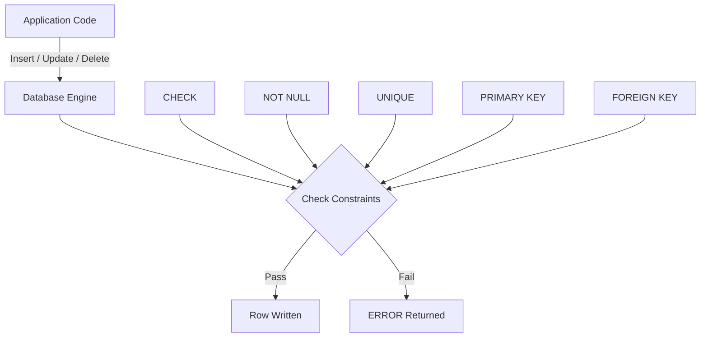
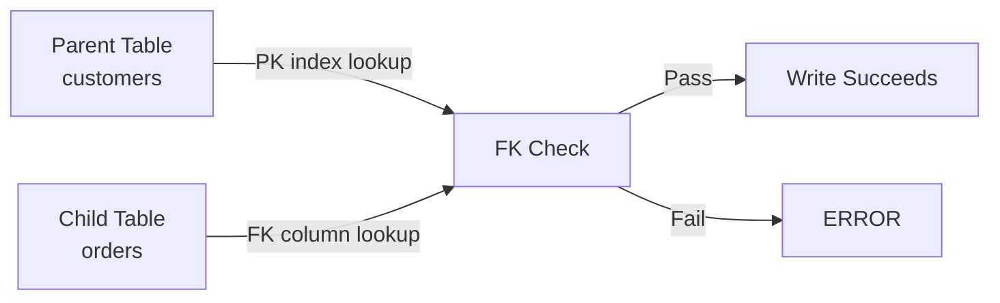

# 04 — Constraints & Keys

## Overview

Constraints are **rules enforced on table columns** to maintain data integrity. They guarantee that data follows the business rules *at the database level*, regardless of which application or user inserts or updates data.

> **Grain reminder:** Every table definition starts with "one row represents X." Constraints exist to protect that grain.

### Why Constraints Exist

Without constraints, any client can insert any value — including duplicates, orphan references, negative prices, or NULLs where they shouldn't be. Constraints are the **last line of defense** for data correctness. Application code can have bugs; constraints are declarative and always enforced by the engine.



### Constraint Categories

| Category | Constraint Types | Purpose |
|---|---|---|
| **Column-level** | NOT NULL, DEFAULT, CHECK, UNIQUE, PRIMARY KEY | Rules on a single column |
| **Table-level** | CHECK, UNIQUE, PRIMARY KEY, FOREIGN KEY | Rules spanning multiple columns |
| **Database-level** | Schema rules, custom domains | Rules across tables |

---

## The Sample Schema

Every example in this section uses the following tables.

> **Grain:**
> - `departments`: one row = one department
> - `employees`: one row = one employee; each employee belongs to exactly one department
> - `customers`: one row = one customer
> - `products`: one row = one product
> - `orders`: one row = one order; each order belongs to exactly one customer
> - `order_items`: one row = one line item within an order

```sql
CREATE TABLE departments (
    dept_id     INT          PRIMARY KEY,
    dept_name   VARCHAR(50)  NOT NULL UNIQUE,
    budget      NUMERIC(12,2) CHECK (budget > 0)
);

CREATE TABLE employees (
    emp_id      INT          PRIMARY KEY,
    first_name  VARCHAR(50)  NOT NULL,
    last_name   VARCHAR(50)  NOT NULL,
    email       VARCHAR(100) NOT NULL UNIQUE,
    salary      NUMERIC(10,2) CHECK (salary >= 0),
    hire_date   DATE         NOT NULL,
    dept_id     INT,
    FOREIGN KEY (dept_id) REFERENCES departments(dept_id)
);

CREATE TABLE customers (
    cust_id     INT          PRIMARY KEY,
    cust_name   VARCHAR(100) NOT NULL,
    email       VARCHAR(100) UNIQUE,
    created_at  TIMESTAMP    DEFAULT CURRENT_TIMESTAMP
);

CREATE TABLE products (
    prod_id     INT           PRIMARY KEY,
    prod_name   VARCHAR(100)  NOT NULL,
    unit_price  NUMERIC(10,2) NOT NULL CHECK (unit_price > 0),
    in_stock    BOOLEAN       DEFAULT TRUE
);

CREATE TABLE orders (
    order_id    INT          PRIMARY KEY,
    cust_id     INT          NOT NULL,
    order_date  DATE         NOT NULL DEFAULT CURRENT_DATE,
    status      VARCHAR(20)  DEFAULT 'pending'
                CHECK (status IN ('pending','shipped','delivered','cancelled')),
    FOREIGN KEY (cust_id) REFERENCES customers(cust_id)
);

CREATE TABLE order_items (
    item_id     INT           PRIMARY KEY,
    order_id    INT           NOT NULL,
    prod_id     INT           NOT NULL,
    quantity    INT           NOT NULL CHECK (quantity > 0),
    unit_price  NUMERIC(10,2) NOT NULL CHECK (unit_price >= 0),
    FOREIGN KEY (order_id) REFERENCES orders(order_id),
    FOREIGN KEY (prod_id)  REFERENCES products(prod_id)
);
```

---

## 1. PRIMARY KEY

### What It Is

A primary key **uniquely identifies each row** in a table. It is the combination of `UNIQUE` + `NOT NULL`.

### Syntax

```sql
-- Column-level
CREATE TABLE departments (
    dept_id INT PRIMARY KEY,
    ...
);

-- Table-level (needed for composite keys)
CREATE TABLE order_items (
    item_id  INT,
    order_id INT,
    PRIMARY KEY (item_id)
);
```

### Rules

1. Every table can have **at most one** primary key.
2. The primary key can consist of **one or more columns** (composite key).
3. All values must be **unique**.
4. No value can be **NULL**.

### How It Works Internally

Most databases implement primary keys using a **B-tree index** (or clustered index in SQL Server / InnoDB). When you declare a primary key:

1. The engine creates a **unique index** on the key column(s).
2. Every `INSERT` / `UPDATE` checks uniqueness against this index.
3. The engine rejects any row that would duplicate an existing key or contain NULL.

| Database | Default Index Type | Clustered? |
|---|---|---|
| PostgreSQL | B-tree (non-clustered) | No (but uses the key for heap lookup) |
| MySQL InnoDB | B-tree (clustered) | Yes — row data stored in PK leaf pages |
| SQL Server | B-tree (clustered by default) | Yes — PK becomes clustered index |
| Oracle | B-tree (via UNIQUE constraint) | No (heap-organized tables) |

### Composite Primary Key

```sql
CREATE TABLE order_items (
    item_id  INT,
    order_id INT,
    prod_id  INT NOT NULL,
    quantity INT NOT NULL,
    PRIMARY KEY (order_id, item_id)
);
```

Here the combination `(order_id, item_id)` must be unique. Individual columns **can** have duplicates:

```sql
-- This is ALLOWED (order_id = 1 appears multiple times):
INSERT INTO order_items VALUES (1, 1, 101, 2);
INSERT INTO order_items VALUES (2, 1, 102, 1);

-- This is REJECTED (order_id=1, item_id=1 already exists):
INSERT INTO order_items VALUES (1, 1, 103, 3);
-- ERROR: duplicate key value violates unique constraint "order_items_pkey"
```

### When to Use a Surrogate vs. Natural Key

| Aspect | Surrogate Key (auto-increment) | Natural Key (business meaning) |
|---|---|---|
| **Example** | `SERIAL`, `IDENTITY`, `AUTO_INCREMENT` | `email`, `ISBN`, `SSN` |
| **Stability** | Never changes | May change (email, name) |
| **Size** | Usually 4-8 bytes | Can be large strings |
| **Uniqueness guarantee** | Guaranteed by sequence | Must be validated |
| **Readability** | Low (opaque integers) | High (meaningful values) |
| **Composite FK cost** | Fewer bytes | Can bloat indexes |
| **Interview preference** | Most common recommendation | Acceptable if truly immutable |

> **Production pitfall:** Using a natural key like `email` as a primary key works until a user changes their email. If the key is referenced by dozens of foreign keys, a cascade update becomes expensive and risky. Surrogate keys avoid this.

### NULL Behavior

A primary key **never allows NULL**:

```sql
INSERT INTO departments (dept_id, dept_name, budget)
VALUES (NULL, 'Engineering', 500000);
-- ERROR: null value in column "dept_id" violates not-null constraint
```

> PostgreSQL, MySQL, SQL Server, Oracle all enforce this identically.

### Common Mistakes

**Mistake: Making a nullable column part of the primary key**

```sql
-- BAD: dept_id is nullable, then trying to make it PK
CREATE TABLE employees (
    emp_id  INT PRIMARY KEY,
    dept_id INT PRIMARY KEY  -- ERROR: only one PK per table
);
```

**Mistake: Forgetting that PK implies UNIQUE**

```sql
-- BAD: adding a separate UNIQUE constraint on the PK column (redundant)
CREATE TABLE customers (
    cust_id INT PRIMARY KEY,
    cust_id UNIQUE  -- REDUNDANT
);
```

> **Interview trap:** "Can a PRIMARY KEY column contain NULL?" The answer is **no** — even in databases where NULL is not considered equal to NULL, the PK constraint explicitly forbids NULL. Always.

### Performance Implications

- A PK creates an index. Queries filtering on the PK column(s) use this index.
- In InnoDB (MySQL) and SQL Server (default), the PK is the **clustered index** — all row data is physically ordered by the PK. Choosing a random UUID as PK in these engines causes **page splits** and poor insertion performance.
- In PostgreSQL, the PK index is separate from the heap. Random UUIDs are less harmful but still slightly worse than sequential keys for index-heavy workloads.
- Composite PKs: **column order matters**. The leading column(s) are most useful for range scans and index lookups.

```sql
-- GOOD: order_id first — queries often filter by order
PRIMARY KEY (order_id, item_id)

-- LESS GOOD: item_id first — fewer queries filter by item_id alone
PRIMARY KEY (item_id, order_id)
```

Verify with `EXPLAIN`:

```sql
EXPLAIN ANALYZE
SELECT * FROM order_items WHERE order_id = 1;
```

---

## 2. FOREIGN KEY

### What It Is

A foreign key ensures that a value in one table **references a valid row** in another table. It enforces **referential integrity**.

### Syntax

```sql
CREATE TABLE orders (
    order_id INT PRIMARY KEY,
    cust_id  INT NOT NULL,
    FOREIGN KEY (cust_id) REFERENCES customers(cust_id)
);
```

### What It Guarantees

1. You cannot insert a `cust_id` into `orders` that does not exist in `customers`.
2. You cannot delete a row from `customers` if referencing rows exist in `orders` (by default).
3. You cannot update a `cust_id` in `customers` if referencing rows exist in `orders` (by default).

### Referential Actions

When the referenced row is deleted or updated, the database must decide what to do with the referencing rows.

| Action | Behavior | Use Case |
|---|---|---|
| `RESTRICT` (default in PostgreSQL) | Reject the DELETE/UPDATE | Most common; safe default |
| `NO ACTION` | Same as RESTRICT but checked at end of transaction (PostgreSQL) | Deferred checks |
| `CASCADE` | Delete/update referencing rows too | Dependent data that has no meaning without the parent |
| `SET NULL` | Set FK column to NULL | Optional relationships |
| `SET DEFAULT` | Set FK column to its default value | Rare |
| `RESTRICT` (default in MySQL, SQL Server) | Reject the DELETE/UPDATE | — |

```sql
CREATE TABLE order_items (
    item_id  INT PRIMARY KEY,
    order_id INT NOT NULL,
    FOREIGN KEY (order_id) REFERENCES orders(order_id)
        ON DELETE CASCADE
        ON UPDATE CASCADE
);
```

> **Production pitfall:** `ON DELETE CASCADE` on a high-cardinality child table can trigger a **massive chain of deletes**. Deleting one customer could cascade through thousands of orders, tens of thousands of order_items, and their associated records. Always trace the cascade chain before using it.

### How It Works Internally

1. The engine requires an **index on the referenced table's primary key** (or the referenced column must be a PK/UNIQUE key).
2. Most engines also require (or strongly prefer) an **index on the foreign key column** in the child table. MySQL InnoDB **automatically creates one** if you don't provide it. PostgreSQL does not.
3. On every `INSERT` or `UPDATE` to the child table, the engine performs a **lookup** in the parent table to verify the referenced row exists.
4. On every `DELETE` or `UPDATE` on the parent table, the engine performs a **lookup** in the child table to check for referencing rows.



> **Production pitfall:** Without an index on the FK column of the child table, checking referential integrity on parent deletes/updates requires a **sequential scan** of the child table. This can be extremely slow for large tables. PostgreSQL and SQL Server do not auto-create FK indexes — you must add them manually.

```sql
-- GOOD: explicit FK index
CREATE INDEX idx_orders_cust_id ON orders(cust_id);
```

### NULL Behavior

A FK column **can** be NULL (unless also marked `NOT NULL`). NULL is **not** checked against the referenced table — it is considered "no reference."

```sql
-- This is ALLOWED if dept_id is nullable:
UPDATE employees SET dept_id = NULL WHERE emp_id = 5;
```

This means a NULL FK means "this row is not related to any parent row" — which may or may not be a valid business state.

### Common Mistakes

**Mistake: Circular references**

```sql
-- BAD: table A references B, and B references A, both NOT NULL
CREATE TABLE a (
    id INT PRIMARY KEY,
    b_id INT NOT NULL REFERENCES b(id)
);
CREATE TABLE b (
    id INT PRIMARY KEY,
    a_id INT NOT NULL REFERENCES a(id)
);
-- You can never insert the first row into either table!
```

**Fix:** Make at least one FK nullable, or use deferred constraints (PostgreSQL/Oracle only).

**Mistake: Missing index on FK column in child table**

```sql
-- orders table has FK to customers, but no index on cust_id
-- Every parent DELETE must scan the entire orders table
```

> **Interview trap:** "Does a foreign key automatically create an index?" Answer: **Only in MySQL/InnoDB.** PostgreSQL, Oracle, and SQL Server do **not**. You must create the index yourself.

### Performance Implications

- FK checks require **index lookups** on the parent table. If the parent PK is an integer, this is fast. If it's a composite or string key, it's slower.
- Bulk `INSERT` into a child table with FK constraints is slower than without, because every row requires a parent lookup.
- Disabling FK checks for bulk loads (e.g., `SET FOREIGN_KEY_CHECKS = 0` in MySQL) is a common production practice — but must be followed by a data integrity verification.
- Use `EXPLAIN` to verify that FK checks are not causing unexpected sequential scans.

---

## 3. NOT NULL

### What It Is

A `NOT NULL` constraint ensures a column **never contains NULL**.

### Syntax

```sql
CREATE TABLE employees (
    emp_id     INT  PRIMARY KEY,
    first_name VARCHAR(50) NOT NULL,
    last_name  VARCHAR(50) NOT NULL
);
```

### How It Works

The engine checks every `INSERT` and `UPDATE`. If the column is in the `SET` clause or part of an `INSERT` column list and the value is NULL, the operation is rejected.

### NULL Behavior

This is the constraint that **prevents** NULL:

```sql
INSERT INTO employees (emp_id, first_name, last_name)
VALUES (1, NULL, 'Smith');
-- ERROR: null value in column "first_name" violates not-null constraint
```

### Common Patterns

| Pattern | Use Case |
|---|---|
| `NOT NULL DEFAULT value` | Provides a safe fallback; allows `INSERT` without specifying the column |
| `NOT NULL` without `DEFAULT` | Forces the application to always provide a value |
| `NOT NULL` on PK columns | Redundant (PK already implies NOT NULL) |

```sql
-- GOOD: NOT NULL + DEFAULT ensures column is always populated
status VARCHAR(20) NOT NULL DEFAULT 'pending'
```

### When to Use

- **Always use NOT NULL** on columns that are required by business logic (name, date, amount).
- Avoid columns that are nullable when they **should always** have a value — nullable columns complicate queries (require NULL checks) and are a common source of bugs.

> **Interview trap:** "What's the difference between `NULL` and an empty string `''`?" In standard SQL, they are different. In Oracle, they are treated as the same (empty strings are stored as NULL). In PostgreSQL and MySQL, they are distinct: `''` is a value, `NULL` is unknown/missing.

---

## 4. UNIQUE

### What It Is

A `UNIQUE` constraint ensures that all values in a column (or combination of columns) are **distinct** across the table.

### Syntax

```sql
-- Column-level
email VARCHAR(100) UNIQUE

-- Table-level
UNIQUE (col1, col2)
```

### UNIQUE vs. PRIMARY KEY

| Feature | UNIQUE | PRIMARY KEY |
|---|---|---|
| NULLs allowed | **Yes** (one NULL in most databases, multiple NULLs in PostgreSQL/Oracle) | **No** |
| Number per table | **Multiple** | **One** |
| Creates index | **Yes** (unique index) | **Yes** (unique index) |
| Can be FK target | Only if all columns are NOT NULL | **Yes** |
| Semantic meaning | "This value must be distinct" | "This is the identifier" |

### NULL Behavior — The Critical Difference

> **This is one of the most important edge cases in SQL.**

| Database | Multiple NULLs in UNIQUE column? |
|---|---|
| PostgreSQL | **Yes** — multiple NULLs allowed (NULL ≠ NULL) |
| MySQL | **Yes** — treats multiple NULLs as distinct |
| SQL Server | **No** — only one NULL allowed |
| Oracle | **Yes** — multiple NULLs allowed |

```sql
-- PostgreSQL: ALLOWED (both NULLs are kept)
INSERT INTO customers (cust_id, cust_name, email)
VALUES (1, 'Alice', NULL);
INSERT INTO customers (cust_id, cust_name, email)
VALUES (2, 'Bob', NULL);
-- Both succeed!

-- SQL Server: SECOND INSERT REJECTED
-- Violation of unique constraint 'UQ__customers__...'
```

> **Interview trap:** "How many NULL values can a UNIQUE column hold?" The answer depends on the database engine. In PostgreSQL, unlimited. In SQL Server, only one.

### Composite UNIQUE

```sql
-- Ensure no two employees share the same (first_name, last_name) combo
ALTER TABLE employees
ADD CONSTRAINT uq_emp_name UNIQUE (first_name, last_name);
```

This allows:
- Two rows with `(John, Smith)` — **NO**
- Two rows with `(John, Doe)` and `(Jane, Smith)` — **YES**
- Two rows with `(John, NULL)` — **YES** (NULL ≠ NULL)

### Common Mistakes

**Mistake: Adding a UNIQUE constraint on a high-cardinality string column that is often NULL**

```sql
-- BAD: nullable email with UNIQUE — multiple NULLs (in PostgreSQL)
-- means several "unregistered" users coexist, which may be unintended
email VARCHAR(100) UNIQUE
```

**Better:** Either make it `NOT NULL UNIQUE`, or add a `CHECK (email IS NOT NULL)` if empty strings should also be forbidden.

### Performance

- A UNIQUE constraint creates a **unique B-tree index**. Lookups on this column use the index.
- The overhead is one additional index on the table.
- For bulk inserts, the unique index must be maintained, which adds write amplification.

---

## 5. CHECK

### What It Is

A `CHECK` constraint validates that values satisfy a **Boolean expression**.

### Syntax

```sql
CREATE TABLE products (
    prod_id    INT PRIMARY KEY,
    unit_price NUMERIC(10,2) NOT NULL CHECK (unit_price > 0),
    in_stock   BOOLEAN DEFAULT TRUE
);
```

Table-level for multi-column checks:

```sql
CREATE TABLE orders (
    order_id   INT PRIMARY KEY,
    order_date DATE NOT NULL,
    ship_date  DATE,
    CHECK (ship_date IS NULL OR ship_date >= order_date)
);
```

### How It Works

On every `INSERT` and `UPDATE`, the engine evaluates the expression. If it returns `FALSE` (not `UNKNOWN` — `UNKNOWN` passes!), the row is rejected.

### NULL Behavior — The Critical Detail

> **This is a major interview trap and production pitfall.**

CHECK constraints evaluate to `UNKNOWN` when any operand is NULL. `UNKNOWN` is **not** `FALSE`, so the constraint **passes**.

```sql
CREATE TABLE employees (
    emp_id INT PRIMARY KEY,
    salary NUMERIC(10,2) CHECK (salary > 50000)
);

-- This SUCCEEDS even though salary is NULL:
INSERT INTO employees (emp_id, salary) VALUES (1, NULL);
-- CHECK constraint passes because NULL > 50000 → UNKNOWN → not FALSE
```

**If you want to reject NULLs, add a separate `NOT NULL` constraint:**

```sql
salary NUMERIC(10,2) NOT NULL CHECK (salary > 50000)
```

### Multi-Column CHECK

```sql
-- Ensure start_date < end_date
ALTER TABLE projects
ADD CONSTRAINT chk_dates CHECK (start_date < end_date);
```

### Database Support

| Database | CHECK support |
|---|---|
| PostgreSQL | Full support since v9.0+ |
| MySQL | Full support since v8.0.16 (older versions parse but ignore CHECK) |
| SQL Server | Full support since 2008 |
| Oracle | Full support |

> **Production pitfall (MySQL < 8.0.16):** CHECK constraints were **parsed but not enforced**. Queries would run without error even if they violated the CHECK. If you are on a legacy MySQL version, you must use triggers or application logic instead.

### Common Mistakes

**Mistake: Relying on CHECK to enforce NOT NULL**

```sql
-- BAD: salary can still be NULL
salary NUMERIC(10,2) CHECK (salary > 0)

-- GOOD: combine both
salary NUMERIC(10,2) NOT NULL CHECK (salary > 0)
```

**Mistake: Using CHECK for complex referential rules**

```sql
-- BAD: CHECK cannot reference other tables
CHECK (dept_id IN (SELECT dept_id FROM departments))
-- This does NOT work in any database
```

For cross-table validation, use foreign keys, triggers, or application logic.

---

## 6. DEFAULT

### What It Is

A `DEFAULT` constraint provides a **fallback value** when no value is specified in an `INSERT`.

### Syntax

```sql
CREATE TABLE orders (
    order_id   INT PRIMARY KEY,
    order_date DATE DEFAULT CURRENT_DATE,
    status     VARCHAR(20) DEFAULT 'pending'
);
```

### How It Works

When you `INSERT` without specifying the column (or specify `DEFAULT` explicitly), the engine substitutes the default value.

```sql
-- Both equivalent:
INSERT INTO orders (order_id) VALUES (1);

INSERT INTO orders (order_id, order_date, status)
VALUES (1, DEFAULT, DEFAULT);
```

### Expressions as Defaults

Defaults can be expressions, not just constants:

| Expression | Database | Purpose |
|---|---|---|
| `CURRENT_DATE` | All | Today's date |
| `CURRENT_TIMESTAMP` | All | Current timestamp |
| `gen_random_uuid()` | PostgreSQL | Random UUID |
| `UUID()` | MySQL | Random UUID |
| `NEWID()` | SQL Server | Random UUID |
| `AUTO_INCREMENT` / `SERIAL` / `IDENTITY` | MySQL / PostgreSQL / SQL Server | Auto-incrementing integer |

```sql
-- PostgreSQL
CREATE TABLE users (
    user_id  UUID DEFAULT gen_random_uuid() PRIMARY KEY,
    username VARCHAR(50) NOT NULL,
    created  TIMESTAMP DEFAULT CURRENT_TIMESTAMP
);

-- MySQL
CREATE TABLE users (
    user_id  INT AUTO_INCREMENT PRIMARY KEY,
    username VARCHAR(50) NOT NULL,
    created  TIMESTAMP DEFAULT CURRENT_TIMESTAMP
);

-- SQL Server
CREATE TABLE users (
    user_id  INT IDENTITY(1,1) PRIMARY KEY,
    username NVARCHAR(50) NOT NULL,
    created  DATETIME2 DEFAULT SYSUTCDATETIME()
);
```

### Adding a DEFAULT to an Existing Column

```sql
ALTER TABLE orders
ALTER COLUMN status SET DEFAULT 'pending';                    -- PostgreSQL

ALTER TABLE orders ALTER COLUMN status DEFAULT 'pending';     -- MySQL

ALTER TABLE orders ADD CONSTRAINT df_status                   -- SQL Server
DEFAULT 'pending' FOR status;
```

### NULL vs. DEFAULT

- If a column is `NOT NULL` **and** has a `DEFAULT`, inserts without a value use the default.
- If a column is `NULL` (nullable) **and** has a `DEFAULT`, inserts without a value use the default (not NULL).
- If a column has **no** `DEFAULT` and is `NULL`, inserts without a value produce NULL.

```sql
-- Column: status VARCHAR(20) DEFAULT 'pending'
-- INSERT without status:
-- Result: 'pending' (not NULL, even if column is nullable)
```

---

## 7. Named Constraints

### Why Name Them?

Unnamed constraints get auto-generated names (e.g., `employees_email_check`, `orders_customer_id_fkey`). These are hard to reference in `ALTER TABLE` commands and error messages.

### Syntax

```sql
CREATE TABLE orders (
    order_id INT,
    CONSTRAINT pk_orders PRIMARY KEY (order_id),
    CONSTRAINT fk_orders_customer
        FOREIGN KEY (cust_id) REFERENCES customers(cust_id),
    CONSTRAINT uq_order_date
        CHECK (order_date IS NOT NULL),
    CONSTRAINT chk_status
        CHECK (status IN ('pending','shipped','delivered','cancelled'))
);
```

### Naming Convention

Follow a consistent pattern:

| Constraint Type | Naming Pattern |
|---|---|
| Primary Key | `pk_<table>` |
| Foreign Key | `fk_<table>_<referenced_table>` or `fk_<table>_<column>` |
| Unique | `uq_<table>_<column(s)>` |
| Check | `chk_<table>_<description>` |
| Not Null | `nn_<table>_<column>` (not always named) |

> **Production pitfall:** Unnamed constraints produce cryptic error messages. When a constraint is violated in production, a named constraint like `chk_orders_positive_amount` tells you exactly what failed. The auto-generated name `orders_amount_check` is less clear but still readable; avoid letting the database choose random names.

---

## 8. Modifying Constraints After Creation

### Adding a Constraint

```sql
ALTER TABLE employees
ADD CONSTRAINT chk_salary CHECK (salary > 0);

ALTER TABLE employees
ADD CONSTRAINT fk_emp_dept
    FOREIGN KEY (dept_id) REFERENCES departments(dept_id);

ALTER TABLE employees
ADD CONSTRAINT uq_email UNIQUE (email);
```

### Removing a Constraint

```sql
ALTER TABLE employees DROP CONSTRAINT chk_salary;          -- PostgreSQL, SQL Server, Oracle

ALTER TABLE employees DROP CHECK chk_salary;               -- MySQL (8.0.19+)

ALTER TABLE employees DROP INDEX uq_email;                 -- MySQL
ALTER TABLE employees DROP CONSTRAINT uq_email;            -- PostgreSQL, SQL Server
```

### Disabling Constraints

```sql
-- PostgreSQL: defer to end of transaction
SET CONSTRAINTS ALL DEFERRED;

-- SQL Server: check disabled (for FK)
ALTER TABLE orders NOCHECK CONSTRAINT fk_orders_customer;

-- MySQL
SET FOREIGN_KEY_CHECKS = 0;
```

> **Production pitfall:** Disabling constraints is sometimes necessary for bulk loading, but you **must re-enable and verify data integrity** afterward. Leaving constraints disabled in production invites data corruption.

---

## 9. Constraint Interaction with NULL

| Constraint | NULL Behavior |
|---|---|
| `PRIMARY KEY` | NULL is **always rejected** |
| `NOT NULL` | NULL is **always rejected** |
| `UNIQUE` | NULL is treated as distinct (multiple NULLs allowed in PG/MySQL/Oracle; one in SQL Server) |
| `CHECK` | NULL causes the expression to evaluate to UNKNOWN → **passes** |
| `FOREIGN KEY` | NULL is **not checked** against the parent table (allowed) |
| `DEFAULT` | If column is omitted from INSERT, the default is used (NULL is not inserted) |

### The "NULL passes CHECK" Gotcha

```sql
CREATE TABLE transactions (
    txn_id   INT PRIMARY KEY,
    amount   NUMERIC(10,2) CHECK (amount > 0)
);

-- Insert with NULL amount:
INSERT INTO transactions (txn_id, amount) VALUES (1, NULL);
-- SUCCEEDS! CHECK evaluated: NULL > 0 → UNKNOWN → not FALSE → passes

-- Query the bad data:
SELECT * FROM transactions WHERE amount <= 0;
-- Returns nothing — the NULL row is invisible here too!

SELECT * FROM transactions WHERE amount > 0;
-- Returns nothing — NULL is not > 0 either!

SELECT * FROM transactions;
-- Returns the row with NULL amount
```

> **Interview trap:** "If a CHECK constraint says `amount > 0`, can a NULL be inserted?" **Yes!** Always add `NOT NULL` when NULL is not valid.

---

## 10. Constraint Interaction with JOINs and Queries

Constraints affect query behavior in subtle ways.

### FK NULLs and JOINs

```sql
-- employees.dept_id is nullable FK to departments.dept_id

-- INNER JOIN: employees with NULL dept_id are EXCLUDED
SELECT e.first_name, d.dept_name
FROM employees e
INNER JOIN departments d ON e.dept_id = d.dept_id;
-- NULL dept_id rows disappear!

-- LEFT JOIN: employees with NULL dept_id are INCLUDED
SELECT e.first_name, d.dept_name
FROM employees e
LEFT JOIN departments d ON e.dept_id = d.dept_id;
-- NULL dept_id rows appear with NULL dept_name
```

### UNIQUE Constraints and GROUP BY

A UNIQUE constraint guarantees distinct values — but `GROUP BY` on a unique column may still be needed if other columns are selected:

```sql
-- email is UNIQUE, so this is unnecessary:
SELECT email, COUNT(*)
FROM customers
GROUP BY email;
-- Each group has exactly 1 row

-- But this is meaningful — cust_name is NOT unique:
SELECT cust_name, COUNT(*)
FROM customers
GROUP BY cust_name;
-- Two customers named "John" would group together
```

---

## 11. Deferrable Constraints (PostgreSQL & Oracle)

Some constraints can be **deferred** — checked at **commit time** instead of immediately.

```sql
CREATE TABLE a (
    id INT PRIMARY KEY
);

CREATE TABLE b (
    id INT PRIMARY KEY,
    a_id INT NOT NULL REFERENCES a(id) DEFERRABLE INITIALLY DEFERRED
);
```

With deferred constraints:

```sql
BEGIN;
INSERT INTO b (id, a_id) VALUES (1, 1);  -- FK not checked yet
INSERT INTO a (id) VALUES (1);            -- now the parent exists
COMMIT;                                    -- FK checked here — passes!
```

> This is essential for **circular references** and complex transactional logic. Only PostgreSQL and Oracle support deferrable constraints. MySQL and SQL Server do **not**.

---

## Comparison Table: All Constraints at a Glance

| Feature | PRIMARY KEY | FOREIGN KEY | UNIQUE | NOT NULL | CHECK | DEFAULT |
|---|---|---|---|---|---|---|
| Prevents duplicates | Yes | No | Yes | No | No | No |
| Prevents NULL | Yes | No | No* | Yes | No | No |
| References another table | No | Yes | No | No | No | No |
| Allows complex logic | No | No | No | No | Yes | Yes |
| Creates index | Yes | No (usually) | Yes | No | No | No |
| Number per table | 1 | Many | Many | Many | Many | Many |
| NULL allowed | No | Yes (if column is nullable) | Yes** | No | Passes on NULL | N/A |

*\*Unless combined with NOT NULL.*
*\*\*Multiple NULLs allowed in PostgreSQL/MySQL/Oracle; only one in SQL Server.*

---

## Constraint Checklist: Writing a New Table

Before finalizing a table definition, walk through this:

| Question | If Yes... |
|---|---|
| What identifies this row uniquely? | → Add a `PRIMARY KEY` |
| Which columns must always have a value? | → Add `NOT NULL` |
| Which columns must be distinct? | → Add `UNIQUE` |
| Does this column reference another table? | → Add a `FOREIGN KEY` |
| Are there range/format rules? | → Add a `CHECK` constraint |
| Is there a sensible default value? | → Add a `DEFAULT` |
| Do FK columns have indexes? | → Add explicit indexes (esp. PostgreSQL, SQL Server) |
| Are constraint names meaningful? | → Name them explicitly |
| Can NULL be a valid state? | → Document it; don't leave it ambiguous |

---

## Real-World Scenario: Order System

```sql
CREATE TABLE customers (
    cust_id    SERIAL PRIMARY KEY,
    cust_name  VARCHAR(100) NOT NULL,
    email      VARCHAR(100) NOT NULL,
    CONSTRAINT uq_customer_email UNIQUE (email)
);

CREATE TABLE products (
    prod_id    SERIAL PRIMARY KEY,
    prod_name  VARCHAR(100) NOT NULL,
    unit_price NUMERIC(10,2) NOT NULL,
    CONSTRAINT chk_price_positive CHECK (unit_price > 0)
);

CREATE TABLE orders (
    order_id   SERIAL PRIMARY KEY,
    cust_id    INT NOT NULL,
    order_date DATE NOT NULL DEFAULT CURRENT_DATE,
    ship_date  DATE,
    CONSTRAINT fk_orders_customer
        FOREIGN KEY (cust_id) REFERENCES customers(cust_id)
        ON DELETE RESTRICT,
    CONSTRAINT chk_ship_date CHECK (ship_date IS NULL OR ship_date >= order_date)
);

CREATE TABLE order_items (
    item_id    SERIAL PRIMARY KEY,
    order_id   INT NOT NULL,
    prod_id    INT NOT NULL,
    quantity   INT NOT NULL,
    unit_price NUMERIC(10,2) NOT NULL,
    CONSTRAINT fk_items_order
        FOREIGN KEY (order_id) REFERENCES orders(order_id)
        ON DELETE CASCADE,
    CONSTRAINT fk_items_product
        FOREIGN KEY (prod_id) REFERENCES products(prod_id)
        ON DELETE RESTRICT,
    CONSTRAINT chk_quantity_positive CHECK (quantity > 0),
    CONSTRAINT chk_item_price CHECK (unit_price >= 0)
);

CREATE INDEX idx_orders_cust_id ON orders(cust_id);
CREATE INDEX idx_order_items_order_id ON order_items(order_id);
CREATE INDEX idx_order_items_prod_id ON order_items(prod_id);
```

### Grain Analysis

| Table | Grain | Key |
|---|---|---|
| `customers` | One row per customer | `cust_id` |
| `products` | One row per product | `prod_id` |
| `orders` | One row per order | `order_id` |
| `order_items` | One row per line item within an order | `item_id` |

### Why These Constraints?

- `ON DELETE RESTRICT` on `orders.cust_id`: You cannot delete a customer who has orders — forces you to handle orders first.
- `ON DELETE CASCADE` on `order_items.order_id`: If an order is deleted, its items are meaningless — cascade.
- `ON DELETE RESTRICT` on `order_items.prod_id`: You cannot delete a product that has been ordered — forces you to handle historical data first.
- `CHECK (ship_date >= order_date)`: A shipment cannot precede the order.

---

## Production Pitfalls Summary

| Pitfall | Description | Prevention |
|---|---|---|
| Missing FK indexes | Parent DELETEs/UPDATEs cause full child table scans | Always index FK columns |
| CHECK allowing NULLs | CHECK passes on NULL — not a substitute for NOT NULL | Combine CHECK with NOT NULL |
| CASCADE chains | Deleting one row triggers deep delete chains | Audit cascade paths before deploying |
| Disabled constraints | Bulk loading with constraints off, forgotten to re-enable | Automate re-enable in load scripts |
| MySQL < 8.0.16 CHECK | CHECK parsed but not enforced | Use triggers or upgrade |
| Auto-generated constraint names | Hard to identify in error messages and migrations | Name all constraints explicitly |
| UUID as clustered PK | Random UUIDs cause page splits in InnoDB/MSSQL | Use sequential UUIDs or ULID |
| Circular FK references | Two NOT NULL FKs referencing each other | Make one nullable or use deferred constraints |

---

# Interview Questions

## Beginner

1. What is the difference between a `PRIMARY KEY` and a `UNIQUE` constraint?

2. Can a `PRIMARY KEY` column contain NULL? Explain why or why not.

3. What is a foreign key? What problem does it solve?

4. How many `PRIMARY KEY` constraints can a table have?

5. What is the difference between `NOT NULL` and `UNIQUE`?

6. What happens when you `INSERT` a row without specifying a value for a column that has a `DEFAULT` constraint?

7. Name three types of constraints that can be created at the table level (not just column level).

## Intermediate

8. A table has a `UNIQUE` constraint on a nullable column. Can you insert two rows with NULL in that column? Does your answer depend on the database engine?

9. You have `CHECK (amount > 0)` on a column. Can a NULL value be inserted? Why or why not?

10. What is the difference between `ON DELETE CASCADE` and `ON DELETE RESTRICT`?

11. Why should you create an index on foreign key columns, especially in PostgreSQL?

12. What is the difference between `ON DELETE CASCADE` and `ON DELETE SET NULL`? When would you use each?

13. Explain the difference between `DEFERRABLE` and `NOT DEFERRABLE` constraints.

## Advanced

14. You discover that a table with 50 million rows has a foreign key but no index on the FK column. What is the performance risk, and how do you fix it with zero downtime?

15. Two tables reference each other via foreign keys, both columns are `NOT NULL`. What happens when you try to insert the first row into either table? How do you resolve this?

16. In MySQL InnoDB, how does the primary key affect the physical storage of rows? What are the implications of choosing a random UUID versus a sequential integer as the primary key?

17. A `CHECK` constraint is defined as `CHECK (end_date > start_date)`. A row is inserted with `end_date = NULL`. Does the constraint pass? Explain the three-valued logic involved.

## Scenario Based

18. You are designing an e-commerce database. The `orders` table references `customers`, and `order_items` references `orders`. A business requirement states: "A customer can be deleted, but their orders should remain with `cust_id` set to NULL." Design the constraints to support this. What trade-offs do you identify?

19. You need to ensure that no two employees in the same department have the same job title, but employees in different departments can share a job title. What kind of constraint do you need? Can this be done with a standard constraint, or do you need triggers?

20. A legacy system has a `users` table where `email` is the primary key. The business now requires that users can change their email. What problems does this create, and how would you redesign the table?

## Tricky

21. Can a foreign key reference a column that is not a primary key or unique key? Under what conditions?

22. You add a `NOT NULL` constraint to a column that already contains NULLs. What happens? How do you handle this in PostgreSQL vs. SQL Server?

23. A table has `UNIQUE (a, b)`. Does this also guarantee uniqueness on column `a` alone? Provide a counterexample.

24. What is the result of this expression: `NULL = NULL`? How does this affect `UNIQUE` constraint behavior?

25. A `CHECK` constraint is defined as `CHECK (status IN ('active','inactive'))`. Can you insert a row with `status = NULL`? What if the column is also `NOT NULL`?

## Output Prediction

26. Given:

```sql
CREATE TABLE t (
    id INT PRIMARY KEY,
    val INT CHECK (val > 0),
    grp VARCHAR(10) DEFAULT 'X'
);

INSERT INTO t (id, val) VALUES (1, 10);
INSERT INTO t (id, val) VALUES (2, NULL);
INSERT INTO t (id, val, grp) VALUES (3, 5, NULL);
INSERT INTO t (id, val) VALUES (4, -1);
```

How many rows are successfully inserted? For each rejected row, state the error.

27. Given:

```sql
CREATE TABLE parent (id INT PRIMARY KEY);
CREATE TABLE child (
    id INT PRIMARY KEY,
    parent_id INT REFERENCES parent(id) ON DELETE SET NULL
);

INSERT INTO parent VALUES (1);
INSERT INTO child VALUES (1, 1);
DELETE FROM parent WHERE id = 1;
SELECT * FROM child;
```

What does the `SELECT` return?

28. Given:

```sql
CREATE TABLE x (
    a INT,
    b INT,
    UNIQUE (a, b)
);

INSERT INTO x VALUES (1, NULL);
INSERT INTO x VALUES (1, NULL);
```

How many rows does the table contain after both inserts? Does the answer change between PostgreSQL and SQL Server?

## Debugging

29. A developer reports: "My INSERT fails with `ERROR: duplicate key value violates unique constraint` even though I'm inserting a new row." What are the possible causes?

30. A production table has a foreign key constraint. After a bulk data migration, the application starts throwing FK violations on inserts that previously worked. What are the possible causes, and how do you diagnose them?

31. A query returns fewer rows than expected after a `JOIN`. The tables have foreign key constraints. Could the constraints be related to the missing rows? Explain.

## Performance

32. You have a table with a composite primary key `(order_id, item_id)`. Which of these queries benefits most from the PK index?

```sql
-- Query A
SELECT * FROM order_items WHERE order_id = 100;

-- Query B
SELECT * FROM order_items WHERE item_id = 500;

-- Query C
SELECT * FROM order_items WHERE order_id = 100 AND item_id = 500;
```

Explain your reasoning, and verify with `EXPLAIN`.

33. You are designing a table that will receive 10 million `INSERT`s per day. You need a unique identifier. Compare the performance implications of using `SERIAL` / `IDENTITY`, `UUID`, and a natural key (like an ISBN string). What factors influence your choice?

34. A table has a foreign key with no index on the FK column. Running `EXPLAIN ANALYZE` on a parent `DELETE` shows a `Seq Scan` on the child table. Explain why this happens and what index you would add.
