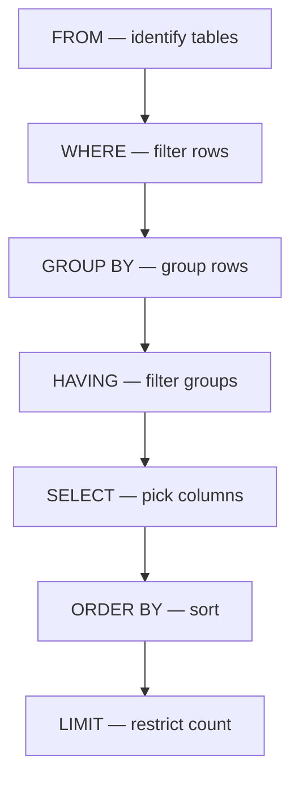

# 05 — SELECT, FROM, WHERE: The Foundation of Every Query

---

## Table of Contents

1. [What This Section Covers](#what-this-section-covers)
2. [The Query Processing Order](#the-query-processing-order)
3. [Sample Tables](#sample-tables)
4. [SELECT — Picking Your Columns](#select--picking-your-columns)
5. [FROM — Specifying the Source](#from--specifying-the-source)
6. [WHERE — Filtering Rows](#where--filtering-rows)
7. [NULL Behavior in WHERE](#null-behavior-in-where)
8. [Comparison Operators](#comparison-operators)
9. [Logical Operators: AND, OR, NOT](#logical-operators-and-or-not)
10. [BETWEEN, IN, LIKE](#between-in-like)
11. [Common Mistakes](#common-mistakes)
12. [Production Pitfalls](#production-pitfalls)
13. [Performance Implications](#performance-implications)
14. [BAD vs BETTER Approaches](#bad-vs-better-approaches)
15. [Best Practices](#best-practices)
16. [Interview Questions](#interview-questions)

---

## What This Section Covers

`SELECT`, `FROM`, and `WHERE` are the three clauses you will write in virtually every SQL query. This section explains how each one works individually, how they interact, and how to avoid the traps that trip up beginners and experienced developers alike.

> **Grain reminder:** Always ask yourself — *"What does one row in my result represent?"* The answer depends on the tables in `FROM` and the filters in `WHERE`.

---

## The Query Processing Order

SQL is **declarative** — you describe *what* you want, not *how* to get it. But the database engine executes clauses in a specific logical order. Understanding this order is critical.

| Logical Order | Clause    | Purpose                                      |
|---------------|-----------|----------------------------------------------|
| 1             | `FROM`    | Identify the source tables                   |
| 2             | `WHERE`   | Filter rows **before** grouping              |
| 3             | `GROUP BY`| Group remaining rows                         |
| 4             | `HAVING`  | Filter groups                                |
| 5             | `SELECT`  | Choose columns and compute expressions       |
| 6             | `ORDER BY`| Sort the result                              |
| 7             | `LIMIT`   | Restrict the number of rows returned         |



> **Why this matters:** You cannot reference an alias defined in `SELECT` inside `WHERE`. The database hasn't reached `SELECT` yet when it evaluates `WHERE`.

### PostgreSQL, MySQL, SQL Server

All three follow the same logical order. The physical execution may differ — the optimizer can reorder scans, joins, and filters — but the *logical* semantics above hold.

### Oracle

Oracle follows the same logical order. It also allows `FROM DUAL` as a dummy table (PostgreSQL and MySQL use `SELECT expr;` without `FROM`).

---

## Sample Tables

All examples in this section use the following tables.

### employees

| id | name        | department_id | salary | hire_date  | manager_id | is_active |
|----|-------------|---------------|--------|------------|------------|-----------|
| 1  | Alice       | 1             | 95000  | 2019-03-15 | NULL       | TRUE      |
| 2  | Bob         | 1             | 72000  | 2021-06-01 | 1          | TRUE      |
| 3  | Charlie     | 2             | 88000  | 2020-01-20 | 1          | TRUE      |
| 4  | Diana       | 2             | 67000  | 2022-11-10 | 3          | TRUE      |
| 5  | Eve         | 3             | 110000 | 2018-07-04 | NULL       | FALSE     |
| 6  | Frank       | NULL          | 55000  | 2023-02-28 | NULL       | TRUE      |

**Grain:** One row = one employee. Each employee belongs to at most one department.

### departments

| id | name        | budget  |
|----|-------------|---------|
| 1  | Engineering | 500000  |
| 2  | Marketing   | 300000  |
| 3  | Executive   | 800000  |
| 4  | Sales       | 200000  |

**Grain:** One row = one department.

---

## SELECT — Picking Your Columns

### What It Is

`SELECT` tells the database which columns (or expressions) appear in the output.

### Syntax

```sql
SELECT column1, column2, ...
FROM table_name;
```

### Selecting All Columns

```sql
SELECT *
FROM employees;
```

> **Production pitfall:** Avoid `SELECT *` in production code. It returns columns you may not need, increases network transfer, and can break application code when the schema changes (a column is added or reordered).

### Selecting Specific Columns

```sql
SELECT name, salary
FROM employees;
```

| name    | salary |
|---------|--------|
| Alice   | 95000  |
| Bob     | 72000  |
| Charlie | 88000  |
| Diana   | 67000  |
| Eve     | 110000 |
| Frank   | 55000  |

### Aliases

```sql
SELECT name AS employee_name, salary AS annual_salary
FROM employees;
```

> **Interview trap:** Aliases defined in `SELECT` cannot be used in `WHERE`. They *can* be used in `ORDER BY` in most databases.

### Expressions in SELECT

```sql
SELECT name, salary, salary * 12 AS annual_salary
FROM employees;
```

| name    | salary | annual_salary |
|---------|--------|---------------|
| Alice   | 95000  | 1140000       |
| Bob     | 72000  | 864000        |
| Charlie | 88000  | 1056000       |
| Diana   | 67000  | 804000        |
| Eve     | 110000 | 1320000       |
| Frank   | 55000  | 660000        |

### SELECT DISTINCT

`DISTINCT` removes duplicate rows from the output.

```sql
SELECT DISTINCT department_id
FROM employees;
```

| department_id |
|---------------|
| 1             |
| 2             |
| 3             |
| NULL          |

> **Important:** `NULL` values are treated as a single distinct value. `DISTINCT` does not remove multiple `NULL`s — it collapses them into one.

> **Performance:** `DISTINCT` forces the database to sort or hash the entire result set to eliminate duplicates. If you don't need deduplication, skip it.

---

## FROM — Specifying the Source

### What It Is

`FROM` identifies the table (or tables, or subqueries, or CTEs) the data comes from.

### Syntax

```sql
SELECT ...
FROM table_name;
```

### Multiple Tables (Implicit JOIN)

```sql
SELECT employees.name, departments.name AS dept_name
FROM employees, departments
WHERE employees.department_id = departments.id;
```

> **Production pitfall:** This implicit join syntax is legacy. If you forget the `WHERE` clause, you get a **Cartesian product** (every row combined with every other row). Always use explicit `JOIN` syntax instead. See the [JOINs section](../3-Joins/) for details.

### Table Aliases

```sql
SELECT e.name, d.name AS dept_name
FROM employees e
JOIN departments d ON e.department_id = d.id;
```

Aliases make queries shorter and are required for self-joins.

---

## WHERE — Filtering Rows

### What It Is

`WHERE` filters rows **before** any grouping or aggregation happens. Only rows that evaluate to `TRUE` (not `FALSE`, not `UNKNOWN`) are kept.

### Syntax

```sql
SELECT column1, column2
FROM table_name
WHERE condition;
```

### How It Works Internally

1. The database scans the table(s) in `FROM`.
2. For each row, it evaluates the `WHERE` condition.
3. If the result is `TRUE`, the row passes.
4. If the result is `FALSE` or `UNKNOWN`, the row is discarded.

> **Critical:** `UNKNOWN` is filtered out. This is the source of most NULL-related bugs. See [NULL Behavior in WHERE](#null-behavior-in-where).

### Examples

**Simple equality:**

```sql
SELECT name, salary
FROM employees
WHERE department_id = 1;
```

| name  | salary |
|-------|--------|
| Alice | 95000  |
| Bob   | 72000  |

**Inequality:**

```sql
SELECT name, salary
FROM employees
WHERE salary > 80000;
```

| name    | salary |
|---------|--------|
| Alice   | 95000  |
| Charlie | 88000  |
| Eve     | 110000 |

**Multiple conditions:**

```sql
SELECT name, salary
FROM employees
WHERE department_id = 2 AND salary > 70000;
```

| name    | salary |
|---------|--------|
| Charlie | 88000  |

**OR condition:**

```sql
SELECT name, department_id
FROM employees
WHERE department_id = 1 OR department_id = 3;
```

| name | department_id |
|------|---------------|
| Alice| 1             |
| Bob  | 1             |
| Eve  | 3             |

---

## NULL Behavior in WHERE

This is one of the most important topics in SQL. NULL represents **missing or unknown data**. It is not a value — it is the *absence* of a value.

### Three-Valued Logic

SQL uses **three-valued logic**:

| A     | B     | A AND B | A OR B |
|-------|-------|---------|--------|
| TRUE  | TRUE  | TRUE    | TRUE   |
| TRUE  | FALSE | FALSE   | TRUE   |
| TRUE  | UNK   | UNK     | TRUE   |
| FALSE | TRUE  | FALSE   | TRUE   |
| FALSE | FALSE | FALSE   | FALSE  |
| FALSE | UNK   | FALSE   | UNK    |
| UNK   | TRUE  | UNK     | TRUE   |
| UNK   | FALSE | UNK     | UNK    |
| UNK   | UNK   | UNK     | UNK    |

### NULL = NULL Is UNKNOWN

```sql
SELECT *
FROM employees
WHERE manager_id = NULL;
```

**Result: Empty set.** This query returns *nothing* — not even rows where `manager_id` is NULL. The comparison `NULL = NULL` evaluates to `UNKNOWN`, which is filtered out.

> **Interview trap:** This is the #1 beginner mistake. `NULL = NULL` is NOT `TRUE`. It is `UNKNOWN`.

### Correct Way to Check for NULL

```sql
SELECT *
FROM employees
WHERE manager_id IS NULL;
```

| id | name | department_id | salary | hire_date  | manager_id | is_active |
|----|------|---------------|--------|------------|------------|-----------|
| 1  | Alice| 1             | 95000  | 2019-03-15 | NULL       | TRUE      |
| 5  | Eve  | 3             | 110000 | 2018-07-04 | NULL       | FALSE     |
| 6  | Frank| NULL          | 55000  | 2023-02-28 | NULL       | TRUE      |

### NULL <> NULL Is Also UNKNOWN

```sql
SELECT *
FROM employees
WHERE manager_id <> NULL;
```

**Result: Empty set.** Same problem.

```sql
SELECT *
FROM employees
WHERE manager_id IS NOT NULL;
```

| id | name    | department_id | salary | hire_date  | manager_id | is_active |
|----|---------|---------------|--------|------------|------------|-----------|
| 2  | Bob     | 1             | 72000  | 2021-06-01 | 1          | TRUE      |
| 3  | Charlie | 2             | 88000  | 2020-01-20 | 1          | TRUE      |
| 4  | Diana   | 2             | 67000  | 2022-11-10 | 3          | TRUE      |

### IS DISTINCT FROM (NULL-Safe Equality)

Some databases provide `IS DISTINCT FROM` which treats two NULLs as equal:

```sql
-- PostgreSQL, MySQL 8+, SQLite, BigQuery
SELECT *
FROM employees
WHERE department_id IS NOT DISTINCT FROM NULL;
```

This is equivalent to `WHERE department_id IS NULL` but works in a boolean expression context more naturally.

> **PostgreSQL:** Supports `IS DISTINCT FROM` and `IS NOT DISTINCT FROM`.
> **MySQL:** Supports `IS DISTINCT FROM` as of 8.0.
> **SQL Server:** Does not support this syntax. Use `IS NULL` / `IS NOT NULL`.
> **Oracle:** Does not support this syntax. Use `IS NULL` / `IS NOT NULL`.

### NULL in Expressions

Any arithmetic with NULL produces NULL:

```sql
SELECT salary, salary + 1000 AS salary_plus_bonus
FROM employees
WHERE id = 6;
```

| salary | salary_plus_bonus |
|--------|-------------------|
| 55000  | NULL              |

Wait — Frank's salary is 55000, not NULL. But what if a column itself is NULL?

```sql
SELECT 100 + NULL AS result;
```

| result |
|--------|
| NULL   |

> **Common misconception:** NULL + 5 is not 5. It is NULL. NULL propagates through arithmetic.

> **See also:** `COALESCE` and `NULLIF` in the [NULL handling section](../2-Filtering-and-Sorting/) for ways to handle NULL in expressions.

---

## Comparison Operators

| Operator | Meaning                  | NULL Behavior                |
|----------|--------------------------|------------------------------|
| `=`      | Equal                    | NULL = NULL → UNKNOWN        |
| `<>` or `!=` | Not equal           | NULL <> NULL → UNKNOWN       |
| `>`      | Greater than             | NULL > anything → UNKNOWN    |
| `<`      | Less than                | NULL < anything → UNKNOWN    |
| `>=`     | Greater than or equal    | NULL >= anything → UNKNOWN   |
| `<=`     | Less than or equal       | NULL <= anything → UNKNOWN   |
| `IS NULL`| Is NULL                  | NULL IS NULL → TRUE          |
| `IS NOT NULL` | Is not NULL         | NULL IS NOT NULL → FALSE     |

> **PostgreSQL:** Supports `<>`, `!=`, and `<>` interchangeably.
> **SQL Server:** Supports `<>` and `!=`.
> **Oracle:** Supports `<>` and `!=`.

---

## Logical Operators: AND, OR, NOT

### AND

Both conditions must be TRUE.

```sql
SELECT name, salary, department_id
FROM employees
WHERE department_id = 1 AND salary > 80000;
```

| name  | salary | department_id |
|-------|--------|---------------|
| Alice | 95000  | 1             |

### OR

At least one condition must be TRUE.

```sql
SELECT name, salary
FROM employees
WHERE salary < 60000 OR salary > 100000;
```

| name | salary |
|------|--------|
| Eve  | 110000 |
| Frank| 55000  |

### NOT

Reverses the condition.

```sql
SELECT name, department_id
FROM employees
WHERE NOT department_id = 1;
```

| name    | department_id |
|---------|---------------|
| Charlie | 2             |
| Diana   | 2             |
| Eve     | 3             |
| Frank   | NULL          |

> **Important:** `NOT department_id = 1` does NOT return rows where `department_id` is NULL. `NOT (NULL = 1)` → `NOT (UNKNOWN)` → `UNKNOWN`, which is filtered out.

### Operator Precedence

`NOT` binds tighter than `AND`, which binds tighter than `OR`.

```sql
-- This means:
WHERE a OR b AND c
-- is interpreted as:
WHERE a OR (b AND c)
-- NOT as:
WHERE (a OR b) AND c
```

> **Production pitfall:** Always use parentheses to make precedence explicit. Do not rely on implicit precedence.

```sql
-- BAD: ambiguous to human readers
WHERE salary > 50000 OR department_id = 1 AND is_active = TRUE

-- BETTER: explicit parentheses
WHERE (salary > 50000) OR (department_id = 1 AND is_active = TRUE)
```

---

## BETWEEN, IN, LIKE

### BETWEEN

Filters rows within an inclusive range (both endpoints included).

```sql
SELECT name, salary
FROM employees
WHERE salary BETWEEN 70000 AND 90000;
```

| name    | salary |
|---------|--------|
| Bob     | 72000  |
| Charlie | 88000  |

This is equivalent to:

```sql
WHERE salary >= 70000 AND salary <= 90000
```

> **Interview trap:** `BETWEEN` is **inclusive** on both sides. `WHERE salary BETWEEN 70000 AND 90000` includes 70000 and 90000.

> **Date trap:** `WHERE hire_date BETWEEN '2020-01-01' AND '2020-12-31'` may miss timestamps on Dec 31 that have a time component (e.g., `2020-12-31 15:30:00`). This is because `WHERE hire_date <= '2020-12-31'` is interpreted as `hire_date <= '2020-12-31 00:00:00'` in most databases. Use `WHERE hire_date >= '2020-01-01' AND hire_date < '2021-01-01'` instead for timestamps.

### IN

Matches any value in a list.

```sql
SELECT name, department_id
FROM employees
WHERE department_id IN (1, 3);
```

| name | department_id |
|------|---------------|
| Alice| 1             |
| Bob  | 1             |
| Eve  | 3             |

Equivalent to multiple `OR` conditions:

```sql
WHERE department_id = 1 OR department_id = 3
```

> **See also:** `IN` vs `EXISTS` vs `JOIN` is covered in the [Subqueries section](../7-Subqueries/).

### NULL in IN

```sql
SELECT *
FROM employees
WHERE department_id IN (1, NULL);
```

This returns rows where `department_id = 1`. Rows where `department_id` is NULL are **not** returned. `IN` expands to `OR` comparisons, and `NULL = NULL` is UNKNOWN.

> **See also:** `NOT IN` with NULLs is covered in the [Subqueries section](../7-Subqueries/). It is one of the most dangerous patterns in SQL.

### LIKE

Pattern matching with wildcards.

| Wildcard | Meaning                          |
|----------|----------------------------------|
| `%`      | Zero or more characters          |
| `_`      | Exactly one character            |

```sql
SELECT name
FROM employees
WHERE name LIKE 'A%';
```

| name  |
|-------|
| Alice |

```sql
SELECT name
FROM employees
WHERE name LIKE '_o%';
```

| name |
|------|
| Bob  |

> **PostgreSQL:** Also supports `ILIKE` for case-insensitive matching.
> **MySQL:** `LIKE` is case-insensitive by default with `utf8` collation.
> **SQL Server:** `LIKE` is case-insensitive by default (depends on collation).
> **Oracle:** `LIKE` is case-sensitive. Use `UPPER(col) LIKE '%FOO%'` for case-insensitive matching.

### NOT LIKE

```sql
SELECT name
FROM employees
WHERE name NOT LIKE 'A%';
```

| name    |
|---------|
| Bob     |
| Charlie |
| Diana   |
| Eve     |
| Frank   |

---

## Common Mistakes

### Mistake 1: Using WHERE Instead of HAVING

```sql
-- BAD: filtering after GROUP BY using WHERE
SELECT department_id, COUNT(*) AS cnt
FROM employees
WHERE COUNT(*) > 1
GROUP BY department_id;
```

This fails. `WHERE` is evaluated before `GROUP BY`, so `COUNT(*)` is not yet available.

```sql
-- BETTER: use HAVING to filter after grouping
SELECT department_id, COUNT(*) AS cnt
FROM employees
GROUP BY department_id
HAVING COUNT(*) > 1;
```

### Mistake 2: Comparing with NULL Using = or <>

```sql
-- BAD
WHERE manager_id = NULL
WHERE manager_id != NULL

-- BETTER
WHERE manager_id IS NULL
WHERE manager_id IS NOT NULL
```

### Mistake 3: Assuming SELECT Aliases Work Everywhere

```sql
-- BAD: alias "annual_salary" cannot be used in WHERE
SELECT name, salary * 12 AS annual_salary
FROM employees
WHERE annual_salary > 1000000;

-- BETTER: repeat the expression or use a subquery/CTE
SELECT name, salary * 12 AS annual_salary
FROM employees
WHERE salary * 12 > 1000000;
```

> **PostgreSQL:** Allows referencing `SELECT` aliases in `ORDER BY` but not in `WHERE`.
> **MySQL:** Allows `SELECT` aliases in `ORDER BY` and `HAVING` but not in `WHERE`.
> **SQL Server:** Does not allow `SELECT` aliases in `WHERE`.

### Mistake 4: SELECT * in Production

```sql
-- BAD: returns all columns, breaks on schema changes
SELECT * FROM employees;

-- BETTER: list only the columns you need
SELECT id, name, salary FROM employees;
```

### Mistake 5: Not Understanding IN Expansion

```sql
-- This:
WHERE id IN (1, 2, 3)

-- Is conceptually expanded to:
WHERE id = 1 OR id = 2 OR id = 3

-- If any value in the list is NULL:
WHERE id IN (1, NULL)

-- Becomes:
WHERE id = 1 OR id = NULL

-- id = NULL is always UNKNOWN, so it never matches
-- Result: only rows where id = 1 are returned
```

---

## Production Pitfalls

### 1. Implicit Cartesian Products

```sql
-- DANGEROUS: if you forget the WHERE, every row combines with every other
SELECT e.name, d.name
FROM employees e, departments d;

-- This returns 6 × 4 = 24 rows (every combination)
```

Always use explicit `JOIN` with an `ON` clause.

### 2. Leading Wildcards Kill Performance

```sql
-- SLOW: cannot use index on name
WHERE name LIKE '%lice'

-- FAST: can use index on name
WHERE name LIKE 'Ali%'
```

`LIKE '%string%'` forces a full table scan (or full index scan). `LIKE 'string%'` can use a B-tree index.

> **Verify with:** `EXPLAIN ANALYZE` to see if the optimizer uses an index scan or falls back to a sequential scan.

### 3. Non-SARGable Conditions

**SARGable** = Search-Argument-able = the condition can use an index.

```sql
-- NOT SARGable: function on the column prevents index use
WHERE YEAR(hire_date) = 2020
WHERE salary + 1000 > 80000
WHERE UPPER(name) = 'ALICE'

-- SARGable: condition on the raw column
WHERE hire_date >= '2020-01-01' AND hire_date < '2021-01-01'
WHERE salary > 79000
-- (for UPPER, you may need a functional index)
```

> **Verify with:** `EXPLAIN ANALYZE`. Look for "Index Scan" vs "Seq Scan" or "Filter" in the plan.

### 4. Implicit Type Conversion

```sql
-- BAD: comparing string column to number (may prevent index use)
WHERE phone_number = 5551234

-- BETTER: match types
WHERE phone_number = '5551234'
```

Some databases silently convert types, which can cause full scans.

### 5. Large IN Lists

```sql
-- Potentially slow with thousands of values
WHERE id IN (1, 2, 3, ..., 10000)
```

For very large lists, consider using a temporary table or `JOIN` to a values clause instead. The optimizer handles this differently per database.

---

## Performance Implications

### How the Database Processes WHERE

1. **Full Table Scan (Seq Scan):** Reads every row, evaluates the `WHERE` condition. O(n).
2. **Index Scan:** Uses an index to find matching rows. O(log n) for B-tree lookup + O(k) for k matching rows.
3. **Index Only Scan:** All needed columns are in the index. No table access needed.

### Factors That Affect Performance

| Factor              | Impact                                                |
|---------------------|-------------------------------------------------------|
| Indexes             | A well-placed index can turn O(n) into O(log n)      |
| Statistics           | Optimizer relies on table statistics for cardinality estimates |
| Data distribution   | Skewed data may cause poor plan choices               |
| Query shape         | `SELECT *` is slower than `SELECT col1, col2`         |
| Predicate sargability| Non-SARGable predicates force scans                   |
| Result size         | Returning millions of rows is slow regardless          |
| Database engine     | Different optimizers make different choices            |

> **Always verify with execution plans:**
> - PostgreSQL: `EXPLAIN ANALYZE`
> - MySQL: `EXPLAIN ANALYZE` (8.0+) or `EXPLAIN`
> - SQL Server: `SET STATISTICS IO ON;` or "Display Estimated Execution Plan"
> - Oracle: `EXPLAIN PLAN FOR` then `SELECT * FROM TABLE(DBMS_XPLAN.DISPLAY);`

### When WHERE Cannot Use an Index

- `LIKE '%prefix'` (leading wildcard)
- `WHERE function(column) = value` (non-SARGable)
- `WHERE column <> value` (may not use index in some databases)
- `WHERE column IS NULL` (may not use index in some databases — PostgreSQL does use index for IS NULL)
- `WHERE NOT column` (boolean columns)

> **PostgreSQL:** Can use indexes for `IS NULL` and `IS NOT NULL` checks.
> **MySQL InnoDB:** Can use indexes for `IS NULL` checks.
> **SQL Server:** Can use indexes for `IS NULL` checks.

---

## BAD vs BETTER Approaches

### BAD: Using OR When IN Would Be Clearer

```sql
-- BAD
SELECT name, salary
FROM employees
WHERE department_id = 1 OR department_id = 2 OR department_id = 3;

-- BETTER: more readable
SELECT name, salary
FROM employees
WHERE department_id IN (1, 2, 3);
```

### BAD: SELECT * Then Filtering in Application Code

```sql
-- BAD: fetches all columns and rows, filters in Python/Java/etc.
SELECT * FROM employees;
-- Application: filter where salary > 80000

-- BETTER: let the database do the work
SELECT id, name, salary
FROM employees
WHERE salary > 80000;
```

### BAD: Using != When NOT IN or NOT EXISTS Is More Expressive

```sql
-- BAD: unclear intent
SELECT name
FROM employees
WHERE department_id != 1;

-- BETTER: explicit exclusion
SELECT name
FROM employees
WHERE department_id NOT IN (1);
```

### BAD: Comparing Dates Incorrectly

```sql
-- BAD: may miss timestamps later in the day
WHERE hire_date BETWEEN '2020-01-01' AND '2020-12-31'

-- BETTER: use exclusive upper bound
WHERE hire_date >= '2020-01-01' AND hire_date < '2021-01-01'
```

### BAD: Using NOT IN with Subquery That Contains NULLs

```sql
-- DANGEROUS: if the subquery returns any NULL, this returns ZERO rows
WHERE department_id NOT IN (SELECT department_id FROM employees WHERE manager_id IS NULL)

-- BETTER: use NOT EXISTS
WHERE NOT EXISTS (
    SELECT 1 FROM employees e2
    WHERE e2.manager_id IS NULL
    AND e2.department_id = employees.department_id
)
```

> **See also:** This is covered in depth in the [NOT IN + NULL trap section](../7-Subqueries/).

---

## Best Practices

1. **Always specify column names** instead of using `SELECT *`.
2. **Use explicit JOIN syntax** instead of comma-separated tables in `FROM`.
3. **Use `IS NULL` / `IS NOT NULL`** to check for NULL — never `= NULL`.
4. **Parenthesize complex conditions** to avoid precedence confusion.
5. **Write SARGable predicates** — avoid functions on indexed columns in `WHERE`.
6. **Use date ranges with exclusive upper bounds** for timestamp columns.
7. **Verify with `EXPLAIN ANALYZE`** before assuming a query is fast.
8. **Check grain** before writing a query — know what one row represents.
9. **Avoid `NOT IN` with subqueries** that might return NULLs — use `NOT EXISTS`.
10. **Prefer `BETWEEN` for ranges** — it is clearer and less error-prone than `>= AND <=`.

---

# Interview Questions

## Beginner

1. What is the difference between `WHERE` and `HAVING`?
2. Why does `WHERE manager_id = NULL` return no rows?
3. What does `SELECT DISTINCT` do? Can `DISTINCT` remove only some NULLs?
4. Is `BETWEEN` inclusive or exclusive on its boundaries?
5. What is the difference between `IN (1, 2, 3)` and `= 1 OR = 2 OR = 3`?
6. Can you use a column alias defined in `SELECT` inside `WHERE`?
7. What is the grain of the `employees` table used in this section?
8. Write a query to find all employees hired in 2022.
9. Write a query to find employees with a salary between 60000 and 100000 (inclusive).
10. Write a query to find all employees whose name starts with 'A'.

## Intermediate

11. Why does `NOT (NULL = 1)` evaluate to `UNKNOWN` rather than `TRUE`?
12. What is the difference between `= NULL` and `IS NULL`?
13. Write a query to find employees who have no manager and are in department 1.
14. Write a query to find employees whose name contains exactly 3 characters (use `LIKE`).
15. Why can `WHERE department_id NOT IN (SELECT ...)` return zero rows when the subquery has a NULL?
16. What is a SARGable predicate? Give an example of a non-SARGable predicate.
17. Why does `LIKE '%value%'` prevent index usage?
18. Explain the three-valued logic table for `NULL AND TRUE`.
19. What is the difference between `!=` and `<>`?
20. Write a query to find all employees who are not in department 1 or 2.

## Advanced

21. Explain why `WHERE hire_date BETWEEN '2020-01-01' AND '2020-12-31'` may miss rows.
22. How does `IS DISTINCT FROM` differ from `=` for NULL values?
23. Why might `WHERE salary + 1000 > 80000` be slower than `WHERE salary > 79000`?
24. Under what conditions can `WHERE department_id IS NULL` use an index?
25. Explain how `IN` expansion affects query optimization with large lists.
26. Write a query that demonstrates the danger of forgetting `WHERE` in an implicit join.
27. Why does `SELECT *` cause problems in production systems beyond just performance?
28. How does the optimizer decide between a full table scan and an index scan?
29. Write a query using `NOT EXISTS` that is safer than `NOT IN` when NULLs are possible.
30. Explain the logical order of SQL evaluation and why it prevents using `SELECT` aliases in `WHERE`.

## Scenario Based

31. You have a table of 10 million rows. A query with `WHERE UPPER(name) = 'ALICE'` is slow. Diagnose the issue and propose a fix.
32. A developer writes `SELECT * FROM orders WHERE order_date BETWEEN '2024-01-01' AND '2024-12-31'` and reports missing orders. What is the likely cause?
33. A query `WHERE status IN ('active', 'pending', NULL)` returns fewer rows than expected. Explain why.
34. You need to find employees who do NOT have a record in the `logins` table. Write the query two ways (IN and EXISTS) and explain which is preferable.
35. A production query uses `WHERE department_id != 4` and the execution plan shows a full table scan despite an index on `department_id`. Why might this happen?

## Tricky

36. What is the result of `NULL IN (1, 2, NULL)` — `TRUE`, `FALSE`, or `UNKNOWN`?
37. What is the result of `NULL NOT IN (1, 2, NULL)` — `TRUE`, `FALSE`, or `UNKNOWN`?
38. Write a query to return employees where `salary > 80000` OR `department_id = 3`, but exclude Eve (id = 5).
39. Why does `SELECT * FROM employees WHERE name LIKE 'A_'` return no rows?
40. What happens if you write `WHERE 1 = 1 AND name = 'Alice'`?

## Output Prediction

Given the sample tables:

```sql
-- Q41
SELECT COUNT(*) FROM employees WHERE salary > 80000;

-- Q42
SELECT department_id, COUNT(*) FROM employees GROUP BY department_id HAVING COUNT(*) > 1;

-- Q43
SELECT name FROM employees WHERE department_id IN (SELECT id FROM departments WHERE budget > 400000);

-- Q44
SELECT COUNT(*) FROM employees WHERE manager_id IS NULL;

-- Q45
SELECT name FROM employees WHERE name LIKE '%a%';
```

Predict the output of each query above.

## Debugging

46. This query returns an error. Fix it:

```sql
SELECT name, salary
FROM employees
WHERE annual_salary > 80000;
```

47. This query returns too many rows. The developer wants only employees in Engineering. What is wrong?

```sql
SELECT e.name, d.name
FROM employees e, departments d;
```

48. This query should return employees with no manager but returns nothing. Why?

```sql
SELECT * FROM employees WHERE manager_id = NULL;
```

49. This query is slow on a table with 50 million rows. Diagnose:

```sql
SELECT * FROM transactions
WHERE EXTRACT(YEAR FROM transaction_date) = 2024;
```

50. This query returns unexpected duplicates. What happened?

```sql
SELECT e.name, d.name
FROM employees e
JOIN departments d ON e.department_id = d.id;
```

(The `employees` table has a many-to-many with another table, and the developer forgot.)

## Performance

51. Which of these queries is more likely to use an index on `salary`? Explain why.

```sql
-- Query A
WHERE salary > 80000

-- Query B
WHERE salary * 12 > 960000
```

52. Under what circumstances might `WHERE id IN (SELECT id FROM large_table)` outperform `WHERE EXISTS (SELECT 1 FROM large_table WHERE ...)`?

53. You run `EXPLAIN ANALYZE` and see "Seq Scan on employees". What does this mean? When is it acceptable?

54. A composite index on `(department_id, salary)` exists. Which queries can use it?

```sql
-- Q54a
WHERE department_id = 1

-- Q54b
WHERE department_id = 1 AND salary > 80000

-- Q54c
WHERE salary > 80000

-- Q54d
WHERE salary > 80000 AND department_id = 1
```

55. What is the difference between a table scan, an index scan, and an index-only scan? How do you identify each in `EXPLAIN ANALYZE` output?
