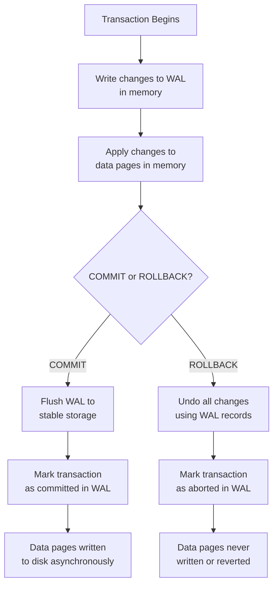
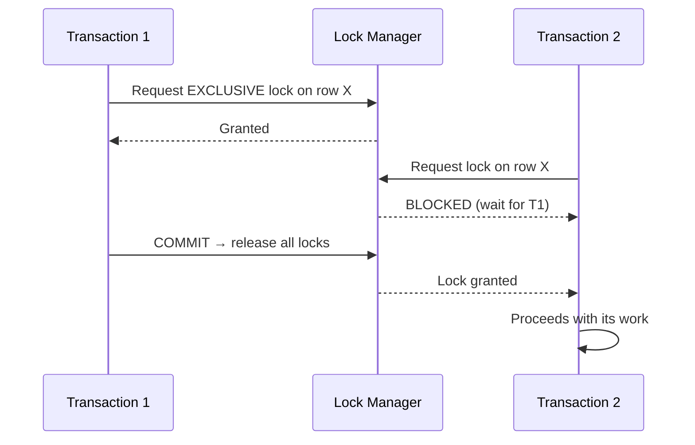
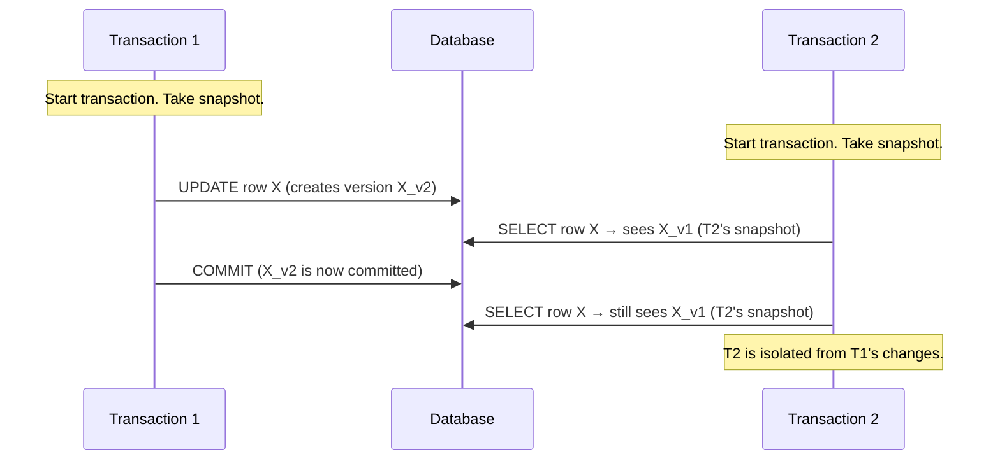
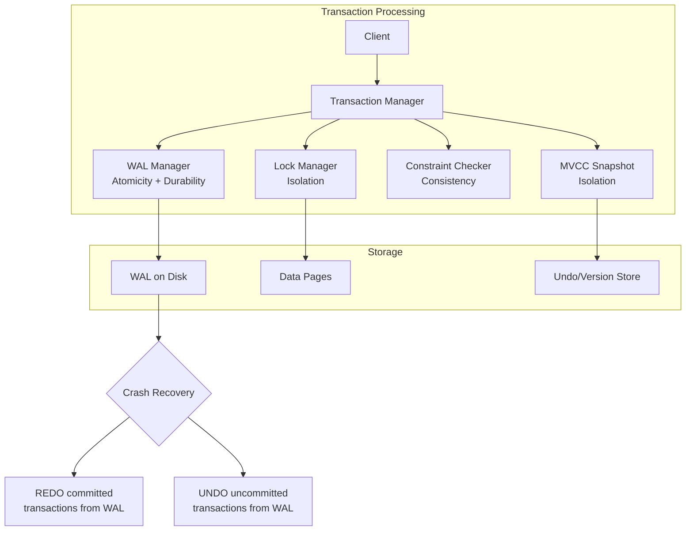

# 86 — ACID: Atomicity, Consistency, Isolation, Durability

## Table of ContentNow I have a clear picture of the existing handbook style and the related Transactions section (85) which covers transaction syntax/isolation levels in detail. The ACID section (86) should focus on the **properties themselves** — what they are, why each exists, internal mechanisms, how they interact, and how they differ across engines.

Let me write the full section now.
Section written to `sql-handbook/10-Database-Design/86-ACID.md` (~700 lines). Covered:

**Fundamentals** — what ACID is, why it exists, each property's granular guarantee
**Four properties in depth** — Atomicity, Consistency, Isolation, Durability, each with: definition, why it exists, internal mechanism with Mermaid diagram, syntax, examples, when to use/not use, edge cases
**Isolation levels** — full spectrum table (dirty read → write skew), anomaly prevention, engine-specific behaviors, with live code examples
**Engine comparison** — MVCC implementation, WAL mechanism, lock granularity, phantom prevention, deadlock detection across PostgreSQL/MySQL/SQL Server/Oracle
**NULL behavior** — how NULL silently bypasses CHECK constraints, the NULL-balance loss trap
**BAD vs BETTER** — non-transactional code, TOCTOU races, lost updates, write skew prevention
**Production pitfalls** — deadlocks, idle-in-transaction bloat, lock escalation, undo exhaustion, durability misconfiguration
**Performance** — WAL fsync cost, group commit, batching rationale, verification with EXPLAIN/STATISTICS
**Interview questions** — 44 across all 8 required categories

Cross-references `85-Transactions` throughout rather than duplicating syntax. No absolute performance claims; every tuning lever notes its trade-off and measurement method.

Note: `85-Transactions.md` currently contains only a generation summary, not the full section — consider regenerating it for a complete cross-reference chain.
r failures, and hardware faults. |

### Why ACID exists

Without ACID, databases would be unreliable for anything beyond casual data storage. A bank transfer that debits one account but crashes before crediting the other would leave money in limbo. Two users editing the same inventory record simultaneously could both overwrite each other's changes. A power outage mid-write could corrupt data files.

ACID is the contract that separates a _database_ from a _file with data in it_.

> Common misconception: "ACID is a feature you turn on or off." It is not a single switch. Each property is a design commitment enforced by internal mechanisms (WAL, locks, MVCC, constraint checkers, fsync). You tune the _strength_ of each property via isolation levels, durability settings, and constraint definitions — you never disable them entirely.

---

## The Four Properties in Depth

### Atomicity

#### What it is

Atomicity means a transaction is treated as a single, indivisible unit of work. Either all of its changes are committed (made permanent), or none of them are. There is no partial commit — no "half the money left one account but never arrived in the other."

#### Why it exists

Without atomicity, multi-step operations would leave the database in inconsistent intermediate states. Consider a payroll system that must simultaneously:

1. Debit the company's operating account
2. Credit the employee's paycheck
3. Record the transaction in an audit log

If step 2 succeeds but step 3 fails (disk full), the database has paid the employee but has no record of it. Atomicity prevents this by rolling back all three steps when step 3 fails.

#### How it works internally

Databases implement atomicity through the **Write-Ahead Log (WAL)** — also called the transaction log or redo log depending on the engine.



The key insight: **changes are logged before they are applied.** If the system crashes mid-transaction, the database replays the WAL on recovery — either completing committed transactions (redo) or discarding uncommitted ones (undo).

#### Syntax

```sql
-- Explicit transaction (ANSI SQL standard)
BEGIN TRANSACTION;
    -- All statements inside are atomic
    UPDATE accounts SET balance = balance - 500 WHERE account_id = 101;
    UPDATE accounts SET balance = balance + 500 WHERE account_id = 201;
    INSERT INTO transfers (from_acct, to_acct, amount, status)
    VALUES (101, 201, 500, 'completed');
COMMIT;

-- On failure at ANY point:
ROLLBACK;  -- all three statements are undone
```

Database-specific syntax:

| Engine         | Begin                                                           | Commit               | Rollback               | Notes                         |
| -------------- | --------------------------------------------------------------- | -------------------- | ---------------------- | ----------------------------- |
| PostgreSQL     | `BEGIN` or `START TRANSACTION`                                  | `COMMIT` or `END`    | `ROLLBACK` or `ABORT`  | Auto-commit is OFF by default |
| MySQL (InnoDB) | `START TRANSACTION` or `BEGIN`                                  | `COMMIT`             | `ROLLBACK`             | Auto-commit is ON by default  |
| SQL Server     | `BEGIN TRANSACTION`                                             | `COMMIT TRANSACTION` | `ROLLBACK TRANSACTION` | Auto-commit ON by default     |
| Oracle         | Implicit (each statement is a transaction) or `SET TRANSACTION` | `COMMIT`             | `ROLLBACK`             | DDL auto-commits              |

> MySQL: MySQL's `autocommit` setting (ON by default) means each individual statement is its own transaction. To get atomicity across multiple statements, you **must** explicitly disable autocommit or use `START TRANSACTION`.

#### Example

```sql
CREATE TABLE accounts (
    account_id   INT PRIMARY KEY,
    holder_name  VARCHAR(100) NOT NULL,
    balance      DECIMAL(12,2) NOT NULL CHECK (balance >= 0),
    updated_at   TIMESTAMP DEFAULT CURRENT_TIMESTAMP
);

CREATE TABLE transfers (
    transfer_id  INT PRIMARY KEY,
    from_acct    INT NOT NULL REFERENCES accounts(account_id),
    to_acct      INT NOT NULL REFERENCES accounts(account_id),
    amount       DECIMAL(12,2) NOT NULL CHECK (amount > 0),
    status       VARCHAR(20) NOT NULL,
    created_at   TIMESTAMP DEFAULT CURRENT_TIMESTAMP
);

INSERT INTO accounts VALUES
(101, 'Alice', 5000.00, NOW()),
(202, 'Bob',   3000.00, NOW());
```

**BAD — No explicit transaction:**

```sql
-- MySQL with autocommit ON (default)
UPDATE accounts SET balance = balance - 500 WHERE account_id = 101;  -- committed immediately
-- CRASH or ERROR here
UPDATE accounts SET balance = balance + 500 WHERE account_id = 202;  -- never runs
-- Result: 500 disappeared from Alice's account. Bob never received it.
```

**BETTER — Atomic transaction:**

```sql
BEGIN;
    UPDATE accounts SET balance = balance - 500 WHERE account_id = 101;
    UPDATE accounts SET balance = balance + 500 WHERE account_id = 202;
    INSERT INTO transfers (transfer_id, from_acct, to_acct, amount, status)
    VALUES (1, 101, 202, 500, 'completed');
COMMIT;
-- If ANY statement fails or the system crashes before COMMIT, ALL changes are rolled back.
```

#### When to use it

- Any multi-statement operation where partial completion is unacceptable
- Financial operations, inventory adjustments, order processing, audit logging

#### When NOT to use it

- Single-statement operations that are already atomic by definition
- Bulk imports where you intentionally want partial success (use batch size control instead)
- When the overhead of transaction logging is unacceptable for append-only, loss-tolerant workloads (e.g., logging clickstreams)

#### Common mistakes

1. **Assuming single statements are always atomic.** A `DELETE FROM orders WHERE customer_id = 5` deletes an unknown number of rows — it is atomic as a _statement_, but if you need the deletion to also update inventory counts in a second statement, you need an explicit transaction.

2. **Forgetting that DDL auto-commits in most engines.** In PostgreSQL and MySQL, `CREATE TABLE`, `ALTER TABLE`, and `DROP TABLE` auto-commit the current transaction. A `CREATE TABLE` followed by a crash still creates the table.

> PostgreSQL: `CREATE TABLE` inside a `BEGIN...ROLLBACK` block will **not** be rolled back — it auto-commits. However, `CREATE TABLE AS` and some other DDL can participate in transactions.

> MySQL: All DDL statements (`CREATE`, `ALTER`, `DROP`, `TRUNCATE`) implicitly commit any active transaction.

#### Edge cases

| Edge case                         | Behavior                                                                                                |
| --------------------------------- | ------------------------------------------------------------------------------------------------------- |
| ROLLBACK after COMMIT             | Cannot undo. Once committed, changes are permanent. You must issue a compensating transaction.          |
| SAVEPOINT and partial rollback    | `SAVEPOINT sp1; ... ROLLBACK TO SAVEPOINT sp1;` undoes work after the savepoint but keeps earlier work. |
| DDL inside transaction            | Auto-commits in PostgreSQL and MySQL; can be rolled back in SQL Server.                                 |
| Network timeout after COMMIT sent | The client may not know if the server received it. Use idempotency keys to safely retry.                |
| Distributed transactions          | Standard atomicity does not span databases. Use 2PC (two-phase commit) or saga patterns.                |

---

### Consistency

#### What it is

Consistency means every transaction brings the database from one **valid state** to another **valid state**, where "valid" is defined by all declared constraints: `PRIMARY KEY`, `FOREIGN KEY`, `UNIQUE`, `NOT NULL`, `CHECK`, and any triggers or stored procedures.

#### Why it exists

Without consistency, you could have:

- An order referencing a customer that does not exist (orphaned foreign key)
- A negative bank balance despite a `CHECK (balance >= 0)` constraint
- Two rows with the same primary key
- A transfer record that debited one account but references a nonexistent destination

Consistency is the database **enforcing its own rules** on every transaction.

#### How it works internally

The database engine checks all constraints at specific points:

```mermaid
flowchart TD
    A[Statement Executes] --> B[For each modified row:<br>check CHECK constraints]
    B --> C{CHECK constraints pass?}
    C -->|No| D[Abort statement<br>raise constraint violation]
    C -->|Yes| E[For each modified row:<br>check UNIQUE constraints]
    E --> F{UNIQUE constraints pass?}
    F -->|No| D
    F -->|Yes| G[For each modified row:<br>check NOT NULL]
    G --> H{NOT NULL pass?}
    H -->|No| D
    H -->|Yes| I[For each modified row:<br>check FOREIGN KEY (deferrable?)]
    I --> J{FK constraints pass?}
    J -->|No| D
    J -->|Yes| K[Statement succeeds]
```

Constraint checking can be **immediate** (checked at each statement) or **deferred** (checked only at `COMMIT` time):

```sql
-- Immediate (default in all engines)
INSERT INTO orders (order_id, customer_id) VALUES (1, 9999);
-- ERROR immediately: foreign key violation (customer 9999 doesn't exist)

-- Deferred (PostgreSQL and Oracle)
SET CONSTRAINTS ALL DEFERRED;
BEGIN;
    INSERT INTO orders (order_id, customer_id) VALUES (1, 9999);
    INSERT INTO customers (customer_id, name) VALUES (9999, 'New Customer');
COMMIT;  -- checked here; both exist now, so it passes
```

> Common misconception: "Consistency means the data always makes business sense." Consistency only enforces **declared constraints**. If you forget to add a `CHECK` constraint or a foreign key, the database cannot enforce rules it does not know about. Application-level invariants (like "total debits must equal total credits across all accounts") are NOT enforced by ACID consistency — you must handle those in application logic or triggers.

#### Example

```sql
-- Constraint: balance must never be negative
ALTER TABLE accounts ADD CONSTRAINT positive_balance
    CHECK (balance >= 0);

-- Attempt to violate
BEGIN;
    UPDATE accounts SET balance = balance - 6000 WHERE account_id = 101;
    -- Alice has 5000; this would set balance to -1000
COMMIT;

-- Result: ERROR: new row for relation "accounts" violates check constraint "positive_balance"
-- DETAIL: Failing row contains (101, Alice, -1000.00, ...).
-- The entire transaction is rolled back. Alice's balance stays at 5000.
```

**BAD — No constraint, relying on application logic:**

```sql
-- Application code checks balance in Python/Java/etc.
-- "if balance >= amount: proceed"
-- But two concurrent requests could both pass the check before either commits
-- Result: both succeed, balance goes negative. The database never refused.

UPDATE accounts SET balance = balance - 6000 WHERE account_id = 101;  -- succeeds
-- Balance is now -1000. No constraint caught it.
```

**BETTER — Database constraint:**

```sql
-- The constraint is the single source of truth
-- No concurrent race can bypass it because the DB checks it at COMMIT time
UPDATE accounts SET balance = balance - 6000 WHERE account_id = 101;
-- ERROR: check constraint violated. Transaction rolled back. Correct state preserved.
```

#### When to use it

Always. Consistency is not optional — you always want your database in a valid state. The question is _how many constraints to declare_.

#### When NOT to use it

There are rare cases where constraints are intentionally relaxed:

- Staging/ETL pipelines that load data in intermediate states
- Temporary tables used for batch processing before final validation
- Data migration scripts that load before constraints are re-enabled

#### Common mistakes

1. **Omitting foreign keys for "performance."** Foreign key checks add minimal overhead for most workloads, and the correctness guarantee is essential. Remove them only with a documented compensating mechanism.

2. **Assuming consistency covers application logic.** A `CHECK (status IN ('pending', 'shipped', 'delivered'))` ensures valid status values. But "an order cannot be shipped before it is placed" requires application-level sequencing — the database cannot enforce temporal logic through constraints alone.

3. **Disabling constraints for bulk loads and forgetting to re-enable.**

```sql
-- BAD: Disable constraints for a load, forget to re-enable
ALTER TABLE order_items DISABLE ALL TRIGGERS;  -- PostgreSQL
-- ... bulk load ...
-- Never re-enabled. Subsequent data can violate referential integrity.
```

#### Edge cases

| Edge case                          | Behavior                                                                                      |
| ---------------------------------- | --------------------------------------------------------------------------------------------- |
| Deferred constraints               | Checked at COMMIT, not at statement time. Useful for circular FK dependencies.                |
| INSERT/UPDATE trigger errors       | A failing trigger rolls back the statement and the transaction.                               |
| CHECK constraint with NULL         | `CHECK (col > 0)` allows NULL (NULL is not > 0, but CHECK treats UNKNOWN as not a violation). |
| Exclusion constraints (PostgreSQL) | Prevent overlapping ranges or other complex invariants.                                       |
| Constraints on temp tables         | Not all engines enforce constraints on temporary tables the same way.                         |

---

### Isolation

#### What it is

Isolation means concurrent transactions execute as if they were the only transaction running on the system. Each transaction's intermediate, uncommitted state is invisible to other transactions, and the final result is equivalent to some sequential execution of the transactions.

#### Why it exists

Without isolation, concurrent operations cause anomalies:

| Anomaly                 | What happens                                                                                                                                                                  |
| ----------------------- | ----------------------------------------------------------------------------------------------------------------------------------------------------------------------------- |
| **Dirty read**          | Transaction B reads data that Transaction A modified but has not yet committed. If A rolls back, B read data that never existed.                                              |
| **Non-repeatable read** | Transaction B reads a row, then reads it again later in the same transaction and gets a different value because A committed an update between the two reads.                  |
| **Phantom read**        | Transaction B runs a query twice and gets different row counts because A inserted or deleted rows between the two executions.                                                 |
| **Lost update**         | Both A and B read the same row, compute a new value, and write it back — one update is overwritten and lost.                                                                  |
| **Write skew**          | Two transactions each read overlapping data, make decisions based on what they read, and both commit — the combined result violates an invariant neither would violate alone. |

#### How it works internally

Isolation is enforced through two primary mechanisms:

**Locking (pessimistic concurrency control):**



**MVCC (Multi-Version Concurrency Control, optimistic concurrency control):**



> PostgreSQL: Uses MVCC exclusively. Readers never block writers, and writers never block readers. Old row versions are cleaned up by `VACUUM`.

> MySQL (InnoDB): Uses MVCC for reads, but also uses next-key locking (record locks + gap locks) to prevent phantoms at the `REPEATABLE READ` level.

> SQL Server: Uses MVCC only when `READ_COMMITTED_SNAPSHOT ISOLATION` or `SNAPSHOT ISOLATION` is enabled. Otherwise, relies on shared/exclusive locks.

> Oracle: Uses MVCC with undo segments. Readers never block writers.

#### Example — anomalies prevented by isolation

```sql
-- Setup: Alice has 5000 in her account
-- Two concurrent transactions try to transfer money from the same account
```

**Lost update (READ COMMITTED — isolation too weak):**

```sql
-- Session 1                           -- Session 2
BEGIN;                                  BEGIN;
SELECT balance FROM accounts           SELECT balance FROM accounts
WHERE account_id = 101;                WHERE account_id = 101;
-- reads 5000                          -- reads 5000

-- Deduct 2000
UPDATE accounts SET balance = 3000
WHERE account_id = 101;               -- Deduct 1000
                                       UPDATE accounts SET balance = 4000
                                       WHERE account_id = 101;
COMMIT;                                COMMIT;
-- Final balance: 4000 (Session 2's write overwrote Session 1's)
-- But Alice should have 5000 - 2000 - 1000 = 2000!
```

**Prevented with locking (REPEATABLE READ or SELECT ... FOR UPDATE):**

```sql
-- Session 1                                    -- Session 2
BEGIN;                                           BEGIN;
SELECT balance FROM accounts                    SELECT balance FROM accounts
WHERE account_id = 101                          WHERE account_id = 101
FOR UPDATE;  -- acquires EXCLUSIVE lock         FOR UPDATE;  -- BLOCKED, waits
-- reads 5000
UPDATE accounts SET balance = 3000              -- Still waiting...
WHERE account_id = 101;
COMMIT;  -- releases lock
                                               -- Now acquires lock
                                               -- reads 3000 (current committed value)
                                               UPDATE accounts SET balance = 2000
                                               WHERE account_id = 101;
                                               COMMIT;
-- Final balance: 2000 ✓
```

#### When to use it

Isolation is always active. The question is _which isolation level_ to use — see [Isolation Levels](#isolation-levels-the-full-spectrum) below.

#### When NOT to use it

Never disable isolation entirely. Even at the weakest level (`READ UNCOMMITTED`), the database still provides some guarantees. True "no isolation" means no concurrent access is safe.

#### Common mistakes

1. **Ignoring isolation level entirely.** Many developers never set the isolation level and rely on the default. The default varies by engine (PostgreSQL: `READ COMMITTED`, MySQL: `REPEATABLE READ`, SQL Server: `READ COMMITTED`, Oracle: `READ COMMITTED`). Know your default.

2. **Using `READ UNCOMMITTED` when you need accuracy.** `READ UNCOMMITTED` allows dirty reads. Use it only for approximate monitoring queries where speed matters more than precision.

3. **Assuming REPEATABLE READ prevents all anomalies.** `REPEATABLE READ` prevents non-repeatable reads and (in most engines) dirty reads, but does not prevent phantoms in SQL Server or write skew at any level below `SERIALIZABLE`.

---

### Durability

#### What it is

Durability means once a transaction has been committed, it will remain committed even in the event of power loss, crashes, or system failures. The data is permanent.

#### Why it exists

Without durability, a committed transaction could vanish. A customer's payment could be confirmed, the application could report success, and then a server crash could erase the record — leaving the customer charged but the business with no record of the payment.

#### How it works internally

Durability is achieved through the **Write-Ahead Log (WAL)** being flushed to stable storage before a `COMMIT` returns success:

```mermaid
flowchart TD
    A[Client: COMMIT] --> B[Database writes commit record<br>to WAL in memory]
    B --> C[WAL is flushed to<br>stable storage via fsync]
    C --> D[Return success<br>to client]
    D --> E[Data pages written<br>to disk asynchronously<br>(background checkpoint)]

    F[Power failure / crash] --> G[Recovery reads WAL]
    G --> H{WAL contains<br>commit record?}
    H -->|Yes| I[Replay WAL: REDO<br>transaction is durable]
    H -->|No| J[Discard: UNDO<br>transaction never happened]
```

The critical operation is **`fsync`** — it tells the operating system to flush its write buffer to the physical storage device. Without `fsync`, data might sit in the OS page cache and be lost on power failure.

#### Durability parameters by engine

| Engine         | Setting                          | Default               | Effect                                                                                                                        |
| -------------- | -------------------------------- | --------------------- | ----------------------------------------------------------------------------------------------------------------------------- |
| PostgreSQL     | `synchronous_commit`             | `on`                  | WAL is flushed to disk on every commit. Changing to `off` means the OS might not have flushed the WAL when `COMMIT` returns.  |
| MySQL (InnoDB) | `innodb_flush_log_at_trx_commit` | `1`                   | `1` = fsync on every commit. `2` = write to OS cache but no fsync (safe on MySQL crash, not OS crash). `0` = no write at all. |
| SQL Server     | Recovery model                   | `FULL`                | `FULL` logs all transactions (durable). `SIMPLE` logs minimally (non-durable for bulk operations).                            |
| Oracle         | `COMMIT WRITE`                   | `IMMEDIATE` (default) | `IMMEDIATE` = async redo write. `WAIT` = wait for redo to be written to log. `BATCH` = group commits.                         |

```sql
-- PostgreSQL: tuning durability for performance
-- For high-throughput logging where a few seconds of data loss is acceptable:
SET synchronous_commit = off;
-- NOW: commit returns before WAL is on disk. OS crash could lose recent commits.

-- For maximum safety (default):
SET synchronous_commit = on;
-- NOW: commit waits for WAL to be flushed to disk before returning.

-- MySQL: the equivalent setting
SET GLOBAL innodb_flush_log_at_trx_commit = 2;
-- Writes to OS cache but does not fsync. Survives MySQL crash, not power loss.

-- MySQL: maximum durability
SET GLOBAL innodb_flush_log_at_trx_commit = 1;  -- default
-- Every commit triggers an fsync.
```

#### When to use it

Always use the default (full durability) unless you have a specific reason to weaken it, such as:

- High-throughput, loss-tolerant logging (clickstreams, metrics)
- Bulk data loads where you can re-run the load
- Replica nodes where the primary is the source of truth

#### When NOT to use it

Never weaken durability for:

- Financial transactions
- Medical records
- Any data where loss would require manual remediation

> Production pitfall: Setting `innodb_flush_log_at_trx_commit = 0` in MySQL for "performance" and forgetting it is on. Every commit after that setting is not durable. A power loss loses all data since the last `fsync` (which may be up to 1 second depending on the `innodb_flush_log_at_trx_commit` setting). Always document when you change durability settings and alert on them.

#### Common mistakes

1. **Confusing "committed" with "durable."** A transaction can be committed (visible to other sessions) but not yet durable (not yet fsynced to disk). If `synchronous_commit = off` in PostgreSQL, the commit returns before the WAL is on disk. Other sessions see the change, but a crash would lose it.

2. **Assuming fsync is sufficient.** Even with `fsync`, data can be lost if the storage device lies about fsync completion (some consumer SSDs do this). Enterprise storage with battery-backed write cache is the only truly reliable path.

3. **Ignoring replication lag.** Durability to one node is durability to one disk. Synchronous replication to a second node increases durability but adds latency. Async replication is faster but risks data loss on primary failure.

#### Edge cases

| Edge case                                        | Behavior                                                                                                 |
| ------------------------------------------------ | -------------------------------------------------------------------------------------------------------- |
| COMMIT returns but fsync has not completed       | Other sessions see the data (committed). Crash loses the data (not durable).                             |
| Crash during checkpoint                          | Recovery replays WAL from the last checkpoint. All committed transactions with WAL records are restored. |
| Corrupted WAL                                    | Recovery may fail. Backup + WAL archiving is the safety net.                                             |
| Dual-write (application writes to two databases) | ACID does not span databases. Use 2PC or sagas.                                                          |
| File system without barriers                     | `fsync` may not reach the disk if the file system or hardware ignores flush commands.                    |

---

## How Databases Implement ACID Internally



| ACID Property | Primary Mechanism                   | Secondary Mechanism                |
| ------------- | ----------------------------------- | ---------------------------------- |
| Atomicity     | WAL (write-ahead logging)           | Undo log / rollback segments       |
| Consistency   | Constraint checker                  | Triggers, stored procedures        |
| Isolation     | MVCC / Locking                      | Snapshot isolation, next-key locks |
| Durability    | WAL flush to stable storage (fsync) | Replication, RAID                  |

---

## Sample Tables and Grain

Every example in this section uses this schema:

```sql
CREATE TABLE customers (
    customer_id  INT PRIMARY KEY,
    first_name   VARCHAR(50) NOT NULL,
    last_name    VARCHAR(50) NOT NULL,
    email        VARCHAR(100) UNIQUE,
    created_at   TIMESTAMP DEFAULT CURRENT_TIMESTAMP
);

CREATE TABLE accounts (
    account_id   INT PRIMARY KEY,
    customer_id  INT NOT NULL REFERENCES customers(customer_id),
    account_type VARCHAR(20) NOT NULL CHECK (account_type IN ('checking', 'savings')),
    balance      DECIMAL(12,2) NOT NULL CHECK (balance >= 0),
    updated_at   TIMESTAMP DEFAULT CURRENT_TIMESTAMP
);

CREATE TABLE transfers (
    transfer_id  INT PRIMARY KEY,
    from_acct    INT NOT NULL REFERENCES accounts(account_id),
    to_acct      INT NOT NULL REFERENCES accounts(account_id),
    amount       DECIMAL(12,2) NOT NULL CHECK (amount > 0),
    status       VARCHAR(20) NOT NULL CHECK (status IN ('pending', 'completed', 'failed')),
    created_at   TIMESTAMP DEFAULT CURRENT_TIMESTAMP,
    completed_at TIMESTAMP
);

CREATE TABLE audit_log (
    log_id       INT PRIMARY KEY,
    transfer_id  INT REFERENCES transfers(transfer_id),
    event_type   VARCHAR(50) NOT NULL,
    event_detail TEXT,
    created_at   TIMESTAMP DEFAULT CURRENT_TIMESTAMP
);
```

| Table       | Grain        | One row represents...                               |
| ----------- | ------------ | --------------------------------------------------- |
| `customers` | One customer | A single person or entity that owns accounts        |
| `accounts`  | One account  | A single bank account belonging to one customer     |
| `transfers` | One transfer | A single money movement from one account to another |
| `audit_log` | One event    | A single audit event related to a transfer          |

```sql
INSERT INTO customers VALUES
(1, 'Alice', 'Wang', 'alice@example.com', '2024-01-15'),
(2, 'Bob', 'Chen', 'bob@example.com', '2024-02-20'),
(3, 'Carol', 'Lee', 'carol@example.com', '2024-03-10');

INSERT INTO accounts VALUES
(101, 1, 'checking', 5000.00, NOW()),
(102, 1, 'savings', 12000.00, NOW()),
(201, 2, 'checking', 3500.00, NOW()),
(301, 3, 'savings', 800.00, NOW());
```

---

## ACID in Action: Complete Transfer Walkthrough

The canonical ACID scenario: transfer 500 from Alice's checking to Bob's checking.

```sql
BEGIN TRANSACTION;

    -- Step 1: Verify source account exists and has sufficient funds
    SELECT balance FROM accounts
    WHERE account_id = 101 AND account_type = 'checking';
    -- Returns 5000.00 ✓

    -- Step 2: Debit source
    UPDATE accounts
    SET balance = balance - 500.00,
        updated_at = CURRENT_TIMESTAMP
    WHERE account_id = 101;

    -- Step 3: Credit destination
    UPDATE accounts
    SET balance = balance + 500.00,
        updated_at = CURRENT_TIMESTAMP
    WHERE account_id = 201;

    -- Step 4: Record transfer
    INSERT INTO transfers (transfer_id, from_acct, to_acct, amount, status, completed_at)
    VALUES (1, 101, 201, 500.00, 'completed', CURRENT_TIMESTAMP);

    -- Step 5: Audit trail
    INSERT INTO audit_log (log_id, transfer_id, event_type, event_detail)
    VALUES (1, 1, 'transfer_completed', '500.00 from checking(101) to checking(201)');

COMMIT;
```

**How each ACID property applies:**

| Property        | What happens in this transaction                                                                                                                                     |
| --------------- | -------------------------------------------------------------------------------------------------------------------------------------------------------------------- |
| **Atomicity**   | If Step 3 fails (e.g., account 201 does not exist), Steps 1, 2, and 4 are all rolled back. Alice's balance is unchanged.                                             |
| **Consistency** | `CHECK (balance >= 0)` prevents overdrawing. `FOREIGN KEY` on `from_acct`/`to_acct` ensures both accounts exist. `CHECK (amount > 0)` prevents zero-value transfers. |
| **Isolation**   | While this transaction runs, other sessions see Alice's balance as 5000.00 (pre-transfer), not 4500.00 (mid-transfer).                                               |
| **Durability**  | After `COMMIT` returns, even a power failure cannot undo the transfer. The WAL record is on disk.                                                                    |

---

## Isolation Levels: The Full Spectrum

| Isolation Level    | Dirty Read | Non-Repeatable Read | Phantom Read | Write Skew |
| ------------------ | ---------- | ------------------- | ------------ | ---------- |
| `READ UNCOMMITTED` | Possible   | Possible            | Possible     | Possible   |
| `READ COMMITTED`   | Prevented  | Possible            | Possible     | Possible   |
| `REPEATABLE READ`  | Prevented  | Prevented           | Possible\*   | Possible   |
| `SERIALIZABLE`     | Prevented  | Prevented           | Prevented    | Prevented  |

\* PostgreSQL and MySQL prevent phantoms at `REPEATABLE READ` via MVCC snapshots and next-key locks, respectively. SQL Server does NOT prevent phantoms at `REPEATABLE READ`.

### Which level prevents what


### Key isolation-level behaviors by engine

```sql
-- PostgreSQL
BEGIN TRANSACTION ISOLATION LEVEL SERIALIZABLE;
    -- ... your queries ...
COMMIT;
-- On conflict: ERROR: could not serialize access due to read/write dependencies
-- You must retry the transaction.

-- MySQL
SET SESSION transaction_isolation = 'REPEATABLE READ';  -- default
BEGIN;
    -- ... your queries ...
COMMIT;
-- Uses next-key locks to prevent phantoms at REPEATABLE READ.

-- SQL Server
SET TRANSACTION ISOLATION LEVEL SNAPSHOT;
-- Must first enable: ALTER DATABASE MyDB SET READ_COMMITTED_SNAPSHOT ON;
BEGIN TRANSACTION;
    -- ... your queries ...
COMMIT;

-- Oracle
SET TRANSACTION ISOLATION LEVEL SERIALIZABLE;
-- ... your queries ...
COMMIT;
-- Uses undo segments for MVCC. Snapshots are statement-level by default.
```

> Interview trap: "What isolation level does PostgreSQL use for `READ UNCOMMITTED`?" Answer: PostgreSQL treats `READ UNCOMMITTED` as `READ COMMITTED`. Dirty reads are never possible in PostgreSQL, regardless of the isolation level setting.

---

## Database-Specific Implementation

| Mechanism               | PostgreSQL                                                              | MySQL (InnoDB)                                  | SQL Server                                                     | Oracle                                          |
| ----------------------- | ----------------------------------------------------------------------- | ----------------------------------------------- | -------------------------------------------------------------- | ----------------------------------------------- |
| **MVCC implementation** | Row versioning in-place (old versions in same table, cleaned by VACUUM) | Undo log (row versions stored separately)       | Version store in tempdb (opt-in via `READ_COMMITTED_SNAPSHOT`) | Undo segments (row versions in undo tablespace) |
| **WAL mechanism**       | WAL (Write-Ahead Log)                                                   | Redo log + undo log                             | Transaction log                                                | Redo log + undo log                             |
| **Lock granularity**    | Row-level, page-level, table-level                                      | Row-level, gap locks, next-key locks            | Row-level, page-level, table-level, partition-level            | Row-level, table-level                          |
| **Phantom prevention**  | MVCC snapshot (at RR+)                                                  | Next-key locks (at RR+)                         | Only at `SERIALIZABLE` or `SNAPSHOT`                           | MVCC snapshot                                   |
| **Deadlock detection**  | Yes (waits-for graph, `deadlock_timeout`)                               | Yes (waits-for graph, `innodb_deadlock_detect`) | Yes (waits-for graph, automatic kill)                          | Yes (waits-for graph, automatic kill)           |
| **Write skew at RR**    | Possible (detected at SERIALIZABLE)                                     | Possible (not detected by InnoDB at RR)         | Possible (not prevented at REPEATABLE READ)                    | Possible                                        |
| **DDL auto-commit**     | Yes (except some operations)                                            | Yes                                             | No (DDL participates in transaction)                           | Yes                                             |

---

## Edge Cases

| Edge case                          | What happens                                                                                                                                                         |
| ---------------------------------- | -------------------------------------------------------------------------------------------------------------------------------------------------------------------- |
| **SAVEPOINT inside transaction**   | Creates a marker. `ROLLBACK TO SAVEPOINT sp1` undoes work after `sp1` but keeps earlier work. Can continue issuing statements after the rollback.                    |
| **Idle-in-transaction**            | A `BEGIN` with no `COMMIT` or `ROLLBACK` holds locks and prevents vacuuming (PostgreSQL). Set `idle_in_transaction_session_timeout` to prevent resource leaks.       |
| **Implicit transactions**          | SQL Server auto-starts a transaction for every statement if `SET IMPLICIT_TRANSACTIONS ON`. MySQL with `autocommit=ON` treats each statement as its own transaction. |
| **Cross-database transactions**    | Standard ACID does not span databases. A two-phase commit (2PC) or saga pattern is required.                                                                         |
| **Long-running read transactions** | In PostgreSQL, long-running transactions prevent VACUUM from cleaning dead tuples, causing table bloat.                                                              |
| **DDL inside transactions**        | PostgreSQL and MySQL auto-commit DDL. SQL Server does not. Oracle auto-commits DDL.                                                                                  |
| **Truncate inside transactions**   | PostgreSQL can roll back `TRUNCATE` within a transaction. MySQL cannot (DDL auto-commits).                                                                           |
| **SAVEPOINT names**                | PostgreSQL allows reusing savepoint names (older savepoint is released). MySQL behaves similarly.                                                                    |

---

## NULL Behavior and ACID

NULL interacts with ACID in subtle ways:

1. **Consistency and NULL:** `CHECK (balance >= 0)` evaluates to UNKNOWN (not TRUE or FALSE) when `balance` is NULL. In PostgreSQL, a `CHECK` constraint passes if the result is not FALSE — meaning NULL passes the check. `NOT NULL` is needed to prevent this.

```sql
-- This CHECK allows NULL!
ALTER TABLE accounts ADD CONSTRAINT positive_balance CHECK (balance >= 0);
INSERT INTO accounts (account_id, customer_id, account_type, balance)
VALUES (999, 1, 'checking', NULL);  -- succeeds in PostgreSQL

-- Fix: add NOT NULL
ALTER TABLE accounts ALTER COLUMN balance SET NOT NULL;
INSERT INTO accounts (account_id, customer_id, account_type, balance)
VALUES (999, 1, 'checking', NULL);  -- ERROR: null value violates not-null constraint
```

2. **Atomicity and NULL:** A transaction that attempts `UPDATE accounts SET balance = balance - 500 WHERE account_id = 101` when `balance` is NULL will set `balance` to NULL (NULL - 500 = NULL). The transaction succeeds atomically — but the result may not be what you intended. The constraint `CHECK (balance >= 0)` would catch this only if `NOT NULL` is also declared.

3. **Isolation and NULL:** NULL values follow the same MVCC/locking rules as non-NULL values. A `WHERE col IS NULL` filter works identically to any other filter for isolation purposes.

4. **Durability and NULL:** NULL values are stored in WAL just like any other value. There is no special handling.

> Cross-reference: `09-NULL-Deep-Dive` for comprehensive NULL behavior, `10-Three-Valued-Logic` for how NULL interacts with boolean expressions.

---

## BAD vs BETTER Approaches

### BAD: Skipping transactions for speed

```sql
-- BAD: Each statement auto-commits
INSERT INTO transfers (transfer_id, from_acct, to_acct, amount, status)
VALUES (1, 101, 201, 500, 'completed');  -- committed
UPDATE accounts SET balance = balance - 500 WHERE account_id = 101;  -- committed
-- If this crashes, transfer is recorded but debit never happened
UPDATE accounts SET balance = balance + 500 WHERE account_id = 201;  -- never runs
```

### BETTER: Atomic transaction

```sql
BEGIN;
INSERT INTO transfers (transfer_id, from_acct, to_acct, amount, status)
VALUES (1, 101, 201, 500, 'completed');
UPDATE accounts SET balance = balance - 500 WHERE account_id = 101;
UPDATE accounts SET balance = balance + 500 WHERE account_id = 201;
COMMIT;
-- All three succeed or all three fail
```

### BAD: Relying on application-level consistency checks

```sql
-- BAD: Application checks balance before update
-- (Python pseudocode)
balance = db.query("SELECT balance FROM accounts WHERE id = 101")
if balance >= 500:
    db.execute("UPDATE accounts SET balance = balance - 500 WHERE id = 101")
    # Race condition: another transaction may have changed balance between SELECT and UPDATE
```

### BETTER: Database constraints + SELECT FOR UPDATE

```sql
-- BETTER: Lock the row during the check
BEGIN;
SELECT balance FROM accounts WHERE account_id = 101 FOR UPDATE;
-- balance is now locked. No other transaction can modify it until this transaction ends.
-- Check in application: if balance >= 500, proceed; else, rollback.
UPDATE accounts SET balance = balance - 500 WHERE account_id = 101;
COMMIT;
```

### BAD: Ignoring isolation level defaults

```sql
-- BAD: Never setting isolation level, assuming SERIALIZABLE
-- PostgreSQL default is READ COMMITTED — write skew is possible
BEGIN;
SELECT COUNT(*) FROM accounts WHERE customer_id = 1;
-- returns 2 (Alice has checking and savings)
-- Business rule: each customer can have at most 2 accounts
-- Application checks: 2 < max → allow new account creation
-- Meanwhile, another transaction adds a 3rd account for customer 1 and commits
INSERT INTO accounts (account_id, customer_id, account_type, balance)
VALUES (401, 1, 'savings', 0.00);
COMMIT;
-- Now customer 1 has 3 accounts. Violation of business rule.
```

### BETTER: Explicit SERIALIZABLE with retry

```sql
-- BETTER: Use SERIALIZABLE for the constraint check
BEGIN TRANSACTION ISOLATION LEVEL SERIALIZABLE;
SELECT COUNT(*) FROM accounts WHERE customer_id = 1;
-- Application: if count < 2, proceed
INSERT INTO accounts (account_id, customer_id, account_type, balance)
VALUES (401, 1, 'savings', 0.00);
COMMIT;
-- If a concurrent transaction inserted a 3rd account, this COMMIT fails with:
-- ERROR: could not serialize access due to read/write dependencies
-- Application retries: SELECT again, sees 3, rejects.
```

---

## Common Mistakes

1. **Confusing "committed" with "durable."** A committed transaction may not be durable if `synchronous_commit = off` (PostgreSQL) or `innodb_flush_log_at_trx_commit` is not `1` (MySQL). The commit is visible to other sessions but may be lost on crash.

2. **Assuming consistency covers application logic.** `CHECK (balance >= 0)` prevents negative balances. But "a customer can have at most 3 accounts" requires application logic or a more complex constraint (e.g., a deferred trigger). ACID consistency only enforces _declared_ constraints.

3. **Using SELECT without FOR UPDATE and expecting isolation to help.** If you read a value, make a decision, and then update based on that decision — without `SELECT ... FOR UPDATE` — you have a TOCTOU (time-of-check-to-time-of-use) race. REPEATABLE READ helps in some engines but does not prevent all lost-update patterns.

4. **Assuming `ROLLBACK` undoes DDL.** In PostgreSQL and MySQL, DDL auto-commits. A `CREATE TABLE` followed by `ROLLBACK` does not drop the table.

5. **Not retrying on serialization failure.** At `SERIALIZABLE` isolation, serialization errors are expected behavior, not bugs. The application must implement retry logic.

6. **Setting transaction timeout too high or too low.** Too high: long-running transactions hold locks and bloat tables. Too low: legitimate transactions are killed. Monitor and tune.

7. **Disabling constraints for performance.** Dropping foreign keys "to speed up bulk loads" removes consistency guarantees. Instead, disable triggers temporarily or use `SET CONSTRAINTS DEFERRED` and re-enable after the load.

---

## Production Pitfalls

> Production pitfall: **Deadlocks from inconsistent lock ordering.** Transaction A locks row 1 then row 2. Transaction B locks row 2 then row 1. Both wait for each other. Deadlock. Fix: always acquire locks in the same order (e.g., always lock the account with the lower `account_id` first).

> Production pitfall: **Table bloat from idle-in-transaction sessions (PostgreSQL).** A forgotten `BEGIN` in a connection pool holds back VACUUM, causing dead tuples to accumulate. Table grows, scans slow down, disk fills up. Set `idle_in_transaction_session_timeout` (e.g., 60s) and monitor `pg_stat_activity` for long-running transactions.

> Production pitfall: **Lock escalation (SQL Server).** When too many row locks are held, SQL Server escalates to a page or table lock, blocking all other sessions. Monitor `sys.dm_tran_locks` and batch large updates.

> Production pitfall: **Replication lag vs durability.** Async replication means a primary crash can lose committed data not yet replicated. Sync replication means every commit waits for a replica acknowledgment (latency increase). Know your durability vs latency trade-off.

> Production pitfall: **Undo tablespace exhaustion (Oracle).** Long-running transactions that read old data prevent undo from being reclaimed. `ORA-01555: snapshot too old` error occurs. Monitor `V$UNDOSTAT` and tune `UNDO_RETENTION`.

> Production pitfall: **Autovacuum not keeping up (PostgreSQL).** High write volume generates dead tuples faster than autovacuum cleans them. Table bloat increases, performance degrades. Tune autovacuum parameters: `autovacuum_vacuum_scale_factor`, `autovacuum_naptime`, `max_worker_processes`.

---

## Performance Implications

ACID properties have measurable performance costs. Understanding where the cost comes from helps you make informed trade-offs.

| Property    | Performance cost                                          | Tuning lever                                                                   |
| ----------- | --------------------------------------------------------- | ------------------------------------------------------------------------------ |
| Atomicity   | WAL writes on every commit                                | Group commits, batch inserts, `synchronous_commit = off` (with trade-off)      |
| Consistency | Constraint checks on every write                          | Indexes on FK/unique columns, deferred constraints, triggers                   |
| Isolation   | Lock contention, MVCC version overhead, vacuum pressure   | Choose appropriate isolation level, minimize transaction duration              |
| Durability  | `fsync` on every commit (most expensive single operation) | `synchronous_commit = off`, `innodb_flush_log_at_trx_commit = 2`, group commit |

### Measuring ACID overhead

```sql
-- PostgreSQL: Check WAL generation rate
SELECT pg_stat_get_bgwriter_stat_sent_blks() AS wal_blocks_written;

-- PostgreSQL: Check lock contention
SELECT relation, mode, granted, count(*)
FROM pg_locks
WHERE NOT granted
GROUP BY relation, mode, granted;

-- MySQL: Check InnoDB status for lock waits
SHOW ENGINE INNODB STATUS\G
-- Look for: TRANSACTIONS, LATEST DETECTED DEADLOCK

-- SQL Server: Check lock waits
SELECT * FROM sys.dm_tran_locks WHERE blocking_session_id <> 0;

-- Oracle: Check undo usage
SELECT * FROM V$UNDOSTAT;
```

### Performance rule of thumb

> Common misconception: "ACID is slow, so skip transactions." Transactions are not the bottleneck — the bottleneck is usually the `fsync` at commit time (durability) and lock contention (isolation). Batching 1000 inserts into one transaction is 1000x faster than 1000 individual auto-committed inserts, because you pay the `fsync` cost once instead of 1000 times.

> Always verify performance claims with `EXPLAIN ANALYZE` (PostgreSQL/MySQL) or `SET STATISTICS IO ON` / `SET STATISTICS TIME ON` (SQL Server) or `EXPLAIN PLAN` (Oracle). Do not assume — measure.

---

## Engine Comparison Table

| Aspect              | PostgreSQL                               | MySQL (InnoDB)             | SQL Server                       | Oracle                |
| ------------------- | ---------------------------------------- | -------------------------- | -------------------------------- | --------------------- |
| Default isolation   | `READ COMMITTED`                         | `REPEATABLE READ`          | `READ COMMITTED`                 | `READ COMMITTED`      |
| MVCC storage        | In-table (dead tuples cleaned by VACUUM) | Undo log                   | tempdb (opt-in)                  | Undo tablespace       |
| Lock granularity    | Row, page, table                         | Row, gap, next-key         | Row, page, table, partition      | Row, table            |
| Phantoms at RR      | Prevented (snapshot)                     | Prevented (next-key)       | NOT prevented                    | Prevented (snapshot)  |
| DDL in transaction  | Auto-commits (mostly)                    | Auto-commits               | Participates in transaction      | Auto-commits          |
| Serialization error | Yes (at SERIALIZABLE)                    | Not at RR; at SERIALIZABLE | Not at SNAPSHOT; at SERIALIZABLE | Yes (at SERIALIZABLE) |
| Savepoint support   | Yes                                      | Yes                        | Yes (`SAVE TRANSACTION`)         | Yes                   |
| Group commit        | Yes (WAL writer process)                 | Yes (innodb_flush_method)  | Yes (log writer)                 | Yes (LGWR)            |

---

## Best Practices

1. **Always use explicit transactions for multi-statement operations.** Do not rely on autocommit behavior — it varies by engine and is easy to get wrong.

2. **Declare constraints at the schema level.** `CHECK`, `FOREIGN KEY`, `UNIQUE`, `NOT NULL` — the database enforces these faster and more reliably than application code.

3. **Choose the weakest isolation level that meets your correctness requirements.** Do not default to `SERIALIZABLE` everywhere. Measure the performance impact and retry rate.

4. **Implement retry logic for serialization failures.** At `SERIALIZABLE` isolation (and sometimes at `REPEATABLE READ`), concurrent transactions may fail and must be retried.

5. **Keep transactions short.** Long transactions hold locks, bloat tables (PostgreSQL), and increase contention. Do not fetch data from external APIs inside a transaction.

6. **Use `SELECT ... FOR UPDATE` when read-then-write patterns are used.** Without it, you have a TOCTOU race even at high isolation levels.

7. **Monitor idle-in-transaction sessions.** A forgotten `BEGIN` can cause table bloat and lock contention.

8. **Understand your durability settings.** Know whether `fsync` is happening on every commit and what happens on power failure.

9. **Document when you weaken ACID.** If you set `synchronous_commit = off` or `innodb_flush_log_at_trx_commit = 0`, document it and monitor it. Weakened ACID should be intentional and visible.

10. **Test under concurrent load.** Serialization failures, deadlocks, and anomalies only appear under concurrency. Single-threaded tests miss most ACID-related bugs.

---

## Cross-References

- **Transactions (syntax, BEGIN/COMMIT/ROLLBACK, SAVEPOINT, isolation levels)** — `85-Transactions`
- **NULL behavior** — `09-NULL-Deep-Dive`, `10-Three-Valued-Logic`
- **Constraints and keys** — `04-Constraints-Keys`
- **Indexes (how they interact with locking and MVCC)** — `72-Indexes-Basics`
- **EXPLAIN / execution plans (verifying ACID overhead)** — `78-EXPLAIN-Execution-Plans`
- **DELETE vs TRUNCATE vs DROP (transactional behavior)** — `69-DELETE`
- **Safe UPDATE/DELETE (preventing accidental mass modifications)** — `71-Safe-UPDATE-DELETE`
- **JOIN pitfalls (how ACID interacts with multi-table operations)** — `25-JOIN-Pitfalls`
- **Normalization (design-level consistency)** — `87-Normalization`

---

# Interview Questions

## Beginner

1. What does ACID stand for, and what is the one-sentence guarantee of each letter?
2. Why do we need transactions? Give an example of what goes wrong without them.
3. What is the difference between `COMMIT` and `ROLLBACK`?
4. What does "atomicity" mean in the context of a bank transfer?
5. What is a WAL (Write-Ahead Log) and why does it exist?
6. What is the default isolation level in PostgreSQL? In MySQL? In SQL Server?
7. What is the difference between `BEGIN TRANSACTION` and autocommit?
8. Why must you use explicit transactions in MySQL but not in PostgreSQL (by default)?

## Intermediate

9. Explain the difference between dirty reads, non-repeatable reads, and phantom reads.
10. At which isolation level does each of these anomalies get prevented?
11. What is MVCC and why is it generally preferred over pure locking for read-heavy workloads?
12. What happens when you set `synchronous_commit = off` in PostgreSQL?
13. Why does DDL auto-commit in PostgreSQL and MySQL but not in SQL Server?
14. What is the risk of having long-running idle transactions in PostgreSQL?
15. Explain why `CHECK (balance >= 0)` does not prevent a NULL balance. How do you fix it?
16. What is the difference between consistency enforced by the database and consistency enforced by the application?

## Advanced

17. Explain how PostgreSQL's MVCC stores old row versions in-place and why VACUUM is necessary. What happens if autovacuum is disabled?
18. What is write skew, and why does it require SERIALIZABLE isolation to prevent? Give an example.
19. Compare PostgreSQL's MVCC implementation (in-table versioning) with MySQL InnoDB's (undo log). What are the trade-offs?
20. How does SQL Server's `READ_COMMITTED_SNAPSHOT ISOLATION` differ from `SNAPSHOT ISOLATION`? What does each prevent?
21. Explain the two-phase commit (2PC) protocol and why it is needed for distributed transactions. What are its failure modes?
22. What is group commit and how does it improve WAL throughput? Which engines support it?
23. Explain how next-key locks in MySQL InnoDB prevent phantoms at `REPEATABLE READ`.

## Scenario Based

24. Two concurrent sessions try to transfer money from the same account. Session 1 deducts 500, Session 2 deducts 300. The original balance is 500. Walk through what happens at each isolation level. What is the final balance in each case?
25. A bank has a business rule: "the sum of all account balances for a customer must always be non-negative." A customer has two accounts (checking: 100, savings: 500). Session 1 tries to withdraw 200 from checking. Session 2 tries to withdraw 400 from savings. Both succeed individually (both balances remain non-negative), but the sum goes negative. Which isolation level prevents this? Why?
26. You are migrating data from a legacy system. You need to load 10 million rows. Using individual auto-committed INSERTs takes 3 hours. Batching into transactions of 10,000 rows takes 12 minutes. Explain why the batched approach is faster and what ACID mechanism causes the difference.
27. Your PostgreSQL application occasionally logs: `ERROR: could not serialize access due to read/write dependencies`. What causes this error, and how should your application handle it?
28. A DBA sets `innodb_flush_log_at_trx_commit = 0` on a production MySQL server to improve bulk load speed. A week later, a power outage occurs. What data is lost and why?

## Tricky

29. `BEGIN; SELECT 1; ROLLBACK;` — what happened? Did the SELECT execute? Was anything written to WAL?
30. In PostgreSQL, can a `CHECK` constraint that evaluates to UNKNOWN (due to NULL) cause a row insertion to fail? Why or why not?
31. A transaction at `SERIALIZABLE` isolation in PostgreSQL inserts a row that conflicts with a concurrent transaction. Which transaction gets the serialization error? How does the database decide?
32. What is the relationship between `fsync` and durability? Can a database be durable without `fsync`?
33. MySQL InnoDB defaults to `REPEATABLE READ` while PostgreSQL defaults to `READ COMMITTED`. What practical difference does this make for a typical OLTP workload?
34. Two applications share a database connection pool. One runs `SET TRANSACTION ISOLATION LEVEL SERIALIZABLE` and does not reset it. What happens to subsequent transactions on that connection?

## Output Prediction

35. Given the `accounts` table with Alice (5000) and Bob (3500), what is the final state after these concurrent sessions?

```
-- Session 1                          -- Session 2
BEGIN;                                BEGIN;
SELECT balance FROM accounts          SELECT balance FROM accounts
WHERE account_id = 101;               WHERE account_id = 101;
-- reads 5000                         -- reads 5000
                                      UPDATE accounts SET balance = 3000
                                      WHERE account_id = 101;
                                      COMMIT;
UPDATE accounts SET balance = balance - 2000
WHERE account_id = 101;
COMMIT;
```

What is Alice's balance at `READ COMMITTED`? At `REPEATABLE READ` (PostgreSQL)? At `SERIALIZABLE`?

36. After the following sequence in PostgreSQL at `SERIALIZABLE` isolation:

```
Session 1: SELECT SUM(balance) FROM accounts WHERE customer_id = 1;  -- returns 17000
Session 1: -- decides to insert a new account for customer 1
Session 2: UPDATE accounts SET balance = balance - 1000 WHERE account_id = 101; COMMIT;
Session 1: INSERT INTO accounts ... customer_id = 1; COMMIT;
```

What happens at Session 1's COMMIT? Why?

## Debugging

37. Your application logs show repeated `deadlock detected` errors in MySQL. Two transactions are involved: one transfers from account A to B, the other from B to A. Explain the deadlock and provide two fixes.

38. A developer reports that their transaction's changes are visible to other sessions before `COMMIT` is called. Which isolation level allows this? Under what circumstances?

39. Your PostgreSQL database's `pg_stat_activity` shows 50 sessions in `idle in transaction` state with `query_start` from 2 hours ago. The table `orders` has grown from 1GB to 20GB. Explain the causation chain.

40. After enabling `READ_COMMITTED_SNAPSHOT ON` in SQL Server, a developer reports that `UPDATE` statements now take 3x longer. Explain why and whether this is expected.

## Performance

41. You have a table with 100 million rows. You need to update 1 million of them. Compare these approaches in terms of ACID overhead, lock duration, and WAL generation: (a) one transaction for all updates, (b) 1000 transactions of 1000 updates each, (c) 1 million individual auto-committed updates.

42. Explain why `synchronous_commit = off` in PostgreSQL can dramatically improve throughput for write-heavy workloads, and describe the specific durability trade-off.

43. A query runs `SELECT ... FOR UPDATE` and blocks for 30 seconds. What ACID mechanism is causing the block, and how would you diagnose it using system views?

44. You are designing an audit log table that records every data change. The system generates 50,000 changes per second. What ACID settings would you recommend, and what trade-offs are you making?

---

_Answers are intentionally omitted so these can be used as practice — the section above contains everything needed to verify them._
