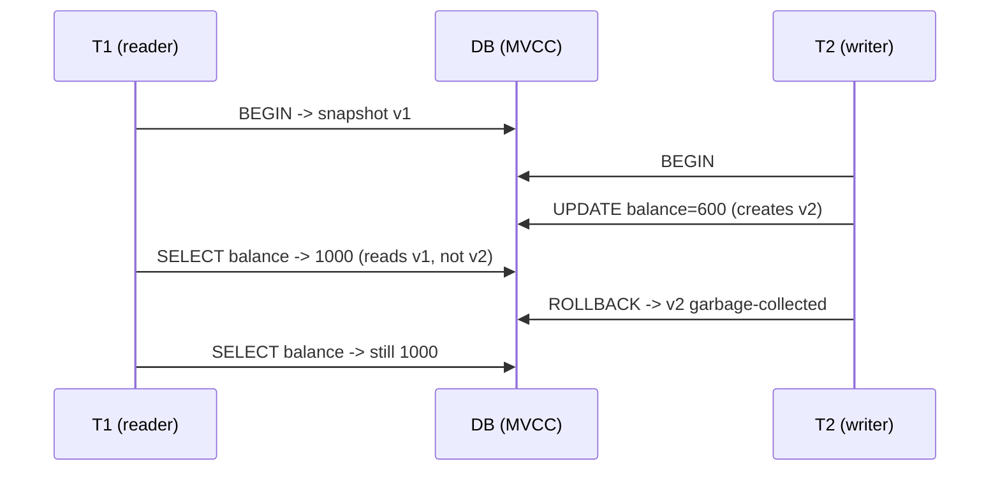

# 87. Isolation Levels

> Category: 10-Database-Design
> Related sections: 84-TACID (Transactions & ACID), 64-Locks & Blocking (if present), Window/aggregation sections.

---

## Fundamentals

**Isolation** is the "**I**" in ACID. It defines **what one transaction is allowed to see of another transaction's uncommitted or concurrent work**.

When two (or more) transactions run at the same time, the database must decide:

- Can `T2` see rows that `T1` changed but has **not committed**?
- Can `T2` see a **different value** for the same row depending on _when_ it looks?
- Can `T2` see **new rows appear / old rows disappear** between two queries inside the same transaction?

The SQL standard answers these questions through **four isolation levels**. Each level forbids a specific set of "bad readings", called **concurrency phenomena** (often called _anomalies_).

Isolation is a **balancing act**:

```
Correctness  <---- trade-off ---->  Concurrency / Performance
(stronger isolation)                  (weaker isolation)
```

---

## Why it exists

Without isolation, concurrent transactions can corrupt business logic:

- A bank balance is read as 1000 by two sessions, both add 100, both write 1100 → **one +100 is lost**.
- A booking system reports "3 seats free" to two customers, both book, both commit → **oversold**.
- A report reads a ledger _mid-transfer_ and totals disappear between two queries → **audit breaks**.

Isolation is therefore not a "nice to have" — it is what makes `COMMIT` meaningful under concurrency. One important precision: isolation controls **concurrent committed/uncommitted visibility**, not atomicity (that is what rollback is for) and not durability (that is `COMMIT` flush).

---

## The concurrency phenomena

### 1. Dirty read

Reading data written by a transaction that **later rolls back**. You saw a value that never officially existed.

```sql
-- Transaction A                        -- Transaction B
BEGIN;
UPDATE accounts SET balance = balance - 500 WHERE account_id = 1;
                                         BEGIN;
                                         -- READ UNCOMMITTED
                                         SELECT balance FROM accounts WHERE account_id = 1;
                                         -- 1500  <-- UNCOMMITTED data
ROLLBACK;                                -- A rolls back; balance is really 2000
                                         SELECT balance FROM accounts WHERE account_id = 1;
                                         -- now 2000
```

### 2. Non-repeatable read

Inside **one** transaction, the **same query returns a different value** for the same row, because another transaction **committed** in between.

```sql
-- T1                                     -- T2
BEGIN;
SELECT balance FROM accounts WHERE account_id = 1;
-- 2000
                                          UPDATE accounts SET balance = balance + 100 WHERE account_id = 1;
                                          COMMIT;
SELECT balance FROM accounts WHERE account_id = 1;
-- 2100  <-- same query, different answer inside the same transaction
```

### 3. Phantom read

Inside **one** transaction, the **same query returns a different set of rows**, because another transaction **inserted or deleted rows matching the predicate** and committed.

```sql
-- T1                                     -- T2
BEGIN;
SELECT COUNT(*) FROM orders WHERE status = 'pending';
-- 3
                                          INSERT INTO orders VALUES (999, 42, 'pending', 50.00);
                                          COMMIT;
SELECT COUNT(*) FROM orders WHERE status = 'pending';
-- 4  <-- a row "appeared" (a phantom)
```

> Interview trap: Non-repeatable read = the **row value changed**. Phantom read = a **row appeared/disappeared from the result set**. People mix these up constantly. The classic memory hook: phantom = _Ghost rows that exist and vanish_; non-repeatable = _same record, new content_.

### 4. (Not in the classic standard but vital) — Lost update

Two transactions read the same row, compute a new value, and both write. The **last writer overwrites the first**, one update silently disappears.

```sql
-- T1                                     -- T2
BEGIN;
SELECT balance FROM accounts WHERE account_id = 1;
-- 1000
                                          BEGIN;
                                          SELECT balance FROM accounts WHERE account_id = 1;
                                          -- 1000
UPDATE accounts SET balance = 1100 WHERE account_id = 1;   -- +100 applied
                                          UPDATE accounts SET balance = 1100 WHERE account_id = 1;  -- +100 applied AGAIN
COMMIT;                                    COMMIT;
-- Final balance: 1100. Expected 1200. One update is LOST.
```

### 5. Read skew (read bias)

A transaction reads **two related rows**, and a concurrent commit happens **between the two reads**. The transaction now sees a state that never existed as a whole (e.g. a transfer that moved money between two accounts — you see the money at the new owner but not removed from the old).

### 6. Write skew

Two transactions each **write different rows**, but both **base their decision on a predicate that both read**. Each write is legal on its own; the combination violates an invariant. **No classic isolation level below SERIALIZABLE prevents write skew** (this is the hardest anomaly to explain and the most common real-world failure — see _Scenario E_).

---

## The four ANSI isolation levels

| Level              | Dirty read | Non-repeatable read | Phantom read |
| ------------------ | ---------- | ------------------- | ------------ |
| `READ UNCOMMITTED` | possible   | possible            | possible     |
| `READ COMMITTED`   | prevented  | possible            | possible     |
| `REPEATABLE READ`  | prevented  | prevented           | possible\*   |
| `SERIALIZABLE`     | prevented  | prevented           | prevented    |

\*See the note below: several engines prevent phantoms even at `REPEATABLE READ`.

The rule is: **a level must prevent its row's phenomena** — implementations may prevent _more_ than the minimum.

> Common misconception: "SERIALIZABLE means the database runs transactions one after another." No. It means the **final outcome is equivalent to some serial order** — transactions can still run concurrently; the engine detects and aborts the interfering ones (or blocks them with locks).

---

## How it works internally

Two fundamentally different mechanisms produce isolation:

### A) Locking (pessimistic)

Transactions take locks:

- **Shared (S)** lock to read a row.
- **Exclusive (X)** lock to write a row.

| Isolation        | Read lock held                             | Result                              |
| ---------------- | ------------------------------------------ | ----------------------------------- |
| READ UNCOMMITTED | no read locks at all                       | dirty reads                         |
| READ COMMITTED   | until end of the **statement**             | value may change between statements |
| REPEATABLE READ  | until end of the **transaction**           | value can't change once read        |
| SERIALIZABLE     | read + **range/predicate locks** until end | no new rows can slip into the range |

Writers always block writers. In locking systems, **readers can block writers** and vice versa.

### B) MVCC — Multi-Version Concurrency Control (optimistic-ish)

Every change creates a **new version** of the row; old versions are kept around. Each transaction gets a **snapshot**:

- PostgreSQL, MySQL/InnoDB, Oracle, SQL Server (snapshot mode) are MVCC.
- Readers see the snapshot; writers create new versions.
- **Readers never block writers, writers never block readers** — but **two writers still can't touch the same row at once** (write-write conflicts remain).



The catch: on MVCC, **`REPEATABLE READ` = one snapshot for the whole session** → non-repeatable and phantom reads vanish (for normal queries). But the snapshot does **nothing** against write skew, and it doesn't help if your application reads-then-writes with a stale computed value.

---

## What each database actually does

> All behavior below is factual default behavior for the listed engines. Verify on your exact version.

| Engine             | Default level              | Notes                                                                                                                                                                                                                                                                                                   |
| ------------------ | -------------------------- | ------------------------------------------------------------------------------------------------------------------------------------------------------------------------------------------------------------------------------------------------------------------------------------------------------- |
| **PostgreSQL**     | `READ COMMITTED`           | `READ UNCOMMITTED` behaves like `READ COMMITTED` (never allows dirty reads). `REPEATABLE READ` = full snapshot at first query. Phantoms prevented for queries. **Write skew still possible** at RR. `SERIALIZABLE` uses **SSI** and can abort transactions with `40001` ("could not serialize access"). |
| **MySQL / InnoDB** | `REPEATABLE READ`          | Consistent (non-locking) reads use a snapshot → no phantoms for SELECT. Locking reads use **gap / next-key locks** → blocks inserts into scanned ranges at RR. `READ UNCOMMITTED` **can** produce dirty reads. `SERIALIZABLE` turns plain `SELECT`s into locking reads (when not in autocommit).        |
| **SQL Server**     | `READ COMMITTED` (locking) | Default = shared locks, released per statement → non-repeatable reads. `READ_COMMITTED_SNAPSHOT ON` → statement-level snapshot. `SNAPSHOT` isolation needs `ALLOW_SNAPSHOT_ISOLATION ON` → transaction snapshot (RR + no phantoms). `ROWLOCK`/`NOLOCK` hints let you override per query.                |
| **Oracle**         | `READ COMMITTED`           | Only `READ COMMITTED` and `SERIALIZABLE` supported. Statement-level read consistency (a snapshot per query). No dirty reads ever. Oracle `SERIALIZABLE` is really **snapshot isolation** → gives `ORA-08177` ("cannot serialize access") on write conflicts; **write skew still possible**.             |
| **SQLite**         | effectively `SERIALIZABLE` | Achieved via a database-wide lock — one writer at a time. Massive simplicity, low concurrency.                                                                                                                                                                                                          |

---

## Syntax — setting the isolation level

```sql
-- PostgreSQL: only legal as the FIRST statement of a transaction
BEGIN ISOLATION LEVEL SERIALIZABLE;
SELECT ... ;
COMMIT;
```

```sql
-- MySQL / MariaDB (session / global / transaction keyword variants)
SET SESSION TRANSACTION ISOLATION LEVEL READ COMMITTED;
SET GLOBAL  TRANSACTION ISOLATION LEVEL REPEATABLE READ;  -- for new sessions only
START TRANSACTION;                 -- level already applies
...
COMMIT;
```

```sql
-- MySQL: take the snapshot immediately at START (InnoDB, RR and above)
START TRANSACTION WITH CONSISTENT SNAPSHOT;
```

```sql
-- SQL Server: applies at SESSION level from that point on
SET TRANSACTION ISOLATION LEVEL SNAPSHOT;
BEGIN TRANSACTION;
...
COMMIT;
```

```sql
-- Oracle: must be the first statement in the transaction
SET TRANSACTION ISOLATION LEVEL SERIALIZABLE;
SELECT ... ;
COMMIT;
```

> Production pitfall: in **PostgreSQL**, `SET TRANSACTION ISOLATION LEVEL …` after the first real statement in the transaction raises an error, and `SET TRANSACTION` (standalone) does **not** affect the transaction the way other engines' session-level settings do — set it explicitly in your `BEGIN`.

---

## Sample Tables (used by the scenarios)

`accounts` — **grain:** one row = one bank account.

```sql
CREATE TABLE accounts (
  account_id INT PRIMARY KEY,
  owner_name VARCHAR(100) NOT NULL,
  balance    NUMERIC(12,2) NOT NULL DEFAULT 0
);

INSERT INTO accounts VALUES
  (1, 'Aisha', 2000.00),
  (2, 'Ben',   1500.00);
```

`orders` — **grain:** one row = one order.

```sql
CREATE TABLE orders (
  order_id    INT PRIMARY KEY,
  customer_id INT NOT NULL,
  status      VARCHAR(20) NOT NULL,          -- 'pending' | 'paid' | 'shipped'
  total       NUMERIC(10,2) NOT NULL
);

INSERT INTO orders VALUES
  (101, 1, 'pending', 45.00),
  (102, 1, 'pending', 12.50),
  (103, 2, 'paid',   200.00);
```

`doctor_shifts` — **grain:** one row = one doctor and one shift assignment.

```sql
CREATE TABLE doctor_shifts (
  doctor_id INT PRIMARY KEY,
  name      TEXT NOT NULL,
  on_call   BOOLEAN NOT NULL
);

INSERT INTO doctor_shifts VALUES
  (1, 'Dr. Rao',    true),
  (2, 'Dr. López',  false),
  (3, 'Dr. Chen',   false);
```

Invariant we need to protect: **at any time, at most one doctor is on call.**

---

## Scenario A — The last-minute double charge (dirty read)

Sales calls two customers for the same last remaining inventory item. Both are told "one left" — and both are charged. The charge falls back to "just checking" and is rolled back; the second customer is billed twice.

Bad approach (implicit, because an app that _hoped_ for `READ UNCOMMITTED` is usually fine):

```sql
-- BAD: dashboard/balance check that sees uncommitted money
-- MySQL / SQL Server
SET SESSION TRANSACTION ISOLATION LEVEL READ UNCOMMITTED;

BEGIN;
SELECT balance FROM accounts WHERE account_id = 2;   -- sees uncommitted -100
COMMIT;
```

Better approach — never let money logic depend on uncommitted writes:

```sql
-- BETTER: default READ COMMITTED or stronger. The reader only sees committed rows.
BEGIN;
SELECT balance FROM accounts WHERE account_id = 2;   -- 1500.00 always
COMMIT;
```

**Expected output** for the `READ COMMITTED` read: `1500.00`, no matter what runs concurrently.

> Interview trap: "Does `READ UNCOMMITTED` mean no locking?" No — **writes still take exclusive locks** in every engine. Only the _reader side_ drops its protection. Two writers on one row will still serialize at the lock.

---

## Scenario B — Bank transfer: the read-skew report

Requirement: a daily audit that lists account balances. It runs two queries.

```sql
-- BAD: audit query under READ COMMITTED (PostgreSQL default, for example)
BEGIN;
SELECT balance FROM accounts WHERE account_id = 1;   -- snapshot S1 -> 2000.00
-- (concurrently: transfer 500 from acct 2 to acct 1 commits)
SELECT balance FROM accounts WHERE account_id = 2;   -- snapshot S2 -> 1000.00
COMMIT;
```

Now the report shows a total that **never existed on disk** (2000 + 1000 = 3000 instead of the true 2500 + 1000 = 3500).

Better approach — one consistent view:

```sql
-- BETTER: snapshot the whole transaction
BEGIN ISOLATION LEVEL REPEATABLE READ;        -- PostgreSQL
SELECT balance FROM accounts WHERE account_id = 1;   -- 2000.00
SELECT balance FROM accounts WHERE account_id = 2;   -- 1500.00  (same snapshot)
COMMIT;
```

**Why it is better:** both reads come from one snapshot, so the report is a _consistent point-in-time picture_. The account _skew_ phenomenon (seeing "money in transit" half-applied) is gone.

---

## Scenario C — Booking seats: the phantom

A travel agency sells 3 seats on a flight. Two agents run the same check concurrently.

```sql
-- BAD: agent booking under an isolation level that allows phantoms
-- (classic READ COMMITTED)
BEGIN;
SELECT COUNT(*) FROM orders WHERE status = 'pending';   -- 3
-- ... decide "there is space" ...
INSERT INTO orders VALUES (999, 42, 'pending', 50.00);
COMMIT;
```

Two agents both read `3`, both insert, now 5 pending — the "3 seat limit" predicate is broken.

Better approach — lock the range you rely on:

```sql
-- BETTER: SERIALIZABLE (SSI in Postgres aborts the loser; row/range locks block elsewhere)
BEGIN ISOLATION LEVEL SERIALIZABLE;
SELECT COUNT(*) FROM orders WHERE status = 'pending';   -- 3
-- (concurrent insert now either waits, or this transaction is aborted with 40001)
INSERT INTO orders VALUES (999, 42, 'pending', 50.00);
COMMIT;   -- retry on 40001 in the app
```

**Expected output:** exactly one of the two agents commits; the other receives an error (PostgreSQL: `ERROR: could not serialize access due to read/write dependencies` / InnoDB: blocks until timeout / Oracle: `ORA-08177`) and must **retry**.

---

## Scenario D — Lost update

The classic "read, compute, write" bug.

```sql
-- BAD: read-then-compute-then-write
-- T1                                       -- T2
BEGIN;
SELECT balance FROM accounts WHERE account_id = 1;      -- 1000
                                          BEGIN;
                                          SELECT balance FROM accounts WHERE account_id = 1;  -- 1000
UPDATE accounts SET balance = 1000 + 100 WHERE account_id = 1;   -- 1100
                                          UPDATE accounts SET balance = 1000 + 100 WHERE account_id = 1;
                                          -- overwrites with 1100 as well
COMMIT;                                    COMMIT;
-- Final: 1100. Correct would be 1200.
```

Better approaches (choose by situation):

```sql
-- BETTER #1: atomic statement — server-side value, no read at all
UPDATE accounts SET balance = balance + 100 WHERE account_id = 1;

-- BETTER #2: pessimistic lock on the row
BEGIN;
SELECT balance FROM accounts WHERE account_id = 1 FOR UPDATE;   -- T2 now blocks here
-- compute +100 in the app
UPDATE accounts SET balance = 1100 WHERE account_id = 1;
COMMIT;

-- BETTER #3: optimistic concurrency with a version column
-- (WHERE includes last-known version; 0 rows affected => retry)
UPDATE accounts SET balance = 1100, version = version + 1
WHERE account_id = 1 AND version = 3;
```

**Expected outputs:** #1 and #2 end with `1200.00`. #3 leaves the caller to detect "0 rows affected" and retry with fresh data.

> Common misconception: "`REPEATABLE READ` prevents lost updates." Not by itself. If both transactions _read via snapshot_ and then _write computed values_, the storage engine happily commits both. In PostgreSQL specifically, `REPEATABLE READ` plus a blocking UPDATE will raise `40001` instead of silently losing data — but you must handle that error. The safest, portable answer is **never read-compute-write without a lock, atomic UPDATE, or version check**.

---

## Scenario E — Write skew: two on-call doctors — the SERIALIZABLE story

Two doctors each verify "I am the only one on call", then swap their own flag. Both see `count(on_call = true) = 1`; both commit **different rows**. Result: **two doctors on call**.

```sql
-- BAD: READ COMMITTED / REPEATABLE READ
-- T1                                        -- T2
BEGIN;
SELECT COUNT(*) FROM doctor_shifts WHERE on_call = true;   -- 1
                                           BEGIN;
                                           SELECT COUNT(*) FROM doctor_shifts WHERE on_call = true;   -- 1
UPDATE doctor_shifts SET on_call = false WHERE doctor_id = 1;   -- I go off
                                           UPDATE doctor_shifts SET on_call = false WHERE doctor_id = 1;   -- also
UPDATE doctor_shifts SET on_call = true  WHERE doctor_id = 2;   -- I go on
                                           UPDATE doctor_shifts SET on_call = true  WHERE doctor_id = 3;
COMMIT;                                    COMMIT;
-- Now BOTH doctor 2 AND doctor 3 are on call. The invariant is dead.
```

No row lock blocks anything here: the two transactions **never write the same rows**. The predicate ("at most one on call") was violated.

Better approaches:

```sql
-- BETTER #1: lock the predicate's result set (portable, works on any DB)
BEGIN;
SELECT * FROM doctor_shifts WHERE on_call = true FOR UPDATE;   -- T2 blocks here
-- now we KNOW we are alone; update safely
UPDATE doctor_shifts SET on_call = false WHERE doctor_id = 1;
UPDATE doctor_shifts SET on_call = true  WHERE doctor_id = 2;
COMMIT;

-- BETTER #2: SERIALIZABLE — let the engine keep the invariant
BEGIN ISOLATION LEVEL SERIALIZABLE;      -- PostgreSQL: SSI
-- ... same reads and updates ...
COMMIT;   -- one transaction gets 40001 and retries; the invariant never breaks
```

**Why BETTER #2 works:** PostgreSQL's **SSI** tracks read/write and write/read dependencies between _read-write transactions_ and aborts one when a serial order cannot be proven. Oracle's `SERIALIZABLE` would NOT save this scenario; MySQL's `SERIALIZABLE` relies on locking the scanned rows, and `SELECT` without `FOR UPDATE` in autocommit is non-locking — so **do not assume your engine's `SERIALIZABLE` prevents write skew**; verify with a test.

> Production pitfall: write skew is the anomaly that silently destroys data invariants (double-booking, double-payouts, two people on call). It happens exactly when two transactions trust a predicate instead of locking rows. The two durable fixes are locking the predicate rows or using a `SERIALIZABLE`-with-abort engine (PostgreSQL SSI).

---

## A real "run it yourself" experiment

Open two database sessions and execute in order. Use PostgreSQL:

**Session 1**

```sql
BEGIN ISOLATION LEVEL READ COMMITTED;
SELECT balance FROM accounts WHERE account_id = 1;
```

**Session 2**

```sql
BEGIN;
UPDATE accounts SET balance = balance + 100 WHERE account_id = 1;
COMMIT;
```

**Session 1 (again)**

```sql
SELECT balance FROM accounts WHERE account_id = 1;  -- now 2100 : non-repeatable read
ROLLBACK;
```

Repeat the same experiment with `BEGIN ISOLATION LEVEL REPEATABLE READ` — Session 1 still sees `2000` both times.

---

## NULL behavior

Isolation interacts with `NULL` in ways people forget:

```sql
-- Dirty "NULL" read: T1 flips a column to NULL but rolls back
-- T1 (uncommitted)                       -- T2 at READ UNCOMMITTED (MySQL/SQL Server)
UPDATE accounts SET owner_name = NULL WHERE account_id = 1;
                                          SELECT owner_name FROM accounts WHERE account_id = 1;
                                          -- NULL  <- a value that never existed
ROLLBACK;
```

Pointers:

- **Visibility is version-based, not value-based.** A rolled-back update that set a column to `NULL` leaves the old row version; snapshots simply don't see the version. Likewise a deleted row still "exists" in an older snapshot even if it only ever contained `NULL`s.
- **Non-repeatable reads can be value→NULL or NULL→value.** Under `READ COMMITTED`, inside one transaction `SELECT manager_id …` can legitimately return `9`, then `NULL`, then `9` again as other transactions commit.
- `WHERE deleted_at IS NULL` for soft deletes is a phantom-read victim: concurrently soft-deleted rows disappear from your result set between statements unless your snapshot covers both.
- The classic `NOT IN (NULL)` trap (`WHERE id NOT IN (SELECT ... )` returns nothing when the subquery contains `NULL`) is about **three-valued logic**, not isolation — but a concurrent insert of a row whose join key is `NULL` can very visibly change a `NOT IN` result across statements even under a stable snapshot, so don't blame the isolation level for it.
- Mirror-on-NULL: `COUNT(*)` and `COUNT(col)` differences are normal SQL semantics; isolation only decides _when_ the counted set is frozen in time.

---

## Edge cases

- **Statement vs transaction snapshot boundary.** At `READ COMMITTED` on MVCC, each statement gets a fresh snapshot → two statements can see "different" worlds. At `REPEATABLE READ`/`SNAPSHOT`/`SERIALIZABLE` (PostgreSQL, MySQL InnoDB, SQL Server SNAPSHOT, Oracle SERIALIZABLE), the snapshot is taken at the **first** read of the transaction.
- **Autocommit.** With autocommit on, each statement is its own transaction — isolation is nearly invisible. This is why code review of isolation levels only makes sense at the _transaction_ boundary.
- **`SET TRANSACTION` must be first.** PostgreSQL: error if you `SET TRANSACTION` after an earlier statement; SQL Server: applies at session scope; MySQL: must precede `START TRANSACTION`.
- **Locking reads are not covered by snapshots.** `SELECT … FOR UPDATE` / `SELECT … LOCK IN SHARE MODE` reads the **latest committed version** even under a snapshot. This is often exactly what you want (Scenario D/E) — but it can surprise people holding a snapshot expectation.
- **Savepoints, nested transactions.** The isolation level is the level of the _outermost_ transaction; savepoints do not change isolation between themselves.
- **Replicas / hot standby.** Read replicas typically serve committed data with snapshot semantics and no `SERIALIZABLE` writes; do not assume secondary-node reads have the same guarantees.

---

## Common mistakes

1. **Assuming `SERIALIZABLE` is the default.** It is the default in almost no major engine (InnoDB's RR, everyone else's RC).
2. **Coupling "isolation level" to "performance level".** Lower level ≠ automatically fast; higher level ≠ automatically correct-logic-proof.
3. **Believing RR prevents write skew.** It does not (except matching Postgres abort-on-conflict behavior for some cases).
4. **Thinking `READ UNCOMMITTED` removes all locks.** Writers still lock.
5. **Forgetting the retry logic.** SSI/Oracle SERIALIZABLE _require_ the client to retry on `40001`/`ORA-08177`. Without retry, a "correct" level becomes a flaky app.
6. **Applying SQL Server `NOLOCK` hint broadly** and calling it an "index hint". `NOLOCK` = `READ UNCOMMITTED` = dirty reads.
7. **Choosing an isolation level _inside_ an app without testing concurrent behaviors.** Levels are a _negotiation between engines and workloads_, not a checkbox.
8. **Confusing `READ COMMITTED` "snapshot" with `REPEATABLE READ`.** In MySQL, `READ COMMITTED` reads the newest committed version per statement — that's still a non-repeatable read.

---

## Production pitfalls

> Production pitfall #1 — **long-running snapshot transactions.** Every snapshot keeps its table versions alive. In PostgreSQL this means **dead tuples and table bloat** (vacuum lag); in MySQL/InnoDB the undo log grows; in Oracle you hit undo retention; in SQL Server SNAPSHOT the version store in `tempdb` grows. A report that "holds a snapshot for 2 hours because it's slow to fetch rows from a remote API" will silently degrade the entire cluster. Fix: keep transactions short; stream; snapshot only what you need.

> Production pitfall #2 — **dirty reads for "speed".** `NOLOCK`/`READ UNCOMMITTED` on finance, e-commerce invoicing, or any "what does the customer owe" query yields demonstrably wrong numbers during concurrent commits. Cache aggressively if you need speed — don't read garbage.

> Production pitfall #3 — **unhandled serialization failures.** Turning on `SERIALIZABLE` without a retry loop is a guaranteed outage during bursts.

> Production pitfall #4 — **deadlocks between writers.** Serializable-ish behavior escalates lock hold time; deadlocks become more likely. Deadlock retry (with fresh transactions) is different from serialization-failure retry — know which one your engine is raising.

---

## Performance implications

Do **not** trust generic claims like "`READ UNCOMMITTED` is always faster" or "`SERIALIZABLE` is always too slow". Reality:

- **READ UNCOMMITTED** — no snapshot/version checks on reads, but you can read garbage. Often _not_ actually faster for short OLTP queries; the marginal "win" is avoiding version-set scans.
- **READ COMMITTED** — the most common default; each statement takes a small snapshot. Cheap for OLTP, but multiple statements in one transaction pay for multiple snapshots.
- **REPEATABLE READ / SNAPSHOT** — one snapshot per transaction, but keeps old versions alive for the transaction's lifetime → bloat, undo pressure, and larger garbage-collection work _after_ commit/vacuum.
- **SERIALIZABLE (SSI)** — extra dependency tracking (rw/wr/ww) on every read-write transaction, plus a nonzero chance of abort→retry. In the locking engines it transforms reads into range-locked reads → **higher lock contention and deadlock risk**.

Real guidance:

- If an invariant depends on a predicate, **first try a `FOR UPDATE` on the qualifying rows** — it's cheaper than SERIALIZABLE.
- Use SERIALIZABLE only where correctness genuinely demands it (booking, payments, idempotency keys), and build retry.
- **Measure — always.** `EXPLAIN (ANALYZE…)` shows plans, but isolation-level cost shows up as _locking waits_, _version-storage growth_, and _abort rates_. Look at:
  - PostgreSQL: `EXPLAIN`, `pg_stat_activity`, `pg_locks`, autovacuum bloat stats
  - MySQL: `performance_schema.data_locks`, InnoDB lock waits, `SHOW ENGINE INNODB STATUS`
  - SQL Server: `sys.dm_tran_locks`, `sys.dm_exec_requests`
  - Oracle: `v$lock`, `v$session`, undo stats
- Benchmark the **same workload at each level**, not isolated `SELECT`s.

---

## Interview traps

- "What is the default isolation level of PostgreSQL / MySQL / SQL Server / Oracle?" → RC / RR / RC / RC.
- "Does `REPEATABLE READ` prevent phantoms per the standard?" → The standard says _possible_; engines differ (InnoDB/PostgreSQL effectively prevent them for consistent reads; SQL Server RR does not, SERIALIZABLE does).
- "Can two transactions update the same row at the same time?" → No — exclusive locks block the second writer regardless of isolation.
- "Oracle SERIALIZABLE — is it really serializable?" → It's snapshot isolation; write skew is still possible; conflicts produce `ORA-08177`.
- "What is the difference between non-repeatable read and phantom read?" → Value change vs result-set membership change.
- "Why is a plain `SELECT` inside MySQL `SERIALIZABLE` (autocommit off) different from PostgreSQL?" → MySQL locks it (`LOCK IN SHARE MODE` behavior); PostgreSQL instead aborts conflicting transactions.

---

## Best practices

1. **Set isolation explicitly** at the transaction boundary — never rely silently on engine defaults when correctness matters.
2. **Keep transactions short**; an isolation level is only as safe as the time it's held.
3. **Protect invariants with locks (`FOR UPDATE`) or version columns**, not with optimistic snapshots alone.
4. **Add a retry layer** for engines that abort on conflicts (PostgreSQL `40001`, Oracle `ORA-08177`).
5. **Never read business-critical totals** at `READ UNCOMMITTED`/`NOLOCK`.
6. **Choose the _minimum_ level that preserves your invariant**, then _prove_ it with a two-session test before production (copy Scenario A–E).
7. On MVCC engines, prefer `REPEATABLE READ`/`SNAPSHOT` for **multi-statement read reports** that must be internally consistent.
8. When locking reads block a low-concurrency path, prefer **optimistic concurrency (version column) + retry**.
9. Monitor **abort rate, lock wait time, and deadlock count** in production; these are the real signals isolation is too strong (or too weak) for your workload.

---

## Comparison table — final cheat sheet

|                                            | Dirty read              | Non-rep. read | Phantom                                    | Lost update (read-compute-write)                     | Write skew                                                         |
| ------------------------------------------ | ----------------------- | ------------- | ------------------------------------------ | ---------------------------------------------------- | ------------------------------------------------------------------ |
| READ UNCOMMITTED                           | ❌ blocked only by luck | possible      | possible                                   | possible (bad)                                       | possible                                                           |
| READ COMMITTED                             | prevented               | possible      | possible                                   | possible (bad)                                       | possible                                                           |
| REPEATABLE READ                            | prevented               | prevented     | engine-dependent (often prevented on MVCC) | possible in theory; engine abort may save (Postgres) | possible                                                           |
| SNAPSHOT (non-standard; SQL Server/Oracle) | prevented               | prevented     | prevented (snapshot)                       | possible                                             | possible                                                           |
| SERIALIZABLE                               | prevented               | prevented     | prevented                                  | prevented (via blocking or abort)                    | prevented only by real SSI or by locking engine behavior — verify! |

---

# Interview Questions

> Intentionally **no answers here** — treat these as practice. The section above contains every fact you need to reason them out.

## Beginner

1. What does the "I" in ACID mean? Give a one-sentence definition.
2. Name the four standard SQL isolation levels.
3. What is a dirty read?
4. Which isolation level guarantees no dirty reads? Name two engines and their default isolation levels.
5. True or false: `READ UNCOMMITTED` means the database performs no locking at all.

## Intermediate

6. Explain the difference between a non-repeatable read and a phantom read.
7. Why does PostgreSQL's `READ UNCOMMITTED` still not show dirty reads?
8. Oracle supports only `READ COMMITTED` and `SERIALIZABLE`. Why is its SERIALIZABLE called "snapshot isolation" rather than true serializability?
9. Under which isolation level would the _on-call doctors_ invariant break? Why do row locks not fix write skew?
10. What is the difference between `READ_COMMITTED_SNAPSHOT ON` and the `SNAPSHOT` isolation level in SQL Server?

## Advanced

11. Explain how PostgreSQL's SSI detects a serialization anomaly without locking all rows.
12. Why can `REPEATABLE READ` still lose updates, and why does PostgreSQL raise `40001` in some of those cases while `READ COMMITTED` (with EPQ) does not?
13. Describe how MVCC stores multiple row versions and what happens at `COMMIT`/before `VACUUM` (PostgreSQL) vs undo (MySQL/Oracle) vs `tempdb` version store (SQL Server).
14. Compare three strategies against lost updates: atomic `UPDATE … SET x = x + n`, `SELECT … FOR UPDATE`, and optimistic version columns. Which one(s) would you pick for a hot account-balance table and why?
15. Does MySQL's `SERIALIZABLE` work by abort or by blocking? Does PostgreSQL's? What consequence does that difference have for application code?

## Scenario Based

16. A transfer of 500 from account X to Y commits _between_ two `SELECT`s in your audit report under `READ COMMITTED`. Show the wrong figures that would appear and the level that fixes it.
17. Two agents read `COUNT(*) WHERE status='pending' = 3` and both book a seat. Which phenomenon is that, and which two fixes stop it?
18. An app on Oracle uses `SET TRANSACTION ISOLATION LEVEL SERIALIZABLE` and deadlocks nightly. Where would you look first: the lock wait stats or the retry code? Why?
19. You see growing tempdb/undo/vacuum bloat but no lock waits. What isolation setting is your codebase probably using, and which level would you recommend instead?

## Tricky

20. "Isolation levels tell you what the _engine_ must prevent, not what your _application_ will observe." Agree or disagree — defend either side.
21. Does `REPEATABLE READ` in InnoDB prevent phantom reads for `SELECT` but not for `SELECT … FOR UPDATE`? Explain the gap/next-key locking picture.
22. A transaction reading `WHERE deleted_at IS NULL` under `REPEATABLE READ` does not see a row that a concurrent transaction deleted _and committed_. Is that a phantom read, a dirty read, or correct behavior? Why?
23. You run the same query at `SERIALIZABLE` in PostgreSQL and it returns rows; your colleague says "not serializable then." Why is that conclusion wrong?

## Output Prediction

24. Transaction A reads balance 1000 at `READ COMMITTED`; B commits a +200. What does A's second `SELECT` see — under PostgreSQL, under MySQL? Why does the answer differ, if at all?
25. Draw the state table for T1 and T2 from Scenario D (lost update) under `REPEATABLE READ` in PostgreSQL. Which transaction commits, which aborts, and with which error?
26. Predict the final balance if T1 and T2 both run `UPDATE accounts SET balance = balance + 100 WHERE account_id = 1` concurrently under `READ COMMITTED` in PostgreSQL. Justify with EPQ.

## Debugging

27. Your nightly reconciliation report gives different totals each run. Sessions show high lock saturation. The report takes 90 minutes. Is the isolation level wrong, or the transaction length wrong? Design the experiment to tell them apart.
28. A booking app works in dev (no load) and double-books in prod. What isolation level are you looking at, and what two-session test reproduces it?
29. Someone turned on `SERIALIZABLE` and the app exploded with `could not serialize access`. List the retry rules you'd enforce and the monitoring you'd add before re-enabling.

## Performance

30. Why might `READ COMMITTED` be _slower_ than `REPEATABLE READ` for a long-lived report under MVCC, despite being "weaker"?
31. What metrics — not just `EXPLAIN` — tell you an isolation level is costing too much? Name the DMV/system view for each major engine.
32. "SERIALIZABLE is always slower than READ COMMITTED." Is that a safe engineering claim? Explain what actually determines the cost, and how you would measure it with a workload test.

---

_Cross-references: transactions/ACID (§84) for COMMIT/ROLLBACK semantics; NULL three-valued logic section for `NOT IN`+NULL; locking & deadlock section for lock types; indexes section for why range locks depend on index availability; optimization section for `EXPLAIN`/`EXPLAIN ANALYZE` practice._
