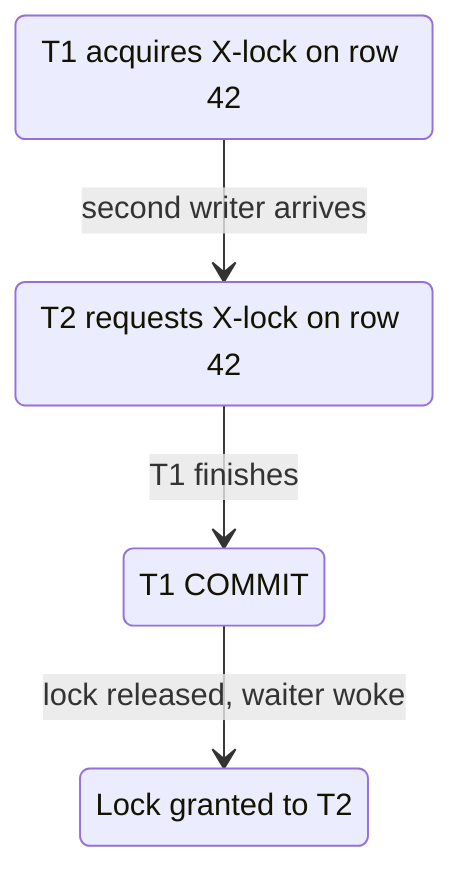

# 88. Locks and Blocking

> Category: 10-Database-Design
> Related sections: 85-Transactions (COMMIT/ROLLBACK semantics)Section generated at `sql-handbook/10-Database-Design/88-Locks-and-Blocking.md` (~800 lines).

Covers: fundamentals, lock/latch/deadlock/starvation vocabulary, internal lock-manager + wait-for graph working, S/X/U/intent/gap/schema lock modes, granularity & escalation, per-engine behavior (PostgreSQL, MySQL/InnoDB, SQL Server, Oracle, SQLite), locking-read syntax and timeouts per engine, advisory locks, 7 scenarios (blocking, deadlock, MVCC readers, read-modify-write, SKIP LOCKED queue, DDL/MDL outage, lock escalation), run-it-yourself experiment, NULL behavior, edge cases, mistakes, production pitfalls, measurement-first performance guidance, engine comparison table, best practices, and 39 interview questions across all 8 categories (unanswered, as practice). Cross-references 85–87 instead of duplicating transaction/isolation content, and includes BAD vs BETTER patterns per scenario.
e **two mechanisms** databases use to deliver those results. In locking engines, "isolation" is literally implemented by _how long_ locks are held. In MVCC engines, many reads are served from snapshots and take **no locks at all**.

The single most important sentence in this section:

> **Writers always conflict with writers on the same row, no matter which engine or isolation level you use.**

Everything else — "readers block writers", "readers never block writers", "range locks", "gap locks" — is engine-specific detail layered on top of that rule.

---

## Why locks exist

Without locks (and MVCC), concurrent transactions corrupt each other's work:

| Problem                    | What happens without protection                                                             |
| -------------------------- | ------------------------------------------------------------------------------------------- |
| **Lost update**            | Two transactions read 1000, both add 100, both write 1100. One +100 vanished.               |
| **Torn/inconsistent read** | A reader sees half of a multi-part write at the wrong moment.                               |
| **Overbooking**            | Two agents read `stock = 1`, both commit a sale. The inventory now shows −1.                |
| **Duplicate allocation**   | Two workers claim the same task from a job queue and both process it.                       |
| **Schema corruption**      | An `ALTER TABLE` runs while inserts are in flight → engine must forbid it, or data is lost. |

A lock makes the second transaction **wait instead of corrupt**. Waiting is the price of correctness; the art of SQL performance engineering is making that price small and rare.

---

## Vocabulary: lock vs latch vs blocking vs deadlock vs starvation

People use these interchangeably; production debugging fails when you do.

| Term           | Meaning                                                                                                                                                                                                                       | Analogy                                                                                                                       |
| -------------- | ----------------------------------------------------------------------------------------------------------------------------------------------------------------------------------------------------------------------------- | ----------------------------------------------------------------------------------------------------------------------------- |
| **Lock**       | Long-lived, _transactional_ permission on data (row/range/table). Acquired for a statement or transaction, released at COMMIT/ROLLBACK. Concurrency control.                                                                  | Reservation system for data you care about.                                                                                   |
| **Latch**      | Microsecond-lived, _transactionless_ protection on internal structures (buffer pages, index nodes). The engine uses latches to make its own data structures safe; you almost never see them, except as a performance symptom. | Someone holding a door shut while rearranging the room.                                                                       |
| **Pin**        | A reference that keeps a buffer page resident (not insertable into a buffer-pool cache slot).                                                                                                                                 | A bookmark that keeps a page from being thrown out.                                                                           |
| **Blocking**   | Transaction T2 is waiting for a lock held by T1. Normal, temporary, resolvable when T1 finishes.                                                                                                                              | Waiting your turn.                                                                                                            |
| **Deadlock**   | T1 waits on a lock held by T2, and T2 waits on a lock held by T1. Neither can finish; the engine kills one (the "victim").                                                                                                    | Two cars nose-to-nose in a one-way lane.                                                                                      |
| **Starvation** | A transaction never gets a lock because other transactions keep grabbing it first (e.g. a reader keeps letting new writers in). The transaction waits forever without a circular wait.                                        | Someone at the back of a queue where everyone keeps cutting in. Largely a theoretical / hysteresis concern in modern engines. |

> Interview trap: "What's the difference between a deadlock and a long block?" A deadlock involves a **cycle in the wait-for graph** and the engine must abort someone. A long block is just T1 holding a lock a "long" time; nothing is wrong with the lock graph — T1 will eventually COMMIT/ROLLBACK. Deadlock victims receive an **error** (PostgreSQL: `40P01`, MySQL: `1213` (ER_LOCK_DEADLOCK) / `42S22`, SQL Server: error 1205, Oracle: ORA-00060); a simple block usually just resolves on its own or on timeout.

---

## Internal working: how the lock manager actually behaves

1. Every transaction that takes a lock asks the **lock manager** (a component inside the engine, invisible to your SQL) for a lock on a resource (row id, index key, page id, table id).
2. The lock manager keeps a **lock table / hash table** mapping each resource to the set of lock modes and the transactions holding them.
3. Before granting a new lock, it checks the **compatibility matrix**:
   - Compatible → granted immediately.
   - Incompatible → the requestor is put on a **wait queue** for that resource.
4. When the holder commits/rolls back (or releases the lock), the lock manager wakes the waiters and grants the next compatible one.
5. The engine tracks every "waiting-on" relation. Across all sessions this forms the **wait-for graph**. If the graph contains a **cycle**, the engine detects a deadlock, picks a victim, aborts the victim's _current statement_ (or whole transaction, depends on engine), releases its locks, and lets the survivor continue. A background **deadlock monitor** runs periodically (SQL Server ~every 5 s; PostgreSQL `deadlock_timeout` 1 s default; InnoDB instantly on detecting the cycle at the moment the wait is attempted).



Lock _escalation_ (SQL Server): when one transaction accumulates too many fine-grained locks (row/page, default threshold ~5000), the engine tries to exchange them for one table lock. This reduces memory pressure in the lock manager but dramatically increases blocking — everyone on that table now waits.

> Common misconception: "Locks are granted for the duration of a single statement." Depends on the isolation level. Under PostgreSQL/MySQL default READ COMMITTED **writes** hold their exclusive row locks until COMMIT (to protect the transaction's atomicity). **Read** locks, where they even exist, may be released at statement end (SQL Server READ COMMITTED) or never taken at all (MVCC). See the isolation-level table below.

---

## Lock types: the S/X model and the full modes

### The core: shared vs exclusive

| Mode          | Short | What it allows                                                        | Held by                                                                 |
| ------------- | ----- | --------------------------------------------------------------------- | ----------------------------------------------------------------------- |
| **Shared**    | S     | Other reads (S locks) can still be granted; no writer can be granted. | `SELECT` (in locking engines), `SELECT FOR SHARE`, `LOCK IN SHARE MODE` |
| **Exclusive** | X     | No other lock (S or X) on the same resource is granted.               | `INSERT`, `UPDATE`, `DELETE`, `SELECT FOR UPDATE`                       |

Compatibility matrix:

| Request / Held | S          | X        |
| -------------- | ---------- | -------- |
| **S**          | ✅ granted | ❌ waits |
| **X**          | ❌ waits   | ❌ waits |

So: S+S coexist (multiple readers), X is exclusive against everyone. That is the entire rule; the more exotic modes are just specialized flavors of it.

### The full cast of modes

| Mode                                  | Meaning                                                                                                                                                                   | Where it appears                                                                                          |
| ------------------------------------- | ------------------------------------------------------------------------------------------------------------------------------------------------------------------------- | --------------------------------------------------------------------------------------------------------- |
| **U (Update)**                        | Upgradeable S: multiple U can coexist, but the first U may be promoted to X later; blocks other U.                                                                        | SQL Server: prevents "two readers both later want to write" deadlocks on `UPDATE` of filtered rows.       |
| **IS / IX / SIX / SIU / IU** (Intent) | "I intend to take finer locks inside this table/page." Stored at table level so two transactions don't need to scan every row lock to know if they conflict.              | All engines internally; visible in SQL Server `sys.dm_tran_locks`, MySQL `performance_schema.data_locks`. |
| **Sch-S / Sch-M** (Schema)            | Sch-S: allows nearly anything (normal queries), blocks DDL at Sch-M scope; Sch-M: exclusive schema lock for DDL.                                                          | SQL Server `ALTER TABLE`, `DROP`, etc.                                                                    |
| **BU (Bulk update)**                  | Allows concurrent bulk load into the same table (tablock).                                                                                                                | SQL Server `BULK INSERT`.                                                                                 |
| **Gap / next-key**                    | Locks the _space between_ index records to stop phantoms, or the record + following gap.                                                                                  | MySQL/InnoDB at `REPEATABLE READ` for locking reads & writes.                                             |
| **Predicate / key-range**             | Locks ranges that match a `WHERE` predicate.                                                                                                                              | SQL Server at `SERIALIZABLE`; PostgreSQL `SERIALIZABLE` uses trailing, abort-based checks instead.        |
| **ACCESS EXCLUSIVE …**                | PostgreSQL's 8 table-level modes, from weakest (`ACCESS SHARE`, held by `SELECT`) to strongest (`ACCESS EXCLUSIVE`, held by `ALTER/DROP/TRUNCATE`, blocks even `SELECT`). | PostgreSQL only.                                                                                          |
| **Advisory**                          | Application-defined locks on arbitrary integer/name keys, not tied to any row.                                                                                            | PostgreSQL `pg_advisory_lock()` etc.                                                                      |
| **Enqueue (TX)**                      | Oracle's row-lock queue (`enq: TX – row lock contention`).                                                                                                                | Oracle only (implementation detail you see in `v$session_wait`).                                          |

### Lock granularity

Locks can be taken at (from finest to coarsest): **row → key → page → extent × index → table → database**.

- Watch out: "key" in this table means _index entry_, MySQL/InnoDB and SQL Server store row locks on the clustered index key. If the table has no usable index, the engine must lock **pages/tables** instead of rows — a query that "should" only touch 3 rows can lock the whole table.

> Production pitfall (all engines): a write with a `WHERE` that cannot use an index (e.g. `WHERE status != 'closed'` with low selectivity or no index) may lock **every row it scans**, not just the rows it changes. That single report-UPDATE can block the entire table's OLTP traffic. This is why sargable predicates and covering indexes are locking features, not just performance features — see 77-SARGability.

### Relation to isolation levels (the policy)

| Isolation level  | Read locks                                                                                                                                          | Write (X) locks             |
| ---------------- | --------------------------------------------------------------------------------------------------------------------------------------------------- | --------------------------- |
| READ UNCOMMITTED | None (dirty reads possible).                                                                                                                        | Held until COMMIT/ROLLBACK. |
| READ COMMITTED   | Locking engines: S locks released at **statement end**. MVCC: plain SELECT takes none.                                                              | Held until COMMIT/ROLLBACK. |
| REPEATABLE READ  | Locking engines: S locks held to **transaction end**. MVCC: none (snapshot). MySQL locking reads add gap/next-key locks.                            | Held until COMMIT/ROLLBACK. |
| SERIALIZABLE     | Locking engines: S locks + range/predicate locks held to transaction end. MVCC (PostgreSQL SSI): none — aborts instead; (Oracle): snapshot + abort. | Held until COMMIT/ROLLBACK. |

Everything in this row/lock table is the _locking_ theory. The next section is the crucial twist: most production engines are MVCC, which changes read locking almost entirely.

---

## How each engine actually locks

> All statements below describe the documented **default** behavior of the listed engines. Always verify on your own version and workload.

### PostgreSQL (MVCC + heavyweight locks)

- Plain `SELECT` takes **no row locks** and is never blocked by writers. Readers never block writers, writers never block readers — as long as the schema is stable.
- `UPDATE`/`DELETE`/`INSERT` take row-level X locks (four sibling modes: `FOR KEY SHARE`, `FOR SHARE`, `FOR NO KEY UPDATE`, `FOR UPDATE`) **held until the end of the transaction**.
- Conflicts are detected dynamically: under `REPEATABLE READ`, if a concurrent transaction committed a conflicting change to a row you also changed, you abort with `40001` ("could not serialize access") rather than block.
- Table-level locks for DDL: `SELECT` takes `ACCESS SHARE`; `ALTER TABLE`/`DROP`/`TRUNCATE` need `ACCESS EXCLUSIVE`, which conflicts with _everything_ — a long-running `ALTER TABLE` will block even trivial `SELECT`s once it starts (but the `ALTER` itself waits for all running statements first).
- Deadlock detection every `deadlock_timeout` (default 1 s); `lock_timeout` (default 0 = wait forever) applies to locks only, not deadlock resolution.
- Visibility: `pg_locks`, `pg_stat_activity`, `pg_blocking_pids()`.

### MySQL / InnoDB (MVCC + record/gap locking)

- Consistent (non-locking) reads use a snapshot via the undo log: they take **no row locks** and are never blocked by writers, except by **metadata locks** (see below).
- Locking reads and writes (`UPDATE`, `DELETE`, `SELECT FOR UPDATE/SHARE`) take **record locks** on the clustered index, and — at `REPEATABLE READ` (the InnoDB default) — **gap/next-key locks** on the ranges they scan, precisely to stop phantoms. A next-key lock on a range can block an `INSERT` into the empty space _inside_ that range even though no row exists yet.
- If a statement cannot use an index, it scans the table and can lock **every row scanned** — and `UPDATE`/`DELETE` do exactly that when there is no matching index help.
- Lock waits honor `innodb_lock_wait_timeout` (default 50 s). On timeout: SQLSTATE `HY000`, error `1205` "Lock wait timeout exceeded".
- Deadlocks are detected immediately when detected during a wait and aborted with error `1213`. See `SHOW ENGINE INNODB STATUS` / `performance_schema.data_locks`.
- **Metadata locks (MDL)**: every statement holds an MDL S-lock on the tables it uses _until the transaction ends_; `ALTER TABLE` needs the MDL X-lock and therefore **waits for every in-flight transaction**, and while it waits, new queries behind it pile up on "Waiting for table metadata lock". This is the #1 source of mysterious MySQL blocking in production.

### SQL Server (locking-first, MVCC optional)

- Default (`READ COMMITTED`): `SELECT` takes **shared locks per statement**, released at the end of each statement — so another transaction's `UPDATE` can proceed between two statements in the same transaction (non-repeatable reads), and a long-running `SELECT` can be blocked by a writer and _can_ block a writer on the same rows while the statement runs.
- `REPEATABLE READ` holds S locks to transaction end; `SERIALIZABLE` adds key-range/predicate locks.
- `READ_COMMITTED_SNAPSHOT = ON` turns READ COMMITTED into a statement-level snapshot (readers never block writers, but a writer blocking a writer remains); `ALLOW_SNAPSHOT_ISOLATION = ON` enables full `SNAPSHOT`.
- Locks escalate row→page→table at ~5000 locks; disable per-table with `ALTER TABLE ... SET (LOCK_ESCALATION = DISABLE)`.
- Deadlock victim chosen by `DEADLOCK_PRIORITY` (default = whatever costs least undo). Error 1205.
- Visibility: `sys.dm_tran_locks`, `sys.dm_exec_requests` (`blocking_session_id`), `sys.dm_os_waiting_tasks`.

### Oracle (undo-based MVCC)

- Readers never block writers and writers never block readers, always (statement-level read consistency in `READ COMMITTED`).
- Writer vs writer on the same row: the second writer waits on `enq: TX – row lock contention`. `FOR UPDATE` can add `NOWAIT` or `WAIT n`.
- Deadlocks are unblocked immediately (Oracle aborts the statement that would deadlock) with `ORA-00060`.
- DDL locks: `ALTER`/`DROP` can block concurrent DML depending on lock modes; Oracle renames/moves can do `ONLINE`.
- Visibility: `v$lock`, `v$session`, `v$locked_object`, `dba_waiters`, `dba_blockers`.

### SQLite

- **Database-level locks**: one writer, one reader-ish at a time, with a short writer-grant window and `SQLITE_BUSY` under contention. Correct by construction, but concurrency is a multiple of "how fast can you COMMIT".

---

## Syntax: statements that take/control locks

There is no `LOCK` keyword in ANSI SQL. Locking is _triggered by_ statements and _tuned by_ directives and transaction boundaries.

### Locking reads (the tactical tool)

```sql
-- PostgreSQL
BEGIN;
SELECT * FROM inventory WHERE product_id = 7 FOR UPDATE;        -- X lock on matched rows
SELECT * FROM inventory WHERE product_id = 7 FOR NO KEY UPDATE; -- weaker, for FK-safe updates
SELECT * FROM inventory WHERE product_id = 7 FOR SHARE;          -- S lock
SELECT * FROM inventory WHERE product_id = 7 FOR KEY SHARE;      -- weakest, for FK checks
SELECT * FROM inventory WHERE product_id = 7 FOR UPDATE SKIP LOCKED; -- skip rows someone owns
SELECT * FROM inventory WHERE product_id = 7 FOR UPDATE NOWAIT;  -- error 55P03 if blocked (PG 9.3+)
COMMIT;
```

```sql
-- MySQL / MariaDB
START TRANSACTION;
SELECT * FROM inventory WHERE product_id = 7 FOR UPDATE;   -- X record+gap locks (RR)
SELECT * FROM inventory WHERE product_id = 7 FOR SHARE;    -- 8.0+; older: LOCK IN SHARE MODE
SELECT * FROM inventory WHERE product_id = 7 FOR UPDATE SKIP LOCKED;  -- 8.0+
COMMIT;
```

```sql
-- SQL Server (hints are per-table)
BEGIN TRANSACTION;
SELECT * FROM inventory WITH (ROWLOCK, UPDLOCK) WHERE product_id = 7;  -- U lock
SELECT * FROM inventory WITH (HOLDLOCK) WHERE product_id = 7;          -- hold S to txn end
SELECT * FROM inventory WITH (TABLOCKX) WHERE product_id = 7;          -- table X lock
-- (NOLOCK = READ UNCOMMITTED: dirty reads, beware)
COMMIT;
```

```sql
-- Oracle
BEGIN
  ...
  SELECT * FROM inventory WHERE product_id = 7 FOR UPDATE NOWAIT;   -- fail immediately with ORA-00054 if blocked
  SELECT * FROM inventory WHERE product_id = 7 FOR UPDATE WAIT 5;   -- wait up to 5 s
  SELECT * FROM inventory WHERE product_id = 7 FOR UPDATE SKIP LOCKED; -- 21c+
END;
```

> SQL Server nuance: `UPDLOCK` takes an upgradeable U lock — two readers can both take U locks (neither blocks the other's read), but the first to _promote_ to X wins and the other waits. This avoids the classic "two readers each intend to write" deadlock on the same rows.

### Timeouts and deadlock controls

```sql
-- PostgreSQL
SET lock_timeout = '5s';        -- wait max 5s for ANY lock
SET deadlock_timeout = '1s';    -- how often to check for deadlock

-- MySQL
SET SESSION innodb_lock_wait_timeout = 5;   -- seconds before error 1205

-- SQL Server
SET LOCK_TIMEOUT 5000;          -- ms; -1 = wait forever (default)
SET DEADLOCK_PRIORITY LOW;      -- prefer to be the victim
SET DEADLOCK_PRIORITY HIGH;     -- try to never be the victim

-- Oracle
SELECT ... FOR UPDATE WAIT 5;   -- per-statement
SELECT ... FOR UPDATE NOWAIT;   -- fail immediately if blocked
```

### Advisory / user-defined locks

Use these when the resource your code must serialize _isn't a row_ — e.g. "only one migration job may run at a time":

```sql
-- PostgreSQL (session or transaction scoped)
SELECT pg_advisory_xact_lock(42);            -- transaction-scoped, auto-released at COMMIT
SELECT pg_try_advisory_xact_lock(42);        -- returns true/false instead of waiting

-- MySQL
SELECT GET_LOCK('app:job:nightly', 30);      -- named lock, 30s max wait; returns 1/0
SELECT RELEASE_LOCK('app:job:nightly');

-- SQL Server has sp_getapplock
EXEC sp_getapplock @Resource = 'nightly-run', @LockMode = 'Exclusive', @LockTimeout = 30000;

-- Oracle has DBMS_LOCK.REQUEST(...) -- package, permission-dependent
```

---

## SQL statements that acquire which locks (at a glance)

| Statement                           | Typical locks (writer)                                                                                         | Notes                                                                                                                                       |
| ----------------------------------- | -------------------------------------------------------------------------------------------------------------- | ------------------------------------------------------------------------------------------------------------------------------------------- |
| `INSERT`                            | X row lock on new row (+ gap/next-key at InnoDB RR; auto-inc lock in InnoDB historically)                      | With a unique index: existing rows with the same key are read-locked/blocked → duplicate races handled at the lock level, not by app retry. |
| `UPDATE`                            | X lock on every row that **matches and is changed** (InnoDB: next-key on scanned range)                        | The rows scanned but not changed can also be locked (gap locks, or because they shared a page).                                             |
| `DELETE`                            | X lock on deleted row + range locks                                                                            | Largest write-lock footprint of the classic three.                                                                                          |
| `SELECT` (plain)                    | None on MVCC; S locks per statement in SQL Server READ COMMITTED; S held on RR/SERIALIZABLE in locking engines | The exact lock behavior is isolation-level dependent.                                                                                       |
| `SELECT ... FOR UPDATE`             | X locks — explicit                                                                                             | Use when you read-then-write from a computed value.                                                                                         |
| `SELECT ... FOR SHARE`              | S locks                                                                                                        | Multiple shares coexist; blocks a concurrent `FOR UPDATE`.                                                                                  |
| `ALTER TABLE` / `DROP` / `TRUNCATE` | Exclusive schema/table lock                                                                                    | PostgreSQL `ACCESS EXCLUSIVE`; MySQL MDL X; SQL Server Sch-M. `TRUNCATE` is DDL in most engines → drops locks, ignores row-level blocking.  |
| `CREATE INDEX` (non-concurrent)     | PG `SHARE` table lock (blocks writes, allows reads)                                                            | `CREATE INDEX CONCURRENTLY` avoids it.                                                                                                      |
| `VACUUM` / `ANALYZE`                | PG `SHARE UPDATE EXCLUSIVE` (blocks other `SHARE UPDATE EXCLUSIVE`, not normal reads/writes)                   | Auto-vacuum uses it constantly.                                                                                                             |
| `MERGE` / `UPSERT`                  | Combination of SELECT + INSERT/UPDATE locks                                                                    | Can take gap locks; best served by a targeted unique index.                                                                                 |

---

## Sample tables used by the scenarios below

`inventory` — **grain:** one row = one product's stock at one warehouse.

```sql
CREATE TABLE inventory (
  product_id   INT PRIMARY KEY,
  warehouse_id INT NOT NULL,
  product_name VARCHAR(100) NOT NULL,
  stock        INT NOT NULL,
  UNIQUE (product_id, warehouse_id)
);

INSERT INTO inventory VALUES
  (1, 10, 'Laptop',         12),
  (2, 10, 'Mechanical Keyboard',  40),
  (3, 20, 'USB-C Hub',      0),
  (4, 20, 'Monitor',        7);
```

`orders` — **grain:** one row = one order.

```sql
CREATE TABLE orders (
  order_id    INT PRIMARY KEY,
  product_id  INT NOT NULL,
  qty         INT NOT NULL,
  status      VARCHAR(20) NOT NULL,   -- 'placed' | 'picked' | 'shipped'
  created_at  TIMESTAMP NOT NULL
);

INSERT INTO orders VALUES
  (101, 1, 2, 'placed', NOW()),
  (102, 3, 1, 'placed', NOW()),
  (103, 2, 1, 'shipped', NOW());
```

`job_queue` — **grain:** one row = one queued work item.

```sql
CREATE TABLE job_queue (
  job_id   INT PRIMARY KEY,
  payload  TEXT NOT NULL,
  status   VARCHAR(20) NOT NULL DEFAULT 'pending'   -- 'pending' | 'done'
);

INSERT INTO job_queue VALUES
  (1, 'send-email-1', 'pending'),
  (2, 'send-email-2', 'pending'),
  (3, 'send-email-3', 'pending');
```

---

## Scenario A — Simple blocking: two writers, one row

Two checkout flows decrement stock for the same laptop at the same time.

```sql
-- Session 1                          -- Session 2
BEGIN;
UPDATE inventory
SET stock = stock - 1
WHERE product_id = 1;     -- X lock held
                                      BEGIN;
                                      UPDATE inventory
                                      SET stock = stock - 1
                                      WHERE product_id = 1;
                                      -- BLOCKED (waits for S1's X lock)
UPDATE inventory
SET stock = stock + 1
WHERE product_id = 2;
-- locks different row -> fine
COMMIT;                   -- lock released
                                      -- Session 2 unblocks, applies, COMMITs
```

**Expected output:** Session 2's `UPDATE` returns only _after_ Session 1 commits. Final `stock` for product 1: `12 - 1 - 1 = 10` (no lost update). Session 2's wait time is visible as a _lock wait_ in monitoring, not as an error.

> Interview trap: "Can two transactions UPDATE the same row at the same time?" No — ever, in any engine, at any isolation level. The second writer waits (or deadlocks). MVCC only removed the _reader-vs-writer_ conflict; the _writer-vs-writer_ conflict is universal and irreducible.

---

## Scenario B — Deadlock: two losers in different order

The classic: two transactions lock rows in **opposite order**.

```sql
-- Session 1                          -- Session 2
BEGIN;
UPDATE inventory SET stock = stock - 1 WHERE product_id = 1;  -- locks row 1
                                      BEGIN;
                                      UPDATE inventory SET stock = stock - 1 WHERE product_id = 2;  -- locks row 2
UPDATE inventory SET stock = stock - 1 WHERE product_id = 2;
-- waits for S2's lock on row 2
                                      UPDATE inventory SET stock = stock - 1 WHERE product_id = 1;
                                      -- waits for S1's lock on row 1 -> CYCLE
-- deadlock monitor fires: one victim, e.g. Session 2
```

**Expected output:** within the deadlock detection window, **one** session gets an error — PostgreSQL `ERROR: deadlock detected (40P01)`, MySQL `ERROR 1213 (40001): Deadlock found when trying to get lock; try restarting transaction`, SQL Server `Msg 1205 Transaction (Process ID …) was deadlocked …`, Oracle `ORA-00060: deadlock detected while waiting for resource`. Its transaction is aborted/rolled back, its locks are released, and the survivor's `UPDATE` unblocks and commits.


**Why it matters:** the deadlock _is not the bug_ — the opposite lock order is. The fix is a **lock ordering discipline** (e.g. always acquire locks by ascending `product_id`) so the two sessions line up single-file instead of crossing.

> Production pitfall: any operation that locks multiple resources (a transfer = two account rows; a warehouse move = many product rows; an order = order + stock + payments) can deadlock if parallel code paths lock those resources in different orders. Deadlock **handling in the app — retry the entire transaction with fresh reads on error — is mandatory**, not optional. Retrying makes a deadlock self-healing and drops deadlock rate to near zero.

---

## Scenario C — MVCC readers don't block writers (and the SQL Server caveat)

The "runs-so-fast-it-feels-wrong" check. Open two Postgres sessions:

```sql
-- Session 1                          -- Session 2
BEGIN;
SELECT * FROM inventory WHERE product_id = 1;   -- plain SELECT: NO row locks
                                      BEGIN;
                                      SELECT * FROM inventory WHERE product_id = 1 FOR UPDATE;
                                      -- granted immediately, even while S1 holds an open transaction
                                      UPDATE inventory SET stock = 11 WHERE product_id = 1;
                                      COMMIT;
SELECT * FROM inventory WHERE product_id = 1;   -- READ COMMITTED: sees 11 (new snapshot per statement)
COMMIT;
```

At `REPEATABLE READ`, Session 1's `SELECT` would still report `12` (its snapshot predates Session 2's commit) — but it still **never blocked**.

**SQL Server contrast** (default locking READ COMMITTED): replace Session 1's `SELECT` with a long-running one while Session 2 tries `UPDATE` the same rows → Session 2 may block on Session 1's shared locks until the statement ends. Solution there is `READ_COMMITTED_SNAPSHOT ON` / snapshot isolation, or keeping statements short.

> Common misconception: "MVCC means there are no locks at all." No — it means **reads** are mostly non-locking. Every writer still takes exclusive locks, and every engine still locks tables for schema changes. Locks never went away; they became less visible.

---

## Scenario D — read-modify-write: FOR UPDATE vs atomic UPDATE vs optimistic version

Requirement: decrement stock, but refuse unless stock >= qty (don't go negative).

**Bad approach** — plain read, think, write:

```sql
-- Session 1                          -- Session 2
BEGIN;
SELECT stock FROM inventory WHERE product_id = 1;   -- 12
                                      BEGIN;
                                      SELECT stock FROM inventory WHERE product_id = 1;   -- 12
-- both compute 12 - 2 = 10 "fine"
UPDATE inventory SET stock = 10 WHERE product_id = 1;   -- locks row -> S2 blocks, but S1 already used stale value
COMMIT;
                                      -- S2's UPDATE now applies over S1's commit: chose to write 10 too
```

Both wrote `10`. We sold 4 units (2+2) but stock went 12→10: **a lost update / double-sell**.

**BETTER #1 — atomic statement, no read at all:**

```sql
BEGIN;
UPDATE inventory
SET stock = stock - 2
WHERE product_id = 1 AND stock >= 2;
-- returns rowcount == 1 if we got it, 0 if stock was insufficient
IF rowcount = 0 THEN RAISE 'out of stock';
COMMIT;
```

The `stock >= 2` guard moves the decision into the same atomic statement that locks and updates, so two concurrent runs just both execute serially and the second correctly fails (rowcount 0).

**BETTER #2 — lock first, then compute:**

```sql
BEGIN;
SELECT stock FROM inventory WHERE product_id = 1 FOR UPDATE;   -- Session 2 blocks HERE
-- now I hold the row (X). Compute in the app, safe.
UPDATE inventory SET stock = 10 WHERE product_id = 1;
COMMIT;
```

Session 2 reads **after** Session 1 commits, sees `10`, computes `10 - 2 = 8`. Correct.

**BETTER #3 — optimistic concurrency (version column):**

```sql
-- add: version INT NOT NULL DEFAULT 0
BEGIN;
SELECT stock, version FROM inventory WHERE product_id = 1;   -- 12, v3
-- user takes time thinking...
UPDATE inventory
SET stock = 10, version = version + 1
WHERE product_id = 1 AND version = 3;       -- Session 2's UPDATE now matches 0 rows
-- rowcount == 0 => someone else changed it; retry with fresh read
COMMIT;
```

**Which to use where:** atomic `UPDATE` is the cheapest and best for simple arithmetic. `FOR UPDATE` handles complex multi-step business logic (reserve then check address then apply). Optimistic versioning avoids ever holding locks, at the cost of "0 rows affected" retry loops — great for low-contention, long-user-think flows (editing a profile), bad for high-contention counters.

> Interview trap: "Why did your second approach make the rowcount 0?" Because `WHERE ... AND version = 3` no longer matches — the row exists but the _condition_ fails. Zero rows affected ≠ row missing. Distinguish using `FOUND` / rowcount semantics vs a prior existence check.

---

## Scenario E — Job queue worker: `SKIP LOCKED`

Requirement: 10 workers polling `job_queue`, each task processed **exactly once**.

**Bad approach — plain SELECT then UPDATE:**

```sql
-- each worker
BEGIN;
SELECT * FROM job_queue WHERE status = 'pending' ORDER BY job_id LIMIT 1;
-- worker 1 gets job 1 ...
-- worker 2's SELECT ALSO returns job 1 (no lock held, MVCC snapshot)
-- both process job 1 -> double send
UPDATE job_queue SET status = 'done' WHERE job_id = 1;
COMMIT;
```

Rows don't get locked by reads, so "claim by reading then updating" duplicates work.

**BETTER — lock the row as you claim it, skip what others hold:**

```sql
-- PostgreSQL / MySQL / recent versions
BEGIN;
SELECT job_id FROM job_queue
WHERE status = 'pending'
ORDER BY job_id
FOR UPDATE SKIP LOCKED      -- skip rows another worker already locked
LIMIT 1;
-- only ONE worker gets job 1; others get jobs 2,3,...
UPDATE job_queue SET status = 'done' WHERE job_id = ...;
COMMIT;
```

**Expected output:** each `job_id` is returned to exactly one worker. Workers that arrive too late find no `pending` rows and simply do nothing (or wait a beat and retry). No double-processing, no blocking pile-up — unclaimed rows are skipped, claimed rows are locked until the very short transaction commits.

> Production pitfall: the "SELECT then UPDATE" claim pattern is one of the most common double-payment / double-email bugs in production systems. `SKIP LOCKED` exists precisely for queues; on SQL Server the equivalent is `WITH (UPDLOCK, READPAST)`. Verify the syntax for your engine and version.

---

## Scenario F — DDL blocking an entire table (the silent outage)

Requirement: add a column to `inventory` at 3 PM, traffic is normal.

- **MySQL:** every open transaction touching `inventory` holds an MDL S-lock. `ALTER TABLE ADD COLUMN …` needs MDL X → it waits for the longest-running transaction. Meanwhile _every_ new `SELECT` behind it also queues on the MDL wait → the "5-second DDL" causes a 10-minute full-table outage for new queries, all attributable to **one idle old transaction**.
- **PostgreSQL:** `ALTER TABLE … ADD COLUMN` needs `ACCESS EXCLUSIVE`, same story — but `ADD COLUMN` with a constant default can use fast-path rules in modern PG (still not fully lock-free in all versions). `DROP COLUMN`, `TRUNCATE`, `ALTER TYPE` are the old-school blockers.
- **SQL Server:** `ALTER TABLE` takes `Sch-M`, waiting on any running statements; uses online operations heavily dependent on version/edition.
- **Oracle:** 12c+ allows many DDLs `ONLINE` so DDL and DML coexist.

**BAD:** `ALTER TABLE inventory ADD COLUMN discount NUMERIC(5,2) DEFAULT 2.00;` run raw, during traffic.

**BETTER (MySQL):** `ALTER TABLE inventory ADD COLUMN discount … ALGORITHM=INPLACE, LOCK=NONE;` and gate the change behind `pt-online-schema-change` or `gh-ost` for the risky cases; **PostgreSQL:** run it when traffic is low, set a `lock_timeout` on the DDL so it fails fast instead of queueing forever, and prefer `ADD COLUMN … DEFAULT NULL` (metadata-only in recent PG) then backfill; **SQL Server:** `ALTER TABLE … WITH (ONLINE = ON)`.

> Production pitfall: the "idle-in-transaction" trap. An app that opens a transaction and then does a slow API call (so nothing else needs the row) is harmless for _rows_ under MVCC — but it is **not** harmless for _schema locks_. In MySQL the briefest idle transaction blocks DDL; in every engine a long transaction makes schema work painful. Keep transactions short: `SET lock_timeout` + kill idle-in-transaction on a schedule.

---

## Scenario G — Lock escalation (SQL Server)

A single `UPDATE` touches 6000 rows with row locks → SQL Server tries to escalate to one table lock.

```sql
BEGIN TRAN
UPDATE inventory SET stock = stock - 1;     -- touches >5000 rows
-- engine attempts escalation: table X lock needed to release the 6000 row locks
COMMIT;
```

With the table lock granted, **every other session reading or writing `inventory` blocks until COMMIT.** Lock escalation discards fine-grained concurrency precisely when you most need it (a big batch mixing with small OLTP).

**Fix directions** (measure first):

- Break the batch into chunks that hold <5000 locks each (keyset pagination, see 84).
- Per-table: `ALTER TABLE inventory SET (LOCK_ESCALATION = DISABLE);`
- Add `WITH (ROWLOCK)` on the batch's statements and ensure indexes make the scan small.

> Verify with `sys.dm_tran_locks` before and after: when the same resource appears at `TABLE` level instead of many `KEY` locks, escalation happened.

---

## Run-it-yourself experiment (PostgreSQL)

Purpose: prove "writers block writers; readers don't block anyone".

Session 1:

```sql
BEGIN;
UPDATE inventory SET stock = stock - 1 WHERE product_id = 1;
```

Session 2:

```sql
SELECT * FROM inventory WHERE product_id = 1;                      -- returns INSTANTLY (no block)
SELECT * FROM inventory WHERE product_id = 1 FOR UPDATE;           -- BLOCKS until S1 commits
```

Now reveal the block:

```sql
SELECT pid, wait_event_type, wait_event,
       pg_blocking_pids(pid) AS blocked_by
FROM pg_stat_activity
WHERE state = 'active';
-- the FOR UPDATE query shows blocked_by = [ <session-1-pid> ]
```

Commit Session 1, watch Session 2's `FOR UPDATE` return. That is blocking, personified.

---

## NULL behavior

Locks mostly don't care about values — they care about **records**. But NULL interacts with locking in four real ways:

1. **Locking a row whose key is NULL:** rows with NULL keys are locked exactly like any other row. `SELECT … FOR UPDATE WHERE product_id IS NULL` locks those rows (though: actually targets no row if none has NULL). NULL doesn't exempt a row from locking.
2. **Gap locking and NULL predicates (InnoDB):** InnoDB sorts indexes with NULL as the smallest value. A gap/next-key lock taken by `WHERE stock > 20` can therefore cover the NULL "edge" region in surprising ways, and an `INSERT` of a NULL column into a range can wait on a gap lock that conceptually contains no rows.
3. **Unique constraints treat NULL as "not equal" (by default):** Standard SQL says `NULL != NULL` for uniqueness purposes, so two rows with `(NULL, warehouse_id=10)` can coexist in PostgreSQL's unique index unless `NULLS NOT DISTINCT` (PG 15+) is used. Consequence: two concurrent `INSERT`s with NULL keys do **not** conflict-lock on the unique index — the engine may deliberately let duplicates through where distributed DBs like Citus would document it. If "no duplicates, including NULL" matters, use `NULLS NOT DISTINCT` (PostgreSQL 15+) or `UNIQUE` with a coalesced column.
4. **`FOR UPDATE` on a predicate that matches nothing = no locks, no protection.** `SELECT … FOR UPDATE WHERE product_id = (SELECT ...)` — if the subquery is NULL, it matches zero rows, you lock nothing, and your later UPDATE can still race. Guard against silent NULL predicates when your intent is "lock the row I just read" — you should lock the row you actually saw, not a re-evaluation of a NULLable expression you could compute to NULL.

> Production pitfall (NULL + unique): optimistic-lock columns that can be NULL, or keys stored with trailing spaces, are "valid" duplicates to unique indexes unless `NULLS NOT DISTINCT` is declared. Your app's "duplicate guard" is then a no-op — the DB accepted the second NULL row, and no lock ever serialized it.

---

## Edge cases

- **Autocommit.** With autocommit on, locks are released after _each_ statement — so a "block" can only last one statement. All long locks come from explicit `BEGIN`/`START TRANSACTION` and `WITH HOLDLOCK`-style hints. Missing `BEGIN` hides your locking bug until one day you add a transaction and the blocks appear.
- **Savepoints don't release locks.** `SAVEPOINT` + `ROLLBACK TO` reverts data but does **not** release locks taken inside the rolled-back section (locks are released at transaction end, not savepoint rollback). A "rollback to savepoint" that was supposed to undo a reservation will keep the reservation lock until COMMIT.
- **DDL commits implicitly (in many engines).** MySQL: `ALTER TABLE` is an implicit commit — your transaction's locks die at that point. PostgreSQL: DDL is transactional (locks are transaction-scoped), the opposite behavior. Know your engine before writing "do a write, then ALTER, then COMMIT".
- **`TRUNCATE` is a schema/ddl-ish operation:** in most engines it takes a table lock (PG `ACCESS EXCLUSIVE`, InnoDB drops-recreates, SQL Server Sch-M or table-X). It never waits on row locks — but it _will_ block and be blocked by table-level locks.
- **Read replicas.** Hot-standby / replica reads are snapshot-based and generally don't take row locks; writes on a replica (if allowed) still lock. "No blocking on the replica" is a property of _read_ traffic only.
- **FK enforcement produces hidden locks.** PostgreSQL checks foreign keys with `FOR KEY SHARE` locks on the parent row; InnoDB takes S record locks on the parent; SQL Server takes S locks. A parent-row `UPDATE` on a heavily-referenced `products` row can silently serialize against child-table work — locks you never wrote in your SQL.
- **Index scans (de)limit what's locked.** A write that uses a narrow index locks fewer rows/ranges. A full scan locks everything scanned. Changing a predicate's index choice can change a locking bug (see scenario A of 72-Indexes-Basics).
- **`WHERE` clause vs `HAVING`/`ORDER BY`:** only rows the _filter_ touches get locked; `ORDER BY`/`LIMIT` influence _how many_ scanned-range rows a gap lock covers but not which filtered rows are updated.
- **Lock ordering via constraints:** a unique constraint violation does a mini read-lock on the conflicting row — that's how `INSERT ... ON CONFLICT` becomes safe under concurrency (the engine re-checks under lock).
- **Connection pool "borrowing":** a pooled connection that left a transaction open (app forgot COMMIT) inherits/preserves all its locks — pools don't reset lock state, only the transaction is re-wound only if your ORM resets it.

---

## Common mistakes

1. **Treating lock waits as deadlocks.** A wait is fatigue; a deadlock is a crash. Monitoring them separately matters (wait time grows steadily, deadlock count spikes).
2. **Holding transactions open across user I/O / HTTP calls.** The #1 lock-holder in real systems; rows stay X-locked while a human thinks. Everything downstream blocks.
3. **`SELECT`, compute, `UPDATE` without a lock or atomic guard.** Lost updates by design (Scenario D).
4. **Assuming an index that "speeds up" the query also shrinks the lock footprint.** It usually does — but a covering index that lets the engine never touch the table can still lock index entries. Know what the plan scanned.
5. **Using `ORDER BY`/paginated `UPDATE` inside a transaction, but combining many rows** (Scenario G escalation / big fan-out writes).
6. **Not handling deadlock errors with retry.** Deadlocks are _normal_ under concurrency; the app that treats `40P01`/`1213`/`1205` as fatal is fragile by design.
7. **`NOLOCK`/`READ UNCOMMITTED` to "fix" blocking** — you didn't fix it; you disabled correctness (dirty reads). The correct fixes are shorter transactions, `SKIP LOCKED`, snapshot isolation, or a covering index.
8. **Locking more than needed** — `FOR UPDATE` when `FOR NO KEY UPDATE` (PG) or `FOR SHARE` suffices widens the conflict surface.
9. **`ALTER TABLE` on a hot table in business hours** with no `lock_timeout`.
10. **Gap-lock surprises at REPEATABLE READ (InnoDB):** code written at `READ COMMITTED` "never saw this lock wait" but the same code at the RR default starts blocking inserts into ranges it scans.

---

## Production pitfalls

> Production pitfall #1 — **the idle-in-transaction / long transaction lock.** A big report transaction holds `SHARE UPDATE EXCLUSIVE` or table locks; a batch `UPDATE` inside a 40-minute transaction keeps its row locks 40 minutes. Postgres bloat + lock contention spike together. Keep transactions short; stream row-by-row if needed.

> Production pitfall #2 — **`ALTER TABLE` under MySQL MDL.** One old transaction in the pool → DDL queues → all new queries of that table wait behind it → outage that "looks like" a network problem. Prevent with `lock_timeout` on DDL, and terminate idle-in-transaction connections proactively.

> Production pitfall #3 — **unindexed filters on writes.** `DELETE FROM orders WHERE status = 'old'` with no index on `status` locks every scanned row of the table; on a big table that's effectively an outage. Add the index BEFORE the delete/update, not after.

> Production pitfall #4 — **deadlock retry loops.** A deadlock victim retries "the same statement" but the retry then deadlocks again if the ordering bug persists. Fix the order (Scenario B) or the lock scope; retry is a safety net, not the fix.

> Production pitfall #5 — **queries that lock "read" tables as a side effect** (FK checks, trigger-scoped rows, `MERGE` scans). When a write suddenly blocks longer than the row count suggests, suspect an index/gap/FK side-lock. Check the waiting session's `wait_event`/`blocking_session_id` and the lock resource.

> Production pitfall #6 — **lock escalation on a shared table (SQL Server)** destroying concurrency in a 3000-row batch. Use `LOCK_ESCALATION = DISABLE` + keyset chunks, then verify with `sys.dm_tran_locks`.

---

## Performance implications

No fixed claims like "SELECT FOR UPDATE is always slower" — it depends on contention, transaction length, indexes, and isolation. But the directional truths, verified by measurement, are:

- **Lock _wait time_ grows linearly with how long holders stay in a transaction.** The cheapest lever in locking is _transaction length_, not lock mode.
- **Fine-grained locks scale better than table locks** when parallelism exists, but the lock manager itself costs memory/CPU per lock. That's exactly the row-vs-table trade-off behind escalation.
- **MVCC removes reader-vs-writer contention but not writer-vs-writer or DDL-lock contention.** "Zero blocking" reads are only true for row-level writers.
- **Gap/next-key locks (InnoDB RR) convert reads into range blockers** — a `COUNT(*)` with a locking read at RR can block inserts to the scanned range for the whole transaction.
- **Advisory locks are cheap but unconstrained** — you pay with coordination complexity, not DB memory.

**How to measure, not guess:**

- **PostgreSQL:** `SELECT * FROM pg_locks; SELECT pid, wait_event_type, wait_event, pg_blocking_pids(pid) FROM pg_stat_activity;` plus `EXPLAIN (ANALYZE, BUFFERS)` — but remember a lock wait shows up as `wait_event = Lock` in `pg_stat_activity`, not in the plan.
- **MySQL:** `SHOW ENGINE INNODB STATUS` (the `LATEST DETECTED DEADLOCK` and `TRANSACTIONS` sections), `performance_schema.data_locks`, `performance_schema.data_lock_waits`, `information_schema.innodb_trx`.
- **SQL Server:** `sys.dm_tran_locks`, `sys.dm_exec_requests` (`blocking_session_id`, `wait_time`), `sys.dm_os_waiting_tasks`, Extended Events `sqlserver.lock_deadlock`/`lock_waits`.
- **Oracle:** `v$session` (`BLOCKING_SESSION`), `v$session_event`/`v$session_wait` (`enq: TX – row lock contention`), `dba_blockers`/`dba_waiters`.

The debugging protocol when a query "suddenly slowed":

1. Find who's waiting: capture the wait event + `blocking_session_id`/`pg_blocking_pids()`.
2. Find the blocker: its `start_time`/`open transaction` time.
3. Question: is the blocker going to commit soon? Is it idle-in-transaction? Is it holding a DDL lock?
4. Then, and only then, choose a fix: kill the blocker, shorten its transaction, add an index for its filter, or change its lock mode.

---

## Comparison table — lock & blocking cheat sheet

| Aspect                               | PostgreSQL                                                | MySQL/InnoDB                                                 | SQL Server                                       | Oracle                                        |
| ------------------------------------ | --------------------------------------------------------- | ------------------------------------------------------------ | ------------------------------------------------ | --------------------------------------------- |
| Readers block writers?               | No (MVCC)                                                 | No (MVCC)                                                    | Default RC: yes within a statement; no with RCSI | No (undo-based MVCC)                          |
| Writers block readers?               | No                                                        | No                                                           | Default RC: yes within a statement               | No                                            |
| Writers block writers?               | Yes                                                       | Yes                                                          | Yes                                              | Yes                                           |
| Default read source for plain SELECT | Snapshot (no row locks)                                   | Snapshot (no row locks)                                      | S locks, per statement (locking model)           | Snapshot (no row locks)                       |
| Phantom protection mechanism         | SSI abort (SERIALIZABLE)                                  | Gap/next-key locks at RR                                     | Range locks at SERIALIZABLE                      | aborts (SERIALIZABLE=snapshot)                |
| Gap locks on reads                   | No                                                        | Yes (RR, locking reads)                                      | Range locks only at Serializable                 | No                                            |
| Lock timeout default                 | 0 (forever)                                               | 50 s (`innodb_lock_wait_timeout`)                            | infinite (`LOCK_TIMEOUT -1`)                     | DML no limit; `FOR UPDATE NOWAIT/WAIT` opt-in |
| Deadlock detection                   | periodic, `deadlock_timeout` 1 s                          | immediate on wait detection + monitor                        | ~5 s monitor                                     | immediate abort, ORA-00060                    |
| Declarable lock hints in SQL         | `FOR UPDATE/SHARE/NOWAIT/SKIP LOCKED`                     | `FOR UPDATE/FOR SHARE/SKIP LOCKED`, table hints              | `WITH (ROWLOCK/HOLDLOCK/UPDLOCK/…)`              | `FOR UPDATE NOWAIT/WAIT n/SKIP LOCKED`        |
| Schema-change lock                   | `ACCESS EXCLUSIVE` (blocks all); `SHARE` for CREATE INDEX | MDL X                                                        | `Sch-M`                                          | DDL locks; 12c+ ONLINE                        |
| Row-level advisory/concurrency lock  | `pg_advisory_xact_lock()`                                 | `GET_LOCK()`                                                 | `sp_getapplock`                                  | `DBMS_LOCK`                                   |
| Main monitoring views                | `pg_locks`, `pg_stat_activity`                            | `SHOW ENGINE INNODB STATUS`, `performance_schema.data_locks` | `sys.dm_tran_locks`, `sys.dm_exec_requests`      | `v$lock`, `v$session`, `dba_blockers`         |

---

## Best practices

1. **Keep transactions short.** Most lock pain is "transaction too long", not "lock mode wrong".
2. **Write SQL so its lock footprint matches its intent:** a targeted unique-index filter locks scattered rows; a full scan locks the table. Make the _filtering_ index exist before the write.
3. **Prefer atomic statements** (`SET stock = stock - 2 WHERE ... AND stock >= 2`) over read-compute-write.
4. **Use `FOR UPDATE` deliberately, on the narrowest set** — and only rows you will actually change; prefer `FOR NO KEY UPDATE`/`SELECT … WHERE ... FOR SHARE` where allowed.
5. **Let every application handle deadlock errors with a finite retry** (fresh transaction, re-read, refetch). Deadlocks are a concurrency artifact, not an emergency.
6. **Enforce lock order** for multi-resource operations (transfer, order+stock) so transactions don't cross.
7. **Never "fix" blocking with `NOLOCK`/`READ UNCOMMITTED`** on data you actually care about; use snapshot isolation or shorter transactions instead.
8. **Add a `lock_timeout` (PG) / `innodb_lock_wait_timeout` / `LOCK_TIMEOUT` guard** to long-wait-prone code so a stuck lock becomes a fast, retryable error instead of a silent outage.
9. **Protect DDL from your own OLTP:** run schema changes in maintenance windows, add `lock_timeout`, and use online tools/hints (`ALGORITHM=INPLACE`/`LOCK=NONE`, `ONLINE = ON`, `CREATE INDEX CONCURRENTLY`, `ALTER … ONLINE`).
10. **Use `SKIP LOCKED` for queue consumers** instead of read-then-claim.
11. **Automate idle-in-transaction monitoring** and kill connections holding transactions open for N minutes (with an app-level graceful path).
12. **Monitor, don't guess:** watch lock-wait time, deadlock count, and idle-in-transaction, using the views per engine above; `EXPLAIN` is a _plan_ tool, not a _lock_ tool.

---

## Summary — the mental model

1. Writers always block writers, everywhere, forever.
2. Readers don't block writers (and vice versa) **only** on MVCC engines with plain `SELECT`; on SQL Server's default locking model they do, per statement.
3. The real blocking culprits in production are: **long transactions**, **DDL/schema locks**, **unindexed write filters**, and **gap/range locks at higher isolation levels**.
4. When blocked, the debugging chain is: who waits → who blocks → what is the blocker doing → shorten, index, or change the lock mode.
5. Back up every locking claim with a two-session experiment (Section "Run-it-yourself").

---

# Interview Questions

> Intentionally **no answers here** — practice them. Everything you need is in this section, in 85-Transactions, and in 87-Isolation-Levels.

## Beginner

1. What is a lock? Name the two fundamental lock modes.
2. Can two transactions UPDATE the same row simultaneously? Explain what happens instead.
3. What's the difference between blocking and a deadlock?
4. List the lock granularities a database can use (row → … → table).
5. True or false: In MVCC databases, reads never conflict with writes. Is that true for writer-writer too? Why or why not?
6. What releases a lock: the statement ending, the transaction COMMIT, or both? When?

## Intermediate

7. Draw the S/X lock compatibility matrix and mark the one conflict that causes blocking.
8. Why does PostgreSQL's plain `SELECT` not block on a row being updated, while its `SELECT … FOR UPDATE` does?
9. What are intent locks for? Why can't the engine just check every row lock when someone wants a table lock?
10. Under InnoDB `REPEATABLE READ`, why can a locking read block an `INSERT` into a range that contains no rows? (gap / next-key locks)
11. Explain `SELECT … FOR UPDATE SKIP LOCKED` and give a workload it exists for.
12. Why does `ALTER TABLE` on MySQL's InnoDB wait for _other_ transactions to finish when it's "just metadata"?

## Advanced

13. Describe the wait-for graph and how deadlock detection uses it to choose a victim. Which session gets the error — always the same one?
14. Explain lock escalation in SQL Server (row → page → table), the ~5000 threshold, and how `LOCK_ESCALATION = DISABLE` changes behavior.
15. PostgreSQL's `ALTER TABLE` needs `ACCESS EXCLUSIVE`; `CREATE INDEX` (non-concurrent) needs only `SHARE`. What do those two lock levels each conflict with, and what concurrency does `CREATE INDEX CONCURRENTLY` buy you at what price?
16. How does MVCC let MySQL/PostgreSQL readers avoid S-locks while SQL Server's default READ COMMITTED must take them? Why is SQL Server different by default?
17. Compare implementations: InnoDB gap/next-key locking vs PostgreSQL SSI-`SERIALIZABLE` abort vs SQL Server key-range locks at `SERIALIZABLE`. Which prevent phantom _inserts_, and which one prevents _write skew_?
18. Explain why a `UNIQUE` index does not prevent concurrent inserts of `NULL` rows unless `NULLS NOT DISTINCT` (PG 15+), and how this interacts with lock-based duplicate detection.

## Scenario Based

19. Two transfers run: T1 debit acct-A → credit acct-B, T2 debit acct-B → credit acct-A (opposite order). They deadlock. Walk the wait-for cycle, name the victim, and give the app-level fix.
20. A nightly reconciliation reads `orders` while workers UPDATE it. Under Postgres it's fine; on default SQL Server a writer blocks the report for the whole scan. What setting changes SQL Server to behave like PostgreSQL, and what trade-off is involved?
21. A 10-worker fleet polls a `job_queue`. Workers double-process jobs. Which pattern caused it, and which lock keyword fixes claims without blocking workers?
22. An `ALTER TABLE` at 3 PM causes all `SELECT`s on that table to fail/hang for 15 minutes in MySQL. Walk the MDL timeline: who holds what, who queues, why new queries queue too, and list three mitigations.

## Tricky

23. "MVCC means the database doesn't lock anything." Defend or refute, with at least three counterexamples.
24. Two transactions both do `INSERT` with `ON CONFLICT`/`MERGE`. Under the hood, what lock is taken on the conflicting existing row, and why does that lock serialize the operation even though there's no "read"?
25. You see the same deadlock in every test run but only occasionally in production. Is that surprising? What makes deadlock likelihood in production _different_ from a deterministic test?
26. A `WHERE status = 'old'` DELETE takes 20 minutes and blocks all writes. The EXPLAIN shows an index on `status` is being used. Why can it still lock the whole table, and what would you check next (hint: _which rows match_)? — Reference 79-Cardinality-and-Statistics.
27. Does `ROLLBACK TO SAVEPOINT` release locks taken after the savepoint? Justify from the "locks released at transaction end" rule.

## Output Prediction

28. Two sessions both run `UPDATE inventory SET stock = stock - 1 WHERE product_id = 1`. Session 1 holds the first X lock. What exactly does Session 2's client see — for PostgreSQL, MySQL (50 s default), SQL Server (infinite), Oracle? Give the error vs the wait.
29. Under `READ COMMITTED` Postgres, Session 1 reads stock = 12, Session 2 commits stock = 11, Session 1 reads again. What does Session 1 see, and why isn't this a lock issue?
30. Predict the outcome of two sessions each doing `FOR UPDATE` on the _same_ product but in opposite order across two products. Then predict the outcome if they lock in the same order.
31. Session 1: `BEGIN; UPDATE … WHERE product_id = 1;` Session 2: `SELECT stock FROM inventory WHERE product_id = 1;` Name the exact wait event/behavior in PostgreSQL, MySQL InnoDB, and Oracle.

## Debugging

32. A page-load SELECT is slow. `pg_blocking_pids()`/`blocking_session_id` shows a blocker that has been idle since 9:00. What do you check next, and what are the safe actions (kill vs timeout) in a pool-based app?
33. Your queue was fine for months; at 2x traffic, jobs start erroring `Deadlock found when trying to get lock`. Is that a code bug or a schema bug? Design the experiment (two sessions, lock order, gap/next-key scope) to prove it.
34. InnoDB users see "Lock wait timeout exceeded" only during the last 5 minutes of an hour. The `innodb_trx`/`data_locks` views show one transaction holding 4 rows. Construct the timeline and the most likely cause — what does the report at the top of the hour have to do with it?
35. SQL Server batch UPDATE escalates to a table lock and blocks a dashboard. Steps to confirm escalation (DMV), then two ways to stop it, then verification.

## Performance

36. Why is throughput _sometimes higher_ with finer-grained locks and _sometimes_ better with coarse locks? Argue both sides and give the metrics that decide (lock memory, wait time, parallelism).
37. Query X does `FOR UPDATE` on 3 rows and takes 5 ms; Query Y does the same on 3 rows and takes 5 s. Which metrics (not EXPLAIN alone) would you collect to explain the 1000x difference, and under what isolation do gap locks become the suspect?
38. "Lower isolation level = faster queries." Evaluate this claim for MVCC vs locking engines, and for lock-wait-bound vs CPU-bound workloads.
39. Sketch a load test comparing batch worker A (plain `SELECT` then `UPDATE`) vs worker B (`FOR UPDATE SKIP LOCKED`), both with 20 concurrent workers and 10k jobs. What would you measure, and what outcome tells you B is worth the change?

---

_Cross-references: 85-Transactions for BEGIN/COMMIT/savepoint/lock-release rules; 87-Isolation-Levels for the policy behind lock hold times; 86-ACID for why locks serve atomicity and consistency; 77-SARGability and 72-Indexes-Basics for why a missing index widens the lock footprint; 84-Pagination-and-Keyset-Pagination for chunking batch writes; 78-EXPLAIN-Execution-Plans for the reminder that EXPLAIN shows plans, not lock waits._
