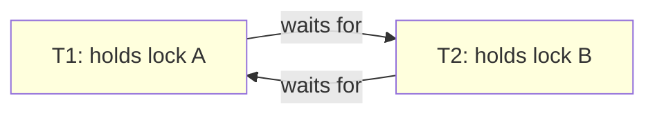
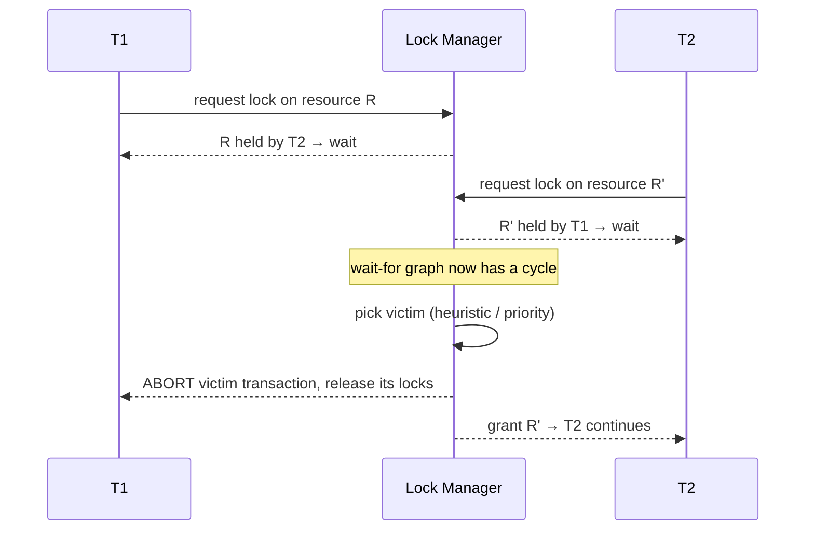
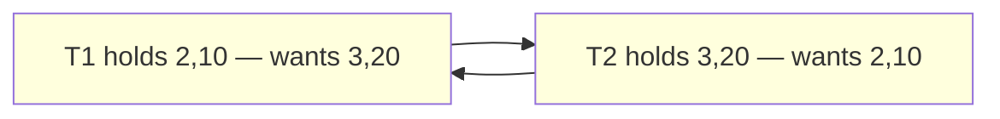

Wrote section `89-Deadlocks` to `sql-handbook/10-Database-Design/89-Deadlocks.md` (700 lines), following the style of `88-Locks-and-Blocking.md`.

Covers: Coffman conditions, wait-for graph + detection strategies (immediate cycle-check vs `deadlock_timeout` delay), victim selection per engine with Mermaid diagrams, and 6 BAD-vs-BETTER scenarios — classic opposite-order transfer, single-resource upgrade deadlock, InnoDB gap-lock insert deadlock, single-table/two-index deadlock, hidden FK key-share locks, and the mandatory retry pattern. Includes sample tables with grain, `FOR SHARE`/gap-lock/`deadlock_timeout`/timeout syntax per engine, NULL behavior, edge cases, production pitfalls, no-overclaim performance guidance, an engine comparison table, best practices, and 40 unanswered interview questions across all 8 requested categories.
s a _normal artifact of concurrency_. When it happens, the engine aborts one of the transactions (the "victim"), releases its locks, and lets the survivor finish. The victim's client gets an error such as:

- PostgreSQL: `ERROR: deadlock detected` (SQLSTATE `40P01`)
- MySQL/InnoDB: `ERROR 1213 (40001): Deadlock found when trying to get lock; try restarting transaction`
- SQL Server: `Msg 1205 ... was deadlocked on lock resources with another process and has been chosen as the deadlock victim. Rerun the transaction.`
- Oracle: `ORA-00060: deadlock detected while waiting for resource`

### The analogy everyone uses

Two cars facing each other in a one-way lane. Neither can move forward because the other is in the way, and neither car is allowed to reverse. Someone (a traffic warden, in our case the database) must physically remove one car to let traffic flow again.

A builder version: plumber and electrician each need the other's tool, and refuse to let go of their own. Nobody works until the foreman fires one of them and re-hires them.

---

### Deadlock vs blocking vs starvation vs livelock

| Term           | Definition                                                                                                                                                                       | Does it resolve itself?                               | What ends it                                                                                                          |
| -------------- | -------------------------------------------------------------------------------------------------------------------------------------------------------------------------------- | ----------------------------------------------------- | --------------------------------------------------------------------------------------------------------------------- |
| **Blocking**   | T2 waits for a lock held by T1. No cycle.                                                                                                                                        | Yes — when T1 commits/rolls back.                     | Normal flow; optional `lock_timeout` as a safety valve.                                                               |
| **Deadlock**   | T1 waits on T2 and T2 waits on T1. **Cycle in the wait-for graph.**                                                                                                              | No — but the engine detects it and aborts the victim. | Deadlock detector picks a victim and aborts its transaction.                                                          |
| **Starvation** | A transaction never acquires a lock because others keep getting there first (no cycle).                                                                                          | Not by itself.                                        | Scheduling/hysteresis: writers vs readers settings, priorities, retry policies. Mostly theoretical in modern engines. |
| **Livelock**   | Processes keep retrying, see each other, and keep backing off forever — e.g. two retry loops that always collide again. No one is "stuck" on a lock; each keeps _starting over_. | No — can spin forever.                                | Contrived but real in naive "retry until success without backoff or reorder" app code.                                |

> Interview trap: "Is a deadlock the same as a transaction that has been running for 2 hours?" **No.** A 2-hour transaction holding a lock is _blocking_ everyone else, but it is still making (or able to make) progress when the lock isn't contested. A deadlock is specifically a **cycle**, detected by the engine, that requires aborting someone. Always check `blocking_session_id` / `pg_blocking_pids()` / `data_lock_waits` before you say "deadlock".

---

## Why deadlocks exist

Deadlocks exist because of four _simultaneously_ true facts about databases (these are the classic **Coffman conditions** from operating-systems theory, applied to lock managers):

| Coffman condition       | Meaning                                                                  | Database reality                                                |
| ----------------------- | ------------------------------------------------------------------------ | --------------------------------------------------------------- |
| 1. **Mutual exclusion** | A resource cannot be shared at the same time.                            | An exclusive (X) row lock can be held by only one transaction.  |
| 2. **Hold and wait**    | A process that holds a resource may request another.                     | A transaction can hold lock on row A and then `UPDATE` row B.   |
| 3. **No preemption**    | You cannot force a resource away from its holder.                        | You can't steal a row lock; only the engine can abort a victim. |
| 4. **Circular wait**    | There is a cycle of processes each holding something the next one wants. | The wait-for graph contains a cycle.                            |

All four must hold at once. That is the _whole theory_ of preventing deadlocks: **break any one condition and deadlocks become impossible** (you don't even need detection):

- Break #1 (mutual exclusion): make readers take no locks at all → MVCC snapshots.
- Break #2 (hold-and-wait): acquire _all_ locks up front in one statement → single `INSERT ... ON CONFLICT SELECT`, or a single atomic `UPDATE`.
- Break #3 (preemption): let a waiter give up after `lock_timeout`/`NOWAIT` instead of waiting forever; the engine aborts a victim.
- Break #4 (circular wait): impose a **global lock ordering** so two transactions can never request the same two resources in opposite order (the #1 application fix: alias = "lock ordering discipline").

> Common misconception: "Deadlocks are a bug the database should never have." Databases can't prevent deadlocks without breaking condition #2 (which forces you to lock everything up front) or #4 (which forces you into _one_ canonical lock order globally — something only the application can enforce). Databases don't prevent deadlocks; they **detect and resolve** them, and a victim is chosen by heuristics, never by your intent.

---

## Internal working: how the engine detects and resolves a deadlock

### Step 1 — a wait-for graph exists implicitly

Every time a transaction puts a lock _wait_ on the queue for a resource, the lock manager knows "holder → waiter". Across all sessions these edges form a directed graph: the **wait-for graph**.



A **cycle** in this graph = deadlock.

### Step 2 — detection strategy A: check on wait (cycle-detection)

Some engines (InnoDB, Oracle) check **at the moment a lock request would create a cycle**: when a transaction arrives on a wait queue, the manager asks "is the process at the _front of this waiting chain_ waiting, directly or indirectly, on the requestor?" If yes → deadlock _right now_, no waiting around.

### Step 3 — detection strategy B: timeout + delayed graph check

Other engines (PostgreSQL, SQL Server) don't check at the instant of every wait — that would cost CPU on every contended lock. Instead:

- PostgreSQL: when a transaction has been waiting longer than `deadlock_timeout` (default **1 second**), PostgreSQL builds the wait-for graph **for that waiting process only** (to keep the cost tight). If a cycle is found, it aborts one participant. Detection runs in the background; the trade-off is: too small → frequent, CPU-hungry checks; too large → deadlocks sit undetected for seconds.
- SQL Server: a **Lock Monitor** wakes periodically (~every 5 seconds) and searches waits for cycles.



### Step 4 — pick a victim

Which transaction gets sacrificed is engine-specific and never deterministic from the application's point of view. Do not write code that assumes "I will never be the victim":

| Engine           | Victim selection                                                                                                                                                                            | What gets rolled back                                                                                                                    |
| ---------------- | ------------------------------------------------------------------------------------------------------------------------------------------------------------------------------------------- | ---------------------------------------------------------------------------------------------------------------------------------------- |
| **PostgreSQL**   | The docs do not guarantee which transaction is aborted; in practice it is typically the one that joined the cycle **most recently** (the waiting process whose request _closed_ the cycle). | The **entire transaction**; the session enters aborted state and must `ROLLBACK`.                                                        |
| **MySQL/InnoDB** | InnoDB aborts the transaction that has done the **least work** (fewest changes / cheapest rollback). Logs the full story in `LATEST DETECTED DEADLOCK`.                                     | The **entire transaction** of the victim (server rolls it back for you).                                                                 |
| **SQL Server**   | **Lowest `SET DEADLOCK_PRIORITY`** first; if equal, the transaction that is cheapest to roll back (fewest log records/undo).                                                                | The **entire transaction** (connection stays usable; you must re-issue the whole transaction).                                           |
| **Oracle**       | The session **whose request would complete the cycle** (i.e. the one that _detects_ the deadlock) is the victim.                                                                            | Only the **current statement** is rolled back; the rest of the transaction remains open and you may `COMMIT` or `ROLLBACK` deliberately. |

> PostgreSQL detail: the _survivor_ is the transaction that is currently holding the lock and had no wait when the cycle was found; error goes to the _waiter_. But which one was "in the cycle" at detection time depends on timing, so again: never rely on getting the error deterministically.

### Step 5 — the survivor unblocks; the victim retries (in the app)

After the victim's locks are released, the survivor's waits resolve and it commits. The victim's transaction is gone — **all** of its work, not just the last statement (PostgreSQL, MySQL, SQL Server). The only correct reaction is in the application: **retry the whole transaction, with fresh reads**.

> Production pitfall #1 — **the naive retry.** The most common deadlock bug is not the deadlock; it's the app's response to it:
>
> - Error swallowed → user sees a failed transfer / double-booking that silently vanished.
> - Retry on the _same_ connection _without_ `ROLLBACK` → every subsequent statement gets "current transaction is aborted".
> - Retry _the same last statement only_ → the half-done earlier statements stay lost → corruption of the business flow.
> - Retry in a tight loop with no backoff → retry storm under busy traffic.
>
> The correct pattern (below) restarts the _entire_ transaction body, reads fresh data, and backs off.

---

## Syntax: there is no `DEADLOCK` keyword in SQL

Deadlocks are side effects of locking; you **tune** them with configuration, session settings, and lock-mode choices, and **observe** them with diagnostic commands.

### Controls and diagnostics per engine

```sql
-- PostgreSQL
SET deadlock_timeout = '1s';    -- how long a process waits before a deadlock check (default 1s)
SET lock_timeout = '5s';        -- max time to wait for ANY lock; on timeout: ERROR 55P03 (a retryable "make like a deadlock victim" tool)
-- logging the details (postgresql.conf):
--   log_lock_waits = on
--   deadlock_timeout = 1s (keep small for debug, larger for prod)
```

```sql
-- MySQL / InnoDB
SET SESSION innodb_lock_wait_timeout = 5;   -- seconds; after this, a *blocked* request errors 1205
SET GLOBAL innodb_deadlock_detect = OFF;    -- turn OFF cycle detection (NOT recommended; then deadlocks surface as 1205 timeouts)
SHOW ENGINE INNODB STATUS;                  -- see the 'LATEST DETECTED DEADLOCK' section after each deadlock
SELECT * FROM performance_schema.data_lock_waits;  -- current waits
```

```sql
-- SQL Server
SET DEADLOCK_PRIORITY LOW;          -- ask to be the victim (also: HIGH, or a number, -10 .. 10)
SET DEADLOCK_PRIORITY HIGH;         -- ask never to be the victim
SET LOCK_TIMEOUT 5000;              -- ms; on timeout error 1222 ("lock request time out period exceeded")
-- production tracing (DBCC): DBCC TRACEON(1222, -1)   -- logs each deadlock as XML to the error log
-- find current waiters/blockers:
SELECT r.session_id, r.blocking_session_id, r.wait_type, r.wait_time
FROM sys.dm_exec_requests r WHERE r.blocking_session_id <> 0;
```

```sql
-- Oracle
SELECT * FROM v$session WHERE blocking_session IS NOT NULL;   -- current blocking chains
-- deadlocks write a trace file to the alert log (user_dump_dest): look for ORA-00060
-- Oracle has no deadlock priority; the optimizer simply picks the session that closed the cycle.
```

> Note: `EXPLAIN` / `EXPLAIN ANALYZE` will **not** show you locks or deadlock waits. It shows the _execution plan_ — the _shape_ of the query that decides _which_ locks get taken in _which order_. Use it for the "why did it lock so much?" half of the story; use the per-engine live-lock views above for the other half. See 78-EXPLAIN-Execution-Plans.

---

## Sample tables used by the scenarios below

`accounts` — **grain:** one row = one bank account.

```sql
CREATE TABLE accounts (
  account_id  INT PRIMARY KEY,
  holder      VARCHAR(100) NOT NULL,
  balance     NUMERIC(12,2) NOT NULL CHECK (balance >= 0)
);

INSERT INTO accounts VALUES
  (1, 'Alice', 1000.00),
  (2, 'Bob',   2000.00),
  (3, 'Carol', 1500.00);
```

`inventory` — **grain:** one row = one product's stock at one warehouse.

```sql
CREATE TABLE inventory (
  product_id   INT NOT NULL,
  warehouse_id INT NOT NULL,
  product_name VARCHAR(100) NOT NULL,
  stock        INT NOT NULL,
  PRIMARY KEY (product_id, warehouse_id)
);

INSERT INTO inventory VALUES
  (1, 10, 'Laptop',               12),
  (2, 10, 'Mechanical Keyboard',  40),
  (3, 20, 'USB-C Hub',             0),
  (4, 20, 'Monitor',               7);
```

`orders` — **grain:** one row = one order. Used with very sparse `order_id` gaps so gap/next-key locks are visible.

```sql
CREATE TABLE orders (
  order_id   INT PRIMARY KEY,
  product_id INT NOT NULL,
  qty        INT NOT NULL,
  status     VARCHAR(20) NOT NULL,
  created_at TIMESTAMP NOT NULL
);

INSERT INTO orders VALUES
  (101, 1, 2, 'placed', NOW()),
  (150, 3, 1, 'placed', NOW()),
  (210, 2, 1, 'shipped', NOW());
```

`flight_seats` — **grain:** one row = one bookable seat. Used for the shared-lock-upgrade deadlock.

```sql
CREATE TABLE flight_seats (
  seat_id    INT PRIMARY KEY,
  flight_id  INT NOT NULL,
  passenger  VARCHAR(100) NOT NULL,
  status     VARCHAR(20) NOT NULL DEFAULT 'available'  -- 'available' | 'held' | 'booked'
);

INSERT INTO flight_seats VALUES
  (1, 900, '(none)', 'available'),
  (2, 900, '(none)', 'available');
```

---

## Scenario A — the classic: two resources, opposite order (bank transfer)

Two transfers run at the same time:

- Transfer 1: move 100 from Alice (1) to Bob (2).
- Transfer 2: move 100 from Bob (2) to Alice (1).

**BAD approach — lock in "from, then to" order:**

```sql
-- Session 1                          -- Session 2
BEGIN;
UPDATE accounts SET balance = balance - 100 WHERE account_id = 1;  -- X lock on row 1
                                      BEGIN;
                                      UPDATE accounts SET balance = balance - 100 WHERE account_id = 2;  -- X lock on row 2
UPDATE accounts SET balance = balance + 100 WHERE account_id = 2;
-- waits for S2's lock on row 2
                                      UPDATE accounts SET balance = balance + 100 WHERE account_id = 1;
                                      -- waits for S1's lock on row 1 → CYCLE
-- deadlock detector fires within ~1s (PG) / immediately (InnoDB, Oracle) / ~5s (SS)
```

**Expected output:** one session gets its engine's deadlock error (see the table in the fundamentals). Its transaction is rolled back; the other transfer commits. Final balance shows exactly one transfer applied — Bob is never "both got the money" and the bank is never short.

**Why it happened:** violation of Coffman condition #4. Both sessions locked rows in _semantic_ order (source first) but the two transfers have sources in **opposite** order. Any fixed rule you choose ("always lock by ascending account_id first") makes this impossible.

**BETTER approach — canonical lock ordering (lock the two ids in sorted order):**

```sql
-- pseudo-code; the point is ORDER, not WHERE
-- for a transfer between a and b:
lo = LEAST(a, b);  hi = GREATEST(a, b);   -- same rule in every transaction
BEGIN;
SELECT balance FROM accounts WHERE account_id IN (lo, hi) FOR UPDATE;  -- locks lo first, then hi. ALWAYS.
-- debit lo, credit hi. Release-order doesn't matter.
UPDATE accounts SET balance = balance - 100 WHERE account_id = lo;
UPDATE accounts SET balance = balance + 100 WHERE account_id = hi;
COMMIT;
```

Now the two transfers request lock row 1 before row 2 — both in the same order. They **line up** (block) instead of **cross** (deadlock). One finishes, then the other. No victim, no error, no retry needed.

> Interview trap: "I wrapped my transfer in a transaction, why did it deadlock?" Because a transaction does not _prevent_ deadlocks; it _creates the opportunity_ for them (it holds locks across multiple statements!). The transaction is what you need for atomicity; **lock ordering is what you need for deadlock-freedom.**

---

## Scenario B — the upgrade deadlock on a SINGLE resource

It is common to think "deadlock needs two resources." Wrong — a deadlock can exist on **one** resource if _shared locks must be promoted to exclusive_.

Flow: two sessions both `SELECT ... FOR SHARE` (or plain `SELECT` on a locking engine) on the _same_ seat, then both try to `UPDATE` it. Shared locks coexist — so both succeed at reading. Then each wants to _promote_ to X, but each is blocked by the other's S lock:

```sql
-- Session 1                          -- Session 2
BEGIN;
SELECT * FROM flight_seats WHERE seat_id = 1 FOR SHARE;   -- S lock granted
                                      BEGIN;
                                      SELECT * FROM flight_seats WHERE seat_id = 1 FOR SHARE;   -- S lock ALSO granted (S+S compatible)
UPDATE flight_seats SET status = 'booked', passenger = 'Alice' WHERE seat_id = 1;
-- wants X, must wait for S2's S lock
                                      UPDATE flight_seats SET status = 'booked', passenger = 'Bob' WHERE seat_id = 1;
                                      -- wants X, must wait for S1's S lock → CYCLE on ONE row
```

**Expected output:** a deadlock is detected and one session is aborted, even though only a single row is involved. Both sessions "correctly" read-then-wrote and still deadlocked (race condition F).

**BETTER — take the exclusive lock up front:**

```sql
-- both sessions:
BEGIN;
SELECT * FROM flight_seats WHERE seat_id = 1 FOR UPDATE;   -- X lock from the start: second session WAITS here (blocking, not deadlock)
UPDATE flight_seats SET status = 'booked', passenger = ... WHERE seat_id = 1;
COMMIT;
```

Because the X lock is taken by the _read_, the second session blocks at the `SELECT` instead of deadlocking at the `UPDATE`. First session commits; second proceeds.

> Production pitfall: anywhere you write "check-then-claim" with a shared lock (`SELECT ... FOR SHARE`, or plain `SELECT` on SQL Server default isolation, or `SELECT ... LOCK IN SHARE MODE`), and _then_ upgrade to a write, you are one release away from an upgrade deadlock. From-the-start `FOR UPDATE` (or an atomic `UPDATE ... RETURNING` / `UPSERT`) removes the second phase entirely.

---

## Scenario C — gap/next-key deadlocks at REPEATABLE READ (InnoDB)

At `REPEATABLE READ` (InnoDB default), locking reads and writes lock not just matching rows but the **gaps** around them (next-key locks) to prevent phantoms. Two transactions can then deadlock **on empty space** — rows that don't exist:

```sql
-- InnoDB / REPEATABLE READ
-- Session 1                          -- Session 2
BEGIN;
DELETE FROM orders WHERE order_id > 150;   -- next-key locks over the range (150, ∞)
                                      BEGIN;
                                      DELETE FROM orders WHERE order_id < 210;   -- next-key locks over (-∞, 210) OVERLAPS Session 1's range
INSERT INTO orders VALUES (160, 2, 1, 'placed', NOW());
-- Session 1 wants to insert INTO the range locked by Session 2 → BLOCKED
                                      INSERT INTO orders VALUES (180, 3, 1, 'placed', NOW());
                                      -- Session 2 wants to insert INTO the range locked by Session 1 → BLOCKED → CYCLE
```

**Expected output:** deadlock detected; one `INSERT` aborted. Neither `DELETE` deleted anything of consequence — they fought over _inserting into the holes_ they'd just range-locked.

> Common misconception: "Gap locks only matter for performance." Gap locks are a _correctness_ mechanism (phantom prevention) at `REPEATABLE READ`, and they are simultaneously the #1 _surprise_ source of insert deadlocks: an `UPDATE` or `DELETE` that scans a wide range at RR can block `INSERT`s of keys inside that range even though the inserted rows don't exist yet, and two such scans can cross and deadlock.

**BETTER** — evaluate the isolation level instead of assuming RR:

- If the query truly needs to prevent phantoms, keep RR and _shrink the scanned range_ with a narrow, sargable predicate (see 77-SARGability) — range locks scale with the _scanned_ range, not the _changed_ rows.
- If not, use `READ COMMITTED` where gap locking is disabled (InnoDB only gap-locks at RR/SERIALIZABLE). You trade phantoms for concurrency — verify which anomalies your workload actually forbids (see 87-Isolation-Levels) _before_ changing it.

---

## Scenario D — a single table can deadlock: two UPDATEs, two index paths

A deadlock does not require two tables. It requires two transactions that acquire the **same set of locks in different orders**. Different execution plans can produce exactly that on one table.

`inventory` has two candidate plans:

- Scan by primary key `(product_id, warehouse_id)` → rows in product_id order.
- Scan by an index on `warehouse_id` → rows in warehouse order.

```sql
-- Session 1: plan chooses PK order → locks (2,10) then (3,20)
UPDATE inventory SET stock = stock - 1 WHERE product_id IN (2, 3);

-- Session 2: plan chooses the warehouse_id index → locks (3,20) then (2,10)  [order depends on plan]
UPDATE inventory SET stock = stock - 1 WHERE warehouse_id IN (20, 10);
```

If Session 1 grabs (2,10) while Session 2 grabs (3,20), then both reach for the remaining row, the graph closes:



**Expected output:** classic deadlock error, one victim. The rows are on the same table; the _access path_ differed.

> Production pitfall: "It's one table, an UPDATE can't deadlock." It can — deadlock is about **lock acquisition order across index scans**, not about multiple tables. Announcements in production often show single-table UPDATE/MERGE deadlocks when two index routes touch the same rows in opposite order.

**BETTER (directions, verify each):**

- Give the second statement the _same_ access path as the first (a covering index so both use the PK), or force one plan — but _prefer_ making the predicates sargable and similar so the optimizer naturally picks the same index order.
- Keep the write scope to a single, short, indexed range (fewer rows, one consistent scan order).
- If the batch touches a big set, chunk it with keyset pagination so each chunk is small and the scan order is stable (see 84-Pagination-and-Keyset-Pagination).
- Confirm _which index each plan used_ with `EXPLAIN`; the lock order follows the plan, not your `WHERE` clause's written order.

---

## Scenario E — hidden locks from foreign keys (PostgreSQL `FOR KEY SHARE`, InnoDB S-locks)

Foreign key enforcement takes locks you never wrote. When a row is inserted/updated against a parent, most engines read-lock the parent row (PostgreSQL `FOR KEY SHARE`; InnoDB S record lock; SQL Server S lock). Those _hidden_ locks participate in the wait-for graph and can deadlock you with operations that never touch the same SQL rows in your eyes:

```sql
-- products (id PK), orders(product_id FK → products.id)
-- Session 1                              -- Session 2
BEGIN;
UPDATE orders SET status = 'shipped' WHERE order_id = 101;   -- X lock on order 101 (no parent conflict yet)
                                          BEGIN;
                                          INSERT INTO orders (order_id, product_id) VALUES (102, 1);
                                          -- takes FOR KEY SHARE lock on product row 1 (FK check) and holds it
UPDATE products SET ... WHERE id = 1;
-- wants X on product row 1 → blocked by S2's FOR KEY SHARE
                                          DELETE FROM orders WHERE order_id = 101;
                                          -- wants X on order 101 (S1's order!) → blocked → CYCLE
```

**Expected output:** a deadlock whose two "resources" are an order row and a product row, neither of which the _other_ transaction explicitly updated. The `FOR KEY SHARE` parent lock is the invisible third wheel.

> Interview trap: "My deadlock trace shows locks on two tables, but my SQL only writes to one table." Look for FK enforcement locks, triggers, and `MERGE`/`ON CONFLICT` internal reads. They are _real_ locks in the wait-for graph and the costliest ones to find by eye.

**BETTER:**

- Referential integrity is worth keeping, but be deliberate: parent-row updates are _read-locked_ by every child write. Batch child writes, and ensure FK lookups use the parent's index.
- Where a parent-child "_swap_" pattern exists (delete child → insert new child, or update the FK), the ordering across parent/child must be consistent too.
- Diagnose with the engine's deadlock report — it lists _every_ lock each transaction held, including key-share locks.

---

## Scenario F — the retry pattern: the ONLY production-correct response to a deadlock error

A deadlock victim has lost its entire transaction. The application's job is to **run it again, from the start, on fresh data**, a bounded number of times.

```
function runWithDeadlockRetry(maxAttempts, fn):
  for attempt = 1 .. maxAttempts:
    try:
      BEGIN
      result = fn()          # the WHOLE transaction body
      COMMIT
      return result
    catch DeadlockError:     # 40P01, 1213, 1205, ORA-00060
      ROLLBACK               # REQUIRED — the transaction is halfway dead
      sleep(backoff(attempt)) # exponential or jittered; never zero, never infinite
  raise "operation failed after N retries"
```

Concrete in PL/pgSQL-style pseudo-code:

```sql
-- generic pseudo-code, adapt the error code to your engine
LOOP
  BEGIN;
    -- fresh reads here! Re-SELECT, re-lock, recompute.
    UPDATE accounts SET balance = balance - 100 WHERE account_id = 1;
    UPDATE accounts SET balance = balance + 100 WHERE account_id = 2;
  COMMIT;
  EXIT;  -- success
EXCEPTION WHEN deadlock_detected THEN   -- PostgreSQL 40P01; MySQL is handled in app code
  ROLLBACK;
  PERFORM pg_sleep(0.2);                -- backoff
END LOOP;
```

Rules the retry MUST obey:

1. **Catch the exact deadlock error** (list per engine above) — do not also swallow foreign-key violations or constraint errors; those won't be fixed by retrying.
2. **Re-`BEGIN` a fresh transaction** and **re-read all inputs** inside it. A retry that reuses the snapshot/buffered values from the dead attempt replays the same stale data.
3. **Bounded attempts** (e.g. 3–5) with backoff — unbounded retry on a hot row is a retry storm.
4. **Rollback on the victim is engine-dependent** (PostgreSQL demands it; MySQL already did it server-side; SQL Server rolled back the transaction but you must re-issue; Oracle only rolled back the statement — inspect state). Write engine-aware cleanup.

> Production pitfall #2 — **the retry storm / thundering herd.** When 50 workers all deadlock on one hot row and all retry immediately with zero backoff, they re-collide at t=0 again — the "retry loop livelock." Jittered exponential backoff is the difference between "self-healing" and "crash loop."

---

## Run-it-yourself experiment (PostgreSQL, two terminals)

Purpose: prove that a deadlock is a cycle, that the engine resolves it, and that one transaction goes back to zero.

Session 1:

```sql
BEGIN;
UPDATE accounts SET balance = balance - 100 WHERE account_id = 1;
```

Session 2:

```sql
BEGIN;
UPDATE accounts SET balance = balance - 100 WHERE account_id = 2;
```

Session 1:

```sql
UPDATE accounts SET balance = balance + 100 WHERE account_id = 2;   -- blocks
```

Watch Session 1 block (it cannot complete until Session 2 releases row 2). Wait ~1 second (default `deadlock_timeout`), then run in Session 2:

```sql
UPDATE accounts SET balance = balance + 100 WHERE account_id = 1;
```

**Expected output:** within ~1 second one terminal prints `ERROR: deadlock detected` and the other completes its update. On the victim terminal every _further_ command until `ROLLBACK;` returns `ERROR: current transaction is aborted, commands ignored until end of transaction block.` That is the "entire transaction is gone" rule in action.

MySQL version: replace with two `START TRANSACTION;` windows and watch `SHOW ENGINE INNODB STATUS \G` render the `LATEST DETECTED DEADLOCK` section — it shows each transaction's statements, the locks, and the "WE ROLL BACK TRANSACTION (1)" verdict.

---

## NULL behavior

Deadlock mechanics don't care what values are in the rows, but NULL crosses paths with locking in four relevant ways:

1. **NULL-index ordering and gap locks (InnoDB).** InnoDB sorts `NULL` as the _smallest_ value. A range/next-key lock taken with `WHERE warehouse_id > 10` therefore covers the NULL "edge" of the index; an `INSERT` of a row with a NULL warehouse_id can wait on — and deadlock with — a lock taken over a range that "logically" has no rows. If you see a deadlock involving inserts of NULL-keyed rows, suspect the gap, not the row.

2. **NULLs and unique-index inserts.** By default, unique constraints treat `NULL != NULL`, so two rows with NULL parent keys are _not_ duplicates and take no conflicting lock on each other — that removes one deadlock source but also removes your "duplicate guard" (PostgreSQL: use `NULLS NOT DISTINCT` (15+) if you want NULLs to collide). Two concurrent inserts of the _same_ non-NULL key, by contrast, do collide at the unique index and can deadlock on the index entry (both take gap/insert-intention locks, then both try the final insert position).

   > Production pitfall: converting a column from `NULL`-able to `NOT NULL` (or adding a unique index on a column with NULLs) changes the _deadlock profile_ of the index. Retest concurrent insert workloads around that change.

3. **FK key-share locks ignore values, love keys.** Parent rows with NULL FK _keys_ participate normally — a child row referencing a parent serializes on the parent's _record_, whether the key is NULL or not (though NULL FKs typically mean "no reference" and are not checked).

4. **`WHERE ... IS NULL` predicate locks are still range locks.** `DELETE FROM orders WHERE status IS NULL` can gap-lock the whole NULL region of the index at RR — narrower than a full scan, but not lock-free. "NULL values" do not exempt rows from locking; NULL _predicates_ just change which range is scanned.

---

## Edge cases

- **"Self-deadlock" is impossible for a single transaction.** A transaction already holds its own locks; a later statement that requests the _same_ resource is granted it (re-entrant). The wait-for graph only has edges between _different_ transactions. So "can my CTE deadlock with itself?" — no. (But two _sessions_ running the same CTE still can.)
- **Autocommit makes deadlocks rare but not impossible.** With autocommit, each statement is its own transaction and releases its locks at statement end. The window for a cycle shrinks, but it doesn't vanish: two autocommit updates that each need two resources in opposite order can still deadlock mid-statement. "It works in autocommit" is not a guarantee the equivalent `BEGIN`..`COMMIT` works too — and the _transaction_ version is the one you need for the business rule.
- **Single-statement deadlocks on insert-intention locks.** Two concurrent `INSERT`s at a unique-index boundary (plus the "insert intention" lock on the gap) can deadlock against each other with _zero_ UPDATEs in the graph.
- **Deadlock detection can be disabled.** `innodb_deadlock_detect = OFF` means InnoDB _stops detecting_; cycles then resolve only via `innodb_lock_wait_timeout` (default 50s) → error 1205 _after a 50-second hang_. Some high-contention workloads deliberately turn detection off to cut detector CPU cost, then use short timeouts; you trade 50s stalls for detection overhead. Measure before copying this.
- **Lock timeouts are NOT deadlock detection.** `lock_timeout` (PG), `innodb_lock_wait_timeout`, `LOCK_TIMEOUT` fire on a _long block_ — often there is no cycle at all. Tuning them down does not "detect deadlocks faster"; it converts benign long waits into errors. Only `deadlock_timeout`/the engine's monitor governs detection.
- **Deadlocks vs read replicas / hot standby.** On a standby, `cancels` happen for _replay conflicts_, not deadlocks _per se_. Replicas replay a serialized stream; active transaction on the replica can be cancelled by the WAL replay (different mechanism, same "transaction aborted" error family). Don't confuse a "canceling statement due to conflict with recovery" error with a deadlock.
- **Distributed (2PC/XA) deadlocks are usually NOT detected across participants.** Each database detects only its _own_ wait-for graph. A cycle that spans two databases (T1 in DB-A waits on DB-B; T2 in DB-B waits on DB-A) is invisible to both — the classic reason distributed transactions degenerate into timeouts. Advisory locks help serialize across DBs (see 88 for `pg_advisory_lock`, `GET_LOCK`, `sp_getapplock`, `DBMS_LOCK`).
- **Advisory locks can deadlock with row locks.** `pg_advisory_xact_lock(7); ... UPDATE accounts ...` can deadlock with another session doing the same in reverse order. Advisory locks are just resources in the same wait-for graph.
- **SQL Server escalation is not a deadlock, but its _retry_ can be.** A batch whose lock escalation is disabled can deadlock when two escalations meet at the table level — the _escalated_ table X-lock requests cross. Keep escalation on where possible, or chunk.
- **`ON CONFLICT`/`MERGE` and the "silent re-check."** Uniqueness violations take a small lock on the conflicting row, drain the wait, and repeat. Under concurrency these are correct _and_ a known insert-deadlock source (upsert vs upsert on the same key). Retry them like any other deadlock.
- **Timezones/pagination don't matter here** — but _long_ transactions do: the longer a transaction holds locks, the bigger the _surface_ of the wait-for graph, and the more likely _any_ cycle forms. Deadlock likelihood is roughly a function of (contention) × (transaction time). See 84 for chunking that shrinks transaction time.

---

## Common mistakes

1. **Not retrying at all.** The deadlock error is not "your fault"; it's a concurrency event. An app that returns "transaction failed" to the user when `1213` fires is shipping downtime.
2. **Retrying wrong:**
   - Re-running only the last statement (its siblings are lost).
   - Retrying on the aborted transaction without `ROLLBACK` (PostgreSQL: `ERROR: current transaction is aborted` forever).
   - Retrying with zero backoff (retry storm) or infinitely (loop livelock).
   - Catching the error on one connection and retrying on another with a stale transaction (id semantics change).
3. **Swallowing the error in a transaction that you then `COMMIT`.** A victim's transaction is already rolled back server-side (MySQL); or must be rolled back (PostgreSQL). Committing a "half done" state commits the _copy_ the app still believes is pending.
4. **Confusing "deadlock" with "long block".** You kill the wrong session or restart the wrong job because you never checked whether the wait-for graph actually has a cycle (`pg_blocking_pids`, `blocking_session_id`, `data_lock_waits`).
5. **Holding a transaction open across network/HTTP/user-think time.** Each idle second is a wider lock window; deadlocks are more likely simply because the lock is held so long (see "edge case" above).
6. **Not fixing the root order.** Retrying a deadlock that recurs because lock order is inconsistent = retry forever. Fix the order (or the isolation/scope), _then_ keep retry as a safety net.
7. **`SELECT ... FOR SHARE` then `UPDATE`** when `SELECT ... FOR UPDATE` (or an atomic update) removes the upgrade phase entirely (Scenario B).
8. **Updating at `REPEATABLE READ` when the rows don't need phantom protection**, then blaming the database when gap-lock deadlocks appear in inserts (Scenario C).
9. **Ignoring hidden locks: FKs, triggers, `ON CONFLICT`, `MERGE`.** If you only read "my Update statement" in the deadlock report and miss the key-share lock, your fix will miss.
10. **`WHERE status != 'old'` style non-sargable write predicates** that force a scan and range-lock the entire table — making a _blocking_ problem pretend to be a _deadlock_ problem (see 77-SARGability). A scan-locked table produces many waiters, and some of _those_ waiters may import new cycles.

---

## Production pitfalls

> Production pitfall #3 — **deadlock rate scales with traffic squared — roughly.** Two transactions can only deadlock if they're concurrent. Double the concurrency, and pairwise overlap grows; expect deadlocks to _appear_ suddenly at a traffic threshold that was a non-issue in staging, where 2–3 users tested. Prove with load tests, not psychology.

> Production pitfall #4 — **the reporting/batch vs OLTP collision.** A nightly batch `UPDATE` scanning a wide range, or a job that takes a table lock, re-schedules all OLTP writes into the same time window. Any two differently-ordered accesses inside that window deadlock continuously; window ends, deadlocks vanish. The fix is usually _timing and chunking_, not SQL surgery (see 84-Pagination-and-Keyset-Pagination).

> Production pitfall #5 — **deadlock "self-healing" is often the disaster.** Because retries succeed, teams notice retry counters rising late. Track **deadlock count**, **retry rate**, and — crucially — **retries exhausted / still-failing rate**. The last one is your real SLO; a retry that succeeds is a blip; a retry that exhausts is a lost transfer.

> Production pitfall #6 — **killing the victim is not a fix.** Manually `KILL`ing/`pg_terminate_backend`-ing the session that "keeps deadlocking" may be killing the _least-work_ transaction each time while the ordering bug lives in the other one. Read the deadlock graph _before_ court.

> Production pitfall #7 — **idle-in-transaction connection-pool ghosts.** A pooled connection that never committed (app forgot, ORM misconfigured) holds row locks forever; every new operation that touches those rows is a potential partner in a _new_ cycle. Idle-in-transaction monitoring is a deadlock-prevention measure, not just a memory question.

> Production pitfall #8 — **a single hot row ("hotspot").** A counter, a queue head, or a "last serial number" row concentrates contention; every writer collides there. The deadlock count is a _symptom_ of a design problem (single-row contention) — consider decomposing the hot row (per-shard counters, separate ledger lines), but _measure_: the fix trades deadlocks for aggregation complexity.

---

## Performance implications (measure, don't declare)

No absolute statements like "retry always fixes it" or "RC is always faster." The directional, verifiable truths:

- **Deadlock detection is not free.** PostgreSQL only builds the wait-for graph after `deadlock_timeout` for one waiting process (cheap); InnoDB checks cycle membership on every contended lock (fine-grained, more CPU under high contention — that's why `innodb_deadlock_detect=OFF` exists); SQL Server's monitor runs ~every 5s. Detection _latency_ and detection _cost_ trade off against each other.
- **The cost of a deadlock = victim's whole transaction re-executed + backoff sleep.** The _business_ cost is latency and loss of in-flight work, not CPU. Throughput rarely drops from deadlocks; _latency p90_ and _failure rate_ explode.
- **The lever with the most leverage is transaction length, then contention, then isolation.** Short transactions produce fewer overlapping waits; lock ordering removes cycles entirely; narrowing the isolation (only when the business allows it) removes gap locks. All three are measurable decisions:
  - Before: capture `pg_stat_activity` wait times / `SHOW ENGINE INNODB STATUS` / SQL Server deadlock graph counts.
  - After: the same metrics, plus the **deadlock-per-N-successful-commits** rate and the **retries-exhausted** rate.
- **`EXPLAIN` tells you the plan (which rows get scanned/locked, in what order).** It says _nothing_ about whether a deadlock will occur. The execution-plan tool for deadlocks is: engine deadlock log + live lock views + a two-session repro. Use both.

Verify on your own engine, not by rumor: run the load test, count `40P01`/`1213`/`1205`/`ORA-00060` and retry-exhaustions, then decide.

---

## Comparison table — deadlocks per engine

| Aspect                                   | PostgreSQL                                                                                                   | MySQL/InnoDB                                                                           | SQL Server                                                                      | Oracle                                                                                               |
| ---------------------------------------- | ------------------------------------------------------------------------------------------------------------ | -------------------------------------------------------------------------------------- | ------------------------------------------------------------------------------- | ---------------------------------------------------------------------------------------------------- |
| Deadlock error                           | `ERROR: deadlock detected` — SQLSTATE `40P01`                                                                | `ERROR 1213 (40001): Deadlock found ... try restarting transaction`                    | `Msg 1205 ... chosen as the deadlock victim`                                    | `ORA-00060: deadlock detected while waiting for resource`                                            |
| Detection model                          | Wait-based: graph check after `deadlock_timeout` (recommended default 1 s)                                   | Immediate on wait: checks at request time if the wait closes a cycle (cycle-detection) | Lock Monitor polls ~every 5 s, builds global wait-for graph                     | Immediate: aborts the request that would complete the cycle                                          |
| Victim selection                         | The transaction that joined the cycle latest (usually the waiter that closed it); docs don't guarantee which | The transaction with the **least work** (cheapest rollback); chosen by heuristic       | **`DEADLOCK_PRIORITY`** (LOW/HIGH/numeric) first, then rollback cost            | The session that _detects_ the deadlock (whose request closes the cycle)                             |
| What is rolled back on the victim        | **Whole transaction**; session requires `ROLLBACK` to proceed                                                | **Whole transaction** (server does it); session stays usable                           | **Whole transaction** (connection stays usable)                                 | **Only the current statement**; transaction stays open, you decide COMMIT/ROLLBACK                   |
| Can you disable detection?               | Essentially no                                                                                               | Yes: `innodb_deadlock_detect=OFF` (cycles then become 1205 timeouts)                   | No for a single server; trace flags only affect logging                         | No                                                                                                   |
| Victim priority control                  | No                                                                                                           | No                                                                                     | **Yes**: `SET DEADLOCK_PRIORITY`                                                | No                                                                                                   |
| Wait-timeout fallback for a _long block_ | `lock_timeout` (default 0 = forever)                                                                         | `innodb_lock_wait_timeout` (default 50 s)                                              | `SET LOCK_TIMEOUT` (ms; default −1 = forever)                                   | `FOR UPDATE WAIT n` / `NOWAIT` (opt-in)                                                              |
| Where to see the story                   | Postgres log (`log_lock_waits=on`) + `pg_stat_activity`; no dedicated deadlock buffer                        | `SHOW ENGINE INNODB STATUS` → `LATEST DETECTED DEADLOCK`                               | Trace flag `1204`/`1222`, Extended Events `sqlserver.lock_deadlock` (XML graph) | Alert-log trace file (user_dump_dest), `v$session`                                                   |
| Retry after the error                    | Must `ROLLBACK` first (aborted state); all further cmds error until then                                     | Server already rolled back; just re-issue the whole transaction                        | Re-issue the entire transaction; cannot resume                                  | Investigate; statement rolled back, rest of txn may still commit (usually you rollback deliberately) |
| Known blind spot                         | 2PC/XA across databases not covered by one wait-for graph                                                    | Same; plus gap locks at RR add _insert_ deadlocks                                      | Same; plus lock escalation at table level                                       | Same; plus enqueue waits (`enq: TX – row lock contention`)                                           |

_Always sanity-check these on your exact engine version; defaults change between releases._

---

## Best practices (the deadlock playbook)

1. **Canonical lock ordering, everywhere.** For any operation that touches more than one row (transfer, order+stock, parent+child), acquire locks in a globally consistent order (e.g. `LEAST`/`GREATEST` of primary keys). This removes condition #4 by fiat.
2. **Retry the whole transaction on deadlock**, with bounded attempts, jittered exponential backoff, fresh reads, and a prior `ROLLBACK`. Engine-specific error codes; log the final exhaustion loudly.
3. **Keep transactions as short as possible.** Shorter lock-hold time → smaller wait-for graph → fewer cycles. Commit before user I/O, never across network/HTTP calls.
4. **Prefer one-shot atomic SQL** (`UPDATE ... SET x = x - n WHERE ... AND guard`, `INSERT ... ON CONFLICT`, single-statement `MERGE`) over read-then-decide-then-write in many cases. Fewer statements in the transaction = fewer opportunities for a cycle.
5. **Take exclusive locks from the start** (`FOR UPDATE`) rather than shared-then-promote, to eliminate the single-resource upgrade deadlock (Scenario B).
6. **Match isolation to intent.** If phantoms aren't business-forbidden, work at `READ COMMITTED`; if they are, keep RR/SSI and _shrink the scanned range_ (sargable predicates, narrow pk filters). Verify anomaly requirements first (87-Isolation-Levels).
7. **Make write predicates sargable and indexed.** A targeted unique-index filter locks a few rows; a full scan locks everything it touches — a blocking bloater that breeds deadlock partners. Add the index _before_ the write (77-SARGability, 88 lock footprint).
8. **Stay case-aware for FKs/triggers/`ON CONFLICT`:** include their hidden locks in your mental wait-for graph before hunting.

9. **Chunk big writes** with keyset pagination so each chunk is short and scans a stable, small range; avoid long-range and table-level lock windows (84-Pagination-and-Keyset-Pagination).
10. **Set sane lock/timeout guards** (`lock_timeout`, `innodb_lock_wait_timeout`, `LOCK_TIMEOUT`) so a stuck block becomes a fast, retryable error instead of an eternal hang that _pretends_ to be a deadlock.
11. **Monitor deadlock rate, not individual deadlocks.** Alert on: count per minute, retry-count distribution, and retries-exhausted (= real failures). Preserve the engine deadlock report for post-mortem (logging per engine, comparison table above).
12. **Before changing any deadlock behavior, reproduce and confirm the cycle.** Two-session repro + engine deadlock log first; then choose between: reorder locks → shrink transaction → reduce isolation → reduce footprint → chunk.

---

## Summary — the mental model

1. Deadlock = **cycle in the wait-for graph**; four Coffman conditions must all hold.
2. Databases **detect and resolve**, they don't prevent. Victim is chosen by engine heuristics/priority; its **whole transaction** is rolled back (Oracle: one statement).
3. The engine does this correctly _every time_; the risk is **the application's response**: no retry, wrong retry, or a retry storm.
4. Deadlock _prevention_ has exactly four knobs, one per Coffman condition: MVCC reads (no mutual exclusion pressure), one-shot statements (no hold-and-wait), timeouts/NOWAIT (preemption), and **canonical lock ordering** (no circular wait). The last is the one apps actually control.
5. Deadlock _diagnosis_ is engine-log + lock views, never `EXPLAIN` alone.
6. When any two transactions touch the same rows in different orders, anywhere — same table, different tables, via FKs, via gaps, via advisory locks — assume a deadlock is eventually possible under load, and design for retirement before it happens.

---

# Interview Questions

> Intentionally **no answers here** — practice them. Everything you need is in this section, plus 85-Transactions, 87-Isolation-Levels, and 88-Locks-and-Blocking.

## Beginner

1. Define a deadlock in one sentence, and contrast it with ordinary blocking.
2. What are the four Coffman conditions? Which one is the most common to fix _in application code_ for a two-row transfer?
3. True or false: a transaction that runs for 2 hours is deadlocked. Explain.
4. When a deadlock is detected, what exactly happens to each of the two transactions?
5. Can a deadlock happen on a _single_ row? If so, how (try to think of shared-lock promotion)?
6. What is a "victim" and does the victim's transaction keep some of its earlier statements' effects? Why or why not?

## Intermediate

7. Name the deadlock error code for each of PostgreSQL, MySQL, SQL Server, Oracle.
8. For the classic bank-transfer deadlock, walk through the wait-for graph and explain which fix removes the cycle _without_ retries.
9. What does a `FOR SHARE` (or plain shared read on a locking engine) followed by an `UPDATE` have to do with deadlocks? What single change prevents it?
10. Explain gap/next-key locks at REPEATABLE READ (InnoDB) and how they can deadlock two _inserts_ into empty space.
11. Consider SQL Server's deadlock logging (`1204`/`1222`) vs `SHOW ENGINE INNODB STATUS`: what does each tell you about _which_ locks were involved?
12. "EXPLAIN can predict a deadlock." Defend or refute, with the distinction between _plan_ (what gets scanned/locked and in what order) and _wait graph_ (who waits on whom).

## Advanced

13. Describe PostgreSQL's detection strategy (`deadlock_timeout`, wait-based cycle check for the waiting process only) vs InnoDB's immediate cycle-check. In what workload does each choice shine, and what is the CPU/latency trade-off?
14. Which transaction does InnoDB choose as the victim, and how is that different from SQL Server's `DEADLOCK_PRIORITY`? Why would you _want_ to be the victim?
15. MySQL's `innodb_deadlock_detect=OFF`: what happens to deadlocks, how long until they surface, and which settings must you rebalance? Why do some very high-contention workloads consider it?
16. Two `INSERT ... ON CONFLICT` statements upsert the same unique key from two sessions. Trace the _hidden_ locks (gap/insert-intention/re-check) and explain why this is a known insert-deadlock pattern.
17. A deadlock is detected across two databases being updated in a 2PC (XA) transaction. Which wait-for graph is _not_ checked, and what does the distributed system fall back to?

## Scenario Based

18. T1 moves money from A to B; T2 moves from B to A. Both lock "source first". Walk the cycle, name the victim, and write the fix that requires no retries.
19. A booking service does `SELECT ... FOR SHARE` on a seat, spends 200 ms, then `UPDATE`s it. Under two simultaneous bookings you see deadlocks _on one row_. Design the correct pattern and explain why it eliminates the cycle.
20. At REPEATABLE READ, a cleanup job `DELETE`s a wide order range while the web app `INSERT`s new orders into the same gaps, and you see nightly deadlocks. List every plausible fix, with the trade-off of each, and what you'd verify before picking one.
21. An application deadlock-retries _the last statement only_ and still sees a phantom failure (money deducted but not credited). Explain the exact mechanism and the correct retry shape.

## Tricky

22. "Databases could eliminate deadlocks if they wanted to." Argue both sides using the Coffman conditions and the cost of breaking each.
23. A deadlock report shows locks on two tables, but your judgment says your SQL touched only one. List at least three hidden lock sources that could explain it.
24. Your deadlock is 100% reproducible with 2 connections but almost never with 1,000 requests racing. Is your fix "bad if it's reproducible only in a test"? What makes production deadlocks non-deterministic?
25. `SET DEADLOCK_PRIORITY HIGH` on all of your transactions — what breaks? What is the correct use of priorities?
26. A queue worker retries on deadlock but the retry is a _tight loop with no backoff_ under 2x traffic. What class of failure (deadlock, livelock, starvation) do you now observe, and what metric tells you?

## Output Prediction

27. Two sessions run the classic opposite-order transfer. Predict: which session gets the error each time? Now explain _why your prediction can't be guaranteed_ across engines.
28. PostgreSQL: after the victim session prints `40P01`, the app issues `SELECT 1`. Predict the exact error and the one command that fixes the session.
29. Oracle: after `ORA-00060`, is the transaction fully rolled back? Predict what happens if the app issues `COMMIT` right after — what commits, and what was lost?
30. InnoDB detect list: Session 1 and Session 2 both do `DELETE FROM orders WHERE order_id > 150;` then both `INSERT` a new id in the 150–210 gap at RR. Walk each wait, the cycle closing point, and which transaction "does the least work" and why that matters for victim selection.
31. Session 1: `UPDATE accounts ... id = 1`; Session 2: `SELECT ... WHERE id = 1 FOR UPDATE`. What happens — block or deadlock — and why does it differ from Session 2 doing the same `UPDATE`?

## Debugging

32. A production error log fills with `1213` every 10 minutes on a busy checkout flow. Walk your triage: the waiting graph, the engine report, the plan, and the three things you'd check before writing code.
33. You see identical `ORA-00060` deadlocks while a nightly batch runs, every night at 02:00, only in that window. What is the most likely structural cause, and what measurement (not guess) confirms it?
34. A single table's `UPDATE` deadlocks under OLTP but the two statements `WHERE` the same columns. What do you check to prove the engine used _two different index paths_? Explain how the plan determines lock order.
35. Postgres shows a _blocked_ process with `pg_blocking_pids()` equal to a PID holding a lock since 9 AM. Is this a deadlock? What distinguishes it, and what's the safe action?

## Performance

36. "Turning down `deadlock_timeout` makes deadlocks faster to detect, so turn it to 0." Evaluate the CPU/latency trade-off, and which metric would you watch to tune it?
37. A hot single-row counter deadlocks constantly. Design two alternative schemas (decomposed hot row; advisory-lock serialization) and the load-test that tells you if a fix worked — which metrics, which threshold?
38. Two worker fleets poll a queue: fleet A retries with 0ms backoff, fleet B with jittered exponential backoff. Model the collision behavior at 50 workers on one pending job. Which fleet converges and what's the observable difference in deadlock/exhaustion counts?
39. A batch `UPDATE` at RR range-locks a table and "imports" deadlocks from unrelated inserts. List the three independent levers (isolation, predicate/index, chunking) and the EXPLAIN/lock-view evidence you'd gather for each before and after.
40. Claim: "deadlocks don't hurt throughput, only latency." Under what conditions is this true, and when does the retry pattern itself become the throughput problem?

---

_Cross-references: 85-Transactions for COMMIT/ROLLBACK/victim-state rules; 86-ACID for why locks (and thus deadlocks) exist at all; 87-Isolation-Levels for the lock-hold-time and gap-lock policy behind Scenarios B–C; 88-Locks-and-Blocking for the lock manager, wait-for graph, and per-engine visibility views; 77-SARGability and 72-Indexes-Basics for why the plan decides the lock footprint; 78-EXPLAIN-Execution-Plans for the reminder that EXPLAIN shows plans, not lock waits; 84-Pagination-and-Keyset-Pagination for chunking batch writes._
