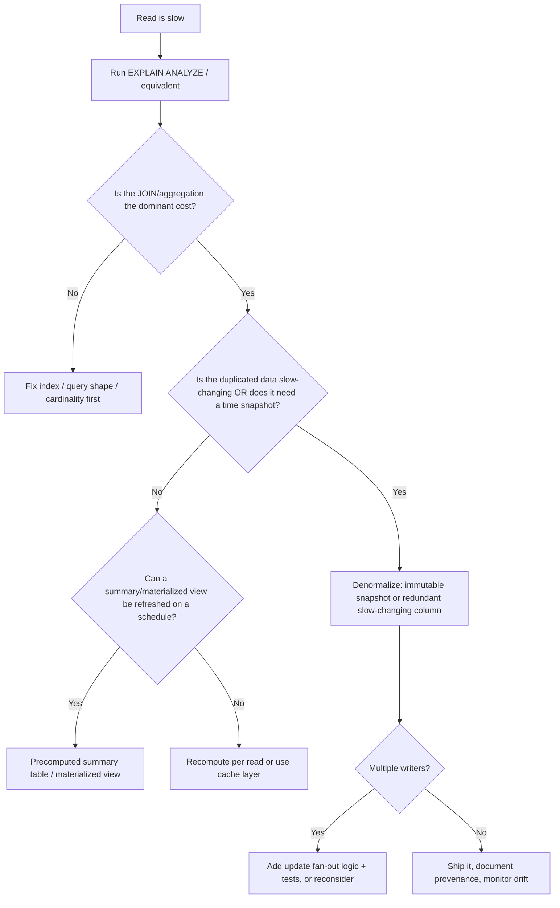

```markdown
# 91. Denormalization

## What it is

**Denormalization** is the deliberate act of introducing *redundant data* into a database design — on purpose — to reduce the cost of reading data, even though it increases the cost of writing data and maintaining consistency.

Where normalization removes redundancy to keep each fact in exactly one place, denormalization *adds redundancy back* in a controlled, documented way.

> Denormalization is not "bad design." It is a **tradeoff decision**: you accept write-time complexity and consistency risk in exchange for read-time speed and query simplicity.

A normalized schema answers "what is the truth?" cheaply. A denormalized schema answers "what is the fastest interesting read?" cheaply.

---

## Why it exists

JOINs and aggregations are the most expensive parts of a query. A fully normalized (3NF/BCNF) schema often requires:

- several JOINs on every read
- large aggregation scans to compute a running total
- repeated lookups of slow-changing data

For read-heavy workloads (reporting, dashboards, high-QPS web reads), that cost is paid on **every request**. Denormalization moves the cost forward — from read time to write time — so reads become simple primary-key lookups or single-table scans.

> Interview trap: interviewers love the phrase "normalize until it hurts, denormalize until it works." That is a slogan, not a law. The real rule is: **measure first, then denormalize only the hot path you can prove is slow.**

> Common misconception: "Denormalization is a fix for lousy queries." Often the correct fix is an index, not redundancy. Denormalization should only be considered **after** the execution plan has been examined.

---

## Quick recall: what normalization removed

| Normal form | What it does | What it costs on reads |
|---|---|---|
| 1NF | Single values per cell, no repeating groups | more rows, more joins |
| 2NF | No partial key dependencies in composite keys | extra lookup tables |
| 3NF | No transitive dependencies (e.g. `employee_id → department_id → department_name`) | the classic JOIN to get `department_name` |

Denormalization targets exactly these JOIN costs.

---

## The central tradeoff

| Property | Normalized | Denormalized |
|---|---|---|
| Read speed | Slower (JOINs, aggregations) | Faster (single scan / primary key hit) |
| Write speed | Faster (single place to update) | Slower (multiple copies to update) |
| Consistency | Strong by construction | Must be maintained manually or eventually |
| Storage | Minimal | Redundant / larger |
| Data integrity | Enforced by FK constraints | Not enforceable — code must keep copies in sync |
| Insert/update complexity | Low | High (update fan-out) |
| Query simplicity | Complex (many joins) | Simple (wide, flat rows) |
| Risk of drift | None | High (copies disagree over time) |
| Good for | OLTP, transactional truth | OLAP, reporting, read-heavy services |

Denormalization never changes the semantics of the *data as a whole* — it changes **when the copies are kept in sync** and **who is responsible for it**.

---

## When to denormalize (the good reasons)

1. **Read to write ratio is very high.** Dashboard read 10,000x more than they write.
2. **The duplicated column is slow-changing.** e.g. `customer_name` almost never changes.
3. **You need historical snapshots.** The current value is not enough; you must preserve the value *as it was at write time* (order price, product price, customer at order time).
4. **Precomputed aggregates** that are updated in controlled batches.
5. **The execution plan proves** that the JOIN or aggregation dominates the query and indexing cannot fix it.
6. **Fetching just a few columns from a huge table** — a narrow denormalized copy can avoid revving an enormous table (Vertical partitioning).
7. **Fan-out is 1:1-ish** — a few duplicated columns per row, not unbounded lists.

## When NOT to denormalize (the traps)

1. **The duplicated column changes frequently** (e.g. `user.status` copied onto 40 M rows but status flips hourly).
2. **Multiple writers** update the same logical fact concurrently — you will get races and drift.
3. **You need transactional referential integrity** — FKs cannot validate redundant copies.
4. **You have not looked at the execution plan yet.** This is the #1 premature-optimization trap.
5. **The read improvement is speculative.** You are removing a JOIN that runs 10x per hour to add write complexity to a 10,000 rps writer. Wrong direction.
6. **When the correct answer is an index** (covering index, composite index) or a **keyset pagination** fix instead.

> Production pitfall: Denormalization is a **commitment to writing custom synchronization** — a trigger, a batch job, an ETL step, or application logic. That code is now part of your integrity model. If it breaks, your data silently disagrees with itself. There is no `ON DELETE CASCADE` and no FK to save you.

---

## Internal working: how denormalization changes the execution plan

A normalized query commonly produced a plan like:

```
Nested Loop  (JOIN orders → customers)
  -> Index Scan on customers
  -> Index Scan on orders
```

A denormalized query collapses to:

```
Index Only Scan on orders_denormalized   (no join node at all)
```

The optimizer no longer has to choose a join strategy, estimate cardinality, or pick a nested-loop vs hash-join. That removes an entire class of plan instability. But it adds write-side work: every insert/update must now maintain the duplicate.

> Before claiming denormalization "is faster," run `EXPLAIN (ANALYZE, BUFFERS)` on both versions under realistic data (real cardinality, real statistics, real index state). Denormalization is a *design* change; only the execution plan tells you whether it actually paid for itself.

---

## When a JOIN is genuinely expensive: the driving question

Before designing anything, ask the SQL reasoning questions:

1. What does one output row represent?
2. What is the grain of each table?
3. Which table is the driving table?
4. Do I need columns from another table, or only existence?
5. Can the JOIN create duplicates (fan-out)?

Denormalization is a reasonable answer when the answer to #4 is "I need several columns from the other table, on a hot read path, at huge volume."

---

## The techniques (the actual toolbox)

| Technique | What you do | Read benefit | Write cost |
|---|---|---|---|
| Redundant columns | Copy a slow-changing lookup value into the "fact" row | Kills the JOIN | Update fan-out on change |
| Historical snapshot columns | Freeze a value at insert time (price_at_order, name_at_order) | Kills the JOIN **and** preserves history | None after insert — immutable by design |
| Precomputed aggregates ("summary tables") | Store `monthly_sales`, `user_balance` instead of computing them | Kills big aggregations | Must recompute/increment on every write |
| Materialized views | DB-managed precomputed result set | Same as summary tables but declared in SQL | `REFRESH` job on a schedule or manually |
| Vertical partitioning | Split wide table into narrow hot table + wide cold table | Smaller scans, better cache locality | Two inserts per logical row |
| Horizontal partitioning / sharding | Split by key (e.g. by month) | Smaller tables, partition pruning | Routing/partition logic |
| Duplicated reporting estate | Copy operational data into a separate reporting DB | Isolates heavy reads from OLTP | ETL/CDC pipeline, consistency lag |
| JSON/array storage of children | Store child rows as JSON in parent row | One primary-key read, no child scan | Unqueryable-at-scale, update rewrites whole row |
| Full-text / search index columns | Mirror key text into a search engine or tsvector | Specialized fast search | Duplicate state to maintain |

The rest of the section focuses on the first four, which are the ones SQL interviews and production daily work actually care about.

---

## Sample tables (grain matters)

```
employees       1 row = one employee
departments     1 row = one department
customers       1 row = one customer
orders          1 row = one order
order_items     1 row = one line on an order (order → items is 1:M)
products        1 row = one product
transactions    1 row = one payment/money movement
logins          1 row = one login event
events          1 row = one event
```

---

## Technique 1 — Redundant columns (kills the JOIN)

### The scenario

Leaf-me team. Every order read needs `customer_name`. In the normalized schema:

```sql
-- normalized: name lives only in customers
CREATE TABLE customers (
    customer_id   INT PRIMARY KEY,
    customer_name TEXT NOT NULL
);

CREATE TABLE orders (
    order_id       INT PRIMARY KEY,
    customer_id    INT NOT NULL REFERENCES customers (customer_id),
    order_total    NUMERIC(10, 2),
    ordered_at     TIMESTAMP NOT NULL
);
```

Every report JOINs:

```sql
SELECT o.order_id, c.customer_name, o.order_total
FROM orders o
JOIN customers c USING (customer_id)
WHERE o.ordered_at >= '2026-01-01';
```

### BAD APPROACH — denormalize a *mutable* column and duplicate it everywhere

```sql
CREATE TABLE orders (
    order_id       INT PRIMARY KEY,
    customer_name  TEXT NOT NULL,      -- denormalized copy
    order_total    NUMERIC(10, 2),
    ordered_at     TIMESTAMP NOT NULL
);
```

Why this is bad:

- `customer_name` changes (marriage, legal rename, correction).
- Now every name change is an **update fan-out**: `UPDATE orders SET customer_name = ... WHERE customer_id = ...` must touch every order row.
- The UPDATE is not atomic with the `customers` UPDATE — a crash between them leaves mixed values.
- A simplistic `UPDATE orders ... WHERE customer_id = ...` blocks a large range and can lock the table for a long-running transaction.

> Production pitfall: **fermentation of truth.** Two tables disagree about `customer_name`, and every downstream report aggregates a different value. Nobody notices until finance reconciles.

### BETTER APPROACH — snapshot, not copy

Keep the mutable value normalized; denormalize only the *immutable-at-insert* snapshot:

```sql
CREATE TABLE orders (
    order_id           INT PRIMARY KEY,
    customer_id        INT NOT NULL REFERENCES customers (customer_id),
    customer_name      TEXT NOT NULL,        -- snapshot AT ORDER TIME
    customer_region    TEXT NOT NULL,        -- snapshot AT ORDER TIME
    order_total        NUMERIC(10, 2),
    ordered_at         TIMESTAMP NOT NULL
);
```

Now:

- Cold reads do `SELECT order_id, customer_name ... FROM orders ...` — single table, no JOIN.
- The snapshot never changes, so there is **no update fan-out**, ever.
- History is *preserved* (a customer who moved regions still belongs to the region at order time), which is usually the *correct* analytical answer.

> This is the single most important lesson in denormalization: **copy values that never change, or values you want to freeze in time. Never duplicate values that are frequently updated and must stay current.**

Columns like `customer_region_at_order` belong in a fact table because they answer "at that moment."

---

## NULL behavior in denormalized snapshots

```sql
INSERT INTO orders (order_id, customer_id, customer_name, order_total, ordered_at)
VALUES (1, NULL, NULL, 99.00, now());
```

If order can legally have `customer_id = NULL` (anonymous checkout) then the snapshot column must also be allowed to be `NULL`. Rules to remember:

- **Snapshot column should default to the source column value**, i.e. `COALESCE` your read:

```sql
SELECT order_id,
       COALESCE(customer_name, '(unknown)') AS customer_name
FROM orders;
```

- **Aggregates ignore NULLs**: `COUNT(customer_name)` skips NULL snapshots, `COUNT(*)` does not. If you later build a summary table, the two counters will differ — a classic debugging surprise.
- If NULL is not meaningful for the snapshot, declare `NOT NULL` and enforce it at insert so the copy can never become "half-empty."

> Interview trap: "If `customer_name` is copied onto `orders`, and the customer is deleted, what happens?" — Answer: with an FK to `customers` still present, deletion is blocked (`RESTRICT`/`NO ACTION`), or if the FK is dropped entirely, the snapshot survives as an orphan — which makes the snapshot *perfect for audit*, but breaks referential integrity. There is no single right answer; it is a decision about what the column means.

---

## Technique 2 — Precomputed aggregates (summary tables)

### The scenario

`wallet_app.transactions` has 500 M rows. A dashboard shows each user's current balance.

Normalized = correct, brutal:

```sql
SELECT user_id, SUM(amount) AS balance
FROM transactions
WHERE user_id = 42
GROUP BY user_id;
```

With an index on `user_id` this is a fast index range scan — **fine at small scale**. But a "top balances" leaderboard must aggregate *every* user, and a unlogged "balance" computed on every payment-read hits a huge scan.

### BAD APPROACH — compute on every read, forever

```sql
-- every dashboard render does this over the whole table:
SELECT user_id, SUM(amount) AS balance
FROM transactions
GROUP BY user_id;
```

No amount of indexing makes a full-table aggregate cheap when the table is enormous *and* the query is frequent.

### BETTER APPROACH — maintained summary table

```sql
CREATE TABLE user_balance (
    user_id    INT PRIMARY KEY,
    balance    NUMERIC(12, 2) NOT NULL
);
```

Update it transactionally on every money movement:

```sql
BEGIN;
INSERT INTO transactions (txn_id, user_id, amount, occurred_at)
VALUES (9001, 42, -25.00, now());

INSERT INTO user_balance (user_id, balance)
VALUES (42, -25.00)
ON CONFLICT (user_id)
DO UPDATE SET balance = user_balance.balance + EXCLUDED.balance;
COMMIT;
```

Same transaction → the summary can never disagree with the detail rows. Reads become a single primary-key lookup:

```sql
SELECT balance FROM user_balance WHERE user_id = 42;
```

**Interpretation:** the two structures answer different questions — `transactions` is a ledger (exact detail), `user_balance` is a cached total. Both are "the truth," but they are updated together, atomically, in one transaction.

> PostgreSQL: the `ON CONFLICT ... DO UPDATE` upsert above is PostgreSQL syntax. MySQL uses `INSERT ... ON DUPLICATE KEY UPDATE`. SQL Server and Oracle use `MERGE`. The *pattern* (summary + detail in one transaction) is engine-agnostic.

> Production pitfall: never have **two logical writers** to `user_balance`. If two application instances both do "read balance, add amount, write balance" you get classic lost-update races. The `atomic increment` (the upsert above) must happen inside the same transaction as the detail insert.

---

## Technique 3 — Materialized views (the DB does the bookkeeping)

A materialized view is a precomputed result set stored like a table, refreshed on demand or on schedule.

### PostgreSQL

```sql
CREATE MATERIALIZED VIEW mv_daily_sales AS
SELECT p.category_id,
       date_trunc('day', o.ordered_at)             AS day,
       SUM(oi.quantity)                            AS units,
       SUM(oi.quantity * oi.unit_price)            AS revenue
FROM orders o
JOIN order_items oi USING (order_id)
JOIN products p    USING (product_id)
GROUP BY p.category_id, date_trunc('day', o.ordered_at)
WITH NO DATA;

REFRESH MATERIALIZED VIEW mv_daily_sales;   -- CONCURRENTLY requires a unique index
```

- `REFRESH MATERIALIZED VIEW CONCURRENTLY` does not block reads but requires a unique index and is slower.
- Plain `REFRESH` blocks concurrent reads in PostgreSQL; schedule it in a quiet window.

### Oracle

Oracle materialized views can be **incrementally refreshed** (fast refresh) using `CREATE MATERIALIZED VIEW ... REFRESH FAST ON COMMIT` with matching materialized-view logs on the base tables. `ON COMMIT` means near-transactional consistency of the precompute.

### SQL Server

`CREATE VIEW` there is a regular (virtual) view. The precomputed counterpart is an **indexed view** (requires `SCHEMABINDING`, a unique clustered index, specific aggregate/join restrictions) — the engine maintains it automatically on DML.

### MySQL

MySQL has no general materialized view. The pattern is summary tables maintained by `EVENT` scheduler jobs, triggers, or application code. (MySQL 8 does support a `CREATE VIEW` only as a lens; `MERGE`/`TEMPTABLE` algorithms are virtual.)

### The tradeoff

| Engine | Refresh model | Read consistency guarantee |
|---|---|---|
| PostgreSQL MV | manual / scheduled | whatever is in the last snapshot |
| Oracle `ON COMMIT` MV | automatic on commit | transactional-level (near real-time) |
| SQL Server indexed view | automatic on DML | transactional with schema restrictions |
| MySQL summary tables | manual (events, triggers, app) | whatever the batch produced |

Every materialized view is a *snapshot with a defined staleness window.* The moment you accept "the dashboard may be 5 minutes old," you have accepted **eventual consistency** for that read path.

> Production pitfall: `REFRESH MATERIALIZED VIEW mv` re-runs the entire defining select and can hold locks and consume I/O for minutes on large datasets. Verify with `EXPLAIN ANALYZE` how long a full refresh takes *before* wiring it into a nightly job — a refresh longer than your maintenance window is a silent outage at 2 a.m.

---

## Technique 4 — Historical snapshots vs CURRENT value (fan-out example)

### Scenario: product price at time of order

The normalized schema:

```sql
CREATE TABLE products (
    product_id   INT PRIMARY KEY,
    product_name TEXT NOT NULL,
    price        NUMERIC(10, 2) NOT NULL   -- current price, changes
);

CREATE TABLE order_items (
    order_id     INT,
    product_id   INT,
    quantity     INT NOT NULL,
    PRIMARY KEY (order_id, product_id)
);
```

Revenue report:

```sql
SELECT o.ordered_at::date           AS day,
       SUM(oi.quantity * p.price)   AS revenue
FROM orders o
JOIN order_items oi USING (order_id)
JOIN products p    USING (product_id)
GROUP BY o.ordered_at::date;
```

**BUG:** if the product's price changed after the order was placed, this report re-prices *history* using *today's* price. Revenue is wrong, retroactively, forever.

### BETTER APPROACH — denormalized snapshot at the line-item grain

```sql
CREATE TABLE order_items (
    order_id      INT,
    product_id    INT,
    quantity      INT NOT NULL,
    unit_price    NUMERIC(10, 2) NOT NULL,   -- price AT ORDER TIME (snapshot)
    PRIMARY KEY (order_id, product_id)
);
```

Now revenue is stable, immutable, and JOIN-free:

```sql
SELECT o.ordered_at::date         AS day,
       SUM(oi.quantity * oi.unit_price) AS revenue
FROM orders o
JOIN order_items oi USING (order_id)
GROUP BY o.ordered_at::date;
```

> Common misconception: "denormalization is only about speed." Here it is about **correctness through immutability** — the snapshot is the only way to replay history accurately. Always prefer an immutable snapshot over copying a live value.

---

## When the summary table must be batch-recomputed

Sometimes you cannot maintain incrementally (legacy writes you don't control, or the aggregation is too complex). A deterministic **IDEMPOTENT recompute** is the safety valve:

```sql
BEGIN;
TRUNCATE user_balance;
INSERT INTO user_balance (user_id, balance)
SELECT user_id, SUM(amount) AS balance
FROM transactions
GROUP BY user_id;
COMMIT;
```

- `TRUNCATE` is nearly free and resets nothing you care about here (see section `DELETE vs TRUNCATE vs DROP`).
- Do it inside a transaction so readers never observe an empty summary.
- The job MUST be idempotent: running it twice produces the same state.

---

## BAD vs BETTER — full example of "fixing" a slow report

### The slow report (the input)

```sql
SELECT c.region,
       COUNT(DISTINCT o.order_id)                 AS orders,
       SUM(oi.quantity * oi.unit_price)           AS revenue
FROM customers c
JOIN orders o      ON o.customer_id = c.customer_id
JOIN order_items oi ON oi.order_id = o.order_id
WHERE o.ordered_at >= '2026-01-01'
  AND o.ordered_at <  '2026-02-01'
GROUP BY c.region;
```

> Common misconception: the query is not "wrong to JOIN." It is **symptomatic** — the join over millions of rows each month is expensive. The fix isn't necessarily denormalization.

### Step 0 — inspect the plan before doing anything

```sql
EXPLAIN (ANALYZE, BUFFERS, TIMING) SELECT ...;   -- PostgreSQL
EXPLAIN ANALYZE SELECT ...;                      -- MySQL / SQL Server
```
Section cross-reference: index design, covering indexes, execution plans, cardinality.

Often the correct fixes *before* denormalization:

- composite index `(ordered_at, customer_id)` on orders
- composite index `(order_id)` covering `(order_id, quantity, unit_price)` on order_items — wait, order_id is already the PK prefix of order_items; a covering index isn't needed there.
- `COUNT(DISTINCT order_id)` is correct only if order_items fan-out would otherwise double-count; here `COUNT(DISTINCT ...)` exists precisely because the 1:M join can duplicate `order_id` — see `JOIN duplication`/`double counting` sections.

### BAD APPROACH — denormalize everything because a report is slow

```sql
-- one gigantic wide table as the "optimization"
CREATE TABLE report_sales AS
SELECT c.customer_id, c.customer_name, c.region,
       o.order_id, o.ordered_at, o.order_total,
       oi.product_id, oi.quantity, oi.unit_price
FROM customers c
JOIN orders o      ON o.customer_id = c.customer_id
JOIN order_items oi ON oi.order_id = o.order_id;
```

Why it's bad:

- Unexamined; the underlying query may already be fixable with an index.
- No refresh strategy → the report silently decays as new orders arrive.
- No grain documentation → tomorrow someone runs `SUM(revenue)` on it and double-counts because order-level and item-level rows coexist.
- Writable copies of everything = massive write fan-out.

### BETTER APPROACH — denormalize *down* the correct hierarchy, one grain per table

Keep the operational tables as-is. Create a precomputed *rolled-up* grain that already contains the JOIN's answer:

```sql
CREATE TABLE dim_seg_sales (
    sale_day       DATE PRIMARY KEY,
    region         TEXT NOT NULL,
    orders         INT  NOT NULL,
    revenue        NUMERIC(14, 2) NOT NULL,
    UNIQUE (sale_day, region)
);
```

Populate idempotently, then the dashboard reads a single narrow table:

```sql
SELECT sale_day, orders, revenue
FROM dim_seg_sales
WHERE sale_day BETWEEN '2026-01-01' AND '2026-01-31';
```

Grain discipline: **one row = one (day, region).** No fan-out is possible, so `SUM(revenue)` is always correct.

> Production pitfall: **mixing grains in one denormalized table** (order-level rows next to item-level rows) reintroduces the exact double-counting problem denormalization was supposed to remove. State the grain above every table and never let two grains coexist unpurposed.

---

## Popularity score example (real-world pinch)

A social feed needs each post's `comment_count`. Two designs:

1. Compute on read:

```sql
SELECT p.post_id,
       (SELECT COUNT(*) FROM comments c WHERE c.post_id = p.post_id) AS comment_count
FROM posts p
WHERE p.post_id = 123;
```

2. Denormalized counter:

```sql
ALTER TABLE posts ADD COLUMN comment_count INT NOT NULL DEFAULT 0;

CREATE OR REPLACE FUNCTION bump_comment_count() RETURNS trigger AS $$
BEGIN
    IF TG_OP = 'INSERT' THEN
        UPDATE posts SET comment_count = comment_count + 1 WHERE post_id = NEW.post_id;
    ELSIF TG_OP = 'DELETE' THEN
        UPDATE posts SET comment_count = comment_count - 1 WHERE post_id = OLD.post_id;
    END IF;
    RETURN NULL;
END; $$ LANGUAGE plpgsql;

CREATE TRIGGER trg_comments_count
AFTER INSERT OR DELETE ON comments
FOR EACH ROW EXECUTE FUNCTION bump_comment_count();
```

- Read: `SELECT comment_count FROM posts WHERE post_id = 123;` — O(1), JOIN-free.
- Write: trigger fires per row; high comment volume = hot-row contention on `posts` (`UPDATE` same row from many sessions → lock contention).

> Performance implication: the counter is fast to read and *potentially awful to write under concurrency* because many concurrent commenters increment the same post row and serialize on its row lock. Verify under a realistic concurrent load, not in a single-connection test. Sometimes the right call is to keep `COUNT(*)` on an index-only scan instead. Do not judge without load tests and an `EXPLAIN` of the cold read path.

---

## Update fan-out: the accountant's nightmare

```sql
-- logical change: customer 7 changed name
UPDATE customers SET customer_name = 'A. Patel' WHERE customer_id = 7;

-- fan-out that must be done manually if name is also on orders:
UPDATE orders SET customer_name = 'A. Patel'
WHERE customer_id = 7;  -- touches thousands of rows, locks a range, may deadlock with report reads
```

Because denormalized copies cannot have FKs back to the source, the application code is the integrity layer. Partial failure → **drift**:

| Failure point | State after crash |
|---|---|
| `customers` updated, fan-out not run | old name on all orders |
| fan-out half-run | mixed old/new names |
| rollback of one of the two | permanent divergence |

Anything can happen; the code must be written transactionally, in the right order, with retries — or the copies must be immutable snapshots so fan-out is impossible.

---

## NULL behavior summary (denormalization-specific)

| Situation | What you get | Trap |
|---|---|---|
| Snapshot column with NULL source | `NULL` on the copy | `COALESCE` reads; watch `COUNT(col)` vs `COUNT(*)` |
| `SUM(amount)` with no rows | `NULL` not 0 | Summary table writes `NULL` where it should write `0`. Use `COALESCE(..., 0)` in the recompute |
| `SUM(amount)` with only NULLs | `NULL` | same |
| `COUNT(*)` over summary rows that shouldn't exist | counts empty summary rows | guard PREDICATES push "0" rows into summaries |
| Upsert computation when counter starts at NULL | `NULL + 1 = NULL` | always seed the counter `DEFAULT 0` and `COALESCE` in increments |
| `LEFT JOIN` to a normalized table that's faster | NULL rows | if you denormalized, this class of NULL is gone — but only because you froze one value |

> Interview trap: "`SUM(x) + 1` returned NULL for a new user." — Because `SUM(NULL rows) = NULL`, and `NULL + 1 = NULL`. In PostgreSQL you'd write `SUM(x)` as `COALESCE(SUM(x), 0) + 1`. Across three-valued logic, every aggregate-based summary must decide what to do with the empty set.

---

## Consistency model comparison

| Model | Who guarantees it | Example cost | When acceptable |
|---|---|---|---|
| Strong (same transaction) | DB transaction: detail + summary written atomically | slightly longer write transaction, more locks | money movements, balances, counters |
| Eventual (scheduled) | Batch job / MV refresh | staleness window | dashboards, aggregates, non-critical ranking |
| Pull-on-demand | Cache invalidation at read time | complexity, thundering herd | rarely; prefer an explicit cache |
| Snapshot (immutable) | Insert-time freeze; no updates ever | none after insert | audit history, prices-at-order, regions-at-order |

---

## How to decide (a decision flowchart)



---

## Best practices

1. **Document provenance.** Every denormalized column needs an owner concept ("this is a copy of `customers.customer_name`; source of truth is `customers`"). Without this, the schema becomes impossible to audit.
2. **Prefer immutable snapshots** over live copies. If the value is in the past, freeze it.
3. **Keep the FK where possible.** If the copy should survive deletion, drop the FK deliberately and say so; otherwise `ON DELETE` cascades silently break your reports.
4. **State the grain** above every denormalized table. "One row = one (day, region)."
5. **One writer per redundant structure.** If two processes calculate the summary, you get lost updates.
6. **Make recompute idempotent.** `TRUNCATE` + rebuild inside a transaction is the safest and simplest refresh that any operator can rerun.
7. **Never denormalize to hide a missing index.** Optimize first, denormalize second, and prove the plan changed.
8. **Monitor drift.** A tiny scheduled diff query (`SELECT COUNT(*) FROM orders o JOIN customers c ON ... WHERE o.customer_name <> c.customer_name`) turned into an alert catches every sync failure.
9. **Keep denormalized tables read-only.** Only your writer/ETL can touch them. Anonymous analysts truncating a summary is a career-ending commit.
10. **Design for the refresh window.** "How stale am I willing to be?" answered first, refresh mechanics second.

---

## Common mistakes (checklist)

| # | Mistake | Consequence | Correct move |
|---|---|---|---|
| 1 | Duplicating a frequently-changing column | update fan-out, drift | snapshot or keep normalized |
| 2 | Denormalizing before running the plan | complexity with no win | `EXPLAIN ANALYZE` first |
| 3 | Multiple writers to one summary | lost updates, wrong totals | single-writer, atomic upsert |
| 4 | Mixing grains in one table | double counting (see JOIN duplication) | separate tables per grain |
| 5 | No refresh strategy | silent staleness, users see old data | scheduled idempotent job |
| 6 | Forgetting NULL result of empty aggregates | `NULL` balances instead of 0 | `COALESCE(...)`, `DEFAULT 0` |
| 7 | `COUNT(col)` vs `COUNT(*)` on snapshot w/ NULLs | undercounted rows | be explicit which one you mean |
| 8 | Dropping FKs without deciding behavior | orphaned snapshots by accident | decide, document |
| 9 | No provenance docs | nobody trusts the numbers | document source of every copy |
| 10 | Triggers that only fire for INSERT | deletes/complex updates desync | cover INSERT/UPDATE/DELETE |

---

## Interview traps to memorize

> Interview trap: "Should you always normalize?" — No. It depends on read/write ratio, staleness tolerance, and measured execution plans. Answers demanding *always* either way are red flags.

> Interview trap: "Does denormalization make queries faster?" — Sometimes, for the reads it targets, at the cost of writes and consistency. It is not free and not automatic; verify with `EXPLAIN ANALYZE`.

> Interview trap: "What happens if a customer's name changes?" — Either you accept a snapshot that freezes the old name (correct for analytics), or you accept a fan-out update that can drift (dangerous). State which.

> Interview trap: "Materialized view vs summary table?" — Same family. MVP/summary table = you maintain it; materialized view = the engine maintains the definition (PostgreSQL refresh is manual; Oracle can do `ON COMMIT`; SQL Server indexed views auto-maintain within restrictions).

> Interview trap: "Is a denormalized table a cache?" — Thought-terminating comparison. Legitimately: yes, it is a write-through cache with no TTL. That framing immediately surfaces the true questions: invalidation, staleness, and who refreshes.

> Cross-reference: see sections on `normalization`, `NULL / three-valued logic`, `JOIN duplication / fan-out / double counting`, `GROUP BY vs window functions`, `indexes / covering indexes / sargability`, `execution plans / cardinality`, `DELETE vs TRUNCATE vs DROP`, `UNION vs UNION ALL` (merging denormalized reports), `transactions / isolation levels` (why the summary + detail write must share a transaction).

---

# Interview Questions

## Beginner

1. What is the difference between normalization and denormalization?
2. Name three reasons someone might denormalize a database.
3. Why can a denormalized table be faster for reads than a normalized one?
4. What is the biggest cost you pay when you denormalize?
5. In the `orders` + `customers` example, what problem does storing `customer_name` on every `orders` row cause if the customer's name changes?

## Intermediate

6. Explain update fan-out with an example.
7. What is a summary table? Give one table and the query it replaces.
8. What is a materialized view and how is it different from a regular view?
9. When you copy a "current value" (like a product price) onto an order row, why should you freeze a snapshot instead of copying the live value?
10. What NULL traps appear when you precompute `SUM(x)` into a summary column?
11. You have a counter on a post (`comment_count`). What are the concurrency dangers, and how would you write the increment correctly?

## Advanced

12. Compare PostgreSQL materialized views, Oracle `ON COMMIT` refreshes, SQL Server indexed views, and MySQL summary tables.
13. Design a `user_balance` table given a `transactions` ledger. How do you guarantee the detail and the total never disagree?
14. How would you implement an idempotent nightly recompute of a summary table inside a transaction, and why is idempotency important?
15. Give a scenario where denormalization is the *correctness* fix, not a performance fix.
16. How do you detect and alert on drift between a source column and its denormalized copies?

## Scenario Based

17. A dashboard is slow: it JOINs `customers`, `orders`, `order_items` to compute monthly revenue by region. Walk through how you decide whether to index, rewrite the query, or denormalize. Include the role of `EXPLAIN`.
18. Your product requires projecting revenue *as of the order date*, but product prices change frequently. Design the schema. Where does each piece of unchangeable history live?
19. You add a `comment_count` to `posts` via a trigger. News goes viral; the post row becomes hot. What happens to write throughput and what options do you have?
20. A legacy system writes to `transactions` that you do not control. How do you keep `user_balance` correct anyway?

## Tricky

21. If a snapshot column on `orders` is derived from `customers.customer_name`, and the customer is deleted, the snapshot survives. Is that a bug or a feature? When is each answer right?
22. `SUM(amount)` returned `NULL` for a brand-new customer in a precomputed balance. Explain exactly why, referencing three-valued logic.
23. A summary table mixes order-level and order_item-level grain. Someone runs `SUM(revenue)`. What could be wrong and how do you detect it?
24. A nightly `REFRESH MATERIALIZED VIEW` overlaps the reporting hour. What do you check, and what are the refresh options?

## Output Prediction

For each, write the result or why it's wrong:

25. `SELECT COALESCE(SUM(amount), 0) AS balance FROM transactions WHERE user_id = 999;` if `user_id = 999` has no rows.
26. `SELECT COUNT(*) , COUNT(customer_name) FROM orders;` if 5 of 100 orders have a `NULL` `customer_name` snapshot.
27. `UPDATE orders SET customer_name = (SELECT customer_name FROM customers WHERE customer_id = 7);` — it ran while another transaction updated the customer's name. What are the possible outcomes under default read committed isolation?
28. `INSERT INTO user_balance VALUES (42, NULL);` then `UPDATE user_balance SET balance = balance + 10 WHERE user_id = 42;` — what is `balance` now, and why?

## Debugging

29. The dashboard and the nightly report disagree about January revenue by exactly the number of renamed customers. Where would you look first?
30. `comment_count` shows 0 for a post that clearly has comments. The trigger only handles `AFTER INSERT`. What is the bug?
31. A materialized view refresh fails at 2 a.m. and the morning report shows missing days. What in your design caused this and how do you make it self-healing?
32. `SUM(revenue)` on a "wide" denormalized table with one row per order and also per order_item returns double the expected amount. Is the data wrong or the query wrong?

## Performance

33. True or false, with explanation: denormalization always makes a system faster.
34. You see a nested-loop JOIN dominating the plan for a hot report. What are the three categories of fix, and which one should you try first, and why?
35. Why must you run `EXPLAIN (ANALYZE, BUFFERS)` (or the engine equivalent) on *both* the normalized and denormalized queries before committing to a redesign?
36. A counter-update on `posts` serializes concurrent commenters on a single hot row. Suggest three alternatives (including a read-time `COUNT(*)` on a covering index) and describe when each wins.
37. Design a monitoring query that surfaces drift between `orders.customer_name` and `customers.customer_name` without scanning billons of rows on every run.
```
