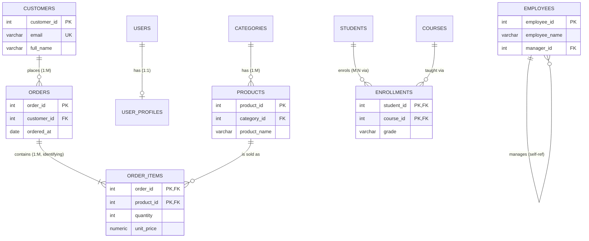

The section file `92-Keys-and-Relationships.md` exists but is empty. I'll generate the full section now.
Wrote `sql-handbook/10-Database-Design/92-Keys-and-Relationships.md` — full section (~600 lines): key vocabulary, natural vs surrogate, 1:1/1:M/M:N encoding with junction tables, self-referential FKs, referential actions (with per-engine table), NULL behavior, edge cases, BAD/BETTER examples, relationship diagrams, and 48 unanswered interview questions across all
r"); a key is the *physical mechanism* the database uses to make that meaning real, checkable, and joinable.

> Grain reminder: every definition in this section carries a grain — "one row in `orders` represents one order." Decide the grain *before* choosing keys, because the grain decides the keys, and the keys decide the relationships.

### What a relationship is

A relationship is a rule about how rows in two tables correspond:

| Relationship | Rule | One sentence example |
|---|---|---|
| **1:1** | each A row matches **at most one** B row, and vice versa | one `user` ↔ one `user_profile` (if present) |
| **1:M** | each A row matches **zero to many** B rows; each B row matches **exactly one** A row | one `customer` → many `orders` |
| **M:N** | each A row matches **many** B rows, and each B row matches **many** A rows | many `students` ↔ many `courses` |

Keys encode these rule *types*; foreign-key **constraints** enforce them; **indexes** pay for them at query time. This section is about all three, in that order.

> Cross-referenced sections: 04-Constraints-Keys for full constraint syntax; 90-Normalization for superkey/candidate-key theory; 3-Joins for how relationships behave at query time; 72-Indexes-Basics and 73-Composite-Indexes for why every key creates or consumes an index; 78-EXPLAIN-Execution-Plans for verifying any performance claim; 2-NULL-and-Logic for NULL semantics.

---

## The key family — learn the exact vocabulary

| Term | Definition | NULLs allowed? | How many per table | engine artifact |
|---|---|---|---|---|
| **Superkey** | any set of columns whose values are unique across all rows | no (a row must be identifiable) | many | none — a design concept |
| **Candidate key** | a *minimal* superkey, i.e. one where removing any column breaks uniqueness | no | 0+ | none unless you enforce it |
| **Primary key (PK)** | the candidate key you nominate as the row identity | **no** — impossible by definition | exactly one | a unique index / clustered row id |
| **Alternate key** | a candidate key you *did not* choose as PK | no | 0+ | only if you also declare `UNIQUE` |
| **Unique key** | any column(s) with a `UNIQUE` constraint | **yes** — multiple NULLs are allowed on every major engine | 0+ | a unique index |
| **Natural key** | a key made of columns that have business meaning (*email, license plate, `employee_code`*) | depends | — | — |
| **Surrogate key** | a system-generated, business-meaningless id (*`IDENTITY`, `AUTO_INCREMENT`, `SEQUENCE`, `UUID`*) | no | — | identity/sequence/autoincrement facility |
| **Composite (compound) key** | any key made of 2+ columns | no (as a key) | — | composite index |
| **Foreign key (FK)** | a column or column set in a child table whose values must `=` a value in the parent's PK/UNIQUE, or be `NULL` | **yes** (that is the entire "optional relationship" mechanism) | 0+ | no auto index — *you* must index the child side |

### Superkey vs candidate key vs PK vs alternate key in one example

Grain: one row per customer.

```sql
-- Columns: customer_id, email, phone
```

- `customer_id` is unique → superkey.
- `email` is unique → superkey.
- `(customer_id)` and `(email)` are **minimal** → candidate keys.
- `(email, phone)` is a superkey but *not* a candidate key (you can drop `phone` and still be unique).
- You pick `customer_id` as PK → `email` becomes the **alternate key**.

The database only knows about the ones you declare. If you *believe* `email` is unique but never add `UNIQUE`, the engine will happily store two rows with the same email. Candidate keys are only real when they are enforced.

> Interview trap: "A primary key is the only uniqueness guarantee in the table." If the business guarantees other natural values are unique, those are candidate keys and deserve `UNIQUE` constraints too — otherwise the database silently accepts duplicates that your business rules forbid.

> Common misconception: "A UNIQUE column is a candidate key." Not exactly — a NULLable `UNIQUE` column allows multiple `NULL`s, and a `NULL` means the row is *not* identifiable by that column. A genuine candidate key must be `NOT NULL`. See the NULL behavior section.

---

## Natural keys vs surrogate keys — the design decision

This is the single most common "keys" interview topic, and it is a tradeoff, not a purity test.

| Property | Natural key (`email`, `employee_code`, `sku`) | Surrogate key (`id`, `UUID`) |
|---|---|---|
| Business meaning | meaningful, visible in audit reports | meaningless — an internal pointer |
| Stability | **can drift** (email changes, SKUs get renumbered, phone numbers reset) | stable by construction, never reused |
| Uniqueness guarantee | comes from the real world, must be verified | comes from the engine |
| Width | often a string of 10–100 characters | typically 4–16 bytes |
| Joins | wide keys inflate every index they touch | narrow keys keep indexes small |
| External APIs | sometimes *should* expose it (SKU to customers) | should usually *not* be exposed raw |
| Human lookups | great — people search by them | useless — nobody knows their own `customer_id` |

The production standard is: **surrogate PK for join stability + `UNIQUE` constraint on the natural key for business rules.**

### BAD APPROACH — the natural key is the PK and the FK

```sql
-- grain: one row per employee; employee_code is set by HR
CREATE TABLE employees (
    employee_code VARCHAR(20) PRIMARY KEY,     -- natural key promoted to PK
    full_name     VARCHAR(100) NOT NULL,
    department_id INTEGER NOT NULL
);

-- grain: one row per paycheck
CREATE TABLE paychecks (
    paycheck_id    INTEGER PRIMARY KEY,
    employee_code  VARCHAR(20) NOT NULL REFERENCES employees (employee_code),
    gross_amount   NUMERIC(12,2) NOT NULL
);
```

It works until it doesn't. HR renumbers employees after an acquisition, or reuses a legacy code. Now:

- `UPDATE employees SET employee_code = 'NEW-1' WHERE employee_code = 'OLD-1'` must either `CASCADE` across every `paycheck` row (SQL Server and MySQL support `ON UPDATE CASCADE`, PostgreSQL does; Oracle has **no** `ON UPDATE` at all), or leave dozens of orphaned paychecks pointing at a code that no longer exists.
- The code column is also the FK, so every join and every index on it pay for a 20-character key.

### BETTER APPROACH — surrogate PK + enforced natural key

```sql
CREATE TABLE employees (
    employee_id   INTEGER GENERATED ALWAYS AS IDENTITY PRIMARY KEY,
    employee_code VARCHAR(20) NOT NULL UNIQUE,   -- natural key stays a candidate key
    full_name     VARCHAR(100) NOT NULL,
    department_id INTEGER NOT NULL
);

CREATE TABLE paychecks (
    paycheck_id  INTEGER PRIMARY KEY,
    employee_id  INTEGER NOT NULL REFERENCES employees (employee_id),
    gross_amount NUMERIC(12,2) NOT NULL
);
```

Now a renumber in `employee_code` touches exactly **one row**, and every paycheck keeps pointing at the same stable `employee_id`. The join key is a 4-byte integer. The natural key is still enforced as unique, so HR cannot create duplicates.

> Interview trap: "Surrogate keys always win." No — they win for *stability* and *width*, but they hide a fact: if the natural key is unique and business rules depend on it, you must still declare `UNIQUE`. And in reporting, users prefer reading `employee_code` over joining to get it back. The correct answer is almost always *both* (surrogate PK + `UNIQUE` natural), not one or the other.

> Production pitfall: never let application code "generate its own id" from a counter in the app layer. The engine's identity facility (`IDENTITY`/`AUTO_INCREMENT`/`SEQUENCE`, or a `UUID` generated server-side) is atomic; a read-modify-write counter in the app can hand out duplicate ids under concurrency.

---

## Relationships — how each cardinality is encoded

### The encoding rules

| Relationship | Where the FK lives | FK `NOT NULL`? | FK also `UNIQUE`? | Example |
|---|---|---|---|---|
| **1:M** | FK on the **many** side (`orders.customer_id`) | usually yes | no | `customers` → `orders` |
| **1:1** | FK on one side, pointing at the other's PK | optional | **yes** (ideally the FK *is* part of the PK) | `users` ↔ `user_profiles` |
| **M:N** | a third **junction/associative** table holding two FKs | yes | composite PK on (both FKs) | `students` ↔ `courses` |

The golden rule that covers most schema design: **put the foreign key on the many side and reference the one side's key.**

### Three rules that must hold for every FK (ANSI semantics)

1. The referenced columns are the parent's `PRIMARY KEY` or a `UNIQUE` constraint.
2. Every non-NULL child value must match a parent value (referential integrity).
3. The column types must be **compatible** between child FK and parent key — same or implicitly castable type (PostgreSQL even allows e.g. `BIGINT` parent / `INTEGER` child).

> Common misconception: "A foreign key must reference the primary key." It only needs to reference a *unique* key. Referencing a `UNIQUE` (non-PK) column is legitimate and occasionally useful — e.g. a `payments` table referencing `orders.order_ref` (a public reference number) instead of the internal `order_id`. Just remember the child-side index rule applies there too.

### Identifying vs non-identifying relationships

This is MySQL Workbench / crow's-foot vocabulary, not ANSI SQL, but interviewers and design discussions use it constantly:

| | **Identifying relationship** | **Non-identifying relationship** |
|---|---|---|
| Child FK participates in the child's PK | yes (child is a *weak entity*) | no (FK is an ordinary column) |
| Child can exist without the parent | **no** — deleting/never-having the parent removes the child's identity | yes, if the FK is nullable |
| Example | `order_items.order_id` is part of PK `(order_id, product_id)` | `orders.customer_id` is a plain column |
| Arrow in tools | solid line | dashed line |

An identifying relationship usually implements "this thing has no existence of its own": an order line, an enrollment, a line on an invoice. A non-identifying relationship usually implements "this thing exists independently and merely *refers* to that other thing."

---

## One-to-many (1:M) — the workhorse

Grain statements first:

- One row in `customers` represents one customer.
- One row in `orders` represents one order, belonging to exactly the `customer_id` shown.
- One row in `order_items` represents one product line within one order.

```sql
-- parent
CREATE TABLE customers (
    customer_id INTEGER GENERATED ALWAYS AS IDENTITY PRIMARY KEY,
    email       VARCHAR(255) NOT NULL UNIQUE,
    full_name   VARCHAR(100) NOT NULL
);

-- child: the FK lives here, on the "many" side
CREATE TABLE orders (
    order_id    INTEGER GENERATED ALWAYS AS IDENTITY PRIMARY KEY,
    customer_id INTEGER NOT NULL REFERENCES customers (customer_id),  -- mandatory 1:M
    ordered_at  DATE        NOT NULL DEFAULT CURRENT_DATE
);
```

Notice `orders.customer_id` is `NOT NULL`: that makes the relationship **mandatory** (every order has a customer). If guest checkouts were allowed, it would be nullable — see NULL behavior below.

Sample data:

```sql
INSERT INTO customers (email, full_name) VALUES
  ('ada@example.com', 'Ada Lovelace'),
  ('linus@example.com', 'Linus Torvalds');

INSERT INTO orders (customer_id, ordered_at) VALUES
  (1, '2026-01-02'),
  (1, '2026-01-15'),
  (2, '2026-01-20');
```

Expected result of the classic 1:M read (grain of the query: one row per order, customer repeated):

```sql
SELECT c.full_name, o.order_id, o.ordered_at
FROM   orders o
JOIN   customers c ON c.customer_id = o.customer_id;
```

| full_name | order_id | ordered_at |
|---|---|---|
| Ada Lovelace | 201 | 2026-01-02 |
| Ada Lovelace | 202 | 2026-01-15 |
| Linus Torvalds | 203 | 2026-01-20 |

> Interview trap: "Show me every customer, counting their orders." If you `JOIN` and `COUNT(*)`, customers with zero orders disappear from the result — the `FROM customers ... LEFT JOIN orders` variant is required, and the count must be `COUNT(o.order_id)`, not `COUNT(*)` (5-Aggregation, 39-COUNT-NULL-Pitfalls). Every 1:M aggregate question is secretly a "what happens to the zero side?" question.

### The child-side index you must add

> Production pitfall: an FK does **not** create an index on the *child* columns in PostgreSQL, SQL Server, or Oracle. MySQL/InnoDB creates one automatically. Without it, every `DELETE`/`UPDATE` of a parent row forces a scan of the child table looking for referencing rows, and every join-by-customer is a full scan. Create it with the FK:

```sql
CREATE INDEX idx_orders_customer_id ON orders (customer_id);
CREATE INDEX idx_order_items_order_id ON order_items (order_id);
```

Whether that index helps a *given* query is an execution-plan question (78-EXPLAIN-Execution-Plans); but it is close to mandatory on the write path, because FK *validation* is a lookup that goes child-side as well. See Performance implications.

---

## One-to-one (1:1) — rare, and usually deliberate

### When a real 1:1 exists

Row-level 1:1 almost always looks suspicious, because "exactly one" per row can live in the same table. But legitimate reasons exist:

| Reason | Example |
|---|---|
| Large, rarely-read payload drags down the hot table | `users` vs `user_profiles` with avatar blobs |
| Access control / compliance separation | `users` (login) vs `credentials` (password hash — locked-down access) |
| Optional extended attributes | an optional `medical_record` with its own retention policy |
| Very wide legacy tables split for storage engines | partition-like separation |

### How to encode 1:1 correctly

**Option A — the FK is also the PK (the clean one):**

```sql
-- grain: one row per user
CREATE TABLE users (
    user_id INTEGER GENERATED ALWAYS AS IDENTITY PRIMARY KEY,
    login   VARCHAR(50) NOT NULL UNIQUE
);

-- grain: one row per user profile (at most one per user, automatically)
CREATE TABLE user_profiles (
    user_id      INTEGER PRIMARY KEY REFERENCES users (user_id),
    display_name VARCHAR(100) NOT NULL,
    avatar_url   TEXT
);
```

Because `user_profiles.user_id` is its **primary key**, a second profile for the same user is structurally impossible — the PK forbids a duplicate `user_id`. This makes the 1:1 *mandatory* whenever a profile row exists (a profile cannot exist without its user) and at-most-one by construction.

**Option B — separate PK + UNIQUE FK:**

```sql
CREATE TABLE user_profiles (
    profile_id   INTEGER PRIMARY KEY,
    user_id      INTEGER UNIQUE REFERENCES users (user_id),
    display_name VARCHAR(100) NOT NULL
);
```

Same at-most-one guarantee, but here a profile "exists on its own" conceptually.

### BAD APPROACH — accidental 1:M dressed as 1:1

```sql
CREATE TABLE users (
    user_id      INTEGER PRIMARY KEY,
    doctor_id    INTEGER REFERENCES doctors (doctor_id)  -- no UNIQUE!
);
```

Nothing stops two `users` rows from pointing at the same doctor, or `users` from holding two `doctor_id` values with repeated columns. If the rule is "each user has at most one doctor," a FK without `UNIQUE` does not express it.

> NULL behavior nuance: `UNIQUE (user_id)` in Option B allows **many** NULL profiles (absent profiles), whereas making the FK the PK allows zero rows (absent is zero rows) — both fine. But if you *needed* "exactly one profile and it must always exist," the only correct encoding is one table, or a FK + `NOT NULL` + `UNIQUE` in the same child table with a guarantee the app always inserts it (transactionally). See 86-ACID for why that guarantee needs transaction discipline.

---

## Many-to-many (M:N) — junction / associative tables

One `student` takes many `courses`; one `course` has many `students`. A `students.course_id` single column cannot express "many": it would force a student onto exactly one course. The relational answer is a **junction table** (also called link, join, associative, or bridge table) holding *both* FKs.

Grain statements:

- One row in `students` represents one student.
- One row in `courses` represents one course.
- One row in `enrollments` represents **one student enrolled in one course** — one (student, course) pairing, with its grade.

```sql
CREATE TABLE students (
    student_id   INTEGER GENERATED ALWAYS AS IDENTITY PRIMARY KEY,
    student_name VARCHAR(100) NOT NULL
);

CREATE TABLE courses (
    course_id   INTEGER GENERATED ALWAYS AS IDENTITY PRIMARY KEY,
    course_name VARCHAR(100) NOT NULL
);

-- the junction: both FKs are NOT NULL and together form the PK
CREATE TABLE enrollments (
    student_id INTEGER NOT NULL REFERENCES students (student_id) ON DELETE CASCADE,
    course_id  INTEGER NOT NULL REFERENCES courses  (course_id)  ON DELETE CASCADE,
    grade      VARCHAR(2),
    PRIMARY KEY (student_id, course_id)
);

CREATE INDEX idx_enrollments_course_id ON enrollments (course_id);
```

Why the composite PK `(student_id, course_id)`? Because "the same student enrolled in the same course twice" is a duplicate fact. The PK makes it impossible; the FK columns become a unique index, which is also exactly the index the "course side" lookups want (partition by `course_id`) — a two-for-one (73-Composite-Indexes).

Sample data:

```sql
INSERT INTO students (student_id, student_name) VALUES
  (1, 'Ada'), (2, 'Linus'), (3, 'Grace');
INSERT INTO courses (course_id, course_name) VALUES
  (10, 'SQL Mastery'), (11, 'Distributed Systems'), (12, 'Operating Systems');
INSERT INTO enrollments (student_id, course_id, grade) VALUES
  (1, 10, 'A'), (1, 11, 'A-'), (2, 10, 'B'), (3, 12, 'A');
```

Expected result of the read across all three tables (grain: one row per enrollment):

```sql
SELECT s.student_name, c.course_name, e.grade
FROM   enrollments e
JOIN   students s ON s.student_id = e.student_id
JOIN   courses  c ON c.course_id  = e.course_id;
```

| student_name | course_name | grade |
|---|---|---|
| Ada | SQL Mastery | A |
| Ada | Distributed Systems | A- |
| Linus | SQL Mastery | B |
| Grace | Operating Systems | A |

> Interview trap: **fan-out and double counting.** The moment you `JOIN` `students` to `enrollments`, "number of students per course" is fine, but "total students" while the join is active counts Ada twice. Cross ref 21-JOIN-Duplicates-and-Fanout and 22-Many-to-Many-Joins. The shape of the correct count depends on which grain you want: `COUNT(DISTINCT s.student_id)` for the students grain, `COUNT(*)` for the enrollment grain. Never assume the row count of a joined result matches either table's grain.

### M:N with payload becomes two 1:M

`enrollments.grade` and `order_items.quantity` + `unit_price` are facts about *the pairing itself*, not about either side. Adding payload is called an **associative entity**: it now stands on its own, and the schema is best understood as `students` 1:M `enrollments` M:1 `courses` — two identifying 1:M relationships meeting in the middle.

### Should the junction get a surrogate `id`?

| Keep composite PK `(a_id, b_id)` | Add a surrogate `id PRIMARY KEY` |
|---|---|
| the pair is genuinely unique → PK enforces no duplicates automatically | the pair is *not* unique (same product twice in one order) |
| no extra column and index | each row is addressable directly (`enrollment_id = 5`) |
| FKs from elsewhere must be composite and wide | downstream tables hold one narrow FK |
| history of "same pair, re-enrolled" is impossible | you can store repeated pairs with distinct rows |

There is **no universal winner** — it depends on whether the pairing is unique and whether you need to reference individual pairings. Do not add a surrogate id "just to have an id"; a junction table whose PK is the pair is perfectly normal.

> Production pitfall: real order systems frequently let a customer buy the *same product twice* on one order (different line items, sometimes different prices or gift wrapping). In that case `(order_id, product_id)` is **not** unique and is a *wrong* PK. The grain is one row per **line**, so the key must be `(order_id, line_no)` or a surrogate `order_item_id`. Choosing the wrong key here turns legitimate duplicate lines into falsified data (drops, merges, or constraint errors). This is also the favorite 90-Normalization trap.

---

## Self-referential (recursive) relationships

Sometimes a table points at *itself*: a manager is an employee; a category is a child of another category.

```sql
-- grain: one row per employee; manager_id refers to another row in this table
CREATE TABLE employees (
    employee_id   INTEGER GENERATED ALWAYS AS IDENTITY PRIMARY KEY,
    employee_name VARCHAR(100) NOT NULL,
    manager_id    INTEGER REFERENCES employees (employee_id)  -- self FK
);

CREATE INDEX idx_employees_manager_id ON employees (manager_id);
```

`NULL` in `manager_id` = this employee has no manager (the CEO/root). A self-join turns "who reports to whom" into a query (19-SELF-JOIN), and unbounded "entire org chain" needs a recursive CTE (34-Recursive-CTEs).

Sample data:

```sql
INSERT INTO employees (employee_id, employee_name, manager_id) VALUES
  (1, 'Ada',    NULL),
  (2, 'Linus',  1),
  (3, 'Grace',  1),
  (4, 'Ken',    2);
```

Expected result of "each employee's manager":

```sql
SELECT e.employee_name AS employee, m.employee_name AS manager
FROM   employees e
LEFT   JOIN employees m ON m.employee_id = e.manager_id;
```

| employee | manager |
|---|---|
| Ada | NULL |
| Linus | Ada |
| Grace | Ada |
| Ken | Linus |

> Interview trap: a self-FK with `NULL` root means "no manager", but a `DELETE` of Ada is then *blocked* (her reports reference her) by default `NO ACTION`. "Delete this employee and reassign their team" is two statements inside one transaction — deleting Ada first fails because Linus and Grace reference her. The correct order is `UPDATE employees SET manager_id = ... ` first, then `DELETE`. Cross-ref 86-ACID / 85-Transactions.

---

## Referential integrity actions — what happens to the child when the parent goes away

When you `DELETE` a parent row (or change its key with `ON UPDATE`), the engine consults the action on the FK:

| Action | Behavior on parent DELETE/UPDATE | Keeps history? | Danger |
|---|---|---|---|
| `NO ACTION` (default, many engines) | reject the operation while a referencing child exists | yes, by refusing | statements fail unless you clean children first |
| `RESTRICT` | reject immediately, same as NO ACTION but never deferrable | yes, by refusing | same as above |
| `CASCADE` | delete children (DELETE) / update their FK (UPDATE) | **no** — children vanish | accidental mass deletes; cascade *storms* |
| `SET NULL` | set the child FK columns to `NULL` | **no** — the link is lost | requires the FK column to be nullable, else the statement errors |
| `SET DEFAULT` | set the child FK columns to their declared `DEFAULT` | no — link rewritten | default value must satisfy the FK; MySQL/InnoDB rejects it |

Example — deleting Ada (`customer_id = 1`) who owns orders 201 and 202:

```sql
DELETE FROM customers WHERE customer_id = 1;
```

- with `NO ACTION`/`RESTRICT` → `ERROR: update or delete on table "customers" violates foreign key constraint ... Key (customer_id)=(1) is still referenced from table "orders".`
- with `ON DELETE CASCADE` → orders 201 and 202 are deleted silently along with the customer.
- with `ON DELETE SET NULL` (`customer_id` nullable) → orders keep existing, `customer_id` becomes `NULL`.

### Engine support table

| Action | PostgreSQL | MySQL (InnoDB) | SQL Server | Oracle |
|---|---|---|---|---|
| `RESTRICT` | yes (immediate, cannot defer) | yes (this is the InnoDB default) | no (use `NO ACTION`) | no |
| `NO ACTION` | yes (default) | behaves exactly like `RESTRICT` | yes (default) | yes (default) |
| `ON DELETE CASCADE` | yes | yes | yes | yes |
| `ON DELETE SET NULL` | yes | yes | yes | yes |
| `ON DELETE SET DEFAULT` | yes | **parsed but rejected by InnoDB** | yes | no |
| `ON UPDATE CASCADE / SET NULL / SET DEFAULT` | yes | yes | yes | **no** — Oracle has no `ON UPDATE` clause |
| `DEFERRABLE` constraint (check at commit) | yes | no | no | yes |

> PostgreSQL: `NO ACTION` and `RESTRICT` are the same *unless* the constraint is declared `DEFERRABLE`. `NO ACTION`+`DEFERRABLE INITIALLY DEFERRED` defers the check to `COMMIT`, which is how you build circular FKs (A references B, B references A). `RESTRICT` can never be deferred.

> Production pitfall: cascades are where schema decisions delete real money. A `customers → orders → order_items → invoices` chain with `CASCADE` everywhere means deleting one customer detonates a delete tree whose width you did not estimate. Also, each cascaded delete scans/validates — the delete can take minutes and lock large regions (88-Locks-and-Blocking). Prefer `NO ACTION`/`RESTRICT` as the default; use `CASCADE` only where the child is *explicitly* a weak entity whose rows are meaningless without the parent (`order_items` without the order).

> Production pitfall: `TRUNCATE` and FKs. `TRUNCATE` on a parent who has referencing children often fails or needs `CASCADE`/disabling referential checks (PostgreSQL: `TRUNCATE ... CASCADE`; MySQL: `SET FOREIGN_KEY_CHECKS = 0` first; SQL Server: disallow if referenced). Truncate is not a "fast delete that skips the FK" — in most engines the FK still bites. See 69-DELETE.

---

## NULL behavior in keys and relationships

### 1. NULLable FK = optional relationship; NOT NULL FK = mandatory relationship

```sql
customer_id INTEGER NOT NULL REFERENCES customers (customer_id)  -- every order HAS a customer
customer_id INTEGER      REFERENCES customers (customer_id)      -- order may have NO customer
```

A child FK of `NULL` **skips the referential check entirely** — no lookup against the parent happens. That is why "guest checkout" fits a nullable `customer_id`. If a dashboard later forces you to treat NULL as "unknown customer," remember `NULL` is neither a value nor a surrogate for "no customer" — it means unknown/absent (09-NULL-Deep-Dive).

### 2. Zero parent rows vs NULL parent key — they look the same from a LEFT JOIN

```sql
-- every order with no valid customer: NULL key OR genuinely missing parent
SELECT o.order_id
FROM   orders o
LEFT   JOIN customers c ON c.customer_id = o.customer_id
WHERE  c.customer_id IS NULL;
```

If `o.customer_id IS NULL`, the join matches nothing and this row appears. If `o.customer_id = 999` and customer 999 was deleted, this row also appears (the FK should have prevented it, but with FKs disabled or skipped, orphans exist). You **cannot** distinguish the two cases from this result — use `o.customer_id IS NULL` directly if you need to.

### 3. Orphan detection — the anti-join

Find rows whose FK points at nothing:

```sql
-- NOT EXISTS: safe with NULL FKs
SELECT o.order_id
FROM   orders o
WHERE  NOT EXISTS (SELECT 1 FROM customers c WHERE c.customer_id = o.customer_id);
```

`NOT EXISTS` (and `LEFT JOIN ... IS NULL`) handles NULL correctly. `NOT IN` (`o.customer_id NOT IN (SELECT customer_id FROM customers)`) returns **zero or empty rows whenever `customers.customer_id` contains a NULL** — the classic 14-NOT-IN-NULL-Pitfalls trap.

### 4. NULLs are never a key value

- A `PRIMARY KEY` column is `NOT NULL` by definition in every engine.
- A `NULLable UNIQUE` column allows **any number** of `NULL`s (all four engines), so it cannot serve as stable identity. If "unknown but eventually unique" (e.g. customer SSN at sign-up), PostgreSQL's partial unique index (`CREATE UNIQUE INDEX ... WHERE ssn IS NOT NULL`) is the only engine of the four with a clean declarative answer.

### 5. NULL inside composite FKs

In the three-valued logic of FK matching, if *any* column of a composite child FK is `NULL`, the whole FK is "unknown" and skipped. PostgreSQL additionally supports `MATCH FULL` (all key columns must be NULL together, or none), while MySQL/SQL Server/Oracle use `MATCH SIMPLE` semantics (any NULL disables the check). Practical impact: partial-NULL composite children are accepted by default — decide whether that is what you want.

---

## Direction, grain, and the classic mistakes

### The relationship-direction sanity check

Before creating any FK, answer:

1. What is the grain of *each* table? Am I ever pretending one grain is another?
2. Which table is on the one side, which on the many? The FK goes **on the many side**.
3. Does every child row *require* a parent (mandatory → `NOT NULL`), or is the relationship optional?
4. Can a parent legitimately have zero children? If yes, your queries need `LEFT JOIN`/`EXISTS` and `COUNT(child_col)`.
5. Is the pairing unique? If yes and it is a child-of-two (junction), make the two FKs the composite PK. If no, you need `line_no`/surrogate.
6. Could this FK create a cycle? Fine for self-reference, plan the delete order.

### BAD vs BETTER — the fully worked decision

Scenario: "Each product belongs to one category; a category has many products."

**BAD — relationship encoded on the wrong side:**

```sql
-- grain: one row per product
CREATE TABLE products (
    product_id   INTEGER PRIMARY KEY,
    product_name VARCHAR(100) NOT NULL,
    category_id  INTEGER REFERENCES categories (category_id)  -- actually fine
);
-- PLUS a duplicate idea of the "other side":
CREATE TABLE categories (
    category_id      INTEGER PRIMARY KEY,
    category_name    VARCHAR(50) NOT NULL,
    primary_product  INTEGER REFERENCES products (product_id)  -- redundancy + 1:M confusion
);
```

Two FKs between the same pair = two sources of truth for the relationship, plus a "primary product" that fights with `category_id`. You now have two ways to express the same link, no single owner.

**BETTER — one FK on the many side, none on the one side:**

```sql
CREATE TABLE categories (
    category_id   INTEGER GENERATED ALWAYS AS IDENTITY PRIMARY KEY,
    category_name VARCHAR(50) NOT NULL
);

CREATE TABLE products (
    product_id   INTEGER GENERATED ALWAYS AS IDENTITY PRIMARY KEY,
    product_name VARCHAR(100) NOT NULL,
    category_id  INTEGER NOT NULL REFERENCES categories (category_id)
);

CREATE INDEX idx_products_category_id ON products (category_id);
```

The relationship now has exactly one physical home, the FK enforces that a product's category exists, and the category side stays free of redundant pointers. "Products in category X" is a plain indexed lookup; "category of product Y" is `JOIN`.

---

## Common mistakes

1. **FK on the wrong side of a 1:M** — putting `product_id` (as a list, or a single "main product") on the `one` side instead of the `many` side, then fighting NULLs and repeated columns.
2. **No `UNIQUE` on a "1": both directions** — a 1:1 whose FK column lacks `UNIQUE` silently degrades into 1:M.
3. **`NOT IN` for orphan detection** — returns nothing when the subquery contains `NULL` (14-NOT-IN-NULL-Pitfalls).
4. **Choosing the wrong PK grain on line/junction tables** — `(order_id, product_id)` when one order can repeat a product; the "grain per line" was ignored.
5. **Declaring a UNIQUE/PK "because the data looks unique now"** — uniqueness is a business promise, not an observation from 1000 rows. See 90-Normalization.
6. **Reusing natural values that drift** as FKs (employee code, email) — one `UPDATE` becomes a cascade or an orphan factory.
7. **One FK having two meanings** — a column used for both "address of the customer" and "address a package was shipped to." Two columns means two relationships; one column means you have lost information (the whole ship-to history).
8. **Forgetting `NOT NULL` on the FK when the relationship is mandatory** — the schema *allows* guest checkouts that the business rule forbids.

---

## Edge cases

- **Zero matching rows:** the parent row simply has no children. With `LEFT JOIN` the child columns come back NULL; with `INNER JOIN` the row vanishes. Which behavior you need defines which join you write (16-LEFT-JOIN).
- **Multiple matching rows (fan-out):** one parent with 3 children produces 3 joined rows. If you *also* aggregate `COUNT(*)` you are counting children, not parents (21-JOIN-Duplicates-and-Fanout).
- **Self-cycle:** an employee whose `manager_id` points to their own report, or to themselves. The FK cannot prevent this; enforce with a `CHECK`/trigger or application rules so tree queries (recursive CTEs) don't loop forever (34-Recursive-CTEs).
- **Circular references between tables** (A → B, B → A): legal, but inserting any row fails because each FK needs the other to exist first. Fix with `DEFERRABLE INITIALLY DEFERRED` (PostgreSQL, Oracle) or careful INSERT ordering inside a transaction (85-Transactions). MySQL and SQL Server cannot defer — you must temporarily disable checks or order inserts.
- **Composite FK column order:** the child FK column order must match the parent key column order. `FOREIGN KEY (a, b) REFERENCES parent (x, y)` checks `a=x`, `b=y`; writing `(b, a)` is a different constraint.
- **Parent key changes** (`ON UPDATE`): with no `ON UPDATE` action the statement fails; with `CASCADE` children chase the new value; Oracle simply has no `ON UPDATE` clause.
- **FK referencing a `UNIQUE` that is NULLable:** child value `5` still matches parent `5`; multiple NULLs in the parent's UNIQUE column are just never matchable. Child `NULL` skips the check.

---

## Production pitfalls

1. **Unindexed child FK columns.** The #1 relationship performance bug. PostgreSQL, SQL Server, and Oracle will happily let you create the FK and then log full scans on every parent delete. MySQL/InnoDB creates the index for you. Verify with the execution plan (78-EXPLAIN-Execution-Plans).
2. **Cascade storms.** A multi-hop `CASCADE` chain can delete (and lock) far more than the row you touched. Default to `NO ACTION`; reserve `CASCADE` for weak entities.
3. **`ON DELETE SET NULL` on a `NOT NULL` FK column** — the delete fails with a surprising error. Nullability and the referential action must be decided together.
4. **`TRUNCATE` vs FK** — truncating the parent of referenced children errors or needs `CASCADE`/disabling checks; it is not "delete without the FK".
5. **Polymorphic two-column FKs.** A `transaction` table with `source_type VARCHAR` + `source_id INTEGER` where the id may mean an `order` or a `refund` is *not* a real FK: the engine cannot validate that `source_id = 7` exists in whatever table `source_type` names. Your application is the only enforcement, and it will eventually write a bad pointer. Better: separate explicit nullable FK columns per target (`order_id`, `refund_id`), or split tables, or a genuine shared supertype table — never a fake generic FK the engine cannot check.
6. **Big-table constraint adds block writes.** Adding an FK/UNIQUE to large tables scans and may build indexes under heavy locks — do it as a migration off-peak (90-Normalization, 88-Locks-and-Blocking).
7. **Bulk loads and FK validation.** Every inserted child row pays a lookup for FK validation; bulk imports are far slower with 40 FKs than none. Options: load parent-first into staged tables, batch inside transactions, or (where safe) disable FK checks per engine (`SET session_referential_integrity = OFF` on SQL Server, `SET FOREIGN_KEY_CHECKS = 0` on MySQL, treat as *dangerous* — orphans are your reward), then re-enable and verify orphans (23-Anti-Joins).

---

## Performance implications

Honest claims only; every one of these is a *hypothesis to verify with `EXPLAIN`/`EXPLAIN ANALYZE`* (78-EXPLAIN-Execution-Plans), because the actual plan depends on optimizer, indexes, statistics, cardinality, data distribution, and query shape (79-Cardinality-and-Statistics).

- **Every declared key is an index.** PK and UNIQUE each create a unique index; they speed lookups and the FK's validation but add write cost to maintain (72-Indexes-Basics, 73-Composite-Indexes).
- **The FK child-side index is the one you must add by hand** (except MySQL/InnoDB). Without it: child-scan on every parent delete/update; join-by-parent-column rarely index-assisted.
- **Key width drives index cost.** A 64-character natural-key FK makes every join compare strings and every index wide. A 4-byte surrogate keeps B-tree nodes dense — usually, though wide keys can still pay off as covering keys (74-Covering-Indexes). Measure, don't assume.
- **Composite keys are leftmost-fast.** The index on `(order_id, product_id)` serves `WHERE order_id = ...` but not `WHERE product_id = ...` — hence the separate child FK index. Standard leftmost-prefix behavior (73-Composite-Indexes).
- **Clustered vs non-clustered PK.** In MySQL/InnoDB and SQL Server (when clustered), the PK is the physical row location: choosing a random `UUID` PK makes inserts scatter pages; a monotonically increasing identity keeps them appending (75-Clustered-vs-Nonclustered). PostgreSQL/ Oracle store rows in heaps/index-organized differently — behavior differs, verify per engine.
- **FK validation is a real per-row cost on writes.** A lookup into the parent key for every insert/update of a child row; the widest cascades and the busiest bulk paths feel this most. Not grounds to remove FKs — grounds to make them narrow and indexed.
- **Relationship queries that are always two-sided** (aggregate child while listing parent) may justify a covering or an index-only scan, or — after measurement — a denormalized counter/materialized view (91-Denormalization).

---

## Best practices

1. **Give every table a PK**, and state its grain before declaring it ("one row per order line").
2. **Enforce every real candidate key** with `UNIQUE` (+ `NOT NULL`). A key you don't declare is a key you don't have.
3. **A foreign key always references a PK or `UNIQUE`** in the parent; never a non-unique column.
4. **Put the FK on the many side** and reference the one side. Junction tables get two FKs + a composite PK unless the "same pair twice" rule forces `line_no`/surrogate.
5. **Decide nullability as a business decision**: mandatory relationship ⇒ `NOT NULL` FK; optional ⇒ nullable FK.
6. **Add the child-side FK index together with the FK** (`CREATE INDEX` in the same migration).
7. **Prefer surrogate PKs (stable, narrow) + a `UNIQUE` natural key** over making a drifting business value the join key.
8. **Use `NO ACTION`/`RESTRICT` as the default delete action**; reserve `CASCADE` for weak entities, `SET NULL` for optional relationships (and check the columns are nullable).
9. **For 1:1, make the FK also unique**, ideally by making it the child PK (`user_id` as both PK and FK).
10. **Plan delete/update order for self-refs and cycles**; use `DEFERRABLE` (PG/Oracle) or reordered writes in a transaction for circular FKs.
11. **Verify join shape in the plan** — a relationship "works" at query time only when indexes, stats, and the optimizer agree (78-EXPLAIN-Execution-Plans).
12. **Document the relationship** — a comment per FK ("optional, on DELETE SET NULL — guest checkout allows absent customer") saves the next engineer a migration-sized investigation.

---

## The whole thing in one picture



---

# Interview Questions

> Practice these before looking at the answers. Everything needed is in this section plus its cross-references: 90-Normalization for key theory, 04-Constraints-Keys for constraint syntax, 3-Joins for join behavior, 72–78 for indexes and plans, 2-NULL-and-Logic for three-valued logic.

## Beginner

1. Define *key* in one sentence. What are the two jobs a key performs?
2. What is the difference between a primary key, a candidate key, and a superkey? Give a table with two candidate keys.
3. Why is a foreign key different from a primary key? Which side of a 1:M relationship does the FK live on?
4. What does a `NULL` in a foreign key column mean? What does a `NOT NULL` foreign key mean?
5. When you join `customers` (one) to `orders` (many), how many output rows does one customer produce? What if they have zero orders?
6. Why can't a primary key contain `NULL`? Why can a `UNIQUE` column contain several `NULL`s?
7. What does `ON DELETE CASCADE` do? Give a sensible and a dangerous example.
8. What is a junction table? Why can't a single `student_id` column in `courses` express "many students"?

## Intermediate

9. `order_items(order_id, product_id, quantity)` — explain why the composite PK is `(order_id, product_id)` and what grain that encodes.
10. What changes if the same product is allowed twice in one order? Which key must change, and why does the old PK become wrong?
11. Describe "identifying vs non-identifying relationship" (MySQL Workbench terms) with `order_items` and `orders` as the examples.
12. How do you encode a 1:1 relationship so that *at most one* is guaranteed? What is the difference between FK-as-PK and FK + `UNIQUE`?
13. Why does `SELECT o.order_id FROM orders o WHERE o.customer_id NOT IN (SELECT customer_id FROM customers)` return nothing when `customers.customer_id` has a NULL — and which alternatives are NULL-safe?
14. A customer's `email` is the natural identifier in the business, but you chose a surrogate `customer_id` as PK. Why is that usually right, and what constraint must you still add on `email`?
15. In PostgreSQL, `NO ACTION` and `RESTRICT` differ only in one scenario. Which one, and what does `DEFERRABLE` have to do with it?
16. Which of the four major engines automatically creates an index on the child FK columns, and which do not? What is the practical consequence?

## Advanced

17. Design the schema for "a doctor belongs to exactly one department; a department has one head who is a doctor." Show the keys and the FDs. Where does difficulty arise if a department can be headless?
18. Circular FKs between two tables: why can't you INSERT the first row, and what is the PostgreSQL/Oracle `DEFERRABLE` fix? Why can't MySQL do this?
19. A junction table holds `(student_id, course_id, role)` where a student can be *enrolled* and *assisting* in the same course. Is `(student_id, course_id)` still a valid PK? Design the correct key.
20. Explain leftmost-prefix behavior for the composite unique index on `(order_id, product_id)`: which lookup patterns use it and which don't, and which second index repairs the gap?
21. Model a self-referential `employees.manager_id`. Why does `DELETE` of the CEO fail under `NO ACTION`, and in what order must you "delete Ada and reassign here team"?
22. Is it ever correct for a foreign key to reference a `UNIQUE` column that is not the PK? Give a schema where that is the right call and state the tradeoffs.
23. Why is a two-column polymorphic FK (`source_type VARCHAR` + `source_id INTEGER`) not a real referential integrity mechanism, and what are three legitimate alternatives?

## Scenario Based

24. Guest checkouts mean some orders have no customer. Explain why `orders.customer_id` must be nullable, and show how a per-customer revenue report must treat those rows. What would `COUNT(*)` vs `COUNT(customer_id)` give you?
25. "Every employee has exactly one badge; badges are stored in an access-control database with its own retention rules." Model this 1:1 across two databases and defend the choice of FK placement.
26. A bug report says customers with zero orders do not appear in a "customers we never sold to" report. Diagnose the join mistake (INNER vs LEFT) and the `COUNT(*)` vs `COUNT(o.order_id)` trap, and write the corrected query.
27. The team adds `quantity` to an M:N junction and calls it "associative." Explain why the schema is now best read as two 1:M relationships and what safety net must still hold (grain, PK, indexes).
28. HR wants to renumber `employee_code`. Your schema uses `employee_code` as the FK into `paychecks`. Walk through the per-engine consequences (PostgreSQL/MySQL SQL Server vs Oracle, `ON UPDATE`) and the better design.

## Tricky

29. "Surrogate keys are always better." Construct a case where a natural composite key is the right PK and a surrogate id makes things *worse* (e.g. line items when the pair can repeat).
30. `UNIQUE (email)` allows many `email = NULL` rows. Is that column still a candidate key? How would PostgreSQL enforce "unique if present"?
31. A 1:1 modeled with FK + `UNIQUE` allows *many* absent rows (NULLs). Design the variant that means "exactly one profile, always," and explain why the engine alone cannot enforce both row-count and existence.
32. `ON DELETE SET NULL` on a `NOT NULL` FK column — what does the DELETE do, and how would you discover this without hitting it in production?
33. Same schema, two engineers, two beliefs: engineer A says the FK needs a child index, engineer B says the PK index on the parent is enough. Who is right, and what does the execution plan for "delete a parent row" actually show in PostgreSQL/SQL Server/Oracle vs MySQL?

## Output Prediction

34. Given `customers` (Ada, Linus) and `orders` (101→Ada, 102→Ada, 103→Linus), predict the exact output rows of `SELECT c.full_name, o.order_id FROM customers c LEFT JOIN orders o ON o.customer_id = c.customer_id`. Now add Grace (no orders) — how does the output change?
35. For the same data, predict the output of `SELECT c.full_name, COUNT(*) FROM customers c LEFT JOIN orders o ON o.customer_id = c.customer_id GROUP BY c.full_name` and identify the two separate bugs hiding in that query shape.
36. `enrollments(student_id, course_id, grade)` with PK `(student_id, course_id)`. After `DELETE FROM courses WHERE course_id = 10` under `ON DELETE CASCADE` vs `ON DELETE NO ACTION`, predict which enrollments remain and which statement fails first.
37. `employees(employee_id, manager_id)` with Ada(1, NULL), Linus(2, 1). Predict the rows of the self-join named above when Ada is *deleted with RESTRICT*, then when the delete runs after `UPDATE employees SET manager_id = NULL WHERE manager_id = 1`.
38. `order_items(order_id, product_id, quantity, unit_price)` with two rows for order 7: (7, 99, 2, 10.00) and (7, 99, 1, 9.50). Under PK `(order_id, product_id)`, which of these rows is *impossible* to insert — and what defect does that expose about the ordering key?

## Debugging

39. A nightly report "orders per customer" shows the count inflated for multi-line orders. Given `customers`/`orders`/`order_items`, show exactly which join + `COUNT(*)` shape causes it and write the corrected version.
40. An "orphaned orders" query using `NOT IN (SELECT customer_id FROM customers)` returns an *empty* result set even though orphans exist. Explain the NULL mechanism and rewrite with `NOT EXISTS`.
41. Two `user_profiles` rows exist for one user despite the "1:1" claim. Which constraint is missing (the FK wasn't `UNIQUE`/PK), and what single DDL change plus cleanup migration fixes it?
42. `DELETE FROM categories WHERE category_id = 4` fails in production even though no product points at it. How would you find the *actual* referencing row across all tables, and what does your search-script look like?
43. After an acquisition, `employee_code` values were reused and paychecks now reference the wrong employee. Describe the data fix order (detect conflicts → resequence → update FK) and the `CHECK`/`UNIQUE` change that prevents recurrence.

## Performance

44. "Foreign keys are slow — drop them and let the app check." Evaluate using write-validation cost, orphan risk, join plan shape, and what `EXPLAIN` would tell you. When (if ever) is dropping FKs defensible, and what must you add instead?
45. A `products → order_items` join on a 4-byte `product_id` is slow. List hypotheses: missing child index, leftmost-prefix mismatch, stats/cardinality, plan choice — and state which `EXPLAIN ANALYZE` artifact would confirm each.
46. Two designs: `orders.customer_id` with (a) a natural `VARCHAR(50)` `customer_code` FK vs (b) a 4-byte surrogate. Which performance-sensitive properties change (index width, join cost, page density), and how would you measure the difference rather than assume it?
47. A delete of one `customer` cascades through 6 tables and takes 40 seconds, blocking writes. Walk the investigation: which cascades exist, why each hop scans, and the two or three mitigations (indexes, changing actions, batching) with their tradeoffs.
48. The M:N junction `enrollments(student_id, course_id)` serves two hot queries: "courses for student X" and "students of course Y". Only one direction is indexed by the composite PK. Design the schema and index set that serves both, and explain why the second index is a child-FK index rather than a second unique constraint.