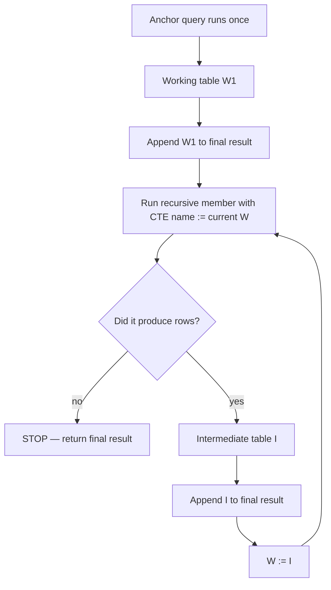
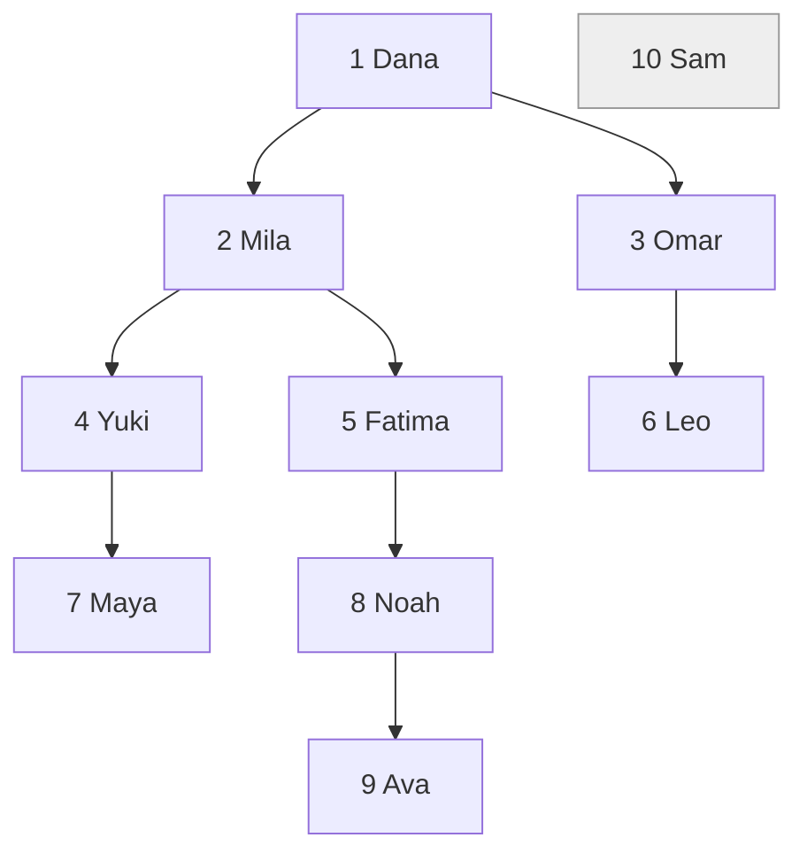

The file is complete at 945 lines. One label issue to verify: the `> **Interview trap**` under line 689 about schema changes references a `manager_id NOT NULL DEFAULT 1` scenario.
Section written to `sql-handbook/11-Advanced/102-Recursive-Hierarchies.md` (945 lines). Covers:

- **Fundamentals**: what hierarchies are, why recursion exists, grain rules
- **4 hierarchy models** (adjacency + recursive CTE, materialized path/`ltree`/`hierarchyid`, nested set, closure table) with comparison table + selection guidance
- **Internal working** (working-table algorithm + Mermaid diagram)
- **Syntax** with engine limits (PG `SEARCH`/`CYCLE`, MySQL 1000, SQL Server `MAXRECURSION`, Oracle `CONNECT BY`)
- **7 worked examples** with hand-verified outputs: subtree, ancestors, path/level + traversal order, root-carrying subtree rollup (BAD vs BETTER), BOM quantity multiplication, graph reachability with cycle guards, subtree DELETE
- **DAG double-counting**, **NULL behavior table**, common mistakes, production pitfalls, performance (indexes, iteration-count= depth, EXPLAIN-first), real-world category rollup scenario
- **Interview questions** across all 8 categories, answers withheld

Cross-references [34-Recursive-CTEs] for mechanics without duplicating it.
parent_id IS NULL` is a root.
>
> Almost every hierarchy mistake is a grain mistake: treating a node as if it can appear in multiple branches, or forgetting that `parent_id` is 1:1 while child-of is 1:N.

More general than a tree is a **graph**: rows can have many parents (a part used in two assemblies, a project with two parent projects). See [Common mistakes](#dags-graphs-and-double-counting) and [Example 6](#example-6--graph-reachability-flights-and-cycle-guards) for why graphs behave differently.

---

## Why recursive hierarchies exist

Without recursion, walking a tree in SQL was one of several bad options:

| Option | Problem |
|---|---|
| One query **per level**, looped from the app | N+1 round trips; the app hard-codes depth |
| Chained **self-joins** (`JOIN t c2`, `JOIN t c3`, …) | You must know the maximum depth in advance; a deeper value silently disappears |
| `CONNECT BY` (Oracle) | Proprietary, Oracle-only |
| Nested set / materialized path / closure table | Great reads, but you must maintain redundant columns or extra tables on every write |
| Stored procedure + cursor | Procedural, not set-based, slow |

A recursive CTE gives a **single, standard-SQL, set-based** statement that adapts to any depth automatically:

```sql
WITH RECURSIVE ...
```

It answers questions that be otherwise impossible in one query:

- "Who reports to Dana, directly or indirectly, at any depth?"
- "How many products sit in the whole subtree under each category?"
- "How many spokes does one bike need, counting every level of the BOM?"
- "Which airports are reachable from JFK in at most 3 hops?"

---

## The four hierarchy models

Recursion is not the only way to model a tree in SQL. Know the alternatives so you can pick the right one — this decision is the #1 "database design" interview question about hierarchies.

Sample data: `Computers (2) → Laptops (4) → Ultrabooks (9)`.

### 1. Adjacency list (the default)

```sql
categories(category_id, parent_id, name)
```

- Every row carries its parent's id.
- `parent_id = NULL` marks a root.
- The **natural, normalized** model — one fact per row, no redundancy.

### 2. Materialized path (path column / lineage)

```sql
categories(category_id, path, name)   -- path = '1/2/4/9'
```

- The ancestor chain is stored directly on the row.
- PostgreSQL has a native `ltree` type for this; SQL Server has `hierarchyid`.

### 3. Nested set (lft / rgt)

```sql
categories(category_id, lft, rgt, name)
```

- Every node gets two integers; a node's subtree is every row with `lft` between the node's `lft` and `rgt`.
- Based on a tree traversal (pre-order/in-order).

### 4. Closure table (ancestor/descendant pairs)

```sql
category_paths(ancestor_id, descendant_id)   -- one row per ancestor-descendant pair
```

- Includes the node itself: `(2,2)` is present.

| Concern | Adjacency + recursive CTE | Materialized path (ltree/hierarchyid) | Nested set | Closure table |
|---|---|---|---|---|
| "All descendants of X" | recursion, ~depth iterations | `path LIKE '1/2/%'` or range scan | one range scan (`lft BETWEEN x.lft AND x.rgt`) | one join on `ancestor= X` |
| "All ancestors of X" | recursion, ~depth iterations | compare `path` against X's path | `lft < x.lft AND rgt > x.rgt` | one join on `descendant = X` |
| Insert / move a node | trivial (1 row) | cheap insert (path string); moves update the node only | **expensive** — renumber a whole range | insert 1 + depth rows (closure table) |
| Delete a subtree | DELETE via recursion | cheap; prune prefix | cheap | delete a range of pairs |
| Cycle safety | needs `CYCLE` / depth cap / visited-set | `LIKE` guard (weak) | not applicable (lft/rgt disallow cycles) | needs care on writes |
| Storage redundancy | none | path duplicated per row | two ints per row | O(n²) worst case, usually far less |
| Depth / level | compute in CTE | path length | `(rgt-lft-1)/2` or stored column | stored `depth` column |
| Read-heavy, stable, deep tree (e.g., taxonomy) | fine | fine | **fastest reads** | very fast |
| Write-heavy tree | **easiest** | easy | painful | moderate |

> **Rules of thumb**
> - **Write-heavy or self-changing tree** (org chart, comments) → adjacency list + recursive CTE on top.
> - **Read-heavy, stable, deep taxonomy** (product categories, menus) → nested set / closure table, or materialized path with `ltree`.
> - **Graph with multiple parents** (BOM, dependencies) → adjacency-like edges + recursive CTE with cycle handling; a pure tree model cannot represent it.

Section [34-Recursive-CTEs] covers the CTE mechanics in depth; this section focuses on the hierarchy *patterns* that build on them.

---

## Internal working

The engine runs a recursive CTE like this:

```text
1. Run the ANCHOR once  →  rows go into the WORKING table and are appended to the result.
2. REPEAT:
   a. Run the RECURSIVE member, substituting the current WORKING table
      wherever the CTE's own name appears.
   b. Send the output to an INTERMEDIATE table, append it to the result.
   c. The INTERMEDIATE table becomes the new WORKING table.
3. UNTIL the WORKING table is empty.
```



> **Common misconception**
> Inside the recursive member, the CTE name is **only the previous iteration's output** — not the whole tree so far. You cannot `SUM()` or `COUNT(*)` over it to get tree totals; that must happen **outside** the recursion.

Two consequences follow from this model and matter everywhere in this section:

1. **Iterations = depth of the tree** (maximum chain length), not the number of nodes. A 1,000-node tree of depth 4 runs ~4 passes; a 10-node tree of depth 50 runs 50 passes.
2. Every pass is basically a **self-join** of the table against the working table — so the index on the parent/child key dominates performance (see [Performance implications](#performance-implications)).

---

## Syntax

```sql
WITH RECURSIVE cte (columns...) AS (
    -- anchor (seed): runs once
    SELECT ...
    UNION ALL
    -- recursive member: must reference the CTE's own name
    SELECT ... ... FROM real_table JOIN cte ON ...
)
SELECT * FROM cte;
```

Requirements, across engines:

| Rule | Detail |
|---|---|
| `RECURSIVE` keyword | `WITH` alone is non-recursive. PostgreSQL/MySQL refuse a self-reference without it. |
| Anchor + recursive member | Both are mandatory. |
| `UNION ALL` (default) | Use `UNION` only when you must deduplicate across generations — rarely correct for trees. |
| Same column count & compatible types | Cast explicitly in the anchor (`1::BIGINT`) to avoid coercion surprises. |
| Recursive member must reference the CTE | Otherwise the query is not recursive and runs once. |
| No direct recursion inside a subquery / `LATERAL` / aggregate | Referencing the CTE more than once, or inside nested constructs, is restricted across engines (mutual recursion is disallowed everywhere). |

Engine limits and native features:

> **PostgreSQL**
> No recursion limit by default — an unguarded cycle runs until the statement is killed. v14+ adds `SEARCH DEPTH/BREADTH FIRST` and `CYCLE`.

> **MySQL**
> `WITH RECURSIVE`, default recursion cap 1000 (raise with `SET SESSION cte_max_recursion_depth = N;`).

> **SQL Server**
> Default `MAXRECURSION` 100, maximum 32767; control with `OPTION (MAXRECURSION N)`. Exceeding raises `The maximum recursion 100 has been exhausted...`.

> **Oracle**
> Supports both `CONNECT BY` (idiomatic in Oracle shops) and standard recursive CTEs with `CYCLE`.

---

## Running sample data

Four small datasets. All are deliberately imperfect (two roots, a fork at every depth, a disconnect) so the edge cases are visible.

### A. Org chart — `employees`

**Grain: one row = one employee; an employee has ≤ 1 manager; `manager_id NULL` = top of that tree.**

```sql
CREATE TABLE employees (
    employee_id  INTEGER PRIMARY KEY,
    manager_id   INTEGER REFERENCES employees(employee_id),
    name         TEXT NOT NULL,
    dept         TEXT NOT NULL,
    salary       NUMERIC(10,2) NOT NULL
);

INSERT INTO employees (employee_id, manager_id, name, dept, salary) VALUES
(1,  NULL, 'Dana Rogers',   'Executive',    210000),
(2,  1,    'Mila Chen',     'Engineering',  170000),
(3,  1,    'Omar Haddad',   'Sales',        160000),
(4,  2,    'Yuki Tanaka',   'Engineering',  135000),
(5,  2,    'Fatima Ali',    'Engineering',  125000),
(6,  3,    'Leo Martins',   'Sales',        115000),
(7,  4,    'Maya Ivanov',   'Engineering',  100000),
(8,  5,    'Noah Kim',      'Engineering',   95000),
(9,  8,    'Ava Rossi',     'Engineering',   85000),
(10, NULL, 'Sam Whitfield', 'Consulting',   140000);
```



### B. Category tree — `categories`

**Grain: one row = one category; ≤ 1 parent; a category can be a root (`parent_id IS NULL`).**

```sql
CREATE TABLE categories (
    category_id INTEGER PRIMARY KEY,
    parent_id   INTEGER REFERENCES categories(category_id),
    name        TEXT NOT NULL
);

INSERT INTO categories (category_id, parent_id, name) VALUES
(1, NULL, 'Electronics'),
(2, 1,    'Computers'),
(3, 1,    'Phones'),
(4, 2,    'Laptops'),
(5, 2,    'Desktops'),
(6, 3,    'Smartphones'),
(7, 6,    'iPhones'),
(8, NULL, 'Books'),
(9, 4,    'Ultrabooks');
```

Two roots (`Electronics`, `Books`), depth 4 at the deepest (`Electronics → Computers → Laptops → Ultrabooks`), and a fork under every level.

### C. Bill of materials — `parts` + `assembly`

**Grains: one row in `parts` = one part; one row in `assembly` = one "parent uses child with a quantity" edge.**

```sql
CREATE TABLE parts (
    part_id   INTEGER PRIMARY KEY,
    part_name TEXT NOT NULL
);

CREATE TABLE assembly (
    parent_part_id INTEGER REFERENCES parts(part_id),
    child_part_id  INTEGER REFERENCES parts(part_id),
    quantity       INTEGER NOT NULL,
    PRIMARY KEY (parent_part_id, child_part_id)
);

INSERT INTO parts (part_id, part_name) VALUES
(1, 'Bike'), (2, 'Wheel'), (3, 'Frame'), (4, 'Brake Set'),
(5, 'Rim'), (6, 'Spoke'), (7, 'Brake Pad'), (8, 'Brake Cable');

INSERT INTO assembly (parent_part_id, child_part_id, quantity) VALUES
(1, 2, 2),     -- a Bike uses 2 Wheels
(1, 3, 1),     -- a Bike uses 1 Frame
(1, 4, 1),     -- a Bike uses 1 Brake Set
(2, 5, 1),     -- a Wheel uses 1 Rim
(2, 6, 20),    -- a Wheel uses 20 Spokes
(4, 7, 2),     -- a Brake Set uses 2 Brake Pads
(4, 8, 1);     -- a Brake Set uses 1 Brake Cable
```

### D. Flight graph — `flights`

**Grain: one row = one directed flight leg. This is a graph (a destination can be reached from many origins), not a tree.**

```sql
CREATE TABLE flights (
    origin      TEXT NOT NULL,
    destination TEXT NOT NULL,
    PRIMARY KEY (origin, destination)
);

INSERT INTO flights (origin, destination) VALUES
('JFK','LHR'), ('JFK','EWR'), ('JFK','SFO'),
('EWR','JFK'), ('SFO','LAX'), ('LAX','JFK'),
('LHR','CDG'), ('CDG','NCE'), ('BRA','DXB');
```

Notice the cycles: `JFK → EWR → JFK` and `JFK → SFO → LAX → JFK`. And `BRA → DXB` is a disconnected component no query starting at `JFK` should ever touch.

---

## Example 1 — subtree: all descendants of one node

**Question:** everything under `Computers` (`category_id = 2`), at any depth.

> **BAD APPROACH — fixed-depth chained self-joins**
> ```sql
> -- assumes the tree is never deeper than 3 levels
> SELECT c2.category_id AS lvl1, c3.category_id AS lvl2, c4.category_id AS lvl3
> FROM categories c1
> LEFT JOIN categories c2 ON c2.parent_id = c1.category_id
> LEFT JOIN categories c3 ON c3.parent_id = c2.category_id
> LEFT JOIN categories c4 ON c4.parent_id = c3.category_id
> WHERE c1.category_id = 2;
> ```
>
> DataFrame problems it hides: it silently drops any node at depth ≥ 3 (a 4th level under `Ultrabooks` would vanish with **no error**), pads shallower branches with NULLs, and the column count is the max depth — the query must be rewritten whenever the product catalog gets deeper. This is the classic "can I ever know the depth in advance?" failure.

> **BETTER APPROACH — one recursive CTE handles arbitrary depth**
> ```sql
> WITH RECURSIVE subtree AS (
>     SELECT category_id, name, 1 AS level
>     FROM categories
>     WHERE category_id = 2
>
>     UNION ALL
>
>     SELECT c.category_id, c.name, s.level + 1
>     FROM categories c
>     JOIN subtree s ON c.parent_id = s.category_id
> )
> SELECT level, category_id, name
> FROM subtree
> ORDER BY level, name;
> ```

### Expected result

| level | category_id | name |
| ----: | ----------: | ---- |
|     1 |           2 | Computers |
|     2 |           5 | Desktops |
|     2 |           4 | Laptops |
|     3 |           9 | Ultrabooks |

**Trace of the algorithm** (anchor is `Computers`):

- **Anchor:** `{2}` → working table `{2}`.
- **Pass 1:** children of `2` → `{4 Laptops, 5 Desktops}`.
- **Pass 2:** children of `{4, 5}` → `{9 Ultrabooks}`.
- **Pass 3:** children of `{9}` → `{}`. **Stop.**

Three passes = depth of the subtree (3), not its size (4). The anchor can be any single node; change `WHERE category_id = 2` to `= 1` and you get the whole `Electronics` subtree.

---

## Example 2 — ancestors: walking *up* the tree

**Question:** the breadcrumb trail for `Ultrabooks` (`category_id = 9`) up to the root.

The trick is reversing the join direction: match `categories` against the CTE by `category_id`, not `parent_id`.

```sql
WITH RECURSIVE ancestors AS (
    SELECT category_id, parent_id, name, 0 AS distance_from_node
    FROM categories
    WHERE category_id = 9

    UNION ALL

    SELECT c.category_id, c.parent_id, c.name, a.distance_from_node + 1
    FROM categories c
    JOIN ancestors a ON c.category_id = a.parent_id
)
SELECT distance_from_node, category_id, name
FROM ancestors
ORDER BY distance_from_node;
```

### Expected result

| distance_from_node | category_id | name |
| -----------------: | ----------: | ---- |
| 0 | 9 | Ultrabooks |
| 1 | 4 | Laptops |
| 2 | 2 | Computers |
| 3 | 1 | Electronics |

`distance_from_node` = how far above the starting node we are. If you need the path *top-down* instead, reverse the list in the final `ORDER BY distance_from_node DESC`.

---

## Example 3 — full tree with level and root-to-node path

**Question:** render the entire catalog as a breadcrumb, one row per category.

```sql
WITH RECURSIVE tree AS (
    SELECT category_id, parent_id, name,
           1 AS level,
           name AS path
    FROM categories
    WHERE parent_id IS NULL          -- both roots: Electronics, Books

    UNION ALL

    SELECT c.category_id, c.parent_id, c.name,
           t.level + 1,
           t.path || ' / ' || c.name
    FROM categories c
    JOIN tree t ON c.parent_id = t.category_id
)
SELECT level, name, path
FROM tree
ORDER BY level, name;
```

### Expected result

| level | name | path |
| ----: | ---- | ---- |
| 1 | Books | Books |
| 1 | Electronics | Electronics |
| 2 | Computers | Electronics / Computers |
| 2 | Phones | Electronics / Phones |
| 3 | Desktops | Electronics / Computers / Desktops |
| 3 | Laptops | Electronics / Computers / Laptops |
| 3 | Smartphones | Electronics / Phones / Smartphones |
| 4 | iPhones | Electronics / Phones / Smartphones / iPhones |
| 4 | Ultrabooks | Electronics / Computers / Laptops / Ultrabooks |

**Ordering caveat.** The final `ORDER BY level, name` is a *lexicographic* sort, not a "natural tree order" guarantee. The SQL standard does not promise any particular iteration order, and recursive output order is engine-defined. If traversal order really matters:

> **PostgreSQL (14+)**
> ```sql
> WITH RECURSIVE tree AS (...)
> SEARCH DEPTH FIRST BY category_id SET ord
> SELECT * FROM tree ORDER BY ord;
> ```
> or `SEARCH BREADTH FIRST BY category_id SET ord`. These give a well-defined depth-first / breadth-first ordering without relying on a path string.

> **Oracle** — `CONNECT BY ... ORDER SIBLINGS BY name` for depth-first sibling order.
> **SQL Server** — no native clause; order on an explicit `level` + `path` column.

**Rule of thumb:** if order matters, carry a `path` or `level` column (or use `SEARCH`) and order on it explicitly. Do not rely on default iteration order.

---

## Example 4 — subtree aggregation ("team salary" rollup)

**Question:** for **every** employee, total salary of that employee **plus all their indirect reports**.

This is the pattern that trips people up most: the aggregation must live **outside** the recursion, keyed on the root of each chain. The clean technique is to **carry the root id down** during recursion.

> **BAD APPROACH — sum only direct reports**
> ```sql
> SELECT e.employee_id, e.name, SUM(team.salary) AS team_salary
> FROM employees e
> LEFT JOIN employees team ON team.manager_id = e.employee_id
> GROUP BY e.employee_id, e.name;
> ```
> This adds only *immediate* reports. Mila's team salary would be `Yuki + Fatima` but not `Maya`, `Noah`, or `Ava` → a silent undercount that looks plausible.

> **BETTER APPROACH — carry the root, aggregate outside**
> ```sql
> WITH RECURSIVE org AS (
>     SELECT employee_id, employee_id AS root_id, salary
>     FROM employees
>
>     UNION ALL
>
>     SELECT e.employee_id, o.root_id, e.salary
>     FROM employees e
>     JOIN org o ON e.manager_id = o.employee_id
> )
> SELECT r.employee_id, r.name, SUM(o.salary) AS team_salary
> FROM org o
> JOIN employees r ON r.employee_id = o.root_id
> GROUP BY r.employee_id, r.name
> ORDER BY team_salary DESC;
> ```

**Grain of the intermediate CTE:** one row in `org` = one **(root, descendant)** pair. Because every employee has exactly one manager, each descendant appears exactly once per root — the `SUM` is clean.

### Expected result (top rows)

| employee_id | name | team_salary |
| ----------: | ---- | -----------: |
| 1 | Dana Rogers | 1,195,000 |
| 2 | Mila Chen | 710,000 |
| 5 | Fatima Ali | 305,000 |
| 3 | Omar Haddad | 275,000 |
| 4 | Yuki Tanaka | 235,000 |
| 8 | Noah Kim | 180,000 |
| 10 | Sam Whitfield | 140,000 |
| 6 | Leo Martins | 115,000 |
| 7 | Maya Ivanov | 100,000 |
| 9 | Ava Rossi | 85,000 |

> **Interview trap**
> "Why can't you `SUM(salary)` inside the recursive member?" Two reasons: (1) the recursive reference holds only the previous generation, so a `SUM` over it is a per-generation sum, and (2) most engines reject aggregates/window functions over the recursive reference outright. **Aggregates go in the final SELECT.**

---

## Example 5 — bill of materials (quantity explosion)

**Question:** how many of each part are needed to build **one** Bike?

The story here is **multiplicative fan-out**: quantities multiply at every level (`Bike` needs 2 wheels; each wheel needs 20 spokes; so one bike needs 40 spokes).

```sql
WITH RECURSIVE bom AS (
    SELECT part_id, part_name, 1 AS multiplier, 1 AS level
    FROM parts
    WHERE part_id = 1          -- the product we want to explode

    UNION ALL

    SELECT a.child_part_id, p.part_name,
           b.multiplier * a.quantity,      -- multiply, don't add
           b.level + 1
    FROM assembly a
    JOIN bom b ON a.parent_part_id = b.part_id
    JOIN parts p ON p.part_id = a.child_part_id
)
SELECT part_name, SUM(multiplier) AS total_needed
FROM bom
GROUP BY part_name
ORDER BY total_needed DESC;
```

### Expected result

| part_name | total_needed |
| --------- | -----------: |
| Spoke | 40 |
| Wheel | 2 |
| Brake Pad | 2 |
| Rim | 2 |
| Frame | 1 |
| Brake Set | 1 |
| Brake Cable | 1 |

**Walk the multipliers** (the raw CTE rows before aggregation):

| level | part_name | multiplier |
| ----: | --------- | ---------: |
| 1 | Bike | 1 |
| 2 | Wheel | 2 | ← 1 × 2 wheels |
| 2 | Frame | 1 |
| 2 | Brake Set | 1 |
| 3 | Rim | 2 | ← 2 wheels × 1 rim |
| 3 | Spoke | 40 | ← 2 wheels × 20 spokes |
| 3 | Brake Pad | 2 | ← 1 brake set × 2 pads |
| 3 | Brake Cable | 1 |

The `SUM` runs **outside** on the final SELECT; the recursion only produces the per-path multiplier. This is the canonical `GROUP BY outside / multiply inside` pattern.

---

## Example 6 — graph reachability (flights) and cycle guards

**Question:** which distinct airports are reachable from `JFK` in at most 3 hops?

This is a **graph**, not a tree: `JFK` appears again on cycles (`EWR → JFK`, `LAX → JFK`), and if we don't stop that, the recursion re-enters `JFK` forever.

The `route` array records the nodes already visited, so any edge leading back into the route is skipped — an "explicitly visited set" cycle guard (works in every engine with arrays or string paths).

```sql
WITH RECURSIVE reach AS (
    SELECT origin, destination,
           ARRAY[origin] AS route,       -- PostgreSQL; a path string elsewhere
           1 AS hops
    FROM flights
    WHERE origin = 'JFK'

    UNION ALL

    SELECT r.destination, f.destination,
           r.route || f.destination,
           r.hops + 1
    FROM reach r
    JOIN flights f ON f.origin = r.destination
    WHERE r.hops < 3
      AND NOT f.destination = ANY(r.route)   -- never revisit a node on this route
)
SELECT hops, destination
FROM reach
ORDER BY hops, destination;
```

### Expected result (one row per route)

| hops | destination |
| ---: | ----------- |
| 1 | EWR |
| 1 | LHR |
| 1 | SFO |
| 2 | CDG |
| 2 | LAX |
| 3 | NCE |

The cycles are **pruned by the visited set**: `EWR → JFK` and `LAX → JFK` are dropped because `JFK` is already on the route. `BRA → DXB` never appears (disconnected component).

How many distinct airports? `6` (or `5` new ones beyond the origin):

```sql
SELECT COUNT(DISTINCT destination) AS reachable_airports
FROM reach
WHERE destination <> 'JFK';   -- 6
```

Actually, with the visited-set guard, every route row already has a *distinct* endpoint per hop level, so the result above is also the distinct list: `EWR, LHR, SFO, CDG, LAX, NCE`.

> **Production pitfall — unbounded graphs**
> A graph with cycles and *no* visited set or depth cap never terminates. Without a route guard, PostgreSQL runs until OOM; MySQL/SQL Server stop at their recursion limits with an error. The `hops < 3` cap is the safety valve even when the visited set is properly maintained — never ship an unguarded recursive query.

---

## Example 7 — deleting a subtree safely

**Question:** remove `Phones` (`category_id = 3`) and everything under it.

A recursive CTE can feed a `DELETE` directly — build the subtree, then delete its ids.

```sql
WITH RECURSIVE subtree AS (
    SELECT category_id FROM categories WHERE category_id = 3
    UNION ALL
    SELECT c.category_id
    FROM categories c
    JOIN subtree s ON c.parent_id = s.category_id
)
DELETE FROM categories
WHERE category_id IN (SELECT category_id FROM subtree);
```

This deletes `Phones (3)`, `Smartphones (6)`, and `iPhones (7)` — exactly the `Phones` subtree, nothing above it (`Electronics` survives untouched) and nothing below its leaves.

### When this bites you

- **Children of the deleted root become orphans** if the FK is *not* `ON DELETE CASCADE` and children are deleted first — order matters. Delete `Phones` before its children and `Smartphones` becomes an orphaned row whose `parent_id` points nowhere (or the delete fails on the FK).
- MySQL applies this differently inside `DELETE ... WHERE ... IN (subquery)`; confirm the engine's rules for deleting the same table named by a CTE.
- This is a **destructive, production-affecting** statement — always wrap in a transaction and first run the CTE as a `SELECT` to eyeball the row list.

---

## DAGs, graphs, and double counting

If a node can have **more than one parent** (a part used in two assemblies, a project with two owners), the structure is a **DAG** (directed acyclic graph), not a tree. Recursion now produces **multiple paths to the same node**, and every aggregation over the result **counts each path**:

- `SUM`, `COUNT`, `AVG` over the CTE will count a shared child once **per path** that reaches it.
- The same holds when you `JOIN` the recursive result back to a fact table — the join fan-out multiplies.
- Options: `COUNT(DISTINCT ...)`, aggregate in a stage that first deduplicates (e.g., `DISTINCT ON`/`ROW_NUMBER` in PostgreSQL), or model the graph differently (closure table stores ancestor→descendant pairs once).

This is the most common hidden reason a "working" recursive rollup reports totals that are too high by exactly the number of shared nodes — see the Real-world scenario below, which defeats it with `COUNT(DISTINCT ...)`.

---

## NULL behavior

| Situation | What happens |
|---|---|
| `parent_id IS NULL` in the anchor | Correctly seeds the **root(s)** of the tree. All roots with `IS NULL` are found. |
| Anchor filters a specific root value | Only that subtree — every other tree is excluded. |
| An orphan (a `child_id`/`parent_id` pointing to a missing row — possible without FK constraints) | **Never appears.** Nothing points to it as a child and it isn't a root, so no pass can reach it. |
| Orphan with `parent_id NULL` in the middle of the data | Treated as a **new root**; a separate mini-tree appears in results. |
| Path concatenation with NULL | PostgreSQL: `'A' || NULL` is `'A'`; SQL Server: `'A' + NULL` is `NULL`; use `COALESCE(path, '')` for portability. |
| Anchor returns 0 rows | **The whole CTE returns 0 rows** and recursion never starts (e.g., a pure cycle contains no root at all — see below). |
| `NULL` inside aggregation | `SUM`/`AVG` skip NULLs, consistently with any other aggregate — the aggregation happens outside the recursion anyway. |
| Two `NULL`s compared | Never in play: recursion only joins on non-NULL ids; `JOIN ... ON a.parent_id = b.child_id` ignores NULL keys by design. |

> **Interview trap**
> Schema changed: someone adds `manager_id NOT NULL DEFAULT 1` to `employees`. Now every row "has a manager" — most are wrong — and the `WHERE manager_id IS NULL` anchor finds at most one root, silently slicing off every other tree. Root detection (`IS NULL`) and data integrity are coupled; migration + recursion breaks must be tested together.

---

## Common mistakes

1. **Using `UNION` instead of `UNION ALL`.** Deduplication across generations changes row counts and, in a cycle, can *terminate* the recursion "early", masking the real bug. Default to `UNION ALL`.
2. **Fixed-depth self-joins.** Any tree deeper than the join count loses rows silently. (Example 1 shows the failure mode.)
3. **Recursive member that doesn't reference the CTE** — it's just a normal query running once; the result silently shrinks to one generation.
4. **Column count/type mismatch** between anchor and recursive member (`INT` vs `BIGINT`, bare `NULL` literals). Cast in the anchor.
5. **No join in the recursive member** (`FROM t` without `JOIN ... ON`) — the working table fans out by a Cartesian product *every* pass → exponential blowup.
6. **Aggregating over the recursive reference** (see Example 4) — wrong and often rejected by the engine.
7. **Unbounded recursion** — no depth cap, no visited set, no `CYCLE` clause. The #1 production failure.
8. **Assuming iteration order** — without an explicit `ORDER BY` on a `path`/`level` (or a `SEARCH` clause), the "shape" of output is not guaranteed.
9. **Forgetting NULL roots** — `WHERE parent_id IS NULL` is how roots are found; the data must actually contain NULLs at the top.
10. **Mutation during recursion** — most engines disallow modifying the same table inside a recursive CTE body; do `SELECT`s for the shape, then apply changes after.

---

## Production pitfalls

> **Production pitfall — a single bad row kills production**
> One cyclic row (`UPDATE employees SET manager_id = 5 WHERE employee_id = 5`) turns every org-chart query into an infinite loop. PostgreSQL has **no default limit** — that statement runs until the process is OOM-killed. Always ship: depth cap, `CYCLE`-style guard, or `MAXRECURSION`, **even in read-only reporting queries**.

> **Production pitfall — recursion under the API, N+1 queries**
> Done app-side (one `SELECT` per level), a depth-40 tree is 41 round trips and 41 compound statements — ten times the latency of one recursive CTE. Move the walk into SQL; loop only in the last-resort case.

> **Production pitfall — missing index on the child key**
> The `JOIN` inside the recursive member hits `categories.parent_id` (or `employees.manager_id`) on every pass. Without an index, every pass is a **full table scan**. A tree of depth D turns into D full scans — see Performance implications.

> **Production pitfall — deleting a subtree**
> `DELETE ... WHERE id IN (recursive subtree)` silently detaches children if the FK isn't `ON DELETE CASCADE`, or fails mid-way. Rehearse the CTE as a `SELECT` in a transaction first (Example 7).

---

## Performance implications

Optimization claims are engine- and plan-dependent — **verify with `EXPLAIN ANALYZE`** (or the equivalent) on your own data and cardinality before tuning on any of the following:

- **Iterations ≈ maximum depth.** Depth is the loop count; width is the working-table size. A deep, narrow tree is *iteration-bound*; a wide, shallow tree is *working-set-bound*. Both costs show up in the plan as a repeated `WorkTable Scan`/spool node (PostgreSQL) — check the per-iteration actual row counts vs estimates; a bad estimate there is the classic optimizer failure.
- **Index the join key.** `JOIN c ON c.parent_id = s.category_id` — the driver is the anchor, the probe is `parent_id`. An index on `categories(parent_id)` turns each pass from a full scan into a lookup. If you also select/output `name`, a composite `(parent_id, name)` makes the probe a covering scan.
- **Anchor selectivity.** Filter the anchor to the one root you need. Walking *every* root when you only need one branch multiplies work by the number of trees in the table.
- **`UNION` vs `UNION ALL`.** `UNION` implies a sort/dedup per generation, adding work. Prefer `UNION ALL` and dedupe deliberately where needed.
- **Path strings.** `path || ' / ' || name` builds a string per row; deep trees accumulate memory. Prefer numeric `level` + engine-native `SEARCH`/`CYCLE` where available.
- **Materialization.** Some engines materialize the CTE (PostgreSQL may spool `WITH` results); when the recursive result is referenced more than once, check the plan to see whether it is computed once and scanned repeatedly — that can be a win or a hidden re-execution.
- **Recursive CTE vs stored models.** For very deep, very read-heavy, stable trees, a nested set / closure table / `ltree` answers "all descendants" with one quick lookup instead of D passes. The recursive CTE wins on write-heavy or irregularly-shaped data. Which one is faster for *your* tree can only be settled with an execution plan on representative data.

> **Common misconception**
> "Recursive CTE is always slower than nested set" is as wrong as the reverse. The CTE does one self-join per level; nested set does a single range scan but pays maintenance on every write. Pick by workload and verify, don't assert.

---

## When to use it — and when NOT to

**Use a recursive CTE when:**

- The hierarchy is **adjacency-list modeled** and its depth is unbounded or unknown.
- The tree is **written often** (inserts/moves cheap — one row touch).
- You need per-node computed facts: level, path, subtree aggregates, "ancestors of X."
- You are walking a **graph** (multiple paths allowed): reachability, BOM, dependencies.
- You want a **single, standard-SQL, set-based** statement with no extra engineering.

**Do NOT use a recursive CTE when:**

- The tree is **very deep and extremely read-heavy** (millions of nodes taxonomy) — a nested set, closure table, or `ltree`/`hierarchyid` answers single-subtree lookups in O(1)-ish SQL instead of D passes.
- The traversal is a **graph over huge data** — consider a real graph engine or pre-computed paths.
- The query will be **unguarded** in production — cycle risk is unacceptable.
- Depth is guaranteed tiny and fixed — occasionally a 2–3 level join is simpler, but only when the shape is *contractually* fixed (rare; prefer the CTE anyway).

---

## Real-world scenario — category rollup for a storefront

A merchandiser wants "products in this category **including all subcategories**" for the whole catalog.

One row in a product-category maps:
```sql
CREATE TABLE category_products (
    category_id INTEGER NOT NULL REFERENCES categories(category_id),
    product_id  INTEGER NOT NULL,
    PRIMARY KEY (category_id, product_id)
);

INSERT INTO category_products (category_id, product_id) VALUES
(2, 101),   -- a laptop under Computers
(4, 102),   -- an ultrabook under Laptops
(3, 103),   -- a phone under Phones
(7, 104),   -- an iPhone under iPhones
(7, 105),   -- another iPhone
(8, 106), (8, 107);  -- two books
```

For every category, count the distinct products in its whole subtree:

```sql
WITH RECURSIVE tree AS (
    SELECT category_id, category_id AS root_id, 1 AS level
    FROM categories

    UNION ALL

    SELECT c.category_id, t.root_id, t.level + 1
    FROM categories c
    JOIN tree t ON c.parent_id = t.category_id
)
SELECT t.root_id, c.name,
       COUNT(DISTINCT cp.product_id) AS products_in_subtree
FROM tree t
JOIN categories c ON c.category_id = t.root_id
LEFT JOIN category_products cp ON cp.category_id = t.category_id
GROUP BY t.root_id, c.name
ORDER BY products_in_subtree DESC;
```

### Expected result

| root_id | name | products_in_subtree |
| ------: | ---- | ------------------: |
| 1 | Electronics | 5 |
| 3 | Phones | 3 |
| 2 | Computers | 2 |
| 6 | Smartphones | 2 |
| 7 | iPhones | 2 |
| 8 | Books | 2 |
| 4 | Laptops | 1 |
| 5 | Desktops | 0 |
| 9 | Ultrabooks | 0 |

**How it works:** the CTE materializes every (root, descendant) pair; the outer query joins to the product map and counts **distinct** products. `COUNT(DISTINCT ...)` is the deliberate guard against any future DAG reorganization double-counting shared children. `Electronics` correctly sees the products of `Computers`, `Phones`, their leaves, and its own — 5 total — and a category with no products (`Desktops`) still appears with `0`.

---

## Comparison tables (recap)

### Hierarchy model at a glance

| Model | Read subtree | Read ancestors | Insert/move | Delete subtree | Redundancy | Best for |
|---|---|---|---|---|---|---|
| Adjacency + recursive CTE | D iterations | D iterations | trivial | easy via recursion | none | write-heavy, unbounded depth, graphs |
| Materialized path (`ltree`/`hierarchyid`) | `LIKE`/range on path | path compare | cheap | cheap | path column duplicated | read-heavy deep trees |
| Nested set | single range scan | range count | **costly renumbering** | cheap | lft/rgt per row | read-heavy stable trees |
| Closure table | one join | one join | 1 + depth rows | range of pairs | O(n·depth) rows | mixed, hierarchy-heavy analytics |

### Engine capabilities (recursive CTEs)

| Engine | Keyword | Default recursion limit | Native cycle/depth tools |
|---|---|---|---|
| PostgreSQL | `WITH RECURSIVE` | none | `SEARCH` + `CYCLE` (v14+) |
| MySQL / MariaDB | `WITH RECURSIVE` | 1000 (`cte_max_recursion_depth`) | manual guards |
| SQL Server | `WITH` + **implicit recursion** (no `RECURSIVE`) | 100 (`OPTION (MAXRECURSION n)`, max 32767) | manual guards |
| Oracle | recursive CTE **and** `CONNECT BY` | loop detection on `CONNECT BY ... NOCYCLE` | `NOCYCLE`, `CONNECT_BY_ISCYCLE`, `LEVEL` pseudo-column |
| SQLite | `WITH RECURSIVE` | 1000 (`recursive_cte_max_depth`) | manual guards |

---

## Best practices

1. **Always use `UNION ALL`** unless cross-generation dedup is the actual requirement.
2. **Always carry a `level` (or distance) column** — cheap, and it powers filtering, presentation, and depth caps.
3. **Always guard the recursion**: depth cap, `CYCLE` (PostgreSQL 14+), `MAXRECURSION` (SQL Server), or a visited-set/path check. No exceptions — not even in a demo script.
4. **Aggregate outside** the recursion; keep the recursive member a pure "one generation" expansion.
5. **Carry the root id down** when the final question is per-subtree (Examples 4 and the scenario).
6. **Cast types in the anchor** to avoid implicit-coercion drift in later generations.
7. **Index the parent/child key** (`parent_id`, `manager_id`); add a covering composite if you select extra columns.
8. **Filter the anchor to the needed scope** (one root, not every root) when a single subtree is the goal.
9. **Order explicitly** with a `path`/`level` column or `SEARCH` clauses — never rely on default iteration order.
10. **Verify with `EXPLAIN ANALYZE`** — confirm iteration count, working-table row estimates, and index usage before tuning; claims like "always faster" are wrong without a plan.
11. **Test with dirty data**: a cyclic row, an orphan, and a NULL path — expect then behavior, don't discover it in production.

---

## Interview traps

> **Interview trap — "How many times does this run?"**
> For a tree of depth 4 with 1,000 nodes: about **4 iterations** (each = one self-join), not 1,000. Iterations are bounded by depth; row *volume* is bounded by width. Interviewers love the quantity-vs-density distinction.

> **Interview trap — "What is inside the CTE name in the recursive member?"**
> The **previous generation's output only** — not the accumulated result. Someone who says "the whole result set" has missed the working-table semantics.

> **Interview trap — "Where do aggregates go?"**
> Into the final SELECT, not the recursive member. Reasons: working-table semantics + engine restrictions on aggregates/window functions over the recursive reference.

> **Interview trap — "What happens when there is a cycle and no root?"**
> If *every* node has a parent (a pure ring — `1→2`, `2→1`), the anchor `WHERE parent_id IS NULL` finds **nothing**, and the whole query returns **0 rows** — a silent, easy-to-miss failure, not an error.

> **Interview trap — stating absolute performance claims**
> "Nested set is always faster," "recursive CTEs are always slower." Both miss that cost depends on shape, depth, indexes, statistics, and the optimizer — insist on an execution plan.

---

# Interview Questions

## Beginner

1. What are the two mandatory parts of a recursive CTE, and which runs only once?
2. Why is `UNION ALL` the default operator between them — what changes if you write `UNION`?
3. In `categories`, what does `parent_id = NULL` mean? What is the grain of the table?
4. Write a recursive CTE that prints the numbers 1 through 10.
5. When does a recursive CTE stop recursing?
6. How many iterations does a recursive CTE run on a tree of depth 5 that has 90 nodes?

## Intermediate

7. Write a query returning all descendants of category `Phones` at any depth, with a level column.
8. Write a query returning the full ancestor chain for `Ultrabooks` (id 9).
9. Explain how fixed-depth chained self-joins fail, and give a concrete dataset where they output wrong results.
10. What is the difference in the `JOIN` condition when you walk the tree downward (children) vs upward (ancestors)?
11. Why can't you put `SUM(salary)` in the recursive member, and where must the aggregate go?
12. A delete is run inside a transaction because a subtree removal may leave orphans. What does the FK constraint have to do with the order of deletion?

## Advanced

13. Explain the "carry the root id down" pattern and why it is required to compute a per-manager subtree total.
14. Describe the PostgreSQL `SEARCH DEPTH FIRST` and `SEARCH BREADTH FIRST` clauses, and the problem they solve.
15. Compare adjacency list + recursive CTE, nested set, materialized path (`ltree`/`hierarchyid`), and closure table for a write-heavy org chart vs a read-heavy 50,000-node taxonomy.
16. What happens when a node has two parents (a DAG)? Show the double-count condition and the fix.
17. How does the `CYCLE ... SET is_cycle USING path` clause (PostgreSQL 14+) detect cycles, and how is it better than a depth cap?
18. Write a BOM explosion that multiplies quantities level by level and sums outside the recursion.

## Scenario Based

19. For each manager, count their total team size (self + all indirect reports). State the grain of each output row.
20. The storefront scenario: explain the result row for `Desktops` (0 products) and why the `LEFT JOIN` is required for it to appear.
21. A `flights` table is reachability-scored from `JFK` with at most 3 hops and a visited-set guard. Which airports come out, and which are deliberately excluded?
22. Delete the `Books` subtree without leaving orphans — write the statement and the transaction steps.
23. Build a 30-day date spine with a recursive CTE, then LEFT JOIN a `logins` table so days with no logins still appear.

## Tricky

24. The data has a pure cycle (`1→2`, `2→1`) and **no** row with `parent_id NULL`. What does an anchor `WHERE parent_id IS NULL` produce — an error, 0 rows, or an infinite loop?
25. Someone changes `manager_id` to `NOT NULL DEFAULT 1`. The old anchor `WHERE manager_id IS NULL` now returns one node. What does the org report silently lose, and where would you spot it?
26. A recursive member accidentally uses `FROM categories c` with no join at all. Walk one or two iterations — what happens to the working set and the runtime?
27. What is the difference between a tree with two roots and a DAG with a shared subtree — for row counts in the recursive CTE, then for `COUNT(DISTINCT ...)` in the final SELECT?
28. Explain why the BOM rollup needs `SUM` **outside** even though each part appears exactly once per assembly path. What would `GROUP BY` inside the recursive member do (and would the engine allow it)?

## Output Prediction

29. Using the sample `categories`, predict every row of the subtree query anchored at `Phones (3)`, with levels. Now anchor at `Books (8)` — how many rows?
30. Predict the raw (pre-aggregation) rows of the BOM explosion for one Bike, with their multipliers. Which part has the largest multiplier and why?
31. For the flights dataset, list the route rows for hops 1, 2, and 3 from `JFK`. Which two candidate rows (`EWR→JFK`, `LAX→JFK`) are dropped, and by which condition?
32. Predict the team-salary rollup row for `Noah Kim (8)` alone. Now predict `Fatima Ali (5)`. Where does the extra 85,000 come from?
33. Anchor at `categories` root `Electronics` but `ORDER BY level, name` — write the predicted output order, and say which "tree shape" property this ordering **does not** guarantee.

## Debugging

34. The org chart "worked on Monday, hangs on Tuesday." Write the query that finds the corrupt rows (self-cycle or mutual management) before rerunning the recursion.
35. A subtree rollup reports products_in_subtree that are exactly a multiple of the true count. Which data condition causes multiples, and which keyword fixes it?
36. `Laptops` shows up in the category list but nothing under it ever appears, even though rows exist. What data condition (orphan vs open cycle vs wrong anchor filter) explains it, and how do you check in one query?
37. The BOM total for `Spoke` is 40, correct, but `Rim` shows 0. Where do you look first — the `assembly` pair, the multiplier, or the final `GROUP BY`?
38. A recursive report works with `UNION ALL` but the same query with `UNION` returns far fewer rows on cyclic data. Is that a fix, and why exactly?

## Performance

39. Using `EXPLAIN ANALYZE`, how do you confirm the recursion is doing one index lookup per pass instead of a full scan per pass? What plan node names do you look for (PostgreSQL `WorkTable Scan`, SQL Server spool)?
40. Given a 500,000-row employee table and a depth-40 tree, what does the cost curve look like if `manager_id` is unindexed? Describe the index that turns it into per-pass logarithmic probes, and the execution-plan evidence that would confirm the improvement.
41. Is "nested set is always faster than a recursive CTE" true? Defend both sides, and describe the workload where the recursive CTE wins and the experiment you would run to prove it.
42. The flight reachability query on 1M legs grows the working table super-linearly at hop 3. Which lever helps — a tighter anchor, an earlier hop cap, a visited-set, or a stronger index? How would the plan tell you which one is working?