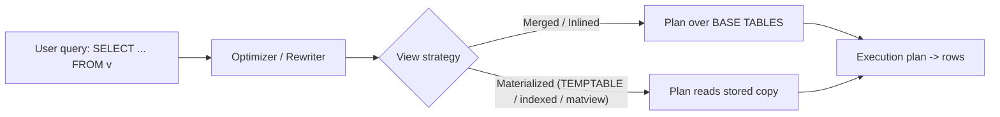
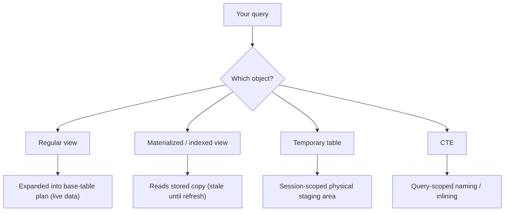

Wrote `sql-handbook/11-Advanced/93-Views.md` — a complete section covering fundamentals, internal working (view expansion/MERGE-vs-TEMPTABLE/matviews), full syntax, 11 hand-checkable examples with sample tables and outputs, updatability rules, NULL behavior, edge cases, pitfalls, engine-support matrices, a comparison table, best practices, cross-references, and 36 withheld-answer interview questions.
but "the table" you are reading is really just a saved definition. A view is in that sense a **macro** — a reusable, named snippet of SQL — with the extra superpowers that it is a first-class schema object you can `GRANT` privileges on, build other views on, and (when simple enough) `INSERT`/`UPDATE`/`DELETE` through.

Why it exists: raw tables are often the wrong interface to hand to users. Analysts want a **convenient** shape (already joined, already filtered, already aggregated). Applications want a **stable** contract even when the schema underneath changes. Security wants to expose **some columns/some rows** without granting access to the whole table. Views answer all three:

- **Abstraction** — hide joins and calculations; let consumers read `commercial_orders` instead of typing a 4-table join.
- **Security** — grant `SELECT` on the view, revoke it on the base table, and the caller never sees columns like `salary` or rows they shouldn't.
- **Consistency** — one definition, maintained in one place; you cannot have five reports drifting apart on "what counts as an active customer" because the rule lives in exactly one object.

### What a view is NOT

> Common misconception: a view is a copy of the data stored on disk.

A regular view holds **no rows**. It never "goes stale". If you insert a row into the base table and then `SELECT` the view, the new row appears immediately — because the view reads the base table live at query time. The exception is the **materialized view** (and SQL Server's **indexed view**), which does store data physically — and that exception is covered separately below.

> Interview trap: "If I drop the base table, the view still has all the data." False. Drop the base table and the view becomes an error message waiting to happen — the view has nothing of its own.

### Grain rules

> One row in `employees` represents one employee.
> One row in `orders` represents one order.

A view does not change the grain of the data it returns — but it is the most common place grain mistakes hide. When your view joins two tables at different grains (say, `orders` × `order_items`, one-to-many), the view **multiplies rows**, and every consumer of that view inherits the fan-out. Always state the output grain of a view in its documentation header:

> One row in `product_sales` represents one product's lifetime order statistics.

---

## Sample tables

```sql
CREATE TABLE departments (
    department_id   INT PRIMARY KEY,
    department_name VARCHAR(50) NOT NULL
);

CREATE TABLE employees (
    employee_id   INT PRIMARY KEY,
    first_name    VARCHAR(50) NOT NULL,
    last_name     VARCHAR(50) NOT NULL,
    department_id INT REFERENCES departments(department_id), -- NULL = unassigned
    job_title     VARCHAR(50),
    salary        NUMERIC(10,2),
    hire_date     DATE,
    manager_id    INT REFERENCES employees(employee_id),     -- NULL = top of chain
    is_manager    BOOLEAN
);

CREATE TABLE products (
    product_id    INT PRIMARY KEY,
    product_name  VARCHAR(50) NOT NULL,
    category      VARCHAR(20),
    unit_price    NUMERIC(10,2)
);

CREATE TABLE customers (
    customer_id   INT PRIMARY KEY,
    customer_name VARCHAR(50) NOT NULL,
    city          VARCHAR(50)
);

CREATE TABLE orders (
    order_id     INT PRIMARY KEY,
    customer_id  INT REFERENCES customers(customer_id),
    product_id   INT REFERENCES products(product_id),
    quantity     INT NOT NULL,
    unit_price   NUMERIC(10,2) NOT NULL,   -- price paid at order time
    order_date   DATE NOT NULL,
    status       VARCHAR(20) NOT NULL      -- 'shipped' | 'pending' | 'cancelled'
);
```

> One row in `orders` represents one order for one product (a clean children-absent grain, so every example is easy to verify by hand).

```sql
INSERT INTO departments VALUES
(10, 'Engineering'), (20, 'Sales'), (30, 'HR');

INSERT INTO employees VALUES
(1, 'Alice', 'Smith', 10,   'Senior Engineer',  95000.00, '2021-03-01', NULL, TRUE),
(2, 'Bob',   'Jones', 10,   'Engineer',         72000.00, '2022-06-15', 1,    FALSE),
(3, 'Carol', 'Lee',   20,   'Account Executive', 65000.00, '2020-11-02', 4,   FALSE),
(4, 'David', 'Brown', 20,   'Sales Manager',    88000.00, '2019-04-21', NULL, TRUE),
(5, 'Eve',   'Wilson', NULL, 'Recruiter',      58000.00, '2023-01-09', NULL, FALSE),
(6, 'Frank', 'Taylor', 10,  'QA Engineer',      70000.00, '2022-09-30', 1,    FALSE);

INSERT INTO products VALUES
(201, 'Keyboard',     'Electronics',  49.99),
(202, 'Mouse',        'Electronics',  19.99),
(203, 'USB-C Cable',  'Accessories',   9.99),
(204, 'Monitor',      'Electronics', 129.99),
(205, 'Webcam',       'Electronics',  39.99);   -- note: participates in NO order

INSERT INTO customers VALUES
(1, 'Acme Corp',   'Chicago'),
(2, 'Globex Inc',  'Austin'),
(3, 'Initech',     'New York');

INSERT INTO orders VALUES
(1001, 1, 201, 2, 49.99,  '2025-01-15', 'shipped'),
(1002, 2, 202, 1, 19.99,  '2025-01-18', 'pending'),
(1003, 1, 203, 5,  9.99,  '2025-02-01', 'shipped'),
(1004, 3, 201, 1, 49.99,  '2025-02-10', 'cancelled'),
(1005, 2, 202, 3, 19.99,  '2025-03-05', 'shipped'),
(1006, 1, 204, 2,129.99,  '2025-03-20', 'shipped');
```

---

## Syntax

### CREATE VIEW

```sql
CREATE VIEW view_name [(column_alias_1 [, column_alias_2, ...])] AS
<SELECT ...>;
```

The column list is optional; you need it when the `SELECT` list contains expressions that don't already have clean, unique names (see Example 5).

### CREATE OR REPLACE

```sql
CREATE OR REPLACE VIEW view_name AS <SELECT ...>;
```

- **PostgreSQL / MySQL / Oracle**: `CREATE OR REPLACE` is supported. PostgreSQL only allows replacing a view with one whose output columns are a superset — you cannot drop or reorder existing columns this way; you must `DROP` and `CREATE` for a structural change.
- **SQL Server**: no `CREATE OR REPLACE`; use `CREATE OR ALTER VIEW` (SQL Server 2016 SP1+).

### DROP VIEW

```sql
DROP VIEW view_name;               -- errors if other objects depend on it
DROP VIEW IF EXISTS view_name;     -- MySQL, SQL Server, PostgreSQL
DROP VIEW view_name CASCADE;       -- PostgreSQL: also drops dependent views
DROP VIEW view_name RESTRICT;      -- PostgreSQL: refuse if anything depends
```

SQL Server uses `DROP VIEW IF EXISTS view_name` (2016+) and has no `CASCADE`.

### ALTER VIEW

- **PostgreSQL / MySQL**: `ALTER VIEW name RENAME TO new_name;` and `ALTER VIEW name ALTER COLUMN c SET DEFAULT ...` (PostgreSQL).
- **SQL Server**: `CREATE OR ALTER VIEW` or `ALTER VIEW` to swap the definition, `sp_rename` to rename.
- **Oracle**: `ALTER VIEW ... COMPILE;` and `RENAME`.

### WITH CHECK OPTION

```sql
CREATE VIEW active_orders AS
SELECT order_id, customer_id, product_id, quantity, unit_price, order_date, status
FROM orders
WHERE status = 'shipped'
WITH CHECK OPTION;
```

`WITH CHECK OPTION` makes the view reject `INSERT`/`UPDATE` statements whose result row would **no longer be visible** inside the view. `WITH LOCAL CHECK OPTION` checks only this view; `WITH CASCADED CHECK OPTION` checks this view and every view it is built on. When the keyword is omitted, most engines default to `CASCADED`. See NULL behavior below for the classic trap.

### Materialized views

```sql
-- PostgreSQL: physical copy, refreshed on demand
CREATE MATERIALIZED VIEW daily_revenue AS
SELECT order_date, SUM(quantity * unit_price) AS revenue
FROM orders
WHERE status = 'shipped'
GROUP BY order_date;

-- PostgreSQL: build with data, or empty:
CREATE MATERIALIZED VIEW v AS <SELECT ...> WITH DATA;      -- default
CREATE MATERIALIZED VIEW v AS <SELECT ...> WITH NO DATA;   -- empty shell

REFRESH MATERIALIZED VIEW daily_revenue;                    -- blocks reads while rebuilding
REFRESH MATERIALIZED VIEW CONCURRENTLY daily_revenue;       -- keeps old copy readable (needs unique index)
```

```sql
-- Oracle: refresh policies
CREATE MATERIALIZED VIEW mvw REBUILD
REFRESH FAST ON COMMIT      -- or ON DEMAND, plus START WITH / NEXT
AS <SELECT ...>;
```

```sql
-- SQL Server: INDEXED VIEW (physical copy). Schema-binding required.
CREATE VIEW product_sales WITH SCHEMABINDING AS
SELECT d.department_id, COUNT_BIG(*) AS cnt, SUM(e.salary) AS payroll
FROM dbo.employees e
JOIN dbo.departments d ON d.department_id = e.department_id
GROUP BY d.department_id;

CREATE UNIQUE CLUSTERED INDEX uq_ix ON product_sales(department_id);
```

MySQL has **no** native materialized view.

### Miscellaneous

- **PostgreSQL** also supports `CREATE TEMPORARY VIEW` (session-scoped) and `CREATE OR REPLACE RECURSIVE VIEW`.
- **Granting**: `GRANT SELECT ON view_name TO role;` — this is the security story, see Example 1.

---

## Internal working

Regular views store **only the query definition**, never data. What happens when you run `SELECT * FROM v` depends on the engine, but the pattern is the same: **expand, optimize, execute**.



- **PostgreSQL**: the view is stored as a rewrite rule on a virtual relation. The rewriter substitutes the view definition into your query (or inlines the view as a subquery). Since version 12, simple views are also inlined directly into the outer query, which often lets the planner push your `WHERE` all the way down to the index on the base table.
- **MySQL**: the view is stored as a `SELECT`. You can hint the strategy with `ALGORITHM=`:
  - `ALGORITHM=MERGE` — the definition is textually merged into the outer query; filters can push down; indexes on base tables remain usable.
  - `ALGORITHM=TEMPTABLE` — MySQL materializes the view result into an internal temporary table first, then reads the temp table. This **blocks** predicate pushdown and index use on the view's own output, and the view is not updatable.
  - `ALGORITHM=UNDEFINED` (default) — MySQL chooses; it must use `TEMPTABLE` whenever the view contains `DISTINCT`, `GROUP BY`, `HAVING`, set operations, aggregate/window functions, or a non-mergeable subquery.
- **SQL Server / Oracle**: the optimizer may *merge* the view into the outer query (Oracle calls it **view merging**) or, if the view is materialized (indexed view / materialized view), read the stored copy subject to freshness rules.

What all four share: a regular view is a **compile-time text substitution, not a storage device**. Base-row changes are visible through the view immediately, and a query against a view has no inherent performance advantage or penalty compared with writing the view's query inline — the real determinants are the optimizer, the indexes, the statistics, and the cards it got dealt. Always confirm with the execution plan.

PostgreSQL-specific security modifiers:

```sql
CREATE VIEW v WITH (security_barrier = true) AS ...;   -- stops view bypass via function/WHERE reordering
CREATE VIEW v WITH (security_invoker = true) AS ...;   -- PG 16+: evaluate permissions on caller, not creator
```

---

## Examples

### Example 1 — a security view: hide columns

**Question:** "HR needs a roster to hand to payroll processing that contains names and titles but absolutely not salaries."

```sql
CREATE VIEW employee_info AS
SELECT employee_id, first_name, last_name, department_id, job_title, hire_date
FROM employees;

GRANT SELECT ON employee_info TO payroll_reader;   -- privilege on the VIEW
REVOKE ALL ON employees FROM payroll_reader;        -- raw access revoked entirely
```

Now `payroll_reader` can run `SELECT * FROM employee_info` (6 rows, no `salary`) but cannot touch `employees` directly. Base-table privileges and view privileges are independent — this is the canonical column-level security trick (and it works in all four engines, with Oracle also offering VPD / row-level security views).

### Example 2 — a join view: normalize away the JOIN

**Question:** "Readers shouldn't have to remember that `department_id` lives on employees but its name lives in departments."

```sql
CREATE VIEW employee_departments AS
SELECT e.employee_id, e.first_name, e.last_name, e.job_title,
       d.department_name
FROM employees e
LEFT JOIN departments d ON d.department_id = e.department_id;
```

Result (6 rows):

| employee_id | first_name | last_name | job_title          | department_name |
| ----------- | ---------- | --------- | ------------------ | --------------- |
| 1           | Alice      | Smith     | Senior Engineer    | Engineering     |
| 2           | Bob        | Jones     | Engineer           | Engineering     |
| 3           | Carol      | Lee       | Account Executive  | Sales           |
| 4           | David      | Brown     | Sales Manager      | Sales           |
| 5           | Eve        | Wilson    | Recruiter          | NULL            |
| 6           | Frank      | Taylor    | QA Engineer        | Engineering     |

Why `LEFT JOIN`: Eve has `department_id = NULL`, and an `INNER JOIN` would silently delete her row from every report that reads this view. The view does not add any special NULL magic — it *inherits* the NULL produced by the join (see NULL behavior). Note that the view hides the raw `department_id` — consumers see the text name instead.

### Example 3 — an aggregated view: give analysts a summary

**Question:** "A BI tool needs per-product lifetime revenue and order count; nobody should ever re-derive it."

```sql
CREATE VIEW product_sales AS
SELECT p.product_id, p.product_name, p.category,
       COUNT(o.order_id)          AS order_count,
       SUM(o.quantity * o.unit_price) AS revenue
FROM products p
LEFT JOIN orders o ON o.product_id = p.product_id
                  AND o.status <> 'cancelled'
GROUP BY p.product_id, p.product_name, p.category;
```

Result (5 rows — Webcam exists but has no eligible orders):

| product_id | product_name | category    | order_count | revenue   |
| ---------- | ------------ | ----------- | ----------- | --------- |
| 201        | Keyboard     | Electronics | 1           |  99.98    |
| 202        | Mouse        | Electronics | 2           |  79.96    |
| 203        | USB-C Cable  | Accessories | 1           |  49.95    |
| 204        | Monitor      | Electronics | 1           | 259.98    |
| 205        | Webcam       | Electronics | 0           | NULL      |

Hand-check the Keyboard: orders 1001 (2 × 49.99 = 99.98, shipped) and 1004 (cancelled → dropped by the join condition). So 1 order / 99.98. Webcam shows the count-vs-sum NULL classic (see section 38/39): `COUNT` yields 0 even with no rows, `SUM` yields NULL — a dashboard printing "NULL revenue" can mislead, but the raw numbers are honest.

> Note: an `INNER JOIN` version of this view would print **no row at all** for Webcam. Which one you want depends on whether the report must list every product. Always decide the join type by the question "do I need the unmatched base rows?"

### Example 4 — an updatable view + WITH CHECK OPTION

**Question:** "Give customer support a way to edit shipped orders, but never let them create or produce an order that stops being 'shipped'."

```sql
CREATE VIEW active_orders AS
SELECT order_id, customer_id, product_id, quantity, unit_price, order_date, status
FROM orders
WHERE status = 'shipped'
WITH CHECK OPTION;
```

- Good: `UPDATE active_orders SET quantity = 4 WHERE order_id = 1001;` succeeds (status stays `shipped`) and the row stays visible. This physically updates `orders`, not a private copy.
- Blocked: `UPDATE active_orders SET status = 'cancelled' WHERE order_id = 1001;` → error, because the *new* row would fail the view's `WHERE status = 'shipped'` and vanish from the view.
- Blocked: `INSERT INTO active_orders (...) VALUES ( ..., 'pending')` → error for the same reason.

`WITH CHECK OPTION` is the difference between "a view you can view" and "a view that guarantees write-through integrity". Without it, a careless `UPDATE` would make rows *disappear* from the view while the data quietly changed underneath — the emptiest kind of silent bug.

> Interview trap: a view is not automatically writable. Only **simple** views — one base table, no `DISTINCT`/`GROUP BY`/aggregates/window functions/set operations, and (on PostgreSQL) no joins for auto-updatability — can carry `INSERT`/`UPDATE`/`DELETE` natively. Multi-table updates usually require `INSTEAD OF` triggers (PostgreSQL/MySQL/Oracle) or complex `VIEWS`-with-`INSTEAD OF` (SQL Server). Treating a joined or grouped view as writable is a common production error.

### Example 5 — computed columns need aliases (column list form)

**Question:** "Expose line totals without inventing a table to hold them."

```sql
CREATE VIEW order_amounts (order_id, customer_name, line_total) AS
SELECT o.order_id, c.customer_name, o.quantity * o.unit_price
FROM orders o
JOIN customers c ON c.customer_id = o.customer_id;
```

The third `SELECT` item is an expression, so it has no name — the explicit column list (`order_id, customer_name, line_total`) names it. Output:

| order_id | customer_name | line_total |
| -------- | ------------- | ---------- |
| 1001     | Acme Corp     |  99.98     |
| 1002     | Globex Inc    |  19.99     |
| 1003     | Acme Corp     |  49.95     |
| 1004     | Initech       |  49.99     |
| 1005     | Globex Inc    |  59.97     |
| 1006     | Acme Corp     | 259.98     |

### Example 6 — a materialized view (PostgreSQL): pay for speed, accept staleness

**Question:** "A dashboard re-summing `daily_revenue` every 5 seconds is hammering a 50M-row `orders` table."

```sql
CREATE MATERIALIZED VIEW daily_revenue AS
SELECT order_date, SUM(quantity * unit_price) AS revenue
FROM orders
WHERE status = 'shipped'
GROUP BY order_date
WITH DATA;

SELECT * FROM daily_revenue;
```

Result:

| order_date | revenue |
| ---------- | ------- |
| 2025-01-15 |  99.98  |
| 2025-02-01 |  49.95  |
| 2025-03-05 |  59.97  |
| 2025-03-20 | 259.98  |

Unlike a regular view, this output is **physically stored**. New orders are invisible until you run:

```sql
REFRESH MATERIALIZED VIEW daily_revenue;            -- locks out readers briefly
REFRESH MATERIALIZED VIEW CONCURRENTLY daily_revenue; -- needs a unique index, but readers never block
```

Materialized views are a deliberate freshness-vs-speed trade: instant reads, scheduled/incremental-update complexity, storage cost, and index maintenance. They shine for expensive aggregate/JOIN results that change slowly.

### Example 7 — SQL Server indexed view

```sql
SET ANSI_NULLS ON, ANSI_PADDING ON, ANSI_WARNINGS ON, CONCAT_NULL_YIELDS_NULL ON, QUOTED_IDENTIFIER ON, NUMERIC_ROUNDABORT OFF;

CREATE VIEW dbo.product_sales WITH SCHEMABINDING AS
SELECT p.product_id, p.product_name,
       COUNT_BIG(*)                       AS order_count,
       SUM(o.quantity * o.unit_price)     AS revenue
FROM dbo.products p
JOIN dbo.orders o ON o.product_id = p.product_id
WHERE o.status <> 'cancelled'
GROUP BY p.product_id, p.product_name;

CREATE UNIQUE CLUSTERED INDEX uq_product_sales ON dbo.product_sales (product_id);
```

Requirements worth memorizing: `SCHEMABINDING`, no `SELECT *`, deterministic expressions, the strict SET options above, and a **unique clustered index** first (then optional nonclustered ones). Note `COUNT_BIG(*)` — a view with a plain `COUNT(*)` aggregate that feeds rows to a grouped indexed view is otherwise rejected. Also note that on non-Enterprise editions the optimizer will **not** transparently use an indexed view — you must add the `WITH (NOEXPAND)` hint.

### Example 8 — Oracle materialized view on a commit

```sql
CREATE MATERIALIZED VIEW LOG ON orders WITH ROWID
    (quantity, unit_price, status, order_date) INCLUDING NEW VALUES;

CREATE MATERIALIZED VIEW daily_revenue_mv
REFRESH FAST ON COMMIT
AS
SELECT order_date, SUM(quantity * unit_price) AS revenue
FROM orders
WHERE status = 'shipped'
GROUP BY order_date;
```

Here the warehouse keeps a **materialized view log** (a delta journal) on the base table, so the view can be refreshed *fast* — incrementally, applying only changed rows — and it happens **automatically at COMMIT**. You get near-real-time summaries without full re-scans. The cost: the log itself is storage and a write-amplification tax on every `INSERT`/`UPDATE`/`DELETE`.

### Example 9 — MySQL: MERGE vs TEMPTABLE and where it bites

```sql
-- Tells MySQL: try to fold the view into the outer query
CREATE ALGORITHM = MERGE VIEW engineering_employees AS
SELECT employee_id, first_name, last_name, salary
FROM employees
WHERE department_id = 10;

SELECT * FROM engineering_employees WHERE salary > 70000;
```

With `MERGE`, MySQL can push `salary > 70000` through to the base table (index-friendly). A view that forces `TEMPTABLE` (e.g. one containing aggregates, `DISTINCT`, or `UNION`) materializes a temp table; a `WHERE` on *that* view must scan the temp table, because the filter cannot be pushed below the grouping level:

```sql
CREATE ALGORITHM = TEMPTABLE VIEW dept_payroll AS
SELECT department_id, SUM(salary) AS payroll
FROM employees
GROUP BY department_id;

SELECT * FROM dept_payroll WHERE payroll > 100000;  -- filter happens AFTER the temp table is built
```

Verify by checking the plan for a `Materialize`/temp-table step and whether `filter` appears before or after it.

### Example 10 — recursive view (PostgreSQL): organization chart

**Question:** "Produce an org chart showing every chain of command."

```sql
CREATE RECURSIVE VIEW org_chart (employee_id, name, manager_id, level) AS
SELECT employee_id, first_name, manager_id, 0
FROM employees
WHERE manager_id IS NULL
UNION ALL
SELECT e.employee_id, e.first_name, e.manager_id, oc.level + 1
FROM org_chart oc
JOIN employees e ON e.manager_id = oc.employee_id;

SELECT * FROM org_chart ORDER BY level, employee_id;
```

Result (8 rows):

| employee_id | name  | manager_id | level |
| ----------- | ----- | ---------- | ----- |
| 1           | Alice | NULL       | 0     |
| 4           | David | NULL       | 0     |
| 5           | Eve   | NULL       | 0     |
| 2           | Bob   | 1          | 1     |
| 6           | Frank | 1          | 1     |
| 3           | Carol | 4          | 1     |

The view references itself; the anchor part (top-of-chain rows) seeds it, and the `UNION ALL` part walks down the tree. Engine support: **PostgreSQL** (`CREATE RECURSIVE VIEW`), **Oracle** (recursive `WITH` inside a view); **SQL Server rejects recursive CTEs inside views**; **MySQL has no recursive views**. See section 34 for the recursive-CTE mechanics.

### Example 11 — BAD approach: copy-pasted joins drifting apart

> Production pitfall

Three teams each need "revenue by sales department". If each team hand-writes the join, drift sets in:

```sql
-- Query in report A: "revenue by department"
SELECT d.department_name, SUM(o.quantity * o.unit_price) AS revenue
FROM orders o
JOIN products  p ON p.product_id = o.product_id
JOIN employees e ON e.department_id = 20            -- ??? filter tied to audience, not query
JOIN departments d ON d.department_id = e.department_id
WHERE o.status = 'shipped'
GROUP BY d.department_name;
```

This is the "BAD APPROACH": a filter (`department_id = 20`) smuggled into a JOIN, an INNER join that would drop rows, an undefined grain. Report B re-types the same query slightly differently; the two reports disagree; nobody knows which one is "the truth".

BETTER APPROACH — one view as the single source of truth:

```sql
CREATE VIEW sales_by_department AS
SELECT d.department_id, d.department_name,
       SUM(o.quantity * o.unit_price) AS revenue
FROM departments d
LEFT JOIN employees e ON e.department_id = d.department_id
LEFT JOIN orders o    ON o.product_id IN (SELECT product_id FROM products)
                      AND o.status = 'shipped'
GROUP BY d.department_id, d.department_name;
```

...and every report runs `SELECT * FROM sales_by_department` (plus its own `WHERE department_id = 20` — a *where-time* filter, not a baked-in one). The definition lives in one place; fixing the rule once fixes every consumer. **But** note the crucial caveat: d is the driving table here by design (we want all departments, even with no sales). Verify any version in the execution plan before trusting it — a view centralizes *correctness*; it does not by itself centralize *performance*.

---

## Written data visibility and updatability rules

Whether a view accepts `INSERT`/`UPDATE`/`DELETE` is governed per engine; the practical tier list:

| Kind of view                                          | INSERT / UPDATE / DELETE?                                                                            |
| ----------------------------------------------------- | -------------------------------------------------------------------------------------------------- |
| Single base table, no aggregation, no set ops        | Yes, natively (PostgreSQL auto-updatable; MySQL if "simple"; SQL Server/Oracle if key-preserved)    |
| Join of several tables                               | PostgreSQL/MySQL: **no** without `INSTEAD OF` triggers; Oracle: yes, only on the **key-preserved** table; SQL Server: yes on one table per `INSTEAD OF` view pattern |
| Contains `DISTINCT`, `GROUP BY`, aggregates, window, `UNION`, `LIMIT` | **Never** directly updatable in any common engine                                      |

> Interview trap: "INSERT INTO a view always inserts into the base table." Only true for an *updatable simple* view. Ask what the view is built from before answering.

The `INSTEAD OF` trigger pattern (works on the three row-focused engines; SQL Server/PostgreSQL/MySQL/Oracle):

```sql
CREATE TRIGGER employee_departments_insert
INSTEAD OF INSERT ON employee_departments
FOR EACH ROW
BEGIN
    INSERT INTO employees (employee_id, first_name, last_name, department_id, job_title)
    VALUES (NEW.employee_id, NEW.first_name, NEW.last_name, NEW.department_id, NEW.job_title);
END;
```

---

## NULL behavior

- A view introduces **no new NULL semantics of its own**; it merely relays NULLs from its query. The traps come from *where* the NULLs originate.
- **LEFT JOIN inside a view** produces NULL padding for unmatched rows (Example 2: Eve's `department_name`). Users who assume "no NULLs exist in this view" get caught.
- **Aggregate views** relay the count-vs-sum NULL split (e.g. Webcam: `COUNT` = 0, `SUM` = NULL in Example 3).
- **`WITH CHECK OPTION` respects three-valued logic.** The check evaluates your view's `WHERE` on the proposed new row; if the result is `UNKNOWN` (any NULL involved), the row is **rejected** — it can't be proven visible, so it isn't allowed.

```sql
CREATE VIEW expensive_products AS
SELECT product_id, product_name, category, unit_price
FROM products
WHERE unit_price > 50
WITH CHECK OPTION;

INSERT INTO expensive_products (product_id, product_name, category, unit_price)
VALUES (999, 'Mystery Gadget', 'Electronics', NULL);
-- ERROR: new row violates check option
-- WHERE unit_price > 50  is  NULL > 50  → UNKNOWN → rejected
```

> Interview trap: the same insert *without* `WITH CHECK OPTION` succeeds, and the row is silently invisible in the view afterward ("the view-based table that ate my row").

- **`GROUP BY` in a view**: NULL key values form their own group, exactly as in any grouping query (section 36).
- **NULLs and ordering in a view**: if your consumers rely on the sort order produced inside a view, NULL placement differs by engine (PostgreSQL/Oracle = NULLS LAST on ASC; MySQL/SQL Server = NULLS FIRST). Don't bake display ordering into a view at all — see next section.

---

## Edge cases

1. **A view shares its namespace with tables.** You cannot `CREATE VIEW orders AS ...` when table `orders` exists, and vice versa.
2. **Expressions need aliases.** A view column derived from an expression lacks a name; use `CREATE VIEW v (a, b, c) AS ...` or alias in the select list. Without aliases, duplicate/unnamed columns are a syntax error.
3. **Duplicate column names are forbidden** in a view (unlike a plain `SELECT`, which happily returns two `*` columns). `SELECT * FROM employees e1 JOIN employees e2 ON ...` in a view fails; select individual columns.
4. **`ORDER BY` inside a view is unreliable.**
   - MySQL: permitted but the optimizer may ignore it at query time.
   - SQL Server: `ORDER BY` is only allowed with `TOP`/`OFFSET`.
   - Oracle: not allowed (except with `ROWNUM`/`FETCH FIRST`).
   - PostgreSQL: accepted and usually honored, but **not guaranteed** — the planner is free to reorder.
   The fix: put `ORDER BY` on the *outer* query.
5. **`DROP TABLE` under a view** makes the view fail at *use time*, not at *create time*. PostgreSQL refuses the drop without `CASCADE`; other engines let the view linger as a landmine.
6. **Renaming / altering base columns** often breaks views (they capture column references). PostgreSQL `ALTER TABLE ... RENAME` updates views' dependency tracking in many cases; MySQL resolves names at `CREATE` time and errors at query time after a rename.
7. **Views over views** (chained views) are legal but can bake in materialization or merge-restrictions several layers deep (see Performance implications).
8. **Mutually recursive views** are not allowed.
9. **Materialized view with an empty base** is still a valid empty copy; `REFRESH` from empty → stays empty.
10. **`WITH CHECK OPTION` + columns the base would auto-fill** (defaults, identities, generated columns): inserts through the view must supply or skip them as the base requires; `INSTEAD OF` triggers often must handle defaults explicitly.
11. **A view with `LIMIT`/`OFFSET`** (allowed on PostgreSQL/MySQL) is not updatable and its row set is unstable under data changes.

---

## Common mistakes

1. **Believing a regular view caches data** — every `SELECT` from it re-runs the underlying query (section 35 comparison).
2. **Using a regular view "for performance"** without a materialized/indexed view — it is text substitution; it neither speeds up nor slows down by itself. Measure with `EXPLAIN` before claiming anything.
3. **Forgetting `WITH CHECK OPTION`** on a filtering view, then letting writers create invisible rows.
4. **`ORDER BY` inside the view** to satisfy a consumer — breaks portably. Order at the outer query.
5. **Building heavy aggregate views and then joining them** as if they were fact tables — see the layering cost below.
6. **`INNER JOIN` in a view when unmatched rows matter** (Example 2/3) — rows silently vanish from every report.
7. **Not naming the view's output grain** — consumers `SUM` the view's `revenue` column twice and call it a day (the view has no idea it's being aggregated).
8. **Rewriting the same join in N places** instead of one view (Example 11).
9. **Empty `SELECT` into a view with no tables** (`CREATE VIEW v AS SELECT 1`) works on some engines but is usually a mistake — prefer CTEs or plain scalar subqueries.
10. **Treating views as updatable just because they "look" simple** (multi-table, aliased, `GROUP BY` views).

---

## Production pitfalls

> Production pitfall — hidden write accidents: a simple single-table view is transparently writable. A developer-perceived "read-only summary" view might still accept `UPDATE`s that silently mutate the base. If the view must be strictly read-only, rely on `GRANT SELECT` only and revoke `INSERT`/`UPDATE`/`DELETE` at the view level (or on the role), and document it.

> Production pitfall — layered views and materialization: deep chains of views (especially ones containing aggregates or `DISTINCT`) can make the optimizer materialize intermediate results, blocking index usage and predicate pushdown. A "harmless" five-layer view stack can hide a per-query temp build. Profile with the execution plan before promoting chain patterns (see section 35).

> Production pitfall — materialized-view freshness: a matview answer is only as fresh as its last `REFRESH`. Dashboards that silently read stale summary data are a top incident cause. Schedule refreshes, monitor refresh duration vs data-arrival cadence, and label the matview's max timestamp.

> Production pitfall — `REFRESH MATERIALIZED VIEW` (without `CONCURRENTLY`) locks both reads and writes on PostgreSQL. A long rebuild on a hot table can stall the app. Prefer `CONCURRENTLY` (requires a unique index) or Oracle's `ON COMMIT` incremental refresh.

> Production pitfall — MySQL TEMPTABLE views: if the view definition forces `TEMPTABLE`, even a perfectly indexed base table won't help a `WHERE` on the view — the filter runs over the materialized temp table. Check `EXPLAIN`; consider restructuring with `ALGORITHM=MERGE` or an inline subquery.

> Production pitfall — indexed view maintenance on SQL Server: every write to the base tables now maintains the clustered index copy. High-write OLTP systems can pay more in overhead than they save on reads — measure both sides.

---

## Performance implications

Honest framing repeated from the handbook's general rules: **do not assume, verify.** Performance depends on the optimizer, indexes, statistics, cardinality, data distribution, query shape, and engine. Use `EXPLAIN` / `EXPLAIN ANALYZE` (or MySQL's `EXPLAIN FORMAT=TREE`, SQL Server's actual execution plan, Oracle's `DBMS_XPLAN`) before and after any change.

What is reasonable to state:

- **Regular views are about maintainability and security, not speed.** A `SELECT` from a simple merge-able view should plan roughly like the same query written inline — because that's effectively what the engine does. Verify with the plan: you should see the view's tables, not a mystery node.
- **Full-aggregate views can't be sped by indexing the view** (no rows to index). On PostgreSQL (12+), a `WHERE` on a simple view should be pushed into the base-table index scan; confirm by finding the `Index Scan` and the `Filter` position in `EXPLAIN`.
- **Materialized / indexed views flip the model**: reads are fast, writes pay. PostgreSQL matviews retain the data and can carry their own indexes; `CONCURRENTLY` refresh needs a unique index; full refresh is O(rebuild). SQL Server indexed views require `SCHEMABINDING` and specific session `SET` options; the optimizer only auto-folds them on Enterprise, else you need `NOEXPAND`. Oracle's `REFRESH FAST ON COMMIT` balances near-real-time reads against a materialized view log maintained on every write.
- **`WITH CHECK OPTION` has negligible read cost** but adds a validation step on each write through the view — negligible per row, but on bulk loads through a view it can add up; `EXPLAIN` will show it as part of the insert/update plan.
- **Predicate pushdown is the number one view-performance lever.** If filters don't reach the base tables, every query pays a full scan. Exactly where the filter lands shows up in the plan as the placement of the `Filter` operator relative to `Materialize`/`Subquery Scan` nodes.

What to check in a plan for a view query:

1. Are the *base tables* present in the plan (view was expanded), or is there a `Materialize`/`Temporary Table` node (TEMPTABLE path)?
2. Is your `WHERE` filter applied at the base-table access level (index seek/scan) or later?
3. Estimated vs actual row counts — drift says statistics are stale.
4. For matview reads: is it reading the stored copy or re-evaluating the definition?

---

## Comparison: VIEW vs MATERIALIZED VIEW vs TEMP TABLE vs CTE

|                                         | View (regular)              | Materialized / Indexed view             | Temporary table                       | CTE                              |
| --------------------------------------- | --------------------------- | --------------------------------------- | ------------------------------------- | -------------------------------- |
| Stores data?                            | No (definition only)        | Yes (physical copy)                     | Yes (session-scoped)                  | No (in-memory/inert, per query)  |
| Persists past the session?              | Yes (schema object)         | Yes                                     | No                                    | No                               |
| Data freshness                          | Always live                 | As stale as last refresh                | As built                             | Always live                      |
| Can be indexed / selected-with-GRANT    | Grant yes; index no         | Indexed views/matviews indexable        | Indexed (usually)                    | No                               |
| Writable                                | Only simple views           | No (refreshed, not written)             | Yes                                  | No                               |
| Cost model                              | Reruns query each read      | Precomputed; write-side maintenance     | Built once, reused within session    | Reruns per query (may inline)    |
| Visibility of data                                   | Immediate                   | Delayed until refresh                   | Until session drop                    | Immediate                         |
| Primary use                              | Abstraction, security, reuse | Expensive, rarely-changing aggregates   | Multi-step batch work mid-query       | Readability, scoped query logic   |

See section 35 (CTE vs subquery vs temp table) for the crossing explore.



### Engine support matrix

| Feature                    | PostgreSQL                         | MySQL                                | SQL Server                         | Oracle                        |
| -------------------------- | ---------------------------------- | ------------------------------------ | ---------------------------------- | ----------------------------- |
| `CREATE OR REPLACE VIEW`   | ✓ (can only add columns)           | ✓                                    | — use `CREATE OR ALTER` (2016 SP1+) | ✓                             |
| `DROP VIEW IF EXISTS`      | ✓                                  | ✓                                    | ✓ (2016+)                          | — use `DROP VIEW ... PURGE`? (see docs) |
| Write-through (simple view)| ✓ (auto-updatable)                 | ✓                                    | ✓                                  | ✓ (key-preserved)             |
| `WITH [LOCAL/CASCADED] CHECK OPTION` | ✓ (both)              | ✓ (both)                             | ✓ (`WITH CHECK OPTION`)             | ✓ (CASCADED default)          |
| `INSTEAD OF` triggers      | ✓                                  | ✓                                    | ✓                                  | ✓                             |
| Materialized view (native) | ✓ (`CREATE MATERIALIZED VIEW`)     | ✗ (MariaDB has one; MySQL does not)  | ✓ (indexed views)                  | ✓ (full refresh machinery)    |
| Incremental / fast refresh | ✓ (`CONCURRENTLY` — unique index)  | — (n/a)                              | — (maintained via existing indexes)| ✓ (`REFRESH FAST` + MV log)   |
| Recursive view             | ✓ (`CREATE RECURSIVE VIEW`)        | ✗                                    | ✗ (no recursive CTE in views)      | ✓ (recursive `WITH`, not `CREATE RECURSIVE VIEW`) |
| Temporary view             | ✓ (`CREATE TEMP VIEW`)             | ✗ (use temp table)                   | ✗ (use temp table)                 | ✗ (use temp table)            |
| Query rewrite against matview | n/a (planner can, rarely)        | n/a                                  | ✓ (Enterprise auto / `NOEXPAND`)   | ✓ (cost-based)                 |
| Row-Level / column security helpers | `security_barrier`, `security_invoker` (16+) | — | — | VPD, column privileges |

---

## Best practices

1. **State each view's grain** in its docs: *"one row = one product"*. Grain confusion inside views is the root of most downstream sum/double-count bugs.
2. **Centralize business rules** (status definitions, currency conversions, "active user" predicates) in views so they live exactly once.
3. **Use views for security** — grant view privileges, not base-table privileges; expose precisely the rows/columns needed.
4. **Put `ORDER BY` at the outer query**, never in the view, unless you actually need `LIMIT`/`TOP` semantics.
5. **Add `WITH CHECK OPTION` to any filtering view that is meant to be written through.**
6. **Prefer simple views** — the more operator combinations the view contains (aggregates, `DISTINCT`, `UNION`, window functions), the more likely you're describing a *materialized* result rather than a live window, and the more the optimizer has to fabricate a temp table to give it to you.
7. **Choose materialized/indexed views only when** the query is expensive, the result changes slowly, and consumers tolerate staleness — then monitor refresh duration and write-amplification.
8. **Verify pushdown with `EXPLAIN`**: filters should reach base-table index scans, not post-materialization scans.
9. **Audit updatability** — assume nothing; test an `UPDATE` through the view on a staging copy if the view will ever be a write path.
10. **Name columns explicitly** whenever the `SELECT` uses expressions, and keep view names distinct from table names to avoid shadowing.

---

## Cross-references

- CTEs — a view is essentially a persistent, grantable CTE; see `33-CTEs` and `35-CTE-vs-Subquery-vs-Temp-Table`
- Subqueries in `FROM` — `28-Subqueries-FROM`
- LEFT JOIN and its NULL padding — `16-LEFT-JOIN`, `21-JOIN-Duplicates-and-Fanout`
- NULL / three-valued logic / `IS [NOT] DISTINCT FROM` — `09/10/11/13`
- `COUNT(*)` vs `COUNT(col)` vs `SUM` NULL rules — `38/39`
- `GROUP BY` NULL groups and `HAVING` — `36/37`
- Recursive CTE mechanics — `34-Recursive-CTEs`
- Indexes and covering indexes (indexed-view requirements) — `72/74`
- `EXPLAIN` / execution plans (verifying pushdown and materialization) — `78`
- Transactions and concurrency (matview refresh locks) — `85/86`
- `GRANT`/privileges and security — coverage in data-control basics

---

# Interview Questions

_Practice on the sample tables above. Answers are deliberately withheld until you have reasoned each one out; where a question says "verify", the plan/behavior is engine-specific and must be confirmed with your own `EXPLAIN`._

## Beginner

1. What is stored on disk when you run `CREATE VIEW employee_info AS SELECT ...`? Does inserting a row into `employees` require a refresh of `employee_info`?
2. Why is a view sometimes called a "virtual table"? What would break that mental model?
3. Write the view that returns all `orders` for customer `Acme Corp` (customer_id 1) with a `line_total` column, using the column-list syntax.
4. In Example 2, why does Eve's row show `NULL` for `department_name`? Does the view "know" about NULLs, or does it inherit them?
5. What privilege pair makes the `employee_info` view usable while `salary` stays invisible?

## Intermediate

6. Which of the following views are natively writable, and why — `employee_departments` (join), `product_sales` (aggregate), `order_amounts` (join)?
7. Explain what `WITH CHECK OPTION` prevents, and write the `INSERT`/`UPDATE` that it blocks on `active_orders`. What silent bug exists without it?
8. Rewrite `SELECT * FROM product_sales WHERE product_name = 'Webcam'` showing the logical rewriting to base tables. Why is `revenue` NULL but `order_count` 0 on Webcam's row?
9. When would you reach for a materialized view instead of a regular view, and what freshness/refresh obligations do you accept?
10. Compare a CTE, a view, and a temp table for a one-off 40-line analytical query that runs three times in one session and never again.

## Advanced

11. Explain the MySQL `MERGE` vs `TEMPTABLE` view algorithms. For `dept_payroll` (Example 9), why can't a `WHERE payroll > 100000` be pushed into the base table, and what plan node proves it?
12. Why does PostgreSQL's `CREATE OR REPLACE VIEW` refuse to *remove* a column from the view's output? How do you perform a column-removal change, and what happens to dependent objects?
13. Design an SQL Server indexed view for per-product revenue using `products`/`orders`. Enumerate the `SET` options and `SCHEMABINDING` requirements, and say when `COUNT_BIG(*)` is mandatory.
14. How does `security_barrier` (PostgreSQL) change optimizer behavior, and what attack does it close? (Hint: the ordering of user-supplied `WHERE` clauses vs view-side filters.)
15. In Oracle, what does "key-preserved" mean for updatable join views, and why can you update `employees` through a view joining `employees` and `departments`, but not both sides?

## Scenario Based

16. HR says "give the legal team a read-only vault: name, title, department — never salary, and only rows belonging to this team." Build the schema-level solution with views and grants, and say what extra step (if any) makes it truly read-only.
17. A nightly ETL must produce "revenue by department, by day" for the last 30 days, and analysts query it dozens of times a day. Would you use a regular view, a matview, or a temp table? Justify with freshness + maintenance trade-offs, then sketch the PostgreSQL refresh schedule.
18. Support staff must edit `quantity` on shipped orders but the change must instantly appear on support's dashboard *and* a weekly finance report must never show cancelled amounts. Design the view(s) and the check option that enforce this.
19. You inherit a 7-layer view chain ending in a payroll summary. Describe precisely what you'd check in the execution plan before and after removing two layers.

## Tricky

20. `CREATE VIEW v AS SELECT * FROM orders WHERE status = 'shipped';` — a user `UPDATE`s a row through `v` to `quantity = 7`. Does `orders` change? What if the update targets `status`? What if `v` had `WITH CHECK OPTION`?
21. A view has `ORDER BY quantity DESC LIMIT 5` inside (PostgreSQL). A consumer wraps it in `SELECT * FROM v WHERE product_id = 201`. What row set can they safely expect, and why is that different from a table's invariant ordering?
22. Explain how three-valued logic makes `WITH CHECK OPTION` reject `INSERT ... unit_price = NULL` into a `WHERE unit_price > 50` view — and why the same insert is accepted without the option.
23. You `DROP TABLE products` while `product_sales` still exists. Describe the per-engine outcomes (PostgreSQL vs MySQL) at drop time and at next `SELECT`.
24. Can two views be mutually recursive? What does the error/limitation say about how views are expanded?

## Output Prediction

25. Predict the full result of `SELECT * FROM employee_departments ORDER BY department_name NULLS LAST;` — list all 6 rows and state which column is NULL and why.
26. Predict the result of the `product_sales` query if the `LEFT JOIN` were an `INNER JOIN`. Which rows disappear, and what does that say about join-type choice in views?
27. Predict the output of `SELECT * FROM order_amounts WHERE line_total > 100;` given the sample data. Name exactly which orders qualify.
28. Given `CREATE VIEW shipped_jan AS SELECT order_id, order_date FROM orders WHERE status='shipped' AND order_date BETWEEN '2025-01-01' AND '2025-01-31';` — predict its rows, then predict it if `status` could later be NULL for a row (would the row appear?).

## Debugging

29. "The dashboard shows 6 orders for the Keyboard, but the base `orders` table has 2 rows for product 201." The dashboard reads a view that joins `orders` to `order_items` 1:N. Name the mechanism (fan-out), the fix, and the plan check that proves it.
30. A teammate says "our view fell over after someone renamed a base table column." Identify where the reference broke and the cleanest recovery (which may require `DROP`/`CREATE`).
31. `REFRESH MATERIALIZED VIEW daily_revenue` now takes 40 minutes and customers see timeouts. List three candidate causes (no unique index for concurrent refresh, full rebuild semantics, locks) and what you'd check in the plan/`pg_stat_activity` before changing anything.
32. After granting `SELECT ON employee_info`, a user still gets `permission denied for table employees`. The grant is correct. What permission did you forget, or which privilege model applies on the engine?

## Performance

33. Argue (without asserting absolutes) whether reading `product_sales` is faster/slower than writing its query inline. What does the execution plan have to say, and how would you test on your engine?
34. A TEMPTABLE-forced view with a hot `WHERE` column is slow on 10M rows. What plan evidence indicates no index can help, and what two restructurings (view change / inline change) would you compare with `EXPLAIN ANALYZE`?
35. Compare full vs `CONCURRENTLY` refresh of a PostgreSQL matview: what does `CONCURRENTLY` require (unique index), what does it sacrifice, and when is it a net win?
36. Design the test you'd run to decide between "regular view reading a 50m-row base table" and "Oracle `REFRESH FAST ON COMMIT` matview" for a per-minute dashboard: what metrics (read latency, write overhead, staleness) and what instrumentation would you record before deciding?