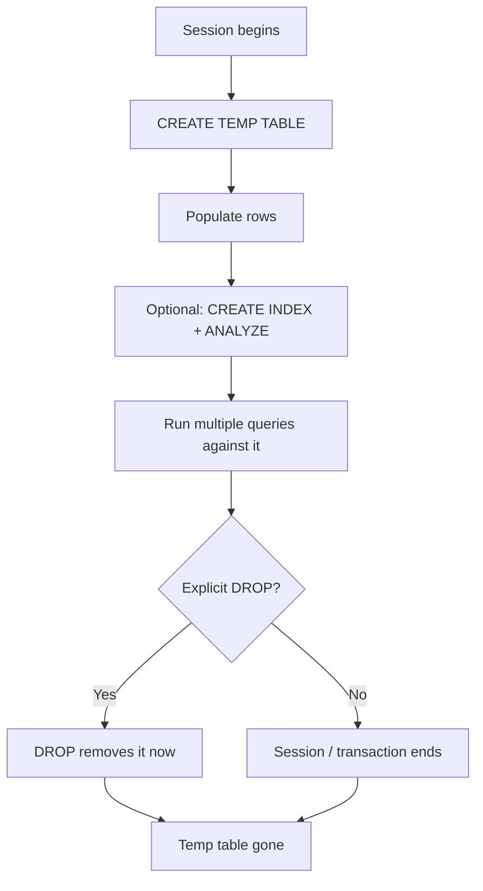

```markdown
# 95 — Temporary Tables

## What it is

A **temporary table** is a table that exists only for a limited lifetime — usually the current *session*, *transaction*, or *connection* — and is removed automatically when that scope ends.

It behaves like a normal table:

- you can `SELECT`, `INSERT`, `UPDATE`, `DELETE`, `CREATE INDEX`, and run aggregations on it
- but its definition and its rows are **private** and **transient**

```sql
CREATE TEMPORARY TABLE recent_orders AS
SELECT *
FROM orders
WHERE order_date >= CURRENT_DATE - INTERVAL '30 days';

SELECT customer_id, COUNT(*)
FROM recent_orders
GROUP BY customer_id;
```

> The concept is standardized in ANSI SQL (`CREATE TEMPORARY TABLE`, `ON COMMIT PRESERVE/DELETE ROWS`), but each engine implements scope, storage, and cleanup slightly differently.

---

## Why it exists

Temporary tables solve real problems that subqueries and CTEs cannot:

1. **Reusability across queries** — materialize an expensive result once, use it in several follow-up queries.
2. **Multi-step pipelines** — stage intermediate results so each step is readable, testable, and indexable.
3. **Consistent snapshot** — freeze data at a point in time so later queries see the same rows.
4. **Indexing intermediate results** — you can `CREATE INDEX` on a temp table, but not on a subquery.
5. **Breaking giant queries** — reduce optimizer complexity and make execution plans readable.
6. **Iterative processing** — loop over rows one batch at a time.



---

## Scope and lifetime by database

| Database | Syntax | Scope | Auto-drop | Definition persists? |
|---|---|---|---|---|
| PostgreSQL | `CREATE TEMP TABLE t (...)` | session | at end of session | no |
| MySQL | `CREATE TEMPORARY TABLE t (...)` | connection | when connection closes | no |
| SQL Server | `CREATE TABLE #t (...)`, `CREATE TABLE ##t (...)` | `#t` = batch/session, `##t` = all sessions | `#t` at end of session/proc, `##t` when last referencing session ends | no |
| Oracle (GTT) | `CREATE GLOBAL TEMPORARY TABLE` | session or transaction (`ON COMMIT`) | data dropped per `ON COMMIT`; definition is permanent | **yes** (definition) |
| Oracle 18c+ | `CREATE PRIVATE TEMPORARY TABLE` | session or transaction | auto | no |

Key labeled notes:

> **PostgreSQL**
> `CREATE TEMP TABLE` / `CREATE TEMPORARY TABLE` are equivalent. The table is stored in a session-private schema (`pg_temp_N`), invisible to other sessions, and dropped at the end of the session even if you forget to `DROP` it.

> **MySQL**
> `CREATE TEMPORARY TABLE` binds to the **connection**, not just the session. If the application reuses a pooled connection, the temp table and its data survive until that physical connection closes — see Production pitfalls.

> **SQL Server**
> `#t` is a local temp table stored in `tempdb`. `##t` is a global temp table that other sessions can *read and modify*; it is dropped only when the creating session disconnects and no other session references it.

> **Oracle**
> A `GLOBAL TEMPORARY TABLE` (GTT) has a *permanent definition* (anyone can `SELECT` it) but *per-session data*. `ON COMMIT PRESERVE ROWS` keeps rows for the session; `ON COMMIT DELETE ROWS` wipes rows at each commit.

---

## Internal working

A temp table is not "magic RAM." It is real table storage with the same cost model as any table: you **write rows**, then **read them back**. Understanding where that happens helps you predict performance.

| Database | Physical home | Notes |
|---|---|---|
| PostgreSQL | `pg_temp_n` schema, stored in the tablespace (default or `temp_tablespaces`), cached via `temp_buffers` | never WAL-logged (rows are session-private and not crash-recoverable) |
| MySQL | on-disk InnoDB temp tablespace (or `MEMORY` engine if you choose it) | internal server temp tables use the in-memory `TempTable` engine up to a size limit, then spill to disk |
| SQL Server | `tempdb` | shared by the whole instance → disk space and I/O contention are real concerns |
| Oracle | temporary tablespace, in temp segments | GTT rows generate minimal/no undo for data; definition (DDL) is permanent |

Consequences worth knowing:

- **Materialization cost**: a temp table must be *filled* before it can be read. The write is extra I/O a subquery would not pay (though a subquery is often materialized internally too).
- **Disk spill**: large temp tables can spill to disk. It does not mean the database is broken.
- **Not replicated**: temp tables are never replicated to replicas or used by backup tools.
- **No WAL (PostgreSQL)** and **no undo (Oracle GTT data)** reduce overhead because the data is disposable.

---

## Syntax

### PostgreSQL
```sql
CREATE TEMP TABLE high_value_customers (
    customer_id BIGINT PRIMARY KEY,
    total_spend  NUMERIC(12,2)
);

INSERT INTO high_value_customers
SELECT customer_id, SUM(total_amount)
FROM orders
GROUP BY customer_id
HAVING SUM(total_amount) > 500;

CREATE TEMP TABLE order_snapshot AS
SELECT * FROM orders WHERE order_date >= '2024-01-01';
```

Transaction-controlled variants:

```sql
CREATE TEMP TABLE t (...) ON COMMIT PRESERVE ROWS;   -- default: keep rows in session
CREATE TEMP TABLE t (...) ON COMMIT DELETE ROWS;     -- wipe rows at every commit
CREATE TEMP TABLE t (...) ON COMMIT DROP;            -- entire table gone at commit
```

### MySQL
```sql
CREATE TEMPORARY TABLE recent_logins (
    user_id    INT,
    login_at   DATETIME,
    KEY idx_user (user_id)
) ENGINE = InnoDB;

INSERT INTO recent_logins
SELECT user_id, login_at FROM logins WHERE login_at > NOW() - INTERVAL 1 DAY;

-- CTAS is also supported
CREATE TEMPORARY TABLE metrics ENGINE = InnoDB AS
SELECT order_id, SUM(qty * unit_price) AS gross_total
FROM order_items
GROUP BY order_id;
```

### SQL Server
```sql
CREATE TABLE #recent_orders (
    order_id   INT PRIMARY KEY,
    customer_id INT,
    total      MONEY
);

INSERT INTO #recent_orders
SELECT order_id, customer_id, total_amount
FROM orders
WHERE order_date >= '2024-01-01';

-- Fast copy with inferred types
SELECT order_id, customer_id, total_amount
INTO #recent_orders
FROM orders
WHERE order_date >= '2024-01-01';

-- Global temp table visible across sessions
CREATE TABLE ##shared_queue (job_id INT, payload NVARCHAR(MAX));
```

### Oracle (GTT)
```sql
CREATE GLOBAL TEMPORARY TABLE temp_customer_metrics (
    customer_id  NUMBER,
    order_count  NUMBER
) ON COMMIT PRESERVE ROWS;          -- keep per session

CREATE GLOBAL TEMPORARY TABLE temp_batch
ON COMMIT DELETE ROWS               -- wipe per transaction
AS SELECT * FROM orders WHERE 1 = 0;
```

### Oracle 18c+ (private temp table)
```sql
CREATE PRIVATE TEMPORARY TABLE ORA$PTT_customer_metrics (
    customer_id NUMBER,
    order_count NUMBER
) ON COMMIT DROP DEFINITION;
```
Names must start with `ORA$PTT_`. Private temp tables behave like the temp tables of other engines.

> **Common misconception**
> "A temp table is faster than a normal subquery." Not inherently. It *can* be faster when you reuse the intermediate result many times, index it, or force a single scan instead of repeated expensive scans. It can be *slower* when the materialization cost is not repaid.

---

## Grain discipline

State the grain of every table before writing queries:

- one row in `customers` = one customer
- one row in `orders` = one order
- one row in `order_items` = one line item on an order
- one row in `payments` = one payment against an order (an order can have several)

> The single most common temp-table bug is **joining a fact table that has multiple rows per key** before aggregating, which silently multiplies every total.

---

## Scenario 1 — FASTER + correct multi-query reporting

Every day you produce a customer report. The naive version uses repeated correlated subqueries:

### BAD approach

```sql
SELECT
    c.id,
    c.name,
    (SELECT COUNT(*) FROM orders o WHERE o.customer_id = c.id AND o.status = 'paid')    AS paid_orders,
    (SELECT COUNT(*) FROM orders o WHERE o.customer_id = c.id AND o.status = 'refunded') AS refunded_orders,
    (SELECT SUM(p.amount)
       FROM payments p
       JOIN orders o  ON o.id = p.order_id
      WHERE o.customer_id = c.id)                                                        AS total_paid
FROM customers c;
```

Why it is bad:

- each correlated subquery runs **once per customer row or uses a repeated index loop** — thousands of executions
- the planner reads the same data over and over
- summing payments through orders is correct here, but hard to read, and if you add the "paid orders count" next to it the fan-out temptation begins (see Scenario 2)

### BETTER approach

Build a small, indexed pipeline once, then read it:

```sql
-- Step 1: per-customer ORDER metrics (grain = order, no join yet)
CREATE TEMP TABLE customer_orders AS
SELECT customer_id,
       COUNT(*) FILTER (WHERE status = 'paid')    AS paid_orders,
       COUNT(*) FILTER (WHERE status = 'refunded') AS refunded_orders
FROM orders
GROUP BY customer_id;

-- Step 2: per-customer PAYMENT metrics (grain = payment)
CREATE TEMP TABLE customer_payments AS
SELECT o.customer_id,
       COUNT(p.id)                    AS payment_count,
       COALESCE(SUM(p.amount), 0)     AS total_paid
FROM orders o
LEFT JOIN payments p ON p.order_id = o.id
GROUP BY o.customer_id;

-- Step 3: index for the final join
CREATE INDEX idx_customer_orders    ON customer_orders    (customer_id);
CREATE INDEX idx_customer_payments  ON customer_payments  (customer_id);

-- Step 4: read everything in one clean pass
SELECT c.id, c.name,
       COALESCE(po.paid_orders, 0)    AS paid_orders,
       COALESCE(po.refunded_orders, 0) AS refunded_orders,
       COALESCE(pp.payment_count, 0)   AS payment_count,
       COALESCE(pp.total_paid, 0)      AS total_paid
FROM customers c
LEFT JOIN customer_orders   po ON po.customer_id = c.id
LEFT JOIN customer_payments pp ON pp.customer_id = c.id
ORDER BY c.id;
```

Sample data:

```sql
INSERT INTO customers VALUES
 (1,'Ada Lovelace','UK'), (2,'Grace Hopper','US'),
 (3,'Alan Turing','UK'),  (4,'Katherine Johnson','US');

INSERT INTO orders VALUES
 (101,1,'2024-01-05','paid',   150.00),
 (102,1,'2024-01-20','refunded',40.00),
 (103,2,'2024-02-01','paid',    99.00),
 (104,3,'2024-02-02','paid',   250.00),
 (105,4,'2024-03-10','paid',    30.00);

INSERT INTO payments VALUES
 (501,101,100.00,'2024-01-05'),
 (502,101, 50.00,'2024-01-06'),
 (503,103, 99.00,'2024-02-01'),
 (504,104,100.00,'2024-02-02'),
 (505,104,150.00,'2024-02-03');
```

Expected output:

```
id | name              | paid_orders | refunded_orders | payment_count | total_paid
 1 | Ada Lovelace      |           1 |               1 |             2 |    150.00
 2 | Grace Hopper      |           1 |               0 |             1 |     99.00
 3 | Alan Turing       |           1 |               0 |             2 |    250.00
 4 | Katherine Johnson |           1 |               0 |             0 |      0.00
```

> **Interview trap**
> Ada has **one** paid order (`101`) but **two** payments, and Alan has **one** paid order but **two** payments. The report must count orders *and* payments independently. Aggregating before joining is the only way to keep both counts correct.

---

## Scenario 2 — double counting (fan-out) inside a temp table

### BAD approach

Joining before aggregating multiplies rows:

```sql
CREATE TEMP TABLE wrong_metrics AS
SELECT o.customer_id,
       COUNT(*) AS rows_after_join,
       COUNT(*) FILTER (WHERE o.status = 'paid') AS paid_orders
FROM orders o
LEFT JOIN payments p ON p.order_id = o.id
GROUP BY o.customer_id;
```

For Ada (one paid order, two payments) this produces `rows_after_join = 2` and `paid_orders = 2`. Alan equally gets `paid_orders = 2`. Both numbers are **wrong** — fan-out silently double-counts orders.

```
customer_id | rows_after_join | paid_orders
          1 |               2 |           2   <- should be 1
          2 |               1 |           1
          3 |               2 |           2   <- should be 1
          4 |               1 |           1
```

### BETTER approach

Aggregate each grain separately, then join (the Step 1/2/3/4 query above). Left join to `payments` *after* computing `paid_orders`, never before.

> **Rule of thumb**
> If one input row can match many rows in the other table, aggregate one side *first*. Otherwise every `COUNT(*)` / `SUM()` on the single side is multiplied by the match count.

---

## Scenario 3 — repeatable snapshot during a long report

A report runs three queries: top products, slowest payers, and refund totals. The live `orders` table keeps changing between the queries, which makes the report internally inconsistent.

### BAD approach

```sql
-- Query A: top products   (reads orders now)
-- Query B: slow payers    (reads orders 3 seconds later - orders may have changed)
-- Query C: refund totals  (reads orders 7 seconds later - orders may have changed)
```

### BETTER approach

```sql
BEGIN;

-- materialize the analytic set once
CREATE TEMP TABLE report_orders AS
SELECT * FROM orders WHERE status IN ('paid', 'refunded');

-- Query A,B,C now all read report_orders -> consistent
DROP TABLE report_orders;

COMMIT;
```

> **Nuance**
> If the whole report runs inside one transaction, PostgreSQL and MySQL (REPEATABLE READ) already give you a consistent snapshot via MVCC — the temp table is unnecessary just for consistency. But as soon as you need the same snapshot **across transactions or sessions**, or want to *index* the intermediate set, a temp table is the right tool.

---

## Scenario 4 — a reusable staging layer for an ELT pipeline

```sql
-- Stage 1: clean rows
CREATE TEMP TABLE stg_orders AS
SELECT * FROM orders WHERE order_date IS NOT NULL;

-- Stage 2: enrich
CREATE TEMP TABLE stg_order_lines AS
SELECT si.order_id, p.category, si.qty * si.unit_price AS line_total
FROM stg_orders si
JOIN order_items oi ON oi.order_id = si.order_id
JOIN products    p  ON p.id       = oi.product_id;

-- Stage 3: aggregate
CREATE TEMP TABLE revenue_by_category AS
SELECT category, SUM(line_total) AS revenue
FROM stg_order_lines
GROUP BY category;

-- Stage 4: report
SELECT * FROM revenue_by_category ORDER BY revenue DESC;
```

Temp tables let you pause between stages, inspect a stage, add an index, and only then continue — impossible with one giant nested subquery.

---

## Edge cases

### Temp table shadowing a base table

> **Production pitfall**
> In PostgreSQL, MySQL, and SQL Server, a temp table can have the **same name** as a permanent table. Inside the session, unqualified references resolve to the temp table. If your code later expects the permanent table, results are "wrong" until the session ends.

```sql
-- a persistent table named orders exists
CREATE TEMP TABLE orders AS SELECT 1 AS note;
SELECT * FROM orders;      -- returns the temp table's rows
```
The permanent `orders` is invisible for the rest of the session. Drop the temp table (or `DROP TABLE IF EXISTS orders`) when done.

### Zero-row temp tables and statistics

> **SQL Server**
> Newly populated temp tables in `tempdb` get statistics created at creation time; if you then add millions of rows, the estimates are stale. Run `UPDATE STATISTICS #t;` before heavy joins.

> **PostgreSQL**
> `ANALYZE` a temp table after populating it; the autovacuum daemon does not analyze/vacuum temporary tables.

> **Oracle**
> GTTs get no automatic statistics. Gather them with `DBMS_STATS.GATHER_TABLE_STATS`, otherwise the optimizer assumes default cardinality.

Otherwise the planner may guess the temp table has a handful of rows, choose a nested-loop plan, and produce a much slower query than intended.

### Temp table inside a transaction

- **PostgreSQL** — DDL is transactional. `ROLLBACK` after `CREATE TEMP TABLE` removes it.
- **MySQL** — `CREATE TEMPORARY TABLE` is DDL and is **not transactional**; its DML *is*. A `ROLLBACK` removes rows but keeps the table.
- **SQL Server** — the `CREATE TABLE #t` DDL is part of the transaction; rolling back also rolls back the temp table creation.
- **Oracle GTT** — rows are transactional: `ROLLBACK` or `COMMIT` (with `ON COMMIT DELETE ROWS`) wipes them.

### Connection pooling leaks

> **Production pitfall**
> Application frameworks reuse physical connections. A MySQL/SQL Server temp table created by one "logical" session may still exist on the pooled connection later. Always `DROP TABLE IF EXISTS` at the start or end, or scope code defensively.

### NULLs and joins

Temp tables are ordinary tables, so NULL behaves normally — which means `NOT IN` still breaks.

```sql
CREATE TEMP TABLE blocked_orders AS
SELECT DISTINCT customer_id FROM orders WHERE status = 'blocked';
-- the join may have injected NULL via LEFT JOIN producing NULL customer_id

SELECT * FROM customers
WHERE id NOT IN (SELECT customer_id FROM blocked_orders);
-- one NULL in blocked_orders => empty result (three-valued logic)
```

Fix with `NOT EXISTS`:

```sql
SELECT * FROM customers c
WHERE NOT EXISTS (SELECT 1 FROM blocked_orders b WHERE b.customer_id = c.id);
```

> **Interview trap**
> `NOT IN (subquery)` is the classic NULL trap. If the subquery's result contains a single NULL, the predicate evaluates to UNKNOWN for every row and the outer query returns nothing. `NOT EXISTS` and `LEFT JOIN ... IS NULL` are immune.

### Coercion and type surprises

> **SQL Server**
> `SELECT ... INTO #t` infers column types from expressions. `SUM(int_col)` yields `int`, so a large sum can overflow with an arithmetic error that a normal `SUM` over a permanent `BIGINT` column would not. Prefer explicit `CREATE TABLE #t` with declared types for computed columns.

> **PostgreSQL**
> `CREATE TEMP TABLE AS` infers from expressions too (`COUNT(*)` becomes `bigint`), which is usually safe, but always verify the column type when it feeds downstream arithmetic.

---

## Comparison: temp table vs CTE vs subquery vs SQL Server table variable

| Concern | Temp table | CTE | Subquery / derived table | Table variable (`@t`) |
|---|---|---|---|---|
| Reusable across queries | yes | no | no | yes (scope-limited) |
| Indexable | yes | no (you hint `MATERIALIZED` in PG 12+ / 14+) | no | on PK only |
| Statistics | manual/auto (`ANALYZE`, `UPDATE STATISTICS`) | derived from base tables | derived from base tables | minimal (often estimated as 1 row) |
| Materialization | explicit | optional `MATERIALIZED` | part of plan spool | materialized |
| Recommended when... | many repeats, big staging, index needed, cross-query sharing | readability within a single statement | single-use filtering inside a query | small, short-lived sets in SQL Server |
| Cross-session visibility | PostgreSQL/MySQL/#t: no | — | — | no |

Do not pick based on folklore. All of these can appear in a `Nested Loop`, `Hash Join`, or `Spool` step. Verify with:

- PostgreSQL: `EXPLAIN (ANALYZE, BUFFERS)`
- MySQL: `EXPLAIN ANALYZE`
- SQL Server: `SET STATISTICS IO ON; SET STATISTICS TIME ON;` + actual execution plan
- Oracle: `SET AUTOTRACE ON` or `EXPLAIN PLAN` + `DBMS_XPLAN.DISPLAY_CURSOR`

---

## Performance implications

What actually decides whether a temp table helps:

- number of times the intermediate set is reread
- volume of materialized rows (write + read cost)
- whether you add an index the big join needs
- how accurate the statistics on the temp table are
- disk I/O and (SQL Server) `tempdb` contention
- whether the optimizer would have materialized it anyway

Situation | Likely to help | Verify with
|---|---|---|
| Same expensive aggregation used by 5 follow-up queries | yes | execution plan before/after |
| Small set, used once | rarely — subquery/CTE is fine | `EXPLAIN` |
| Big set, joined many times with no index | worse than a hash join to base tables | look for repeated index scans |
| Hundreds of sessions each creating large temp tables | `tempdb` / temp storage pressure | disk space, I/O wait stats |

> **Common misconception**
> "Temp tables always speed up a report." Materializing 10 million rows to a temp table everywhere, `temp_buffers` too small (PostgreSQL), or `tempdb` on a single slow disk (SQL Server) can easily make things *slower*. Push everything through `EXPLAIN ANALYZE` and prove it.

Index guidance, pending verification per engine:

- Create indexes **after** bulk population, not during per-row inserts.
- Index only the keys used by subsequent joins/filters.
- Keep the temp table as narrow as possible: fewer bytes = cheaper spills and buffer-cache reads.

---

## Common mistakes

1. **Joining before aggregating** → double counting (Scenario 2).
2. **Forgetting to `DROP`** → temp tables linger on pooled connections; the next run sees stale data.
3. **Same name as base table** → silent shadowing for the rest of the session.
4. **No statistics after population** → planner guesses cardinality and picks a bad join method.
5. **`SELECT INTO #t` overflow** (SQL Server) → declare explicit types for computed columns.
6. **Treating a temp table as fully in-memory** → disks spill and I/O surprise you at scale.
7. **Not clearing between batches** → previous batch's rows leak into the next report.
8. **Referencing a temp table in a view/inline function** → not supported in most engines.
9. **`NOT IN` over a temp table with NULLs** → empty result.
10. **Creating the same temp table name twice in one Proc without `DROP`** (SQL Server) → `There is already an object named '#t'`.

---

## Best practices

- State the output grain in your head before writing the temp table.
- Populate in bulk (`CTAS`/`INSERT...SELECT`), never row-by-row.
- `DROP` explicitly when the logical work unit ends; use `DROP TABLE IF EXISTS` defensively.
- `ANALYZE` (PostgreSQL/Oracle) or `UPDATE STATISTICS` (SQL Server) after heavy population.
- Add indexes only for keys used in subsequent joins.
- Prefer narrow columns and ON-COMMIT behavior that matches your intent.
- Keep temp-table logic inside the transaction/batch that owns it.
- Never use a temp table when a single CTE/subquery is enough — less machinery, fewer failure modes.
- Check the execution plan for spooling, spills, and a proper join algorithm *before* claiming victory.

---

# Interview Questions

### Beginner

1. What is a temporary table, and how does its lifetime differ from a normal table?
2. When is a temp table dropped automatically?
3. Can two different sessions see each other's temp tables? What are the exceptions?
4. What is the difference between `CREATE TEMPORARY TABLE` in MySQL and `CREATE TABLE #t` in SQL Server?
5. Write a query that creates a temp table containing yesterday's orders and returns a count of orders per status.

### Intermediate

1. Temp table vs CTE: when would you choose one over the other?
2. Why do statistics on a temp table matter, and when would you refresh them?
3. What does `CREATE TEMP TABLE ... AS SELECT` do differently from `CREATE TEMP TABLE ... (cols)` followed by `INSERT`?
4. Explain what `ON COMMIT DELETE ROWS`, `ON COMMIT PRESERVE ROWS`, and `ON COMMIT DROP` each mean.
5. Can you create an index on a temp table? Can you create one on a CTE? What problem does the difference solve?

### Advanced

1. How would you design a query pipeline that re-aggregates the same base data five times, using temp tables, and justify the choice with an execution plan?
2. What happens to a PostgreSQL temp table inside a transaction that rolls back, versus a MySQL temporary table in the same situation?
3. Explain the fan-out / double-counting hazard when a temp table is built from a one-to-many join. Show the wrong and right way.
4. When would a global temp table (`##t`) or an Oracle GLOBAL TEMPORARY TABLE be appropriate, and what isolation caveat applies?
5. How do temp tables interact with connection pooling, and how do you protect against stale data?

### Scenario Based

1. You write a nightly report joining `customers`, `orders`, `order_items`, `payments`. It runs in three independent queries. Show how temp tables keep the three results consistent and fast.
2. A customer segmentation needs a *top 3 products per segment* list. Design the pipeline with temp tables, indexes, and window functions.
3. Two sessions share computation but must not see each other's rows. Which temp table mechanisms allow sharing the definition but not the data?

### Tricky

1. A persistent table named `orders` exists. You run `CREATE TEMP TABLE orders AS SELECT 1 AS x;` then `SELECT * FROM orders;`. What does the query return, and what is the danger?
2. Your temp table has a `NULL` in the join key. You run `WHERE id NOT IN (SELECT customer_id FROM temp)`. What happens, and what is the fix?
3. Why might a query that is fast against the base table become slow against a temp table with zero-indexed joins? How does the optimizer's cardinality guess change the plan?
4. In SQL Server, why can `SELECT SUM(order_count) INTO #t FROM ...` raise an overflow error, and how do you prevent it?
5. After adding 1,000,000 rows to `#t`, the join plan still estimates only a few rows. What is wrong, and what do you do?

### Output Prediction

1. Given the Scenario-2 `wrong_metrics` query and the sample data, what are `rows_after_join` and `paid_orders` for `customer_id = 1`, and why?
2. `CREATE TEMP TABLE t AS SELECT 1 AS a;` then `SELECT * FROM t;` after a `ROLLBACK` in PostgreSQL — what does the second statement return (or throw), and why?
3. With `ON COMMIT DELETE ROWS`, after a `COMMIT` inside the same session, `SELECT COUNT(*) FROM t;` returns what?

### Debugging

1. A report is missing customers who have **no** orders. The temp table was built with an inner-style join. Where is the bug, and what is the fix?
2. Two identical-looking runs of the same stored procedure return different row counts. The procedure creates `#staging` without dropping it at the top. Explain how pooled connections cause this.
3. `UPDATE STATISTICS`/`ANALYZE` is not run after population, and the final join uses a nested loop against a huge temp table. How do you confirm the root cause and fix it?

### Performance

1. Under what measurable conditions does a temp table beat a CTE? Design the experiment and state which execution-plan evidence you would collect.
2. When is materializing a temp table *slower* than letting the optimizer fan out a one-time join? Name the costs.
3. Your PostgreSQL session's temp tables spill to disk constantly. What session settings and query shapes would you check first?
4. In SQL Server, `tempdb` is on a slow single disk and nightly ETL creates large `#t` tables. What would you inspect before claiming temp tables are the bottleneck?
5. Prove or disprove, using `EXPLAIN` output, the statement: "A temp table with an index always produces a faster join."

---

## Related sections

- **CTEs and Recursive CTEs** — how `MATERIALIZED` CTEs relate to temp tables
- **JOINs** — fan-out, one-to-many, `ON` vs `WHERE`
- **NULL and three-valued logic** — `NOT IN` traps, `COALESCE`
- **Indexes** — composite, covering, statistics
- **Window functions** — `ROW_NUMBER`, `RANK`, `DENSE_RANK` for top-N problems
- **Transactions** — `ON COMMIT` interplay, isolation levels
- **Execution plans** — how to verify every claim in this section
- **Keyset pagination** — a related pattern for stable large-result processing
```
