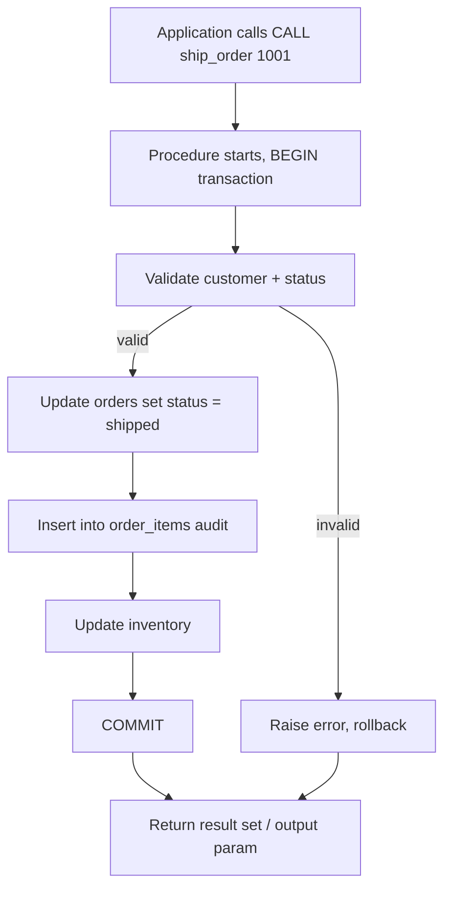

Wrote `sql-handbook/11-Advanced/96-Stored-Procedures.md` (818 lines) — full Section 96 covering fundamentals, internal working (parse/plan/cache flow with Mermaid), per-engine syntax for PostgreSQL/MySQL/SQL Server/Oracle, parameter modes, control flow, four scenario examples (transactional payment, dynamic search with injection-safe BAD/BETTER, NULL handling, logging/error handling), procedure-vs-function-vs-view comparison, NULL behavior, edge cases, common mistakes, production pitfalls, performance implications tied to execution plans (parameter sniffing, plan reuse, cursor-vs-set-based), best practices, and withheld-answer interview questions across all 8 requested categories.
e row in `orders` represents one order.
> One row in `order_items` represents one line item of an order.

### What a stored procedure is NOT

> Common misconception: a stored procedure is "encrypted" or "compiled to machine code" and therefore always faster than sending raw SQL.

Modern optimizers still parse, optimize, and plan the *individual statements inside* the procedure at or near run time. The speed advantage of a procedure is mostly **fewer round trips** (one `CALL` instead of ten `SELECT`s on the wire) and **plan reuse** — not secret bytecode magic.

> Common misconception: stored procedures and **functions** are interchangeable.

They are not. Check the section on functions and see the comparison table lower down: functions are used inside expressions/queries (`WHERE`, `SELECT`), must return *something*, and may not always be allowed to run `COMMIT`/`ROLLBACK`; procedures are invoked with `CALL`/`EXEC`, may return no value, and are the natural place for multi-step transactional logic.

> Interview trap: "A stored procedure always returns an integer." SQL Server's `RETURN int` convention and Oracle/PostgreSQL procedures trick beginners into believing every procedure must return a number. Procedures in PostgreSQL, MySQL, and Oracle primarily return **result sets** or fill `OUT`/`INOUT` parameters; they are not required to return a scalar.

---

## Why it exists

1. **Round-trip reduction** — run many statements over one connection call instead of dozens of queries sent from the app.
2. **Centralized business rules** — one canonical implementation of "how a payment is applied", used by web, batch, mobile, and reports.
3. **Encapsulation/security** — revoke direct table access, grant only `EXECUTE` on the procedure; callers never touch tables or columns directly.
4. **Atomic multi-step operations** — wrap several updates in a single transaction so either all succeed or all roll back.
5. **Consistent error handling** — define how constraint violations, deadlocks, and missing rows are converted into application-facing messages.
6. **Batch / ETL glue** — loop over rows, stage data, log progress, run maintenance.



---

## Internal working

### 1. Create phase

```
CREATE PROCEDURE ... --> parsed --> validated --> *sometimes* compiled --> stored as schema object
```

At `CREATE` time the database usually:

- parses the text,
- validates names and types (often lazily — many engines defer body validation until first execution),
- resolves the owner and privileges,
- stores the body (source and/or an intermediate form).

> **Database-specific:** PostgreSQL does **not** validate the procedure body at creation time — an unknown table is caught at first `CALL`. SQL Server compiles the batch at `CREATE` time and errors immediately. MySQL validates syntax at create but resolves table names at execution. Oracle validates statically resolvable names at compile time but defers runtime checks.

### 2. Execution phase

```
CALL p(...) --> start session context --> bind arguments
  --> for each statement:
        parse cursor --> optimize --> build execution plan --> execute
  --> commit/rollback as coded --> return output(s)
```

Each *statement inside* the body goes through the normal optimization pipeline. Engines cache execution plans for those statements to reuse across calls:

```mermaid
flowchart LR
    subgraph First call
        A1[Parse] --> B1[Optimize] --> C1[Build plan] --> D1[Cache plan] --> E1[Execute]
    end
    subgraph Later calls
        A2[Reuse cached plan] --> E2[Execute]
    end
```

What triggers a **recompile** or **plan discard**, engine-dependent (verify per engine):

- schema change (column added/dropped) on a referenced table,
- statistics updated / rows grown past threshold,
- `CREATE OR REPLACE` of the procedure itself,
- `SET` session-settings that affect plan selection (e.g. `ANSI_NULLS`, `QUOTED_IDENTIFIER` in SQL Server),
- randomize/`RECOMPILE` hints.

### 3. Statement / network flow for result sets

A procedure that contains `SELECT` statements typically returns **client result sets**:

| Engine | How a result set is returned |
|---|---|
| PostgreSQL | `RETURN QUERY` / `RETURNS SETOF` (procedure `CALL` needs refcursor for full sets) |
| MySQL | plain `SELECT` inside the body streams rows back to the caller |
| SQL Server | plain `SELECT` inside the body streams rows back; also `OUTPUT` params |
| Oracle | `OUT` **ref cursor** parameters, or `PIPELINED` functions |

---

## Sample data

```sql
CREATE TABLE departments (
    department_id   INT PRIMARY KEY,
    department_name VARCHAR(50) NOT NULL
);

CREATE TABLE employees (
    employee_id   INT PRIMARY KEY,
    first_name    VARCHAR(50) NOT NULL,
    last_name     VARCHAR(50) NOT NULL,
    department_id INT REFERENCES departments(department_id), -- NULL = unassigned
    job_title     VARCHAR(50),
    salary        NUMERIC(10,2) NOT NULL,
    hire_date     DATE NOT NULL
);

CREATE TABLE customers (
    customer_id   INT PRIMARY KEY,
    customer_name VARCHAR(50) NOT NULL,
    city          VARCHAR(50),
    is_active     BOOLEAN
);

CREATE TABLE orders (
    order_id     INT PRIMARY KEY,
    customer_id  INT NOT NULL REFERENCES customers(customer_id),
    total_amount NUMERIC(10,2) NOT NULL,
    status       VARCHAR(20) NOT NULL,   -- 'shipped' | 'pending' | 'cancelled'
    order_date   DATE NOT NULL
);

INSERT INTO departments VALUES
(10, 'Engineering'), (20, 'Sales'), (30, 'HR');

INSERT INTO employees VALUES
(1, 'Alice', 'Smith',   10, 'Senior Engineer',   95000.00, '2021-03-01'),
(2, 'Bob',   'Jones',   10, 'Engineer',          72000.00, '2022-06-15'),
(3, 'Carol', 'Lee',     20, 'Account Executive', 65000.00, '2020-11-02'),
(4, 'David', 'Brown',   20, 'Sales Manager',     88000.00, '2019-04-21'),
(5, 'Eve',   'Wilson',  NULL,'Recruiter',        58000.00, '2023-01-09');

INSERT INTO customers VALUES
(1, 'Acme Corp',  'Chicago',  TRUE),
(2, 'Globex Inc', 'Austin',   TRUE),
(3, 'Initech',    'New York', FALSE);

INSERT INTO orders VALUES
(1001, 1, 249.95, 'pending',  '2025-01-10'),
(1002, 2, 129.99, 'shipped',  '2025-01-11'),
(1003, 1, 19.99,  'cancelled','2025-01-12'),
(1004, 3, 500.00, 'pending',  '2025-01-14'),
(1005, 2, 89.50,  'shipped',  '2025-01-15');
```

> One row in `orders` represents one order. There is no `order_items` table here — each order total is already denormalized. This keeps the examples small and hand-checkable. Adopt the same "state the grain" habit in every procedure you design.

---

## Syntax by database

### PostgreSQL (PL/pgSQL, PG 11+ for procedures)

```sql
CREATE OR REPLACE PROCEDURE ship_order(
    p_order_id INT
)
LANGUAGE plpgsql
AS $$
BEGIN
    UPDATE orders
    SET status = 'shipped'
    WHERE order_id = p_order_id;

    IF NOT FOUND THEN
        RAISE EXCEPTION 'Order % not found', p_order_id;
    END IF;
END;
$$;

CALL ship_order(1001);
```

PostgreSQL procedures may contain `COMMIT`/`ROLLBACK` (added PG 11). **Functions** may not. To return rows, procedures use `INOUT` `refcursor` parameters; functions use `RETURNS SETOF`.

### MySQL

```sql
DELIMITER $$

CREATE PROCEDURE ship_order(
    IN p_order_id INT
)
BEGIN
    UPDATE orders
    SET status = 'shipped'
    WHERE order_id = p_order_id;

    IF ROW_COUNT() = 0 THEN
        SIGNAL SQLSTATE '45000'
            SET MESSAGE_TEXT = 'Order not found';
    END IF;
END$$

DELIMITER ;

CALL ship_order(1001);
```

### SQL Server (T-SQL)

```sql
CREATE OR ALTER PROCEDURE dbo.ship_order
    @order_id INT
AS
BEGIN
    SET NOCOUNT ON;

    UPDATE orders
    SET status = 'shipped'
    WHERE order_id = @order_id;

    IF @@ROWCOUNT = 0
        THROW 50001, 'Order not found', 1;
END;
GO

EXEC dbo.ship_order @order_id = 1001;
```

### Oracle (PL/SQL)

```sql
CREATE OR REPLACE PROCEDURE ship_order(
    p_order_id IN NUMBER
) IS
BEGIN
    UPDATE orders
    SET status = 'shipped'
    WHERE order_id = p_order_id;

    IF SQL%ROWCOUNT = 0 THEN
        RAISE_APPLICATION_ERROR(-20001, 'Order not found');
    END IF;
END;
/

EXEC ship_order(1001);
```

> Key takeaway: the *language* differs wildly (PL/pgSQL, MySQL stored-language, T-SQL, PL/SQL) but the *concepts* — parameters, local variables, control flow, cursors, error handling, transactions — are the same everywhere. Master the concepts, look up the dialect.

---

## Parameters

| Kind | Meaning | PostgreSQL | MySQL | SQL Server | Oracle |
|---|---|---|---|---|---|
| IN | read-only input | default | `IN` | default (unless `OUTPUT`) | `IN` |
| OUT | write-only output | `OUT` | `OUT` (older MySQL: `OUT` param behavior changed in 8.0) | `OUT parameter` | `OUT` |
| INOUT | read and write | `INOUT` | `INOUT` | `@p OUTPUT` | `IN OUT` |
| Default value | omit argument at call | `DEFAULT expr` / `= expr` | `DEFAULT expr` | `@p INT = NULL` | `DEFAULT expr` |

### Example — OUT / INOUT

**PostgreSQL**

```sql
CREATE OR REPLACE PROCEDURE get_order_total(
    p_order_id INT,
    INOUT p_total NUMERIC(10,2),
    OUT p_status TEXT
)
LANGUAGE plpgsql
AS $$
BEGIN
    SELECT total_amount, status
      INTO p_total, p_status
      FROM orders
     WHERE order_id = p_order_id;

    IF NOT FOUND THEN
        RAISE EXCEPTION 'Order % not found', p_order_id;
    END IF;
END;
$$;

CALL get_order_total(1002, NULL, NULL);
```

**SQL Server**

```sql
CREATE OR ALTER PROCEDURE dbo.get_order_total
    @order_id  INT,
    @total     NUMERIC(10,2) OUTPUT,
    @status    VARCHAR(20)   OUTPUT
AS
BEGIN
    SET NOCOUNT ON;

    SELECT @total = total_amount, @status = status
    FROM orders
    WHERE order_id = @order_id;

    IF @@ROWCOUNT = 0
        THROW 50002, 'Order not found', 1;
END;
GO

DECLARE @t NUMERIC(10,2), @s VARCHAR(20);
EXEC dbo.get_order_total @order_id = 1002,
                         @total = @t OUTPUT,
                         @status = @s OUTPUT;
SELECT @t AS total, @s AS status;
-- total: 129.99 | status: shipped
```

---

## Local variables and control flow

### Variables

```sql
-- PostgreSQL / MySQL / Oracle share a DECLARE ... SET style
DECLARE
    v_count INT;
BEGIN
    v_count := 5;
END;

-- SQL Server
DECLARE @count INT = 5;
```

### IF / CASE

```sql
-- PostgreSQL / MySQL / Oracle
IF p_status = 'shipped' THEN
    -- ...
ELSIF p_status = 'pending' THEN
    -- ...
ELSE
    -- ...
END IF;

-- SQL Server
IF @status = 'shipped'
    -- ...
ELSE IF @status = 'pending'
    -- ...
ELSE
    -- ...
```

### Loops and cursors

Loops are the #1 reason procedures get slow. A **cursor** fetches rows and lets you act on each one — but acting row-by-row is almost always slower than a single set-based statement (see BAD/BETTER example below).

```sql
-- MySQL style cursor
CREATE PROCEDURE give_raise(
    IN p_pct NUMERIC(5,2)
)
BEGIN
    DECLARE done INT DEFAULT FALSE;
    DECLARE v_id INT;
    DECLARE cur CURSOR FOR
        SELECT employee_id FROM employees WHERE department_id = 10;
    DECLARE CONTINUE HANDLER FOR NOT FOUND SET done = TRUE;

    OPEN cur;
    read_loop: LOOP
        FETCH cur INTO v_id;
        IF done THEN
            LEAVE read_loop;
        END IF;

        UPDATE employees
           SET salary = salary * (1 + p_pct / 100)
         WHERE employee_id = v_id;
    END LOOP;
    CLOSE cur;
END;
```

> Production pitfall: the cursor loop above issues one `UPDATE` per row — N round-trips inside the engine. The set-based version is one statement. Measure with `EXPLAIN` / profiler, but row-by-row patterns are the textbook cause of "procedure that worked on 100 rows but times out on 100,000."

### BAD APPROACH — cursor row-by-row

```sql
-- N single-row updates, one per cursor row
UPDATE employees SET salary = salary * 1.05 WHERE employee_id = v_id;
```

### BETTER APPROACH — set-based single statement

```sql
UPDATE employees
   SET salary = salary * 1.05
 WHERE department_id = 10;
```

**Why:** the single `UPDATE` lets the optimizer choose a scan/update strategy for the whole set, is a single logged statement, and avoids row-by-row latency and lock churn. Use cursors only when each row needs genuinely per-row logic that set-based SQL cannot express, and even then prefer `CASE` expressions or window functions.

> **Interview trap:** "A cursor is more flexible, so it is faster than set-based SQL." False — flexibility is not speed. Set-based declarative code wins on every realistic volume. The cursor's value is *control*, not performance.

---

## Scenario 1 — Transactional procedure: apply a payment

Business rule: applying a payment to an order must change the order status **and** record who did it, atomically.

### PostgreSQL

```sql
CREATE OR REPLACE PROCEDURE apply_payment(
    p_order_id  INT,
    p_amount    NUMERIC(10,2)
)
LANGUAGE plpgsql
AS $$
BEGIN
    UPDATE orders
       SET status = CASE WHEN p_amount >= total_amount THEN 'shipped'
                         ELSE 'pending' END
     WHERE order_id = p_order_id;

    IF NOT FOUND THEN
        RAISE EXCEPTION 'Order % does not exist', p_order_id;
    END IF;

    INSERT INTO payment_log(order_id, amount, applied_at)
    VALUES (p_order_id, p_amount, CURRENT_TIMESTAMP);
EXCEPTION
    WHEN OTHERS THEN
        ROLLBACK;
        RAISE;
END;
$$;

CALL apply_payment(1001, 249.95);
```

Both the status change and the log insert either commit together or roll back together.

> **Database-specific — transaction control inside procedures:**

| Engine | Can procedure COMMIT/ROLLBACK internally? |
|---|---|
| PostgreSQL | Yes, PG 11+ (that's why procedures exist there) |
| MySQL | Each stored program runs inside the current transaction; COMMIT/ROLLBACK allowed |
| SQL Server | COMMIT/ROLLBACK allowed (careful with nested transaction counting) |
| Oracle | No `COMMIT` inside PL/SQL by default practice — the caller commits; autonomous transactions are the exception |

> **Oracle** convention: procedures should **not** `COMMIT` inline — leave transaction boundaries to the caller so a single unit of work can call 5 procedures and commit once.

### Reads the same data must not double-count

Say you add a log of payments and then join per customer:

```sql
-- BAD: one-to-many join fans out the per-order total
SELECT o.customer_id, SUM(p.amount) AS paid_amount
FROM orders o
JOIN payments p ON p.order_id = o.order_id
GROUP BY o.customer_id;
```

If each order can have many payments, `total_amount` per order is correct to sum only once — the same fan-out trap you see in `JOIN` sections applies **inside** procedure logic. Pre-aggregate at the correct grain:

```sql
-- BETTER: sum at order grain first, then by customer
SELECT o.customer_id, SUM(p.paid) AS paid_amount
FROM orders o
JOIN (SELECT order_id, SUM(amount) AS paid
      FROM payments GROUP BY order_id) p
  ON p.order_id = o.order_id
GROUP BY o.customer_id;
```

---

## Scenario 2 — Dynamic search with optional filters (and SQL injection)

Callers want a procedure like `search_orders(search_text)` that filters on optional params and returns orders.

### BAD APPROACH — string concatenation (injection)

```sql
-- DANGEROUS: never build SQL by concatenating raw input
CREATE OR REPLACE PROCEDURE search_orders(p_text TEXT) ...
    sql := 'SELECT * FROM orders WHERE customer_name ILIKE ''%' || p_text || '%''';
    EXECUTE sql;
```

If `p_text` is `' OR '1'='1`, the WHERE clause is rewritten and the procedure returns everything (or worse, deletes/updates in other statements).

### BETTER APPROACH — bind parameters and conditional predicates

```sql
CREATE OR REPLACE PROCEDURE search_orders(
    p_text TEXT,
    p_status TEXT DEFAULT NULL
)
LANGUAGE plpgsql
AS $$
BEGIN
    CREATE TEMP TABLE result AS
    SELECT o.order_id, o.customer_id, o.total_amount, o.status, o.order_date
    FROM orders o
    JOIN customers c USING (customer_id)
    WHERE (p_text IS NULL OR c.customer_name ILIKE '%' || p_text || '%')
      AND (p_status IS NULL OR o.status = p_status)
    ORDER BY o.order_date DESC;

    RETURN; -- caller reads the temp table via a refcursor/result set in its dialect
END;
$$;
```

The values are **parameters**, never concatenated into the SQL text, so injection is impossible.

> Production pitfall: dynamic SQL with unescaped identifiers (`"user"` vs `user`, schema names) is a second injection surface. Always quote identifiers safely or whitelist allowed identifiers instead of interpolating user input.

---

## Scenario 3 — NULL handling in procedures

Parameters default to a value; procedures must decide how NULLs flow.

```sql
-- How should the procedure behave when p_percent IS NULL?
CREATE OR REPLACE PROCEDURE apply_raise(
    p_employee_id INT,
    p_percent NUMERIC(5,2) DEFAULT 5.00  -- DEFAULT applies at CALL
)
LANGUAGE plpgsql
AS $$
BEGIN
    IF p_percent IS NULL THEN
        RAISE EXCEPTION 'p_percent must not be NULL';
    END IF;

    UPDATE employees
       SET salary = salary * (1 + p_percent / 100)
     WHERE employee_id = p_employee_id;

    IF NOT FOUND THEN
        RAISE EXCEPTION 'Employee % not found', p_employee_id;
    END IF;
END;
$$;
```

NULL behavior rules:

- An explicit `NULL` (e.g. `CALL apply_raise(1, NULL)`) **overrides** the default value — defaults only apply when the argument is omitted. This surprises people who assume `DEFAULT 5.00` catches `NULL`.
- Comparisons like `p_percent > 0` yield `NULL` when the param is NULL — `IF NULL THEN` is unusual; always use explicit `IS NULL` checks.
- `p_percent / 100` with NULL param produces NULL, silently "no raise" — validate up front as above.
- `NOT FOUND` after an `UPDATE` counts updated rows, and an `UPDATE` matching a row but *changing nothing* still returns found (PostgreSQL quirk: PG reports rows "matched" but not modified by default).

> Interview trap: "`COUNT(*)` ignores NULL by counting rows, `COUNT(column)` skips NULLs." A procedure that aggregates this way inherits the same rules. If you `INTO v_count SELECT COUNT(salary)`, NULL salaries silently produce a wrong total.

---

## Scenario 4 — Logging and error handling

A procedure that wraps a risky operation and records its outcome:

### SQL Server

```sql
CREATE OR ALTER PROCEDURE dbo.safe_archive
AS
BEGIN
    SET NOCOUNT ON;
    BEGIN TRY
        BEGIN TRAN;
            INSERT INTO orders_archive SELECT * FROM orders WHERE status = 'shipped';
            DELETE FROM orders WHERE status = 'shipped';
        COMMIT;
        INSERT INTO run_log(step, rows, status, logged_at)
        VALUES ('safe_archive', @@ROWCOUNT, 'ok', GETDATE());
    END TRY
    BEGIN CATCH
        IF @@TRANCOUNT > 0 ROLLBACK;
        INSERT INTO run_log(step, rows, status, logged_at)
        VALUES ('safe_archive', 0, ERROR_MESSAGE(), GETDATE());
        THROW;
    END CATCH;
END;
```

### PostgreSQL equivalent with exception block

```sql
CREATE OR REPLACE PROCEDURE safe_archive()
LANGUAGE plpgsql
AS $$
DECLARE v_rows INT;
BEGIN
    INSERT INTO orders_archive SELECT * FROM orders WHERE status = 'shipped';
    GET DIAGNOSTICS v_rows = ROW_COUNT;
    DELETE FROM orders WHERE status = 'shipped';
    INSERT INTO run_log(step, rows, status) VALUES ('archive', v_rows, 'ok');
EXCEPTION
    WHEN OTHERS THEN
        INSERT INTO run_log(step, rows, status)
        VALUES ('archive', 0, SQLERRM);
        RAISE;
END;
$$;
```

> Production pitfall: logging a failure *inside* the same transaction that's about to roll back means the log row is rolled back too. To record failures that survive a rollback you need an **autonomous transaction**, a write to a separate session/table outside the transaction, or accept the loss. PostgreSQL `RAISE` inside `EXCEPTION` re-raises after the block's subtransaction rolled back the *body* — but writes made *before* the error in the same function are also rolled back. Design the log write to happen outside the rolled-back scope.

---

## Stored procedures vs functions vs views

| Aspect | Stored Procedure | Function | View |
|---|---|---|---|
| Invoked by | `CALL` / `EXEC` | inside SQL expressions (`SELECT f(x)`) | `SELECT ... FROM view` |
| Must return a value | No | Yes | Yes (a result set) |
| Returns result set | Yes (dialect-dependent) | Yes (`RETURNS TABLE` / `SETOF`) | Yes |
| Can contain DML `INSERT/UPDATE/DELETE` | Yes | Usually restricted (PG: only if marked `VOLATILE`, SQL Server: no, MySQL: no) | No (except some simple `INSERT`/`UPDATE` through it in limited forms) |
| Can run transactions (`COMMIT`) | Yes (main use case) | Usually no | No |
| Used inside `WHERE`/`SELECT` | No | Yes | Yes (as a virtual table) |
| Accepts parameters | Yes | Yes | No (views are parameterless; use table functions) |
| Storage | Definition + cached plans | Definition + cached plans | Definition only (non-materialized) |
| Privilege model | `GRANT EXECUTE` | `GRANT EXECUTE` | `GRANT SELECT` |

> Common misconception: "A view is just a procedure that returns rows." Views have **no logic, no parameters, no loops, no DML** — they are pure saved `SELECT` definitions. If you need input parameters, branching, or multi-step processing, you need a procedure or a table function, not a view.

---

## Performance implications

Do not accept absolute claims — verify with the execution plan (`EXPLAIN ANALYZE` in PostgreSQL/MySQL, actual plan or `SET STATISTICS IO/TIME ON` in SQL Server, `DBMS_XPLAN.DISPLAY_CURSOR` in Oracle).

Things that genuinely affect procedure performance:

1. **Plan caching / reuse** — SQL Server caches a plan per procedure; the first execution's parameter values can "sniff" and pin a plan that is great for those values but terrible for others (**parameter sniffing**). PostgreSQL PL/pgSQL uses *generic* plans after the first several executions (default 5), trading per-value optimality for parse avoidance. MySQL generally parses stored programs each call but benefits from cached prepared statements. Oracle uses bind-variable **cursor sharing**.
2. **Parameter values that skew cardinality** — a `WHERE customer_id = @c` plan tuned for a big customer may scan when a small-value path exists, or vice versa. This is why "the same procedure is fast for customer A, slow for customer B."
3. **Statement-level optimizer choices** — inside a procedure the same join/scan/aggregate rules and the same need for indexes apply as in ad-hoc SQL. An index that helps `SELECT ... WHERE status = 'pending'` helps inside the procedure too — add it and re-test.
4. **Cardinality guesses drive memory/join choice** — `EXPLAIN` estimates drive hash-join memory, spill behavior, and nested-loop vs hash decisions. Stale statistics make those guesses wrong.
5. **Row-by-row (cursor) vs set-based** — the single biggest procedure bottleneck. Replace cursors with set-based SQL whenever possible.
6. **`SELECT *` overfetch inside procedures** — returning unneeded columns adds I/O and network cost.
7. **Dynamic SQL loses plan-reuse** — each new concatenated string is a fresh parse/plan; bind parameters instead so plans are reusable.
8. **Recompile storms** — an `OPTION (RECOMPILE)` per call (SQL Server) or frequent `CREATE OR REPLACE` prevents plan reuse; use sparingly and measure.
9. **Nested calls** — calling procedure A which calls B which calls C multiplies parsing and context-switch cost; flat designs are easier to profile.
10. **Autocommit boundaries** — each `COMMIT` flushes WAL/log buffers; a loop that commits every row pays the fsync tax N times.

Recommended procedure: run the slow input, capture the actual execution plan, compare estimated vs actual rows, look for scans on indexed columns, and only then act (add index / rewrite / hint). Then re-run.

---

## Common mistakes

1. **Cursor instead of set-based SQL** — row-by-row updates (see BAD/BETTER above).
2. **Concatenating user input into dynamic SQL** — SQL injection.
3. **Default values don't catch explicit NULL** — `DEFAULT 5.00` is skipped when the caller passes `NULL`.
4. **Forgetting `NOT FOUND`** — the procedure succeeds silently even when the row doesn't exist.
5. **Not wrapping multi-statement logic in a transaction** — partial success on failure.
6. **Logging a failure inside the transaction that rolls back** — the log vanishes.
7. **`SELECT` returning multiple rows into a scalar variable** — runtime error (single-row `SELECT INTO` must match exactly one row).
8. **Naming conflicts between parameters and columns** — `WHERE employee_id = employee_id` without prefixing parameters (`p_` prefix) compares column to itself. Classic bug.
9. **Assuming the procedure body gets re-validated on every call** — schema changes can silently produce stale-column errors until a recompile forces re-validation.
10. **Result sets confused with return values** — a bare `SELECT` inside a procedure (MySQL/SQL Server) silently returns a result set; an `OUT` param also exists; mixing them confuses ORMs.
11. **Missing `SET NOCOUNT ON` (SQL Server)** — extra "rows affected" messages on the wire.
12. **Hard-coded limits / no pagination** — a "report all orders" procedure delivers 10M rows out of habit.

---

## Edge cases

- **Zero matching rows** — `NOT FOUND` / `@@ROWCOUNT = 0` / `SQL%ROWCOUNT = 0`; decide whether that is a success-with-no-op or an error.
- **Multiple matching rows when you expected one** — single-row `SELECT ... INTO` aborts; use `LIMIT 1`/`TOP 1`/`FETCH FIRST` deliberately.
- **Empty result set returned to application** — most drivers later the count; pattern your procedure so an empty set is explicit (`0 rows`) rather than a missing token.
- **NULL parameters** — validate at the top with explicit `IS NULL` guards.
- **Constraints / uniqueness failures** — catch and translate to meaningful messages.
- **Division by zero** — `p_amount / 0` raises; guard with `NULLIF(p_amount, 0)` or validate.
- **Nested transactions** — SQL Server counts `@@TRANCOUNT`; repeated `BEGIN TRAN` inside called procedures can double-commit or roll back more than intended. Check `@@TRANCOUNT` before `ROLLBACK`.
- **Concurrent callers modifying the same rows** — deadlocks are a normal, retried outcome; procedures should catch deadlock errors (1213/1205 SQL Server, `40P01` PostgreSQL) and retry, not crash the app.
- **Time zone and boundaries** — a "orders today" procedure built with `CURRENT_DATE` at 00:00:00 can miss the current day's rows or double-count across midnight. Use half-open `[start, end)` intervals with timestamps (see Date-and-Strings section).
- **Integer division** — `1 / 2` yields `0` in many engines; ratios need at least one `NUMERIC` operand.

---

## Production pitfalls

> Production pitfall — **injection** is the highest-severity procedure risk. Always bind parameters, never concatenate.

> Production pitfall — **privilege escalation**. Postgres `SECURITY DEFINER` procedures run as the definer, potentially letting a caller with only `EXECUTE` mutate tables the caller cannot touch. Keep the privilege level as *invoker* where possible, or audit what a `DEFINER` procedure can reach. SQL Server has `EXECUTE AS` for the same effect.

> Production pitfall — **parameter sniffing** (SQL Server). One unlucky first call can pin a plan that suffocates everyone else. Mitigate with `OPTION (RECOMPILE)`, `OPTION (OPTIMIZE FOR ...)`, or query-level hints — after proving the problem with actual plans, never by rote.

> Production pitfall — **long-running procedure vs only-holder of the lock**. A procedure that holds a transaction open across a slow loop blocks writers for the whole duration. Minimize lock time: do reads outside the transaction, keep write windows short, batch commits where correct.

> Production pitfall — **procedures in source control**. Schema drift is real: ensure `CREATE OR REPLACE` scripts live in the repo and are applied by migration tooling, not hand-edited in prod.

> Production pitfall — **monitoring**. Stored logic is invisible in app APM traces. Instrument entry/exit (`run_log`), capture duration, rows, and errors, or you won't notice a silently degrading procedure until a pager fires.

> Production pitfall — **when NOT to use a procedure**: heavy user-facing reporting where a CTE is clearer, business rules that belong in the domain model, or logic needing app-side libraries. The database is not a web server; don't do string templating, file I/O, or high-cardinality "push all rows through a loop" work inside it.

---

## Best practices

1. **State the grain** of every table and of every result set in the procedure's header comment.
2. **Prefix parameters** (`p_` or `@`) so names never collide with columns.
3. **Validate inputs first** — NULLs, ranges, existence — before touching data.
4. **Prefer set-based SQL**; reach for cursors only when per-row control is unavoidable.
5. **One procedure, one logical transaction**; commit only when the unit of work is complete (follow your engine's convention).
6. **Bind, never concatenate** — parameters only in dynamic SQL.
7. **Return expected shapes** — document whether the caller reads a result set, OUT params, or a scalar.
8. **Handle zero/missing rows explicitly** — decide silent no-op vs error per business rule.
9. **Keep procedures small and composable** — a 2,000-line proc is untestable; split into named steps.
10. **Catch only what you can handle** — let unexpected errors propagate, re-raise after logging.
11. **Version and migrate** via source control, alongside schema migrations.
12. **Profile with execution plans**, not intuition; re-check after statistics or schema changes.
13. **Set `NOCOUNT ON`** (SQL Server) and return narrow columns, not `SELECT *`.
14. **Define privilege model** — `EXECUTE` yes, direct table DML no, when you want encapsulation.
15. **Test edge cases** — NULL, empty input, duplicates, boundary dates, concurrency.

---

# Interview Questions

### Beginner

1. What is a stored procedure, and how is it different from sending a batch of SQL from an application?
2. What are the parameter modes in your favorite database (IN, OUT, INOUT)? Give an example of each.
3. How do you pass a value *out* of a procedure in SQL Server (vs PostgreSQL vs Oracle)?
4. Can a stored procedure `SELECT` rows and return them to the caller? Show one dialect.
5. What is the difference between `CALL` and `EXEC`?

### Intermediate

1. When would you choose a stored procedure over a view, and when a view over a procedure?
2. Explain what happens to a transaction inside a stored procedure when a statement inside it fails. How do you roll back only part of the work?
3. Why is a set-based `UPDATE` usually better than the equivalent cursor loop, and what evidence would prove it in a given database?
4. What is parameter sniffing? Why does the first call sometimes poison every later call?
5. How do you prevent SQL injection in a stored procedure that builds dynamic SQL? Show the safe version.

### Advanced

1. How would you design a stored procedure so that its execution plan can be reused across wildly different parameter values, and what would you measure to know whether plan reuse is actually happening?
2. Explain the interaction between a `SECURITY DEFINER` procedure, `EXECUTE` grants, and row-level security (`CREATE POLICY`) in PostgreSQL.
3. How do you log a failure that survives the rollback of the very transaction that failed?
4. Design a stored procedure that paginates a 50-million-row result efficiently. Justify cursor vs keyset-style pagination choices.
5. Your procedure deadlocks under concurrency. Show an exception handler that detects the deadlock error code and retries exactly the right number of times.

### Scenario Based

1. Design a `transfer_money(from_account, to_account, amount)` procedure as one transaction. What checks run first, what order do the two account updates run in, and what deadlock risk remains?
2. Write a procedure `archive_old_orders(cutoff_date)` that copies, deletes, and logs old orders. How do you guarantee neither data is lost nor double-copied on retry?
3. A report procedure reads `customers`, `orders`, and `payments`. It returns wrong totals for customers with multiple payments per order. Diagnose the grain problem and show the fix inside the procedure.

### Tricky

1. A parameter is named `status` and the table has a column `status`. A `WHERE status = status` query inside the procedure unexpectedly returns everything. Why, and what are two fixes?
2. `CALL p(1, NULL)` where `p` declares `p_percent NUMERIC DEFAULT 5.00` raises "p_percent must not be NULL". Yet `CALL p(1)` doesn't. Explain.
3. The procedure returns a result set **and** a success `OUT` value. Your ORM read only the scalar `OUT`. What happened to the rows?
4. Why does a procedure that was fast yesterday run slowly today after `UPDATE STATISTICS` ran overnight, even though no code changed?
5. In PostgreSQL, the procedure body references a table that does not exist at `CREATE` time. The `CREATE PROCEDURE` succeeds. Why, and when does it fail?

### Output Prediction

1. Given the scenario data, what does `apply_payment(1001, 249.95)` set `orders.status` to for order 1001, and what row is inserted into `payment_log`?
2. `apply_raise(5, NULL)` is called with the NULL guard. What is raised, and what is `employees.salary` for employee 5 afterward?
3. After `safe_archive` disables nothing, order 1002 is `'shipped'`. What ends up in `orders_archive` and what is deleted from `orders`? Give the exact row counts before and after.
4. `search_orders(NULL, NULL)` is called. What rows does it return for the sample data?

### Debugging

1. The procedure says it updated 0 rows, but the row visibly exists. `NOT FOUND` fired. Give three reasons this can happen (hint: one is schema drift, one is a wrong column prefix, one is a type-coercion mismatch).
2. Two calls of `search_orders('Acme', NULL)` and `search_orders('Globex', NULL)` — identical code — the second is 40x slower. How do you confirm parameter sniffing vs data distribution using execution plans?
3. Log rows are missing after a failure. The log insert is the *last* statement before `RAISE`. Why is the log gone, and where must it live?

### Performance

1. Design the experiment that proves or disproves "procedures are always faster than ad-hoc SQL" for a 10-statement pipeline. What execution-plan and round-trip metrics do you capture?
2. Explain the interaction between an `EXISTS`/`IN` condition inside a procedure and plan reuse. When is a nested-loop plan with the same cached plan disastrous, and what could you check in the plan?
3. A procedure's `EXPLAIN` shows estimated rows 1,000 but actual rows 20,000,000 on the join inside it. What fix do you apply first, and how do you confirm it worked?
4. A cursor-based ETL procedure processes 1M rows per night and takes 3 hours. Describe how you would profile it (per-statement timings, plan inspection) and list three concrete rewrites with their expected trade-offs.
5. Compare and explain plan reuse for the same procedure across PostgreSQL, SQL Server, and Oracle when its `WHERE` clause filters on a highly skewed column. What session settings or hints exist in each engine to control it?

---

## Related sections

- **Views** — the declarative "no logic" counterpart; procedures for parameterized, multi-step logic.
- **CTEs and recursive CTEs** — set-based building blocks to use *inside* procedures instead of cursors.
- **JOINs and aggregation** — the grain/fan-out rules that procedures must respect.
- **NULL and three-valued logic** — NULL guards, `NOT FOUND`, `COUNT` semantics inside procedures.
- **Indexes and execution plans** — the real tool for every performance claim in this section.
- **Transactions and isolation levels** — `COMMIT` placement, deadlock retry design.
- **Temporary tables** — common partners for staging inside a procedure.
- **Dynamic SQL triggers and functions** — related schema objects worth comparing with procedures.