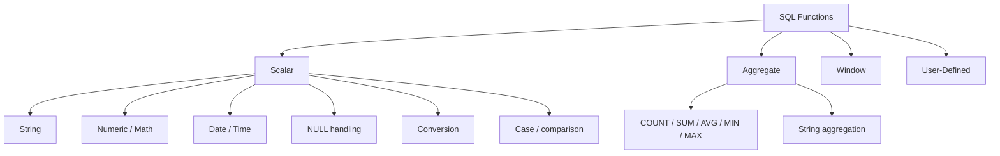
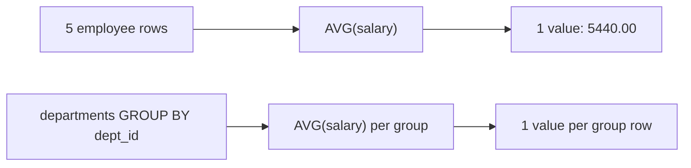

NOTE: This is a writing task — no tools needed. Generating the requested section below.

---

# 97 — Functions

## Fundamentals

A **SQL function** is a built-in or user-defined operation that takes one or more inputs (arguments) and produces a result. Functions do two kinds of work:

1. **Transform data** — e.g., clean a string, round a number, convert a value to a date, fill a `NULL`, format an output.
2. **Summarize data** — collapse many rows into one value (aggregates).

The single most useful mental model for SQL functions is:

> **Scalar function**: goes in column-wise (per row). Input value → output value. One input row in → one value out.
> **Aggregate function**: goes in block-wise (across rows). Many input rows → one value out. It can appear only where the database can group the row set.

Everything about SQL functions follows from those two shapes — plus two additional categories:

- **Window functions** — aggregate-style math performed *without collapsing rows* (see section 93-Window Functions).
- **User-defined functions (UDFs)** — code you write, called like built-ins.



**Determinism** is the other axis you must understand. A function is

- **Deterministic** — same inputs always produce the same output (e.g., `UPPER`, `ROUND`, `COALESCE`, `INITCAP`).
- **Non-deterministic** — depends on state that changes between calls (e.g., `NOW()`, `RAND()`, `GETDATE()`, `NEWID()`, `SYSDATE`).

Determinism matters for indexes on computed/function expressions and for materialized views.

---

## 1. Function taxonomy

| Category | Rows in | Rows out | Examples |
|---|---|---|---|
| Scalar | 1 | 1 | `UPPER`, `ROUND`, `COALESCE`, `CAST` |
| Aggregate | many | 1 | `COUNT`, `SUM`, `AVG`, `MIN`, `MAX`, `STRING_AGG` |
| Window | many | many (with a value per row) | `ROW_NUMBER`, `SUM(...) OVER (...)` |
| String aggregation | many | 1 (a concatenated string) | `STRING_AGG`, `LISTAGG`, `GROUP_CONCAT` |
| User-defined | engine-defined | engine-defined | any custom function |

---

## 2. Sample data used in this section

```sql
-- grain: one row per department
CREATE TABLE departments (
  dept_id   INT PRIMARY KEY,
  dept_name VARCHAR(50)
);

-- grain: one row per employee
CREATE TABLE employees (
  emp_id    INT PRIMARY KEY,
  emp_name  VARCHAR(50),
  dept_id   INT REFERENCES departments(dept_id),
  salary    INT,
  hire_date DATE,
  email     VARCHAR(100)
);

-- grain: one row per product
CREATE TABLE products (
  product_id   INT PRIMARY KEY,
  product_name VARCHAR(50),
  unit_price   NUMERIC(10,2)
);

-- grain: one row per order (one order can have many line items)
CREATE TABLE orders (
  order_id     INT PRIMARY KEY,
  emp_id       INT,           -- salesperson, nullable: system/web orders
  order_date   DATE,
  total_amount NUMERIC(10,2)
);

-- grain: one row per line item of an order
CREATE TABLE order_items (
  order_item_id INT PRIMARY KEY,
  order_id      INT REFERENCES orders(order_id),
  product_id    INT,
  quantity      INT,
  unit_price    NUMERIC(10,2)
);
```

```sql
INSERT INTO departments VALUES
  (1, 'Engineering'), (2, 'Sales'), (3, 'Marketing');

INSERT INTO employees VALUES
  (1, 'Alice', 1,  5000, '2020-01-15', 'alice@eng.local'),
  (2, 'Bob',   1,  4500, '2021-06-01', 'bob@eng.local'),
  (3, 'Carol', 2,  6000, '2019-03-10', NULL),
  (4, 'Dave',  NULL, 5500, '2022-11-30', 'dave@x.com'),
  (5, 'Eve',   2,  6200, '2018-07-21', 'eve@sales.local');

INSERT INTO products VALUES
  (1, 'Keyboard', 25.00), (2, 'Monitor', 180.00), (3, 'Mouse', 12.50);

INSERT INTO orders VALUES
  (1001, 3,    '2024-01-10', 205.00),
  (1002, 5,    '2024-02-15',  37.50),
  (1003, 3,    '2024-02-20',  25.00),
  (1004, NULL, '2024-03-01', 180.00);

INSERT INTO order_items VALUES
  (1, 1001, 2, 1, 180.00),
  (2, 1001, 1, 1,  25.00),
  (3, 1002, 3, 3,  12.50),
  (4, 1003, 1, 1,  25.00);
```

---

## 3. Scalar functions

Scalar functions operate row-by-row. If your query returns **1,000,000 rows, a scalar function in the `SELECT` list is executed up to 1,000,000 times**. That single fact drives most function-related performance problems.

### 3.1 String functions

#### `UPPER` / `LOWER`

```sql
SELECT emp_name, LOWER(email) AS normalized_email
FROM employees;
```

| emp_name | normalized_email |
|---|---|
| Alice | alice@eng.local |
| Bob | bob@eng.local |
| Carol | NULL |
| Dave | dave@x.com |
| Eve | eve@sales.local |

**NULL behavior:** any string function applied to `NULL` returns `NULL`. This is *NULL propagation*.

> **Production pitfall:** the classic email dedup bug —
> `WHERE email = LOWER(email)` claims uniqueness, but `UPPER(email)` is collation-dependent. Two rows `'Bob@x.com'` and `'bob@X.com'` may be considered equal under a case-insensitive collation but `LOWER` them and the string comparison may still pass. Exact rules depend on the collation of the column, not your intent.

#### `CONCAT` and `||` — NULL behavior differs wildly between engines

```sql
-- ANSI / PostgreSQL / Oracle: || propagates NULL
SELECT 'a' || NULL AS pg_result;

-- MySQL: CONCAT treats NULL as empty string
SELECT CONCAT('a', NULL) AS mysql_result;

-- SQL Server: + propagates NULL, CONCAT() ignores NULL
SELECT 'a' + NULL AS tsql_plus, CONCAT('a', NULL) AS tsql_concat;
```

| Engine | `'a' || NULL` | `CONCAT('a', NULL)` | Notes |
|---|---|---|---|
| PostgreSQL | `NULL` | `NULL` | `||` is string concatenation |
| MySQL | `NULL` | `'a'` | `||` defaults to `OR` unless `PIPES_AS_CONCAT` |
| SQL Server | `NULL` (`+`) | `'a'` | `'a' + NULL = NULL` |
| Oracle | `'a'` | — | Oracle treats `NULL` as empty string |

> **Interview trap:** in **MySQL** `SELECT '1' + '2';` returns `3` (arithmetic) — `+` is not string concatenation. In SQL Server it returns `'12'`.
> **Interview trap:** in **Oracle**, `''` *is* `NULL`, so `'a' || NULL` → `'a'` and `NULL || NULL` → `NULL`, which surprises everyone coming from other engines.

#### `CONCAT_WS` (Concatenate With Separator) — PostgreSQL, MySQL, SQL Server 2017+

```sql
SELECT CONCAT_WS(', ', dept_name, emp_name)
FROM employees e
JOIN departments d ON d.dept_id = e.dept_id
ORDER BY emp_id;
```

| result |
|---|
| `Engineering, Alice` |
| `Engineering, Bob` |
| `Sales, Carol` |
| `Sales, Eve` |

`CONCAT_WS` **skips `NULL` values** instead of inserting a stray separator — ideal for building display columns.

#### `LENGTH` / `CHAR_LENGTH` / `LEN` / `DATALENGTH` — character vs byte length

```sql
-- PostgreSQL / MySQL: character length is CHAR_LENGTH or LENGTH
SELECT CHAR_LENGTH('café') AS chars, OCTET_LENGTH('café') AS bytes;
```

| Engine | Character count | Byte count | Gotcha |
|---|---|---|---|
| PostgreSQL | `CHAR_LENGTH` | `OCTET_LENGTH` | `LENGTH` = chars |
| MySQL | `CHAR_LENGTH` | `LENGTH` | `LENGTH` = **bytes**; `'café'` with utf8mb4 → 5 bytes |
| SQL Server | `LEN` | `DATALENGTH` | `LEN` trims trailing spaces! |
| Oracle | `LENGTH` | `LENGTHB` | `LENGTH('') = 0` |

> **Interview trap:** SQL Server `LEN('hello ')` returns `5`, not `6`. `DATALENGTH('hello ')` returns `6`. Trimming trailing spaces is by design; substring-based logic that assumes `LEN` = physical size breaks silently.

#### `SUBSTRING` — 1-based indexing

```sql
SELECT SUBSTRING('PostgreSQL', 1, 6) AS s1,      -- 'Postgre'
       SUBSTRING('PostgreSQL' FROM 7)   AS s2;    -- 'SQL'   (PostgreSQL dialect)
```

**Edge cases**

```sql
SELECT SUBSTRING('abc', 2, 100) AS clamped,   -- 'bc'  (no error, clamps)
       SUBSTRING('abc', 5, 2)   AS empty;     -- ''    (start beyond end → empty)
```

- `SUBSTRING('PostgreSQL' FROM 2 FOR 4)` → `'ostg'`.
- Off-by-one is THE classic string bug: SQL is 1-based, unlike most programming languages.

#### `TRIM` / `LTRIM` / `RTRIM`

```sql
SELECT TRIM('  hello  ') AS t1,      -- 'hello'
       LTRIM('xxhi', 'x') AS t2,     -- 'hi'   (PostgreSQL allows char sets)
       TRIM(BOTH '.' FROM '...hi...') AS t3;  -- 'hi'
```

**Subtle differences**

- Default `TRIM` removes **only spaces**, not tabs/newlines. Use `TRIM(BOTH E'\t' FROM ...)` or a regex to strip control characters.
- SQL Server `LTRIM`/`RTRIM` remove only spaces. MySQL `LTRIM`/`RTRIM` remove only spaces. PostgreSQL lets you pass a character set as second argument.

#### `POSITION` / `INSTR` / `CHARINDEX` / `STRPOS`

```sql
-- PostgreSQL: POSITION(...) / STRPOS(...), 1-based
SELECT POSITION('@' IN 'alice@eng.local') AS at_pos;   -- 6

-- SQL Server: CHARINDEX 1-based
SELECT CHARINDEX('@', 'alice@eng.local');              -- 6

-- MySQL: INSTR / LOCATE 1-based, LOCATE with start position
SELECT INSTR('alice@eng.local', '@');                  -- 6
SELECT LOCATE('eng', 'alice@eng.local', 6);            -- 7
```

> **Interview trap:** every one of these is **1-based**, but the *second* argument order differs (`POSITION('x' IN col)` vs `CHARINDEX('x', col)` vs `LOCATE('x', col, start)`). Memorize the engine you are interviewing for.

#### `REPLACE` and `TRANSLATE`

```sql
SELECT REPLACE('a-b-c', '-', '/') AS slash;        -- a/b/c
SELECT TRANSLATE('a1b2', '12', 'xy') AS tx;        -- axby  (1→x, 2→y)
```

`REPLACE` swaps one literal substring; `TRANSLATE` maps characters one-by-one (character-level substitution). `TRANSLATE` is keyed differently in SQL Server (maps *characters*, uses three char strings) vs PostgreSQL (maps characters in a string-to-string fashion). Both are often the wrong answer for regex work — prefer `REGEXP_REPLACE` for patterns.

#### `LPAD` / `RPAD`

```sql
SELECT LPAD('42', 4, '0') AS padded,       -- '0042'
       LPAD('hello', 3, '0') AS truncated; -- 'hel'  (long strings are truncated!)
```

> **Production pitfall:** `LPAD`/`RPAD` **silently truncate** when the string is longer than the target width. Sanitizing account numbers padded to fixed length can corrupt data — validate length first.

**Engine availability:** SQL Server has no portable `LPAD` before 2022; use `REPLICATE('0', n - len) + col` or `FORMAT`.

### 3.2 Numeric functions

#### `ROUND` / `CEILING` / `FLOOR` / `TRUNC` / `TRUNCATE`

```sql
SELECT ROUND(10.25, 1)     AS r1,   -- 10.3
       ROUND(10.24, 1)     AS r2,   -- 10.2
       ROUND(2.5)          AS r3,   -- 3    (half away from zero in most engines)
       CEILING(2.1)        AS c,    -- 3
       FLOOR(2.9)          AS f,    -- 2
       TRUNCATE(2.999, 2)  AS t1;   -- 2.99 (MySQL: TRUNCATE; PostgreSQL: TRUNC)
```

**Rounding mode** differs per engine. PostgreSQL/MySQL/SQL Server/Oracle round ties **away from zero** for numeric types. Some engines (and languages) use *banker's rounding* (round half-to-even). Never assume — test on your engine with `-2.5` and `2.5`.

> **Production pitfall:** binary float representation — `ROUND(2.675, 2)` can return `2.67` (not `2.68`) because `2.675` is stored as `2.674999...` in float. Use `NUMERIC`/`DECIMAL` for money.

**`NUMERIC` vs `FLOAT` vs money:** do all currency math in fixed-point `NUMERIC/DECIMAL`. Floats introduce rounding errors into financial aggregates.

#### Integer division

```sql
-- PostgreSQL, SQL Server: integer / integer = integer, remainder discarded
SELECT 5/2 AS pg;           -- 2

-- MySQL: / always returns decimal; DIV for integer math
SELECT 5/2 AS mysql, 5 DIV 2 AS mysql_div;   -- 2.5000, 2

-- Oracle: no integer division; NUMBER / NUMBER
SELECT 5/2 FROM dual;       -- 2.5
```

> **Interview trap:** PostgreSQL `SELECT 5/2;` → `2`, not `2.5`. The classic bug is `AVG(salary)` style queries and percentage math: `(count_a / count_b) * 100` silently truncates to 0 before multiplication. Fix: `5::numeric / 2` or `5 * 1.0 / 2`.
> SQL Server: `AVG` of an integer column returns an **integer result** (truncated). Cast explicitly: `AVG(CAST(salary AS DECIMAL(10,2)))`.

#### Modulo `%` / `MOD`

```sql
SELECT 7 % 2 AS a,      -- 1
       -7 % 2 AS b;     -- -1  (sign follows the dividend in most SQL engines)
```

Most SQL engines give the result the sign of the dividend and `MOD`/`%` differ from many programming languages (e.g., Python gives `-7 % 2 = 1`). Verify when porting code.

#### Division by zero

- PostgreSQL, Oracle, SQL Server: **error** `division by zero`.
- MySQL: returns `NULL` (with a warning) unless `sql_mode` disables it — which silently hides bugs.

```sql
-- Portable guard: NULLIF
SELECT total_amount / NULLIF(quantity, 0) AS invalid_avg  -- NULL instead of error
FROM order_items;
```

> **Interview trap:** given `SUM(x) / COUNT(y)` on zero-size groups, engines that return `NULL` silently vs engines that raise an error produce totally different application behavior.

#### `ABS` / `POWER` / `SQRT` / `SIGN` / `GREATEST` / `LEAST`

```sql
SELECT ABS(-5) AS a, POWER(2, 10) AS p, SQRT(16) AS s, SIGN(-9) AS sg;  -- 5 1024 4 -1
```

**`GREATEST`/`LEAST` NULL semantics:**

| Engine | Any NULL argument → |
|---|---|
| PostgreSQL | returns `NULL` |
| MySQL | returns `NULL` |
| SQL Server (2022+) | **ignores** NULLs |
| BigQuery | ignores NULLs |

### 3.3 Date and time functions

Dates have **internal storage, display format, session timezone, and type** — four separate concerns. `TIMESTAMP WITH TIME ZONE` stores an *instant* (UTC internally in PostgreSQL); `TIMESTAMP` without tz stores what you see.

#### Getting the current time

```sql
SELECT CURRENT_DATE,
       CURRENT_TIMESTAMP,
       CURRENT_TIME;
```

| Engine | "Now" function(s) | Notes |
|---|---|---|
| PostgreSQL | `CURRENT_TIMESTAMP`, `NOW()`, `clock_timestamp()` | `NOW()` = statement start; `clock_timestamp()` = actual call time |
| MySQL | `NOW()`, `SYSDATE()` | `NOW()` = statement start; `SYSDATE()` = call time; `CURRENT_TIMESTAMP` = `NOW()` |
| SQL Server | `GETDATE()`, `SYSDATETIME()`, `SYSUTCDATETIME()` | `GETDATE()` includes local tz offset; `SYSUTCDATETIME()` = high-precision local; UTC = `SYSUTCDATETIME()` + no offset handling |
| Oracle | `SYSDATE`, `SYSTIMESTAMP`, `CURRENT_TIMESTAMP` | `SYSDATE` = server DB tz; `CURRENT_TIMESTAMP` = session tz |

> **Production pitfall:** two app servers in different timezones running the same SQL get different `CURRENT_TIMESTAMP` results. **Store UTC**; convert in the application layer or at display time.

#### Extracting parts

```sql
-- ANSI
SELECT EXTRACT(YEAR  FROM hire_date) AS yr,
       EXTRACT(MONTH FROM hire_date) AS mo,
       EXTRACT(DAY   FROM hire_date) AS dy
FROM employees;

-- SQL Server
SELECT DATEPART(year, hire_date)  AS yr,
       DATENAME(month, hire_date) AS mo;         -- 'January' (name vs number)

-- MySQL
SELECT YEAR(hire_date), MONTH(hire_date), DAY(hire_date);
```

| Engine | Numeric part | Text part | Year from timestamp |
|---|---|---|---|
| PostgreSQL | `EXTRACT(YEAR FROM ts)` | `to_char(ts,'YYYY')` | `EXTRACT` |
| MySQL | `YEAR(ts)` | `DATE_FORMAT(ts,'%Y')` | `YEAR()` |
| SQL Server | `DATEPART(yy, ts)` | `DATENAME(month, ts)` | `YEAR(ts)` |

**Date arithmetic**

```sql
-- PostgreSQL: date - date → integer days
SELECT order_date - '2024-01-01' AS days_since FROM orders;

-- MySQL
SELECT DATEDIFF('2024-02-15', '2024-02-10') AS days;   -- 5

-- SQL Server: counts boundary crossings!
SELECT DATEDIFF(day, '2024-01-01 23:59:59', '2024-01-02 00:00:01') AS d; -- 1
```

> **Interview trap:** SQL Server `DATEDIFF` counts **calendar boundaries crossed**, not elapsed time. `DATEDIFF(YEAR, '2023-12-31', '2024-01-01')` = `1`, even though only a second passed.
> **Interview trap:** PostgreSQL `DATE_PART('day', end - start)` returns the *day field of the interval*, not the total days — for a 35-day span it returns `5` (35 days = 1 month 5 days).

**Interval arithmetic is the safe pattern:**

```sql
-- PostgreSQL / standard SQL
SELECT order_date + INTERVAL '1 day', order_date - INTERVAL '1 month' FROM orders;

-- MySQL
SELECT DATE_ADD('2024-02-15', INTERVAL 1 DAY),
       DATE_SUB('2024-02-15', INTERVAL 1 MONTH);

-- SQL Server
SELECT DATEADD(day, 1, '2024-02-15'), DATEADD(month, -1, '2024-02-15');
```

#### Truncating dates — the sargable date filter

Compare approaches:

**BAD APPROACH** (non-sargable — function hides the column from the index):

```sql
SELECT * FROM orders WHERE DATE(order_date) = '2024-02-15';
```

**BETTER APPROACH** (boundary range — index-friendly):

```sql
SELECT * FROM orders
WHERE order_date >= DATE '2024-02-15'
  AND order_date <  DATE '2024-02-16';
```

The range uses the index on `order_date`; the function call on the column forces a scan of every row. See Section 8 for the execution-plan explanation.

For "group by month" you still need truncation — engine-by-engine:

```sql
-- PostgreSQL
SELECT DATE_TRUNC('month', order_date) AS month, SUM(total_amount)
FROM orders
GROUP BY 1 ORDER BY 1;

-- SQL Server 2022+
SELECT DATETRUNC(month, order_date), SUM(total_amount) FROM orders GROUP BY 1;

-- MySQL (no DATE_TRUNC): build first-of-month
SELECT DATE_FORMAT(order_date, '%Y-%m-01') AS month, SUM(total_amount)
FROM orders GROUP BY 1;
```

**Timestamp boundaries and timezones:**

- `BETWEEN` on a date is **inclusive on both ends**. Filtering `WHERE order_date BETWEEN '2024-02-15' AND '2024-02-15'` includes everything at `2024-02-15 00:00:00` **and** `23:59:59.999...` — usually correct, but for midnights use the half-open `>=` and `<` form to avoid double-counting midnight on both days.
- **Timezone conversion** — PostgreSQL:

```sql
SELECT order_date AT TIME ZONE 'UTC' AT TIME ZONE 'Asia/Kolkata' AS local_time
FROM orders;
```

MySQL: `CONVERT_TZ(ts, 'UTC', 'Asia/Kolkata')`. SQL Server: `ts AT TIME ZONE 'UTC' AT TIME ZONE 'India Standard Time'`. Oracle: `FROM_TZ(ts, 'UTC') AT TIME ZONE 'Asia/Kolkata'`.

### 3.4 NULL-handling functions

#### `COALESCE` — the workhorse

Returns the first non-`NULL` argument, from left to right.

```sql
SELECT emp_name, COALESCE(dept_id, 0) AS dept_id_or_zero
FROM employees;
```

| emp_name | dept_id_or_zero |
|---|---|
| Alice | 1 |
| Bob | 1 |
| Carol | 2 |
| **Dave** | **0** |
| Eve | 2 |

Internally, `COALESCE` behaves like a short-circuit `CASE` (`CASE WHEN a IS NOT NULL THEN a WHEN b IS NOT NULL THEN b ... END`) — arguments are evaluated only until the first non-`NULL`.

> **Oracle-specific:** `NVL` historically **evaluates both arguments** even when the first is non-NULL. Don't put side-effect-producing expressions inside `NVL`.
> **PostgreSQL / MySQL:** `COALESCE` short-circuits; later arguments are not evaluated if an earlier one is non-NULL.

**Type unification:** all arguments must be of a common type; engines will implicitly convert using type-precedence rules. That implicit conversion can raise errors or cost performance.

#### `NULLIF`

`NULLIF(a, b)` returns `NULL` when `a = b`, otherwise returns `a`.

```sql
SELECT NULLIF(10, 10) AS eq,    -- NULL
       NULLIF(10, 5)  AS ne;    -- 10
```

The canonical use is guarding division by zero:

```sql
SELECT SUM(total_amount),
       COUNT(*) AS order_cnt,
       SUM(total_amount) / NULLIF(COUNT(*), 0) AS avg_order_value
FROM orders;
```

A second classic is censoring placeholder values:

```sql
SELECT emp_name, NULLIF(email, 'no-reply') AS real_email FROM employees;
```

> **Interview trap:** `NULLIF` returns `NULL` *and* treats NULL inputs — `NULLIF(NULL, NULL)` returns `NULL` (and in Oracle `''`). It is not a general comparison function.

#### Engine-specific single-argument NULL replacers

| Engine | Function | Difference vs `COALESCE` |
|---|---|---|
| SQL Server | `ISNULL(x, y)` | exactly 2 args; literal-casts to type of first arg; no short-circuit of 2nd arg's type quirks |
| MySQL | `IFNULL(x, y)` | exactly 2 args |
| Oracle | `NVL(x, y)` | exactly 2 args; evaluates both |
| Oracle | `NVL2(a, b, c)` | if `a` non-NULL → `b`, else `c` |
| All ANSI | `COALESCE(...)` | 2+ args, evaluated left to right |

> **Interview trap:** `ISNULL(1, 'a')` in SQL Server implicitly converts `'a'` to `int` because the result adopts the data type of the *first* argument — it throws instead of returning a string. `COALESCE` uses the general precedence rules instead and can yield a different (wider) type.

### 3.5 CASE — the "IF" of SQL (an expression, not a function)

`CASE` has two forms:

```sql
-- Simple CASE: exact equality
SELECT CASE status WHEN 'pending' THEN 1 WHEN 'paid' THEN 2 ELSE 0 END
FROM orders;

-- Searched CASE: arbitrary conditions
SELECT CASE
         WHEN total_amount > 1000 THEN 'large'
         WHEN total_amount > 100  THEN 'medium'
         ELSE 'small'
       END
FROM orders;
```

**CASE + NULL:**

```sql
SELECT CASE
         WHEN NULL THEN 'unreachable'   -- NEVER true (NULL is not TRUE)
         ELSE 'NULL falls to ELSE'
       END;
```

> **Interview trap:** `CASE` uses three-valued logic. `WHEN NULL` is never truthy — always `ELSE` or an explicit `WHEN x IS NULL`. Beginners write `WHEN col = NULL` and get silently incorrect results. (Section 96-NULL covers this.)

### 3.6 CAST and conversion

```sql
SELECT CAST('2024-02-15'        AS DATE)     AS d,
       CAST(5 AS TEXT) || ' items'           AS s,
       CAST(12.9 AS INTEGER)                 AS i,    -- 12 (truncation, engine-dependent)
       CAST('42' AS INTEGER)                 AS n;
```

- `CAST` is the ANSI standard. `CONVERT` (SQL Server, MySQL `CONVERT(x, type)`) adds style parameters: `CONVERT(VARCHAR(10), order_date, 120)`.
- PostgreSQL also allows `value::type` (e.g., `'2024-02-15'::date`).
- Oracle: `TO_CHAR`, `TO_DATE`, `TO_NUMBER` with format masks.

| Engine | Explicit conversion | Format mask example |
|---|---|---|
| PostgreSQL | `CAST(x AS DATE)`, `x::date` | `to_char(hire_date,'YYYY-MM-DD')` |
| MySQL | `CAST(x AS DATE)`, `CONVERT(x, DATE)` | `DATE_FORMAT(hire_date,'%Y-%m-%d')` |
| SQL Server | `CAST`, `CONVERT(x, DATE, style)` | `CONVERT(VARCHAR, hire_date, 23)` |
| Oracle | `TO_DATE`, `TO_CHAR`, `TO_NUMBER` | `TO_CHAR(hire_date,'YYYY-MM-DD')` |

**Implicit conversion dangers**

- Comparing `VARCHAR` to `INT` triggers implicit type casting — a `'100abc'` string can produce surprise results or blocked index usage.
- **SQL Server truncation:** implicit conversion may truncate data (`SELECT CAST(123.456 AS DECIMAL(5,1))` behavior depends on context) — SQL Server truncates for `DECIMAL` conversion and rounds for numeric-to-numeric in other cases. Verify, don't assume.

> **Best practice:** be explicit. Relying on implicit conversion makes execution plans and errors harder to predict.

---

## 4. Aggregate functions — deep dive

Aggregate functions collapse many rows into one value. They are the reason the grain of each table matters: if you `JOIN` two one-to-many tables and `COUNT(*)`, you count **joined rows**, not source rows (fan-out / double counting — see Section 88-JOINs).



### 4.1 The canonical four: `COUNT`, `SUM`, `AVG`, `MIN`/`MAX`

```sql
SELECT COUNT(*)         AS row_count,          -- 5
       COUNT(dept_id)   AS with_dept,          -- 4  (NULL excluded)
       COUNT(DISTINCT dept_id) AS distinct_dept, -- 2
       SUM(salary)      AS total_salary,       -- 27200 (NULL doesn't participate)
       AVG(salary)      AS avg_salary,         -- 5440.00 (NULL excluded)
       MIN(salary)      AS lo,                 -- 4500
       MAX(salary)      AS hi;                 -- 6200
FROM employees;
```

| Function | Counts/uses NULLs? | Notes |
|---|---|---|
| `COUNT(*)` | counts **every row**, NULLs included | includes rows that are all-NULL |
| `COUNT(col)` | counts non-NULL only | `COUNT(dept_id)=4` above |
| `COUNT(DISTINCT col)` | non-NULL distinct values | NULL never counted as a distinct value |
| `SUM(col)` | ignores NULL | if **all** values NULL → returns `NULL` |
| `AVG(col)` | ignores NULL | NULLs are excluded from *both* sum and count |
| `MIN` / `MAX` | ignores NULL | if all NULL → `NULL` |

**`COUNT(*)` vs `COUNT(1)` vs `COUNT(col)`**

- `COUNT(*)` and `COUNT(1)` are semantically identical in the standard engines; the optimizer typically rewrites 1 to `*`. You cannot "save a column read" with `COUNT(1)`.
- Only `COUNT(col)` differs — it excludes NULLs.

> **Interview trap:** "What does `COUNT(col)` count?" → non-NULL rows. `AVG(col)` with one NULL and two values is `(a+b)/2`, **not** `(a+b)/3` — beginners divide by the full row count in their head.
> **Interview trap:** `SUM` of integer column in **SQL Server** returns `INT` and can **overflow** on large tables (error "Arithmetic overflow"). Cast to `BIGINT`/`DECIMAL` first.
> **Interview trap:** `AVG` of an **integer** column in **SQL Server** returns an **integer** result (truncation). Postgres returns `numeric`, MySQL returns `decimal`.

**Interactive counting demo on our data**

```sql
SELECT emp_name, dept_id,
       COUNT(*)         OVER ()            AS total_rows,
       COUNT(dept_id)   OVER ()            AS depts_known,
       SUM(salary)      OVER ()            AS pay_roll
FROM employees
ORDER BY emp_id;
```

| emp_name | dept_id | total_rows | depts_known | pay_roll |
|---|---|---|---|---|
| Alice | 1 | 5 | 4 | 27200 |
| Bob | 1 | 5 | 4 | 27200 |
| Carol | 2 | 5 | 4 | 27200 |
| Dave | NULL | 5 | 4 | 27200 |
| Eve | 2 | 5 | 4 | 27200 |

### 4.2 Aggregates with `GROUP BY` and `HAVING`

```sql
SELECT d.dept_name, COUNT(*) AS staff, AVG(e.salary) AS avg_pay
FROM employees e
JOIN departments d ON d.dept_id = e.dept_id
GROUP BY d.dept_name
HAVING AVG(e.salary) > 5000;
```

| dept_name | staff | avg_pay |
|---|---|---|
| Sales | 2 | 6100.00 |

**Notes**
- Every non-aggregated column in `SELECT` must appear in `GROUP BY` (or be functionally dependent on it). Violating this is a beginner classic and in MySQL with `ONLY_FULL_GROUP_BY` off, silently returns **arbitrary rows** from the group — the source of infamous nondeterministic bugs.
- `WHERE` filters rows **before** grouping; `HAVING` filters groups **after** aggregation. You cannot put an aggregate in `WHERE`.

> **Interview trap:** which one is legal? `WHERE SUM(x) > 10` → illegal. `HAVING COUNT(*) > 10` → legal. `WHERE deleted_at IS NULL .. GROUP BY .. HAVING COUNT(*) > 1` → legal and common for dedup.

**Conditional counting — `SUM(CASE ...)` and `FILTER (WHERE ...)`**

```sql
-- ANSI pattern
SELECT SUM(CASE WHEN order_date >= DATE '2024-02-01' THEN 1 ELSE 0 END) AS orders_feb
FROM orders;

-- PostgreSQL also offers FILTER
SELECT COUNT(*) FILTER (WHERE order_date >= DATE '2024-02-01') AS orders_feb
FROM orders;
```

| orders_feb |
|---|
| 2 |

**Two aggregation styles compared**

| | `SUM(CASE ...)` | `FILTER (WHERE ...)` |
|---|---|---|
| ANSI portability | works everywhere | PostgreSQL (also Snowflake, DuckDB) |
| Same table | single scan | single scan |
| Multiple conditions | verbose but expressive | cleaner |
| Readability at scale | noisy | better |

> **Performance note:** neither changes how many rows are scanned, and encapsulating both in a single `GROUP BY` gives **one** table scan vs N separate subqueries — that is the real optimization (see `SUM` vs multi-`JOIN` in Section 8).

### 4.3 String aggregation: `STRING_AGG` / `GROUP_CONCAT` / `LISTAGG`

Build a comma-separated list, e.g., employee names per department.

```sql
-- PostgreSQL 9.4+ / SQL Server 2017+
SELECT d.dept_name, STRING_AGG(e.emp_name, ', ' ORDER BY e.emp_name) AS roster
FROM departments d
LEFT JOIN employees e ON e.dept_id = d.dept_id
GROUP BY d.dept_name;

-- MySQL
SELECT dept_name, GROUP_CONCAT(emp_name ORDER BY emp_name SEPARATOR ', ') AS roster
FROM employees e JOIN departments d USING (dept_id)
GROUP BY dept_name;

-- Oracle
SELECT dept_name, LISTAGG(emp_name, ', ') WITHIN GROUP (ORDER BY emp_name) AS roster
FROM employees e JOIN departments d ON d.dept_id = e.dept_id
GROUP BY dept_name;
```

| Engine | Function | NULLs skipped? | Gotcha |
|---|---|---|---|
| PostgreSQL | `STRING_AGG` | yes | 1 GB limit |
| SQL Server | `STRING_AGG` | yes | max `VARCHAR(MAX)`-ish, but errors if result exceeds type size |
| MySQL | `GROUP_CONCAT` | yes | **default max 1024 chars** (silent truncation) |
| Oracle | `LISTAGG` | yes | **VARCHAR2 4000-byte error** `ORA-01489` (use `ON OVERFLOW TRUNCATE`, 12.2+) |

> **Production pitfall:** MySQL truncates silently at `group_concat_max_len` (1024) — a report that "lost" names gets shipped without any error. Raise the setting or paginate.
> **Production pitfall:** Oracle `LISTAGG` over 4000 bytes **raises an error** — a legit large grouping crashes the query.

**Distinct inside aggregates** — `COUNT(DISTINCT x)`, `SUM(DISTINCT x)`, `STRING_AGG(DISTINCT x)` all exist. They typically carry a sort/dedup cost; check the plan.

### 4.4 Statistical & misc aggregates

| Function | PostgreSQL | MySQL | SQL Server | Oracle |
|---|---|---|---|---|
| Std dev sample | `STDDEV_SAMP` / `STDDEV` | `STD` / `STDDEV` | `STDEV` | `STDDEV` |
| Variance | `VAR_SAMP` / `VARIANCE` | `VARIANCE` / `VAR_SAMP` | `VAR` | `VARIANCE` |
| Median / percentile | `PERCENTILE_CONT(0.5) WITHIN GROUP (ORDER BY x)` | (8.0+) same | `PERCENTILE_CONT(0.5) WITHIN GROUP (ORDER BY x)` | `MEDIAN(x)` |
| First/last | `mode()`, `first_value` | `GROUP_CONCAT` tricks | window functions | `KEEP` (DENSE_RANK FIRST/LAST) |

Percentile functions are **window-by-group aggregate functions** — they cannot be used in plain `SELECT` without `WITHIN GROUP`. `MEDIAN` in Oracle is an aggregate.

---

## 5. Window functions — cross-reference

`ROW_NUMBER`, `RANK`, `DENSE_RANK`, `LAG`, `LEAD`, `SUM(...) OVER (PARTITION BY ...)` all belong to a dedicated section (93-Window Functions). The key distinction for *this* section:

- **Aggregate** collapses the group to one row.
- **Window** computes the same math but keeps every row, attaching the value alongside.

Choose the window form when you need to keep detail rows (top-N per group, running totals, de-dup, previous-value comparisons). Do **not** re-derive the whole concept here.

---

## 6. User-defined functions (UDFs)

UDFs wrap logic that would otherwise be copy-pasted SQL.

```sql
-- PostgreSQL
CREATE FUNCTION avg_salary_in(dept int) RETURNS numeric AS $$
  SELECT AVG(salary) FROM employees WHERE dept_id = dept;
$$ LANGUAGE SQL STABLE;

SELECT emp_name, salary, avg_salary_in(dept_id) AS dept_avg FROM employees;
```

### 6.1 Determinism / volatility

- **PostgreSQL** `IMMUTABLE` / `STABLE` / `VOLATILE` tells the planner whether results depend on time/session (Section 8).
- **SQL Server** marks functions `DETERMINISTIC`/`NONDETERMINISTIC`; non-deterministic functions cannot be used in indexed computed columns or indexed views.
- **MySQL** similar: `DETERMINISTIC` vs `NOT DETERMINISTIC`.

```sql
-- PostgreSQL: a timestamp-reading function MUST be VOLATILE or STABLE, never IMMUTABLE
CREATE FUNCTION last_heartbeat() RETURNS timestamptz AS
$$ SELECT now() $$ LANGUAGE SQL VOLATILE;
```

> **Production pitfall:** lying about volatility (`IMMUTABLE` on something that calls `now()`) causes the optimizer to cache results that go stale mid-query — silently wrong results.

### 6.2 Scalar UDF performance — the big one

> **Production pitfall:** in **SQL Server**, scalar UDFs historically force **row-by-row execution**, prevent **parallel plans**, and defeat index seeks when used in `WHERE`/`JOIN`. A "small" formatting function in a hot `SELECT` has killed many a report. Prefer **inline table-valued functions (iTVF)** which the optimizer can expand.

```sql
-- BAD (scalar per-row)
CREATE FUNCTION dbo.LookupName(@id INT) RETURNS NVARCHAR(50) AS
BEGIN RETURN (SELECT emp_name FROM employees WHERE emp_id = @id); END;

-- BETTER (inline TVF — inlined into the query)
CREATE FUNCTION dbo.GetName(@id INT) RETURNS TABLE AS
RETURN (SELECT emp_name FROM employees WHERE emp_id = @id);
```

In PostgreSQL the equivalent blowup is a **`VOLATILE` or improperly-written PL/pgSQL** function called per row; `LANGUAGE SQL` simple functions can be inlined.

### 6.3 UDF and security

- Functions execute with the **privileges of the definer or invoker** — define `SECURITY INVOKER` unless you truly need privilege escalation.
- **Dynamic SQL** inside functions (`EXECUTE '...' || user_input`) is an injection channel. Validate and parameterize.
- Don't embed secrets in function bodies stored in the database.

### 6.4 Aggregate vs scalar UDF decision guide

| Need | Use |
|---|---|
| One value computed for every row | scalar / inline function in SELECT |
| One value computed across rows | aggregate, or a UDF around a SELECT |
| Row-by-row enrichment inside a JOIN | **JOIN to a set** / CTE, not a function call |
| Custom aggregation (collect state across rows) | PostgreSQL `CREATE AGGREGATE`, SQL Server CLR, etc. |

> **Best practice:** if you catch yourself joining to a UDF result per row, you are doing a correlated subquery in disguise — see the "row-by-row is the enemy" rule in Section 8.

---

## 7. NULL behavior matrix (one place to look it up)

| Operation | Result |
|---|---|
| `NULL = NULL` | `NULL` (not TRUE) |
| `NULL <> NULL` | `NULL` |
| `WHERE x = NULL` | matches nothing |
| `IS NULL` / `IS NOT NULL` | TRUE / FALSE as expected |
| `x IS NOT DISTINCT FROM y` | TRUE when both NULL (PostgreSQL) |
| `COALESCE(NULL, NULL, 'a')` | `'a'` |
| `COALESCE` with all NULLs | `NULL` |
| `NULLIF(5,5)` | `NULL` |
| `NULLIF(NULL, 5)` | `NULL` |
| `'a' || NULL` (Postgres/SQL-Server `+`) | `NULL` |
| `'a' || NULL` (Oracle / MySQL `CONCAT`/`CONCAT_WS`) | `'a'` |
| `COUNT(*)` over empty set | `0` |
| `COUNT(col)` over empty set | `0` |
| `COUNT(DISTINCT col)` | ignores NULLs |
| `SUM(col)` all NULL | `NULL` |
| `AVG(col)` | ignores NULLs in numerator and denominator |
| `MIN`/`MAX(col)` | ignores NULLs |
| `CAST(NULL AS DATE)` | `NULL` |
| `UPPER(NULL)` | `NULL` |

**`IS [NOT] DISTINCT FROM` and `IS [NOT] NULL`**

```sql
-- PostgreSQL
SELECT 1 IS DISTINCT FROM 2   AS a,   -- TRUE
       1 IS DISTINCT FROM 1   AS b,   -- FALSE
       NULL IS DISTINCT FROM NULL AS c, -- FALSE (NULL == NULL here!)
       NULL IS NOT DISTINCT FROM NULL AS d; -- TRUE
```

`IS DISTINCT FROM` lacks the SQL Server/Oracle migration trap — but Oracle has no direct equivalent (use `DECODE` or `NVL` pairwise).

---

## 8. Performance implications

### 8.1 Sargability — functions on indexed columns

A `WHERE` condition is **sargable** (Search ARGument ABLE) when it makes the column appear plain in the condition, letting the optimizer use an index to skip rows.

```
WHERE DATE(order_date) = '2024-02-15'        -- index on order_date can NOT be used
WHERE order_date >= '2024-02-15'
  AND order_date <  '2024-02-16'             -- index CAN be used
WHERE LOWER(email) = 'alice@eng.local'       -- index on email can NOT be used
WHERE email = 'alice@eng.local'              -- index CAN be used
```

> **Production pitfall:** wrapping a column in any scalar function (`UPPER`, `SUBSTRING`, `CAST`, `YEAR`, `CONVERT`, `DATE()`, `LEFT`) usually hides it from the B-tree index. The result is a full scan that grows linearly with the table — while "using an index" keeps it logarithmic.

**Fixes, when you truly need case-insensitive lookup:**

- PostgreSQL **functional index**: `CREATE INDEX ON employees (LOWER(email));` then `WHERE LOWER(email) = ...` becomes sargable.
- SQL Server **computed column**: `ALTER TABLE employees ADD email_lc AS LOWER(email) PERSISTED; CREATE INDEX ... ON employees(email_lc);`
- MySQL **generated column**: `ALTER TABLE employees ADD email_lc VARCHAR(100) GENERATED ALWAYS AS (LOWER(email)) STORED;`
- Oracle **function-based index**: `CREATE INDEX ... ON employees(LOWER(email));`

### 8.2 Row-by-row execution is the enemy

- A scalar function in `SELECT` runs once per output row.
- A **correlated subquery** / UDF call in `SELECT` or `WHERE` runs once per candidate row.
- Compare with a **JOIN or CTE** that computes results for the whole set in one scan.

**BAD APPROACH** — per-row work at scale:

```sql
SELECT o.order_id,
       (SELECT SUM(oi.quantity * oi.unit_price)
          FROM order_items oi WHERE oi.order_id = o.order_id) AS order_total
FROM orders o;
```

**BETTER APPROACH** — aggregate once, join once:

```sql
SELECT o.order_id, oi.order_total
FROM orders o
LEFT JOIN (SELECT order_id, SUM(quantity * unit_price) AS order_total
           FROM order_items GROUP BY order_id) oi
       ON oi.order_id = o.order_id;
```

The *second* version makes the optimizer free to use a hash join and a grouped aggregate; the first one typically forces nested-loop evaluation per row.

> This is guidance, not a law. On tiny tables the per-row version is fine. **Verify with `EXPLAIN ANALYZE`** (or equivalent), never by vibes.

### 8.3 Volatile functions block planning

- **SQL Server:** scalar UDFs are opaque — the optimizer cannot peek inside them, which historically produced serial non-parallel plans and repeated invocation. Inline TVFs fix this by being expanded into the query.
- **PostgreSQL:** a `VOLATILE` function used in `WHERE` cannot be evaluated once and used with an index seek the way a constant can; and expressions containing volatile functions can't be used in index expressions.

### 8.4 Deterministic constants vs per-row recompute

```sql
SELECT * FROM orders WHERE order_date = CURRENT_DATE;         -- computed once
SELECT * FROM orders WHERE order_date = RANDOM();             -- computed per row — nonsense
```

Non-deterministic functions in predicates and joins can produce inconsistent row sets across the same query if the planner calls them at different times.

### 8.5 Reading the plan — example

Pseudo plan (PostgreSQL-style) for the sargable vs non-sargable pair:

```
Seq Scan on orders  (cost=1000 rows=100000)        ← non-sargable DATE(col)
  Filter: (date(order_date) = '2024-02-15'::date)

Index Scan on orders_idx (rows=25)                  ← sargable range
  Index Cond: (order_date >= '2024-02-15' AND order_date < '2024-02-16')
```

Equivalent: SQL Server `Execution Plan` → `Index Seek` vs `Index/Table Scan`; MySQL `EXPLAIN` → `range` vs `ALL`; Oracle `Execution Plan` → `INDEX RANGE SCAN` vs `TABLE ACCESS FULL`. **Always read the plan before claiming a fix improved anything.**

---

## 9. Best practices

1. **Know the grain of every table before you write an aggregate.** `COUNT(*)` after a one-to-many `JOIN` counts joined rows — fans out.
2. **Never write `WHERE col = NULL`.** Always `IS NULL` / helper functions.
3. **Keep function calls off indexed columns in `WHERE`** (sargability). Truncate dates with ranges, not `DATE()`.
4. **Do currency math in `NUMERIC/DECIMAL`, never `FLOAT`.**
5. **Cast integers before division** when you need a fractional result.
6. **Store timestamps UTC** and convert at the edge. Use half-open `>=` / `<` range filters at day boundaries.
7. **Prefer `LEFT JOIN` with `IS NULL` over `NOT IN` when the subquery can produce NULLs** (see Section on subqueries) — but remember neither is universally faster.
8. **Avoid scalar UDFs in hot paths**; prefer inline TVFs / functional indexes / JOIN-set solutions.
9. **Label function volatility truthfully** in PostgreSQL/MySQL/SQL Server metadata.
10. **Default to `UNION ALL`** unless you genuinely need dedup — `UNION` sorts/dedups every slice.
11. **Test every NULL-sensitive function on a row containing NULL.** Informants: `SUM`, `AVG`, string concatenation, `GROUP_CONCAT`.
12. **Confirm with `EXPLAIN ANALYZE`** before and after every "optimization".

---

## Cross-references

- NULL and three-valued logic → section 96-NULL
- `GROUP BY` / `HAVING` → sections on grouping
- Window `OVER ()` functions → 93-Window Functions
- `EXISTS` / `IN` / `NOT EXISTS` vs `NOT IN` + NULL → subquery sections
- `JOIN` fan-out and double-counting → 88-JOINs
- Transactions / ACID → they don't affect scalar result values but matter for `/` state consistency, `NOW()` visibility
- Indexes, composite and covering → index sections (covers the sargability discussion)

---

# Interview Questions

## Beginner

1. What is the difference between `COUNT(*)`, `COUNT(col)`, and `COUNT(1)`?
2. `SELECT ROUND(2.5)` — what does it return in PostgreSQL? In MySQL? Why should you not assume the same everywhere?
3. Write a query to list employees whose name contains the letter 'a' (case-insensitive).
4. What does `COALESCE(NULL, NULL, 5)` return? What about `NULLIF(5,5)` and `NULLIF(5,10)`?
5. What is the difference between `WHERE` and `HAVING`?
6. Why does `SELECT UPPER(email) FROM users WHERE email = NULL` return zero rows?
7. Convert `'2024-05-01 14:30'` to a date in your engine of choice.

## Intermediate

8. Write one query that returns each department, its staff count, its `AVG(salary)`, and a comma-separated list of employee names — with only one pass over the table.
9. What is the difference between `STRING_AGG` (PostgreSQL), `GROUP_CONCAT` (MySQL), and `LISTAGG` (Oracle)? What NULL and length rules does each have?
10. A `SUM(total_amount)` returns `NULL` for one group. Explain why, and how to return `0` instead.
11. Show the difference between a `GROUP BY`-aggregate and a window function computing the same `SUM` — which one preserves individual rows?
12. Explain what "sargable" means and give a non-sargable predicate plus its sargable replacement for date filtering.
13. `DATEDIFF` in SQL Server returned `1` for `'2023-12-31 23:59'` vs `'2024-01-01 00:00'`. Explain.
14. What does `5/2` return in PostgreSQL, MySQL, and SQL Server? How do you reliably get `2.5`?

## Advanced

15. When would you choose a scalar UDF over an inline table-valued function in SQL Server? What historical performance penalty do scalar UDFs carry?
16. What is function volatility in PostgreSQL (`IMMUTABLE` / `STABLE` / `VOLATILE`), and what goes wrong if you mark an `IMMUTABLE` function that calls `now()`?
17. Explain how `COALESCE` differs internally from Oracle's `NVL` regarding evaluation of arguments. Why does short-circuiting matter?
18. Why does `COUNT(DISTINCT col)` never count `NULL` but `DISTINCT` in a plain `SELECT` does return a `NULL` row?
19. Describe the internal cost difference between a sargable range predicate and a `DATE(col) = ...` predicate in terms of the index B-tree.
20. `AVG` of a `TINYINT` column in SQL Server — what type does it return, and how can that silently truncate results?

## Scenario Based

21. A user says "my daily-revenue report shows 0 for Feb 15." The query used `WHERE order_date BETWEEN '2024-02-15' AND '2024-02-15'` on a `DATETIME` column. Diagnose, then fix.
22. You join `orders` to `order_items` and `SUM(quantity)`; the number is too high. The order has 3 line items. Explain the fan-out, and give the two standard fixes (aggregate-then-join vs distinct).
23. A payroll report must show each employee's salary plus the department average next to each row. Choose aggregate or window function, and justify.
24. A password reset exports all users' emails; MySQL `GROUP_CONCAT(users.email)` only returns ~1024 characters. Explain and fix without hiding rows.
25. In a phone-format report, `LPAD(phone_number, 10, '0')` produces corrupted numbers for already-long values. Explain what happened.

## Tricky

26. `SELECT CASE WHEN NULL THEN 'x' ELSE 'y' END;` → what? Explain with three-valued logic.
27. `SELECT NULLIF('A','A') IS NULL, 'A' = 'A' IS NULL;` — both TRUE? Why is the second FALSE?
28. In MySQL `SELECT '3' + '4';` → 7. In SQL Server `SELECT '3' + '4';` → '34'. Explain.
29. Why does `IN ('a','b',NULL)` behave like `= 'a' OR = 'b' OR = NULL` — and thus never match `NULL` rows — while `NOT IN` with a `NULL` in the list matches *nothing at all*?
30. `SELECT SUM(x)/COUNT(x)` vs `SELECT AVG(x)` — when are these different (think `NULL`)?
31. `ROUND(2.675, 2)` returns `2.67` in several engines. Explain the binary representation issue, and name the type you would use for money.

## Output Prediction

Predict output (state your engine if behavior varies):

32. `SELECT COALESCE(NULL, 0/0, 5);`
33. `SELECT NULLIF(10, 10), NULLIF(NULL, 1), NULLIF(1, NULL);`
34. `SELECT COUNT(*) , COUNT(NULL) , COUNT(DISTINCT NULL);`
35. `SELECT SUBSTRING('abcdef', 4, 2);`
36. `SELECT LENGTH('café');` — give answers for both MySQL (utf8mb4) and PostgreSQL.
37. `SELECT AVG(salary), SUM(salary)/COUNT(*) FROM employees;` on a table where 1 of 5 salary values is `NULL`.

## Debugging

38. A query `SELECT ... WHERE LOWER(email) = 'x'` is slow on a 10M-row table that HAS an index on `email`. What is the cause, and list the engine-specific fixes.
39. `UPDATE orders SET total_amount = NULL;` then `SELECT SUM(total_amount) FROM orders;` returns nothing instead of `0`. Fix the report.
40. A page shows "0 items sold" for a category that definitely has sales, because `COUNT(order_items.order_item_id)` is used after `INNER JOIN ... WHERE ...`. Explain the NULL-exclusion + join combination.
41. Two servers report different `CURRENT_TIMESTAMP` for the same query. Why, and what is the storage best practice?
42. `GROUP_CONCAT` suddenly returns short strings on MySQL after a config migration. Track it down.

## Performance

43. Is `WHERE DATE(order_date) = '2024-02-15'` ever index-friendly? Explain under what single condition (e.g., a functional index) it could be.
44. Compare `EXISTS` vs `COUNT(*) > 0` vs `LEFT JOIN ... IS NULL` for "which departments have no employees" and explain why you must look at the execution plan rather than guess.
45. Your scalar UDF is in a `SELECT` over 1M rows. Explain the multiply-effect and one rewriting that removes it.
46. Why might the optimizer compute `CURRENT_DATE` once but treat `RANDOM()` as per-row?
47. A `GROUP BY dept_id` with `COUNT(*)` — explain HashAggregate vs Sort+GroupAggregate, and which one the planner may pick and why.

---

*End of section 97-Functions.*
