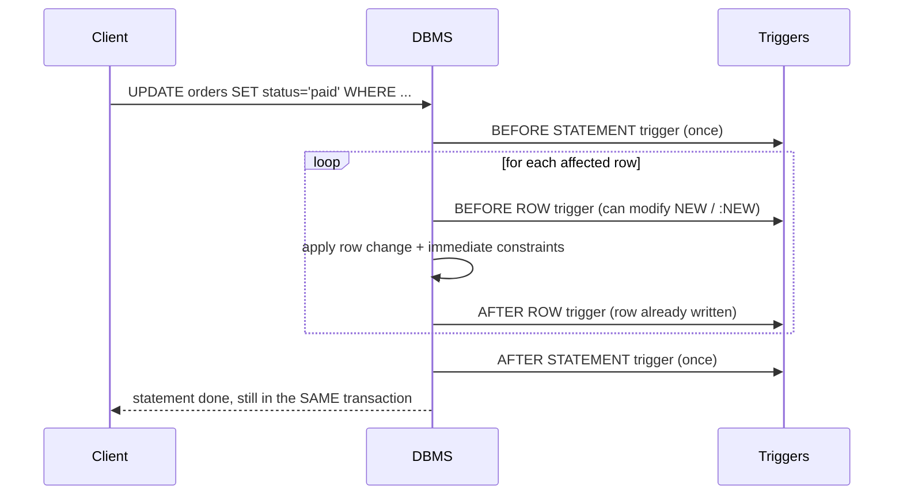

# 98. Triggers

> Cross-references: this section pairs with **Constraints**, **Stored Procedures**, **Views**, **Transactions & Isolation**, **Views (INSTEAD OF)**, **Normalization/Denormalization**, and **Performance & Execution Plans**. It does not replace any of them; a trigger is often the *wrong* tool and the better one lives in one of those sections.

---

## 1. Fundamentals

### What it is

A **trigger** is a stored block of code, owned by the database, that the database **fires automatically** when a specific DML event (`INSERT`, `UPDATE`, `DELETE`) happens on a table or view.

```sql
-- Conceptually:
ON <event> DO <code>   -- executed by the engine, not by your application
```

### Why it exists

Rules that must hold **no matter which client** inserts, updates, or deletes are unreliable in application code. Every ORM, migration script, admin console, one-off SQL, and buggy fast-path UPDATE would need to repeat the logic. A trigger centralizes the rule *inside* the engine.

Typical reasons to use a trigger:

- Log every change to a row (audit trail).
- Keep `updated_at` column synchronized.
- Enforce rules that a `CHECK` constraint cannot express (e.g. "status can go from `pending` to `paid`, but never from `shipped` back to `pending`").
- Maintain a denormalized counter or aggregate for read performance.
- Redirect `INSERT ... ON A VIEW` into underlying tables (`INSTEAD OF`).
- Invoke an external side effect (HTTP call? careful — usually a bad idea).

### Trigger vs constraint vs stored procedure vs event

| Feature | CHECK/FK constraint | Trigger | Stored procedure | Scheduled job/event |
|---|---|---|---|---|
| Scope | Per-row declarative rule | Side effects + logic around DML | Explicitly invoked | Runs on a schedule |
| Can it be bypassed? | No | No | Yes (nobody calls it) | Only for its own work |
| Sets values (e.g. `updated_at`) | No | Yes (`NEW.x = ...`) | Yes | No |
| Audits old vs new values | No | Yes | Manual | No |
| Fires on `UPDATE`/`DELETE` | Only via `UPDATE`/`DELETE` rules | Yes | Only when called | No |
| Cost | Zero (optimized by planner) | Per-row function call overhead | Only when called | Only when scheduled |

> **Common misconception**: "A trigger is the same as a CHECK constraint."

No. A check constraint is a *declarative, optimizer-visible* rule that can sometimes be used for pruning. A trigger is *procedural* and the optimizer knows almost nothing about what it does. If a `CHECK`, `UNIQUE`, `NOT NULL`, or `FOREIGN KEY` can express the rule, prefer the constraint.

---

## 2. How a trigger fires (internal working)

### The event model

A trigger listens for one or more DML operations:

- `INSERT`
- `UPDATE`
- `DELETE`

Some engines add more event types:

- **SQL Server** — `MERGE` events, DDL events (`CREATE_TABLE`, ...), and **logon** events.
- **SQL Server / PostgreSQL** — DDL triggers / event triggers.
- **Oracle** — schema/database-level DDL and system triggers.

> **Production pitfall**: `TRUNCATE TABLE` does **not** fire row triggers in basically every major engine. If you rely on a trigger to keep a copy of data safe, `TRUNCATE` silently removes it. Use row-level security, archive tables, or block `TRUNCATE` with privileges instead.

### Timing × granularity

Every trigger has two orthogonal dimensions:

| Timing | Granularity |
|---|---|
| `BEFORE` | `FOR EACH ROW` |
| `AFTER` | `FOR EACH STATEMENT` |
| `INSTEAD OF` | |

- **BEFORE** — fires before the row is written. Used to validate or *modify* the incoming values (`NEW.updated_at = now()`).
- **AFTER** — fires after the row is written. Used for side effects that need the final row (audit, counters).
- **INSTEAD OF** — replaces the statement entirely. Mostly used on **views** to make them writable.
- **FOR EACH ROW** — fires once **per affected row**.
- **FOR EACH STATEMENT** — fires **once per SQL statement**, regardless of how many rows it touched.

### Lifecycle of one statement (PostgreSQL shown; shape is similar everywhere)



Critical consequences of the lifecycle:

1. The trigger runs **inside the same transaction** as the statement. If the statement is eventually rolled back, **all trigger work is rolled back too**.
2. Rows written inside the trigger are **not visible from the outside** until commit.
3. If a constraint fails, `AFTER` triggers never fire.
4. A **BEFORE ROW** trigger can mutate the values being written (`NEW.amount = 0`). An **AFTER ROW** trigger cannot — the row is already stored.

### What data does the trigger see?

| Operation | OLD (pre-image) | NEW (post-image) |
|---|---|---|
| `INSERT` | — | ✓ |
| `UPDATE` | ✓ | ✓ |
| `DELETE` | ✓ | — |

- **PostgreSQL**: `OLD` / `NEW` records (in `FOR EACH ROW` triggers).
- **MySQL**: `OLD` / `NEW`.
- **Oracle**: `:OLD` / `:NEW`.
- **SQL Server**: no `OLD`/`NEW`. Instead, virtual tables **`inserted`** and **`deleted`**, and the trigger is **statement-scoped** — they contain **all rows** affected by the statement.

> **Interview trap (SQL Server)**: `inserted` and `deleted` are *sets*. Writing
> `SET @id = (SELECT id FROM inserted);` is a bug the moment an `UPDATE` touches 2+ rows. SQL Server triggers must be written **set-based** or join against `inserted`.

---

## 3. Syntax by database

Triggers are the least portable SQL feature. The ANSI standard sketch is:

```sql
CREATE TRIGGER <name>
BEFORE | AFTER <event> ON <table>
FOR EACH ROW | FOR EACH STATEMENT
EXECUTE <procedure>;
```

### PostgreSQL

A trigger is a `CREATE FUNCTION ... RETURNS TRIGGER` plus a `CREATE TRIGGER`. The function **must** return a row type in BEFORE ROW triggers.

```sql
CREATE OR REPLACE FUNCTION touch_updated_at()
RETURNS TRIGGER
LANGUAGE plpgsql
AS $$
BEGIN
    NEW.updated_at = now();   -- modify what will be written
    RETURN NEW;               -- required: say "use my NEW"
END;
$$;

CREATE TRIGGER trg_users_touch
BEFORE UPDATE ON users
FOR EACH ROW
EXECUTE FUNCTION touch_updated_at();
```

Notes:

- `RETURN NEW` writes back modified values; `RETURN NULL` in a BEFORE ROW trigger **skips the row** (for the statement). In AFTER ROW triggers the return value is ignored.
- Trigger functions have exclusive variables: `TG_OP`, `TG_WHEN`, `TG_LEVEL`, `TG_TABLE_NAME`, `TG_NARGS`, `TG_ARGV`.
- `CREATE TRIGGER ... WHEN (condition)` lets you fire only for relevant changes (e.g. `WHEN (OLD.status IS DISTINCT FROM NEW.status)`).
- A `CREATE OR REPLACE FUNCTION` returning `TRIGGER` cannot be used by normal queries.

### MySQL

MySQL has **no statement-level triggers** and no `INSTEAD OF`; it supports `BEFORE`/`AFTER ... FOR EACH ROW` only.

```sql
CREATE TRIGGER trg_users_audit
AFTER INSERT ON users
FOR EACH ROW
INSERT INTO audit_log(table_name, operation, row_id, old_value, new_value, changed_at)
VALUES ('users', 'INSERT', NEW.id, NULL, JSON_OBJECT('name', NEW.name, 'email', NEW.email), NOW());
```

Notes:

- There is no `OLD`/`NEW` for `INSERT` (old) or `DELETE` (new).
- A trigger **cannot modify the same table** that fired it → error 1442.
- Triggers cannot be **disabled**; you must `DROP` and `CREATE` them.
- Needs `TRIGGER` privilege (and `SUPER` for the binary-log settings in some setups).

### SQL Server

SQL Server triggers are **statement-scoped**. `AFTER` fires after the DML; `INSTEAD OF` replaces the DML (useful on views). There are no `BEFORE` triggers.

```sql
CREATE TRIGGER trg_users_audit
ON users
AFTER INSERT, UPDATE, DELETE
AS
BEGIN
    SET NOCOUNT ON;
    INSERT INTO audit_log(table_name, operation, row_id, old_value, new_value, changed_at)
    SELECT 'users',
           CASE
               WHEN d.id IS NOT NULL AND i.id IS NOT NULL THEN 'UPDATE'
               WHEN d.id IS NOT NULL                       THEN 'DELETE'
               ELSE                                            'INSERT'
           END,
           COALESCE(i.id, d.id),
           d.email,
           i.email,
           SYSDATETIME()
    FROM inserted i
    FULL OUTER JOIN deleted d ON i.id = d.id;
END;
```

Notes:

- `inserted` / `deleted` — full rows from `INSERT`/`UPDATE` (inserted) and `DELETE`/`UPDATE` (deleted).
- Interesting details: `UPDATE` inserts a row into **both** tables; distinguish by joining the two.
- `DISABLE TRIGGER trg_users_audit ON users;` and `ENABLE TRIGGER ...` to toggle.
- `sp_settriggerorder` can mark one trigger as first/last.

### Oracle

```sql
CREATE OR REPLACE TRIGGER trg_users_audit
AFTER INSERT OR UPDATE OR DELETE ON users
FOR EACH ROW
BEGIN
    INSERT INTO audit_log(table_name, operation, row_id, old_value, new_value, changed_at)
    VALUES ('users',
            'x', -- INSERT/UPDATE/DELETE
            :NEW.id,
            :OLD.name,
            :NEW.name,
            SYSTIMESTAMP);
END;
```

Notes:

- `:OLD` / `:NEW` are **before/after images**; `:NEW` can be modified in `BEFORE` triggers.
- Oracle row triggers **cannot read or modify the owning table** (mutating table error `ORA-04091`) — see Edge cases.
- `INSTEAD OF` triggers are supported; `ALTER TRIGGER ... ENABLE/DISABLE` works.

---

## 4. Sample tables with realistic data

> State the grain first — wrong grain assumptions are the #1 cause of wrong trigger (and JOIN/aggregate) logic.

- `users` — one row per user account.
- `orders` — one row per order.
- `audit_log` — one row per recorded change event.
- `products` — one row per product; `stock_qty` is a denormalized live counter.

```sql
CREATE TABLE users (
    id            BIGSERIAL PRIMARY KEY,
    name          TEXT        NOT NULL,
    email         TEXT        NOT NULL UNIQUE,
    is_active     BOOLEAN     NOT NULL DEFAULT TRUE,
    orders_count  INT         NOT NULL DEFAULT 0,
    created_at    TIMESTAMPTZ NOT NULL DEFAULT now(),
    updated_at    TIMESTAMPTZ NOT NULL DEFAULT now()
);

CREATE TABLE orders (
    id         BIGSERIAL PRIMARY KEY,
    user_id    BIGINT         NOT NULL REFERENCES users(id),
    status     TEXT           NOT NULL DEFAULT 'pending'
               CHECK (status IN ('pending','paid','shipped','delivered','cancelled')),
    amount     NUMERIC(10,2)  NOT NULL CHECK (amount >= 0),
    created_at TIMESTAMPTZ    NOT NULL DEFAULT now()
);

CREATE TABLE products (
    id        BIGSERIAL PRIMARY KEY,
    name      TEXT        NOT NULL,
    stock_qty INT         NOT NULL DEFAULT 0 CHECK (stock_qty >= 0)
);

CREATE TABLE order_items (
    id         BIGSERIAL PRIMARY KEY,
    order_id   BIGINT  NOT NULL REFERENCES orders(id),
    product_id BIGINT  NOT NULL REFERENCES products(id),
    qty        INT     NOT NULL CHECK (qty > 0)
);

CREATE TABLE audit_log (
    id         BIGSERIAL PRIMARY KEY,
    table_name TEXT        NOT NULL,
    operation  TEXT        NOT NULL,
    row_id     BIGINT,
    old_value  JSONB,
    new_value  JSONB,
    changed_by TEXT,
    changed_at TIMESTAMPTZ NOT NULL DEFAULT now()
);
```

Seed:

```sql
INSERT INTO users (id, name, email, orders_count) VALUES
  (1, 'Alice Chen', 'alice@example.com', 2),
  (2, 'Bob Osei',   'bob@example.com',   0);

INSERT INTO orders (id, user_id, status, amount) VALUES
  (1, 1, 'paid',    249.99),
  (2, 1, 'shipped',  59.99),
  (3, 2, 'pending',  12.00);
```

---

## 5. Core use cases — BAD vs BETTER

### 5.1 Keep `updated_at` fresh

**BAD approach** — every application that writes the row must remember to set `updated_at`:

```sql
UPDATE users
   SET email = 'alice@new.example', updated_at = now()  -- one app "remembers"
 WHERE id = 1;
-- the admin SQL console forgets: updated_at stays stale
```

**BETTER approach** — the engine owns the timestamp:

```sql
CREATE OR REPLACE FUNCTION touch_updated_at() RETURNS TRIGGER LANGUAGE plpgsql AS $$
BEGIN
    NEW.updated_at = now();
    RETURN NEW;
END;
$$;

CREATE TRIGGER trg_users_touch
BEFORE UPDATE ON users
FOR EACH ROW
EXECUTE FUNCTION touch_updated_at();
```

```sql
UPDATE users SET email = 'alice@new.example' WHERE id = 1;
SELECT id, email, updated_at FROM users WHERE id = 1;
```

| id | email | updated_at |
|---|---|---|
| 1 | alice@new.example | (`now()` — bumped by the trigger) |

**Why better**: centralized, cannot be forgotten, consistent in every tool.

> **Interview trap**: `BEFORE` is required here. An `AFTER` trigger runs after the row is written, so modifying `NEW.updated_at` would be **too late** in PostgreSQL.

### 5.2 Audit trail

**BAD approach** — application-layer logging:

- Logs only what the app does (misses console `UPDATE`s, ORM edge cases).
- Breaks silently when a migration bypasses the app.
- The audit "fact" travels with the code, not the data.

**BETTER approach** — trigger writes the full before/after image:

```sql
CREATE OR REPLACE FUNCTION audit_users() RETURNS TRIGGER LANGUAGE plpgsql AS $$
BEGIN
    IF TG_OP = 'DELETE' THEN
        INSERT INTO audit_log(table_name, operation, row_id, old_value, changed_by)
        VALUES (TG_TABLE_NAME, TG_OP, OLD.id, to_jsonb(OLD), current_setting('app.username', TRUE));
    ELSE
        INSERT INTO audit_log(table_name, operation, row_id, old_value, new_value, changed_by)
        VALUES (TG_TABLE_NAME, TG_OP, NEW.id, to_jsonb(OLD), to_jsonb(NEW), current_setting('app.username', TRUE));
    END IF;
    RETURN NULL;
END;
$$;

CREATE TRIGGER trg_users_audit
AFTER INSERT OR UPDATE OR DELETE ON users
FOR EACH ROW
EXECUTE FUNCTION audit_users();
```

```sql
UPDATE users SET email = 'alice@changed.example' WHERE id = 1;
```

| table_name | operation | row_id | old_value | new_value |
|---|---|---|---|---|
| users | UPDATE | 1 | `{"name":"Alice Chen","email":"alice@example.com",...}` | `{"name":"Alice Chen","email":"alice@changed.example",...}` |

Realistic patterns and their trade-offs:

- **JSONB whole-row capture** (above): compact, complete, but requires re-parseing to answer "who changed the *email* column?". Add a conditional `WHEN` or only log changed columns for tighter reads.
- **Column-scoped audit**: log only when a column actually changed:

```sql
CREATE TRIGGER trg_users_audit_email
AFTER UPDATE OF email ON users          -- fires only when email is in SET ... 
FOR EACH ROW
WHEN (OLD.email IS DISTINCT FROM NEW.email)
EXECUTE FUNCTION audit_users_email();
```

- `current_setting('app.username', TRUE)` — the app sets a session variable; hypercede the trigger's view of "who did it". Defaults to `NULL`/`system` if unset.

> **Production pitfall**: an audit row for a user's `UPDATE` is new work in the *same transaction*. High-write tables get log-table bloat, and `autovacuum`/`VACUUM` pressure rises. Do NOT blindly audit hot tables like session tokens or click counters.

### 5.3 Enforce a status-transition rule

`CHECK` constraints cannot express **"the new value depends on the old value"** or cross-row history. A trigger can.

Rule: `pending → paid → shipped → delivered`; `anything → cancelled` allowed; **no going backwards**.

**BAD approach** — validated only in the application:

```sql
UPDATE orders SET status = 'pending' WHERE id = 2;  -- shipped -> pending
-- app never did this because its UI hides the button;
-- a legacy script or manual fix just DID it. Now the data is corrupt.
```

**BETTER approach** — engine-enforced:

```sql
CREATE OR REPLACE FUNCTION validate_order_status() RETURNS TRIGGER LANGUAGE plpgsql AS $$
BEGIN
    IF NEW.status IS NOT DISTINCT FROM OLD.status THEN
        RETURN NEW;
    END IF;

    IF NEW.status = 'cancelled' THEN
        RETURN NEW;                                -- any -> cancelled
    END IF;

    IF OLD.status = 'pending'   AND NEW.status IN ('paid') THEN
        RETURN NEW;
    END IF;

    IF OLD.status = 'paid'      AND NEW.status IN ('shipped') THEN
        RETURN NEW;
    END IF;

    IF OLD.status = 'shipped'   AND NEW.status IN ('delivered') THEN
        RETURN NEW;
    END IF;

    RAISE EXCEPTION 'Illegal status transition: % -> %', OLD.status, NEW.status;
END;
$$;

CREATE TRIGGER trg_orders_status
BEFORE UPDATE ON orders
FOR EACH ROW
WHEN (NEW.status IS DISTINCT FROM OLD.status)
EXECUTE FUNCTION validate_order_status();
```

```sql
UPDATE orders SET status = 'shipped' WHERE id = 3;  -- pending -> shipped
```

Expected output:

```
ERROR:  Illegal status transition: pending -> shipped
```

Allowed:

```sql
UPDATE orders SET status = 'paid' WHERE id = 3;
```

| id | status |
|---|---|
| 3 | paid |

**Why better**: the FSM lives next to the data; even rejected attempts are visible in server logs; the rule cannot be skipped.

### 5.4 Maintain a denormalized counter (`orders_count`)

We store `users.orders_count` for fast "how many orders did each user place" reads. The trigger is the write-side guardian.

**BAD approach** — recompute lazily in read path:

```sql
SELECT u.*, (SELECT count(*) FROM orders o WHERE o.user_id = u.id) AS orders_count
FROM users u;
```

Correct, but must be replayed on **every dashboard render**, and joined counts on big tables force the planner to re-aggregate.

**BETTER approach** — keep the counter truthful via triggers:

```sql
CREATE OR REPLACE FUNCTION sync_orders_count() RETURNS TRIGGER LANGUAGE plpgsql AS $$
BEGIN
    IF TG_OP = 'INSERT' THEN
        UPDATE users SET orders_count = orders_count + 1 WHERE id = NEW.user_id;
    ELSIF TG_OP = 'DELETE' THEN
        UPDATE users SET orders_count = orders_count - 1 WHERE id = OLD.user_id;
    END IF;
    RETURN NULL;
END;
$$;

CREATE TRIGGER trg_orders_count
AFTER INSERT OR DELETE ON orders
FOR EACH ROW
EXECUTE FUNCTION sync_orders_count();
```

Before:

| id | name | orders_count |
|---|---|---|
| 1 | Alice Chen | 2 |
| 2 | Bob Osei | 0 |

```sql
INSERT INTO orders (user_id, status, amount) VALUES (2, 'pending', 19.99);
```

After:

| id | name | orders_count |
|---|---|---|
| 2 | Bob Osei | 1 |

> **Production pitfall (subtle)**: this trigger updates `users` *inside the same transaction* as the `orders` insert. Two concurrent inserts for the **same user** will try to update the same `users` row → a lock queue, possible **deadlocks** at high concurrency, and a hot row (the counter) that every insert for that user must serialize on. This is a classic **double-count / lost-update** hazard source. It is also why some teams prefer a **reconciliation job** (rebuild `orders_count = count(*)` nightly) instead of triggers.

### 5.5 INSTEAD OF trigger on a view (make a view writable)

A joined view is read-only by default. `INSTEAD OF` makes inserts land in the real tables.

```sql
CREATE VIEW customer_overview AS
SELECT o.id AS order_id, o.status, u.id AS user_id, u.name AS user_name
FROM orders o
JOIN users u ON u.id = o.user_id;
```

Needs a unique key to qualify for `INSTEAD OF` on some engines; non-`INSTEAD OF` writes to views are rejected.

```sql
CREATE OR REPLACE FUNCTION insert_customer_overview() RETURNS TRIGGER LANGUAGE plpgsql AS $$
DECLARE
    v_user_id BIGINT;
BEGIN
    INSERT INTO users (name, email)
    VALUES (NEW.user_name, 'pending-' || NEW.user_name || '-' || gen_random_uuid() || '@example.com')
    RETURNING id INTO v_user_id;

    INSERT INTO orders (user_id, status, amount)
    VALUES (v_user_id, COALESCE(NEW.status, 'pending'), 0)
    RETURNING id INTO NEW.order_id;

    NEW.user_id = v_user_id;
    RETURN NEW;
END;
$$;

CREATE TRIGGER trg_customer_overview_insert
INSTEAD OF INSERT ON customer_overview
FOR EACH ROW
EXECUTE FUNCTION insert_customer_overview();
```

```sql
INSERT INTO customer_overview (order_id, status, user_name) VALUES (NULL, 'pending', 'Cara Nova');
```

Result: one new `users` row (Cara Nova) and one new `orders` row for her.

> **PostgreSQL**: recent versions support `INSTEAD OF` on views; triggers on plain tables cannot use `INSTEAD OF`. **MySQL**: no `INSTEAD OF` at all.

---

## 6. Row-level vs statement-level

| | `FOR EACH ROW` | `FOR EACH STATEMENT` |
|---|---|---|
| Fires per | every affected row | every statement (once) |
| Sees OLD/NEW per row | Yes | Yes (PG `TG_LEVEL='STATEMENT'`, no `OLD`/`NEW` in AFTER statement; SQL Server sees all rows in `inserted`/`deleted`) |
| Cost on bulk `UPDATE ... WHERE` | O(fn × rows) | O(fn) |
| Typical use | audit per row, validation per row | "ouch, someone mass-deleted", log statement counters |
| Supported by | PG, MySQL, Oracle, SQL Server (via `inserted`/`deleted`) | PG, Oracle; SQL Server *only* statement-style; MySQL: **no** |

**Rule of thumb**: if your logic needs per-row data, use `FOR EACH ROW`. If it only needs "something happened", use `FOR EACH STATEMENT` — e.g. a nightly batch deleting 1M rows shouldn't fire 1M per-row triggers.

> **PostgreSQL**: `BEFORE UPDATE ... FOR EACH STATEMENT` — there is no `OLD`/`NEW`; statement-level triggers read rows via the statement's own effects only in AFTER.

---

## 7. NULL behavior

Triggers are code over `OLD`/`NEW`/`:OLD`/`:NEW` — so **three-valued logic** applies inside them too.

### 7.1 Change detection must handle NULL

```sql
-- WRONG: NULL status "changed" from NULL to 'pending' is NOT detected
IF NEW.status <> OLD.status THEN ... END IF;      -- NULL <> 'pending' → NULL → not taken
```

```sql
-- RIGHT: IS DISTINCT FROM treats NULL as a value, so NULL→'pending' IS a change
IF NEW.status IS DISTINCT FROM OLD.status THEN ... END IF;
```

`IS NOT DISTINCT FROM` is the "equal including NULL" twin. Use it both in the trigger body **and** in `CREATE TRIGGER ... WHEN (...)` conditions.

### 7.2 NULLs in validation triggers

```sql
-- Regard a NULL status as "must default"
NEW.status = COALESCE(NEW.status, 'pending');   -- BEFORE trigger fixes it early
```

### 7.3 Avoiding the audited-of-NULL trap

Auditing `new_value` only when it is `NOT NULL` can silently drop legitimately-NULL writes:

```sql
IF NEW.email IS NOT NULL THEN        -- a clear-to-NULL update would NOT be logged
   INSERT INTO audit_log(...);
END IF;
```

### 7.4 Three-valued logic inside `WHEN`

```sql
WHEN (OLD.status <> NEW.status)   -- never true when either side is NULL
WHEN (OLD.status IS DISTINCT FROM NEW.status)  -- correct
```

> **Interview trap**: *"I have a BEFORE INSERT trigger with `IF NEW.qty > 10` — what happens when `qty IS NULL`?"* The branch evaluates to `NULL`, which `IF` treats as **false**, so the row is silently allowed/rejected depending on your logic. Many "the trigger didn't fire!" bug reports are really a NULL sneaking through `IF (expression)`.

---

## 8. Edge cases

### 8.1 UPDATE that changes nothing still fires

```sql
UPDATE users SET email = email WHERE id = 1;
```

`OLD` and `NEW` are equal, yet the trigger fires. Use `WHEN (NEW IS DISTINCT FROM OLD)` at the row level (PG) or compare columns to short-circuit inside.

### 8.2 Foreign-key `ON DELETE CASCADE` does NOT fire triggers

Cascaded deletes/updates are performed **inside the engine** and generally do not go through your triggers.

- If `orders.user_id` drops, `ON DELETE CASCADE` removes `orders` rows **without** firing `trg_orders_count`'s DELETE branch → **counter becomes stale**.

> **Production pitfall**: any trigger-maintained counter + FK cascade = silent divergence. Options: handle cascades in an explicit stored procedure, recompute counters with a reconciliation job, or use `ON DELETE RESTRICT` + a trigger that explicitly deletes children (firing the triggers).

### 8.3 TRUNCATE bypasses triggers

`TRUNCATE TABLE users` deletes rows without firing any row trigger (see §2).

### 8.4 Recursive triggers / triggers firing triggers

| Engine | Recursion between triggers | Guard / limit |
|---|---|---|
| PostgreSQL | Allowed | No hard limit — write your own guard; use `current_setting` flag |
| MySQL | **Not supported** — an INSERT in a trigger that would fire another trigger is disallowed | Error prevents the cascade |
| SQL Server | Recursive triggers **OFF by default**; nesting (different trigger firing another) ON by default | `RECURSIVE_TRIGGERS ON`; max nesting depth 32, beyond → whole transaction aborted |
| Oracle | Allowed with limits | `NESTED_TRIGGER` session setting for recursive calls |

Recursion guard pattern (PostgreSQL):

```sql
-- Outer app sets:  SELECT set_config('app.in_trigger', 'on', true);
IF TG_OP = 'UPDATE' and current_setting('app.in_trigger', true) = 'on' THEN
    RETURN NEW;
END IF;
```

### 8.5 The mutating-table restriction

**Oracle**: a **row-level** trigger on `users` may **not** read or modify `users` (the owning table) → `ORA-04091: table is mutating`.

**MySQL**: same class of restriction → **error 1442**.

Common workaround (Oracle): defer the work to an `AFTER STATEMENT` trigger, or use a package-level collection as a staging area.

> **PostgreSQL** has no mutating-table restriction for the *owned* table in BEFORE ROW triggers (you modify via `NEW`), but an `UPDATE users` *statement* issued from within a `users` trigger easily degenerates into **infinite recursion** (see 8.4).

### 8.6 Bulk statements amplify row triggers

```sql
UPDATE orders SET status = 'expired' WHERE created_at < now() - interval '2 years';
```

1,000,000 rows → 1,000,000 function calls → 1,000,000 audit inserts → all inside **one** transaction holding locks. Prefer:

- `ALTER TABLE ... DISABLE TRIGGER` during the batch (PG/SQL Server), then re-enable + reconcile.
- A single statement-level AFTER trigger doing one `INSERT ... SELECT` from the set of changed rows.
- PG: `session_replication_role = 'replica'` (superuser) disables all non-replica triggers for the session.

### 8.7 Errors inside triggers abort everything

A `RAISE EXCEPTION` in a `BEFORE` trigger aborts the **statement and transaction** (depending on error handling), rolling back the trigger's own writes. Use this deliberately for validation, and add targeted `EXCEPTION` handling so a logging failure doesn't starve the business write.

> **Production pitfall**: logging in the SAME transaction as the data change means "the audit write fails → the user's update fails." If audit must never block the business write, write audit to a separate sink (outbox table + async worker, queue, WAL-level CDC like logical replication with pgoutput, etc.).

---

## 9. Common mistakes

| # | Mistake | Why it hurts | Fix |
|---|---|---|---|
| 1 | Modifying `NEW` in an AFTER trigger | The row is already written — your change is silently ignored | Use `BEFORE` |
| 2 | `RETURN NULL` in a BEFORE ROW trigger | PostgreSQL **skips** that row — surprising partial writes | `RETURN NEW` |
| 3 | SQL Server: reading `inserted` into a scalar | Misses multi-row updates | Set-based join on `inserted`/`deleted` |
| 4 | NULL comparisons with `=`/`<>` in the trigger | `NULL <> 'x'` is `NULL` → branches skipped | `IS DISTINCT FROM` |
| 5 | Counting on cascades firing triggers | Counters/audit silently diverge | Handle children explicitly / reconcile |
| 6 | Using triggers for expensive app logic (HTTP, email, file writes) | Blocking, non-transactional, retry-hostile side effects | Queue / outbox pattern |
| 7 | No ordering strategy with 3+ triggers | Firing order differs across engines (alphabetical in PG, creation order elsewhere) | Merge triggers or script first/last explicitly |
| 8 | Trigger logic invisible to the team | Nobody knows an UPDATE has side effects | Document in schema, query `information_schema.triggers`, name triggers clearly |
| 9 | Relying on created-at-time trigger state | Editing logic is a migration; bugs in old logic persist | Version trigger functions and `CREATE OR REPLACE` deliberately |
| 10 | `TRUNCATE` used to "clean" a triggered table | Bypasses rules/audit/counters | Add privileges/guards or use DELETE |

---

## 10. Performance implications

### Where the cost lives

1. **Function-call overhead per row** — `FOR EACH ROW` triggers multiply by `#rows`. A 1-row `UPDATE` cost is dominated by the trigger; a 1M-row batch is dominated by both calls and the side effects.
2. **Side-effect writes** — an audit trigger doubles write volume (1 row replaced by 1 row + 1 audit row).
3. **Hot-row contention** — counter-maintenance triggers serialize on the `users` row (see §5.4).
4. **Lock amplification** — triggers take locks inside the statement; long-running trigger statements hold them longer, increasing deadlock probability.

### Do NOT guess — measure

- **PostgreSQL**: `EXPLAIN (ANALYZE, BUFFERS, TIMING) UPDATE ...` prints a `Triggers:` section with per-trigger timing.
- **MySQL**: `EXPLAIN ANALYZE`; or compare `SHOW PROFILES`/`performance_schema.events_statements_summary_by_digest` with the trigger dropped.
- **SQL Server**: `SET STATISTICS IO, TIME ON;` plus Extended Events to capture trigger duration.
- **Oracle**: DBMS_PROFILER / ASH / SQL Monitor on the DML.

Before optimizing, answer: *is the cost from the trigger function itself, from its side-effect writes, or from the base statement?*

> **Common misconception**: "a trigger is free because the UPDATE is fast." A BEFORE/AFTER row trigger is serialized per row and typically invisible in a plain `EXPLAIN` (plan only). Always verify with `EXPLAIN ANALYZE`-style output; the trigger cost section is usually the discovery.

### Cheap wins

- Use `WHEN (OLD.x IS DISTINCT FROM NEW.x)` so the trigger body is never entered on no-op updates.
- Prefer statement-level triggers when per-row fidelity isn't needed.
- Keep side effects inside the trigger *set-based* (one `INSERT ... SELECT`, not row-by-row).
- Indexes on columns your trigger filters on (e.g. `orderno(user_id)` for counter work).

---

## 11. Best practices

1. **Constraints first, triggers second.** `NOT NULL`, `CHECK`, `UNIQUE`, `FK` are declarative, optimizer-aware, and free. Use a trigger only when the rule is procedural.
2. **Keep triggers tiny.** One job per trigger; if you need 3 jobs, write 3 triggers and define an order (`sp_settriggerorder`, naming, etc.).
3. **Never do I/O or external calls inside a trigger.** Email, files, HTTP → outbox table + asynchronous worker.
4. **Do not put business policy in triggers** (pricing, offers, routing). That belongs in application service code or stored functions you can version and test. Triggers are for **data integrity and denormalization**.
5. **Handle NULLs with `IS [NOT] DISTINCT FROM`** everywhere you compare OLD vs NEW.
6. **Guard recursion** explicitly (flag variable, `TG_OP`/`TG_WHEN` checks).
7. **Name triggers consistently** (e.g. `trg_<table>_<purpose>`), and keep an inventory query handy:

```sql
SELECT event_object_schema, event_object_table, trigger_name,
       action_timing, event_manipulation, action_statement
FROM information_schema.triggers
ORDER BY event_object_table, trigger_name;
```

8. **Test trigger failure paths**: constraint conflict, NULLs, multi-row updates, batch `COPY`/`LOAD DATA`, cascades, and rollback — measure each.
9. **Prefer idempotent triggers** (e.g. compute the counter from the row instead of raw `+1`, where possible) so replaying/re-runs don't double-fire corruptly.
10. **Be explicit about who the trigger account is** — in audit triggers, `changed_by` should be a session-provided identity, never the connection pool's technical account.

---

## 12. Database-specific behavior at a glance

| Aspect | PostgreSQL | MySQL | SQL Server | Oracle |
|---|---|---|---|---|
| Row-level | ✓ | ✓ | via `inserted`/`deleted` (statement trigger), row-level via INSTEAD OF on some cases | ✓ |
| Statement-level | ✓ | ✗ | ✓ (native model) | ✓ |
| `BEFORE` | ✓ | ✓ | ✗ (use `INSTEAD OF`) | ✓ |
| `AFTER` | ✓ | ✓ | ✓ | ✓ |
| `INSTEAD OF` | on views | ✗ | on views/tables | on views |
| OLD/NEW form | `OLD`, `NEW` | `OLD`, `NEW` | `inserted`, `deleted` | `:OLD`, `:NEW` |
| Disable/enable | `ALTER TABLE ... ENABLE|DISABLE TRIGGER …` | DROP/re-create | `DISABLE|ENABLE TRIGGER …` | `ALTER TRIGGER … ENABLE|DISABLE` |
| Multiple-trigger order | alphabetical by name | creation order | creation order + `sp_settriggerorder` | creation order |
| DDL triggers | event triggers | ✗ | ✓ | ✓ |
| Recursive firing | allowed (guard yourself) | not allowed | opt-in, nesting ≤ 32 | supported |

---

## 13. Key takeaways

- Trigger = engine-enforced **side effect** tied to DML. It is the last-resort tool after declarative constraints.
- Always state the **grain** of tables before writing trigger logic.
- Row-level vs statement-level is a *performance × fidelity* trade-off.
- NULL rules apply *inside* triggers; use `IS DISTINCT FROM`.
- Cascades, `TRUNCATE`, and replication replay **do not fire row triggers** — this is where invariants silently break.
- Measure with `EXPLAIN ANALYZE` / `SET STATISTICS` before declaring triggers free or slow.

---

# Interview Questions

*(Practice set — answers deliberately withheld.)*

## Beginner

1. What is a trigger? How is it different from a CHECK constraint? Give one rule each could express but the other cannot.
2. Name the three DML events a trigger can fire on.
3. What is the difference between `BEFORE` and `AFTER` triggers? Give a realistic use of each.
4. What does `FOR EACH ROW` mean? What happens if a single `UPDATE` affects 5 rows?
5. In your database of choice, how do you see which triggers exist?

## Intermediate

6. Explain `INSERTED`/`DELETED` (SQL Server) vs `NEW`/`OLD` (PostgreSQL/MySQL). Write an audit trigger in both styles.
7. When would you choose a **statement-level** trigger over a **row-level** one? Show a bulk-update example.
8. `BEFORE INSERT` trigger performs `RAISE EXCEPTION`/`SIGNAL` — explain what happens to the row, the statement, and the transaction.
9. How do you prevent a trigger from firing when the `UPDATE ... SET col = col` pattern occurs (no real change)?
10. What is the `INSTEAD OF` trigger used for? Why would you attach one to a view?

## Advanced

11. Explain the mutating-table error (Oracle `ORA-04091`, MySQL 1442). How is it avoided?
12. Describe the recursion behavior of triggers in **each** of PostgreSQL, MySQL, SQL Server, and Oracle. How do you write a recursion guard?
13. Why do `ON DELETE CASCADE` actions not fire triggers in most engines? What is the consequence for a trigger-maintained counter, and what are your mitigation options?
14. How would you design an **audit log** that captures the *username* of the session user, survives rollback-adjacent failures, and does not double write-volume on hot tables?
15. `TRUNCATE` fires no row triggers. Describe a scenario where this silently breaks a business invariant, and how you'd harden it.

## Scenario Based

16. Orders have a status FSM (`pending → paid → shipped → delivered`, any → `cancelled`). Write the trigger and explain why `CHECK` can't do it. How do you detect the change if status is `NULL`?
17. You keep `users.orders_count`. Write INSERT/DELETE triggers to maintain it. Then explain the concurrency/deadlock risk and why some teams choose a nightly reconciliation instead.
18. A joined view `order_summary` needs to accept `INSERT`. Write the `INSTEAD OF` trigger that fans the insert into `orders` + `order_items`.
19. A stock system decrements `products.stock_qty` when `order_items` rows are inserted. What happens under (a) two concurrent inserts, (b) a rollback, (c) an `UPDATE` to `qty`? Design a trigger set that stays correct.
20. Your team plans a 50M-row archival `DELETE`. The table has a per-row audit trigger. Describe the risk and your migration plan (disable, archive, re-enable, reconcile).

## Tricky

21. `IF NEW.amount > 100` inside a trigger — what happens when `amount IS NULL`? Why is your answer different from what beginners expect?
22. A trigger fires on `UPDATE`, but the `UPDATE` used the same values. Does it fire? Is `OLD` equal to `NEW`? How do you prove it?
23. You have 3 triggers on the same table/event. Does the firing order match creation order? Could it differ between PostgreSQL and SQL Server?
24. A BEFORE ROW trigger modifies `NEW.email`, then a NOT NULL constraint fails on `name`. Which rows survive? Does your audit AFTER trigger fire?
25. Auditor reports that a DELETE happened but `audit_log` has no record for it. List every plausible cause (cascade, TRUNCATE, disabled trigger, rolled-back statement, wrong trigger branch, `RETURN NULL` skipping, view-level DML).

## Output Prediction

26. Given a `BEFORE UPDATE FOR EACH ROW` trigger that sets `NEW.updated_at = now()`, predict the stored value under `UPDATE users SET updated_at = '2000-01-01'` and explain what you'd verify to be sure.
27. Table `t`, a `BEFORE INSERT ... FOR EACH ROW` trigger that raises when `NEW.x % 2 = 1`. Statement: `INSERT INTO t VALUES (1),(2),(3),(4);`. Which rows exist afterwards, and why?
28. `users.orders_count` = 0. An `INSERT` into `orders` triggers `orders_count = orders_count + 1`. A second statement `UPDATE orders SET user_id = same_user` executes. Predict the counter. Does the trigger detect `user_id` changes?

## Debugging

29. "The `updated_at` trigger isn't working." Walk me through your debug steps: do you check the function, the trigger binding, `WHEN` conditions, `RETURN` value, transaction rollback, or the column default?
30. A counter field is *sometimes* off by exactly 1. The DB has FK cascades and two related triggers. What are the three most likely causes, and how do you confirm with data/queries?
31. A nightly load job (COPY/`LOAD DATA`) is 10× slower with triggers on. Is the trigger the culprit? How would you *prove* it with the execution plan / profiling tools in your engine?

## Performance

32. Explain why `EXPLAIN` (plan-only) can look innocent while the same `UPDATE` is slow at runtime, and what `EXPLAIN ANALYZE`/`SET STATISTICS` adds for trigger diagnosis (PostgreSQL shows a `Triggers:` section).
33. Compare cost of `FOR EACH ROW` vs `FOR EACH STATEMENT` triggers on a `DELETE` of 1M rows. What are the optimizer/planner limits you must still measure yourself?
34. You must turn on a mandatory audit trigger on a table receiving 10k writes/sec. Enumerate the costs (WAL, locks, contention, bloat) and propose an architecture that doesn't slow the business write (e.g. outbox, CDC, batch flush), explaining what you'd benchmark to decide.

---

*End of Section 98 — Triggers. Next related topics: "Constraints", "Stored Procedures", "Views", "Transactions & Isolation", "Auditing", "Execution Plans".*
