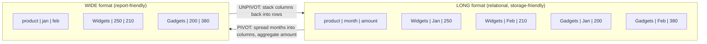
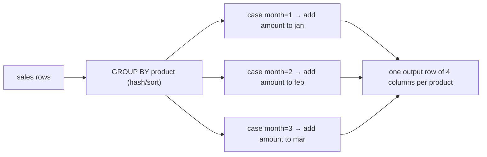

# 99. Pivot & Unpivot

> Cross-references: this section pairs with **Aggregation & GROUP BY**, **Now I'll write the comprehensive section.
Wrote `sql-handbook/11-Advanced/99-Pivot-Unpivot.md` (897 lines) in the companion-file style.

Covers: fundamentals & grain rules, ANSI status (no standard), internal working (grouping pass, `crosstab` two-pass, SQL Server implicit GROUP BY, `UNPIVOT` fan-out) with Mermaid, full per-engine syntax, 9 hand-checked worked examples (verified outputs from the sample data), BAD-vs-BETTER fan-out double-counting scenario, 3 scenarios (dashboard matrix, dynamic pivot, ETL normalization), engine×technique matrices, NULL semantics tables, edge cases, common mistakes, production pitfalls, performance guidance (execution plans, no absolute claims), best practices, and 42 withheld-answer interview questions across all 8 requested categories.
ns.

**Unpivot** is the exact reverse: it turns *columns into rows*. N fixed columns (Q1 .. Q4) are "stacked" back into column-name + column-value row pairs.



### Why pivot/unpivot exist

- SQL is excellent at *long* data: GROUP BY, window functions, filters all presume values live in rows. But business users think in *matrices*: "product in rows, month in columns". Pivot converts long → wide so a spreadsheet-like report can be printed with plain `SELECT`.
- Applications and ETL occasionally get *wide* source data (legacy exports, questionnaires, quarterly columns, phone1/phone2/phone3). Unpivot normalizes wide → long so it can be aggregated, joined, and filtered with normal relational tools.

### Grain changes — the #1 rule

> One row in `sales` represents one sale event.
> One output row of a pivot represents **one group** (one value of the row-key column).
> One output row of an unpivot represents **one source cell** (outer row × one source column).

Pivot **reduces** row count (it *must* aggregate — "each along" the pivot key collapses into one row). Unpivot **increases** row count (each source row fans out into N rows, one per unpivoted column). If you forget either direction, you invent or destroy rows:

> Interview trap: "PIVOT just rotates the table." No. A pivot without aggregation is impossible in general, because the pivot key may repeat within a group. If two sales of the same product share a month, `product × month` cannot map to a single cell unless you choose a rule (sum, max, count). Pivot is *grouping*, disguised as rotating.

---

## ANSI SQL status — there is no standard

Conditional aggregation (`GROUP BY` + `SUM(CASE ...)`) is **100% ANSI** and works everywhere. But native pivot operators are proprietary:

| Engine | Native pivot | Native unpivot |
|---|---|---|
| **PostgreSQL** | `crosstab()` from the `tablefunc` extension | none (use `LATERAL` + `VALUES`, or `UNION ALL`) |
| **MySQL / MariaDB** | none (`GROUP BY` + `CASE`, or dynamic SQL) | none (`UNION ALL`, or `LATERAL` in MySQL 8.0.14+) |
| **SQL Server** | `PIVOT` operator | `UNPIVOT` operator |
| **Oracle** | `PIVOT` / `PIVOT XML` clause (11g+) | `UNPIVOT` clause (11g+) |
| **SQLite / DuckDB** | none (DuckDB has PIVOT since 0.9) | none / DuckDB UNPIVOT |

Consequence: a "MSSQL/MySQL + CASE" resume is not portable; a `_ crosstab()` view is PostgreSQL-only; `PIVOT`/`UNPIVOT` views are not portable. If you must be portable, conditional aggregation + `UNION ALL` is the only answer — and it is usually fast enough that a native operator is not worth the lock-in.

---

## Sample tables

```sql
-- grain: one row = one sale event for one product on one day
CREATE TABLE sales (
    sale_id   INT PRIMARY KEY,
    product   TEXT        NOT NULL,
    region    TEXT        NOT NULL,
    sale_date DATE        NOT NULL,
    amount    NUMERIC(10,2) NOT NULL
);

INSERT INTO sales VALUES
(1, 'Widgets', 'East', '2025-01-15', 100.00),
(2, 'Widgets', 'West', '2025-01-20', 150.00),
(3, 'Gadgets', 'East', '2025-01-25', 200.00),
(4, 'Widgets', 'East', '2025-02-10', 120.00),
(5, 'Gadgets', 'West', '2025-02-12', 300.00),
(6, 'Gadgets', 'East', '2025-02-18',  80.00),
(7, 'Widgets', 'West', '2025-02-28',  90.00),
(8, 'Gadgets', 'West', '2025-03-05', 210.00),
(9, 'Widgets', 'East', '2025-03-15', 175.00);

-- For the fan-out / double-count scenario (grain: one row = one order)
CREATE TABLE orders (
    order_id     INT PRIMARY KEY,
    customer_id  INT,
    order_date   DATE,
    shipping_fee NUMERIC(10,2) NOT NULL,
    status       TEXT NOT NULL
);
-- grain: one row = one product line inside an order
CREATE TABLE order_items (
    order_id   INT,
    product_id INT,
    quantity   INT NOT NULL,
    unit_price NUMERIC(10,2) NOT NULL,
    PRIMARY KEY (order_id, product_id)
);
CREATE TABLE products (
    product_id INT PRIMARY KEY,
    category   TEXT NOT NULL,
    name       TEXT NOT NULL,
    unit_price NUMERIC(10,2)
);

INSERT INTO orders VALUES
(1001, 1, '2025-01-15',  5.00, 'shipped'),
(1002, 2, '2025-01-18',  5.00, 'pending'),
(1003, 1, '2025-02-01',  4.00, 'shipped'),
(1004, 3, '2025-02-10',  4.00, 'cancelled'),
(1005, 2, '2025-03-05',  3.00, 'shipped');

INSERT INTO products VALUES
(1, 'Electronics', 'Keyboard',    49.99),
(2, 'Electronics', 'Mouse',       19.99),
(3, 'Accessories', 'USB-C Cable',  9.99),
(4, 'Electronics', 'Monitor',    129.99),
(5, 'Electronics', 'Webcam',      39.99);

INSERT INTO order_items VALUES
(1001, 1, 2, 49.99),
(1001, 3, 5,  9.99),
(1002, 2, 1, 19.99),
(1002, 4, 1,129.99),
(1003, 1, 1, 49.99),
(1003, 5, 2, 39.99),
(1004, 2, 3, 19.99),
(1004, 3, 1,  9.99),
(1005, 4, 2,129.99);

-- For unpivot examples (grain: one row = one product's year of quarterly totals)
CREATE TABLE quarterly_sales (
    product TEXT         NOT NULL,
    q1      NUMERIC(10,2),
    q2      NUMERIC(10,2),
    q3      NUMERIC(10,2),
    q4      NUMERIC(10,2)
);

INSERT INTO quarterly_sales VALUES
('Widgets', 250.00, 210.00, NULL,   300.00),
('Gadgets', 200.00, 380.00, 210.00, NULL);
```

---

## Internal working

### 1. Conditional aggregation (`GROUP BY + SUM(CASE ...)`)

The engine does one **grouping pass** over `GROUP BY product`, and for each input row it evaluates three `CASE` expressions, adding `amount` to the accumulator whose bucket matched:



Because the accumulator set is fixed by the *query text*, the columns are hard-coded at parse time. Adding a new month = editing the SQL.

### 2. `crosstab()` (PostgreSQL `tablefunc`)

`crosstab(source_sql, category_sql)` is a **two-pass** C function:

1. Runs `category_sql` first to learn the *ordered* list of pivot columns.
2. Runs `source_sql` (must return exactly **row_name, category, value** in that order, **sorted by (row_name, category)**) and redistributes each value into the cell where its category matches.

The output column list is written **by you** in the `AS ct(...)` clause — it must match the values returned by `category_sql` or the names/types silently feed you garbage. If a category from `category_sql` never occurs in `source_sql`, that column comes out NULL.

### 3. SQL Server `PIVOT`

`PIVOT (agg(col) FOR pivot_col IN (vals))` takes the **subquery result**, implicitly **groups by every column not named in the pivot**, then aggregates `col` for each pivot value into a new column. That means:

- The row-key columns are "whatever else is selected" — easy to accidentally include one, splitting your groups.
- Exactly **one** aggregate is allowed. Want SUM *and* COUNT? Pivot twice or use CASE.

### 4. `UNPIVOT` (SQL Server) / `UNPIVOT` (Oracle)

The operator is conceptually a **cross join of each row against the list of target columns**: for every (row, column) pair, emit `(row_key, column_name_as_value, cell_value)`. SQL Server materializes the new columns by literally copying the pivot columns into the "column name" value. Both engines **drop rows whose cell is NULL by default** — see NULL behavior below.

---

## Syntax cheat sheet

```sql
-- ANSI-portable PIVOT (all engines)
SELECT row_key,
       COALESCE(SUM(CASE WHEN pivot_key = 'A' THEN value END), 0) AS a,
       COALESCE(SUM(CASE WHEN pivot_key = 'B' THEN value END), 0) AS b
FROM source
GROUP BY row_key;

-- PostgreSQL crosstab
CREATE EXTENSION IF NOT EXISTS tablefunc;
SELECT * FROM crosstab('SELECT row_key, category, SUM(value)
                        FROM source
                        GROUP BY row_key, category
                        ORDER BY 1, 2',
                       'SELECT DISTINCT category FROM source ORDER BY 1')
       AS result(row_key TEXT, a NUMERIC, b NUMERIC);

-- SQL Server PIVOT
SELECT row_key, [A], [B]
FROM (SELECT row_key, pivot_key, value FROM source) src
PIVOT (SUM(value) FOR pivot_key IN ([A], [B])) pvt;

-- Oracle PIVOT
SELECT * FROM source
PIVOT (SUM(value) FOR pivot_key IN ('A' AS a, 'B' AS b));
```

```sql
-- ANSI-portable UNPIVOT (all engines)
SELECT row_key, 'Q1' AS q, q1 AS value FROM source
UNION ALL SELECT row_key, 'Q2', q2 FROM source
UNION ALL SELECT row_key, 'Q3', q3 FROM source;

-- PostgreSQL LATERAL (keeps NULLs)
SELECT s.row_key, v.q, v.value
FROM source s
CROSS JOIN LATERAL (VALUES ('Q1', q1), ('Q2', q2)) AS v(q, value);

-- SQL Server UNPIVOT (drops NULLs)
SELECT row_key, q, value
FROM source
UNPIVOT (value FOR q IN (q1, q2)) AS u;

-- Oracle UNPIVOT (INCLUDE NULLS to keep them)
SELECT * FROM source
UNPIVOT INCLUDE NULLS (value FOR q IN (q1 AS 'Q1', q2 AS 'Q2'));
```

---

## Worked examples

### Example 1 — Portable pivot: product × month (conditional aggregation)

```sql
SELECT
    product,
    COALESCE(SUM(CASE WHEN EXTRACT(MONTH FROM sale_date) = 1 THEN amount END), 0) AS jan,
    COALESCE(SUM(CASE WHEN EXTRACT(MONTH FROM sale_date) = 2 THEN amount END), 0) AS feb,
    COALESCE(SUM(CASE WHEN EXTRACT(MONTH FROM sale_date) = 3 THEN amount END), 0) AS mar
FROM sales
GROUP BY product
ORDER BY product;
```

**Expected output:**

| product | jan | feb | mar |
|---|---|---|---|
| Gadgets | 200.00 | 380.00 | 210.00 |
| Widgets | 250.00 | 210.00 | 175.00 |

*Check by hand: Widgets Jan = 100 + 150 = 250; Gadgets Feb = 300 + 80 = 380.*

### Example 2 — PostgreSQL `crosstab`

```sql
CREATE EXTENSION IF NOT EXISTS tablefunc;

SELECT * FROM crosstab(
    $$SELECT product,
             TO_CHAR(sale_date, 'YYYY-MM') AS month_key,
             SUM(amount)
      FROM sales
      GROUP BY product, TO_CHAR(sale_date, 'YYYY-MM')
      ORDER BY 1, 2$$,
    $$SELECT DISTINCT TO_CHAR(sale_date, 'YYYY-MM')
      FROM sales
      ORDER BY 1$$
) AS ct(product TEXT,
        "2025-01" NUMERIC(10,2),
        "2025-02" NUMERIC(10,2),
        "2025-03" NUMERIC(10,2));
```

**Expected output:**

| product | 2025-01 | 2025-02 | 2025-03 |
|---|---|---|---|
| Gadgets | 200.00 | 380.00 | 210.00 |
| Widgets | 250.00 | 210.00 | 175.00 |

Critical `crosstab` rules:

- `source_sql` must return **exactly 3 columns** and be **ordered by (row_key, category)**.
- The `AS ct(...)` list must contain **exactly the same ordered set of categories** that `category_sql` returns — adding a bogus fourth column *renders garbage*, not NULL.
- If a listed category has no data, its cell is NULL (PostgreSQL crosstab drops nothing).

### Example 3 — SQL Server `PIVOT`

```sql
SELECT product, [1] AS jan, [2] AS feb, [3] AS mar
FROM (
    SELECT product, MONTH(sale_date) AS m, amount
    FROM sales
) src
PIVOT (
    SUM(amount)
    FOR m IN ([1], [2], [3])
) pvt;
```

**Expected output:**

| product | jan | feb | mar |
|---|---|---|---|
| Gadgets | 200.00 | 380.00 | 210.00 |
| Widgets | 250.00 | 210.00 | 175.00 |

Notes:

- `MONTH(sale_date)` is SQL Server-specific; use `DATEPART(month, sale_date)` for the full equivalent.
- In the `IN` list, **unquoted identifiers — `1` is written `[1]` — or the bracket form is mandatory** for numeric columns.
- Every column of `src` that is *not* the pivot column and *not* the aggregate silently joins the GROUP BY. To control row keys explicitly, select only what you want (as done above).

### Example 4 — Oracle `PIVOT`

```sql
SELECT *
FROM (
    SELECT product, EXTRACT(MONTH FROM sale_date) AS m, amount
    FROM sales
)
PIVOT (
    SUM(amount)
    FOR m IN (1 AS jan, 2 AS feb, 3 AS mar)
)
ORDER BY product;
```

**Expected output:**

| product | jan | feb | mar |
|---|---|---|---|
| Gadgets | 200 | 380 | 210 |
| Widgets | 250 | 210 | 175 |

> PostgreSQL
> `EXTRACT(MONTH FROM ...)` is ANSI and works in all four engines; `TO_CHAR`-style month labels are per-engine.
> MySQL
> `EXTRACT(MONTH FROM sale_date)` works in MySQL too, but MySQL has no `PIVOT`; use conditional aggregation or build the columns with dynamic SQL.

### Example 5 — MySQL portable pivot (identical to Example 1, MySQL syntax)

```sql
SELECT
    product,
    COALESCE(SUM(CASE WHEN MONTH(sale_date) = 1 THEN amount END), 0) AS jan,
    COALESCE(SUM(CASE WHEN MONTH(sale_date) = 2 THEN amount END), 0) AS feb,
    COALESCE(SUM(CASE WHEN MONTH(sale_date) = 3 THEN amount END), 0) AS mar
FROM sales
GROUP BY product
ORDER BY product;
```

Output as Example 1. MySQL has no `FILTER (WHERE ...)` for aggregates and no `PIVOT`; `CASE` + `SUM` is the only static way.

### Example 6 — Portable UNPIVOT with `UNION ALL`

```sql
SELECT product, 'Q1' AS quarter, q1 AS amount FROM quarterly_sales
UNION ALL SELECT product, 'Q2', q2 FROM quarterly_sales
UNION ALL SELECT product, 'Q3', q3 FROM quarterly_sales
UNION ALL SELECT product, 'Q4', q4 FROM quarterly_sales
ORDER BY product, quarter;
```

**Expected output (8 rows — NULLs are kept):**

| product | quarter | amount |
|---|---|---|
| Gadgets | Q1 | 200.00 |
| Gadgets | Q2 | 380.00 |
| Gadgets | Q3 | 210.00 |
| Gadgets | Q4 | NULL |
| Widgets | Q1 | 250.00 |
| Widgets | Q2 | 210.00 |
| Widgets | Q3 | NULL |
| Widgets | Q4 | 300.00 |

### Example 7 — SQL Server `UNPIVOT` (NULLs are dropped)

```sql
SELECT product, quarter, amount
FROM quarterly_sales
UNPIVOT (
    amount FOR quarter IN (q1, q2, q3, q4)
) AS u
ORDER BY product;
```

**Expected output (6 rows — NULL cells are gone):**

| product | quarter | amount |
|---|---|---|
| Gadgets | Q1 | 200.00 |
| Gadgets | Q2 | 380.00 |
| Gadgets | Q3 | 210.00 |
| Widgets | Q1 | 250.00 |
| Widgets | Q2 | 210.00 |
| Widgets | Q4 | 300.00 |

> Production pitfall: SQL Server `UNPIVOT` silently removes rows whose cell is NULL. Reports that count rows, `COUNT` aggregates, or join this result to a dimension will see *fewer* rows than the wide table had cells. If you must preserve NULLs, fan the row out against a quarter dimension first:

```sql
SELECT s.product, q.quarter, u.amount
FROM quarterly_sales s
CROSS JOIN (VALUES ('Q1'),('Q2'),('Q3'),('Q4')) q(quarter)
LEFT JOIN (
    SELECT product, quarter, amount
    FROM quarterly_sales
    UNPIVOT (amount FOR quarter IN (q1, q2, q3, q4)) AS u
) u ON u.product = s.product AND u.quarter = q.quarter;
```

### Example 8 — PostgreSQL `LATERAL` unpivot (NULLs kept)

```sql
SELECT s.product, v.quarter, v.amount
FROM quarterly_sales s
CROSS JOIN LATERAL (VALUES
    ('Q1', s.q1),
    ('Q2', s.q2),
    ('Q3', s.q3),
    ('Q4', s.q4)
) AS v(quarter, amount)
ORDER BY s.product, v.quarter;
```

Output: the same 8 rows as Example 6. Add `WHERE v.amount IS NOT NULL` if you want the "drop NULLs" behavior that SQL Server gives implicitly. MySQL 8.0.14+ supports the same `LATERAL (VALUES ...)` syntax with `VALUES` row constructors; older MySQL must use `UNION ALL`.

### Example 9 — Oracle `UNPIVOT` with `INCLUDE NULLS`

```sql
SELECT *
FROM quarterly_sales
UNPIVOT INCLUDE NULLS (
    amount FOR quarter IN (q1 AS 'Q1', q2 AS 'Q2', q3 AS 'Q3', q4 AS 'Q4')
)
ORDER BY product;
```

Without `INCLUDE NULLS`, Oracle (like SQL Server) drops NULL cells. The atom of NULL-behavior is a classic engine inconsistency:

| Technique | Keeps NULL cells? |
|---|---|
| `CASE` / conditional aggregation | Yes (aggregates ignore NULL *values*, safe) |
| `UNION ALL` unpivot | **Yes** |
| PostgreSQL `LATERAL (VALUES ...)` | **Yes** |
| SQL Server `UNPIVOT` | **No** (drops) |
| Oracle `UNPIVOT` (default) | **No** (drops) |
| Oracle `UNPIVOT INCLUDE NULLS` | Yes |

---

## BAD approach vs BETTER approach — fan-out double counting

> Scenario: pivot **shipping revenue** by category and month. A join fan-out is the single cheapest way to corrupt pivot cells, because the pivot *aggregates* — every duplicated row is summed twice.

### BAD — aggregating an order-grain column after a 1:N join

```sql
SELECT
    p.category,
    COALESCE(SUM(CASE WHEN EXTRACT(MONTH FROM o.order_date) = 1 THEN o.shipping_fee END), 0) AS jan,
    COALESCE(SUM(CASE WHEN EXTRACT(MONTH FROM o.order_date) = 2 THEN o.shipping_fee END), 0) AS feb,
    COALESCE(SUM(CASE WHEN EXTRACT(MONTH FROM o.order_date) = 3 THEN o.shipping_fee END), 0) AS mar
FROM order_items oi
JOIN orders   o ON o.order_id  = oi.order_id
JOIN products p ON p.product_id = oi.product_id
GROUP BY p.category
ORDER BY p.category;
```

**Expected (wrong) output:**

| category | jan | feb | mar |
|---|---|---|---|
| Accessories | 5.00 | 4.00 | 0.00 |
| Electronics | **15.00** | **12.00** | 3.00 |

Why it's wrong: `orders` is 1:N with `order_items`. Order 1001 has two lines, so its `shipping_fee = 5` is counted once per line, both inside Electronics (Keyboard, 1001 and USB-C) and inside Accessories. Electronics-Jan should be 10, not 15; Electronics-Feb should be 8, not 12. Verification: the grand total of shipping per month (10 / 8 / 3) is exceeded by the Electronics column alone (15 / 12).

### BETTER — aggregate components at their own grain

Shipping is order-grain; item revenue is item-grain *and* category-grain. Never SUM order-grain data over a finer join — either pre-aggregate, or pivot only data that belongs with the row key:

```sql
SELECT
    p.category,
    COALESCE(SUM(CASE WHEN EXTRACT(MONTH FROM o.order_date) = 1
                      THEN oi.quantity * oi.unit_price END), 0) AS jan,
    COALESCE(SUM(CASE WHEN EXTRACT(MONTH FROM o.order_date) = 2
                      THEN oi.quantity * oi.unit_price END), 0) AS feb,
    COALESCE(SUM(CASE WHEN EXTRACT(MONTH FROM o.order_date) = 3
                      THEN oi.quantity * oi.unit_price END), 0) AS mar
FROM order_items oi
JOIN orders   o ON o.order_id  = oi.order_id
JOIN products p ON p.product_id = oi.product_id
GROUP BY p.category
ORDER BY p.category;
```

**Expected (correct) output:**

| category | jan | feb | mar |
|---|---|---|---|
| Accessories | 49.95 | 9.99 | 0.00 |
| Electronics | 249.96 | 189.94 | 259.98 |

*Check: Jan Electronics = Keyboard 99.98 + Mouse 19.99 + Monitor 129.99 = 249.96. Every item earns its own revenue, once.*

Shipping, when you genuinely need it pivoted, must be aggregated at order grain **first** (a CTE on `orders`), then joined to the pivoted item result — so it is never multiplied by line count. This is the same rule as everywhere else in SQL: *know each column's grain before you aggregate it*, and confirm with `EXPLAIN` and spot-check totals.

---

## When to use pivot / unpivot

**Use a pivot when:**

- A report is a fixed matrix: categories in rows, a *known, small, bounded* set in columns (months of one year, East/West regions, statuses).
- The result feeds a spreadsheet / BI grid that expects one column per value.
- You need a matrix of counts or sums (e.g., a confusion matrix, a rating histogram from −15..+15).

**Do NOT use a pivot when:**

- The pivot key is open-ended (unbounded user tags, arbitrary dates). Result: thousands of columns, exceeding engine limits and choking BI tools — use a long table and let the BI tool pivot.
- You don't actually need aggregation (row keys are already unique per column): a plain `JOIN ... ON` to a dimension + `CASE` per column, or `FILTER`, may be cleaner.
- The value cells must remain *sets* (multiple facts per cell) — a single cell can only hold one scalar.

**Use an unpivot when:**

- ETL receives wide/denormalized legacy data (Q1..Q4, phone1..3, attr1..N) and you must normalize it into a long, filterable, joinable shape.
- You need to `GROUP BY` or window over something that currently lives in column *names*.

**Do NOT use an unpivot when:**

- The wide columns have *different meanings* (gross vs net) — those are distinct attributes, not repeated instances of one measurement; keeping them as columns is the honest model.
- You need the wide shape downstream anyway — unpivot then re-pivot is wasted work.

---

## Comparison tables

### Pivot vs unpivot

| | PIVOT | UNPIVOT |
|---|---|---|
| Direction | rows → columns | columns → rows |
| Row-count change | shrinks (groups) | grows (fan-out × #columns) |
| Aggregation | always required | none (it is a reshape) |
| NULL row key/key-value | becomes its own group cell | cell becomes a NULL value |
| Output columns | one per pivot value (dynamic-ish) | fixed by input columns |
| Storage format | report-pres | relational (normalized) |

### Engine × technique matrix

| Technique | Postgres | MySQL | SQL Server | Oracle |
|---|---|---|---|---|
| `SUM(CASE...)` pivot | ✅ | ✅ | ✅ | ✅ |
| `FILTER (WHERE ...)` | ✅ | ❌ | ❌ (pattern often emulated) | ❌ |
| `crosstab()` | ✅ (tablefunc) | ❌ | ❌ | ❌ |
| `PIVOT` operator | ❌ | ❌ | ✅ | ✅ (clause) |
| `UNION ALL` unpivot | ✅ | ✅ | ✅ | ✅ |
| `UNPIVOT` | ❌ | ❌ | ✅ (drops NULL) | ✅ (drops NULL by default) |
| `LATERAL (VALUES)` unpivot | ✅ | ✅ 8.0.14+ | ❌ (use `CROSS APPLY`) | ✅ |

---

## Scenario-based examples

### Scenario 1 — Dashboard: monthly sales matrix per region

Management wants **region in rows, month in columns, total amount in cells**. The dashboard must render *today's months* without SQL edits being safe — fixed-format is fine here because "current year, Jan–Dec" is a closed set.

```sql
SELECT
    region,
    COALESCE(SUM(CASE WHEN EXTRACT(MONTH FROM sale_date) =  1 THEN amount END), 0) AS m1,
    COALESCE(SUM(CASE WHEN EXTRACT(MONTH FROM sale_date) =  2 THEN amount END), 0) AS m2,
    COALESCE(SUM(CASE WHEN EXTRACT(MONTH FROM sale_date) =  3 THEN amount END), 0) AS m3,
    COALESCE(SUM(CASE WHEN EXTRACT(MONTH FROM sale_date) =  4 THEN amount END), 0) AS m4,
    COALESCE(SUM(CASE WHEN EXTRACT(MONTH FROM sale_date) =  5 THEN amount END), 0) AS m5,
    COALESCE(SUM(CASE WHEN EXTRACT(MONTH FROM sale_date) =  6 THEN amount END), 0) AS m6,
    COALESCE(SUM(CASE WHEN EXTRACT(MONTH FROM sale_date) =  7 THEN amount END), 0) AS m7,
    COALESCE(SUM(CASE WHEN EXTRACT(MONTH FROM sale_date) =  8 THEN amount END), 0) AS m8,
    COALESCE(SUM(CASE WHEN EXTRACT(MONTH FROM sale_date) =  9 THEN amount END), 0) AS m9,
    COALESCE(SUM(CASE WHEN EXTRACT(MONTH FROM sale_date) = 10 THEN amount END), 0) AS m10,
    COALESCE(SUM(CASE WHEN EXTRACT(MONTH FROM sale_date) = 11 THEN amount END), 0) AS m11,
    COALESCE(SUM(CASE WHEN EXTRACT(MONTH FROM sale_date) = 12 THEN amount END), 0) AS m12
FROM sales
WHERE EXTRACT(YEAR FROM sale_date) = 2025
GROUP BY region
ORDER BY region;
```

**Expected output (with the sample data, months 1–3 filled):**

| region | m1 | m2 | m3 | m4..m12 |
|---|---|---|---|---|
| East | 300.00 | 200.00 | 175.00 | 0.00 |
| West | 150.00 | 390.00 | 210.00 | 0.00 |

*Check: East Jan = 100 (Widgets) + 200 (Gadgets) = 300; West Feb = 300 (Gadgets) + 90 (Widgets) = 390.*

### Scenario 2 — Dynamic pivot: months that arrive unannounced

Analysts keep adding months; nobody wants to edit the SQL every week. Build the column list **from the data itself**, safely.

**PostgreSQL:**

```sql
DO $$
DECLARE
    cols TEXT;
    sql  TEXT;
BEGIN
    SELECT string_agg(quote_ident(TO_CHAR(sale_date, 'YYYY-MM')), ', ' ORDER BY 1)
      INTO cols
      FROM (SELECT DISTINCT sale_date FROM sales) d;

    sql := format(
        'SELECT product, %s FROM crosstab(
             $$SELECT product, TO_CHAR(sale_date, ''YYYY-MM''), SUM(amount)
               FROM sales GROUP BY 1, 2 ORDER BY 1, 2$$,
             $$SELECT DISTINCT TO_CHAR(sale_date, ''YYYY-MM'') FROM sales ORDER BY 1$$
         ) AS ct(product TEXT, %s NUMERIC(10,2));',
        cols, cols);

    EXECUTE sql;
END $$;
```

**SQL Server (classic `FOR XML PATH` list-builder):**

```sql
DECLARE @cols  NVARCHAR(MAX),
        @sql   NVARCHAR(MAX);

SELECT @cols = STUFF((
    SELECT DISTINCT ',' + QUOTENAME(CONVERT(varchar(7), sale_date, 120))
    FROM sales
    FOR XML PATH(''), TYPE).value('.', 'NVARCHAR(MAX)'), 1, 1, '');

SET @sql = N'
    SELECT product, ' + @cols + N'
    FROM (SELECT product,
                 CONVERT(varchar(7), sale_date, 120) AS m,
                 amount
          FROM sales) src
    PIVOT (SUM(amount) FOR m IN (' + @cols + N')) p;';

EXEC sp_executesql @sql;
```

**MySQL (GROUP_CONCAT + PREPARE):**

```sql
SET @cols = NULL;
SELECT GROUP_CONCAT(DISTINCT CONCAT('COALESCE(SUM(CASE WHEN DATE_FORMAT(sale_date,''%Y-%m'') = ''',
        DATE_FORMAT(sale_date,'%Y-%m'),
        ''' THEN amount END),0) AS `', DATE_FORMAT(sale_date,'%Y-%m'), '`')
        ORDER BY 1 SEPARATOR ', ')
  INTO @cols
  FROM sales;

SET @sql = CONCAT('SELECT product, ', @cols,
                  ' FROM sales GROUP BY product ORDER BY product;');
PREPARE stmt FROM @sql;
EXECUTE stmt;
DEALLOCATE PREPARE stmt;
```

> Production pitfall: dynamic SQL is a SQL-injection surface. Pivot column lists drawn from **your own data** are lower risk, but still: `quote_ident` (Postgres), `QUOTENAME` (SQL Server), backtick-quoting, and — the strongest defense — a **whitelist** of allowed column values plus strict typing. Never concatenate user input into the column list.
>
> Production pitfall: each dynamic pivot **builds a new SQL string**, so the optimizer may see a new query shape per run — no stable plan cache, more hard parses. If the set of columns changes rarely, prefer a view or a scheduled rebuild over executing dynamic SQL per report request. Verify actual plan-cache hit rate with the engine's diagnostics, not by reasoning alone.

### Scenario 3 — ETL: normalize a wide legacy export

A vendor file has one row per product with `sales_jan ... sales_dec`. To load it relationally:

```sql
INSERT INTO monthly_sales (product, month, amount)
SELECT s.product, v.month, v.amount
FROM legacy_wide s
CROSS JOIN LATERAL (VALUES
    ('2025-01', s.sales_jan), ('2025-02', s.sales_feb), ..., ('2025-12', s.sales_dec)
) AS v(month, amount)
WHERE v.amount IS NOT NULL;   -- skip NULL cells, mirroring UNPIVOT semantics
```

Now the long table can be GROUP BY'd, indexed, and joined normally.

---

## Common mistakes

1. **Forgetting that pivot must aggregate.** If the pivot key repeats inside a row-key group and you don't aggregate, you either get a MySQL/Postgres `only_full_group_by` error or (SQL Server PIVOT with a `MAX`-style choice) an *arbitrary* placeholder instead of a total.
2. **Leaving extra columns in the PIVOT source.** In SQL Server, every column you `SELECT` that isn't the pivot column quietly joins the implicit GROUP BY and multiplies the output rows.
3. **Joining before aggregating (fan-out).** Summing an order-grain value over order_items double counts. Fix the grain *before* the pivot. (BAD vs BETTER above.)
4. **`UNION` instead of `UNION ALL` in unpivot.** `UNION` deduplicates rows — two products with identical quarter value collapse into one row, silently changing grain.
5. **Ignoring a date fraction.** Pivoting on `order_date` itself creates one column per distinct timestamp; pivot on `EXTRACT(MONTH ...)`, `DATE_TRUNC`, `TO_CHAR`, or `DATE_FORMAT` instead.
6. **Hard-coding a stale column list.** A static pivot misses all months after 2025-03 — cells silently absent, or worse, the report doesn't even show the new month exists.
7. **Type-mismatched UNPIVOT.** SQL Server `UNPIVOT` requires all source columns the same type; text + numeric must be coerced first.
8. **Treating NULLs as zero in the wrong direction.** `COALESCE(...,0)` is a *display* choice; `UNPIVOT` dropping NULLs is a *row-count* change. Different consequences.
9. **Pivoting by a *value* that isn't unique across the whole result set** — two different products could both have a month's value "high"; if the pivot key itself is a free-text status, you may get duplicate column headers (collision) in crosstab.

---

## Edge cases

- **A pivot value category with zero rows** → the column is simply absent (static CASE) or all NULL (crosstab listed it anyway). In a dynamic pivot, the column never appears; reports that *expect* 12 month columns get 5.
- **Empty table** → `GROUP BY` returns zero rows; column *headers* still exist because they're hard-coded, but there may be no data rows. crosstab with an empty source returns only the category list as NULL-valued columns.
- **NULL in the row key** (product = NULL) → `GROUP BY` treats NULL as its own group, producing a row labeled `product = NULL`; crosstab emits an empty-string row name. Decide explicitly whether NULLs should have a bucket.
- **NULL in the pivot key** → SQL Server PIVOT groups `NULL` as a distinct pivot value (column `[NULL]`); CASE-based pivots just never match it (value ends up nowhere). Pre-normalize with `COALESCE`/`NULLIF` as the business wants.
- **Duplicate row-key × pivot-key pairs** → must aggregate (or the cell is a lie). Detect with `COUNT(*)` per pair before trusting a `MAX()` pivot.
- **Unpivot where an entire row is NULL** → `UNION ALL` yields rows of all-NULL values; `UNPIVOT`/`LATERAL`+filter yields zero rows; both are "correct" but must match the consumer's expectation.
- **Columns of mixed type in the wide source** → cast to a common type before unpivot.
- **Very wide pivots** → engines cap columns (SQL Server 1024 per `SELECT`, MySQL 4096 in table definitions, tables generally 1600–4096 columns). A pivot that produces >1000 columns will break at runtime — push back to long format.
- **Cell collisions in crosstab** → if the source query has two rows with the same (row_key, category), crosstab raises a strict "duplicate key" error in recent PostgreSQL, which is actually *good*: it forces you to aggregate first.

---

## NULL behavior

- **Pivot aggregation** (`SUM`/`AVG`/etc.) already ignores NULL *values*; `CASE ... THEN amount END` leaves non-matching cells NULL. `COALESCE(cell, 0)` is **presentation** — apply it at the outermost layer, not inside the aggregation, or a `01` month with zero sales and a `01` month with all-`NULL` amounts become indistinguishable.
- **A missing category** (a month no one bought anything) is a NULL cell, not a zero row.
- **Unpivot NULL semantics differ by technique** — the largest live-bug generator in this whole section:

| Operation | NULL cell handling |
|---|---|
| `UNION ALL` unpivot | kept (as NULL) |
| `LATERAL (VALUES ...)` | kept, filter to drop |
| SQL Server `UNPIVOT` | **dropped** |
| Oracle `UNPIVOT` default | **dropped**; `INCLUDE NULLS` keeps |

Whenever your unpivot'd row-count is suspicious, reproduce the count three ways: source cells, `UNION ALL`, and `UNPIVOT` — the difference is exactly your NULL count.

---

## Performance implications

- **Static conditional aggregation** is a single hash/sort group that touches each input row **once**, regardless of how many columns you emit — few accumulators, one pass. It is generally cheap and will be hard to beat. *Verify with `EXPLAIN (ANALYZE)`.*
- **`crosstab()`** is two statements internally (category query + value query) with an explicit `ORDER BY`; the plan will show sorts. Large category lists waste work on columns that produce NULLs. Miscounted `AS ct(...)` columns silently *misalign* data — a correctness bug an execution plan won't catch.
- **Dynamic pivots** rebuild the query string per distinct column set ⇒ potential hard parse / plan cache churn; watch `pg_stat_statements` or sys.dm_exec_query_stats. Prefer parameterized, cached, or prebuilt views for stable workloads.
- **Wide output** transfers more bytes: 12-month matrices are fine; 400-attribute pivots bloat network + BI memory regardless of engine.
- **Unpivot is inherently a fan-out** — rows × columns. A 1M-row × 20-column table becomes 20M rows; the scan is one pass but the result size and any subsequent joins dominate. `EXPLAIN ANALYZE` will show the actual row estimates.
- **Never claim "PIVOT is faster than CASE"** — optimizer, statistics, and column count decide. Measure with the engine's plan tool (PostgreSQL `EXPLAIN (ANALYZE, BUFFERS)`, SQL Server *Estimated/Actual Execution Plan*, MySQL `EXPLAIN ANALYZE`, Oracle SQL Monitor).

---

## Interview traps

1. **"PIVOT rotates; no aggregation needed."** Pivot collapses a many-valued (row_key, pivot_key) into one cell — aggregation is required.
2. **"UNPIVOT always returns the same row count as the wide table."** SQL Server/Oracle drop NULLs; `UNION ALL` doesn't.
3. **"crosstab needs no ORDER BY."** It silently reorders/misplaces cells without one.
4. **"Pivot key can be unbounded and still fine."** Thousands of columns exceed engine limits.
5. **"COALESCE makes NULLs zeros, so pivot is safe."** Only display; count semantics change (AVG/COUNT vs SUM).
6. **"The matter is symmetric."** UNPIVOT(PIVOT(x)) loses information when aggregation collapses multiple rows or when NULLs are dropped.

---

## Best practices

1. **Fix the grain first.** State the source grain and the output grain on paper before writing the query. If the join fans out, aggregate before pivot.
2. **Store long, display wide.** Store months as rows; pivot only at the report boundary. Long data is filterable, indexable, and portable.
3. **Prefer portable syntax** (`SUM(CASE ...)`, `UNION ALL`) unless a native operator's semantics (e.g. Oracle `INCLUDE NULLS`) are genuinely needed.
4. **Clean in a CTE, pivot last.** Put the `WHERE`, the join, and the month-label conversion in a CTE; the pivot step then touches only the values it needs.
5. **Keep an eye on crosstab's contract:** 3 columns, ordered, exact `AS(...)` list.
6. **Whitelist dynamic pivot columns**; never interpolate raw user text; quote identifiers.
7. **COALESCE for display only**, at the outermost SELECT.
8. **Bound the width.** If the pivot key is unbounded, return long data and let the BI layer pivot.
9. **Verify every cell** with a long-format cross-check (`SELECT product, month, SUM(amount) GROUP BY 1,2`) inside one test transaction — pivot outputs are easy to eyeball but easy to misalign.
10. **Confirm performance with execution plans** in the engine's own tool before choosing static vs crosstab vs dynamic.

---

## Real-world scenario — product family profitability matrix

Finance asks: "one row per product family, one column per month, cells = revenue − COGS, NULL = no activity." Data spans a join on item detail and an order-master grain. The textbook-answer design:

```sql
WITH reconciliation AS (
    SELECT
        p.category,
        EXTRACT(MONTH FROM o.order_date)                    AS m,
        SUM(oi.quantity * oi.unit_price - oi.quantity * p.unit_price) AS margin
    FROM order_items oi
    JOIN orders    o ON o.order_id  = oi.order_id
    JOIN products  p ON p.product_id = oi.product_id
    WHERE o.status <> 'cancelled'
    GROUP BY p.category, EXTRACT(MONTH FROM o.order_date)
)
SELECT
    category,
    COALESCE(SUM(CASE WHEN m = 1 THEN margin END), 'NO ACTIVITY') ... -- business choice
FROM reconciliation
GROUP BY category;
```

The reasoning checklist applied to every pivot you write:

1. What does one output row represent? → *one product family.*
2. Grain of each input? → *orders 1:N, items; margin computed per item.*
3. Driving table? → *order_items (the finest grain with the measures).*
4. Columns needed from elsewhere? → *order date, status, product category — join keys exist, no other columns.*
5. Can the join create duplicates? → *no: order_items has PK (order_id, product_id).*
6. Do I need aggregation? → *yes — that's the whole point of pivot.*
7. What index might help? → *PKs, then possibly (category, order_date) covering.*
8. What does `EXPLAIN ANALYZE` say? → *the verification step.*

---

# Interview Questions

## Beginner

1. In one sentence: what does a pivot do to rows, and what does an unpivot do to columns?
2. Does a pivot require an aggregation? Why can't you just "rotate" the table?
3. Write a query that turns a `sales(product, month, amount)` table into `product × (jan, feb, mar)` using only ANSI SQL.
4. Write a query that turns `quarterly(product, q1, q2, q3, q4)` into long rows without using any proprietary operator.
5. What is the grain of one output row in each of the two queries above?
6. Why is `UNION ALL` the unpivot tool, and what would `UNION` have done instead?

## Intermediate

7. Explain the difference between pivot input grain and output grain using an example where the same pivot-key value appears twice for one row-key.
8. Write a PostgreSQL `crosstab` query and list its three source-query contract requirements.
9. Write a SQL Server `PIVOT` that produces a product × month matrix with `MONTH()`; explain how SQL Server decides the row-key columns.
10. Write an Oracle `PIVOT` equivalent and show how aliases produce column headers.
11. How do you unpivot on MySQL when `UNPIVOT` doesn't exist?
12. `UNPIVOT` in SQL Server dropped 200 rows from your result. What is the most likely cause, and how do you fix it (show both states of output)?

## Advanced

13. How does PostgreSQL `crosstab` work internally? What does it do with the category query and why must the source be ORDER BY (row_key, category)?
14. Build a dynamic pivot in your engine of choice that adds a new column for every new month, without hard-coding months. Where do you quote identifiers, and why is it a SQL-injection risk even though columns come from your own table?
15. Design an unpivot that *also* preserves NULL cells on SQL Server (dimension fan-out + `LEFT JOIN`).
16. Explain the plan-level cost of unpivot: why does a 1M×20 wide table produce 20M rows, and where should you confirm it — plan vs. intuition?
17. When would you deliberately write a *second* pivot or a self-join on the pivoted result, and how does that interact with grain?

## Scenario Based

18. Finance wants a year-month matrix of revenue with categories as rows. The ETL pipeline only guarantees "months that exist." Design the query and explain what happens to a month with zero sales.
19. Marketing sends a per-region file with columns `sales_2019 ... sales_2025`. You must load it normalized. Show the load and the index you would add to the target.
20. A dashboard pivots by `status` ('.shipped', 'pending', 'cancelled', ...). New statuses appear in production. What breaks, and what is the safe fix?
21. Two source rows have identical (product, month) after a sloppy join. Your pivot used `MAX`. What did the cell show, and how do you prove the value is wrong?
22. You report "revenue by category" but the numbers are 3× the order-count-based revenue. The data has order_items. Which step is broken and what's the fix?

## Tricky

23. `GROUP BY` treats NULL as a bucket in normal aggregation. Where does that NULL bucket appear in a CASE-based pivot, a crosstab, and a SQL Server PIVOT?
24. You unpivot a table where one row is *entirely* NULL. How many rows does each technique (UNION ALL, LATERAL, UNPIVOT) produce?
25. `UNPIVOT(PIVOT(T))` is not an identity. Give two concrete ways the round-trip changes `T`.
26. We know SQL Server `UNPIVOT` requires same-typed columns. What happens if one column is `INT` and one is `VARCHAR` — and what's a real schema where this happens?
27. Pivot cells are `NULL`, you `COALESCE(..., 0)`, and the total in the pivot is *higher* than the raw SUM. How?
28. What is the difference between pivoting by `EXTRACT(MONTH FROM ...)` and pivoting by the full timestamp string? Which one produces 12+ columns of near-empty data?

## Output Prediction

29. The `sales` data above. Write the exact output of: `SELECT product, SUM(CASE WHEN MONTH(sale_date)=2 THEN amount END) feb FROM sales GROUP BY product ORDER BY product DESC;` — including which cell is NULL.
30. Predict the output of the SQL Server `UNPIVOT` of `quarterly_sales` (sample data) — how many rows, and which (product, quarter) pairs are missing, and why?
31. Given `crosstab` source ordered `(product, month)` with `AS ct(product TEXT, "2025-01" NUMERIC, "2025-02" NUMERIC, "2025-03" NUMERIC)` and months sampled from the data, predict cell values and NULL cells.
32. For the BAD fan-out query of Example 1 in this section, predict the jan cell for Electronics before reading the answer — then recompute it by hand from `orders` and `order_items` to confirm it's 15 vs the true 10.

## Debugging

33. A pivot report shows a month missing entirely, though Q1 clearly has 3 months of data. Where do you look first: the SQL, the data, the crosstab category query, or the engine limits?
34. The unpivot output has exactly half the rows you expect. List every plausible cause in engine-specific terms.
35. `crosstab` throws "duplicate key value." Which query contract did you violate, and what two lines of change fix it?
36. A dynamic pivot returns columns in a random order one day and alphabetic the next. Which engine-dependent detail of the list builder is responsible?
37. You spot Cell (Widgets, February) = 0 but hand-calculating says 210. The `COALESCE` is at the inner layer. Explain the two different queries that produce 0 vs 210 and how to spot it in the output.

## Performance

38. Should you use `crosstab` or `SUM(CASE)` for a 12-month matrix over a 50M-row table? What must you verify to decide rather than guess?
39. Why does a dynamic pivot potentially thrash the plan cache, and how would you measure that in your engine (pg_stat_statements vs sys.dm_exec_query_stats)?
40. Compare estimated rows in `EXPLAIN` for a 1,000,000-row × 18-quarter unpivot. What is the arithmetic the optimizer uses, and when would that estimate be wrong?
41. A table with a supporting index on (product, sale_date) feeds a pivot grouped by `product` with a `WHERE month = '2025-02'`. Would you expect an index scan or a filter-and-aggregate? What does `EXPLAIN (ANALYZE, BUFFERS)` tell you that `EXPLAIN` alone does not?
42. You pivot 400 product attributes into 400 columns for a BI grid. Where does the real bottleneck live (engine, network, BI client, plan)? Walk through the diagnostic steps rather than assuming the SQL is at fault.

---

*End of Section 99 — Pivot & Unpivot. Next related topics: "Aggregation & GROUP BY", "JOINs & Fan-out", "NULL & Three-Valued Logic", "Dates & Time", "Dynamic SQL / Stored Procedures", "Execution Plans & Indexes".*