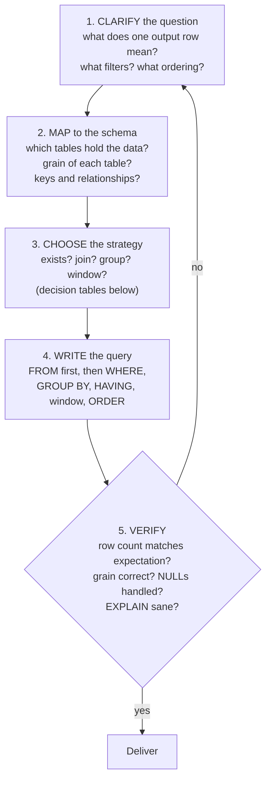
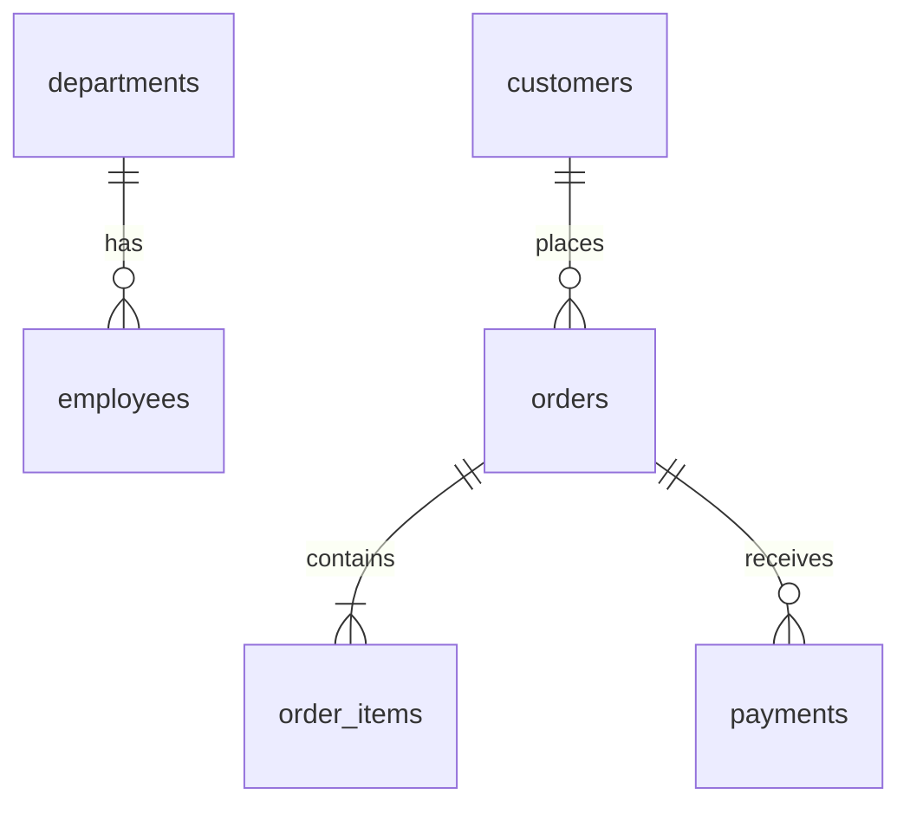
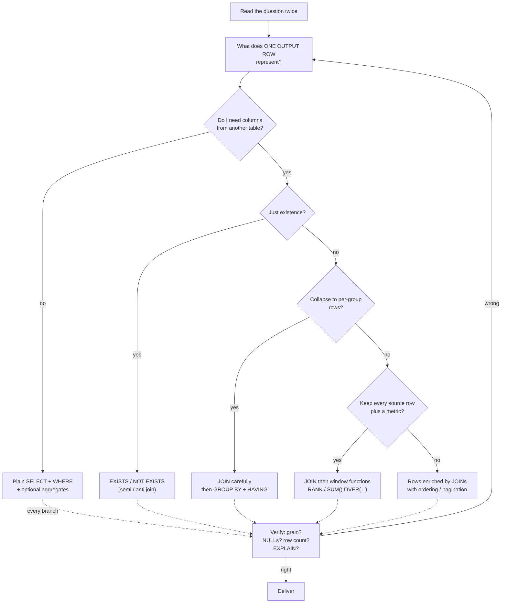

# 103. SQL Problem-Solving Framework

> Category: 12-Interview-and-Scenarios
> Cross-references: [06-Logical-Query-Processing-Empty target file confirmed. Now I'll write the comprehensive section following the handbook's conventions.
Section `103-SQL-Problem-Solving-Framework.md` written (1344 lines) to `sql-handbook/12-Interview-and-Scenarios/`.

Key content:
- **5-phase framework** (Clarify → Map → Choose → Write → Verify) with Mermaid flowcharts and the central "output grain" principle
- **17 reasoning questions** expanded with detailed guidance, labeled traps/misconceptions
- **10 worked scenarios**, each BAD → BETTER: join fan-out, one-to-many double counting, zero-match departments, `NOT IN` + NULL, top-N per group with ties, calendar zero-fill, window vs correlated subquery, LEFT-JOIN-to-INNER, timestamp boundaries, keyset pagination
- **Sample schema** (departments/employees/customers/orders/order_items/payments) with explicit grain statements, ready for output-prediction practice
- Comparison tables, NULL behavior, edge cases, production pitfalls, performance guidance (no absolute claims; all pointing to EXPLAIN verification)
- **40 interview questions** across all 8 requested categories, unanswered for practice

Database-specific differences (generate_series, OFFSET/FETCH, ONLY_FULL_GROUP_BY, NULL ordering, timezones) and cross-references to other sections included throughout.
n-aggregate](#scenario-2--fan-out-in-a-join-then-aggregate)
- [Scenario 3 — Departments with no revenue (zero matching rows)](#scenario-3--departments-with-no-revenue-zero-matching-rows)
- [Scenario 4 — "Never" questions: NOT IN vs NOT EXISTS](#scenario-4--never-questions-not-in-vs-not-exists)
- [Scenario 5 — Top-N per group](#scenario-5--top-n-per-group)
- [Scenario 6 — Days with zero orders (calendar fill)](#scenario-6--days-with-zero-orders-calendar-fill)
- [Scenario 7 — Each employee vs department average](#scenario-7--each-employee-vs-department-average)
- [Scenario 8 — The LEFT JOIN that became an INNER JOIN](#scenario-8--the-left-join-that-became-an-inner-join)
- [Scenario 9 — Timestamp "last 30 days" boundary trap](#scenario-9--timestamp-last-30-days-boundary-trap)
- [Scenario 10 — Pagination: OFFSET vs keyset](#scenario-10--pagination-offset-vs-keyset)
- [Strategy selection table](#strategy-selection-table)
- [NULL behavior in the framework](#null-behavior-in-the-framework)
- [Common mistakes](#common-mistakes)
- [Edge cases](#edge-cases)
- [Production pitfalls](#production-pitfalls)
- [Performance implications](#performance-implications)
- [Comparison tables](#comparison-tables)
- [Best practices](#best-practices)
- [Mermaid: the full decision flow](#mermaid-the-full-decision-flow)
- [Interview Questions](#interview-questions)

---

## What this section is

Every other section in this handbook teaches a **specific SQL concept**: JOINs, GROUP BY, window functions, indexes.

This section teaches you **how to get the answer at all** — a repeatable mental process that turns a human-language question into a correct, efficient SQL query.

The hard part of SQL is rarely syntax. The hard parts are:

1. **Translation** — "find the second-highest salary per department" is not a keyword problem; it is a *meaning* problem.
2. **Verification** — the database will happily return a *wrong* answer with a success status, no error, and no warning.

> **The central idea of this section:**
> Every SQL query — read, insert, update, delete — produces an output at a specific **grain** (what one output row represents). Almost every wrong SQL query is a mismatch between **the grain the question demands** and **the grain the query actually produces**.
>
> If you can state the output grain before you type a keyword, you will write correct queries. If you cannot state it, you are guessing.

This framework is not magic or memorization. It is the *same decision sequence* a senior SQL developer runs through — made explicit so you can practice it.

---

## The single most important idea: output grain

"Grain" answers the question: **what is one row in this result?**

Some examples:

| Statement in the question | What one output row must mean |
| ------------------------- | ----------------------------- |
| "total revenue per customer" | one row per customer |
| "list orders with customer names" | one row per order |
| "find customers who never ordered" | one row per customer |
| "monthly revenue" | one row per month |
| "top 3 vendors by sales, with their sales" | one row per vendor (filtered to top 3) |
| "show revenue and number of items per order" | one row per order |
| "compare each employee's salary to the department average" | one row per employee |

The same statement applies to every **table you read**:

| Table | What ONE ROW in this table means |
| ----- | -------------------------------- |
| `employees` | one employee |
| `orders` | one order |
| `order_items` | one line item within an order |
| `payments` | one payment (an order can have several) |

Most grain mismatches show up in two very common ways:

- **Fan-out / duplication** — joining a one-to-many table inflated the row count before you aggregated. See [21-JOIN-Duplicates-and-Fanout].
- **Over-collapsing** — you grouped at too fine or too coarse a level, or you removed rows you needed because a join dropped non-matching ones.

The framework's job is to make you check grain **before** writing, not after a wrong result.

---

## The framework: five phases



Phase 5 is not optional decoration. Checking result shape against expectation is where professionals catch the bugs that beginners miss.

> **Production pitfall:** step 5 is exactly where "it returned rows, therefore it is correct" thinking kills production dashboards. A wrong SQL query returns rows, commits, and ships. The verification step is humans-only; the database never checks your intent.

---

## Phase 1 — Clarify the question

Read the question three times. Underline the **verbs**, **nouns**, and **qualifiers**.

Verbs and their hint:

| Verb / phrase in the question | Hint |
| ----------------------------- | ---- |
| "count", "how many" | COUNT / aggregation |
| "total", "sum", "amount" | SUM / SUM over group |
| "average", "mean" | AVG |
| "first", "last", "latest", "earliest" | ROW_NUMBER / rank by date, or MIN/MAX depending on grain |
| "per", "for each", "by" | there is a grouping dimension |
| "who/which...never", "does not have" | NOT EXISTS / anti-join |
| "only", "at least", "more than X" | HAVING or WHERE, depending on granularity |
| "top N", "highest", "lowest" | window RANK, or ORDER BY + LIMIT at global level |
| "compare to previous", "change from last" | LAG / LEAD |
| "running", "cumulative" | SUM() OVER (ORDER BY ...) |

Ask clarifying questions if you are allowed to (interviews and real-world tickets are not precise):

- "One row per X?" — confirm the output grain in your own words.
- "Should X be included if Y is 0?" — confirms whether you need a LEFT JOIN vs INNER JOIN.
- "Across which period?" — date boundaries.
- "Is 'biggest' measured by count or by sum?" — metric definition.

If you cannot restate the question back as: **"give me one row per ____ showing ____, filtered to ____, ordered by ____"** then you are not ready to write SQL.

---

## Phase 2 — Map to the schema

For each piece of information the question needs, find the table that holds it, and note that table's grain and keys.

| Question fragment | Table | Grain | How to reach it |
| ----------------- | ----- | ----- | --------------- |
| "revenue per customer" | `orders` | one order | SUM(`total`) GROUP BY `customer_id` |
| "customer name" | `customers` | one customer | JOIN customers ON ... |
| "line items per order" | `order_items` | one item | count/join one-to-many — **watch for fan-out** |
| "employee's department" | `departments` | one department | JOIN via `dept_id` |
| "payments for an order" | `payments` | one payment | one-to-many — **watch for fan-out** |

Draw the relationships. A small sketch prevents most cardinality mistakes:



For each relationship, note whether navigation is **one-to-one**, **one-to-many**, or **many-to-many**. This table matters more than the columns:

| Relationship | Consequence if you JOIN without thought |
| ------------ | --------------------------------------- |
| one-to-one | no duplication (but verify PK/FK uniqueness) |
| one-to-many | **fan-out**: parent rows multiply by child rows |
| many-to-many | **fan-out** unless you join through the junction table correctly |

> **Interview trap:** interviewers deliberately construct schemas where the "obvious" JOIN fans rows out. The tell is a one-to-many relationship in the join path. The antidote is always the same: *state the grain before joining*.

---

## Phase 3 — Choose the strategy

Use the decision table below. The idea is to map the **meaning** of the question to an **SQL construct**, instead of pattern-matching keywords.

| What the question needs | Canonical construct | When this is NOT the right first choice |
| ----------------------- | ------------------- | --------------------------------------- |
| Rows from one table, filtered | `SELECT ... FROM t WHERE ...` | need lookup from other tables |
| Rows enriched with another table's columns | `JOIN` (usually INNER first; LEFT when preserving left rows) | only need to know existence → `EXISTS` |
| "Does a matching row exist?" | `EXISTS` / `NOT EXISTS` (semi/anti join) | actually need columns or counts from the other table |
| "in this list of values" | `IN` / `NOT IN` | values come from the data and NULLs are possible → `EXISTS` |
| Aggregate the whole result | `COUNT/SUM/AVG ...` without GROUP BY | need per-group rows → add GROUP BY |
| Aggregate per group | `GROUP BY`, then `HAVING` to filter groups | need to keep individual rows → window function |
| One row per source row, metric alongside | window function (`SUM() OVER (PARTITION BY ...)`) | "by X" actually means "collapse into X" → `GROUP BY` |
| Rank / number rows inside groups | `ROW_NUMBER()`, `RANK()`, `DENSE_RANK()` over partitions | global top N → `ORDER BY ... LIMIT` |
| First/last row per group | `ROW_NUMBER() OVER (PARTITION BY ... ORDER BY date DESC)` then filter | need *any* row, not a specific one |
| Previous/next row's value | `LAG()` / `LEAD()` | need value from a different key's row → self join |
| Compare group totals to another group | `GROUP BY` + `HAVING`, or window over partition | — |
| Union of two queries | `UNION ALL` (dedupe only if required → `UNION`) | results are joins, not separate result sets |
| Row exists in A not B | `NOT EXISTS` (anti-join) | NULLs present → `NOT IN` is unsafe |
| Page of results | keyset pagination for large sets; OFFSET only for small/throwaway | huge offsets |
| Zero-filled time series | calendar/generate_series LEFT JOIN to aggregates | — |

> **Remember:** do not make absolute performance claims. `EXISTS` is not "always faster" than `IN`, and a join is not "always faster" than a correlated subquery. The optimizer may rewrite them identically. What IS always true is *semantic*: `EXISTS`/`NOT EXISTS` are safe with NULLs, `IN`/`NOT IN` are not. See [30-IN-vs-EXISTS] and [31-NOT-IN-vs-NOT-EXISTS].

---

## Phase 4 — Write the query

Work in **logical** execution order (not the order you type). The logical order of a SELECT is:

```
FROM                        -- start with sources, decide join type
  JOIN ... ON ...           -- join keys; conditions that affect "which rows match" go in ON
WHERE                       -- row-level filter (before grouping)
GROUP BY                    -- collapse rows into groups
HAVING                      -- filter groups (after aggregation)
SELECT                      -- compute expressions / aggregates / windows
  window functions          -- computed after grouping, before DISTINCT
DISTINCT
ORDER BY
LIMIT / OFFSET
```

This order is logical, not how it physically executes — the engine optimizes freely — but writing in this order prevents most errors. See [06-Logical-Query-Processing-Order].

A useful skeleton you can always start from:

```sql
SELECT                              -- 6. what one output row must contain
FROM    source_and_joins            -- 1. driving table + joins
WHERE   row_filters                 -- 2. restrict source rows
GROUP BY grouping_columns           -- 3. only if output is per group
HAVING  group_filters               -- 4. filter groups
ORDER BY ordering                   -- 7. stable, deterministic order
LIMIT   n;                          -- 8. only if asked
```

If your query does not need to *collapse* rows, then `GROUP BY` does not belong. If your query does not need *other tables' columns*, a join probably does not belong — consider `EXISTS`.

---

## Phase 5 — Verify

Run a mental and, when possible, an actual check:

**Row-count sanity**

```sql
-- Before: how many distinct customers exist?
SELECT COUNT(*) FROM customers;                -- 6
SELECT COUNT(DISTINCT customer_id) FROM orders; -- how many have ordered at least once

-- After: your "per customer" result should be ≤ number of customers,
-- and equal to the number of customers you expect in the result.
```

**Known-row spot check.** Pick one group from your data and hand-compute its expected value; confirm the query matches.

**Grain check.**

| Question | Answer |
| -------- | ------ |
| Is the number of output rows the number the question implies? | e.g. "per customer" → ≤ #customers |
| Did any join multiply rows? | compare to `SELECT COUNT(*)` of the driver alone |
| Did I drop rows that should be present? | LEFT JOIN question, NULL matches, `NOT IN` with NULLs |

**EXPLAIN.** For anything non-trivial:

```sql
EXPLAIN ANALYZE SELECT ...;   -- PostgreSQL
EXPLAIN         SELECT ...;   -- most others, or EXPLAIN ANALYZE
```

Confirm the plan shows expected access patterns (indexes used, no surprise full scan, no accidental Cartesian join, correct join order). See [78-EXPLAIN-Execution-Plans].

---

## The 17 reasoning questions, expanded

The framework's sharpest form is this checklist. Run it on every problem — especially the ones that feel easy.

### 1. What does one output row represent?

The master question. Everything else is in service of this. Example: "total sales per product in January" → one row per **product**, for **January only**.

### 2. What is the grain of each table?

State it out loud: "one row in `order_items` is one item of one order." This prevents you from counting `order_items` rows and calling them orders.

| Table | Grain | Danger if ignored |
| ----- | ----- | ----------------- |
| `orders` | one order | counting per order mistakenly counts per item |
| `order_items` | one item | "number of orders" accidentally becomes "number of items" |
| `payments` | one payment | an order with 2 payments inflates order JOINs |

### 3. Which table is the driving table?

The table whose rows you want to **keep** is the driver (the FROM table in a LEFT JOIN, the "for each X" subject).

- "List all departments, even with no employees" → `departments` is the driver.
- "Revenue per customer" → rows keyed by customer; `orders` holds the revenue → `orders` is the source of measure; `customers` is looked up.
- "Employees and their managers" → `employees` again (self JOIN).

### 4. Do I need columns from another table?

- Yes, actual columns → JOIN.
- No, only "does the row have any related rows" → `EXISTS` (semi-join).

> **Common misconception:** "I need the department's name, so I must join employees to departments." True. "I need to find employees whose department is in Operations" could be done either way, but if you don't *return* any department column, `EXISTS` against a filtered subquery is often cleaner and avoids fan-out. Verify with the plan.

### 5. Do I only need to know whether a row exists?

Then you need a **semi-join** (`EXISTS`/`IN`) or an **anti-join** (`NOT EXISTS`). You do *not* need a JOIN that returns detail rows.

> **Interview trap:** "Find customers with at least one order above $500, without listing the orders." The instant you reach for a JOIN, you now have N rows per qualifying customer. If your output grain is per customer, a `WHERE EXISTS(...)` (or `IN`) is the correct shape.

### 6. Can the JOIN create duplicates?

Yes, whenever the right side is one-to-many, or when the join key is not unique on either side. If the answer must be per-left-row, you must dedupe or pre-aggregate — see Scenario 2.

### 7. Do I need aggregation?

"Total, count, average, max, min, first, last" **over a set of rows** → aggregate. The exact function depends on the metric and grain.

### 8. Do I need to preserve individual rows?

If the output must keep one row per source row *and also* carry a group metric → **window functions**, not `GROUP BY`. If output collapses to one row per group → `GROUP BY`.

See [56-Window-vs-GROUP-BY].

| Need | Construct |
| ---- | --------- |
| one row per employee + department average | `AVG() OVER (PARTITION BY dept_id)` |
| one row per department with its average | `GROUP BY dept_id` |

### 9. Do I need a window function?

Signals:

- rank/row number over a partition ("top N per group")
- running totals, moving averages
- previous/next value (`LAG`/`LEAD`)
- group percent without collapsing rows (`x / SUM(x) OVER (...)`)

### 10. Can NULL affect the result?

Ask specifically:

- Is the join column ever NULL? (NULL never equals NULL — that row will be dropped by INNER, orphaned by LEFT.)
- Is the measure column NULL? (SUM ignores NULL; COALESCE if you must show 0.)
- Am I using `NOT IN`/`IN` with a subquery that might return NULL? (see Scenario 4)
- `COUNT(col)` vs `COUNT(*)`: non-conversion. See [39-COUNT-NULL-Pitfalls].

### 11. Do I need WHERE or HAVING?

- `WHERE` filters **source rows before grouping** ("count only status='paid'").
- `HAVING` filters **groups after aggregation** ("only customers with 3+ orders").

The classic error: putting a group-level condition (`SUM(x) > 100`) in WHERE, or a row-level condition in HAVING. Both either error or return garbage.

### 12. Should the condition go inside ON or WHERE?

- ON: affects *which rows match each other* — contact window for JOINs.
- WHERE: filters *rows of the result* after the join.

In a LEFT JOIN, a predicate on the **right** table in WHERE turns the LEFT JOIN into an INNER JOIN (NULL rows are filtered out). See Scenario 8. Condition semantics: if it should *exclude rows that matched on the right*, it belongs in ON; if it should *exclude rows of the overall result*, it belongs in WHERE — but be sure you know which you want. See [20-JOIN-ON-vs-WHERE].

### 13. Could the query accidentally create a Cartesian product?

A missing or wrong join predicate multiplies every row by every other row. Symptom: output row count = N × M with huge, absurd totals. Always make sure every FROM/JOIN has a real join condition.

### 14. What happens when there are zero matching rows?

- INNER JOIN → row disappears.
- LEFT JOIN → left row kept, right columns NULL.
- Aggregation → the source row contributes nothing; the group may disappear unless you zero-fill (Scenario 6).
- Scalar aggregate over zero rows → returns NULL (SUM) or 0 (COUNT).

Decide *beforehand* whether missing rows must appear (LEFT JOIN / calendar fill) or must be dropped (INNER JOIN).

### 15. What happens when there are multiple matching rows?

Yes when the right key is non-unique → fan-out. Mitigations: `DISTINCT`, pre-aggregate on the child side (Scenario 2), `ROW_NUMBER` to pick one (Scenario 5), or `EXISTS` to ignore multiplicity entirely.

### 16. What indexes might help?

Then verify with the execution plan — indexes do **not** always help (see rules below).

Useful heuristics:

| Pattern | Index that may help |
| ------- | ------------------- |
| `WHERE col = ...` | single-column or composite leading with `col` |
| `WHERE a = ... AND b = ...` | composite `(a, b)` |
| `JOIN ... ON x.id = y.id` | index on `y.id` (FK columns) and PK indexes |
| `WHERE big_col LIKE 'pre%'` | prefix search — but see SARGability |
| `GROUP BY a` | via index on sorting the grouping range |
| `ORDER BY a, b` | composite support, matching direction |

Always verify with EXPLAIN. See [72-Indexes-Basics], [73-Composite-Indexes], [77-SARGability], [78-EXPLAIN-Execution-Plans].

### 17. What does the execution plan say?

The plan confirms or overturns the above guesses: which table is the driving table, whether a join is a Nested Loop / Hash / Merge, whether an index was used, and the estimated vs actual row counts (an estimate wildly different from actual usually means stale statistics). See [80-Join-Algorithms], [79-Cardinality-and-Statistics].

---

## Sample tables (used by all scenarios in this section)

Grain statements first. Every example uses these tables.

- **departments** — _one row per department._
- **employees** — _one row per employee_, each belongs to one department.
- **customers** — _one row per customer._
- **orders** — _one row per order_ placed by a customer.
- **order_items** — _one row per line item_ within an order (an order can have many items).
- **payments** — _one row per payment_ (an order can have more than one payment).

```sql
CREATE TABLE departments (
    dept_id   INT PRIMARY KEY,
    dept_name VARCHAR(50) NOT NULL
);

CREATE TABLE employees (
    employee_id  INT PRIMARY KEY,
    dept_id      INT NOT NULL REFERENCES departments(dept_id),
    employee_name VARCHAR(50) NOT NULL,
    salary       NUMERIC(10,2) NOT NULL,
    hired_date   DATE NOT NULL
);

CREATE TABLE customers (
    customer_id   INT PRIMARY KEY,
    customer_name VARCHAR(50) NOT NULL
);

CREATE TABLE orders (
    order_id    INT PRIMARY KEY,
    customer_id INT NOT NULL REFERENCES customers(customer_id),
    order_date  TIMESTAMP NOT NULL,
    total       NUMERIC(10,2) NOT NULL
);

CREATE TABLE order_items (
    item_id    INT PRIMARY KEY,
    order_id   INT NOT NULL REFERENCES orders(order_id),
    product_id INT NOT NULL,
    quantity   INT NOT NULL,
    unit_price NUMERIC(10,2) NOT NULL
);

CREATE TABLE payments (
    payment_id  INT PRIMARY KEY,
    order_id    INT NOT NULL REFERENCES orders(order_id),
    amount      NUMERIC(10,2) NOT NULL,
    paid_at     TIMESTAMP NOT NULL
);
```

Sample data.

**departments**

| dept_id | dept_name |
| ------- | --------- |
| 1       | Engineering |
| 2       | Sales      |
| 3       | Marketing  |

**employees**

| employee_id | dept_id | employee_name | salary  | hired_date |
| ----------- | ------- | ------------- | ------- | ---------- |
| 101         | 1       | Alice         | 9000    | 2020-01-10 |
| 102         | 1       | Bob           | 8000    | 2021-03-02 |
| 103         | 1       | Clara         | 8000    | 2022-07-15 |
| 104         | 2       | David         | 7000    | 2019-05-20 |
| 105         | 2       | Emma          | 6500    | 2023-02-01 |

**customers**

| customer_id | customer_name |
| ----------- | ------------- |
| 201         | Alpha Corp    |
| 202         | Beta Inc      |
| 203         | Gamma LLC     |
| 204         | Delta Ltd     |
| 205         | Epsilon Co    |

**orders**

| order_id | customer_id | order_date          | total  |
| -------- | ----------- | ------------------- | ------ |
| 1        | 201         | 2025-01-10 08:00:00 | 100.00 |
| 2        | 201         | 2025-01-12 09:30:00 | 250.00 |
| 3        | 202         | 2025-01-15 10:00:00 | 80.00  |
| 4        | 203         | 2025-01-20 11:15:00 | 400.00 |
| 5        | 203         | 2025-02-01 14:00:00 | 120.00 |
| 6        | 201         | 2025-02-10 16:00:00 | 300.00 |
| 7        | 202         | 2025-02-15 09:00:00 | 60.00  |

**order_items** (grain: one line item)

| item_id | order_id | product_id | quantity | unit_price |
| ------- | -------- | ---------- | -------- | ---------- |
| 11      | 1        | 901        | 2        | 25.00      |
| 12      | 1        | 902        | 1        | 50.00      |
| 13      | 2        | 901        | 5        | 50.00      |
| 14      | 3        | 903        | 4        | 20.00      |
| 15      | 4        | 904        | 1        | 400.00     |
| 16      | 5        | 901        | 3        | 40.00      |
| 17      | 6        | 902        | 6        | 50.00      |
| 18      | 7        | 903        | 2        | 30.00      |

**payments** (grain: one payment)

| payment_id | order_id | amount  | paid_at            |
| ---------- | -------- | ------- | ------------------ |
| 301        | 1        | 100.00  | 2025-01-10 08:05:00 |
| 302        | 2        | 250.00  | 2025-01-12 09:35:00 |
| 303        | 3        | 80.00   | 2025-01-15 10:02:00 |
| 304        | 4        | 200.00  | 2025-01-20 11:20:00 |
| 305        | 4        | 200.00  | 2025-01-22 09:00:00 |
| 306        | 5        | 120.00  | 2025-02-01 14:10:00 |
| 307        | 6        | 100.00  | 2025-02-10 16:20:00 |
| 308        | 6        | 200.00  | 2025-02-12 10:00:00 |
| 309        | 7        | 60.00   | 2025-02-15 09:05:00 |

Relevant facts to remember for later scenarios:

- Department 3 (Marketing) has **no employees**.
- Customer 204 (Delta Ltd) and 205 (Epsilon Co) have **no orders**.
- Order 4 has **two payments**; order 6 has **two payments**. One row in `payments` is NOT one row in `orders`.

---

## Worked scenarios: BAD approach → BETTER approach

Each scenario: **question → BAD approach → why it is wrong → BETTER approach → expected result → verification note.**

---

### Scenario 1 — Basic join, wrong understanding of grain

**Question:** List every order with its customer name, and the number of line items on each order.

**Output grain:** one row per **order**.

**BAD approach** — joins order_items but counts the wrong thing, or forgets the count must be per order:

```sql
-- WRONG: COUNT(*) here counts line items; also joining order_items fans out
-- orders before any aggregate is applied to the order-level data.
SELECT o.order_id, c.customer_name, COUNT(*) AS line_items
FROM   orders o
JOIN   customers c   ON c.customer_id = o.customer_id
JOIN   order_items oi ON oi.order_id = o.order_id
GROUP  BY o.order_id, c.customer_name
ORDER  BY o.order_id;
```

Why this is wrong: actually, the `line_items` count here is correct, but consider showing `o.total` too. `GROUP BY o.total` would be wrong if you also aggregate the detail grain. The real trap: if the question asked for order **total** AND item count, the join fans orders out and `SUM` computed on the joined (item-level) rows multiplies the total per item. Let's look at the version that actually breaks:

```sql
-- WRONG: after joining order_items, orders 1..7 are repeated once per item.
-- SUM(o.total) now sums the TOTAL ONCE PER ITEM → totals inflated.
SELECT o.order_id,
       c.customer_name,
       SUM(o.total)      AS total,      -- ✗ inflated!
       COUNT(oi.item_id) AS line_items
FROM   orders o
JOIN   customers c   ON c.customer_id = o.customer_id
JOIN   order_items oi ON oi.order_id = o.order_id
GROUP  BY o.order_id, c.customer_name;
```

For order 1 (two items: item 11 and 12), `SUM(o.total)` = 100 + 100 = 200 (should be 100). This is the classic **fan-out inflation**.

**BETTER approach** — do not touch `order_items` twice; the aggregate on the child side can be done once, or the order-level columns must be aggregated at order grain. Two clean variants:

```sql
-- Option A: aggregate line items separately, then join.
SELECT o.order_id,
       c.customer_name,
       o.total,
       item_counts.num_items
FROM   orders o
JOIN   customers c ON c.customer_id = o.customer_id
LEFT   JOIN (
           SELECT order_id, COUNT(*) AS num_items
           FROM   order_items
           GROUP  BY order_id
       ) item_counts ON item_counts.order_id = o.order_id
ORDER  BY o.order_id;
```

```sql
-- Option B: aggregate items inline with a window count; sum over item rows only for item data.
SELECT DISTINCT o.order_id,
                c.customer_name,
                o.total,
                COUNT(oi.item_id) OVER (PARTITION BY oi.order_id) AS num_items
FROM   orders o
JOIN   customers c   ON c.customer_id = o.customer_id
LEFT   JOIN order_items oi ON oi.order_id = o.order_id
ORDER  BY o.order_id;
```

**Expected result** (for the sample data):

| order_id | customer_name | total  | num_items |
| -------- | ------------- | ------ | --------- |
| 1        | Alpha Corp    | 100.00 | 2         |
| 2        | Alpha Corp    | 250.00 | 1         |
| 3        | Beta Inc      | 80.00  | 1         |
| 4        | Gamma LLC     | 400.00 | 1         |
| 5        | Gamma LLC     | 120.00 | 1         |
| 6        | Alpha Corp    | 300.00 | 1         |
| 7        | Beta Inc      | 60.00  | 1         |

> **Interview trap:** "Give me each order with number of items." If you add `o.total` to a naive GROUP BY over a join to order_items, your revenue numbers double. Interviewers love this because the query *runs* and *looks* right.

**Verification:** count of output rows = 7 = count of orders. Spot-check order 1 (2 line items).

---

### Scenario 2 — Fan-out in a JOIN-then-aggregate

**Question:** Total payments received per order, and whether any order is over-due.

**Output grain:** one row per **order**.

**BAD approach** — join to payments (one-to-many) and then try to keep other order-level data:

```sql
-- WRONG: an order with 2 payments produces 2 rows BEFORE aggregation,
-- so any order-level expression evaluated per row is doubled.
SELECT o.order_id,
       o.total,
       SUM(p.amount)        AS paid,    -- sums across both payments — fine
       o.total - p.amount   AS outstanding  -- ✗ NULL for multi-payment orders! p.amount is per-row
FROM   orders o
JOIN   payments p ON p.order_id = o.order_id
GROUP  BY o.order_id, o.total, p.amount;
```

Why it is wrong: `o.total - p.amount` subtracts only *one* payment per group, and multi-payment orders split into multiple output rows. Two problems: wrong grain and wrong outstanding.

**BETTER approach** — aggregate on the child (payments) side only:

```sql
SELECT o.order_id,
       o.total,
       COALESCE(payment_sum.amount_paid, 0) AS amount_paid,
       o.total - COALESCE(payment_sum.amount_paid, 0) AS outstanding
FROM   orders o
LEFT   JOIN (
           SELECT order_id, SUM(amount) AS amount_paid
           FROM   payments
           GROUP  BY order_id
       ) payment_sum ON payment_sum.order_id = o.order_id
ORDER  BY o.order_id;
```

Order 4 had 2 payments of 200 → `amount_paid` = 400, outstanding 0. Order 1: paid 100, outstanding 0.

| order_id | total  | amount_paid | outstanding |
| -------- | ------ | ----------- | ----------- |
| 1        | 100.00 | 100.00      | 0.00        |
| 2        | 250.00 | 250.00      | 0.00        |
| 3        | 80.00  | 80.00       | 0.00        |
| 4        | 400.00 | 400.00      | 0.00        |
| 5        | 120.00 | 120.00      | 0.00        |
| 6        | 300.00 | 300.00      | 0.00        |
| 7        | 60.00  | 60.00       | 0.00        |

(The sample data happens to be fully paid. Use order 6 with partial payment in your own test to see `outstanding` = 100.)

> **Common misconception:** "JOINs and aggregates are two independent things." In fact, `JOIN` runs **before** `GROUP BY` logically, so any one-to-many join multiplies rows before aggregation. Aggregating the child side *inside a subquery* stays at the correct grain.

---

### Scenario 3 — Departments with no revenue (zero matching rows)

**Question:** For each department, how many employees does it have? Every department should appear, even Marketing (which has 0 employees).

**Output grain:** one row per **department**.

**BAD approach** — INNER JOIN drops departments without employees:

```sql
-- WRONG: Marketing disappears from the output entirely.
SELECT d.dept_id, d.dept_name, COUNT(e.employee_id) AS headcount
FROM   departments d
JOIN   employees e ON e.dept_id = d.dept_id
GROUP  BY d.dept_id, d.dept_name;
```

**BETTER approach** — LEFT JOIN and count a column that is NULL for non-matching:

```sql
SELECT d.dept_id, d.dept_name, COUNT(e.employee_id) AS headcount
FROM   departments d
LEFT   JOIN employees e ON e.dept_id = d.dept_id
GROUP  BY d.dept_id, d.dept_name
ORDER  BY d.dept_id;
```

| dept_id | dept_name | headcount |
| ------- | --------- | --------- |
| 1       | Engineering | 3 |
| 2       | Sales      | 2 |
| 3       | Marketing  | 0 |

Key detail: `COUNT(e.employee_id)` — that *column* is NULL for Marketing's lone NULL employee row, and COUNT(column) skips NULLs. `COUNT(*)` would count the NULL-joined row and wrongly report 1.

> **Common misconception — "COUNT(*) is always better."** It is better for its job (count source rows), but over a LEFT JOIN it counts your NULL filler row. Choose `COUNT(column_from_right)` when you want "number of real matches." See [39-COUNT-NULL-Pitfalls].

> **Interview trap:** changing `INNER JOIN` to `LEFT JOIN` without changing `COUNT(*)` to `COUNT(right.key)` swaps a "missing department" bug for a "phantom +1" bug.

---

### Scenario 4 — "Never" questions: NOT IN vs NOT EXISTS

**Question:** Customers who have **never** placed an order.

**Output grain:** one row per **customer**.

**BAD approach** — blindly using `NOT IN`:

```sql
-- WRONG IF orders.customer_id can be NULL: subquery contains NULL →
-- whole NOT IN yields "neither true nor false" → zero rows. Silent.
SELECT customer_id, customer_name
FROM   customers
WHERE  customer_id NOT IN (SELECT customer_id FROM orders);
```

Why it is wrong: three-valued logic. `x NOT IN (2, 3, NULL)` evaluates every row to UNKNOWN (because `x <> NULL` is UNKNOWN), and WHERE keeps only TRUE rows → **empty result**. In our data there are no NULLs, so this *works*, which makes it even more dangerous — it hides until a NULL appears. See [10-Three-Valued-Logic], [14-NOT-IN-NULL-Pitfalls].

**BETTER approach** — `NOT EXISTS` (anti-join):

```sql
SELECT c.customer_id, c.customer_name
FROM   customers c
WHERE  NOT EXISTS (
           SELECT 1
           FROM   orders o
           WHERE  o.customer_id = c.customer_id
       );
```

| customer_id | customer_name |
| ----------- | ------------- |
| 204         | Delta Ltd     |
| 205         | Epsilon Co    |

Why this is the choice: `NOT EXISTS` is a row-level anti-join and is immune to NULLs in the correlation column. Cross-reference [23-Anti-Joins], [24-Semi-Joins].

> **Performance note:** whether `NOT EXISTS` is faster than `NOT IN` depends on the optimizer, indexes, statistics, and plan shape; do not claim it is "always faster." But `NOT EXISTS`'s *correctness* with NULLs is unconditional. Distinguish "semantically safe" from "measured faster."

---

### Scenario 5 — Top-N per group

**Question:** The **top 2 highest-paid employees per department**, including ties (two employees with the same salary should both show).

**Output grain:** one row per **employee** (only the top-2-per-department employees).

**BAD approach** — global sort + LIMIT, or filter in WHERE:

```sql
-- WRONG: not per department; LIMIT 2 gives the top two across the whole company.
SELECT employee_id, employee_name, salary, dept_id
FROM   employees
ORDER  BY salary DESC
LIMIT  2;
```

```sql
-- WRONG: window functions run AFTER WHERE, so you cannot filter a rank in WHERE.
SELECT employee_id, employee_name, salary, dept_id
FROM   employees
WHERE  ROW_NUMBER() OVER (PARTITION BY dept_id ORDER BY salary DESC) <= 2;
-- Most engines: ERROR — window functions not allowed in WHERE.
```

**BETTER approach** — window function in a subquery/CTE, filter in the outer query:

```sql
WITH ranked AS (
    SELECT employee_id, employee_name, salary, dept_id,
           DENSE_RANK() OVER (PARTITION BY dept_id ORDER BY salary DESC) AS rnk
    FROM   employees
)
SELECT employee_id, employee_name, salary, dept_id
FROM   ranked
WHERE  rnk <= 2
ORDER  BY dept_id, salary DESC;
```

Why `DENSE_RANK` and not `ROW_NUMBER`: the question says "including ties." Two 8000 salaries in Engineering should both rank 2. `ROW_NUMBER` would arbitrarily pick one. If the question says "pick exactly one even if tied," use `ROW_NUMBER`. See [47-RANK-vs-DENSE-RANK].

**Expected result:**

| employee_id | employee_name | salary | dept_id |
| ----------- | ------------- | ------ | ------- |
| 101         | Alice         | 9000   | 1       |
| 102         | Bob           | 8000   | 1       |
| 103         | Clara         | 8000   | 1       |
| 104         | David         | 7000   | 2       |
| 105         | Emma          | 6500   | 2       |

Engineering has a three-way tie effect: rank sequence is 9000→1, 8000→2 (both), so exactly 3 rows qualify for "top 2 with ties."

> **Interview trap:** job listing says "top 3" but does not say whether ties are included. Ask. If you cannot ask, `DENSE_RANK` (keeps ties) is usually safer in interviews; many interviewers literally want to see you *mention* the ambiguity.

To also show department names, join `departments` in the outer query (or in the CTE) — the window is untouched:

```sql
WITH ranked AS (
    SELECT e.employee_id, e.employee_name, e.salary, e.dept_id,
           DENSE_RANK() OVER (PARTITION BY e.dept_id ORDER BY e.salary DESC) AS rnk
    FROM   employees e
)
SELECT r.employee_id, r.employee_name, r.salary, d.dept_name
FROM   ranked r
JOIN   departments d ON d.dept_id = r.dept_id
WHERE  r.rnk <= 2
ORDER  BY d.dept_id, r.salary DESC;
```

See [06-Window-Functions] cross-references: [46-ROW-NUMBER], [47-RANK-vs-DENSE-RANK], [53-Top-N-Per-Group], [54-Latest-Row-Per-Group].

---

### Scenario 6 — Days with zero orders (calendar fill)

**Question:** Revenue per day for the first 7 days of January 2025 (2025-01-01 through 2025-01-07). Days with no orders must appear as 0.

**Output grain:** one row per **day**.

**BAD approach** — aggregate directly:

```sql
-- WRONG: days with no orders simply do not appear.
SELECT DATE(order_date) AS day, SUM(total) AS revenue
FROM   orders
WHERE  order_date >= '2025-01-01'
  AND  order_date <  '2025-01-08'
GROUP  BY DATE(order_date);
```

Returns only Jan 10, 12, 15, 20 rows (from filters it returns Jan rows in data)... actually with the 1–7 window the sample data has no orders at all, so it returns **zero rows**. Still wrong shape.

**BETTER approach** — generate the calendar, LEFT JOIN aggregates to it. PostgreSQL with `generate_series`:

```sql
SELECT cal.day::date                                  AS day,
       COALESCE(daily.revenue, 0)                     AS revenue
FROM   generate_series('2025-01-01'::date,
                       '2025-01-07'::date,
                       INTERVAL '1 day') AS cal(day)
LEFT   JOIN (
           SELECT DATE(order_date) AS order_day, SUM(total) AS revenue
           FROM   orders
           WHERE  order_date >= '2025-01-01'
             AND  order_date <  '2025-01-08'
           GROUP  BY DATE(order_date)
       ) daily ON daily.order_day = cal.day::date
ORDER  BY day;
```

Expected result (all 7 rows, the ones with no data filled to 0):

| day        | revenue |
| ---------- | ------- |
| 2025-01-01 | 0.00    |
| 2025-01-02 | 0.00    |
| ...        | ...     |
| 2025-01-07 | 0.00    |

> **Database-specific:** the calendar generator differs per engine.
>
> - PostgreSQL: `generate_series(...)` (table-returning function).
> - MySQL: a `WITH RECURSIVE` CTE can synthesize the date list (see [34-Recursive-CTEs]), or a pre-built `numbers`/`calendar` table.
> - SQL Server: `WITH cte AS (...) SELECT top ...` recursive CTE, or a calendar table.
> - Oracle: `CONNECT BY LEVEL <= 7` with `LEVEL`.
>
> A permanent **calendar table** (or date dimension) is the portable, production-friendly answer for any engine. See [61-Monthly-Daily-Reporting] and [34-Recursive-CTEs].

> **Interview trap:** "fill missing dates" questions exist precisely to test whether you know zero-match rows need explicit fabrication and LEFT JOINs — not that they appear magically.

---

### Scenario 7 — Each employee vs department average

**Question:** Show every employee, their salary, and their department's average salary. Compare the two.

**Output grain:** one row per **employee**.

**BAD approach** — two queries plus a scalar subquery in SELECT that re-sums per row (and risks being wrong if dept is NULL):

```sql
-- Slow-ish pattern: correlated subquery recomputes the average for every row.
-- Correct, but smells; for 3 million employees the average is computed 3M times.
SELECT e.employee_id, e.employee_name, e.salary,
       E.dept_id,
       (SELECT AVG(salary) FROM employees x WHERE x.dept_id = e.dept_id)
           AS dept_avg
FROM   employees e;
```

**BETTER approach** — window function (one scan, no per-row subquery):

```sql
SELECT employee_id, employee_name, salary, dept_id,
       AVG(salary) OVER (PARTITION BY dept_id) AS dept_avg,
       salary - AVG(salary) OVER (PARTITION BY dept_id) AS gap_to_avg
FROM   employees
ORDER  BY dept_id, salary DESC;
```

| employee_id | employee_name | salary | dept_id | dept_avg | gap_to_avg |
| ----------- | ------------- | ------ | ------- | -------- | ---------- |
| 101         | Alice         | 9000   | 1       | 8333.33  | 666.67     |
| 102         | Bob           | 8000   | 1       | 8333.33  | -333.33    |
| 103         | Clara         | 8000   | 1       | 8333.33  | -333.33    |
| 104         | David         | 7000   | 2       | 6750.00  | 250.00     |
| 105         | Emma          | 6500   | 2       | 6750.00  | -250.00    |

Why window: output keeps **all** employee rows *and* carries a group metric — that is exactly what window functions are for, and what GROUP BY cannot do (GROUP BY would collapse employees). See [56-Window-vs-GROUP-BY].

> **Performance note:** whether the correlated subquery or the window is faster depends on the engine, indexes, statistics, and plan shape. A window with a sort is usually a clean one-pass plan, but verify with EXPLAIN. Do not claim it is always faster.

---

### Scenario 8 — The LEFT JOIN that became an INNER JOIN

**Question:** All customers and the total they have ordered. Customers with no orders must still appear with total 0.

**Output grain:** one row per **customer** (including zero-order customers).

**BAD approach** — filter on the right-hand table in WHERE:

```sql
-- WRONG: e.customer... WHERE on the RIGHT table converts LEFT JOIN to INNER JOIN.
SELECT c.customer_id, c.customer_name, COALESCE(SUM(o.total), 0) AS total
FROM   customers c
LEFT   JOIN orders o ON o.customer_id = c.customer_id
WHERE  c.customer_id IS NOT NULL     -- harmless here, but:
AND    o.customer_id IS NOT NULL;     -- ✗ drops NULL-joined rows → Delta/Epsilon vanish
```

Why it is wrong: after the LEFT JOIN, Delta and Epsilon have all `o.*` NULL. `o.customer_id IS NOT NULL` is FALSE (UNKNOWN) for those rows → WHERE removes them → the very customers you wanted are gone.

**BETTER approach**:

```sql
SELECT c.customer_id, c.customer_name, COALESCE(SUM(o.total), 0) AS total
FROM   customers c
LEFT   JOIN orders o ON o.customer_id = c.customer_id
GROUP  BY c.customer_id, c.customer_name
ORDER  BY c.customer_id;
```

| customer_id | customer_name | total   |
| ----------- | ------------- | ------- |
| 201         | Alpha Corp    | 650.00  |
| 202         | Beta Inc      | 140.00  |
| 203         | Gamma LLC     | 520.00  |
| 204         | Delta Ltd     | 0.00    |
| 205         | Epsilon Co    | 0.00    |

Rule: any predicate on the **preserved** (right) side of a LEFT JOIN that excludes NULLs belongs outside WHERE. If it must exclude the NULL-joined rows, you wanted an INNER JOIN all along. See [16-LEFT-JOIN], [20-JOIN-ON-vs-WHERE].

> **Interview trap:** "List all customers with at least $1000 in orders" is INNER JOIN territory (or HAVING). "List all customers, showing 0 if none" is LEFT JOIN + COALESCE territory. The trap question is usually worded so both readings are possible — confirm which.

---

### Scenario 9 — Timestamp "last 30 days" boundary trap

**Question:** Count of orders in the **last 30 days** as of 2025-01-20 00:00:00.

**Output grain:** a single scalar (one row, one column).

**BAD approach** — naive bound inclusion:

```sql
-- WRONG: order_date is a TIMESTAMP. subtracting 30 days from a date gives a whole day,
-- and '>= ... - 30' includes the entire boundary day; worse, comparing a TIMESTAMP
-- to a bare date may use the local 00:00:00 cutoff.
SELECT COUNT(*)
FROM   orders
WHERE  order_date >= '2025-01-20' - INTERVAL '30 days';
```

Two boundary issues:

1. **Exclusive vs inclusive window.** "Last 30 days" usually means `[now - 30 days, now)` — exclude exactly `now` — or `(now - 30d, now]` depending on definition. Pick one and use `<` on the upper bound.
2. **Timestamp truncation.** Comparing a `TIMESTAMP` column against `'2025-01-20'` in some engines implicitly casts the date to `midnight`, silently dropping all orders after midnight on the boundary day.

**BETTER approach** — explicit, half-open window:

```sql
SELECT COUNT(*) AS orders_last_30_days
FROM   orders
WHERE  order_date >= TIMESTAMP '2025-01-20 00:00:00' - INTERVAL '30 days'
  AND  order_date <  TIMESTAMP '2025-01-20 00:00:00';
```

Step back and check against sample data: orders on Jan 10, 12, 15, 20 in January (within 30 days of Jan 20): orders 1,2,3,4 → 4 orders. Orders from February are > Jan 20 → excluded.

> **Interview trap:** flipping between `>=`/`<=` and `> current - 30d` when the interviewer says "last 30 days" is a veteran move. Always state the window: "[now-30d, now)".
>
> **Time zones.** "As of 2025-01-20" in which time zone? Database timestamps, `AT TIME ZONE`, and the caller's local time all differ (PostgreSQL vs MySQL vs SQL Server vs Oracle). Cross-reference [57-Date-Time-Basics], [59-Timestamp-Filtering], [60-Timezone-Pitfalls].

---

### Scenario 10 — Pagination: OFFSET vs keyset

**Question:** Fetch orders one page at a time, 3 per page, newest first. Stable order even when new rows arrive.

**BAD approach** — deep OFFSET:

```sql
SELECT order_id, order_date, total
FROM   orders
ORDER  BY order_date DESC, order_id DESC
LIMIT  3 OFFSET 60;   -- skips 60 rows each time — the DB still scans & discards them
```

Problems: (a) each page re-scans and discards `OFFSET` rows — cost grows with page depth; (b) if a *new* order is inserted between page loads, the offset window shifts and rows get **skipped or duplicated**.

**BETTER approach** — keyset (cursor / seek) pagination. Page 1:

```sql
SELECT order_id, order_date, total
FROM   orders
ORDER  BY order_date DESC, order_id DESC
LIMIT  3;               -- or FETCH NEXT 3 ROWS ONLY in SQL Server / Oracle
```

Page 2 — pass the last seen `(order_date, order_id)`:

```sql
SELECT order_id, order_date, total
FROM   orders
WHERE  (order_date < '2025-02-15 09:00:00')
   OR  (order_date = '2025-02-15 09:00:00' AND order_id < 7)
ORDER  BY order_date DESC, order_id DESC
LIMIT  3;
```

The tiebreaker column matters: ORDER BY date alone is ambiguous if two rows share a date. Always include a unique tiebreaker (the PK). See [84-Pagination-and-Keyset-Pagination].

> **Production pitfall:** deep OFFSET pagination is one of the most common production perf bugs — it is O(offset) per page. Keyset pagination keeps each access O(page size) with the right index `(order_date DESC, order_id DESC)`.

---

## Strategy selection table

| Question type (restated) | Construct | Cross-ref |
| ------------------------ | --------- | --------- |
| "Rows of X, no other data needed" | plain SELECT | [05-SELECT-FROM-WHERE] |
| "Rows of X plus lookup columns" | JOIN | [15-INNER-JOIN], [16-LEFT-JOIN] |
| "All X that have at least one Y" | EXISTS / IN (semi-join) | [24-Semi-Joins], [30-IN-vs-EXISTS] |
| "All X that have no Y" | NOT EXISTS (anti-join) | [23-Anti-Joins], [31-NOT-IN-vs-NOT-EXISTS] |
| "Per X: metric" | GROUP BY | [36-GROUP-BY] |
| "Per X: metric, filtered groups" | GROUP BY + HAVING | [37-HAVING] |
| "Per X but keep every detail row" | window functions | [44-Window-Functions-Basics], [56-Window-vs-GROUP-BY] |
| "× rows of X for the same X" | SELF JOIN | [19-SELF-JOIN] |
| "breakdown across two dims" | GROUP BY GROUPING SETS / ROLLUP | [43-ROLLUP-CUBE-GROUPING-SETS] |
| "months with no data must show 0" | calendar fill + LEFT JOIN | [61-Monthly-Daily-Reporting] |
| "remove duplicates from a result" | DISTINCT (but check why duplicates exist first!) | [40-DISTINCT], [41-GROUP-BY-vs-DISTINCT] |
| "first/latest per group" | ROW_NUMBER filter | [54-Latest-Row-Per-Group] |
| "top N per group" | RANK/DENSE_RANK filter | [53-Top-N-Per-Group] |
| "cumulative / running" | window frame SUM | [49-Running-Totals] |
| "in the previous/next row" | LAG / LEAD | [48-LAG-LEAD] |

> **DISTINCT warning:** `DISTINCT` is a *symptom fix*, not a strategy. If you reach for DISTINCT, first ask *why* there are duplicates: missed join key, wrong grain, or a one-to-many join. Sometimes DISTINCT genuinely hides the real bug. See [41-GROUP-BY-vs-DISTINCT].

---

## NULL behavior in the framework

| Situation | What to remember | Construct |
| --------- | ---------------- | --------- |
| Join key is NULL | `NULL = NULL` is UNKNOWN → INNER drops it, LEFT keeps it with NULL cols | review your join key's nullability |
| Filter on a nullable column | `= 5` never matches NULL | `IS NULL` / `IS NOT NULL` explicitly |
| Metric is NULL | SUM/AVG skip NULLs, COUNT(col) skips NULLs | `COALESCE(..., 0)` for display |
| `x IN (subquery)` with NULLs in subquery | NULLs make `NOT IN` return nothing; `IN` itself skips the NULL row — semantic differences | prefer `EXISTS` |
| `x <> 5` | NULL compares to UNKNOWN → row dropped | use `IS DISTINCT FROM` for "not-equal-or-null" |
| `NOT IN` + NULL | silent empty result (Scenario 4) | use `NOT EXISTS` |
| COUNT(*) vs COUNT(col) over LEFT JOIN | filler NULLs counted by `COUNT(*)` | `COUNT(right.col)` |
| NULLIF / COALESCE | conversion and defaulting | [12-COALESCE-NULLIF] |
| ordering with NULLs | NULL default order differs by engine (PostgreSQL: NULL last ASC / first DESC; MySQL/SQL Server: NULL first ASC) | add explicit `NULLS FIRST/LAST` for portability |

Cross-references: [09-NULL-Deep-Dive], [10-Three-Valued-Logic], [11-NULL-Comparisons], [13-IS-DISTINCT-FROM], [14-NOT-IN-NULL-Pitfalls].

---

## Common mistakes

1. **Not checking grain before writing** — the number-one root cause of wrong "successful" queries.
2. **JOIN-then-aggregate fan-out** — summing a parent table's column across child rows (Scenario 2).
3. **Filtering the right side of a LEFT JOIN in WHERE** — silently converting to an INNER JOIN (Scenario 8).
4. **`NOT IN` with a nullable subquery** — returns nothing, no error (Scenario 4).
5. **`COUNT(*)` over a LEFT JOIN** — counting NULL filler rows as +1 (Scenario 3).
6. **Window functions in WHERE** — syntax error on every engine; filter in a subquery/CTE (Scenario 5).
7. **ROW_NUMBER when ties must both appear** — choose RANK/DENSE_RANK intentionally (Scenario 5).
8. **GROUP BY columns not in the group set** (non-ANSI engines like MySQL before `ONLY_FULL_GROUP_BY`) — arbitrary row values returned silently.
9. **No ORDER BY tiebreaker** — non-deterministic pagination / top-N pick.
10. **Filtering aggregates in WHERE** — group condition in the wrong clause; use HAVING.
11. **Using HAVING for row filters** — misleading, and slower: group filters can't use row-level index pre-filtering.
12. **Integer division** — `SUM(qty)/COUNT(*)` in some engines yields truncation; use `* 1.0`, cast, or `SUM(qty)/NULLIF(COUNT(*),0)` when applicable.

> **Production pitfall:** several of these (fan-out, LEFT-JOIN-to-INNER, NOT IN NULL) produce *plausible-looking* output. Wrong numbers that look right are the ones that reach production dashboards and get trusted.

---

## Edge cases

- **Empty tables.** `SELECT COUNT(*)` = 0; but `SELECT SUM(x)` returns **NULL**, not 0, for zero rows. Test: most aggregations with no input rows need COALESCE around them for display.
- **All NULL in a column.** `COUNT(col)` = 0; `AVG(col)` = NULL.
- **One-row table, group.** GROUP BY over it returns the single group — fine. But window ORDER BY ties + frames can surprise.
- **Duplicate key rows on both sides of the join.** N×M fan-out (see [21-JOIN-Duplicates-and-Fanout]).
- **Case-sensitivity.** Collation differences per engine change `'alpha' = 'Alpha'` results.
- **Trailing whitespace.** `'alpha' = 'alpha '` — often equal in SQL Server (depending on collation), unequal in PostgreSQL.
- **Floating point.** Comparing money/float for equality is fragile; prefer NUMERIC/DECIMAL and round to expected precision.
- **Self-referencing hierarchies.** Recursive CTEs, but beware cycles and infinite loops — add depth guards. See [102-Recursive-Hierarchies].
- **'now' in VR.** `CURRENT_TIMESTAMP` inside a long transaction is stable per statement; `clock_timestamp()` (PostgreSQL) is per-call — subtle test differences.
- **Zero matches for pagination.** Empty page vs last page: `LIMIT 3 OFFSET 6` on 7 rows returns 1 row — fine; but offset = 9 returns empty — make sure callers treat "empty" as "no more pages."

---

## Production pitfalls

1. **No EXPLAIN before shipping a "fast-looking" rewrite.** Rewrites like EXISTS-vs-JOIN sometimes flip the plan for the worse; measure.
2. **Offset pagination at scale.** Deep pages re-read and discard — keyset is the fix (Scenario 10).
3. **Missing FK indexes on join columns.** One-to-many child FK columns without indexes force hash/merge or nested-loop scans; index `order_items.order_id`, `payments.order_id`, `employees.dept_id`.
4. **Non-sargable filters.** `WHERE DATE(col) = '2025-01-01'` or `WHERE col + 1 = 5` blocks the index; use range predicates where possible. See [77-SARGability].
5. **Correlated subqueries in SELECT/WHERE at high volume** — check the plan for "executed per row" work; often rewritable into a window or a join.
6. **Relying on implicit cast / timezone.** Filters on TIMESTAMP vs DATE silently drift by timezone.
7. **SELECT \* in production reads.** Extra wide rows waste I/O; name the columns you need.
8. **Beware the "works on sample data" bias** — sample data sizes are tiny and constant; plans differ at production scale. Validate on realistic volumes and distribution.

---

## Performance implications

**The honest rule:** you cannot predict performance from the SQL text alone. All of these depend on the optimizer, indexes, statistics, cardinality, data distribution, query shape, engine, and execution plan:

- JOIN vs subquery vs EXISTS
- IN vs EXISTS; NOT IN vs NOT EXISTS
- CTE vs subquery vs temp table
- GROUP BY vs window functions
- whether an index actually gets used

What you *can* reason about, and should verify with `EXPLAIN` / `EXPLAIN ANALYZE`:

| Factor | Why it matters | Verify how |
| ------ | -------------- | ---------- |
| Driving table choice | determines rows flowing into the join | plan node order (top-down "first outer" side) |
| Access path per table | index scan vs bitmap vs full scan | the actual `Seq Scan`/`Index Scan` node |
| Join algorithm | Nested Loop / Hash / Merge Join | plan node type |
| Row cardinality estimates | badly-stale stats → bad choices | estimated vs actual rows deviation |
| Fan-out magnitude | N×M blowup | row count plants-against-expected |
| Sorting for GROUP BY/ORDER/window | sort memory/spill | plan shows Sort node; spills to disk pages |

Cross-references: [78-EXPLAIN-Execution-Plans], [79-Cardinality-and-Statistics], [80-Join-Algorithms], [72-Indexes-Basics], [73-Composite-Indexes], [74-Covering-Indexes], [81-Query-Rewriting], [82-Performance-Pitfalls].

> **Common misconception:** "a covering index makes every query fast." It helps specifically the queries whose columns it covers, and it costs write amplification. "EXISTS is always faster than IN." No — engines often unparse the two into the same plan. What is unconditionally true is the *NULL-safety* difference, not the speed difference.

---

## Comparison tables

### WHERE vs HAVING

| | WHERE | HAVING |
| --- | ----- | ------ |
| Fires on | source rows | groups |
| Can reference | any column of the sources | aggregated expressions / group keys |
| Uses indexes? | yes — row filters can use index | rarely direct — after aggregation |
| Example | `WHERE o.status = 'paid'` | `HAVING COUNT(*) > 2` |
| Combined | run before grouping | run after grouping |

### GROUP BY vs window functions

| | GROUP BY | window function |
| ---------- | -------- | --------------- |
| Output rows | one per group | one per source row |
| Keeps detail rows? | no | yes |
| Aggregate visibility | visible as column | visible as companion column |
| Example | dept → one row per dept | employee + dept avg per employee |
| Use when goal | collapse | keep rows, add group metric or rank |

### JOIN vs EXISTS (existence questions)

| Criterion | JOIN | EXISTS |
| --------- | ---- | ------ |
| Returns detail columns from both sides | yes | no |
| Multiplies rows on one-to-many | yes (usually a bug here) | no |
| Model | inner/outer join | semi-join |
| When to choose | need columns from the child | need only "does match exist" |

### NOT IN vs NOT EXISTS

| | NOT IN | NOT EXISTS |
| ----- | ------ | ---------- |
| NULL in subquery set | whole predicate goes UNKNOWN → no rows | unaffected |
| Semantics | value comparison | row anti-join |
| Correctness with NULLs | fragile | robust |
| Main use | constant lists of non-null values | anything with data-derived values |

Cross-reference [30-IN-vs-EXISTS], [31-NOT-IN-vs-NOT-EXISTS].

### ON vs WHERE

| | ON | WHERE |
| --- | -- | ----- |
| When applied (logically) | during the join | after the join |
| Controls | which rows pair up | which result rows survive |
| In LEFT JOIN, a right-table predicate here | keeps the NULL row | deletes the NULL row (→ INNER behavior) |

Cross-reference [20-JOIN-ON-vs-WHERE].

---

## Best practices

1. **State the output grain in one sentence before writing SQL.** "One row per customer: revenue, order count, last order date."
2. **State every input table's grain too.**
3. **Know the logical order of execution** — [06-Logical-Query-Processing-Order].
4. **Choose the driving table deliberately** — the one whose rows you must keep.
5. **Prefer `EXISTS`/`NOT EXISTS` when you only test existence**; bring in JOINs only when you need child columns.
6. **Aggregate before fan-adding joins; aggregate one table at a time** in multi-hop chains.
7. **Prefer window functions over correlated subqueries in SELECT when row count and readability matter** — then verify with EXPLAIN.
8. **Use RANK/DENSE_RANK when ties matter; ROW_NUMBER when you need exactly one per group** — and say so in comments/questions aloud.
9. **Always provide a deterministic ORDER BY (a unique tiebreaker).**
10. **Handle NULLs explicitly**: provide defaults (COALESCE), use IS [NOT] NULL for nullable columns, avoid `NOT IN`, and know `COUNT(col)` vs `COUNT(*)`.
11. **Make time filters half-open** (`>= start AND < end`) and timezone-explicit.
12. **Verify against sample data and row counts; then EXPLAIN, then EXPLAIN ANALYZE on a large copy.**
13. **Don't guess performance; measure.** Reason about indexes, dead simple: whatever filters/joins you most frequently constrain, consider indexing — then check the plan.
14. **Keep queries readable**: use CTEs for stair-step logic; name things; inline comments sparing.

---

## Mermaid: the full decision flow



---

## Interview Questions

Practice questions below. They intentionally follow the framework's phases. Do not peek until you have attempted each one.

### Beginner

1. List all employees with their department names. What grain should the result have?
2. How many employees work in each department? Which table is the driving table in your query?
3. Find all orders placed in January. What is the grain of your result?
4. What is the difference between `COUNT(*)` and `COUNT(column)` in a LEFT JOIN? Give a scenario where they differ.
5. Write a query that returns customers and the total value of their orders, including customers with no orders (total 0).

### Intermediate

6. Find employees whose salary is above the average salary of their department, showing the department average alongside.
7. Write a query to find the second-highest salary in each department.
8. Your query `SELECT d.dept_name, SUM(o.total) FROM departments d JOIN employees e ... JOIN orders o ...` returns inflated numbers. Explain why and fix it.
9. Find all customers who have placed more than 2 orders, and how many orders each placed.
10. Show a month-by-month revenue report for the last 6 months, including months with zero revenue.

### Advanced

11. Find the top 3 products by revenue per *month* for the last year, with ties for equal revenue not arbitrarily broken.
12. Compute a running total of revenue per customer, ordered by order date.
13. For each order, return the order, its line items, and the difference between an order's total and the sum of the order's line-item prices (why might they differ?).
14. Without using window functions, find the employee with the highest salary in each department (harder — self-join or not?).
15. Return one row per employee with the name of the *previous* higher-paid employee in the same department.

### Scenario Based

16. **Marketing request:** "How many users signed up last week compared to the week before, and the % change?" The `users` table has 3 rows with NULL `signup_date`. How do NULLs affect the answer, and what do you report?
17. **Bug report:** "Revenue dashboard suddenly shows 10× the expected revenue." The data has a newly introduced one-to-many relationship. Walk through your debugging steps.
18. **DBA request:** "I get a timeout when I page through 500k orders with OFFSET 400000." Explain the root cause and propose a keyset solution with a concrete query.
19. **Product:** "For each product category, what share of total company revenue does it represent, as a percentage shown next to each category row?"
20. **Compliance:** "Find any customer who was charged (payment) but has no order record" — the join key `customer_id` can be NULL in `payments`. Recommend a query and justify.

### Tricky

21. `NOT IN` returns zero rows when the subquery contains NULL. Explain exactly why (three-valued logic) and rewrite safely.
22. A `LEFT JOIN` query has a `WHERE o.customer_id IS NOT NULL` filter. Interpret what changed.
23. Why can't you use a window function (e.g. `ROW_NUMBER() <= 2`) in the WHERE clause? Where must the filter go, and why does the logical order force this?
24. `SELECT SUM(total)` over an empty table returns NULL, not 0. When does that matter in a report, and how do you make it safe?
25. In `ORDER BY order_date`, two orders share the same timestamp. What is the risk, and what is the correct fix?

### Output Prediction

For each of the following, predict the exact output against the sample data given in this section — do not run it until you have written down what you expect.

26. `SELECT dept_name, COUNT(employee_id) FROM departments d LEFT JOIN employees e ON e.dept_id = d.dept_id GROUP BY dept_name;`
27. `SELECT customer_id FROM customers WHERE customer_id NOT IN (SELECT customer_id FROM orders WHERE total > 100);`
28. `SELECT order_id, COUNT(payment_id) FROM orders LEFT JOIN payments p USING (order_id) GROUP BY order_id ORDER BY order_id;`
29. `SELECT employee_name, RANK() OVER (PARTITION BY dept_id ORDER BY salary DESC) FROM employees;` (predict the exact rank values.)
30. `SELECT dept_id, SUM(salary) FROM employees GROUP BY dept_id;` then the same with the departments LEFT JOINed — what changes in row count?

### Debugging

31. "I used `HAVING total_revenue > 1000` but `total_revenue` is an alias — it failed." Debug why and give the correct version.
32. Given a query that returns 14 rows but should return 7 (one per order), list at least four distinct causes and how you would isolate each.
33. The hourly report "orders per hour" shows hours 00:00–23:00 but the DB stores TIMESTAMP in UTC and the report is supposed to be in local time. What is wrong and what changes?
34. Explaining output: someone shows you `NOT EXISTS` that works on a staging DB but returns everything on production. What data difference can cause different (both "correct") behaviors?
35. A group-by query returns the wrong text for a non-aggregated, non-grouped column (MySQL default but not PostgreSQL). Explain `ONLY_FULL_GROUP_BY` and what PostgreSQL does differently.

### Performance

36. Your `EXPLAIN ANALYZE` shows 1.2M rows scanned for a query over a 2M-row table with an index on the filtered column. What are the possible reasons the index was not used?
37. Two identical-looking queries — one with `EXISTS`, one with `IN` — have different plans in production. Is one "always" better? How do you actually decide?
38. You rewrote a correlated subquery as a `LEFT JOIN` and it *slowed down*. Explain at least two reasons this is possible.
39. `WHERE ORDER_YEAR = 2025` (a column) vs `WHERE date_col >= '2025-01-01' AND date_col < '2026-01-01'` — why is the second version more likely to use an index? What term describes the first?
40. Design the index plan for this query and justify: `SELECT order_id, total FROM orders WHERE customer_id = ? AND order_date >= ? ORDER BY order_date DESC;` — then explain when your index would NOT help.

---

**End of Section 103 — SQL Problem-Solving Framework.**