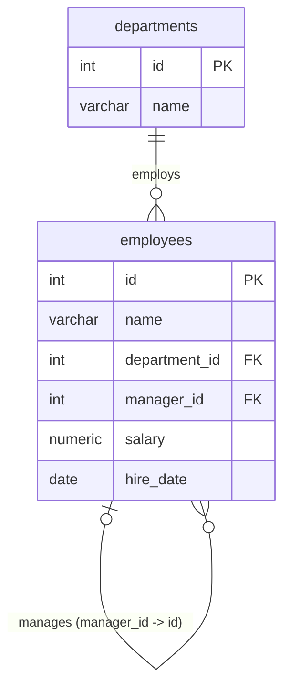
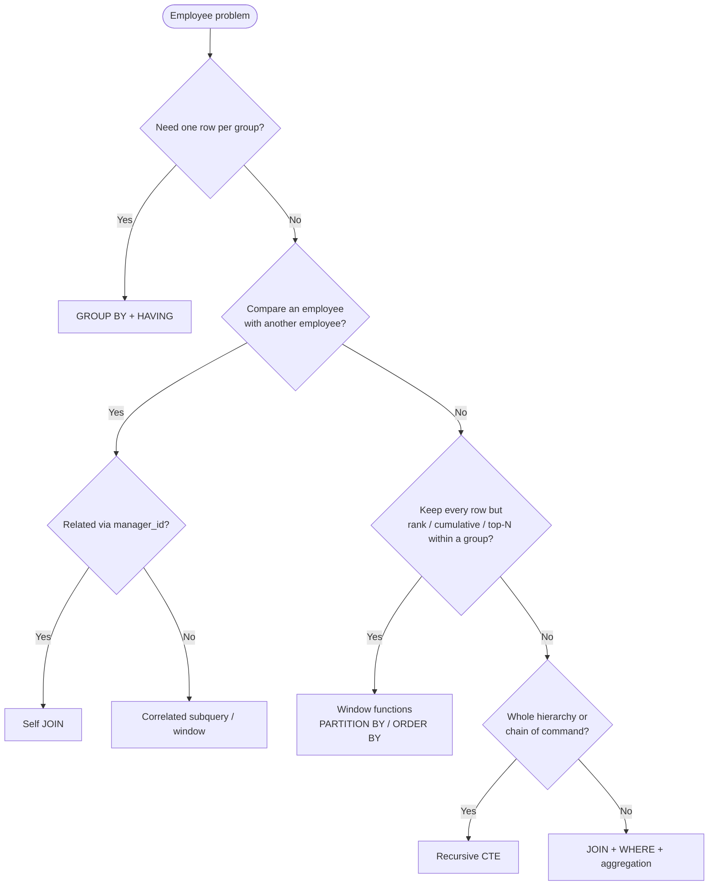

# 104-Employee-Problems

> Category: 12-Interview-and-Scenarios · Section 104

Employee problems are the single most common theme in SQL interviews and in real HR/reporting work. Almost every classic join, window, aggregation, NULL, and self-referencing pattern can be taught with one small schema:

- `employees` (one row per employee)
- `departments` (one row per department)
- possibly a child table like `project_assignments` (one row per employee–project pair)

If you master this section, you have mastered most of the join/aggregation/window content of the whole handbook. This section deliberately reuses **one fixed dataset** across every example so that expected outputs stay consistent and comparable.



---

## Fundamentals

### The schema and its grain

> **Grain** means: what does one row represent?

| Table | One row represents | Key columns |
|---|---|---|
| `departments` | one department | `id`, `name` |
| `employees` | one employee | `id`, `name`, `department_id`, `manager_id`, `salary`, `hire_date` |
| `project_assignments` (used later) | one employee **assigned to** one project | `employee_id`, `project_id` |

The two most dangerous facts about this schema:

1. `employees.manager_id` is a **self-referencing foreign key** — it points back to `employees.id`.
2. `employees.department_id` is nullable, and `manager_id` is nullable (the CEO has no manager).

These two facts produce most of the NULL traps, self-join patterns, and interview questions in this entire section.

### Setup SQL (run this once, use everywhere below)

```sql
CREATE TABLE departments (
  id   INT PRIMARY KEY,
  name VARCHAR(50) NOT NULL
);

CREATE TABLE employees (
  id            INT PRIMARY KEY,
  name          VARCHAR(50) NOT NULL,
  department_id INT          REFERENCES departments(id),
  manager_id    INT          REFERENCES employees(id),
  salary        NUMERIC(10,2) NOT NULL,
  hire_date     DATE         NOT NULL
);

INSERT INTO departments (id, name) VALUES
  (1, 'Engineering'),
  (2, 'Sales'),
  (3, 'Marketing'),
  (4, 'Finance'),
  (5, 'HR');                    -- HR has no employees on purpose

INSERT INTO employees (id, name, department_id, manager_id, salary, hire_date) VALUES
  ( 1, 'Alice', 1, NULL, 120000.00, '2020-01-15'),
  ( 2, 'Bob',   1,    1,  90000.00, '2021-03-10'),
  ( 3, 'Carol', 2,    1, 110000.00, '2019-07-22'),
  ( 4, 'David', 2,    3,  85000.00, '2022-05-01'),
  ( 5, 'Eve',   1,    2,  95000.00, '2021-11-30'),
  ( 6, 'Frank', 2,    3, 110000.00, '2018-02-14'),
  ( 7, 'Grace', 3,    1,  75000.00, '2023-09-05'),
  ( 8, 'Henry', 4,    1, 130000.00, '2020-06-11'),
  ( 9, 'Ivy',   NULL, NULL, 70000.00, '2024-01-20'),   -- no department, no manager
  (10, 'Jack',  NULL,    1,  60000.00, '2024-03-01'),  -- no department
  (11, 'Kara',  4,       8,  95000.00, '2022-08-19'),
  (12, 'Leo',   3,       1,  72000.00, '2023-02-27'),
  (13, 'Mia',   4,       8, 140000.00, '2021-04-03'),
  (14, 'Noah',  3,       1,  80000.00, '2023-12-11');
```

Facts to memorize from this data (you will need them to sanity-check outputs):

- **Highest salary overall**: Mia (140000). **Second highest**: Henry (130000). **Third**: Alice (120000).
- **Salary ties**: Carol and Frank both earn 110000 (both in Sales).
- **Employees with no department**: Ivy and Jack.
- **Department with no employees**: HR.
- **CEO**: Alice (manager_id is NULL).
- **Employees earning more than their manager**: Eve (> Bob), Henry (> Alice), Mia (> Henry). Henry often gets missed — his manager is Alice, not himself.

---

## The decision flow every employee problem follows

Before writing any query, run the reasoning checks (see the SQL Reasoning section of the handbook):



---

## Pattern 1 — Employees who earn more than their manager

### What it is
Compare each employee's `salary` against the `salary` of the row they point to via `manager_id`.

### Why it exists
This is the canonical **self-join** problem (it is LeetCode 181). It teaches aliasing a table twice and the difference between joining a table to *itself* versus to another table.

### Syntax / how it works
A self-join is a normal join where both sides are the same table under different aliases:

```sql
SELECT e.name            AS employee,
       m.name            AS manager,
       e.salary          AS employee_salary,
       m.salary          AS manager_salary
FROM   employees e
JOIN   employees m ON m.id = e.manager_id
WHERE  e.salary > m.salary
ORDER  BY e.name;
```

`JOIN employees m ON m.id = e.manager_id` says: *for every row on the left (e), find the row on the right (m) whose id equals e's manager_id.* Once two rows are paired, `e` and `m` are just two copies of the same table and you compare their columns.

### Expected result

| employee | manager | employee_salary | manager_salary |
|---|---|---|---|
| Eve | Bob | 95000.00 | 90000.00 |
| Henry | Alice | 130000.00 | 120000.00 |
| Mia | Henry | 140000.00 | 130000.00 |

Exactly three rows. All other pairs fail `e.salary > m.salary`.

> **Interview trap — who notices Henry?** Henry's manager is Alice (id 1). Henry earns 130000 > Alice's 120000, so Henry qualifies. People routinely misread the table and skip Henry.

### NULL behavior
`JOIN` is an inner join: rows are dropped when there is no match. The CEO (Alice) has `manager_id = NULL`, so `NULL = id` is never true, and Alice disappears — which is fine here because Alice has no manager to compare against. Ivy also has `manager_id NULL` and is dropped. If you *did* want to keep non-managed employees, use a `LEFT JOIN`:

```sql
SELECT e.name AS employee,
       m.name AS manager,
       e.salary AS employee_salary
FROM employees e
LEFT JOIN employees m ON m.id = e.manager_id
WHERE COALESCE(e.salary, 0) > COALESCE(m.salary, 0)
   OR m.id IS NULL;
```

(That keeps Alice and Ivy in the result, still listed as "self-employed" rows in HR terms.)

### When to use it / not
- **Use** when each row needs to be compared with its own parent row (boss, parent category, referrer, previous row in a linked list).
- **Do not use** a self-join to compare a row with the *best* or *average* of a group — that is a correlated subquery or window function, not a join.

### Common mistakes
- Forgetting the alias: `FROM employees` twice without `AS e` / `AS m` is a syntax error.
- Using two tables named `employees` in real code from copy/paste.
- Writing the join on the wrong key direction (`ON e.id = m.manager_id` gives the reverse relationship — "employees supervise Alice", which silently returns wrong data shape).
- Comparing in `WHERE` after an inner join — this is fine, but if you switch to `LEFT JOIN`, the very same `WHERE e.salary > m.salary` converts the outer join back into an inner join (rows with NULL manager fail `NULL > x`). Put such conditions in `ON` if you want outer rows preserved. See *ON vs WHERE* section of the handbook.

### Performance implications
A self-join is just a join. To join on `manager_id`, an index on `employees(manager_id)` lets the optimizer probe instead of scanning the whole table for each row. Whether a nested-loop, hash, or merge plan is best depends on data size, distribution, and statistics — **verify with EXPLAIN**; do not assume the join is "the fastest way."

### Interview trap
The classic follow-up: *"What if everyone earns less than their manager? What does the query return?"* Answer: an empty result set — which is correct, not an error. The complementary question: *"Which employees have a manager who is no longer in the table?"* (see Data-quality section below).

### Real-world scenario
Comp-consistency audit: "flag any employee whose pay exceeds their direct manager's pay" — a classic fraud/anomaly check in payroll.

---

## Pattern 2 — Second highest salary

### What it is / why it exists
Fetch the salary ranked number 2. It exists because everyone tries it in interviews (LeetCode 176) and because "kth most expensive / kth best" is a universal reporting need. One row in the output = *one salary value* (not one employee).

### Three techniques

**Technique A — MAX with a filter (the standard answer):**

```sql
SELECT MAX(salary) AS second_highest_salary
FROM   employees
WHERE  salary < (SELECT MAX(salary) FROM employees);
```

Two passes: find the top salary first, then take the max of everything strictly below it.

**Technique B — order + skip:**

```sql
SELECT DISTINCT salary AS second_highest_salary
FROM   employees
ORDER  BY salary DESC
LIMIT  1 OFFSET 1;
```

Sort all salaries descending, skip the first, take one.

> MySQL / PostgreSQL: `LIMIT 1 OFFSET 1`
> SQL Server: `SELECT TOP (1) salary ... ORDER BY salary DESC OFFSET 1 ROWS`
> Oracle: `[...] ORDER BY salary DESC OFFSET 1 ROWS FETCH NEXT 1 ROWS ONLY`

**Technique C — window function:**

```sql
WITH ranked AS (
  SELECT salary,
         DENSE_RANK() OVER (ORDER BY salary DESC) AS rnk
  FROM   employees
)
SELECT DISTINCT salary AS second_highest_salary
FROM   ranked
WHERE  rnk = 2;
```

`DENSE_RANK` treats ties as the same rank, so two employees tied at the top both get rank 1 and the next distinct salary gets rank 2 (yes — DENSE_RANK counts distinct *values*, see the Ranking section).

### Expected result (all three)
| second_highest_salary |
|---|
| 130000.00 |

Henry's salary is the second-highest distinct value. Note that if the two 110000 salaries had been the two highest instead, techniques A and C would still give one row: the max below the top.

### The NULL-vs-empty trap (LeetCode 176 nuance)

| employees (only) | salaries |
|---|---|
| 1 Alice | 100000 |
| 2 Bob | 100000 |
| 3 Carol | 100000 |

- Technique A returns **one row containing `NULL`** (MAX over the inner set is NULL).
- Techniques B and C return **zero rows**.

LeetCode 176 expects a single row with `NULL`, which is technique A, or a scalar-wrapped version of B:

```sql
SELECT (SELECT DISTINCT salary
        FROM employees
        ORDER BY salary DESC
        LIMIT 1 OFFSET 1) AS second_highest_salary;
```

An empty subquery wrapped as a scalar yields one row of `NULL`. The difference between "empty result" and "NULL" is a real reporting difference — downstream applications treat them differently.

### When to use what
- Nth ranking with ties handled predictably → `DENSE_RANK`.
- Simple "get row k after this sort" → ORDER BY + OFFSET (clearest).
- Must guarantee a `NULL` row even when it does not exist → the two-phase `MAX` or scalar subquery.

### Performance
Sorting the entire table (technique B) has cost driven by row count and whether an index on `salary` lets the optimizer avoid a sort. Techniques relying on `MAX` can be satisfied by scanning one index range. Which is "faster" depends on optimizer, statistics, and indexes — **check EXPLAIN ANALYZE** rather than guessing. A secondary index on `salary` (possibly used as a covering index) is the usual helper.

> **Production pitfall:** `ORDER BY salary DESC LIMIT 1 OFFSET 1` on a multi-million-row table without an index forces a full sort every run. If this query runs in a monthly report, consider caching the result or precomputing salary ranks.

---

## Pattern 3 — Nth highest salary

### What it is
Generalize pattern 2 from "2nd" to "kth" (LeetCode 177).

### Technique — offset (parameterized) approach

Since `LIMIT`/`OFFSET` in MySQL does not accept expressions, the nth value is usually passed via a variable:

```sql
DELIMITER //
CREATE PROCEDURE GetNthHighestSalary(IN p_n INT)
BEGIN
  SET p_n = p_n - 1;
  SELECT DISTINCT salary
  FROM   employees
  ORDER  BY salary DESC
  LIMIT  1 OFFSET p_n;
END //
DELIMITER ;
```

### Technique — DENSE_RANK (portable, works everywhere)

```sql
WITH ranked AS (
  SELECT salary,
         DENSE_RANK() OVER (ORDER BY salary DESC) AS rnk
  FROM   employees
)
SELECT MAX(salary) AS nth_highest_salary
FROM   ranked
WHERE  rnk = 5;   -- 5th highest
```

- `rnk = 3` → **120000** (Alice).
- `rnk = 4` → **110000** (Carol and Frank both — this is the 4th distinct value).
- `rnk = 20` → MAX of empty set → **NULL**.

The `MAX` wrapper turns "no rows" into one NULL row, matching the usual interview expectation.

### Edge cases
- `n = 0` or negative: `DENSE_RANK` returns nothing (no rank 0) → NULL; `OFFSET 0` actually returns the highest (a subtle off-by-one), `OFFSET -1` is an error in most engines.
- Fewer than n distinct salaries → NULL (offset) or no rows (DENSE_RANK without the MAX wrapper).
- Ties: used `DENSE_RANK`, ties collapse into one value. If you used `ROW_NUMBER`, the tie makes the answer *arbitrary*.

### When to use / not
- Stable, engine-independent kth-value problems → `DENSE_RANK` + filter (or the equivalent `ROW_NUMBER` when ties must be unique positions).
- Ad-hoc kth value with a clear tie rule → `MAX`/subquery.
- **Do not** reach for recursive CTEs or pivots — an over-engineered solution is a red flag in interviews.

---

## Pattern 4 — Top salary (and top N) per department, with ties

### What it is
Returns, for every department, the employee(s) with the department's maximum salary — **all of them, ties included** (LeetCode 184). The top-three variant is LeetCode 185.

### Why it exists
It is the canonical `PARTITION BY` problem and the classic trap where `GROUP BY` alone cannot answer it: GROUP BY collapses rows; here we must *keep* individual employee rows.

### Approach A — correlated subquery (all ties, portable)

```sql
SELECT e.name  AS employee,
       e.salary,
       d.name  AS department
FROM   employees e
JOIN   departments d ON d.id  = e.department_id
WHERE  e.salary = (SELECT MAX(e2.salary)
                   FROM   employees e2
                   WHERE  e2.department_id = e.department_id)
ORDER  BY d.name, e.name;
```

For each employee row, the subquery recomputes the max of *its own* department (that is what makes it correlated).

### Expected result

| employee | salary | department |
|---|---|---|
| Alice | 120000.00 | Engineering |
| Mia | 140000.00 | Finance |
| Noah | 80000.00 | Marketing |
| Carol | 110000.00 | Sales |
| Frank | 110000.00 | Sales |

Note **both Carol and Frank** appear — the tie is preserved. This is precisely what `ROW_NUMBER` on its own would get wrong.

### Approach B — window function (cleaner, scalable)

```sql
WITH ranked AS (
  SELECT e.name,
         e.salary,
         d.name AS department,
         RANK() OVER (PARTITION BY e.department_id
                      ORDER BY e.salary DESC) AS rnk
  FROM   employees e
  JOIN   departments d ON d.id = e.department_id
)
SELECT department, name, salary
FROM   ranked
WHERE  rnk = 1
ORDER  BY department, name;
```

### Top-N with ties — RANK vs DENSE_RANK vs ROW_NUMBER

| Function | Sales ordering (Carol 110000, Frank 110000, David 85000) | Behavior |
|---|---|---|
| `ROW_NUMBER()` | Carol=1, Frank=2, David=3 | Ties broken arbitrarily — **wrong** when you must return all tied top-N |
| `RANK()` | Carol=1, Frank=1, **David=3** | Ties share a rank, next rank is *skipped* |
| `DENSE_RANK()` | Carol=1, Frank=1, David=2 | Ties share a rank, next rank is *not* skipped |

LeetCode 185 ("Department Top Three Salaries") must include both Carol and Frank and also David. That is `DENSE_RANK() OVER (PARTITION BY department_id ORDER BY salary DESC) <= 3`.

**Top-three (DENSE_RANK) expected result:**

| department | employee | salary | rnk |
|---|---|---|---|
| Engineering | Alice | 120000.00 | 1 |
| Engineering | Eve | 95000.00 | 2 |
| Engineering | Bob | 90000.00 | 3 |
| Finance | Mia | 140000.00 | 1 |
| Finance | Henry | 130000.00 | 2 |
| Finance | Kara | 95000.00 | 3 |
| Marketing | Noah | 80000.00 | 1 |
| Marketing | Grace | 75000.00 | 2 |
| Marketing | Leo | 72000.00 | 3 |
| Sales | Carol | 110000.00 | 1 |
| Sales | Frank | 110000.00 | 1 |
| Sales | David | 85000.00 | 2 |

With `RANK()` the same data drops David — Sales is rank 1,1,3 — a classic off-by-position bug.

### When to use / not
- All tied rows required → correlated subquery, `RANK`, or `DENSE_RANK` (choice depends on whether you also need the top-N-with-skipping semantics).
- Only *one* champion per department, tie-breaking doesn't matter → `ROW_NUMBER`.
- **Do not** use `GROUP BY` here: it collapses the employees whose rows you wanted to keep.

### NULL/edge behavior
- Departments with **no employees** (HR) do not appear at all: the join simply has no row. If the report must show `HR | NULL | NULL`, drive from `departments` with `LEFT JOIN` and aggregate:

```sql
SELECT d.name AS department, MAX(e.salary) AS top_salary
FROM   departments d
LEFT  JOIN employees e ON e.department_id = d.id
GROUP  BY d.id, d.name
ORDER  BY d.name;
```

Output includes `HR | NULL`.

- Employees with **no department** (Ivy, Jack) are dropped by the inner join — decide explicitly whether they belong in the report.

### Performance
`PARTITION BY department_id ORDER BY salary DESC` needs one sort per partition (or a global sort on the partition key). A composite index on `(department_id, salary)` lets the optimizer serve the partition/sort from the index instead of a hash/aggregate + sort. On very large tables, window functions can spill to disk — **verify with EXPLAIN ANALYZE**. The correlated-subquery version recomputes `MAX` per row unless the optimizer rewrites it, so it tends to be slower on big tables; again, measure rather than believe.

---

## Pattern 5 — Employees with no department / departments with no employees

### What it is
Find "orphan" rows on either side of a one-to-many relationship.

### Why it exists
A `LEFT JOIN` + `WHERE right.key IS NULL` filter is the canonical "rows with no match" test and a favorite interview question (LeetCode 183 is the customer/order analog).

### Query A — employees with no department (driving from employees)

```sql
SELECT e.name FROM employees e
LEFT JOIN departments d ON d.id = e.department_id
WHERE  d.id IS NULL
ORDER  BY e.name;
```

| name |
|---|
| Ivy |
| Jack |

### Query B — departments with no employees (driving from departments)

```sql
SELECT d.name FROM departments d
LEFT JOIN employees e ON e.department_id = d.id
WHERE  e.id IS NULL;
```

| name |
|---|
| HR |

Why does this work? A LEFT JOIN keeps every right-side row that has no partner; then `WHERE e.id IS NULL` keeps exactly those unmatched rows. Sensitive to JOIN strategy — for a left join, the left side is fully materialized regardless.

> **Interview trap:** people write `WHERE e.department_id IS NULL` instead of `WHERE e.id IS NULL` (or `d.id IS NULL`). `department_id` is NULL on unmatched rows *and* on employees that genuinely have no department — the two rows mix incorrectly when driving from `employees` the other direction. Test *the join key of the side you did not drive from* — the guaranteed-NULL side.

### Common mistake — renaming the "count 0" trick
To count employees per department including empty ones, drive from `departments` and use `COUNT(e.id)`:

```sql
SELECT d.name, COUNT(e.id) AS headcount
FROM   departments d
LEFT  JOIN employees e ON e.department_id = d.id
GROUP  BY d.id, d.name
ORDER  BY d.name;
```

| name | headcount |
|---|---|
| Engineering | 3 |
| Finance | 3 |
| HR | **0** |
| Marketing | 3 |
| Sales | 3 |

`COUNT(e.id)` counts only non-NULL ids, so HR counts 0. `COUNT(*)` would wrongly count the single NULL-padded row as 1. See *COUNT(*) vs COUNT(column)* in the handbook.

### Performance
These are classic anti-joins. On big tables the optimizer will often choose an anti-join or hash anti-join plan; an index on the FK column (`employees(department_id)`) makes the right side a cheap probe. Always check the plan.

---

## Pattern 6 — Employees paid above their department's average

### What it is
Compare each employee to an aggregate *of their own group* while still returning individual rows.

### Why it exists
This is the go-to demonstration that "compare a row against its group" needs either a **self-join to a derived aggregate** or a **window function** — a plain GROUP BY cannot do it (it would collapse the rows).

### BAD FIRST — correlated scalar subquery per row

```sql
SELECT e.name, e.salary, d.name AS department
FROM   employees e
JOIN   departments d ON d.id = e.department_id
WHERE  e.salary > (SELECT AVG(e2.salary)
                   FROM   employees e2
                   WHERE  e2.department_id = e.department_id)
ORDER  BY e.name;
```

This is *correct* but recomputes the department average once **per employee row**. On a large table that is skewing the workload (the optimizer may or may not decorrelate it). It is the textbook "right answer, poor engine usage."

### BETTER — precompute the group aggregate once

```sql
WITH dept_avg AS (
  SELECT department_id, AVG(salary) AS avg_salary
  FROM   employees
  WHERE  department_id IS NOT NULL
  GROUP  BY department_id
)
SELECT e.name, e.salary, d.name AS department
FROM   employees e
JOIN   departments d  ON d.id = e.department_id
JOIN   dept_avg   a   ON a.department_id = e.department_id
WHERE  e.salary > a.avg_salary
ORDER  BY e.name;
```

### ALTERNATIVE — window function (keeps the aggregate in the big scan)

```sql
WITH stats AS (
  SELECT e.name,
         e.salary,
         d.name AS department,
         AVG(e.salary) OVER (PARTITION BY e.department_id) AS dept_avg
  FROM   employees e
  JOIN   departments d ON d.id = e.department_id
)
SELECT name, salary, department
FROM   stats
WHERE  salary > dept_avg
ORDER  BY name;
```

### Expected result (same for both)

| name | salary | department |
|---|---|---|
| Alice | 120000.00 | Engineering |
| Carol | 110000.00 | Sales |
| Frank | 110000.00 | Sales |
| Henry | 130000.00 | Finance |
| Mia | 140000.00 | Finance |
| Noah | 80000.00 | Marketing |

Department averages: Engineering 101666.67, Sales 101666.67, Marketing 75666.67, Finance 121666.67.

Ivy and Jack (no department) are deliberately excluded from both approaches. If you want "employees above the average of employees who have a department" to *include* them, that changes the problem definition — always state the definition before joining.

### NULL and division traps
- `AVG(salary)` **ignores NULL salaries** (it averages only non-NULL values). If you want NULL treated as 0, `COALESCE(salary,0)` first.
- Integer division: on engines where `AVG` of an INT column returns an integer (e.g., SQLite, some settings of H2/older engines), `AVG` truncates. Cast: `AVG(salary::NUMERIC)` (PostgreSQL), `AVG(CAST(salary AS DECIMAL(10,2)))`, or `AVG(salary * 1.0)`.

### Performance
The window approach computes one average per partition in a single pass — usually the cheapest shape. The `dept_avg` CTE lets the optimizer hash-join the grouped result once. Verify with EXPLAIN which plan wins on *your* data; do not assert "windows are always faster."

---

## Pattern 7 — Direct reports per manager

### What it is
A self-join + GROUP BY: count how many rows point at each manager.

```sql
SELECT m.name AS manager,
       COUNT(e.id) AS direct_reports
FROM   employees m
LEFT  JOIN employees e ON e.manager_id = m.id
GROUP  BY m.id, m.name
HAVING COUNT(e.id) > 0
ORDER  BY direct_reports DESC, manager;
```

### Expected result

| manager | direct_reports |
|---|---|
| Alice | 7 |
| Carol | 2 |
| Henry | 2 |
| Bob | 1 |

- **Alice** manages Bob, Carol, Grace, Henry, Jack, Leo, Noah = 7.
- **Carol** manages David, Frank = 2.
- **Henry** manages Kara, Mia = 2.
- **Bob** manages Eve = 1.

### Key details
- `COUNT(e.id)` counts only the joined (non-NULL) rows, so employees with zero reports get 0, then `HAVING COUNT(e.id) > 0` removes them. Without `HAVING`, every non-manager also appears with 0 — often exactly what you do *not* want.
- Group by `m.id` **and** `m.name`: if two managers shared a name, grouping only by name would merge them (see *GROUP BY* section).
- Because each report points to exactly one manager, no fan-out occurs. Fan-out only appears if you join to a one-to-many child table (Pattern 11).

---

## Pattern 8 — Running total of salaries (cumulative sum)

### What it is
For each row, the sum of `salary` over all rows ordered up to and including itself.

### Why it exists
Payroll-to-date, headcount-to-date, revenue run-rates — cumulative measures.

```sql
SELECT name,
       hire_date,
       salary,
       SUM(salary) OVER (ORDER BY hire_date, id) AS running_salary
FROM   employees
ORDER  BY hire_date, id;
```

### Expected result (ordered by hire date)

| name | hire_date | salary | running_salary |
|---|---|---|---|
| Frank | 2018-02-14 | 110000.00 | 110000.00 |
| Carol | 2019-07-22 | 110000.00 | 220000.00 |
| Alice | 2020-01-15 | 120000.00 | 340000.00 |
| Henry | 2020-06-11 | 130000.00 | 470000.00 |
| Bob | 2021-03-10 | 90000.00 | 560000.00 |
| Mia | 2021-04-03 | 140000.00 | 700000.00 |
| Eve | 2021-11-30 | 95000.00 | 795000.00 |
| David | 2022-05-01 | 85000.00 | 880000.00 |
| Kara | 2022-08-19 | 95000.00 | 975000.00 |
| Leo | 2023-02-27 | 72000.00 | 1047000.00 |
| Grace | 2023-09-05 | 75000.00 | 1122000.00 |
| Noah | 2023-12-11 | 80000.00 | 1202000.00 |
| Ivy | 2024-01-20 | 70000.00 | 1272000.00 |
| Jack | 2024-03-01 | 60000.00 | 1332000.00 |

Final running total = 1332000.00, the sum of all 14 salaries.

### Edge cases
- **Duplicate sort keys**: `ORDER BY hire_date, id` gives a total ordering. Without a deterministic tie-breaker, rows tied on hire_date may be summed in any order, so the per-row intermediate totals can wobble even if the final total is stable. Add a unique key to `ORDER BY` when ties exist.
- **NULL salaries**: `SUM` ignores NULLs; rows with NULL salary still advance the running count but add 0.
- **Frame**: the default frame is `RANGE BETWEEN UNBOUNDED PRECEDING AND CURRENT ROW`.

### When to use / not
- Cumulative/rank/partition metrics while preserving rows → window.
- One number per group → plain `GROUP BY`.
- Do **not** implement a running total in application code (N×N) when a window does it in one pass.

---

## Pattern 9 — Seniority: employees hired in a given year (timestamp boundaries)

### What it is
Filtering by hire date. Seemingly trivial, but date boundaries and timezones break more real-world queries than joins do.

### Safe range predicate (index-friendly, timezone-safe)

```sql
SELECT name, hire_date
FROM   employees
WHERE  hire_date >= DATE '2023-01-01'
  AND  hire_date <  DATE '2024-01-01'
ORDER  BY hire_date;
```

| name | hire_date |
|---|---|
| Leo | 2023-02-27 |
| Grace | 2023-09-05 |
| Noah | 2023-12-11 |

### BAD APPROACH — function-wrapped column

```sql
SELECT name FROM employees
WHERE  YEAR(hire_date) = 2023;      -- MySQL
-- or EXTRACT(YEAR FROM hire_date) = 2023   -- Postgres / Oracle
```

- `YEAR(column) = 2023` / `EXTRACT(YEAR ...)` prevents range-seeking on an index (`sargability`, see the Indexes section). It still returns the right rows here, but on a big table it forces a scan/sort where `>=`/`<` would use the index.
- Function-wrapped timezone columns have a second, nastier bug (below).

### The timezone bug
If the column were `hired_at TIMESTAMP WITH TIME ZONE` and a developer stores `12:30 UTC` while payroll reports `America/New_York = EST`, the "day" an employee was hired changes depending on who converts. The correct pattern for tz-aware timestamps:

```sql
WHERE  hired_at >= TIMESTAMPTZ '2023-01-01 00:00:00-05'
  AND  hired_at <  TIMESTAMPTZ '2024-01-01 00:00:00-05'
```

Or filter on the *converted* column only when the report genuinely lives in a fixed decided zone — and note that converting precomputed casts often disables the index. Choose one canonical timezone (usually UTC) for storage and convert once at the boundary.

> **Interview trap:** `BETWEEN '2023-01-01' AND '2023-12-31'` misses employees hired at 00:30 on 2023-12-31 when the column stores timestamps — or double-counts them depending on the representation precision, because `BETWEEN` is inclusive on both ends. Half-open intervals `[start, next_start)` are the safe rule.

### "Employees hired first/last", "most senior" variants
- Most senior: `ORDER BY hire_date ASC, id ASC LIMIT 1`.
- Most junior: `ORDER BY hire_date DESC, id DESC LIMIT 1`.
- Seniority rank with ties: `DENSE_RANK() OVER (ORDER BY hire_date)` — two employees hired the same day share a rank; `ROW_NUMBER` would assign an arbitrary one.

---

## Pattern 10 — Org hierarchy with a recursive CTE

### What it is
Traverse `manager_id` repeatedly to reconstruct the whole org chart, or to climb from one employee up to the CEO.

### Why it exists
A fixed SQL idiom for trees that other tools can only fake with nested loops — and it is the classic "advanced" interview topic. See the Recursive CTE section of the handbook for the full mechanics; here is the employee version.

### Whole subtree under Alice (downward, with depth)

```sql
WITH RECURSIVE org AS (
  SELECT id, name, manager_id, 0 AS depth
  FROM   employees
  WHERE  id = 1                       -- seed: Alice (CEO), no manager
  UNION ALL
  SELECT e.id, e.name, e.manager_id, org.depth + 1
  FROM   employees e
  JOIN   org ON e.manager_id = org.id
)
SELECT id, name, depth
FROM   org
ORDER  BY depth, id;
```

Contains `id = 1 NO CYCLE`? On PostgreSQL you can add ```` (see cycle guard below). Output (depth, sorted):

| id | name | depth |
|---|---|---|
| 1 | Alice | 0 |
| 2 | Bob | 1 |
| 3 | Carol | 1 |
| 7 | Grace | 1 |
| 8 | Henry | 1 |
| 10 | Jack | 1 |
| 12 | Leo | 1 |
| 14 | Noah | 1 |
| 5 | Eve | 2 |
| 6 | Frank | 2 |
| 11 | Kara | 2 |
| 13 | Mia | 2 |

Note Ivy is absent (her `manager_id` is NULL) and she has no path to Alice.

### Chain of command from one employee up (upward)

```sql
WITH RECURSIVE chain AS (
  SELECT id, name, manager_id, 1 AS lvl
  FROM   employees
  WHERE  id = 5                      -- seed: Eve
  UNION ALL
  SELECT e.id, e.name, e.manager_id, chain.lvl + 1
  FROM   employees e
  JOIN   chain ON e.id = chain.manager_id   -- walk parent links
)
SELECT id, name FROM chain ORDER BY lvl;
```

| id | name |
|---|---|
| 5 | Eve |
| 2 | Bob |
| 1 | Alice |

### NULL and cycle behavior
- A `UNION ALL` recursion stops when no new rows match. Employees whose `manager_id` is NULL or points outside the table simply never join — the recursion terminates.
- **A bad data cycle** (A reports to B, B reports to C, C reports to A) makes `UNION ALL` recurse forever. PostgreSQL supports `CYCLE`/`SEARCH` clauses (e.g., `WITH RECURSIVE org ... CYCLE id SET is_cycle USING path`), and other engines need an explicit visited-rows guard. In interviews, mention the guard proactively — it is the advanced differentiator.

> **Production pitfall:** never run an unbounded recursion on production input straight from a buggy spreadsheet; cap it (e.g., `depth < 20`) or instrument cycle detection until the data is proven clean.

---

## Pattern 11 — The fan-out trap: human-readable counts are wrong

### What it is
Counting employees while joining a **one-to-many** child table, which multiplies each employee's rows and inflates `COUNT(*)`.

Setup:

```sql
CREATE TABLE project_assignments (employee_id INT, project_id INT, PRIMARY KEY (employee_id, project_id));
INSERT INTO project_assignments VALUES
  (2, 'Orion'), (2, 'Nova'), (5, 'Orion'), (5, 'Nova');
```

Only Bob (2) and Eve (5) are on projects; Bob and Eve are each on two.

> **Production pitfall:** the following report says "Engineering headcount = 4" when it is actually 3:

```sql
SELECT d.name, COUNT(*) AS headcount
FROM   employees e
JOIN   departments d        ON d.id  = e.department_id
JOIN   project_assignments pa ON pa.employee_id = e.id
GROUP  BY d.name;
```

| name | headcount |
|---|---|
| Engineering | 4 |   -- wrong: 3 real people, Alice has no project row

### BETTER APPROACH 1 — count the join key, not the rows

```sql
SELECT d.name, COUNT(DISTINCT e.id) AS headcount
FROM   employees e
JOIN   departments d        ON d.id  = e.department_id
LEFT   JOIN (SELECT DISTINCT employee_id FROM project_assignments) pa
       ON pa.employee_id = e.id
GROUP  BY d.name;
```

### BETTER APPROACH 2 — aggregate before joining (usually cheapest)

```sql
WITH pa AS (
  SELECT employee_id, COUNT(*) AS projects FROM project_assignments GROUP BY employee_id
)
SELECT d.name, COUNT(e.id) AS headcount, COALESCE(SUM(pa.projects),0) AS total_assignments
FROM   employees e
JOIN   departments d ON d.id = e.department_id
LEFT   JOIN pa       ON pa.employee_id = e.id
GROUP  BY d.name;
```

| name | headcount | total_assignments |
|---|---|---|
| Engineering | 3 | 4 |
| Finance | 3 | 0 |
| Marketing | 3 | 0 |
| Sales | 3 | 0 |

The lesson generalizes: **any time you join to a table that can have multiple rows per employee, an aggregation over the other side becomes suspect.** Always clarify the grain (see the fan-out / double-counting sections of the handbook).

---

## Data-quality patterns (short cross-references)

**Orphan manager** — imaginary managers referenced by `employees.manager_id`:

```sql
SELECT e.name AS employee_with_bad_manager
FROM   employees e
LEFT   JOIN employees m ON m.id = e.manager_id
WHERE  e.manager_id IS NOT NULL
  AND  m.id IS NULL;
```

Should return 0 rows in our dataset — an empty result here is the *success* signal.

**Duplicate employee records after an import** — when `id` is not enforced as unique, keep the lowest `id` per `name`+`department_id` group and remove the rest. This is the employee flavor of *duplicate-row elimination* (see that section; the delete technique differs per engine: `ROW_NUMBER` in all, `DELETE ... USING`/self-join in MySQL, `ctid` tricks in PostgreSQL). Prefer fixing the source or adding a unique constraint over running delete scripts.

---

## NULL cheat-sheet for employee queries

| Situation | What happens | Fix |
|---|---|---|
| `e.manager_id = m.id` when manager_id is NULL | Comparison is UNKNOWN → row dropped | `LEFT JOIN` or `IS DISTINCT FROM` |
| `WHERE salary < (SELECT MAX(...))` on a NULL salary | UNKNOWN → row dropped | candidate never compares; exclude up front or `COALESCE` |
| `COUNT(e.department_id)` | NULLs not counted | use `COUNT(*)` or `COUNT(e.id)` for row counts |
| `AVG(salary)` | NULL salaries silently ignored | `COALESCE(salary, 0)` only if that is the business rule |
| `e.salary != 100000` | NULL salary excluded from complement | write `IS DISTINCT FROM` (PostgreSQL / SQL Server 2022+) or explicit `salary = 100000 OR salary IS NULL` |
| `MAX(e.salary)` on an empty department | NULL (empty group) | `COALESCE(..., 0)` at the report boundary only |

> `IS DISTINCT FROM` is ANSI SQL and handled natively in PostgreSQL and SQL Server 2022+. MySQL uses `<=>` only for "not distinct" (it does **not** implement `IS DISTINCT FROM` through 8.x); Oracle has no direct equivalent — write the explicit OR form.

---

## Comparison table — which technique, when

| Goal | Technique | Keep raw rows? | Ties? | Notes |
|---|---|---|---|---|
| Row vs its own manager | Self `JOIN` | Yes | n/a | single parent per child → no fan-out |
| kth distinct value | `DENSE_RANK` / OFFSET | No | collapsed | OFFSET empty vs NULL row differs |
| Champion per group (all ties) | Correlated subquery / `RANK` | Yes | all returned | |
| Exactly one row per group | `ROW_NUMBER` | Yes | arbitrary | declare the tie-breaker |
| Top-N per group with distinct-value ranks | `DENSE_RANK` + filter | Yes | ties shared, no skip | LeetCode 185 answer |
| Row vs its group average | window `AVG` or join to grouped CTE | Yes | — | don't use per-row correlated subqueries carelessly |
| Count per group incl. empty groups | `LEFT JOIN` + `COUNT(child_key)` | No | n/a | `COUNT(*)` inflates empty groups to 1 |
| Cumulative metric | window `SUM` with frame | Yes | tie-break with a key | |
| Org tree / chain | recursive CTE | Yes | n/a | guard against cycles |
| Does a child row exist? | `EXISTS` (see JOIN vs EXISTS) | No | n/a | cheaper than `IN` on big sets — verify |

---

## Best practices checklist

1. **State the grain before writing.** What is one output row? One employee? One department? One salary value?
2. **Choose the driving table** from `LEFT JOIN` semantics — not from intuition.
3. **Use `COUNT(child.key)` for zero-counting** and `COUNT(DISTINCT key)` after any one-to-many join.
4. **Tie-break every window `ORDER BY`** with a unique column.
5. **Prefer half-open date ranges** `>= start AND < start + 1 day/year`.
6. **Group by the PK too** when selecting non-aggregated sibling columns.
7. **Verify with EXPLAIN (ANALYZE)** — especially the correlated-subquery patterns — and index `(department_id, salary)`, `manager_id`, `salary`, `hire_date` as the queries demand.
8. **Test the empty case**: HR (no employees), equal salaries, single employee, all-NULL manager_id, k > count.

---

## Common mistakes — rapid-fire

- `COUNT(*)` after a `LEFT JOIN` reports 1 instead of 0 for empty groups.
- `WHERE e.salary > m.salary` silently converts a `LEFT JOIN` back to an inner join.
- Using `ROW_NUMBER` for "top 3 salaries" and dropping tied employees arbitrarily.
- `YEAR(hire_date) = 2023` killing index range scans — then a timezone bug on top.
- Self-join alias confusion (`FROM employees e, employees` — an accidental Cartesian product).
- Aggregating a many-to-many-joined set to *appear* correct while double counting.
- Treating "no rows" and "row with NULL" as interchangeable in a report.

---

# Interview Questions

These are practice questions. Work them by hand before checking with the engine.

### Beginner

1. Write a query listing every employee with their department name. Then explain how the result changes if you swap `INNER JOIN` for `LEFT JOIN`.
2. Count how many employees are in each department. Include departments that have zero employees.
3. For each department, return the max, min, and average salary.
4. Return the name and hire date of every employee hired in 2022. Say what happens if `hire_date` is a `TIMESTAMP` with time.
5. Who was hired most recently? Who was hired first? Assume the date column is `hire_date`.

### Intermediate

6. Return the second-highest salary. Your query must return **one row containing NULL** when all salaries are equal.
7. List all employees who earn more than their own manager. Include the manager's name and both salaries.
8. Return every employee who has the highest salary in their department — including all employees when there is a tie.
9. Return the top 3 salaries per department. Define what "top 3" means when two employees share the same salary, then implement it with `DENSE_RANK`.
10. Write a running total of salaries ordered by hire_date, and describe how ties on `hire_date` affect intermediate totals.
11. Which employees earn more than the average salary of their own department? Why can't plain `GROUP BY` answer this?
12. List each manager's number of direct reports, filtered to managers who have at least one, ordered descending.

### Advanced

13. Using one recursive CTE, return every employee who reports to Alice (directly or indirectly) together with their depth in the tree.
14. Using one recursive CTE, produce the chain of command from Eve up to the CEO.
15. A table accidentally contains a cycle (A → B → A). What happens to your recursive CTE and how do you guard against it in each major database?
16. Write a stored procedure/function `GetNthHighestSalary(N)` and discuss what it returns when N is 0, negative, larger than the number of distinct salaries, or when the top values all tie.
17. Compute the median salary per department (hint: percentile functions) and explain how NULL salaries alter the result.
18. Produce a pivot showing how many employees fall into each salary band (e.g., <60k, 60–80k, 80–100k, >100k), per department.

### Scenario Based

19. HR says Engineering has 5000 rows in the employee export but you only count 4950 employees in the database. List all plausible causes and one diagnostic query each.
20. A dashboard joins `employees` to `project_assignments` and shows headcounts that are too high. Explain the exact mechanism, show the wrong query, and provide two correct fixes.
21. Business asks for "the three best-paid people in Sales, and if two people earn the same amount they both count." Pick the right ranking function and justify with the Sales data (Carol 110000, Frank 110000, David 85000).
22. The CEO (Alice) must appear in a report "list all employees and their manager." What happens with `INNER JOIN`, and which join preserves Alice — and what extra column becomes NULL?
23. A report of "employees per department" shows HR with 0. A different report, run on the same night, shows HR with 1. Which bug causes that, and which fix is correct?

### Tricky

24. Write `WHERE salary <> 100000` to find "everyone not earning exactly 100000". An employee with a NULL salary will not appear in the result. Write the version that includes them, and name the ANSI operator.
25. `BETWEEN '2023-01-01' AND '2023-12-31'` versus `>= '2023-01-01' AND < '2024-01-01'`. When do they differ and why does the second one make indexes more useful?
26. All three employees in a department earn 90000. What does your "second highest salary" query return — an empty result or a NULL row — and what is the difference?
27. `COUNT(*)` versus `COUNT(manager_id)` in the direct-reports query: which is correct when counting each manager's direct reports, and why?
28. In the self-join for "employees earning more than their manager", why do neither Alice nor Ivy appear? Would you ever want them to? How?

### Output Prediction

For each of the following, predict the exact output (rows and values) using the sample data at the top of this section. Do not execute yet.

29. `SELECT COUNT(*) FROM employees e JOIN departments d ON d.id = e.department_id;`
30. `SELECT d.name, COUNT(e.id) FROM departments d LEFT JOIN employees e ON e.department_id = d.id GROUP BY d.id, d.name;`
31. `SELECT RANK() OVER (ORDER BY salary DESC) AS rnk, name FROM employees WHERE department_id = 2 ORDER BY rnk, name;`
32. `SELECT SUM(salary) OVER (ORDER BY hire_date, id) FROM employees ORDER BY hire_date, id LIMIT 3;`
33. `SELECT name, salary FROM employees e WHERE salary = (SELECT MAX(salary) FROM employees WHERE department_id = e.department_id) ORDER BY salary DESC, name;`
34. `SELECT COUNT(DISTINCT salary) FROM employees;`
35. Predict the result of the "employees earning more than their manager" query and name the three rows (this is easy to get wrong by missing Henry).

### Debugging

36. This query returns 16 rows; you expected 14. Find the bug: `SELECT * FROM employees a CROSS JOIN employees b WHERE a.department_id = b.department_id;`
37. `SELECT name, department_id, COUNT(*) FROM employees GROUP BY name;` fails or misbehaves. Explain why and fix it.
38. A query with `LEFT JOIN employees m ON m.id = e.manager_id WHERE e.salary > m.salary` returns no rows at all — until you remove the `WHERE`. What is happening, and what is the minimal correct fix?
39. The "top salary per department" query returns only one row for Sales when Carol and Frank tie. Which function did they use, and which function returns both?
40. A report says "25 employees hired in 2023"." `EXTRACT(YEAR FROM hire_date) = 2023` returns 25, but `hire_date >= '2023-01-01' AND hire_date < '2024-01-01'` returns 24. Which row is lost and why?
41. The direct-reports query returns a row for Alice with value 7, but the HR spreadsheet shows she manages 8 people. Apart from data-entry differences, name two query-level reasons the count could be wrong (hint: one-to-many child table, NULL manager).

### Performance

42. For "second highest salary", compare the two-phase `MAX` approach, `ORDER BY ... LIMIT 1 OFFSET 1`, and the `DENSE_RANK` version. State, for a 10M-row table, what each requires of the engine and what index each could use — then say exactly which tool proves you right.
43. The query "top 3 per department" runs in 4 seconds. Which index would you propose, and what exactly would EXPLAIN show to confirm it was used?
44. `PARTITION BY department_id ORDER BY salary DESC` sorts inside every partition. On 10M rows with 5K departments, does the engine sort 5K small lists or one big list? How would you confirm with an execution plan, and what memory/spill risk appears?
45. A correlated subquery "salary > (SELECT AVG from same dept)" is rewritten by the optimizer in one engine but not another. Explain what to grep for in the plan and when to prefer the explicit grouped-CTE version.
46. `COUNT(DISTINCT e.id)` rescued a fan-out bug. What does `COUNT(DISTINCT ...)` cost on a 10M-row table, and when would pre-aggregating the child table be cheaper? Verify your claim with a plan.

---

*Continue in the handbook with: JOIN Types, Subqueries & Correlated Subqueries, Window Functions, Recursive CTEs, NULL & Three-Valued Logic, GROUP BY & HAVING, Indexing & Sargability, along with every other `12-Interview-and-Scenarios` section that shares these patterns.*
