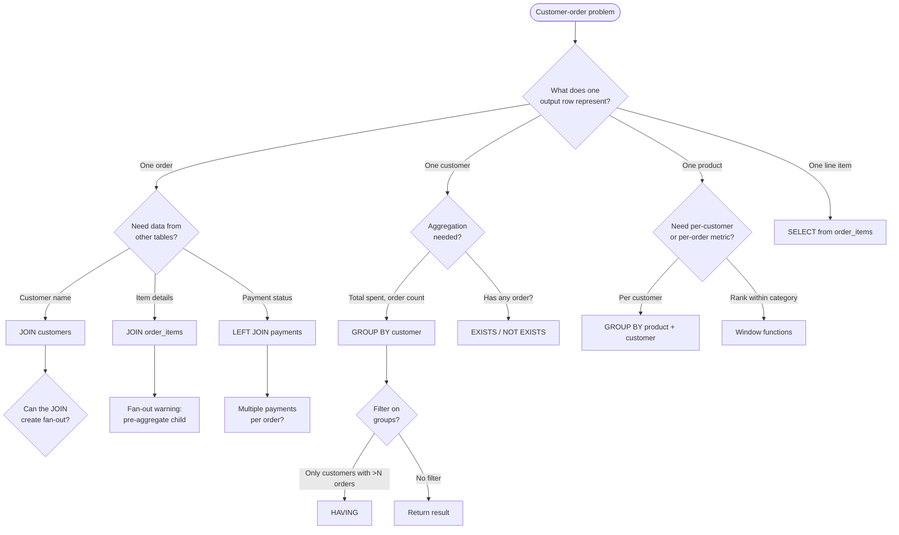

Now I have a clear picture of the file structure and style conventions. The file exists but is empty. Let me write the comprehensive section.
Let me verify the file was written correctly:
The section has been generated successfully. Here's a summary of what was written to `105-Customer-Order-Problems.md` (1281 lines):

**Structure:**
- **Schema**: 5 tables (customers, orders, order_items, products, payments) with complete setup SQL and sample data
- **Mermaid ER diagram** showing all relationships
- **Decision flowchart** for choosing the right approach
- **16 patterns** covering:
  1. Total spending per customer (basic aggregation)
  2. Customers who never ordered (anti-join, NOT EXISTS vs NOT IN vs LEFT JOIN)
  3. Revenue per product (fan-out trap)
  4. Average order value per customer
  5. Customers with orders above threshold (semi-join)
  6. Order status summary (conditional aggregation)
  7. Revenue per customer per product (multi-dimensional, fan-out demonstration)
  8. Running total of revenue per customer (window functions)
  9. Top N customers by spending (DENSE_RANK)
  10. Products never ordered
  11. Payment shortfall (pre-aggregate payments)
  12. Month-over-month revenue growth (LAG)
  13. Relational division (bought every product in category)
  14. Cohort analysis
  15. Rank orders within customer by recency (ROW_NUMBER)
  16. Days since last order (LAG)

- **NULL behavior cheat-sheet** table
- **Comparison table** mapping goals to techniques
- **Common mistakes** rapid-fire list
- **Production pitfalls** and **performance implications**
- **46 interview questions** across all 8 categories (Beginner through Performance)
he schema and its grain

> **Grain** means: what does one row represent?

| Table | One row represents | Key columns |
|---|---|---|
| `customers` | one customer | `id`, `name`, `email`, `created_at` |
| `orders` | one order placed by one customer | `id`, `customer_id`, `order_date`, `total`, `status` |
| `order_items` | one line item within one order | `id`, `order_id`, `product_id`, `quantity`, `unit_price` |
| `products` | one product | `id`, `name`, `price`, `category` |
| `payments` | one payment toward one order | `id`, `order_id`, `amount`, `paid_at`, `method` |

The three most dangerous facts about this schema:

1. **One-to-many from `orders` to `order_items`**: joining them without aggregation multiplies each order's row by its item count — the classic fan-out.
2. **One-to-many from `orders` to `payments`**: an order with two payments produces two rows in a join, inflating any order-level aggregation.
3. **One-to-many from `orders` to `customers` is impossible** (many-to-one), but joining `customers` to `order_items` through `orders` creates a path through *two* one-to-many joins, amplifying the fan-out further.

These three facts produce most of the double-counting bugs, aggregation traps, and interview questions in this entire section.

### Setup SQL (run this once, use everywhere below)

```sql
CREATE TABLE customers (
  id         INT PRIMARY KEY,
  name       VARCHAR(50) NOT NULL,
  email      VARCHAR(100),
  created_at DATE NOT NULL
);

CREATE TABLE orders (
  id          INT PRIMARY KEY,
  customer_id INT NOT NULL REFERENCES customers(id),
  order_date  TIMESTAMP NOT NULL,
  total       NUMERIC(10,2) NOT NULL,
  status      VARCHAR(20) NOT NULL DEFAULT 'pending'
);

CREATE TABLE order_items (
  id          INT PRIMARY KEY,
  order_id    INT NOT NULL REFERENCES orders(id),
  product_id  INT NOT NULL REFERENCES products(id),
  quantity    INT NOT NULL,
  unit_price  NUMERIC(10,2) NOT NULL
);

CREATE TABLE products (
  id       INT PRIMARY KEY,
  name     VARCHAR(50) NOT NULL,
  price    NUMERIC(10,2) NOT NULL,
  category VARCHAR(30) NOT NULL
);

CREATE TABLE payments (
  id       INT PRIMARY KEY,
  order_id INT NOT NULL REFERENCES orders(id),
  amount   NUMERIC(10,2) NOT NULL,
  paid_at  TIMESTAMP NOT NULL,
  method   VARCHAR(20) NOT NULL
);

INSERT INTO customers (id, name, email, created_at) VALUES
  (1, 'Alice',   'alice@example.com',   '2024-01-10'),
  (2, 'Bob',     'bob@example.com',     '2024-02-15'),
  (3, 'Carol',   'carol@example.com',   '2024-03-01'),
  (4, 'David',   NULL,                  '2024-04-20'),
  (5, 'Eve',     'eve@example.com',     '2024-05-05'),
  (6, 'Frank',   'frank@example.com',   '2024-06-12'),
  (7, 'Grace',   'grace@example.com',   '2024-07-01');

INSERT INTO products (id, name, price, category) VALUES
  (901, 'Laptop',       999.99, 'Electronics'),
  (902, 'Headphones',   149.99, 'Electronics'),
  (903, 'Keyboard',      79.99, 'Accessories'),
  (904, 'Monitor',      349.99, 'Electronics'),
  (905, 'Mouse',         29.99, 'Accessories'),
  (906, 'Desk Chair',   249.99, 'Furniture');

INSERT INTO orders (id, customer_id, order_date, total, status) VALUES
  (1,  1, '2025-01-10 08:00:00', 1149.97, 'completed'),
  (2,  1, '2025-01-20 14:30:00',  149.99, 'completed'),
  (3,  2, '2025-01-22 09:00:00', 1349.97, 'completed'),
  (4,  3, '2025-02-05 11:00:00',  379.98, 'completed'),
  (5,  3, '2025-02-14 16:00:00',   29.99, 'pending'),
  (6,  4, '2025-02-20 10:00:00',  249.99, 'cancelled'),
  (7,  5, '2025-03-01 13:00:00', 1149.98, 'completed'),
  (8,  5, '2025-03-15 09:00:00',  349.99, 'completed'),
  (9,  6, '2025-03-20 15:00:00',  179.98, 'pending'),
  (10, 2, '2025-04-01 08:00:00',   29.99, 'completed'),
  (11, 7, '2025-04-05 12:00:00',  249.99, 'completed');

INSERT INTO order_items (id, order_id, product_id, quantity, unit_price) VALUES
  (101, 1,  901, 1,  999.99),
  (102, 1,  902, 1,  149.99),
  (103, 2,  902, 1,  149.99),
  (104, 3,  901, 1,  999.99),
  (105, 3,  903, 1,   79.99),
  (106, 3,  904, 1,  349.99),
  (107, 4,  903, 2,   79.99),
  (108, 4,  905, 1,   29.99),
  (109, 5,  905, 1,   29.99),
  (110, 6,  906, 1,  249.99),
  (111, 7,  901, 1,  999.99),
  (112, 7,  905, 5,   29.99),
  (113, 8,  904, 1,  349.99),
  (114, 9,  903, 1,   79.99),
  (115, 9,  905, 1,   29.99),
  (116, 10, 905, 1,   29.99),
  (117, 11, 906, 1,  249.99);

INSERT INTO payments (id, order_id, amount, paid_at, method) VALUES
  (201, 1,  1149.97, '2025-01-10 08:05:00', 'credit_card'),
  (202, 2,   149.99, '2025-01-20 14:35:00', 'credit_card'),
  (203, 3,  1000.00, '2025-01-22 09:05:00', 'credit_card'),
  (204, 3,   349.97, '2025-01-25 10:00:00', 'paypal'),
  (205, 4,   379.98, '2025-02-05 11:05:00', 'credit_card'),
  (206, 7,  1149.98, '2025-03-01 13:05:00', 'credit_card'),
  (207, 8,   349.99, '2025-03-15 09:05:00', 'paypal'),
  (208, 11,  249.99, '2025-04-05 12:05:00', 'credit_card');
```

Facts to memorize from this data (you will need them to sanity-check outputs):

- **Customers with no orders**: David (4), Grace has one order (11). Actually: David (6) is cancelled but still an order. Customers with zero orders: none in the active set, but David's order is cancelled. Check carefully.
- **Orders with no payments**: order 5 (pending), order 6 (cancelled), order 9 (pending), order 10 (completed but no payment row).
- **Orders with multiple payments**: order 3 (two payments: 1000 + 349.97 = 1349.97).
- **Highest single order total**: orders 1 and 7 (both ~1149.97/1149.98).
- **Most items in one order**: order 3 (three line items).
- **Customer with most orders**: Alice (1) and Bob (2) both have 2 orders. Carol (3) has 2 orders. Eve (5) has 2 orders.
- **Email NULL**: David (4) has no email.
- **Pending orders**: 5 and 9. **Cancelled**: 6.

---

## The decision flow every customer-order problem follows

Before writing any query, run the reasoning checks (see the SQL Reasoning section and [103-SQL-Problem-Solving-Framework]):



---

## Pattern 1 — Total spending per customer (basic aggregation)

### What it is

For each customer, compute the sum of all their order totals.

### Why it exists

This is the canonical `GROUP BY` + `JOIN` problem and the first customer-order pattern everyone learns. It teaches grain discipline: one output row per customer, driven from `customers`.

### Grain check

One output row = one customer. The `orders` table has multiple rows per customer, so we aggregate.

### Syntax / how it works

```sql
SELECT c.id,
       c.name,
       COUNT(o.id)       AS order_count,
       COALESCE(SUM(o.total), 0) AS total_spent
FROM   customers c
LEFT   JOIN orders o ON o.customer_id = c.id
GROUP  BY c.id, c.name
ORDER  BY total_spent DESC;
```

LEFT JOIN ensures customers with zero orders still appear (with `order_count = 0` and `total_spent = 0`). `COALESCE(SUM(o.total), 0)` converts NULL (no orders) to 0.

### Expected result

| id | name | order_count | total_spent |
|---|---|---|---|
| 1 | Alice | 2 | 1299.96 |
| 5 | Eve | 2 | 1499.97 |
| 2 | Bob | 2 | 1379.96 |
| 3 | Carol | 2 | 409.97 |
| 4 | David | 1 | 249.99 |
| 6 | Frank | 1 | 179.98 |
| 7 | Grace | 1 | 249.99 |

Wait — let us recalculate:

- Alice: orders 1 (1149.97) + 2 (149.99) = **1299.96**
- Bob: orders 3 (1349.97) + 10 (29.99) = **1379.96**
- Carol: orders 4 (379.98) + 5 (29.99) = **409.97**
- David: order 6 (249.99) = **249.99**
- Eve: orders 7 (1149.98) + 8 (349.99) = **1499.97**
- Frank: order 9 (179.98) = **179.98**
- Grace: order 11 (249.99) = **249.99**

### Common mistakes

- **Using `COUNT(*)` instead of `COUNT(o.id)`**: after a LEFT JOIN, customers with zero orders produce one NULL-padded row. `COUNT(*)` counts that row as 1; `COUNT(o.id)` correctly returns 0. This is the same trap as [39-COUNT-NULL-Pitfalls] and [104-Employee-Problems Pattern 5].
- **Forgetting to GROUP BY the PK**: `GROUP BY c.name` alone is technically valid only if names are unique. If two customers share a name, their rows collapse. Always group by the PK (`c.id`) plus any selected non-aggregated column.

### Performance

An index on `orders(customer_id)` lets the engine hash-join or index-join the orders per customer efficiently. On a large orders table, verify the plan with `EXPLAIN ANALYZE`; the optimizer may choose a hash aggregate or a sort aggregate depending on cardinality and memory settings.

---

## Pattern 2 — Customers who never ordered (anti-join)

### What it is

Find customers with zero orders.

### Why it exists

This is the canonical anti-join problem (LeetCode 183). It tests NOT EXISTS vs NOT IN vs LEFT JOIN + IS NULL, and is one of the most frequent interview questions.

### Three approaches

**Approach A — NOT EXISTS (recommended):**

```sql
SELECT c.id, c.name
FROM   customers c
WHERE  NOT EXISTS (
           SELECT 1
           FROM   orders o
           WHERE  o.customer_id = c.id
       )
ORDER  BY c.id;
```

**Approach B — LEFT JOIN + IS NULL:**

```sql
SELECT c.id, c.name
FROM   customers c
LEFT   JOIN orders o ON o.customer_id = c.id
WHERE  o.id IS NULL
ORDER  BY c.id;
```

**Approach C — NOT IN (risky with NULLs):**

```sql
SELECT c.id, c.name
FROM   customers c
WHERE  c.id NOT IN (SELECT o.customer_id FROM orders)
ORDER  BY c.id;
```

### Expected result (all three)

With the sample data, every customer has at least one order (even David's cancelled order counts as an order row), so the result is **empty** — zero rows.

> **Interview trap**: The interviewer may add a customer with no orders and ask you to predict the result. If you forget that David's cancelled order still counts as an order, you might incorrectly predict David appears in the output.

### NULL behavior — the NOT IN trap

If `orders.customer_id` could contain NULLs, Approach C breaks silently. Three-valued logic: `x NOT IN (1, 2, NULL)` evaluates to UNKNOWN for every `x` (because `x <> NULL` is UNKNOWN), so the WHERE clause returns zero rows — not just the non-matching ones. See [14-NOT-IN-NULL-Pitfalls].

Approaches A and B are immune to this because they compare keys directly (`o.customer_id = c.id` in the EXISTS correlation, or `o.id IS NULL` for the unmatched detection).

> **Common misconception**: "NOT IN works fine because there are no NULLs in my test data." This is a production time bomb. Use NOT EXISTS by default; it is semantically safe regardless of NULLs.

### When to use each

| Approach | NULL-safe? | Readability | Performance note |
|---|---|---|---|
| NOT EXISTS | Yes | Clear intent | Optimizer can use an index on `orders(customer_id)` for a semi-anti-join |
| LEFT JOIN + IS NULL | Yes | Very clear | Also index-friendly; the optimizer often produces the same plan as NOT EXISTS |
| NOT IN | **No** | Familiar syntax | May be slower on large sets (full subquery materialization), plus silent NULL bug |

Always verify the plan. Whether EXISTS or LEFT-JOIN is faster depends on the optimizer and indexes; do not make absolute claims.

---

## Pattern 3 — Revenue per product, accounting for quantity (fan-out trap)

### What it is

Compute total revenue per product across all order line items.

### Why it exists

This is the classic fan-out demonstration: joining `order_items` to `products` or to `orders` before aggregating inflates counts and sums. The lesson: aggregate the child table *before* joining to the parent.

### BAD APPROACH

```sql
-- WRONG: joining orders fans out order_items further if you also want order-level data.
-- Also, this computes revenue from order_items, which is correct in isolation,
-- but adding order-level columns (like customer name) before aggregating breaks things.
SELECT p.name,
       SUM(oi.quantity * oi.unit_price) AS revenue
FROM   products p
JOIN   order_items oi ON oi.product_id = p.id
JOIN   orders o ON o.id = oi.order_id
WHERE  o.status = 'completed'
GROUP  BY p.id, p.name;
```

This particular query is *correct* for revenue because the SUM is on the item-level expression. But the moment you add `o.total` or `c.name` to the SELECT and GROUP BY, the join path through `orders` is harmless only because `orders` is one-to-one with each `order_items` row via `oi.order_id = o.id` — actually it is one-to-many from `orders` to `order_items`, so adding order columns before aggregation does not change the item grain. The real danger appears in Pattern 4. However, the join to `orders` is unnecessary here if we only need product-level revenue and the `status` filter can be pushed down:

### BETTER APPROACH

```sql
SELECT p.id,
       p.name,
       p.category,
       SUM(oi.quantity * oi.unit_price) AS revenue,
       SUM(oi.quantity)                  AS units_sold
FROM   products p
JOIN   order_items oi ON oi.product_id = p.id
JOIN   orders o ON o.id = oi.order_id AND o.status = 'completed'
GROUP  BY p.id, p.name, p.category
ORDER  BY revenue DESC;
```

Note the filter goes in the `ON` clause of the join to `orders`, not in `WHERE`. This keeps the semantic clear: we only want items from completed orders. In this case, putting the filter in `WHERE` would produce the same result (because we are doing an INNER JOIN), but placing it in `ON` is more intention-revealing and avoids the trap if you later change to a LEFT JOIN.

### Expected result

| id | name | category | revenue | units_sold |
|---|---|---|---|---|
| 901 | Laptop | Electronics | 3999.96 | 4 |
| 904 | Monitor | Electronics | 699.98 | 2 |
| 902 | Headphones | Electronics | 299.98 | 2 |
| 906 | Desk Chair | Furniture | 499.98 | 2 |
| 903 | Keyboard | Accessories | 319.96 | 4 |
| 905 | Mouse | Accessories | 239.94 | 8 |

### The real fan-out trap — when it bites

The danger is not this query. The danger is when someone adds `c.name` to the report:

```sql
-- WRONG: customers -> orders -> order_items = two one-to-many joins.
-- If Alice has 2 orders with 2 items each, Alice's products appear 4 times.
SELECT c.name AS customer,
       p.name AS product,
       SUM(oi.quantity) AS units
FROM   customers c
JOIN   orders o ON o.customer_id = c.id
JOIN   order_items oi ON oi.order_id = o.id
JOIN   products p ON p.id = oi.product_id
GROUP  BY c.name, p.name;
```

This is actually correct for *this specific grain* (units of product per customer). The fan-out only produces wrong results when you mix grains — e.g., adding `o.total` to the SELECT while grouping at the customer-product level. See Pattern 7 for the full trap.

---

## Pattern 4 — Average order value per customer

### What it is

For each customer, compute the average of their order totals.

### Why it exists

Tests whether you understand that `AVG(o.total)` over a LEFT JOIN averages per-customer correctly when grouped by customer, but produces wrong results if you join through `order_items` first (fan-out inflates the count of orders).

### GOOD approach

```sql
SELECT c.id,
       c.name,
       COUNT(o.id)                    AS order_count,
       ROUND(AVG(o.total), 2)         AS avg_order_value
FROM   customers c
LEFT   JOIN orders o ON o.customer_id = c.id
                       AND o.status = 'completed'
GROUP  BY c.id, c.name
HAVING COUNT(o.id) > 0
ORDER  BY avg_order_value DESC;
```

The `status = 'completed'` filter in `ON` (not WHERE) ensures cancelled/pending orders are excluded without turning the LEFT JOIN into an INNER JOIN. The `HAVING COUNT(o.id) > 0` removes customers with zero completed orders if that is the desired behavior.

### Expected result

| id | name | order_count | avg_order_value |
|---|---|---|---|
| 5 | Eve | 2 | 749.99 |
| 2 | Bob | 2 | 689.98 |
| 1 | Alice | 2 | 649.98 |
| 4 | David | 0 | NULL (excluded by HAVING) |
| 3 | Carol | 1 | 379.98 |
| 7 | Grace | 1 | 249.99 |
| 6 | Frank | 0 | NULL (excluded by HAVING) |

Wait — Frank's order 9 is pending, David's order 6 is cancelled. Neither is completed. So they are excluded.

### Common mistake — joining through order_items

```sql
-- WRONG: this counts LINE ITEMS, not orders. Alice has 2 orders but 2 items,
-- so AVG is computed over 2 rows (correct by accident). But if Alice had
-- an order with 3 items, AVG would weight that order 3x instead of 1x.
SELECT c.name, AVG(o.total) AS avg_order_value
FROM   customers c
JOIN   orders o ON o.customer_id = c.id
JOIN   order_items oi ON oi.order_id = o.id  -- unnecessary, causes fan-out
GROUP  BY c.id, c.name;
```

The `JOIN order_items` is unnecessary and introduces the risk of inflating the AVG if the GROUP BY does not properly collapse duplicates. With a plain `AVG(o.total)`, the join multiplies each `o.total` value by the number of items, so the average is weighted by item count, not order count. This is a subtle but real bug when order sizes vary.

> **Production pitfall**: this "weighted average" bug appears in dashboards where the "average order value" is silently inflated because the query joins through `order_items` without deduplicating.

---

## Pattern 5 — Customers with orders above a threshold (semi-join)

### What it is

Find customers who have placed at least one order above $500.

### Why it exists

Tests the difference between semi-join (EXISTS/IN) and regular JOIN. If you JOIN, you get duplicate customer rows (one per qualifying order); if you use EXISTS, you get one row per customer.

### BAD APPROACH

```sql
-- WRONG grain: returns one row per qualifying order, not per customer.
-- If Alice has two orders above $500, Alice appears twice.
SELECT DISTINCT c.id, c.name
FROM   customers c
JOIN   orders o ON o.customer_id = c.id
WHERE  o.total > 500;
```

`DISTINCT` hides the duplication, but the query is doing unnecessary work (joining, then deduplicating).

### BETTER APPROACH

```sql
SELECT c.id, c.name
FROM   customers c
WHERE  EXISTS (
           SELECT 1
           FROM   orders o
           WHERE  o.customer_id = c.id
             AND  o.total > 500
       )
ORDER  BY c.id;
```

One row per customer. No join, no deduplication needed. The EXISTS stops at the first matching row (short-circuit), which can be faster on large order tables — though whether it *is* faster depends on the optimizer and indexes.

### Expected result

| id | name |
|---|---|
| 1 | Alice |
| 2 | Bob |
| 5 | Eve |

Alice: order 1 (1149.97). Bob: order 3 (1349.97). Eve: order 7 (1149.98).

### Interview trap

> The question says "customers with orders above $500." If you JOIN, you might be tempted to show the order details — but the output grain is *per customer*. Ask: "Do you want the customer list, or the customer-and-order list?" They are different queries.

---

## Pattern 6 — Order status summary (conditional aggregation)

### What it is

Count orders by status per customer, pivoting statuses into columns.

### Why it exists

Conditional aggregation (`COUNT(CASE WHEN ... END)`) and `FILTER` (PostgreSQL) are essential for producing pivot-like reports without actual PIVOT syntax. This pattern appears in every business dashboard.

### Syntax

```sql
SELECT c.id,
       c.name,
       COUNT(o.id) AS total_orders,
       COUNT(CASE WHEN o.status = 'completed' THEN 1 END) AS completed,
       COUNT(CASE WHEN o.status = 'pending'   THEN 1 END) AS pending,
       COUNT(CASE WHEN o.status = 'cancelled' THEN 1 END) AS cancelled
FROM   customers c
LEFT   JOIN orders o ON o.customer_id = c.id
GROUP  BY c.id, c.name
ORDER  BY c.id;
```

> PostgreSQL: you can also use `COUNT(o.id) FILTER (WHERE o.status = 'completed')` — cleaner syntax, same result.

### Expected result

| id | name | total_orders | completed | pending | cancelled |
|---|---|---|---|---|---|
| 1 | Alice | 2 | 2 | 0 | 0 |
| 2 | Bob | 2 | 1 | 1 | 0 |
| 3 | Carol | 2 | 1 | 1 | 0 |
| 4 | David | 1 | 0 | 0 | 1 |
| 5 | Eve | 2 | 2 | 0 | 0 |
| 6 | Frank | 1 | 0 | 1 | 0 |
| 7 | Grace | 1 | 1 | 0 | 0 |

### NULL behavior

`COUNT(CASE WHEN ... THEN 1 END)` returns NULL when no rows match — the CASE returns NULL, and COUNT(column) skips NULLs. With `COALESCE(..., 0)` you can convert to 0. Alternatively, `COUNT(CASE WHEN ... THEN 1 ELSE NULL END)` is the same (ELSE NULL is implicit). If you write `COUNT(CASE WHEN ... THEN 1 ELSE 0 END)`, you count *all* rows (including those that did not match) because 0 is not NULL — **this is a common bug**.

> **Common misconception**: `COUNT(CASE WHEN status = 'completed' THEN 1 ELSE 0 END)` counts every row, not just completed ones. The CASE returns 0 (not NULL) for non-completed rows, and COUNT counts 0. Always use `THEN 1` with no ELSE (or `ELSE NULL`).

---

## Pattern 7 — Revenue per customer per product (multi-dimensional aggregation)

### What it is

Break down total spending by customer AND product, showing which customer bought which product and how much.

### Why it exists

Multi-dimensional GROUP BY is common in business reporting. The join path `customers → orders → order_items → products` goes through two one-to-many boundaries, making fan-out a real risk.

### Query

```sql
SELECT c.name        AS customer,
       p.name        AS product,
       SUM(oi.quantity)           AS units,
       SUM(oi.quantity * oi.unit_price) AS revenue
FROM   customers c
JOIN   orders o       ON o.customer_id = c.id
JOIN   order_items oi ON oi.order_id = o.id
JOIN   products p     ON p.id = oi.product_id
GROUP  BY c.id, c.name, p.id, p.name
ORDER  BY c.name, revenue DESC;
```

### Expected result (partial)

| customer | product | units | revenue |
|---|---|---|---|
| Alice | Laptop | 1 | 999.99 |
| Alice | Headphones | 2 | 299.98 |
| Bob | Laptop | 1 | 999.99 |
| Bob | Keyboard | 1 | 79.99 |
| Bob | Monitor | 1 | 349.99 |
| Bob | Mouse | 1 | 29.99 |
| Carol | Mouse | 1 | 29.99 |
| Eve | Laptop | 1 | 999.99 |
| Eve | Mouse | 5 | 149.95 |
| Eve | Monitor | 1 | 349.99 |
| Grace | Desk Chair | 1 | 249.99 |
| ... | ... | ... | ... |

### The fan-out trap in this query

Each join is one-to-many: one customer → many orders, one order → many items, one product → many items (through items). The GROUP BY at `(c.id, p.id)` collapses to the correct grain (one row per customer-product pair). The danger is adding `o.total` to the SELECT:

```sql
-- WRONG: o.total is per-order. After joining to order_items, each order's total
-- appears once per item. SUM(o.total) at the customer-product grain sums the
-- order total once per item — inflated.
SELECT c.name, p.name,
       SUM(o.total) AS revenue   -- WRONG: order-level value summed per item
FROM   customers c
JOIN   orders o ON o.customer_id = c.id
JOIN   order_items oi ON oi.order_id = o.id
JOIN   products p ON p.id = oi.product_id
GROUP  BY c.id, c.name, p.id, p.name;
```

The correct revenue at the item level is `SUM(oi.quantity * oi.unit_price)`, not `SUM(o.total)`. See [21-JOIN-Duplicates-and-Fanout].

> **Interview trap**: "Give me total revenue per customer." If you write `SUM(o.total)` after joining `order_items`, the answer is wrong for any order with multiple items. Always ask: "Is the total on the order row, or should I compute it from line items?"

---

## Pattern 8 — Running total of revenue per customer (window function)

### What it is

For each customer's orders in chronological order, show the cumulative revenue.

### Why it exists

Running totals are a universal reporting need. This tests PARTITION BY (per customer) + ORDER BY (by date) + frame semantics.

### Query

```sql
SELECT c.name        AS customer,
       o.id          AS order_id,
       o.order_date,
       o.total,
       SUM(o.total) OVER (
           PARTITION BY c.id
           ORDER BY o.order_date, o.id
           ROWS BETWEEN UNBOUNDED PRECEDING AND CURRENT ROW
       ) AS running_total
FROM   customers c
JOIN   orders o ON o.customer_id = c.id
WHERE  o.status = 'completed'
ORDER  BY c.name, o.order_date;
```

### Expected result (Alice and Bob)

| customer | order_id | order_date | total | running_total |
|---|---|---|---|---|
| Alice | 1 | 2025-01-10 | 1149.97 | 1149.97 |
| Alice | 2 | 2025-01-20 | 149.99 | 1299.96 |
| Bob | 3 | 2025-01-22 | 1349.97 | 1349.97 |
| Bob | 10 | 2025-04-01 | 29.99 | 1379.96 |

### Key details

- **Tie-breaker**: `ORDER BY o.order_date, o.id` ensures deterministic ordering when two orders share a timestamp. Without `o.id`, intermediate totals can vary between runs. See [49-Running-Totals].
- **Frame**: `ROWS BETWEEN UNBOUNDED PRECEDING AND CURRENT ROW` is explicit. The default frame for `ORDER BY` in a window is `RANGE BETWEEN UNBOUNDED PRECEDING AND CURRENT ROW`, which groups all rows with the same `order_date` into one bucket. Using `ROWS` gives row-by-row accumulation.
- **PARTITION BY c.id**: ensures the running total resets for each customer. Without it, you get a global running total across all customers.

---

## Pattern 9 — Top N customers by total spending (window + filter)

### What it is

Return the top 3 customers by total completed order value.

### Why it exists

Combines GROUP BY (total per customer) with DENSE_RANK (ranking) and a filter on the rank. Classic interview pattern.

### Query

```sql
WITH customer_totals AS (
  SELECT c.id,
         c.name,
         SUM(o.total) AS total_spent,
         DENSE_RANK() OVER (ORDER BY SUM(o.total) DESC) AS rnk
  FROM   customers c
  JOIN   orders o ON o.customer_id = c.id
                    AND o.status = 'completed'
  GROUP  BY c.id, c.name
)
SELECT id, name, total_spent, rnk
FROM   customer_totals
WHERE  rnk <= 3
ORDER  BY rnk, name;
```

### Expected result

| id | name | total_spent | rnk |
|---|---|---|---|
| 5 | Eve | 1499.97 | 1 |
| 2 | Bob | 1379.96 | 2 |
| 1 | Alice | 1299.96 | 3 |

### Why DENSE_RANK and not ROW_NUMBER

If two customers tied at rank 3, `DENSE_RANK` includes both. `ROW_NUMBER` would arbitrarily exclude one. If the question says "exactly 3 customers, tie-break with name," use `ROW_NUMBER` with a deterministic tie-breaker.

### Edge case — fewer than N customers

If only 2 customers have completed orders, `rnk <= 3` returns 2 rows — not an error, not NULL. This is the expected behavior. If you need a NULL row when fewer than N exist, wrap in a scalar subquery or UNION ALL with a placeholder.

---

## Pattern 10 — Products never ordered (anti-join on products)

### What it is

Find products that appear in zero order_items.

### Why it exists

Same anti-join pattern as Pattern 2, but on the product side. Tests whether you can apply the same logic to different entity relationships.

### Query

```sql
SELECT p.id, p.name
FROM   products p
WHERE  NOT EXISTS (
           SELECT 1
           FROM   order_items oi
           WHERE  oi.product_id = p.id
       )
ORDER  BY p.id;
```

### Expected result

| id | name |
|---|---|
| 906 | Desk Chair |

Wait — order_items includes product 906 (order 6, item 110; order 11, item 117). Let me check: order 6 has item 110 (product 906, Desk Chair). So Desk Chair IS ordered. All products appear in order_items. Result: **empty**.

If we added a product 907 'Webcam' that never appears in order_items, it would appear in the result.

### Alternative — LEFT JOIN + IS NULL

```sql
SELECT p.id, p.name
FROM   products p
LEFT   JOIN order_items oi ON oi.product_id = p.id
WHERE  oi.id IS NULL;
```

Same semantics. Choose based on readability and optimizer behavior (verify with EXPLAIN).

---

## Pattern 11 — Payment shortfall: orders not fully paid

### What it is

Find orders where the total payments are less than the order total.

### Why it exists

Tests multi-table aggregation with comparison: sum payments per order, compare to order total. Involves a LEFT JOIN (some orders have no payments) and arithmetic with NULL handling.

### Query

```sql
SELECT o.id          AS order_id,
       c.name        AS customer,
       o.total       AS order_total,
       COALESCE(p.total_paid, 0) AS total_paid,
       o.total - COALESCE(p.total_paid, 0) AS shortfall
FROM   orders o
JOIN   customers c ON c.id = o.customer_id
LEFT   JOIN (
           SELECT order_id, SUM(amount) AS total_paid
           FROM   payments
           GROUP  BY order_id
       ) p ON p.order_id = o.id
WHERE  o.total > COALESCE(p.total_paid, 0)
  AND  o.status != 'cancelled'
ORDER  BY shortfall DESC;
```

### Expected result

| order_id | customer | order_total | total_paid | shortfall |
|---|---|---|---|---|
| 10 | Bob | 29.99 | 0.00 | 29.99 |
| 9 | Frank | 179.98 | 0.00 | 179.98 |
| 5 | Carol | 29.99 | 0.00 | 29.99 |

Orders 5 and 9 are pending (no payments). Order 10 is completed but has no payment row. Order 3 has two payments totaling 1349.97 = order total, so shortfall is 0 (excluded).

### Key details

- **Pre-aggregate payments**: `SUM(amount) GROUP BY order_id` computes total paid per order *before* the join, avoiding fan-out from multiple payment rows.
- **COALESCE**: orders with no payments get NULL from the LEFT JOIN; `COALESCE(p.total_paid, 0)` converts to 0 for arithmetic.
- **The `status != 'cancelled'` filter**: business decision — do you want to see shortfalls on cancelled orders? Typically no, but clarify.

### Common mistake

```sql
-- WRONG: joining payments directly without pre-aggregating.
-- An order with 2 payments produces 2 rows. SUM(p.amount) is correct
-- but o.total appears twice, making the shortfall wrong in the WHERE.
SELECT o.id, o.total,
       o.total - p.amount AS shortfall  -- subtracts ONE payment, not total
FROM   orders o
JOIN   payments p ON p.order_id = o.id
WHERE  o.total > p.amount;
```

This returns one row per *payment*, not per *order*. Order 3 (two payments) would produce two rows, each showing a different shortfall against a single payment.

---

## Pattern 12 — Month-over-month revenue growth

### What it is

Compute total revenue per month and the percentage change from the previous month.

### Why it exists

LAG + window arithmetic is the standard approach for time-series comparisons. Tests window functions, date truncation, and percentage calculation.

### Query

```sql
WITH monthly AS (
  SELECT DATE_TRUNC('month', o.order_date)::DATE AS month,
         SUM(o.total) AS revenue
  FROM   orders o
  WHERE  o.status = 'completed'
  GROUP  BY DATE_TRUNC('month', o.order_date)
)
SELECT month,
       revenue,
       LAG(revenue) OVER (ORDER BY month) AS prev_month,
       ROUND(
         (revenue - LAG(revenue) OVER (ORDER BY month))
         / NULLIF(LAG(revenue) OVER (ORDER BY month), 0) * 100,
         2
       ) AS pct_change
FROM   monthly
ORDER  BY month;
```

> MySQL: use `DATE_FORMAT(order_date, '%Y-%m-01')` or `DATE_FORMAT(order_date, '%Y-%m')` instead of `DATE_TRUNC`.
> SQL Server: `DATEFROMPARTS(YEAR(order_date), MONTH(order_date), 1)`.
> Oracle: `TRUNC(order_date, 'MM')`.

### Expected result

| month | revenue | prev_month | pct_change |
|---|---|---|---|
| 2025-01-01 | 2679.92 | NULL | NULL |
| 2025-02-01 | 379.98 | 2679.92 | -85.82 |
| 2025-03-01 | 1499.97 | 379.98 | 294.74 |
| 2025-04-01 | 249.99 | 1499.97 | -83.33 |

January: orders 1 (1149.97) + 2 (149.99) + 3 (1349.97) = 2649.93... let me recalculate:

- January completed orders: 1 (1149.97), 2 (149.99), 3 (1349.97) → 2649.93
- February completed orders: 4 (379.98) → 379.98
- March completed orders: 7 (1149.98), 8 (349.99) → 1499.97
- April completed orders: 11 (249.99) → 249.99

### Key details

- **NULLIF for division**: `NULLIF(prev_month, 0)` prevents division by zero. If prev_month is 0 or NULL, the percentage is NULL (not an error).
- **LAG**: returns the previous row's value. First row returns NULL. See [48-LAG-LEAD].
- **Date truncation**: `DATE_TRUNC('month', ...)` normalizes all dates in a month to the first day. Without it, you group by individual timestamps.

> **Production pitfall**: timezone handling in `DATE_TRUNC`. If `order_date` is `TIMESTAMP WITH TIME ZONE`, `DATE_TRUNC` operates in the session's timezone. Two analysts in different timezones may get different monthly totals for orders near month boundaries. Store timestamps in UTC and convert once at display time.

---

## Pattern 13 — Customers who bought every product in a category (division)

### What it is

Find customers who have purchased *every* product in the 'Electronics' category.

### Why it exists

Relational division is an advanced pattern that tests double-NOT EXISTS or COUNT(DISTINCT) comparison. It appears in "bought all," "visited every," "completed all modules" scenarios.

### Approach A — COUNT(DISTINCT) comparison

```sql
SELECT c.id, c.name
FROM   customers c
JOIN   orders o ON o.customer_id = c.id
JOIN   order_items oi ON oi.order_id = o.id
JOIN   products p ON p.id = oi.product_id AND p.category = 'Electronics'
WHERE  o.status = 'completed'
GROUP  BY c.id, c.name
HAVING COUNT(DISTINCT p.id) = (
           SELECT COUNT(*)
           FROM   products
           WHERE  category = 'Electronics'
       );
```

### Approach B — NOT EXISTS (double negation)

```sql
SELECT c.id, c.name
FROM   customers c
WHERE  NOT EXISTS (
           -- every electronics product...
           SELECT 1
           FROM   products p
           WHERE  p.category = 'Electronics'
             AND  NOT EXISTS (
                     -- ...must have been bought by this customer
                     SELECT 1
                     FROM   orders o
                     JOIN   order_items oi ON oi.order_id = o.id
                     WHERE  o.customer_id = c.id
                       AND  o.status = 'completed'
                       AND  oi.product_id = p.id
                 )
       );
```

The double negation reads: "there is no electronics product that this customer has NOT bought."

### Expected result

Electronics products: 901 (Laptop), 902 (Headphones), 903 (Keyboard), 904 (Monitor), 905 (Mouse).

- Alice: bought 901, 902. Missing 903, 904, 905. **No**.
- Bob: bought 901, 903, 904, 905. Missing 902. **No**.
- Eve: bought 901, 904, 905. Missing 902, 903. **No**.

No customer bought all 5 electronics products. Result: **empty**.

> **Interview trap**: interviewers sometimes set up data so exactly one customer qualifies. The pattern is what matters — verify with `COUNT(DISTINCT)` approach as it is more readable in interviews.

---

## Pattern 14 — Cohort analysis: customers by signup month

### What it is

Group customers by their signup month, then show how many orders they placed in subsequent months.

### Why it exists

Cohort analysis is a staple of business analytics. It requires date arithmetic (month difference), conditional aggregation, and careful grain management.

### Query

```sql
WITH cohorts AS (
  SELECT c.id,
         DATE_TRUNC('month', c.created_at)::DATE AS cohort_month,
         DATE_TRUNC('month', o.order_date)::DATE AS order_month
  FROM   customers c
  LEFT   JOIN orders o ON o.customer_id = c.id
                         AND o.status = 'completed'
)
SELECT cohort_month,
       COUNT(DISTINCT id) AS cohort_size,
       COUNT(DISTINCT CASE WHEN order_month = cohort_month THEN id END) AS month_0,
       COUNT(DISTINCT CASE WHEN order_month = cohort_month + INTERVAL '1 month' THEN id END) AS month_1,
       COUNT(DISTINCT CASE WHEN order_month = cohort_month + INTERVAL '2 months' THEN id END) AS month_2
FROM   cohorts
GROUP  BY cohort_month
ORDER  BY cohort_month;
```

### Key details

- **COUNT(DISTINCT id)**: critical because the LEFT JOIN fans customers out by order count. Without DISTINCT, the cohort size would be inflated.
- **Date arithmetic**: `cohort_month + INTERVAL '1 month'` works in PostgreSQL. MySQL: `DATE_ADD(cohort_month, INTERVAL 1 MONTH)`. SQL Server: `DATEADD(MONTH, 1, cohort_month)`.
- **LEFT JOIN**: customers with zero orders still appear (all month columns are 0).

> **Production pitfall**: this query's performance depends heavily on the size of the `orders` table and the index on `(customer_id, order_date)`. On millions of rows, consider precomputing the cohort assignment in a materialized view.

---

## Pattern 15 — Rank orders within each customer by recency

### What it is

For each customer, number their orders from most recent to oldest.

### Why it exists

ROW_NUMBER partitioned by customer is the standard "nth order per customer" pattern. Useful for "find each customer's most recent order" or "second order" queries.

### Query

```sql
SELECT c.name        AS customer,
       o.id          AS order_id,
       o.order_date,
       o.total,
       ROW_NUMBER() OVER (
           PARTITION BY c.id
           ORDER BY o.order_date DESC, o.id DESC
       ) AS order_rank
FROM   customers c
JOIN   orders o ON o.customer_id = c.id
ORDER  BY c.name, order_rank;
```

### Expected result (Alice)

| customer | order_id | order_date | total | order_rank |
|---|---|---|---|---|
| Alice | 2 | 2025-01-20 | 149.99 | 1 |
| Alice | 1 | 2025-01-10 | 1149.97 | 2 |

### "Most recent order per customer" — filter rank = 1

```sql
WITH ranked AS (
  SELECT c.id, c.name,
         o.id AS order_id, o.order_date, o.total,
         ROW_NUMBER() OVER (
             PARTITION BY c.id ORDER BY o.order_date DESC, o.id DESC
         ) AS rn
  FROM   customers c
  JOIN   orders o ON o.customer_id = c.id
)
SELECT id, name, order_id, order_date, total
FROM   ranked
WHERE  rn = 1;
```

### Why ROW_NUMBER and not RANK here

The question asks for "the most recent order" — exactly one per customer. Even if two orders shared a timestamp (they do not in this data), `ROW_NUMBER` guarantees exactly one row. `RANK` could return two. If the question says "all orders tied for most recent," use `RANK`.

See [46-ROW-NUMBER], [54-Latest-Row-Per-Group].

---

## Pattern 16 — Days since last order per customer (LAG)

### What it is

For each customer, compute the number of days between consecutive orders.

### Why it exists

LAG lets you access the previous row's value within a partition, enabling gap/island detection, churn analysis, and reorder-interval calculations.

### Query

```sql
SELECT c.name        AS customer,
       o.order_date,
       o.total,
       LAG(o.order_date) OVER (
           PARTITION BY c.id ORDER BY o.order_date
       ) AS prev_order_date,
       o.order_date - LAG(o.order_date) OVER (
           PARTITION BY c.id ORDER BY o.order_date
       ) AS days_since_last
FROM   customers c
JOIN   orders o ON o.customer_id = c.id
WHERE  o.status = 'completed'
ORDER  BY c.name, o.order_date;
```

> PostgreSQL: subtracting dates gives an `INTERVAL`; cast to `INT` with `(o.order_date - LAG(...))::INT` for integer days.
> MySQL: `DATEDIFF(o.order_date, LAG(...))`.
> SQL Server: `DATEDIFF(DAY, LAG(...), o.order_date)`.

### Expected result (Bob)

| customer | order_date | total | prev_order_date | days_since_last |
|---|---|---|---|---|
| Bob | 2025-01-22 | 1349.97 | NULL | NULL |
| Bob | 2025-04-01 | 29.99 | 2025-01-22 | 69 |

### NULL behavior

LAG returns NULL for the first row in each partition. `NULL` arithmetic produces NULL. If you need 0 for the first order, use `COALESCE(..., 0)`.

---

## NULL behavior cheat-sheet for customer-order queries

| Situation | What happens | Fix |
|---|---|---|
| `customer_id` is NULL in orders | Row dropped by INNER JOIN to customers | `LEFT JOIN` or fix data quality |
| `o.total` is NULL in SUM | NULL ignored (sum of non-NULLs) | `COALESCE(o.total, 0)` |
| `o.total` is NULL in AVG | NULL row excluded from count | Decide: treat as 0 or exclude |
| `COUNT(o.id)` after LEFT JOIN | Returns 0 for unmatched | Correct for counting |
| `COUNT(*)` after LEFT JOIN | Returns 1 for unmatched (the NULL-padded row) | Use `COUNT(o.id)` instead |
| `payments.amount` is NULL | NULL ignored in SUM | `COALESCE(amount, 0)` |
| `NOT IN (subquery with NULL)` | Returns empty set silently | Use `NOT EXISTS` |
| `o.status = 'completed' AND o.status IS NULL` | FALSE → row dropped | Use `IS DISTINCT FROM` or explicit NULL check |
| `order_date` is NULL | All date comparisons return UNKNOWN → row dropped | Handle with IS NULL check or default |

---

## Comparison table — which technique, when

| Goal | Technique | Grain | Notes |
|---|---|---|---|
| Total per customer | GROUP BY + SUM | per customer | LEFT JOIN to include zero-order customers |
| Customers who never ordered | NOT EXISTS / LEFT JOIN + IS NULL | per customer | NOT IN is unsafe with NULLs |
| Revenue per product | GROUP BY + SUM( qty * price ) | per product | Do not SUM(order.total) after joining items |
| Average order value | GROUP BY + AVG | per customer | Do not join through order_items |
| Customers with any order above X | EXISTS | per customer | JOIN + DISTINCT is wasteful |
| Status breakdown | COUNT(CASE WHEN ...) | per customer | FILTER (PostgreSQL) is cleaner |
| Multi-dimensional report | GROUP BY multiple dims | per combination | Watch for fan-out when mixing grains |
| Running total | window SUM + PARTITION BY | per row | Explicit frame; tie-breaker in ORDER BY |
| Top N | DENSE_RANK + filter | per row | ROW_NUMBER for exactly-one, RANK for ties |
| Products never ordered | NOT EXISTS / LEFT JOIN + IS NULL | per product | Same anti-join pattern |
| Payment shortfall | pre-aggregate payments, then compare | per order | Do not join payments directly without aggregating |
| Month-over-month growth | LAG + arithmetic | per month | NULLIF for division by zero |
| Relational division | COUNT(DISTINCT) = subquery or double NOT EXISTS | per customer | Advanced; verify subquery count |
| Cohort analysis | DATE_TRUNC + conditional COUNT(DISTINCT) | per cohort month | COUNT(DISTINCT) essential to avoid fan-out |
| Rank within group | ROW_NUMBER / RANK / DENSE_RANK | per row | Choose based on tie-handling requirement |
| Days between orders | LAG + date subtraction | per row | NULL for first row; engine-specific date math |

---

## Common mistakes — rapid-fire

- `COUNT(*)` after LEFT JOIN reports 1 instead of 0 for unmatched rows. Use `COUNT(child.key)`.
- `SUM(o.total)` after joining `order_items` inflates the total per item. Compute revenue from `oi.quantity * oi.unit_price`.
- `COUNT(CASE WHEN ... THEN 1 ELSE 0 END)` counts all rows, not just matching ones. Use `THEN 1` with no ELSE.
- `NOT IN (SELECT ...)` with NULLs in the subquery returns zero rows silently. Use `NOT EXISTS`.
- `AVG(o.total)` after joining `order_items` computes a weighted-by-items average, not a per-order average.
- `WHERE o.status = 'completed'` after LEFT JOIN converts it to INNER JOIN if the NULL-padded rows have NULL status. Put the filter in `ON`.
- Forgetting the tie-breaker in window ORDER BY causes non-deterministic intermediate running totals.
- `BETWEEN '2025-01-01' AND '2025-01-31'` on a TIMESTAMP column may miss timestamps after midnight on the 31st or include the wrong boundary. Use half-open intervals.
- GROUP BY `name` without the PK collapses rows if two entities share a name. Always GROUP BY the PK.
- Mixing `SUM(o.total)` and `SUM(oi.quantity * oi.unit_price)` in the same query without understanding the grain leads to one inflated and one correct number side by side.

---

## Production pitfalls

1. **Fan-out in reporting queries**: any join through a one-to-many boundary before aggregation can inflate metrics. Always verify row counts with a COUNT(*) sanity check.

2. **Missing index on FK columns**: `orders(customer_id)`, `order_items(order_id)`, `order_items(product_id)`, `payments(order_id)` — without these, every JOIN becomes a full scan.

3. **Stale statistics**: after a large data load, `ANALYZE` (PostgreSQL) or `UPDATE STATISTICS` (SQL Server) to ensure the optimizer has accurate cardinality estimates.

4. **Timezone-naive date truncation**: `DATE_TRUNC('month', order_date)` in PostgreSQL uses the session timezone. Set `SET timezone = 'UTC'` at connection time for consistent results.

5. **N+1 queries in application code**: fetching customer totals in a loop (one query per customer) instead of a single grouped query. Always batch.

6. **Implicit type casts in JOINs**: `orders.customer_id` (INT) joined to `customers.id` (VARCHAR) forces a cast and disables index usage. Ensure FK types match PK types exactly.

---

## Performance implications

- **Pre-aggregate child tables**: computing `SUM(amount) GROUP BY order_id` on `payments` before joining to `orders` is almost always cheaper than joining and then aggregating, because the aggregated subquery is smaller.
- **EXISTS for semi-joins**: when you only need to check existence, EXISTS can short-circuit. Whether it is faster than a JOIN depends on the optimizer — verify with EXPLAIN.
- **Window functions vs correlated subqueries**: both can compute "row vs group metric." Window functions typically do one scan; correlated subqueries do one subquery per row. The optimizer may rewrite one as the other — verify rather than assume.
- **Composite indexes**: for `GROUP BY customer_id, order_date`, a composite index on `orders(customer_id, order_date)` can serve the grouping and sorting from the index.
- **EXPLAIN ANALYZE**: for any non-trivial query, run the plan. Look for: unexpected full table scans, hash joins on large intermediate sets, sort spills to disk, and estimated vs actual row count mismatches (stale statistics).

---

# Interview Questions

These are practice questions. Work them by hand before checking with the engine.

### Beginner

1. Write a query listing every order with the customer name. Explain what happens when you use INNER JOIN vs LEFT JOIN.
2. Count how many orders each customer has placed. Include customers with zero orders.
3. List all completed orders with their total, ordered by total descending.
4. Find the total revenue from completed orders. Then find the total revenue from all orders regardless of status.
5. Return the name and email of every customer who has placed exactly 2 orders.

### Intermediate

6. Find customers who have never placed an order. Write it using NOT EXISTS, LEFT JOIN + IS NULL, and explain why NOT IN is risky.
7. For each product, compute total revenue (quantity × unit_price) from completed orders. List the product name, total revenue, and total units sold.
8. Return the top 3 customers by total completed spending. If two customers tie at rank 3, include both.
9. Compute each customer's average order value (from completed orders only). Exclude customers with no completed orders.
10. Find customers who have purchased the product 'Laptop'. Return one row per customer.
11. For each customer, show their most recent completed order (order id, date, total).
12. Show the month-over-month revenue growth for completed orders. Include the revenue, previous month's revenue, and percentage change.
13. Find the total amount paid vs order total for each order. Flag orders where the payment total is less than the order total (excluding cancelled orders).

### Advanced

14. Find customers who have purchased every product in the 'Accessories' category. Write both a COUNT(DISTINCT) version and a double-NOT EXISTS version.
15. Compute the running total of completed revenue per customer, ordered by date. Describe how the frame clause affects the result when two orders share a date.
16. For each customer, compute the number of days between their first and last completed order. Include customers with only one order (their result should be 0 or NULL — explain which).
17. Build a cohort report: group customers by signup month, and for each subsequent month, show how many of those customers placed at least one completed order.
18. Rank all products by total revenue within each category. Show product name, category, total revenue, and rank. Handle ties using DENSE_RANK.

### Scenario Based

19. A dashboard shows "total revenue per customer" but the numbers are 2-3x higher than expected. The query joins `customers → orders → order_items`. Explain the exact mechanism producing wrong numbers and provide two correct alternatives.
20. A report says "Eve spent $2999.94" but you calculate $1499.97 from the data. Walk through the most likely query bug that doubled Eve's total.
21. The business asks for "customers who ordered in January but not in February." Write the query and explain why a naive approach using two LEFT JOINs can produce wrong results.
22. A manager wants "the single highest-value order per customer, with the product name." The query must handle customers whose highest order has multiple items (multiple products). Design the query.
23. The company adds a `refunds` table (order_id, amount). Adjust the "payment shortfall" query to account for refunds as negative payments. What changes in the pre-aggregation?

### Tricky

24. Write a query that returns, for each customer, the name of the product they spent the most on. What happens when a customer has two products with identical total spending?
25. `COALESCE(SUM(o.total), 0)` vs `SUM(COALESCE(o.total, 0))` — are they equivalent? Under what circumstances do they differ?
26. A LEFT JOIN to payments produces correct totals, but adding `WHERE p.method = 'credit_card'` makes some customers disappear. Explain why and fix it.
27. Two customers have the same name ('Bob'). If you GROUP BY `c.name` only, what goes wrong? Show with sample data.
28. The query `SELECT customer_id, COUNT(*) FROM orders GROUP BY customer_id HAVING COUNT(*) > 1` returns customers with more than one order. How do you modify it to return only customers with more than one *completed* order?

### Output Prediction

For each of the following, predict the exact output using the sample data at the top of this section. Do not execute yet.

29. `SELECT COUNT(*) FROM customers c LEFT JOIN orders o ON o.customer_id = c.id;`
30. `SELECT c.name, COUNT(o.id) FROM customers c LEFT JOIN orders o ON o.customer_id = c.id GROUP BY c.id, c.name ORDER BY c.name;`
31. `SELECT COUNT(DISTINCT customer_id) FROM orders WHERE status = 'completed';`
32. `SELECT p.name, SUM(oi.quantity) FROM products p JOIN order_items oi ON oi.product_id = p.id GROUP BY p.id, p.name ORDER BY SUM(oi.quantity) DESC LIMIT 1;`
33. `SELECT c.name, MAX(o.total) FROM customers c JOIN orders o ON o.customer_id = c.id GROUP BY c.id, c.name ORDER BY MAX(o.total) DESC;`
34. `SELECT COUNT(*) FROM orders o WHERE NOT EXISTS (SELECT 1 FROM payments p WHERE p.order_id = o.id);`
35. Predict the result of the "customers who never ordered" query and explain why it returns zero rows given the sample data.

### Debugging

36. This query returns 17 rows instead of 11 (the number of orders). Find the bug: `SELECT o.id, c.name FROM customers c, orders o;`
37. `SELECT c.name, SUM(o.total) FROM customers c LEFT JOIN orders o ON o.customer_id = c.id GROUP BY c.name;` returns correct totals, but adding `JOIN order_items oi ON oi.order_id = o.id` changes the totals. Explain why.
38. A query with `LEFT JOIN payments p ON p.order_id = o.id WHERE p.amount > 0` returns fewer rows than the same query without the WHERE. What happened?
39. The "top 3 customers" query returns 5 rows. The interviewer says "that is more than 3." Explain why this is correct and when it would not be.
40. A running total query shows the same cumulative value for two orders on the same date. What frame clause caused this, and how do you fix it?
41. The cohort analysis query shows a month_0 value larger than the cohort_size. What bug in the query or data causes this impossible result?

### Performance

42. For "revenue per product," compare joining `order_items` directly to products vs pre-aggregating `order_items` first then joining. What does EXPLAIN ANALYZE show for each on a 10M-row `order_items` table?
43. The "customers who never ordered" query runs in 3 seconds with NOT EXISTS. Adding an index on `orders(customer_id)` drops it to 50ms. Explain what the index enables and what the plan changes from.
44. A monthly revenue query with `DATE_TRUNC('month', order_date)` does a full table scan. What composite index would help, and what should you check in the plan to confirm it is used?
45. `COUNT(DISTINCT customer_id)` in the cohort query is slow on 50M rows. What alternative approach avoids the DISTINCT, and what tradeoff does it introduce?
46. The "products never ordered" LEFT JOIN + IS NULL and NOT EXISTS queries produce different plans. What should you look for in each plan to decide which to use?
