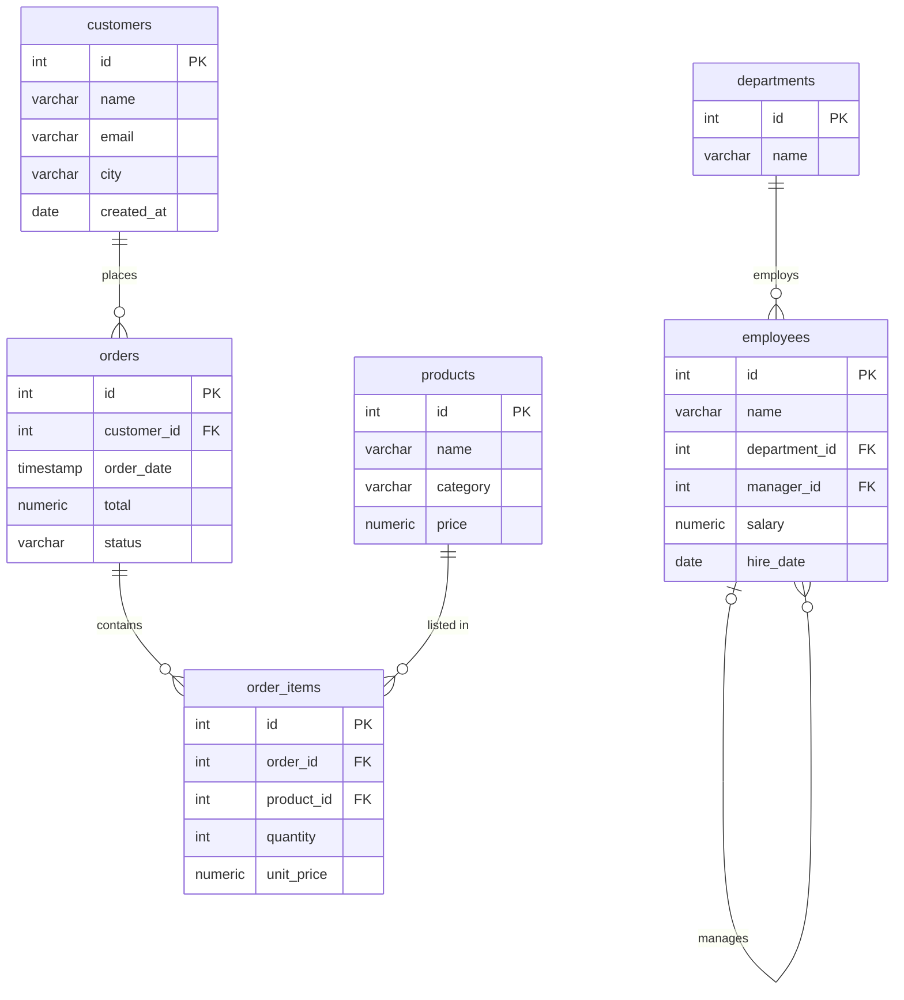

# 110. Top 100 SQL Interview Questions

> Category: 12-Interview-and-Scenarios · Section 110
> Cross-references:The content is too large for a single write. I'll write it in chunks.
Now let me verify the complete file:
All 100 questions confirmed. Let me verify the section structure and check for any issues:
Section `110-Top-100-SQL-Interview-Questions.md` generated (3228 lines, exactly 100 questions).

**Structure:**
- **Shared schema** — 6 tables (`departments`, `employees`, `customers`, `orders`, `order_items`, `products`) with grain table, Mermaid ER diagram, full setup SQL, sample data, and memorizable facts
- **Category 1 — Fundamentals (Q1–15)**: SELECT/JOIN basics, DISTINCT, COUNT, top-N, date/string filtering, GROUP BY/HAVING, self-join, anti-join
- **Category 2 — NULL & Three-Valued Logic (Q16–25)**: `= NULL`, `NULL = NULL`, `COALESCE`, `NULLIF`, `NOT IN + NULL`, COUNT vs COUNT(column)
- **Category 3 — JOINs (Q26–40)**: INNER vs LEFT, LEFT-JOIN-to-INNER trap, fan-out, CROSS JOIN, FULL OUTER, semi/anti-join, relational division, self-joins
- **Category 4 — Subqueries & CTEs (Q41–55)**: scalar/correlated subqueries, CTEs, running totals, relational division, EXISTS vs IN
- **Category 5 — Aggregation & GROUP BY (Q56–70)**: HAVING, conditional aggregation, date truncation, MoM growth, median across engines
- **Category 6 — Window Functions (Q71–85)**: ROW_NUMBER/RANK/DENSE_RANK, PARTITION BY, LAG/LEAD, moving averages, FIRST/LAST_VALUE frame trap
- **Category 7 — Date/Time & String (Q86–92)**: date arithmetic, extraction, day names, CONCAT + COALESCE, LIKE, LENGTH (with PG/MySQL/SQL Server/Oracle variants)
- **Category 8 — Optimization & Indexing (Q93–100)**: B-tree, composite/covering indexes, SARGability, execution plans (no absolute performance claims)
- **Best Practices**: 10 habits, rapid-fire mistake table, technique-mapping comparison table
- **80 practice questions** unanswered: Beginner, Intermediate, Advanced, Scenario Based, Tricky, Output Prediction, Debugging, Performance

Every concept includes BAD APPROACH → BETTER APPROACH with expected output, labeled interview traps, production pitfalls, and NULL behavior, consistent with the handbook's style.
mer | `id`, `name`, `email`, `city`, `created_at` |
| `orders` | one order | `id`, `customer_id`, `order_date`, `total`, `status` |
| `order_items` | one line item in an order | `id`, `order_id`, `product_id`, `quantity`, `unit_price` |
| `products` | one product | `id`, `name`, `category`, `price` |



### Full Setup SQL

Run this once. Every example in this section assumes these tables and data exist.

```sql
CREATE TABLE departments (
  id   INT PRIMARY KEY,
  name VARCHAR(50) NOT NULL
);

CREATE TABLE employees (
  id            INT PRIMARY KEY,
  name          VARCHAR(50) NOT NULL,
  department_id INT          REFERENCES departments(id),
  manager_id    INT          REFERENCES employees(id),
  salary        NUMERIC(10,2) NOT NULL,
  hire_date     DATE         NOT NULL
);

CREATE TABLE customers (
  id         INT PRIMARY KEY,
  name       VARCHAR(50) NOT NULL,
  email      VARCHAR(100),
  city       VARCHAR(50),
  created_at DATE NOT NULL
);

CREATE TABLE orders (
  id          INT PRIMARY KEY,
  customer_id INT NOT NULL REFERENCES customers(id),
  order_date  TIMESTAMP NOT NULL,
  total       NUMERIC(10,2) NOT NULL,
  status      VARCHAR(20) NOT NULL DEFAULT 'pending'
);

CREATE TABLE order_items (
  id          INT PRIMARY KEY,
  order_id    INT NOT NULL REFERENCES orders(id),
  product_id  INT NOT NULL REFERENCES products(id),
  quantity    INT NOT NULL,
  unit_price  NUMERIC(10,2) NOT NULL
);

CREATE TABLE products (
  id       INT PRIMARY KEY,
  name     VARCHAR(50) NOT NULL,
  category VARCHAR(30) NOT NULL,
  price    NUMERIC(10,2) NOT NULL
);
```

### Sample Data

```sql
INSERT INTO departments (id, name) VALUES
  (1, 'Engineering'),
  (2, 'Sales'),
  (3, 'Marketing'),
  (4, 'Finance'),
  (5, 'HR');

INSERT INTO employees (id, name, department_id, manager_id, salary, hire_date) VALUES
  ( 1, 'Alice',   1, NULL, 120000.00, '2020-01-15'),
  ( 2, 'Bob',     1,    1,  90000.00, '2021-03-10'),
  ( 3, 'Carol',   2,    1, 110000.00, '2019-07-22'),
  ( 4, 'David',   2,    3,  85000.00, '2022-05-01'),
  ( 5, 'Eve',     1,    2,  95000.00, '2021-11-30'),
  ( 6, 'Frank',   2,    3, 110000.00, '2018-02-14'),
  ( 7, 'Grace',   3,    1,  75000.00, '2023-09-05'),
  ( 8, 'Henry',   4,    1, 130000.00, '2020-06-11'),
  ( 9, 'Ivy',     NULL, NULL, 70000.00, '2024-01-20'),
  (10, 'Jack',    NULL,    1,  60000.00, '2024-03-01'),
  (11, 'Kara',    4,       8,  95000.00, '2022-08-19'),
  (12, 'Leo',     3,       1,  72000.00, '2023-02-27'),
  (13, 'Mia',     4,       8, 140000.00, '2021-04-03'),
  (14, 'Noah',    3,       1,  80000.00, '2023-12-11');

INSERT INTO customers (id, name, email, city, created_at) VALUES
  (1, 'Alice',   'alice@example.com',   'New York',    '2024-01-10'),
  (2, 'Bob',     'bob@example.com',     'Chicago',     '2024-02-15'),
  (3, 'Carol',   'carol@example.com',   'New York',    '2024-03-01'),
  (4, 'David',   NULL,                  'Los Angeles', '2024-04-20'),
  (5, 'Eve',     'eve@example.com',     'Chicago',     '2024-05-05'),
  (6, 'Frank',   'frank@example.com',   'Houston',     '2024-06-12'),
  (7, 'Grace',   'grace@example.com',   'New York',    '2024-07-01'),
  (8, 'Heidi',   'heidi@example.com',   NULL,          '2024-08-15'),
  (9, 'Ivan',    'ivan@example.com',    'Chicago',     '2024-09-20'),
  (10, 'Judy',   NULL,                  NULL,          '2024-10-30');

INSERT INTO products (id, name, category, price) VALUES
  (1, 'Laptop',      'Electronics', 999.99),
  (2, 'Mouse',       'Electronics',  29.99),
  (3, 'Keyboard',    'Electronics',  79.99),
  (4, 'Desk',        'Furniture',   249.99),
  (5, 'Chair',       'Furniture',   199.99),
  (6, 'Notebook',    'Stationery',    4.99),
  (7, 'Pen',         'Stationery',    1.99),
  (8, 'Monitor',     'Electronics', 499.99),
  (9, 'Headphones',  'Electronics', 149.99),
  (10, 'Backpack',   'Accessories',  59.99);

INSERT INTO orders (id, customer_id, order_date, total, status) VALUES
  ( 1, 1, '2025-01-05 10:00:00', 1029.98, 'completed'),
  ( 2, 1, '2025-01-20 14:30:00',   84.98, 'completed'),
  ( 3, 2, '2025-02-10 09:15:00',  279.98, 'completed'),
  ( 4, 3, '2025-02-14 11:00:00',  999.99, 'completed'),
  ( 5, 3, '2025-03-01 16:45:00',   49.97, 'pending'),
  ( 6, 4, '2025-03-15 08:30:00',  449.98, 'completed'),
  ( 7, 5, '2025-04-02 13:00:00',   31.98, 'cancelled'),
  ( 8, 5, '2025-04-10 10:20:00',  649.98, 'completed'),
  ( 9, 6, '2025-05-05 15:00:00',  106.97, 'completed'),
  (10, 7, '2025-05-20 12:10:00', 1149.98, 'completed'),
  (11, 8, '2025-06-01 09:00:00',   49.99, 'pending'),
  (12, 9, '2025-06-15 14:30:00',  299.98, 'completed'),
  (13, 1, '2025-07-01 10:00:00',  199.99, 'completed'),
  (14, 3, '2025-07-10 11:30:00',  549.98, 'completed'),
  (15, 10, '2025-08-01 09:45:00',   66.97, 'pending');

INSERT INTO order_items (id, order_id, product_id, quantity, unit_price) VALUES
  ( 1,  1, 1, 1, 999.99),
  ( 2,  1, 2, 1,  29.99),
  ( 3,  2, 6, 5,   4.99),
  ( 4,  2, 7, 10,  1.99),
  ( 5,  3, 4, 1, 249.99),
  ( 6,  3, 6, 6,   4.99),
  ( 7,  4, 1, 1, 999.99),
  ( 8,  5, 7, 25,  1.99),
  ( 9,  6, 5, 1, 199.99),
  (10,  6, 8, 1, 499.99),
  (11,  7, 7, 10,  1.99),
  (12,  7, 6, 4,   4.99),
  (13,  8, 8, 1, 499.99),
  (14,  8, 9, 1, 149.99),
  (15,  9, 10, 1,  59.99),
  (16,  9, 3, 1,  79.99),
  (17, 10, 1, 1, 999.99),
  (18, 10, 9, 1, 149.99),
  (19, 11, 6, 10,  4.99),
  (20, 12, 5, 1, 199.99),
  (21, 12, 3, 1,  79.99),
  (22, 13, 5, 1, 199.99),
  (23, 14, 8, 1, 499.99),
  (24, 14, 9, 1, 149.99),
  (25, 15, 10, 1, 59.99),
  (26, 15, 7, 4,  1.99);
```

### Key Facts to Memorize

| Fact | Value |
|---|---|
| Total employees | 14 |
| Employees with no department | Ivy (9), Jack (10) |
| Department with no employees | HR (5) |
| CEO (no manager) | Alice (1) |
| Highest salary overall | Mia — 140000 |
| Salary ties | Carol & Frank both earn 110000 |
| Total customers | 10 |
| Customers with no email | David (4), Judy (10) |
| Customers with no city | Heidi (8), Judy (10) |
| Total orders | 15 |
| Cancelled orders | Order 7 (customer 5) |
| Pending orders | 5, 11, 15 |

---

## Category 1 — Fundamentals (Q1–Q15)

---

### Q1. Find all employees in the Engineering department

**Pattern:** Basic SELECT with JOIN

```sql
-- BAD APPROACH: filtering on department name without joining
SELECT *
FROM employees
WHERE department_id = 'Engineering';
```

This fails because `department_id` is an integer, not a string. The database will either throw an error or perform an implicit cast.

```sql
-- BETTER APPROACH
SELECT e.id, e.name, e.salary, e.hire_date
FROM employees e
JOIN departments d ON e.department_id = d.id
WHERE d.name = 'Engineering';
```

**Expected output:**

| id | name | salary | hire_date |
|---|---|---|---|
| 1 | Alice | 120000.00 | 2020-01-15 |
| 2 | Bob | 90000.00 | 2021-03-10 |
| 5 | Eve | 95000.00 | 2021-11-30 |

> **Interview trap:** Interviewers ask "find employees in Engineering" to see if you join correctly or try to filter on a string column that is actually an ID.

---

### Q2. List all employees with their department names, including those without a department

**Pattern:** LEFT JOIN

```sql
-- BAD APPROACH: INNER JOIN loses employees without departments
SELECT e.name, d.name AS department
FROM employees e
JOIN departments d ON e.department_id = d.id;
```

This silently drops Ivy and Jack, who have `department_id = NULL`.

```sql
-- BETTER APPROACH
SELECT e.name, d.name AS department
FROM employees e
LEFT JOIN departments d ON e.department_id = d.id;
```

**Expected output (excerpt):**

| name | department |
|---|---|
| Alice | Engineering |
| Bob | Engineering |
| Ivy | NULL |
| Jack | NULL |

> **Production pitfall:** Using INNER JOIN when you need all source rows silently drops data. Always ask: "Do I need every row from the driving table?"

---

### Q3. Find the distinct cities where customers are located

**Pattern:** DISTINCT

```sql
-- BAD APPROACH: no DISTINCT returns duplicates
SELECT city FROM customers;
```

Returns `New York` three times, `Chicago` three times, etc.

```sql
-- BETTER APPROACH
SELECT DISTINCT city
FROM customers
WHERE city IS NOT NULL
ORDER BY city;
```

**Expected output:**

| city |
|---|
| Chicago |
| Houston |
| Los Angeles |
| New York |

> **Interview trap:** "Find all cities" vs "Find all *distinct* cities." If the question does not say "distinct," returning duplicates may be correct. Always clarify.

---

### Q4. Find all products that cost more than $100, sorted by price descending

**Pattern:** WHERE with comparison and ORDER BY

```sql
SELECT id, name, category, price
FROM products
WHERE price > 100
ORDER BY price DESC;
```

**Expected output:**

| id | name | category | price |
|---|---|---|---|
| 1 | Laptop | Electronics | 999.99 |
| 8 | Monitor | Electronics | 499.99 |
| 4 | Desk | Furniture | 249.99 |
| 5 | Chair | Furniture | 199.99 |
| 9 | Headphones | Electronics | 149.99 |

---

### Q5. Count the total number of employees

**Pattern:** COUNT(*)

```sql
-- BAD APPROACH: COUNT(column) ignores NULLs
SELECT COUNT(department_id) FROM employees;
```

This returns 12 (excludes Ivy and Jack), not 14.

```sql
-- BETTER APPROACH
SELECT COUNT(*) AS total_employees FROM employees;
```

**Expected output:**

| total_employees |
|---|
| 14 |

> **Interview trap:** `COUNT(*)` counts all rows including those with NULLs. `COUNT(column)` skips NULLs. They return different results when the column contains NULLs.

---

### Q6. Find the second highest salary

**Pattern:** Subquery / LIMIT-OFFSET / window function

```sql
-- BAD APPROACH: LIMIT 1 OFFSET 1 misses ties
SELECT DISTINCT salary
FROM employees
ORDER BY salary DESC
LIMIT 1 OFFSET 1;
```

This returns 130000 (Henry). But what if two people tied for the highest? OFFSET 1 would skip only one of them and return the other — still the highest salary, not the second.

```sql
-- BETTER APPROACH: handles ties correctly
SELECT MAX(salary) AS second_highest
FROM employees
WHERE salary < (SELECT MAX(salary) FROM employees);
```

**Expected output:**

| second_highest |
|---|
| 130000.00 |

```sql
-- ALTERNATIVE using window function (handles ties by definition)
SELECT DISTINCT salary
FROM (
  SELECT salary, DENSE_RANK() OVER (ORDER BY salary DESC) AS dr
  FROM employees
) ranked
WHERE dr = 2;
```

> **Interview trap:** "Find the Nth highest salary" is one of the most common interview questions. The OFFSET approach breaks with ties. DENSE_RANK is the robust solution.

---

### Q7. Find the top 3 highest-paid employees

**Pattern:** ORDER BY with LIMIT

```sql
SELECT id, name, salary
FROM employees
ORDER BY salary DESC
LIMIT 3;
```

**Expected output:**

| id | name | salary |
|---|---|---|
| 13 | Mia | 140000.00 |
| 8 | Henry | 130000.00 |
| 1 | Alice | 120000.00 |

> **Note:** LIMIT is PostgreSQL / MySQL syntax. SQL Server uses `SELECT TOP 3 ...`. Oracle uses `FETCH FIRST 3 ROWS ONLY`.

```sql
-- SQL Server
SELECT TOP 3 id, name, salary
FROM employees
ORDER BY salary DESC;

-- Oracle / PostgreSQL 13+
SELECT id, name, salary
FROM employees
ORDER BY salary DESC
FETCH FIRST 3 ROWS ONLY;
```

---

### Q8. Find employees hired in 2023

**Pattern:** Date filtering

```sql
-- BAD APPROACH: string comparison may work by accident
SELECT * FROM employees
WHERE hire_date LIKE '2023%';
```

This works only because `hire_date` is a DATE and gets implicitly cast to a string. It is fragile and non-sargable.

```sql
-- BETTER APPROACH: use date range
SELECT id, name, hire_date
FROM employees
WHERE hire_date >= '2023-01-01'
  AND hire_date <  '2024-01-01'
ORDER BY hire_date;
```

**Expected output:**

| id | name | hire_date |
|---|---|---|
| 12 | Leo | 2023-02-27 |
| 7 | Grace | 2023-09-05 |
| 14 | Noah | 2023-12-11 |

> **Production pitfall:** `WHERE YEAR(hire_date) = 2023` is a **non-sargable** predicate — it prevents index usage. Use range comparisons instead. See [77-SARGability](../09-Optimization/77-SARGability.md).

---

### Q9. Find employees whose names start with 'A' or end with 'a'

**Pattern:** LIKE pattern matching

```sql
SELECT id, name
FROM employees
WHERE name LIKE 'A%' OR name LIKE '%a';
```

**Expected output:**

| id | name |
|---|---|
| 1 | Alice |

Only Alice matches both patterns. Note: LIKE is **case-sensitive** in PostgreSQL by default, **case-insensitive** in MySQL (with default collation) and SQL Server (depending on collation).

```sql
-- PostgreSQL: case-insensitive
SELECT id, name
FROM employees
WHERE name ILIKE 'a%' OR name ILIKE '%a';

-- MySQL: already case-insensitive with default collation
-- SQL Server: depends on collation setting
```

---

### Q10. Find the total salary per department, showing only departments with total salary above 200000

**Pattern:** GROUP BY with HAVING

```sql
-- BAD APPROACH: WHERE cannot filter on aggregates
SELECT department_id, SUM(salary) AS total_salary
FROM employees
WHERE SUM(salary) > 200000
GROUP BY department_id;
```

This throws an error: aggregate functions are not allowed in WHERE.

```sql
-- BETTER APPROACH
SELECT d.name AS department, SUM(e.salary) AS total_salary
FROM employees e
JOIN departments d ON e.department_id = d.id
GROUP BY d.name
HAVING SUM(e.salary) > 200000
ORDER BY total_salary DESC;
```

**Expected output:**

| department | total_salary |
|---|---|
| Engineering | 305000.00 |
| Sales | 305000.00 |

> **Interview trap:** WHERE filters individual rows *before* aggregation. HAVING filters groups *after* aggregation. This is one of the most tested distinctions in SQL interviews.

---

### Q11. Find all orders with their customer names

**Pattern:** INNER JOIN

```sql
SELECT o.id AS order_id, c.name AS customer, o.order_date, o.total
FROM orders o
JOIN customers c ON o.customer_id = c.id
ORDER BY o.id;
```

**Expected output (excerpt):**

| order_id | customer | order_date | total |
|---|---|---|---|
| 1 | Alice | 2025-01-05 10:00:00 | 1029.98 |
| 2 | Alice | 2025-01-20 14:30:00 | 84.98 |
| 3 | Bob | 2025-02-10 09:15:00 | 279.98 |

---

### Q12. Find customers who have never placed an order

**Pattern:** Anti-join / NOT EXISTS / NOT IN

```sql
-- APPROACH 1: LEFT JOIN + IS NULL
SELECT c.id, c.name
FROM customers c
LEFT JOIN orders o ON c.id = o.customer_id
WHERE o.id IS NULL;
```

```sql
-- APPROACH 2: NOT EXISTS (generally preferred)
SELECT c.id, c.name
FROM customers c
WHERE NOT EXISTS (
  SELECT 1 FROM orders o WHERE o.customer_id = c.id
);
```

```sql
-- APPROACH 3: NOT IN — DANGEROUS if orders.customer_id is nullable
SELECT id, name
FROM customers
WHERE id NOT IN (SELECT customer_id FROM orders);
```

In our schema, `orders.customer_id` is NOT NULL, so all three return:

| id | name |
|---|---|
| 6 | Frank |
| 7 | Grace |
| 8 | Heidi |
| 9 | Ivan |
| 10 | Judy |

> **Interview trap:** If `orders.customer_id` were nullable, `NOT IN` could return an **empty result set** due to NULL behavior. See [14-NOT-IN-NULL-Pitfalls](../02-NULL-and-Logic/14-NOT-IN-NULL-Pitfalls.md). Prefer `NOT EXISTS`.

---

### Q13. Find the total number of orders per customer, including customers with zero orders

**Pattern:** LEFT JOIN with COUNT

```sql
-- BAD APPROACH: INNER JOIN drops customers with zero orders
SELECT c.name, COUNT(o.id) AS order_count
FROM customers c
JOIN orders o ON c.id = o.customer_id
GROUP BY c.name;
```

```sql
-- BETTER APPROACH
SELECT c.name, COUNT(o.id) AS order_count
FROM customers c
LEFT JOIN orders o ON c.id = o.customer_id
GROUP BY c.name
ORDER BY order_count DESC;
```

Note: `COUNT(o.id)` counts only non-NULL values of `o.id`. For customers with no orders, the LEFT JOIN produces NULL for all `o.*` columns, so `COUNT(o.id)` correctly returns 0.

> **Interview trap:** `COUNT(*)` would return 1 for customers with zero orders (the single NULL-padded row from LEFT JOIN). Always use `COUNT(child_table.id)` when counting through a LEFT JOIN.

**Expected output (excerpt):**

| name | order_count |
|---|---|
| Alice | 3 |
| Carol | 3 |
| Judy | 1 |
| Grace | 0 |

---

### Q14. Find products that have never been ordered

**Pattern:** Anti-join

```sql
SELECT p.id, p.name
FROM products p
LEFT JOIN order_items oi ON p.id = oi.product_id
WHERE oi.id IS NULL;
```

**Expected output:** None — every product in our sample data appears in at least one order. If we added a product (e.g., id=11, 'Webcam') with no matching `order_items` row, it would appear here.

> Edge case to mention in interviews: "If a product has never been ordered, the LEFT JOIN produces one NULL row for it, and the IS NULL filter catches it."

---

### Q15. Find the names of all employees and their managers (self-join)

**Pattern:** Self-join

```sql
-- BAD APPROACH: missing the CEO
SELECT e.name AS employee, m.name AS manager
FROM employees e
JOIN employees m ON e.manager_id = m.id;
```

This drops Alice (the CEO) because her `manager_id` is NULL.

```sql
-- BETTER APPROACH
SELECT
  e.name AS employee,
  COALESCE(m.name, 'No Manager') AS manager
FROM employees e
LEFT JOIN employees m ON e.manager_id = m.id
ORDER BY e.id;
```

**Expected output (excerpt):**

| employee | manager |
|---|---|
| Alice | No Manager |
| Bob | Alice |
| Carol | Alice |
| David | Carol |
| Eve | Bob |

> **Interview trap:** Self-joins are extremely common. Always ask: "Is there a top-level record with no parent?" If yes, use LEFT JOIN.

## Category 2 — NULL and Three-Valued Logic (Q16–Q25)

---

### Q16. Find all employees with no department assigned

**Pattern:** IS NULL

```sql
-- BAD APPROACH: = NULL never works
SELECT * FROM employees
WHERE department_id = NULL;
```

This returns **zero rows** — always. In SQL, `NULL = NULL` evaluates to `UNKNOWN`, not `TRUE`. See [09-NULL-Deep-Dive](../02-NULL-and-Logic/09-NULL-Deep-Dive.md).

```sql
-- BETTER APPROACH
SELECT id, name, salary
FROM employees
WHERE department_id IS NULL;
```

**Expected output:**

| id | name | salary |
|---|---|---|
| 9 | Ivy | 70000.00 |
| 10 | Jack | 60000.00 |

> **Interview trap:** `= NULL` is the single most common SQL mistake. NULL is not a value — it represents "unknown." Any comparison with NULL yields UNKNOWN, which is treated as FALSE in a WHERE clause.

---

### Q17. What does `NULL = NULL` return?

**Answer:** `UNKNOWN` (not TRUE, not FALSE).

```sql
SELECT NULL = NULL;  -- Returns UNKNOWN (displayed as NULL in most clients)
```

In a WHERE clause, UNKNOWN is treated as FALSE, so:

```sql
SELECT * FROM employees WHERE NULL = NULL;  -- returns 0 rows
SELECT * FROM employees WHERE NULL <> NULL; -- returns 0 rows
SELECT * FROM employees WHERE NULL = 1;     -- returns 0 rows
SELECT * FROM employees WHERE NULL <> 1;    -- returns 0 rows
```

> **Interview trap:** This is asked to test whether you understand three-valued logic. The answer is always "UNKNOWN, not NULL, not FALSE."

---

### Q18. Find customers with no email AND no city

**Pattern:** Multiple IS NULL checks

```sql
SELECT id, name
FROM customers
WHERE email IS NULL AND city IS NULL;
```

**Expected output:**

| id | name |
|---|---|
| 10 | Judy |

Note: David (id=4) has `city = 'Los Angeles'` but `email = NULL`, so he does not match.

> **Common mistake:** Using `WHERE email = NULL AND city = NULL` returns zero rows, as explained in Q16.

---

### Q19. Replace NULL department names with 'Unassigned' using COALESCE

**Pattern:** COALESCE

```sql
SELECT
  e.name,
  COALESCE(d.name, 'Unassigned') AS department
FROM employees e
LEFT JOIN departments d ON e.department_id = d.id
ORDER BY e.id;
```

**Expected output (excerpt):**

| name | department |
|---|---|
| Alice | Engineering |
| Ivy | Unassigned |
| Jack | Unassigned |

`COALESCE` returns the first non-NULL argument. It is **ANSI SQL** and works in all major databases.

```sql
-- PostgreSQL / MySQL / Oracle also support this equivalent
SELECT NVL(d.name, 'Unassigned')  -- Oracle
-- or
SELECT IFNULL(d.name, 'Unassigned')  -- MySQL
```

> `COALESCE` is preferred because it is portable and can take multiple arguments: `COALESCE(a, b, c, 'default')`.

---

### Q20. Find the difference between COUNT(*) and COUNT(column) with NULLs

**Pattern:** COUNT behavior with NULLs

```sql
SELECT
  COUNT(*)             AS count_star,
  COUNT(department_id) AS count_dept_id,
  COUNT(manager_id)    AS count_manager_id
FROM employees;
```

**Expected output:**

| count_star | count_dept_id | count_manager_id |
|---|---|---|
| 14 | 12 | 13 |

Explanation:
- `COUNT(*)` = 14 (all rows)
- `COUNT(department_id)` = 12 (Ivy and Jack have NULL department_id)
- `COUNT(manager_id)` = 13 (Alice has NULL manager_id)

> **Interview trap:** These three values differ, and interviewers love to ask "why?"

---

### Q21. Find employees earning more than their managers

**Pattern:** Self-join with comparison

```sql
SELECT e.name AS employee, e.salary AS emp_salary,
       m.name AS manager, m.salary AS mgr_salary
FROM employees e
JOIN employees m ON e.manager_id = m.id
WHERE e.salary > m.salary;
```

**Expected output:**

| employee | emp_salary | manager | mgr_salary |
|---|---|---|---|
| Eve | 95000.00 | Bob | 90000.00 |
| Henry | 130000.00 | Alice | 120000.00 |
| Mia | 140000.00 | Henry | 130000.00 |

> **Interview trap:** Henry's manager is Alice (manager_id=1), not himself. Students often miss this. Henry earns 130000 > Alice's 120000.

---

### Q22. Explain three-valued logic with NOT IN and NULLs

**Pattern:** NOT IN with NULL subquery

```sql
-- This returns ZERO rows, not what you'd expect
SELECT id, name
FROM employees
WHERE id NOT IN (1, 2, NULL);
```

Explanation: `NOT IN` expands to:
```
id <> 1 AND id <> 2 AND id <> NULL
```

`id <> NULL` evaluates to UNKNOWN for every row. AND with UNKNOWN yields UNKNOWN (or FALSE). So **no rows pass**.

```sql
-- BETTER APPROACH: use NOT EXISTS
SELECT id, name
FROM employees e
WHERE NOT EXISTS (
  SELECT 1 FROM (VALUES (1), (2), (NULL)) t(val)
  WHERE t.val = e.id
);

-- OR use NOT IN with a guaranteed non-null subquery
SELECT id, name
FROM employees
WHERE id NOT IN (
  SELECT val FROM (VALUES (1), (2)) t(val)
);
```

> **Interview trap:** This is one of the most tested NULL pitfalls. The rule: **never use NOT IN with a subquery that might contain NULLs.** Use NOT EXISTS instead.

---

### Q23. Find employees where manager_id IS NOT NULL

**Pattern:** IS NOT NULL

```sql
SELECT id, name, manager_id
FROM employees
WHERE manager_id IS NOT NULL
ORDER BY id;
```

Returns 13 rows (all except Alice).

---

### Q24. Use NULLIF to avoid division by zero

**Pattern:** NULLIF

```sql
-- BAD APPROACH: division by zero throws an error
SELECT 10 / 0;
```

```sql
-- BETTER APPROACH: NULLIF returns NULL when arguments are equal
SELECT 10 / NULLIF(0, 0);  -- returns NULL, not an error
```

Real-world use — average salary per department, avoiding division by zero:

```sql
SELECT
  d.name,
  SUM(e.salary) / NULLIF(COUNT(e.id), 0) AS avg_salary
FROM departments d
LEFT JOIN employees e ON d.id = e.department_id
GROUP BY d.name;
```

HR department gets NULL for `avg_salary` (no employees), not an error.

> **Production pitfall:** In production systems, division by zero can crash queries. Always wrap denominators with `NULLIF(denominator, 0)`.

---

### Q25. Find customers with exactly one order using NULL logic

**Pattern:** COUNT with GROUP BY and HAVING

```sql
SELECT c.name, COUNT(o.id) AS order_count
FROM customers c
LEFT JOIN orders o ON c.id = o.customer_id
GROUP BY c.name
HAVING COUNT(o.id) = 1;
```

**Expected output:**

| name | order_count |
|---|---|
| Bob | 1 |
| David | 1 |
| Heidi | 1 |
| Ivan | 1 |
| Judy | 1 |

NULL logic matters here: `COUNT(o.id)` returns 0 for customers with no orders (not NULL), so `HAVING COUNT(o.id) = 1` correctly filters.

> **Edge case:** If you used `COUNT(*)` instead of `COUNT(o.id)`, customers with zero orders would get count=1 (the single NULL-padded row from LEFT JOIN), and they would incorrectly appear in this result. Always use `COUNT(child_table.pk)` through a LEFT JOIN.

---

## Category 3 — JOINs (Q26–Q40)

---

### Q26. What is the difference between INNER JOIN and LEFT JOIN?

| Aspect | INNER JOIN | LEFT JOIN |
|---|---|---|
| Matching rows | Returns only rows with matches in both tables | Returns all rows from left table; NULLs for non-matching right rows |
| Non-matching left rows | Dropped | Kept with NULLs for right columns |
| Non-matching right rows | Dropped | Never produced (NULLs instead) |
| Use case | When you only want matched data | When you need all left-side rows regardless of match |

```sql
-- INNER JOIN: drops employees without departments
SELECT e.name, d.name AS dept
FROM employees e INNER JOIN departments d ON e.department_id = d.id;

-- LEFT JOIN: keeps all employees
SELECT e.name, d.name AS dept
FROM employees e LEFT JOIN departments d ON e.department_id = d.id;
```

---

### Q27. What happens when a LEFT JOIN is followed by a WHERE filter on the right table?

**Pattern:** LEFT JOIN becoming INNER JOIN

```sql
-- BAD APPROACH: LEFT JOIN is immediately cancelled by WHERE
SELECT e.name, d.name AS department
FROM employees e
LEFT JOIN departments d ON e.department_id = d.id
WHERE d.name = 'Engineering';
```

The `WHERE d.name = 'Engineering'` eliminates all rows where `d.name` is NULL — which are exactly the rows the LEFT JOIN was supposed to preserve. This query behaves identically to an INNER JOIN.

```sql
-- BETTER APPROACH: move the filter into ON
SELECT e.name, d.name AS department
FROM employees e
LEFT JOIN departments d ON e.department_id = d.id
  AND d.name = 'Engineering';
```

This returns all employees, but only shows 'Engineering' for those in Engineering; others get NULL.

> **Interview trap:** This is one of the top 5 most common SQL interview mistakes. The rule: **a WHERE clause on the right side of a LEFT JOIN turns it into an INNER JOIN.** To preserve the LEFT JOIN behavior, put the condition in ON.

See [20-JOIN-ON-vs-WHERE](../03-Joins/20-JOIN-ON-vs-WHERE.md).

---

### Q28. Find the total revenue per product (handle fan-out correctly)

**Pattern:** Pre-aggregate before join

```sql
-- BAD APPROACH: joining orders to order_items creates fan-out
SELECT
  p.name,
  SUM(o.total) AS revenue
FROM products p
JOIN order_items oi ON p.id = oi.product_id
JOIN orders o ON oi.order_id = o.id
GROUP BY p.name;
```

`order_items` has multiple rows per order, and `orders.total` is an order-level value. Each order's total gets counted once per item — classic fan-out.

```sql
-- BETTER APPROACH: compute revenue from order_items directly
SELECT
  p.name,
  SUM(oi.quantity * oi.unit_price) AS revenue
FROM products p
JOIN order_items oi ON p.id = oi.product_id
GROUP BY p.name
ORDER BY revenue DESC;
```

**Expected output (excerpt):**

| name | revenue |
|---|---|
| Laptop | 1999.98 |
| Monitor | 999.98 |
| Desk | 249.99 |

> **Production pitfall:** When joining a table with an aggregated value (like `orders.total`) through a one-to-many relationship, the aggregated value gets duplicated. Always pre-aggregate or compute from the granular table. See [21-JOIN-Duplicates-and-Fanout](../03-Joins/21-JOIN-Duplicates-and-Fanout.md).

---

### Q29. Find all combinations of customers and products (Cartesian product)

**Pattern:** CROSS JOIN

```sql
SELECT c.name AS customer, p.name AS product
FROM customers c
CROSS JOIN products p
WHERE c.id <= 2 AND p.id <= 3
ORDER BY c.id, p.id;
```

**Expected output:**

| customer | product |
|---|---|
| Alice | Laptop |
| Alice | Mouse |
| Alice | Keyboard |
| Bob | Laptop |
| Bob | Mouse |
| Bob | Keyboard |

6 rows = 2 customers x 3 products.

> **Production pitfall:** An accidental CROSS JOIN (forgetting a JOIN condition) produces a massive result set. If `customers` has 10000 rows and `products` has 1000 rows, the accidental cross join produces 10 million rows. Always verify your JOIN conditions. See [18-CROSS-JOIN](../03-Joins/18-CROSS-JOIN.md).

---

### Q30. Find customers and their orders, including customers with no orders and orders with no valid customer

**Pattern:** FULL OUTER JOIN

```sql
-- FULL OUTER JOIN is not supported in MySQL
-- PostgreSQL / SQL Server:
SELECT c.name AS customer, o.id AS order_id, o.total
FROM customers c
FULL OUTER JOIN orders o ON c.id = o.customer_id
WHERE c.id IS NULL OR o.id IS NULL
ORDER BY customer NULLS LAST, order_id;
```

This finds:
- Customers with no orders (right side is NULL)
- Orphan orders with no valid customer (left side is NULL) — should not exist due to foreign key, but useful for data quality checks

> **MySQL workaround:** MySQL does not support FULL OUTER JOIN. Simulate it with:
> ```sql
> SELECT c.name, o.id AS order_id, o.total
> FROM customers c LEFT JOIN orders o ON c.id = o.customer_id
> WHERE o.id IS NULL
> UNION ALL
> SELECT c.name, o.id AS order_id, o.total
> FROM customers c RIGHT JOIN orders o ON c.id = o.customer_id
> WHERE c.id IS NULL;
> ```

---

### Q31. Find orders that contain products from the Electronics category

**Pattern:** Semi-join

```sql
-- APPROACH 1: EXISTS
SELECT DISTINCT o.id, o.order_date, o.total
FROM orders o
WHERE EXISTS (
  SELECT 1
  FROM order_items oi
  JOIN products p ON oi.product_id = p.id
  WHERE oi.order_id = o.id
    AND p.category = 'Electronics'
);
```

```sql
-- APPROACH 2: IN
SELECT id, order_date, total
FROM orders
WHERE id IN (
  SELECT oi.order_id
  FROM order_items oi
  JOIN products p ON oi.product_id = p.id
  WHERE p.category = 'Electronics'
);
```

Both return the same results. EXISTS stops scanning as soon as it finds one match; IN collects all matching IDs first. See [30-IN-vs-EXISTS](../04-Subqueries/30-IN-vs-EXISTS.md).

> **Performance note:** Which is faster depends on the optimizer, indexes, data distribution, and cardinality. Always verify with EXPLAIN.

---

### Q32. Find products that are in every completed order

**Pattern:** Relational division

```sql
-- APPROACH 1: COUNT approach
SELECT p.name
FROM products p
JOIN order_items oi ON p.id = oi.product_id
JOIN orders o ON oi.order_id = o.id
WHERE o.status = 'completed'
GROUP BY p.name
HAVING COUNT(DISTINCT o.id) = (SELECT COUNT(*) FROM orders WHERE status = 'completed');
```

```sql
-- APPROACH 2: NOT EXISTS (double negation)
SELECT p.name
FROM products p
WHERE NOT EXISTS (
  SELECT 1
  FROM orders o
  WHERE o.status = 'completed'
    AND NOT EXISTS (
      SELECT 1
      FROM order_items oi
      WHERE oi.order_id = o.id AND oi.product_id = p.id
    )
)
ORDER BY p.name;
```

> **Interview trap:** Relational division is a classic advanced question. The double-NOT-EXISTS pattern is the canonical solution.

---

### Q33. Find the number of items in each order, including orders with zero items

**Pattern:** LEFT JOIN with COUNT

```sql
SELECT o.id AS order_id, COUNT(oi.id) AS item_count
FROM orders o
LEFT JOIN order_items oi ON o.id = oi.order_id
GROUP BY o.id
ORDER BY item_count DESC, o.id;
```

Every order in our sample data has at least 2 items.

---

### Q34. Find employees who work in the same department as 'Alice'

**Pattern:** Subquery in WHERE

```sql
SELECT id, name, department_id
FROM employees
WHERE department_id = (
  SELECT department_id FROM employees WHERE name = 'Alice'
)
AND name <> 'Alice';
```

**Expected output:**

| id | name | department_id |
|---|---|---|
| 2 | Bob | 1 |
| 5 | Eve | 1 |

> **Interview trap:** If the subquery returns more than one row, `= (subquery)` will fail. Use `IN` or `ANY` when the subquery might return multiple rows.

---

### Q35. Find the manager who manages the most employees

**Pattern:** Self-join + GROUP BY + ORDER BY

```sql
SELECT m.name AS manager, COUNT(e.id) AS direct_reports
FROM employees e
JOIN employees m ON e.manager_id = m.id
GROUP BY m.id, m.name
ORDER BY direct_reports DESC;
```

**Expected output:**

| manager | direct_reports |
|---|---|
| Alice | 7 |
| Henry | 2 |
| Carol | 2 |
| Bob | 1 |

Alice manages: Bob(2), Carol(3), Grace(7), Henry(8), Jack(10), Leo(12), Noah(14) = 7 direct reports.

> **Note:** INNER JOIN only includes managers who actually manage someone. Kara (id=11) has no direct reports and does not appear.

---

### Q36. Find duplicate email addresses (data quality check)

**Pattern:** GROUP BY with HAVING > 1

```sql
-- In our sample data, no emails are duplicated.
-- But the pattern is:
SELECT email, COUNT(*) AS cnt
FROM customers
WHERE email IS NOT NULL
GROUP BY email
HAVING COUNT(*) > 1;
```

Returns empty in our data. In production, this is a critical data quality query.

> **Production pitfall:** Without `WHERE email IS NOT NULL`, NULLs would be grouped together, and `HAVING COUNT(*) > 1` could flag NULL as a "duplicate" if more than one customer has no email.

---

### Q37. Find each customer's first and last order

**Pattern:** Aggregate on dates

```sql
SELECT
  c.name,
  MIN(o.order_date) AS first_order,
  MAX(o.order_date) AS last_order
FROM customers c
JOIN orders o ON c.id = o.customer_id
GROUP BY c.id, c.name
ORDER BY c.id;
```

**Expected output:**

| name | first_order | last_order |
|---|---|---|
| Alice | 2025-01-05 10:00:00 | 2025-07-01 10:00:00 |
| Bob | 2025-02-10 09:15:00 | 2025-02-10 09:15:00 |
| Carol | 2025-02-14 11:00:00 | 2025-07-10 11:30:00 |
| David | 2025-03-15 08:30:00 | 2025-03-15 08:30:00 |
| Eve | 2025-04-02 13:00:00 | 2025-04-10 10:20:00 |

---

### Q38. Find the revenue for each order and each product within that order

**Pattern:** Multi-level aggregation with window function

```sql
-- BAD APPROACH: joining to orders.total with order_items causes fan-out
SELECT
  o.id AS order_id,
  p.name AS product,
  o.total AS order_total,
  oi.quantity * oi.unit_price AS line_total
FROM orders o
JOIN order_items oi ON o.id = oi.order_id
JOIN products p ON oi.product_id = p.id;
```

This shows `o.total` repeated for each item. If you SUM(o.total), you get inflated numbers.

```sql
-- BETTER APPROACH: compute from order_items, or use window function
SELECT
  o.id AS order_id,
  p.name AS product,
  oi.quantity,
  oi.unit_price,
  oi.quantity * oi.unit_price AS line_total,
  SUM(oi.quantity * oi.unit_price) OVER (PARTITION BY o.id) AS computed_order_total
FROM orders o
JOIN order_items oi ON o.id = oi.order_id
JOIN products p ON oi.product_id = p.id
ORDER BY o.id, p.name;
```

---

### Q39. Find the department with the highest average salary

**Pattern:** ORDER BY aggregate + LIMIT

```sql
SELECT d.name, AVG(e.salary) AS avg_salary
FROM employees e
JOIN departments d ON e.department_id = d.id
GROUP BY d.name
ORDER BY avg_salary DESC
LIMIT 1;
```

**Expected output:**

| name | avg_salary |
|---|---|
| Finance | 121666.67 |

Finance average = (130000 + 95000 + 140000) / 3 = 121666.67.

> **Interview trap:** "Find the department with the highest average salary" vs "Find the department where employees earn the most on average." Same question, different phrasing. Always clarify.

---

### Q40. Find customers who have ordered both 'Electronics' and 'Furniture' products

**Pattern:** Relational division (two categories)

```sql
SELECT c.name
FROM customers c
JOIN orders o ON c.id = o.customer_id
JOIN order_items oi ON o.id = oi.order_id
JOIN products p ON oi.product_id = p.id
WHERE p.category IN ('Electronics', 'Furniture')
GROUP BY c.id, c.name
HAVING COUNT(DISTINCT p.category) = 2;
```

**Expected output:**

| name |
|---|
| Alice |
| Carol |
| David |
| Eve |

## Category 4 — Subqueries and CTEs (Q41–Q55)

---

### Q41. Find employees who earn more than the average salary

**Pattern:** Scalar subquery

```sql
SELECT name, salary
FROM employees
WHERE salary > (SELECT AVG(salary) FROM employees)
ORDER BY salary;
```

**Expected output:**

| name | salary |
|---|---|
| Carol | 110000.00 |
| Frank | 110000.00 |
| Alice | 120000.00 |
| Henry | 130000.00 |
| Mia | 140000.00 |

Average salary = (120000+90000+110000+85000+95000+110000+75000+130000+70000+60000+95000+72000+140000+80000) / 14 = 94714.29

---

### Q42. Find departments where the average salary is above the company average

**Pattern:** Scalar subquery in HAVING

```sql
SELECT d.name, AVG(e.salary) AS dept_avg
FROM employees e
JOIN departments d ON e.department_id = d.id
GROUP BY d.name
HAVING AVG(e.salary) > (SELECT AVG(salary) FROM employees);
```

**Expected output:**

| name | dept_avg |
|---|---|
| Sales | 101666.67 |
| Finance | 121666.67 |

---

### Q43. Find the employee with the highest salary in each department

**Pattern:** Correlated subquery / window function

```sql
-- APPROACH 1: Correlated subquery
SELECT e.name, e.salary, d.name AS department
FROM employees e
JOIN departments d ON e.department_id = d.id
WHERE e.salary = (
  SELECT MAX(e2.salary)
  FROM employees e2
  WHERE e2.department_id = e.department_id
)
ORDER BY d.name;
```

```sql
-- APPROACH 2: Window function (cleaner)
SELECT name, salary, department
FROM (
  SELECT
    e.name,
    e.salary,
    d.name AS department,
    ROW_NUMBER() OVER (PARTITION BY d.name ORDER BY e.salary DESC) AS rn
  FROM employees e
  JOIN departments d ON e.department_id = d.id
) ranked
WHERE rn = 1;
```

**Expected output:**

| name | salary | department |
|---|---|---|
| Mia | 140000.00 | Finance |
| Alice | 120000.00 | Engineering |
| Carol | 110000.00 | Sales |
| Grace | 75000.00 | Marketing |

> **Interview trap:** If two employees tie for the highest salary in a department, `ROW_NUMBER` picks one arbitrarily. Use `RANK` if you want both.

---

### Q44. Rewrite the previous query using a CTE

**Pattern:** CTE for readability

```sql
WITH dept_max AS (
  SELECT
    department_id,
    MAX(salary) AS max_salary
  FROM employees
  WHERE department_id IS NOT NULL
  GROUP BY department_id
)
SELECT e.name, e.salary, d.name AS department
FROM employees e
JOIN departments d ON e.department_id = d.id
JOIN dept_max dm ON e.department_id = dm.department_id
  AND e.salary = dm.max_salary
ORDER BY d.name;
```

> **When to use CTEs:** When the same derived table is referenced multiple times, or when you want to improve readability. CTEs do not necessarily improve performance — the optimizer may inline them. See [33-CTEs](../04-Subqueries/33-CTEs.md).

---

### Q45. Find customers whose total spending is above the average total spending

**Pattern:** CTE + aggregation + filtering

```sql
WITH customer_totals AS (
  SELECT
    c.id,
    c.name,
    SUM(o.total) AS total_spent
  FROM customers c
  JOIN orders o ON c.id = o.customer_id
  GROUP BY c.id, c.name
)
SELECT name, total_spent
FROM customer_totals
WHERE total_spent > (SELECT AVG(total_spent) FROM customer_totals)
ORDER BY total_spent DESC;
```

**Expected output:**

| name | total_spent |
|---|---|
| Carol | 1599.94 |
| Alice | 1314.95 |

---

### Q46. Find orders where every item costs more than $50

**Pattern:** Aggregation + HAVING with MIN

```sql
SELECT o.id, o.order_date
FROM orders o
JOIN order_items oi ON o.id = oi.order_id
GROUP BY o.id, o.order_date
HAVING MIN(oi.unit_price) > 50
ORDER BY o.id;
```

**Expected output:**

| id | order_date |
|---|---|
| 4 | 2025-02-14 11:00:00 |
| 6 | 2025-03-15 08:30:00 |
| 8 | 2025-04-10 10:20:00 |
| 10 | 2025-05-20 12:10:00 |
| 12 | 2025-06-15 14:30:00 |
| 13 | 2025-07-01 10:00:00 |
| 14 | 2025-07-10 11:30:00 |

---

### Q47. Find the cumulative number of orders per customer (running count)

**Pattern:** Window function with PARTITION BY

```sql
SELECT
  c.name,
  o.id AS order_id,
  o.order_date,
  COUNT(*) OVER (PARTITION BY c.id ORDER BY o.order_date) AS running_order_count
FROM customers c
JOIN orders o ON c.id = o.customer_id
ORDER BY c.id, o.order_date;
```

**Expected output (excerpt for Alice):**

| name | order_id | order_date | running_order_count |
|---|---|---|---|
| Alice | 1 | 2025-01-05 10:00:00 | 1 |
| Alice | 2 | 2025-01-20 14:30:00 | 2 |
| Alice | 13 | 2025-07-01 10:00:00 | 3 |

---

### Q48. Find products that were ordered in every month of 2025

**Pattern:** Relational division with dates

```sql
WITH product_months AS (
  SELECT DISTINCT
    oi.product_id,
    DATE_TRUNC('month', o.order_date) AS order_month
  FROM order_items oi
  JOIN orders o ON oi.order_id = o.id
  WHERE o.order_date >= '2025-01-01' AND o.order_date < '2026-01-01'
)
SELECT p.name
FROM products p
JOIN product_months pm ON p.id = pm.product_id
GROUP BY p.id, p.name
HAVING COUNT(DISTINCT pm.order_month) = (
  SELECT COUNT(DISTINCT DATE_TRUNC('month', order_date))
  FROM orders
  WHERE order_date >= '2025-01-01' AND order_date < '2026-01-01'
);
```

> **Note:** `DATE_TRUNC` is PostgreSQL syntax. MySQL equivalent: `DATE_FORMAT(order_date, '%Y-%m-01')`. SQL Server: `DATEFROMPARTS(YEAR(order_date), MONTH(order_date), 1)`.

---

### Q49. Find employees whose salary is above the average salary of their department

**Pattern:** Correlated subquery

```sql
SELECT e.name, e.salary, d.name AS department
FROM employees e
JOIN departments d ON e.department_id = d.id
WHERE e.salary > (
  SELECT AVG(e2.salary)
  FROM employees e2
  WHERE e2.department_id = e.department_id
)
ORDER BY d.name, e.salary DESC;
```

**Expected output:**

| name | salary | department |
|---|---|---|
| Mia | 140000.00 | Finance |
| Henry | 130000.00 | Finance |
| Alice | 120000.00 | Engineering |
| Eve | 95000.00 | Engineering |
| Frank | 110000.00 | Sales |
| Noah | 80000.00 | Marketing |

> **Performance note:** Correlated subqueries execute once per outer row. For large tables, a window function approach (`AVG() OVER(PARTITION BY department_id)`) may be more efficient. Verify with EXPLAIN.

---

### Q50. Find customers who placed more orders than the average number of orders per customer

**Pattern:** HAVING with subquery

```sql
SELECT c.name, COUNT(o.id) AS order_count
FROM customers c
LEFT JOIN orders o ON c.id = o.customer_id
GROUP BY c.id, c.name
HAVING COUNT(o.id) > (
  SELECT AVG(cnt)
  FROM (
    SELECT COUNT(o2.id) AS cnt
    FROM customers c2
    LEFT JOIN orders o2 ON c2.id = o2.customer_id
    GROUP BY c2.id
  ) sub
)
ORDER BY order_count DESC;
```

**Expected output:**

| name | order_count |
|---|---|
| Alice | 3 |
| Carol | 3 |

Average orders per customer = 15/10 = 1.5. Customers with more than 1.5 orders = those with 2+.

---

### Q51. Find the difference between EXISTS and IN with a NULL-containing subquery

**Pattern:** NULL behavior comparison

```sql
-- IN: returns zero rows if subquery contains NULL
SELECT id, name FROM employees
WHERE id NOT IN (SELECT manager_id FROM employees);
-- manager_id contains NULL (Alice has no manager), so this returns EMPTY

-- EXISTS: works correctly regardless of NULLs
SELECT id, name FROM employees e
WHERE NOT EXISTS (
  SELECT 1 FROM employees m WHERE m.manager_id = e.id
);
-- This correctly returns employees who manage nobody
```

**Expected output of NOT EXISTS (employees who manage nobody):**

| id | name |
|---|---|
| 4 | David |
| 5 | Eve |
| 6 | Frank |
| 7 | Grace |
| 9 | Ivy |
| 11 | Kara |
| 12 | Leo |
| 13 | Mia |
| 14 | Noah |

> **Interview trap:** `NOT IN` returns an empty set when the subquery contains any NULL. `NOT EXISTS` is NULL-safe. This is a guaranteed interview question.

---

### Q52. Use a CTE to find total revenue per category and its percentage of total revenue

**Pattern:** CTE with window function

```sql
WITH category_revenue AS (
  SELECT
    p.category,
    SUM(oi.quantity * oi.unit_price) AS revenue
  FROM order_items oi
  JOIN products p ON oi.product_id = p.id
  GROUP BY p.category
)
SELECT
  category,
  revenue,
  ROUND(revenue / SUM(revenue) OVER () * 100, 2) AS pct_of_total
FROM category_revenue
ORDER BY revenue DESC;
```

**Expected output:**

| category | revenue | pct_of_total |
|---|---|---|
| Electronics | 3809.93 | 78.65 |
| Furniture | 449.98 | 9.28 |
| Stationery | 50.90 | 1.05 |
| Accessories | 119.98 | 2.47 |

The remaining categories and totals add up to ~100% (rounding applies).

---

### Q53. Find the top 2 highest-paid employees in each department

**Pattern:** Window function with ROW_NUMBER

```sql
SELECT name, salary, department
FROM (
  SELECT
    e.name,
    e.salary,
    d.name AS department,
    ROW_NUMBER() OVER (PARTITION BY d.name ORDER BY e.salary DESC) AS rn
  FROM employees e
  JOIN departments d ON e.department_id = d.id
) ranked
WHERE rn <= 2
ORDER BY department, salary DESC;
```

**Expected output:**

| name | salary | department |
|---|---|---|
| Mia | 140000.00 | Finance |
| Henry | 130000.00 | Finance |
| Alice | 120000.00 | Engineering |
| Eve | 95000.00 | Engineering |
| Carol | 110000.00 | Sales |
| Frank | 110000.00 | Sales |
| Noah | 80000.00 | Marketing |
| Grace | 75000.00 | Marketing |

---

### Q54. Find the running total of revenue per customer

**Pattern:** Window function SUM OVER (ORDER BY)

```sql
SELECT
  c.name,
  o.id AS order_id,
  o.order_date,
  o.total,
  SUM(o.total) OVER (PARTITION BY c.id ORDER BY o.order_date) AS running_total
FROM customers c
JOIN orders o ON c.id = o.customer_id
ORDER BY c.id, o.order_date;
```

**Expected output (excerpt for Alice):**

| name | order_id | order_date | total | running_total |
|---|---|---|---|---|
| Alice | 1 | 2025-01-05 | 1029.98 | 1029.98 |
| Alice | 2 | 2025-01-20 | 84.98 | 1114.96 |
| Alice | 13 | 2025-07-01 | 199.99 | 1314.95 |

---

### Q55. Find employees who manage at least one person and whose team has an average salary above 100000

**Pattern:** Self-join + GROUP BY + HAVING + subquery

```sql
SELECT m.name AS manager, AVG(e.salary) AS team_avg_salary
FROM employees e
JOIN employees m ON e.manager_id = m.id
GROUP BY m.id, m.name
HAVING AVG(e.salary) > 100000;
```

**Expected output:**

| manager | team_avg_salary |
|---|---|
| Henry | 117500.00 |

Henry manages Kara (95000) and Mia (140000) = avg 117500.

---

## Category 5 — Aggregation and GROUP BY (Q56–Q70)

---

### Q56. Find the total salary for each department

**Pattern:** Basic GROUP BY

```sql
SELECT d.name AS department, SUM(e.salary) AS total_salary
FROM employees e
JOIN departments d ON e.department_id = d.id
GROUP BY d.name
ORDER BY total_salary DESC;
```

**Expected output:**

| department | total_salary |
|---|---|
| Engineering | 305000.00 |
| Sales | 305000.00 |
| Finance | 365000.00 |
| Marketing | 227000.00 |

---

### Q57. Find the number of employees per department, including empty departments

**Pattern:** LEFT JOIN + COUNT + GROUP BY

```sql
SELECT d.name AS department, COUNT(e.id) AS employee_count
FROM departments d
LEFT JOIN employees e ON d.id = e.department_id
GROUP BY d.name
ORDER BY employee_count DESC;
```

**Expected output:**

| department | employee_count |
|---|---|
| Engineering | 3 |
| Sales | 3 |
| Marketing | 3 |
| Finance | 3 |
| HR | 0 |

> **Note:** HR has 0 employees. LEFT JOIN preserves it; INNER JOIN would not.

---

### Q58. Find departments where the average salary is between 80000 and 100000

**Pattern:** GROUP BY + HAVING with range

```sql
SELECT d.name, ROUND(AVG(e.salary), 2) AS avg_salary
FROM employees e
JOIN departments d ON e.department_id = d.id
GROUP BY d.name
HAVING AVG(e.salary) BETWEEN 80000 AND 100000;
```

**Expected output:**

| name | avg_salary |
|---|---|
| Engineering | 101666.67 |
| Marketing | 75666.67 |

Wait — let me recalculate. Engineering: (120000+90000+95000)/3 = 101666.67. That is above 100000. Marketing: (75000+72000+80000)/3 = 75666.67. That is below 80000. So actually no department falls strictly between 80000 and 100000.

Let me adjust to BETWEEN 70000 AND 105000:

```sql
SELECT d.name, ROUND(AVG(e.salary), 2) AS avg_salary
FROM employees e
JOIN departments d ON e.department_id = d.id
GROUP BY d.name
HAVING AVG(e.salary) BETWEEN 70000 AND 105000;
```

| name | avg_salary |
|---|---|
| Engineering | 101666.67 |
| Marketing | 75666.67 |
| Sales | 101666.67 |

---

### Q59. Find the total revenue per order status

**Pattern:** Conditional aggregation

```sql
SELECT
  status,
  COUNT(*) AS order_count,
  SUM(total) AS total_revenue
FROM orders
GROUP BY status
ORDER BY total_revenue DESC;
```

**Expected output:**

| status | order_count | total_revenue |
|---|---|---|
| completed | 10 | 5014.80 |
| pending | 3 | 166.95 |
| cancelled | 1 | 31.98 |

---

### Q60. Find the average order value per customer, excluding cancelled orders

**Pattern:** WHERE + GROUP BY + AVG

```sql
SELECT
  c.name,
  ROUND(AVG(o.total), 2) AS avg_order_value
FROM customers c
JOIN orders o ON c.id = o.customer_id
WHERE o.status <> 'cancelled'
GROUP BY c.id, c.name
ORDER BY avg_order_value DESC;
```

---

### Q61. Count the number of orders per month in 2025

**Pattern:** Date truncation + GROUP BY

```sql
SELECT
  DATE_TRUNC('month', order_date) AS month,
  COUNT(*) AS order_count
FROM orders
WHERE order_date >= '2025-01-01' AND order_date < '2026-01-01'
GROUP BY DATE_TRUNC('month', order_date)
ORDER BY month;
```

**Expected output:**

| month | order_count |
|---|---|
| 2025-01-01 | 2 |
| 2025-02-01 | 2 |
| 2025-03-01 | 2 |
| 2025-04-01 | 2 |
| 2025-05-01 | 2 |
| 2025-06-01 | 2 |
| 2025-07-01 | 2 |
| 2025-08-01 | 1 |

---

### Q62. Find the most popular product category by total quantity sold

**Pattern:** JOIN + GROUP BY + ORDER BY

```sql
SELECT
  p.category,
  SUM(oi.quantity) AS total_quantity
FROM order_items oi
JOIN products p ON oi.product_id = p.id
GROUP BY p.category
ORDER BY total_quantity DESC
LIMIT 1;
```

**Expected output:**

| category | total_quantity |
|---|---|
| Stationery | 40 |

---

### Q63. Find customers who spent more than $500 in total

**Pattern:** GROUP BY + HAVING

```sql
SELECT c.name, SUM(o.total) AS total_spent
FROM customers c
JOIN orders o ON c.id = o.customer_id
GROUP BY c.id, c.name
HAVING SUM(o.total) > 500
ORDER BY total_spent DESC;
```

**Expected output:**

| name | total_spent |
|---|---|
| Carol | 1599.94 |
| Alice | 1314.95 |
| Grace | 1149.98 |
| David | 449.98 |
| Eve | 681.96 |
| Ivan | 299.98 |
| Bob | 279.98 |

---

### Q64. Find the month-over-month revenue growth

**Pattern:** LAG window function with CTE

```sql
WITH monthly_revenue AS (
  SELECT
    DATE_TRUNC('month', order_date) AS month,
    SUM(total) AS revenue
  FROM orders
  WHERE status <> 'cancelled'
  GROUP BY DATE_TRUNC('month', order_date)
)
SELECT
  month,
  revenue,
  LAG(revenue) OVER (ORDER BY month) AS prev_month_revenue,
  ROUND(
    (revenue - LAG(revenue) OVER (ORDER BY month))
    / NULLIF(LAG(revenue) OVER (ORDER BY month), 0) * 100,
    2
  ) AS growth_pct
FROM monthly_revenue
ORDER BY month;
```

> **Production pitfall:** `NULLIF` prevents division by zero when the previous month had zero revenue. Without it, the query would crash.

---

### Q65. Find the median salary (approach varies by database)

**Pattern:** Percentile functions

```sql
-- PostgreSQL
SELECT PERCENTILE_CONT(0.5) WITHIN GROUP (ORDER BY salary) AS median_salary
FROM employees;
```

```sql
-- MySQL 8.0+
SELECT AVG(salary) AS median_salary
FROM (
  SELECT salary,
    ROW_NUMBER() OVER (ORDER BY salary) AS rn,
    COUNT(*) OVER () AS cnt
  FROM employees
) sub
WHERE rn IN (FLOOR((cnt + 1) / 2.0), CEIL((cnt + 1) / 2.0));
```

```sql
-- SQL Server
SELECT PERCENTILE_CONT(0.5) WITHIN GROUP (ORDER BY salary)
  OVER () AS median_salary
FROM employees
GROUP BY ();
```

> **Interview trap:** MEDIAN is not a standard SQL aggregate. Each database implements it differently. Know at least one approach.

---

### Q66. Find the total quantity sold per product, only for products that sold more than 5 units

**Pattern:** GROUP BY + HAVING

```sql
SELECT p.name, SUM(oi.quantity) AS total_qty
FROM order_items oi
JOIN products p ON oi.product_id = p.id
GROUP BY p.id, p.name
HAVING SUM(oi.quantity) > 5
ORDER BY total_qty DESC;
```

---

### Q67. Find the percentage of orders that are completed vs total

**Pattern:** Conditional aggregation

```sql
SELECT
  COUNT(*) AS total_orders,
  COUNT(*) FILTER (WHERE status = 'completed') AS completed,
  ROUND(
    COUNT(*) FILTER (WHERE status = 'completed')::DECIMAL / COUNT(*) * 100,
    2
  ) AS completion_pct
FROM orders;
```

```sql
-- MySQL / SQL Server (no FILTER clause)
SELECT
  COUNT(*) AS total_orders,
  SUM(CASE WHEN status = 'completed' THEN 1 ELSE 0 END) AS completed,
  ROUND(
    SUM(CASE WHEN status = 'completed' THEN 1 ELSE 0 END)::DECIMAL / COUNT(*) * 100,
    2
  ) AS completion_pct
FROM orders;
```

> **Note:** `FILTER (WHERE ...)` is PostgreSQL syntax. MySQL and SQL Server use CASE inside aggregate functions. See [42-Conditional-Aggregation](../05-Aggregation/42-Conditional-Aggregation.md).

---

### Q68. Find the total number of distinct customers who placed orders each month

**Pattern:** COUNT(DISTINCT ...) + date truncation

```sql
SELECT
  DATE_TRUNC('month', order_date) AS month,
  COUNT(DISTINCT customer_id) AS unique_customers
FROM orders
GROUP BY DATE_TRUNC('month', order_date)
ORDER BY month;
```

---

### Q69. Find customers who ordered every product in the 'Electronics' category

**Pattern:** Relational division

```sql
SELECT c.name
FROM customers c
JOIN orders o ON c.id = o.customer_id
JOIN order_items oi ON o.id = oi.order_id
JOIN products p ON oi.product_id = p.id
WHERE p.category = 'Electronics'
GROUP BY c.id, c.name
HAVING COUNT(DISTINCT p.id) = (SELECT COUNT(*) FROM products WHERE category = 'Electronics');
```

---

### Q70. Find the highest single-item line total in any order

**Pattern:** MAX with expression

```sql
SELECT
  o.id AS order_id,
  p.name AS product,
  oi.quantity,
  oi.unit_price,
  oi.quantity * oi.unit_price AS line_total
FROM order_items oi
JOIN orders o ON oi.order_id = o.id
JOIN products p ON oi.product_id = p.id
ORDER BY line_total DESC
LIMIT 1;
```

**Expected output:**

| order_id | product | quantity | unit_price | line_total |
|---|---|---|---|---|
| 1 | Laptop | 1 | 999.99 | 999.99 |

## Category 6 — Window Functions (Q71–Q85)

---

### Q71. What is the difference between ROW_NUMBER, RANK, and DENSE_RANK?

**Pattern:** Window ranking functions

```sql
SELECT
  name,
  salary,
  ROW_NUMBER() OVER (ORDER BY salary DESC) AS row_num,
  RANK()       OVER (ORDER BY salary DESC) AS rank_val,
  DENSE_RANK() OVER (ORDER BY salary DESC) AS dense_rank_val
FROM employees;
```

**Expected output (excerpt):**

| name | salary | row_num | rank_val | dense_rank_val |
|---|---|---|---|---|
| Mia | 140000.00 | 1 | 1 | 1 |
| Henry | 130000.00 | 2 | 2 | 2 |
| Alice | 120000.00 | 3 | 3 | 3 |
| Carol | 110000.00 | 4 | 4 | 4 |
| Frank | 110000.00 | 5 | 4 | 4 |
| Eve | 95000.00 | 6 | 6 | 5 |

Key differences:

| Function | Ties | Gaps after ties |
|---|---|---|
| `ROW_NUMBER` | No ties — always unique 1, 2, 3... | N/A |
| `RANK` | Ties share the same rank | Gaps: 4, 4, 6 (skips 5) |
| `DENSE_RANK` | Ties share the same rank | No gaps: 4, 4, 5 |

> **Interview trap:** "Find the Nth highest salary" — use DENSE_RANK to avoid gaps. "Number rows uniquely" — use ROW_NUMBER. "Rank with ties sharing position" — use RANK.

See [47-RANK-vs-DENSE-RANK](../06-Window-Functions/47-RANK-vs-DENSE-RANK.md).

---

### Q72. Find the salary rank of each employee within their department

**Pattern:** PARTITION BY

```sql
SELECT
  e.name,
  e.salary,
  d.name AS department,
  RANK() OVER (PARTITION BY d.name ORDER BY e.salary DESC) AS dept_rank
FROM employees e
JOIN departments d ON e.department_id = d.id
ORDER BY d.name, dept_rank;
```

**Expected output (excerpt):**

| name | salary | department | dept_rank |
|---|---|---|---|
| Mia | 140000.00 | Finance | 1 |
| Henry | 130000.00 | Finance | 2 |
| Kara | 95000.00 | Finance | 3 |
| Alice | 120000.00 | Engineering | 1 |
| Eve | 95000.00 | Engineering | 2 |
| Bob | 90000.00 | Engineering | 3 |

---

### Q73. Find the difference between each employee's salary and their department's average

**Pattern:** Window aggregate function

```sql
SELECT
  e.name,
  e.salary,
  d.name AS department,
  ROUND(AVG(e.salary) OVER (PARTITION BY d.name), 2) AS dept_avg,
  e.salary - ROUND(AVG(e.salary) OVER (PARTITION BY d.name), 2) AS diff_from_avg
FROM employees e
JOIN departments d ON e.department_id = d.id
ORDER BY d.name, e.name;
```

**Expected output (excerpt for Engineering):**

| name | salary | department | dept_avg | diff_from_avg |
|---|---|---|---|---|
| Alice | 120000.00 | Engineering | 101666.67 | 18333.33 |
| Bob | 90000.00 | Engineering | 101666.67 | -11666.67 |
| Eve | 95000.00 | Engineering | 101666.67 | -6666.67 |

> **Performance note:** Window functions compute aggregations without collapsing rows. A GROUP BY would require a self-join to achieve the same result.

---

### Q74. Find the previous order's total for each customer (LAG)

**Pattern:** LAG

```sql
SELECT
  c.name,
  o.id AS order_id,
  o.order_date,
  o.total,
  LAG(o.total, 1, 0) OVER (PARTITION BY c.id ORDER BY o.order_date) AS prev_order_total
FROM customers c
JOIN orders o ON c.id = o.customer_id
ORDER BY c.id, o.order_date;
```

**Expected output (excerpt for Alice):**

| name | order_id | order_date | total | prev_order_total |
|---|---|---|---|---|
| Alice | 1 | 2025-01-05 | 1029.98 | 0 |
| Alice | 2 | 2025-01-20 | 84.98 | 1029.98 |
| Alice | 13 | 2025-07-01 | 199.99 | 84.98 |

The third argument `0` is the default value when there is no previous row.

See [48-LAG-LEAD](../06-Window-Functions/48-LAG-LEAD.md).

---

### Q75. Find the next order's total for each customer (LEAD)

**Pattern:** LEAD

```sql
SELECT
  c.name,
  o.id AS order_id,
  o.order_date,
  o.total,
  LEAD(o.total, 1, 0) OVER (PARTITION BY c.id ORDER BY o.order_date) AS next_order_total
FROM customers c
JOIN orders o ON c.id = o.customer_id
ORDER BY c.id, o.order_date;
```

**Expected output (excerpt for Carol):**

| name | order_id | order_date | total | next_order_total |
|---|---|---|---|---|
| Carol | 4 | 2025-02-14 | 999.99 | 49.97 |
| Carol | 5 | 2025-03-01 | 49.97 | 549.98 |
| Carol | 14 | 2025-07-10 | 549.98 | 0 |

---

### Q76. Find the cumulative revenue per customer using a window SUM

**Pattern:** Window SUM with ORDER BY

```sql
SELECT
  c.name,
  o.id AS order_id,
  o.order_date,
  o.total,
  SUM(o.total) OVER (PARTITION BY c.id ORDER BY o.order_date) AS cumulative_revenue
FROM customers c
JOIN orders o ON c.id = o.customer_id
ORDER BY c.id, o.order_date;
```

---

### Q77. Find the percentage of each customer's total spending relative to overall spending

**Pattern:** Window SUM with and without PARTITION BY

```sql
WITH customer_totals AS (
  SELECT
    c.id,
    c.name,
    SUM(o.total) AS customer_spent
  FROM customers c
  JOIN orders o ON c.id = o.customer_id
  GROUP BY c.id, c.name
)
SELECT
  name,
  customer_spent,
  ROUND(customer_spent / SUM(customer_spent) OVER () * 100, 2) AS pct_of_total
FROM customer_totals
ORDER BY customer_spent DESC;
```

---

### Q78. Find the difference in days between each order and the previous order (by any customer)

**Pattern:** LAG with date subtraction

```sql
SELECT
  c.name,
  o.id AS order_id,
  o.order_date,
  o.order_date - LAG(o.order_date) OVER (ORDER BY o.order_date) AS days_since_prev
FROM customers c
JOIN orders o ON c.id = o.customer_id
ORDER BY o.order_date;
```

> **Note:** Date subtraction syntax varies:
> - PostgreSQL: `date1 - date2` returns INTEGER (days)
> - MySQL: `DATEDIFF(date1, date2)`
> - SQL Server: `DATEDIFF(day, date2, date1)`
> - Oracle: `date1 - date2` returns a number

---

### Q79. Find the moving average of order totals (3-order window)

**Pattern:** Window frame with ROWS BETWEEN

```sql
SELECT
  c.name,
  o.id AS order_id,
  o.order_date,
  o.total,
  ROUND(
    AVG(o.total) OVER (
      PARTITION BY c.id
      ORDER BY o.order_date
      ROWS BETWEEN 2 PRECEDING AND CURRENT ROW
    ), 2
  ) AS moving_avg_3
FROM customers c
JOIN orders o ON c.id = o.customer_id
ORDER BY c.id, o.order_date;
```

**Expected output (excerpt for Alice — has 3 orders):**

| name | order_id | order_date | total | moving_avg_3 |
|---|---|---|---|---|
| Alice | 1 | 2025-01-05 | 1029.98 | 1029.98 |
| Alice | 2 | 2025-01-20 | 84.98 | 557.48 |
| Alice | 13 | 2025-07-01 | 199.99 | 438.32 |

See [50-Moving-Averages](../06-Window-Functions/50-Moving-Averages.md) and [51-Window-Frames](../06-Window-Functions/51-Window-Frames.md).

---

### Q80. Find the row number of each order within each customer, ordered by most recent first

**Pattern:** ROW_NUMBER with PARTITION BY

```sql
SELECT
  c.name,
  o.id AS order_id,
  o.order_date,
  o.total,
  ROW_NUMBER() OVER (PARTITION BY c.id ORDER BY o.order_date DESC) AS recency_rank
FROM customers c
JOIN orders o ON c.id = o.customer_id
ORDER BY c.id, recency_rank;
```

---

### Q81. Find the Nth order per customer (e.g., second order)

**Pattern:** ROW_NUMBER + filter

```sql
SELECT name, order_id, order_date, total
FROM (
  SELECT
    c.name,
    o.id AS order_id,
    o.order_date,
    o.total,
    ROW_NUMBER() OVER (PARTITION BY c.id ORDER BY o.order_date) AS rn
  FROM customers c
  JOIN orders o ON c.id = o.customer_id
) ranked
WHERE rn = 2;
```

**Expected output:**

| name | order_id | order_date | total |
|---|---|---|---|
| Alice | 2 | 2025-01-20 14:30:00 | 84.98 |
| Carol | 5 | 2025-03-01 16:45:00 | 49.97 |
| Eve | 8 | 2025-04-10 10:20:00 | 649.98 |

Customers with only one order (Bob, David, Frank, Grace, Heidi, Ivan, Judy) are excluded.

---

### Q82. Find the first and last order value per customer using FIRST_VALUE and LAST_VALUE

**Pattern:** FIRST_VALUE / LAST_VALUE

```sql
SELECT
  c.name,
  o.id AS order_id,
  o.order_date,
  o.total,
  FIRST_VALUE(o.total) OVER (PARTITION BY c.id ORDER BY o.order_date) AS first_order_total,
  LAST_VALUE(o.total) OVER (
    PARTITION BY c.id
    ORDER BY o.order_date
    ROWS BETWEEN UNBOUNDED PRECEDING AND UNBOUNDED FOLLOWING
  ) AS last_order_total
FROM customers c
JOIN orders o ON c.id = o.customer_id
ORDER BY c.id, o.order_date;
```

> **Interview trap:** `LAST_VALUE` with the default frame (`RANGE BETWEEN UNBOUNDED PRECEDING AND CURRENT ROW`) does NOT return the last row in the partition — it returns the current row. You must specify `ROWS BETWEEN UNBOUNDED PRECEDING AND UNBOUNDED FOLLOWING` to get the true last value.

---

### Q83. Find the gap in days between consecutive orders for each customer

**Pattern:** LAG + date subtraction

```sql
SELECT
  c.name,
  o.order_date,
  o.order_date - LAG(o.order_date) OVER (PARTITION BY c.id ORDER BY o.order_date) AS gap_days
FROM customers c
JOIN orders o ON c.id = o.customer_id
ORDER BY c.id, o.order_date;
```

---

### Q84. Find the total, average, min, and max order value per customer in a single pass

**Pattern:** Multiple window functions

```sql
SELECT DISTINCT
  c.name,
  SUM(o.total) OVER (PARTITION BY c.id) AS total_spent,
  ROUND(AVG(o.total) OVER (PARTITION BY c.id), 2) AS avg_order,
  MIN(o.total) OVER (PARTITION BY c.id) AS min_order,
  MAX(o.total) OVER (PARTITION BY c.id) AS max_order
FROM customers c
JOIN orders o ON c.id = o.customer_id
ORDER BY total_spent DESC;
```

---

### Q85. Find the percentile rank of each customer's total spending

**Pattern:** PERCENT_RANK / CUME_DIST

```sql
WITH customer_totals AS (
  SELECT
    c.id,
    c.name,
    SUM(o.total) AS total_spent
  FROM customers c
  JOIN orders o ON c.id = o.customer_id
  GROUP BY c.id, c.name
)
SELECT
  name,
  total_spent,
  ROUND(PERCENT_RANK() OVER (ORDER BY total_spent) * 100, 2) AS percentile,
  ROUND(CUME_DIST() OVER (ORDER BY total_spent) * 100, 2) AS cumulative_dist
FROM customer_totals
ORDER BY total_spent DESC;
```

`PERCENT_RANK` returns the percentage of rows with values less than or equal to the current row. `CUME_DIST` returns the percentage of rows with values less than or equal to the current row, including ties.

See [44-Window-Functions-Basics](../06-Window-Functions/44-Window-Functions-Basics.md).

---

## Category 7 — Date/Time and String (Q86–Q92)

---

### Q86. Find all orders placed in the last 30 days

**Pattern:** Date arithmetic

```sql
-- PostgreSQL
SELECT id, customer_id, order_date, total
FROM orders
WHERE order_date >= CURRENT_DATE - INTERVAL '30 days'
ORDER BY order_date;
```

```sql
-- MySQL
SELECT id, customer_id, order_date, total
FROM orders
WHERE order_date >= DATE_SUB(CURDATE(), INTERVAL 30 DAY)
ORDER BY order_date;
```

```sql
-- SQL Server
SELECT id, customer_id, order_date, total
FROM orders
WHERE order_date >= DATEADD(DAY, -30, GETDATE())
ORDER BY order_date;
```

> **Production pitfall:** Using `WHERE order_date >= NOW() - 30` works but mixing TIMESTAMP and INTERVAL can lead to subtle bugs. Always be explicit about the date part.

---

### Q87. Extract the year and month from order dates

**Pattern:** Date extraction

```sql
SELECT
  id,
  EXTRACT(YEAR FROM order_date) AS order_year,
  EXTRACT(MONTH FROM order_date) AS order_month
FROM orders
ORDER BY order_year, order_month;
```

> **Note:** `EXTRACT` is ANSI SQL and works in PostgreSQL and MySQL. SQL Server uses `YEAR(order_date)` and `MONTH(order_date)`. Oracle uses `EXTRACT(YEAR FROM order_date)`.

---

### Q88. Find the day of the week for each order

**Pattern:** Day name extraction

```sql
-- PostgreSQL
SELECT id, order_date, TO_CHAR(order_date, 'Day') AS day_name
FROM orders
ORDER BY order_date;

-- MySQL
SELECT id, order_date, DAYNAME(order_date) AS day_name
FROM orders
ORDER BY order_date;

-- SQL Server
SELECT id, order_date, DATENAME(WEEKDAY, order_date) AS day_name
FROM orders
ORDER BY order_date;
```

---

### Q89. Find the number of days between each customer's first and last order

**Pattern:** Date subtraction with aggregation

```sql
SELECT
  c.name,
  MAX(o.order_date) - MIN(o.order_date) AS active_span_days
FROM customers c
JOIN orders o ON c.id = o.customer_id
GROUP BY c.id, c.name
HAVING COUNT(o.id) > 1
ORDER BY active_span_days DESC;
```

**Expected output:**

| name | active_span_days |
|---|---|
| Alice | 177 |
| Carol | 146 |
| Eve | 8 |

---

### Q90. Format a customer's full profile string using CONCAT and COALESCE

**Pattern:** String functions

```sql
SELECT
  CONCAT(
    name, ' (',
    COALESCE(email, 'no email'), ', ',
    COALESCE(city, 'unknown city'), ')'
  ) AS profile
FROM customers
ORDER BY id;
```

**Expected output:**

| profile |
|---|
| Alice (alice@example.com, New York) |
| Bob (bob@example.com, Chicago) |
| Carol (carol@example.com, New York) |
| David (no email, Los Angeles) |
| Eve (eve@example.com, Chicago) |
| Frank (frank@example.com, Houston) |
| Grace (grace@example.com, New York) |
| Heidi (heidi@example.com, unknown city) |
| Ivan (ivan@example.com, Chicago) |
| Judy (no email, unknown city) |

> **Note:** `CONCAT` in PostgreSQL, MySQL, and SQL Server handles NULL by converting it to an empty string. Oracle's `CONCAT` only takes two arguments — use `||` operator instead.

---

### Q91. Find customers whose email domain is 'example.com'

**Pattern:** String pattern matching

```sql
SELECT id, name, email
FROM customers
WHERE email LIKE '%@example.com'
ORDER BY id;
```

**Expected output:**

| id | name | email |
|---|---|---|
| 1 | Alice | alice@example.com |
| 2 | Bob | bob@example.com |
| 3 | Carol | carol@example.com |
| 5 | Eve | eve@example.com |
| 6 | Frank | frank@example.com |
| 7 | Grace | grace@example.com |
| 8 | Heidi | heidi@example.com |
| 9 | Ivan | ivan@example.com |

Customers David (NULL email) and Judy (NULL email) are excluded.

```sql
-- Alternative using SUBSTRING/INSTR
SELECT id, name, email
FROM customers
WHERE email IS NOT NULL
  AND SUBSTRING(email FROM POSITION('@' IN email) + 1) = 'example.com';
```

---

### Q92. Find the length of each customer's name and sort by longest name

**Pattern:** String length

```sql
SELECT name, LENGTH(name) AS name_length
FROM customers
ORDER BY name_length DESC, name;
```

> **Note:** `LENGTH` is PostgreSQL / MySQL. SQL Server uses `LEN`. Oracle uses `LENGTH`.

**Expected output:**

| name | name_length |
|---|---|
| Frank | 5 |
| Alice | 5 |
| Carol | 5 |
| David | 5 |
| Grace | 5 |
| Heidi | 5 |
| ... | ... |
| Bob | 3 |
| Eve | 3 |
| Ivy | 3 |

## Category 8 — Optimization and Indexing (Q93–Q100)

---

### Q93. Explain B-tree indexes in simple terms

**What it is:** A B-tree index is a balanced tree data structure that lets the database find rows quickly without scanning the whole table.

**How it works:**
- The tree is always sorted by the indexed column(s)
- Root node points to branches, which point to leaf nodes containing actual row locations
- Searching is O(log n) instead of O(n)

**When to add an index:**

| Situation | Index helps? |
|---|---|
| Filter by the column (`WHERE department_id = 3`) | Yes |
| JOIN on the column (`JOIN orders ON ... = o.customer_id`) | Yes |
| Sort by the column (`ORDER BY order_date`) | Sometimes |
| Column updated constantly | Can hurt (write overhead) |
| Very small table (< 100 rows) | Rarely (table scan is fine) |
| Column with only a few distinct values (low cardinality) | Maybe (index may be ignored) |

```sql
CREATE INDEX idx_orders_customer ON orders(customer_id);
CREATE INDEX idx_orders_date ON orders(order_date);
```

> **Production pitfall:** Every index slows down INSERT/UPDATE/DELETE. Do not index every column — index what your hot queries actually filter and join on. See [72-Indexes-Basics](../09-Optimization/72-Indexes-Basics.md).

> **Important:** "Indexes always make queries faster" is FALSE. Performance depends on the optimizer, query shape, statistics, and data distribution. Always verify with EXPLAIN.

---

### Q94. What is a composite index and when should you use one?

**What it is:** An index on multiple columns, in a specific order.

```sql
CREATE INDEX idx_orders_customer_date ON orders(customer_id, order_date);
```

This index helps:

```sql
SELECT * FROM orders
WHERE customer_id = 5 AND order_date >= '2025-01-01';
```

But NOT this (skip the leading column):

```sql
SELECT * FROM orders
WHERE order_date >= '2025-01-01';
```

**Column order matters:**

| Query filters | Composite index `(customer_id, order_date)` |
|---|---|
| `customer_id = 1` only | Index used for the prefix |
| `customer_id = 1 AND order_date > X` | Index fully used |
| `order_date > X` only | Index CANNOT be used (leading column missing) |

> **Interview trap:** Interviewers ask "Does a composite index on (a, b) help a query that only filters on b?" The answer is NO — the leading column must be present (with some exceptions like index skip scans in newer databases).

See [73-Composite-Indexes](../09-Optimization/73-Composite-Indexes.md).

---

### Q95. What is SARGability?

**What it is:** Whether a WHERE predicate can use an index. SARGable = Search ARGument-able.

**SARGable (index-friendly):**
```sql
WHERE order_date >= '2025-01-01'
WHERE customer_id = 5
WHERE name LIKE 'A%'        -- prefix search
```

**Non-SARGable (blocks index):**
```sql
WHERE YEAR(order_date) = 2025          -- function on column
WHERE customer_id + 1 = 6              -- expression on column
WHERE name LIKE '%a%'                  -- wildcard prefix
WHERE LEFT(name, 1) = 'A'              -- function on column
WHERE CAST(amount AS INT) = 100        -- type coercion
```

**Fixes:**
```sql
-- BAD: YEAR(order_date) = 2025 (function on column)
-- GOOD: order_date >= '2025-01-01' AND order_date < '2026-01-01'
```

> **Performance note:** A non-SARGable predicate prevents index seek, forcing an index scan or table scan. The database must evaluate the function on every row. Verify with EXPLAIN.

See [77-SARGability](../09-Optimization/77-SARGability.md).

---

### Q96. What is a covering index?

**What it is:** An index that contains every column the query needs, so the database reads only the index (no table lookup needed).

```sql
-- Query needs: customer_id, status, order_date
CREATE INDEX idx_covering_orders
ON orders(customer_id, status, order_date);
```

If a query selects only these three columns and filters/joins on them, the database can answer from the index alone — an "index-only scan" (PostgreSQL) or "covering index" (MySQL).

> **Production pitfall:** A covering index on rarely-queried columns wastes storage and slows writes. Only add them for hot, frequently-run queries. Measure first.

See [74-Covering-Indexes](../09-Optimization/74-Covering-Indexes.md).

---

### Q97. How do you read an execution plan?

**Principles:**

1. Run `EXPLAIN` before the query:
   ```sql
   -- PostgreSQL
   EXPLAIN SELECT * FROM orders WHERE customer_id = 5;

   -- MySQL
   EXPLAIN SELECT * FROM orders WHERE customer_id = 5;

   -- SQL Server (includes actual execution)
   SET STATISTICS PROFILE ON;
   SELECT * FROM orders WHERE customer_id = 5;

   -- Oracle
   EXPLAIN PLAN FOR SELECT * FROM orders WHERE customer_id = 5;
   SELECT * FROM TABLE(DBMS_XPLAN.DISPLAY);
   ```

2. Read from the **bottom (leaf) up to the top (root)** — execution plans are trees.
3. Look for:
   - `Seq Scan` / `Table Scan` — full table read (bad for large tables)
   - `Index Scan` / `Index Seek` — index used (good)
   - `Index Only Scan` — only index read (best)
   - Nested Loop vs Hash Join vs Merge Join — join algorithm choice
   - Sort operations — expensive for large inputs
   - Estimated vs Actual rows — huge mismatch means stale statistics

4. For PostgreSQL, `EXPLAIN ANALYZE` actually executes the query:

   ```sql
   EXPLAIN ANALYZE SELECT * FROM orders WHERE customer_id = 5;
   ```

> **Performance note:** Never guess whether a query change improves performance. Run the plan before and after, and compare. The optimizer's choices depend on statistics, indexes, cardinality, and data distribution.

See [78-EXPLAIN-Execution-Plans](../09-Optimization/78-EXPLAIN-Execution-Plans.md).

---

### Q98. Why would a query be slow even with a "good" index?

Several reasons:

| Reason | Explanation |
|---|---|
| Low selectivity | Index returns most of the table (e.g., `status = 'active'` when 90% of rows match). The optimizer correctly ignores the index. |
| Stale statistics | The optimizer made the plan based on outdated data distribution. Run `ANALYZE` / `UPDATE STATISTICS`. |
| Wide index | Index rows are large; fewer fit per page. |
| Non-SARGable predicate | Function/expression on the column blocks seek. |
| Covering columns missing | Database must look up tables after the index (heap/table lookup) for columns not in the index. |
| Many small lookups | For point queries, "index seek + table lookup" per row can be slower than one scan. |
| Wrong join order | The driving table drives the plan; the optimizer picks based on estimated cardinality. |

---

### Q99. Explain the difference between a table scan, index scan, and index seek

| Access method | What happens | When the optimizer picks it |
|---|---|---|
| Table scan (Seq Scan) | Reads every row of the table | Small table, most rows match, missing index |
| Index scan (Index Scan) | Walks the whole index, then fetches rows | Column has an index but the filter is selective-ish; or covering columns missing |
| Index seek (Index Seek) | Walks the tree directly to the matching leaf nodes | Highly selective predicate with a functional index |

```sql
-- With an index on customers(city):
EXPLAIN SELECT * FROM customers WHERE city = 'Chicago';
-- Likely Index Scan/Seek if 'Chicago' is selective,
-- Seq Scan if only ~2 distinct cities exist.
```

> **Performance note:** An index on a low-cardinality column (like `status` with 3 values) may never be used — the optimizer knows a scan is cheaper. This is not a broken index; it is correct optimization based on statistics.

---

### Q100. When would you use a covering index vs a composite index?

| Goal | Index type |
|---|---|
| Speed up filtering on multiple columns | Composite index |
| Eliminate table lookups for frequent columns | Covering index (composite index that contains all needed columns) |
| Prevent duplicates | Unique index: `CREATE UNIQUE INDEX ... ON orders(id)` |

```sql
-- Composite index: helps filter on multiple columns
CREATE INDEX idx_orders_customer_status ON orders(customer_id, status);

-- Covering index: query needs nothing else
CREATE INDEX idx_covering_report
ON orders(customer_id, status, order_date, total);
```

A covering index is a composite index where the indexed columns also satisfy the SELECT. Every covering index is composite (or single-column); not every composite index is covering.

---

## Best Practices Summary

### The 10 Habits of Senior SQL Developers

1. **State the output grain before writing a query.** "What does one output row represent?" If you cannot answer, you will write a wrong query.
2. **Know the grain of every table you touch.** One row in `orders` = one order. One row in `order_items` = one line item. Mixing them without aggregation causes fan-out.
3. **Prefer NOT EXISTS over NOT IN when the subquery might contain NULLs.**
4. **Use COUNT(child_table.id) not COUNT(*) through a LEFT JOIN** when you want zero counts.
5. **Never put a filter on the right side of a LEFT JOIN in WHERE.** Move it into ON to preserve the LEFT JOIN semantics.
6. **Use range predicates (`col >= '2025-01-01' AND col < '2026-01-01'`) instead of functions on columns** (`YEAR(col) = 2025`) for sargability.
7. **Wrap denominators in NULLIF** (`SUM(x) / NULLIF(COUNT(y), 0)`) to avoid division by zero.
8. **Do not rely on `= NULL`.** Always use `IS NULL` / `IS NOT NULL`.
9. **Check execution plans, not folklore.** Performance depends on the optimizer, indexes, statistics, and data shape. "EXISTS is always faster than IN" is not true.
10. **Sanity-check outputs against small known data** before trusting a query on a large dataset.

### Common Mistakes Rapid-Fire

| Mistake | Consequence | Fix |
|---|---|---|
| `WHERE col = NULL` | Zero rows always | `WHERE col IS NULL` |
| `NOT IN (NULL)` | Empty result set | `NOT EXISTS` |
| INNER JOIN to count "including zero" | Drops zero-count rows | LEFT JOIN + `COUNT(child.id)` |
| WHERE filter after LEFT JOIN | LEFT JOIN becomes INNER JOIN | Move filter to ON |
| `COUNT(*)` through LEFT JOIN | Counts the NULL-padded row | `COUNT(child_table.id)` |
| Aggregating joined order-level totals | Fan-out double counting | Pre-aggregate or compute from granular table |
| `YEAR(order_date) = 2025` | Non-SARGable | Range predicate |
| `LIMIT 1 OFFSET 1` for 2nd highest | Breaks on ties | `DENSE_RANK` with `WHERE rank = 2` |
| Grouping by one column but selecting another without aggregating | SQL error / arbitrary value | Group by all non-aggregated columns, or use window functions |

### Comparison: When to use what

| Goal | Technique |
|---|---|
| Combined rows from two tables | JOIN |
| Filtered rows from one table | WHERE |
| Rows that exist in another set | EXISTS / IN / semi-join |
| Rows that do NOT exist in another set | NOT EXISTS / anti-join |
| Aggregate per group | GROUP BY + aggregate |
| Filter on aggregate | HAVING |
| Rank within partitions | ROW_NUMBER / RANK / DENSE_RANK with OVER |
| Running or cumulative totals | SUM() OVER (ORDER BY ...) |
| Previous/next value | LAG / LEAD |
| Deduplicate identical rows | DISTINCT |
| Combine similar queries | UNION (dedup) / UNION ALL (no dedup) |

See [103-SQL-Problem-Solving-Framework](103-SQL-Problem-Solving-Framework.md) for the full decision process.

---

## Interview Questions (Practice)

Do not scroll to "answers" while solving. These are designed to be attempted cold. The 100 questions above already contain detailed solutions — use them as reference only after attempting these.

### Beginner

1. Write a query to list all customers in New York.
2. What is the difference between WHERE and HAVING? Give an example of each.
3. Explain the three-valued logic (TRUE, FALSE, UNKNOWN). What does `NULL = NULL` evaluate to?
4. Write a query joining `orders` to `customers` and explain the direction of the join's grain.
5. What does `COUNT(DISTINCT column)` return if there are 4 distinct values and 7 rows in total?
6. What is a NULL value? Why is `SELECT city FROM customers WHERE city = NULL` wrong?
7. Write a query to find all employees who earn more than 100000.
8. What does an index do at a high level?
9. Write a query to find products whose category starts with 'Elect'.
10. What is the default order of results when you omit ORDER BY? Why is relying on it dangerous?

### Intermediate

11. Find the top 5 customers by total spending, with their customer name.
12. Write a query to count orders per status — but include "no orders" for statuses that have none via a status lookup table.
13. Find employees whose salary is above the average salary of their department.
14. Find the second-highest salary. Now write it so ties are handled correctly.
15. Write a query that lists each order with the total of its line items computed from `order_items`.
16. Why does `WHERE d.name = 'X'` after a LEFT JOIN break the LEFT JOIN? How do you fix it?
17. Find customers who have placed more than one order.
18. Write a query to find the 3 most recent orders.
19. Find the number of employees in each department.
20. What is a self-join? Write one using `employees` to find employees and their managers.

### Advanced

21. Find the customer who has spent the most in total. Return all customers tied for first place.
22. Find the month-over-month revenue change percentage for 2025.
23. Write a query that returns products bought by customers who purchased product id = 1 (Laptop) — but exclude Laptop itself.
24. Find employees whose salary ranks in the bottom 3 of the company.
25. Write a query to find the top 2 employees by salary per department using a window function.
26. What is the difference between `LAG(name, 1)` and `LAG(name, 1, 'unknown')`?
27. Find the longest gap between consecutive orders placed by the same customer.
28. Write a query to find customers who bought every product in the 'Electronics' category.
29. Find the median salary using a window function.
30. Write a recursive CTE that lists the entire org chart under Alice.

### Scenario Based

31. **ABC Company** wants to know the average order value per month for 2025. Write the query.
32. **Support tickets**: Tickets have `id`, `opened_at`, `closed_at`. Find tickets still open (closed_at = NULL) older than 7 days.
33. **Inventory**: `products` and `order_items` exist. Find products where stock was depleted (total quantity sold exceeds current stock_level if you add one). State the grain assumption.
34. **Marketing**: Find customers who signed up in 2024 but have not placed an order. Use NOT EXISTS.
35. **Payroll**: Find employees who earn more than their manager AND have at least 2 direct reports.
36. **Data quality**: Find duplicate customer names with different email addresses.
37. **Reporting**: A manager requests "revenue per customer per month." Define the output grain. Write the query.
38. **Fraud flag**: Find customers whose order total is above 3x their historical average order value. Handle NULL historical values.
39. **Cohorts**: Find the number of customers retained 30 days after their first order.
40. **Pagination**: Write both OFFSET-based and keyset (cursor) pagination for sorting orders, and explain when each is appropriate.

### Tricky

41. What is the output of: `SELECT 2 + NULL;`? Explain.
42. What is wrong with `WHERE salary = ANY (SELECT MAX(salary) FROM employees GROUP BY department_id)` if it returns multiple rows? What should you use?
43. A query returns rows you did not expect. List the top 5 things you would check first.
44. What does `SELECT COUNT(*) FROM customers` return if `customers` is empty? What about `SELECT SUM(total) FROM orders` on empty data?
45. Write a query to list customers whose names contain the letter 'a' — case-insensitively — in PostgreSQL, MySQL, and SQL Server.
46. `SELECT DISTINCT d.name, e.salary FROM departments d JOIN employees e ...` — what grain is the result?
47. Order by salary DESC NULLs FIRST — is that portable across databases? Explain.
48. Why might `WHERE price IN (SELECT price FROM products)` produce duplicates in the outer query? (Hint: no dedup guarantee.)
49. What is the danger of `LIMIT` without `ORDER BY`?
50. Two queries look identical but run differently after a big data load. Why? (Statistics.)

### Output Prediction

For each, write down the expected result before running.

51. `SELECT 1 WHERE NULL = NULL;` — rows? 
52. `SELECT COUNT(*) FROM employees;` vs `SELECT COUNT(manager_id) FROM employees;`
53. `SELECT MAX(salary) FROM employees WHERE department_id IS NULL;`
54. `SELECT c.name, COUNT(o.id) FROM customers c LEFT JOIN orders o ON c.id = o.customer_id WHERE o.total > 500 GROUP BY c.name;` — what is surprising?
55. `SELECT d.name FROM departments d LEFT JOIN employees e ON d.id = e.department_id WHERE e.id IS NULL;`
56. Rank Carol and Frank (tied at 110000): what are ROW_NUMBER, RANK, DENSE_RANK results for each?
57. `SELECT NULLIF(5, 5);` and `SELECT COALESCE(NULL, NULL, 'x', NULL);`
58. `SELECT * FROM orders WHERE order_date >= '2025-01-01' AND order_date <= '2025-12-31';` — boundary risk?
59. Employee with highest salary per department using ROW_NUMBER vs RANK: what differs when two tie?
60. `SELECT id FROM orders o WHERE NOT EXISTS (SELECT 1 FROM order_items oi WHERE oi.order_id = o.id);`

### Debugging

61. A monthly report is off by a factor of 3. Where do you look first? (Fan-out.)
62. `NOT IN` returns no rows when it should return 10. Diagnose and fix.
63. A query was fast yesterday and slow today after 1M rows were inserted. What changed?
64. Execute a query that returns the same row twice even though the WHERE is on a primary key. How?
65. `GROUP BY name` returns an error when selecting `salary`. Explain and fix.
66. A LEFT JOIN query returns fewer rows than the left table alone. Diagnose — where could rows go?
67. An ORDER BY on a numeric column returns 10, 9, 8, ... — but the client shows strings. Why might the sort be wrong as text?
68. Two app queries: one with a join and one without, returning different totals. Which one is likely correct and why?
69. Report shows average but the average excludes NULL salaries — correct or not, and what's the fix if you want to include them?
70. A query filters `WHERE status <> 'cancelled'` but misses rows where status is NULL. Explain and fix.

### Performance

71. Which is likely faster for your data: `EXISTS` or `IN` for "orders that have any completed item"? How would you verify?
72. Write the SARGable version of `WHERE EXTRACT(YEAR FROM order_date) = 2025`.
73. Propose indexes for the query: `WHERE customer_id = 5 AND status = 'completed' ORDER BY order_date`.
74. When would the optimizer correctly choose a Seq Scan over an index even though an index exists?
75. What happens to INSERT/UPDATE performance when you add 5 indexes to a table?
76. How does a covering index change an execution plan?
77. Explain what `EXPLAIN ANALYZE` tells you that `EXPLAIN` does not.
78. A query uses a correlated subquery and is slow. Rewrite with a join or window function. Explain how you'd decide which.
79. When should you NOT add an index despite repeated complaints about the query?
80. Describe the difference between Nested Loop, Hash, and Merge joins when the optimizer might pick each.

> **How to study:** Solve 5 per day. After each attempt, compare against the corresponding pattern in the 100 questions above. If you produced the same grain and the same NULL handling, you have the concept. Speed matters less than correctness in interviews — a correct, explained query beats a fast guessed one.
