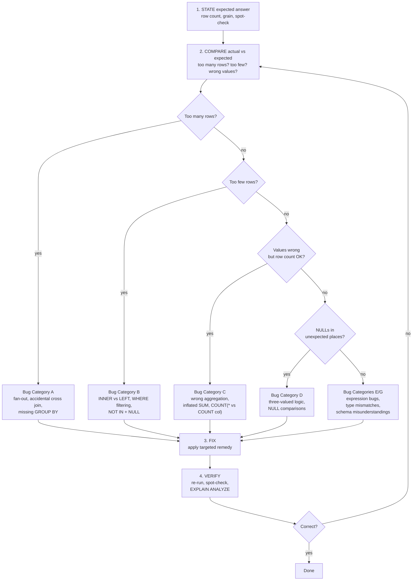
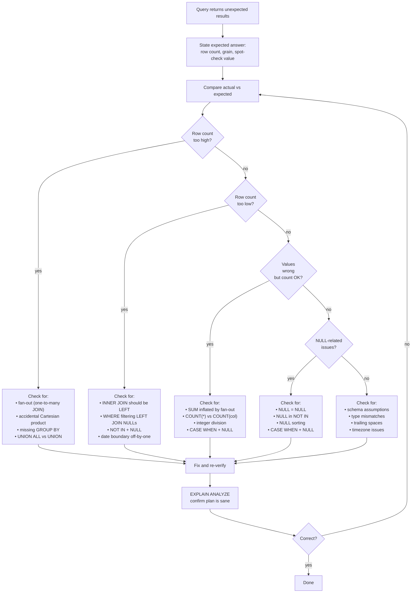

# 112. SQL Debugging Problems

> Category: 12-Interview-and-Scenarios
> Cross-references: [103-SQL-Problem-Solving-Framework], [09-NULL-Deep-Dive], [14-NOT-IN-NULL-Pitfalls], [56-Window-vs-GROUP-BY], [77-SARGability], [78-EXPLAIN-Execution-Plans], [82-Performance-Pitfalls]
- [The debugging mindset](#the-debugging-mindset)
- [A systematic debugging process](#a-systematic-debugging-process)
- [Sample tables](#sample-tables)
- [Bug Category A — Wrong row count (too many rows)](#bug-category-a--wrong-row-count-too-many-rows)
- [Bug Category B — Wrong row count (too few rows)](#bug-category-b--wrong-row-count-too-few-rows)
- [Bug Category C — Wrong aggregated values](#bug-category-c--wrong-aggregated-values)
- [Bug Category D — NULL surprises](#bug-category-d--null-surprises)
- [Bug Category E — Logic and expression bugs](#bug-category-e--logic-and-expression-bugs)
- [Bug Category F — Performance-related logical bugs](#bug-category-f--performance-related-logical-bugs)
- [Bug Category G — Schema and constraint misunderstandings](#bug-category-g--schema-and-constraint-misunderstandings)
- [The debug checklist](#the-debug-checklist)
- [Reading execution plans for debugging](#reading-execution-plans-for-debugging)
- [NULL behavior in debugging](#null-behavior-in-debugging)
- [Comparison tables](#comparison-tables)
- [Common mistakes](#common-mistakes)
- [Production pitfalls](#production-pitfalls)
- [Performance implications](#performance-implications)
- [Best practices](#best-practices)
- [Mermaid: the debugging decision flow](#mermaid-the-debugging-decision-flow)
- [Interview Questions](#interview-questions)

---

## What this section is

Most SQL handbook sections teach you **how to write correct queries**.
This section teaches you **how to find and fix queries that are wrong** — queries that run, return rows, produce no errors, and are silently incorrect.

SQL is uniquely dangerous because:

1. **The database never checks your intent.** A `SUM` that doubles every value returns successfully. A `LEFT JOIN` that quietly became an `INNER JOIN` returns successfully. A `NOT IN` that silently returns zero rows because of a single NULL returns successfully.
2. **Wrong answers look like right answers.** There is no red underline, no compiler warning, no type mismatch. The result set has the right number of columns, the right data types, and plausible-looking values — they are simply the wrong values.
3. **Production bugs are found by humans, not engines.** A dashboard that shows $2M revenue instead of $1M will not raise an alarm. Someone has to notice.

> **The central idea of this section:** every SQL debugging problem falls into one of a small number of categories. Once you can *classify* the bug, the fix is usually mechanical. The hard part is noticing that a bug exists at all.

This section does not replace [103-SQL-Problem-Solving-Framework] (which teaches you to write correct queries in the first place). It is the companion: what to do when you suspect — or have been told — that a query is wrong.

---

## The debugging mindset

Before touching the query, adopt three habits:

### 1. State the expected answer first

Before looking at the query's output, write down what you *expect* — the row count, a spot-check value, the grain. If you cannot state what "right" looks like, you cannot debug.

### 2. distrust "it returned rows"

Returning rows proves nothing. The query parsed, compiled, and executed. That is all. It does not prove the rows are correct.

### 3. Isolate the bug

Change one thing at a time. Remove joins, remove WHERE clauses, simplify aggregates — binary-search the query until the bug appears or disappears.

---

## A systematic debugging process



---

## Sample tables

Grain statements first. Every example in this section uses these tables.

- **departments** — _one row per department._
- **employees** — _one row per employee_, each belongs to one department.
- **customers** — _one row per customer._
- **orders** — _one row per order_ placed by a customer.
- **order_items** — _one row per line item_ within an order.
- **payments** — _one row per payment_ (an order can have multiple payments).
- **products** — _one row per product._

```sql
CREATE TABLE departments (
    dept_id   INT PRIMARY KEY,
    dept_name VARCHAR(50) NOT NULL
);

CREATE TABLE employees (
    employee_id  INT PRIMARY KEY,
    dept_id      INT REFERENCES departments(dept_id),
    employee_name VARCHAR(50) NOT NULL,
    salary       NUMERIC(10,2) NOT NULL,
    hired_date   DATE NOT NULL
);

CREATE TABLE customers (
    customer_id   INT PRIMARY KEY,
    customer_name VARCHAR(50) NOT NULL,
    region        VARCHAR(20)
);

CREATE TABLE orders (
    order_id    INT PRIMARY KEY,
    customer_id INT NOT NULL REFERENCES customers(customer_id),
    order_date  TIMESTAMP NOT NULL,
    total       NUMERIC(10,2) NOT NULL,
    status      VARCHAR(20) NOT NULL
);

CREATE TABLE order_items (
    item_id    INT PRIMARY KEY,
    order_id   INT NOT NULL REFERENCES orders(order_id),
    product_id INT NOT NULL,
    quantity   INT NOT NULL,
    unit_price NUMERIC(10,2) NOT NULL
);

CREATE TABLE payments (
    payment_id  INT PRIMARY KEY,
    order_id    INT NOT NULL REFERENCES orders(order_id),
    amount      NUMERIC(10,2) NOT NULL,
    paid_at     TIMESTAMP NOT NULL
);

CREATE TABLE products (
    product_id   INT PRIMARY KEY,
    product_name VARCHAR(50) NOT NULL,
    category     VARCHAR(30) NOT NULL
);
```

Sample data.

**departments**

| dept_id | dept_name   |
| ------- | ----------- |
| 1       | Engineering |
| 2       | Sales       |
| 3       | Marketing   |

**employees**

| employee_id | dept_id | employee_name | salary | hired_date |
| ----------- | ------- | ------------- | ------ | ---------- |
| 101         | 1       | Alice         | 9000   | 2020-01-10 |
| 102         | 1       | Bob           | 8000   | 2021-03-02 |
| 103         | 1       | Clara         | 8000   | 2022-07-15 |
| 104         | 2       | David         | 7000   | 2019-05-20 |
| 105         | 2       | Emma          | 6500   | 2023-02-01 |
| 106         | NULL    | Frank         | 5500   | 2024-01-15 |

> Note: Frank (106) has `dept_id = NULL`. This is not "department 0" or "missing department FK." It is the SQL NULL — no department assigned. This matters for debugging.

**customers**

| customer_id | customer_name | region  |
| ----------- | ------------- | ------- |
| 201         | Alpha Corp    | East    |
| 202         | Beta Inc      | West    |
| 203         | Gamma LLC     | East    |
| 204         | Delta Ltd     | NULL    |
| 205         | Epsilon Co    | West    |

> Delta Ltd (204) has `region = NULL`. Not "unknown region" stored as empty string — it is NULL.

**orders**

| order_id | customer_id | order_date          | total  | status    |
| -------- | ----------- | ------------------- | ------ | --------- |
| 1        | 201         | 2025-01-10 08:00:00 | 100.00 | completed |
| 2        | 201         | 2025-01-12 09:30:00 | 250.00 | completed |
| 3        | 202         | 2025-01-15 10:00:00 | 80.00  | pending   |
| 4        | 203         | 2025-01-20 11:15:00 | 400.00 | completed |
| 5        | 203         | 2025-02-01 14:00:00 | 120.00 | completed |
| 6        | 201         | 2025-02-10 16:00:00 | 300.00 | cancelled |
| 7        | 202         | 2025-02-15 09:00:00 | 60.00  | completed |

**order_items**

| item_id | order_id | product_id | quantity | unit_price |
| ------- | -------- | ---------- | -------- | ---------- |
| 11      | 1        | 901        | 2        | 25.00      |
| 12      | 1        | 902        | 1        | 50.00      |
| 13      | 2        | 901        | 5        | 50.00      |
| 14      | 3        | 903        | 4        | 20.00      |
| 15      | 4        | 904        | 1        | 400.00     |
| 16      | 5        | 901        | 3        | 40.00      |
| 17      | 6        | 902        | 6        | 50.00      |
| 18      | 7        | 903        | 2        | 30.00      |
| 19      | 7        | 901        | 1        | 60.00      |

**payments**

| payment_id | order_id | amount  | paid_at            |
| ---------- | -------- | ------- | ------------------ |
| 301        | 1        | 100.00  | 2025-01-10 08:05:00 |
| 302        | 2        | 250.00  | 2025-01-12 09:35:00 |
| 303        | 3        | 80.00   | 2025-01-15 10:02:00 |
| 304        | 4        | 200.00  | 2025-01-20 11:20:00 |
| 305        | 4        | 200.00  | 2025-01-22 09:00:00 |
| 306        | 5        | 120.00  | 2025-02-01 14:10:00 |
| 307        | 6        | 100.00  | 2025-02-10 16:20:00 |
| 308        | 6        | 200.00  | 2025-02-12 10:00:00 |
| 309        | 7        | 60.00   | 2025-02-15 09:05:00 |

Key facts:

- Department 3 (Marketing) has **no employees**.
- Customer 204 (Delta Ltd) and 205 (Epsilon Co) have **no orders**.
- Employee 106 (Frank) has `dept_id = NULL`.
- Customer 204 has `region = NULL`.
- Order 4 has **two payments** (304, 305). Order 6 has **two payments** (307, 308).
- Order 6 has `status = 'cancelled'`.

---

## Bug Category A — Wrong row count (too many rows)

The result has more rows than expected. This is the most common bug family.

---

### Bug A1 — Fan-out from a one-to-many JOIN

**Symptom:** row count is higher than the driving table's row count. Aggregate values (SUM, AVG) are inflated.

**Question:** Total revenue per customer.

**BAD approach:**

```sql
-- BUG: JOIN to order_items fans out orders before aggregation.
-- Each order appears once per line item. SUM(o.total) counts the
-- order total ONCE PER ITEM → inflated.
SELECT c.customer_id,
       c.customer_name,
       SUM(o.total) AS total_revenue
FROM   customers c
JOIN   orders o ON o.customer_id = c.customer_id
JOIN   order_items oi ON oi.order_id = o.order_id
GROUP  BY c.customer_id, c.customer_name;
```

Why this is wrong: Customer 201 (Alpha Corp) has order 1 (2 items) and order 2 (1 item). After joining order_items, order 1 appears twice and order 2 once. `SUM(o.total)` = 100 + 100 + 250 = 450. The correct answer is 100 + 250 = 350 (plus order 6 = 650 total, but order 6 is cancelled — more on that later).

**How to diagnose:**

```sql
-- Step 1: count rows BEFORE and AFTER the suspicious join
SELECT COUNT(*) FROM orders;                          -- 7
SELECT COUNT(*) FROM orders o
JOIN order_items oi ON oi.order_id = o.order_id;     -- 9 (fan-out occurred)
```

The row count increased from 7 to 9. That confirms the join created extra rows.

**BETTER approach — pre-aggregate the child side:**

```sql
SELECT c.customer_id,
       c.customer_name,
       COALESCE(SUM(o.total), 0) AS total_revenue
FROM   customers c
LEFT   JOIN orders o ON o.customer_id = c.customer_id
GROUP  BY c.customer_id, c.customer_name
ORDER  BY c.customer_id;
```

Or if you truly need line-item detail in the revenue:

```sql
SELECT c.customer_id,
       c.customer_name,
       SUM(oi.quantity * oi.unit_price) AS total_revenue
FROM   customers c
JOIN   orders o ON o.customer_id = c.customer_id
JOIN   order_items oi ON oi.order_id = o.order_id
GROUP  BY c.customer_id, c.customer_name;
```

Notice the second version aggregates from `order_items` (line-item revenue), not from `orders.total` (order-level total). These two numbers can differ — and confusing them is itself a bug.

> **Production pitfall:** a dashboard showing "revenue per customer" that joins through `order_items` and sums `orders.total` will show numbers that are consistently too high. No error. No alert. Just wrong revenue.

**Verification:** compare row counts across each join stage. `EXPLAIN ANALYZE` will show the estimated vs actual row counts at each node — a large mismatch signals the bug.

---

### Bug A2 — Accidental Cartesian product (missing join predicate)

**Symptom:** row count = N × M. Values are absurdly large.

**BAD approach:**

```sql
-- BUG: missing ON clause → every customer paired with every order
SELECT c.customer_name, o.order_id, o.total
FROM   customers c
JOIN   orders o;  -- no ON condition
```

Returns 5 × 7 = 35 rows. Every customer appears with every order.

**How to diagnose:**

```sql
-- Count the result, compare to expected
SELECT COUNT(*) FROM customers c JOIN orders o;  -- 35
-- Expected: at most 7 (one per order) or at most 5 (one per customer)
-- 35 = 5 × 7 → Cartesian product
```

**BETTER approach:**

```sql
SELECT c.customer_name, o.order_id, o.total
FROM   customers c
JOIN   orders o ON o.customer_id = c.customer_id;
```

> **Interview trap:** interviewers sometimes give you a query with a deliberately missing or wrong JOIN condition. The symptom is always the same: the row count is the product of the two table sizes, and the aggregates are wildly inflated. Always check: `SELECT COUNT(*) FROM ...` and compare to the expected number.

---

### Bug A3 — GROUP BY missing or incomplete

**Symptom:** `ONLY_FULL_GROUP_BY` error (MySQL with that mode enabled), or random non-aggregated values in the SELECT.

**BAD approach:**

```sql
-- BUG: SELECT contains columns not in GROUP BY and not aggregated
SELECT customer_id, customer_name, order_id, SUM(total)
FROM   customers c
JOIN   orders o ON o.customer_id = c.customer_id
GROUP  BY c.customer_id;
```

> **PostgreSQL:** this is an error — `order_id` must appear in GROUP BY or be aggregated.
> **MySQL (with ONLY_FULL_GROUP_BY disabled):** this runs but returns *indeterminate* values for `order_id` and `customer_name`. It picks one arbitrary row from each group. No error. No warning. Just wrong.
> **SQL Server:** this is an error in all modes.

**How to diagnose:**

If the query runs but `order_id` looks random or unexpected — check whether it is in the GROUP BY or inside an aggregate function.

**BETTER approach:**

```sql
-- If the output grain is per customer:
SELECT c.customer_id,
       c.customer_name,
       SUM(o.total) AS total_spent
FROM   customers c
JOIN   orders o ON o.customer_id = c.customer_id
GROUP  BY c.customer_id, c.customer_name;

-- If the output grain is per order:
SELECT c.customer_id,
       c.customer_name,
       o.order_id,
       o.total
FROM   customers c
JOIN   orders o ON o.customer_id = c.customer_id;
-- No GROUP BY needed — one row per order is the natural grain of the join.
```

> **Common misconception:** "GROUP BY just lets me use aggregate functions." GROUP BY defines the **output grain**. Every non-aggregated column in SELECT must appear in GROUP BY. The error or the silent wrong answer is the database telling you your grain is inconsistent.

---

### Bug A4 — DISTINCT masking a real problem

**Symptom:** the query uses DISTINCT but the developer is not sure why duplicates exist.

**BAD approach:**

```sql
-- "It works but I added DISTINCT to make it look right"
SELECT DISTINCT c.customer_name, o.total
FROM   customers c
JOIN   orders o ON o.customer_id = c.customer_id;
```

This returns unique (customer_name, total) pairs. But two orders by the same customer with the same total (e.g., two $100 orders) collapse into one row. The DISTINCT hides a real data relationship problem, and it hides a correctness bug.

**BETTER approach:**

First, find the source of duplicates:

```sql
-- Find which customer+order combos produce duplicates
SELECT c.customer_id, o.order_id, COUNT(*)
FROM   customers c
JOIN   orders o ON o.customer_id = c.customer_id
GROUP  BY c.customer_id, o.order_id
HAVING COUNT(*) > 1;
```

If no duplicates exist at the `(customer_id, order_id)` level, the issue is that a downstream join (e.g., to `order_items` or `payments`) fanned out the rows. Fix the join or pre-aggregate — do not mask with DISTINCT.

> **Common misconception — "DISTINCT fixes duplicates."** DISTINCT is a *symptom fix*, not a solution. It hides the root cause (wrong join, wrong grain, accidental cross join) and adds a sort/distinct operation that costs performance. Find the cause first. See [41-GROUP-BY-vs-DISTINCT].

---

### Bug A5 — UNION ALL when UNION was needed

**Symptom:** duplicate rows in a combined result from two queries.

**BAD approach:**

```sql
-- BUG: if the same order_id appears in both subqueries, it appears twice
SELECT order_id, total FROM orders WHERE status = 'completed'
UNION ALL
SELECT order_id, total FROM orders WHERE total > 200;
```

Order 4 (total 400, status completed) appears in both halves → two rows in the result.

**BETTER approach:**

```sql
-- Use UNION (with dedup) if you truly want unique rows
SELECT order_id, total FROM orders WHERE status = 'completed'
UNION
SELECT order_id, total FROM orders WHERE total > 200;
```

Or understand that UNION ALL is correct if you intentionally want both sets (e.g., "completed orders AND high-value orders, even if overlapping").

> **When to use which:**
> - `UNION ALL` — you want every row from both queries (faster, no dedup cost).
> - `UNION` — you want unique rows across both queries (slower, dedup cost).
> - If you use `UNION` and performance matters, ask whether the duplicates are expected. If they are, you may need a different query shape entirely.

---

## Bug Category B — Wrong row count (too few rows)

The result has fewer rows than expected.

---

### Bug B1 — INNER JOIN dropping non-matching rows

**Symptom:** expected rows are missing from the output.

**Question:** List all departments with their employee count.

**BAD approach:**

```sql
-- BUG: INNER JOIN drops departments with no employees
SELECT d.dept_name, COUNT(e.employee_id) AS headcount
FROM   departments d
JOIN   employees e ON e.dept_id = d.dept_id
GROUP  BY d.dept_name;
```

Marketing (dept_id 3) has no employees → INNER JOIN drops it → only 2 rows returned.

**BETTER approach:**

```sql
SELECT d.dept_name, COUNT(e.employee_id) AS headcount
FROM   departments d
LEFT   JOIN employees e ON e.dept_id = d.dept_id
GROUP  BY d.dept_name
ORDER  BY d.dept_name;
```

| dept_name   | headcount |
| ----------- | --------- |
| Engineering | 3         |
| Marketing   | 0         |
| Sales       | 2         |

> Key detail: `COUNT(e.employee_id)` counts non-NULL values of the right-side key. For Marketing, `e.employee_id` is NULL (the LEFT JOIN row has all right-side columns NULL), and COUNT(column) skips NULLs → 0. If you used `COUNT(*)` you would get 1 for Marketing (the single NULL-padded row). See [39-COUNT-NULL-Pitfalls].

---

### Bug B2 — WHERE filtering out LEFT JOIN results

**Symptom:** LEFT JOIN seems to work, but WHERE on the right table removes the NULL-padded rows.

**Question:** All customers and their total spend, even if they have not ordered.

**BAD approach:**

```sql
-- BUG: WHERE o.status = 'completed' filters out NULL-joined rows
SELECT c.customer_id,
       c.customer_name,
       COALESCE(SUM(o.total), 0) AS total_spend
FROM   customers c
LEFT   JOIN orders o ON o.customer_id = c.customer_id
WHERE  o.status = 'completed'
GROUP  BY c.customer_id, c.customer_name;
```

Customers 204 and 205 (no orders) → LEFT JOIN produces NULL-joined rows → `o.status = 'completed'` evaluates to UNKNOWN for those rows → WHERE drops them. The LEFT JOIN became an INNER JOIN.

Even customers *with* orders but no *completed* orders would be dropped.

**BETTER approach:**

```sql
-- Put the right-table filter in ON, not WHERE, for LEFT JOIN
SELECT c.customer_id,
       c.customer_name,
       COALESCE(SUM(o.total), 0) AS total_spend
FROM   customers c
LEFT   JOIN orders o ON o.customer_id = c.customer_id
                      AND o.status = 'completed'
GROUP  BY c.customer_id, c.customer_name
ORDER  BY c.customer_id;
```

Or filter in the aggregate:

```sql
SELECT c.customer_id,
       c.customer_name,
       COALESCE(SUM(CASE WHEN o.status = 'completed' THEN o.total END), 0) AS completed_spend
FROM   customers c
LEFT   JOIN orders o ON o.customer_id = c.customer_id
GROUP  BY c.customer_id, c.customer_name
ORDER  BY c.customer_id;
```

> **Interview trap:** "Why did my LEFT JOIN return fewer rows than expected?" The answer is almost always: a WHERE or ON predicate on the right table that filters out NULLs. See [20-JOIN-ON-vs-WHERE].

---

### Bug B3 — NOT IN with NULL subquery returns zero rows

**Symptom:** NOT IN returns no rows at all, even though you expect some.

**Question:** Employees not assigned to any order.

**BAD approach:**

```sql
-- BUG: if orders.customer_id (or the subquery column) can be NULL,
-- NOT IN evaluates to UNKNOWN for every row → zero results.
SELECT e.employee_id, e.employee_name
FROM   employees e
WHERE  e.employee_id NOT IN (SELECT customer_id FROM orders);
```

In our data this does not produce the bug because the subquery column does not contain NULLs. But the pattern is deadly when it does. A single NULL in the subquery kills the entire result. See [14-NOT-IN-NULL-Pitfalls].

**BETTER approach:**

```sql
SELECT e.employee_id, e.employee_name
FROM   employees e
WHERE  NOT EXISTS (
           SELECT 1
           FROM   orders o
           WHERE  o.customer_id = e.employee_id
       );
```

`NOT EXISTS` is a semi-join anti-pattern and is immune to NULLs in the subquery. See [23-Anti-Joins], [31-NOT-IN-vs-NOT-EXISTS].

---

### Bug B4 — Aggregate over empty set returns NULL, not 0

**Symptom:** a SUM or AVG returns NULL instead of a number.

**BAD approach:**

```sql
-- BUG: no matching rows → SUM returns NULL, not 0
SELECT d.dept_name,
       SUM(e.salary) AS total_salary
FROM   departments d
LEFT   JOIN employees e ON e.dept_id = d.dept_id
GROUP  BY d.dept_name;
```

Marketing has no employees → `SUM(e.salary)` = NULL, not 0.

**BETTER approach:**

```sql
SELECT d.dept_name,
       COALESCE(SUM(e.salary), 0) AS total_salary
FROM   departments d
LEFT   JOIN employees e ON e.dept_id = d.dept_id
GROUP  BY d.dept_name
ORDER  BY d.dept_name;
```

> **Why SUM returns NULL over zero rows, but COUNT returns 0:** `SUM()` of zero non-NULL values is NULL (there is nothing to sum). `COUNT(*)` of zero rows is 0 (it counts rows, not values). This is a fundamental difference in aggregate semantics. See [38-COUNT-SUM-AVG-MIN-MAX].

---

## Bug Category C — Wrong aggregated values

The row count may be correct, but the numbers are wrong.

---

### Bug C1 — Inflated SUM from fan-out before aggregation

This is the value-side counterpart to Bug A1. The JOIN fans out the table, and the aggregate sums the parent-side column once per child row.

**Question:** Total paid per order.

**BAD approach:**

```sql
-- BUG: order 4 has 2 payments. Joining payments fans order 4 to 2 rows.
-- GROUP BY with p.amount in GROUP BY splits into separate groups.
SELECT o.order_id,
       o.total,
       SUM(p.amount) AS paid,
       o.total - SUM(p.amount) AS outstanding
FROM   orders o
JOIN   payments p ON p.order_id = o.order_id
GROUP  BY o.order_id, o.total, p.amount;
```

For order 4: two rows in the result (one for each payment amount), not one consolidated row. The GROUP BY includes `p.amount`, so each distinct payment becomes its own group.

**BETTER approach:**

```sql
-- Pre-aggregate on the payments side
SELECT o.order_id,
       o.total,
       COALESCE(pay.total_paid, 0) AS total_paid,
       o.total - COALESCE(pay.total_paid, 0) AS outstanding
FROM   orders o
LEFT   JOIN (
           SELECT order_id, SUM(amount) AS total_paid
           FROM   payments
           GROUP  BY order_id
       ) pay ON pay.order_id = o.order_id
ORDER  BY o.order_id;
```

| order_id | total  | total_paid | outstanding |
| -------- | ------ | ---------- | ----------- |
| 1        | 100.00 | 100.00     | 0.00        |
| 2        | 250.00 | 250.00     | 0.00        |
| 3        | 80.00  | 80.00      | 0.00        |
| 4        | 400.00 | 400.00     | 0.00        |
| 5        | 120.00 | 120.00     | 0.00        |
| 6        | 300.00 | 300.00     | 0.00        |
| 7        | 60.00  | 60.00      | 0.00        |

---

### Bug C2 — COUNT(*) vs COUNT(column)

**Symptom:** counts do not match expectations after a LEFT JOIN.

**Question:** How many employees does each department have?

**BAD approach:**

```sql
-- BUG: COUNT(*) counts the NULL-padded row for Marketing → reports 1
SELECT d.dept_name, COUNT(*) AS headcount
FROM   departments d
LEFT   JOIN employees e ON e.dept_id = d.dept_id
GROUP  BY d.dept_name;
```

Result: Marketing shows 1 instead of 0.

**BETTER approach:**

```sql
-- COUNT(column) skips NULLs → Marketing shows 0
SELECT d.dept_name, COUNT(e.employee_id) AS headcount
FROM   departments d
LEFT   JOIN employees e ON e.dept_id = d.dept_id
GROUP  BY d.dept_name;
```

| Function       | What it counts                           | Over LEFT JOIN              |
| -------------- | ---------------------------------------- | --------------------------- |
| `COUNT(*)`     | all rows, including NULL-padded fillers  | counts the filler row → +1 |
| `COUNT(col)`   | non-NULL values of `col`                 | NULL filler → skipped → 0  |
| `COUNT(DISTINCT col)` | distinct non-NULL values of `col` | NULL filler → skipped      |

> See [39-COUNT-NULL-Pitfalls] for the deep dive.

---

### Bug C3 — Integer division truncating results

**Symptom:** percentage or ratio columns show 0 or wrong values.

**BAD approach:**

```sql
-- BUG: in MySQL and SQL Server, integer / integer = integer (truncated)
SELECT order_id,
       quantity,
       total,
       quantity / total AS ratio
FROM   orders o
JOIN   order_items oi ON oi.order_id = o.order_id;
```

In MySQL: `2 / 100` = 0 (integer division). The decimal part is silently dropped.

**BETTER approach:**

```sql
-- Cast at least one operand to a decimal/float type
SELECT order_id,
       quantity,
       total,
       quantity * 1.0 / total AS ratio  -- multiply by decimal to force float division
FROM   orders o
JOIN   order_items oi ON oi.order_id = o.order_id;

-- Or use CAST explicitly:
-- CAST(quantity AS DECIMAL(10,2)) / total
```

> **PostgreSQL:** this is not a problem — PostgreSQL automatically promotes integer division to numeric when the result would lose precision. But it is still best practice to be explicit.
>
> **SQL Server:** `quantity / total` with two INT columns returns INT. Use `CAST(quantity AS FLOAT) / total` or multiply by `1.0`.
>
> **Oracle:** `quantity / total` returns a float by default — no issue.

---

### Bug C4 — Wrong date truncation losing or duplicating rows

**Symptom:** daily aggregation shows unexpected counts, or rows appear on wrong dates.

**BAD approach:**

```sql
-- BUG: DATE(order_date) uses server-local timezone.
-- An order at 2025-01-20 23:30:00 UTC might become 2025-01-21 in UTC+8.
SELECT DATE(order_date) AS order_day, COUNT(*) AS num_orders
FROM   orders
GROUP  BY DATE(order_date);
```

**BETTER approach:**

```sql
-- Explicit timezone handling
-- PostgreSQL:
SELECT order_date AT TIME ZONE 'UTC' AT TIME ZONE 'America/New_York'::date AS order_day,
       COUNT(*) AS num_orders
FROM   orders
GROUP  BY (order_date AT TIME ZONE 'UTC' AT TIME ZONE 'America/New_York')::date;

-- Or simply document and enforce UTC, then truncate:
SELECT order_date::date AS order_day, COUNT(*) AS num_orders
FROM   orders
GROUP  BY order_date::date;
```

> **Production pitfall:** inconsistent timezone handling across microservices is one of the hardest production bugs to track down. One service stores UTC, another stores local time, a third stores UTC but applies the user's timezone at display time. When you aggregate across all three, rows land on wrong days and no one notices until the monthly report.

---

## Bug Category D — NULL surprises

NULL breaks assumptions in ways that are silent and non-obvious.

---

### Bug D1 — NULL = NULL evaluates to UNKNOWN, not TRUE

**Symptom:** rows that "should" match do not.

**BAD approach:**

```sql
-- BUG: NULL = NULL is UNKNOWN → row is excluded
SELECT *
FROM   employees e1
JOIN   employees e2 ON e1.dept_id = e2.dept_id;
```

Frank (106) has `dept_id = NULL`. In a self-join, `NULL = NULL` is UNKNOWN → Frank never matches anyone, not even himself. This is correct SQL behavior but often not what the developer intended.

**How to diagnose:**

```sql
-- Check for NULLs in the join column
SELECT COUNT(*) FROM employees WHERE dept_id IS NULL;
-- Result: 1 (Frank)
```

**BETTER approach — use IS DISTINCT FROM or COALESCE:**

```sql
-- PostgreSQL: IS DISTINCT FROM treats NULL = NULL as TRUE
SELECT *
FROM   employees e1
JOIN   employees e2 ON e1.dept_id IS NOT DISTINCT FROM e2.dept_id;

-- Portable: COALESCE to a sentinel value (only if NULL is not a valid FK)
SELECT *
FROM   employees e1
JOIN   employees e2 ON COALESCE(e1.dept_id, -1) = COALESCE(e2.dept_id, -1);
```

> **Database-specific:**
> - PostgreSQL: `IS DISTINCT FROM` / `IS NOT DISTINCT FROM` — the clean solution.
> - MySQL: ` <=> ` (NULL-safe equality operator): `e1.dept_id <=> e2.dept_id`.
> - SQL Server / Oracle: no direct equivalent; use `COALESCE` or explicit `IS NULL` handling.

---

### Bug D2 — NULL in NOT IN returning empty result

This is Bug B3 revisited from the NULL angle. See [14-NOT-IN-NULL-Pitfalls] for the full explanation.

```sql
-- A single NULL in the subquery kills NOT IN entirely
SELECT * FROM A WHERE id NOT IN (SELECT id FROM B);
-- If B contains one NULL row → zero results, no error
```

The fix: use `NOT EXISTS`.

---

### Bug D3 — NULL sorting incorrectly

**Symptom:** ORDER BY places NULLs in unexpected positions.

```sql
SELECT employee_name, dept_id
FROM   employees
ORDER  BY dept_id;
```

| employee_name | dept_id |
| ------------- | ------- |
| Frank         | NULL    |
| David         | 2       |
| Emma          | 2       |
| Alice         | 1       |
| Bob           | 1       |
| Clara         | 1       |

NULLs first or last depends on the engine:

| Engine       | ORDER BY col ASC | ORDER BY col DESC |
| ------------ | ---------------- | ----------------- |
| PostgreSQL   | NULL last        | NULL first        |
| MySQL        | NULL first       | NULL first        |
| SQL Server   | NULL first       | NULL first        |
| Oracle       | NULL last        | NULL first        |

> **Production pitfall:** a report that sorts employees by `dept_id` may show Frank at the top in MySQL and at the bottom in PostgreSQL — same query, different visual. Use `NULLS FIRST` or `NULLS LAST` explicitly for portable behavior. PostgreSQL supports this directly; SQL Server requires `CASE WHEN col IS NULL THEN 1 ELSE 0 END` tricks.

---

### Bug D4 — CASE WHEN with NULLs

**Symptom:** CASE expressions do not catch NULL values.

**BAD approach:**

```sql
-- BUG: region = 'East' is UNKNOWN for NULL → falls through to ELSE
-- But what if there is no ELSE?
SELECT customer_name,
       CASE WHEN region = 'East' THEN 'East Coast'
            WHEN region = 'West' THEN 'West Coast'
       END AS location
FROM   customers;
```

Delta Ltd (region = NULL) → neither WHEN is TRUE → result is NULL (implicit ELSE NULL). This may be correct, but if you expected "Unknown" you are wrong.

**BETTER approach:**

```sql
SELECT customer_name,
       CASE WHEN region = 'East'  THEN 'East Coast'
            WHEN region = 'West'  THEN 'West Coast'
            WHEN region IS NULL   THEN 'Unknown'
            ELSE 'Other'
       END AS location
FROM   customers;
```

> **Common misconception:** `CASE WHEN region = 'Unknown' ...` does NOT catch NULLs. NULL is not a value; it is the absence of a value. `'Unknown'` and NULL are completely different things.

---

## Bug Category E — Logic and expression bugs

---

### Bug E1 — WHERE condition on the wrong side of a date boundary

**Symptom:** results include or exclude rows on the wrong side of a date cutoff.

**BAD approach:**

```sql
-- BUG: >= with a date truncates the timestamp to midnight.
-- Orders at 2025-01-20 11:15:00 are AFTER midnight of Jan 20,
-- so they ARE included, but the upper bound is also inclusive
-- which may double-count boundary-day rows in overlapping queries.
SELECT COUNT(*) AS orders
FROM   orders
WHERE  order_date >= '2025-01-20'
  AND  order_date <= '2025-01-20';
```

This returns orders where `order_date` falls on Jan 20 — but `>=` and `<=` are inclusive on both sides. If you later change to "last 30 days" and use `<=`, the boundary day is counted in both windows.

**BETTER approach — use half-open intervals:**

```sql
-- [start, end) — include start, exclude end
SELECT COUNT(*) AS orders
FROM   orders
WHERE  order_date >= '2025-01-20'
  AND  order_date <  '2025-01-21';

-- For "last 30 days":
SELECT COUNT(*) AS orders
FROM   orders
WHERE  order_date >= '2025-01-20'::timestamp - INTERVAL '30 days'
  AND  order_date <  '2025-01-20'::timestamp;
```

Half-open intervals `[start, end)` are the gold standard for timestamp ranges because:
- No double-counting at boundaries.
- No gaps between consecutive windows.
- `DATE` vs `TIMESTAMP` mismatch is less likely to cause issues.

---

### Bug E2 — Comparing floating-point values with = 

**Symptom:** rows that "should" match do not, or joins fail on decimal columns.

```sql
-- BUG: floating-point representation error
-- 0.1 + 0.2 = 0.30000000000000004 in IEEE 754
SELECT 0.1 + 0.2 = 0.3;  -- FALSE in many engines
```

**BETTER approach — use DECIMAL/NUMERIC types for money:**

```sql
-- Use NUMERIC (exact precision) for financial data
SELECT CAST(0.1 AS NUMERIC(10,2)) + CAST(0.2 AS NUMERIC(10,2)) = CAST(0.3 AS NUMERIC(10,2));
-- TRUE
```

Our schema correctly uses `NUMERIC(10,2)` for all monetary columns. But if someone imports data as `FLOAT` or `DOUBLE`, comparisons silently fail.

> **Production pitfall:** floating-point in financial data is one of the oldest bugs in computing. Always use DECIMAL/NUMERIC/MONEY for currency. Never use FLOAT or DOUBLE for money.

---

### Bug E3 — Off-by-one in LIMIT/OFFSET

**Symptom:** pagination skips a row or shows a duplicate.

**BAD approach:**

```sql
-- Page 1 (rows 1-3)
SELECT * FROM orders ORDER BY order_id LIMIT 3 OFFSET 0;
-- Page 2 (rows 4-6)
SELECT * FROM orders ORDER BY order_id LIMIT 3 OFFSET 3;
-- Page 3 (rows 7-9)
SELECT * FROM orders ORDER BY order_id LIMIT 3 OFFSET 6;
```

If a row is inserted between page 2 and page 3, the offset shifts: row 7 on page 2 becomes row 8 after the insert, and OFFSET 6 on page 3 picks up what was row 7 on page 2 — a duplicate.

**BETTER approach — keyset pagination:**

```sql
-- Page 1
SELECT * FROM orders ORDER BY order_id LIMIT 3;

-- Page 2: pass the last seen order_id (3)
SELECT * FROM orders
WHERE  order_id > 3
ORDER  BY order_id
LIMIT  3;
```

Keyset pagination is immune to mid-flight inserts because it uses a WHERE condition, not an offset. See [84-Pagination-and-Keyset-Pagination].

> **Interview trap:** "Fetch page N of results" — always ask whether OFFSET or keyset is acceptable. OFFSET is fine for small datasets and admin panels. Keyset is required for large, live datasets.

---

### Bug E4 — Using OR instead of UNION in complex filters

**Symptom:** query is slow or produces unexpected results because OR prevents index usage.

**BAD approach:**

```sql
-- OR may prevent index use; also, semantically complex
SELECT *
FROM   orders
WHERE  customer_id = 201 OR total > 200;
```

This works correctly, but on large tables the optimizer may not use an index efficiently for OR.

**BETTER approach — UNION ALL when appropriate:**

```sql
SELECT * FROM orders WHERE customer_id = 201
UNION ALL
SELECT * FROM orders WHERE total > 200
  AND customer_id <> 201;  -- avoid duplicates
```

Whether this is faster depends on the optimizer, indexes, statistics, and data distribution. Verify with EXPLAIN. See [65-UNION-UNION-ALL], [82-Performance-Pitfalls].

---

## Bug Category F — Performance-related logical bugs

These are bugs where the query is *correct* but the performance problem reveals a logical design issue.

---

### Bug F1 — Deep OFFSET pagination degrading over time

```sql
-- This gets slower as page number increases
SELECT * FROM orders ORDER BY order_id LIMIT 20 OFFSET 100000;
```

The database scans and discards 100,000 rows before returning 20. Each successive page is slower than the last.

**Fix:** keyset pagination (see Bug E3).

**How to diagnose:** `EXPLAIN ANALYZE` shows a high "actual time" and the plan likely shows a scan of many rows with only a few returned.

---

### Bug F2 — Correlated subquery executed per row

```sql
-- This recomputes the subquery for EVERY row in employees
SELECT e.employee_id,
       e.salary,
       (SELECT AVG(salary) FROM employees x WHERE x.dept_id = e.dept_id) AS dept_avg
FROM   employees e;
```

For 3 million employees, the subquery runs 3 million times. The optimizer *may* rewrite this as a join, but not always.

**Fix:** window function (one scan):

```sql
SELECT employee_id, salary,
       AVG(salary) OVER (PARTITION BY dept_id) AS dept_avg
FROM   employees;
```

> **Performance note:** whether the correlated subquery or the window function is faster depends on the optimizer, indexes, statistics, and data distribution. A window with a sort is usually a clean plan, but verify with EXPLAIN. Do not claim it is always faster.

---

### Bug F3 — SELECT * pulling unnecessary columns

```sql
-- BUG: pulling all columns when you only need 2
SELECT * FROM orders WHERE customer_id = 201;
```

On a table with 50 columns and BLOB/TEXT fields, this transfers far more data than needed.

**Fix:**

```sql
SELECT order_id, total FROM orders WHERE customer_id = 201;
```

Combined with a covering index on `(customer_id, order_id, total)`, the query can be answered entirely from the index without touching the table. See [74-Covering-Indexes].

---

### Bug F4 — Non-SARGable WHERE preventing index use

**Symptom:** query is slow, EXPLAIN shows a full table scan even though an index exists on the filtered column.

**BAD approach:**

```sql
-- BUG: function on the indexed column prevents index use
SELECT * FROM orders WHERE EXTRACT(YEAR FROM order_date) = 2025;
SELECT * FROM orders WHERE LOWER(customer_name) = 'alpha corp';
SELECT * FROM orders WHERE total + 10 > 200;
```

In each case, the database must evaluate the function for every row before filtering — the index cannot be used for the lookup.

**BETTER approach — make the predicate SARGable:**

```sql
-- Range scan on the indexed column
SELECT * FROM orders
WHERE  order_date >= '2025-01-01'
  AND  order_date <  '2026-01-01';

-- Functional index (PostgreSQL, MySQL 8+):
CREATE INDEX idx_orders_lower_cust ON orders (LOWER(customer_name));

-- Rewrite the expression:
SELECT * FROM orders WHERE total > 190;
```

See [77-SARGability] for the deep dive.

---

## Bug Category G — Schema and constraint misunderstandings

---

### Bug G1 — Assuming a UNIQUE constraint that does not exist

**Symptom:** unexpected duplicates in a JOIN.

```sql
-- Developer assumes order_items.order_id is unique (one item per order)
-- but it is not — order 1 has two items (11, 12)
SELECT o.order_id, oi.item_id
FROM   orders o
JOIN   order_items oi ON oi.order_id = o.order_id
WHERE  o.order_id = 1;
```

Returns 2 rows, not 1. The developer expected 1.

**Fix:** always check the schema and grain before assuming cardinality:

```sql
-- Verify: are there duplicates?
SELECT order_id, COUNT(*)
FROM   order_items
GROUP  BY order_id
HAVING COUNT(*) > 1;
```

---

### Bug G2 — Foreign key does not guarantee a matching row

**Symptom:** LEFT JOIN returns NULLs where you expected values.

```sql
-- orders.customer_id is NOT NULL, but what if a row references
-- a customer_id that no longer exists (deleted without cascade)?
-- FK constraints prevent this, but if the FK was added after
-- data was loaded, orphan rows may exist.
SELECT o.order_id, c.customer_name
FROM   orders o
LEFT   JOIN customers c ON c.customer_id = o.customer_id
WHERE  c.customer_id IS NULL;
```

If orphan rows exist, this returns orders with `customer_name = NULL`.

**Fix:** audit foreign key integrity:

```sql
-- Find orphan rows
SELECT o.order_id, o.customer_id
FROM   orders o
LEFT   JOIN customers c ON c.customer_id = o.customer_id
WHERE  c.customer_id IS NULL;
```

> **Production pitfall:** if FK constraints are not enforced (e.g., bulk loading with constraints disabled), orphan rows accumulate silently. Periodic integrity checks are essential.

---

### Bug G3 — VARCHAR comparison with trailing spaces

**Symptom:** string comparisons fail unexpectedly.

```sql
-- In some engines, 'abc' = 'abc   ' is TRUE (trailing space padding)
-- In others, it is FALSE
SELECT CASE WHEN 'abc' = 'abc   ' THEN 'match' ELSE 'no match' END;
```

| Engine       | Behavior                                      |
| ------------ | --------------------------------------------- |
| MySQL        | TRUE (trailing space padding for CHAR, not VARCHAR) |
| PostgreSQL   | FALSE (exact comparison for VARCHAR)          |
| SQL Server   | TRUE (pad char semantics in some collations)  |
| Oracle       | FALSE (exact comparison)                      |

> **Production pitfall:** data imported from fixed-width files often has trailing spaces. If one service trims and another does not, JOINs on string keys silently drop rows.

---

## The debug checklist

When a query is returning unexpected results, work through this checklist in order:

| Step | Check                                               | Tool                      |
| ---- | --------------------------------------------------- | ------------------------- |
| 1    | State the expected row count and a spot-check value | mental / documentation    |
| 2    | Compare actual row count to expected                | `SELECT COUNT(*)`         |
| 3    | If too many rows → check for fan-out or cross join  | inspect JOINs             |
| 4    | If too few rows → check for INNER vs LEFT, WHERE, NOT IN + NULL | inspect JOINs and WHERE |
| 5    | If values wrong → check aggregation grain and column references | inspect GROUP BY, SELECT |
| 6    | Check for NULLs in join columns and filter columns | `IS NULL` / `IS NOT NULL` queries |
| 7    | Run the query without each JOIN / WHERE clause one at a time | binary search             |
| 8    | Check GROUP BY matches all non-aggregated SELECT columns | query structure           |
| 9    | Verify date boundaries and timezone handling        | explicit intervals        |
| 10   | Run `EXPLAIN ANALYZE` and compare estimated vs actual rows | execution plan           |

---

## Reading execution plans for debugging

The execution plan is the most powerful debugging tool in SQL. It tells you what the database *actually did*, not what you *told* it to do.

```sql
-- PostgreSQL
EXPLAIN ANALYZE SELECT ...;

-- MySQL
EXPLAIN ANALYZE SELECT ...;

-- SQL Server
SET STATISTICS IO ON;
SET STATISTICS TIME ON;
SELECT ...;

-- Oracle
EXPLAIN PLAN FOR SELECT ...;
SELECT * FROM TABLE(DBMS_XPLAN.DISPLAY);
```

**Key plan nodes to watch for when debugging:**

| Plan node              | What it means                     | When it signals a bug              |
| ---------------------- | --------------------------------- | ---------------------------------- |
| Seq Scan               | full table scan                   | unexpected if index exists         |
| Index Scan             | using an index                    | usually good                       |
| Hash Join              | building hash table for join      | verify join keys are correct       |
| Nested Loop            | row-by-row lookup                 | check for N+1 patterns             |
| Merge Join              | both inputs sorted                | verify sort keys match join keys   |
| Sort                   | sorting rows                      | check if avoidable via index       |
| Filter                 | post-join filtering               | check if it should be in WHERE     |
| Rows Estimated vs Actual | huge mismatch                     | stale statistics or bad cardinality|

**The single most useful line in any plan:** the estimated vs actual row count at each node. If the optimizer estimated 10 rows but 1,000,000 appeared, the statistics are stale or the query shape confused the optimizer.

See [78-EXPLAIN-Execution-Plans], [79-Cardinality-and-Statistics].

---

## NULL behavior in debugging

NULL is the single largest source of "it runs but is wrong" bugs. A summary of NULL traps in the debugging context:

| Scenario | What happens | Debugging signal | Fix |
| -------- | ------------ | ---------------- | --- |
| `NULL = NULL` | UNKNOWN → row excluded | rows missing from JOIN | `IS NOT DISTINCT FROM`, `COALESCE` |
| `NULL <> value` | UNKNOWN → row excluded | filtered rows reappear when NULL check added | explicit `IS NULL` |
| `NOT IN` with NULL subquery | entire result is empty | zero rows returned | use `NOT EXISTS` |
| `COUNT(*)` over LEFT JOIN | counts NULL-padded filler row | count is +1 more than expected | `COUNT(right.key)` |
| `SUM` over zero non-NULL values | returns NULL, not 0 | display shows blank instead of 0 | `COALESCE(SUM(...), 0)` |
| `CASE WHEN col = X` | NULL does not match | NULL rows fall through to ELSE/NULL | add `WHEN col IS NULL` |
| NULL in GROUP BY | all NULLs grouped together | unexpected single group | `COALESCE(col, 'Unknown')` |
| NULL in ORDER BY | position depends on engine | inconsistent sorting across environments | `NULLS FIRST` / `NULLS LAST` |

---

## Comparison tables

### Debugging symptom → likely cause

| Symptom | Most likely cause | Check first |
| ------- | ----------------- | ----------- |
| Row count too high | Fan-out from one-to-many JOIN | inspect JOIN cardinalities |
| Row count = N × M | Cartesian product | missing JOIN predicate |
| Row count too low | INNER JOIN dropped non-matching rows | LEFT vs INNER, WHERE on right table |
| NOT IN returns zero rows | NULL in subquery | `IS NULL` check on subquery column |
| SUM is too high | fan-out inflated the sum before aggregation | pre-aggregate child side |
| SUM shows NULL | zero matching rows | `COALESCE` |
| COUNT(*) is +1 over LEFT JOIN | COUNT(*) counts filler row | switch to `COUNT(column)` |
| LEFT JOIN results missing | WHERE on right table filtered NULLs | move predicate to ON |
| Query is slow but correct | non-SARGable WHERE, deep OFFSET, correlated subquery | EXPLAIN ANALYZE |
| String comparison fails | trailing spaces or case sensitivity | `TRIM()`, collation settings |
| Date rows on wrong day | timezone handling | explicit `AT TIME ZONE`, UTC storage |

### Aggregate behavior with NULL and zero rows

| Scenario | `COUNT(*)` | `COUNT(col)` | `SUM(col)` | `AVG(col)` |
| -------- | ---------- | ------------ | ---------- | ---------- |
| 10 rows, no NULLs in col | 10 | 10 | sum of values | average of values |
| 10 rows, 3 NULLs in col | 10 | 7 | sum of 7 values | average of 7 values |
| 0 rows (empty set) | 0 | 0 | NULL | NULL |
| 1 row, col is NULL | 1 | 0 | NULL | NULL |

> Key insight: `COUNT(*)` counts rows. `COUNT(col)` counts non-NULL values. `SUM` and `AVG` skip NULLs entirely and return NULL for zero inputs.

---

## Common mistakes

| Mistake | Why it is wrong | Fix |
| ------- | --------------- | --- |
| Adding `DISTINCT` to fix duplicates | masks the real problem (wrong join or grain) | find the source of duplicates |
| Using `COUNT(*)` over LEFT JOIN to count matches | counts the NULL filler row | `COUNT(right_table.key)` |
| `NOT IN (SELECT ...)` without checking for NULLs | zero rows if subquery has any NULL | `NOT EXISTS` |
| Putting GROUP BY filter in WHERE | filters rows before aggregation, not groups | use HAVING |
| Putting row-level filter in HAVING | works but may be slower | use WHERE for row-level predicates |
| `SUM(parent.total)` after joining child table | fan-out inflates the sum | pre-aggregate the child or use a subquery |
| Comparing TIMESTAMP to DATE without explicit boundary | implicit cast truncates time portion | explicit half-open interval |
| Using `OR` in WHERE on large tables | may prevent index use | consider UNION ALL with non-overlapping predicates |
| Ignoring timezone in date aggregation | rows land on wrong day | store UTC, convert at display |
| `FLOAT`/`DOUBLE` for money | IEEE 754 rounding errors | `NUMERIC`/`DECIMAL` |

---

## Production pitfalls

### Pitfall 1 — "It ran without errors, so it must be correct"

The database is an execution engine, not a correctness checker. It will run any syntactically valid query, including ones that return wildly wrong results.

**Defense:** mandatory spot-checks in code review, automated row-count bounds in tests, EXPLAIN ANALYZE in CI.

### Pitfall 2 — Debugging by staring at the query

Reading the query 100 times will not find a logic bug. The bug is in the *interaction* between the query and the data.

**Defense:** run the query. Inspect the actual output. Compare to expected. Use EXPLAIN. Change one thing at a time.

### Pitfall 3 — Fixing one bug reveals another

Fan-out fixed, but now the date filter is wrong. Date filter fixed, but the NULL handling is broken.

**Defense:** after each fix, re-run the full verification checklist. Do not assume fixing one symptom fixes all symptoms.

### Pitfall 4 — Trusting the ORM

ORMs generate SQL. The SQL may be correct, or it may contain any of the bugs in this section. ORMs do not protect you from fan-out, NULL logic, or wrong aggregation.

**Defense:** log the generated SQL. Run it in a SQL client. EXPLAIN it. ORMs are productivity tools, not correctness guarantees.

### Pitfall 5 — Debugging in production

Running exploratory queries against a production database can cause locks, performance degradation, or data changes if you accidentally use UPDATE/DELETE.

**Defense:** always debug in a staging environment or a read replica. If you must query production, use `EXPLAIN` (read-only) before running the actual query.

---

## Performance implications

This section focuses on *correctness*, but several debugging steps have performance relevance:

| Debugging step | Performance cost | Notes |
| -------------- | ---------------- | ----- |
| `SELECT COUNT(*)` on a large table | can be slow without an index | use approximate counts for rough checks |
| `EXPLAIN ANALYZE` | runs the query (PostgreSQL) | safe; but for INSERT/UPDATE/DELETE in some engines, it executes the DML |
| Adding DISTINCT to "fix" duplicates | sort + dedup cost | find the root cause instead |
| Correlated subquery in SELECT | may execute per row | consider window function or JOIN |
| Deep OFFSET pagination | O(offset) per page | use keyset pagination |
| Full table scan for debugging | slow on large tables | run on staging or with LIMIT |

> **Performance is not a debugging concern until it is.** First make the query correct. Then make it fast. A fast wrong query is worse than a slow right one.

---

## Best practices

1. **State the expected answer before running the query.** If you cannot describe what "right" looks like, you cannot debug.

2. **Count rows at each join stage.** `SELECT COUNT(*)` before and after each JOIN isolates where fan-out occurs.

3. **Spot-check one known group.** Pick a customer, an order, a department whose answer you can compute by hand. Verify the query matches.

4. **Use half-open intervals for timestamp ranges.** `[start, end)` — no gaps, no double-counting.

5. **Default to `NOT EXISTS` over `NOT IN`** for anti-joins. It is immune to NULLs.

6. **Pre-aggregate child tables** before joining to parent tables when you need per-parent aggregates.

7. **Never use `DISTINCT` without understanding why duplicates exist.** It is a band-aid, not a cure.

8. **Store monetary values in `NUMERIC`/`DECIMAL`**, never `FLOAT` or `DOUBLE`.

9. **Store timestamps in UTC** and convert to local time at display.

10. **Run `EXPLAIN ANALYZE`** for any non-trivial query. Compare estimated vs actual row counts. The gap tells you where the optimizer's assumptions are wrong.

11. **Log the SQL your ORM generates.** Review it. EXPLAIN it. ORMs are not immune to the bugs in this section.

12. **Test with NULLs in your data.** Most of the bugs in this section are invisible when NULLs are absent.

---

## Mermaid: the debugging decision flow



---

# Interview Questions

## Beginner

1. What is the difference between `COUNT(*)` and `COUNT(column_name)`? Give an example where they return different results.

2. Why does `LEFT JOIN` with `WHERE right_table.column IS NOT NULL` behave the same as `INNER JOIN`?

3. You run `SELECT * FROM A WHERE id NOT IN (SELECT id FROM B)` and get zero rows. The subquery has 1,000 rows. What is the first thing you check?

4. What is the grain of an `order_items` table? Why does it matter when joining to `orders`?

5. Write a query that counts employees per department, including departments with zero employees. Explain why `COUNT(*)` gives the wrong answer here.

## Intermediate

6. A query joining `orders` to `order_items` and summing `orders.total` returns numbers that are too high. Diagnose the bug and fix it.

7. You need to show every customer's total spend, even if they have never placed an order. Your LEFT JOIN is missing some customers. What went wrong?

8. Explain the difference between `WHERE` and `HAVING`. Give an example where putting a condition in the wrong one produces a wrong answer.

9. A daily revenue report shows some days missing. How do you fix it? Which database-specific functions help?

10. You are debugging a query that returns 35 rows but you expected at most 7. What is the most likely cause?

## Advanced

11. Explain three-valued logic. Why does `NULL = NULL` evaluate to UNKNOWN? What are the implications for JOINs, WHERE clauses, and IN/NOT IN?

12. A correlated subquery computes department averages. Rewrite it using a window function. Under what conditions might the correlated subquery be preferable?

13. How does keyset pagination differ from OFFSET pagination? Explain the performance and correctness trade-offs.

14. You discover that a production query uses `FLOAT` for monetary values. What bugs can this cause? How do you fix it without losing data?

15. A query uses `NOT IN (SELECT id FROM t WHERE active = true)` and returns zero rows. The subquery returns 500 active IDs and 1 inactive ID with `active = NULL`. Explain why.

## Scenario Based

16. **The Double-Counted Revenue.** Your dashboard shows $1,300 total revenue for Alpha Corp. The correct answer is $650. The query joins `customers → orders → order_items` and sums `orders.total`. Walk through the debugging process step by step.

17. **The Disappearing Department.** Marketing has no employees. Your "employees per department" query shows only Engineering and Sales. What is wrong, and what is the fix?

18. **The Phantom NULL.** A LEFT JOIN to `payments` shows some orders with `total_paid = NULL` even though the order has payments. Diagnose.

19. **The Wrong Day.** A daily aggregation report shows orders on January 20 appearing on January 21. What are the possible causes?

20. **The Silent Truncation.** A percentage column shows `0` for all rows. The correct values are between 0.01 and 0.99. What went wrong?

## Tricky

21. You write `SELECT DISTINCT region FROM customers`. It returns 3 rows. But there are 5 customers. Explain why DISTINCT is not wrong here but also not telling the full story.

22. A query uses `WHERE created_at >= '2025-01-01' AND created_at <= '2025-01-31'`. Orders created on January 31 at 23:59:59 are included, but orders on February 1 at 00:00:00 are not. Is this correct? What if the requirement was "all of January"?

23. `CASE WHEN region = 'East' THEN 'Coastal' WHEN region = 'West' THEN 'Coastal' ELSE 'Inland' END` returns `Inland` for Delta Ltd (region = NULL). Is this correct?

24. A self-join on `employees.dept_id` does not pair Frank (dept_id = NULL) with anyone. Is this a bug?

25. You replace `NOT IN` with `NOT EXISTS` and the query now returns rows. Was the original query wrong?

## Output Prediction

Given the sample tables in this section, predict the output (row count, specific values) of each query:

26.
```sql
SELECT d.dept_name, COUNT(*) AS headcount
FROM   departments d
LEFT   JOIN employees e ON e.dept_id = d.dept_id
GROUP  BY d.dept_name;
```

27.
```sql
SELECT c.customer_name, o.order_id
FROM   customers c
LEFT   JOIN orders o ON o.customer_id = c.customer_id
WHERE  o.total > 100;
```

28.
```sql
SELECT c.customer_name, COUNT(o.order_id) AS order_count
FROM   customers c
LEFT   JOIN orders o ON o.customer_id = c.customer_id
GROUP  BY c.customer_name
HAVING COUNT(o.order_id) = 0;
```

29.
```sql
SELECT employee_name, salary,
       salary - AVG(salary) OVER (PARTITION BY dept_id) AS gap
FROM   employees;
```

30.
```sql
SELECT customer_id, SUM(total) AS total_spent
FROM   orders
WHERE  status <> 'cancelled'
GROUP  BY customer_id
ORDER  BY total_spent DESC;
```

## Debugging

For each of the following, identify the bug and provide the corrected query:

31.
```sql
SELECT c.customer_name, SUM(o.total) AS revenue
FROM   customers c
JOIN   orders o ON o.customer_id = c.customer_id
JOIN   payments p ON p.order_id = o.order_id
GROUP  BY c.customer_name;
```

32.
```sql
SELECT d.dept_name, AVG(e.salary) AS avg_salary
FROM   departments d
JOIN   employees e ON e.dept_id = d.dept_id
WHERE  e.salary > 5000
GROUP  BY d.dept_name
HAVING COUNT(e.employee_id) > 1;
```

33.
```sql
SELECT order_id, SUM(amount) AS total_paid,
       total - SUM(amount) AS outstanding
FROM   orders
JOIN   payments USING (order_id)
GROUP  BY order_id, total;
```

34.
```sql
SELECT employee_name, dept_id
FROM   employees
WHERE  dept_id NOT IN (SELECT dept_id FROM departments);
```

35.
```sql
SELECT c.customer_name, o.total
FROM   customers c
LEFT   JOIN orders o ON o.customer_id = c.customer_id
WHERE  o.order_date >= '2025-01-01'
ORDER  BY o.total DESC;
```

## Performance

36. You have a table with 10 million rows and an index on `created_at`. This query is slow:

```sql
SELECT * FROM events WHERE EXTRACT(YEAR FROM created_at) = 2025;
```

Explain why and provide a SARGable rewrite.

37. A pagination query uses `OFFSET 500000 LIMIT 20`. It takes 3 seconds. The same query with `OFFSET 0 LIMIT 20` takes 5ms. Explain the cause and provide an alternative.

38. A query joins three tables (A → B → C) and the execution plan shows a nested loop with the estimated row count off by 100x at the B→C join. What does this tell you?

39. You add an index on `orders.customer_id` but the query does not get faster. EXPLAIN shows the index is not used. List three possible reasons.

40. A dashboard query runs `SELECT COUNT(*) FROM large_table` every time a page loads. It takes 200ms. Suggest three optimization approaches.
